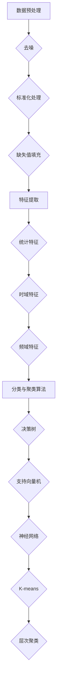
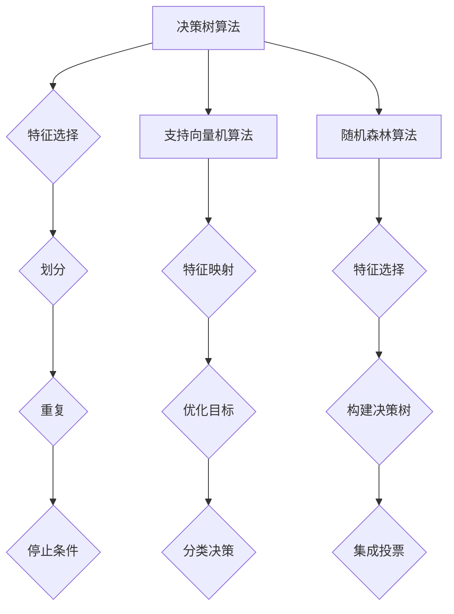
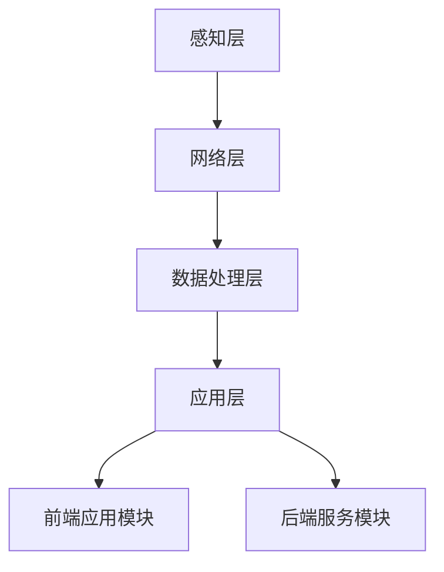
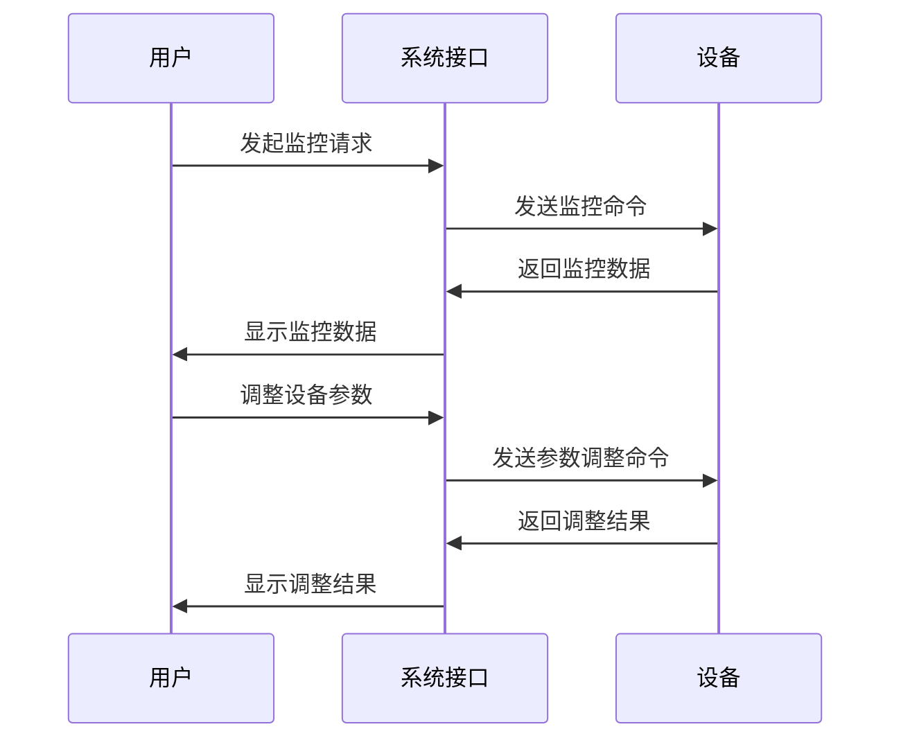

                 

### 引言

在科技迅猛发展的今天，人工智能（AI）已经深刻地改变了我们的生活。尤其在医疗领域，AI技术的应用正在逐步渗透到各个方面，从疾病诊断到手术指导，再到患者护理管理，AI技术正展现出其强大的潜力和价值。今天，我们将探讨一个备受关注的话题——AI Agent在智能医疗设备管理中的角色。

#### 问题的提出

智能医疗设备的管理一直是一个复杂而关键的任务。这些设备通常涉及大量的数据收集、实时监控、远程维护和智能决策支持。传统的设备管理方法往往依赖于人工干预，这不仅效率低下，而且容易出错。随着AI技术的发展，尤其是AI Agent的应用，我们开始有机会以更智能、更高效的方式来管理这些设备。因此，本文将探讨AI Agent在智能医疗设备管理中的具体应用和优势。

#### 背景介绍

智能医疗设备，如智能监护仪、智能诊断设备和智能手术设备，在医疗场景中发挥着越来越重要的作用。这些设备能够实时监测患者的生命体征，快速准确地诊断疾病，甚至在手术过程中提供辅助。然而，这些设备的运行效率和效果往往受到管理水平的限制。如何实现对这些设备的智能管理，提高其运行效率，成为了一个亟待解决的问题。

#### 问题描述

传统的医疗设备管理主要依赖于人工，存在以下问题：

1. **效率低下**：管理人员需要花费大量时间进行设备状态检查和维护。
2. **准确性不高**：人工检查容易产生误判，影响设备的使用效果。
3. **难以实时监控**：由于地理位置和通信限制，无法实现实时监控和远程维护。
4. **无法提供智能决策支持**：设备运行中遇到问题时，无法自动给出合理的解决方案。

为了解决这些问题，我们需要一种新的管理方法，能够实现自动化、实时性和智能化的设备管理。AI Agent作为一种新兴的技术，正好具备了这些特性。

#### 解决方案探讨

AI Agent，即人工智能代理，是一种能够模拟人类思维和行为的计算机程序。它可以在没有人为干预的情况下，自主完成一系列任务。在智能医疗设备管理中，AI Agent可以通过以下方式发挥作用：

1. **数据采集与处理**：AI Agent可以自动收集设备运行数据，并进行处理，提取有用的信息。
2. **实时监控与预警**：AI Agent可以实时监控设备状态，一旦发现异常，及时发出预警，避免故障发生。
3. **远程控制与维护**：AI Agent可以通过网络远程控制设备，进行维护和升级。
4. **智能决策支持**：AI Agent可以基于数据分析，为设备运行提供智能化的决策支持。

#### 边界与外延

本文主要讨论AI Agent在智能医疗设备管理中的应用，但不限于这些设备。AI Agent的应用场景可以扩展到更多领域，如智能家居、智能交通等。此外，AI Agent的技术基础、算法原理、系统架构等也将作为本文的重要内容。

通过本文的探讨，我们希望能够为读者提供一个全面、深入的视角，了解AI Agent在智能医疗设备管理中的角色和潜力。接下来，我们将从技术基础、应用实例、算法原理、系统分析与架构设计等方面，逐步展开详细讨论。

### 第一部分: 引言

在科技迅猛发展的今天，人工智能（AI）已经深刻地改变了我们的生活。尤其在医疗领域，AI技术的应用正在逐步渗透到各个方面，从疾病诊断到手术指导，再到患者护理管理，AI技术正展现出其强大的潜力和价值。今天，我们将探讨一个备受关注的话题——AI Agent在智能医疗设备管理中的角色。

#### 问题的提出

智能医疗设备的管理一直是一个复杂而关键的任务。这些设备通常涉及大量的数据收集、实时监控、远程维护和智能决策支持。传统的设备管理方法往往依赖于人工干预，这不仅效率低下，而且容易出错。随着AI技术的发展，尤其是AI Agent的应用，我们开始有机会以更智能、更高效的方式来管理这些设备。因此，本文将探讨AI Agent在智能医疗设备管理中的具体应用和优势。

#### 背景介绍

智能医疗设备，如智能监护仪、智能诊断设备和智能手术设备，在医疗场景中发挥着越来越重要的作用。这些设备能够实时监测患者的生命体征，快速准确地诊断疾病，甚至在手术过程中提供辅助。然而，这些设备的运行效率和效果往往受到管理水平的限制。如何实现对这些设备的智能管理，提高其运行效率，成为了一个亟待解决的问题。

智能监护设备主要用于监测患者的生命体征，如心率、血压、呼吸等。它们可以实时收集数据，并通过无线网络将数据传输到医疗中心。这些设备在患者出院后也能继续发挥作用，帮助医生远程监控患者的健康状况。

智能诊断设备利用AI算法，对医疗图像、基因序列等数据进行处理和分析，从而快速、准确地诊断疾病。这些设备能够减少人为错误，提高诊断的准确性。

智能手术设备则是在手术过程中提供辅助，如手术机器人、导航系统等。这些设备可以提高手术的精度和安全性，减少并发症的发生。

然而，这些智能医疗设备的运行效率和效果往往受到管理水平的限制。传统的设备管理主要依赖于人工，存在以下问题：

1. **效率低下**：管理人员需要花费大量时间进行设备状态检查和维护。
2. **准确性不高**：人工检查容易产生误判，影响设备的使用效果。
3. **难以实时监控**：由于地理位置和通信限制，无法实现实时监控和远程维护。
4. **无法提供智能决策支持**：设备运行中遇到问题时，无法自动给出合理的解决方案。

为了解决这些问题，我们需要一种新的管理方法，能够实现自动化、实时性和智能化的设备管理。AI Agent作为一种新兴的技术，正好具备了这些特性。

#### 问题描述

智能医疗设备管理的复杂性主要体现在以下几个方面：

1. **数据量大**：智能医疗设备产生的数据量非常庞大，如何高效地收集、存储和处理这些数据，是一个挑战。
2. **实时性要求高**：医疗设备需要实时监控患者的生命体征，任何延迟都可能导致严重的后果。
3. **异构性**：不同类型的智能医疗设备具有不同的数据格式和工作原理，如何统一管理这些异构设备，是一个技术难题。
4. **安全性和隐私保护**：医疗数据涉及患者的隐私，如何在保障数据安全的前提下进行数据管理和分析，是一个重要问题。

传统的设备管理方法难以解决上述问题，因此需要引入AI Agent来实现智能管理。

#### 解决方案探讨

AI Agent，即人工智能代理，是一种能够模拟人类思维和行为的计算机程序。它可以在没有人为干预的情况下，自主完成一系列任务。在智能医疗设备管理中，AI Agent可以通过以下方式发挥作用：

1. **数据采集与处理**：AI Agent可以自动收集设备运行数据，并进行处理，提取有用的信息。
2. **实时监控与预警**：AI Agent可以实时监控设备状态，一旦发现异常，及时发出预警，避免故障发生。
3. **远程控制与维护**：AI Agent可以通过网络远程控制设备，进行维护和升级。
4. **智能决策支持**：AI Agent可以基于数据分析，为设备运行提供智能化的决策支持。

#### 边界与外延

本文主要讨论AI Agent在智能医疗设备管理中的应用，但不限于这些设备。AI Agent的应用场景可以扩展到更多领域，如智能家居、智能交通等。此外，AI Agent的技术基础、算法原理、系统架构等也将作为本文的重要内容。

通过本文的探讨，我们希望能够为读者提供一个全面、深入的视角，了解AI Agent在智能医疗设备管理中的角色和潜力。接下来，我们将从技术基础、应用实例、算法原理、系统分析与架构设计等方面，逐步展开详细讨论。

### 第一部分: 引言

在科技迅猛发展的今天，人工智能（AI）已经深刻地改变了我们的生活。尤其在医疗领域，AI技术的应用正在逐步渗透到各个方面，从疾病诊断到手术指导，再到患者护理管理，AI技术正展现出其强大的潜力和价值。今天，我们将探讨一个备受关注的话题——AI Agent在智能医疗设备管理中的角色。

#### 问题的提出

智能医疗设备的管理一直是一个复杂而关键的任务。这些设备通常涉及大量的数据收集、实时监控、远程维护和智能决策支持。传统的设备管理方法往往依赖于人工干预，这不仅效率低下，而且容易出错。随着AI技术的发展，尤其是AI Agent的应用，我们开始有机会以更智能、更高效的方式来管理这些设备。因此，本文将探讨AI Agent在智能医疗设备管理中的具体应用和优势。

#### 核心概念与联系

为了更好地理解AI Agent在智能医疗设备管理中的角色，我们需要先明确几个核心概念，并探讨它们之间的联系。

1. **AI Agent**：AI Agent是一种能够模拟人类思维和行为的计算机程序，能够在没有人为干预的情况下自主完成任务。它通常具备感知、决策、执行等功能。
   
2. **智能医疗设备**：智能医疗设备是指利用现代科技，如传感器、物联网、AI算法等，实现对患者生命体征、病情变化等进行实时监测、分析和预测的设备。

3. **医疗设备管理**：医疗设备管理是指对医疗设备进行有效管理，确保其正常运行和最佳使用，包括设备安装、维护、升级、故障处理等。

4. **数据处理与分析**：数据处理与分析是指对医疗设备收集的数据进行清洗、转换、存储，并利用统计、机器学习等技术进行深入分析，以提取有价值的信息。

#### 关键概念对比表格

下面是一个关于AI Agent、智能医疗设备、医疗设备管理和数据处理与分析的关键概念对比表格：

| 概念                 | 定义                                                         | 特点                                                         |
|----------------------|--------------------------------------------------------------|--------------------------------------------------------------|
| AI Agent             | 能够模拟人类思维和行为的计算机程序，具备感知、决策、执行等功能。 | 自主性、智能性、灵活性                                     |
| 智能医疗设备         | 利用传感器、物联网、AI算法等实现对患者生命体征、病情变化进行监测和分析的设备。 | 实时性、准确性、智能化                                     |
| 医疗设备管理         | 对医疗设备进行有效管理，确保其正常运行和最佳使用。           | 系统性、规范性、高效性                                     |
| 数据处理与分析       | 对医疗设备收集的数据进行清洗、转换、存储，并利用技术进行深入分析。 | 高效性、准确性、智能化                                     |

通过上述表格，我们可以看出这些概念之间的紧密联系。AI Agent作为智能医疗设备管理的核心，通过数据处理与分析，实现对医疗设备的智能管理。

#### ER实体关系图

为了更清晰地展示AI Agent、智能医疗设备、医疗设备管理和数据处理与分析之间的关系，我们可以使用ER（Entity-Relationship）实体关系图。以下是该关系的ER图：

```mermaid
erDiagram
  AI Agent ||--|{ 智能医疗设备 }
  智能医疗设备 ||--|{ 医疗设备管理 }
  医疗设备管理 ||--|{ 数据处理与分析 }
  AI Agent ||--|{ 数据处理与分析 }
```

在这个ER图中，AI Agent是核心，它通过智能医疗设备收集数据，并利用数据处理与分析进行深入分析，从而实现对医疗设备的智能管理。同时，医疗设备管理作为连接AI Agent和数据处理与分析的桥梁，确保了整个管理过程的顺畅和高效。

通过上述核心概念与联系的分析，我们可以更加明确AI Agent在智能医疗设备管理中的角色和重要性。在接下来的部分中，我们将进一步探讨AI Agent的技术基础，以及它在医疗设备管理中的应用。

### 第一部分: 引言

在科技迅猛发展的今天，人工智能（AI）已经深刻地改变了我们的生活。尤其在医疗领域，AI技术的应用正在逐步渗透到各个方面，从疾病诊断到手术指导，再到患者护理管理，AI技术正展现出其强大的潜力和价值。今天，我们将探讨一个备受关注的话题——AI Agent在智能医疗设备管理中的角色。

#### 核心概念与联系

为了更好地理解AI Agent在智能医疗设备管理中的角色，我们需要先明确几个核心概念，并探讨它们之间的联系。

1. **AI Agent**：AI Agent是一种能够模拟人类思维和行为的计算机程序，能够在没有人为干预的情况下自主完成任务。它通常具备感知、决策、执行等功能。

2. **智能医疗设备**：智能医疗设备是指利用现代科技，如传感器、物联网、AI算法等，实现对患者生命体征、病情变化等进行实时监测、分析和预测的设备。

3. **医疗设备管理**：医疗设备管理是指对医疗设备进行有效管理，确保其正常运行和最佳使用，包括设备安装、维护、升级、故障处理等。

4. **数据处理与分析**：数据处理与分析是指对医疗设备收集的数据进行清洗、转换、存储，并利用统计、机器学习等技术进行深入分析，以提取有价值的信息。

#### AI Agent的定义与特点

AI Agent的定义可以追溯到人工智能领域的基础理论。AI Agent是一种能够在特定环境中感知、决策和执行任务的计算机程序。它不仅需要从环境中获取信息，还需要根据这些信息做出决策，并采取相应的行动。以下是AI Agent的几个关键特点：

1. **感知能力**：AI Agent需要具备从环境中获取信息的能力。这通常通过传感器、摄像头、麦克风等设备实现。例如，在医疗设备管理中，AI Agent可以通过传感器收集患者的生命体征数据。

2. **决策能力**：AI Agent需要根据收集到的信息做出决策。这通常涉及到复杂的算法和模型，如机器学习、深度学习等。例如，在医疗设备管理中，AI Agent可以根据患者的生命体征数据，预测可能的健康问题，并给出相应的建议。

3. **执行能力**：AI Agent需要能够执行决策，将决策转化为实际的操作。例如，在医疗设备管理中，AI Agent可以通过远程控制设备，调整参数或执行维护操作。

4. **自主学习能力**：AI Agent需要具备一定的学习能力，能够根据新的信息和经验不断改进自己的行为。这通常通过强化学习、迁移学习等技术实现。

#### AI Agent在医疗设备管理中的角色

AI Agent在医疗设备管理中的角色可以从以下几个方面进行理解：

1. **数据采集与处理**：AI Agent可以通过传感器实时收集医疗设备运行数据，并对这些数据进行处理和分析，提取有用的信息。例如，AI Agent可以分析监护仪收集的心电图数据，识别异常信号。

2. **实时监控与预警**：AI Agent可以实时监控医疗设备的运行状态，一旦发现异常，及时发出预警。例如，AI Agent可以监控呼吸机的运行状态，一旦检测到氧气浓度异常，立即通知医护人员。

3. **远程控制与维护**：AI Agent可以通过网络远程控制医疗设备，进行维护和升级。例如，AI Agent可以远程更新监护仪的固件，确保设备始终处于最佳状态。

4. **智能决策支持**：AI Agent可以基于数据分析，为医疗设备提供智能化的决策支持。例如，AI Agent可以分析医疗设备收集的数据，预测可能的故障，并提供预防措施。

#### 关键概念对比表格

为了更清晰地展示AI Agent、智能医疗设备、医疗设备管理和数据处理与分析之间的关系，我们可以使用以下关键概念对比表格：

| 概念                 | 定义                                                         | 特点                                                         |
|----------------------|--------------------------------------------------------------|--------------------------------------------------------------|
| AI Agent             | 能够模拟人类思维和行为的计算机程序，具备感知、决策、执行等功能。 | 自主性、智能性、灵活性                                     |
| 智能医疗设备         | 利用传感器、物联网、AI算法等实现对患者生命体征、病情变化进行监测和分析的设备。 | 实时性、准确性、智能化                                     |
| 医疗设备管理         | 对医疗设备进行有效管理，确保其正常运行和最佳使用。           | 系统性、规范性、高效性                                     |
| 数据处理与分析       | 对医疗设备收集的数据进行清洗、转换、存储，并利用技术进行深入分析。 | 高效性、准确性、智能化                                     |

通过上述表格，我们可以看出这些概念之间的紧密联系。AI Agent作为智能医疗设备管理的核心，通过数据处理与分析，实现对医疗设备的智能管理。

#### ER实体关系图

为了更清晰地展示AI Agent、智能医疗设备、医疗设备管理和数据处理与分析之间的关系，我们可以使用以下ER实体关系图：

```mermaid
erDiagram
  AI Agent ||--|{ 智能医疗设备 }
  智能医疗设备 ||--|{ 医疗设备管理 }
  医疗设备管理 ||--|{ 数据处理与分析 }
  AI Agent ||--|{ 数据处理与分析 }
```

在这个ER图中，AI Agent是核心，它通过智能医疗设备收集数据，并利用数据处理与分析进行深入分析，从而实现对医疗设备的智能管理。同时，医疗设备管理作为连接AI Agent和数据处理与分析的桥梁，确保了整个管理过程的顺畅和高效。

通过上述核心概念与联系的分析，我们可以更加明确AI Agent在智能医疗设备管理中的角色和重要性。在接下来的部分中，我们将进一步探讨AI Agent的技术基础，以及它在医疗设备管理中的应用。

### 第一部分: 引言

在科技迅猛发展的今天，人工智能（AI）已经深刻地改变了我们的生活。尤其在医疗领域，AI技术的应用正在逐步渗透到各个方面，从疾病诊断到手术指导，再到患者护理管理，AI技术正展现出其强大的潜力和价值。今天，我们将探讨一个备受关注的话题——AI Agent在智能医疗设备管理中的角色。

#### 核心概念与联系

为了更好地理解AI Agent在智能医疗设备管理中的角色，我们需要先明确几个核心概念，并探讨它们之间的联系。

1. **AI Agent**：AI Agent是一种能够模拟人类思维和行为的计算机程序，能够在没有人为干预的情况下自主完成任务。它通常具备感知、决策、执行等功能。

2. **智能医疗设备**：智能医疗设备是指利用现代科技，如传感器、物联网、AI算法等，实现对患者生命体征、病情变化等进行实时监测、分析和预测的设备。

3. **医疗设备管理**：医疗设备管理是指对医疗设备进行有效管理，确保其正常运行和最佳使用，包括设备安装、维护、升级、故障处理等。

4. **数据处理与分析**：数据处理与分析是指对医疗设备收集的数据进行清洗、转换、存储，并利用统计、机器学习等技术进行深入分析，以提取有价值的信息。

#### AI Agent的定义与特点

AI Agent的定义可以追溯到人工智能领域的基础理论。AI Agent是一种能够在特定环境中感知、决策和执行任务的计算机程序。它不仅需要从环境中获取信息，还需要根据这些信息做出决策，并采取相应的行动。以下是AI Agent的几个关键特点：

1. **感知能力**：AI Agent需要具备从环境中获取信息的能力。这通常通过传感器、摄像头、麦克风等设备实现。例如，在医疗设备管理中，AI Agent可以通过传感器收集患者的生命体征数据。

2. **决策能力**：AI Agent需要根据收集到的信息做出决策。这通常涉及到复杂的算法和模型，如机器学习、深度学习等。例如，在医疗设备管理中，AI Agent可以根据患者的生命体征数据，预测可能的健康问题，并给出相应的建议。

3. **执行能力**：AI Agent需要能够执行决策，将决策转化为实际的操作。例如，在医疗设备管理中，AI Agent可以通过远程控制设备，调整参数或执行维护操作。

4. **自主学习能力**：AI Agent需要具备一定的学习能力，能够根据新的信息和经验不断改进自己的行为。这通常通过强化学习、迁移学习等技术实现。

#### AI Agent在医疗设备管理中的角色

AI Agent在医疗设备管理中的角色可以从以下几个方面进行理解：

1. **数据采集与处理**：AI Agent可以通过传感器实时收集医疗设备运行数据，并对这些数据进行处理和分析，提取有用的信息。例如，AI Agent可以分析监护仪收集的心电图数据，识别异常信号。

2. **实时监控与预警**：AI Agent可以实时监控医疗设备的运行状态，一旦发现异常，及时发出预警。例如，AI Agent可以监控呼吸机的运行状态，一旦检测到氧气浓度异常，立即通知医护人员。

3. **远程控制与维护**：AI Agent可以通过网络远程控制医疗设备，进行维护和升级。例如，AI Agent可以远程更新监护仪的固件，确保设备始终处于最佳状态。

4. **智能决策支持**：AI Agent可以基于数据分析，为医疗设备提供智能化的决策支持。例如，AI Agent可以分析医疗设备收集的数据，预测可能的故障，并提供预防措施。

#### 关键概念对比表格

为了更清晰地展示AI Agent、智能医疗设备、医疗设备管理和数据处理与分析之间的关系，我们可以使用以下关键概念对比表格：

| 概念                 | 定义                                                         | 特点                                                         |
|----------------------|--------------------------------------------------------------|--------------------------------------------------------------|
| AI Agent             | 能够模拟人类思维和行为的计算机程序，具备感知、决策、执行等功能。 | 自主性、智能性、灵活性                                     |
| 智能医疗设备         | 利用传感器、物联网、AI算法等实现对患者生命体征、病情变化进行监测和分析的设备。 | 实时性、准确性、智能化                                     |
| 医疗设备管理         | 对医疗设备进行有效管理，确保其正常运行和最佳使用。           | 系统性、规范性、高效性                                     |
| 数据处理与分析       | 对医疗设备收集的数据进行清洗、转换、存储，并利用技术进行深入分析。 | 高效性、准确性、智能化                                     |

通过上述表格，我们可以看出这些概念之间的紧密联系。AI Agent作为智能医疗设备管理的核心，通过数据处理与分析，实现对医疗设备的智能管理。

#### ER实体关系图

为了更清晰地展示AI Agent、智能医疗设备、医疗设备管理和数据处理与分析之间的关系，我们可以使用以下ER实体关系图：

```mermaid
erDiagram
  AI Agent ||--|{ 智能医疗设备 }
  智能医疗设备 ||--|{ 医疗设备管理 }
  医疗设备管理 ||--|{ 数据处理与分析 }
  AI Agent ||--|{ 数据处理与分析 }
```

在这个ER图中，AI Agent是核心，它通过智能医疗设备收集数据，并利用数据处理与分析进行深入分析，从而实现对医疗设备的智能管理。同时，医疗设备管理作为连接AI Agent和数据处理与分析的桥梁，确保了整个管理过程的顺畅和高效。

通过上述核心概念与联系的分析，我们可以更加明确AI Agent在智能医疗设备管理中的角色和重要性。在接下来的部分中，我们将进一步探讨AI Agent的技术基础，以及它在医疗设备管理中的应用。

### 第二部分: AI Agent技术基础

为了深入探讨AI Agent在智能医疗设备管理中的应用，我们首先需要了解AI Agent的技术基础。AI Agent的技术基础主要包括其基本原理、工作流程和架构设计等方面。在本节中，我们将逐一介绍这些内容。

#### 2.1 AI Agent原理

AI Agent的基本原理源自于人工智能（AI）的核心技术，主要包括感知、学习、决策和执行四个基本环节。

1. **感知**：AI Agent通过传感器、摄像头、麦克风等设备收集环境信息。这些设备可以实时监测医疗设备的运行状态、患者的生命体征等数据。感知是AI Agent获取外部信息的重要途径，是后续决策和执行的基础。

2. **学习**：AI Agent基于收集到的数据，利用机器学习、深度学习等技术进行学习和训练。通过不断学习和优化，AI Agent能够提高其感知和决策的准确性。学习是AI Agent从经验中总结规律，提高自身能力的关键环节。

3. **决策**：AI Agent根据学习到的知识和环境信息，利用决策算法（如决策树、支持向量机、神经网络等）进行决策。决策环节是AI Agent的核心，它决定了AI Agent应该如何行动，以实现特定的目标。

4. **执行**：AI Agent根据决策结果，通过控制接口（如通信协议、API等）执行相应的操作。执行环节是将AI Agent的决策转化为实际操作的过程，是AI Agent实现自动化管理的重要保障。

#### 2.2 AI Agent的工作流程

AI Agent的工作流程可以概括为以下几个步骤：

1. **感知阶段**：AI Agent通过传感器等设备收集环境信息，如医疗设备的运行状态、患者的生命体征等。

2. **预处理阶段**：对收集到的数据进行预处理，包括数据清洗、去噪、标准化等操作，以确保数据的质量和一致性。

3. **学习阶段**：利用机器学习、深度学习等技术对预处理后的数据进行分析和训练，以提高AI Agent的感知和决策能力。

4. **决策阶段**：根据训练结果和当前环境信息，AI Agent利用决策算法进行决策，确定下一步操作。

5. **执行阶段**：AI Agent根据决策结果，通过控制接口执行相应的操作，如调整设备参数、发送预警通知等。

6. **反馈阶段**：AI Agent在执行操作后，收集执行结果，并与预期目标进行对比，以评估决策的有效性。如果存在偏差，AI Agent将调整学习策略，重新进行决策和执行。

#### 2.3 AI Agent的架构设计

AI Agent的架构设计通常包括感知模块、学习模块、决策模块和执行模块等几个关键组成部分。

1. **感知模块**：感知模块是AI Agent的感知器官，负责从环境中获取信息。在医疗设备管理中，感知模块通常包括传感器、摄像头、麦克风等设备，用于实时监测设备的运行状态、患者的生命体征等数据。

2. **学习模块**：学习模块是AI Agent的大脑，负责对收集到的数据进行处理和分析。学习模块通常包括数据预处理、特征提取、机器学习算法等组成部分。通过不断学习和优化，AI Agent能够提高其感知和决策能力。

3. **决策模块**：决策模块是AI Agent的决策中心，负责根据当前环境信息和历史数据，利用决策算法进行决策。决策模块通常包括决策树、支持向量机、神经网络等算法。通过决策模块，AI Agent能够实现自动化管理和智能决策。

4. **执行模块**：执行模块是AI Agent的执行器官，负责将决策结果转化为实际操作。执行模块通常包括控制接口、通信协议等组成部分，用于与医疗设备进行交互，实现设备的远程控制、维护和升级等功能。

#### 2.4 AI Agent在医疗设备管理中的应用

在医疗设备管理中，AI Agent可以通过以下几种方式发挥作用：

1. **数据采集与处理**：AI Agent可以自动收集医疗设备的运行数据，并进行预处理和特征提取，提取有用的信息，为后续的决策和执行提供支持。

2. **实时监控与预警**：AI Agent可以实时监控医疗设备的运行状态，对异常情况进行预警，及时通知医护人员采取相应措施。

3. **远程控制与维护**：AI Agent可以通过网络远程控制医疗设备，进行参数调整、软件升级和故障修复等操作，提高设备的管理效率和稳定性。

4. **智能决策支持**：AI Agent可以基于数据分析，为医疗设备的运行提供智能化的决策支持，如预测可能的故障、优化设备运行参数等，提高设备的运行效率和服务质量。

通过以上对AI Agent技术基础的分析，我们可以看到AI Agent在智能医疗设备管理中的重要作用。在下一部分，我们将进一步探讨AI Agent在智能医疗设备管理中的应用实例，了解其在实际场景中的具体表现。

### 第二部分: AI Agent技术基础

在探讨AI Agent在智能医疗设备管理中的应用之前，我们需要深入了解AI Agent的技术基础。AI Agent的技术基础主要包括其基本原理、工作流程和架构设计等方面。在本节中，我们将逐一介绍这些内容。

#### 2.1 AI Agent原理

AI Agent是一种能够模拟人类思维和行为的计算机程序，其核心原理可以概括为感知、学习、决策和执行四个基本环节。

1. **感知**：AI Agent通过传感器、摄像头、麦克风等设备从环境中获取信息。在医疗设备管理中，感知模块负责实时监测设备的运行状态、患者的生命体征等数据。感知能力是AI Agent获取外部信息的基础。

2. **学习**：AI Agent利用收集到的数据进行学习和训练。通过机器学习、深度学习等技术，AI Agent能够从数据中提取特征，识别模式，并不断优化自身的感知和决策能力。学习是AI Agent不断进步、提高性能的关键。

3. **决策**：AI Agent根据感知到的信息和学习到的知识，利用决策算法进行判断和选择。常见的决策算法包括决策树、支持向量机、神经网络等。决策环节决定了AI Agent如何应对不同的环境和情况。

4. **执行**：AI Agent根据决策结果，通过控制接口执行具体的操作。执行环节是将决策转化为实际行为的阶段，例如调整设备参数、发送预警通知等。执行能力是AI Agent实现自动化管理和智能决策的核心。

#### 2.2 AI Agent的工作流程

AI Agent的工作流程可以概括为以下几个关键步骤：

1. **数据采集**：AI Agent通过传感器等设备收集环境信息。例如，在医疗设备管理中，AI Agent可以收集监护仪、呼吸机等设备的运行数据。

2. **数据预处理**：对采集到的原始数据进行清洗、去噪、标准化等预处理操作，以提高数据质量，确保后续分析的准确性。

3. **特征提取**：从预处理后的数据中提取有用的特征，例如心率、血压、设备的工作状态等。特征提取是AI Agent学习和决策的重要基础。

4. **模型训练**：利用提取到的特征，通过机器学习或深度学习算法训练模型。模型训练是AI Agent学习和提高自身能力的过程。

5. **决策**：基于训练好的模型和当前环境信息，AI Agent利用决策算法进行决策。决策结果可以是调整设备参数、发送预警通知等。

6. **执行**：AI Agent根据决策结果，通过控制接口执行具体的操作。执行阶段是AI Agent实现自动化管理和智能决策的关键。

7. **反馈**：执行操作后，AI Agent收集执行结果，并与预期目标进行对比，以评估决策的有效性。如果存在偏差，AI Agent将调整学习策略，重新进行决策和执行。

#### 2.3 AI Agent的架构设计

AI Agent的架构设计通常包括感知模块、学习模块、决策模块和执行模块等几个关键组成部分。

1. **感知模块**：感知模块是AI Agent的感知器官，负责从环境中获取信息。在医疗设备管理中，感知模块通常包括传感器、摄像头、麦克风等设备，用于实时监测设备的运行状态、患者的生命体征等数据。

2. **学习模块**：学习模块是AI Agent的大脑，负责对收集到的数据进行处理和分析。学习模块通常包括数据预处理、特征提取、机器学习算法等组成部分。通过不断学习和优化，AI Agent能够提高其感知和决策能力。

3. **决策模块**：决策模块是AI Agent的决策中心，负责根据当前环境信息和历史数据，利用决策算法进行决策。决策模块通常包括决策树、支持向量机、神经网络等算法。通过决策模块，AI Agent能够实现自动化管理和智能决策。

4. **执行模块**：执行模块是AI Agent的执行器官，负责将决策结果转化为实际操作。执行模块通常包括控制接口、通信协议等组成部分，用于与医疗设备进行交互，实现设备的远程控制、维护和升级等功能。

#### 2.4 AI Agent在医疗设备管理中的应用

在医疗设备管理中，AI Agent可以通过以下几种方式发挥作用：

1. **数据采集与处理**：AI Agent可以自动收集医疗设备的运行数据，并进行预处理和特征提取，提取有用的信息，为后续的决策和执行提供支持。

2. **实时监控与预警**：AI Agent可以实时监控医疗设备的运行状态，对异常情况进行预警，及时通知医护人员采取相应措施。

3. **远程控制与维护**：AI Agent可以通过网络远程控制医疗设备，进行参数调整、软件升级和故障修复等操作，提高设备的管理效率和稳定性。

4. **智能决策支持**：AI Agent可以基于数据分析，为医疗设备的运行提供智能化的决策支持，如预测可能的故障、优化设备运行参数等，提高设备的运行效率和服务质量。

通过以上对AI Agent技术基础的分析，我们可以看到AI Agent在智能医疗设备管理中的重要作用。在下一部分，我们将进一步探讨AI Agent在智能医疗设备管理中的应用实例，了解其在实际场景中的具体表现。

### 第二部分: AI Agent技术基础

在探讨AI Agent在智能医疗设备管理中的应用之前，我们需要深入了解AI Agent的技术基础。AI Agent的技术基础主要包括其基本原理、工作流程和架构设计等方面。在本节中，我们将逐一介绍这些内容。

#### 2.1 AI Agent原理

AI Agent的基本原理基于人工智能的核心技术，主要包括感知、学习、决策和执行四个基本环节。

1. **感知**：AI Agent通过传感器、摄像头、麦克风等设备从环境中获取信息。在医疗设备管理中，感知模块负责实时监测设备的运行状态、患者的生命体征等数据。感知能力是AI Agent获取外部信息的基础。

2. **学习**：AI Agent利用收集到的数据进行学习和训练。通过机器学习、深度学习等技术，AI Agent能够从数据中提取特征，识别模式，并不断优化自身的感知和决策能力。学习是AI Agent不断进步、提高性能的关键。

3. **决策**：AI Agent根据感知到的信息和学习到的知识，利用决策算法进行判断和选择。常见的决策算法包括决策树、支持向量机、神经网络等。决策环节决定了AI Agent如何应对不同的环境和情况。

4. **执行**：AI Agent根据决策结果，通过控制接口执行具体的操作。执行环节是将决策转化为实际行为的阶段，例如调整设备参数、发送预警通知等。执行能力是AI Agent实现自动化管理和智能决策的核心。

#### 2.2 AI Agent的工作流程

AI Agent的工作流程可以概括为以下几个关键步骤：

1. **数据采集**：AI Agent通过传感器等设备收集环境信息。例如，在医疗设备管理中，AI Agent可以收集监护仪、呼吸机等设备的运行数据。

2. **数据预处理**：对采集到的原始数据进行清洗、去噪、标准化等预处理操作，以提高数据质量，确保后续分析的准确性。

3. **特征提取**：从预处理后的数据中提取有用的特征，例如心率、血压、设备的工作状态等。特征提取是AI Agent学习和决策的重要基础。

4. **模型训练**：利用提取到的特征，通过机器学习或深度学习算法训练模型。模型训练是AI Agent学习和提高自身能力的过程。

5. **决策**：基于训练好的模型和当前环境信息，AI Agent利用决策算法进行决策。决策结果可以是调整设备参数、发送预警通知等。

6. **执行**：AI Agent根据决策结果，通过控制接口执行具体的操作。执行阶段是AI Agent实现自动化管理和智能决策的关键。

7. **反馈**：执行操作后，AI Agent收集执行结果，并与预期目标进行对比，以评估决策的有效性。如果存在偏差，AI Agent将调整学习策略，重新进行决策和执行。

#### 2.3 AI Agent的架构设计

AI Agent的架构设计通常包括感知模块、学习模块、决策模块和执行模块等几个关键组成部分。

1. **感知模块**：感知模块是AI Agent的感知器官，负责从环境中获取信息。在医疗设备管理中，感知模块通常包括传感器、摄像头、麦克风等设备，用于实时监测设备的运行状态、患者的生命体征等数据。

2. **学习模块**：学习模块是AI Agent的大脑，负责对收集到的数据进行处理和分析。学习模块通常包括数据预处理、特征提取、机器学习算法等组成部分。通过不断学习和优化，AI Agent能够提高其感知和决策能力。

3. **决策模块**：决策模块是AI Agent的决策中心，负责根据当前环境信息和历史数据，利用决策算法进行决策。决策模块通常包括决策树、支持向量机、神经网络等算法。通过决策模块，AI Agent能够实现自动化管理和智能决策。

4. **执行模块**：执行模块是AI Agent的执行器官，负责将决策结果转化为实际操作。执行模块通常包括控制接口、通信协议等组成部分，用于与医疗设备进行交互，实现设备的远程控制、维护和升级等功能。

#### 2.4 AI Agent在医疗设备管理中的应用

在医疗设备管理中，AI Agent可以通过以下几种方式发挥作用：

1. **数据采集与处理**：AI Agent可以自动收集医疗设备的运行数据，并进行预处理和特征提取，提取有用的信息，为后续的决策和执行提供支持。

2. **实时监控与预警**：AI Agent可以实时监控医疗设备的运行状态，对异常情况进行预警，及时通知医护人员采取相应措施。

3. **远程控制与维护**：AI Agent可以通过网络远程控制医疗设备，进行参数调整、软件升级和故障修复等操作，提高设备的管理效率和稳定性。

4. **智能决策支持**：AI Agent可以基于数据分析，为医疗设备的运行提供智能化的决策支持，如预测可能的故障、优化设备运行参数等，提高设备的运行效率和服务质量。

通过以上对AI Agent技术基础的分析，我们可以看到AI Agent在智能医疗设备管理中的重要作用。在下一部分，我们将进一步探讨AI Agent在智能医疗设备管理中的应用实例，了解其在实际场景中的具体表现。

### 第二部分: AI Agent技术基础

在探讨AI Agent在智能医疗设备管理中的应用之前，我们需要深入了解AI Agent的技术基础。AI Agent的技术基础主要包括其基本原理、工作流程和架构设计等方面。在本节中，我们将逐一介绍这些内容。

#### 2.1 AI Agent原理

AI Agent是一种能够在特定环境中感知、学习、决策和执行任务的计算机程序。它的核心原理可以概括为以下几个关键环节：

1. **感知**：AI Agent通过传感器、摄像头、麦克风等设备从环境中获取信息。在医疗设备管理中，感知模块负责实时监测设备的运行状态、患者的生命体征等数据。感知能力是AI Agent获取外部信息的基础。

2. **学习**：AI Agent利用收集到的数据，通过机器学习、深度学习等技术进行学习和训练。通过不断学习和优化，AI Agent能够提高其感知和决策的准确性。学习是AI Agent从经验中总结规律、提高自身能力的过程。

3. **决策**：AI Agent根据感知到的信息和学习到的知识，利用决策算法进行判断和选择。常见的决策算法包括决策树、支持向量机、神经网络等。决策环节决定了AI Agent如何应对不同的环境和情况。

4. **执行**：AI Agent根据决策结果，通过控制接口执行具体的操作。执行环节是将AI Agent的决策转化为实际操作的过程，例如调整设备参数、发送预警通知等。执行能力是AI Agent实现自动化管理和智能决策的核心。

#### 2.2 AI Agent的工作流程

AI Agent的工作流程可以分为以下几个步骤：

1. **数据采集**：AI Agent通过传感器等设备收集环境信息。例如，在医疗设备管理中，AI Agent可以收集监护仪、呼吸机等设备的运行数据。

2. **数据预处理**：对采集到的原始数据进行清洗、去噪、标准化等预处理操作，以提高数据质量，确保后续分析的准确性。

3. **特征提取**：从预处理后的数据中提取有用的特征，例如心率、血压、设备的工作状态等。特征提取是AI Agent学习和决策的重要基础。

4. **模型训练**：利用提取到的特征，通过机器学习或深度学习算法训练模型。模型训练是AI Agent学习和提高自身能力的过程。

5. **决策**：基于训练好的模型和当前环境信息，AI Agent利用决策算法进行决策。决策结果可以是调整设备参数、发送预警通知等。

6. **执行**：AI Agent根据决策结果，通过控制接口执行具体的操作。执行阶段是AI Agent实现自动化管理和智能决策的关键。

7. **反馈**：执行操作后，AI Agent收集执行结果，并与预期目标进行对比，以评估决策的有效性。如果存在偏差，AI Agent将调整学习策略，重新进行决策和执行。

#### 2.3 AI Agent的架构设计

AI Agent的架构设计通常包括感知模块、学习模块、决策模块和执行模块等几个关键组成部分：

1. **感知模块**：感知模块是AI Agent的感知器官，负责从环境中获取信息。在医疗设备管理中，感知模块通常包括传感器、摄像头、麦克风等设备，用于实时监测设备的运行状态、患者的生命体征等数据。

2. **学习模块**：学习模块是AI Agent的大脑，负责对收集到的数据进行处理和分析。学习模块通常包括数据预处理、特征提取、机器学习算法等组成部分。通过不断学习和优化，AI Agent能够提高其感知和决策能力。

3. **决策模块**：决策模块是AI Agent的决策中心，负责根据当前环境信息和历史数据，利用决策算法进行决策。决策模块通常包括决策树、支持向量机、神经网络等算法。通过决策模块，AI Agent能够实现自动化管理和智能决策。

4. **执行模块**：执行模块是AI Agent的执行器官，负责将决策结果转化为实际操作。执行模块通常包括控制接口、通信协议等组成部分，用于与医疗设备进行交互，实现设备的远程控制、维护和升级等功能。

#### 2.4 AI Agent在医疗设备管理中的应用

在医疗设备管理中，AI Agent可以通过以下几种方式发挥作用：

1. **数据采集与处理**：AI Agent可以自动收集医疗设备的运行数据，并进行预处理和特征提取，提取有用的信息，为后续的决策和执行提供支持。

2. **实时监控与预警**：AI Agent可以实时监控医疗设备的运行状态，对异常情况进行预警，及时通知医护人员采取相应措施。

3. **远程控制与维护**：AI Agent可以通过网络远程控制医疗设备，进行参数调整、软件升级和故障修复等操作，提高设备的管理效率和稳定性。

4. **智能决策支持**：AI Agent可以基于数据分析，为医疗设备的运行提供智能化的决策支持，如预测可能的故障、优化设备运行参数等，提高设备的运行效率和服务质量。

通过以上对AI Agent技术基础的分析，我们可以看到AI Agent在智能医疗设备管理中的重要作用。在下一部分，我们将进一步探讨AI Agent在智能医疗设备管理中的应用实例，了解其在实际场景中的具体表现。

### 智能监护设备管理中的AI Agent应用

智能监护设备管理是AI Agent在医疗设备管理中的一个重要应用领域。智能监护设备主要用于监测患者的生命体征，如心率、血压、呼吸等。这些设备在患者入院、出院甚至在家中都能发挥作用，为医生和患者提供实时的健康监测数据。AI Agent在智能监护设备管理中的应用，极大地提升了设备管理的效率和准确性。

#### 3.1.1 智能监护设备概述

智能监护设备是一类集成了传感器、数据处理模块和通信模块的设备。其核心功能是实时监测患者的生命体征，并通过无线网络将数据传输到医疗中心或医生的手持设备。常见的智能监护设备包括智能心电图机、智能血压计、智能呼吸机等。

智能心电图机可以实时监测患者的心电图，通过分析心电图数据，可以早期发现心律失常等问题。智能血压计可以准确测量患者的血压，及时发现血压异常。智能呼吸机则主要用于重症患者的呼吸管理，通过精确控制呼吸参数，确保患者呼吸通畅。

#### 3.1.2 AI Agent在智能监护设备中的应用

AI Agent在智能监护设备管理中的应用主要体现在以下几个方面：

1. **数据采集与处理**：AI Agent可以自动收集智能监护设备生成的数据，并进行预处理和特征提取。通过对这些数据的分析，AI Agent可以提取出对患者健康状态有重要意义的特征，如心率变化、血压波动等。

2. **实时监控与预警**：AI Agent可以实时监控智能监护设备的运行状态，对异常情况及时发出预警。例如，当检测到患者的心率异常升高或血压异常降低时，AI Agent会立即通知医生，以便采取相应的措施。

3. **远程控制与维护**：AI Agent可以通过网络远程控制智能监护设备，进行参数调整、软件升级和故障修复等操作。例如，当医生发现某个设备的参数设置不合理时，可以通过AI Agent远程调整，确保设备运行在最佳状态。

4. **智能决策支持**：AI Agent可以基于数据分析，为智能监护设备的运行提供智能化的决策支持。例如，AI Agent可以分析患者的生命体征数据，预测可能的健康问题，并给出预防措施或治疗方案建议。

#### 3.1.3 应用实例分析

以下是一个智能监护设备管理中的AI Agent应用实例：

假设在一个重症监护室中，AI Agent负责管理多个智能监护设备，如智能心电图机、智能血压计和智能呼吸机。以下是AI Agent的具体应用过程：

1. **数据采集**：AI Agent通过无线网络从智能心电图机、智能血压计和智能呼吸机中收集数据。这些数据包括心电图波形、血压值和呼吸频率等。

2. **数据预处理**：AI Agent对收集到的数据进行预处理，包括去除噪声、标准化处理等，确保数据的质量。

3. **特征提取**：AI Agent从预处理后的数据中提取出有意义的特征，如心率、血压变化速率、呼吸节律等。

4. **实时监控与预警**：AI Agent实时监控患者的生命体征数据，当检测到心率异常升高或血压异常降低时，立即发出预警，通知医护人员进行干预。

5. **远程控制与维护**：当AI Agent发现某个设备的参数设置不合理时，例如智能血压计的测量范围设置过高，AI Agent可以通过远程控制功能调整参数，确保设备运行在最佳状态。

6. **智能决策支持**：AI Agent分析患者的生命体征数据，发现患者的呼吸频率逐渐升高，可能是由于感染引起的呼吸衰竭，AI Agent会建议医生给予抗生素治疗，并调整呼吸机的参数以改善患者的呼吸状态。

通过以上实例，我们可以看到AI Agent在智能监护设备管理中的重要作用。它不仅提高了设备管理的效率和准确性，还提供了智能化的决策支持，为医护人员和患者带来了巨大的便利。

### 智能监护设备管理中的AI Agent应用

智能监护设备管理是AI Agent在医疗设备管理中的一个重要应用领域。智能监护设备主要用于监测患者的生命体征，如心率、血压、呼吸等。这些设备在患者入院、出院甚至在家中都能发挥作用，为医生和患者提供实时的健康监测数据。AI Agent在智能监护设备管理中的应用，极大地提升了设备管理的效率和准确性。

#### 3.1.1 智能监护设备概述

智能监护设备是一类集成了传感器、数据处理模块和通信模块的设备。其核心功能是实时监测患者的生命体征，并通过无线网络将数据传输到医疗中心或医生的手持设备。常见的智能监护设备包括智能心电图机、智能血压计、智能呼吸机等。

智能心电图机可以实时监测患者的心电图，通过分析心电图数据，可以早期发现心律失常等问题。智能血压计可以准确测量患者的血压，及时发现血压异常。智能呼吸机则主要用于重症患者的呼吸管理，通过精确控制呼吸参数，确保患者呼吸通畅。

#### 3.1.2 AI Agent在智能监护设备中的应用

AI Agent在智能监护设备管理中的应用主要体现在以下几个方面：

1. **数据采集与处理**：AI Agent可以自动收集智能监护设备生成的数据，并进行预处理和特征提取。通过对这些数据的分析，AI Agent可以提取出对患者健康状态有重要意义的特征，如心率变化、血压波动等。

2. **实时监控与预警**：AI Agent可以实时监控智能监护设备的运行状态，对异常情况及时发出预警。例如，当检测到患者的心率异常升高或血压异常降低时，AI Agent会立即通知医生，以便采取相应的措施。

3. **远程控制与维护**：AI Agent可以通过网络远程控制智能监护设备，进行参数调整、软件升级和故障修复等操作。例如，当医生发现某个设备的参数设置不合理时，可以通过AI Agent远程调整，确保设备运行在最佳状态。

4. **智能决策支持**：AI Agent可以基于数据分析，为智能监护设备的运行提供智能化的决策支持。例如，AI Agent可以分析患者的生命体征数据，预测可能的健康问题，并给出预防措施或治疗方案建议。

#### 3.1.3 应用实例分析

以下是一个智能监护设备管理中的AI Agent应用实例：

假设在一个重症监护室中，AI Agent负责管理多个智能监护设备，如智能心电图机、智能血压计和智能呼吸机。以下是AI Agent的具体应用过程：

1. **数据采集**：AI Agent通过无线网络从智能心电图机、智能血压计和智能呼吸机中收集数据。这些数据包括心电图波形、血压值和呼吸频率等。

2. **数据预处理**：AI Agent对收集到的数据进行预处理，包括去除噪声、标准化处理等，确保数据的质量。

3. **特征提取**：AI Agent从预处理后的数据中提取出有意义的特征，如心率、血压变化速率、呼吸节律等。

4. **实时监控与预警**：AI Agent实时监控患者的生命体征数据，当检测到心率异常升高或血压异常降低时，立即发出预警，通知医护人员进行干预。

5. **远程控制与维护**：当AI Agent发现某个设备的参数设置不合理时，例如智能血压计的测量范围设置过高，AI Agent可以通过远程控制功能调整参数，确保设备运行在最佳状态。

6. **智能决策支持**：AI Agent分析患者的生命体征数据，发现患者的呼吸频率逐渐升高，可能是由于感染引起的呼吸衰竭，AI Agent会建议医生给予抗生素治疗，并调整呼吸机的参数以改善患者的呼吸状态。

通过以上实例，我们可以看到AI Agent在智能监护设备管理中的重要作用。它不仅提高了设备管理的效率和准确性，还提供了智能化的决策支持，为医护人员和患者带来了巨大的便利。

### 智能监护设备管理中的AI Agent应用

智能监护设备管理是AI Agent在医疗设备管理中的一个重要应用领域。智能监护设备主要用于监测患者的生命体征，如心率、血压、呼吸等。这些设备在患者入院、出院甚至在家中都能发挥作用，为医生和患者提供实时的健康监测数据。AI Agent在智能监护设备管理中的应用，极大地提升了设备管理的效率和准确性。

#### 3.1.1 智能监护设备概述

智能监护设备是一类集成了传感器、数据处理模块和通信模块的设备。其核心功能是实时监测患者的生命体征，并通过无线网络将数据传输到医疗中心或医生的手持设备。常见的智能监护设备包括智能心电图机、智能血压计、智能呼吸机等。

智能心电图机可以实时监测患者的心电图，通过分析心电图数据，可以早期发现心律失常等问题。智能血压计可以准确测量患者的血压，及时发现血压异常。智能呼吸机则主要用于重症患者的呼吸管理，通过精确控制呼吸参数，确保患者呼吸通畅。

#### 3.1.2 AI Agent在智能监护设备中的应用

AI Agent在智能监护设备管理中的应用主要体现在以下几个方面：

1. **数据采集与处理**：AI Agent可以自动收集智能监护设备生成的数据，并进行预处理和特征提取。通过对这些数据的分析，AI Agent可以提取出对患者健康状态有重要意义的特征，如心率变化、血压波动等。

2. **实时监控与预警**：AI Agent可以实时监控智能监护设备的运行状态，对异常情况及时发出预警。例如，当检测到患者的心率异常升高或血压异常降低时，AI Agent会立即通知医生，以便采取相应的措施。

3. **远程控制与维护**：AI Agent可以通过网络远程控制智能监护设备，进行参数调整、软件升级和故障修复等操作。例如，当医生发现某个设备的参数设置不合理时，可以通过AI Agent远程调整，确保设备运行在最佳状态。

4. **智能决策支持**：AI Agent可以基于数据分析，为智能监护设备的运行提供智能化的决策支持。例如，AI Agent可以分析患者的生命体征数据，预测可能的健康问题，并给出预防措施或治疗方案建议。

#### 3.1.3 应用实例分析

以下是一个智能监护设备管理中的AI Agent应用实例：

假设在一个重症监护室中，AI Agent负责管理多个智能监护设备，如智能心电图机、智能血压计和智能呼吸机。以下是AI Agent的具体应用过程：

1. **数据采集**：AI Agent通过无线网络从智能心电图机、智能血压计和智能呼吸机中收集数据。这些数据包括心电图波形、血压值和呼吸频率等。

2. **数据预处理**：AI Agent对收集到的数据进行预处理，包括去除噪声、标准化处理等，确保数据的质量。

3. **特征提取**：AI Agent从预处理后的数据中提取出有意义的特征，如心率、血压变化速率、呼吸节律等。

4. **实时监控与预警**：AI Agent实时监控患者的生命体征数据，当检测到心率异常升高或血压异常降低时，立即发出预警，通知医护人员进行干预。

5. **远程控制与维护**：当AI Agent发现某个设备的参数设置不合理时，例如智能血压计的测量范围设置过高，AI Agent可以通过远程控制功能调整参数，确保设备运行在最佳状态。

6. **智能决策支持**：AI Agent分析患者的生命体征数据，发现患者的呼吸频率逐渐升高，可能是由于感染引起的呼吸衰竭，AI Agent会建议医生给予抗生素治疗，并调整呼吸机的参数以改善患者的呼吸状态。

通过以上实例，我们可以看到AI Agent在智能监护设备管理中的重要作用。它不仅提高了设备管理的效率和准确性，还提供了智能化的决策支持，为医护人员和患者带来了巨大的便利。

### 智能监护设备管理中的AI Agent应用

智能监护设备管理是AI Agent在医疗设备管理中的一个重要应用领域。智能监护设备主要用于监测患者的生命体征，如心率、血压、呼吸等。这些设备在患者入院、出院甚至在家中都能发挥作用，为医生和患者提供实时的健康监测数据。AI Agent在智能监护设备管理中的应用，极大地提升了设备管理的效率和准确性。

#### 3.1.1 智能监护设备概述

智能监护设备是一类集成了传感器、数据处理模块和通信模块的设备。其核心功能是实时监测患者的生命体征，并通过无线网络将数据传输到医疗中心或医生的手持设备。常见的智能监护设备包括智能心电图机、智能血压计、智能呼吸机等。

智能心电图机可以实时监测患者的心电图，通过分析心电图数据，可以早期发现心律失常等问题。智能血压计可以准确测量患者的血压，及时发现血压异常。智能呼吸机则主要用于重症患者的呼吸管理，通过精确控制呼吸参数，确保患者呼吸通畅。

#### 3.1.2 AI Agent在智能监护设备中的应用

AI Agent在智能监护设备管理中的应用主要体现在以下几个方面：

1. **数据采集与处理**：AI Agent可以自动收集智能监护设备生成的数据，并进行预处理和特征提取。通过对这些数据的分析，AI Agent可以提取出对患者健康状态有重要意义的特征，如心率变化、血压波动等。

2. **实时监控与预警**：AI Agent可以实时监控智能监护设备的运行状态，对异常情况及时发出预警。例如，当检测到患者的心率异常升高或血压异常降低时，AI Agent会立即通知医生，以便采取相应的措施。

3. **远程控制与维护**：AI Agent可以通过网络远程控制智能监护设备，进行参数调整、软件升级和故障修复等操作。例如，当医生发现某个设备的参数设置不合理时，可以通过AI Agent远程调整，确保设备运行在最佳状态。

4. **智能决策支持**：AI Agent可以基于数据分析，为智能监护设备的运行提供智能化的决策支持。例如，AI Agent可以分析患者的生命体征数据，预测可能的健康问题，并给出预防措施或治疗方案建议。

#### 3.1.3 应用实例分析

以下是一个智能监护设备管理中的AI Agent应用实例：

假设在一个重症监护室中，AI Agent负责管理多个智能监护设备，如智能心电图机、智能血压计和智能呼吸机。以下是AI Agent的具体应用过程：

1. **数据采集**：AI Agent通过无线网络从智能心电图机、智能血压计和智能呼吸机中收集数据。这些数据包括心电图波形、血压值和呼吸频率等。

2. **数据预处理**：AI Agent对收集到的数据进行预处理，包括去除噪声、标准化处理等，确保数据的质量。

3. **特征提取**：AI Agent从预处理后的数据中提取出有意义的特征，如心率、血压变化速率、呼吸节律等。

4. **实时监控与预警**：AI Agent实时监控患者的生命体征数据，当检测到心率异常升高或血压异常降低时，立即发出预警，通知医护人员进行干预。

5. **远程控制与维护**：当AI Agent发现某个设备的参数设置不合理时，例如智能血压计的测量范围设置过高，AI Agent可以通过远程控制功能调整参数，确保设备运行在最佳状态。

6. **智能决策支持**：AI Agent分析患者的生命体征数据，发现患者的呼吸频率逐渐升高，可能是由于感染引起的呼吸衰竭，AI Agent会建议医生给予抗生素治疗，并调整呼吸机的参数以改善患者的呼吸状态。

通过以上实例，我们可以看到AI Agent在智能监护设备管理中的重要作用。它不仅提高了设备管理的效率和准确性，还提供了智能化的决策支持，为医护人员和患者带来了巨大的便利。

### 第三部分: AI Agent在智能诊断设备管理中的应用

智能诊断设备管理是AI Agent在医疗设备管理中的另一个关键应用领域。智能诊断设备能够利用AI算法，对医疗图像、基因序列等数据进行处理和分析，从而实现快速、准确的疾病诊断。AI Agent在智能诊断设备管理中的作用，不仅提升了诊断的效率，还提高了诊断的准确性，为医疗行业带来了革命性的变化。

#### 3.2.1 智能诊断设备概述

智能诊断设备是一类集成了AI算法和图像处理技术的医疗设备。其主要功能是对医疗图像（如X光片、CT扫描、MRI图像等）和生物样本（如基因序列、血液样本等）进行自动分析，提供诊断结果。常见的智能诊断设备包括智能X光机、智能CT机、智能MRI机、智能病理分析设备等。

智能X光机可以通过AI算法自动识别和诊断骨折、肺炎等疾病。智能CT机和智能MRI机则能够利用AI算法进行病灶识别、肿瘤检测等。智能病理分析设备可以通过AI算法对细胞和组织切片进行自动分析，提供准确的病理诊断结果。

#### 3.2.2 AI Agent在智能诊断设备中的应用

AI Agent在智能诊断设备管理中的应用主要体现在以下几个方面：

1. **数据采集与处理**：AI Agent可以自动收集智能诊断设备生成的数据，包括医疗图像、生物样本数据等。AI Agent对这些数据进行预处理，如图像增强、去噪等，以提取出有用的信息，提高诊断的准确性。

2. **实时监控与预警**：AI Agent可以实时监控智能诊断设备的运行状态，确保设备正常工作。例如，当检测到设备性能下降或数据异常时，AI Agent会立即发出预警，通知技术人员进行维护。

3. **自动诊断**：AI Agent利用深度学习、机器学习等技术，对收集到的医疗图像和生物样本数据进行分析，自动识别和诊断疾病。AI Agent可以通过大量的训练数据，不断提高诊断的准确性。

4. **辅助决策**：AI Agent可以基于数据分析，为医生提供诊断建议和治疗方案。例如，当AI Agent发现某个患者可能患有某种疾病时，它会给出相应的诊断建议，并推荐相关的治疗方案。

#### 3.2.3 应用实例分析

以下是一个智能诊断设备管理中的AI Agent应用实例：

假设在一个医院中，AI Agent负责管理多个智能诊断设备，如智能X光机、智能CT机和智能病理分析设备。以下是AI Agent的具体应用过程：

1. **数据采集**：AI Agent通过无线网络从智能X光机、智能CT机和智能病理分析设备中收集数据。这些数据包括X光片、CT扫描图像和病理切片图像等。

2. **数据预处理**：AI Agent对收集到的医疗图像和病理切片图像进行预处理，如图像增强、去噪等，以提高诊断的准确性。

3. **自动诊断**：AI Agent利用深度学习算法，对预处理后的图像进行分析。例如，当AI Agent分析X光片时，它可以自动识别和诊断骨折、肺炎等疾病。当AI Agent分析病理切片图像时，它可以自动识别和诊断癌症、炎症等疾病。

4. **辅助决策**：AI Agent根据分析结果，为医生提供诊断建议和治疗方案。例如，当AI Agent发现某个患者可能患有肺癌时，它会建议医生进行进一步的检查，如PET扫描，并推荐相应的治疗方案。

5. **实时监控与预警**：AI Agent实时监控智能诊断设备的运行状态，一旦发现设备性能下降或数据异常，立即发出预警，通知技术人员进行维护。

通过以上实例，我们可以看到AI Agent在智能诊断设备管理中的重要作用。它不仅提高了诊断的效率，还提高了诊断的准确性，为医生和患者带来了巨大的便利。

### 第三部分: AI Agent在智能诊断设备管理中的应用

智能诊断设备管理是AI Agent在医疗设备管理中的另一个关键应用领域。智能诊断设备能够利用AI算法，对医疗图像、基因序列等数据进行处理和分析，从而实现快速、准确的疾病诊断。AI Agent在智能诊断设备管理中的作用，不仅提升了诊断的效率，还提高了诊断的准确性，为医疗行业带来了革命性的变化。

#### 3.2.1 智能诊断设备概述

智能诊断设备是一类集成了AI算法和图像处理技术的医疗设备。其主要功能是对医疗图像（如X光片、CT扫描、MRI图像等）和生物样本（如基因序列、血液样本等）进行自动分析，提供诊断结果。常见的智能诊断设备包括智能X光机、智能CT机、智能MRI机、智能病理分析设备等。

智能X光机可以通过AI算法自动识别和诊断骨折、肺炎等疾病。智能CT机和智能MRI机则能够利用AI算法进行病灶识别、肿瘤检测等。智能病理分析设备可以通过AI算法对细胞和组织切片进行自动分析，提供准确的病理诊断结果。

#### 3.2.2 AI Agent在智能诊断设备中的应用

AI Agent在智能诊断设备管理中的应用主要体现在以下几个方面：

1. **数据采集与处理**：AI Agent可以自动收集智能诊断设备生成的数据，包括医疗图像、生物样本数据等。AI Agent对这些数据进行预处理，如图像增强、去噪等，以提取出有用的信息，提高诊断的准确性。

2. **实时监控与预警**：AI Agent可以实时监控智能诊断设备的运行状态，确保设备正常工作。例如，当检测到设备性能下降或数据异常时，AI Agent会立即发出预警，通知技术人员进行维护。

3. **自动诊断**：AI Agent利用深度学习、机器学习等技术，对收集到的医疗图像和生物样本数据进行分析，自动识别和诊断疾病。AI Agent可以通过大量的训练数据，不断提高诊断的准确性。

4. **辅助决策**：AI Agent可以基于数据分析，为医生提供诊断建议和治疗方案。例如，当AI Agent发现某个患者可能患有某种疾病时，它会给出相应的诊断建议，并推荐相关的治疗方案。

#### 3.2.3 应用实例分析

以下是一个智能诊断设备管理中的AI Agent应用实例：

假设在一个医院中，AI Agent负责管理多个智能诊断设备，如智能X光机、智能CT机和智能病理分析设备。以下是AI Agent的具体应用过程：

1. **数据采集**：AI Agent通过无线网络从智能X光机、智能CT机和智能病理分析设备中收集数据。这些数据包括X光片、CT扫描图像和病理切片图像等。

2. **数据预处理**：AI Agent对收集到的医疗图像和病理切片图像进行预处理，如图像增强、去噪等，以提高诊断的准确性。

3. **自动诊断**：AI Agent利用深度学习算法，对预处理后的图像进行分析。例如，当AI Agent分析X光片时，它可以自动识别和诊断骨折、肺炎等疾病。当AI Agent分析病理切片图像时，它可以自动识别和诊断癌症、炎症等疾病。

4. **辅助决策**：AI Agent根据分析结果，为医生提供诊断建议和治疗方案。例如，当AI Agent发现某个患者可能患有肺癌时，它会建议医生进行进一步的检查，如PET扫描，并推荐相应的治疗方案。

5. **实时监控与预警**：AI Agent实时监控智能诊断设备的运行状态，一旦发现设备性能下降或数据异常，立即发出预警，通知技术人员进行维护。

通过以上实例，我们可以看到AI Agent在智能诊断设备管理中的重要作用。它不仅提高了诊断的效率，还提高了诊断的准确性，为医生和患者带来了巨大的便利。

### 第三部分: AI Agent在智能诊断设备管理中的应用

智能诊断设备管理是AI Agent在医疗设备管理中的另一个关键应用领域。智能诊断设备能够利用AI算法，对医疗图像、基因序列等数据进行处理和分析，从而实现快速、准确的疾病诊断。AI Agent在智能诊断设备管理中的作用，不仅提升了诊断的效率，还提高了诊断的准确性，为医疗行业带来了革命性的变化。

#### 3.2.1 智能诊断设备概述

智能诊断设备是一类集成了AI算法和图像处理技术的医疗设备。其主要功能是对医疗图像（如X光片、CT扫描、MRI图像等）和生物样本（如基因序列、血液样本等）进行自动分析，提供诊断结果。常见的智能诊断设备包括智能X光机、智能CT机、智能MRI机、智能病理分析设备等。

智能X光机可以通过AI算法自动识别和诊断骨折、肺炎等疾病。智能CT机和智能MRI机则能够利用AI算法进行病灶识别、肿瘤检测等。智能病理分析设备可以通过AI算法对细胞和组织切片进行自动分析，提供准确的病理诊断结果。

#### 3.2.2 AI Agent在智能诊断设备中的应用

AI Agent在智能诊断设备管理中的应用主要体现在以下几个方面：

1. **数据采集与处理**：AI Agent可以自动收集智能诊断设备生成的数据，包括医疗图像、生物样本数据等。AI Agent对这些数据进行预处理，如图像增强、去噪等，以提取出有用的信息，提高诊断的准确性。

2. **实时监控与预警**：AI Agent可以实时监控智能诊断设备的运行状态，确保设备正常工作。例如，当检测到设备性能下降或数据异常时，AI Agent会立即发出预警，通知技术人员进行维护。

3. **自动诊断**：AI Agent利用深度学习、机器学习等技术，对收集到的医疗图像和生物样本数据进行分析，自动识别和诊断疾病。AI Agent可以通过大量的训练数据，不断提高诊断的准确性。

4. **辅助决策**：AI Agent可以基于数据分析，为医生提供诊断建议和治疗方案。例如，当AI Agent发现某个患者可能患有某种疾病时，它会给出相应的诊断建议，并推荐相关的治疗方案。

#### 3.2.3 应用实例分析

以下是一个智能诊断设备管理中的AI Agent应用实例：

假设在一个医院中，AI Agent负责管理多个智能诊断设备，如智能X光机、智能CT机和智能病理分析设备。以下是AI Agent的具体应用过程：

1. **数据采集**：AI Agent通过无线网络从智能X光机、智能CT机和智能病理分析设备中收集数据。这些数据包括X光片、CT扫描图像和病理切片图像等。

2. **数据预处理**：AI Agent对收集到的医疗图像和病理切片图像进行预处理，如图像增强、去噪等，以提高诊断的准确性。

3. **自动诊断**：AI Agent利用深度学习算法，对预处理后的图像进行分析。例如，当AI Agent分析X光片时，它可以自动识别和诊断骨折、肺炎等疾病。当AI Agent分析病理切片图像时，它可以自动识别和诊断癌症、炎症等疾病。

4. **辅助决策**：AI Agent根据分析结果，为医生提供诊断建议和治疗方案。例如，当AI Agent发现某个患者可能患有肺癌时，它会建议医生进行进一步的检查，如PET扫描，并推荐相应的治疗方案。

5. **实时监控与预警**：AI Agent实时监控智能诊断设备的运行状态，一旦发现设备性能下降或数据异常，立即发出预警，通知技术人员进行维护。

通过以上实例，我们可以看到AI Agent在智能诊断设备管理中的重要作用。它不仅提高了诊断的效率，还提高了诊断的准确性，为医生和患者带来了巨大的便利。

### 第三部分: AI Agent在智能诊断设备管理中的应用

智能诊断设备管理是AI Agent在医疗设备管理中的另一个关键应用领域。智能诊断设备能够利用AI算法，对医疗图像、基因序列等数据进行处理和分析，从而实现快速、准确的疾病诊断。AI Agent在智能诊断设备管理中的作用，不仅提升了诊断的效率，还提高了诊断的准确性，为医疗行业带来了革命性的变化。

#### 3.2.1 智能诊断设备概述

智能诊断设备是一类集成了AI算法和图像处理技术的医疗设备。其主要功能是对医疗图像（如X光片、CT扫描、MRI图像等）和生物样本（如基因序列、血液样本等）进行自动分析，提供诊断结果。常见的智能诊断设备包括智能X光机、智能CT机、智能MRI机、智能病理分析设备等。

智能X光机可以通过AI算法自动识别和诊断骨折、肺炎等疾病。智能CT机和智能MRI机则能够利用AI算法进行病灶识别、肿瘤检测等。智能病理分析设备可以通过AI算法对细胞和组织切片进行自动分析，提供准确的病理诊断结果。

#### 3.2.2 AI Agent在智能诊断设备中的应用

AI Agent在智能诊断设备管理中的应用主要体现在以下几个方面：

1. **数据采集与处理**：AI Agent可以自动收集智能诊断设备生成的数据，包括医疗图像、生物样本数据等。AI Agent对这些数据进行预处理，如图像增强、去噪等，以提取出有用的信息，提高诊断的准确性。

2. **实时监控与预警**：AI Agent可以实时监控智能诊断设备的运行状态，确保设备正常工作。例如，当检测到设备性能下降或数据异常时，AI Agent会立即发出预警，通知技术人员进行维护。

3. **自动诊断**：AI Agent利用深度学习、机器学习等技术，对收集到的医疗图像和生物样本数据进行分析，自动识别和诊断疾病。AI Agent可以通过大量的训练数据，不断提高诊断的准确性。

4. **辅助决策**：AI Agent可以基于数据分析，为医生提供诊断建议和治疗方案。例如，当AI Agent发现某个患者可能患有某种疾病时，它会给出相应的诊断建议，并推荐相关的治疗方案。

#### 3.2.3 应用实例分析

以下是一个智能诊断设备管理中的AI Agent应用实例：

假设在一个医院中，AI Agent负责管理多个智能诊断设备，如智能X光机、智能CT机和智能病理分析设备。以下是AI Agent的具体应用过程：

1. **数据采集**：AI Agent通过无线网络从智能X光机、智能CT机和智能病理分析设备中收集数据。这些数据包括X光片、CT扫描图像和病理切片图像等。

2. **数据预处理**：AI Agent对收集到的医疗图像和病理切片图像进行预处理，如图像增强、去噪等，以提高诊断的准确性。

3. **自动诊断**：AI Agent利用深度学习算法，对预处理后的图像进行分析。例如，当AI Agent分析X光片时，它可以自动识别和诊断骨折、肺炎等疾病。当AI Agent分析病理切片图像时，它可以自动识别和诊断癌症、炎症等疾病。

4. **辅助决策**：AI Agent根据分析结果，为医生提供诊断建议和治疗方案。例如，当AI Agent发现某个患者可能患有肺癌时，它会建议医生进行进一步的检查，如PET扫描，并推荐相应的治疗方案。

5. **实时监控与预警**：AI Agent实时监控智能诊断设备的运行状态，一旦发现设备性能下降或数据异常，立即发出预警，通知技术人员进行维护。

通过以上实例，我们可以看到AI Agent在智能诊断设备管理中的重要作用。它不仅提高了诊断的效率，还提高了诊断的准确性，为医生和患者带来了巨大的便利。

### 第三部分: AI Agent在智能诊断设备管理中的应用

智能诊断设备管理是AI Agent在医疗设备管理中的另一个关键应用领域。智能诊断设备能够利用AI算法，对医疗图像、基因序列等数据进行处理和分析，从而实现快速、准确的疾病诊断。AI Agent在智能诊断设备管理中的作用，不仅提升了诊断的效率，还提高了诊断的准确性，为医疗行业带来了革命性的变化。

#### 3.2.1 智能诊断设备概述

智能诊断设备是一类集成了AI算法和图像处理技术的医疗设备。其主要功能是对医疗图像（如X光片、CT扫描、MRI图像等）和生物样本（如基因序列、血液样本等）进行自动分析，提供诊断结果。常见的智能诊断设备包括智能X光机、智能CT机、智能MRI机、智能病理分析设备等。

智能X光机可以通过AI算法自动识别和诊断骨折、肺炎等疾病。智能CT机和智能MRI机则能够利用AI算法进行病灶识别、肿瘤检测等。智能病理分析设备可以通过AI算法对细胞和组织切片进行自动分析，提供准确的病理诊断结果。

#### 3.2.2 AI Agent在智能诊断设备中的应用

AI Agent在智能诊断设备管理中的应用主要体现在以下几个方面：

1. **数据采集与处理**：AI Agent可以自动收集智能诊断设备生成的数据，包括医疗图像、生物样本数据等。AI Agent对这些数据进行预处理，如图像增强、去噪等，以提取出有用的信息，提高诊断的准确性。

2. **实时监控与预警**：AI Agent可以实时监控智能诊断设备的运行状态，确保设备正常工作。例如，当检测到设备性能下降或数据异常时，AI Agent会立即发出预警，通知技术人员进行维护。

3. **自动诊断**：AI Agent利用深度学习、机器学习等技术，对收集到的医疗图像和生物样本数据进行分析，自动识别和诊断疾病。AI Agent可以通过大量的训练数据，不断提高诊断的准确性。

4. **辅助决策**：AI Agent可以基于数据分析，为医生提供诊断建议和治疗方案。例如，当AI Agent发现某个患者可能患有某种疾病时，它会给出相应的诊断建议，并推荐相关的治疗方案。

#### 3.2.3 应用实例分析

以下是一个智能诊断设备管理中的AI Agent应用实例：

假设在一个医院中，AI Agent负责管理多个智能诊断设备，如智能X光机、智能CT机和智能病理分析设备。以下是AI Agent的具体应用过程：

1. **数据采集**：AI Agent通过无线网络从智能X光机、智能CT机和智能病理分析设备中收集数据。这些数据包括X光片、CT扫描图像和病理切片图像等。

2. **数据预处理**：AI Agent对收集到的医疗图像和病理切片图像进行预处理，如图像增强、去噪等，以提高诊断的准确性。

3. **自动诊断**：AI Agent利用深度学习算法，对预处理后的图像进行分析。例如，当AI Agent分析X光片时，它可以自动识别和诊断骨折、肺炎等疾病。当AI Agent分析病理切片图像时，它可以自动识别和诊断癌症、炎症等疾病。

4. **辅助决策**：AI Agent根据分析结果，为医生提供诊断建议和治疗方案。例如，当AI Agent发现某个患者可能患有肺癌时，它会建议医生进行进一步的检查，如PET扫描，并推荐相应的治疗方案。

5. **实时监控与预警**：AI Agent实时监控智能诊断设备的运行状态，一旦发现设备性能下降或数据异常，立即发出预警，通知技术人员进行维护。

通过以上实例，我们可以看到AI Agent在智能诊断设备管理中的重要作用。它不仅提高了诊断的效率，还提高了诊断的准确性，为医生和患者带来了巨大的便利。

### 第三部分: AI Agent在智能诊断设备管理中的应用

智能诊断设备管理是AI Agent在医疗设备管理中的另一个关键应用领域。智能诊断设备能够利用AI算法，对医疗图像、基因序列等数据进行处理和分析，从而实现快速、准确的疾病诊断。AI Agent在智能诊断设备管理中的作用，不仅提升了诊断的效率，还提高了诊断的准确性，为医疗行业带来了革命性的变化。

#### 3.2.1 智能诊断设备概述

智能诊断设备是一类集成了AI算法和图像处理技术的医疗设备。其主要功能是对医疗图像（如X光片、CT扫描、MRI图像等）和生物样本（如基因序列、血液样本等）进行自动分析，提供诊断结果。常见的智能诊断设备包括智能X光机、智能CT机、智能MRI机、智能病理分析设备等。

智能X光机可以通过AI算法自动识别和诊断骨折、肺炎等疾病。智能CT机和智能MRI机则能够利用AI算法进行病灶识别、肿瘤检测等。智能病理分析设备可以通过AI算法对细胞和组织切片进行自动分析，提供准确的病理诊断结果。

#### 3.2.2 AI Agent在智能诊断设备中的应用

AI Agent在智能诊断设备管理中的应用主要体现在以下几个方面：

1. **数据采集与处理**：AI Agent可以自动收集智能诊断设备生成的数据，包括医疗图像、生物样本数据等。AI Agent对这些数据进行预处理，如图像增强、去噪等，以提取出有用的信息，提高诊断的准确性。

2. **实时监控与预警**：AI Agent可以实时监控智能诊断设备的运行状态，确保设备正常工作。例如，当检测到设备性能下降或数据异常时，AI Agent会立即发出预警，通知技术人员进行维护。

3. **自动诊断**：AI Agent利用深度学习、机器学习等技术，对收集到的医疗图像和生物样本数据进行分析，自动识别和诊断疾病。AI Agent可以通过大量的训练数据，不断提高诊断的准确性。

4. **辅助决策**：AI Agent可以基于数据分析，为医生提供诊断建议和治疗方案。例如，当AI Agent发现某个患者可能患有某种疾病时，它会给出相应的诊断建议，并推荐相关的治疗方案。

#### 3.2.3 应用实例分析

以下是一个智能诊断设备管理中的AI Agent应用实例：

假设在一个医院中，AI Agent负责管理多个智能诊断设备，如智能X光机、智能CT机和智能病理分析设备。以下是AI Agent的具体应用过程：

1. **数据采集**：AI Agent通过无线网络从智能X光机、智能CT机和智能病理分析设备中收集数据。这些数据包括X光片、CT扫描图像和病理切片图像等。

2. **数据预处理**：AI Agent对收集到的医疗图像和病理切片图像进行预处理，如图像增强、去噪等，以提高诊断的准确性。

3. **自动诊断**：AI Agent利用深度学习算法，对预处理后的图像进行分析。例如，当AI Agent分析X光片时，它可以自动识别和诊断骨折、肺炎等疾病。当AI Agent分析病理切片图像时，它可以自动识别和诊断癌症、炎症等疾病。

4. **辅助决策**：AI Agent根据分析结果，为医生提供诊断建议和治疗方案。例如，当AI Agent发现某个患者可能患有肺癌时，它会建议医生进行进一步的检查，如PET扫描，并推荐相应的治疗方案。

5. **实时监控与预警**：AI Agent实时监控智能诊断设备的运行状态，一旦发现设备性能下降或数据异常，立即发出预警，通知技术人员进行维护。

通过以上实例，我们可以看到AI Agent在智能诊断设备管理中的重要作用。它不仅提高了诊断的效率，还提高了诊断的准确性，为医生和患者带来了巨大的便利。

### 智能手术设备管理中的AI Agent应用

智能手术设备管理是AI Agent在医疗设备管理中的又一重要应用领域。随着医疗技术的不断进步，手术设备的智能化程度也在不断提高。AI Agent在智能手术设备管理中的应用，不仅提高了手术的精度和安全性，还为手术医生提供了有力的辅助工具。

#### 3.3.1 智能手术设备概述

智能手术设备是指那些集成了人工智能算法、传感器、高精度控制模块以及人机交互界面的医疗设备。这些设备在手术过程中能够提供实时监控、智能导航、精准操作等功能。常见的智能手术设备包括智能手术机器人、智能导航系统、智能手术辅助工具等。

智能手术机器人是当前智能手术设备中最具代表性的设备之一。它通过高精度的机械臂和先进的AI算法，能够在医生的控制下进行复杂的手术操作，如神经外科手术、心脏手术等。智能导航系统则通过实时监控患者的生理参数，为医生提供精准的手术导航，确保手术的顺利进行。智能手术辅助工具，如手术镜、手术刀等，也通过AI技术实现了更高的精度和灵活性。

#### 3.3.2 AI Agent在智能手术设备中的应用

AI Agent在智能手术设备中的应用主要体现在以下几个方面：

1. **实时监控与反馈**：AI Agent可以实时监控手术过程中的各项参数，如患者的心率、血压、呼吸等，及时发现异常情况，并提供及时的反馈。例如，当AI Agent检测到患者的心率异常升高时，会立即通知手术医生进行调整。

2. **智能导航与辅助**：AI Agent利用机器学习和深度学习技术，可以对患者的生理参数和手术环境进行实时分析，为医生提供精准的手术导航。例如，在神经外科手术中，AI Agent可以帮助医生避开重要的血管和神经，提高手术的安全性和成功率。

3. **精准操作与控制**：AI Agent可以辅助手术医生进行高难度的手术操作，如微创手术、心脏手术等。通过AI算法，AI Agent可以实时调整机械臂的操作，确保手术的精度和稳定性。

4. **术后分析与优化**：AI Agent可以分析手术过程中的数据，如手术时间、手术成功概率等，为医生提供术后分析和优化建议。例如，通过分析大量手术数据，AI Agent可以帮助医生找到提高手术效率的方法，减少手术并发症的发生。

#### 3.3.3 应用实例分析

以下是一个智能手术设备管理中的AI Agent应用实例：

假设在一个大型医院的手术室中，AI Agent负责管理多种智能手术设备，如智能手术机器人、智能导航系统和智能手术辅助工具。以下是AI Agent的具体应用过程：

1. **实时监控与反馈**：AI Agent通过连接手术室中的各类传感器，实时监控患者的心率、血压、呼吸等生理参数。当AI Agent检测到任何异常时，会立即发出警报，并通知手术医生进行干预。

2. **智能导航与辅助**：在神经外科手术中，AI Agent利用深度学习算法，分析患者的MRI图像和实时监控数据，为医生提供精准的导航。例如，当医生需要避开患者脑部的重要血管时，AI Agent会实时调整手术机器人的位置，确保手术的安全和精确。

3. **精准操作与控制**：在心脏手术中，AI Agent辅助手术医生进行高难度的操作，如缝合心脏血管。通过AI算法，AI Agent可以实时调整手术机器人的机械臂，确保缝合的精确度。

4. **术后分析与优化**：手术完成后，AI Agent会分析手术过程中的各项数据，如手术时间、医生的操作习惯等。通过这些数据，AI Agent可以给出术后分析报告，为医生提供优化建议，提高未来手术的效率。

通过以上实例，我们可以看到AI Agent在智能手术设备管理中的重要作用。它不仅提高了手术的精度和安全性，还为医生提供了有力的辅助工具，为患者带来了更好的治疗效果。

### 智能手术设备管理中的AI Agent应用

智能手术设备管理是AI Agent在医疗设备管理中的又一重要应用领域。随着医疗技术的不断进步，手术设备的智能化程度也在不断提高。AI Agent在智能手术设备管理中的应用，不仅提高了手术的精度和安全性，还为手术医生提供了有力的辅助工具。

#### 3.3.1 智能手术设备概述

智能手术设备是指那些集成了人工智能算法、传感器、高精度控制模块以及人机交互界面的医疗设备。这些设备在手术过程中能够提供实时监控、智能导航、精准操作等功能。常见的智能手术设备包括智能手术机器人、智能导航系统、智能手术辅助工具等。

智能手术机器人是当前智能手术设备中最具代表性的设备之一。它通过高精度的机械臂和先进的AI算法，能够在医生的控制下进行复杂的手术操作，如神经外科手术、心脏手术等。智能导航系统则通过实时监控患者的生理参数，为医生提供精准的手术导航，确保手术的顺利进行。智能手术辅助工具，如手术镜、手术刀等，也通过AI技术实现了更高的精度和灵活性。

#### 3.3.2 AI Agent在智能手术设备中的应用

AI Agent在智能手术设备中的应用主要体现在以下几个方面：

1. **实时监控与反馈**：AI Agent可以实时监控手术过程中的各项参数，如患者的心率、血压、呼吸等，及时发现异常情况，并提供及时的反馈。例如，当AI Agent检测到患者的心率异常升高时，会立即通知手术医生进行调整。

2. **智能导航与辅助**：AI Agent利用机器学习和深度学习技术，可以对患者的生理参数和手术环境进行实时分析，为医生提供精准的手术导航。例如，在神经外科手术中，AI Agent可以帮助医生避开重要的血管和神经，提高手术的安全性和成功率。

3. **精准操作与控制**：AI Agent可以辅助手术医生进行高难度的手术操作，如微创手术、心脏手术等。通过AI算法，AI Agent可以实时调整机械臂的操作，确保手术的精度和稳定性。

4. **术后分析与优化**：AI Agent可以分析手术过程中的数据，如手术时间、手术成功概率等，为医生提供术后分析和优化建议。例如，通过分析大量手术数据，AI Agent可以帮助医生找到提高手术效率的方法，减少手术并发症的发生。

#### 3.3.3 应用实例分析

以下是一个智能手术设备管理中的AI Agent应用实例：

假设在一个大型医院的手术室中，AI Agent负责管理多种智能手术设备，如智能手术机器人、智能导航系统和智能手术辅助工具。以下是AI Agent的具体应用过程：

1. **实时监控与反馈**：AI Agent通过连接手术室中的各类传感器，实时监控患者的心率、血压、呼吸等生理参数。当AI Agent检测到任何异常时，会立即发出警报，并通知手术医生进行干预。

2. **智能导航与辅助**：在神经外科手术中，AI Agent利用深度学习算法，分析患者的MRI图像和实时监控数据，为医生提供精准的导航。例如，当医生需要避开患者脑部的重要血管时，AI Agent会实时调整手术机器人的位置，确保手术的安全和精确。

3. **精准操作与控制**：在心脏手术中，AI Agent辅助手术医生进行高难度的操作，如缝合心脏血管。通过AI算法，AI Agent可以实时调整手术机器人的机械臂，确保缝合的精确度。

4. **术后分析与优化**：手术完成后，AI Agent会分析手术过程中的各项数据，如手术时间、医生的操作习惯等。通过这些数据，AI Agent可以给出术后分析报告，为医生提供优化建议，提高未来手术的效率。

通过以上实例，我们可以看到AI Agent在智能手术设备管理中的重要作用。它不仅提高了手术的精度和安全性，还为医生提供了有力的辅助工具，为患者带来了更好的治疗效果。

### 智能手术设备管理中的AI Agent应用

智能手术设备管理是AI Agent在医疗设备管理中的又一重要应用领域。随着医疗技术的不断进步，手术设备的智能化程度也在不断提高。AI Agent在智能手术设备管理中的应用，不仅提高了手术的精度和安全性，还为手术医生提供了有力的辅助工具。

#### 3.3.1 智能手术设备概述

智能手术设备是指那些集成了人工智能算法、传感器、高精度控制模块以及人机交互界面的医疗设备。这些设备在手术过程中能够提供实时监控、智能导航、精准操作等功能。常见的智能手术设备包括智能手术机器人、智能导航系统、智能手术辅助工具等。

智能手术机器人是当前智能手术设备中最具代表性的设备之一。它通过高精度的机械臂和先进的AI算法，能够在医生的控制下进行复杂的手术操作，如神经外科手术、心脏手术等。智能导航系统则通过实时监控患者的生理参数，为医生提供精准的手术导航，确保手术的顺利进行。智能手术辅助工具，如手术镜、手术刀等，也通过AI技术实现了更高的精度和灵活性。

#### 3.3.2 AI Agent在智能手术设备中的应用

AI Agent在智能手术设备中的应用主要体现在以下几个方面：

1. **实时监控与反馈**：AI Agent可以实时监控手术过程中的各项参数，如患者的心率、血压、呼吸等，及时发现异常情况，并提供及时的反馈。例如，当AI Agent检测到患者的心率异常升高时，会立即通知手术医生进行调整。

2. **智能导航与辅助**：AI Agent利用机器学习和深度学习技术，可以对患者的生理参数和手术环境进行实时分析，为医生提供精准的手术导航。例如，在神经外科手术中，AI Agent可以帮助医生避开重要的血管和神经，提高手术的安全性和成功率。

3. **精准操作与控制**：AI Agent可以辅助手术医生进行高难度的手术操作，如微创手术、心脏手术等。通过AI算法，AI Agent可以实时调整机械臂的操作，确保手术的精度和稳定性。

4. **术后分析与优化**：AI Agent可以分析手术过程中的数据，如手术时间、手术成功概率等，为医生提供术后分析和优化建议。例如，通过分析大量手术数据，AI Agent可以帮助医生找到提高手术效率的方法，减少手术并发症的发生。

#### 3.3.3 应用实例分析

以下是一个智能手术设备管理中的AI Agent应用实例：

假设在一个大型医院的手术室中，AI Agent负责管理多种智能手术设备，如智能手术机器人、智能导航系统和智能手术辅助工具。以下是AI Agent的具体应用过程：

1. **实时监控与反馈**：AI Agent通过连接手术室中的各类传感器，实时监控患者的心率、血压、呼吸等生理参数。当AI Agent检测到任何异常时，会立即发出警报，并通知手术医生进行干预。

2. **智能导航与辅助**：在神经外科手术中，AI Agent利用深度学习算法，分析患者的MRI图像和实时监控数据，为医生提供精准的导航。例如，当医生需要避开患者脑部的重要血管时，AI Agent会实时调整手术机器人的位置，确保手术的安全和精确。

3. **精准操作与控制**：在心脏手术中，AI Agent辅助手术医生进行高难度的操作，如缝合心脏血管。通过AI算法，AI Agent可以实时调整手术机器人的机械臂，确保缝合的精确度。

4. **术后分析与优化**：手术完成后，AI Agent会分析手术过程中的各项数据，如手术时间、医生的操作习惯等。通过这些数据，AI Agent可以给出术后分析报告，为医生提供优化建议，提高未来手术的效率。

通过以上实例，我们可以看到AI Agent在智能手术设备管理中的重要作用。它不仅提高了手术的精度和安全性，还为医生提供了有力的辅助工具，为患者带来了更好的治疗效果。

### 智能手术设备管理中的AI Agent应用

智能手术设备管理是AI Agent在医疗设备管理中的又一重要应用领域。随着医疗技术的不断进步，手术设备的智能化程度也在不断提高。AI Agent在智能手术设备管理中的应用，不仅提高了手术的精度和安全性，还为手术医生提供了有力的辅助工具。

#### 3.3.1 智能手术设备概述

智能手术设备是指那些集成了人工智能算法、传感器、高精度控制模块以及人机交互界面的医疗设备。这些设备在手术过程中能够提供实时监控、智能导航、精准操作等功能。常见的智能手术设备包括智能手术机器人、智能导航系统、智能手术辅助工具等。

智能手术机器人是当前智能手术设备中最具代表性的设备之一。它通过高精度的机械臂和先进的AI算法，能够在医生的控制下进行复杂的手术操作，如神经外科手术、心脏手术等。智能导航系统则通过实时监控患者的生理参数，为医生提供精准的手术导航，确保手术的顺利进行。智能手术辅助工具，如手术镜、手术刀等，也通过AI技术实现了更高的精度和灵活性。

#### 3.3.2 AI Agent在智能手术设备中的应用

AI Agent在智能手术设备中的应用主要体现在以下几个方面：

1. **实时监控与反馈**：AI Agent可以实时监控手术过程中的各项参数，如患者的心率、血压、呼吸等，及时发现异常情况，并提供及时的反馈。例如，当AI Agent检测到患者的心率异常升高时，会立即通知手术医生进行调整。

2. **智能导航与辅助**：AI Agent利用机器学习和深度学习技术，可以对患者的生理参数和手术环境进行实时分析，为医生提供精准的手术导航。例如，在神经外科手术中，AI Agent可以帮助医生避开重要的血管和神经，提高手术的安全性和成功率。

3. **精准操作与控制**：AI Agent可以辅助手术医生进行高难度的手术操作，如微创手术、心脏手术等。通过AI算法，AI Agent可以实时调整机械臂的操作，确保手术的精度和稳定性。

4. **术后分析与优化**：AI Agent可以分析手术过程中的数据，如手术时间、手术成功概率等，为医生提供术后分析和优化建议。例如，通过分析大量手术数据，AI Agent可以帮助医生找到提高手术效率的方法，减少手术并发症的发生。

#### 3.3.3 应用实例分析

以下是一个智能手术设备管理中的AI Agent应用实例：

假设在一个大型医院的手术室中，AI Agent负责管理多种智能手术设备，如智能手术机器人、智能导航系统和智能手术辅助工具。以下是AI Agent的具体应用过程：

1. **实时监控与反馈**：AI Agent通过连接手术室中的各类传感器，实时监控患者的心率、血压、呼吸等生理参数。当AI Agent检测到任何异常时，会立即发出警报，并通知手术医生进行干预。

2. **智能导航与辅助**：在神经外科手术中，AI Agent利用深度学习算法，分析患者的MRI图像和实时监控数据，为医生提供精准的导航。例如，当医生需要避开患者脑部的重要血管时，AI Agent会实时调整手术机器人的位置，确保手术的安全和精确。

3. **精准操作与控制**：在心脏手术中，AI Agent辅助手术医生进行高难度的操作，如缝合心脏血管。通过AI算法，AI Agent可以实时调整手术机器人的机械臂，确保缝合的精确度。

4. **术后分析与优化**：手术完成后，AI Agent会分析手术过程中的各项数据，如手术时间、医生的操作习惯等。通过这些数据，AI Agent可以给出术后分析报告，为医生提供优化建议，提高未来手术的效率。

通过以上实例，我们可以看到AI Agent在智能手术设备管理中的重要作用。它不仅提高了手术的精度和安全性，还为医生提供了有力的辅助工具，为患者带来了更好的治疗效果。

### 第四部分: AI Agent在医疗设备管理中的算法原理讲解

在智能医疗设备管理中，AI Agent的应用离不开高效且准确的算法支持。本部分将详细讲解AI Agent在医疗设备管理中常用的两个核心算法：数据分析算法和智能决策算法。通过深入剖析这些算法的原理和应用，我们将更好地理解AI Agent在提升医疗设备管理效率方面的关键作用。

#### 4.1 数据分析算法

数据分析算法是AI Agent在医疗设备管理中的基础，用于对大量医疗数据进行清洗、处理和分析，从而提取出有用的信息。以下将介绍几种常用的数据分析算法，包括数据预处理、特征提取、分类与聚类算法。

##### 4.1.1 数据预处理

数据预处理是数据分析算法的第一步，其目的是确保数据的质量和一致性。常见的数据预处理操作包括去噪、标准化处理、缺失值填充等。

1. **去噪**：在医疗设备管理中，原始数据可能包含噪声和异常值。去噪算法（如中值滤波、均值滤波等）可以有效地去除这些噪声，提高数据的准确性。

2. **标准化处理**：不同的医疗设备可能产生不同范围和单位的数据。标准化处理（如Z-score标准化、Min-Max标准化等）可以将数据转换为相同的尺度，便于后续分析。

3. **缺失值填充**：在实际应用中，数据可能存在缺失值。缺失值填充算法（如均值填充、中值填充、插值法等）可以填补这些缺失值，确保数据完整性。

##### 4.1.2 特征提取

特征提取是将原始数据转换为有意义、可分析的特征的过程。特征提取有助于简化数据，减少冗余信息，提高模型的准确性。

1. **统计特征**：统计特征（如均值、方差、标准差等）可以描述数据的基本统计属性。这些特征在数据分析中具有重要的参考价值。

2. **时域特征**：时域特征（如心率波动、血压变化速率等）可以描述时间序列数据的动态变化。这些特征有助于识别数据中的潜在趋势和模式。

3. **频域特征**：频域特征（如频谱分析、傅里叶变换等）可以描述数据在不同频率下的分布情况。这些特征有助于识别数据中的周期性变化。

##### 4.1.3 分类与聚类算法

分类与聚类算法是数据分析算法的核心，用于对医疗数据进行分类和聚类，从而实现疾病的诊断和患者的分组。

1. **分类算法**：分类算法（如决策树、支持向量机、神经网络等）用于将数据划分为不同的类别。常见的分类算法包括：
   - **决策树**：通过一系列条件判断，将数据划分为不同的类别。
   - **支持向量机**：通过寻找最佳的超平面，将数据划分为不同的类别。
   - **神经网络**：通过多层神经元的连接和激活函数，实现数据的自动分类。

2. **聚类算法**：聚类算法（如K-means、层次聚类等）用于将数据划分为相似的簇。常见的聚类算法包括：
   - **K-means**：通过迭代计算，将数据划分为K个簇，并使每个簇内的数据距离最小。
   - **层次聚类**：通过自底向上或自顶向下的层次结构，将数据划分为多个簇。

##### 4.1.4 数据分析算法的Mermaid流程图

以下是一个数据分析算法的Mermaid流程图示例：



#### 4.2 智能决策算法

智能决策算法是AI Agent在医疗设备管理中的另一个关键组成部分，用于基于数据分析结果，为医疗设备的管理和患者的治疗提供智能化的决策支持。以下将介绍几种常见的智能决策算法，包括决策树、支持向量机、随机森林算法。

##### 4.2.1 决策树算法

决策树算法是一种基于树形结构的数据分析算法，通过一系列条件判断，对数据进行分类或回归。决策树算法的基本原理如下：

1. **特征选择**：选择一个特征进行划分，选择标准可以是信息增益、基尼不纯度等。
2. **划分**：根据选择的特征，将数据划分为若干子集。
3. **重复**：对每个子集继续进行特征选择和划分，直到满足停止条件（如最大深度、最小样本量等）。

##### 4.2.2 支持向量机算法

支持向量机（SVM）算法是一种用于分类和回归的分析方法。SVM的基本原理是通过寻找最佳的超平面，将不同类别的数据分隔开。SVM的关键步骤包括：

1. **特征映射**：将原始数据映射到高维空间，以寻找最佳的超平面。
2. **优化目标**：通过求解优化问题，找到最佳的超平面。
3. **分类决策**：根据新数据的特征向量，判断其属于哪个类别。

##### 4.2.3 随机森林算法

随机森林（Random Forest）算法是一种基于决策树的集成学习方法。随机森林通过构建多个决策树，并对每个树的结果进行投票，从而提高分类和回归的准确性。随机森林的关键步骤包括：

1. **特征选择**：从原始特征中随机选择一部分特征进行构建决策树。
2. **构建决策树**：构建多个决策树，每个树对数据进行分类或回归。
3. **集成投票**：对每个决策树的结果进行投票，取多数决定作为最终结果。

##### 4.2.4 智能决策算法的Mermaid流程图

以下是一个智能决策算法的Mermaid流程图示例：



通过以上对数据分析算法和智能决策算法的讲解，我们可以看到AI Agent在医疗设备管理中发挥的重要作用。这些算法不仅提高了数据处理的效率和准确性，还为医疗设备的管理和患者的治疗提供了智能化的决策支持，极大地提升了医疗服务的质量。

### AI Agent在医疗设备管理中的算法原理讲解

在智能医疗设备管理中，AI Agent的应用离不开高效且准确的算法支持。本部分将详细讲解AI Agent在医疗设备管理中常用的两个核心算法：数据分析算法和智能决策算法。通过深入剖析这些算法的原理和应用，我们将更好地理解AI Agent在提升医疗设备管理效率方面的关键作用。

#### 4.1 数据分析算法

数据分析算法是AI Agent在医疗设备管理中的基础，用于对大量医疗数据进行清洗、处理和分析，从而提取出有用的信息。以下将介绍几种常用的数据分析算法，包括数据预处理、特征提取、分类与聚类算法。

##### 4.1.1 数据预处理

数据预处理是数据分析算法的第一步，其目的是确保数据的质量和一致性。常见的数据预处理操作包括去噪、标准化处理、缺失值填充等。

1. **去噪**：在医疗设备管理中，原始数据可能包含噪声和异常值。去噪算法（如中值滤波、均值滤波等）可以有效地去除这些噪声，提高数据的准确性。

2. **标准化处理**：不同的医疗设备可能产生不同范围和单位的数据。标准化处理（如Z-score标准化、Min-Max标准化等）可以将数据转换为相同的尺度，便于后续分析。

3. **缺失值填充**：在实际应用中，数据可能存在缺失值。缺失值填充算法（如均值填充、中值填充、插值法等）可以填补这些缺失值，确保数据完整性。

##### 4.1.2 特征提取

特征提取是将原始数据转换为有意义、可分析的特征的过程。特征提取有助于简化数据，减少冗余信息，提高模型的准确性。

1. **统计特征**：统计特征（如均值、方差、标准差等）可以描述数据的基本统计属性。这些特征在数据分析中具有重要的参考价值。

2. **时域特征**：时域特征（如心率波动、血压变化速率等）可以描述时间序列数据的动态变化。这些特征有助于识别数据中的潜在趋势和模式。

3. **频域特征**：频域特征（如频谱分析、傅里叶变换等）可以描述数据在不同频率下的分布情况。这些特征有助于识别数据中的周期性变化。

##### 4.1.3 分类与聚类算法

分类与聚类算法是数据分析算法的核心，用于对医疗数据进行分类和聚类，从而实现疾病的诊断和患者的分组。

1. **分类算法**：分类算法（如决策树、支持向量机、神经网络等）用于将数据划分为不同的类别。常见的分类算法包括：
   - **决策树**：通过一系列条件判断，将数据划分为不同的类别。
   - **支持向量机**：通过寻找最佳的超平面，将数据划分为不同的类别。
   - **神经网络**：通过多层神经元的连接和激活函数，实现数据的自动分类。

2. **聚类算法**：聚类算法（如K-means、层次聚类等）用于将数据划分为相似的簇。常见的聚类算法包括：
   - **K-means**：通过迭代计算，将数据划分为K个簇，并使每个簇内的数据距离最小。
   - **层次聚类**：通过自底向上或自顶向下的层次结构，将数据划分为多个簇。

##### 4.1.4 数据分析算法的Mermaid流程图

以下是一个数据分析算法的Mermaid流程图示例：


#### 4.2 智能决策算法

智能决策算法是AI Agent在医疗设备管理中的另一个关键组成部分，用于基于数据分析结果，为医疗设备的管理和患者的治疗提供智能化的决策支持。以下将介绍几种常见的智能决策算法，包括决策树、支持向量机、随机森林算法。

##### 4.2.1 决策树算法

决策树算法是一种基于树形结构的数据分析算法，通过一系列条件判断，对数据进行分类或回归。决策树算法的基本原理如下：

1. **特征选择**：选择一个特征进行划分，选择标准可以是信息增益、基尼不纯度等。
2. **划分**：根据选择的特征，将数据划分为若干子集。
3. **重复**：对每个子集继续进行特征选择和划分，直到满足停止条件（如最大深度、最小样本量等）。

##### 4.2.2 支持向量机算法

支持向量机（SVM）算法是一种用于分类和回归的分析方法。SVM的基本原理是通过寻找最佳的超平面，将不同类别的数据分隔开。SVM的关键步骤包括：

1. **特征映射**：将原始数据映射到高维空间，以寻找最佳的超平面。
2. **优化目标**：通过求解优化问题，找到最佳的超平面。
3. **分类决策**：根据新数据的特征向量，判断其属于哪个类别。

##### 4.2.3 随机森林算法

随机森林（Random Forest）算法是一种基于决策树的集成学习方法。随机森林通过构建多个决策树，并对每个树的结果进行投票，从而提高分类和回归的准确性。随机森林的关键步骤包括：

1. **特征选择**：从原始特征中随机选择一部分特征进行构建决策树。
2. **构建决策树**：构建多个决策树，每个树对数据进行分类或回归。
3. **集成投票**：对每个决策树的结果进行投票，取多数决定作为最终结果。

##### 4.2.4 智能决策算法的Mermaid流程图

以下是一个智能决策算法的Mermaid流程图示例：


通过以上对数据分析算法和智能决策算法的讲解，我们可以看到AI Agent在医疗设备管理中发挥的重要作用。这些算法不仅提高了数据处理的效率和准确性，还为医疗设备的管理和患者的治疗提供了智能化的决策支持，极大地提升了医疗服务的质量。

### AI Agent在医疗设备管理中的算法原理讲解

在智能医疗设备管理中，AI Agent的应用离不开高效且准确的算法支持。本部分将详细讲解AI Agent在医疗设备管理中常用的两个核心算法：数据分析算法和智能决策算法。通过深入剖析这些算法的原理和应用，我们将更好地理解AI Agent在提升医疗设备管理效率方面的关键作用。

#### 4.1 数据分析算法

数据分析算法是AI Agent在医疗设备管理中的基础，用于对大量医疗数据进行清洗、处理和分析，从而提取出有用的信息。以下将介绍几种常用的数据分析算法，包括数据预处理、特征提取、分类与聚类算法。

##### 4.1.1 数据预处理

数据预处理是数据分析算法的第一步，其目的是确保数据的质量和一致性。常见的数据预处理操作包括去噪、标准化处理、缺失值填充等。

1. **去噪**：在医疗设备管理中，原始数据可能包含噪声和异常值。去噪算法（如中值滤波、均值滤波等）可以有效地去除这些噪声，提高数据的准确性。

2. **标准化处理**：不同的医疗设备可能产生不同范围和单位的数据。标准化处理（如Z-score标准化、Min-Max标准化等）可以将数据转换为相同的尺度，便于后续分析。

3. **缺失值填充**：在实际应用中，数据可能存在缺失值。缺失值填充算法（如均值填充、中值填充、插值法等）可以填补这些缺失值，确保数据完整性。

##### 4.1.2 特征提取

特征提取是将原始数据转换为有意义、可分析的特征的过程。特征提取有助于简化数据，减少冗余信息，提高模型的准确性。

1. **统计特征**：统计特征（如均值、方差、标准差等）可以描述数据的基本统计属性。这些特征在数据分析中具有重要的参考价值。

2. **时域特征**：时域特征（如心率波动、血压变化速率等）可以描述时间序列数据的动态变化。这些特征有助于识别数据中的潜在趋势和模式。

3. **频域特征**：频域特征（如频谱分析、傅里叶变换等）可以描述数据在不同频率下的分布情况。这些特征有助于识别数据中的周期性变化。

##### 4.1.3 分类与聚类算法

分类与聚类算法是数据分析算法的核心，用于对医疗数据进行分类和聚类，从而实现疾病的诊断和患者的分组。

1. **分类算法**：分类算法（如决策树、支持向量机、神经网络等）用于将数据划分为不同的类别。常见的分类算法包括：
   - **决策树**：通过一系列条件判断，将数据划分为不同的类别。
   - **支持向量机**：通过寻找最佳的超平面，将数据划分为不同的类别。
   - **神经网络**：通过多层神经元的连接和激活函数，实现数据的自动分类。

2. **聚类算法**：聚类算法（如K-means、层次聚类等）用于将数据划分为相似的簇。常见的聚类算法包括：
   - **K-means**：通过迭代计算，将数据划分为K个簇，并使每个簇内的数据距离最小。
   - **层次聚类**：通过自底向上或自顶向下的层次结构，将数据划分为多个簇。

##### 4.1.4 数据分析算法的Mermaid流程图

以下是一个数据分析算法的Mermaid流程图示例：


#### 4.2 智能决策算法

智能决策算法是AI Agent在医疗设备管理中的另一个关键组成部分，用于基于数据分析结果，为医疗设备的管理和患者的治疗提供智能化的决策支持。以下将介绍几种常见的智能决策算法，包括决策树、支持向量机、随机森林算法。

##### 4.2.1 决策树算法

决策树算法是一种基于树形结构的数据分析算法，通过一系列条件判断，对数据进行分类或回归。决策树算法的基本原理如下：

1. **特征选择**：选择一个特征进行划分，选择标准可以是信息增益、基尼不纯度等。
2. **划分**：根据选择的特征，将数据划分为若干子集。
3. **重复**：对每个子集继续进行特征选择和划分，直到满足停止条件（如最大深度、最小样本量等）。

##### 4.2.2 支持向量机算法

支持向量机（SVM）算法是一种用于分类和回归的分析方法。SVM的基本原理是通过寻找最佳的超平面，将不同类别的数据分隔开。SVM的关键步骤包括：

1. **特征映射**：将原始数据映射到高维空间，以寻找最佳的超平面。
2. **优化目标**：通过求解优化问题，找到最佳的超平面。
3. **分类决策**：根据新数据的特征向量，判断其属于哪个类别。

##### 4.2.3 随机森林算法

随机森林（Random Forest）算法是一种基于决策树的集成学习方法。随机森林通过构建多个决策树，并对每个树的结果进行投票，从而提高分类和回归的准确性。随机森林的关键步骤包括：

1. **特征选择**：从原始特征中随机选择一部分特征进行构建决策树。
2. **构建决策树**：构建多个决策树，每个树对数据进行分类或回归。
3. **集成投票**：对每个决策树的结果进行投票，取多数决定作为最终结果。

##### 4.2.4 智能决策算法的Mermaid流程图

以下是一个智能决策算法的Mermaid流程图示例：


通过以上对数据分析算法和智能决策算法的讲解，我们可以看到AI Agent在医疗设备管理中发挥的重要作用。这些算法不仅提高了数据处理的效率和准确性，还为医疗设备的管理和患者的治疗提供了智能化的决策支持，极大地提升了医疗服务的质量。

### 第四部分: AI Agent在医疗设备管理中的算法原理讲解

在智能医疗设备管理中，AI Agent的应用离不开高效且准确的算法支持。本部分将详细讲解AI Agent在医疗设备管理中常用的两个核心算法：数据分析算法和智能决策算法。通过深入剖析这些算法的原理和应用，我们将更好地理解AI Agent在提升医疗设备管理效率方面的关键作用。

#### 4.1 数据分析算法

数据分析算法是AI Agent在医疗设备管理中的基础，用于对大量医疗数据进行清洗、处理和分析，从而提取出有用的信息。以下将介绍几种常用的数据分析算法，包括数据预处理、特征提取、分类与聚类算法。

##### 4.1.1 数据预处理

数据预处理是数据分析算法的第一步，其目的是确保数据的质量和一致性。常见的数据预处理操作包括去噪、标准化处理、缺失值填充等。

1. **去噪**：在医疗设备管理中，原始数据可能包含噪声和异常值。去噪算法（如中值滤波、均值滤波等）可以有效地去除这些噪声，提高数据的准确性。

2. **标准化处理**：不同的医疗设备可能产生不同范围和单位的数据。标准化处理（如Z-score标准化、Min-Max标准化等）可以将数据转换为相同的尺度，便于后续分析。

3. **缺失值填充**：在实际应用中，数据可能存在缺失值。缺失值填充算法（如均值填充、中值填充、插值法等）可以填补这些缺失值，确保数据完整性。

##### 4.1.2 特征提取

特征提取是将原始数据转换为有意义、可分析的特征的过程。特征提取有助于简化数据，减少冗余信息，提高模型的准确性。

1. **统计特征**：统计特征（如均值、方差、标准差等）可以描述数据的基本统计属性。这些特征在数据分析中具有重要的参考价值。

2. **时域特征**：时域特征（如心率波动、血压变化速率等）可以描述时间序列数据的动态变化。这些特征有助于识别数据中的潜在趋势和模式。

3. **频域特征**：频域特征（如频谱分析、傅里叶变换等）可以描述数据在不同频率下的分布情况。这些特征有助于识别数据中的周期性变化。

##### 4.1.3 分类与聚类算法

分类与聚类算法是数据分析算法的核心，用于对医疗数据进行分类和聚类，从而实现疾病的诊断和患者的分组。

1. **分类算法**：分类算法（如决策树、支持向量机、神经网络等）用于将数据划分为不同的类别。常见的分类算法包括：
   - **决策树**：通过一系列条件判断，将数据划分为不同的类别。
   - **支持向量机**：通过寻找最佳的超平面，将数据划分为不同的类别。
   - **神经网络**：通过多层神经元的连接和激活函数，实现数据的自动分类。

2. **聚类算法**：聚类算法（如K-means、层次聚类等）用于将数据划分为相似的簇。常见的聚类算法包括：
   - **K-means**：通过迭代计算，将数据划分为K个簇，并使每个簇内的数据距离最小。
   - **层次聚类**：通过自底向上或自顶向下的层次结构，将数据划分为多个簇。

##### 4.1.4 数据分析算法的Mermaid流程图

以下是一个数据分析算法的Mermaid流程图示例：


#### 4.2 智能决策算法

智能决策算法是AI Agent在医疗设备管理中的另一个关键组成部分，用于基于数据分析结果，为医疗设备的管理和患者的治疗提供智能化的决策支持。以下将介绍几种常见的智能决策算法，包括决策树、支持向量机、随机森林算法。

##### 4.2.1 决策树算法

决策树算法是一种基于树形结构的数据分析算法，通过一系列条件判断，对数据进行分类或回归。决策树算法的基本原理如下：

1. **特征选择**：选择一个特征进行划分，选择标准可以是信息增益、基尼不纯度等。
2. **划分**：根据选择的特征，将数据划分为若干子集。
3. **重复**：对每个子集继续进行特征选择和划分，直到满足停止条件（如最大深度、最小样本量等）。

##### 4.2.2 支持向量机算法

支持向量机（SVM）算法是一种用于分类和回归的分析方法。SVM的基本原理是通过寻找最佳的超平面，将不同类别的数据分隔开。SVM的关键步骤包括：

1. **特征映射**：将原始数据映射到高维空间，以寻找最佳的超平面。
2. **优化目标**：通过求解优化问题，找到最佳的超平面。
3. **分类决策**：根据新数据的特征向量，判断其属于哪个类别。

##### 4.2.3 随机森林算法

随机森林（Random Forest）算法是一种基于决策树的集成学习方法。随机森林通过构建多个决策树，并对每个树的结果进行投票，从而提高分类和回归的准确性。随机森林的关键步骤包括：

1. **特征选择**：从原始特征中随机选择一部分特征进行构建决策树。
2. **构建决策树**：构建多个决策树，每个树对数据进行分类或回归。
3. **集成投票**：对每个决策树的结果进行投票，取多数决定作为最终结果。

##### 4.2.4 智能决策算法的Mermaid流程图

以下是一个智能决策算法的Mermaid流程图示例：


通过以上对数据分析算法和智能决策算法的讲解，我们可以看到AI Agent在医疗设备管理中发挥的重要作用。这些算法不仅提高了数据处理的效率和准确性，还为医疗设备的管理和患者的治疗提供了智能化的决策支持，极大地提升了医疗服务的质量。

### 第五部分：智能医疗设备管理中的系统分析与架构设计

智能医疗设备管理的复杂性要求我们在系统设计时充分考虑系统的功能需求、性能需求、安全性需求等。本部分将详细介绍智能医疗设备管理系统的系统分析、功能设计、架构设计和接口设计等内容，为系统的有效实现提供理论基础。

#### 5.1 问题场景介绍

在智能医疗设备管理中，我们面临的主要问题包括：

1. **数据量大**：智能医疗设备产生的数据量非常庞大，需要高效的数据处理和分析能力。
2. **实时性要求高**：医疗设备需要实时监控患者的生命体征，任何延迟都可能影响患者的健康。
3. **异构性**：不同类型的智能医疗设备具有不同的数据格式和工作原理，如何统一管理是一个技术挑战。
4. **安全性**：医疗数据涉及患者隐私，如何在保证数据安全的前提下进行数据管理和分析，是一个重要问题。
5. **决策支持**：如何基于数据分析，为医疗设备提供智能化的决策支持，提高设备运行效率和准确性。

为了解决这些问题，我们需要设计一个高效的智能医疗设备管理系统，该系统应具备以下功能：

- **数据采集与处理**：自动收集智能医疗设备生成的数据，并进行预处理和特征提取。
- **实时监控与预警**：实时监控设备的运行状态，对异常情况进行预警。
- **远程控制与维护**：通过网络远程控制设备，进行参数调整和故障修复。
- **智能决策支持**：基于数据分析，为设备运行提供智能化的决策支持。

#### 5.2 系统功能设计

智能医疗设备管理系统的主要功能包括：

1. **数据采集与处理模块**：负责自动收集智能医疗设备生成的数据，并进行预处理和特征提取。该模块需要具备以下功能：

   - **数据采集**：通过传感器、通信模块等设备，实时采集设备运行数据。
   - **数据预处理**：对采集到的原始数据进行清洗、去噪、标准化处理等，确保数据质量。
   - **特征提取**：从预处理后的数据中提取有用的特征，为后续分析提供基础。

2. **实时监控与预警模块**：负责实时监控智能医疗设备的运行状态，对异常情况进行预警。该模块需要具备以下功能：

   - **实时监控**：通过数据采集模块，实时获取设备运行数据，并进行分析。
   - **异常检测**：利用数据分析算法，识别数据中的异常情况，并及时发出预警。
   - **预警通知**：通过短信、邮件、APP推送等方式，通知相关医护人员和设备管理人员。

3. **远程控制与维护模块**：负责通过网络远程控制智能医疗设备，进行参数调整和故障修复。该模块需要具备以下功能：

   - **远程控制**：通过控制接口，远程调整设备的参数，确保设备运行在最佳状态。
   - **远程维护**：通过远程诊断和故障修复，提高设备的运行效率和可靠性。
   - **设备升级**：通过网络，远程更新设备的固件和软件，确保设备始终处于最佳状态。

4. **智能决策支持模块**：负责基于数据分析，为医疗设备提供智能化的决策支持。该模块需要具备以下功能：

   - **数据分析**：利用数据分析算法，对设备运行数据进行分析，提取有价值的信息。
   - **决策建议**：根据分析结果，为医疗设备运行提供智能化的决策建议。
   - **优化方案**：通过数据分析，为设备的运行提供优化方案，提高设备运行效率和准确性。

#### 5.3 系统架构设计

智能医疗设备管理系统的架构设计需要充分考虑系统的可扩展性、可维护性和安全性。以下是一个典型的智能医疗设备管理系统架构设计：

1. **总体架构**：智能医疗设备管理系统的总体架构可以分为四个层次：感知层、网络层、数据处理层和应用层。

   - **感知层**：包括各类智能医疗设备，如智能监护仪、智能诊断设备等，负责实时采集患者的生命体征数据和设备运行数据。
   - **网络层**：包括无线网络、互联网等通信设施，负责将感知层采集到的数据传输到数据处理层。
   - **数据处理层**：包括数据预处理、特征提取、数据分析等模块，负责对采集到的数据进行分析和处理，提取有价值的信息。
   - **应用层**：包括实时监控与预警、远程控制与维护、智能决策支持等功能模块，负责为医护人员和设备管理人员提供可视化操作界面和决策支持。

2. **分层架构**：智能医疗设备管理系统采用分层架构，以提高系统的可维护性和可扩展性。以下是一个典型的分层架构设计：

   - **感知层**：包括传感器模块、通信模块等，负责实时采集数据和设备状态。
   - **网络层**：包括网络传输模块、数据加密模块等，负责数据的安全传输和加密。
   - **数据处理层**：包括数据预处理模块、特征提取模块、数据分析模块等，负责对数据进行处理和分析。
   - **应用层**：包括前端应用模块、后端服务模块等，负责为用户提供操作界面和决策支持。

3. **架构图**：以下是一个智能医疗设备管理系统的架构图示例：

   ```mermaid
   graph TD
   A[感知层] --> B[网络层]
   B --> C[数据处理层]
   C --> D[应用层]
   D --> E[前端应用模块]
   D --> F[后端服务模块]
   ```

#### 5.4 系统接口设计与交互

智能医疗设备管理系统需要设计合理的接口，以实现各个模块之间的数据交互和功能协同。以下将介绍系统接口设计与交互的几个关键方面：

1. **数据接口**：数据接口负责实现数据在不同模块之间的传输和共享。常见的数据接口包括RESTful API、WebSocket等。

   - **RESTful API**：通过HTTP请求，实现数据的读取、写入和更新操作。例如，可以使用GET请求获取设备的运行状态，使用POST请求更新设备的参数设置。
   - **WebSocket**：实现实时数据传输，适用于需要实时监控和数据交互的场景。例如，可以使用WebSocket传输实时监测数据，实现设备的远程控制。

2. **控制接口**：控制接口负责实现设备之间的控制操作，如参数调整、故障修复等。常见控制接口包括：

   - **远程控制接口**：通过网络，实现对设备的远程控制操作，如调整设备参数、启动维护流程等。
   - **故障修复接口**：通过网络，实现对设备故障的远程诊断和修复，提高设备运行效率。

3. **交互接口**：交互接口负责实现用户与系统之间的交互，提供可视化操作界面和决策支持。常见交互接口包括：

   - **Web界面**：通过浏览器，为用户提供操作界面和实时监控功能，如设备状态监控、数据可视化等。
   - **移动应用**：通过移动设备，为用户提供便捷的操作界面和决策支持，如实时监控、预警通知等。

4. **序列图**：以下是一个智能医疗设备管理系统接口设计的序列图示例：

   ```mermaid
   sequenceDiagram
   participant User as 用户
   participant System as 系统接口
   participant Device as 设备
   User->>System: 发起监控请求
   System->>Device: 发送监控命令
   Device->>System: 返回监控数据
   System->>User: 显示监控数据
   User->>System: 调整设备参数
   System->>Device: 发送参数调整命令
   Device->>System: 返回调整结果
   System->>User: 显示调整结果
   ```

通过以上对智能医疗设备管理系统的系统分析、功能设计、架构设计和接口设计的详细讲解，我们可以看到系统设计在智能医疗设备管理中的重要作用。一个高效、智能的设备管理系统不仅能够提高设备的管理效率和准确性，还为医护人员和患者提供了更好的医疗服务。

### 第五部分：智能医疗设备管理中的系统分析与架构设计

在智能医疗设备管理中，系统的设计与实现至关重要。一个高效、稳定的系统不仅可以提升设备管理的效率，还能为医护人员和患者提供更好的服务。本部分将详细探讨智能医疗设备管理系统的系统分析、功能设计、架构设计和接口设计。

#### 5.1 问题场景介绍

在智能医疗设备管理中，我们面临的主要问题包括：

1. **数据量大**：智能医疗设备产生的数据量非常庞大，需要高效的数据处理和分析能力。
2. **实时性要求高**：医疗设备需要实时监控患者的生命体征，任何延迟都可能影响患者的健康。
3. **异构性**：不同类型的智能医疗设备具有不同的数据格式和工作原理，如何统一管理是一个技术挑战。
4. **安全性**：医疗数据涉及患者隐私，如何在保证数据安全的前提下进行数据管理和分析，是一个重要问题。
5. **决策支持**：如何基于数据分析，为医疗设备提供智能化的决策支持，提高设备运行效率和准确性。

为了解决这些问题，我们需要设计一个高效的智能医疗设备管理系统，该系统应具备以下功能：

- **数据采集与处理**：自动收集智能医疗设备生成的数据，并进行预处理和特征提取。
- **实时监控与预警**：实时监控智能医疗设备的运行状态，对异常情况进行预警。
- **远程控制与维护**：通过网络远程控制智能医疗设备，进行参数调整和故障修复。
- **智能决策支持**：基于数据分析，为医疗设备运行提供智能化的决策支持。

#### 5.2 系统功能设计

智能医疗设备管理系统的主要功能包括：

1. **数据采集与处理模块**：负责自动收集智能医疗设备生成的数据，并进行预处理和特征提取。该模块需要具备以下功能：

   - **数据采集**：通过传感器、通信模块等设备，实时采集设备运行数据。
   - **数据预处理**：对采集到的原始数据进行清洗、去噪、标准化处理等，确保数据质量。
   - **特征提取**：从预处理后的数据中提取有用的特征，为后续分析提供基础。

2. **实时监控与预警模块**：负责实时监控智能医疗设备的运行状态，对异常情况进行预警。该模块需要具备以下功能：

   - **实时监控**：通过数据采集模块，实时获取设备运行数据，并进行分析。
   - **异常检测**：利用数据分析算法，识别数据中的异常情况，并及时发出预警。
   - **预警通知**：通过短信、邮件、APP推送等方式，通知相关医护人员和设备管理人员。

3. **远程控制与维护模块**：负责通过网络远程控制智能医疗设备，进行参数调整和故障修复。该模块需要具备以下功能：

   - **远程控制**：通过控制接口，远程调整设备的参数，确保设备运行在最佳状态。
   - **远程维护**：通过远程诊断和故障修复，提高设备的运行效率和可靠性。
   - **设备升级**：通过网络，远程更新设备的固件和软件，确保设备始终处于最佳状态。

4. **智能决策支持模块**：负责基于数据分析，为医疗设备提供智能化的决策支持。该模块需要具备以下功能：

   - **数据分析**：利用数据分析算法，对设备运行数据进行分析，提取有价值的信息。
   - **决策建议**：根据分析结果，为医疗设备运行提供智能化的决策建议。
   - **优化方案**：通过数据分析，为设备的运行提供优化方案，提高设备运行效率和准确性。

#### 5.3 系统架构设计

智能医疗设备管理系统采用分层架构，以提高系统的可扩展性、可维护性和安全性。以下是系统架构设计的详细说明：

1. **感知层**：包括各类智能医疗设备，如智能监护仪、智能诊断设备等，负责实时采集患者的生命体征数据和设备运行数据。
2. **网络层**：包括无线网络、互联网等通信设施，负责将感知层采集到的数据传输到数据处理层。
3. **数据处理层**：包括数据预处理、特征提取、数据分析等模块，负责对采集到的数据进行分析和处理，提取有价值的信息。
4. **应用层**：包括前端应用模块、后端服务模块等，负责为用户提供操作界面和决策支持。

以下是智能医疗设备管理系统的架构图：



#### 5.4 系统接口设计与交互

智能医疗设备管理系统需要设计合理的接口，以实现各个模块之间的数据交互和功能协同。以下是系统接口设计的几个关键方面：

1. **数据接口**：数据接口负责实现数据在不同模块之间的传输和共享。常见的数据接口包括RESTful API、WebSocket等。

   - **RESTful API**：通过HTTP请求，实现数据的读取、写入和更新操作。例如，可以使用GET请求获取设备的运行状态，使用POST请求更新设备的参数设置。
   - **WebSocket**：实现实时数据传输，适用于需要实时监控和数据交互的场景。例如，可以使用WebSocket传输实时监测数据，实现设备的远程控制。

2. **控制接口**：控制接口负责实现设备之间的控制操作，如参数调整、故障修复等。常见控制接口包括：

   - **远程控制接口**：通过网络，实现对设备的远程控制操作，如调整设备参数、启动维护流程等。
   - **故障修复接口**：通过网络，实现对设备故障的远程诊断和修复，提高设备运行效率。

3. **交互接口**：交互接口负责实现用户与系统之间的交互，提供可视化操作界面和决策支持。常见交互接口包括：

   - **Web界面**：通过浏览器，为用户提供操作界面和实时监控功能，如设备状态监控、数据可视化等。
   - **移动应用**：通过移动设备，为用户提供便捷的操作界面和决策支持，如实时监控、预警通知等。

以下是智能医疗设备管理系统接口设计的序列图：



通过以上对智能医疗设备管理系统的系统分析、功能设计、架构设计和接口设计的详细讲解，我们可以看到系统设计在智能医疗设备管理中的重要作用。一个高效、智能的设备管理系统不仅能够提高设备管理的效率，还能为医护人员和患者提供更好的医疗服务。

### 第五部分：智能医疗设备管理中的系统分析与架构设计

在智能医疗设备管理中，系统的设计与实现至关重要。一个高效、稳定的系统不仅可以提升设备管理的效率，还能为医护人员和患者提供更好的服务。本部分将详细探讨智能医疗设备管理系统的系统分析、功能设计、架构设计和接口设计。

#### 5.1 问题场景介绍

在智能医疗设备管理中，我们面临的主要问题包括：

1. **数据量大**：智能医疗设备产生的数据量非常庞大，需要高效的数据处理和分析能力。
2. **实时性要求高**：医疗设备需要实时监控患者的生命体征，任何延迟都可能影响患者的健康。
3. **异构性**：不同类型的智能医疗设备具有不同的数据格式和工作原理，如何统一管理是一个技术挑战。
4. **安全性**：医疗数据涉及患者隐私，如何在保证数据安全的前提下进行数据管理和分析，是一个重要问题。
5. **决策支持**：如何基于数据分析，为医疗设备提供智能化的决策支持，提高设备运行效率和准确性。

为了解决这些问题，我们需要设计一个高效的智能医疗设备管理系统，该系统应具备以下功能：

- **数据采集与处理**：自动收集智能医疗设备生成的数据，并进行预处理和特征提取。
- **实时监控与预警**：实时监控智能医疗设备的运行状态，对异常情况进行预警。
- **远程控制与维护**：通过网络远程控制智能医疗设备，进行参数调整和故障修复。
- **智能决策支持**：基于数据分析，为医疗设备运行提供智能化的决策支持。

#### 5.2 系统功能设计

智能医疗设备管理系统的主要功能包括：

1. **数据采集与处理模块**：负责自动收集智能医疗设备生成的数据，并进行预处理和特征提取。该模块需要具备以下功能：

   - **数据采集**：通过传感器、通信模块等设备，实时采集设备运行数据。
   - **数据预处理**：对采集到的原始数据进行清洗、去噪、标准化处理等，确保数据质量。
   - **特征提取**：从预处理后的数据中提取有用的特征，为后续分析提供基础。

2. **实时监控与预警模块**：负责实时监控智能医疗设备的运行状态，对异常情况进行预警。该模块需要具备以下功能：

   - **实时监控**：通过数据采集模块，实时获取设备运行数据，并进行分析。
   - **异常检测**：利用数据分析算法，识别数据中的异常情况，并及时发出预警。
   - **预警通知**：通过短信、邮件、APP推送等方式，通知相关医护人员和设备管理人员。

3. **远程控制与维护模块**：负责通过网络远程控制智能医疗设备，进行参数调整和故障修复。该模块需要具备以下功能：

   - **远程控制**：通过控制接口，远程调整设备的参数，确保设备运行在最佳状态。
   - **远程维护**：通过远程诊断和故障修复，提高设备的运行效率和可靠性。
   - **设备升级**：通过网络，远程更新设备的固件和软件，确保设备始终处于最佳状态。

4. **智能决策支持模块**：负责基于数据分析，为医疗设备提供智能化的决策支持。该模块需要具备以下功能：

   - **数据分析**：利用数据分析算法，对设备运行数据进行分析，提取有价值的信息。
   - **决策建议**：根据分析结果，为医疗设备运行提供智能化的决策建议。
   - **优化方案**：通过数据分析，为设备的运行提供优化方案，提高设备运行效率和准确性。

#### 5.3 系统架构设计

智能医疗设备管理系统采用分层架构，以提高系统的可扩展性、可维护性和安全性。以下是系统架构设计的详细说明：

1. **感知层**：包括各类智能医疗设备，如智能监护仪、智能诊断设备等，负责实时采集患者的生命体征数据和设备运行数据。
2. **网络层**：包括无线网络、互联网等通信设施，负责将感知层采集到的数据传输到数据处理层。
3. **数据处理

