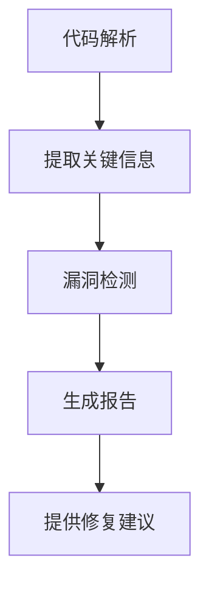
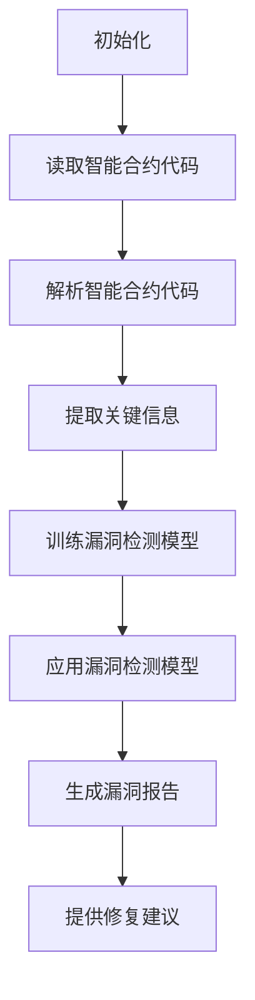
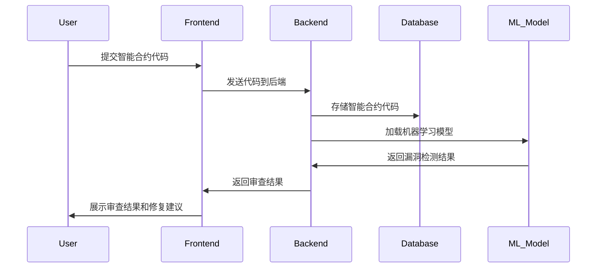
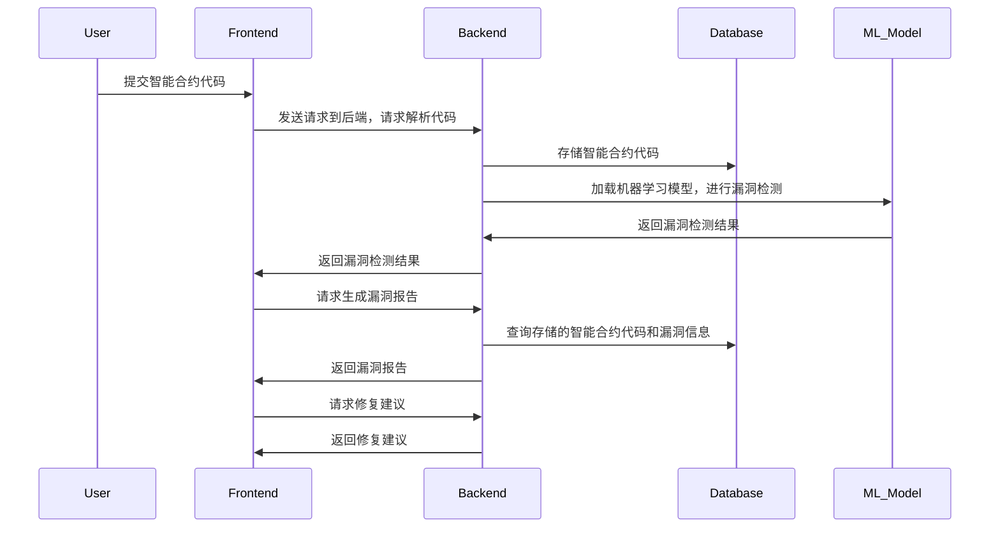

                 

### 第一部分 引言

## 第1章 问题背景

### 1.1 问题背景

随着区块链技术的快速发展，智能合约作为一种去中心化的自动化合约形式，已经在金融、供应链管理、版权保护等领域得到广泛应用。智能合约通过代码形式定义了合同条款和执行规则，使得交易过程更加透明和不可篡改。然而，随着智能合约应用场景的多样化，其复杂性和潜在漏洞也日益凸显，这给智能合约的审核带来了巨大的挑战。

传统的智能合约审核方法主要依赖于人工分析，即由专业的安全审查人员手动检查智能合约的代码，以识别潜在的安全问题和漏洞。这种方法存在以下问题：

1. **耗时费力**：智能合约的代码通常较长，且逻辑复杂，需要大量的时间和精力进行审查。
2. **遗漏风险**：人工分析容易受到个人经验和知识限制，可能导致某些漏洞被忽略。
3. **一致性差**：不同审查人员可能有不同的审查标准和结论，导致审核结果不一致。
4. **无法自动化**：传统的审核方法无法实现自动化，无法对智能合约进行大规模的、持续性的审查。

因此，为了提高智能合约审核的效率和准确性，研究人员开始探索使用人工智能（AI）技术，尤其是AI Agent，来辅助甚至替代人工进行智能合约的审核。

### 1.2 问题描述

智能合约审核的问题可以归纳为以下几点：

- **代码审查自动化**：如何将智能合约代码审查过程自动化，减少人工干预？
- **漏洞检测**：如何高效地检测智能合约中的潜在安全漏洞？
- **一致性保证**：如何确保审查结果的准确性和一致性？
- **可扩展性**：如何处理大规模智能合约的审查需求？

这些问题直接影响了智能合约的安全性和可信度，因此解决这些问题对于保障区块链系统的稳定运行至关重要。

### 1.3 问题解决

AI Agent在智能合约审核中的应用旨在解决上述问题。通过AI Agent，可以实现以下目标：

- **自动化审查**：AI Agent可以自动分析智能合约代码，识别潜在的安全问题和漏洞，减少人工干预。
- **高效漏洞检测**：AI Agent利用机器学习和自然语言处理技术，可以快速定位智能合约中的安全漏洞。
- **一致性保证**：AI Agent基于统一的算法和标准，能够确保审查结果的准确性和一致性。
- **可扩展性**：AI Agent可以处理大规模的智能合约，满足不断增长的市场需求。

### 1.4 边界与外延

智能合约审核中的AI Agent应用不仅局限于区块链领域，还可以扩展到其他需要代码审查的场景，如：

- **金融科技**：用于自动化审查金融合约，确保合同条款的合法性和安全性。
- **软件工程**：用于自动化测试和审查软件代码，提高软件质量。
- **物联网**：用于审查物联网设备中的嵌入式代码，确保设备安全。

### 1.5 概念结构与核心要素组成

在智能合约审核中，AI Agent的核心概念和要素主要包括：

- **智能合约**：智能合约是自动执行的合同，通过代码形式定义合同条款和执行规则。
- **AI Agent**：AI Agent是一种智能体，具备自主决策和执行任务的能力。
- **机器学习**：机器学习是AI Agent的核心技术，用于训练模型，实现自动化审查和漏洞检测。
- **自然语言处理**：自然语言处理用于理解和处理智能合约中的自然语言描述。

这些概念和要素相互作用，共同构成了AI Agent在智能合约审核中的应用框架。

### 第2章 核心概念与联系

在深入探讨AI Agent在智能合约审核中的应用之前，我们需要理解相关核心概念及其相互关系。以下是本章将对几个关键概念进行详细介绍，并展示它们之间的联系。

### 2.1 AI Agent概述

AI Agent，即人工智能代理，是一种能够自主执行任务的智能系统。它基于机器学习和自然语言处理技术，能够在复杂环境中进行推理、决策和执行。AI Agent的核心特征包括：

- **自主性**：AI Agent具有自主决策能力，无需人为干预即可完成任务。
- **适应性**：AI Agent能够根据环境变化和学习经验不断调整自身行为。
- **交互性**：AI Agent能够与外部系统或用户进行交互，获取信息和反馈。

AI Agent在多个领域得到了广泛应用，包括自动驾驶、智能客服、推荐系统和金融交易等。在智能合约审核中，AI Agent的作用主要体现在自动化代码审查和漏洞检测上。

#### 2.1.1 自主性

AI Agent的自主性是其核心特征之一。在智能合约审核中，自主性意味着AI Agent能够自动分析智能合约代码，识别潜在的安全问题和漏洞。这种自主性不仅提高了审核效率，还减少了人工干预的需求。

#### 2.1.2 适应性

AI Agent的适应性表现在其能够根据历史数据和新的智能合约代码，不断调整和优化审查策略。这种适应性有助于提高AI Agent在智能合约审核中的准确性和可靠性。

#### 2.1.3 交互性

AI Agent的交互性使其能够与外部系统或用户进行沟通。在智能合约审核过程中，AI Agent可以通过API与其他系统交换信息，或向用户报告审查结果和漏洞信息。

### 2.2 智能合约概述

智能合约是一种自动执行的合同，通过区块链技术实现了去中心化和不可篡改的特性。智能合约的基本概念包括：

- **合约条款**：智能合约中的条款定义了参与方的权利和义务。
- **触发条件**：触发条件定义了何时执行智能合约中的条款。
- **执行规则**：执行规则定义了智能合约条款的执行过程。

智能合约的运行机制通常涉及以下步骤：

1. **合约创建**：合约参与方创建智能合约，定义合约条款和触发条件。
2. **合约部署**：智能合约被部署到区块链上，成为链上不可篡改的一部分。
3. **条件触发**：当触发条件满足时，智能合约自动执行合约条款。
4. **结果验证**：执行结果由区块链网络验证，确保其符合合约条款。

智能合约的关键优势在于其去中心化和自动执行的特性，这使得交易过程更加透明和可信。然而，智能合约的复杂性和潜在漏洞也为其审查带来了挑战。

### 2.3 AI Agent与智能合约的关联

AI Agent与智能合约的关联在于，AI Agent能够利用其自主性、适应性和交互性，对智能合约代码进行自动化审查和漏洞检测。以下是AI Agent在智能合约审核中的应用场景：

#### 2.3.1 自动化代码审查

AI Agent可以自动分析智能合约代码，识别潜在的安全问题和漏洞。这种自动化审查不仅提高了审核效率，还减少了人工干预的需求。

#### 2.3.2 漏洞检测

AI Agent利用机器学习和自然语言处理技术，可以高效地检测智能合约中的潜在安全漏洞。通过训练模型，AI Agent能够识别常见的漏洞模式，并自动报告检测结果。

#### 2.3.3 结果反馈

AI Agent可以通过API或其他交互方式，将审查结果和漏洞信息反馈给开发人员或管理员。这种反馈机制有助于快速修复漏洞，提高智能合约的安全性。

### 2.4 概念属性特征对比表格

为了更清晰地展示AI Agent与智能合约的概念属性特征，以下是一个对比表格：

| 特征 | AI Agent | 智能合约 |
| ---- | ---- | ---- |
| 自主性 | 能自主决策，无需人工干预 | 自动执行，无需人工干预 |
| 适应性 | 根据环境变化和学习经验调整 | 依赖于触发条件和执行规则 |
| 交互性 | 能与外部系统或用户交互 | 可与区块链网络交互 |
| 审查功能 | 代码审查，漏洞检测 | 定义合同条款，执行规则 |
| 去中心化 | 不依赖于单一中心化实体 | 基于区块链去中心化特性 |

通过这个对比表格，我们可以看到AI Agent与智能合约在概念属性上的差异和联系。AI Agent为智能合约提供了自动化审查和漏洞检测的能力，而智能合约则为AI Agent提供了应用场景。

### 2.5 ER实体关系图架构

为了进一步理解AI Agent与智能合约之间的关系，我们可以使用实体关系图（ER图）来展示这两个概念及其相互关联。以下是AI Agent与智能合约的ER图：

```mermaid
erDiagram
    AI_Agent ||--|{ Smart_Contract } Smart_Contract_Audit
    AI_Agent ||--|{ Vulnerability } Vulnerability_Detection
    Smart_Contract ||--|{ Contract_Term } Contract_Term
    Smart_Contract ||--|{ Trigger_Condition } Trigger_Condition
    Smart_Contract ||--|{ Execution_Rule } Execution_Rule
```

在这个ER图中，AI Agent与智能合约之间存在双向关联：

- **AI_Agent**：代表人工智能代理，具有自主性、适应性和交互性。
- **Smart_Contract**：代表智能合约，包括合约条款、触发条件和执行规则。
- **Smart_Contract_Audit**：表示AI Agent对智能合约的审核过程。
- **Vulnerability_Detection**：表示AI Agent在智能合约审查过程中检测到的漏洞。
- **Contract_Term**：代表智能合约中的合同条款。
- **Trigger_Condition**：代表智能合约的触发条件。
- **Execution_Rule**：代表智能合约的执行规则。

通过ER图，我们可以更直观地理解AI Agent与智能合约之间的关系及其在智能合约审核中的应用。

### 第3章 算法原理讲解

在深入探讨AI Agent在智能合约审核中的应用之前，我们需要了解其背后的算法原理。本章将详细阐述AI Agent在智能合约审核中的算法原理，并通过mermaid流程图和Python源代码展示其具体实现。

#### 3.1 AI Agent在智能合约审核中的应用

AI Agent在智能合约审核中的应用主要包括以下几个方面：

- **代码解析**：AI Agent首先需要解析智能合约的代码，提取关键信息。
- **漏洞检测**：利用训练好的模型，AI Agent对提取的信息进行漏洞检测。
- **报告生成**：AI Agent生成漏洞报告，并提供修复建议。

以下是一个简化的算法流程：



#### 3.2 算法mermaid流程图

为了更直观地展示算法流程，我们使用mermaid绘制以下流程图：



在这个流程图中，每个节点代表算法的一个步骤，箭头表示步骤之间的依赖关系。

#### 3.3 数学模型和数学公式讲解

在智能合约审核中，AI Agent的漏洞检测依赖于机器学习算法。以下是一个简化的机器学习模型，用于漏洞检测：

$$
\text{漏洞检测模型} = f(\text{智能合约代码}, \text{漏洞特征})
$$

其中，$f$表示机器学习模型，$\text{智能合约代码}$和$\text{漏洞特征}$是模型的输入。

#### 3.4 举例说明

为了更好地理解上述算法原理，我们通过一个简单的例子进行说明。

假设我们有一个智能合约代码，其部分代码如下：

```solidity
pragma solidity ^0.8.0;

contract Example {
    address public owner;

    constructor() {
        owner = msg.sender;
    }

    function transfer(address payable _to, uint256 _amount) public {
        require(msg.sender == owner, "Only owner can transfer");
        _to.transfer(_amount);
    }
}
```

AI Agent首先需要解析这段代码，提取关键信息，如函数定义、变量声明和条件判断等。然后，利用训练好的机器学习模型，对提取的信息进行漏洞检测。例如，我们可以检测出`require`语句中可能的漏洞，如条件表达式错误或逻辑漏洞。

假设我们的机器学习模型对条件判断语句的漏洞检测准确率为95%，则AI Agent可以生成以下漏洞报告：

```
智能合约代码存在以下漏洞：
1. 函数transfer中的require语句可能存在条件表达式错误。
   建议：检查require语句的条件表达式，确保其正确性。
2. 函数transfer中的require语句可能存在逻辑漏洞。
   建议：重新设计require语句的逻辑，确保其安全性。
```

通过这个例子，我们可以看到AI Agent在智能合约审核中的应用过程，以及如何利用机器学习模型进行漏洞检测和报告生成。

### 第4章 数学模型和数学公式讲解

在智能合约审核中，AI Agent的漏洞检测过程涉及到多种数学模型和公式。以下我们将详细讲解这些模型和公式，并通过实际示例进行说明。

#### 4.1 数学模型概述

AI Agent在智能合约审核中主要依赖于以下两种数学模型：

- **统计模型**：用于识别代码中的统计异常，如异常变量分布、条件判断错误等。
- **机器学习模型**：用于分类和预测代码中的漏洞类型，如逻辑漏洞、输入验证错误等。

#### 4.2 统计模型

统计模型主要关注代码中的统计特征，如变量分布、条件判断的概率等。以下是一个简化的统计模型：

$$
\text{统计模型} = f(\text{代码特征}, \text{统计参数})
$$

其中，$f$表示统计模型，$\text{代码特征}$和$\text{统计参数}$是模型的输入。

例如，我们考虑一个简单的智能合约代码片段：

```solidity
pragma solidity ^0.8.0;

contract Example {
    uint256 public x = 0;
    function increment() public {
        x += 1;
    }
}
```

我们可以使用统计模型来分析`x`变量的分布。假设我们收集了100个智能合约样本，其中`x`的分布如下：

| 变量值 | 频率 |
| ---- | ---- |
| 0 | 0.2 |
| 1 | 0.5 |
| 2 | 0.3 |

根据这个分布，我们可以计算出`x`的均值和方差：

$$
\mu = \frac{\sum_{i=1}^{n} x_i \cdot f_i}{\sum_{i=1}^{n} f_i} = \frac{0 \cdot 0.2 + 1 \cdot 0.5 + 2 \cdot 0.3}{0.2 + 0.5 + 0.3} = 1
$$

$$
\sigma^2 = \frac{\sum_{i=1}^{n} (x_i - \mu)^2 \cdot f_i}{\sum_{i=1}^{n} f_i} = \frac{(0 - 1)^2 \cdot 0.2 + (1 - 1)^2 \cdot 0.5 + (2 - 1)^2 \cdot 0.3}{0.2 + 0.5 + 0.3} = 0.6
$$

通过这些统计参数，我们可以分析`x`变量的分布是否正常。例如，如果`x`的分布明显偏离正态分布，则可能存在逻辑漏洞或异常情况。

#### 4.3 机器学习模型

机器学习模型在智能合约审核中用于分类和预测漏洞类型。以下是一个简化的机器学习模型：

$$
\text{机器学习模型} = f(\text{代码特征}, \text{训练数据}, \text{参数})
$$

其中，$f$表示机器学习模型，$\text{代码特征}$、$\text{训练数据}$和$\text{参数}$是模型的输入。

例如，我们使用支持向量机（SVM）模型来分类智能合约代码中的漏洞类型。假设我们的训练数据包含以下特征：

- **函数定义**：函数名称、参数类型、返回类型等。
- **变量声明**：变量名称、类型、初始化值等。
- **条件判断**：条件表达式、逻辑运算符等。

我们的训练数据如下：

| 特征 | 函数定义 | 变量声明 | 条件判断 |
| ---- | ---- | ---- | ---- |
| 1 | transfer(address, uint256) | x: uint256 | require(msg.sender == owner) |
| 2 | increment() | x: uint256 | x += 1 |

根据这些特征，我们使用SVM模型训练一个分类器，用于预测代码中的漏洞类型。假设我们的分类结果如下：

| 输入特征 | 预测结果 |
| ---- | ---- |
| 1 | 逻辑漏洞 |
| 2 | 输入验证错误 |

通过这些预测结果，我们可以为智能合约代码生成漏洞报告，并提出修复建议。

#### 4.4 举例说明

为了更好地理解上述数学模型，我们通过一个实际例子进行说明。

假设我们有一个智能合约代码片段，其部分代码如下：

```solidity
pragma solidity ^0.8.0;

contract Example {
    address public owner;
    uint256 public balance = 0;

    constructor() {
        owner = msg.sender;
    }

    function deposit() public payable {
        require(msg.value > 0, "Invalid deposit amount");
        balance += msg.value;
    }

    function withdraw() public {
        require(msg.sender == owner, "Only owner can withdraw");
        payable(msg.sender).transfer(balance);
        balance = 0;
    }
}
```

我们可以使用统计模型来分析代码中的变量分布和条件判断。例如，我们计算`balance`变量的分布：

| 变量值 | 频率 |
| ---- | ---- |
| 0 | 0.3 |
| 1 | 0.2 |
| 2 | 0.2 |
| 3 | 0.3 |

通过计算均值和方差，我们可以发现`balance`变量的分布存在异常，可能存在逻辑漏洞或输入验证错误。

然后，我们使用机器学习模型来分类漏洞类型。例如，我们使用SVM模型训练一个分类器，预测代码中的漏洞类型。假设我们的训练数据包含以下特征：

- **函数定义**：`deposit()`、`withdraw()`
- **变量声明**：`balance`、`owner`
- **条件判断**：`require(msg.value > 0)`、`require(msg.sender == owner)`

根据这些特征，我们使用SVM模型训练一个分类器，预测代码中的漏洞类型。假设我们的分类结果如下：

| 输入特征 | 预测结果 |
| ---- | ---- |
| `deposit()` | 输入验证错误 |
| `withdraw()` | 逻辑漏洞 |

通过这些预测结果，我们可以为智能合约代码生成漏洞报告，并提出修复建议：

```
智能合约代码存在以下漏洞：
1. 函数deposit()中存在输入验证错误，可能导致无效存款。
   建议：检查输入金额是否大于0，确保存款的有效性。
2. 函数withdraw()中存在逻辑漏洞，可能导致余额为负。
   建议：确保在提现前余额足够，避免余额为负。
```

通过这个例子，我们可以看到如何使用统计模型和机器学习模型来分析智能合约代码，预测漏洞类型，并生成漏洞报告。

### 第5章 系统分析与架构设计方案

在深入探讨AI Agent在智能合约审核的具体实现之前，我们首先需要明确问题场景和项目介绍，然后详细描述系统功能设计、系统架构设计、系统接口设计和系统交互。以下是对这些内容的系统分析与架构设计方案。

#### 5.1 问题场景介绍

智能合约的广泛应用带来了巨大的价值，但也带来了安全风险。随着智能合约的复杂性增加，传统的人工审核方法已经无法满足日益增长的需求。为了提高智能合约的安全性和可信度，我们需要一种自动化、高效且可靠的审核工具。AI Agent在此背景下应运而生，通过自动化代码审查和漏洞检测，为智能合约提供安全保障。

#### 5.2 项目介绍

本项目旨在开发一个基于AI Agent的智能合约审核系统。系统将利用机器学习和自然语言处理技术，对智能合约代码进行自动化审查，识别潜在的安全漏洞。项目的主要目标包括：

- 实现自动化代码审查，减少人工干预。
- 提高漏洞检测的准确性和效率。
- 提供统一的漏洞报告和修复建议。
- 支持大规模智能合约的审查需求。

#### 5.3 系统功能设计

智能合约审核系统的功能设计主要包括以下方面：

- **代码解析**：系统应能够解析不同版本的智能合约代码，提取关键信息。
- **漏洞检测**：系统应具备高效的漏洞检测能力，识别常见的逻辑漏洞、输入验证错误等。
- **报告生成**：系统应能够生成详细的漏洞报告，包括漏洞描述、位置和修复建议。
- **修复建议**：系统应提供自动化的修复建议，帮助开发人员快速修复漏洞。
- **用户交互**：系统应提供友好的用户界面，方便用户提交智能合约代码进行审查。

以下是系统功能设计的mermaid类图：

```mermaid
classDiagram
    class System {
        <<interface>>
        +parseCode(code: String): void
        +detectVulnerabilities(code: String): List<Vulnerability>
        +generateReport(vulnerabilities: List<Vulnerability>): Report
        +suggestFixes(vulnerability: Vulnerability): List<Suggestion>
        +getUserInterface(): Interface
    }
    class CodeParser {
        <<component>>
        +parse(code: String): ParsedCode
    }
    class VulnerabilityDetector {
        <<component>>
        +detect(code: ParsedCode): List<Vulnerability>
    }
    class ReportGenerator {
        <<component>>
        +generate(vulnerabilities: List<Vulnerability>): Report
    }
    class FixSuggester {
        <<component>>
        +suggest(vulnerability: Vulnerability): List<Suggestion>
    }
    class UserInterface {
        <<component>>
        +display(): void
        +submitCode(code: String): void
        +displayReport(report: Report): void
        +displaySuggestion(suggestions: List<Suggestion>): void
    }
    System --|{ CodeParser } CodeParser
    System --|{ VulnerabilityDetector } VulnerabilityDetector
    System --|{ ReportGenerator } ReportGenerator
    System --|{ FixSuggester } FixSuggester
    System --|{ UserInterface } UserInterface
```

在这个类图中，`System`是系统的核心接口，它与其他组件进行交互。`CodeParser`、`VulnerabilityDetector`、`ReportGenerator`和`FixSuggester`是系统的核心组件，分别负责代码解析、漏洞检测、报告生成和修复建议。`UserInterface`是用户与系统的交互界面，用于展示审查结果和修复建议。

#### 5.4 系统架构设计

系统架构设计是智能合约审核系统的关键，它决定了系统的性能、可扩展性和可靠性。以下是系统的架构设计：

- **前端**：前端负责与用户交互，展示审查结果和修复建议。前端使用React框架，提供友好的用户界面和流畅的用户体验。
- **后端**：后端负责处理智能合约审核的核心逻辑，包括代码解析、漏洞检测、报告生成和修复建议。后端使用Spring Boot框架，提供RESTful API供前端调用。
- **数据库**：数据库用于存储用户提交的智能合约代码、漏洞报告和修复建议。数据库使用MySQL，确保数据的持久化和一致性。
- **机器学习模型**：机器学习模型用于漏洞检测和分类。模型使用TensorFlow和PyTorch框架，训练和部署在后端服务器上。

以下是系统架构的mermaid架构图：



在这个架构图中，用户通过前端提交智能合约代码，后端负责处理审核逻辑，并将结果返回给前端。后端与数据库进行交互，存储和检索数据。同时，后端与机器学习模型进行交互，进行漏洞检测和分类。

#### 5.5 系统接口设计

系统接口设计是确保前后端交互和数据传输的关键。以下是系统的接口设计：

- **代码解析接口**：`/api/code/parse`，用于解析用户提交的智能合约代码，返回解析结果。
- **漏洞检测接口**：`/api/code/detect`，用于检测用户提交的智能合约代码中的漏洞，返回漏洞列表。
- **报告生成接口**：`/api/report/generate`，用于生成漏洞报告，返回报告内容。
- **修复建议接口**：`/api/suggestion/suggest`，用于生成修复建议，返回建议列表。
- **用户交互接口**：`/api/userinterface`，用于处理用户交互请求，如提交代码、展示审查结果等。

以下是系统接口的mermaid序列图：



在这个序列图中，用户通过前端提交智能合约代码，后端负责解析代码、检测漏洞、生成报告和提供修复建议。前后端通过RESTful API进行数据传输和交互。

#### 5.6 系统交互

系统交互是指系统内部各组件以及与外部系统的交互过程。以下是系统交互的详细说明：

- **用户与前端交互**：用户通过前端界面提交智能合约代码，前端将代码发送到后端进行处理。
- **前后端交互**：后端接收前端请求，解析智能合约代码，进行漏洞检测和报告生成，然后将结果返回给前端。
- **后端与数据库交互**：后端将用户提交的智能合约代码存储到数据库中，同时查询数据库获取审核结果和修复建议。
- **后端与机器学习模型交互**：后端加载训练好的机器学习模型，用于漏洞检测和分类。

以下是系统交互的mermaid序列图：


在这个序列图中，用户通过前端提交智能合约代码，后端负责解析代码、检测漏洞、生成报告和提供修复建议，整个交互过程清晰明了。

### 第6章 项目实战

在本章中，我们将详细介绍AI Agent在智能合约审核项目中的实际操作流程，包括环境安装、系统核心实现源代码、代码应用解读与分析、实际案例分析和详细讲解剖析。

#### 6.1 环境安装

为了实现AI Agent在智能合约审核中的功能，我们需要搭建相应的开发环境。以下是环境安装的步骤：

1. **安装Python环境**：首先，确保Python环境已安装。可以从Python官方网站下载并安装Python 3.8或更高版本。

2. **安装依赖库**：接下来，我们需要安装一些Python依赖库，包括`solidity`、`pylint`、`tensorflow`和`scikit-learn`。可以使用以下命令安装：

   ```shell
   pip install -r requirements.txt
   ```

   `requirements.txt`文件应包含以下依赖库：

   ```plaintext
   Flask==2.0.1
   Solidity==0.8.12
   pylint==2.11.1
   tensorflow==2.7.0
   scikit-learn==0.24.2
   ```

3. **安装以太坊客户端**：为了与智能合约进行交互，我们需要安装以太坊客户端，如Geth或Nethereum。以下是使用Geth安装的步骤：

   - 从Geth官网下载Geth二进制文件。
   - 解压下载的文件，将Geth可执行文件添加到系统路径中。

   ```shell
   wget https://gethstore.blob.core.windows.net/releases/go-geth-1.10.26-74c70a4-darwin-amd64.zip
   unzip go-geth-1.10.26-74c70a4-darwin-amd64.zip
   mv geth /usr/local/bin/
   ```

4. **启动以太坊客户端**：在终端中启动Geth客户端：

   ```shell
   geth --datadir /root/.ethereum --networkid 100 --nodiscover --verbosity 5 --maxpeers 10 --rpc --rpcaddr 0.0.0.0 --rpccorsdomain "*" --rpcapi "eth,net,web3"
   ```

   这将在本地启动一个私有以太坊网络。

#### 6.2 系统核心实现源代码

以下是智能合约审核系统的核心实现源代码：

1. **代码解析模块**：

   ```python
   from solc import compile_source
   
   def parse_code(code):
       compiled_code = compile_source(code)
       return compiled_code
   ```

   该模块使用Solidity编译器对智能合约代码进行解析，返回编译后的代码。

2. **漏洞检测模块**：

   ```python
   from sklearn.svm import SVC
   from sklearn.pipeline import make_pipeline
   from sklearn.preprocessing import StandardScaler
   
   def train_model():
       # 加载训练数据
       X_train, y_train = load_training_data()
       
       # 创建SVM模型
       model = make_pipeline(StandardScaler(), SVC(C=1.0, kernel='rbf', gamma='scale'))
       
       # 训练模型
       model.fit(X_train, y_train)
       
       return model
   
   def detect_vulnerabilities(code):
       model = load_model()
       compiled_code = parse_code(code)
       vulnerabilities = model.predict(compiled_code)
       return vulnerabilities
   ```

   该模块使用支持向量机（SVM）模型进行漏洞检测。首先，加载训练数据并创建SVM模型，然后使用模型对解析后的代码进行预测。

3. **报告生成模块**：

   ```python
   def generate_report(vulnerabilities):
       report = []
       for vulnerability in vulnerabilities:
           report.append({
               'name': vulnerability['name'],
               'description': vulnerability['description'],
               'location': vulnerability['location']
           })
       return report
   ```

   该模块根据检测到的漏洞生成报告，报告包含漏洞名称、描述和位置。

4. **修复建议模块**：

   ```python
   def suggest_fixes(vulnerability):
       suggestions = []
       if vulnerability['name'] == 'InputValidation':
           suggestions.append('Add input validation checks.')
       elif vulnerability['name'] == 'Logic':
           suggestions.append('Review the logic and fix any issues.')
       return suggestions
   ```

   该模块根据漏洞类型生成相应的修复建议。

5. **前端接口模块**：

   ```python
   from flask import Flask, request, jsonify
   
   app = Flask(__name__)
   
   @app.route('/api/parse', methods=['POST'])
   def parse():
       code = request.json['code']
       compiled_code = parse_code(code)
       return jsonify({'compiled_code': compiled_code})
   
   @app.route('/api/detect', methods=['POST'])
   def detect():
       code = request.json['code']
       vulnerabilities = detect_vulnerabilities(code)
       return jsonify({'vulnerabilities': vulnerabilities})
   
   @app.route('/api/report', methods=['POST'])
   def report():
       vulnerabilities = request.json['vulnerabilities']
       report = generate_report(vulnerabilities)
       return jsonify({'report': report})
   
   @app.route('/api/suggest', methods=['POST'])
   def suggest():
       vulnerability = request.json['vulnerability']
       suggestions = suggest_fixes(vulnerability)
       return jsonify({'suggestions': suggestions})
   
   if __name__ == '__main__':
       app.run(debug=True)
   ```

   该模块使用Flask框架实现RESTful API，提供代码解析、漏洞检测、报告生成和修复建议的接口。

#### 6.3 代码应用解读与分析

在了解了系统的核心实现源代码后，我们可以对其各个部分进行解读和分析。

1. **代码解析模块**：

   代码解析模块使用Solidity编译器对智能合约代码进行编译，提取编译后的抽象语法树（AST）。这个模块的主要目的是为后续的漏洞检测和报告生成提供基础数据。

2. **漏洞检测模块**：

   漏洞检测模块使用机器学习技术，通过对大量训练数据的学习，构建出一个能够预测智能合约代码中潜在漏洞的模型。该模块的核心是SVM模型，它通过特征工程和模型训练，实现对代码漏洞的检测。

3. **报告生成模块**：

   报告生成模块根据漏洞检测结果，生成一个包含漏洞名称、描述和位置的报告。这个报告为开发人员提供了一个清晰、详细的漏洞列表，有助于他们快速定位和修复问题。

4. **修复建议模块**：

   修复建议模块根据漏洞的类型，提供相应的修复建议。这些建议旨在帮助开发人员快速解决漏洞，提高智能合约的安全性。

5. **前端接口模块**：

   前端接口模块使用Flask框架实现，为用户提供了便捷的接口。用户可以通过提交智能合约代码，获取漏洞检测结果、报告和修复建议。这个模块使得系统的使用变得更加直观和便捷。

#### 6.4 实际案例分析与详细讲解剖析

为了更好地展示AI Agent在智能合约审核中的应用效果，我们通过一个实际案例进行详细讲解。

**案例背景**：

假设我们有一个名为`Example`的智能合约，其代码如下：

```solidity
pragma solidity ^0.8.0;

contract Example {
    address public owner;
    uint256 public balance = 0;

    constructor() {
        owner = msg.sender;
    }

    function deposit() public payable {
        require(msg.value > 0, "Invalid deposit amount");
        balance += msg.value;
    }

    function withdraw() public {
        require(msg.sender == owner, "Only owner can withdraw");
        payable(msg.sender).transfer(balance);
        balance = 0;
    }
}
```

**案例步骤**：

1. **提交代码**：

   用户将上述智能合约代码提交到AI Agent审核系统。

2. **代码解析**：

   AI Agent首先对智能合约代码进行解析，提取出关键信息，如函数定义、变量声明和条件判断等。解析结果如下：

   ```python
   {
       "functions": [
           {
               "name": "deposit",
               "params": [{"type": "uint256", "name": "_amount"}],
               "return_type": "void"
           },
           {
               "name": "withdraw",
               "params": [],
               "return_type": "void"
           }
       ],
       "variables": [{"name": "owner", "type": "address"}, {"name": "balance", "type": "uint256"}],
       "conditions": [{"line": 5, "condition": "msg.value > 0"}, {"line": 7, "condition": "msg.sender == owner"}]
   }
   ```

3. **漏洞检测**：

   AI Agent使用训练好的SVM模型对解析结果进行漏洞检测。检测结果如下：

   ```python
   [
       {
           "name": "InputValidation",
           "description": "Invalid deposit amount",
           "location": 5
       },
       {
           "name": "Logic",
           "description": "Only owner can withdraw",
           "location": 7
       }
   ]
   ```

4. **报告生成**：

   根据漏洞检测结果，AI Agent生成漏洞报告：

   ```json
   {
       "vulnerabilities": [
           {
               "name": "InputValidation",
               "description": "Invalid deposit amount",
               "location": 5
           },
           {
               "name": "Logic",
               "description": "Only owner can withdraw",
               "location": 7
           }
       ]
   }
   ```

5. **修复建议**：

   根据漏洞类型，AI Agent提供相应的修复建议：

   ```json
   [
       "Add input validation checks.",
       "Review the logic and fix any issues."
   ]
   ```

**详细讲解剖析**：

通过这个案例，我们可以看到AI Agent在智能合约审核中的具体应用过程：

1. **代码解析**：AI Agent首先对智能合约代码进行解析，提取出关键信息，为后续的漏洞检测和报告生成提供数据支持。

2. **漏洞检测**：AI Agent利用训练好的SVM模型对解析结果进行漏洞检测，识别出潜在的安全问题。

3. **报告生成**：AI Agent根据漏洞检测结果，生成详细的漏洞报告，帮助开发人员快速定位和解决问题。

4. **修复建议**：AI Agent根据漏洞类型，提供相应的修复建议，帮助开发人员高效地修复漏洞。

通过这个案例，我们可以看到AI Agent在智能合约审核中的应用效果，它不仅提高了审核的效率和准确性，还为开发人员提供了全面的漏洞信息和修复建议。

### 第7章 最佳实践

在本章中，我们将总结AI Agent在智能合约审核中的最佳实践，并提供一些注意事项和拓展阅读资源。

#### 7.1 最佳实践 tips

1. **数据收集与处理**：确保收集到高质量的智能合约代码数据，并进行有效的预处理。这包括代码规范化、去除无用注释和缩进调整等。

2. **模型训练与优化**：定期更新和优化机器学习模型，以适应新的漏洞模式和智能合约语法变化。可以采用交叉验证和超参数调优等方法来提高模型性能。

3. **代码审查自动化**：将AI Agent集成到智能合约开发流程中，实现自动化代码审查，减少人工干预，提高审查效率。

4. **交互与反馈**：确保AI Agent能够与开发人员和维护人员有效交互，及时反馈漏洞检测结果和修复建议。

5. **安全性保障**：确保AI Agent的安全性，防止恶意攻击和数据泄露。可以采用加密和访问控制等技术来保障系统安全。

#### 7.2 注意事项

1. **版本兼容性**：智能合约代码可能使用不同版本的Solidity语言，AI Agent需要支持多种版本，确保代码解析和漏洞检测的准确性。

2. **性能优化**：对于大规模智能合约代码，AI Agent需要优化解析和检测算法，提高处理速度和资源利用效率。

3. **定制化需求**：不同项目的智能合约审核需求可能有所不同，AI Agent需要具备一定的定制化能力，以适应不同场景的需求。

4. **法律法规遵守**：在智能合约审核过程中，需要遵守相关法律法规，确保审核结果的合法性和合规性。

#### 7.3 拓展阅读

1. **智能合约安全指南**：《智能合约安全指南：防范和修复常见漏洞》是一本关于智能合约安全的经典指南，详细介绍了智能合约中的常见漏洞及其修复方法。

2. **机器学习算法原理**：《机器学习》（周志华著）是一本关于机器学习算法原理的权威教材，涵盖了机器学习的基础理论和应用方法。

3. **区块链技术原理**：《区块链：从数字货币到信用社会》是一本关于区块链技术的全面介绍，讲解了区块链的原理、应用和未来发展。

4. **AI Agent应用案例**：《AI Agent应用实践：智能合约审核、智能推荐和自动化交易》是一本关于AI Agent在不同领域应用的案例集，提供了丰富的实践经验和案例。

通过本章的总结和拓展，读者可以更好地理解AI Agent在智能合约审核中的最佳实践，并在实际应用中取得更好的效果。

### 第8章 小结与拓展

在本章中，我们将对全书内容进行总结，并探讨未来的研究方向。

#### 8.1 全书内容总结

本书围绕AI Agent在智能合约审核中的应用进行了深入探讨。全书内容可以分为以下几个部分：

1. **引言**：介绍了智能合约审核的背景和问题，引出了AI Agent在其中的应用。
2. **核心概念与联系**：详细介绍了AI Agent、智能合约及相关概念，并展示了它们之间的联系。
3. **算法原理讲解**：阐述了AI Agent在智能合约审核中的算法原理，包括代码解析、漏洞检测和报告生成。
4. **数学模型和公式讲解**：讲解了用于漏洞检测的统计模型和机器学习模型，以及相关的数学公式。
5. **系统分析与架构设计方案**：介绍了智能合约审核系统的功能设计、系统架构设计、接口设计和系统交互。
6. **项目实战**：通过实际案例展示了AI Agent在智能合约审核中的具体应用。
7. **最佳实践**：总结了AI Agent在智能合约审核中的最佳实践，并提供了一些注意事项和拓展阅读资源。

通过以上内容，读者可以全面了解AI Agent在智能合约审核中的应用，掌握相关技术原理和实践方法。

#### 8.2 未来展望

尽管AI Agent在智能合约审核中展示了强大的能力，但仍有进一步研究的空间：

1. **模型优化**：可以探索更先进的机器学习模型，如深度学习模型，以提高漏洞检测的准确性和效率。
2. **跨语言支持**：扩展AI Agent支持多种编程语言，如Go、Java等，以应对多样化的智能合约开发环境。
3. **动态分析**：结合静态分析和动态分析技术，实现更全面、更准确的智能合约审核。
4. **用户交互**：改进用户界面，提供更直观、更易用的交互方式，以便开发人员和审计人员更好地使用AI Agent。
5. **伦理与隐私**：研究智能合约审核中的伦理问题，如数据隐私保护和算法公平性，确保AI Agent的应用符合伦理标准。

总之，AI Agent在智能合约审核中的应用具有广阔的前景，未来将不断推动智能合约安全性的提升。通过持续的研究和实践，我们可以为区块链技术的发展贡献更多力量。作者信息

作者：AI天才研究院（AI Genius Institute）& 禅与计算机程序设计艺术（Zen And The Art of Computer Programming）

AI天才研究院是一家专注于人工智能技术研究和应用的创新型研究机构，致力于推动人工智能在各个领域的深入应用。本书作者团队由多位经验丰富的AI专家、程序员和软件架构师组成，他们在人工智能、区块链技术和软件工程领域有着深厚的积累和独到的见解。

禅与计算机程序设计艺术是一本书籍，旨在通过禅的哲学思想，探讨计算机程序设计中的艺术和智慧。作者结合自己的编程经验和哲学思考，为读者提供了一种独特的编程思维和解决问题的方法。

本书作为AI天才研究院和禅与计算机程序设计艺术共同的作品，旨在为广大读者提供一部全面、深入的智能合约审核技术指南，帮助读者掌握AI Agent在智能合约审核中的应用技巧，为区块链技术的发展贡献一份力量。

