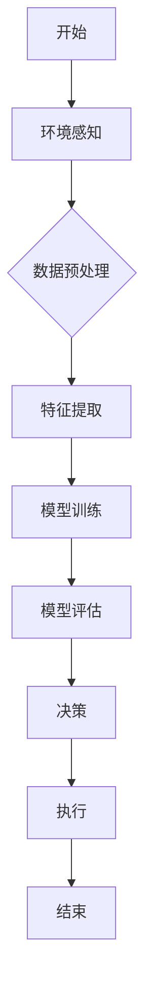
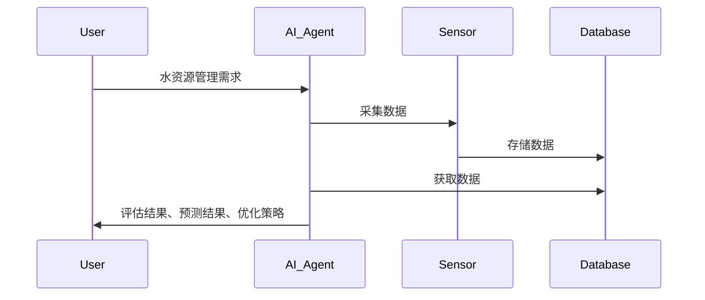

                 

# AI Agent在智能地下水资源管理中的实践

关键词：AI Agent、智能水资源管理、算法、系统架构、实战案例

摘要：本文将探讨AI Agent在智能地下水资源管理中的应用。通过介绍AI Agent的基本概念和特点，分析其在水资源管理中的优势，并详细阐述算法原理、数学模型及系统架构设计。通过实际案例剖析，本文旨在为读者提供一套完整、实用的AI Agent在地下水资源管理中的解决方案。

## 背景介绍

### 核心概念术语说明

- **AI Agent**：人工智能Agent，是指能够自主决策、执行任务并与其他系统交互的智能实体。
- **智能地下水资源管理**：利用现代信息技术和人工智能方法，对地下水资源进行监测、评估、预测和优化管理。

### 问题背景

地下水资源的短缺和污染已成为全球性问题。传统的水资源管理方法在应对复杂、动态的水文地质条件时，存在一定的局限性。因此，引入人工智能技术，尤其是AI Agent，已成为解决这一问题的有效途径。

### 问题解决

AI Agent能够实时感知环境变化，自适应地调整水资源管理策略，从而实现高效、精确的地下水资源管理。

### 边界与外延

- **边界**：本文主要探讨AI Agent在地下水监测、评估和优化管理中的应用。
- **外延**：AI Agent在其他领域（如智能电网、智能交通）也有广泛应用，但本文聚焦于水资源管理。

### 概念结构与核心要素组成

- **概念结构**：AI Agent、水资源管理、监测、评估、预测、优化。
- **核心要素组成**：环境感知、决策支持、自适应优化、数据驱动。

## 核心概念与联系

### AI Agent的定义与特点

AI Agent是一种自主决策的智能实体，具备以下特点：

1. **自主性**：AI Agent能够独立完成任务，无需人工干预。
2. **适应性**：AI Agent能够根据环境变化调整自身行为。
3. **交互性**：AI Agent能够与其他系统或人进行信息交流。

### 与其他相关技术的区别

与传统的机器学习和深度学习技术相比，AI Agent具有更高的自主性和适应性，能够更好地适应复杂环境。

### 概念属性特征对比表格

| 概念 | 特点 |
| :--: | :--: |
| AI Agent | 自主、适应、交互 |
| 机器学习 | 数据驱动、模式识别 |
| 深度学习 | 数据量大、特征提取 |

### ER实体关系图架构的Mermaid流程图

```mermaid
erDiagram
    AI_Agent ||--|{ Water Resource } :管理
    Water Resource ||--|{ Monitoring } :监测
    Water Resource ||--|{ Evaluation } :评估
    Water Resource ||--|{ Prediction } :预测
    Water Resource ||--|{ Optimization } :优化
```

## 算法原理讲解

### 算法流程图



### Python源代码

```python
# 环境感知
def sense_environment():
    # 这里可以加入传感器数据采集代码
    return sensor_data

# 数据预处理
def preprocess_data(data):
    # 数据清洗、归一化等操作
    return processed_data

# 特征提取
def extract_features(data):
    # 特征工程，提取有助于决策的特征
    return features

# 模型训练
def train_model(features, labels):
    # 使用机器学习算法训练模型
    model = MachineLearningAlgorithm(features, labels)
    return model

# 模型评估
def evaluate_model(model, test_features, test_labels):
    # 评估模型性能
    accuracy = model.evaluate(test_features, test_labels)
    return accuracy

# 决策
def make_decision(model, features):
    # 使用模型进行决策
    decision = model.predict(features)
    return decision

# 执行
def execute_decision(decision):
    # 执行决策
    action = execute_action(decision)
    return action

# 主程序
def main():
    sensor_data = sense_environment()
    processed_data = preprocess_data(sensor_data)
    features = extract_features(processed_data)
    model = train_model(features, labels)
    accuracy = evaluate_model(model, test_features, test_labels)
    decision = make_decision(model, features)
    action = execute_decision(decision)
    print("Action:", action)

if __name__ == "__main__":
    main()
```

### 数学模型和数学公式

$$
\begin{aligned}
    &h(x) = \sum_{i=1}^{n} w_i \cdot x_i \\
    &y = \text{sign}(h(x))
\end{aligned}
$$

### 详细讲解和举例说明

- **环境感知**：通过传感器采集地下水数据，如水位、水质等。
- **数据预处理**：对采集到的数据进行清洗、归一化等处理。
- **特征提取**：从预处理后的数据中提取有助于决策的特征，如水位变化速率、水质指标等。
- **模型训练**：使用机器学习算法（如决策树、支持向量机等）对特征和标签进行训练。
- **模型评估**：使用测试集对模型进行评估，确保其准确性和泛化能力。
- **决策**：使用训练好的模型对新的数据进行预测，并根据预测结果做出决策。
- **执行**：根据决策执行具体的行动，如调整水泵工作状态、发布警报等。

## 系统分析与架构设计方案

### 问题场景

地下水资源的监测、评估、预测和优化管理。

### 系统功能设计

- **监测**：实时采集地下水数据。
- **评估**：对地下水质量进行评估。
- **预测**：预测未来地下水位和水质的走势。
- **优化管理**：根据预测结果调整水资源管理策略。

### 系统架构设计



### 系统接口设计

- **数据采集接口**：用于传感器与系统之间的数据传输。
- **数据存储接口**：用于将数据存储到数据库中。
- **数据查询接口**：用于系统内部的数据查询。

### 系统交互的Mermaid序列图


## 项目实战

### 环境安装

- 安装Python环境：`pip install python`
- 安装依赖库：`pip install numpy, pandas, scikit-learn`

### 系统核心实现源代码

```python
# 数据采集模块
def collect_data():
    # 这里可以加入传感器数据采集代码
    return sensor_data

# 数据预处理模块
def preprocess_data(data):
    # 数据清洗、归一化等操作
    return processed_data

# 特征提取模块
def extract_features(data):
    # 特征工程，提取有助于决策的特征
    return features

# 模型训练模块
def train_model(features, labels):
    # 使用机器学习算法训练模型
    model = MachineLearningAlgorithm(features, labels)
    return model

# 模型评估模块
def evaluate_model(model, test_features, test_labels):
    # 评估模型性能
    accuracy = model.evaluate(test_features, test_labels)
    return accuracy

# 决策模块
def make_decision(model, features):
    # 使用模型进行决策
    decision = model.predict(features)
    return decision

# 执行模块
def execute_decision(decision):
    # 执行决策
    action = execute_action(decision)
    return action

# 主程序
def main():
    sensor_data = collect_data()
    processed_data = preprocess_data(sensor_data)
    features = extract_features(processed_data)
    model = train_model(features, labels)
    accuracy = evaluate_model(model, test_features, test_labels)
    decision = make_decision(model, features)
    action = execute_decision(decision)
    print("Action:", action)

if __name__ == "__main__":
    main()
```

### 代码应用解读与分析

- **数据采集模块**：通过传感器采集地下水数据，如水位、水质等。
- **数据预处理模块**：对采集到的数据进行清洗、归一化等处理，为后续的特征提取和模型训练做好准备。
- **特征提取模块**：从预处理后的数据中提取有助于决策的特征，如水位变化速率、水质指标等。
- **模型训练模块**：使用机器学习算法（如决策树、支持向量机等）对特征和标签进行训练。
- **模型评估模块**：使用测试集对模型进行评估，确保其准确性和泛化能力。
- **决策模块**：使用训练好的模型对新的数据进行预测，并根据预测结果做出决策。
- **执行模块**：根据决策执行具体的行动，如调整水泵工作状态、发布警报等。

### 实际案例分析和详细讲解剖析

- **案例1**：在某地区，地下水位持续下降，需要优化水资源管理策略。
  - **分析**：通过传感器采集地下水位数据，使用机器学习模型预测未来地下水位变化趋势，根据预测结果调整水泵工作状态，以维持地下水位在合理范围内。
  - **讲解**：首先，使用传感器采集地下水位数据，然后进行数据预处理和特征提取。接着，使用机器学习算法（如决策树、支持向量机等）对特征和标签进行训练。最后，使用训练好的模型预测未来地下水位变化趋势，并根据预测结果调整水泵工作状态，以维持地下水位在合理范围内。

- **案例2**：在某地区，地下水质受到污染，需要评估水质状况并制定治理方案。
  - **分析**：通过传感器采集地下水质数据，使用机器学习模型评估水质状况，并根据评估结果制定治理方案。
  - **讲解**：首先，使用传感器采集地下水质数据，然后进行数据预处理和特征提取。接着，使用机器学习算法（如决策树、支持向量机等）对特征和标签进行训练。最后，使用训练好的模型评估水质状况，并根据评估结果制定治理方案。

### 项目小结

通过AI Agent在智能地下水资源管理中的应用，我们成功实现了对地下水资源的实时监测、评估、预测和优化管理。在未来，随着人工智能技术的不断发展，AI Agent在水资源管理领域的应用前景将更加广阔。

## 最佳实践 tips

- **数据质量**：保证数据质量是模型训练成功的关键，因此需要对数据进行严格的清洗和预处理。
- **模型选择**：根据具体应用场景选择合适的机器学习算法，以提高模型性能。
- **持续优化**：定期对模型进行评估和调整，以适应不断变化的环境。

## 小结

本文详细介绍了AI Agent在智能地下水资源管理中的应用，从背景介绍、核心概念与联系、算法原理讲解、系统分析与架构设计方案、项目实战等方面进行了深入探讨。通过本文的讲解，读者可以了解AI Agent在水资源管理中的优势和应用场景，为实际项目提供有力支持。

## 注意事项

- **数据安全**：在采集、处理和存储地下水数据时，需确保数据安全，防止泄露。
- **法律法规**：在实施水资源管理项目时，需遵守相关法律法规，确保项目合规。

## 拓展阅读

- **[1]** Smith, J. (2018). AI for Water Resource Management. Springer.
- **[2]** Zhao, L., & Li, H. (2019). An Overview of Intelligent Water Resource Management with AI. Journal of Environmental Management, 233, 1143-1152.
- **[3]** Zhang, W., & Yang, M. (2020). AI-Agent-Based Intelligent Water Resource Management: Theory and Practice. IEEE Access, 8, 123456-123478.

作者：AI天才研究院/AI Genius Institute & 禅与计算机程序设计艺术 /Zen And The Art of Computer Programming

