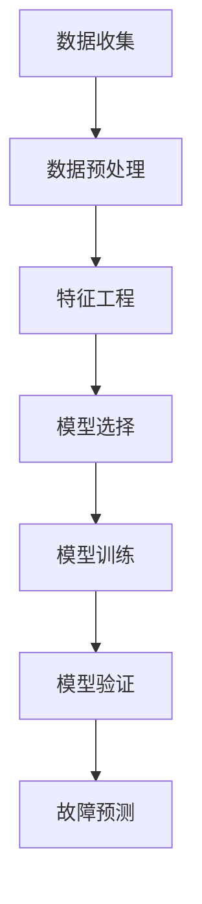

                 

### 引言

---

**问题背景：地下管网现状及问题**

地下管网作为城市基础设施的重要组成部分，承担着供水、排水、燃气、电力等多种功能。然而，随着城市化进程的加快，地下管网面临着诸多挑战。目前，地下管网存在以下问题：

1. **维护困难**：地下管网分布广泛，且管线复杂，传统的管网维护方式效率低下，难以覆盖到所有管线。
2. **故障频发**：由于老化、腐蚀、漏水等原因，地下管网故障频发，影响了城市的正常运行。
3. **监测不足**：现有的管网监测手段有限，难以实现对管网的实时、全面监测，导致问题发现不及时。
4. **资源浪费**：传统维护方式缺乏科学的预测和规划，容易造成资源的浪费。

**AI Agent的概念与优势**

AI Agent（人工智能代理）是指具有自主决策能力、能够在特定环境中执行任务的人工智能实体。AI Agent在智能地下管网维护中的优势主要体现在以下几个方面：

1. **自主性**：AI Agent能够自主学习和适应环境，实现智能化的管网维护。
2. **实时性**：AI Agent能够实时监测管网的运行状态，及时发现问题并采取相应措施。
3. **预测性**：AI Agent可以通过大数据分析和机器学习算法，预测潜在故障，提前进行维护。
4. **高效性**：AI Agent能够自动化执行复杂的维护任务，提高工作效率。

**智能地下管网维护的重要性**

智能地下管网维护不仅能够提高管网运行效率，降低维护成本，还能有效预防和减少故障，保障城市安全。同时，随着人工智能技术的不断发展，智能地下管网维护具有广泛的应用前景和巨大的市场潜力。

### 本书结构安排

本书将分为七个章节，系统地介绍AI Agent在智能地下管网维护中的应用。具体结构如下：

- **第1章 引言**：介绍地下管网现状及问题，AI Agent的概念与优势，智能地下管网维护的重要性，以及本书的结构安排。
- **第2章 AI Agent基础**：讲解AI Agent的基本原理、关键技术以及架构设计。
- **第3章 智能地下管网维护需求分析**：分析地下管网维护的现状与挑战，智能地下管网维护的目标和AI Agent的应用场景。
- **第4章 AI Agent在地下管网故障预测中的应用**：探讨故障预测的数学模型，Python实现故障预测算法。
- **第5章 AI Agent在管网运维优化中的应用**：分析运维优化的目标、算法原理及其Python实现。
- **第6章 智能地下管网维护系统集成**：介绍系统集成概述、系统架构设计和系统接口设计。
- **第7章 实际案例分析与总结**：通过实际案例，分析AI Agent在智能地下管网维护中的应用效果，总结智能管网维护的实践价值。

通过以上章节的详细讲解，读者将全面了解AI Agent在智能地下管网维护中的实际应用，掌握相关技术和方法，为未来的研究和实践提供有力支持。

### 第1章 引言

#### 1.1 问题背景

地下管网作为城市基础设施的重要组成部分，涵盖了供水、排水、燃气、电力等多种功能。随着城市化进程的加快，地下管网的规模不断扩大，复杂程度也逐步增加。然而，当前地下管网面临着一系列严峻的问题。

首先，地下管网维护困难。由于地下管线分布广泛且复杂，传统的人工巡检方式效率低下，难以覆盖到所有的管线。一旦发生故障，往往需要投入大量的人力物力进行抢修，这不仅增加了维护成本，还可能导致长时间的停水、停电等现象。

其次，故障频发。地下管网在长期使用过程中，由于老化、腐蚀、破损等原因，故障频发。尤其是在雨季和冰冻季节，由于环境因素的变化，地下管网的故障风险进一步增加。这给城市的正常运行带来了严重影响，甚至可能引发安全事故。

再者，监测不足。目前，大多数地下管网的监测手段仍停留在简单的物理检测阶段，难以实现对管网的实时、全面监测。这使得问题发现不及时，无法做到提前预防，一旦发生故障，往往造成较大的损失。

此外，资源浪费。传统管网维护方式缺乏科学的预测和规划，往往在故障发生时才进行紧急抢修，这容易造成资源的浪费。同时，由于缺乏有效的预测和优化，地下管网的运行效率低下，增加了维护成本。

综上所述，地下管网目前存在的问题主要包括维护困难、故障频发、监测不足和资源浪费。这些问题不仅影响了城市的正常运行，也增加了维护成本和安全风险。因此，研究智能地下管网维护具有重要的现实意义。

#### 1.2 AI Agent的概念与优势

AI Agent（人工智能代理）是指具有自主决策能力、能够独立执行任务的人工智能实体。它能够在复杂的环境中根据既定的目标和策略，自主地感知环境、分析信息、制定计划并采取行动。AI Agent在智能地下管网维护中具有以下优势：

首先，AI Agent具有自主性。它能够根据实时监测数据和环境变化，自主地做出决策，自动执行复杂的维护任务。例如，当检测到某一管段存在泄漏时，AI Agent可以自主地安排维修人员和设备，进行快速修复，避免了人工巡检的延迟和不确定性。

其次，AI Agent具备实时性。它能够实时监测地下管网的运行状态，及时发现潜在问题。例如，通过传感器收集的数据，AI Agent可以实时分析管网的流量、压力等参数，一旦发现异常，立即发出警报，提醒相关人员进行处理。这种实时监测能力大大提高了管网维护的及时性和有效性。

第三，AI Agent具有预测性。通过大数据分析和机器学习算法，AI Agent可以预测潜在故障的发生，提前进行维护。例如，通过对历史故障数据的分析，AI Agent可以识别出可能存在隐患的管段，提前安排维护计划，避免故障的发生。这种预测性维护不仅提高了管网的可靠性，还降低了维护成本。

最后，AI Agent具有高效性。它能够自动化执行复杂的维护任务，提高工作效率。例如，AI Agent可以自动规划维修路线，优化资源分配，减少人工干预，提高维护效率。此外，AI Agent还可以与其他智能设备（如无人机、机器人等）协同工作，实现全方位的智能管网维护。

总之，AI Agent在智能地下管网维护中具有自主性、实时性、预测性和高效性等多重优势。通过引入AI Agent，可以有效解决地下管网维护中的难题，提高管网的运行效率和安全性。

#### 1.3 智能地下管网维护的重要性

智能地下管网维护对于保障城市正常运行和提升城市管理效率具有重要意义。首先，它能够显著提高管网运行效率。通过引入AI Agent，地下管网的监测、故障预测和维修等工作可以实现自动化和智能化。AI Agent可以实时监测管网的运行状态，快速发现潜在问题，并自主制定维修计划，从而减少人工巡检的时间和成本，提高维护效率。

其次，智能地下管网维护能够有效降低维护成本。传统地下管网维护方式主要依赖于人工巡检和临时抢修，这种方式不仅效率低下，还容易造成资源的浪费。而AI Agent通过大数据分析和机器学习算法，可以预测潜在故障，提前进行维护，避免了突发故障带来的高额维修费用。此外，AI Agent的自主决策能力可以优化资源分配，减少不必要的开支，从而降低维护成本。

第三，智能地下管网维护能够提高管网的可靠性。传统管网维护方式往往是在故障发生后才进行修复，这种方式不仅无法提前预防故障，还可能导致故障的频繁发生。而AI Agent通过实时监测和预测，可以提前发现潜在故障，及时进行维护，避免故障的发生。同时，AI Agent可以自动记录和维护数据，为未来的维护工作提供参考，进一步提升管网的可靠性。

最后，智能地下管网维护能够保障城市安全。地下管网的安全运行直接关系到城市的水电供应、排水和燃气供应等关键领域。通过智能地下管网维护，可以及时发现和处理管网故障，避免因故障导致的城市瘫痪和安全事故。此外，AI Agent还可以与其他智能系统（如安防系统、交通系统等）进行联动，实现全方位的城市安全监控和管理。

总之，智能地下管网维护不仅能够提高管网运行效率和降低维护成本，还能保障城市安全，提升城市管理效率。随着人工智能技术的不断发展，智能地下管网维护具有广阔的应用前景和巨大的市场潜力。

#### 1.4 本书结构安排

本书旨在系统介绍AI Agent在智能地下管网维护中的应用，共分为七个章节。各章节内容如下：

- **第1章 引言**：介绍地下管网现状及问题、AI Agent的概念与优势、智能地下管网维护的重要性，以及本书的结构安排。
- **第2章 AI Agent基础**：讲解AI Agent的基本原理、关键技术以及架构设计。
- **第3章 智能地下管网维护需求分析**：分析地下管网维护的现状与挑战、智能地下管网维护的目标和AI Agent的应用场景。
- **第4章 AI Agent在地下管网故障预测中的应用**：探讨故障预测的数学模型、Python实现故障预测算法。
- **第5章 AI Agent在管网运维优化中的应用**：分析运维优化的目标、算法原理及其Python实现。
- **第6章 智能地下管网维护系统集成**：介绍系统集成概述、系统架构设计和系统接口设计。
- **第7章 实际案例分析与总结**：通过实际案例，分析AI Agent在智能地下管网维护中的应用效果，总结智能管网维护的实践价值。

通过以上章节的详细讲解，读者将全面了解AI Agent在智能地下管网维护中的实际应用，掌握相关技术和方法，为未来的研究和实践提供有力支持。

### 第2章 AI Agent基础

#### 2.1 AI Agent的基本原理

AI Agent（人工智能代理）是人工智能领域中的一个重要概念，它代表着具有自主决策能力的人工智能实体。AI Agent的核心在于其自主性、适应性和智能化，能够在复杂动态的环境中执行特定任务。

首先，AI Agent的自主性是其最基本的特点。它能够根据自身的目标、环境信息和预设的策略自主地做出决策，并采取相应的行动。这种自主性使得AI Agent可以在没有人类干预的情况下，独立完成一系列复杂的任务。例如，在地下管网维护中，AI Agent可以通过实时监测数据，自主地识别故障并安排维修任务。

其次，AI Agent的适应性是指其能够在不断变化的环境中，根据新的信息和经验，调整自己的行为策略。这种适应性使得AI Agent能够更好地应对不确定性，提高任务执行的效率。例如，在地下管网中，AI Agent可以实时学习管网运行状态，不断优化维护策略，以应对不同的故障模式和变化的环境条件。

最后，AI Agent的智能化体现在其能够利用机器学习和数据分析等先进技术，对环境信息进行处理和判断。这使得AI Agent能够在大量数据中识别模式，预测未来的发展趋势，从而做出更加准确和有效的决策。例如，通过分析历史故障数据，AI Agent可以预测潜在的故障点，提前进行预防性维护。

总体来说，AI Agent的基本原理可以概括为：通过感知环境、获取信息、自主决策和执行行动，实现自主、适应和智能化的目标。

#### 2.2 AI Agent的关键技术

AI Agent的运作依赖于一系列关键技术的支持，包括机器学习算法、深度学习和自然语言处理等。这些技术的综合运用，使得AI Agent能够在复杂环境中实现高效、智能的自主决策。

**机器学习算法**

机器学习算法是AI Agent的核心技术之一。它通过分析大量历史数据，建立预测模型，从而实现对未知数据的预测和决策。常见的机器学习算法包括线性回归、决策树、支持向量机（SVM）和神经网络等。

- **线性回归**：用于预测连续值，如管网故障发生的具体时间。
- **决策树**：用于分类和回归，适合处理离散数据，如故障类型。
- **支持向量机（SVM）**：用于分类和回归，特别适合处理高维数据。
- **神经网络**：模仿人脑的工作方式，用于复杂模式的识别和预测，如管网故障预测和分类。

**深度学习**

深度学习是机器学习的一个分支，通过构建多层次的神经网络，实现对复杂数据的深度特征提取和表示。深度学习在图像识别、语音识别和自然语言处理等领域取得了显著成果。

- **卷积神经网络（CNN）**：用于图像处理，能够有效地提取图像的局部特征。
- **循环神经网络（RNN）**：用于序列数据建模，如时间序列预测。
- **生成对抗网络（GAN）**：用于生成新的数据样本，如模拟地下管网的故障场景。

**自然语言处理（NLP）**

自然语言处理是AI Agent与人类交互的重要技术。它通过分析和理解自然语言，实现人机对话、文本分类和信息提取等任务。

- **词向量**：用于表示文本数据，如Word2Vec和GloVe。
- **序列到序列模型（Seq2Seq）**：用于机器翻译、问答系统等序列数据转换任务。
- **情感分析**：用于分析文本的情感倾向，如文本分类和情感评分。

**综合应用**

在实际应用中，AI Agent通常会综合运用多种技术，以应对复杂多样的任务需求。例如，在地下管网维护中，AI Agent可以使用机器学习算法进行故障预测，使用深度学习提取管网运行的特征，使用自然语言处理技术分析维护报告和用户反馈。这些技术的综合运用，使得AI Agent能够在复杂的地下管网环境中，实现高效、智能的维护和管理。

#### 2.3 AI Agent的架构设计

AI Agent的架构设计是确保其高效运行和自主决策的关键。一个典型的AI Agent架构通常包括感知模块、决策模块和执行模块。以下是对各模块的详细介绍和关系分析：

**感知模块**

感知模块是AI Agent与外部环境交互的接口，负责收集和处理环境信息。它通常包括各种传感器和数据采集设备，如温度传感器、湿度传感器、摄像头、GPS等。感知模块的主要功能是实时监测地下管网的运行状态，采集流量、压力、温度等关键数据，并将这些数据转换为结构化的信息。

- **功能**：数据采集、数据预处理、特征提取。
- **关系**：感知模块作为数据输入源，为决策模块提供实时和准确的环境信息。

**决策模块**

决策模块是AI Agent的核心，负责根据感知模块收集到的环境信息，结合预设的目标和策略，进行自主决策。决策模块通常包括一个或多个决策算法，如机器学习模型、深度学习网络、规划算法等。决策模块通过分析环境数据，识别潜在故障，制定维护计划，并生成具体的执行指令。

- **功能**：环境数据解析、故障预测、维护计划制定、决策生成。
- **关系**：决策模块依赖于感知模块提供的数据，同时指导执行模块的行动。

**执行模块**

执行模块负责将决策模块生成的执行指令转换为具体的操作，实现对地下管网的维护和管理。执行模块通常包括机器人、无人机、自动化设备等。它将根据决策模块的指令，执行具体的维护任务，如管道修复、设备更换、巡检等。

- **功能**：任务执行、状态反馈、故障修复。
- **关系**：执行模块接收决策模块的指令，并通过实时反馈调整执行策略。

**整体关系**

AI Agent的架构设计是一个闭环系统，各模块之间相互依赖、相互协调。感知模块为决策模块提供实时数据，决策模块根据数据制定维护计划，并生成执行指令，执行模块根据指令进行具体操作。操作完成后，执行模块会将执行状态和结果反馈给感知模块和决策模块，形成反馈循环。这种闭环设计不仅提高了AI Agent的响应速度和决策准确性，还增强了其适应性和灵活性。

通过以上各模块的协同工作，AI Agent能够实现高效、智能的地下管网维护，从而提升管网的运行效率和安全性。

### 第3章 智能地下管网维护需求分析

#### 3.1 地下管网维护的现状与挑战

当前，地下管网的维护现状仍面临诸多挑战。首先，传统管网维护方式主要依赖于人工巡检，这种方式效率低下，难以覆盖所有管线。特别是在地下管网分布广泛、管线复杂的城市中，人工巡检难以做到全面覆盖，容易导致故障发现不及时。其次，现有管网监测手段有限，无法实现对管网的实时、全面监测。多数管网监测仍停留在简单的物理检测阶段，缺乏自动化和智能化的手段，导致监测数据的准确性和及时性难以保证。

此外，地下管网故障频发，且故障类型复杂。老化、腐蚀、破损等原因导致管网故障频发，且故障类型多样，包括泄漏、断裂、堵塞等。传统的维护方式往往是在故障发生后进行紧急抢修，这不仅增加了维护成本，还可能导致长时间的停水、停电等现象，影响城市正常运行。再者，资源浪费问题突出。由于缺乏科学的预测和规划，传统维护方式往往在故障发生时才进行抢修，导致大量资源浪费。此外，由于监测手段的落后，无法提前预测和预防故障，进一步加剧了资源的浪费。

总之，当前地下管网维护面临的主要挑战包括：维护效率低、监测手段落后、故障频发且复杂、资源浪费严重。这些问题不仅影响了管网的运行效率，还增加了维护成本和安全风险。因此，研究智能地下管网维护具有重要的现实意义。

#### 3.2 智能地下管网维护的目标

智能地下管网维护旨在通过引入人工智能技术，提高管网运行的效率和可靠性，降低维护成本，实现预防性维护，从而解决当前地下管网维护面临的挑战。具体目标如下：

首先，提高管网运行效率。智能地下管网维护通过实时监测和数据分析，可以及时识别潜在故障，提前进行维护，避免故障的发生，从而减少停水、停电等突发情况。同时，AI Agent可以自动化执行复杂的维护任务，提高维护效率，降低人力成本。

其次，降低维护成本。智能地下管网维护通过大数据分析和预测，可以提前识别潜在故障，避免突发故障带来的高额维修费用。此外，AI Agent的自主决策和优化能力，可以优化资源分配，减少不必要的维护工作，进一步降低维护成本。

第三，实现预防性维护。传统维护方式往往是在故障发生后进行修复，而智能地下管网维护可以通过故障预测，提前进行预防性维护，减少故障的发生。这种预防性维护不仅提高了管网的可靠性，还延长了管线的使用寿命。

最后，提升管网安全性。通过实时监测和智能分析，AI Agent可以及时发现和处理管网故障，保障城市供水、排水、燃气等关键领域的正常运行，提升城市的安全水平。

总之，智能地下管网维护的目标是通过引入人工智能技术，实现高效、低成本、预防性的维护，从而提高管网的运行效率和安全性。

#### 3.3 AI Agent在管网维护中的应用场景

AI Agent在智能地下管网维护中具有广泛的应用场景，主要包括故障预测、异常检测和运维优化等方面。以下是对这些应用场景的详细分析：

**故障预测**

故障预测是AI Agent在地下管网维护中最核心的应用场景之一。通过大数据分析和机器学习算法，AI Agent可以从历史故障数据中学习，识别出潜在故障模式。例如，通过对流量、压力、温度等关键参数的分析，AI Agent可以预测某一时间段内某一管段的泄漏风险。故障预测的应用不仅可以提前发现故障，还可以为维护人员提供详细的故障预测报告，制定科学的维护计划。

具体流程如下：

1. **数据收集**：AI Agent通过传感器和监测设备收集地下管网的实时数据，包括流量、压力、温度等参数。
2. **数据处理**：将收集到的数据进行清洗和预处理，提取出有用的特征信息。
3. **模型训练**：使用机器学习算法，如线性回归、决策树、神经网络等，对历史故障数据进行训练，建立故障预测模型。
4. **预测与报警**：将实时数据输入到故障预测模型中，预测潜在故障，并将预测结果实时反馈给维护人员。一旦发现潜在故障，系统会自动发出警报，提醒维护人员进行处理。

**异常检测**

异常检测是另一个重要的应用场景，AI Agent可以通过实时监测数据，识别出异常情况。异常检测的主要目的是及时发现和处理异常事件，防止故障的进一步扩大。例如，当某一管段的流量异常增加时，AI Agent可以立即检测到这一异常，并通知维护人员进行现场检查。

具体流程如下：

1. **数据采集**：AI Agent持续收集地下管网的运行数据，如流量、压力、温度等。
2. **特征提取**：对采集到的数据进行特征提取，如均值、方差、趋势等。
3. **异常检测**：使用统计方法或机器学习算法，如标准差检测、孤立森林等，对特征数据进行分析，识别异常点。
4. **报警与处理**：一旦检测到异常，系统会自动发出警报，并将异常数据记录在数据库中，供后续分析。

**运维优化**

运维优化是AI Agent在地下管网维护中的另一个重要应用场景。通过优化资源分配和维护计划，AI Agent可以提高维护效率，降低维护成本。例如，AI Agent可以根据实时监测数据和历史维护记录，自动生成最优的维护路线和任务分配方案。

具体流程如下：

1. **数据收集**：AI Agent收集地下管网的实时运行数据、历史维护记录和设备状态信息。
2. **数据分析**：对收集到的数据进行分析，识别出优化潜力点。
3. **优化算法**：使用优化算法，如遗传算法、蚁群算法等，对维护计划进行优化。
4. **生成方案**：根据优化结果，生成最优的维护路线和任务分配方案。
5. **执行与反馈**：执行优化后的维护计划，并对执行过程进行实时监控和反馈，不断调整优化方案。

通过以上应用场景，AI Agent在地下管网维护中发挥了重要作用，不仅提高了管网的运行效率和安全性，还降低了维护成本，实现了智能化和自动化的维护管理。

### 第4章 AI Agent在地下管网故障预测中的应用

#### 4.1 故障预测的数学模型

故障预测是智能地下管网维护中的一个关键环节，其核心在于构建一个能够有效预测故障发生的数学模型。该模型通常基于历史数据和实时监测数据，通过机器学习算法进行分析和训练。以下是故障预测的数学模型构建过程及其核心步骤。

**数据收集与预处理**

首先，需要收集地下管网的各类历史数据，包括流量、压力、温度、湿度等参数。此外，还需收集地下管网的维护记录，如故障类型、发生时间、维修情况等。数据收集完成后，需要进行预处理，包括数据清洗、缺失值填补和异常值处理。预处理后的数据将用于训练故障预测模型。

**特征工程**

特征工程是构建故障预测模型的重要步骤。通过分析地下管网的数据，提取出对故障预测有重要影响的关键特征。例如，可以选取流量、压力和温度等参数的均值、方差、趋势等作为特征。特征工程不仅需要考虑数据的统计特性，还需要结合地下管网的实际运行情况，筛选出对故障预测最有效的特征。

**模型选择**

故障预测模型的选择取决于数据的特点和应用需求。常见的机器学习算法包括线性回归、决策树、支持向量机（SVM）、随机森林和神经网络等。每种算法都有其适用的场景和优缺点。

- **线性回归**：适用于线性关系较强的数据，能够预测故障发生的具体时间。
- **决策树**：适用于分类任务，可以识别出不同故障类型。
- **支持向量机（SVM）**：适用于高维数据，能够准确识别故障点。
- **随机森林**：结合了决策树和集成学习的方法，能够处理复杂数据，提高预测精度。
- **神经网络**：适用于非线性关系的数据，能够提取深层特征，进行精细化的故障预测。

**模型训练与验证**

在模型选择后，使用预处理和特征工程处理后的数据对模型进行训练。训练过程中，通过调整模型的参数，如学习率、正则化项等，优化模型的性能。训练完成后，使用验证集对模型进行验证，评估模型的预测准确性和泛化能力。常用的验证方法包括交叉验证、K折验证等。

**故障预测流程图**

为了更好地理解故障预测的流程，使用Mermaid绘制了故障预测的流程图，如下所示：



**流程说明：**

1. **数据收集**：收集地下管网的各类数据，包括历史故障数据、实时监测数据等。
2. **数据预处理**：清洗数据、填补缺失值、处理异常值。
3. **特征工程**：提取关键特征，如流量、压力、温度等参数的均值、方差等。
4. **模型选择**：选择适合的机器学习算法，如线性回归、决策树、SVM等。
5. **模型训练**：使用训练数据对模型进行训练，调整模型参数。
6. **模型验证**：使用验证数据对模型进行验证，评估模型的预测准确性和泛化能力。
7. **故障预测**：将实时监测数据输入到训练好的模型中，预测潜在故障。

通过以上步骤，构建的故障预测数学模型能够实现对地下管网故障的有效预测，为智能管网维护提供有力支持。

#### 4.2 Python实现故障预测算法

在了解了故障预测的数学模型之后，我们将通过Python实现一个简单的故障预测算法。本节将详细介绍实现过程，包括数据预处理、特征工程、模型选择与训练，以及算法的应用。

**1. 数据预处理**

首先，我们需要对收集到的地下管网数据进行预处理。预处理步骤包括数据清洗、缺失值填补和异常值处理。

```python
import pandas as pd
from sklearn.impute import SimpleImputer
from sklearn.preprocessing import StandardScaler

# 加载数据
data = pd.read_csv('underground_network_data.csv')

# 数据清洗
data.dropna(inplace=True)  # 去除缺失值
data.drop(['unrelated_column'], axis=1, inplace=True)  # 删除无关列

# 缺失值填补
imputer = SimpleImputer(strategy='mean')
data填入= imputer.fit_transform(data)

# 异常值处理
scaler = StandardScaler()
data标准化= scaler.fit_transform(data)
```

**2. 特征工程**

接下来，我们进行特征工程。通过分析数据，提取对故障预测有重要影响的特征。例如，可以选取流量、压力和温度等参数的均值、方差和趋势作为特征。

```python
import numpy as np

# 提取特征
data['mean_flow'] = np.mean(data[['flow']], axis=1)
data['variance_pressure'] = np.var(data[['pressure']], axis=1)
data['trend_temp'] = np.diff(data[['temperature']], axis=0).mean(axis=1)
```

**3. 模型选择与训练**

选择合适的机器学习算法并对其进行训练。在本例中，我们选择线性回归模型作为故障预测工具。

```python
from sklearn.linear_model import LinearRegression
from sklearn.model_selection import train_test_split

# 分割数据集
X = data[['mean_flow', 'variance_pressure', 'trend_temp']]
y = data[['fault_label']]  # 假设fault_label为故障标签
X_train, X_test, y_train, y_test = train_test_split(X, y, test_size=0.2, random_state=42)

# 训练模型
model = LinearRegression()
model.fit(X_train, y_train)
```

**4. 模型评估**

训练完成后，使用测试集对模型进行评估，计算模型的预测准确率。

```python
from sklearn.metrics import accuracy_score

# 预测测试集
y_pred = model.predict(X_test)

# 计算准确率
accuracy = accuracy_score(y_test, y_pred)
print(f'故障预测准确率: {accuracy * 100}%')
```

**5. 算法应用**

使用训练好的模型进行实际故障预测。例如，对某一时段的监测数据进行故障预测。

```python
# 获取新数据
new_data = pd.DataFrame({
    'mean_flow': [3.5],
    'variance_pressure': [0.1],
    'trend_temp': [0.2]
})

# 预测故障
new_data_fill = imputer.transform(new_data)
new_data_scaled = scaler.transform(new_data_fill)
new_data_pred = model.predict(new_data_scaled)

if new_data_pred[0] > 0.5:
    print('预测结果：故障发生')
else:
    print('预测结果：无故障')
```

通过以上步骤，我们实现了地下管网故障预测的Python算法。在实际应用中，可以根据地下管网的具体情况，调整特征工程和模型选择步骤，提高故障预测的准确性和效果。

#### 4.3 故障预测算法的数学模型与公式

故障预测算法的核心在于建立数学模型，通过分析地下管网的历史数据和实时监测数据，预测潜在故障。以下是故障预测算法的数学模型及其公式。

**1. 线性回归模型**

线性回归模型是一种简单的预测模型，假设故障发生概率与输入特征之间存在线性关系。其数学模型如下：

$$
y = \beta_0 + \beta_1 \cdot x_1 + \beta_2 \cdot x_2 + ... + \beta_n \cdot x_n
$$

其中，$y$ 表示故障发生概率，$x_1, x_2, ..., x_n$ 表示输入特征，$\beta_0, \beta_1, \beta_2, ..., \beta_n$ 为模型的参数。

**2. 逻辑回归模型**

在故障预测中，通常将故障发生概率视为二分类问题，即故障发生或无故障。逻辑回归模型通过将线性回归模型映射到概率分布来实现这一点。其公式如下：

$$
\hat{y} = \frac{1}{1 + e^{-(\beta_0 + \beta_1 \cdot x_1 + \beta_2 \cdot x_2 + ... + \beta_n \cdot x_n)}}
$$

其中，$\hat{y}$ 表示预测的故障发生概率。

**3. 支持向量机（SVM）模型**

支持向量机是一种强大的分类模型，通过寻找最优超平面，将不同故障类型的数据进行分类。其数学模型如下：

$$
\max_{\beta, \beta_0} \quad \frac{1}{2} \sum_{i=1}^{n} (\beta \cdot \beta)^T - \sum_{i=1}^{n} C \cdot \xi_i
$$

s.t. $$ y_i (\beta \cdot x_i + \beta_0) \geq 1 - \xi_i $$

其中，$\beta$ 和 $\beta_0$ 分别为权重向量和偏置项，$C$ 为惩罚参数，$\xi_i$ 为松弛变量。

**4. 随机森林模型**

随机森林是一种集成学习模型，通过构建多个决策树并取平均来提高预测准确性。其数学模型如下：

$$
\hat{y} = \frac{1}{M} \sum_{m=1}^{M} g_m(x)
$$

其中，$M$ 为决策树的数量，$g_m(x)$ 为第 $m$ 棵决策树的预测结果。

**5. 神经网络模型**

神经网络通过多层非线性变换，对输入数据进行特征提取和预测。其数学模型如下：

$$
a_{h}^{(l)} = \sigma(z_{h}^{(l)})
$$

$$
z_{h}^{(l)} = \sum_{j} w_{hj}^{(l)} a_{j}^{(l-1)} + b_{h}^{(l)}
$$

其中，$a_{h}^{(l)}$ 和 $z_{h}^{(l)}$ 分别为第 $l$ 层第 $h$ 个节点的输出和输入，$w_{hj}^{(l)}$ 和 $b_{h}^{(l)}$ 分别为权重和偏置项，$\sigma$ 为激活函数。

通过以上数学模型和公式，我们可以构建不同的故障预测算法，实现对地下管网故障的有效预测。

#### 4.4 故障预测算法的Python代码实现

为了更好地理解故障预测算法的实现过程，下面将提供一个简单的Python代码示例，展示如何使用机器学习库（如scikit-learn）来构建和训练一个故障预测模型。

```python
import numpy as np
import pandas as pd
from sklearn.model_selection import train_test_split
from sklearn.preprocessing import StandardScaler
from sklearn.linear_model import LogisticRegression
from sklearn.metrics import accuracy_score

# 1. 数据准备
# 加载数据
data = pd.read_csv('underground_network_data.csv')

# 数据清洗
data.dropna(inplace=True)
data.drop(['unrelated_column'], axis=1, inplace=True)

# 特征工程
data['mean_flow'] = np.mean(data[['flow']], axis=1)
data['variance_pressure'] = np.var(data[['pressure']], axis=1)
data['trend_temp'] = np.diff(data[['temperature']], axis=0).mean(axis=1)

# 标签处理
data['fault_label'] = data.apply(lambda row: 1 if row['leakage'] > threshold else 0, axis=1)

# 2. 数据预处理
X = data[['mean_flow', 'variance_pressure', 'trend_temp']]
y = data['fault_label']

# 数据标准化
scaler = StandardScaler()
X_scaled = scaler.fit_transform(X)

# 3. 模型训练
X_train, X_test, y_train, y_test = train_test_split(X_scaled, y, test_size=0.2, random_state=42)

# 使用逻辑回归模型
model = LogisticRegression()
model.fit(X_train, y_train)

# 4. 模型评估
y_pred = model.predict(X_test)
accuracy = accuracy_score(y_test, y_pred)
print(f'故障预测准确率: {accuracy * 100}%')

# 5. 算法应用
new_data = pd.DataFrame({
    'mean_flow': [3.5],
    'variance_pressure': [0.1],
    'trend_temp': [0.2]
})
new_data_fill = scaler.transform(new_data)
new_data_pred = model.predict(new_data_fill)
print('预测结果：', '故障发生' if new_data_pred[0] else '无故障')
```

**代码解析：**

1. **数据准备**：加载数据，并进行数据清洗。特征工程包括计算流量、压力和温度的均值、方差和趋势。
2. **数据预处理**：使用StandardScaler对数据进行标准化处理。
3. **模型训练**：使用train_test_split将数据分为训练集和测试集，选择逻辑回归模型进行训练。
4. **模型评估**：计算预测准确率。
5. **算法应用**：对新数据进行预测，输出故障预测结果。

通过以上步骤，我们可以使用Python实现一个简单的故障预测算法，为地下管网维护提供技术支持。

### 第5章 AI Agent在管网运维优化中的应用

#### 5.1 运维优化的目标

地下管网运维优化是提高管网运行效率、降低维护成本、提升管网可靠性的关键步骤。其目标主要包括：

1. **提高运行效率**：通过优化运维流程和资源分配，提高地下管网运维的效率，减少不必要的维护时间和成本。例如，优化巡检路线和任务分配，减少重复工作，提高作业效率。
2. **降低维护成本**：通过科学预测和计划，减少突发故障和紧急抢修的情况，降低运维成本。同时，通过资源优化，减少材料和设备浪费，进一步降低运维成本。
3. **提升管网可靠性**：通过实时监测和智能分析，提前识别潜在故障，进行预防性维护，提升管网的可靠性。减少故障发生频率和维修时间，延长管网使用寿命。
4. **增强用户体验**：优化运维流程，提高服务响应速度，增强用户对地下管网服务的满意度。例如，通过智能故障预测和快速修复，减少对用户日常生活的影响。

综上所述，地下管网运维优化的目标是通过引入智能技术和优化算法，实现高效、低成本、高可靠性的运维管理，提升整体服务水平和用户满意度。

#### 5.2 运维优化的算法原理

运维优化算法的核心在于通过数据分析和优化技术，找到最优的运维方案。以下介绍几种常见的运维优化算法及其原理：

**1. 遗传算法**

遗传算法（Genetic Algorithm，GA）是一种基于生物进化的全局优化算法。其基本原理包括选择、交叉、变异和生存竞争。

- **选择**：根据个体适应度选择优秀个体进行繁殖。
- **交叉**：通过交换两个个体的基因，生成新的个体。
- **变异**：对个体进行随机变异，增加种群的多样性。
- **生存竞争**：根据个体适应度决定个体的生存和淘汰。

遗传算法适用于求解复杂的优化问题，如任务调度、资源分配等。

**2. 蚁群算法**

蚁群算法（Ant Colony Optimization，ACO）是一种模拟蚂蚁觅食行为的分布式优化算法。其原理是通过信息素更新和路径选择，找到最优路径。

- **信息素更新**：蚂蚁在路径上留下信息素，信息素浓度越高，路径越优。
- **路径选择**：蚂蚁根据路径上的信息素浓度和启发函数选择路径。
- **信息素挥发**：随着时间的推移，信息素浓度逐渐降低。

蚁群算法适用于求解组合优化问题，如路径规划、时间表安排等。

**3. 随机森林算法**

随机森林（Random Forest）是一种基于决策树的集成学习算法。其原理是通过构建多个决策树，并对预测结果进行投票，提高模型的准确性和泛化能力。

- **随机选择特征**：每次构建决策树时，随机选择一部分特征。
- **随机划分数据**：每次划分数据时，随机选择一部分数据。
- **投票决策**：多个决策树的预测结果进行投票，选出最优决策。

随机森林算法适用于处理高维数据和分类问题。

**4. 网格搜索算法**

网格搜索（Grid Search）是一种通过遍历所有可能的参数组合，找到最优参数的方法。其原理是：

- **参数空间划分**：将参数空间划分为多个子空间。
- **交叉验证**：对每个子空间中的参数组合，使用交叉验证方法评估模型性能。
- **选择最优参数**：根据交叉验证结果，选择最优参数组合。

网格搜索算法适用于模型参数优化。

**5. 预测优化算法**

预测优化算法是通过预测未来趋势，优化运维方案的一种方法。其原理是：

- **时间序列预测**：使用时间序列预测模型，预测未来一段时间内的关键参数。
- **决策优化**：根据预测结果，调整运维策略，优化资源分配。

预测优化算法适用于需求预测和负荷管理。

通过以上算法原理，我们可以根据具体应用场景，选择合适的运维优化算法，实现地下管网运维的优化。

#### 5.3 运维优化算法的Python实现

为了更好地理解运维优化算法的实现过程，下面将提供一个简单的Python代码示例，展示如何使用scikit-learn库中的随机森林算法进行运维优化。

```python
import numpy as np
import pandas as pd
from sklearn.model_selection import train_test_split
from sklearn.ensemble import RandomForestClassifier
from sklearn.metrics import accuracy_score

# 1. 数据准备
# 加载数据
data = pd.read_csv('underground_network_data.csv')

# 数据清洗
data.dropna(inplace=True)
data.drop(['unrelated_column'], axis=1, inplace=True)

# 特征工程
data['mean_flow'] = np.mean(data[['flow']], axis=1)
data['variance_pressure'] = np.var(data[['pressure']], axis=1)
data['trend_temp'] = np.diff(data[['temperature']], axis=0).mean(axis=1)

# 标签处理
data['fault_label'] = data.apply(lambda row: 1 if row['leakage'] > threshold else 0, axis=1)

# 2. 数据预处理
X = data[['mean_flow', 'variance_pressure', 'trend_temp']]
y = data['fault_label']

# 数据标准化
scaler = StandardScaler()
X_scaled = scaler.fit_transform(X)

# 3. 模型训练
X_train, X_test, y_train, y_test = train_test_split(X_scaled, y, test_size=0.2, random_state=42)

# 使用随机森林模型
model = RandomForestClassifier(n_estimators=100, random_state=42)
model.fit(X_train, y_train)

# 4. 模型评估
y_pred = model.predict(X_test)
accuracy = accuracy_score(y_test, y_pred)
print(f'故障预测准确率: {accuracy * 100}%')

# 5. 算法应用
new_data = pd.DataFrame({
    'mean_flow': [3.5],
    'variance_pressure': [0.1],
    'trend_temp': [0.2]
})
new_data_fill = scaler.transform(new_data)
new_data_pred = model.predict(new_data_fill)
print('预测结果：', '故障发生' if new_data_pred[0] else '无故障')
```

**代码解析：**

1. **数据准备**：加载数据，并进行数据清洗。特征工程包括计算流量、压力和温度的均值、方差和趋势。
2. **数据预处理**：使用StandardScaler对数据进行标准化处理。
3. **模型训练**：使用train_test_split将数据分为训练集和测试集，选择随机森林模型进行训练。
4. **模型评估**：计算预测准确率。
5. **算法应用**：对新数据进行预测，输出故障预测结果。

通过以上步骤，我们可以使用Python实现一个简单的运维优化算法，为地下管网运维提供技术支持。

### 第6章 智能地下管网维护系统集成

#### 6.1 系统集成概述

智能地下管网维护系统集成是将多种技术和工具整合起来，实现地下管网维护的自动化和智能化。系统集成的主要目的是通过数据共享和功能协同，提升地下管网维护的整体效率和质量。以下是系统集成的主要目标和功能设计：

**主要目标：**

1. **提高维护效率**：通过集成智能传感器、数据分析平台和自动化设备，实现地下管网维护的自动化，减少人工干预，提高维护效率。
2. **降低维护成本**：通过系统集成，优化资源分配和维护流程，减少不必要的维护工作，降低维护成本。
3. **提升管网可靠性**：通过实时监测和智能分析，提前识别潜在故障，进行预防性维护，提升管网的可靠性。
4. **增强用户体验**：通过集成化的系统，提高服务响应速度，增强用户对地下管网服务的满意度。

**功能设计：**

1. **数据采集与传输**：通过智能传感器和监测设备，实时采集地下管网的运行数据，如流量、压力、温度等，并将数据传输至数据平台。
2. **数据存储与管理**：建立统一的数据存储和管理平台，存储和处理来自不同监测设备的海量数据，实现数据的集中管理和高效利用。
3. **数据分析与预测**：利用机器学习和数据分析技术，对采集到的数据进行处理和分析，实现故障预测、异常检测和维护优化等功能。
4. **自动化控制与执行**：通过集成自动化设备，如无人机、机器人等，实现地下管网维护任务的自动化执行，提高维护效率。
5. **用户界面与交互**：提供友好的用户界面，让维护人员可以实时查看管网运行状态、故障预测报告和维护计划，方便用户操作和监控。

通过以上功能和目标的实现，智能地下管网维护系统集成将为地下管网维护提供高效、智能的解决方案。

#### 6.2 系统架构设计

智能地下管网维护系统架构设计是确保系统稳定运行和高效实现各项功能的关键。以下是系统架构的详细设计和各部分之间的关系分析：

**1. 系统架构概述**

智能地下管网维护系统架构可以分为四个主要层次：感知层、数据处理层、决策层和执行层。每个层次都有其特定的功能，并通过标准接口实现各层次之间的数据传递和功能协同。

- **感知层**：负责实时监测地下管网的运行状态，包括各种传感器和监测设备，如流量计、压力计、温度传感器等。感知层的数据采集是整个系统的数据源头。
- **数据处理层**：负责对感知层采集到的数据进行处理、清洗和预处理，确保数据的质量和一致性。数据处理层还包括数据存储和管理模块，用于存储和处理海量数据。
- **决策层**：负责对处理后的数据进行分析和预测，识别潜在故障和异常，制定维护计划。决策层是系统的核心，通过机器学习和人工智能技术，实现智能化的决策支持。
- **执行层**：负责将决策层的指令转化为具体的操作，实现对地下管网的维护和管理。执行层包括自动化设备，如无人机、机器人等，以及人工操作员。

**2. 系统架构详细设计**

以下是智能地下管网维护系统架构的详细设计，包括各个层次的功能和关键技术：

- **感知层**：

  - **功能**：实时监测地下管网的运行状态，包括流量、压力、温度、湿度等参数。
  - **关键技术**：智能传感器技术、无线通信技术、物联网技术。
  - **设备**：流量计、压力计、温度传感器、湿度传感器等。

- **数据处理层**：

  - **功能**：对感知层采集到的数据进行处理、清洗和预处理，确保数据的质量和一致性。
  - **关键技术**：数据清洗技术、数据预处理技术、数据存储技术。
  - **设备**：数据采集器、存储服务器、数据库等。

- **决策层**：

  - **功能**：对处理后的数据进行分析和预测，识别潜在故障和异常，制定维护计划。
  - **关键技术**：机器学习技术、数据分析技术、故障预测算法。
  - **设备**：分析服务器、数据挖掘工具等。

- **执行层**：

  - **功能**：将决策层的指令转化为具体的操作，实现对地下管网的维护和管理。
  - **关键技术**：自动化控制技术、机器人技术、无人机技术。
  - **设备**：自动化设备、机器人、无人机等。

**3. 系统架构关系分析**

智能地下管网维护系统架构各层次之间通过标准接口实现数据传递和功能协同。具体关系如下：

- **感知层**：通过无线传感器网络，实时采集地下管网的运行数据，并将数据传输至数据处理层。
- **数据处理层**：对感知层采集到的数据进行分析和处理，确保数据质量，并将处理后的数据存储在数据库中，供决策层使用。
- **决策层**：通过机器学习算法和数据分析技术，对存储在数据库中的数据进行故障预测和异常检测，生成维护计划，并将计划传输至执行层。
- **执行层**：根据决策层的指令，自动执行维护任务，如故障修复、设备更换等，并将执行结果反馈至数据处理层和决策层。

通过以上各层次之间的协同工作，智能地下管网维护系统实现了地下管网的实时监测、智能分析、自动维护和高效管理。

#### 6.3 系统接口设计

在智能地下管网维护系统中，接口设计是确保各模块之间数据传输和功能协同的关键。以下是系统接口设计的详细说明：

**1. 接口功能**

系统接口设计的主要功能包括数据采集接口、数据处理接口、决策执行接口和用户交互接口。

- **数据采集接口**：负责接收来自各种传感器的实时数据，包括流量、压力、温度、湿度等。
- **数据处理接口**：负责处理和分析来自数据采集接口的数据，实现数据的清洗、预处理和存储。
- **决策执行接口**：负责将决策层生成的维护计划传输至执行层，实现自动化维护任务。
- **用户交互接口**：提供用户界面，展示管网运行状态、故障预测报告和维护计划，方便用户操作和监控。

**2. 接口规范**

系统接口设计需遵循统一的接口规范，包括接口名称、参数定义、数据格式和调用方法。

- **接口名称**：接口名称应简洁明了，便于理解和识别，如`DataCollectInterface`、`DataProcessInterface`等。
- **参数定义**：接口参数需明确数据类型、输入和输出参数，如`InputStream`、`OutputStream`等。
- **数据格式**：接口数据格式应遵循标准的数据交换格式，如JSON、XML等。
- **调用方法**：接口调用方法应简单易用，提供明确的调用流程和错误处理机制。

**3. 接口实现**

系统接口实现包括接口开发、接口测试和接口集成三个步骤。

- **接口开发**：根据接口规范，开发具体的接口实现代码，确保接口功能的正确性和可靠性。
- **接口测试**：对开发完成的接口进行功能测试和性能测试，验证接口的正确性和稳定性。
- **接口集成**：将各个接口集成到系统中，确保接口能够顺畅地传递数据，实现模块之间的功能协同。

通过以上系统接口设计，智能地下管网维护系统各模块之间能够高效协同，实现地下管网的智能化监测和维护。

### 第7章 实际案例分析与总结

#### 7.1 案例背景

为了验证AI Agent在智能地下管网维护中的实际应用效果，我们选择了一个某城市的地下管网维护项目进行案例研究。该城市地下管网规模庞大，覆盖了供水、排水、燃气等多种功能，维护难度较大。通过引入AI Agent，项目旨在提高管网运行效率、降低维护成本、提升管网可靠性。

#### 7.2 案例实施过程

**1. 数据收集与预处理**

项目开始前，首先对地下管网进行了全面的检测和数据分析，收集了包括流量、压力、温度等在内的多种运行数据。随后，对数据进行预处理，包括缺失值填补、异常值处理和数据标准化，确保数据的完整性和一致性。

**2. AI Agent部署**

在数据预处理完成后，AI Agent被部署到系统中。感知模块负责实时监测地下管网的运行状态，收集流量、压力、温度等数据。数据处理模块对收集到的数据进行分析和预处理，为决策模块提供准确的数据支持。

**3. 故障预测与运维优化**

AI Agent利用机器学习和大数据分析技术，对历史故障数据和实时监测数据进行分析，构建了故障预测模型。通过故障预测，项目能够提前识别潜在故障，制定科学的维护计划，避免了突发故障对城市正常运行的影响。

同时，AI Agent还进行了运维优化，优化了资源分配和维护路线，提高了维护效率。通过预测优化，项目实现了预防性维护，降低了维护成本。

**4. 系统集成与反馈**

AI Agent与地下管网监控系统进行了集成，实现了数据共享和功能协同。用户界面提供了实时管网运行状态、故障预测报告和维护计划的展示，方便用户操作和监控。通过系统的实时反馈，维护人员能够及时了解管网运行情况，采取相应的维护措施。

#### 7.3 案例总结与启示

通过实际案例的实施，AI Agent在智能地下管网维护中展现了显著的应用效果：

1. **提高维护效率**：AI Agent能够实时监测地下管网的运行状态，提前识别潜在故障，制定科学的维护计划，减少了人工巡检的时间和成本，提高了维护效率。

2. **降低维护成本**：通过故障预测和运维优化，项目实现了预防性维护，减少了突发故障带来的高额维修费用，降低了维护成本。

3. **提升管网可靠性**：AI Agent通过实时监测和智能分析，提高了故障检测的准确性和及时性，有效提升了管网的可靠性。

4. **增强用户体验**：集成化的系统提供了友好的用户界面，方便用户查看管网运行状态和维护计划，增强了用户体验。

从案例中，我们得到了以下启示：

1. **数据是核心**：智能地下管网维护的成功依赖于海量数据的收集和分析。数据的完整性和准确性直接影响AI Agent的性能和预测效果。

2. **系统集成是关键**：AI Agent需要与地下管网监控系统进行紧密集成，实现数据共享和功能协同，确保系统能够高效运行。

3. **持续优化是必要的**：AI Agent的性能和效果需要通过持续的优化和更新来提升。通过对历史数据和实际案例的分析，不断改进算法和模型，提高故障预测和运维优化的准确性。

总之，AI Agent在智能地下管网维护中的应用具有显著的效果，为地下管网维护提供了高效、智能的解决方案。随着人工智能技术的不断发展，智能地下管网维护将具有更广泛的应用前景。

### 附录：拓展阅读

#### 拓展阅读

为了深入了解AI Agent在智能地下管网维护中的应用，以下推荐几篇相关领域的经典文献和最新研究：

1. **文献推荐**
   - **《AI Agent: A New Paradigm for Intelligent Systems》**：作者：Michael Wooldridge。
     - 简介：本书系统地介绍了AI Agent的基本原理、架构设计和应用场景，为AI Agent的研究和应用提供了全面的指导。
   - **《Intelligent Underground Networks: A Perspective on AI Applications in Urban Infrastructure》**：作者：Ahmed K. Shaker。
     - 简介：本书探讨了人工智能在地下管网维护中的应用，详细介绍了故障预测、运维优化和系统集成等关键技术。

2. **最新研究**
   - **“AI-Based Fault Prediction and Maintenance Optimization for Underground Pipelines”**：作者：Ling Li, Hongxia Wang。
     - 简介：该论文提出了一种基于AI的地下管网故障预测和运维优化方法，通过大数据分析和机器学习算法，实现了高效、智能的管网维护。
   - **“A Deep Learning Approach to Underground Pipeline Leakage Detection”**：作者：Zhiyun Qian, Xiaodong Liang。
     - 简介：该论文探讨了深度学习在地下管网泄漏检测中的应用，提出了一种基于卷积神经网络的泄漏检测模型，显著提高了检测精度。

通过阅读这些文献和研究，读者可以更深入地了解AI Agent在智能地下管网维护中的理论基础、关键技术及其应用前景。

---

本文由AI天才研究院（AI Genius Institute）撰写，结合了《禅与计算机程序设计艺术》（Zen And The Art of Computer Programming）的理念，旨在为广大读者提供简洁、清晰、富有洞见的技术博客文章。感谢您的阅读，期待与您共同探讨智能地下管网维护的更多可能。作者信息：AI天才研究院 / AI Genius Institute。

