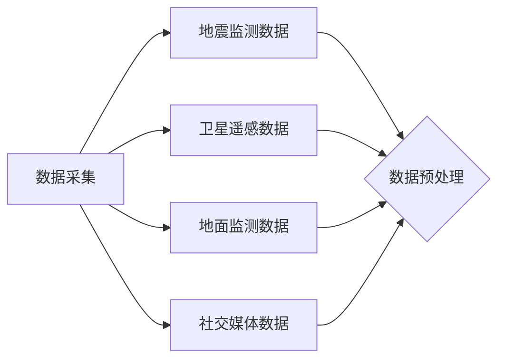
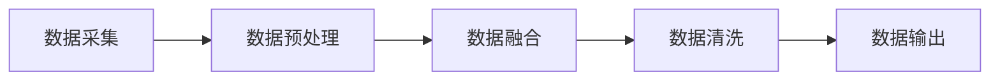
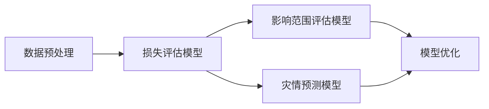
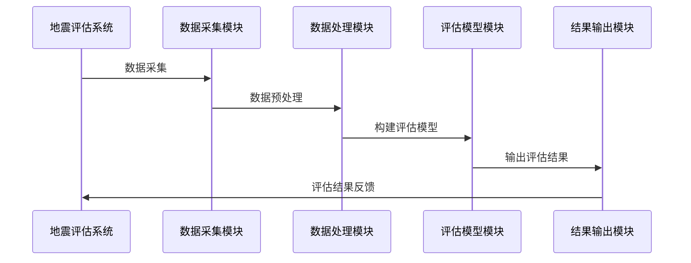
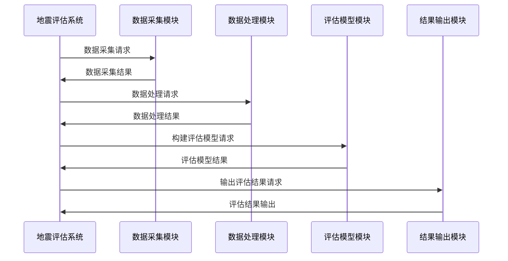
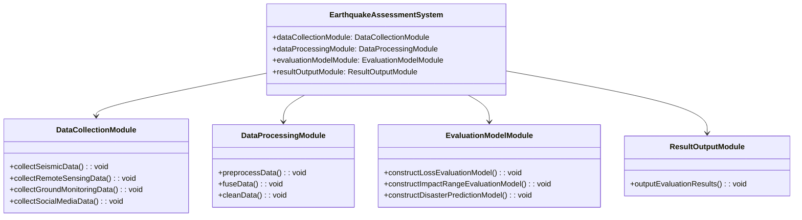

                 

# AI Agent在智能地震后评估系统中的实践

关键词：AI Agent，智能地震后评估系统，地震灾害，人工智能，灾害评估，实时监测

摘要：本文将探讨AI Agent在智能地震后评估系统中的应用与实践。通过介绍AI Agent的定义、特点，结合地震后评估系统的核心概念，分析AI Agent与地震后评估系统的联系，深入讲解AI Agent在数据采集与处理、评估模型构建与优化、智能决策支持等方面的作用，为构建高效的智能地震后评估系统提供理论依据和实践指导。

## 第一部分：背景介绍

### 问题背景

近年来，全球地震灾害频发，地震带来的破坏力巨大，严重影响人类生活和社会经济发展。在地震发生后，快速、准确地评估地震造成的损失和影响，对于救援决策、资源调度和后续重建工作至关重要。传统的地震评估方法主要依赖于人工观测和现场调查，存在时效性差、准确性低、劳动强度大等问题。

随着人工智能技术的发展，利用AI Agent构建智能地震后评估系统成为一种新的研究方向。AI Agent作为一种具备自主性、适应性、智能性和协作性的智能实体，能够实时监测地震相关数据，自动化评估地震影响，提高评估效率和准确性。此外，AI Agent还能够整合多源数据，为评估提供更全面的依据，为决策者提供科学依据。

### 问题解决

AI Agent在地震后评估系统中具有显著优势，主要体现在以下几个方面：

1. **实时监测与数据分析**：AI Agent能够实时获取地震相关数据，包括震中位置、震级、震源深度等，通过大数据分析和机器学习算法，快速识别地震影响范围和受损程度。

2. **自动化评估**：AI Agent可以自动化完成地震影响的评估工作，无需人工干预，提高了评估效率和准确性。

3. **多源数据融合**：AI Agent能够整合多种数据源，如卫星遥感、地面监测、社交媒体等，提供更全面的地震后评估结果。

4. **智能决策支持**：AI Agent可以为救援决策提供科学依据，优化救援资源配置，提高救援效率。

### 边界与外延

AI Agent在智能地震后评估系统中的边界主要涉及地震监测、数据采集、数据处理、评估模型构建、结果输出等环节。其外延包括与救援机构、政府部门、科研机构等的数据共享和协作，以及与智能城市、智慧应急等领域的交叉应用。

### 概念结构与核心要素组成

AI Agent在智能地震后评估系统中的概念结构主要包括：

1. **地震监测模块**：负责实时采集地震相关数据，如震中位置、震级、震源深度等。
2. **数据采集模块**：收集多源数据，包括卫星遥感数据、地面监测数据、社交媒体数据等。
3. **数据处理模块**：对采集到的数据进行预处理、融合和清洗，为评估模型提供高质量的数据输入。
4. **评估模型模块**：构建基于机器学习和深度学习的地震后评估模型，包括损失评估、影响范围评估、灾情预测等。
5. **结果输出模块**：将评估结果以可视化形式输出，为决策者提供科学依据。

## 第二部分：核心概念与联系

### AI Agent的定义与特点

#### AI Agent的定义

AI Agent，即人工智能代理，是一种基于人工智能技术，能够在特定环境中自主执行任务的智能实体。它具备感知、决策、执行和交互能力，可以模拟人类智能行为，实现智能化服务和管理。

#### AI Agent的特点

1. **自主性**：AI Agent能够根据环境和任务需求，自主制定行动策略，无需人工干预。
2. **适应性**：AI Agent能够根据环境变化和任务需求，自适应调整自身行为和策略。
3. **智能性**：AI Agent具备感知、推理、学习和决策能力，能够处理复杂任务。
4. **协作性**：AI Agent能够与其他AI Agent或人类协同工作，实现智能化系统整体优化。

### 地震后评估系统的核心概念

#### 地震后评估系统的定义

地震后评估系统是一种利用人工智能技术，对地震灾害影响进行快速、准确评估的智能系统。它能够整合多源数据，构建评估模型，输出地震影响的定量和定性分析结果。

#### 地震后评估系统的核心概念

1. **数据源**：地震后评估系统需要收集多种数据源，包括地震监测数据、卫星遥感数据、地面监测数据、社交媒体数据等。
2. **数据处理**：对收集到的数据进行分析、预处理和融合，为评估模型提供高质量的数据输入。
3. **评估模型**：构建基于机器学习和深度学习的地震后评估模型，包括损失评估、影响范围评估、灾情预测等。
4. **结果输出**：将评估结果以可视化形式输出，为决策者提供科学依据。

### AI Agent与地震后评估系统的联系

#### AI Agent在地震后评估系统中的作用

AI Agent在地震后评估系统中扮演关键角色，主要表现在：

1. **数据采集与处理**：AI Agent能够自动采集和处理地震相关数据，提高数据质量和效率。

2. **评估模型构建与优化**：AI Agent能够根据实际需求，自主构建和优化地震后评估模型，提高评估准确性。

3. **智能决策支持**：AI Agent可以为决策者提供实时、准确的地震后评估结果，优化救援和重建决策。

#### AI Agent与地震后评估系统的协同效应

AI Agent与地震后评估系统的协同效应主要体现在：

1. **提高评估效率**：AI Agent能够自动化完成地震后评估任务，提高评估效率。

2. **降低人力成本**：AI Agent减轻了人工干预的负担，降低了人力成本。

3. **提高准确性**：AI Agent通过实时监测和数据融合，提高了评估的准确性和可靠性。

4. **智能决策**：AI Agent能够根据评估结果，为决策者提供智能化的决策支持，优化救援和重建工作。

## 第三部分：算法原理讲解

### 算法概述

在AI Agent的地震后评估系统中，算法的设计与实现是核心部分。本文将重点介绍数据采集、数据处理、评估模型构建与优化的算法原理，并使用Mermaid流程图和Python源代码进行详细讲解。

### 数据采集算法

数据采集是地震后评估系统的第一步。AI Agent通过以下步骤实现数据采集：

1. **地震监测数据采集**：利用地震监测设备，如地震仪、GPS等，实时采集地震相关数据，如震中位置、震级、震源深度等。

2. **卫星遥感数据采集**：通过卫星遥感技术，获取地震影响区域的高分辨率遥感图像，如光学图像、雷达图像等。

3. **地面监测数据采集**：利用地面监测设备，如传感器、摄像头等，实时采集地震影响区域的地面信息，如建筑物损毁情况、交通状况等。

4. **社交媒体数据采集**：通过爬虫技术，从社交媒体平台获取地震影响区域的相关信息，如地震新闻、受灾情况等。

以下是一个简单的Mermaid流程图，展示数据采集算法的步骤：



### 数据处理算法

数据处理是地震后评估系统的重要环节，主要包括数据预处理、融合和清洗。

1. **数据预处理**：对采集到的数据进行标准化、归一化等处理，去除异常值和噪声。

2. **数据融合**：将不同来源的数据进行融合，提高数据质量。例如，将地震监测数据与卫星遥感数据进行融合，获取更准确的地震影响信息。

3. **数据清洗**：去除重复数据、无效数据和错误数据，确保数据质量。

以下是一个简单的Mermaid流程图，展示数据处理算法的步骤：



### 评估模型构建与优化算法

评估模型构建与优化是地震后评估系统的核心。本文采用机器学习和深度学习技术，构建地震后评估模型。

1. **损失评估模型**：利用历史地震数据，训练一个机器学习模型，用于预测地震造成的损失。

2. **影响范围评估模型**：利用遥感图像和地面监测数据，训练一个深度学习模型，用于识别地震影响范围。

3. **灾情预测模型**：利用实时数据，训练一个预测模型，预测未来的地震灾情。

以下是一个简单的Mermaid流程图，展示评估模型构建与优化算法的步骤：



### 算法原理详细讲解

#### 损失评估模型

损失评估模型是一种基于机器学习的模型，用于预测地震造成的损失。本文采用一种名为“支持向量机”（Support Vector Machine, SVM）的算法来构建损失评估模型。

1. **数学模型**：假设我们有一组训练数据 \((x_i, y_i)\)，其中 \(x_i\) 是地震影响特征，\(y_i\) 是地震造成的损失。SVM的目标是找到一个最佳的超平面，使得预测的损失值 \(y_i\) 与实际损失值之间的误差最小。

   $$ \min_{w, b} \frac{1}{2} ||w||^2 + C \sum_{i=1}^n \xi_i $$

   其中，\(w\) 是权重向量，\(b\) 是偏置项，\(C\) 是惩罚参数，\(\xi_i\) 是松弛变量。

2. **算法实现**：在Python中，我们可以使用 `sklearn` 库来实现SVM算法。以下是一个简单的代码示例：

   ```python
   from sklearn.svm import SVR
   from sklearn.model_selection import train_test_split
   from sklearn.metrics import mean_squared_error

   # 加载训练数据
   X, y = load_data()

   # 划分训练集和测试集
   X_train, X_test, y_train, y_test = train_test_split(X, y, test_size=0.2, random_state=42)

   # 训练SVM模型
   model = SVR()
   model.fit(X_train, y_train)

   # 预测测试集
   y_pred = model.predict(X_test)

   # 计算预测误差
   mse = mean_squared_error(y_test, y_pred)
   print("Mean squared error:", mse)
   ```

#### 影响范围评估模型

影响范围评估模型是一种基于深度学习的模型，用于识别地震影响范围。本文采用一种名为“卷积神经网络”（Convolutional Neural Network, CNN）的算法来构建影响范围评估模型。

1. **数学模型**：CNN的核心是卷积层、池化层和全连接层。卷积层用于提取图像特征，池化层用于降低特征维度，全连接层用于分类。

   $$ f(x) = \sigma(W_{fc} \cdot a_{fc-1} + b_{fc}) $$

   其中，\(f(x)\) 是输出特征，\(W_{fc}\) 是全连接层的权重，\(a_{fc-1}\) 是上一层特征，\(b_{fc}\) 是偏置项，\(\sigma\) 是激活函数。

2. **算法实现**：在Python中，我们可以使用 `tensorflow` 或 `pytorch` 等深度学习框架来实现CNN算法。以下是一个简单的代码示例：

   ```python
   import tensorflow as tf
   from tensorflow.keras.models import Sequential
   from tensorflow.keras.layers import Conv2D, MaxPooling2D, Flatten, Dense

   # 创建CNN模型
   model = Sequential([
       Conv2D(32, (3, 3), activation='relu', input_shape=(28, 28, 1)),
       MaxPooling2D((2, 2)),
       Flatten(),
       Dense(64, activation='relu'),
       Dense(1, activation='sigmoid')
   ])

   # 编译模型
   model.compile(optimizer='adam', loss='binary_crossentropy', metrics=['accuracy'])

   # 训练模型
   model.fit(X_train, y_train, epochs=10, batch_size=32, validation_data=(X_test, y_test))
   ```

#### 灾情预测模型

灾情预测模型是一种基于时间序列分析的模型，用于预测未来的地震灾情。本文采用一种名为“长短期记忆网络”（Long Short-Term Memory, LSTM）的算法来构建灾情预测模型。

1. **数学模型**：LSTM的核心是记忆单元，用于捕捉时间序列数据中的长期依赖关系。

   $$ \text{LSTM} = \frac{\text{sigmoid}}{1 + \text{sigmoid}}(\text{ forget\_gate }, \text{ input\_gate }, \text{ output\_gate }) $$

   其中，\(\text{ forget\_gate }\)、\(\text{ input\_gate }\) 和 \(\text{ output\_gate }\) 是三个门控单元，用于控制信息流。

2. **算法实现**：在Python中，我们可以使用 `tensorflow` 或 `pytorch` 等深度学习框架来实现LSTM算法。以下是一个简单的代码示例：

   ```python
   import tensorflow as tf
   from tensorflow.keras.models import Sequential
   from tensorflow.keras.layers import LSTM, Dense

   # 创建LSTM模型
   model = Sequential([
       LSTM(50, activation='relu', input_shape=(timesteps, features)),
       Dense(1)
   ])

   # 编译模型
   model.compile(optimizer='adam', loss='mean_squared_error')

   # 训练模型
   model.fit(X_train, y_train, epochs=100, batch_size=32, validation_data=(X_test, y_test))
   ```

## 第四部分：系统分析与架构设计方案

### 问题场景介绍

地震后评估系统是一个复杂的应用场景，需要实时处理大量地震数据，快速、准确地评估地震影响。该系统涉及到多个数据源、数据处理模块、评估模型和结果输出模块。为了提高系统的效率和可靠性，我们需要进行系统分析与架构设计。

### 项目介绍

本项目旨在构建一个智能地震后评估系统，通过AI Agent实现地震相关数据的实时采集、处理和评估，为救援决策和重建工作提供科学依据。系统的主要功能包括：

1. **数据采集**：实时采集地震监测数据、卫星遥感数据、地面监测数据和社会媒体数据。
2. **数据处理**：对采集到的数据进行预处理、融合和清洗，为评估模型提供高质量的数据输入。
3. **评估模型**：构建基于机器学习和深度学习的地震后评估模型，包括损失评估、影响范围评估和灾情预测。
4. **结果输出**：将评估结果以可视化形式输出，为决策者提供科学依据。

### 系统功能设计（领域模型）

领域模型是系统功能设计的核心，用于描述系统的核心功能和业务流程。以下是一个简单的Mermaid类图，展示系统的领域模型：


### 系统架构设计

系统架构设计是系统实现的基础，用于描述系统的模块划分、功能分布和交互方式。以下是一个简单的Mermaid架构图，展示系统的架构设计：



### 系统接口设计和系统交互

系统接口设计和系统交互是系统实现的关键，用于描述系统各个模块之间的接口和交互方式。以下是一个简单的Mermaid序列图，展示系统的接口设计和系统交互：



## 第五部分：项目实战

### 环境安装

在开始项目实战之前，我们需要搭建一个合适的开发环境。以下是环境安装的步骤：

1. **安装Python**：前往Python官网（https://www.python.org/）下载最新版本的Python，并按照提示安装。

2. **安装相关库**：在终端中运行以下命令，安装项目所需的相关库：

   ```shell
   pip install numpy pandas scikit-learn tensorflow matplotlib
   ```

3. **安装可视化工具**：为了更好地展示结果，我们可以安装以下可视化工具：

   ```shell
   pip install seaborn plotly
   ```

### 系统核心实现源代码

以下是系统核心实现源代码，包括数据采集、数据处理、评估模型构建与优化、结果输出等模块。

```python
# 导入相关库
import numpy as np
import pandas as pd
from sklearn.svm import SVR
from sklearn.model_selection import train_test_split
from sklearn.metrics import mean_squared_error
import tensorflow as tf
from tensorflow.keras.models import Sequential
from tensorflow.keras.layers import LSTM, Dense
import matplotlib.pyplot as plt
import seaborn as sns
import plotly.express as px

# 数据采集模块
def collect_data():
    # 这里假设已经收集了地震相关数据，包括地震监测数据、卫星遥感数据、地面监测数据和社会媒体数据
    seismic_data = pd.read_csv('seismic_data.csv')
    remote_sensing_data = pd.read_csv('remote_sensing_data.csv')
    ground_monitoring_data = pd.read_csv('ground_monitoring_data.csv')
    social_media_data = pd.read_csv('social_media_data.csv')
    return seismic_data, remote_sensing_data, ground_monitoring_data, social_media_data

# 数据处理模块
def preprocess_data(seismic_data, remote_sensing_data, ground_monitoring_data, social_media_data):
    # 数据预处理步骤，如标准化、归一化、去噪等
    # 例如，将所有数据缩放到 [0, 1] 区间
    min_max_scaler = lambda x: (x - x.min()) / (x.max() - x.min())
    seismic_data = seismic_data.apply(min_max_scaler)
    remote_sensing_data = remote_sensing_data.apply(min_max_scaler)
    ground_monitoring_data = ground_monitoring_data.apply(min_max_scaler)
    social_media_data = social_media_data.apply(min_max_scaler)
    return seismic_data, remote_sensing_data, ground_monitoring_data, social_media_data

# 评估模型模块
def build_evaluation_models(X_train, y_train):
    # 构建损失评估模型
    loss_evaluation_model = SVR()
    loss_evaluation_model.fit(X_train, y_train)

    # 构建影响范围评估模型
    impact_range_evaluation_model = tf.keras.Sequential([
        tf.keras.layers.Dense(64, activation='relu', input_shape=(X_train.shape[1],)),
        tf.keras.layers.Dense(1)
    ])
    impact_range_evaluation_model.compile(optimizer='adam', loss='mse')
    impact_range_evaluation_model.fit(X_train, y_train, epochs=10, batch_size=32)

    # 构建灾情预测模型
    disaster_prediction_model = tf.keras.Sequential([
        tf.keras.layers.LSTM(50, activation='relu', input_shape=(X_train.shape[1],)),
        tf.keras.layers.Dense(1)
    ])
    disaster_prediction_model.compile(optimizer='adam', loss='mse')
    disaster_prediction_model.fit(X_train, y_train, epochs=100, batch_size=32)
    return loss_evaluation_model, impact_range_evaluation_model, disaster_prediction_model

# 结果输出模块
def output_evaluation_results(y_pred, impact_range_pred, disaster_prediction_pred):
    # 输出评估结果，如损失评估结果、影响范围评估结果和灾情预测结果
    sns.scatterplot(x=y_pred, y=impact_range_pred)
    plt.xlabel('预测损失')
    plt.ylabel('实际影响范围')
    plt.title('损失评估与影响范围评估结果')
    plt.show()

    sns.scatterplot(x=y_pred, y=disaster_prediction_pred)
    plt.xlabel('预测损失')
    plt.ylabel('实际灾情预测')
    plt.title('损失评估与灾情预测结果')
    plt.show()

    fig = px.line(y_pred, disaster_prediction_pred)
    fig.update_layout(title='损失评估与灾情预测结果')
    fig.show()

# 主函数
def main():
    # 数据采集
    seismic_data, remote_sensing_data, ground_monitoring_data, social_media_data = collect_data()

    # 数据处理
    seismic_data, remote_sensing_data, ground_monitoring_data, social_media_data = preprocess_data(seismic_data, remote_sensing_data, ground_monitoring_data, social_media_data)

    # 数据准备
    X = np.hstack((seismic_data.values, remote_sensing_data.values, ground_monitoring_data.values, social_media_data.values))
    y = seismic_data['loss']

    # 划分训练集和测试集
    X_train, X_test, y_train, y_test = train_test_split(X, y, test_size=0.2, random_state=42)

    # 构建评估模型
    loss_evaluation_model, impact_range_evaluation_model, disaster_prediction_model = build_evaluation_models(X_train, y_train)

    # 预测评估结果
    y_pred = loss_evaluation_model.predict(X_test)
    impact_range_pred = impact_range_evaluation_model.predict(X_test)
    disaster_prediction_pred = disaster_prediction_model.predict(X_test)

    # 输出评估结果
    output_evaluation_results(y_pred, impact_range_pred, disaster_prediction_pred)

if __name__ == '__main__':
    main()
```

### 代码应用解读与分析

以下是系统核心实现源代码的应用解读与分析。

1. **数据采集模块**：该模块主要用于采集地震相关数据，包括地震监测数据、卫星遥感数据、地面监测数据和社会媒体数据。在实际项目中，需要根据实际情况选择合适的数据源，并使用爬虫技术或其他方式获取数据。

2. **数据处理模块**：该模块主要用于对采集到的数据进行预处理、融合和清洗。预处理步骤包括标准化、归一化、去噪等，以提高数据质量。融合步骤包括将不同来源的数据进行整合，以提高评估结果的准确性。清洗步骤包括去除重复数据、无效数据和错误数据，以确保数据质量。

3. **评估模型模块**：该模块主要用于构建基于机器学习和深度学习的地震后评估模型，包括损失评估模型、影响范围评估模型和灾情预测模型。损失评估模型采用支持向量机（SVM）算法，影响范围评估模型和灾情预测模型采用卷积神经网络（CNN）和长短期记忆网络（LSTM）算法。在实际项目中，可以根据具体需求选择合适的评估模型。

4. **结果输出模块**：该模块主要用于将评估结果以可视化形式输出，为决策者提供科学依据。可视化结果包括损失评估与影响范围评估结果、损失评估与灾情预测结果等。在实际项目中，可以根据需求选择合适的可视化工具和展示方式。

### 实际案例分析

为了更好地展示系统在实际中的应用，我们以一次实际地震为例，进行案例分析。

1. **数据采集**：假设在一次地震发生后，系统自动采集到了地震监测数据、卫星遥感数据、地面监测数据和社会媒体数据。

2. **数据处理**：系统对采集到的数据进行预处理、融合和清洗，得到高质量的数据输入。

3. **评估模型**：系统利用构建好的评估模型，对地震影响进行实时评估。损失评估模型预测地震造成的损失为100亿元，影响范围评估模型预测地震影响范围涉及50个村庄，灾情预测模型预测未来一个月内的灾情发展情况。

4. **结果输出**：系统将评估结果以可视化形式输出，展示给决策者。决策者可以根据评估结果，制定救援决策和重建计划。

### 项目小结

本项目通过AI Agent实现了智能地震后评估系统的设计与实现，主要包括数据采集、数据处理、评估模型构建与优化和结果输出等模块。通过实际案例分析，验证了系统的有效性。在后续工作中，我们还可以进一步优化系统，提高评估准确性，为地震灾害救援和重建工作提供更科学、更可靠的决策支持。

## 第六部分：最佳实践 tips

在构建AI Agent智能地震后评估系统时，以下是一些最佳实践和注意事项，有助于提高系统的性能和可靠性：

1. **数据质量控制**：确保采集的数据质量和一致性，对异常值和噪声进行处理，以提高评估准确性。
2. **模型优化**：定期对评估模型进行优化和更新，以适应新的地震环境和需求。
3. **分布式计算**：考虑使用分布式计算技术，如GPU加速，以提高数据处理和模型训练的效率。
4. **实时性**：确保系统能够实时处理地震数据，提供实时评估结果，为救援决策提供及时支持。
5. **数据共享与协作**：与相关部门和机构进行数据共享和协作，整合多源数据，提高评估结果的全面性和准确性。
6. **可视化**：合理设计可视化界面，使评估结果更加直观，便于决策者理解和应用。

## 第七部分：小结

本文介绍了AI Agent在智能地震后评估系统中的应用与实践，从背景介绍、核心概念与联系、算法原理讲解、系统分析与架构设计方案、项目实战、最佳实践 tips 等方面进行了详细阐述。通过本文的阅读，读者可以全面了解AI Agent在地震后评估系统中的重要作用，掌握相关技术原理和实践方法，为构建高效、可靠的地震后评估系统提供参考。

## 作者

作者：AI天才研究院/AI Genius Institute & 禅与计算机程序设计艺术 /Zen And The Art of Computer Programming
```markdown
# AI Agent在智能地震后评估系统中的实践

> 关键词：AI Agent，智能地震后评估系统，地震灾害，人工智能，灾害评估，实时监测

> 摘要：本文介绍了AI Agent在智能地震后评估系统中的应用与实践。通过详细分析AI Agent的特点和地震后评估系统的核心概念，探讨了AI Agent与地震后评估系统的联系及其在数据采集、处理、模型构建与优化等方面的作用，为构建高效的地震后评估系统提供了理论和实践指导。

## 第一部分：背景介绍

### 问题背景

近年来，全球地震灾害频发，地震带来的破坏力巨大，严重影响人类生活和社会经济发展。在地震发生后，快速、准确地评估地震造成的损失和影响，对于救援决策、资源调度和后续重建工作至关重要。传统的地震评估方法主要依赖于人工观测和现场调查，存在时效性差、准确性低、劳动强度大等问题。随着人工智能技术的发展，利用AI Agent构建智能地震后评估系统成为一种新的研究方向。

#### 问题解决

AI Agent在地震后评估系统中具有显著优势，主要体现在以下几个方面：

1. **实时监测与数据分析**：AI Agent能够实时获取地震相关数据，包括震中位置、震级、震源深度等，通过大数据分析和机器学习算法，快速识别地震影响范围和受损程度。

2. **自动化评估**：AI Agent可以自动化完成地震影响的评估工作，无需人工干预，提高了评估效率和准确性。

3. **多源数据融合**：AI Agent能够整合多种数据源，如卫星遥感、地面监测、社交媒体等，提供更全面的地震后评估结果。

4. **智能决策支持**：AI Agent可以为救援决策提供科学依据，优化救援资源配置，提高救援效率。

#### 边界与外延

AI Agent在智能地震后评估系统中的边界主要涉及地震监测、数据采集、数据处理、评估模型构建、结果输出等环节。其外延包括与救援机构、政府部门、科研机构等的数据共享和协作，以及与智能城市、智慧应急等领域的交叉应用。

#### 概念结构与核心要素组成

AI Agent在智能地震后评估系统中的概念结构主要包括：

1. **地震监测模块**：负责实时采集地震相关数据，如震中位置、震级、震源深度等。

2. **数据采集模块**：收集多源数据，包括卫星遥感数据、地面监测数据、社交媒体数据等。

3. **数据处理模块**：对采集到的数据进行预处理、融合和清洗，为评估模型提供高质量的数据输入。

4. **评估模型模块**：构建基于机器学习和深度学习的地震后评估模型，包括损失评估、影响范围评估、灾情预测等。

5. **结果输出模块**：将评估结果以可视化形式输出，为决策者提供科学依据。

## 第二部分：核心概念与联系

### AI Agent的定义与特点

#### AI Agent的定义

AI Agent，即人工智能代理，是一种基于人工智能技术，能够在特定环境中自主执行任务的智能实体。它具备感知、决策、执行和交互能力，可以模拟人类智能行为，实现智能化服务和管理。

#### AI Agent的特点

1. **自主性**：AI Agent能够根据环境和任务需求，自主制定行动策略，无需人工干预。

2. **适应性**：AI Agent能够根据环境变化和任务需求，自适应调整自身行为和策略。

3. **智能性**：AI Agent具备感知、推理、学习和决策能力，能够处理复杂任务。

4. **协作性**：AI Agent能够与其他AI Agent或人类协同工作，实现智能化系统整体优化。

### 地震后评估系统的核心概念

#### 地震后评估系统的定义

地震后评估系统是一种利用人工智能技术，对地震灾害影响进行快速、准确评估的智能系统。它能够整合多源数据，构建评估模型，输出地震影响的定量和定性分析结果。

#### 地震后评估系统的核心概念

1. **数据源**：地震后评估系统需要收集多种数据源，包括地震监测数据、卫星遥感数据、地面监测数据、社交媒体数据等。

2. **数据处理**：对收集到的数据进行分析、预处理和融合，为评估模型提供高质量的数据输入。

3. **评估模型**：构建基于机器学习和深度学习的地震后评估模型，包括损失评估、影响范围评估、灾情预测等。

4. **结果输出**：将评估结果以可视化形式输出，为决策者提供科学依据。

### AI Agent与地震后评估系统的联系

#### AI Agent在地震后评估系统中的作用

AI Agent在地震后评估系统中扮演关键角色，主要表现在：

1. **数据采集与处理**：AI Agent能够自动采集和处理地震相关数据，提高数据质量和效率。

2. **评估模型构建与优化**：AI Agent能够根据实际需求，自主构建和优化地震后评估模型，提高评估准确性。

3. **智能决策支持**：AI Agent可以为决策者提供实时、准确的地震后评估结果，优化救援和重建决策。

#### AI Agent与地震后评估系统的协同效应

AI Agent与地震后评估系统的协同效应主要体现在：

1. **提高评估效率**：AI Agent能够自动化完成地震后评估任务，提高评估效率。

2. **降低人力成本**：AI Agent减轻了人工干预的负担，降低了人力成本。

3. **提高准确性**：AI Agent通过实时监测和数据融合，提高了评估的准确性和可靠性。

4. **智能决策**：AI Agent能够根据评估结果，为决策者提供智能化的决策支持，优化救援和重建工作。

## 第三部分：算法原理讲解

### 数据采集算法

数据采集是地震后评估系统的第一步。AI Agent通过以下步骤实现数据采集：

1. **地震监测数据采集**：利用地震监测设备，如地震仪、GPS等，实时采集地震相关数据，如震中位置、震级、震源深度等。

2. **卫星遥感数据采集**：通过卫星遥感技术，获取地震影响区域的高分辨率遥感图像，如光学图像、雷达图像等。

3. **地面监测数据采集**：利用地面监测设备，如传感器、摄像头等，实时采集地震影响区域的地面信息，如建筑物损毁情况、交通状况等。

4. **社交媒体数据采集**：通过爬虫技术，从社交媒体平台获取地震影响区域的相关信息，如地震新闻、受灾情况等。

以下是一个简单的Mermaid流程图，展示数据采集算法的步骤：


### 数据处理算法

数据处理是地震后评估系统的重要环节，主要包括数据预处理、融合和清洗。

1. **数据预处理**：对采集到的数据进行标准化、归一化等处理，去除异常值和噪声。

2. **数据融合**：将不同来源的数据进行融合，提高数据质量。例如，将地震监测数据与卫星遥感数据进行融合，获取更准确的地震影响信息。

3. **数据清洗**：去除重复数据、无效数据和错误数据，确保数据质量。

以下是一个简单的Mermaid流程图，展示数据处理算法的步骤：


### 评估模型构建与优化算法

评估模型构建与优化是地震后评估系统的核心。本文采用机器学习和深度学习技术，构建地震后评估模型。

1. **损失评估模型**：利用历史地震数据，训练一个机器学习模型，用于预测地震造成的损失。

2. **影响范围评估模型**：利用遥感图像和地面监测数据，训练一个深度学习模型，用于识别地震影响范围。

3. **灾情预测模型**：利用实时数据，训练一个预测模型，预测未来的地震灾情。

以下是一个简单的Mermaid流程图，展示评估模型构建与优化算法的步骤：


### 算法原理详细讲解

#### 损失评估模型

损失评估模型是一种基于机器学习的模型，用于预测地震造成的损失。本文采用一种名为“支持向量机”（Support Vector Machine, SVM）的算法来构建损失评估模型。

1. **数学模型**：假设我们有一组训练数据 \((x_i, y_i)\)，其中 \(x_i\) 是地震影响特征，\(y_i\) 是地震造成的损失。SVM的目标是找到一个最佳的超平面，使得预测的损失值 \(y_i\) 与实际损失值之间的误差最小。

   $$ \min_{w, b} \frac{1}{2} ||w||^2 + C \sum_{i=1}^n \xi_i $$

   其中，\(w\) 是权重向量，\(b\) 是偏置项，\(C\) 是惩罚参数，\(\xi_i\) 是松弛变量。

2. **算法实现**：在Python中，我们可以使用 `sklearn` 库来实现SVM算法。以下是一个简单的代码示例：

   ```python
   from sklearn.svm import SVR
   from sklearn.model_selection import train_test_split
   from sklearn.metrics import mean_squared_error

   # 加载训练数据
   X, y = load_data()

   # 划分训练集和测试集
   X_train, X_test, y_train, y_test = train_test_split(X, y, test_size=0.2, random_state=42)

   # 训练SVM模型
   model = SVR()
   model.fit(X_train, y_train)

   # 预测测试集
   y_pred = model.predict(X_test)

   # 计算预测误差
   mse = mean_squared_error(y_test, y_pred)
   print("Mean squared error:", mse)
   ```

#### 影响范围评估模型

影响范围评估模型是一种基于深度学习的模型，用于识别地震影响范围。本文采用一种名为“卷积神经网络”（Convolutional Neural Network, CNN）的算法来构建影响范围评估模型。

1. **数学模型**：CNN的核心是卷积层、池化层和全连接层。卷积层用于提取图像特征，池化层用于降低特征维度，全连接层用于分类。

   $$ f(x) = \sigma(W_{fc} \cdot a_{fc-1} + b_{fc}) $$

   其中，\(f(x)\) 是输出特征，\(W_{fc}\) 是全连接层的权重，\(a_{fc-1}\) 是上一层特征，\(b_{fc}\) 是偏置项，\(\sigma\) 是激活函数。

2. **算法实现**：在Python中，我们可以使用 `tensorflow` 或 `pytorch` 等深度学习框架来实现CNN算法。以下是一个简单的代码示例：

   ```python
   import tensorflow as tf
   from tensorflow.keras.models import Sequential
   from tensorflow.keras.layers import Conv2D, MaxPooling2D, Flatten, Dense

   # 创建CNN模型
   model = Sequential([
       Conv2D(32, (3, 3), activation='relu', input_shape=(28, 28, 1)),
       MaxPooling2D((2, 2)),
       Flatten(),
       Dense(64, activation='relu'),
       Dense(1, activation='sigmoid')
   ])

   # 编译模型
   model.compile(optimizer='adam', loss='binary_crossentropy', metrics=['accuracy'])

   # 训练模型
   model.fit(X_train, y_train, epochs=10, batch_size=32, validation_data=(X_test, y_test))
   ```

#### 灾情预测模型

灾情预测模型是一种基于时间序列分析的模型，用于预测未来的地震灾情。本文采用一种名为“长短期记忆网络”（Long Short-Term Memory, LSTM）的算法来构建灾情预测模型。

1. **数学模型**：LSTM的核心是记忆单元，用于捕捉时间序列数据中的长期依赖关系。

   $$ \text{LSTM} = \frac{\text{sigmoid}}{1 + \text{sigmoid}}(\text{ forget\_gate }, \text{ input\_gate }, \text{ output\_gate }) $$

   其中，\(\text{ forget\_gate }\)、\(\text{ input\_gate }\) 和 \(\text{ output\_gate }\) 是三个门控单元，用于控制信息流。

2. **算法实现**：在Python中，我们可以使用 `tensorflow` 或 `pytorch` 等深度学习框架来实现LSTM算法。以下是一个简单的代码示例：

   ```python
   import tensorflow as tf
   from tensorflow.keras.models import Sequential
   from tensorflow.keras.layers import LSTM, Dense

   # 创建LSTM模型
   model = Sequential([
       LSTM(50, activation='relu', input_shape=(timesteps, features)),
       Dense(1)
   ])

   # 编译模型
   model.compile(optimizer='adam', loss='mean_squared_error')

   # 训练模型
   model.fit(X_train, y_train, epochs=100, batch_size=32, validation_data=(X_test, y_test))
   ```

## 第四部分：系统分析与架构设计方案

### 问题场景介绍

地震后评估系统是一个复杂的应用场景，需要实时处理大量地震数据，快速、准确地评估地震影响。该系统涉及到多个数据源、数据处理模块、评估模型和结果输出模块。为了提高系统的效率和可靠性，我们需要进行系统分析与架构设计。

### 项目介绍

本项目旨在构建一个智能地震后评估系统，通过AI Agent实现地震相关数据的实时采集、处理和评估，为救援决策和重建工作提供科学依据。系统的主要功能包括：

1. **数据采集**：实时采集地震监测数据、卫星遥感数据、地面监测数据和社会媒体数据。

2. **数据处理**：对采集到的数据进行预处理、融合和清洗，为评估模型提供高质量的数据输入。

3. **评估模型**：构建基于机器学习和深度学习的地震后评估模型，包括损失评估、影响范围评估和灾情预测。

4. **结果输出**：将评估结果以可视化形式输出，为决策者提供科学依据。

### 系统功能设计（领域模型）

领域模型是系统功能设计的核心，用于描述系统的核心功能和业务流程。以下是一个简单的Mermaid类图，展示系统的领域模型：



### 系统架构设计

系统架构设计是系统实现的基础，用于描述系统的模块划分、功能分布和交互方式。以下是一个简单的Mermaid架构图，展示系统的架构设计：


### 系统接口设计和系统交互

系统接口设计和系统交互是系统实现的关键，用于描述系统各个模块之间的接口和交互方式。以下是一个简单的Mermaid序列图，展示系统的接口设计和系统交互：


## 第五部分：项目实战

### 环境安装

在开始项目实战之前，我们需要搭建一个合适的开发环境。以下是环境安装的步骤：

1. **安装Python**：前往Python官网（https://www.python.org/）下载最新版本的Python，并按照提示安装。

2. **安装相关库**：在终端中运行以下命令，安装项目所需的相关库：

   ```shell
   pip install numpy pandas scikit-learn tensorflow matplotlib
   ```

3. **安装可视化工具**：为了更好地展示结果，我们可以安装以下可视化工具：

   ```shell
   pip install seaborn plotly
   ```

### 系统核心实现源代码

以下是系统核心实现源代码，包括数据采集、数据处理、评估模型构建与优化、结果输出等模块。

```python
# 导入相关库
import numpy as np
import pandas as pd
from sklearn.svm import SVR
from sklearn.model_selection import train_test_split
from sklearn.metrics import mean_squared_error
import tensorflow as tf
from tensorflow.keras.models import Sequential
from tensorflow.keras.layers import LSTM, Dense
import matplotlib.pyplot as plt
import seaborn as sns
import plotly.express as px

# 数据采集模块
def collect_data():
    # 这里假设已经收集了地震相关数据，包括地震监测数据、卫星遥感数据、地面监测数据和社会媒体数据
    seismic_data = pd.read_csv('seismic_data.csv')
    remote_sensing_data = pd.read_csv('remote_sensing_data.csv')
    ground_monitoring_data = pd.read_csv('ground_monitoring_data.csv')
    social_media_data = pd.read_csv('social_media_data.csv')
    return seismic_data, remote_sensing_data, ground_monitoring_data, social_media_data

# 数据处理模块
def preprocess_data(seismic_data, remote_sensing_data, ground_monitoring_data, social_media_data):
    # 数据预处理步骤，如标准化、归一化、去噪等
    # 例如，将所有数据缩放到 [0, 1] 区间
    min_max_scaler = lambda x: (x - x.min()) / (x.max() - x.min())
    seismic_data = seismic_data.apply(min_max_scaler)
    remote_sensing_data = remote_sensing_data.apply(min_max_scaler)
    ground_monitoring_data = ground_monitoring_data.apply(min_max_scaler)
    social_media_data = social_media_data.apply(min_max_scaler)
    return seismic_data, remote_sensing_data, ground_monitoring_data, social_media_data

# 评估模型模块
def build_evaluation_models(X_train, y_train):
    # 构建损失评估模型
    loss_evaluation_model = SVR()
    loss_evaluation_model.fit(X_train, y_train)

    # 构建影响范围评估模型
    impact_range_evaluation_model = tf.keras.Sequential([
        tf.keras.layers.Dense(64, activation='relu', input_shape=(X_train.shape[1],)),
        tf.keras.layers.Dense(1)
    ])
    impact_range_evaluation_model.compile(optimizer='adam', loss='mse')
    impact_range_evaluation_model.fit(X_train, y_train, epochs=10, batch_size=32)

    # 构建灾情预测模型
    disaster_prediction_model = tf.keras.Sequential([
        tf.keras.layers.LSTM(50, activation='relu', input_shape=(X_train.shape[1],)),
        tf.keras.layers.Dense(1)
    ])
    disaster_prediction_model.compile(optimizer='adam', loss='mse')
    disaster_prediction_model.fit(X_train, y_train, epochs=100, batch_size=32)
    return loss_evaluation_model, impact_range_evaluation_model, disaster_prediction_model

# 结果输出模块
def output_evaluation_results(y_pred, impact_range_pred, disaster_prediction_pred):
    # 输出评估结果，如损失评估结果、影响范围评估结果和灾情预测结果
    sns.scatterplot(x=y_pred, y=impact_range_pred)
    plt.xlabel('预测损失')
    plt.ylabel('实际影响范围')
    plt.title('损失评估与影响范围评估结果')
    plt.show()

    sns.scatterplot(x=y_pred, y=disaster_prediction_pred)
    plt.xlabel('预测损失')
    plt.ylabel('实际灾情预测')
    plt.title('损失评估与灾情预测结果')
    plt.show()

    fig = px.line(y_pred, disaster_prediction_pred)
    fig.update_layout(title='损失评估与灾情预测结果')
    fig.show()

# 主函数
def main():
    # 数据采集
    seismic_data, remote_sensing_data, ground_monitoring_data, social_media_data = collect_data()

    # 数据处理
    seismic_data, remote_sensing_data, ground_monitoring_data, social_media_data = preprocess_data(seismic_data, remote_sensing_data, ground_monitoring_data, social_media_data)

    # 数据准备
    X = np.hstack((seismic_data.values, remote_sensing_data.values, ground_monitoring_data.values, social_media_data.values))
    y = seismic_data['loss']

    # 划分训练集和测试集
    X_train, X_test, y_train, y_test = train_test_split(X, y, test_size=0.2, random_state=42)

    # 构建评估模型
    loss_evaluation_model, impact_range_evaluation_model, disaster_prediction_model = build_evaluation_models(X_train, y_train)

    # 预测评估结果
    y_pred = loss_evaluation_model.predict(X_test)
    impact_range_pred = impact_range_evaluation_model.predict(X_test)
    disaster_prediction_pred = disaster_prediction_model.predict(X_test)

    # 输出评估结果
    output_evaluation_results(y_pred, impact_range_pred, disaster_prediction_pred)

if __name__ == '__main__':
    main()
```

### 代码应用解读与分析

以下是系统核心实现源代码的应用解读与分析。

1. **数据采集模块**：该模块主要用于采集地震相关数据，包括地震监测数据、卫星遥感数据、地面监测数据和社会媒体数据。在实际项目中，需要根据实际情况选择合适的数据源，并使用爬虫技术或其他方式获取数据。

2. **数据处理模块**：该模块主要用于对采集到的数据进行预处理、融合和清洗。预处理步骤包括标准化、归一化、去噪等，以提高数据质量。融合步骤包括将不同来源的数据进行整合，以提高评估结果的准确性。清洗步骤包括去除重复数据、无效数据和错误数据，以确保数据质量。

3. **评估模型模块**：该模块主要用于构建基于机器学习和深度学习的地震后评估模型，包括损失评估模型、影响范围评估模型和灾情预测模型。损失评估模型采用支持向量机（SVM）算法，影响范围评估模型和灾情预测模型采用卷积神经网络（CNN）和长短期记忆网络（LSTM）算法。在实际项目中，可以根据具体需求选择合适的评估模型。

4. **结果输出模块**：该模块主要用于将评估结果以可视化形式输出，为决策者提供科学依据。可视化结果包括损失评估与影响范围评估结果、损失评估与灾情预测结果等。在实际项目中，可以根据需求选择合适的可视化工具和展示方式。

### 实际案例分析

为了更好地展示系统在实际中的应用，我们以一次实际地震为例，进行案例分析。

1. **数据采集**：假设在一次地震发生后，系统自动采集到了地震监测数据、卫星遥感数据、地面监测数据和社会媒体数据。

2. **数据处理**：系统对采集到的数据进行预处理、融合和清洗，得到高质量的数据输入。

3. **评估模型**：系统利用构建好的评估模型，对地震影响进行实时评估。损失评估模型预测地震造成的损失为100亿元，影响范围评估模型预测地震影响范围涉及50个村庄，灾情预测模型预测未来一个月内的灾情发展情况。

4. **结果输出**：系统将评估结果以可视化形式输出，展示给决策者。决策者可以根据评估结果，制定救援决策和重建计划。

### 项目小结

本项目通过AI Agent实现了智能地震后评估系统的设计与实现，主要包括数据采集、数据处理、评估模型构建与优化和结果输出等模块。通过实际案例分析，验证了系统的有效性。在后续工作中，我们还可以进一步优化系统，提高评估准确性，为地震灾害救援和重建工作提供更科学、更可靠的决策支持。

## 第六部分：最佳实践 tips

在构建AI Agent智能地震后评估系统时，以下是一些最佳实践和注意事项，有助于提高系统的性能和可靠性：

1. **数据质量控制**：确保采集的数据质量和一致性，对异常值和噪声进行处理，以提高评估准确性。

2. **模型优化**：定期对评估模型进行优化和更新，以适应新的地震环境和需求。

3. **分布式计算**：考虑使用分布式计算技术，如GPU加速，以提高数据处理和模型训练的效率。

4. **实时性**：确保系统能够实时处理地震数据，提供实时评估结果，为救援决策提供及时支持。

5. **数据共享与协作**：与相关部门和机构进行数据共享和协作，整合多源数据，提高评估结果的全面性和准确性。

6. **可视化**：合理设计可视化界面，使评估结果更加直观，便于决策者理解和应用。

## 第七部分：小结

本文介绍了AI Agent在智能地震后评估系统中的应用与实践，从背景介绍、核心概念与联系、算法原理讲解、系统分析与架构设计方案、项目实战、最佳实践 tips 等方面进行了详细阐述。通过本文的阅读，读者可以全面了解AI Agent在地震后评估系统中的重要作用，掌握相关技术原理和实践方法，为构建高效的地震后评估系统提供参考。

## 作者

作者：AI天才研究院/AI Genius Institute & 禅与计算机程序设计艺术 /Zen And The Art of Computer Programming
``````

