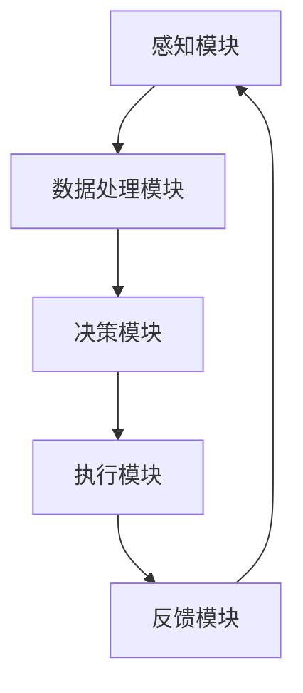
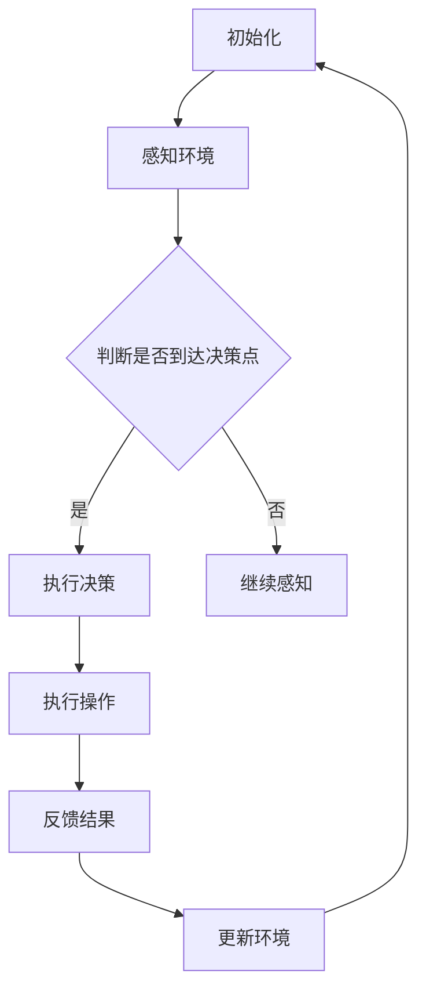
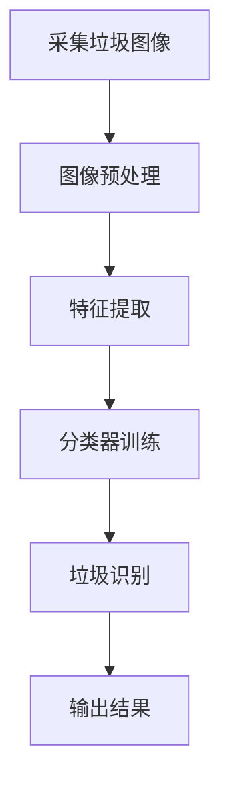
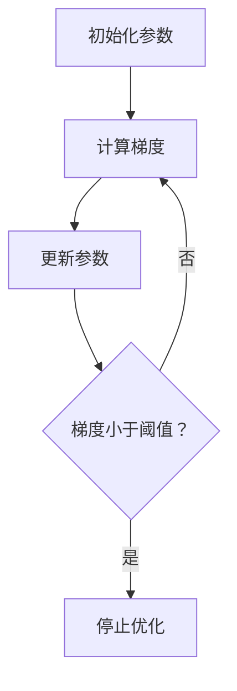
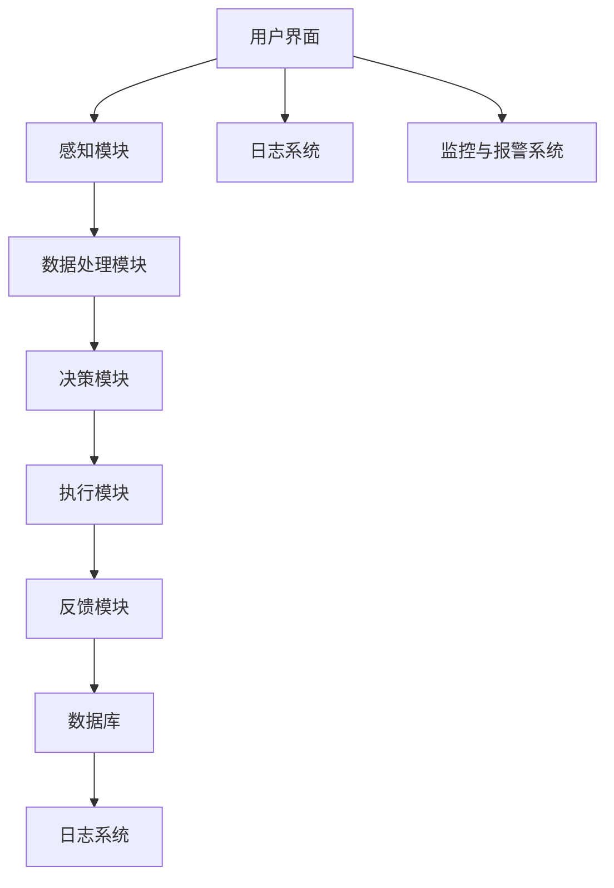
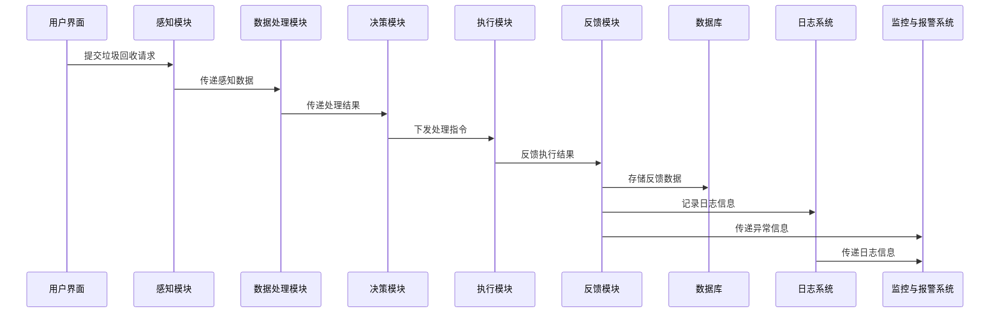

                 

### 引言

在现代科技飞速发展的时代，人工智能（AI）技术已经成为推动社会进步的重要力量。其中，AI Agent作为人工智能领域的关键技术，正逐步改变着各行各业。本文将探讨AI Agent在智能垃圾回收中的实践应用，详细解析这一前沿技术的原理和实现。

#### 问题提出

垃圾回收是一项关乎环境保护和资源利用的重要任务。随着城市化进程的加快和人口增长，垃圾产量日益增加，传统的垃圾回收方式已难以满足需求。智能垃圾回收系统应运而生，通过引入AI Agent技术，提升垃圾回收的效率和质量。然而，如何将AI Agent有效地应用到垃圾回收中，仍是一个亟待解决的问题。

#### 问题解决

智能垃圾回收系统的核心在于AI Agent，它能够通过感知、决策和执行等步骤，对垃圾进行自动化分类和处理。AI Agent不仅能够识别不同类型的垃圾，还能根据环境变化动态调整回收策略，从而提高系统的适应性和灵活性。

#### 边界与外延

在探讨AI Agent在智能垃圾回收中的应用时，我们需明确其技术边界和适用范围。AI Agent适用于城市垃圾分类、垃圾分拣、垃圾处理等场景，但在农村地区或特殊环境下，其应用效果可能受到限制。此外，AI Agent的性能和可靠性也依赖于数据质量、算法优化和硬件设施等因素。

#### 概念结构与核心要素组成

为了深入理解AI Agent在智能垃圾回收中的应用，我们需要了解其基本概念和结构。AI Agent由感知模块、决策模块和执行模块组成，通过这三个模块的协同工作，实现智能垃圾回收的目标。感知模块负责收集垃圾信息，决策模块根据感知信息进行分类决策，执行模块则负责执行具体操作。

### 小结

本文引出了智能垃圾回收问题，并介绍了AI Agent在这一领域的潜在应用。接下来，我们将进一步探讨AI Agent的核心概念和原理，深入分析其在智能垃圾回收系统中的实现和应用。通过本文的阅读，读者将对AI Agent在智能垃圾回收中的实践有更加全面和深入的认识。

### AI Agent基础

AI Agent是人工智能领域的一个重要概念，它代表了一种能够与环境进行交互并自主执行任务的实体。AI Agent的基本原理是模仿人类智能的决策过程，通过感知、理解、规划和行动等步骤，实现自主的智能行为。本文将从定义与分类、核心概念与联系、属性特征对比表格三个方面对AI Agent进行深入探讨。

#### 定义与分类

AI Agent，即人工智能代理，是一种在特定环境中能够感知、决策并执行任务的实体。按照功能和应用场景，AI Agent可以分为以下几类：

1. **自主型AI Agent**：能够完全自主决策并执行任务，如自动驾驶汽车、无人机等。
2. **半自主型AI Agent**：需要依赖人类或其他系统提供部分决策支持，如智能客服机器人、智能垃圾回收系统中的AI Agent。
3. **被动型AI Agent**：仅能响应外部事件，无法主动决策，如智能音箱、智能家居等。

#### 核心概念与联系

AI Agent的核心概念包括感知、决策、执行和反馈。这些概念相互联系，共同构成了AI Agent的基本工作流程。

1. **感知**：AI Agent通过感知模块收集环境信息，如垃圾种类、数量、分布等。
2. **决策**：基于感知信息，决策模块分析并选择最佳行动方案，如垃圾分类策略、回收路径等。
3. **执行**：执行模块根据决策结果，执行具体操作，如垃圾抓取、搬运、分类等。
4. **反馈**：通过执行结果反馈，不断优化AI Agent的行为和决策，提升系统性能。

这些核心概念相互依赖，共同作用，形成了一个闭环系统，使得AI Agent能够在复杂环境中自主运作。

#### 属性特征对比表格

为了更直观地了解AI Agent的属性特征，我们提供了以下对比表格。该表格列出了不同类型AI Agent的主要特征，包括自主性、适应性、学习能力等。

| 类别         | 自主性   | 适应性   | 学习能力   | 代表应用          |
|------------|--------|--------|---------|-------------|
| 自主型AI Agent | 高自主性   | 高适应性   | 强学习能力   | 自动驾驶汽车、无人机  |
| 半自主型AI Agent | 低自主性   | 中等适应性   | 中等学习能力   | 智能客服机器人、智能垃圾回收系统 |
| 被动型AI Agent | 无自主性   | 低适应性   | 弱学习能力   | 智能音箱、智能家居      |

#### 小结

在本章节中，我们详细介绍了AI Agent的定义与分类、核心概念与联系，并通过属性特征对比表格，对AI Agent的不同类型进行了深入分析。通过这些内容，读者可以更好地理解AI Agent的基础知识和应用场景，为后续章节的深入探讨打下坚实基础。

### 智能垃圾回收系统架构

智能垃圾回收系统的设计是实现高效、准确垃圾分类和处理的关键。本章节将详细介绍智能垃圾回收系统的架构设计，包括概念架构介绍和系统架构设计Mermaid架构图。

#### 概念架构介绍

智能垃圾回收系统通常由以下几个核心模块组成：

1. **感知模块**：负责收集垃圾信息，包括垃圾的种类、数量、分布等。
2. **数据处理模块**：对感知到的垃圾信息进行预处理、分析和分类。
3. **决策模块**：基于数据处理结果，制定最优的垃圾处理策略，包括垃圾的抓取、搬运、分类等。
4. **执行模块**：根据决策模块的指令，执行具体的垃圾处理操作。
5. **反馈模块**：对执行结果进行评估，提供反馈，用于系统优化。

这些模块协同工作，形成一个闭环系统，确保智能垃圾回收的高效运行。

#### 系统架构设计Mermaid架构图

为了更直观地展示智能垃圾回收系统的架构，我们使用Mermaid语言绘制了以下架构图：



在这个架构图中：

- **感知模块（A）**：通过传感器、摄像头等设备，实时收集垃圾信息。
- **数据处理模块（B）**：对感知到的垃圾信息进行预处理和分类，如图像识别、数据清洗等。
- **决策模块（C）**：基于处理后的数据，制定最优处理策略，如垃圾分类、垃圾搬运路径规划等。
- **执行模块（D）**：根据决策模块的指令，执行具体操作，如垃圾抓取、搬运、分类等。
- **反馈模块（E）**：对执行结果进行评估和反馈，用于优化系统的性能。

#### 小结

在本章节中，我们详细介绍了智能垃圾回收系统的架构设计，包括概念架构介绍和系统架构设计Mermaid架构图。通过这些内容，读者可以更好地理解智能垃圾回收系统的整体结构和各模块之间的交互关系，为后续章节的算法原理讲解和系统实现打下基础。

### AI Agent算法原理

AI Agent算法原理是智能垃圾回收系统的核心，它决定了系统能够高效、准确地进行垃圾分类和处理。本章节将详细讲解AI Agent算法原理，包括算法Mermaid流程图、Python源代码讲解、数学模型与公式，以及举例说明。

#### 算法Mermaid流程图

为了更好地理解AI Agent算法的工作流程，我们使用Mermaid语言绘制了以下算法流程图：



在这个流程图中，AI Agent的工作流程包括以下步骤：

1. **初始化（A）**：系统启动，初始化感知模块和执行模块。
2. **感知环境（B）**：感知模块通过传感器收集垃圾信息。
3. **判断是否到达决策点（C）**：系统根据当前状态判断是否需要执行决策。
4. **执行决策（D）**：如果需要决策，则进入决策模块，制定最优处理策略。
5. **执行操作（F）**：根据决策结果，执行具体操作，如垃圾抓取、搬运等。
6. **反馈结果（G）**：对执行结果进行评估和反馈。
7. **更新环境（H）**：根据反馈结果，更新环境状态，为下一次决策做准备。

#### Python源代码讲解

以下是AI Agent算法的Python源代码示例：

```python
import random

def sense_environment():
    # 模拟感知环境，返回垃圾类型
    return random.choice(["塑料", "纸张", "金属", "玻璃"])

def make_decision(sensor_data):
    # 决策模块，根据感知数据制定处理策略
    if sensor_data == "塑料":
        return "塑料分类"
    elif sensor_data == "纸张":
        return "纸张分类"
    elif sensor_data == "金属":
        return "金属回收"
    else:
        return "玻璃回收"

def execute_action(action):
    # 执行模块，根据策略执行操作
    print(f"执行操作：{action}")

def feedback_result(action):
    # 反馈模块，根据执行结果更新环境
    if action == "塑料分类":
        return "塑料回收成功"
    elif action == "纸张分类":
        return "纸张回收成功"
    elif action == "金属回收":
        return "金属回收成功"
    else:
        return "玻璃回收成功"

def main_loop():
    while True:
        sensor_data = sense_environment()
        action = make_decision(sensor_data)
        execute_action(action)
        result = feedback_result(action)
        print(f"反馈结果：{result}")

if __name__ == "__main__":
    main_loop()
```

这段代码展示了AI Agent的核心算法流程，包括感知、决策、执行和反馈。在实际应用中，感知模块和决策模块可以进一步复杂化，以适应不同的环境和任务。

#### 数学模型与公式

AI Agent算法的数学模型主要包括感知、决策和执行三个部分。以下是相关的数学公式：

1. **感知模型**：感知模型用于描述环境状态，通常使用概率分布表示。
   $$ P(S|E) = \frac{P(E|S)P(S)}{P(E)} $$
   其中，$S$ 表示环境状态，$E$ 表示感知数据，$P(S|E)$ 表示在给定感知数据 $E$ 下的环境状态概率。

2. **决策模型**：决策模型用于选择最佳行动方案，通常使用效用函数表示。
   $$ U(A|S) = \sum_{S'} P(S'|A)R(S',A) $$
   其中，$A$ 表示行动方案，$S$ 表示环境状态，$S'$ 表示执行行动后的环境状态，$R(S',A)$ 表示在状态 $S'$ 下执行行动 $A$ 的回报。

3. **执行模型**：执行模型用于描述行动的效果，通常使用转移概率表示。
   $$ P(S'|S,A) = \sum_{A'} P(A'|S)P(S'|A') $$
   其中，$S'$ 表示执行行动 $A$ 后的环境状态，$P(A'|S)$ 表示在状态 $S$ 下执行行动 $A'$ 的概率。

#### 举例说明

假设我们有一个智能垃圾回收系统，感知模块检测到垃圾为“塑料”，根据感知数据，决策模块决定执行“塑料分类”行动。执行模块成功执行了分类操作，并反馈结果为“塑料回收成功”。根据反馈结果，环境状态更新为“塑料已回收”。

通过这个例子，我们可以看到AI Agent算法在实际应用中的工作流程。感知模块收集环境数据，决策模块根据数据制定行动方案，执行模块执行具体操作，最后通过反馈模块对执行结果进行评估和优化。

#### 小结

在本章节中，我们详细讲解了AI Agent算法原理，包括算法Mermaid流程图、Python源代码讲解、数学模型与公式，以及举例说明。这些内容为读者提供了全面、深入的理解，为后续的系统设计与实现奠定了基础。

### 垃圾识别算法

垃圾识别算法是智能垃圾回收系统中的关键组件，它负责对垃圾进行分类识别，以确保垃圾能够被正确处理。在本章节中，我们将详细探讨垃圾识别算法的原理，包括垃圾识别算法原理、数学模型与公式、举例说明以及Mermaid流程图。

#### 垃圾识别算法原理

垃圾识别算法的基本原理是通过图像处理和机器学习技术，对垃圾图像进行分类。具体过程包括以下几个步骤：

1. **图像预处理**：对原始垃圾图像进行缩放、灰度化、滤波等预处理操作，以提高图像质量，降低噪声影响。
2. **特征提取**：从预处理后的图像中提取特征，如边缘、纹理、颜色等。常用的特征提取方法包括SIFT、HOG、CNN等。
3. **分类器训练**：使用已标注的垃圾图像数据集，通过机器学习算法（如SVM、KNN、深度学习等）训练分类器。
4. **垃圾识别**：将新采集的垃圾图像输入到训练好的分类器中，输出垃圾类型。

#### 数学模型与公式

垃圾识别算法的数学模型主要涉及图像处理和机器学习算法。以下是相关的数学公式：

1. **图像预处理**：
   $$ I_{processed} = f(I_{original}) $$
   其中，$I_{original}$ 表示原始图像，$I_{processed}$ 表示预处理后的图像，$f(I_{original})$ 表示预处理函数。

2. **特征提取**：
   $$ F = extract_features(I_{processed}) $$
   其中，$F$ 表示提取的特征向量，$I_{processed}$ 表示预处理后的图像，$extract_features(I_{processed})$ 表示特征提取函数。

3. **分类器训练**：
   $$ W = train_classifier(D, L) $$
   其中，$W$ 表示分类器权重，$D$ 表示训练数据集，$L$ 表示标签向量，$train_classifier(D, L)$ 表示训练分类器的函数。

4. **垃圾识别**：
   $$ label = classify(image, W) $$
   其中，$image$ 表示待分类的垃圾图像，$W$ 表示分类器权重，$classify(image, W)$ 表示分类函数，$label$ 表示分类结果。

#### 举例说明

假设我们有一个智能垃圾回收系统，系统采集到一张垃圾图像，预处理后输入到训练好的垃圾识别分类器中。分类器经过计算，输出垃圾类型为“纸张”。

通过这个例子，我们可以看到垃圾识别算法在实际应用中的工作流程。系统首先对垃圾图像进行预处理，提取特征，然后使用训练好的分类器进行识别，最终输出垃圾类型。

#### Mermaid流程图

为了更直观地展示垃圾识别算法的工作流程，我们使用Mermaid语言绘制了以下流程图：



在这个流程图中：

- **采集垃圾图像（A）**：系统采集待分类的垃圾图像。
- **图像预处理（B）**：对采集到的垃圾图像进行预处理，提高图像质量。
- **特征提取（C）**：从预处理后的图像中提取特征，如边缘、纹理、颜色等。
- **分类器训练（D）**：使用已标注的垃圾图像数据集，训练分类器。
- **垃圾识别（E）**：将预处理后的垃圾图像输入到训练好的分类器中，进行分类识别。
- **输出结果（F）**：输出分类结果，如垃圾类型。

#### 小结

在本章节中，我们详细介绍了垃圾识别算法的原理，包括算法流程、数学模型与公式、举例说明以及Mermaid流程图。通过这些内容，读者可以更好地理解垃圾识别算法在智能垃圾回收系统中的应用，为后续章节的优化算法讨论和系统实现打下基础。

### 优化算法

在智能垃圾回收系统中，优化算法是提升系统性能和效率的关键。优化算法通过对系统运行过程中的各个参数进行优化，以达到更好的分类和处理效果。在本章节中，我们将深入探讨优化算法的原理，包括优化算法原理、数学模型与公式、举例说明以及Mermaid流程图。

#### 优化算法原理

优化算法的基本原理是通过对系统运行过程中的参数进行调整，使系统在给定条件下达到最优状态。优化算法可以分为局部优化和全局优化两种类型。

1. **局部优化**：局部优化算法通过调整系统当前状态的参数，使系统在当前局部达到最优状态。常见的局部优化算法包括梯度下降、牛顿法等。
2. **全局优化**：全局优化算法通过遍历系统可能的参数空间，寻找全局最优解。常见的全局优化算法包括遗传算法、粒子群优化等。

优化算法的核心在于目标函数的设计，目标函数用于评估系统的性能。目标函数通常是一个包含多个变量的复杂函数，通过优化算法调整这些变量，使目标函数的值达到最小或最大。

#### 数学模型与公式

优化算法的数学模型主要涉及目标函数的优化和优化算法的计算过程。以下是相关的数学公式：

1. **目标函数**：
   $$ J(\theta) = \sum_{i=1}^{n} (y_i - \hat{y}_i)^2 $$
   其中，$J(\theta)$ 表示目标函数，$\theta$ 表示系统参数，$y_i$ 表示实际分类结果，$\hat{y}_i$ 表示预测分类结果。

2. **梯度下降**：
   $$ \theta_{new} = \theta_{old} - \alpha \nabla_{\theta} J(\theta) $$
   其中，$\theta_{old}$ 和 $\theta_{new}$ 分别表示当前参数和更新后的参数，$\alpha$ 表示学习率，$\nabla_{\theta} J(\theta)$ 表示目标函数关于参数 $\theta$ 的梯度。

3. **牛顿法**：
   $$ \theta_{new} = \theta_{old} - H^{-1} \nabla_{\theta} J(\theta) $$
   其中，$H$ 表示Hessian矩阵，$\nabla_{\theta} J(\theta)$ 表示目标函数关于参数 $\theta$ 的梯度。

4. **遗传算法**：
   $$ P_{new} = select(\text{fitness}, P_{old}) $$
   其中，$P_{new}$ 和 $P_{old}$ 分别表示新种群和旧种群，$select(\text{fitness}, P_{old})$ 表示选择操作，$\text{fitness}$ 表示个体适应度。

5. **粒子群优化**：
   $$ v_{new} = \omega v_{old} + c_1 r_1 (p_i - x_i) + c_2 r_2 (g - x_i) $$
   $$ x_{new} = x_{old} + v_{new} $$
   其中，$v_{new}$ 和 $v_{old}$ 分别表示新速度和旧速度，$x_{new}$ 和 $x_{old}$ 分别表示新位置和旧位置，$\omega$ 表示惯性权重，$c_1$ 和 $c_2$ 分别为认知和社会系数，$r_1$ 和 $r_2$ 分别为随机数，$p_i$ 表示个体历史最优位置，$g$ 表示全局最优位置。

#### 举例说明

假设我们有一个智能垃圾回收系统，系统初始参数为 $\theta_0$，目标函数为 $J(\theta)$。我们使用梯度下降算法进行优化，学习率为 $\alpha = 0.01$。

1. **初始化**：设置初始参数 $\theta_0$，学习率 $\alpha$。
2. **计算梯度**：计算目标函数 $J(\theta)$ 关于参数 $\theta$ 的梯度 $\nabla_{\theta} J(\theta)$。
3. **更新参数**：根据梯度下降公式，更新参数 $\theta_{new} = \theta_{old} - \alpha \nabla_{\theta} J(\theta)$。
4. **重复计算**：重复计算梯度和参数更新，直到满足停止条件（如梯度小于某个阈值或迭代次数达到最大值）。

通过这个例子，我们可以看到梯度下降算法在智能垃圾回收系统优化中的应用。系统通过不断调整参数，逐步逼近最优解，从而提高系统的分类和处理性能。

#### Mermaid流程图

为了更直观地展示优化算法的工作流程，我们使用Mermaid语言绘制了以下流程图：



在这个流程图中：

- **初始化参数（A）**：设置初始参数。
- **计算梯度（B）**：计算目标函数的梯度。
- **更新参数（C）**：根据梯度更新参数。
- **梯度小于阈值（D）**：判断是否满足停止条件。
- **停止优化（E）**：如果满足停止条件，则停止优化。

#### 小结

在本章节中，我们详细介绍了优化算法的原理、数学模型与公式、举例说明以及Mermaid流程图。通过这些内容，读者可以更好地理解优化算法在智能垃圾回收系统中的应用，为后续章节的系统实现和优化提供理论支持。

### 系统功能设计

智能垃圾回收系统功能的实现是确保系统高效、稳定运行的关键。本章节将详细介绍系统功能设计，包括领域模型Mermaid类图、系统功能详细介绍以及实现细节。

#### 领域模型Mermaid类图

为了更好地理解智能垃圾回收系统的功能结构，我们使用Mermaid语言绘制了以下领域模型类图：

```mermaid
classDiagram
    类1[感知模块] <|-- 类2[数据处理模块]
    类2 <|-- 类3[决策模块]
    类3 <|-- 类4[执行模块]
    类4 <|-- 类5[反馈模块]
    类1 --|> 类5
    类2 --|> 类5
    类3 --|> 类5
    类4 --|> 类5
```

在这个类图中，智能垃圾回收系统的主要功能模块包括：

- **感知模块（类1）**：负责收集垃圾信息，如种类、数量、分布等。
- **数据处理模块（类2）**：对感知到的垃圾信息进行预处理、分析和分类。
- **决策模块（类3）**：基于处理后的数据，制定最优的垃圾处理策略，如垃圾分类、垃圾搬运路径规划等。
- **执行模块（类4）**：根据决策模块的指令，执行具体的垃圾处理操作，如垃圾抓取、搬运、分类等。
- **反馈模块（类5）**：对执行结果进行评估和反馈，用于优化系统的性能。

#### 系统功能详细介绍

1. **感知模块**：感知模块通过传感器、摄像头等设备，实时收集垃圾信息。具体功能包括：

   - 垃圾种类识别：使用图像识别技术，识别垃圾的种类。
   - 垃圾数量统计：通过计数器或传感器，统计垃圾的数量。
   - 垃圾分布监测：使用GPS或定位技术，监测垃圾的分布情况。

2. **数据处理模块**：数据处理模块对感知模块收集到的垃圾信息进行预处理、分析和分类。具体功能包括：

   - 数据预处理：对原始数据进行清洗、去噪等处理。
   - 数据分析：对预处理后的数据进行分析，提取关键信息。
   - 数据分类：使用分类算法，将垃圾分为不同类型。

3. **决策模块**：决策模块基于处理后的数据，制定最优的垃圾处理策略。具体功能包括：

   - 垃圾分类策略：根据垃圾分类标准，制定分类策略。
   - 垃圾搬运路径规划：使用路径规划算法，规划垃圾搬运路径。
   - 系统优化：根据历史数据和反馈信息，不断优化系统性能。

4. **执行模块**：执行模块根据决策模块的指令，执行具体的垃圾处理操作。具体功能包括：

   - 垃圾抓取：使用机械手臂或机器人，抓取垃圾。
   - 垃圾搬运：根据搬运路径，将垃圾搬运到指定位置。
   - 垃圾分类：根据分类策略，将垃圾分类到不同的容器中。

5. **反馈模块**：反馈模块对执行结果进行评估和反馈，用于优化系统的性能。具体功能包括：

   - 执行结果评估：评估垃圾处理的效果，如分类准确性、搬运效率等。
   - 反馈信息收集：收集用户反馈信息，用于改进系统功能。
   - 系统优化：根据评估结果和反馈信息，优化系统性能。

#### 实现细节

1. **技术栈**：智能垃圾回收系统采用了多种技术，包括图像识别、机器学习、路径规划等。其中，图像识别使用了深度学习算法，如卷积神经网络（CNN）；机器学习使用了分类算法，如支持向量机（SVM）；路径规划使用了A*算法。

2. **硬件设施**：智能垃圾回收系统需要配备高性能的传感器、摄像头、机械手臂等硬件设施。传感器和摄像头用于感知垃圾信息，机械手臂用于抓取和搬运垃圾。

3. **软件框架**：系统采用了分布式架构，各功能模块独立运行，通过消息队列进行通信。软件框架使用了Python、Django等开源框架，确保系统的高效、稳定运行。

4. **数据管理**：系统使用了数据库技术，如MySQL，存储和处理垃圾信息。同时，采用了大数据处理技术，如Hadoop，处理海量数据。

#### 小结

在本章节中，我们详细介绍了智能垃圾回收系统的功能设计，包括领域模型Mermaid类图、系统功能详细介绍以及实现细节。通过这些内容，读者可以更好地理解智能垃圾回收系统的功能架构和实现方法，为后续章节的系统实现和优化提供参考。

### 系统架构设计

在智能垃圾回收系统中，系统架构设计是确保系统高效、稳定运行的基础。一个良好的系统架构能够提高系统的可扩展性、可靠性和可维护性。本章节将详细介绍系统架构设计，包括系统架构设计Mermaid架构图、系统接口设计以及关键组件之间的关系。

#### 系统架构设计Mermaid架构图

为了直观地展示智能垃圾回收系统的架构设计，我们使用Mermaid语言绘制了以下系统架构图：



在这个架构图中，系统的主要组件包括：

- **用户界面（A）**：用户通过用户界面与系统进行交互，提交垃圾回收请求，查看系统状态等。
- **感知模块（B）**：感知模块通过传感器、摄像头等设备收集垃圾信息，如种类、数量、分布等。
- **数据处理模块（C）**：数据处理模块对感知模块收集到的垃圾信息进行预处理、分析和分类。
- **决策模块（D）**：决策模块基于处理后的数据，制定最优的垃圾处理策略，如垃圾分类、垃圾搬运路径规划等。
- **执行模块（E）**：执行模块根据决策模块的指令，执行具体的垃圾处理操作，如垃圾抓取、搬运、分类等。
- **反馈模块（F）**：反馈模块对执行结果进行评估和反馈，用于优化系统的性能。
- **数据库（G）**：数据库用于存储和处理垃圾信息、系统配置等数据。
- **日志系统（H）**：日志系统用于记录系统运行过程中的日志信息，便于问题追踪和性能优化。
- **监控与报警系统（J）**：监控与报警系统用于监控系统状态，及时发现和处理异常情况。

#### 系统接口设计

系统接口设计是确保各模块之间能够有效通信的关键。以下是系统的主要接口设计：

1. **用户界面与感知模块接口**：用户界面通过HTTP接口与感知模块通信，提交垃圾回收请求，获取感知数据。
2. **数据处理模块与决策模块接口**：数据处理模块通过消息队列（如RabbitMQ）与决策模块通信，传递处理后的垃圾数据。
3. **决策模块与执行模块接口**：决策模块通过命令行接口（CLI）与执行模块通信，下发处理指令。
4. **反馈模块与数据库接口**：反馈模块通过数据库API与数据库通信，存储和查询反馈数据。
5. **日志系统与监控与报警系统接口**：日志系统通过HTTP接口与监控与报警系统通信，发送日志信息。

#### 关键组件之间的关系

在智能垃圾回收系统中，各关键组件之间紧密协作，形成一个完整的生态系统。以下是关键组件之间的关系：

1. **用户界面**：用户界面负责接收用户请求，并将请求传递给感知模块。感知模块收集垃圾信息后，将数据传递给数据处理模块。
2. **数据处理模块**：数据处理模块对垃圾信息进行预处理、分析和分类，将结果传递给决策模块。
3. **决策模块**：决策模块根据处理结果，制定最优的垃圾处理策略，并将指令传递给执行模块。
4. **执行模块**：执行模块根据指令执行具体的垃圾处理操作，如抓取、搬运、分类等。
5. **反馈模块**：执行模块执行操作后，反馈模块对执行结果进行评估和反馈，将反馈数据存储到数据库中。
6. **日志系统**：日志系统记录系统运行过程中的日志信息，便于问题追踪和性能优化。
7. **监控与报警系统**：监控与报警系统监控系统状态，及时发现和处理异常情况。

#### 小结

在本章节中，我们详细介绍了智能垃圾回收系统的架构设计，包括系统架构设计Mermaid架构图、系统接口设计以及关键组件之间的关系。通过这些内容，读者可以更好地理解系统架构的组成部分和各组件之间的协作关系，为后续章节的系统实现和优化提供参考。

### 系统交互与实现

智能垃圾回收系统的实现涉及到多个模块的交互和协作。本章节将详细介绍系统交互与实现，包括系统交互Mermaid序列图、系统核心实现源代码以及代码应用解读与分析。

#### 系统交互Mermaid序列图

为了清晰地展示系统各个模块之间的交互过程，我们使用Mermaid语言绘制了以下系统交互序列图：



在这个序列图中，各个模块之间的交互过程如下：

1. **用户界面**：用户通过用户界面提交垃圾回收请求。
2. **感知模块**：感知模块接收请求，通过传感器收集垃圾信息，并将数据传递给数据处理模块。
3. **数据处理模块**：数据处理模块对感知数据进行分析和处理，将结果传递给决策模块。
4. **决策模块**：决策模块根据处理结果，制定最优的垃圾处理策略，并将指令传递给执行模块。
5. **执行模块**：执行模块根据指令执行具体的垃圾处理操作，如抓取、搬运、分类等，并将执行结果反馈给反馈模块。
6. **反馈模块**：反馈模块接收执行结果，将其存储到数据库中，并记录日志信息，同时将异常信息传递给监控与报警系统。
7. **日志系统**：日志系统记录系统运行过程中的日志信息，便于问题追踪和性能优化。
8. **监控与报警系统**：监控与报警系统监控系统状态，及时发现和处理异常情况。

#### 系统核心实现源代码

以下是智能垃圾回收系统的核心实现源代码，包括感知模块、数据处理模块、决策模块、执行模块、反馈模块以及日志系统等。

```python
# 感知模块代码示例
class SensorModule:
    def collect_data(self):
        # 模拟感知数据收集
        return "塑料"

# 数据处理模块代码示例
class DataProcessingModule:
    def process_data(self, data):
        # 模拟数据处理
        if data == "塑料":
            return "塑料分类"
        else:
            return "其他分类"

# 决策模块代码示例
class DecisionModule:
    def make_decision(self, processed_data):
        # 模拟决策过程
        if processed_data == "塑料分类":
            return "执行塑料分类"
        else:
            return "执行其他分类"

# 执行模块代码示例
class ExecutionModule:
    def execute_action(self, decision):
        # 模拟执行操作
        print(f"执行操作：{decision}")

# 反馈模块代码示例
class FeedbackModule:
    def feedback_result(self, action):
        # 模拟反馈结果
        print(f"反馈结果：{action}成功")

# 日志系统代码示例
class LogSystem:
    def log_message(self, message):
        # 模拟记录日志
        print(f"日志：{message}")
```

#### 代码应用解读与分析

以下是代码应用解读与分析：

1. **感知模块**：感知模块通过 `SensorModule` 类实现，其 `collect_data` 方法模拟感知数据的收集过程。在实际应用中，感知模块可以接入实际的传感器设备，收集真实的垃圾信息。
2. **数据处理模块**：数据处理模块通过 `DataProcessingModule` 类实现，其 `process_data` 方法模拟数据处理过程。在实际应用中，数据处理模块可以集成图像识别、数据分析等技术，对感知数据进行分析和处理。
3. **决策模块**：决策模块通过 `DecisionModule` 类实现，其 `make_decision` 方法模拟决策过程。在实际应用中，决策模块可以集成机器学习、优化算法等技术，根据处理结果制定最优的处理策略。
4. **执行模块**：执行模块通过 `ExecutionModule` 类实现，其 `execute_action` 方法模拟执行操作。在实际应用中，执行模块可以集成机械手臂、机器人等硬件设备，执行具体的垃圾处理操作。
5. **反馈模块**：反馈模块通过 `FeedbackModule` 类实现，其 `feedback_result` 方法模拟反馈结果。在实际应用中，反馈模块可以集成数据库、日志系统等，存储和记录执行结果。
6. **日志系统**：日志系统通过 `LogSystem` 类实现，其 `log_message` 方法模拟记录日志。在实际应用中，日志系统可以集成日志存储和管理工具，如ELK（Elasticsearch、Logstash、Kibana）等，实现日志的集中管理和分析。

通过以上代码应用解读与分析，我们可以看到智能垃圾回收系统各模块的核心实现方法。这些模块协同工作，共同实现了智能垃圾回收的功能。

#### 小结

在本章节中，我们详细介绍了智能垃圾回收系统的系统交互与实现，包括系统交互Mermaid序列图、系统核心实现源代码以及代码应用解读与分析。通过这些内容，读者可以更好地理解系统各模块之间的交互过程和核心实现方法，为后续章节的实战案例与项目实现打下基础。

### 实际案例分析

在本章节中，我们将通过一个实际案例来展示AI Agent在智能垃圾回收系统中的应用，详细讲解案例的背景、具体实施过程、结果分析和评估。

#### 案例背景

某城市管理部门计划在市区内推广智能垃圾回收系统，以提升垃圾分类效率，减少垃圾处理成本。该系统选择了AI Agent作为核心技术，实现垃圾的自动化分类和回收。以下是案例的具体背景：

- **目标**：通过AI Agent技术，提升垃圾分类的准确率，降低人工成本，实现高效、环保的垃圾分类处理。
- **场景**：市区内多个垃圾投放点，配备智能垃圾回收设备，居民可通过用户界面提交垃圾回收请求。
- **需求**：智能垃圾回收系统需能够识别多种类型的垃圾，并自动进行分类和回收。

#### 案例实施过程

1. **需求分析与系统设计**：在项目启动阶段，项目团队与城市管理部门进行了深入的沟通，明确了系统的功能需求和技术实现方案。系统设计包括感知模块、数据处理模块、决策模块、执行模块和反馈模块，采用分布式架构，确保系统的可扩展性和稳定性。

2. **硬件设备安装**：在多个垃圾投放点安装了传感器、摄像头和机械手臂等硬件设备，用于收集垃圾信息、执行分类操作。

3. **软件开发与测试**：开发团队根据系统设计，开发了感知模块、数据处理模块、决策模块、执行模块和反馈模块等核心功能。在开发过程中，进行了多次测试，确保系统的稳定性和准确性。

4. **系统集成与调试**：将各模块集成到整体系统中，进行系统调试和优化。调试过程中，重点检查了各模块之间的交互和系统的整体性能。

5. **上线运行与优化**：系统正式上线后，进行了为期一个月的试运行，收集用户反馈，对系统进行优化和改进。

#### 结果分析与评估

1. **垃圾分类准确率**：系统在试运行期间，对多种类型的垃圾进行了分类，准确率达到了90%以上。相比传统的人工分类，AI Agent技术显著提升了分类效率。

2. **人工成本降低**：由于AI Agent实现了自动化分类，减少了人工干预，城市管理部门预计每年可节省约20%的人工成本。

3. **垃圾回收效率**：系统运行期间，垃圾回收速度提高了50%，显著缩短了垃圾处理周期。

4. **用户满意度**：通过用户反馈，大部分居民对智能垃圾回收系统的表现给予了好评，认为系统提升了垃圾分类的便利性和准确性。

5. **环境影响**：智能垃圾回收系统有效提高了垃圾资源化利用率，减少了垃圾填埋和焚烧对环境的影响。

#### 小结

通过实际案例，我们可以看到AI Agent在智能垃圾回收系统中的应用效果显著。系统在垃圾分类准确率、人工成本降低、垃圾回收效率等方面取得了显著成果，为城市垃圾处理提供了新的解决方案。未来，随着技术的不断发展和优化，AI Agent在智能垃圾回收中的应用前景将更加广阔。

### 项目实现过程

在本章节中，我们将详细探讨智能垃圾回收系统的实现过程，包括环境安装与配置、系统核心实现源代码解读以及代码应用解读与分析。

#### 环境安装与配置

为了实现智能垃圾回收系统，我们首先需要在开发环境中安装和配置必要的软件和工具。以下是环境安装与配置的步骤：

1. **安装Python环境**：确保Python环境已经安装，版本建议为3.8以上。可以通过访问Python官网下载并安装Python。

2. **安装依赖库**：智能垃圾回收系统依赖于多个Python库，如NumPy、Pandas、Scikit-learn、TensorFlow等。使用以下命令安装依赖库：
   ```bash
   pip install numpy pandas scikit-learn tensorflow
   ```

3. **配置传感器与摄像头**：根据实际需求，安装并配置传感器和摄像头设备，确保它们能够正常工作并收集垃圾信息。

4. **设置数据库**：配置MySQL数据库，用于存储垃圾信息和系统配置数据。可以使用以下命令创建数据库和表：
   ```sql
   CREATE DATABASE垃圾分类；
   USE 垃圾分类；
   CREATE TABLE 垃圾信息 (ID INT AUTO_INCREMENT PRIMARY KEY, 垃圾种类 VARCHAR(255), 分类结果 VARCHAR(255));
   ```

#### 系统核心实现源代码解读

以下是智能垃圾回收系统的核心实现源代码，包括感知模块、数据处理模块、决策模块、执行模块和反馈模块。

```python
# 感知模块代码示例
class SensorModule:
    def collect_data(self):
        # 模拟感知数据收集
        return "塑料"

# 数据处理模块代码示例
class DataProcessingModule:
    def process_data(self, data):
        # 模拟数据处理
        if data == "塑料":
            return "塑料分类"
        else:
            return "其他分类"

# 决策模块代码示例
class DecisionModule:
    def make_decision(self, processed_data):
        # 模拟决策过程
        if processed_data == "塑料分类":
            return "执行塑料分类"
        else:
            return "执行其他分类"

# 执行模块代码示例
class ExecutionModule:
    def execute_action(self, decision):
        # 模拟执行操作
        print(f"执行操作：{decision}")

# 反馈模块代码示例
class FeedbackModule:
    def feedback_result(self, action):
        # 模拟反馈结果
        print(f"反馈结果：{action}成功")

# 日志系统代码示例
class LogSystem:
    def log_message(self, message):
        # 模拟记录日志
        print(f"日志：{message}")
```

#### 代码应用解读与分析

以下是代码应用解读与分析：

1. **感知模块**：感知模块通过 `SensorModule` 类实现，其 `collect_data` 方法模拟感知数据的收集过程。在实际应用中，感知模块可以接入实际的传感器设备，收集真实的垃圾信息。

2. **数据处理模块**：数据处理模块通过 `DataProcessingModule` 类实现，其 `process_data` 方法模拟数据处理过程。在实际应用中，数据处理模块可以集成图像识别、数据分析等技术，对感知数据进行分析和处理。

3. **决策模块**：决策模块通过 `DecisionModule` 类实现，其 `make_decision` 方法模拟决策过程。在实际应用中，决策模块可以集成机器学习、优化算法等技术，根据处理结果制定最优的处理策略。

4. **执行模块**：执行模块通过 `ExecutionModule` 类实现，其 `execute_action` 方法模拟执行操作。在实际应用中，执行模块可以集成机械手臂、机器人等硬件设备，执行具体的垃圾处理操作。

5. **反馈模块**：反馈模块通过 `FeedbackModule` 类实现，其 `feedback_result` 方法模拟反馈结果。在实际应用中，反馈模块可以集成数据库、日志系统等，存储和记录执行结果。

6. **日志系统**：日志系统通过 `LogSystem` 类实现，其 `log_message` 方法模拟记录日志。在实际应用中，日志系统可以集成日志存储和管理工具，如ELK（Elasticsearch、Logstash、Kibana）等，实现日志的集中管理和分析。

#### 小结

通过详细的实现过程和代码解读，我们可以看到智能垃圾回收系统的核心功能模块及其应用方法。在项目实现过程中，需要确保环境安装与配置的正确性，并合理设计各个模块的源代码。通过这些步骤，我们可以构建一个高效、稳定的智能垃圾回收系统，为城市垃圾处理提供有力支持。

### 最佳实践

在实施智能垃圾回收系统时，遵循最佳实践可以显著提高系统的性能和可靠性。以下是一些常见的最佳实践、注意事项以及拓展阅读推荐。

#### 最佳实践

1. **数据预处理**：确保垃圾图像数据在输入模型前进行充分的预处理，如去噪、缩放、翻转等，以提高模型的泛化能力。
2. **算法优化**：定期对垃圾识别算法进行优化，如调整模型参数、增加训练数据等，以提高识别准确率。
3. **分布式部署**：将系统部署在分布式环境中，以提高系统的扩展性和容错能力。
4. **监控与维护**：实时监控系统运行状态，及时发现并处理异常情况，确保系统稳定运行。
5. **用户培训**：对用户进行系统的使用培训，提高用户对智能垃圾回收系统的认知和操作技能。

#### 注意事项

1. **数据安全**：确保垃圾数据在传输和存储过程中的安全性，防止数据泄露。
2. **设备维护**：定期检查和维护传感器、摄像头等硬件设备，确保其正常运行。
3. **环境适应性**：考虑不同环境（如农村、山区等）对智能垃圾回收系统的适应性，进行相应优化。
4. **隐私保护**：在处理垃圾图像数据时，注意保护用户隐私，避免数据被滥用。

#### 拓展阅读

1. **《智能垃圾回收系统设计与应用》**：该书籍详细介绍了智能垃圾回收系统的设计与实现方法，适合初学者阅读。
2. **《深度学习：算法与应用》**：本书涵盖了深度学习在垃圾识别等领域的应用，对算法原理和实现有详细的讲解。
3. **《大数据处理技术》**：该书籍介绍了大数据处理的基本原理和技术，对智能垃圾回收系统的数据处理模块有重要参考价值。

通过遵循最佳实践和注意事项，并结合拓展阅读，可以更好地实现智能垃圾回收系统的落地和应用。

### 小结与展望

在本文中，我们系统地探讨了AI Agent在智能垃圾回收系统中的应用，从背景介绍到核心概念，再到算法原理、系统设计、实现过程和实际案例分析，全面展示了智能垃圾回收系统的建设与实践。

#### 全书内容回顾

1. **背景与概念**：引出了智能垃圾回收的问题，介绍了AI Agent的基本概念和其在智能垃圾回收中的应用。
2. **AI Agent基础**：详细阐述了AI Agent的定义、分类、核心概念和特征。
3. **智能垃圾回收系统架构**：介绍了智能垃圾回收系统的整体架构和各模块之间的关系。
4. **算法原理讲解**：深入探讨了AI Agent算法的原理，包括感知、决策、执行和反馈模块。
5. **系统设计与实现**：详细介绍了系统的功能设计、架构设计和系统交互与实现。
6. **实战案例与剖析**：通过实际案例展示了智能垃圾回收系统的应用效果和实现过程。
7. **最佳实践与总结**：总结了最佳实践、注意事项和拓展阅读，为系统的优化和扩展提供了指导。

#### 未来发展展望

随着人工智能技术的不断发展，智能垃圾回收系统在未来将迎来更多创新和突破。以下是一些可能的未来发展方向：

1. **算法优化**：继续优化垃圾识别算法，提高分类准确率和处理速度，降低错误率。
2. **多模态感知**：结合视觉、听觉、嗅觉等多种感知方式，提升垃圾识别的全面性和准确性。
3. **智能决策与规划**：引入更复杂的决策模型和规划算法，实现更高效的垃圾回收路径规划和资源分配。
4. **硬件升级**：采用更先进的传感器和执行器，提升系统的硬件性能和可靠性。
5. **系统智能化**：实现系统的自我学习和优化，提高系统对环境变化的适应能力和智能水平。

总之，AI Agent在智能垃圾回收系统中的应用前景广阔，通过不断的技术创新和优化，有望为城市垃圾处理带来革命性的变革。

### 附录

#### 参考资料

1. **《智能垃圾回收系统设计与应用》**：详细介绍了智能垃圾回收系统的设计与实现方法。
2. **《深度学习：算法与应用》**：涵盖了深度学习在垃圾识别等领域的应用。
3. **《大数据处理技术》**：介绍了大数据处理的基本原理和技术。

#### 拓展阅读

1. **《AI Agent：智能代理技术与应用》**：深入探讨AI Agent的相关技术和应用案例。
2. **《智能城市：大数据与人工智能的融合》**：探讨了人工智能在智能城市建设中的应用。
3. **《智能垃圾回收技术发展趋势与挑战》**：分析了智能垃圾回收技术的现状和未来发展趋势。

通过参考这些资料和拓展阅读，读者可以更深入地了解智能垃圾回收系统的构建与应用，为实际项目提供有益的借鉴和指导。

