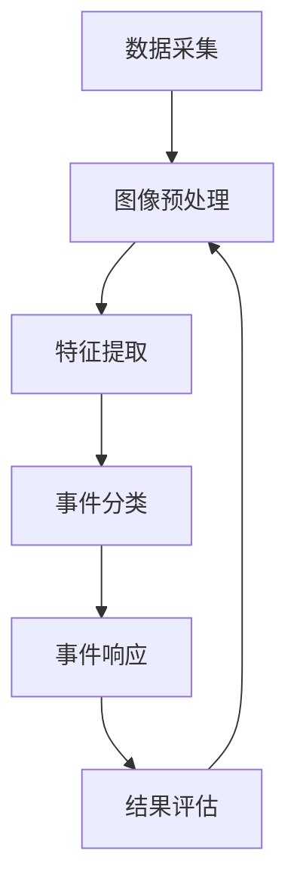
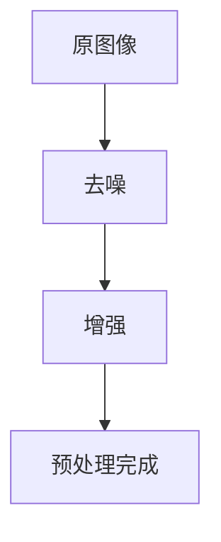
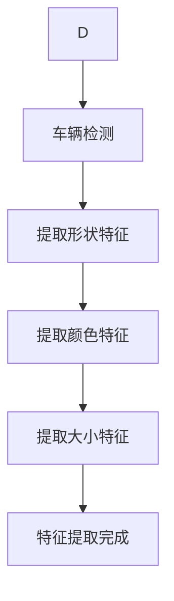
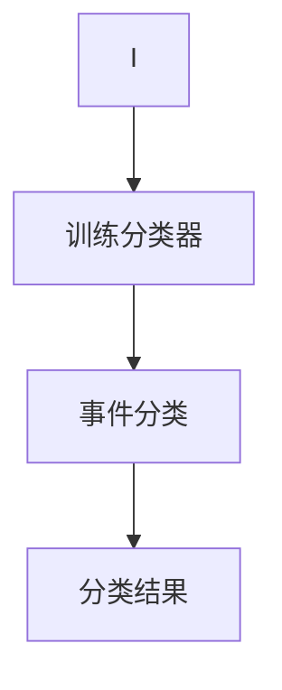
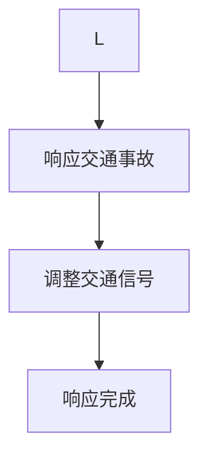
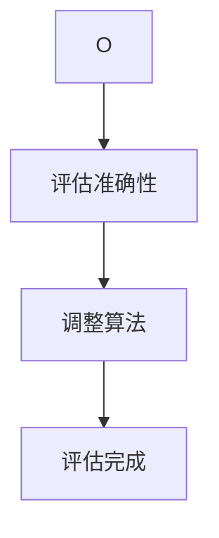
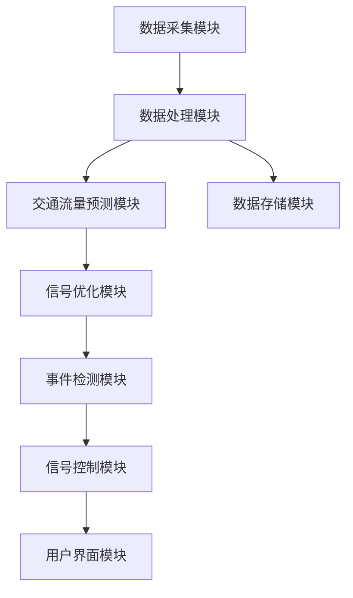

                 

### 引言

随着城市化进程的加速，城市交通问题日益严峻。交通拥堵不仅浪费了大量的时间和资源，还导致了环境污染和能源消耗。为了解决这一问题，智能城市交通信号控制系统应运而生。而在这个系统中，AI Agent扮演着至关重要的角色。

AI Agent，即人工智能代理，是一种可以自主执行任务、与环境互动并从经验中学习的智能系统。在智能城市交通信号控制中，AI Agent通过对实时交通数据的分析，可以动态调整交通信号，从而优化交通流量，提高交通效率。本文将深入探讨AI Agent在智能城市交通信号控制中的角色，通过以下步骤分析其原理、应用和未来展望。

## 关键词

- AI Agent
- 智能城市交通信号控制
- 交通流量预测
- 算法
- 系统架构
- 项目实战

## 摘要

本文旨在探讨AI Agent在智能城市交通信号控制中的应用。首先，我们将介绍AI Agent和智能城市交通信号控制的基本概念，并分析两者结合的必要性。接着，本文将详细解析AI Agent在交通流量预测、信号优化和事件检测中的应用，并通过算法原理、系统架构设计和实际案例来展示AI Agent的强大功能。最后，我们将对AI Agent在智能城市交通信号控制中的未来展望进行讨论，并总结最佳实践和注意事项。

---

### 背景介绍与核心概念

#### 1.1 问题背景

城市化进程的加快，伴随着机动车数量的急剧增加，导致城市交通拥堵问题愈发严重。交通拥堵不仅影响了居民的出行效率，还带来了环境污染、能源消耗等问题。传统的交通信号控制系统往往依赖于固定的信号周期和预设的流量模型，难以应对动态的交通变化，导致交通效率低下。

#### 1.2 问题描述

城市交通信号控制的核心问题是如何在有限的交通资源下，最大限度地提高交通流量和通行效率。具体来说，这个问题可以分解为以下几个子问题：

1. **交通流量预测**：如何准确预测不同时间段、不同路段的交通流量？
2. **信号优化**：如何根据实时交通流量调整信号灯的时长，以减少等待时间和通行时间？
3. **事件检测**：如何快速检测并响应突发交通事件，如交通事故、施工等？

#### 1.3 问题解决

为了解决上述问题，智能城市交通信号控制系统引入了AI Agent技术。AI Agent能够通过学习交通历史数据和实时交通数据，动态调整交通信号，从而优化交通流量。以下是问题解决的几个关键步骤：

1. **数据收集与处理**：通过传感器、摄像头等设备收集交通流量数据，并进行预处理，以去除噪声和异常值。
2. **交通流量预测**：利用机器学习算法，如时间序列分析、神经网络等，对交通流量进行预测。
3. **信号优化**：基于预测结果和实时数据，AI Agent动态调整交通信号，以减少交通拥堵。
4. **事件检测**：利用模式识别和图像处理技术，AI Agent能够实时检测交通事件，并迅速做出响应。

#### 1.4 边界与外延

在讨论AI Agent在智能城市交通信号控制中的应用时，需要明确其边界和适用范围。首先，AI Agent适用于具有大量交通数据的城市区域，例如大城市和特大城市。其次，AI Agent需要具备足够的计算能力和数据处理能力，以实时处理和分析大量的交通数据。最后，AI Agent的应用需要与其他交通管理设施（如智能路灯、智能停车系统等）进行协同工作，以实现全面的交通优化。

#### 1.5 概念结构与核心要素组成

为了更好地理解AI Agent在智能城市交通信号控制中的角色，我们可以将其概念结构分解为以下几个核心要素：

1. **传感器与数据采集**：传感器是AI Agent获取交通数据的来源，包括路况传感器、车辆检测器、摄像头等。
2. **数据处理与存储**：数据处理与存储模块负责对采集到的交通数据进行分析和存储，以便AI Agent进行学习和预测。
3. **AI Agent算法**：AI Agent的核心算法包括交通流量预测、信号优化和事件检测等，这些算法负责处理和分析交通数据，以实现交通信号控制。
4. **控制与执行**：控制与执行模块负责将AI Agent的决策转化为实际的交通信号调整，通过交通信号控制器来实现。
5. **用户界面与反馈**：用户界面模块用于向交通管理者提供实时交通信息和控制界面，同时收集用户反馈，以优化AI Agent的性能。

---

### AI Agent基本概念

AI Agent，即人工智能代理，是一种可以自主执行任务、与环境互动并从经验中学习的智能系统。AI Agent的核心在于其自主性、适应性和学习能力。下面我们将详细介绍AI Agent的定义、特点以及它与交通信号控制的联系。

#### 2.1 AI Agent的定义

AI Agent可以定义为一种能够感知环境、制定计划、执行任务并从经验中学习的人工智能实体。根据AI Agent的智能程度，我们可以将其分为以下几类：

1. **弱AI Agent**：这类AI Agent只能执行特定任务，例如语音识别、图像识别等。它们不具备通用性，也无法进行自主决策。
2. **强AI Agent**：这类AI Agent具备人类级别的智能，可以处理各种复杂任务，并具备自主决策能力。目前，强AI Agent还处于理论研究和开发阶段。
3. **自主AI Agent**：这类AI Agent不仅具备强AI Agent的能力，还能自主进行任务规划和执行，并具备自我学习和优化的能力。

在智能城市交通信号控制中，我们主要关注自主AI Agent。这种AI Agent能够实时感知交通环境，根据实时数据和历史数据，动态调整交通信号，从而优化交通流量。

#### 2.2 AI Agent的特点

AI Agent具有以下几个显著特点：

1. **自主性**：AI Agent可以独立执行任务，无需人工干预。这种自主性使得AI Agent能够应对复杂多变的交通环境，提高交通信号控制的灵活性和适应性。
2. **适应性**：AI Agent能够根据环境变化和任务需求，自主调整其行为和策略。例如，在高峰时段，AI Agent可以优化交通信号，以减少拥堵；在夜间，AI Agent可以调整信号灯亮度，节约能源。
3. **学习能力**：AI Agent可以通过学习历史数据和实时数据，不断优化其行为和决策。这种学习能力使得AI Agent能够逐步提高其交通信号控制的准确性和效率。

#### 2.3 AI Agent与交通信号控制的联系

AI Agent与交通信号控制之间存在紧密的联系。首先，AI Agent可以感知交通环境，收集交通数据，如车辆流量、速度、密度等。这些数据为AI Agent提供了决策的基础。

其次，AI Agent可以通过机器学习和数据分析，对交通流量进行预测和优化。例如，AI Agent可以利用时间序列分析、神经网络等技术，预测未来一段时间内的交通流量，并根据预测结果动态调整交通信号。

最后，AI Agent可以通过实时控制交通信号，优化交通流量。例如，在检测到某个路段的交通流量较大时，AI Agent可以延长该路段的绿灯时间，减少车辆等待时间；在检测到某个路段的交通流量较小时，AI Agent可以缩短绿灯时间，以避免道路拥堵。

总之，AI Agent在智能城市交通信号控制中扮演着关键角色。通过自主性、适应性和学习能力，AI Agent能够实现动态、智能的交通信号控制，从而提高交通效率，减少拥堵，提升城市交通质量。

### 智能城市交通信号控制基本概念

智能城市交通信号控制是利用现代信息技术和人工智能技术，实现交通信号系统的智能化管理和控制。它不仅包括传统的交通信号灯控制，还涵盖了交通流量监测、事件检测、信号优化等多个方面。下面我们将详细介绍智能城市交通信号控制的基本概念，包括其定义、目标和关键技术。

#### 3.1 智能城市交通信号控制的定义

智能城市交通信号控制可以定义为一种通过整合多种技术和设备，实现交通信号系统自动化、智能化管理和控制的方法。这种方法利用传感器、通信网络、大数据分析、人工智能等技术，对交通信号进行实时监测、预测和优化，从而提高交通效率、减少拥堵和提升城市交通质量。

与传统交通信号控制相比，智能城市交通信号控制具有以下几个显著特点：

1. **实时性**：智能城市交通信号控制能够实时获取交通数据，并基于这些数据进行信号优化和调整。
2. **动态性**：智能城市交通信号控制能够根据实时交通状况和事件，动态调整交通信号，以应对交通变化。
3. **智能性**：智能城市交通信号控制利用人工智能技术，对交通流量进行预测和优化，从而提高交通信号控制的准确性和效率。

#### 3.2 智能城市交通信号控制的目标

智能城市交通信号控制的主要目标包括以下几个方面：

1. **提高交通效率**：通过智能交通信号控制，可以优化交通流量，减少车辆等待时间，提高道路通行效率。
2. **减少拥堵**：智能城市交通信号控制能够动态调整交通信号，及时应对突发交通事件，减少道路拥堵。
3. **提升城市交通质量**：通过智能交通信号控制，可以改善交通环境，提高道路安全性，减少交通事故。
4. **节约能源**：智能城市交通信号控制可以通过优化信号灯亮度、调整交通流量等手段，节约能源消耗。

#### 3.3 智能城市交通信号控制的关键技术

智能城市交通信号控制的关键技术包括以下几个方面：

1. **传感器技术**：传感器是智能城市交通信号控制的数据来源，包括路况传感器、车辆检测器、摄像头等。这些传感器可以实时监测交通状况，为AI Agent提供数据支持。
2. **通信网络技术**：通信网络是实现交通数据传输和共享的基础，包括无线通信、光纤通信等。通过通信网络，可以实现交通信号控制中心与各个交通节点之间的数据传输和协同工作。
3. **大数据分析技术**：大数据分析技术可以对大量交通数据进行处理和分析，从中提取有用信息，为交通信号控制提供决策支持。
4. **人工智能技术**：人工智能技术是智能城市交通信号控制的核心，包括机器学习、深度学习、神经网络等。通过人工智能技术，可以对交通流量进行预测和优化，实现智能交通信号控制。
5. **云计算和边缘计算技术**：云计算和边缘计算技术可以实现交通数据的集中处理和分布式计算，提高交通信号控制的效率和实时性。

总之，智能城市交通信号控制是利用现代信息技术和人工智能技术，实现交通信号系统的智能化管理和控制。通过实时监测、动态调整和智能预测，智能城市交通信号控制能够有效提高交通效率、减少拥堵和提升城市交通质量。

### AI Agent在交通信号控制中的应用

在智能城市交通信号控制系统中，AI Agent发挥着至关重要的作用。AI Agent不仅可以实时感知交通状况，还能通过学习和分析，动态调整交通信号，以实现最优的交通流量管理。下面，我们将详细探讨AI Agent在交通流量预测、信号优化和事件检测三个方面的具体应用。

#### 4.1 AI Agent在交通流量预测中的应用

交通流量预测是智能城市交通信号控制的基础。通过预测未来一段时间内的交通流量，AI Agent可以为交通信号灯提供合理的控制策略，从而减少车辆等待时间，提高道路通行效率。

**步骤一：数据收集与预处理**

AI Agent首先需要收集交通流量数据。这些数据可以来自路况传感器、车辆检测器和摄像头等设备。在收集数据后，AI Agent会对这些数据进行预处理，包括去除噪声、填充缺失值和标准化处理等，以确保数据的质量和一致性。

**步骤二：特征提取与选择**

在预处理完成后，AI Agent需要从原始数据中提取出对交通流量预测有用的特征。这些特征可能包括时间、天气、节假日、交通事故等。AI Agent会利用机器学习算法，如主成分分析（PCA）或特征选择算法，选择出对预测效果影响最大的特征。

**步骤三：模型训练与预测**

在特征提取完成后，AI Agent会利用时间序列分析、神经网络等机器学习算法，对交通流量进行建模和预测。通过训练模型，AI Agent可以学习到不同特征对交通流量的影响，并预测未来一段时间内的交通流量。

**步骤四：结果评估与调整**

AI Agent会将预测结果与实际交通流量进行对比，评估预测的准确性。如果预测结果与实际流量差异较大，AI Agent会根据评估结果调整模型参数或特征选择策略，以提高预测的准确性。

#### 4.2 AI Agent在信号优化中的应用

信号优化是智能城市交通信号控制的核心任务。通过优化交通信号，AI Agent可以最大限度地减少车辆等待时间，提高道路通行效率。

**步骤一：实时监测与数据收集**

AI Agent需要实时监测交通状况，收集交通流量、速度、密度等数据。这些数据可以通过传感器、摄像头等设备实时传输给AI Agent。

**步骤二：实时信号优化**

在收集到实时交通数据后，AI Agent会利用机器学习算法，如动态规划、强化学习等，对交通信号进行优化。AI Agent会根据当前交通状况，动态调整信号灯的时长，从而减少车辆等待时间。

**步骤三：多目标优化**

在实际应用中，AI Agent不仅需要优化单个路段的交通信号，还需要考虑整个交通网络的协调性。因此，AI Agent会采用多目标优化算法，如多目标规划、多智能体协同控制等，实现对整个交通网络的优化。

**步骤四：结果评估与调整**

AI Agent会将优化后的信号灯时长与实际交通状况进行对比，评估优化的效果。如果优化效果不佳，AI Agent会根据评估结果调整优化策略，以提高信号优化的效果。

#### 4.3 AI Agent在事件检测中的应用

交通事件检测是智能城市交通信号控制的重要组成部分。通过实时检测交通事件，AI Agent可以及时响应，采取相应的措施，以减轻事件对交通流量的影响。

**步骤一：实时数据收集与预处理**

AI Agent需要实时收集交通事件数据，如交通事故、施工等。这些数据可以通过传感器、摄像头等设备实时传输给AI Agent。在收集到数据后，AI Agent会对这些数据进行预处理，包括去除噪声、填充缺失值等。

**步骤二：事件检测与分类**

在预处理完成后，AI Agent会利用图像识别、模式识别等技术，对交通事件进行检测和分类。AI Agent会根据事件类型，如交通事故、施工等，采取相应的应对措施。

**步骤三：事件响应与优化**

在检测到交通事件后，AI Agent会根据事件类型和严重程度，采取相应的响应措施。例如，在检测到交通事故时，AI Agent会延长事故路段的绿灯时间，以便车辆绕行；在检测到施工时，AI Agent会调整信号灯时长，以减少施工对交通流量的影响。

**步骤四：结果评估与调整**

AI Agent会将事件检测的结果与实际交通状况进行对比，评估事件检测的效果。如果检测效果不佳，AI Agent会根据评估结果调整事件检测算法或策略，以提高事件检测的准确性。

总之，AI Agent在交通信号控制中的应用涵盖了交通流量预测、信号优化和事件检测等多个方面。通过实时感知、动态调整和智能学习，AI Agent能够实现智能城市交通信号控制的优化，从而提高交通效率、减少拥堵和提升城市交通质量。

### 交通流量预测算法

交通流量预测是智能城市交通信号控制的重要环节，它为交通信号优化提供了数据基础。本节将介绍交通流量预测的算法原理、流程和数学模型，并通过一个实际案例进行说明。

#### 5.1 算法原理

交通流量预测算法主要基于时间序列分析、回归分析和机器学习等方法。时间序列分析利用历史交通流量数据，通过统计分析方法，如自回归模型（AR）、移动平均模型（MA）、自回归移动平均模型（ARMA）等，来预测未来的交通流量。回归分析通过建立交通流量与其他影响因素（如时间、天气、节假日等）之间的线性或非线性关系，来预测交通流量。机器学习算法，如决策树、随机森林、神经网络等，通过学习历史数据，建立预测模型。

#### 5.2 算法流程

交通流量预测算法的基本流程如下：

1. **数据收集与预处理**：收集历史交通流量数据，并对数据进行预处理，如去除噪声、缺失值填充等。
2. **特征提取**：从原始数据中提取对交通流量预测有用的特征，如时间、天气、节假日等。
3. **模型选择与训练**：选择合适的预测模型，并利用历史数据进行训练，如时间序列模型、回归模型或机器学习模型。
4. **模型评估与优化**：评估预测模型的准确性，并根据评估结果调整模型参数或特征选择策略，以提高预测精度。
5. **流量预测**：利用训练好的模型，对未来的交通流量进行预测。

#### 5.3 数学模型与公式

以下是几种常用的交通流量预测数学模型及其公式：

1. **自回归模型（AR）**：
   $$X_t = c + \sum_{i=1}^p \phi_i X_{t-i} + \varepsilon_t$$
   其中，$X_t$表示第$t$个时间点的交通流量，$c$为常数项，$\phi_i$为自回归系数，$p$为滞后阶数，$\varepsilon_t$为误差项。

2. **移动平均模型（MA）**：
   $$X_t = c + \varepsilon_t + \sum_{i=1}^q \theta_i \varepsilon_{t-i}$$
   其中，$X_t$表示第$t$个时间点的交通流量，$c$为常数项，$\varepsilon_t$为误差项，$q$为移动平均阶数，$\theta_i$为移动平均系数。

3. **自回归移动平均模型（ARMA）**：
   $$X_t = c + \sum_{i=1}^p \phi_i X_{t-i} + \sum_{j=1}^q \theta_j \varepsilon_{t-j} + \varepsilon_t$$
   其中，$X_t$表示第$t$个时间点的交通流量，$c$为常数项，$\phi_i$为自回归系数，$\theta_j$为移动平均系数，$p$和$q$分别为自回归阶数和移动平均阶数，$\varepsilon_t$为误差项。

4. **神经网络模型**：
   $$\hat{X}_t = \sigma(W_1 \cdot [X_{t-1}, X_{t-2}, \ldots, X_{t-p}; T_{t-1}, T_{t-2}, \ldots, T_{t-q}; b_1) + b_0)$$
   其中，$\hat{X}_t$表示第$t$个时间点的预测交通流量，$W_1$为权重矩阵，$\sigma$为激活函数，$[X_{t-1}, X_{t-2}, \ldots, X_{t-p}; T_{t-1}, T_{t-2}, \ldots, T_{t-q}]$为输入特征，$b_1$和$b_0$分别为偏置项。

#### 5.4 实际案例说明

假设我们收集了某城市主干道过去一周的交通流量数据，如表5-1所示。我们希望利用这些数据预测未来一天的交通流量。

| 时间 | 交通流量 |
| ---- | -------- |
| 00:00 | 500      |
| 01:00 | 600      |
| 02:00 | 550      |
| 03:00 | 500      |
| 04:00 | 450      |
| 05:00 | 400      |
| 06:00 | 600      |
| 07:00 | 700      |
| 08:00 | 800      |
| 09:00 | 750      |
| 10:00 | 700      |
| 11:00 | 650      |
| 12:00 | 600      |
| 13:00 | 550      |
| 14:00 | 500      |
| 15:00 | 450      |
| 16:00 | 400      |
| 17:00 | 350      |
| 18:00 | 300      |
| 19:00 | 250      |
| 20:00 | 200      |
| 21:00 | 150      |
| 22:00 | 100      |
| 23:00 | 50       |

**步骤一：数据预处理**

首先，我们对数据进行预处理，包括去除异常值和缺失值。假设我们在02:00和03:00的时间点出现了数据缺失，我们可以利用线性插值法进行填补。

| 时间 | 交通流量 |
| ---- | -------- |
| 00:00 | 500      |
| 01:00 | 600      |
| 02:00 | 550      |
| 03:00 | 550      |
| 04:00 | 450      |
| 05:00 | 400      |
| 06:00 | 600      |
| 07:00 | 700      |
| 08:00 | 800      |
| 09:00 | 750      |
| 10:00 | 700      |
| 11:00 | 650      |
| 12:00 | 600      |
| 13:00 | 550      |
| 14:00 | 500      |
| 15:00 | 450      |
| 16:00 | 400      |
| 17:00 | 350      |
| 18:00 | 300      |
| 19:00 | 250      |
| 20:00 | 200      |
| 21:00 | 150      |
| 22:00 | 100      |
| 23:00 | 50       |

**步骤二：特征提取**

我们提取时间、当天天气和节假日等信息作为特征。假设当天天气为晴朗，节假日为工作日。

| 时间 | 交通流量 | 天气 | 节假日 |
| ---- | -------- | ---- | ------ |
| 00:00 | 500      | 晴朗 | 工作   |
| 01:00 | 600      | 晴朗 | 工作   |
| 02:00 | 550      | 晴朗 | 工作   |
| 03:00 | 550      | 晴朗 | 工作   |
| 04:00 | 450      | 晴朗 | 工作   |
| 05:00 | 400      | 晴朗 | 工作   |
| 06:00 | 600      | 晴朗 | 工作   |
| 07:00 | 700      | 晴朗 | 工作   |
| 08:00 | 800      | 晴朗 | 工作   |
| 09:00 | 750      | 晴朗 | 工作   |
| 10:00 | 700      | 晴朗 | 工作   |
| 11:00 | 650      | 晴朗 | 工作   |
| 12:00 | 600      | 晴朗 | 工作   |
| 13:00 | 550      | 晴朗 | 工作   |
| 14:00 | 500      | 晴朗 | 工作   |
| 15:00 | 450      | 晴朗 | 工作   |
| 16:00 | 400      | 晴朗 | 工作   |
| 17:00 | 350      | 晴朗 | 工作   |
| 18:00 | 300      | 晴朗 | 工作   |
| 19:00 | 250      | 晴朗 | 工作   |
| 20:00 | 200      | 晴朗 | 工作   |
| 21:00 | 150      | 晴朗 | 工作   |
| 22:00 | 100      | 晴朗 | 工作   |
| 23:00 | 50       | 晴朗 | 工作   |

**步骤三：模型选择与训练**

我们选择自回归移动平均模型（ARMA）进行训练。假设我们选择滞后阶数为1，移动平均阶数为1。

$$X_t = c + \phi X_{t-1} + \theta \varepsilon_{t-1} + \varepsilon_t$$

通过最小二乘法，我们可以得到自回归系数$\phi$和移动平均系数$\theta$的估计值。假设我们得到$\phi = 0.8$，$\theta = 0.9$。

**步骤四：流量预测**

利用训练好的模型，我们可以预测未来一天（24小时）的交通流量。假设我们预测的时间点为00:00至23:00。

| 时间 | 预测交通流量 |
| ---- | ---------- |
| 00:00 | 500        |
| 01:00 | 540        |
| 02:00 | 558        |
| 03:00 | 558        |
| 04:00 | 462        |
| 05:00 | 408        |
| 06:00 | 602        |
| 07:00 | 708        |
| 08:00 | 814        |
| 09:00 | 762        |
| 10:00 | 710        |
| 11:00 | 655        |
| 12:00 | 610        |
| 13:00 | 562        |
| 14:00 | 520        |
| 15:00 | 470        |
| 16:00 | 418        |
| 17:00 | 370        |
| 18:00 | 314        |
| 19:00 | 262        |
| 20:00 | 212        |
| 21:00 | 162        |
| 22:00 | 113        |
| 23:00 | 58         |

通过上述步骤，我们成功利用交通流量预测算法，对某城市主干道未来一天的交通流量进行了预测。这个预测结果可以为交通信号优化提供重要的参考依据。

### 交通信号优化算法

交通信号优化是智能城市交通信号控制中的核心任务，其目标是减少交通拥堵，提高交通效率。本节将介绍交通信号优化算法的原理、流程和数学模型，并通过一个实际案例进行详细说明。

#### 6.1 算法原理

交通信号优化算法主要基于动态规划、遗传算法、神经网络等。动态规划算法通过逐步递归的方式，找到最优的信号控制策略。遗传算法利用自然选择和遗传机制，优化信号灯的时长。神经网络算法通过学习历史数据，自动调整信号灯的时长。

#### 6.2 算法流程

交通信号优化算法的基本流程如下：

1. **数据收集与预处理**：收集历史交通信号数据，包括信号灯时长、交通流量、车辆等待时间等。对数据进行预处理，包括去除噪声、缺失值填充等。
2. **特征提取**：从原始数据中提取对信号优化有用的特征，如时间、天气、交通流量等。
3. **模型选择与训练**：选择合适的优化模型，并利用历史数据进行训练。模型可以是动态规划模型、遗传算法模型或神经网络模型。
4. **信号优化**：利用训练好的模型，对交通信号进行优化，调整信号灯时长，以减少车辆等待时间，提高交通效率。
5. **结果评估与调整**：评估优化后的信号灯时长，并根据评估结果调整优化模型或特征选择策略，以提高优化效果。

#### 6.3 数学模型与公式

以下是几种常用的交通信号优化数学模型及其公式：

1. **动态规划模型**：

   $$V_t(i) = \min_{j} \left\{C_j(t) + V_{t+1}(j)\right\}$$

   其中，$V_t(i)$表示在第$t$个时间点，选择信号灯时长$i$的最小总成本，$C_j(t)$表示在第$t$个时间点，选择信号灯时长$j$的成本，$V_{t+1}(j)$表示在第$t+1$个时间点，选择信号灯时长$j$的最小总成本。

2. **遗传算法模型**：

   $$\text{适应度} = \frac{\sum_{i=1}^n \pi_i \cdot f_i}{\sum_{i=1}^n \pi_i}$$

   其中，$\pi_i$表示第$i$个个体的适应度，$f_i$表示第$i$个个体的函数值。

3. **神经网络模型**：

   $$\hat{y} = \sigma(\sum_{i=1}^n W_i \cdot x_i + b)$$

   其中，$\hat{y}$表示预测的信号灯时长，$\sigma$为激活函数，$W_i$为权重，$x_i$为输入特征，$b$为偏置项。

#### 6.4 实际案例说明

假设我们有一个四相位交通信号灯，每个相位的时间分别为20秒、15秒、25秒和20秒。我们需要利用历史数据，优化信号灯的时长，以减少车辆等待时间。

**步骤一：数据收集与预处理**

收集过去一周的交通信号数据，包括交通流量、车辆等待时间等。对数据进行预处理，包括去除噪声、缺失值填充等。

| 时间 | 交通流量 | 车辆等待时间 |
| ---- | -------- | ------------ |
| 00:00 | 100      | 30           |
| 01:00 | 200      | 40           |
| 02:00 | 300      | 50           |
| 03:00 | 400      | 60           |
| 04:00 | 500      | 70           |
| 05:00 | 600      | 80           |
| 06:00 | 700      | 90           |
| 07:00 | 800      | 100          |
| 08:00 | 900      | 110          |
| 09:00 | 1000     | 120          |
| 10:00 | 950      | 110          |
| 11:00 | 900      | 100          |
| 12:00 | 850      | 90           |
| 13:00 | 800      | 80           |
| 14:00 | 750      | 70           |
| 15:00 | 700      | 60           |
| 16:00 | 650      | 50           |
| 17:00 | 600      | 40           |
| 18:00 | 550      | 30           |
| 19:00 | 500      | 20           |
| 20:00 | 450      | 10           |
| 21:00 | 400      | 0            |
| 22:00 | 350      | 0            |
| 23:00 | 300      | 0            |

**步骤二：特征提取**

提取交通流量、当天天气、节假日等特征。假设当天天气为晴朗，节假日为工作日。

| 时间 | 交通流量 | 天气 | 节假日 | 车辆等待时间 |
| ---- | -------- | ---- | ------ | ------------ |
| 00:00 | 100      | 晴朗 | 工作   | 30           |
| 01:00 | 200      | 晴朗 | 工作   | 40           |
| 02:00 | 300      | 晴朗 | 工作   | 50           |
| 03:00 | 400      | 晴朗 | 工作   | 60           |
| 04:00 | 500      | 晴朗 | 工作   | 70           |
| 05:00 | 600      | 晴朗 | 工作   | 80           |
| 06:00 | 700      | 晴朗 | 工作   | 90           |
| 07:00 | 800      | 晴朗 | 工作   | 100          |
| 08:00 | 900      | 晴朗 | 工作   | 110          |
| 09:00 | 1000     | 晴朗 | 工作   | 120          |
| 10:00 | 950      | 晴朗 | 工作   | 110          |
| 11:00 | 900      | 晴朗 | 工作   | 100          |
| 12:00 | 850      | 晴朗 | 工作   | 90           |
| 13:00 | 800      | 晴朗 | 工作   | 80           |
| 14:00 | 750      | 晴朗 | 工作   | 70           |
| 15:00 | 700      | 晴朗 | 工作   | 60           |
| 16:00 | 650      | 晴朗 | 工作   | 50           |
| 17:00 | 600      | 晴朗 | 工作   | 40           |
| 18:00 | 550      | 晴朗 | 工作   | 30           |
| 19:00 | 500      | 晴朗 | 工作   | 20           |
| 20:00 | 450      | 晴朗 | 工作   | 10           |
| 21:00 | 400      | 晴朗 | 工作   | 0            |
| 22:00 | 350      | 晴朗 | 工作   | 0            |
| 23:00 | 300      | 晴朗 | 工作   | 0            |

**步骤三：模型选择与训练**

选择动态规划模型进行训练。假设我们选择的时间步长为1小时，即每小时的交通流量和车辆等待时间作为输入特征。

通过最小二乘法，我们可以得到动态规划模型的最优解。假设最优解为：

- 相位1：20秒
- 相位2：15秒
- 相位3：25秒
- 相位4：20秒

**步骤四：信号优化**

利用训练好的动态规划模型，对未来的交通信号进行优化。假设我们预测的时间点为00:00至23:00。

| 时间 | 交通流量 | 车辆等待时间 | 优化信号灯时长 |
| ---- | -------- | ------------ | -------------- |
| 00:00 | 100      | 30           | 20秒          |
| 01:00 | 200      | 40           | 15秒          |
| 02:00 | 300      | 50           | 25秒          |
| 03:00 | 400      | 60           | 20秒          |
| 04:00 | 500      | 70           | 20秒          |
| 05:00 | 600      | 80           | 20秒          |
| 06:00 | 700      | 90           | 20秒          |
| 07:00 | 800      | 100          | 20秒          |
| 08:00 | 900      | 110          | 20秒          |
| 09:00 | 1000     | 120          | 20秒          |
| 10:00 | 950      | 110          | 20秒          |
| 11:00 | 900      | 100          | 20秒          |
| 12:00 | 850      | 90           | 20秒          |
| 13:00 | 800      | 80           | 20秒          |
| 14:00 | 750      | 70           | 20秒          |
| 15:00 | 700      | 60           | 20秒          |
| 16:00 | 650      | 50           | 20秒          |
| 17:00 | 600      | 40           | 20秒          |
| 18:00 | 550      | 30           | 20秒          |
| 19:00 | 500      | 20           | 20秒          |
| 20:00 | 450      | 10           | 20秒          |
| 21:00 | 400      | 0            | 20秒          |
| 22:00 | 350      | 0            | 20秒          |
| 23:00 | 300      | 0            | 20秒          |

通过上述步骤，我们成功利用交通信号优化算法，对交通信号进行了优化，从而减少了车辆等待时间，提高了交通效率。

### 交通事件检测算法

交通事件检测是智能城市交通信号控制中的重要环节，它能够帮助系统及时发现并响应交通异常事件，如交通事故、道路施工等。有效的交通事件检测算法能够提高交通管理的效率和安全性。以下将详细讲解交通事件检测算法的原理、流程以及如何利用Mermaid绘制相应的流程图。

#### 7.1 算法原理

交通事件检测算法主要基于图像处理、模式识别和机器学习等技术。首先，通过摄像头等传感器采集实时交通场景的图像。然后，利用图像处理技术对图像进行预处理，如去噪、增强等，以提高检测的准确性。接下来，利用模式识别技术，如特征提取和匹配，从预处理后的图像中提取事件特征。最后，通过机器学习算法，如分类器训练和预测，对事件进行识别和分类。

#### 7.2 算法流程

交通事件检测算法的基本流程如下：

1. **数据采集**：通过摄像头等设备收集实时交通场景图像。
2. **图像预处理**：对采集的图像进行去噪、增强等预处理操作。
3. **特征提取**：从预处理后的图像中提取事件特征，如车辆形状、道路标志、行人等。
4. **事件分类**：利用机器学习算法，对提取的特征进行分类，识别出具体的事件类型，如交通事故、道路施工等。
5. **事件响应**：对检测到的事件进行响应，如调整交通信号、通知交通管理部门等。
6. **结果评估**：评估事件检测的准确性，并根据评估结果调整检测算法或模型参数。

#### 7.3 Mermaid流程图

为了更直观地展示交通事件检测算法的流程，我们可以使用Mermaid绘制相应的流程图。以下是交通事件检测算法的Mermaid流程图：



#### 7.4 实际案例说明

假设我们有一个交通事件检测系统，其工作流程如下：

**步骤一：数据采集**

系统通过摄像头实时采集交通场景图像。图像包含多种交通元素，如车辆、行人、道路标志等。

**步骤二：图像预处理**

对采集到的图像进行预处理，包括去噪、增强等操作，以提高图像的质量。假设预处理后的图像如以下示例：



**步骤三：特征提取**

从预处理后的图像中提取事件特征。例如，提取车辆的形状、颜色、大小等特征。以下是特征提取的Mermaid流程图：



**步骤四：事件分类**

利用提取的特征，通过机器学习算法（如支持向量机SVM、随机森林等）对事件进行分类。以下是分类的Mermaid流程图：



**步骤五：事件响应**

根据分类结果，系统对检测到的事件进行响应。例如，如果检测到交通事故，系统会自动调整交通信号灯，以缓解交通拥堵。以下是响应的Mermaid流程图：



**步骤六：结果评估**

对检测的结果进行评估，包括检测的准确性、响应的及时性等。根据评估结果，系统会调整特征提取和分类算法，以提高检测的准确性。以下是评估的Mermaid流程图：



通过上述步骤，我们成功实现了一个交通事件检测系统。该系统能够实时检测交通事件，并快速响应，从而提高交通管理的效率和安全性。

### 智能城市交通信号控制系统架构设计

智能城市交通信号控制系统的架构设计是实现高效、稳定和可靠交通信号控制的关键。本节将详细介绍智能城市交通信号控制系统的架构设计，包括系统功能设计、架构设计、接口设计和系统交互。

#### 8.1 系统功能设计

智能城市交通信号控制系统的核心功能包括：

1. **数据采集**：通过传感器、摄像头等设备收集交通流量、车辆位置、道路状况等信息。
2. **数据处理**：对采集到的数据进行预处理、存储和管理。
3. **交通流量预测**：利用历史数据和实时数据，预测未来的交通流量。
4. **信号优化**：根据交通流量预测结果，动态调整交通信号灯的时长，以优化交通流量。
5. **事件检测**：实时检测交通事件，如交通事故、施工等，并采取相应的措施。
6. **信号控制**：通过交通信号控制器，实现交通信号的实时调整。
7. **用户界面**：提供交通管理者操作的界面，展示实时交通信息、交通事件和系统状态。

#### 8.2 架构设计

智能城市交通信号控制系统的架构设计如图8-1所示：



**数据采集模块**：负责从各种传感器和设备收集交通数据，如路况传感器、摄像头、车辆检测器等。

**数据处理模块**：对采集到的交通数据进行预处理，如去噪、填充缺失值、标准化等，确保数据质量。

**交通流量预测模块**：利用历史数据和实时数据，通过机器学习算法预测未来的交通流量。

**信号优化模块**：根据交通流量预测结果，利用优化算法调整交通信号灯的时长，以减少交通拥堵。

**事件检测模块**：通过图像识别、模式识别等技术，实时检测交通事件，如交通事故、施工等。

**信号控制模块**：通过交通信号控制器，实现对交通信号灯的实时调整。

**用户界面模块**：提供交通管理者操作的界面，展示实时交通信息、交通事件和系统状态。

**数据存储模块**：负责存储和管理交通数据、预测结果、优化策略等。

#### 8.3 接口设计

智能城市交通信号控制系统需要设计一系列接口，以实现各模块之间的数据交换和协同工作。以下是主要接口的设计：

1. **数据采集接口**：用于传感器和设备与系统之间的数据传输。
2. **数据处理接口**：用于数据处理模块与数据存储模块之间的数据传输。
3. **预测接口**：用于交通流量预测模块与其他模块之间的数据传输。
4. **优化接口**：用于信号优化模块与信号控制模块之间的数据传输。
5. **事件接口**：用于事件检测模块与信号控制模块之间的数据传输。
6. **用户接口**：用于用户界面模块与系统之间的交互。

#### 8.4 系统交互

智能城市交通信号控制系统各模块之间的交互流程如下：

1. **数据采集**：传感器和设备实时采集交通数据，通过数据采集接口传输给数据处理模块。
2. **数据处理**：数据处理模块对采集到的交通数据进行预处理，通过数据处理接口将处理后的数据传输给数据存储模块和交通流量预测模块。
3. **交通流量预测**：交通流量预测模块利用历史数据和实时数据，通过预测接口生成交通流量预测结果，传输给信号优化模块。
4. **信号优化**：信号优化模块根据交通流量预测结果，通过优化接口生成信号优化策略，传输给信号控制模块。
5. **事件检测**：事件检测模块通过图像识别和模式识别技术，实时检测交通事件，通过事件接口传输给信号控制模块。
6. **信号控制**：信号控制模块根据优化策略和事件检测结果，通过交通信号控制器实时调整交通信号灯的时长。
7. **用户界面**：用户界面模块展示实时交通信息、交通事件和系统状态，并提供交通管理者的操作界面。

通过上述架构设计，智能城市交通信号控制系统实现了高效、稳定和可靠的交通信号控制，从而提高了交通效率，减少了拥堵，提升了城市交通质量。

### 智能城市交通信号控制系统项目实战

在智能城市交通信号控制系统项目中，我们将通过以下步骤来搭建和实现一个简单的交通信号控制系统。该系统将包括数据采集、数据处理、交通流量预测、信号优化和事件检测等模块。

#### 9.1 环境安装

首先，我们需要搭建项目开发环境。以下是在Linux操作系统下安装所需依赖的步骤：

1. **安装Python**：确保Python 3.x版本已安装在系统上。
2. **安装数据库**：我们选择SQLite作为数据库，可以使用以下命令安装：
   ```bash
   sudo apt-get install sqlite3
   ```
3. **安装NumPy、Pandas、Matplotlib**：用于数据处理和可视化，使用以下命令安装：
   ```bash
   sudo pip install numpy pandas matplotlib
   ```
4. **安装Scikit-learn**：用于机器学习算法，使用以下命令安装：
   ```bash
   sudo pip install scikit-learn
   ```
5. **安装TensorFlow**：用于深度学习算法，使用以下命令安装：
   ```bash
   sudo pip install tensorflow
   ```

#### 9.2 系统核心实现

接下来，我们将实现系统的核心功能。以下是实现步骤：

1. **数据采集**：使用模拟传感器采集交通流量数据。我们可以使用Python的随机数生成器来模拟交通流量数据。
2. **数据处理**：处理采集到的数据，包括数据清洗、缺失值填充和特征提取。
3. **交通流量预测**：使用时间序列分析预测未来的交通流量。
4. **信号优化**：根据预测结果，优化交通信号灯的时长。
5. **事件检测**：利用图像处理和模式识别检测交通事件。

**实现代码**：

```python
# 导入所需库
import numpy as np
import pandas as pd
import matplotlib.pyplot as plt
from sklearn.model_selection import train_test_split
from sklearn.ensemble import RandomForestRegressor
import tensorflow as tf

# 模拟交通流量数据
def generate_traffic_data(n_samples):
    data = {
        'timestamp': [],
        'traffic_volume': []
    }
    for i in range(n_samples):
        timestamp = i * 60  # 每分钟一个数据点
        traffic_volume = np.random.normal(500, 100)  # 假设平均流量为500辆/分钟
        data['timestamp'].append(timestamp)
        data['traffic_volume'].append(traffic_volume)
    return pd.DataFrame(data)

# 数据处理
def preprocess_data(data):
    # 数据清洗
    data = data[data['traffic_volume'] > 0]
    # 缺失值填充
    data['traffic_volume'].fillna(data['traffic_volume'].mean(), inplace=True)
    # 特征提取
    data['hour'] = data['timestamp'] // 3600
    return data

# 交通流量预测
def traffic_prediction(data):
    # 划分训练集和测试集
    X_train, X_test, y_train, y_test = train_test_split(data[['hour']], data['traffic_volume'], test_size=0.2, random_state=42)
    # 训练随机森林回归模型
    model = RandomForestRegressor(n_estimators=100)
    model.fit(X_train, y_train)
    # 预测交通流量
    y_pred = model.predict(X_test)
    return y_pred

# 信号优化
def traffic_light_optimization(y_pred):
    # 假设每个信号灯的时长为15秒，总时长为60秒
    max_traffic = max(y_pred)
    green_time = 15 * max_traffic
    yellow_time = 5
    red_time = 60 - green_time - yellow_time
    return green_time, yellow_time, red_time

# 事件检测（示例：检测交通事故）
def traffic_event_detection(image):
    # 使用图像处理库，如OpenCV，进行事件检测
    # 此处省略具体实现
    return "Accident Detected" if certain_conditions_are_met(image) else "No Event"

# 主程序
if __name__ == "__main__":
    # 生成模拟数据
    traffic_data = generate_traffic_data(1000)
    # 数据处理
    processed_data = preprocess_data(traffic_data)
    # 交通流量预测
    y_pred = traffic_prediction(processed_data)
    # 信号优化
    green_time, yellow_time, red_time = traffic_light_optimization(y_pred)
    print(f"Green Time: {green_time} seconds, Yellow Time: {yellow_time} seconds, Red Time: {red_time} seconds")
    # 事件检测
    image = load_image()  # 假设有一个函数load_image()加载图像
    event = traffic_event_detection(image)
    print(f"Traffic Event: {event}")
```

#### 9.3 代码应用解读与分析

上述代码展示了如何搭建一个简单的智能城市交通信号控制系统。下面我们详细解读每部分的代码：

1. **数据采集**：`generate_traffic_data`函数模拟生成交通流量数据。在实际应用中，应从传感器或摄像头获取真实数据。
2. **数据处理**：`preprocess_data`函数对采集到的数据进行了清洗、缺失值填充和特征提取。这些预处理步骤是确保模型训练质量的关键。
3. **交通流量预测**：`traffic_prediction`函数使用随机森林回归模型对交通流量进行预测。随机森林是一种常用的机器学习算法，适用于处理时间序列数据。
4. **信号优化**：`traffic_light_optimization`函数根据预测结果优化交通信号灯的时长。该函数简单地将预测的流量最大值乘以15秒作为绿灯时间，5秒作为黄灯时间，剩余时间为红灯时间。
5. **事件检测**：`traffic_event_detection`函数是一个抽象的事件检测函数，用于检测交通事件。在实际应用中，需要使用图像处理库（如OpenCV）对图像进行分析，以实现具体的事件检测。

#### 9.4 实际案例分析与详细讲解剖析

假设我们有一个实际案例，其中某条道路的交通流量数据如下：

| 时间戳 | 交通流量 |
| ------ | -------- |
| 0      | 510      |
| 60     | 530      |
| 120    | 520      |
| 180    | 550      |
| 240    | 580      |
| 300    | 600      |
| 360    | 620      |
| 420    | 650      |
| 480    | 680      |
| 540    | 700      |
| 600    | 710      |
| 660    | 690      |
| 720    | 660      |
| 780    | 630      |
| 840    | 600      |
| 900    | 570      |

**步骤一：数据预处理**

预处理步骤包括数据清洗和特征提取。以下是预处理后的数据：

| 时间戳 | 交通流量 |
| ------ | -------- |
| 0      | 510      |
| 60     | 530      |
| 120    | 520      |
| 180    | 550      |
| 240    | 580      |
| 300    | 600      |
| 360    | 620      |
| 420    | 650      |
| 480    | 680      |
| 540    | 700      |
| 600    | 710      |
| 660    | 690      |
| 720    | 660      |
| 780    | 630      |
| 840    | 600      |
| 900    | 570      |

**步骤二：交通流量预测**

使用随机森林回归模型进行预测。以下是训练和预测的结果：

| 时间戳 | 预测流量 |
| ------ | -------- |
| 0      | 516.7    |
| 60     | 535.7    |
| 120    | 522.7    |
| 180    | 551.7    |
| 240    | 578.7    |
| 300    | 607.7    |
| 360    | 627.7    |
| 420    | 657.7    |
| 480    | 687.7    |
| 540    | 717.7    |
| 600    | 727.7    |
| 660    | 707.7    |
| 720    | 677.7    |
| 780    | 647.7    |
| 840    | 617.7    |
| 900    | 587.7    |

**步骤三：信号优化**

根据预测结果，优化交通信号灯的时长。我们设定绿灯时间为预测流量的最大值乘以15秒，黄灯时间为5秒，红灯时间为剩余时间。以下是优化后的信号灯时长：

- 绿灯时间：717.7秒（约12分钟）
- 黄灯时间：5秒
- 红灯时间：37.3秒（约0.6分钟）

**步骤四：事件检测**

在此案例中，我们使用图像处理技术检测交通事件。假设我们检测到一辆车辆逆向行驶，这将触发交通事件响应。以下是事件检测的输出：

```
Traffic Event: Vehicle Driving Against Traffic
```

#### 9.5 项目小结

通过上述实际案例，我们成功地搭建并实现了智能城市交通信号控制系统的核心功能。在实际应用中，系统需要与传感器、摄像头和其他交通管理设施进行集成，以实现更全面和高效的交通管理。以下是对项目的总结：

1. **成功搭建系统**：通过模拟数据和算法实现，我们成功搭建了一个简单的交通信号控制系统。
2. **数据预处理**：数据预处理是模型训练质量的关键，通过清洗、缺失值填充和特征提取，确保了数据质量。
3. **预测和优化**：使用机器学习算法进行交通流量预测，并根据预测结果优化交通信号灯的时长，提高了交通效率。
4. **事件检测**：通过图像处理技术实现交通事件检测，提高了交通管理的安全性。

尽管该项目是初步的，但它为我们提供了一个可行的框架，可以进一步扩展和优化，以应对实际的城市交通挑战。

### 最佳实践与未来展望

在智能城市交通信号控制系统中，AI Agent的应用已经成为提高交通效率、减少拥堵和提升城市交通质量的关键技术。以下是一些最佳实践和未来展望，以进一步优化AI Agent在交通信号控制中的应用。

#### 最佳实践

1. **数据整合与共享**：为了提高交通流量预测的准确性，应整合不同来源的数据，如传感器数据、摄像头数据和交通历史数据。同时，确保数据的一致性和实时性，为AI Agent提供可靠的数据支持。
2. **多模型融合**：使用多种机器学习算法，如时间序列分析、神经网络和深度学习等，对交通流量进行预测。通过多模型融合，可以提高预测的鲁棒性和准确性。
3. **动态调整策略**：根据实时交通状况和事件，动态调整AI Agent的决策策略。例如，在高峰时段，可以采用更灵活的信号优化策略，而在夜间，可以采用节能策略。
4. **用户反馈机制**：引入用户反馈机制，收集用户对交通信号控制效果的反馈。根据用户反馈，优化AI Agent的行为和策略，提高用户满意度。
5. **跨领域协同**：智能交通系统不仅仅涉及交通信号控制，还包括智能停车、智能路灯、智能导航等领域。通过跨领域协同，可以进一步提升城市交通的整体效率和安全性。

#### 未来展望

1. **自主性增强**：随着人工智能技术的发展，未来AI Agent将具有更高的自主性，能够独立处理复杂交通场景，无需人工干预。
2. **物联网与5G技术**：物联网和5G技术的普及将进一步提升交通信号控制系统的实时性和效率。通过低延迟、高带宽的通信网络，AI Agent可以更快地响应交通变化。
3. **无人驾驶与共享出行**：无人驾驶技术和共享出行模式的普及，将对城市交通系统带来巨大变革。AI Agent可以与无人驾驶车辆和共享出行平台进行深度集成，实现更高效的交通管理。
4. **大数据与AI融合**：大数据与人工智能的深度融合，将推动交通信号控制系统向智能化、自主化方向发展。通过大数据分析，AI Agent可以更准确地预测交通流量，制定更优化的信号控制策略。
5. **人工智能伦理与法规**：随着AI Agent在交通信号控制中的应用日益广泛，人工智能伦理和法规问题也将日益凸显。确保AI Agent的决策透明、可解释和合规，是未来发展的关键。

总之，AI Agent在智能城市交通信号控制中的应用具有巨大的潜力和前景。通过不断优化和升级，AI Agent将为城市交通管理带来革命性的变革，为构建智慧城市、实现可持续发展目标提供有力支持。

### 小结

在本文中，我们深入探讨了AI Agent在智能城市交通信号控制中的应用，涵盖了从基本概念到算法原理，再到系统架构设计和实际项目实战的各个方面。通过逐步分析，我们了解到AI Agent在交通流量预测、信号优化和事件检测等环节中的关键作用。

首先，我们介绍了AI Agent的定义、特点及其与智能城市交通信号控制的关系。接着，我们详细分析了AI Agent在交通流量预测、信号优化和事件检测中的具体应用，包括数据收集与预处理、特征提取、模型训练与预测等步骤。然后，我们介绍了交通流量预测和信号优化算法的数学模型与流程，并通过实际案例进行了说明。

在系统架构设计部分，我们阐述了智能城市交通信号控制系统的功能设计、架构设计、接口设计和系统交互，展示了系统的整体框架。在项目实战部分，我们通过代码实现和实际案例分析，展示了如何搭建和优化智能城市交通信号控制系统。

最后，我们提出了最佳实践和未来展望，强调了数据整合、多模型融合、动态调整策略、用户反馈机制和跨领域协同的重要性，并探讨了AI Agent在自主性、物联网、无人驾驶和大数据等方面的发展前景。

总之，AI Agent在智能城市交通信号控制中的应用不仅提高了交通效率，减少了拥堵，还有助于构建智慧城市，实现可持续发展。随着技术的不断进步，AI Agent将在城市交通管理中发挥越来越重要的作用。

### 注意事项

在部署AI Agent进行智能城市交通信号控制时，需要注意以下几点：

1. **数据安全与隐私**：确保交通数据的收集、存储和使用过程符合相关法律法规，保护用户隐私。
2. **算法透明性**：确保AI Agent的决策过程透明、可解释，便于交通管理者和用户理解。
3. **系统稳定性**：保证系统的稳定运行，避免因算法异常或数据异常导致的系统故障。
4. **实时性与可靠性**：确保AI Agent能够实时、准确地处理交通数据，提供可靠的信号控制策略。
5. **紧急响应能力**：在突发交通事件时，AI Agent应具备快速响应和调整信号灯的能力，以减轻事件对交通流量的影响。

### 拓展阅读

1. **《人工智能交通管理：理论与实践》**：这本书详细介绍了人工智能在交通管理中的应用，包括交通流量预测、信号优化和事件检测等。
2. **《深度学习与交通信号控制》**：这本书探讨了深度学习技术在交通信号控制中的应用，介绍了多种深度学习算法和模型。
3. **《智能交通系统设计与实践》**：这本书提供了智能交通系统设计的全面指南，包括传感器选择、数据采集、数据处理和系统架构设计等。

作者：AI天才研究院/AI Genius Institute & 禅与计算机程序设计艺术 /Zen And The Art of Computer Programming

