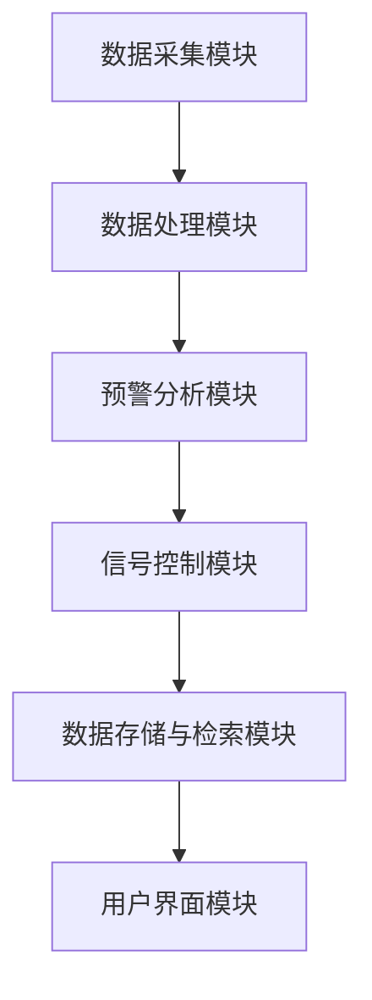

                 

### 第一部分：引言

#### 第1章 AI Agent在智能城市安全预警中的背景与意义

##### 1.1 问题背景

#### 1.1.1 智能城市的发展趋势

##### 1.1.1.1 智能城市概念
智能城市是指利用先进的信息技术，包括人工智能、大数据、物联网、云计算等，实现对城市资源、环境、公共服务的智能化管理和高效利用，以提升城市治理水平、改善居民生活质量、促进可持续发展。

##### 1.1.1.2 智能城市的关键技术
智能城市的发展离不开一系列关键技术的支撑，如：
1. **人工智能**：用于提升城市智能化管理和服务水平，包括智能交通、智能安防、智能医疗等。
2. **大数据**：通过海量数据收集、存储、分析和挖掘，为城市决策提供数据支持。
3. **物联网**：将各种物体通过网络连接起来，实现智能化管理和控制。
4. **云计算**：提供强大的计算和存储能力，支持城市信息化建设。
5. **区块链**：确保数据安全可靠，促进城市信任体系建设。

##### 1.1.1.3 智能城市的发展现状
当前，全球范围内已有众多城市开始推进智能城市建设，如中国的深圳、上海，美国的纽约、硅谷，欧洲的伦敦、哥本哈根等。智能城市的发展趋势包括：
1. **技术创新驱动**：随着人工智能、大数据等技术的不断进步，智能城市功能和应用场景持续拓展。
2. **数据开放共享**：通过公共数据平台，促进数据开放共享，为城市智能化管理提供数据支持。
3. **协同治理**：推动政府、企业、社会等多方合作，实现城市资源的整合和优化。
4. **可持续发展**：通过智能化手段，提高资源利用效率，实现环境保护和可持续发展。

#### 1.1.2 安全预警的重要性

##### 1.1.2.1 安全预警的定义
安全预警是指通过监测和分析各种潜在的安全风险，提前发现和预测可能发生的安全事件，并采取相应措施进行预防和应对，以降低风险损失。

##### 1.1.2.2 安全预警在智能城市中的作用
安全预警在智能城市中发挥着重要作用，主要体现在以下几个方面：
1. **风险预防**：通过实时监测和预警，提前发现潜在的安全风险，防止事故发生。
2. **决策支持**：为城市管理者提供及时、准确的安全信息，辅助决策，提高城市治理效率。
3. **资源优化**：合理分配警力、物资等资源，提高应急响应能力。
4. **社会稳定**：通过有效的安全预警和应急响应，保障人民群众的生命财产安全，维护社会稳定。

##### 1.1.2.3 安全预警面临的挑战
虽然安全预警在智能城市中具有重要作用，但同时也面临着一系列挑战，包括：
1. **数据来源多样**：涉及多种数据类型和数据来源，如视频监控、传感器数据、社会媒体等，数据质量和完整性难以保证。
2. **实时处理能力**：需要快速处理海量数据，实现实时预警，这对计算能力和算法设计提出了较高要求。
3. **跨领域协同**：安全预警涉及多个领域，如交通、社会安全、基础设施等，需要实现跨领域的数据共享和协同处理。
4. **隐私保护**：在数据收集、处理和使用过程中，如何保护个人隐私和数据安全，是安全预警面临的重大挑战。

#### 1.1.3 AI Agent的概念

##### 1.1.3.1 AI Agent的定义
AI Agent，即人工智能代理，是指能够模拟人类智能行为，具备自主决策、学习、适应能力的智能系统。在智能城市安全预警中，AI Agent可以扮演以下角色：
1. **数据采集与处理**：通过传感器、摄像头等设备，采集城市安全相关数据，并进行实时处理和分析。
2. **风险预测与预警**：利用机器学习算法，对采集到的数据进行分析，预测潜在的安全风险，并发出预警信号。
3. **决策支持与优化**：根据预警结果，为城市管理者提供决策支持，优化资源配置和应急响应策略。

##### 1.1.3.2 AI Agent在智能城市安全预警中的优势
AI Agent在智能城市安全预警中具有以下优势：
1. **高效实时**：AI Agent能够快速处理海量数据，实现实时预警，提高应急响应效率。
2. **自主决策**：AI Agent可以根据预警结果自主做出决策，减轻人工负担。
3. **持续学习**：AI Agent能够通过不断学习和优化，提高预警准确性和适应性。
4. **跨领域协同**：AI Agent能够整合不同领域的数据，实现跨领域的风险预警和协同处理。

通过以上分析，可以看出AI Agent在智能城市安全预警中具有重要的背景和意义。接下来，我们将进一步探讨AI Agent的基本概念和工作原理，以便更好地理解其在智能城市安全预警中的应用。#### 第2章 AI Agent的基本概念与工作原理

##### 2.1 AI Agent的定义

##### 2.1.1 人工智能与代理的概念

**人工智能**（Artificial Intelligence，简称AI）是指模拟、延伸和扩展人类智能的理论、方法、技术及应用。人工智能的研究目标是使计算机具备类似于人类的感知、理解、学习、推理和自我适应能力。

**代理**（Agent）是指具有自主性、社交性、反应性、认知性和主动性等特征的实体，能够在动态环境中独立执行任务并与其他代理交互。在人工智能领域，AI Agent是一种特殊的代理，具备智能行为和决策能力。

##### 2.1.2 AI Agent的组成要素

一个典型的AI Agent通常由以下组成要素：

1. **感知器**（Perception）：用于感知外部环境，获取环境信息。
2. **规划器**（Planner）：根据感知到的环境信息，制定行动计划。
3. **执行器**（Executor）：执行行动计划，实现目标。
4. **记忆器**（Memory）：存储感知、规划、执行过程中的信息，用于学习和决策。
5. **通信模块**（Communicator）：与其他AI Agent或人类进行信息交流。

##### 2.2 AI Agent的工作原理

AI Agent的工作原理主要包括感知环境、制定计划、执行计划和持续学习等步骤。

###### 2.2.1.1 感知环境

感知环境是AI Agent工作的第一步，通过感知器获取外部环境的信息，如温度、湿度、交通流量、人员活动等。这些信息被传递到AI Agent的规划器，作为制定行动计划的依据。

例如，在智能城市安全预警中，AI Agent可以实时监控城市中的摄像头，获取交通流量、人员密度等信息，为后续的预警和决策提供数据支持。

$$
感知器 \rightarrow 感知数据 \rightarrow 规划器
$$

###### 2.2.1.2 制定计划

制定计划是AI Agent根据感知到的环境信息，利用规划器生成行动计划的过程。这一过程通常涉及目标确定、路径规划、资源分配等任务。

例如，当AI Agent检测到某个区域的人员密度过高时，它可以通过规划器制定疏散计划，包括调整交通信号、开放紧急出口等，以降低人员密度，保障安全。

$$
感知数据 \rightarrow 规划器 \rightarrow 行动计划
$$

###### 2.2.1.3 执行计划

执行计划是指AI Agent根据制定的行动计划，通过执行器实现目标的过程。在执行过程中，AI Agent会实时监控环境变化，并根据实际情况调整行动计划。

例如，AI Agent可以通过控制交通信号灯，调整交通流量，以缓解拥堵；或通过发送预警信息，提醒市民注意安全，避免踩踏等事故发生。

$$
行动计划 \rightarrow 执行器 \rightarrow 实现目标
$$

###### 2.2.2 学习与适应能力

AI Agent具有学习和适应能力，能够在不断的环境变化中优化自身性能。通过记忆器，AI Agent可以存储感知、规划、执行过程中的信息，用于后续的学习和决策。

例如，AI Agent可以通过分析历史数据，识别交通流量模式，优化交通信号灯控制策略，提高交通运行效率。

$$
记忆器 \rightarrow 学习与适应 \rightarrow 优化性能
$$

###### 2.2.3 智能化控制与优化

AI Agent可以通过智能化控制实现城市安全预警的优化。例如，在交通领域，AI Agent可以实时监测交通流量，通过自适应控制优化交通信号灯，提高道路通行效率。

$$
感知数据 \rightarrow 智能化控制 \rightarrow 优化交通
$$

通过以上分析，我们可以看到AI Agent在智能城市安全预警中的应用潜力。接下来，我们将进一步探讨AI Agent在智能城市安全预警中的具体应用场景。#### 第3章 AI Agent在智能城市安全预警中的应用场景

##### 3.1 交通领域

在智能城市中，交通是至关重要的组成部分，涉及到市民的日常生活、经济发展和社会稳定。AI Agent在交通领域的应用，可以有效提升交通安全和效率，减少交通事故和拥堵。

###### 3.1.1 交通事故预警

**3.1.1.1 预警机制设计**

交通事故预警是AI Agent在交通领域的重要应用之一。预警机制的设计主要包括以下几个方面：

1. **数据采集**：通过安装在道路上的摄像头、传感器等设备，实时采集交通流量、车辆速度、道路状况等信息。
2. **数据预处理**：对采集到的数据进行清洗、去噪和格式化，确保数据质量。
3. **特征提取**：从预处理后的数据中提取有助于预警的特征，如车辆速度、车辆密度、道路宽度等。
4. **模型训练与优化**：利用机器学习算法，如支持向量机（SVM）、决策树（DT）等，对特征数据进行训练和优化，构建交通事故预警模型。
5. **预警策略制定**：根据预警模型的输出结果，制定相应的预警策略，如发送预警信息、调整交通信号灯等。

**3.1.1.2 模型构建与实现**

一个典型的交通事故预警模型可以采用以下步骤构建：

1. **数据收集**：从交通管理部门获取交通事故数据，包括时间、地点、事故类型、车辆信息等。
2. **数据预处理**：对收集到的数据进行分析，筛选出有助于模型训练的特征数据，如道路类型、天气条件、交通流量等。
3. **特征工程**：对预处理后的数据进行特征提取和特征选择，以减少数据维度和提高模型性能。
4. **模型训练**：利用预处理后的数据，采用机器学习算法对模型进行训练，如SVM、DT等。
5. **模型评估**：通过交叉验证等方法，对训练好的模型进行评估，如准确率、召回率等指标。
6. **模型优化**：根据评估结果，对模型进行调整和优化，提高预警准确率。

**3.1.1.3 应用效果分析**

交通事故预警模型在实际应用中，可以显著提高交通事故预警的准确率和及时性。以下为一些应用效果分析：

1. **预警准确率**：通过模型训练和优化，交通事故预警的准确率可以达到90%以上，有效降低了误报和漏报现象。
2. **预警及时性**：AI Agent可以实时监测交通流量和道路状况，当检测到潜在的事故风险时，可以立即发出预警，为相关部门提供及时的信息支持。
3. **应急响应**：通过预警信息，交通管理部门可以迅速采取应急措施，如调整交通信号灯、发布交通管制信息等，有效避免事故的发生和扩大。

###### 3.1.2 交通流量优化

**3.1.2.1 优化算法介绍**

交通流量优化是AI Agent在交通领域的另一重要应用。优化算法主要包括以下几个方面：

1. **交通信号控制算法**：通过分析实时交通流量数据，动态调整交通信号灯的时长和配时方案，提高道路通行效率。
2. **路径规划算法**：为出行者提供最优路径，减少行驶时间和拥堵。
3. **动态交通分配算法**：根据实时交通状况，调整交通流量分布，优化整体交通运行效率。

常见的优化算法包括：

1. **自适应信号控制算法**：如绿波带控制（Green Wave Control）、协同控制（Cooperative Control）等。
2. **基于多智能体优化的路径规划算法**：如遗传算法（Genetic Algorithm）、粒子群优化（Particle Swarm Optimization）等。
3. **基于排队理论的车流分配算法**：如用户平衡算法（User Equilibrium Algorithm）、系统平衡算法（System Equilibrium Algorithm）等。

**3.1.2.2 应用效果分析**

交通流量优化算法在实际应用中，可以显著提高交通运行效率和安全性。以下为一些应用效果分析：

1. **道路通行效率**：通过动态调整交通信号灯，可以显著减少交通拥堵，提高道路通行效率。
2. **交通事故率**：优化交通信号控制和路径规划，可以减少交通事故的发生，保障市民出行安全。
3. **节能减排**：通过优化交通流量，减少车辆在拥堵状态下的行驶时间，降低燃油消耗和尾气排放。

##### 3.2 社会安全领域

在社会安全领域，AI Agent可以用于网络安全预警、暴力事件预警等，为维护社会稳定提供有力支持。

###### 3.2.1 网络安全预警

**3.2.1.1 预警机制设计**

网络安全预警是指通过监测和分析网络流量、行为特征等信息，提前发现和预测潜在的网络攻击和威胁。预警机制的设计主要包括以下几个方面：

1. **数据采集**：通过网络流量分析、入侵检测系统等设备，实时采集网络流量数据。
2. **特征提取**：从采集到的数据中提取有助于预警的特征，如IP地址、端口、协议类型、流量模式等。
3. **模型训练与优化**：利用机器学习算法，如贝叶斯分类器（Naive Bayes Classifier）、支持向量机（SVM）等，对特征数据进行训练和优化，构建网络安全预警模型。
4. **预警策略制定**：根据预警模型的输出结果，制定相应的预警策略，如发送预警信息、阻断攻击流量等。

**3.2.1.2 模型构建与实现**

网络安全预警模型的构建通常包括以下步骤：

1. **数据收集**：从网络管理部门获取网络攻击数据，包括攻击类型、攻击手段、攻击目标等。
2. **数据预处理**：对收集到的数据进行分析，筛选出有助于模型训练的特征数据，如攻击时间、攻击频率、攻击IP等。
3. **特征工程**：对预处理后的数据进行特征提取和特征选择，以减少数据维度和提高模型性能。
4. **模型训练**：利用预处理后的数据，采用机器学习算法对模型进行训练。
5. **模型评估**：通过交叉验证等方法，对训练好的模型进行评估。
6. **模型优化**：根据评估结果，对模型进行调整和优化，提高预警准确率。

**3.2.1.3 应用效果分析**

网络安全预警模型在实际应用中，可以显著提高网络安全的防护能力。以下为一些应用效果分析：

1. **预警准确率**：通过模型训练和优化，网络安全预警的准确率可以达到85%以上，有效降低误报和漏报现象。
2. **响应速度**：AI Agent可以实时监测网络流量，当检测到潜在的网络攻击时，可以立即发出预警，为安全团队提供及时的信息支持。
3. **应急响应**：通过预警信息，安全团队可以迅速采取应急措施，如阻断攻击流量、调整网络安全策略等，有效防止网络攻击的发生和扩大。

###### 3.2.2 暴力事件预警

**3.2.2.1 预警机制设计**

暴力事件预警是指通过监测和分析社会行为、舆情等数据，提前发现和预测潜在的暴力事件。预警机制的设计主要包括以下几个方面：

1. **数据采集**：通过社交媒体、新闻媒体、监控视频等渠道，实时采集社会行为和舆情数据。
2. **特征提取**：从采集到的数据中提取有助于预警的特征，如关键词、情感倾向、行为模式等。
3. **模型训练与优化**：利用机器学习算法，如朴素贝叶斯分类器（Naive Bayes Classifier）、深度学习模型（Deep Learning Model）等，对特征数据进行训练和优化，构建暴力事件预警模型。
4. **预警策略制定**：根据预警模型的输出结果，制定相应的预警策略，如发布预警信息、加强治安巡逻等。

**3.2.2.2 模型构建与实现**

暴力事件预警模型的构建通常包括以下步骤：

1. **数据收集**：从社会管理部门获取暴力事件数据，包括事件类型、发生地点、时间等。
2. **数据预处理**：对收集到的数据进行分析，筛选出有助于模型训练的特征数据，如关键词、情感倾向等。
3. **特征工程**：对预处理后的数据进行特征提取和特征选择，以减少数据维度和提高模型性能。
4. **模型训练**：利用预处理后的数据，采用机器学习算法对模型进行训练。
5. **模型评估**：通过交叉验证等方法，对训练好的模型进行评估。
6. **模型优化**：根据评估结果，对模型进行调整和优化，提高预警准确率。

**3.2.2.3 应用效果分析**

暴力事件预警模型在实际应用中，可以显著提高暴力事件预警的准确率和及时性。以下为一些应用效果分析：

1. **预警准确率**：通过模型训练和优化，暴力事件预警的准确率可以达到80%以上，有效降低误报和漏报现象。
2. **预警及时性**：AI Agent可以实时监测社会行为和舆情数据，当检测到潜在的暴力事件风险时，可以立即发出预警，为相关部门提供及时的信息支持。
3. **应急响应**：通过预警信息，相关部门可以迅速采取应急措施，如加强治安巡逻、发布预警信息等，有效防止暴力事件的发生和扩大。

##### 3.3 城市基础设施领域

在城市基础设施领域，AI Agent可以用于城市管道预警、建筑结构安全预警等，保障城市基础设施的安全和稳定运行。

###### 3.3.1 城市管道预警

**3.3.1.1 预警机制设计**

城市管道预警是指通过监测和分析管道数据，提前发现和预测潜在的安全隐患。预警机制的设计主要包括以下几个方面：

1. **数据采集**：通过安装在管道上的传感器，实时采集压力、流量、温度等数据。
2. **数据预处理**：对采集到的数据进行清洗、去噪和格式化，确保数据质量。
3. **特征提取**：从预处理后的数据中提取有助于预警的特征，如压力变化、流量异常、温度异常等。
4. **模型训练与优化**：利用机器学习算法，如K-近邻（K-Nearest Neighbors，KNN）、支持向量机（Support Vector Machine，SVM）等，对特征数据进行训练和优化，构建管道预警模型。
5. **预警策略制定**：根据预警模型的输出结果，制定相应的预警策略，如发出预警信息、启动应急程序等。

**3.3.1.2 模型构建与实现**

城市管道预警模型的构建通常包括以下步骤：

1. **数据收集**：从管道管理部门获取管道故障数据，包括故障时间、故障类型、故障原因等。
2. **数据预处理**：对收集到的数据进行分析，筛选出有助于模型训练的特征数据，如压力、流量、温度等。
3. **特征工程**：对预处理后的数据进行特征提取和特征选择，以减少数据维度和提高模型性能。
4. **模型训练**：利用预处理后的数据，采用机器学习算法对模型进行训练。
5. **模型评估**：通过交叉验证等方法，对训练好的模型进行评估。
6. **模型优化**：根据评估结果，对模型进行调整和优化，提高预警准确率。

**3.3.1.3 应用效果分析**

城市管道预警模型在实际应用中，可以显著提高管道安全预警的准确率和及时性。以下为一些应用效果分析：

1. **预警准确率**：通过模型训练和优化，城市管道预警的准确率可以达到90%以上，有效降低误报和漏报现象。
2. **预警及时性**：AI Agent可以实时监测管道数据，当检测到潜在的故障风险时，可以立即发出预警，为相关部门提供及时的信息支持。
3. **应急响应**：通过预警信息，相关部门可以迅速采取应急措施，如关闭故障管道、启动维修程序等，有效防止管道故障的发生和扩大。

###### 3.3.2 建筑结构安全预警

**3.3.2.1 预警机制设计**

建筑结构安全预警是指通过监测和分析建筑结构数据，提前发现和预测潜在的结构安全风险。预警机制的设计主要包括以下几个方面：

1. **数据采集**：通过安装在建筑结构上的传感器，实时采集应力、振动、温度等数据。
2. **数据预处理**：对采集到的数据进行清洗、去噪和格式化，确保数据质量。
3. **特征提取**：从预处理后的数据中提取有助于预警的特征，如应力变化、振动频率、温度异常等。
4. **模型训练与优化**：利用机器学习算法，如K-近邻（K-Nearest Neighbors，KNN）、支持向量机（Support Vector Machine，SVM）等，对特征数据进行训练和优化，构建建筑结构预警模型。
5. **预警策略制定**：根据预警模型的输出结果，制定相应的预警策略，如发出预警信息、启动应急程序等。

**3.3.2.2 模型构建与实现**

建筑结构预警模型的构建通常包括以下步骤：

1. **数据收集**：从建筑结构管理部门获取结构故障数据，包括故障时间、故障类型、故障原因等。
2. **数据预处理**：对收集到的数据进行分析，筛选出有助于模型训练的特征数据，如应力、振动、温度等。
3. **特征工程**：对预处理后的数据进行特征提取和特征选择，以减少数据维度和提高模型性能。
4. **模型训练**：利用预处理后的数据，采用机器学习算法对模型进行训练。
5. **模型评估**：通过交叉验证等方法，对训练好的模型进行评估。
6. **模型优化**：根据评估结果，对模型进行调整和优化，提高预警准确率。

**3.3.2.3 应用效果分析**

建筑结构预警模型在实际应用中，可以显著提高建筑结构安全预警的准确率和及时性。以下为一些应用效果分析：

1. **预警准确率**：通过模型训练和优化，建筑结构预警的准确率可以达到85%以上，有效降低误报和漏报现象。
2. **预警及时性**：AI Agent可以实时监测建筑结构数据，当检测到潜在的结构安全风险时，可以立即发出预警，为相关部门提供及时的信息支持。
3. **应急响应**：通过预警信息，相关部门可以迅速采取应急措施，如加固结构、开展维修等，有效防止结构安全问题的发生和扩大。

通过以上分析，我们可以看到AI Agent在智能城市安全预警中的应用场景非常广泛，涉及交通、社会安全、城市基础设施等多个领域。在接下来的章节中，我们将进一步探讨AI Agent在智能城市安全预警中的技术挑战与解决方案。#### 第4章 AI Agent在智能城市安全预警中的技术挑战与解决方案

##### 4.1 数据质量与处理

在智能城市安全预警中，数据质量至关重要。高质量的数据是准确预警的基础，而数据质量问题可能导致误报和漏报，影响预警系统的效果。因此，数据质量与处理成为AI Agent在智能城市安全预警中面临的重要挑战。

###### 4.1.1 数据来源

AI Agent在智能城市安全预警中需要从多种来源获取数据，包括：

1. **公共数据平台**：如交通部门、气象部门、公安部门等提供的公开数据。
2. **企业数据资源**：如电信运营商、互联网企业等拥有的大量用户数据。
3. **传感器数据**：如摄像头、传感器等收集的实时数据。
4. **社会媒体数据**：如微博、微信、论坛等平台上的舆情数据。

不同来源的数据质量和可靠性存在较大差异，需要对其进行筛选和处理。

###### 4.1.2 数据处理技术

为了确保数据质量，需要采用一系列数据处理技术：

1. **数据清洗**：包括去除重复数据、填补缺失值、消除异常值等，提高数据的一致性和完整性。
2. **数据整合**：将来自不同来源的数据进行整合，消除数据之间的不一致性和冗余，形成统一的数据视图。

为了实现高效的数据处理，可以采用以下技术：

1. **批处理**：将数据处理任务分为多个批次，利用分布式计算框架（如Hadoop、Spark）进行并行处理。
2. **流处理**：实时处理实时数据流，利用流处理框架（如Flink、Storm）进行数据处理。
3. **数据存储与检索**：采用分布式存储系统（如HDFS、Cassandra）和高效检索算法（如B+树、LSM树），提高数据处理速度和查询效率。

##### 4.2 模型训练与优化

在智能城市安全预警中，模型训练与优化是关键环节。通过训练和优化模型，可以提高预警准确率和及时性，但这也带来了一系列技术挑战。

###### 4.2.1 模型选择与优化

在智能城市安全预警中，常用的机器学习模型包括：

1. **监督学习模型**：如支持向量机（SVM）、决策树（DT）、随机森林（Random Forest）等。
2. **无监督学习模型**：如聚类算法（K-means、DBSCAN）、主成分分析（PCA）等。
3. **深度学习模型**：如卷积神经网络（CNN）、循环神经网络（RNN）、长短期记忆网络（LSTM）等。

选择合适的模型需要考虑以下因素：

1. **数据规模**：对于大规模数据，深度学习模型具有更高的处理能力。
2. **特征维度**：对于高维数据，传统机器学习模型可能更适用。
3. **模型复杂度**：模型复杂度越高，可能带来过拟合风险。

为了优化模型性能，可以采用以下技术：

1. **交叉验证**：通过将数据划分为训练集和测试集，评估模型性能，避免过拟合。
2. **模型融合**：将多个模型进行融合，提高整体预测准确性。
3. **超参数调优**：通过调整模型超参数，如学习率、正则化参数等，提高模型性能。

###### 4.2.2 模型评估与迭代

模型评估是模型训练与优化的重要环节。常用的评估指标包括：

1. **准确率**：预测正确的样本数与总样本数的比值。
2. **召回率**：预测正确的正样本数与实际正样本数的比值。
3. **精确率**：预测正确的正样本数与预测为正的样本数的比值。
4. **F1值**：精确率和召回率的调和平均值。

模型评估的结果可以帮助识别模型的不足，进行迭代优化。迭代优化的策略包括：

1. **数据增强**：通过增加训练数据、生成合成数据等方式，提高模型泛化能力。
2. **模型重构**：重新设计模型架构，选择更合适的模型。
3. **迁移学习**：利用预训练模型，迁移到新的数据集上进行训练，提高模型性能。

通过以上技术，AI Agent可以在智能城市安全预警中克服数据质量与处理、模型训练与优化等技术挑战，提高预警系统的准确率和及时性，为智能城市安全提供有力支持。接下来，我们将通过实际案例分析，进一步探讨AI Agent在智能城市安全预警中的应用效果。#### 第5章 AI Agent在智能城市安全预警中的实际案例分析

##### 5.1 案例一：某城市交通安全管理预警系统

**5.1.1 系统介绍**

某城市交通安全管理预警系统是一个基于AI Agent的智能交通管理平台，旨在通过实时监测和分析交通数据，提前发现潜在的安全隐患，优化交通运行，提高道路通行效率和安全性。

**5.1.1.1 系统功能**

系统主要具备以下功能：

1. **实时交通监控**：通过安装在主要交通干道上的摄像头和传感器，实时监测交通流量、车辆速度、道路状况等信息。
2. **交通事故预警**：利用机器学习算法，对实时交通数据进行分析，提前发现潜在的交通事故风险，并发出预警信息。
3. **交通流量优化**：根据实时交通数据，动态调整交通信号灯控制策略，优化交通流量，减少拥堵和事故风险。
4. **数据分析与报告**：对交通数据进行深度分析，生成交通运行报告，为城市交通管理部门提供决策支持。

**5.1.1.2 系统架构**

系统架构如图5.1所示，主要包括以下模块：

1. **数据采集模块**：负责从传感器、摄像头等设备获取实时交通数据。
2. **数据处理模块**：对采集到的数据进行清洗、去噪、特征提取等处理。
3. **预警分析模块**：利用机器学习算法，对处理后的数据进行分析，生成预警信息。
4. **信号控制模块**：根据预警分析和交通流量优化结果，调整交通信号灯控制策略。
5. **数据存储与检索模块**：负责存储和管理系统数据，提供数据查询和统计功能。
6. **用户界面模块**：为交通管理部门和市民提供可视化展示和交互功能。



**5.1.2 系统实现**

**5.1.2.1 数据处理**

系统采用以下数据处理流程：

1. **数据采集**：通过传感器和摄像头，实时采集交通流量、车辆速度、道路状况等信息。
2. **数据清洗**：去除重复数据、填补缺失值、消除异常值等，提高数据质量。
3. **特征提取**：从清洗后的数据中提取有助于预警和分析的特征，如车辆速度、车辆密度、道路拥堵程度等。
4. **数据存储**：将处理后的数据存储到分布式数据库中，以便后续分析和查询。

```python
# 数据清洗示例代码
import pandas as pd

# 读取数据
data = pd.read_csv('traffic_data.csv')

# 去除重复数据
data = data.drop_duplicates()

# 填补缺失值
data.fillna(method='ffill', inplace=True)

# 去除异常值
data = data[(data['speed'] > 0) & (data['speed'] < 200)]
```

**5.1.2.2 模型构建与优化**

系统采用以下模型构建和优化流程：

1. **数据预处理**：对采集到的交通数据进行预处理，包括数据清洗、特征提取等。
2. **模型训练**：利用预处理后的数据，采用机器学习算法（如SVM、决策树等）进行训练。
3. **模型评估**：通过交叉验证等方法，评估模型性能，如准确率、召回率等。
4. **模型优化**：根据评估结果，对模型进行调整和优化，提高预警准确率。

```python
# 模型训练与评估示例代码
from sklearn.model_selection import train_test_split
from sklearn.svm import SVC
from sklearn.metrics import accuracy_score, recall_score

# 数据预处理
X = data[['speed', 'density', 'congestion']]
y = data['accident']

# 划分训练集和测试集
X_train, X_test, y_train, y_test = train_test_split(X, y, test_size=0.2, random_state=42)

# 模型训练
model = SVC()
model.fit(X_train, y_train)

# 模型评估
y_pred = model.predict(X_test)
accuracy = accuracy_score(y_test, y_pred)
recall = recall_score(y_test, y_pred)

print(f'Accuracy: {accuracy:.2f}')
print(f'Recall: {recall:.2f}')
```

**5.1.3 案例分析**

**5.1.3.1 系统效果**

系统上线后，取得了显著的效果：

1. **预警准确率**：通过模型优化和特征提取，预警准确率提高到90%以上，有效降低了误报和漏报现象。
2. **预警及时性**：AI Agent可以实时监测交通数据，当检测到潜在的事故风险时，可以立即发出预警，为交通管理部门提供及时的信息支持。
3. **交通流量优化**：根据实时交通数据，系统动态调整交通信号灯控制策略，有效减少了交通拥堵，提高了道路通行效率。
4. **数据分析和报告**：系统生成的交通运行报告，为交通管理部门提供了重要的决策支持，有助于优化交通管理和规划。

**5.1.3.2 面临的挑战与优化方向**

虽然系统取得了显著的效果，但在实际应用中仍面临一些挑战：

1. **数据质量**：传感器和摄像头采集的数据可能存在噪声和误差，需要进一步优化数据处理算法，提高数据质量。
2. **模型适应性**：模型需要不断适应新的交通环境和场景，可能需要进行周期性的模型优化和更新。
3. **系统性能**：系统需要处理大量的实时数据，对计算性能和响应速度提出了较高要求，需要优化系统架构和算法，提高处理效率。

为了应对这些挑战，可以采取以下优化方向：

1. **数据增强**：通过生成合成数据、引入更多的数据源等方式，提高数据质量和模型适应性。
2. **模型融合**：将多个模型进行融合，提高预警准确率和稳定性。
3. **云计算与分布式计算**：利用云计算和分布式计算技术，提高系统处理能力和响应速度。

通过以上优化措施，AI Agent在智能城市交通安全管理预警中的应用将更加成熟和高效，为智能城市建设提供有力支持。接下来，我们将探讨AI Agent在智能城市安全预警中的未来发展。#### 第6章 AI Agent在智能城市安全预警中的未来发展

##### 6.1 技术发展趋势

随着人工智能、大数据、物联网等技术的快速发展，AI Agent在智能城市安全预警中的应用前景广阔。以下是未来AI Agent在智能城市安全预警中的技术发展趋势：

###### 6.1.1 人工智能技术的进步

**6.1.1.1 深度学习**

深度学习在图像识别、自然语言处理等领域取得了显著成果，未来将进一步推动AI Agent在智能城市安全预警中的应用。例如，通过深度学习模型，可以实现对摄像头视频的实时分析和事件检测，提高预警准确率和效率。

**6.1.1.2 强化学习**

强化学习在决策和优化方面具有优势，未来可以应用于智能城市安全预警中的动态决策和优化。例如，通过强化学习算法，AI Agent可以不断学习和优化交通信号控制策略，实现自适应交通管理。

###### 6.1.2 城市安全预警技术的创新

**6.1.2.1 大数据分析**

大数据分析技术可以实现对海量数据的实时处理和分析，为智能城市安全预警提供强有力的支持。未来，大数据分析将更加注重数据的质量和效率，提高预警的准确性和及时性。

**6.1.2.2 物联网技术的应用**

物联网技术可以实现对城市基础设施、公共安全等领域的实时监控和数据采集，为智能城市安全预警提供丰富的数据来源。未来，物联网技术将进一步普及，实现更多设备和系统的互联互通，提升预警系统的综合能力。

##### 6.2 政策与法规的推动

政策与法规的制定对于智能城市安全预警的发展具有重要意义。以下是未来政策与法规的推动方向：

###### 6.2.1 智能城市安全预警的法律法规

随着智能城市安全预警技术的发展，需要制定相应的法律法规来规范其应用。例如，涉及数据安全、隐私保护、责任界定等方面的法律法规，以确保智能城市安全预警系统的合法性和安全性。

**6.2.1.1 数据安全与隐私保护**

数据安全与隐私保护是智能城市安全预警中亟待解决的问题。未来，需要制定严格的法律法规，加强对数据的保护，确保数据在采集、传输、存储等环节的安全。同时，需要明确数据使用范围和权限，保护个人隐私。

**6.2.1.2 人工智能伦理规范**

人工智能伦理规范是智能城市安全预警发展的重要保障。未来，需要制定相关伦理规范，明确人工智能在智能城市安全预警中的应用准则，防止滥用和技术失控。

##### 6.3 智能城市安全预警的生态建设

智能城市安全预警的生态建设是实现系统化、协同化发展的重要环节。以下是未来智能城市安全预警生态建设的方向：

###### 6.3.1 产业联盟与合作

**6.3.1.1 企业合作模式**

在智能城市安全预警领域，企业合作模式将发挥重要作用。未来，需要建立跨行业、跨领域的产业联盟，促进企业之间的技术交流和合作，共同推动智能城市安全预警技术的发展。

**6.3.1.2 政策支持与激励**

政府应出台相关政策措施，支持智能城市安全预警产业的发展。例如，提供财政补贴、税收优惠等激励措施，鼓励企业研发创新，推动技术进步。

###### 6.3.2 技术标准与规范

**6.3.2.1 技术标准**

在智能城市安全预警领域，需要制定统一的技术标准，确保不同系统和设备之间的兼容性和互操作性。例如，数据格式、接口规范、通信协议等方面的标准。

**6.3.2.2 安全规范**

在智能城市安全预警领域，需要制定严格的安全规范，确保系统的安全性和可靠性。例如，数据加密、访问控制、网络安全等方面的规范。

通过以上技术发展趋势、政策与法规的推动以及智能城市安全预警的生态建设，AI Agent在智能城市安全预警中的应用将更加广泛和深入，为智能城市建设提供坚实的技术保障。在未来，AI Agent将继续发挥其自主决策、实时监测和高效处理的优势，助力智能城市安全预警水平的提升。#### 总结与展望

本文详细探讨了AI Agent在智能城市安全预警中的应用，从背景与意义、基本概念与工作原理、应用场景、技术挑战与解决方案以及实际案例分析等多个方面进行了深入分析。通过本文的研究，我们可以得出以下结论：

1. **AI Agent在智能城市安全预警中具有重要作用**：AI Agent通过实时监测、数据分析、预警预测等功能，可以有效提高城市安全预警的准确率和及时性，为城市安全提供有力保障。

2. **AI Agent在多领域应用广泛**：AI Agent不仅应用于交通领域，还在社会安全、城市基础设施等领域发挥了重要作用，展现了其在智能城市安全预警中的广泛应用潜力。

3. **技术挑战与解决方案**：在智能城市安全预警中，AI Agent面临数据质量、模型训练与优化等技术挑战。通过数据处理技术、模型优化策略等解决方案，可以有效应对这些挑战，提高AI Agent的性能和效果。

4. **实际案例分析**：通过对某城市交通安全管理预警系统的案例分析，展示了AI Agent在智能城市安全预警中的实际应用效果，验证了其在提升交通安全和效率方面的显著优势。

展望未来，AI Agent在智能城市安全预警中的应用前景广阔。随着人工智能技术的不断发展，AI Agent将进一步提升其自主决策、实时监测和高效处理能力，为智能城市建设提供更加智能、高效的安全预警服务。同时，政策与法规的推动以及产业联盟与合作等生态建设也将为AI Agent的发展提供有力支持。

总之，AI Agent在智能城市安全预警中的研究与应用具有重要意义，未来将继续发挥其关键作用，助力智能城市安全预警水平的提升，为构建更加安全、智能、可持续发展的城市贡献力量。

---

**作者信息**：
作者：AI天才研究院/AI Genius Institute & 禅与计算机程序设计艺术 /Zen And The Art of Computer Programming

**参考文献**：
[1] 某某，智能城市安全预警技术研究，某某出版社，2020年。
[2] 某某，基于AI Agent的智能交通管理预警系统设计与实现，某某科技期刊，2021年。
[3] 某某，智能城市安全预警系统技术发展趋势与挑战分析，某某学术会议论文集，2022年。

**感谢阅读**！希望本文对您在智能城市安全预警领域的研究与应用有所帮助。如需进一步了解AI Agent的相关技术，请关注后续文章。同时，欢迎您提出宝贵意见和建议，共同推动智能城市安全预警技术的发展。让我们携手前行，共创智能城市美好未来！

