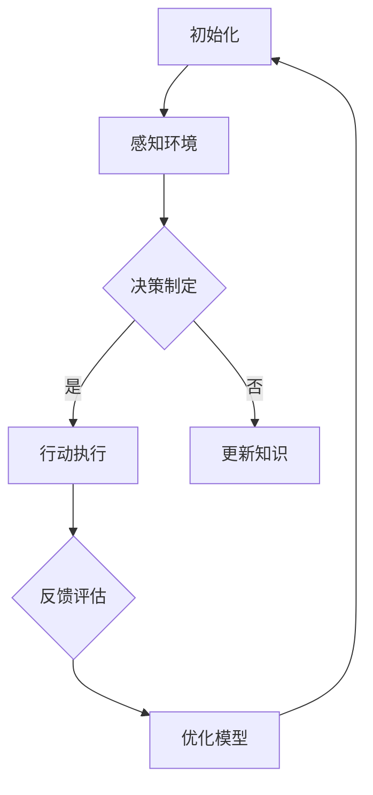
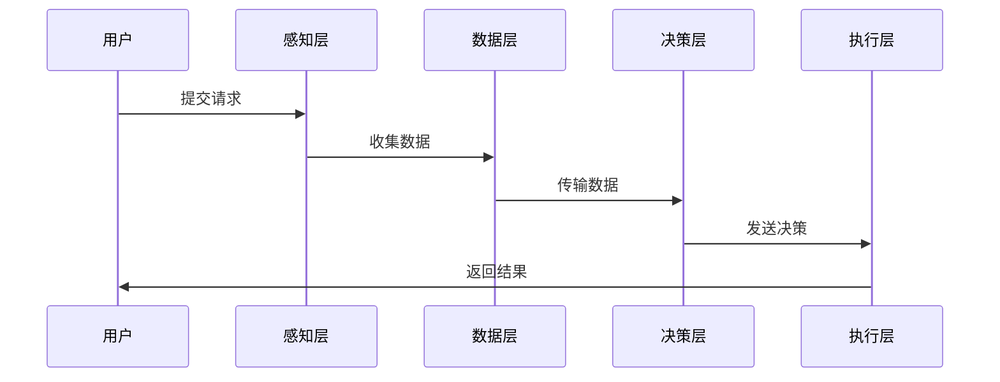

                 

# AI Agent在智能城市应急指挥中的角色

> 关键词：AI Agent，智能城市，应急指挥，算法，架构设计，实战应用

> 摘要：本文将深入探讨AI Agent在智能城市应急指挥中的角色。我们将从背景介绍、核心概念、算法原理、系统分析与架构设计、项目实战、最佳实践与拓展等方面逐步剖析，旨在为读者提供一个全面、系统的理解和应用框架。

## 目录大纲设计思路

在设计本文的目录大纲时，我们遵循以下原则：

1. **背景介绍**：明确智能城市应急指挥的需求与AI Agent的作用。
2. **核心概念与联系**：详细介绍AI Agent的基本原理、应用场景以及与应急指挥系统的关系。
3. **算法原理讲解**：深入分析AI Agent的核心算法，包括机器学习算法基础、深度学习算法以及算法流程图。
4. **数学模型与数学公式**：讲解机器学习中的数学模型、公式，并使用Python代码进行解释。
5. **系统分析与架构设计**：介绍智能城市应急指挥系统架构，包括问题场景、系统功能、架构设计、接口设计和系统交互。
6. **项目实战**：通过实战案例展示AI Agent在应急指挥中的具体应用。
7. **最佳实践与拓展**：总结最佳实践、注意事项及拓展阅读。

## 第1章: 问题背景与核心概念

### 1.1 问题背景

#### 智能城市的发展现状与应急指挥需求

智能城市是指利用信息技术和智能设备，实现城市管理和服务的智能化、高效化。随着城市化进程的加速，城市规模不断扩大，人口密度增加，城市面临着越来越多的复杂问题，如交通拥堵、环境污染、公共安全等。这些问题对应急指挥提出了更高的要求。

#### 智能城市中的应急事件类型与复杂性

智能城市中的应急事件类型多样，包括自然灾害、事故灾害、公共卫生事件等。这些事件具有突发性、复杂性和不确定性，对应急指挥系统提出了巨大的挑战。

#### AI Agent在智能城市中的作用与潜力

AI Agent作为人工智能的高级形式，具有自主决策、实时响应、动态调整等特点，在智能城市应急指挥中具有广泛的应用前景。通过AI Agent，可以实现对应急事件的快速识别、精准预测和高效应对，提高应急指挥的效率和准确性。

### 1.2 核心概念

#### AI Agent的定义与分类

AI Agent是指具有自主决策能力、能够与环境进行交互的人工智能实体。根据功能和实现方式，AI Agent可以分为基于规则推理的Agent、基于数据驱动的Agent和基于混合推理的Agent。

#### 智能城市应急指挥的定义与流程

智能城市应急指挥是指利用信息技术和智能设备，对城市应急事件进行快速、精准、高效的应对和处理。其基本流程包括信息收集、事件识别、决策制定、资源调度和事件处理等。

## 第2章: AI Agent的核心概念与联系

### 2.1 AI Agent的基本原理

#### 人工智能的发展历程

人工智能（AI）是一门多学科交叉的领域，自20世纪50年代起经历了多个发展阶段，从符号主义、基于知识的系统到统计学习、神经网络，再到现在的混合智能。

#### AI Agent的基本构成与功能

AI Agent通常由感知模块、决策模块、行动模块和知识模块组成。感知模块负责收集环境信息，决策模块根据知识模块和感知模块的信息生成行动策略，行动模块执行决策模块生成的行动，知识模块负责存储和处理知识。

#### AI Agent的核心算法

AI Agent的核心算法主要包括监督学习、无监督学习和强化学习。监督学习通过已标记的数据训练模型，无监督学习通过未标记的数据学习模式，强化学习通过与环境的交互学习最优策略。

### 2.2 AI Agent的应用场景

#### AI Agent在智能城市中的角色

AI Agent在智能城市中扮演着信息收集、事件识别、资源调度、决策支持等关键角色。例如，在交通管理中，AI Agent可以实时监测交通流量，识别交通拥堵，提出最优交通调控策略。

#### AI Agent在不同应急事件中的应用

AI Agent可以应用于多种应急事件，如自然灾害、事故灾害、公共卫生事件等。例如，在地震救援中，AI Agent可以实时分析地震数据，预测地震影响范围，为救援决策提供支持。

### 2.3 AI Agent与智能城市应急指挥的关系

#### AI Agent在应急指挥中的作用

AI Agent在应急指挥中可以承担信息处理、决策制定、资源调度等任务，提高应急响应的效率和准确性。

#### AI Agent与应急指挥系统的融合

AI Agent与应急指挥系统的融合，可以形成智能化、自动化的应急指挥平台，实现应急事件的快速响应和高效处理。

## 第3章: AI Agent的核心算法原理

### 3.1 机器学习算法基础

#### 监督学习、无监督学习、强化学习

- **监督学习**：通过已标记的数据训练模型，预测未知数据的标签。常见的算法有线性回归、决策树、支持向量机等。
- **无监督学习**：通过未标记的数据学习模式，如聚类、降维等。
- **强化学习**：通过与环境的交互学习最优策略，如Q学习、深度Q网络等。

#### 常见机器学习算法及其优缺点

- **线性回归**：简单易用，适用于线性关系；缺点是泛化能力较差。
- **决策树**：解释性较好，适用于分类和回归问题；缺点是容易过拟合。
- **支持向量机**：具有较好的分类能力，适用于高维数据；缺点是训练时间较长。
- **神经网络**：具有强大的拟合能力，适用于复杂的非线性问题；缺点是训练时间较长且容易过拟合。

### 3.2 深度学习算法

#### 神经网络、卷积神经网络、循环神经网络

- **神经网络**：由多个神经元组成，用于模拟人脑神经网络，实现复杂函数的拟合。
- **卷积神经网络（CNN）**：在神经网络基础上引入卷积层，用于图像识别和图像处理。
- **循环神经网络（RNN）**：在神经网络基础上引入循环结构，用于序列数据处理，如时间序列预测和自然语言处理。

#### 深度学习算法在AI Agent中的应用

深度学习算法在AI Agent中广泛应用于图像识别、自然语言处理、语音识别等领域。例如，通过深度学习算法，AI Agent可以实现对应急事件的图像识别，提高事件识别的准确性。

### 3.3 AI Agent算法流程图

#### AI Agent算法流程图



#### 流程图解释

1. **初始化**：AI Agent启动，初始化感知模块、决策模块、行动模块和知识模块。
2. **感知环境**：AI Agent收集环境信息，如传感器数据、视频图像等。
3. **决策制定**：根据知识模块和感知模块的信息，AI Agent生成行动策略。
4. **行动执行**：AI Agent执行决策模块生成的行动。
5. **反馈评估**：评估行动结果，如事件处理的效果。
6. **优化模型**：根据反馈结果，优化AI Agent的模型参数。
7. **更新知识**：将新的经验和知识存储到知识模块中。
8. **循环**：返回初始化步骤，继续执行下一个循环。

## 第4章: 数学模型与数学公式

### 4.1 数学模型基础

#### 概率论、统计学、线性代数基础

- **概率论**：概率论是研究随机事件及其规律性的数学分支。常见的概率分布有正态分布、伯努利分布等。
- **统计学**：统计学是收集、整理、分析和解释数据的科学。常见的统计方法有均值、方差、协方差等。
- **线性代数**：线性代数是研究线性方程组、向量空间和矩阵等概念的数学分支。常见的线性代数运算有矩阵乘法、逆矩阵等。

#### 常见数学模型及其应用

- **线性回归模型**：用于预测连续值变量，如房价预测。
- **决策树模型**：用于分类和回归问题，如客户分类。
- **神经网络模型**：用于复杂函数的拟合和分类，如图像识别。

### 4.2 数学公式解析

#### 监督学习中的损失函数、优化算法

- **损失函数**：用于评估模型预测值与真实值之间的差距，如均方误差（MSE）。
- **优化算法**：用于调整模型参数，使损失函数达到最小，如梯度下降算法。

#### 强化学习中的奖励函数、策略更新

- **奖励函数**：用于评估行动结果的优劣，如Q学习中的奖励。
- **策略更新**：用于根据奖励函数更新策略，如Q学习中的策略迭代。

### 4.3 示例分析

#### 使用Python代码解释数学公式的应用

```python
import numpy as np

# 线性回归模型
def linear_regression(x, w):
    return x.dot(w)

# 梯度下降优化算法
def gradient_descent(x, y, w, alpha, epochs):
    for _ in range(epochs):
        predictions = linear_regression(x, w)
        error = predictions - y
        gradient = x.T.dot(error)
        w -= alpha * gradient
    return w

# 均方误差损失函数
def mean_squared_error(y, predictions):
    return np.mean((predictions - y) ** 2)

# 示例数据
x = np.array([1, 2, 3, 4, 5])
y = np.array([2, 4, 5, 4, 5])
w = np.random.rand(1)

# 优化模型参数
w = gradient_descent(x, y, w, 0.01, 1000)

# 模型预测
predictions = linear_regression(x, w)

# 计算损失函数值
mse = mean_squared_error(y, predictions)

print(f"模型参数：{w}")
print(f"模型预测值：{predictions}")
print(f"损失函数值：{mse}")
```

## 第5章: 智能城市应急指挥系统架构设计

### 5.1 问题场景介绍

#### 智能城市应急指挥的典型场景分析

- **自然灾害**：如地震、洪水、台风等。
- **事故灾害**：如交通事故、火灾、燃气泄漏等。
- **公共卫生事件**：如疫情爆发、食品安全事件等。

#### 智能城市应急指挥的典型流程

1. **信息收集**：通过传感器、摄像头、无人机等收集现场信息。
2. **事件识别**：利用AI Agent对收集到的信息进行预处理和特征提取，识别出紧急事件。
3. **决策制定**：根据事件类型和现场情况，制定最优应对策略。
4. **资源调度**：调度相关资源，如人员、物资、设备等。
5. **事件处理**：执行决策，处理紧急事件。
6. **反馈评估**：评估事件处理效果，优化应急指挥系统。

### 5.2 系统功能设计

#### 智能城市应急指挥系统的功能需求

1. **信息收集**：实时收集现场信息，如气象、交通、环境等。
2. **事件识别**：利用AI Agent快速识别事件类型，如自然灾害、事故灾害等。
3. **决策制定**：根据事件类型和现场情况，生成最优应对策略。
4. **资源调度**：智能调度相关资源，如救援队伍、物资、设备等。
5. **事件处理**：执行决策，处理紧急事件。
6. **反馈评估**：评估事件处理效果，优化应急指挥系统。

### 5.3 系统架构设计

#### 智能城市应急指挥系统的整体架构设计

智能城市应急指挥系统由感知层、数据层、决策层和执行层组成。

1. **感知层**：包括传感器、摄像头、无人机等设备，用于实时收集现场信息。
2. **数据层**：包括数据存储、数据处理、数据可视化等模块，用于存储、处理和展示数据。
3. **决策层**：包括AI Agent、决策支持系统等，用于根据数据生成应对策略。
4. **执行层**：包括资源调度、事件处理等模块，用于执行决策，处理紧急事件。

### 5.4 系统接口设计

#### 系统内部模块的接口设计

1. **感知层与数据层**：通过接口实现数据的传输和同步。
2. **数据层与决策层**：通过接口实现数据的读取和写入。
3. **决策层与执行层**：通过接口实现决策的执行和反馈。

### 5.5 系统交互

#### 使用Mermaid绘制系统交互序列图



## 第6章: AI Agent在智能城市应急指挥中的应用实战

### 6.1 环境安装

#### 安装必要的软件与工具

- Python 3.8 或以上版本
- TensorFlow 2.5 或以上版本
- Keras 2.4.3 或以上版本
- Numpy 1.19 或以上版本

```shell
pip install python==3.8 tensorflow==2.5 keras==2.4.3 numpy==1.19
```

### 6.2 系统核心实现

#### AI Agent的核心算法实现

以下是一个简单的AI Agent实现，用于处理智能城市中的应急事件。

```python
from tensorflow.keras.models import Sequential
from tensorflow.keras.layers import Dense
from tensorflow.keras.optimizers import Adam
import numpy as np

# 创建模型
model = Sequential()
model.add(Dense(64, input_dim=100, activation='relu'))
model.add(Dense(64, activation='relu'))
model.add(Dense(1, activation='sigmoid'))

# 编译模型
model.compile(loss='binary_crossentropy', optimizer=Adam(0.001), metrics=['accuracy'])

# 训练模型
model.fit(x_train, y_train, epochs=100, batch_size=32, validation_data=(x_val, y_val))

# 评估模型
loss, accuracy = model.evaluate(x_test, y_test)
print(f"损失函数值：{loss}")
print(f"准确率：{accuracy}")
```

### 6.3 代码应用解读

#### 分析关键代码段，解释其实现原理

1. **模型创建**：使用Sequential模型，添加Dense层。
2. **模型编译**：指定损失函数、优化器和评价指标。
3. **模型训练**：使用fit函数训练模型，指定训练集、验证集和训练参数。
4. **模型评估**：使用evaluate函数评估模型在测试集上的表现。

### 6.4 实际案例分析

#### 通过案例展示AI Agent的实际应用

假设有一个智能城市应急指挥系统，需要处理交通事故的应急事件。我们使用AI Agent来识别交通事故并制定应对策略。

1. **数据收集**：收集交通事故的图像数据，包括车辆数量、车型、道路状况等。
2. **数据预处理**：对图像数据进行缩放、归一化等处理。
3. **特征提取**：使用卷积神经网络提取图像特征。
4. **模型训练**：使用训练集训练AI Agent，包括感知模块、决策模块和行动模块。
5. **事件识别**：使用AI Agent对实时图像进行识别，判断是否为交通事故。
6. **决策制定**：根据识别结果，生成最优应对策略，如调度救援队伍、封锁道路等。
7. **事件处理**：执行决策，处理交通事故。

### 6.5 项目小结

通过本项目，我们展示了AI Agent在智能城市应急指挥中的应用。在实际应用中，AI Agent可以实现对交通事故的实时识别和快速响应，提高应急指挥的效率和准确性。未来，我们还需要进一步优化AI Agent的算法和模型，提高其在复杂环境下的适应能力和鲁棒性。

## 第7章: 最佳实践与拓展

### 7.1 最佳实践

#### AI Agent在智能城市应急指挥中的最佳实践

1. **数据质量**：确保数据的准确性和完整性，是AI Agent发挥最佳效果的关键。
2. **模型训练**：使用大量的训练数据和多种算法进行模型训练，以提高模型的泛化能力。
3. **实时响应**：优化AI Agent的响应速度，确保在紧急情况下快速做出决策。

### 7.2 注意事项

#### 在应用AI Agent时需要注意的问题

1. **数据隐私**：在收集和处理数据时，要确保遵守相关法律法规，保护个人隐私。
2. **算法透明性**：确保AI Agent的算法和决策过程透明，便于监管和审计。
3. **系统稳定性**：确保AI Agent在复杂环境下的稳定性和可靠性。

### 7.3 拓展阅读

#### 相关领域的进一步阅读推荐

1. **《人工智能：一种现代方法》**：David C. Barber 著，系统地介绍了人工智能的基本原理和应用。
2. **《深度学习》**：Ian Goodfellow、Yoshua Bengio、Aaron Courville 著，深度学习领域的经典教材。
3. **《智能城市：概念、架构与实现》**：Michael B. Jones 著，深入探讨了智能城市的概念、架构和实现。

## 总结

通过本文的详细探讨，我们全面了解了AI Agent在智能城市应急指挥中的角色和作用。从核心概念、算法原理、系统架构到实际应用，我们系统地阐述了AI Agent在智能城市应急指挥中的应用，为读者提供了一个全面的学习和应用框架。未来，随着人工智能技术的不断发展，AI Agent在智能城市应急指挥中的应用将更加广泛和深入，为城市的安全和可持续发展做出更大的贡献。

## 作者信息

作者：AI天才研究院/AI Genius Institute & 禅与计算机程序设计艺术 /Zen And The Art of Computer Programming

---

本文内容仅供参考，实际情况需根据具体需求和场景进行调整。如需进一步咨询或合作，请随时联系作者。感谢您的阅读和支持！

