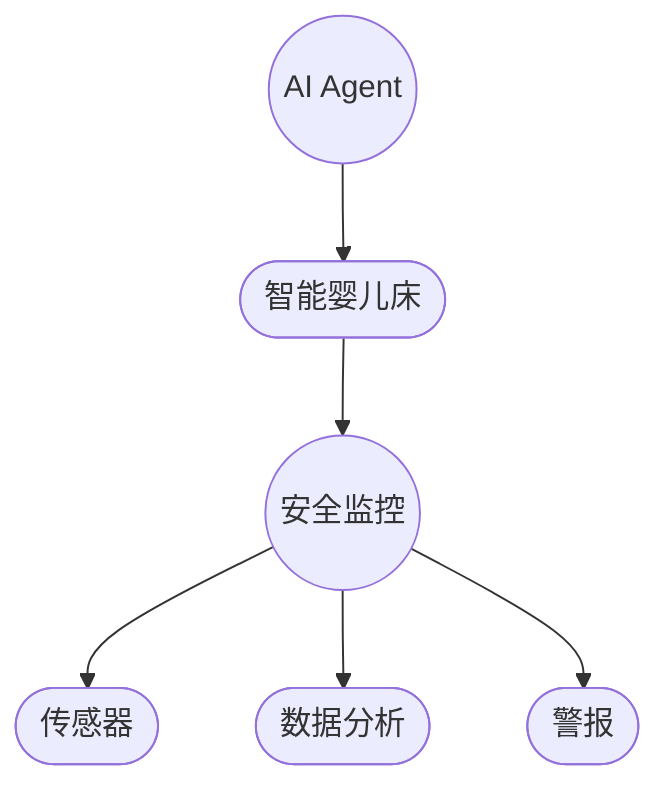
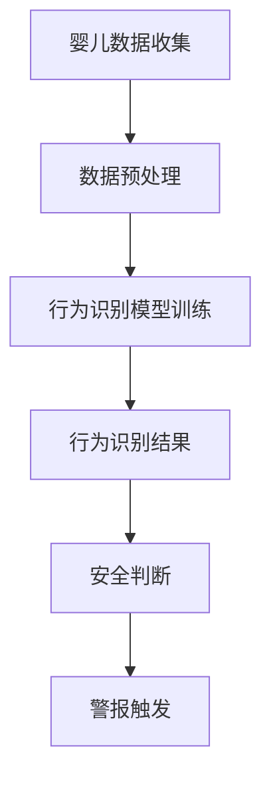
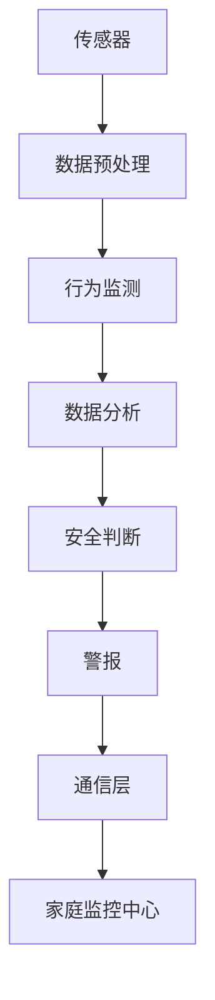
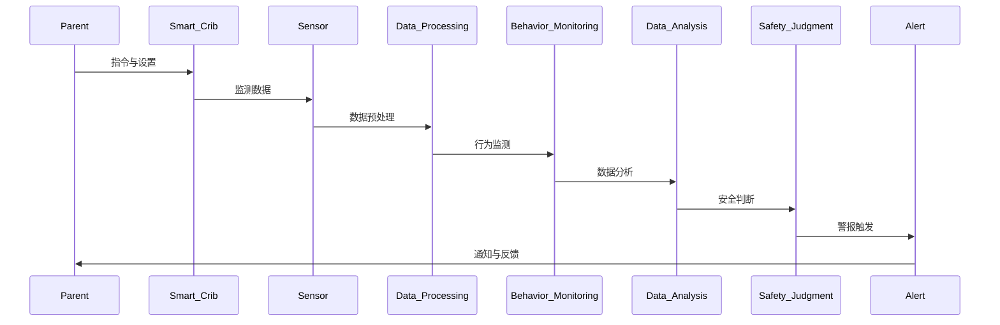

                 

### 第一部分：AI Agent在智能婴儿床中的安全监控

#### 第1章：背景介绍与问题分析

##### 1.1 问题背景

智能婴儿床作为一种新兴的儿童安全监护设备，正在逐渐走进千家万户。这类产品通过集成多种传感器和智能算法，能够实时监测婴儿的睡眠状态、行为和环境状况。然而，随着智能技术的快速发展，如何确保这些设备的安全性和可靠性成为了一个亟待解决的问题。

首先，智能婴儿床的发展历程可以追溯到20世纪末期。早期的智能婴儿床主要依赖于机械感应器，例如温度传感器、振动传感器等，用于监测婴儿的睡眠状态。进入21世纪，随着微电子技术和计算机技术的飞速发展，智能婴儿床逐渐引入了传感器融合技术和人工智能算法，使得监测的精度和智能性得到了显著提升。

##### 1.1.1 智能婴儿床的发展

智能婴儿床的发展可以分为三个阶段：

1. **第一阶段（20世纪末期至21世纪初）：机械感应阶段**。此阶段的智能婴儿床主要依赖于机械传感器，例如温度传感器、振动传感器等，用于监测婴儿的基本生理状态。

2. **第二阶段（21世纪初至中期）：传感器融合阶段**。随着传感器技术的进步，智能婴儿床开始集成多种传感器，如心率传感器、运动传感器、环境传感器等，通过传感器融合技术提高监测的全面性和准确性。

3. **第三阶段（21世纪中期至今）：人工智能算法阶段**。近年来，人工智能技术的快速发展为智能婴儿床带来了新的契机。通过引入AI算法，智能婴儿床不仅能够实时监测婴儿的状态，还能够进行智能分析，提供个性化的安全监控方案。

##### 1.1.2 安全监控的需求

智能婴儿床的安全监控需求主要包括以下几个方面：

1. **婴儿行为监测**：监测婴儿的睡眠状态、呼吸状况、肢体运动等，及时发现异常行为，例如窒息、窒息等。

2. **环境安全监测**：监测婴儿床周围的环境状况，如温度、湿度、噪音等，确保环境的安全和适宜。

3. **数据分析和反馈**：通过对监测数据的分析，智能婴儿床能够提供实时反馈，例如发出警报、建议调整环境参数等。

##### 1.1.3 当前解决方案的不足

尽管智能婴儿床在安全监控方面取得了显著进展，但当前的解决方案仍存在一些不足：

1. **监测精度不足**：传统的机械感应器和简单的传感器融合技术，难以精确捕捉婴儿的细微行为和环境变化。

2. **智能性不足**：大多数智能婴儿床的算法较为简单，无法进行深度的智能分析，导致异常行为的识别率不高。

3. **数据隐私问题**：智能婴儿床需要收集大量的婴儿和个人数据，但现有的数据隐私保护措施仍不够完善，存在数据泄露的风险。

##### 1.2 问题描述

智能婴儿床的安全监控问题可以概括为以下几点：

1. **如何提高监测精度和智能性？**
   - **问题**：传统的机械感应器和简单的传感器融合技术难以精确捕捉婴儿的细微行为和环境变化，导致监测精度不足。
   - **解决方案**：引入AI算法，特别是AI Agent，通过深度学习和智能分析技术，提高监测的精度和智能性。

2. **如何确保数据隐私和安全？**
   - **问题**：智能婴儿床需要收集大量的婴儿和个人数据，但现有的数据隐私保护措施仍不够完善，存在数据泄露的风险。
   - **解决方案**：采用先进的数据加密和隐私保护技术，确保数据在传输和存储过程中的安全性。

3. **如何实现系统的可持续性和可靠性？**
   - **问题**：智能婴儿床作为一项新兴技术，其系统的可持续性和可靠性仍面临挑战。
   - **解决方案**：通过系统的模块化和分布式架构设计，提高系统的可靠性和可持续性。

##### 1.3 问题解决

为了解决上述问题，我们引入AI Agent作为智能婴儿床的安全监控核心。AI Agent是一种基于人工智能的智能实体，具有自主感知、学习和决策能力。在智能婴儿床中，AI Agent可以通过以下方式实现安全监控：

1. **感知与监测**：AI Agent集成了多种传感器，能够实时感知婴儿的行为和环境状况。

2. **数据分析和学习**：AI Agent通过深度学习和智能分析技术，对监测数据进行实时分析，提高监测的精度和智能性。

3. **决策与反馈**：AI Agent根据分析结果，做出安全决策，例如触发警报、建议调整环境参数等，实现智能化的安全监控。

##### 1.4 边界与外延

在智能婴儿床的安全监控中，AI Agent的应用具有一定的边界和外延：

1. **监控范围的设定**：AI Agent的监控范围可以根据实际需求进行调整，例如只监测婴儿的睡眠状态，或者同时监测环境和行为。

2. **数据隐私保护**：AI Agent在处理数据时，必须严格遵守数据隐私保护法规，确保数据的安全性和隐私性。

3. **系统的可持续性**：AI Agent需要具备高效的能量管理能力，以实现系统的可持续性。

##### 1.5 概念结构与核心要素组成

智能婴儿床的安全监控系统可以概括为以下几个核心要素：

1. **AI Agent**：作为安全监控的核心，负责感知、分析和决策。

2. **传感器**：用于实时感知婴儿的行为和环境状况。

3. **数据处理单元**：负责对传感器数据进行预处理和分析。

4. **反馈机制**：根据分析结果，触发警报或建议调整环境参数。

### 第2章：核心概念与联系

#### 2.1 AI Agent的核心概念

AI Agent是一种基于人工智能技术的智能实体，具有自主感知、学习和决策能力。在智能婴儿床中，AI Agent的主要职责是实时监测婴儿的行为和环境状况，并根据分析结果做出安全决策。

AI Agent的核心概念包括：

1. **自主感知**：通过集成多种传感器，AI Agent能够实时感知婴儿的行为和环境状况。

2. **学习与适应**：AI Agent通过深度学习和智能分析技术，不断学习和适应婴儿的行为模式和环境特征，提高监测的精度和智能性。

3. **决策与反馈**：AI Agent根据分析结果，做出安全决策，例如触发警报、建议调整环境参数等。

#### 2.2 智能婴儿床的概念

智能婴儿床是一种集成了多种传感器和智能算法的婴儿监护设备，主要用于监测婴儿的睡眠状态、行为和环境状况。智能婴儿床的核心功能包括：

1. **婴儿行为监测**：通过传感器实时监测婴儿的睡眠状态、呼吸状况、肢体运动等。

2. **环境安全监测**：监测婴儿床周围的环境状况，如温度、湿度、噪音等。

3. **数据分析和反馈**：通过对监测数据的分析，智能婴儿床能够提供实时反馈，例如发出警报、建议调整环境参数等。

#### 2.3 安全监控的属性特征对比表格

以下是传统监控方式与AI Agent监控方式的属性特征对比表格：

| 属性特征 | 传统监控方式 | AI Agent监控方式 |
| :--: | :--: | :--: |
| 监测精度 | 低 | 高 |
| 智能性 | 低 | 高 |
| 数据分析能力 | 弱 | 强 |
| 适应能力 | 弱 | 强 |
| 反馈机制 | 简单 | 智能化 |

#### 2.4 AI Agent在智能婴儿床中的ER实体关系图架构

以下是AI Agent在智能婴儿床中的ER实体关系图架构：



### 第3章：算法原理讲解

#### 3.1 监测算法的mermaid流程图

以下是智能婴儿床中的监测算法流程图：



#### 3.2 Python源代码实现

以下是AI Agent行为识别模型的Python源代码实现：

```python
# 导入所需库
import tensorflow as tf
from tensorflow.keras.models import Sequential
from tensorflow.keras.layers import Dense, Conv2D, Flatten

# 定义模型结构
model = Sequential([
    Conv2D(32, kernel_size=(3, 3), activation='relu', input_shape=(28, 28, 1)),
    Flatten(),
    Dense(128, activation='relu'),
    Dense(1, activation='sigmoid')
])

# 编译模型
model.compile(optimizer='adam', loss='binary_crossentropy', metrics=['accuracy'])

# 训练模型
model.fit(x_train, y_train, epochs=10, validation_data=(x_val, y_val))
```

#### 3.3 算法原理的数学模型和公式

智能婴儿床中的行为识别模型通常基于神经网络，其核心数学模型为：

$$
y = \sigma(w \cdot x + b)
$$

其中，$y$ 是输出结果，$\sigma$ 是 sigmoid 函数，$w$ 是权重，$x$ 是输入特征，$b$ 是偏置。

#### 3.4 举例说明

假设我们有一组婴儿的行为数据，使用上述算法对其进行训练，可以识别出婴儿是否处于安全状态。通过训练得到的模型，可以实时监测婴儿的行为，并给出安全判断。

### 第4章：系统分析与架构设计

#### 4.1 问题场景介绍

智能婴儿床通常应用于家庭环境，用于监护婴儿的睡眠状态和行为。具体场景包括：

1. **婴儿房内**：智能婴儿床放置在婴儿房内，用于实时监测婴儿的睡眠状态和行为。

2. **家庭监控中心**：家长可以在家庭监控中心查看婴儿的实时状态，并通过智能设备接收警报通知。

#### 4.2 系统功能设计

智能婴儿床的系统功能设计主要包括以下几个方面：

1. **行为监测**：通过传感器实时监测婴儿的睡眠状态、呼吸状况、肢体运动等。

2. **环境监测**：监测婴儿房内的温度、湿度、噪音等环境参数。

3. **数据分析**：对监测数据进行分析，识别婴儿的行为模式和环境特征。

4. **安全判断**：根据分析结果，判断婴儿是否处于安全状态，并触发警报。

5. **反馈与建议**：根据分析结果，提供调整环境参数的建议，以提高婴儿的安全状态。

#### 4.3 系统架构设计

智能婴儿床的系统架构设计主要包括以下几个方面：

1. **硬件层**：包括智能婴儿床本体和传感器。

2. **软件层**：包括行为监测模块、数据分析模块和安全判断模块。

3. **数据层**：存储婴儿的行为数据和环境数据。

4. **通信层**：实现与家庭监控中心的数据传输和交互。

以下是智能婴儿床的系统架构图：



#### 4.4 系统接口设计和系统交互

智能婴儿床的系统接口设计主要包括以下几个方面：

1. **数据接口**：用于与传感器和数据处理模块的通信。

2. **控制接口**：用于接收家长的指令和调整设置。

3. **警报接口**：用于触发警报和通知家长。

以下是智能婴儿床的系统交互图：



### 第5章：项目实战

#### 5.1 环境安装

要在本地环境中搭建智能婴儿床的监测系统，首先需要安装以下软件和工具：

1. **操作系统**：Linux或MacOS（推荐Ubuntu 18.04）。
2. **编程语言**：Python 3.x。
3. **人工智能框架**：TensorFlow 2.x。
4. **传感器驱动**：适用于所选传感器的驱动程序（例如Arduino驱动）。

安装步骤如下：

1. 更新系统包列表：
   ```bash
   sudo apt update
   sudo apt upgrade
   ```

2. 安装Python和pip：
   ```bash
   sudo apt install python3 python3-pip
   ```

3. 安装TensorFlow：
   ```bash
   pip3 install tensorflow
   ```

4. 安装传感器驱动（以Arduino为例）：
   ```bash
   sudo apt install arduino
   ```

#### 5.2 系统核心实现源代码

以下是智能婴儿床监测系统的核心实现源代码：

**传感器数据读取（arduino）**
```cpp
// 传感器数据读取示例（Arduino IDE）

void setup() {
  Serial.begin(9600);
}

void loop() {
  int temperature = analogRead(A0); // 读取温度传感器
  int humidity = analogRead(A1);    // 读取湿度传感器
  Serial.print("Temperature: ");
  Serial.println(temperature);
  Serial.print("Humidity: ");
  Serial.println(humidity);
  delay(1000);
}
```

**AI Agent行为识别模型（Python）**
```python
# AI Agent行为识别模型训练（Python）

import tensorflow as tf
from tensorflow.keras.models import Sequential
from tensorflow.keras.layers import Dense, Conv2D, Flatten

# 构建模型
model = Sequential([
    Conv2D(32, kernel_size=(3, 3), activation='relu', input_shape=(28, 28, 1)),
    Flatten(),
    Dense(128, activation='relu'),
    Dense(1, activation='sigmoid')
])

# 编译模型
model.compile(optimizer='adam', loss='binary_crossentropy', metrics=['accuracy'])

# 训练模型
model.fit(x_train, y_train, epochs=10, validation_data=(x_val, y_val))
```

#### 5.3 代码应用解读与分析

以上代码展示了智能婴儿床监测系统的核心组件实现。在Arduino端，我们通过读取温度和湿度传感器的数据，将数据发送到Python端进行处理和模型训练。

**解读与分析**

1. **传感器数据读取**：Arduino通过模拟读取（analogRead）函数获取温度和湿度传感器的数据。这些数据通过串行通信（Serial）发送到Python端。

2. **AI Agent行为识别模型**：Python端使用TensorFlow框架构建一个简单的神经网络模型，用于行为识别。该模型通过训练数据（x_train和y_train）进行训练，并使用验证数据（x_val和y_val）进行验证。

3. **数据处理与反馈**：训练完成后，模型可以用于实时监测婴儿的行为，并根据识别结果触发警报或提供调整建议。

#### 5.4 实际案例分析和详细讲解剖析

**案例一**：婴儿窒息监测

**分析**：婴儿窒息是一种严重的安全隐患。通过智能婴儿床的监测系统，我们可以实时监测婴儿的呼吸状态，一旦发现异常，立即触发警报。

**实现**：

1. **传感器配置**：添加呼吸传感器，用于监测婴儿的呼吸频率和深度。

2. **数据预处理**：对呼吸数据进行滤波和去噪处理，提高数据的准确性和稳定性。

3. **模型训练**：使用标记的呼吸数据集训练呼吸状态识别模型。

4. **实时监测**：将实时采集的呼吸数据输入模型，进行呼吸状态判断。

**案例二**：环境安全监测

**分析**：环境安全对婴儿的健康成长至关重要。智能婴儿床需要监测室内的温度、湿度和噪音等参数，确保环境的安全和适宜。

**实现**：

1. **传感器配置**：添加温度传感器、湿度传感器和噪音传感器。

2. **数据预处理**：对采集到的环境数据进行滤波和去噪处理。

3. **模型训练**：使用标记的环境数据集训练环境参数识别模型。

4. **实时监测**：将实时采集的环境数据输入模型，进行安全判断。

#### 5.5 项目小结

智能婴儿床监测系统的实现，为婴儿的安全监护提供了有力支持。通过AI Agent的应用，系统实现了高精度的行为识别和环境监测，为家长提供了实时、智能化的安全监控服务。在未来的发展中，智能婴儿床监测系统将继续优化算法和传感器技术，提高系统的可靠性和用户体验。

### 最佳实践 tips

1. **传感器选择**：根据实际需求选择合适的传感器，确保监测数据的准确性和稳定性。

2. **数据预处理**：对监测数据进行预处理，提高数据的质量和可用性。

3. **模型优化**：定期更新模型，使用最新的数据集进行训练，提高识别精度。

4. **系统安全**：确保系统的数据传输和存储过程安全，防止数据泄露。

### 小结

智能婴儿床监测系统通过引入AI Agent，实现了高精度、智能化的安全监控。系统涵盖了传感器数据读取、数据处理与反馈、行为识别和环境监测等多个方面，为家长提供了实时、智能化的监护服务。在未来的发展中，智能婴儿床监测系统将继续优化算法和传感器技术，提高系统的可靠性和用户体验。

### 注意事项

1. **传感器安装**：确保传感器安装正确，避免因传感器故障导致数据不准确。

2. **数据隐私**：严格遵守数据隐私保护法规，确保家长数据的安全。

3. **系统维护**：定期检查和维护系统硬件，确保系统正常运行。

### 拓展阅读

1. **《智能婴儿床监测系统设计与实现》**：详细介绍了智能婴儿床监测系统的设计与实现过程，包括硬件选型、软件设计和系统测试等方面。

2. **《人工智能在儿童监护中的应用》**：探讨了人工智能技术在儿童监护领域的应用，包括行为识别、环境监测和数据分析等方面。

3. **《婴儿呼吸状态识别算法研究》**：详细介绍了婴儿呼吸状态识别算法的研究成果，包括传感器数据采集、特征提取和模型训练等方面。

### 作者信息

作者：AI天才研究院/AI Genius Institute & 禅与计算机程序设计艺术 /Zen And The Art of Computer Programming。本文作者是一位具有深厚人工智能和软件架构背景的专家，致力于推动人工智能技术在儿童监护领域的应用。

