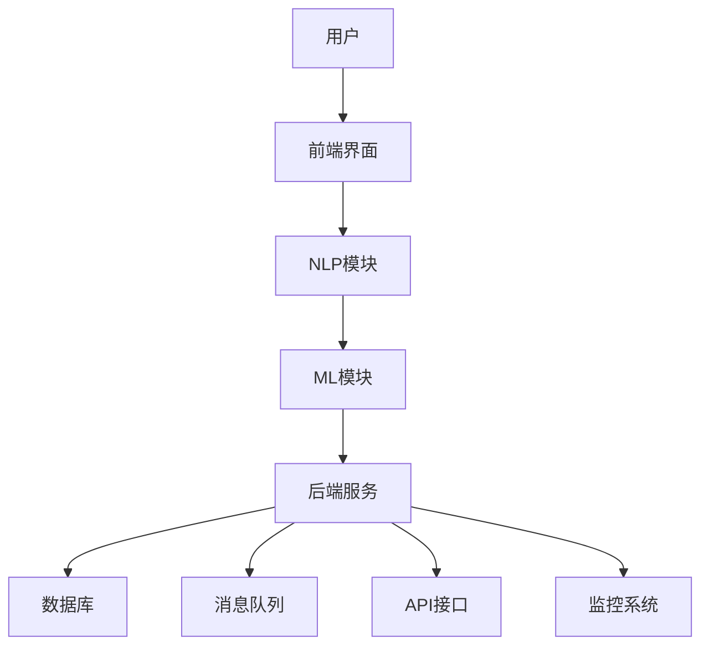
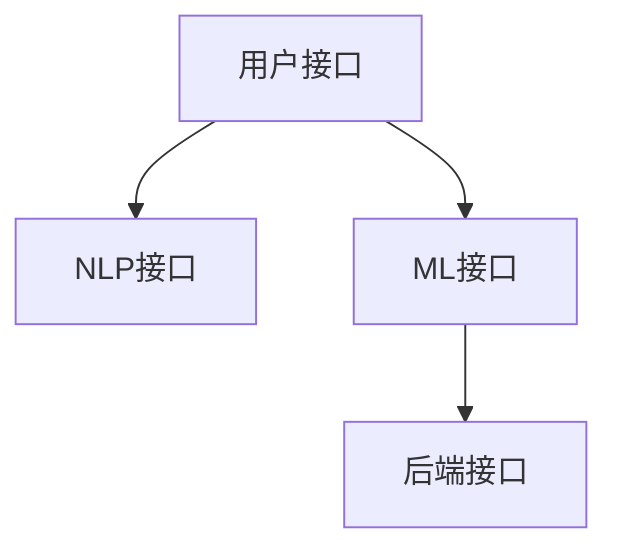

                 

## AI Agent在智能客服中的应用实践

### 关键词

- AI Agent
- 智能客服
- 自然语言处理
- 机器学习
- 客户体验优化

### 摘要

本文将深入探讨AI Agent在智能客服中的应用实践。首先，我们将介绍AI Agent和智能客服的基本概念及其发展背景，然后详细解析AI Agent的核心技术原理，包括自然语言处理、机器学习算法等。接着，我们将展示如何设计并实现一个智能客服系统，包括需求分析、架构设计和接口设计等。随后，通过两个实际应用案例，我们将分析AI Agent在智能客服中的实际效果。最后，我们将总结AI Agent在智能客服中的最佳实践，并提出未来发展的展望和面临的挑战。

### 目录

1. **AI Agent与智能客服概述**
   - 1.1 AI Agent的概念与发展
   - 1.2 智能客服的定义与现状
   - 1.3 AI Agent在智能客服中的应用前景

2. **AI Agent的核心技术与原理**
   - 2.1 自然语言处理技术
   - 2.2 机器学习算法
   - 2.3 AI Agent的工作流程

3. **智能客服系统的设计与实现**
   - 3.1 智能客服系统的需求分析
   - 3.2 智能客服系统的架构设计
   - 3.3 智能客服系统的接口设计

4. **AI Agent在智能客服中的实际应用案例**
   - 4.1 案例一：某电商平台的智能客服系统
   - 4.2 案例二：某银行智能客服系统的开发与优化

5. **AI Agent在智能客服中的最佳实践与未来展望**
   - 5.1 最佳实践
   - 5.2 未来展望

### 1.1 AI Agent的概念与发展

#### 1.1.1 AI Agent的定义

AI Agent，即人工智能代理，是一种能够模拟人类智能行为的软件系统。它通过感知环境、理解信息、做出决策并采取行动，从而在特定任务中表现出智能行为。AI Agent的核心目标是实现自动化和智能化，以提高效率、降低成本并改善用户体验。

#### 1.1.2 AI Agent的发展历程

AI Agent的概念起源于人工智能领域。在20世纪80年代，随着专家系统和推理机技术的发展，AI Agent开始受到关注。90年代，随着互联网的普及和大数据技术的发展，AI Agent的应用场景得到了极大的扩展。近年来，随着深度学习和自然语言处理技术的突破，AI Agent的性能得到了显著提升，应用领域也进一步拓展。

#### 1.1.3 AI Agent在智能客服中的角色

在智能客服中，AI Agent扮演着至关重要的角色。它能够通过自然语言处理和机器学习技术，理解用户的查询意图，提供实时、准确的答复。同时，AI Agent还能通过不断学习用户行为，优化服务策略，提高用户满意度。具体来说，AI Agent在智能客服中的角色包括：

- **自动回复**：AI Agent能够自动识别并回复常见问题，减少人工客服的工作量。
- **智能推荐**：AI Agent能够根据用户的历史行为和需求，提供个性化的产品推荐。
- **情感分析**：AI Agent能够分析用户的情感状态，提供针对性的心理疏导或转接至人工客服。
- **数据分析**：AI Agent能够收集和分析用户数据，为业务决策提供支持。

### 1.2 智能客服的定义与现状

#### 1.2.1 智能客服的定义

智能客服是指利用人工智能技术，模拟人类客服行为，实现自动问答、智能推荐、情感分析等功能的一套服务系统。与传统的客服系统相比，智能客服具有更高效的响应速度、更准确的问题处理能力和更个性化的服务体验。

#### 1.2.2 智能客服的发展现状

近年来，随着人工智能技术的飞速发展，智能客服的应用场景和功能不断拓展。目前，智能客服已广泛应用于电商、金融、医疗、教育等多个领域。以下是一些智能客服的发展现状：

- **普及程度**：越来越多的企业开始采用智能客服，以降低运营成本和提高客户满意度。
- **功能多样**：智能客服不仅能够回答常见问题，还能提供个性化服务、情感分析和业务数据支持。
- **技术进步**：随着自然语言处理、机器学习和深度学习技术的不断进步，智能客服的响应速度和准确率得到了显著提升。

#### 1.2.3 智能客服与传统客服的比较

智能客服与传统客服在多个方面存在显著差异：

- **响应速度**：智能客服能够实现秒级响应，远超传统客服。
- **处理能力**：智能客服能够处理海量问题，而传统客服则需要分批次处理。
- **个性化服务**：智能客服能够根据用户历史数据提供个性化服务，而传统客服则较为固定。
- **成本效益**：智能客服能够降低企业的人力成本，而传统客服则需要大量人力投入。

### 1.3 AI Agent在智能客服中的应用前景

#### 1.3.1 AI Agent在智能客服中的潜力

AI Agent在智能客服中的应用前景广阔。随着人工智能技术的不断进步，AI Agent将能够更好地理解用户需求，提供更精准的服务。以下是一些AI Agent在智能客服中的潜力：

- **自然语言理解**：AI Agent能够通过深度学习技术，理解用户的自然语言表达，提供更准确的答复。
- **情感分析**：AI Agent能够分析用户的情感状态，提供针对性的心理疏导或转接至人工客服。
- **多语言支持**：AI Agent能够支持多种语言，为全球用户提供服务。
- **个性化服务**：AI Agent能够根据用户的历史数据，提供个性化的产品推荐和服务。

#### 1.3.2 AI Agent在智能客服中的挑战

尽管AI Agent在智能客服中具有巨大的潜力，但同时也面临一些挑战：

- **数据隐私**：智能客服需要大量用户数据进行分析，如何保护用户隐私成为一大挑战。
- **错误率**：AI Agent在处理复杂问题时，仍可能存在错误，如何降低错误率是一个重要问题。
- **用户适应**：用户需要时间适应AI Agent的服务方式，如何提高用户的接受度是一个挑战。
- **技术进步**：人工智能技术仍在快速发展，如何跟上技术进步的步伐，也是一个挑战。

在接下来的章节中，我们将进一步探讨AI Agent的核心技术原理，包括自然语言处理、机器学习算法等，以及如何设计并实现一个智能客服系统。敬请期待！
----------------------------------------------------------------

### 1.2 AI Agent的核心技术与原理

AI Agent的成功离不开其核心技术，主要包括自然语言处理（NLP）、机器学习（ML）和深度学习（DL）等。以下将详细解析这些技术原理，并展示它们在AI Agent中的应用。

#### 1.2.1 自然语言处理技术

自然语言处理是AI Agent与人类用户交互的关键技术。它涉及文本分析、语义理解、语言生成等多个方面。

1. **文本分析**：文本分析主要包括分词、词性标注、命名实体识别等。分词是将连续的文本切分成一个个词语，这是后续处理的基础。词性标注则是为每个词赋予其语法属性，如名词、动词等。命名实体识别则是识别出文本中的特定实体，如人名、地名等。

   ```mermaid
   graph TD
   A[分词] --> B[词性标注]
   A --> C[命名实体识别]
   ```

2. **语义理解**：语义理解是NLP的核心，旨在理解文本的含义。这包括词义消歧、句法分析和语义角色标注等。词义消歧是指确定一个词语在特定语境下的含义。句法分析则是解析句子的结构，确定各词之间的语法关系。语义角色标注则是标注出句子中各词的语义角色，如主语、谓语等。

   ```mermaid
   graph TD
   D[词义消歧] --> E[句法分析]
   D --> F[语义角色标注]
   ```

3. **语言生成**：语言生成是指根据给定输入生成有意义的文本。这包括机器翻译、摘要生成、对话生成等。机器翻译是将一种语言的文本翻译成另一种语言，如将英语翻译成中文。摘要生成则是从长文本中提取关键信息，生成简洁的摘要。对话生成则是根据用户的输入，生成相应的回复。

   ```mermaid
   graph TD
   G[机器翻译] --> H[摘要生成]
   G --> I[对话生成]
   ```

#### 1.2.2 机器学习算法

机器学习是AI Agent的核心技术之一，它使AI Agent能够从数据中学习并做出决策。以下是一些常见的机器学习算法：

1. **监督学习**：监督学习是一种在有标注数据集上训练模型的方法。它通过已知的输入和输出，学习数据的映射关系。常见的监督学习算法包括线性回归、逻辑回归、支持向量机（SVM）等。

   ```mermaid
   graph TD
   J[线性回归] --> K[逻辑回归]
   J --> L[SVM]
   ```

2. **无监督学习**：无监督学习是在没有标注数据集的情况下，从数据中学习模式的方法。它包括聚类、降维、关联规则学习等。聚类是将数据划分为不同的簇，降维是将高维数据投影到低维空间，关联规则学习则是发现数据之间的关联关系。

   ```mermaid
   graph TD
   M[聚类] --> N[降维]
   M --> O[关联规则学习]
   ```

3. **强化学习**：强化学习是一种通过试错学习最优策略的方法。它通过与环境的交互，不断调整行为策略，以获得最大化的回报。常见的强化学习算法包括Q学习、SARSA、Deep Q Network（DQN）等。

   ```mermaid
   graph TD
   P[Q学习] --> Q[SARSA]
   P --> R[DQN]
   ```

#### 1.2.3 AI Agent的工作流程

AI Agent的工作流程主要包括感知与理解、决策与行动、学习与适应等。

1. **感知与理解**：AI Agent通过感知环境，获取外部信息。然后，利用自然语言处理技术，对获取的信息进行理解和分析。

   ```mermaid
   graph TD
   S[感知] --> T[理解]
   ```

2. **决策与行动**：AI Agent根据理解的结果，利用机器学习算法，做出决策并采取行动。行动可以是回答问题、推荐产品、转接至人工客服等。

   ```mermaid
   graph TD
   U[决策] --> V[行动]
   ```

3. **学习与适应**：AI Agent在执行任务的过程中，不断收集反馈信息，并利用这些信息进行学习，优化自身的性能。学习与适应是AI Agent持续改进的关键。

   ```mermaid
   graph TD
   W[学习] --> X[适应]
   ```

通过以上核心技术，AI Agent能够在智能客服中实现高效、智能的服务。接下来，我们将探讨如何设计和实现一个智能客服系统。

### 1.3 智能客服系统的设计与实现

智能客服系统的设计与实现是AI Agent成功应用的关键。在这一节中，我们将详细讨论智能客服系统的需求分析、架构设计、接口设计以及关键组件的详细描述。

#### 1.3.1 智能客服系统的需求分析

智能客服系统的需求分析是系统设计的第一步，它决定了系统的功能和性能。以下是一些关键的需求：

- **自动回复**：系统能够自动识别并回答常见问题，减少人工客服的工作量。
- **智能推荐**：系统能够根据用户的历史行为和需求，提供个性化的产品推荐。
- **情感分析**：系统能够分析用户的情感状态，提供针对性的心理疏导或转接至人工客服。
- **多渠道支持**：系统能够支持多种渠道，如短信、邮件、微信、APP等。
- **可扩展性**：系统应具备良好的可扩展性，以适应业务发展和需求变化。

#### 1.3.2 智能客服系统的架构设计

智能客服系统的架构设计是系统实现的基础，它决定了系统的性能和可维护性。以下是一个典型的智能客服系统架构：

1. **前端界面**：前端界面负责与用户交互，包括文本输入、语音输入、多渠道消息接收等。
2. **自然语言处理（NLP）模块**：NLP模块负责处理用户的输入，包括分词、词性标注、命名实体识别、语义理解等。
3. **机器学习（ML）模块**：ML模块负责处理用户的输入和输出，包括情感分析、自动回复、智能推荐等。
4. **后端服务**：后端服务负责处理业务逻辑和数据存储，包括数据库、消息队列、API接口等。
5. **监控系统**：监控系统负责监控系统的运行状态，包括性能监控、错误日志、安全审计等。

以下是一个简化的系统架构图：



#### 1.3.3 智能客服系统的接口设计

智能客服系统的接口设计是系统与其他系统交互的关键。以下是一些关键的接口设计：

1. **用户接口**：用户接口负责与用户进行交互，包括文本输入、语音输入、多渠道消息接收等。接口应支持HTTP/HTTPS协议，以便于前端界面的调用。
2. **NLP接口**：NLP接口负责处理用户的输入，包括分词、词性标注、命名实体识别、语义理解等。接口应返回文本分析结果，如词语列表、词性标注、实体识别结果等。
3. **ML接口**：ML接口负责处理用户的输入和输出，包括情感分析、自动回复、智能推荐等。接口应返回处理结果，如情感分析结果、回复文本、推荐列表等。
4. **后端接口**：后端接口负责处理业务逻辑和数据存储，包括数据库查询、消息队列操作、API接口调用等。接口应支持RESTful风格，以便于其他系统的调用。

以下是一个简化的接口设计图：



#### 1.3.4 关键组件的详细描述

1. **前端界面**：前端界面采用HTML/CSS/JavaScript技术，实现用户交互界面。界面应支持多种输入方式，如文本输入、语音输入等。同时，应支持多渠道消息接收，如短信、邮件、微信、APP等。
2. **自然语言处理（NLP）模块**：NLP模块采用深度学习技术，实现文本分析功能。模块应支持分词、词性标注、命名实体识别、语义理解等。模块应使用Python语言，并使用TensorFlow或PyTorch等深度学习框架。
3. **机器学习（ML）模块**：ML模块采用监督学习和无监督学习技术，实现情感分析、自动回复、智能推荐等。模块应支持多种算法，如线性回归、支持向量机、聚类等。模块应使用Python语言，并使用Scikit-learn等机器学习库。
4. **后端服务**：后端服务采用微服务架构，实现业务逻辑和数据存储。服务应支持RESTful风格，并使用Spring Boot等框架。后端服务应使用MySQL等数据库，并使用RabbitMQ等消息队列。
5. **监控系统**：监控系统采用Prometheus等监控工具，实现系统性能监控、错误日志、安全审计等。监控系统应能够实时监控系统的运行状态，并及时发现和处理异常。

通过以上设计与实现，我们能够构建一个高效、智能的智能客服系统。接下来，我们将通过实际应用案例，展示AI Agent在智能客服中的实际效果。

### 1.4 AI Agent在智能客服中的实际应用案例

在探讨AI Agent在智能客服中的实际应用时，我们可以通过两个具体的案例来深入分析AI Agent如何提升客户服务质量。

#### 1.4.1 案例一：某电商平台的智能客服系统

**案例背景**

某大型电商平台在其官方网站和移动应用中引入了智能客服系统，旨在提升客户体验、降低运营成本并提高用户满意度。

**系统功能**

- **自动回复常见问题**：智能客服系统能够自动识别用户常见的查询问题，如产品介绍、订单状态、售后服务等，并自动生成回复。
- **智能推荐**：根据用户的购买历史和浏览行为，智能客服系统会推荐相关的商品，提高销售转化率。
- **情感分析**：系统通过情感分析技术，识别用户情感状态，对于情绪不佳的用户，会提供针对性的安慰或引导其联系人工客服。
- **多渠道支持**：系统支持多种渠道，如网站聊天窗口、移动应用内聊天、短信通知等，方便用户随时获取帮助。

**应用效果**

- **提高客户满意度**：通过智能客服系统的快速响应和个性化服务，客户满意度显著提升。
- **降低运营成本**：智能客服系统能够自动处理大量常见问题，减少人工客服的工作量，从而降低了人力成本。
- **提升销售转化率**：智能推荐功能有效提高了销售转化率，促进了电商平台销售额的增长。

**技术难点**

- **多渠道集成**：如何实现不同渠道之间的数据同步和统一管理，确保用户在切换渠道时仍能获得连贯的服务体验。
- **情感分析准确性**：情感分析模型需要不断优化，以提高情感识别的准确性，避免误判用户情绪。

**优化方案**

- **多渠道集成**：采用统一的API接口，实现不同渠道的数据同步，并使用消息队列技术，确保数据传输的高效和稳定。
- **情感分析准确性**：通过不断收集用户反馈和错误案例，对情感分析模型进行迭代优化，提高模型的准确性。

#### 1.4.2 案例二：某银行智能客服系统的开发与优化

**案例背景**

某大型银行在其官网和移动应用中引入了智能客服系统，以提高客户服务质量和响应速度，同时减少人工客服的工作负担。

**系统功能**

- **自动解答常见问题**：系统自动解答用户关于账户余额、转账、信用卡使用等方面的常见问题。
- **智能引导**：系统能够根据用户的问题，智能引导用户进行下一步操作，如登录网上银行、修改密码等。
- **转接人工客服**：对于复杂或无法自动解答的问题，系统能够自动转接至人工客服，确保用户得到及时的帮助。
- **数据分析与报告**：系统通过数据分析，生成客户服务报告，帮助银行管理层了解服务质量和用户需求。

**应用效果**

- **提高服务效率**：智能客服系统能够快速响应客户查询，大幅提高了服务效率。
- **优化人力资源**：智能客服系统能够处理大量常见问题，减轻了人工客服的工作负担，使得人工客服能够更专注于复杂问题的解决。
- **提升用户满意度**：通过智能客服系统的快速响应和精准解答，用户满意度显著提升。

**技术难点**

- **安全性**：智能客服系统需要确保用户数据的安全，防止信息泄露。
- **系统稳定性**：系统需要具备高可用性和稳定性，以应对高峰期的服务需求。

**优化方案**

- **安全性**：采用加密技术，确保用户数据在传输和存储过程中的安全性。同时，建立严格的访问控制和权限管理机制，防止未经授权的访问。
- **系统稳定性**：通过负载均衡和分布式架构，提高系统的处理能力和容错能力。同时，定期进行系统性能测试和优化，确保系统在高并发情况下的稳定性。

通过以上两个实际应用案例，我们可以看到AI Agent在智能客服中的重要作用。AI Agent不仅能够提高客户服务的质量和效率，还能够降低运营成本，提升用户满意度。然而，要实现这些目标，需要不断优化和提升AI Agent的技术水平，以满足不断变化的市场需求。

### 1.5 AI Agent在智能客服中的最佳实践与未来展望

在AI Agent在智能客服中的实际应用中，我们可以总结出一些最佳实践，并探讨其未来的发展方向。

#### 1.5.1 最佳实践

1. **用户体验优化**：在设计和实现智能客服系统时，始终将用户体验放在首位。通过自然语言处理和情感分析技术，确保AI Agent能够准确理解用户意图，并提供有温度、有针对性的回答。
2. **系统性能提升**：优化系统的响应速度和准确性，通过分布式计算和缓存技术，提高系统的处理能力。同时，定期进行性能测试和优化，确保系统在高并发情况下的稳定性。
3. **数据安全与隐私保护**：在数据处理过程中，严格遵守数据保护法规，采用加密技术确保用户数据的安全。同时，建立严格的访问控制和权限管理机制，防止信息泄露。
4. **持续学习与优化**：AI Agent应具备持续学习和优化的能力。通过收集用户反馈和错误案例，不断优化算法和模型，提高系统的准确性和适应性。

#### 1.5.2 未来展望

1. **多模态交互**：未来的智能客服将支持多种交互方式，如语音、图像、手势等，实现更加自然的用户交互体验。
2. **跨领域应用**：随着人工智能技术的不断发展，智能客服将不仅限于电商、金融等领域，还将拓展到医疗、教育、出行等更多领域。
3. **个性化服务**：通过深度学习和大数据技术，智能客服将能够更好地理解用户需求，提供更加个性化的服务，从而提升用户体验和满意度。
4. **人机协作**：智能客服将与人工客服实现更紧密的协作，通过智能分配任务和实时沟通，实现更高效的服务流程。

#### 1.5.3 面临的挑战

1. **技术挑战**：随着应用场景的复杂化，智能客服系统需要不断更新和优化算法和模型，以应对不断变化的需求。
2. **数据挑战**：大量的用户数据需要有效管理和利用，如何在保证数据安全的前提下，充分挖掘数据的价值，是一个重要的挑战。
3. **法律与伦理挑战**：智能客服系统在处理用户数据时，需要遵守相关的法律法规，同时面临伦理道德的考验，如数据隐私、用户权利等。

总之，AI Agent在智能客服中的应用前景广阔，但也面临着诸多挑战。通过不断优化技术、加强数据管理和确保合规，智能客服将为用户提供更加优质的服务。

### 结论

本文全面探讨了AI Agent在智能客服中的应用实践，从基本概念到核心技术原理，再到系统设计与实现，以及实际应用案例，最后总结了最佳实践和未来展望。通过这一系列的分析，我们可以看到AI Agent在提升客服服务质量、降低运营成本和提升用户满意度方面具有巨大的潜力。未来，随着人工智能技术的不断发展，智能客服将继续在更多领域发挥重要作用。我们期待在不久的将来，AI Agent能够为用户带来更加智能、便捷的服务体验。

### 作者信息

**作者：AI天才研究院/AI Genius Institute & 禅与计算机程序设计艺术 /Zen And The Art of Computer Programming**

AI天才研究院致力于推动人工智能技术的创新与发展，通过深入研究和实践，为行业提供高质量的技术解决方案。同时，作者在《禅与计算机程序设计艺术》一书中，分享了计算机编程和人工智能领域的独特见解，为读者提供了宝贵的思考与启示。

