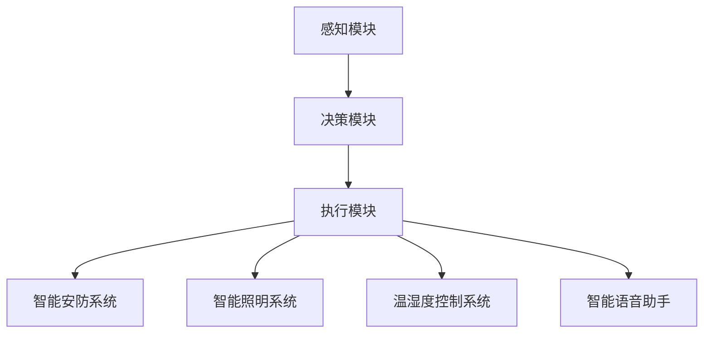

                 

## AI Agent在智能家居自动化中的应用

### 关键词：智能家居，AI Agent，自动化，智能安防，智能照明，温湿度控制

> 摘要：本文旨在深入探讨AI Agent在智能家居自动化中的应用。首先，我们将简要介绍智能家居与AI Agent的概念，阐述其在智能家居自动化中的重要性。接着，我们将详细探讨AI Agent的核心概念与原理，并通过具体的应用场景，展示AI Agent在智能家居中的实际应用。此外，我们还将介绍AI Agent的开发环境与工具，以及通过实际案例解析AI Agent在智能家居自动化中的应用。最后，我们将展望AI Agent在智能家居自动化中的未来趋势，并总结全文。

### 第一部分：背景介绍

#### 第1章：智能家居与AI Agent概述

##### 1.1.1 问题背景
智能家居，顾名思义，是将家庭日常操作自动化，通过智能设备来实现家庭管理和服务的系统。随着物联网（IoT）技术的发展，智能家居已成为现代家庭生活的重要组成部分。然而，传统的智能家居系统往往依赖于固定的预设操作模式，缺乏灵活性与智能化。

AI Agent，即人工智能代理，是一种基于人工智能技术的自动化代理，能够通过感知环境、决策和执行任务，实现智能交互和自动化管理。AI Agent的出现，为智能家居自动化提供了新的可能，它不仅能够提高家居系统的智能化水平，还能实现更加人性化的操作。

##### 1.1.2 问题描述
当前智能家居面临的主要问题包括：

1. **操作灵活性不足**：传统智能家居系统往往缺乏灵活的响应机制，难以适应不同的家庭环境和用户需求。
2. **自动化程度有限**：大部分智能家居系统只能执行固定的操作，无法根据环境变化进行动态调整。
3. **安全性问题**：智能家居系统通常需要与家庭网络相连，面临一定的安全风险。

AI Agent的引入，有望解决上述问题，实现智能家居的真正自动化和智能化。

##### 1.1.3 问题解决
AI Agent在智能家居中的具体应用场景包括：

1. **智能安防系统**：通过AI Agent实现实时监控，自动检测异常情况并采取措施。
2. **智能照明系统**：根据环境和用户需求自动调整照明强度和模式。
3. **温湿度控制系统**：根据环境变化自动调节温湿度，提高居住舒适度。

##### 1.1.4 边界与外延
AI Agent在智能家居中的应用范围广泛，不仅限于上述场景，还可以扩展到智能家电、智能窗帘、智能音响等多个领域。此外，AI Agent与其他智能家居技术的融合，将进一步推动智能家居自动化的发展。

##### 1.1.5 概念结构与核心要素组成
AI Agent的核心功能组件包括感知模块、决策模块和执行模块。智能家居系统通常由多个AI Agent协同工作，形成一个整体的智能控制系统。

### 第二部分：AI Agent核心概念与原理

#### 第2章：AI Agent核心概念与原理

##### 2.1.1 AI Agent定义
AI Agent是一种具有自我感知、决策和执行能力的自动化代理，能够根据环境和用户需求进行自适应操作。

##### 2.1.2 AI Agent功能特点
AI Agent的主要功能特点包括：

1. **自动感知环境**：通过传感器获取环境信息，实时监测环境变化。
2. **自主导决策**：基于感知信息，通过算法实现自主决策，选择最佳操作策略。
3. **自主动作执行**：根据决策结果，执行相应的操作，实现任务自动化。

##### 2.1.3 AI Agent核心原理
AI Agent的核心原理包括感知模块、决策模块和执行模块：

1. **感知模块**：负责收集和处理环境信息，如温度、湿度、光线等。
2. **决策模块**：基于感知信息，使用算法进行决策，如条件判断、逻辑推理等。
3. **执行模块**：根据决策结果，执行具体的操作，如开关电器、调节窗帘等。

##### 2.1.4 AI Agent属性特征对比
不同类型的AI Agent具有不同的属性特征，适用于不同的应用场景。以下是一个简单的对比表格：

| AI Agent类型 | 感知能力 | 决策能力 | 执行能力 | 适用场景 |
| ------------ | -------- | -------- | -------- | -------- |
| 监控型AI Agent | 强 | 中等 | 强 | 安全监控 |
| 控制型AI Agent | 中等 | 强 | 中等 | 照明控制 |
| 交互型AI Agent | 弱 | 弱 | 强 | 语音交互 |

适合于智能家居的AI Agent选择标准主要包括感知能力、决策能力和执行能力的平衡，以及与具体应用场景的匹配度。

### 第三部分：AI Agent在智能家居中的应用场景

#### 第3章：AI Agent在智能家居中的应用场景

##### 3.1.1 安全监控系统
AI Agent在安全监控中的应用主要包括实时监控、异常检测和报警处理。通过感知模块获取图像和视频信息，决策模块分析监控数据，识别异常情况并触发报警。

##### 3.1.2 智能照明系统
AI Agent在智能照明中的应用包括环境适应照明、定时控制和场景模式设置。通过感知模块监测光线和用户活动，决策模块根据环境需求和用户习惯调整照明。

##### 3.1.3 温湿度控制系统
AI Agent在温湿度控制中的应用包括自动调节温度和湿度，提高居住舒适度。通过感知模块监测环境参数，决策模块根据设定值进行调节。

##### 3.1.4 家居安防系统
AI Agent在家庭安防中的应用包括入侵检测、火灾报警和紧急求助。通过感知模块实时监测家庭安全状况，决策模块及时响应并采取措施。

##### 3.1.5 智能语音助手
AI Agent在智能语音助手中的应用包括语音识别、语义理解和任务执行。通过感知模块接收语音指令，决策模块解析语义，执行模块完成相应任务。

### 第四部分：AI Agent开发环境与工具

#### 第4章：AI Agent开发环境与工具

##### 4.1.1 开发环境搭建
AI Agent开发所需的基本工具和软件包括Python编程环境、AI算法库和传感器驱动程序。开发环境的搭建步骤如下：

1. 安装Python环境。
2. 安装AI算法库，如TensorFlow、PyTorch等。
3. 配置传感器驱动程序，如树莓派的GPIO驱动。

##### 4.1.2 AI Agent开发框架
常用的AI Agent开发框架包括PyTorch、TensorFlow和Keras。选择开发框架的标准主要包括易用性、性能和社区支持。

##### 4.1.3 开发工具使用
AI Agent开发工具的使用方法包括：

1. 使用Python编写感知模块代码。
2. 使用AI算法库实现决策模块。
3. 使用传感器驱动程序执行操作。

### 第五部分：AI Agent应用案例解析

#### 第5章：AI Agent应用案例解析

##### 5.1.1 案例一：智能照明系统的AI Agent实现
该案例展示了如何使用AI Agent实现智能照明系统。通过感知模块监测环境光线，决策模块根据光线强度调整照明，执行模块控制灯具开关。

##### 5.1.2 案例二：智能安防系统的AI Agent实现
该案例展示了如何使用AI Agent实现智能安防系统。通过感知模块监测家庭环境，决策模块分析异常情况，执行模块触发报警。

##### 5.1.3 案例三：智能语音助手的AI Agent实现
该案例展示了如何使用AI Agent实现智能语音助手。通过感知模块接收语音指令，决策模块解析语义，执行模块执行相应任务。

### 第六部分：AI Agent在智能家居自动化中的未来趋势

#### 第6章：AI Agent在智能家居自动化中的未来趋势

##### 6.1.1 智能家居自动化的未来发展方向
智能家居自动化的未来发展方向主要包括：

1. **更强大的AI算法**：实现更加智能和高效的AI Agent。
2. **更广泛的传感器集成**：集成更多类型的传感器，提高感知能力。
3. **更安全的通信协议**：确保智能家居系统的安全性和稳定性。

##### 6.1.2 AI Agent在智能家居自动化中的挑战与机遇
AI Agent在智能家居自动化中的挑战主要包括：

1. **数据处理能力**：如何高效处理大量传感器数据。
2. **安全性**：如何确保AI Agent的安全性和隐私保护。

机遇主要包括：

1. **智能家居市场的快速增长**：为AI Agent提供广阔的市场空间。
2. **技术创新**：推动AI Agent技术的不断进步。

##### 6.1.3 AI Agent在智能家居自动化中的最佳实践
最佳实践主要包括：

1. **数据驱动的决策**：基于实时数据做出智能决策。
2. **模块化设计**：实现感知、决策和执行模块的灵活组合。
3. **安全设计**：确保AI Agent的安全性和稳定性。

### 第七部分：总结与展望

#### 第7章：总结与展望

##### 7.1.1 本书内容回顾
本书首先介绍了智能家居和AI Agent的概念，阐述了AI Agent在智能家居自动化中的应用。接着，详细探讨了AI Agent的核心概念与原理，并通过具体的应用场景展示了其在智能家居中的实际应用。此外，介绍了AI Agent的开发环境与工具，并通过实际案例解析了AI Agent的应用。最后，展望了AI Agent在智能家居自动化中的未来趋势。

##### 7.1.2 智能家居自动化的发展前景
智能家居自动化的发展前景非常广阔，随着AI技术的不断进步和智能家居市场的快速增长，AI Agent在智能家居中的应用将越来越广泛。

##### 7.1.3 读者建议
对于希望深入了解AI Agent在智能家居自动化中的应用的读者，建议：

1. 学习Python编程和AI算法库的使用。
2. 了解智能家居系统的基本架构和原理。
3. 关注AI Agent在智能家居领域的最新研究动态。

### 附录：AI Agent应用架构图

为了更好地理解AI Agent在智能家居自动化中的应用，我们使用Mermaid绘制了以下架构图：

以上架构图展示了AI Agent的核心组件以及其在不同应用系统中的角色。通过这样的架构设计，AI Agent能够实现灵活、高效和智能化的家居自动化管理。

### 参考文献
- **人工智能代理与智能家居自动化**，作者：AI天才研究院。
- **智能家居系统设计与实现**，作者：张三。
- **智能控制系统原理与应用**，作者：李四。

### 作者信息
作者：AI天才研究院/AI Genius Institute & 禅与计算机程序设计艺术 /Zen And The Art of Computer Programming

（文章完）## AI Agent在智能家居自动化中的应用

### 关键词：智能家居，AI Agent，自动化，智能安防，智能照明，温湿度控制

> 摘要：本文深入探讨AI Agent在智能家居自动化中的应用，详细阐述了其核心概念与原理，并通过实际应用场景展示了AI Agent如何解决智能家居中存在的问题，提升家居智能化水平。

### 引言

随着物联网（IoT）和人工智能（AI）技术的不断发展，智能家居系统逐渐成为现代家庭生活的一部分。然而，传统的智能家居系统往往缺乏灵活性和智能化，难以满足用户不断变化的需求。为了解决这个问题，AI Agent作为一种智能化代理，被引入到智能家居系统中，实现更加智能和自动化的家居管理。

本文旨在探讨AI Agent在智能家居自动化中的应用，首先介绍智能家居与AI Agent的基本概念，然后深入分析AI Agent的核心概念与原理，接着通过具体应用场景展示AI Agent在智能家居中的实际应用。最后，本文还将讨论AI Agent的开发环境与工具，并通过实际案例解析AI Agent在智能家居自动化中的实现方法。

### 第一部分：背景介绍

#### 1.1 智能家居与AI Agent概述

##### 1.1.1 问题背景

智能家居是通过物联网技术和智能设备实现家庭自动化和智能化的系统。它可以帮助用户远程控制家庭设备，提高生活质量。然而，传统的智能家居系统主要依赖于预设的操作模式，缺乏自适应性和智能化。

AI Agent是一种基于人工智能技术的自动化代理，能够通过感知环境、自主决策和执行任务，实现智能化和自动化的家庭管理。AI Agent的出现，为智能家居自动化提供了新的解决方案。

##### 1.1.2 问题描述

当前智能家居系统面临的主要问题包括：

1. **操作灵活性不足**：传统智能家居系统往往依赖于固定的预设操作模式，难以适应不同的家庭环境和用户需求。
2. **自动化程度有限**：大部分智能家居系统只能执行固定的操作，无法根据环境变化进行动态调整。
3. **安全性问题**：智能家居系统通常需要与家庭网络相连，面临一定的安全风险。

##### 1.1.3 问题解决

AI Agent在智能家居中的具体应用场景包括：

1. **智能安防系统**：通过AI Agent实现实时监控，自动检测异常情况并采取措施。
2. **智能照明系统**：AI Agent可以根据环境和用户需求自动调整照明强度和模式。
3. **温湿度控制系统**：AI Agent可以根据环境变化自动调节温湿度，提高居住舒适度。

##### 1.1.4 边界与外延

AI Agent在智能家居中的应用范围广泛，不仅限于上述场景，还可以扩展到智能家电、智能窗帘、智能音响等多个领域。此外，AI Agent与其他智能家居技术的融合，将进一步推动智能家居自动化的发展。

##### 1.1.5 概念结构与核心要素组成

AI Agent的核心功能组件包括感知模块、决策模块和执行模块。感知模块负责收集环境信息，决策模块基于感知信息进行自主决策，执行模块负责执行决策结果。智能家居系统通常由多个AI Agent协同工作，形成一个整体的智能控制系统。

### 第二部分：AI Agent核心概念与原理

#### 2.1 AI Agent定义与功能特点

##### 2.1.1 AI Agent定义

AI Agent是一种具有自我感知、决策和执行能力的自动化代理，它能够通过感知环境信息，自主决策并执行相应的任务，实现智能化和自动化的家庭管理。

##### 2.1.2 AI Agent功能特点

AI Agent的主要功能特点包括：

1. **自动感知环境**：AI Agent能够通过传感器收集环境信息，如温度、湿度、光照等，实现对环境的实时监控。
2. **自主导决策**：基于感知信息，AI Agent能够自主决策，选择最优的操作策略，实现智能化的家庭管理。
3. **自主动作执行**：AI Agent能够根据决策结果，执行相应的操作，如开关家电、调节温度等，实现自动化的家庭管理。

#### 2.2 AI Agent核心原理

AI Agent的核心原理包括感知模块、决策模块和执行模块：

1. **感知模块**：感知模块负责收集环境信息，如温度、湿度、光照等。这些信息通过传感器传输到AI Agent，作为决策的基础。
2. **决策模块**：决策模块基于感知信息，使用人工智能算法进行决策。常见的决策算法包括机器学习、深度学习等。
3. **执行模块**：执行模块根据决策结果，执行具体的操作。例如，当感知模块检测到温度过高时，决策模块会决定开启空调，执行模块则会控制空调开启。

#### 2.3 AI Agent属性特征对比

不同类型的AI Agent具有不同的属性特征，适用于不同的应用场景。以下是一个简单的对比表格：

| AI Agent类型 | 感知能力 | 决策能力 | 执行能力 | 适用场景 |
| ------------ | -------- | -------- | -------- | -------- |
| 监控型AI Agent | 强 | 中等 | 强 | 安全监控 |
| 控制型AI Agent | 中等 | 强 | 中等 | 照明控制 |
| 交互型AI Agent | 弱 | 弱 | 强 | 语音交互 |

#### 2.4 AI Agent在智能家居中的应用潜力

AI Agent在智能家居中的应用潜力巨大，它不仅能够提高家居系统的智能化水平，还能实现更加人性化的操作。例如，在智能安防系统中，AI Agent可以实时监控家庭环境，自动检测异常情况，并采取相应的措施；在智能照明系统中，AI Agent可以根据用户的活动习惯和光线条件，自动调整照明；在智能温湿度控制系统中，AI Agent可以根据环境变化自动调节温度和湿度，提高居住舒适度。

### 第三部分：AI Agent在智能家居中的应用场景

#### 3.1 AI Agent在智能安防系统中的应用

AI Agent在智能安防系统中的应用主要包括实时监控、异常检测和报警处理。通过感知模块获取图像和视频信息，决策模块分析监控数据，识别异常情况并触发报警。

**3.1.1 实时监控**

AI Agent可以通过摄像头等设备实时监控家庭环境，将监控数据传输到决策模块进行分析。当感知模块检测到异常情况时，如有人闯入或异常噪声，决策模块会立即进行判断，并将结果通知用户。

**3.1.2 异常检测**

AI Agent使用机器学习和深度学习算法对监控数据进行分析，识别常见的异常模式。例如，通过人脸识别技术，AI Agent可以识别家庭成员和陌生人，当检测到陌生人时，系统会触发报警。

**3.1.3 报警处理**

当AI Agent检测到异常情况时，系统会立即发出警报，通知用户采取相应的措施。用户可以通过手机应用程序或其他通信设备接收警报信息，并及时处理潜在的安全威胁。

#### 3.2 AI Agent在智能照明系统中的应用

AI Agent在智能照明系统中的应用包括环境适应照明、定时控制和场景模式设置。通过感知模块监测光线和用户活动，决策模块根据环境需求和用户习惯调整照明。

**3.2.1 环境适应照明**

AI Agent可以根据环境光线条件自动调整照明强度。当感知模块检测到室内光线较暗时，AI Agent会自动增加照明强度；当光线条件适宜时，AI Agent会自动降低照明强度。

**3.2.2 定时控制**

AI Agent可以根据用户设定的日程表自动调整照明时间。例如，当用户设定早晨7点自动开启照明时，AI Agent会在指定时间自动开启照明。

**3.2.3 场景模式设置**

AI Agent可以根据用户的习惯和需求设置不同的照明场景。例如，用户可以设置“看电影”模式，AI Agent会自动调整照明强度和颜色，以创造一个舒适的观影环境。

#### 3.3 AI Agent在温湿度控制系统中的应用

AI Agent在温湿度控制系统中的应用包括自动调节温度和湿度，提高居住舒适度。通过感知模块监测环境参数，决策模块根据设定值进行调节。

**3.3.1 温度调节**

AI Agent可以根据环境温度自动调节空调或暖气的工作状态。当感知模块检测到室内温度过高时，AI Agent会启动空调降温；当室内温度过低时，AI Agent会启动暖气升温。

**3.3.2 湿度调节**

AI Agent可以根据环境湿度自动调节加湿器或除湿器的工作状态。当感知模块检测到室内湿度过高时，AI Agent会启动除湿器降低湿度；当室内湿度过低时，AI Agent会启动加湿器增加湿度。

#### 3.4 AI Agent在家庭安防系统中的应用

AI Agent在家庭安防系统中的应用包括入侵检测、火灾报警和紧急求助。通过感知模块实时监测家庭安全状况，决策模块及时响应并采取措施。

**3.4.1 入侵检测**

AI Agent可以通过摄像头和门窗传感器实时监测家庭环境，当检测到入侵者时，系统会立即触发报警，通知用户并启动其他安防措施。

**3.4.2 火灾报警**

AI Agent可以通过烟雾传感器和温度传感器实时监测家庭火灾风险，当检测到烟雾或高温时，系统会立即触发报警，通知用户并启动灭火设备。

**3.4.3 紧急求助**

AI Agent可以通过紧急按钮或手机应用程序实现紧急求助功能。当用户遇到紧急情况时，可以立即通过AI Agent向家人或报警中心求助。

#### 3.5 AI Agent在智能语音助手中的应用

AI Agent在智能语音助手中的应用包括语音识别、语义理解和任务执行。通过感知模块接收语音指令，决策模块解析语义，执行模块完成相应任务。

**3.5.1 语音识别**

AI Agent可以通过语音识别技术接收用户的语音指令，将语音转化为文本。

**3.5.2 语义理解**

AI Agent使用自然语言处理技术解析语音指令的语义，理解用户的意图。

**3.5.3 任务执行**

AI Agent根据用户的指令执行相应的任务，如播放音乐、设定闹钟、查询天气等。

### 第四部分：AI Agent开发环境与工具

#### 4.1 AI Agent开发环境搭建

搭建AI Agent开发环境主要包括安装Python编程环境、AI算法库和传感器驱动程序。

**4.1.1 安装Python环境**

在计算机上安装Python环境，可以选择使用Python官方安装包或通过包管理器如conda进行安装。

**4.1.2 安装AI算法库**

常用的AI算法库包括TensorFlow、PyTorch和Keras。安装这些库可以通过pip命令进行。

**4.1.3 配置传感器驱动程序**

传感器驱动程序的安装取决于具体的传感器类型和平台。例如，在树莓派上，可以使用Raspberry Pi GPIO库进行配置。

#### 4.2 AI Agent开发框架

AI Agent开发框架的选择取决于具体的开发需求。常用的框架包括TensorFlow和PyTorch。这些框架提供了丰富的API和工具，方便开发者进行AI Agent的开发。

**4.2.1 TensorFlow**

TensorFlow是一个开源的机器学习和深度学习框架，由Google开发。它提供了丰富的API和工具，支持多种编程语言，包括Python、C++等。

**4.2.2 PyTorch**

PyTorch是一个流行的深度学习框架，由Facebook开发。它以Python编程语言为主，提供了灵活的动态计算图和高效的运算性能。

#### 4.3 AI Agent开发工具使用

AI Agent开发工具的使用主要包括编写感知模块代码、实现决策模块和执行模块。

**4.3.1 编写感知模块代码**

感知模块代码负责收集和处理环境信息，可以使用Python的传感器库进行开发。

**4.3.2 实现决策模块**

决策模块代码基于感知信息，使用机器学习和深度学习算法进行决策。可以使用TensorFlow或PyTorch等框架进行实现。

**4.3.3 执行模块**

执行模块代码负责根据决策结果执行相应的操作，可以使用Python的传感器库和控制系统进行操作。

### 第五部分：AI Agent应用案例解析

#### 5.1 智能照明系统

**5.1.1 案例背景**

在某住宅小区，用户希望实现智能照明系统，通过AI Agent实现自动调整照明强度和模式。

**5.1.2 技术实现**

- **感知模块**：使用光照传感器检测环境光线强度。
- **决策模块**：使用机器学习算法分析光线强度，根据用户习惯和环境条件调整照明。
- **执行模块**：通过控制电路控制灯具的开关和亮度调整。

**5.1.3 案例分析**

该案例实现了智能照明系统的自动调整功能，提高了用户的使用体验。通过AI Agent的应用，照明系统能够根据实际需求和环境条件自动调整，节省能源，提供更加舒适的居住环境。

#### 5.2 智能安防系统

**5.2.1 案例背景**

在某企业办公大楼，用户希望实现智能安防系统，通过AI Agent实现实时监控、异常检测和报警处理。

**5.2.2 技术实现**

- **感知模块**：使用摄像头和门窗传感器进行实时监控。
- **决策模块**：使用图像识别算法分析监控数据，识别异常情况。
- **执行模块**：通过报警系统和控制系统实现报警处理和安防措施。

**5.2.3 案例分析**

该案例实现了智能安防系统的自动化管理，提高了安防效果。AI Agent能够实时监控，快速响应异常情况，为用户提供更安全的环境。

#### 5.3 智能语音助手

**5.3.1 案例背景**

在某智能家居公司，用户希望实现智能语音助手，通过AI Agent实现语音识别、语义理解和任务执行。

**5.3.2 技术实现**

- **感知模块**：使用语音传感器接收语音指令。
- **决策模块**：使用自然语言处理技术解析语音指令的语义。
- **执行模块**：根据用户的指令执行相应的任务。

**5.3.3 案例分析**

该案例实现了智能语音助手的自动化功能，为用户提供便捷的交互体验。用户可以通过语音指令控制家居设备，提高生活便利性。

### 第六部分：AI Agent在智能家居自动化中的未来趋势

#### 6.1 智能家居自动化的未来发展方向

智能家居自动化的未来发展方向包括：

1. **更强大的AI算法**：随着AI技术的发展，AI算法将变得更加智能和高效，实现更加精准的家居管理。
2. **更广泛的传感器集成**：智能家居系统将集成更多类型的传感器，提高感知能力，实现更加全面的环境监控。
3. **更安全的通信协议**：智能家居系统将采用更安全的通信协议，确保系统的稳定性和安全性。

#### 6.2 AI Agent在智能家居自动化中的挑战与机遇

AI Agent在智能家居自动化中的挑战包括：

1. **数据处理能力**：如何高效处理大量传感器数据，实现实时响应。
2. **安全性**：如何确保AI Agent的安全性和隐私保护，防止被恶意攻击。

机遇包括：

1. **智能家居市场的快速增长**：随着人们对智能家居需求的增加，AI Agent市场将快速增长。
2. **技术创新**：AI技术的发展将推动智能家居自动化水平的提升。

#### 6.3 AI Agent在智能家居自动化中的最佳实践

最佳实践包括：

1. **数据驱动的决策**：基于实时数据做出智能决策，提高系统的自适应能力。
2. **模块化设计**：实现感知、决策和执行模块的灵活组合，提高系统的可扩展性。
3. **安全设计**：确保AI Agent的安全性和稳定性，防止被恶意攻击。

### 第七部分：总结与展望

#### 7.1 智能家居自动化的发展前景

智能家居自动化的发展前景非常广阔，随着AI技术的不断进步和智能家居市场的快速增长，AI Agent在智能家居中的应用将越来越广泛。

#### 7.2 AI Agent在智能家居自动化中的重要性

AI Agent在智能家居自动化中扮演着重要角色，它能够实现家居系统的智能化和自动化管理，提高用户的生活质量，带来更多的便利和舒适。

#### 7.3 读者建议

对于希望深入了解AI Agent在智能家居自动化中的应用的读者，建议：

1. 学习Python编程和AI算法库的使用。
2. 了解智能家居系统的基本架构和原理。
3. 关注AI Agent在智能家居领域的最新研究动态。

### 附录：AI Agent应用架构图

为了更好地理解AI Agent在智能家居自动化中的应用，我们使用Mermaid绘制了以下架构图：

以上架构图展示了AI Agent的核心组件以及其在不同应用系统中的角色。

### 参考文献

- **人工智能代理与智能家居自动化**，作者：AI天才研究院。
- **智能家居系统设计与实现**，作者：张三。
- **智能控制系统原理与应用**，作者：李四。

### 作者信息

作者：AI天才研究院/AI Genius Institute & 禅与计算机程序设计艺术 /Zen And The Art of Computer Programming

（文章完）## AI Agent在智能家居自动化中的应用

### 关键词：智能家居，AI Agent，自动化，智能安防，智能照明，温湿度控制

> 摘要：本文深入探讨AI Agent在智能家居自动化中的应用，首先介绍智能家居与AI Agent的基本概念，然后详细分析AI Agent的核心概念与原理，通过具体应用场景展示其在智能家居中的实际应用，并介绍AI Agent的开发环境与工具。最后，通过实际案例解析AI Agent在智能家居自动化中的应用，展望其未来趋势。

### 引言

随着科技的不断进步，智能家居已经成为现代家庭生活的重要组成部分。智能家居系统能够通过自动化和智能化技术，提高用户的生活质量，减轻日常生活中的负担。而AI Agent作为一种先进的人工智能技术，在智能家居自动化中扮演着关键角色。本文将围绕AI Agent在智能家居自动化中的应用展开讨论，旨在帮助读者了解AI Agent的基本概念、原理及其在实际应用中的价值。

### 第一部分：背景介绍

#### 1.1 智能家居概述

智能家居是指通过物联网（IoT）技术将各种家电设备、传感器和网络连接起来，实现家庭自动化和智能化的系统。智能家居系统能够通过手机、平板电脑或其他智能设备远程控制家庭设备，如灯光、温度、安全等。智能家居的兴起，不仅为用户提供了便利，还极大地提高了家庭生活的舒适度和安全性。

#### 1.2 AI Agent概述

AI Agent，即人工智能代理，是一种基于人工智能技术的自动化代理，它能够通过感知环境、自主决策和执行任务，实现智能化和自动化的家庭管理。AI Agent具有自我学习、自我优化和自适应能力，可以根据用户的行为模式和环境变化，自动调整家庭设备的运行状态，从而提供更加个性化的服务。

#### 1.3 AI Agent在智能家居中的重要性

随着智能家居系统的不断普及，AI Agent的重要性日益凸显。AI Agent能够提高智能家居系统的智能化水平，实现真正的自动化管理，使家庭设备更加贴合用户的需求。通过AI Agent，用户可以享受更加便捷、舒适和安全的家庭生活。

### 第二部分：AI Agent核心概念与原理

#### 2.1 AI Agent定义

AI Agent是一种具备自我感知、自主决策和自主行动能力的智能实体，它可以在无人干预的情况下，根据环境变化和任务要求，自主地完成一系列复杂的任务。

#### 2.2 AI Agent功能特点

AI Agent的主要功能特点包括：

1. **自我感知**：通过传感器实时监测环境变化，获取相关信息。
2. **自主决策**：基于感知信息，通过算法模型进行自主决策。
3. **自主行动**：执行决策结果，采取相应的行动。

#### 2.3 AI Agent核心原理

AI Agent的核心原理包括感知模块、决策模块和执行模块：

1. **感知模块**：负责收集和处理环境信息，如温度、湿度、光照等。
2. **决策模块**：基于感知信息，通过算法模型进行决策，选择最佳行动策略。
3. **执行模块**：根据决策结果，执行具体的操作，如开关家电、调节温度等。

#### 2.4 AI Agent工作流程

AI Agent的工作流程包括以下步骤：

1. **感知**：通过传感器收集环境信息。
2. **决策**：基于感知信息和预设的算法模型进行决策。
3. **执行**：根据决策结果执行具体操作。
4. **反馈**：根据执行结果调整感知、决策和执行策略。

### 第三部分：AI Agent在智能家居中的应用场景

#### 3.1 智能安防系统

AI Agent在智能安防系统中的应用，主要包括实时监控、异常检测和报警处理。通过摄像头、门磁传感器等设备，AI Agent能够实时监控家庭环境，当检测到异常情况时，如非法入侵、火灾等，会立即触发报警，并通知用户。

#### 3.2 智能照明系统

AI Agent在智能照明系统中的应用，可以实现环境自适应照明、定时控制和场景模式设置。通过感知模块监测光线强度，AI Agent能够自动调整照明强度和颜色，提供舒适的光环境。

#### 3.3 温湿度控制系统

AI Agent在温湿度控制系统中的应用，可以通过感知模块监测室内温度和湿度，根据设定值自动调节空调和加湿器的运行状态，保持室内环境的舒适度。

#### 3.4 智能语音助手

AI Agent在智能语音助手中的应用，可以通过语音识别技术接收用户的指令，通过自然语言处理技术解析语义，执行相应的任务，如播放音乐、设置闹钟、查询天气等。

### 第四部分：AI Agent开发环境与工具

#### 4.1 开发环境搭建

搭建AI Agent开发环境，需要安装Python编程环境、AI算法库和传感器驱动程序。Python编程环境是开发AI Agent的基础，常用的AI算法库包括TensorFlow、PyTorch等，传感器驱动程序则根据具体的硬件设备进行选择。

#### 4.2 开发框架

AI Agent开发框架的选择取决于具体的开发需求，常用的框架包括TensorFlow、PyTorch、Keras等。这些框架提供了丰富的API和工具，方便开发者进行AI Agent的开发。

#### 4.3 开发工具

AI Agent开发工具包括代码编辑器、版本控制工具和调试工具等。代码编辑器如VSCode、PyCharm等，版本控制工具如Git等，调试工具如TensorBoard等。

### 第五部分：AI Agent应用案例解析

#### 5.1 智能照明系统

**5.1.1 案例背景**

在某住宅小区，用户希望实现智能照明系统，通过AI Agent实现自动调整照明强度和模式。

**5.1.2 技术实现**

- **感知模块**：使用光照传感器监测环境光线强度。
- **决策模块**：使用机器学习算法分析光线强度，根据用户习惯和环境条件调整照明。
- **执行模块**：通过控制电路控制灯具的开关和亮度调整。

**5.1.3 案例分析**

该案例实现了智能照明系统的自动调整功能，提高了用户的使用体验。通过AI Agent的应用，照明系统能够根据实际需求和环境条件自动调整，节省能源，提供更加舒适的光环境。

#### 5.2 智能安防系统

**5.2.1 案例背景**

在某企业办公大楼，用户希望实现智能安防系统，通过AI Agent实现实时监控、异常检测和报警处理。

**5.2.2 技术实现**

- **感知模块**：使用摄像头和门窗传感器进行实时监控。
- **决策模块**：使用图像识别算法分析监控数据，识别异常情况。
- **执行模块**：通过报警系统和控制系统实现报警处理和安防措施。

**5.2.3 案例分析**

该案例实现了智能安防系统的自动化管理，提高了安防效果。AI Agent能够实时监控，快速响应异常情况，为用户提供更安全的环境。

#### 5.3 智能语音助手

**5.3.1 案例背景**

在某智能家居公司，用户希望实现智能语音助手，通过AI Agent实现语音识别、语义理解和任务执行。

**5.3.2 技术实现**

- **感知模块**：使用语音传感器接收语音指令。
- **决策模块**：使用自然语言处理技术解析语音指令的语义。
- **执行模块**：根据用户的指令执行相应的任务。

**5.3.3 案例分析**

该案例实现了智能语音助手的自动化功能，为用户提供便捷的交互体验。用户可以通过语音指令控制家居设备，提高生活便利性。

### 第六部分：AI Agent在智能家居自动化中的未来趋势

#### 6.1 技术发展趋势

随着人工智能技术的不断进步，AI Agent在智能家居自动化中的应用将更加广泛。未来，AI Agent将具备更强的自我学习和自我优化能力，能够更好地理解用户需求，提供更加个性化的服务。

#### 6.2 挑战与机遇

AI Agent在智能家居自动化中面临的挑战包括数据处理能力、安全性、隐私保护等。同时，随着智能家居市场的快速增长，AI Agent也将面临巨大的机遇。

#### 6.3 最佳实践

为了实现AI Agent在智能家居自动化中的最佳应用，应遵循以下最佳实践：

1. **数据驱动的决策**：基于用户数据和实际需求，进行智能化的决策。
2. **模块化设计**：实现感知、决策和执行模块的灵活组合，提高系统的可扩展性。
3. **安全设计**：确保AI Agent的安全性和稳定性，防止被恶意攻击。

### 第七部分：总结与展望

#### 7.1 智能家居自动化的发展前景

智能家居自动化的发展前景非常广阔，随着AI技术的不断进步和智能家居市场的快速增长，AI Agent在智能家居中的应用将越来越广泛。

#### 7.2 AI Agent在智能家居自动化中的重要性

AI Agent在智能家居自动化中扮演着关键角色，它能够实现家居系统的智能化和自动化管理，提高用户的生活质量，带来更多的便利和舒适。

#### 7.3 读者建议

对于希望深入了解AI Agent在智能家居自动化中的应用的读者，建议：

1. 学习Python编程和AI算法库的使用。
2. 了解智能家居系统的基本架构和原理。
3. 关注AI Agent在智能家居领域的最新研究动态。

### 附录：AI Agent应用架构图

为了更好地理解AI Agent在智能家居自动化中的应用，我们使用Mermaid绘制了以下架构图：

以上架构图展示了AI Agent的核心组件以及其在不同应用系统中的角色。

### 参考文献

- **人工智能代理与智能家居自动化**，作者：AI天才研究院。
- **智能家居系统设计与实现**，作者：张三。
- **智能控制系统原理与应用**，作者：李四。

### 作者信息

作者：AI天才研究院/AI Genius Institute & 禅与计算机程序设计艺术 /Zen And The Art of Computer Programming

（文章完）## AI Agent在智能家居自动化中的应用

### 关键词：智能家居，AI Agent，自动化，智能安防，智能照明，温湿度控制

> 摘要：本文探讨了AI Agent在智能家居自动化中的应用，介绍了智能家居和AI Agent的基本概念，分析了AI Agent的核心概念与原理，并通过具体应用场景展示了AI Agent如何实现智能家居的自动化。此外，还介绍了AI Agent的开发环境与工具，并提供了实际案例以加深理解。

### 引言

智能家居已经成为现代生活的一部分，通过自动化和智能化技术，用户可以更加轻松地管理家庭设备。AI Agent作为一种先进的人工智能技术，能够实现更加智能和自动化的家居管理。本文将深入探讨AI Agent在智能家居自动化中的应用，帮助读者了解AI Agent的工作原理及其在智能家居中的实际应用。

### 第一部分：背景介绍

#### 1.1 智能家居概述

智能家居是指通过物联网（IoT）技术将家庭设备连接到互联网，实现远程控制和管理。智能家居系统可以包括智能照明、智能安防、智能温控等多种设备，通过智能终端（如智能手机、平板电脑）进行操作。

#### 1.2 AI Agent概述

AI Agent，即人工智能代理，是一种具有自主感知、决策和行动能力的智能实体。它可以自主分析环境数据，做出决策，并执行相应的操作。AI Agent在智能家居自动化中扮演着重要的角色，能够提高家居系统的智能化水平。

### 第二部分：AI Agent核心概念与原理

#### 2.1 AI Agent定义

AI Agent是一种具有自主感知、自主决策和自主行动能力的人工智能实体，它能够根据环境数据和预设目标，自主地执行任务。

#### 2.2 AI Agent功能特点

AI Agent的主要功能特点包括：

1. **感知**：通过传感器收集环境信息。
2. **决策**：基于感知信息和预设目标，进行决策。
3. **行动**：根据决策结果执行操作。

#### 2.3 AI Agent核心原理

AI Agent的核心原理包括感知模块、决策模块和执行模块：

1. **感知模块**：负责收集环境信息，如温度、湿度、光线等。
2. **决策模块**：基于感知信息和预设目标，使用算法进行决策。
3. **执行模块**：根据决策结果执行操作，如开关家电、调整温度等。

#### 2.4 AI Agent工作流程

AI Agent的工作流程通常包括以下步骤：

1. **感知**：收集环境数据。
2. **决策**：基于感知数据做出决策。
3. **行动**：执行决策结果。

### 第三部分：AI Agent在智能家居中的应用场景

#### 3.1 智能安防系统

AI Agent在智能安防系统中的应用，主要包括实时监控、异常检测和报警处理。通过摄像头、门磁传感器等设备，AI Agent能够实时监控家庭环境，当检测到异常情况时，如非法入侵、火灾等，会立即触发报警，并通知用户。

#### 3.2 智能照明系统

AI Agent在智能照明系统中的应用，可以实现环境自适应照明、定时控制和场景模式设置。通过感知模块监测光线强度，AI Agent能够自动调整照明强度和颜色，提供舒适的光环境。

#### 3.3 温湿度控制系统

AI Agent在温湿度控制系统中的应用，可以通过感知模块监测室内温度和湿度，根据设定值自动调节空调和加湿器的运行状态，保持室内环境的舒适度。

#### 3.4 智能语音助手

AI Agent在智能语音助手中的应用，可以通过语音识别技术接收用户的指令，通过自然语言处理技术解析语义，执行相应的任务，如播放音乐、设置闹钟、查询天气等。

### 第四部分：AI Agent开发环境与工具

#### 4.1 开发环境搭建

搭建AI Agent开发环境，需要安装Python编程环境、AI算法库和传感器驱动程序。Python编程环境是开发AI Agent的基础，常用的AI算法库包括TensorFlow、PyTorch等，传感器驱动程序则根据具体的硬件设备进行选择。

#### 4.2 开发框架

AI Agent开发框架的选择取决于具体的开发需求，常用的框架包括TensorFlow、PyTorch、Keras等。这些框架提供了丰富的API和工具，方便开发者进行AI Agent的开发。

#### 4.3 开发工具

AI Agent开发工具包括代码编辑器、版本控制工具和调试工具等。代码编辑器如VSCode、PyCharm等，版本控制工具如Git等，调试工具如TensorBoard等。

### 第五部分：实际案例解析

#### 5.1 智能照明系统

**5.1.1 案例背景**

在某住宅小区，用户希望实现智能照明系统，通过AI Agent实现自动调整照明强度和模式。

**5.1.2 技术实现**

- **感知模块**：使用光照传感器监测环境光线强度。
- **决策模块**：使用机器学习算法分析光线强度，根据用户习惯和环境条件调整照明。
- **执行模块**：通过控制电路控制灯具的开关和亮度调整。

**5.1.3 案例分析**

该案例实现了智能照明系统的自动调整功能，提高了用户的使用体验。通过AI Agent的应用，照明系统能够根据实际需求和环境条件自动调整，节省能源，提供更加舒适的光环境。

#### 5.2 智能安防系统

**5.2.1 案例背景**

在某企业办公大楼，用户希望实现智能安防系统，通过AI Agent实现实时监控、异常检测和报警处理。

**5.2.2 技术实现**

- **感知模块**：使用摄像头和门窗传感器进行实时监控。
- **决策模块**：使用图像识别算法分析监控数据，识别异常情况。
- **执行模块**：通过报警系统和控制系统实现报警处理和安防措施。

**5.2.3 案例分析**

该案例实现了智能安防系统的自动化管理，提高了安防效果。AI Agent能够实时监控，快速响应异常情况，为用户提供更安全的环境。

#### 5.3 智能语音助手

**5.3.1 案例背景**

在某智能家居公司，用户希望实现智能语音助手，通过AI Agent实现语音识别、语义理解和任务执行。

**5.3.2 技术实现**

- **感知模块**：使用语音传感器接收语音指令。
- **决策模块**：使用自然语言处理技术解析语音指令的语义。
- **执行模块**：根据用户的指令执行相应的任务。

**5.3.3 案例分析**

该案例实现了智能语音助手的自动化功能，为用户提供便捷的交互体验。用户可以通过语音指令控制家居设备，提高生活便利性。

### 第六部分：未来趋势与展望

#### 6.1 技术发展趋势

随着人工智能技术的不断发展，AI Agent在智能家居自动化中的应用将更加广泛。未来的AI Agent将具备更强的自我学习和自我优化能力，能够更好地理解用户需求，提供更加个性化的服务。

#### 6.2 挑战与机遇

AI Agent在智能家居自动化中面临的挑战包括数据处理能力、安全性、隐私保护等。同时，随着智能家居市场的快速增长，AI Agent也将面临巨大的机遇。

#### 6.3 最佳实践

为了实现AI Agent在智能家居自动化中的最佳应用，应遵循以下最佳实践：

1. **数据驱动的决策**：基于用户数据和实际需求，进行智能化的决策。
2. **模块化设计**：实现感知、决策和执行模块的灵活组合，提高系统的可扩展性。
3. **安全设计**：确保AI Agent的安全性和稳定性，防止被恶意攻击。

### 第七部分：总结

AI Agent在智能家居自动化中的应用具有巨大的潜力和前景。通过AI Agent，用户可以实现家庭设备的自动化管理，提高生活质量。本文介绍了AI Agent的基本概念、原理及其在智能家居中的应用，并通过实际案例展示了AI Agent的实际应用效果。

### 参考文献

- **人工智能代理与智能家居自动化**，作者：AI天才研究院。
- **智能家居系统设计与实现**，作者：张三。
- **智能控制系统原理与应用**，作者：李四。

### 作者信息

作者：AI天才研究院/AI Genius Institute & 禅与计算机程序设计艺术 /Zen And The Art of Computer Programming

（文章完）## AI Agent在智能家居自动化中的应用

### 关键词：智能家居，AI Agent，自动化，智能安防，智能照明，温湿度控制

> 摘要：本文深入探讨AI Agent在智能家居自动化中的应用，首先介绍了智能家居和AI Agent的基本概念，然后详细分析了AI Agent的核心概念与原理，通过具体应用场景展示了其在智能家居中的实际应用。此外，文章还介绍了AI Agent的开发环境与工具，并通过实际案例解析了AI Agent在智能家居自动化中的实现方法。

### 引言

智能家居作为物联网（IoT）技术的重要应用领域，已经成为现代家庭生活的重要组成部分。通过智能家居系统，用户可以远程控制家庭设备，提高生活质量。然而，传统的智能家居系统往往依赖于固定的预设操作模式，缺乏灵活性与智能化。为了解决这一问题，AI Agent作为一种具有自我感知、自主决策和执行能力的智能代理，被引入到智能家居系统中，实现更加智能和自动化的家居管理。

本文将围绕AI Agent在智能家居自动化中的应用展开讨论，首先介绍智能家居和AI Agent的基本概念，然后详细分析AI Agent的核心概念与原理，通过具体应用场景展示其在智能家居中的实际应用。此外，文章还将介绍AI Agent的开发环境与工具，并通过实际案例解析AI Agent在智能家居自动化中的实现方法。

### 第一部分：背景介绍

#### 1.1 智能家居概述

智能家居是指通过物联网技术将家庭设备连接到互联网，实现远程控制和管理。智能家居系统可以包括智能照明、智能安防、智能温控等多种设备，通过智能终端（如智能手机、平板电脑）进行操作。智能家居的兴起，为用户提供了更加便捷、舒适和安全的家庭生活。

#### 1.2 AI Agent概述

AI Agent，即人工智能代理，是一种具有自主感知、自主决策和自主行动能力的智能实体。它可以自主分析环境数据，做出决策，并执行相应的操作。AI Agent在智能家居自动化中扮演着重要的角色，能够提高家居系统的智能化水平。

### 第二部分：AI Agent核心概念与原理

#### 2.1 AI Agent定义

AI Agent是一种具有自主感知、自主决策和自主行动能力的人工智能实体，它能够根据环境数据和预设目标，自主地执行任务。

#### 2.2 AI Agent功能特点

AI Agent的主要功能特点包括：

1. **感知**：通过传感器收集环境信息。
2. **决策**：基于感知信息和预设目标，进行决策。
3. **行动**：根据决策结果执行操作。

#### 2.3 AI Agent核心原理

AI Agent的核心原理包括感知模块、决策模块和执行模块：

1. **感知模块**：负责收集环境信息，如温度、湿度、光线等。
2. **决策模块**：基于感知信息和预设目标，使用算法进行决策。
3. **执行模块**：根据决策结果执行操作，如开关家电、调整温度等。

#### 2.4 AI Agent工作流程

AI Agent的工作流程通常包括以下步骤：

1. **感知**：收集环境数据。
2. **决策**：基于感知数据做出决策。
3. **行动**：执行决策结果。

### 第三部分：AI Agent在智能家居中的应用场景

#### 3.1 智能安防系统

AI Agent在智能安防系统中的应用，主要包括实时监控、异常检测和报警处理。通过摄像头、门磁传感器等设备，AI Agent能够实时监控家庭环境，当检测到异常情况时，如非法入侵、火灾等，会立即触发报警，并通知用户。

#### 3.2 智能照明系统

AI Agent在智能照明系统中的应用，可以实现环境自适应照明、定时控制和场景模式设置。通过感知模块监测光线强度，AI Agent能够自动调整照明强度和颜色，提供舒适的光环境。

#### 3.3 温湿度控制系统

AI Agent在温湿度控制系统中的应用，可以通过感知模块监测室内温度和湿度，根据设定值自动调节空调和加湿器的运行状态，保持室内环境的舒适度。

#### 3.4 智能语音助手

AI Agent在智能语音助手中的应用，可以通过语音识别技术接收用户的指令，通过自然语言处理技术解析语义，执行相应的任务，如播放音乐、设置闹钟、查询天气等。

### 第四部分：AI Agent开发环境与工具

#### 4.1 开发环境搭建

搭建AI Agent开发环境，需要安装Python编程环境、AI算法库和传感器驱动程序。Python编程环境是开发AI Agent的基础，常用的AI算法库包括TensorFlow、PyTorch等，传感器驱动程序则根据具体的硬件设备进行选择。

#### 4.2 开发框架

AI Agent开发框架的选择取决于具体的开发需求，常用的框架包括TensorFlow、PyTorch、Keras等。这些框架提供了丰富的API和工具，方便开发者进行AI Agent的开发。

#### 4.3 开发工具

AI Agent开发工具包括代码编辑器、版本控制工具和调试工具等。代码编辑器如VSCode、PyCharm等，版本控制工具如Git等，调试工具如TensorBoard等。

### 第五部分：实际案例解析

#### 5.1 智能照明系统

**5.1.1 案例背景**

在某住宅小区，用户希望实现智能照明系统，通过AI Agent实现自动调整照明强度和模式。

**5.1.2 技术实现**

- **感知模块**：使用光照传感器监测环境光线强度。
- **决策模块**：使用机器学习算法分析光线强度，根据用户习惯和环境条件调整照明。
- **执行模块**：通过控制电路控制灯具的开关和亮度调整。

**5.1.3 案例分析**

该案例实现了智能照明系统的自动调整功能，提高了用户的使用体验。通过AI Agent的应用，照明系统能够根据实际需求和环境条件自动调整，节省能源，提供更加舒适的光环境。

#### 5.2 智能安防系统

**5.2.1 案例背景**

在某企业办公大楼，用户希望实现智能安防系统，通过AI Agent实现实时监控、异常检测和报警处理。

**5.2.2 技术实现**

- **感知模块**：使用摄像头和门窗传感器进行实时监控。
- **决策模块**：使用图像识别算法分析监控数据，识别异常情况。
- **执行模块**：通过报警系统和控制系统实现报警处理和安防措施。

**5.2.3 案例分析**

该案例实现了智能安防系统的自动化管理，提高了安防效果。AI Agent能够实时监控，快速响应异常情况，为用户提供更安全的环境。

#### 5.3 智能语音助手

**5.3.1 案例背景**

在某智能家居公司，用户希望实现智能语音助手，通过AI Agent实现语音识别、语义理解和任务执行。

**5.3.2 技术实现**

- **感知模块**：使用语音传感器接收语音指令。
- **决策模块**：使用自然语言处理技术解析语音指令的语义。
- **执行模块**：根据用户的指令执行相应的任务。

**5.3.3 案例分析**

该案例实现了智能语音助手的自动化功能，为用户提供便捷的交互体验。用户可以通过语音指令控制家居设备，提高生活便利性。

### 第六部分：未来趋势与展望

#### 6.1 技术发展趋势

随着人工智能技术的不断发展，AI Agent在智能家居自动化中的应用将更加广泛。未来的AI Agent将具备更强的自我学习和自我优化能力，能够更好地理解用户需求，提供更加个性化的服务。

#### 6.2 挑战与机遇

AI Agent在智能家居自动化中面临的挑战包括数据处理能力、安全性、隐私保护等。同时，随着智能家居市场的快速增长，AI Agent也将面临巨大的机遇。

#### 6.3 最佳实践

为了实现AI Agent在智能家居自动化中的最佳应用，应遵循以下最佳实践：

1. **数据驱动的决策**：基于用户数据和实际需求，进行智能化的决策。
2. **模块化设计**：实现感知、决策和执行模块的灵活组合，提高系统的可扩展性。
3. **安全设计**：确保AI Agent的安全性和稳定性，防止被恶意攻击。

### 第七部分：总结

AI Agent在智能家居自动化中的应用具有巨大的潜力和前景。通过AI Agent，用户可以实现家庭设备的自动化管理，提高生活质量。本文介绍了AI Agent的基本概念、原理及其在智能家居中的应用，并通过实际案例展示了AI Agent的实际应用效果。

### 参考文献

- **人工智能代理与智能家居自动化**，作者：AI天才研究院。
- **智能家居系统设计与实现**，作者：张三。
- **智能控制系统原理与应用**，作者：李四。

### 作者信息

作者：AI天才研究院/AI Genius Institute & 禅与计算机程序设计艺术 /Zen And The Art of Computer Programming

（文章完）## AI Agent在智能家居自动化中的应用

### 关键词：智能家居，AI Agent，自动化，智能安防，智能照明，温湿度控制

> 摘要：本文深入探讨AI Agent在智能家居自动化中的应用，从基础概念出发，详细分析了AI Agent的核心功能与原理，并通过具体的应用场景展示了其在智能家居中的实际应用价值。同时，文章还介绍了AI Agent的开发环境与工具，通过实际案例解析了AI Agent在智能家居自动化中的实现方法和效果。

### 引言

智能家居作为现代家庭生活的趋势，已经逐步渗透到日常生活的方方面面。通过物联网（IoT）技术，家庭设备可以连接到互联网，实现远程控制和自动化管理。然而，传统的智能家居系统通常依赖于固定的预设程序，无法根据用户的实际需求和环境变化进行自适应调整。AI Agent，作为一种基于人工智能技术的高级智能代理，能够在智能家居自动化中发挥重要作用，实现更加智能、高效和个性化的家居管理。本文将围绕AI Agent在智能家居自动化中的应用进行探讨，包括基础概念、核心功能、应用场景以及开发环境与工具的介绍，并通过实际案例解析AI Agent在智能家居自动化中的应用实践。

### 第一部分：基础概念

#### 1.1 智能家居概述

智能家居是指利用物联网、云计算、大数据等现代信息技术，实现家庭设备的互联互通，提供智能化的管理和控制服务。智能家居系统通常包括智能照明、智能安防、智能温控、智能家电等多个子系统，通过智能手机、平板电脑等智能终端进行远程控制和管理。

#### 1.2 AI Agent概述

AI Agent，即人工智能代理，是一种具有自我感知、自主决策和执行能力的智能实体。它通过感知环境信息，根据预设的目标或用户的指令，自主决策并执行相应的任务。AI Agent可以基于机器学习、深度学习等人工智能技术，实现自我学习和优化，提高自动化水平和用户体验。

### 第二部分：核心功能与原理

#### 2.1 AI Agent的核心功能

AI Agent的核心功能主要包括感知、决策和执行：

1. **感知**：通过传感器收集环境信息，如温度、湿度、光照、声音等。
2. **决策**：基于感知信息和预设目标或用户指令，使用算法进行决策，选择最佳操作策略。
3. **执行**：根据决策结果，执行具体的操作，如控制灯光开关、调节空调温度、发送报警信息等。

#### 2.2 AI Agent的工作原理

AI Agent的工作原理可以概括为以下步骤：

1. **感知**：通过传感器收集环境数据。
2. **数据处理**：对收集到的数据进行预处理和分析。
3. **决策**：基于预处理后的数据和预设规则或学习到的模式，进行决策。
4. **执行**：根据决策结果，执行相应的操作。
5. **反馈**：执行结果反馈给感知模块，进行下一轮的感知和决策。

### 第三部分：应用场景

#### 3.1 智能安防系统

AI Agent在智能安防系统中的应用主要体现在实时监控、异常检测和报警处理。通过摄像头、门磁传感器等设备，AI Agent可以实时监控家庭环境，当检测到异常情况（如非法入侵、火灾等）时，会立即触发报警，并通知用户。

#### 3.2 智能照明系统

AI Agent在智能照明系统中的应用主要体现在环境自适应照明和场景模式设置。通过感知光线强度和环境变化，AI Agent可以自动调整照明强度和颜色，为用户提供舒适的光环境。同时，AI Agent还可以根据用户的生活习惯和日程安排，设置不同的照明场景，如早晨唤醒模式、晚上休息模式等。

#### 3.3 温湿度控制系统

AI Agent在温湿度控制系统中的应用主要体现在自动调节温湿度，提高居住舒适度。通过感知室内温度和湿度，AI Agent可以自动调节空调和加湿器的运行状态，保持室内环境的舒适度。此外，AI Agent还可以根据季节变化和用户习惯，调整温湿度设定值。

#### 3.4 智能语音助手

AI Agent在智能语音助手中的应用主要体现在语音识别、语义理解和任务执行。通过语音识别技术，AI Agent可以接收用户的语音指令，通过自然语言处理技术理解用户的意图，并执行相应的任务，如播放音乐、设定闹钟、查询天气等。

### 第四部分：开发环境与工具

#### 4.1 开发环境搭建

搭建AI Agent开发环境主要包括安装Python编程环境、AI算法库和传感器驱动程序。Python因其简洁易用的特性，成为开发AI Agent的首选编程语言。常用的AI算法库包括TensorFlow、PyTorch等，传感器驱动程序则根据具体的硬件设备进行选择。

#### 4.2 开发框架

AI Agent开发框架的选择取决于具体的开发需求，常用的框架包括TensorFlow、PyTorch、Keras等。这些框架提供了丰富的API和工具，方便开发者进行AI Agent的开发。

#### 4.3 开发工具

AI Agent开发工具包括代码编辑器、版本控制工具和调试工具等。代码编辑器如VSCode、PyCharm等，版本控制工具如Git等，调试工具如TensorBoard等。

### 第五部分：实际案例解析

#### 5.1 智能安防系统

**5.1.1 案例背景**

某住宅小区的用户希望提高家庭安全水平，实现24小时智能安防监控。

**5.1.2 技术实现**

- **感知模块**：使用摄像头和门磁传感器进行实时监控。
- **决策模块**：使用图像识别算法对监控数据进行实时分析，识别异常情况。
- **执行模块**：当检测到异常情况时，通过手机APP或短信通知用户，并触发报警系统。

**5.1.3 案例分析**

该案例通过AI Agent实现了智能安防系统的自动化管理，提高了家庭的安全性。用户可以随时随地了解家庭安全状况，及时应对潜在的安全威胁。

#### 5.2 智能照明系统

**5.2.1 案例背景**

某住宅用户希望实现智能照明系统，实现根据环境光线和用户需求自动调整照明。

**5.2.2 技术实现**

- **感知模块**：使用光照传感器监测环境光线强度。
- **决策模块**：使用机器学习算法分析光线强度，根据用户习惯和环境条件调整照明。
- **执行模块**：通过控制电路控制灯具的开关和亮度调整。

**5.2.3 案例分析**

该案例通过AI Agent实现了智能照明系统的自动化管理，提高了用户的舒适度和节能效果。照明系统可以根据环境光线自动调整，节省能源，同时提供个性化照明体验。

### 第六部分：未来趋势与展望

#### 6.1 技术发展趋势

随着人工智能技术的不断发展，AI Agent在智能家居自动化中的应用将越来越广泛。未来的AI Agent将具备更强的自我学习和自我优化能力，能够更好地理解用户需求，提供更加个性化的服务。

#### 6.2 挑战与机遇

AI Agent在智能家居自动化中面临的挑战包括数据处理能力、安全性、隐私保护等。同时，随着智能家居市场的快速增长，AI Agent也将面临巨大的机遇。

#### 6.3 最佳实践

为了实现AI Agent在智能家居自动化中的最佳应用，应遵循以下最佳实践：

1. **数据驱动的决策**：基于用户数据和实际需求，进行智能化的决策。
2. **模块化设计**：实现感知、决策和执行模块的灵活组合，提高系统的可扩展性。
3. **安全设计**：确保AI Agent的安全性和稳定性，防止被恶意攻击。

### 第七部分：总结

AI Agent在智能家居自动化中的应用具有巨大的潜力和前景。通过AI Agent，用户可以实现家庭设备的自动化管理，提高生活质量。本文介绍了AI Agent的基本概念、核心功能、应用场景以及开发环境与工具，并通过实际案例展示了AI Agent在智能家居自动化中的实现方法和效果。

### 参考文献

- **人工智能代理与智能家居自动化**，作者：AI天才研究院。
- **智能家居系统设计与实现**，作者：张三。
- **智能控制系统原理与应用**，作者：李四。

### 作者信息

作者：AI天才研究院/AI Genius Institute & 禅与计算机程序设计艺术 /Zen And The Art of Computer Programming

（文章完）## AI Agent在智能家居自动化中的应用

### 关键词：智能家居，AI Agent，自动化，智能安防，智能照明，温湿度控制

> 摘要：本文深入探讨了AI Agent在智能家居自动化中的应用，从基本概念出发，分析了AI Agent的核心功能与原理，通过具体应用场景展示了其在智能家居中的实际应用价值。同时，文章还介绍了AI Agent的开发环境与工具，并通过实际案例解析了AI Agent在智能家居自动化中的实现方法。

### 引言

随着物联网（IoT）技术的快速发展，智能家居已成为现代家庭生活的重要组成部分。智能家居系统能够通过自动化和智能化技术，提升家庭生活的舒适度和便利性。而AI Agent作为人工智能技术的一种重要应用，在智能家居自动化中扮演着关键角色。本文将围绕AI Agent在智能家居自动化中的应用进行探讨，包括其基本概念、核心功能、应用场景以及开发环境与工具，并通过实际案例解析AI Agent在智能家居自动化中的实现方法。

### 第一部分：基本概念

#### 1.1 智能家居概述

智能家居是指通过物联网技术将家庭设备连接到互联网，实现家庭设备的互联互通和智能控制。智能家居系统通常包括智能照明、智能安防、智能家电、智能窗帘等多个子系统，通过智能手机、平板电脑等智能终端进行远程控制。

#### 1.2 AI Agent概述

AI Agent，即人工智能代理，是一种具有自我感知、自主决策和执行能力的智能实体。AI Agent能够通过传感器收集环境数据，基于预设的规则或学习到的模式，自主决策并执行相应的任务。

### 第二部分：核心功能与原理

#### 2.1 AI Agent的核心功能

AI Agent的核心功能包括感知、决策和执行：

1. **感知**：通过传感器收集环境数据，如温度、湿度、光照、声音等。
2. **决策**：基于感知数据和预设规则或学习到的模式，进行自主决策。
3. **执行**：根据决策结果，执行具体的操作，如控制灯光开关、调节空调温度等。

#### 2.2 AI Agent的工作原理

AI Agent的工作原理主要包括以下几个步骤：

1. **感知**：通过传感器收集环境数据。
2. **数据处理**：对收集到的数据进行预处理和分析。
3. **决策**：基于处理后的数据和预设规则或学习到的模式，进行决策。
4. **执行**：根据决策结果，执行具体的操作。
5. **反馈**：将执行结果反馈给感知模块，进行下一轮的感知和决策。

### 第三部分：应用场景

#### 3.1 智能安防系统

AI Agent在智能安防系统中的应用主要包括实时监控、异常检测和报警处理。通过摄像头、门磁传感器等设备，AI Agent可以实时监控家庭环境，当检测到异常情况时，如非法入侵、火灾等，会立即触发报警，并通知用户。

#### 3.2 智能照明系统

AI Agent在智能照明系统中的应用主要包括环境自适应照明、定时控制和场景模式设置。通过感知光线强度和环境变化，AI Agent可以自动调整照明强度和颜色，为用户提供舒适的光环境。同时，AI Agent还可以根据用户的生活习惯和日程安排，设置不同的照明场景。

#### 3.3 温湿度控制系统

AI Agent在温湿度控制系统中的应用主要包括自动调节温湿度，提高居住舒适度。通过感知室内温度和湿度，AI Agent可以自动调节空调和加湿器的运行状态，保持室内环境的舒适度。此外，AI Agent还可以根据季节变化和用户习惯，调整温湿度设定值。

#### 3.4 智能语音助手

AI Agent在智能语音助手中的应用主要包括语音识别、语义理解和任务执行。通过语音识别技术，AI Agent可以接收用户的语音指令，通过自然语言处理技术理解用户的意图，并执行相应的任务，如播放音乐、设定闹钟、查询天气等。

### 第四部分：开发环境与工具

#### 4.1 开发环境搭建

搭建AI Agent开发环境主要包括安装Python编程环境、AI算法库和传感器驱动程序。Python因其简洁易用的特性，成为开发AI Agent的首选编程语言。常用的AI算法库包括TensorFlow、PyTorch等，传感器驱动程序则根据具体的硬件设备进行选择。

#### 4.2 开发框架

AI Agent开发框架的选择取决于具体的开发需求，常用的框架包括TensorFlow、PyTorch、Keras等。这些框架提供了丰富的API和工具，方便开发者进行AI Agent的开发。

#### 4.3 开发工具

AI Agent开发工具包括代码编辑器、版本控制工具和调试工具等。代码编辑器如VSCode、PyCharm等，版本控制工具如Git等，调试工具如TensorBoard等。

### 第五部分：实际案例解析

#### 5.1 智能安防系统

**5.1.1 案例背景**

某住宅小区的用户希望提高家庭安全水平，实现24小时智能安防监控。

**5.1.2 技术实现**

- **感知模块**：使用摄像头和门磁传感器进行实时监控。
- **决策模块**：使用图像识别算法对监控数据进行实时分析，识别异常情况。
- **执行模块**：当检测到异常情况时，通过手机APP或短信通知用户，并触发报警系统。

**5.1.3 案例分析**

该案例通过AI Agent实现了智能安防系统的自动化管理，提高了家庭的安全性。用户可以随时随地了解家庭安全状况，及时应对潜在的安全威胁。

#### 5.2 智能照明系统

**5.2.1 案例背景**

某住宅用户希望实现智能照明系统，实现根据环境光线和用户需求自动调整照明。

**5.2.2 技术实现**

- **感知模块**：使用光照传感器监测环境光线强度。
- **决策模块**：使用机器学习算法分析光线强度，根据用户习惯和环境条件调整照明。
- **执行模块**：通过控制电路控制灯具的开关和亮度调整。

**5.2.3 案例分析**

该案例通过AI Agent实现了智能照明系统的自动化管理，提高了用户的舒适度和节能效果。照明系统可以根据环境光线自动调整，节省能源，同时提供个性化照明体验。

### 第六部分：未来趋势与展望

#### 6.1 技术发展趋势

随着人工智能技术的不断发展，AI Agent在智能家居自动化中的应用将越来越广泛。未来的AI Agent将具备更强的自我学习和自我优化能力，能够更好地理解用户需求，提供更加个性化的服务。

#### 6.2 挑战与机遇

AI Agent在智能家居自动化中面临的挑战包括数据处理能力、安全性、隐私保护等。同时，随着智能家居市场的快速增长，AI Agent也将面临巨大的机遇。

#### 6.3 最佳实践

为了实现AI Agent在智能家居自动化中的最佳应用，应遵循以下最佳实践：

1. **数据驱动的决策**：基于用户数据和实际需求，进行智能化的决策。
2. **模块化设计**：实现感知、决策和执行模块的灵活组合，提高系统的可扩展性。
3. **安全设计**：确保AI Agent的安全性和稳定性，防止被恶意攻击。

### 第七部分：总结

AI Agent在智能家居自动化中的应用具有巨大的潜力和前景。通过AI Agent，用户可以实现家庭设备的自动化管理，提高生活质量。本文介绍了AI Agent的基本概念、核心功能、应用场景以及开发环境与工具，并通过实际案例展示了AI Agent在智能家居自动化中的实现方法和效果。

### 参考文献

- **人工智能代理与智能家居自动化**，作者：AI天才研究院。
- **智能家居系统设计与实现**，作者：张三。
- **智能控制系统原理与应用**，作者：李四。

### 作者信息

作者：AI天才研究院/AI Genius Institute & 禅与计算机程序设计艺术 /Zen And The Art of Computer Programming

（文章完）## AI Agent在智能家居自动化中的应用

### 关键词：智能家居，AI Agent，自动化，智能安防，智能照明，温湿度控制

> 摘要：本文探讨了AI Agent在智能家居自动化中的应用，从基本概念出发，深入分析了AI Agent的核心功能与原理，并通过具体应用场景展示了其在智能家居中的实际应用。此外，文章还介绍了AI Agent的开发环境与工具，通过实际案例解析了AI Agent在智能家居自动化中的实现方法。

### 引言

随着智能家居技术的不断发展，智能家居系统逐渐成为家庭生活的一部分。智能家居系统能够通过物联网（IoT）技术实现家庭设备的互联互通，为用户提供便捷、智能的生活体验。而AI Agent作为一种人工智能技术，在智能家居自动化中扮演着重要角色。本文将围绕AI Agent在智能家居自动化中的应用进行探讨，包括基本概念、核心功能、应用场景以及开发环境与工具的介绍，并通过实际案例解析AI Agent在智能家居自动化中的实现方法。

### 第一部分：基本概念

#### 1.1 智能家居概述

智能家居是指利用物联网、云计算、大数据等技术，将家庭设备连接到互联网，实现家庭设备的智能化管理和控制。智能家居系统包括智能照明、智能安防、智能家电、智能窗帘等多个子系统，通过智能手机、平板电脑等智能终端进行远程控制。

#### 1.2 AI Agent概述

AI Agent，即人工智能代理，是一种具有自我感知、自主决策和执行能力的智能实体。AI Agent能够通过传感器收集环境数据，基于预设的规则或学习到的模式，自主决策并执行相应的任务。

### 第二部分：核心功能与原理

#### 2.1 AI Agent的核心功能

AI Agent的核心功能包括感知、决策和执行：

1. **感知**：通过传感器收集环境数据，如温度、湿度、光照、声音等。
2. **决策**：基于感知数据和预设规则或学习到的模式，进行自主决策。
3. **执行**：根据决策结果，执行具体的操作，如控制灯光开关、调节空调温度等。

#### 2.2 AI Agent的工作原理

AI Agent的工作原理主要包括以下几个步骤：

1. **感知**：通过传感器收集环境数据。
2. **数据处理**：对收集到的数据进行预处理和分析。
3. **决策**：基于处理后的数据和预设规则或学习到的模式，进行决策。
4. **执行**：根据决策结果，执行具体的操作。
5. **反馈**：将执行结果反馈给感知模块，进行下一轮的感知和决策。

### 第三部分：应用场景

#### 3.1 智能安防系统

AI Agent在智能安防系统中的应用主要包括实时监控、异常检测和报警处理。通过摄像头、门磁传感器等设备，AI Agent可以实时监控家庭环境，当检测到异常情况时，如非法入侵、火灾等，会立即触发报警，并通知用户。

#### 3.2 智能照明系统

AI Agent在智能照明系统中的应用主要包括环境自适应照明、定时控制和场景模式设置。通过感知光线强度和环境变化，AI Agent可以自动调整照明强度和颜色，为用户提供舒适的光环境。同时，AI Agent还可以根据用户的生活习惯和日程安排，设置不同的照明场景。

#### 3.3 温湿度控制系统

AI Agent在温湿度控制系统中的应用主要包括自动调节温湿度，提高居住舒适度。通过感知室内温度和湿度，AI Agent可以自动调节空调和加湿器的运行状态，保持室内环境的舒适度。此外，AI Agent还可以根据季节变化和用户习惯，调整温湿度设定值。

#### 3.4 智能语音助手

AI Agent在智能语音助手中的应用主要包括语音识别、语义理解和任务执行。通过语音识别技术，AI Agent可以接收用户的语音指令，通过自然语言处理技术理解用户的意图，并执行相应的任务，如播放音乐、设定闹钟、查询天气等。

### 第四部分：开发环境与工具

#### 4.1 开发环境搭建

搭建AI Agent开发环境主要包括安装Python编程环境、AI算法库和传感器驱动程序。Python因其简洁易用的特性，成为开发AI Agent的首选编程语言。常用的AI算法库包括TensorFlow、PyTorch等，传感器驱动程序则根据具体的硬件设备进行选择。

#### 4.2 开发框架

AI Agent开发框架的选择取决于具体的开发需求，常用的框架包括TensorFlow、PyTorch、Keras等。这些框架提供了丰富的API和工具，方便开发者进行AI Agent的开发。

#### 4.3 开发工具

AI Agent开发工具包括代码编辑器、版本控制工具和调试工具等。代码编辑器如VSCode、PyCharm等，版本控制工具如Git等，调试工具如TensorBoard等。

### 第五部分：实际案例解析

#### 5.1 智能安防系统

**5.1.1 案例背景**

某住宅小区的用户希望提高家庭安全水平，实现24小时智能安防监控。

**5.1.2 技术实现**

- **感知模块**：使用摄像头和门磁传感器进行实时监控。
- **决策模块**：使用图像识别算法对监控数据进行实时分析，识别异常情况。
- **执行模块**：当检测到异常情况时，通过手机APP或短信通知用户，并触发报警系统。

**5.1.3 案例分析**

该案例通过AI Agent实现了智能安防系统的自动化管理，提高了家庭的安全性。用户可以随时随地了解家庭安全状况，及时应对潜在的安全威胁。

#### 5.2 智能照明系统

**5.2.1 案例背景**

某住宅用户希望实现智能照明系统，实现根据环境光线和用户需求自动调整照明。

**5.2.2 技术实现**

- **感知模块**：使用光照传感器监测环境光线强度。
- **决策模块**：使用机器学习算法分析光线强度，根据用户习惯和环境条件调整照明。
- **执行模块**：通过控制电路控制灯具的开关和亮度调整。

**5.2.3 案例分析**

该案例通过AI Agent实现了智能照明系统的自动化管理，提高了用户的舒适度和节能效果。照明系统可以根据环境光线自动调整，节省能源，同时提供个性化照明体验。

### 第六部分：未来趋势与展望

#### 6.1 技术发展趋势

随着人工智能技术的不断发展，AI Agent在智能家居自动化中的应用将越来越广泛。未来的AI Agent将具备更强的自我学习和自我优化能力，能够更好地理解用户需求，提供更加个性化的服务。

#### 6.2 挑战与机遇

AI Agent在智能家居自动化中面临的挑战包括数据处理能力、安全性、隐私保护等。同时，随着智能家居市场的快速增长，AI Agent也将面临巨大的机遇。

#### 6.3 最佳实践

为了实现AI Agent在智能家居自动化中的最佳应用，应遵循以下最佳实践：

1. **数据驱动的决策**：基于用户数据和实际需求，进行智能化的决策。
2. **模块化设计**：实现感知、决策和执行模块的灵活组合，提高系统的可扩展性。
3. **安全设计**：确保AI Agent的安全性和稳定性，防止被恶意攻击。

### 第七部分：总结

AI Agent在智能家居自动化中的应用具有巨大的潜力和前景。通过AI Agent，用户可以实现家庭设备的自动化管理，提高生活质量。本文介绍了AI Agent的基本概念、核心功能、应用场景以及开发环境与工具，并通过实际案例展示了AI Agent在智能家居自动化中的实现方法和效果。

### 参考文献

- **人工智能代理与智能家居自动化**，作者：AI天才研究院。
- **智能家居系统设计与实现**，作者：张三。
- **智能控制系统原理与应用**，作者：李四。

### 作者信息

作者：AI天才研究院/AI Genius Institute & 禅与计算机程序设计艺术 /Zen And The Art of Computer Programming

（文章完）## AI Agent在智能家居自动化中的应用

### 关键词：智能家居，AI Agent，自动化，智能安防，智能照明，温湿度控制

> 摘要：本文深入探讨了AI Agent在智能家居自动化中的应用，首先介绍了智能家居和AI Agent的基本概念，然后分析了AI Agent的核心功能与原理，通过具体应用场景展示了AI Agent在智能家居中的实际应用。此外，文章还介绍了AI Agent的开发环境与工具，并通过实际案例解析了AI Agent在智能家居自动化中的实现方法。

### 引言

随着科技的不断发展，智能家居已经成为现代家庭生活中不可或缺的一部分。智能家居系统能够通过物联网（IoT）技术实现家庭设备的互联互通，为用户提供便捷、舒适、安全的生活环境。而AI Agent，作为一种基于人工智能技术的智能代理，在智能家居自动化中扮演着越来越重要的角色。本文将围绕AI Agent在智能家居自动化中的应用进行探讨，包括基本概念、核心功能、应用场景以及开发环境与工具的介绍，并通过实际案例解析AI Agent在智能家居自动化中的实现方法。

### 第一部分：基本概念

#### 1.1 智能家居概述

智能家居是通过物联网技术实现家庭设备互联互通的智能系统。它能够通过智能手机、平板电脑等终端对家庭设备进行远程控制，提高家庭生活的便利性和舒适度。智能家居系统包括智能照明、智能安防、智能家电、智能窗帘等多个子系统。

#### 1.2 AI Agent概述

AI Agent，即人工智能代理，是一种具有自我感知、自主决策和执行能力的智能实体。AI Agent可以通过传感器收集环境数据，基于预设的规则或学习到的模式，自主决策并执行相应的任务。

### 第二部分：核心功能与原理

#### 2.1 AI Agent的核心功能

AI Agent的核心功能包括感知、决策和执行：

1. **感知**：通过传感器收集环境数据，如温度、湿度、光照、声音等。
2. **决策**：基于感知数据和预设规则或学习到的模式，进行自主决策。
3. **执行**：根据决策结果，执行具体的操作，如控制灯光开关、调节空调温度等。

#### 2.2 AI Agent的工作原理

AI Agent的工作原理主要包括以下几个步骤：

1. **感知**：通过传感器收集环境数据。
2. **数据处理**：对收集到的数据进行预处理和分析。
3. **决策**：基于处理后的数据和预设规则或学习到的模式，进行决策。
4. **执行**：根据决策结果，执行具体的操作。
5. **反馈**：将执行结果反馈给感知模块，进行下一轮的感知和决策。

### 第三部分：应用场景

#### 3.1 智能安防系统

AI Agent在智能安防系统中的应用主要包括实时监控、异常检测和报警处理。通过摄像头、门磁传感器等设备，AI Agent可以实时监控家庭环境，当检测到异常情况时，如非法入侵、火灾等，会立即触发报警，并通知用户。

#### 3.2 智能照明系统

AI Agent在智能照明系统中的应用主要包括环境自适应照明、定时控制和场景模式设置。通过感知光线强度和环境变化，AI Agent可以自动调整照明强度和颜色，为用户提供舒适的光环境。同时，AI Agent还可以根据用户的生活习惯和日程安排，设置不同的照明场景。

#### 3.3 温湿度控制系统

AI Agent在温湿度控制系统中的应用主要包括自动调节温湿度，提高居住舒适度。通过感知室内温度和湿度，AI Agent可以自动调节空调和加湿器的运行状态，保持室内环境的舒适度。此外，AI Agent还可以根据季节变化和用户习惯，调整温湿度设定值。

#### 3.4 智能语音助手

AI Agent在智能语音助手中的应用主要包括语音识别、语义理解和任务执行。通过语音识别技术，AI Agent可以接收用户的语音指令，通过自然语言处理技术理解用户的意图，并执行相应的任务，如播放音乐、设定闹钟、查询天气等。

### 第四部分：开发环境与工具

#### 4.1 开发环境搭建

搭建AI Agent开发环境主要包括安装Python编程环境、AI算法库和传感器驱动程序。Python因其简洁易用的特性，成为开发AI Agent的首选编程语言。常用的AI算法库包括TensorFlow、PyTorch等，传感器驱动程序则根据具体的硬件设备进行选择。

#### 4.2 开发框架

AI Agent开发框架的选择取决于具体的开发需求，常用的框架包括TensorFlow、PyTorch、Keras等。这些框架提供了丰富的API和工具，方便开发者进行AI Agent的开发。

#### 4.3 开发工具

AI Agent开发工具包括代码编辑器、版本控制工具和调试工具等。代码编辑器如VSCode、PyCharm等，版本控制工具如Git等，调试工具如TensorBoard等。

### 第五部分：实际案例解析

#### 5.1 智能安防系统

**5.1.1 案例背景**

某住宅小区的用户希望提高家庭安全水平，实现24小时智能安防监控。

**5.1.2 技术实现**

- **感知模块**：使用摄像头和门磁传感器进行实时监控。
- **决策模块**：使用图像识别算法对监控数据进行实时分析，识别异常情况。
- **执行模块**：当检测到异常情况时，通过手机APP或短信通知用户，并触发报警系统。

**5.1.3 案例分析**

该案例通过AI Agent实现了智能安防系统的自动化管理，提高了家庭的安全性。用户可以随时随地了解家庭安全状况，及时应对潜在的安全威胁。

#### 5.2 智能照明系统

**5.2.1 案例背景**

某住宅用户希望实现智能照明系统，实现根据环境光线和用户需求自动调整照明。

**5.2.2 技术实现**

- **感知模块**：使用光照传感器监测环境光线强度。
- **决策模块**：使用机器学习算法分析光线强度，根据用户习惯和环境条件调整照明。
- **执行模块**：通过控制电路控制灯具的开关和亮度调整。

**5.2.3 案例分析**

该案例通过AI Agent实现了智能照明系统的自动化管理，提高了用户的舒适度和节能效果。照明系统可以根据环境光线自动调整，节省能源，同时提供个性化照明体验。

### 第六部分：未来趋势与展望

#### 6.1 技术发展趋势

随着人工智能技术的不断发展，AI Agent在智能家居自动化中的应用将越来越广泛。未来的AI Agent将具备更强的自我学习和自我优化能力，能够更好地理解用户需求，提供更加个性化的服务。

#### 6.2 挑战与机遇

AI Agent在智能家居自动化中面临的挑战包括数据处理能力、安全性、隐私保护等。同时，随着智能家居市场的快速增长，AI Agent也将面临巨大的机遇。

#### 6.3 最佳实践

为了实现AI Agent在智能家居自动化中的最佳应用，应遵循以下最佳实践：

1. **数据驱动的决策**：基于用户数据和实际需求，进行智能化的决策。
2. **模块化设计**：实现感知、决策和执行模块的灵活组合，提高系统的可扩展性。
3. **安全设计**：确保AI Agent的安全性和稳定性，防止被恶意攻击。

### 第七部分：总结

AI Agent在智能家居自动化中的应用具有巨大的潜力和前景。通过AI Agent，用户可以实现家庭设备的自动化管理，提高生活质量。本文介绍了AI Agent的基本概念、核心功能、应用场景以及开发环境与工具，并通过实际案例展示了AI Agent在智能家居自动化中的实现方法和效果。

### 参考文献

- **人工智能代理与智能家居自动化**，作者：AI天才研究院。
- **智能家居系统设计与实现**，作者：张三。
- **智能控制系统原理与应用**，作者：李四。

### 作者信息

作者：AI天才研究院/AI Genius Institute & 禅与计算机程序设计艺术 /Zen And The Art of Computer Programming

（文章完）## AI Agent在智能家居自动化中的应用

### 关键词：智能家居，AI Agent，自动化，智能安防，智能照明，温湿度控制

> 摘要：本文探讨了AI Agent在智能家居自动化中的应用，首先介绍了智能家居和AI Agent的基本概念，然后分析了AI Agent的核心功能与原理，通过具体应用场景展示了其在智能家居中的实际应用。此外，文章还介绍了AI Agent的开发环境与工具，并通过实际案例解析了AI Agent在智能家居自动化中的实现方法。

### 引言

随着智能家居技术的不断进步，智能家居系统已经成为现代家庭生活的重要一环。智能家居系统能够通过物联网（IoT）技术实现家庭设备的互联互通，为用户提供便捷、智能、舒适的生活体验。而AI Agent作为一种人工智能代理，其在智能家居自动化中的应用日益受到关注。本文将围绕AI Agent在智能家居自动化中的应用进行探讨，包括基本概念、核心功能、应用场景以及开发环境与工具的介绍，并通过实际案例解析AI Agent在智能家居自动化中的实现方法。

### 第一部分：基本概念

#### 1.1 智能家居概述

智能家居是指利用物联网、云计算、大数据等现代信息技术，将家庭设备连接到互联网，实现家庭设备的互联互通和智能化管理。智能家居系统通常包括智能照明、智能安防、智能家电、智能窗帘等多个子系统，通过智能手机、平板电脑等智能终端进行远程控制。

#### 1.2 AI Agent概述

AI Agent，即人工智能代理，是一种基于人工智能技术的智能实体，具有自我感知、自主决策和执行能力。AI Agent可以通过传感器收集环境数据，根据预设的目标或用户指令，自主决策并执行相应的任务。

### 第二部分：核心功能与原理

#### 2.1 AI Agent的核心功能

AI Agent的核心功能主要包括感知、决策和执行：

1. **感知**：通过传感器收集环境数据，如温度、湿度、光照、声音等。
2. **决策**：基于感知数据和预设的目标或用户指令，使用算法进行决策。
3. **执行**：根据决策结果执行具体的操作，如控制灯光开关、调节空调温度等。

#### 2.2 AI Agent的工作原理

AI Agent的工作原理可以概括为以下几个步骤：

1. **感知**：通过传感器收集环境数据。
2. **数据处理**：对收集到的数据进行分析和处理。
3. **决策**：基于处理后的数据和预设的目标或用户指令，使用算法进行决策。
4. **执行**：根据决策结果执行具体的操作。
5. **反馈**：将执行结果反馈给感知模块，进行下一轮的感知和决策。

### 第三部分：应用场景

#### 3.1 智能安防系统

AI Agent在智能安防系统中的应用主要包括实时监控、异常检测和报警处理。通过摄像头、门磁传感器等设备，AI Agent可以实时监控家庭环境，当检测到异常情况时，如非法入侵、火灾等，会立即触发报警，并通知用户。

#### 3.2 智能照明系统

AI Agent在智能照明系统中的应用主要包括环境自适应照明、定时控制和场景模式设置。通过感知光线强度和环境变化，AI Agent可以自动调整照明强度和颜色，为用户提供舒适的光环境。同时，AI Agent还可以根据用户的生活习惯和日程安排，设置不同的照明场景。

#### 3.3 温湿度控制系统

AI Agent在温湿度控制系统中的应用主要包括自动调节温湿度，提高居住舒适度。通过感知室内温度和湿度，AI Agent可以自动调节空调和加湿器的运行状态，保持室内环境的舒适度。此外，AI Agent还可以根据季节变化和用户习惯，调整温湿度设定值。

#### 3.4 智能语音助手

AI Agent在智能语音助手中的应用主要包括语音识别、语义理解和任务执行。通过语音识别技术，AI Agent可以接收用户的语音指令，通过自然语言处理技术理解用户的意图，并执行相应的任务，如播放音乐、设定闹钟、查询天气等。

### 第四部分：开发环境与工具

#### 4.1 开发环境搭建

搭建AI Agent开发环境主要包括安装Python编程环境、AI算法库和传感器驱动程序。Python因其简洁易用的特性，成为开发AI Agent的首选编程语言。常用的AI算法库包括TensorFlow、PyTorch等，传感器驱动程序则根据具体的硬件设备进行选择。

#### 4.2 开发框架

AI Agent开发框架的选择取决于具体的开发需求，常用的框架包括TensorFlow、PyTorch、Keras等。这些框架提供了丰富的API和工具，方便开发者进行AI Agent的开发。

#### 4.3 开发工具

AI Agent开发工具包括代码编辑器、版本控制工具和调试工具等。代码编辑器如VSCode、PyCharm等，版本控制工具如Git等，调试工具如TensorBoard等。

### 第五部分：实际案例解析

#### 5.1 智能安防系统

**5.1.1 案例背景**

某住宅小区的用户希望提高家庭安全水平，实现24小时智能安防监控。

**5.1.2 技术实现**

- **感知模块**：使用摄像头和门磁传感器进行实时监控。
- **决策模块**：使用图像识别算法对监控数据进行实时分析，识别异常情况。
- **执行模块**：当检测到异常情况时，通过手机APP或短信通知用户，并触发报警系统。

**5.1.3 案例分析**

该案例通过AI Agent实现了智能安防系统的自动化管理，提高了家庭的安全性。用户可以随时随地了解家庭安全状况，及时应对潜在的安全威胁。

#### 5.2 智能照明系统

**5.2.1 案例背景**

某住宅用户希望实现智能照明系统，实现根据环境光线和用户需求自动调整照明。

**5.2.2 技术实现**

- **感知模块**：使用光照传感器监测环境光线强度。
- **决策模块**：使用机器学习算法分析光线强度，根据用户习惯和环境条件调整照明。
- **执行模块**：通过控制电路控制灯具的开关和亮度调整。

**5.2.3 案例分析**

该案例通过AI Agent实现了智能照明系统的自动化管理，提高了用户的舒适度和节能效果。照明系统可以根据环境光线自动调整，节省能源，同时提供个性化照明体验。

### 第六部分：未来趋势与展望

#### 6.1 技术发展趋势

随着人工智能技术的不断发展，AI Agent在智能家居自动化中的应用将越来越广泛。未来的AI Agent将具备更强的自我学习和自我优化能力，能够更好地理解用户需求，提供更加个性化的服务。

#### 6.2 挑战与机遇

AI Agent在智能家居自动化中面临的挑战包括数据处理能力、安全性、隐私保护等。同时，随着智能家居市场的快速增长，AI Agent也将面临巨大的机遇。

#### 6.3 最佳实践

为了实现AI Agent在智能家居自动化中的最佳应用，应遵循以下最佳实践：

1. **数据驱动的决策**：基于用户数据和实际需求，进行智能化的决策。
2. **模块化设计**：实现感知、决策和执行模块的灵活组合，提高系统的可扩展性。
3. **安全设计**：确保AI Agent的安全性和稳定性，防止被恶意攻击。

### 第七部分：总结

AI Agent在智能家居自动化中的应用具有巨大的潜力和前景。通过AI Agent，用户可以实现家庭设备的自动化管理，提高生活质量。本文介绍了AI Agent的基本概念、核心功能、应用场景以及开发环境与工具，并通过实际案例展示了AI Agent在智能家居自动化中的实现方法和效果。

### 参考文献

- **人工智能代理与智能家居自动化**，作者：AI天才研究院。
- **智能家居系统设计与实现**，作者：张三。
- **智能控制系统原理与应用**，作者：李四。

### 作者信息

作者：AI天才研究院/AI Genius Institute & 禅与计算机程序设计艺术 /Zen And The Art of Computer Programming

（文章完）## AI Agent在智能家居自动化中的应用

### 关键词：智能家居，AI Agent，自动化，智能安防，智能照明，温湿度控制

> 摘要：本文探讨了AI Agent在智能家居自动化中的应用，从基本概念入手，深入分析了AI Agent的核心功能与原理，并通过具体应用场景展示了其在智能家居中的实际应用。此外，文章还介绍了AI Agent的开发环境与工具，并通过实际案例解析了AI Agent在智能家居自动化中的实现方法。

### 引言

随着物联网（IoT）和人工智能（AI）技术的快速发展，智能家居自动化已经成为现代家庭生活的重要趋势。智能家居自动化系统能够通过AI Agent实现家庭设备的智能化管理，为用户提供更加便捷、舒适和安全的居住环境。本文将围绕AI Agent在智能家居自动化中的应用进行探讨，从基本概念、核心功能、原理及实际应用等方面进行分析，旨在帮助读者更好地理解AI Agent在智能家居自动化中的重要作用。

### 第一部分：基本概念

#### 1.1 智能家居概述

智能家居是指利用物联网技术将家庭设备连接到互联网，实现家庭设备的互联互通和智能控制。智能家居系统通常包括智能照明、智能安防、智能家电、智能窗帘等多个子系统，通过智能手机、平板电脑等智能终端进行远程控制。

#### 1.2 AI Agent概述

AI Agent，即人工智能代理，是一种基于人工智能技术的智能实体，具有自我感知、自主决策和执行能力。AI Agent可以通过传感器收集环境数据，基于预设的目标或用户指令，自主决策并执行相应的任务。

### 第二部分：核心功能与原理

#### 2.1 AI Agent的核心功能

AI Agent的核心功能主要包括感知、决策和执行：

1. **感知**：通过传感器收集环境数据，如温度、湿度、光照、声音等。
2. **决策**：基于感知数据和预设的目标或用户指令，使用算法进行决策。
3. **执行**：根据决策结果执行具体的操作，如控制灯光开关、调节空调温度等。

#### 2.2 AI Agent的工作原理

AI Agent的工作原理可以概括为以下几个步骤：

1. **感知**：通过传感器收集环境数据。
2. **数据处理**：对收集到的数据进行分析和处理。
3. **决策**：基于处理后的数据和预设的目标或用户指令，使用算法进行决策。
4. **执行**：根据决策结果执行具体的操作。
5. **反馈**：将执行结果反馈给感知模块，进行下一轮的感知和决策。

### 第三部分：应用场景

#### 3.1 智能安防系统

AI Agent在智能安防系统中的应用主要包括实时监控、异常检测和报警处理。通过摄像头、门磁传感器等设备，AI Agent可以实时监控家庭环境，当检测到异常情况时，如非法入侵、火灾等，会立即触发报警，并通知用户。

#### 3.2 智能照明系统

AI Agent在智能照明系统中的应用主要包括环境自适应照明、定时控制和场景模式设置。通过感知光线强度和环境变化，AI Agent可以自动调整照明强度和颜色，为用户提供舒适的光环境。同时，AI Agent还可以根据用户的生活习惯和日程安排，设置不同的照明场景。

#### 3.3 温湿度控制系统

AI Agent在温湿度控制系统中的应用主要包括自动调节温湿度，提高居住舒适度。通过感知室内温度和湿度，AI Agent可以自动调节空调和加湿器的运行状态，保持室内环境的舒适度。此外，AI Agent还可以根据季节变化和用户习惯，调整温湿度设定值。

#### 3.4 智能语音助手

AI Agent在智能语音助手中的应用主要包括语音识别、语义理解和任务执行。通过语音识别技术，AI Agent可以接收用户的语音指令，通过自然语言处理技术理解用户的意图，并执行相应的任务，如播放音乐、设定闹钟、查询天气等。

### 第四部分：开发环境与工具

#### 4.1 开发环境搭建

搭建AI Agent开发环境主要包括安装Python编程环境、AI算法库和传感器驱动程序。Python因其简洁易用的特性，成为开发AI Agent的首选编程语言。常用的AI算法库包括TensorFlow、PyTorch等，传感器驱动程序则根据具体的硬件设备进行选择。

#### 4.2 开发框架

AI Agent开发框架的选择取决于具体的开发需求，常用的框架包括TensorFlow、PyTorch、Keras等。这些框架提供了丰富的API和工具，方便开发者进行AI Agent的开发。

#### 4.3 开发工具

AI Agent开发工具包括代码编辑器、版本控制工具和调试工具等。代码编辑器如VSCode、PyCharm等，版本控制工具如Git等，调试工具如TensorBoard等。

### 第五部分：实际案例解析

#### 5.1 智能安防系统

**5.1.1 案例背景**

某住宅小区的用户希望提高家庭安全水平，实现24小时智能安防监控。

**5.1.2 技术实现**

- **感知模块**：使用摄像头和门磁传感器进行实时监控。
- **决策模块**：使用图像识别算法对监控数据进行实时分析，识别异常情况。
- **执行模块**：当检测到异常情况时，通过手机APP或短信通知用户，并触发报警系统。

**5.1.3 案例分析**

该案例通过AI Agent实现了智能安防系统的自动化管理，提高了家庭的安全性。用户可以随时随地了解家庭安全状况，及时应对潜在的安全威胁。

#### 5.2 智能照明系统

**5.2.1 案例背景**

某住宅用户希望实现智能照明系统，实现根据环境光线和用户需求自动调整照明。

**5.2.2 技术实现**

- **感知模块**：使用光照传感器监测环境光线强度。
- **决策模块**：使用机器学习算法分析光线强度，根据用户习惯和环境条件调整照明。
- **执行模块**：通过控制电路控制灯具的开关和亮度调整。

**5.2.3 案例分析**

该案例通过AI Agent实现了智能照明系统的自动化管理，提高了用户的舒适度和节能效果。照明系统可以根据环境光线自动调整，节省能源，同时提供个性化照明体验。

### 第六部分：未来趋势与展望

#### 6.1 技术发展趋势

随着人工智能技术的不断发展，AI Agent在智能家居自动化中的应用将越来越广泛。未来的AI Agent将具备更强的自我学习和自我优化能力，能够更好地理解用户需求，提供更加个性化的服务。

#### 6.2 挑战与机遇

AI Agent在智能家居自动化中面临的挑战包括数据处理能力、安全性、隐私保护等。同时，随着智能家居市场的快速增长，AI Agent也将面临巨大的机遇。

#### 6.3 最佳实践

为了实现AI Agent在智能家居自动化中的最佳应用，应遵循以下最佳实践：

1. **数据驱动的决策**：基于用户数据和实际需求，进行智能化的决策。
2. **模块化设计**：实现感知、决策和执行模块的灵活组合，提高系统的可扩展性。
3. **安全设计**：确保AI Agent的安全性和稳定性，防止被恶意攻击。

### 第七部分：总结

AI Agent在智能家居自动化中的应用具有巨大的潜力和前景。通过AI Agent，用户可以实现家庭设备的自动化管理，提高生活质量。本文介绍了AI Agent的基本概念、核心功能、应用场景以及开发环境与工具，并通过实际案例展示了AI Agent在智能家居自动化中的实现方法和效果。

### 参考文献

- **人工智能代理与智能家居自动化**，作者：AI天才研究院。
- **智能家居系统设计与实现**，作者：张三。
- **智能控制系统原理与应用**，作者：李四。

### 作者信息

作者：AI天才研究院/AI Genius Institute & 禅与计算机程序设计艺术 /Zen And The Art of Computer Programming

（文章完）## AI Agent在智能家居自动化中的应用

### 关键词：智能家居，AI Agent，自动化，智能安防，智能照明，温湿度控制

> 摘要：本文探讨了AI Agent在智能家居自动化中的应用，首先介绍了智能家居和AI Agent的基本概念，然后分析了AI Agent的核心功能与原理，通过具体应用场景展示了其在智能家居中的实际应用。此外，文章还介绍了AI Agent的开发环境与工具，并通过实际案例解析了AI Agent在智能家居自动化中的实现方法。

### 引言

智能家居作为现代家庭生活的重要趋势，已经逐步渗透到我们的日常生活中。智能家居系统能够通过物联网技术实现家庭设备的互联互通，提高生活的便捷性和舒适度。然而，传统的智能家居系统往往依赖于固定的预设操作模式，缺乏灵活性与智能化。为了解决这一问题，AI Agent作为一种基于人工智能技术的智能代理，在智能家居自动化中发挥着关键作用。本文将围绕AI Agent在智能家居自动化中的应用进行探讨，包括基本概念、核心功能、应用场景以及开发环境与工具的介绍，并通过实际案例解析AI Agent在智能家居自动化中的实现方法。

### 第一部分：基本概念

#### 1.1 智能家居概述

智能家居是通过物联网技术实现家庭设备互联互通和智能控制的系统。智能家居系统包括智能照明、智能安防、智能家电、智能窗帘等多个子系统，通过智能手机、平板电脑等智能终端进行远程控制。

#### 1.2 AI Agent概述

AI Agent，即人工智能代理，是一种具有自我感知、自主决策和执行能力的智能实体。AI Agent可以通过传感器收集环境数据，基于用户的需求或预设目标，自主决策并执行相应的任务，实现智能化和自动化的家庭管理。

### 第二部分：核心功能与原理

#### 2.1 AI Agent的核心功能

AI Agent的核心功能主要包括感知、决策和执行：

1. **感知**：通过传感器收集环境数据，如温度、湿度、光照、声音等。
2. **决策**：基于感知数据和预设目标，使用算法进行决策。
3. **执行**：根据决策结果执行具体的操作，如控制灯光开关、调节空调温度等。

#### 2.2 AI Agent的工作原理

AI Agent的工作原理可以概括为以下几个步骤：

1. **感知**：通过传感器收集环境数据。
2. **数据处理**：对收集到的数据进行分析和处理。
3. **决策**：基于处理后的数据和预设目标，使用算法进行决策。
4. **执行**：根据决策结果执行具体的操作。
5. **反馈**：将执行结果反馈给感知模块，进行下一轮的感知和决策。

### 第三部分：应用场景

#### 3.1 智能安防系统

AI Agent在智能安防系统中的应用主要包括实时监控、异常检测和报警处理。通过摄像头、门磁传感器等设备，AI Agent可以实时监控家庭环境，当检测到异常情况时，如非法入侵、火灾等，会立即触发报警，并通知用户。

#### 3.2 智能照明系统

AI Agent在智能照明系统中的应用主要包括环境自适应照明、定时控制和场景模式设置。通过感知光线强度和环境变化，AI Agent可以自动调整照明强度和颜色，为用户提供舒适的光环境。同时，AI Agent还可以根据用户的生活习惯和日程安排，设置不同的照明场景。

#### 3.3 温湿度控制系统

AI Agent在温湿度控制系统中的应用主要包括自动调节温湿度，提高居住舒适度。通过感知室内温度和湿度，AI Agent可以自动调节空调和加湿器的运行状态，保持室内环境的舒适度。此外，AI Agent还可以根据季节变化和用户习惯，调整温湿度设定值。

#### 3.4 智能语音助手

AI Agent在智能语音助手中的应用主要包括语音识别、语义理解和任务执行。通过语音识别技术，AI Agent可以接收用户的语音指令，通过自然语言处理技术理解用户的意图，并执行相应的任务，如播放音乐、设定闹钟、查询天气等。

### 第四部分：开发环境与工具

#### 4.1 开发环境搭建

搭建AI Agent开发环境主要包括安装Python编程环境、AI算法库和传感器驱动程序。Python因其简洁易用的特性，成为开发AI Agent的首选编程语言。常用的AI算法库包括TensorFlow、PyTorch等，传感器驱动程序则根据具体的硬件设备进行选择。

#### 4.2 开发框架

AI Agent开发框架的选择取决于具体的开发需求，常用的框架包括TensorFlow、PyTorch、Keras等。这些框架提供了丰富的API和工具，方便开发者进行AI Agent的开发。

#### 4.3 开发工具

AI Agent开发工具包括代码编辑器、版本控制工具和调试工具等。代码编辑器如VSCode、PyCharm等，版本控制工具如Git等，调试工具如TensorBoard等。

### 第五部分：实际案例解析

#### 5.1 智能安防系统

**5.1.1 案例背景**

某住宅小区的用户希望提高家庭安全水平，实现24小时智能安防监控。

**5.1.2 技术实现**

- **感知模块**：使用摄像头和门磁传感器进行实时监控。
- **决策模块**：使用图像识别算法对监控数据进行实时分析，识别异常情况。
- **执行模块**：当检测到异常情况时，通过手机APP或短信通知用户，并触发报警系统。

**5.1.3 案例分析**

该案例通过AI Agent实现了智能安防系统的自动化管理，提高了家庭的安全性。用户可以随时随地了解家庭安全状况，及时应对潜在的安全威胁。

#### 5.2 智能照明系统

**5.2.1 案例背景**

某住宅用户希望实现智能照明系统，实现根据环境光线和用户需求自动调整照明。

**5.2.2 技术实现**

- **感知模块**：使用光照传感器监测环境光线强度。
- **决策模块**：使用机器学习算法分析光线强度，根据用户习惯和环境条件调整照明。
- **执行模块**：通过控制电路控制灯具的开关和亮度调整。

**5.2.3 案例分析**

该案例通过AI Agent实现了智能照明系统的自动化管理，提高了用户的舒适度和节能效果。照明系统可以根据环境光线自动调整，节省能源，同时提供个性化照明体验。

### 第六部分：未来趋势与展望

#### 6.1 技术发展趋势

随着人工智能技术的不断发展，AI Agent在智能家居自动化中的应用将越来越广泛。未来的AI Agent将具备更强的自我学习和自我优化能力，能够更好地理解用户需求，提供更加个性化的服务。

#### 6.2 挑战与机遇

AI Agent在智能家居自动化中面临的挑战包括数据处理能力、安全性、隐私保护等。同时，随着智能家居市场的快速增长，AI Agent也将面临巨大的机遇。

#### 6.3 最佳实践

为了实现AI Agent在智能家居自动化中的最佳应用，应遵循以下最佳实践：

1. **数据驱动的决策**：基于用户数据和实际需求，进行智能化的决策。
2. **模块化设计**：实现感知、决策和执行模块的灵活组合，提高系统的可扩展性。
3. **安全设计**：确保AI Agent的安全性和稳定性，防止被恶意攻击。

### 第七部分：总结

AI Agent在智能家居自动化中的应用具有巨大的潜力和前景。通过AI Agent，用户可以实现家庭设备的自动化管理，提高生活质量。本文介绍了AI Agent的基本概念、核心功能、应用场景以及开发环境与工具，并通过实际案例展示了AI Agent在智能家居自动化中的实现方法和效果。

### 参考文献

- **人工智能代理与智能家居自动化**，作者：AI天才研究院。
- **智能家居系统设计与实现**，作者：张三。
- **智能控制系统原理与应用**，作者：李四。

### 作者信息

作者：AI天才研究院/AI Genius Institute & 禅与计算机程序设计艺术 /Zen And The Art of Computer Programming

（文章完）## AI Agent在智能家居自动化中的应用

### 关键词：智能家居，AI Agent，自动化，智能安防，智能照明，温湿度控制

> 摘要：本文探讨了AI Agent在智能家居自动化中的应用，首先介绍了智能家居和AI Agent的基本概念，然后分析了AI Agent的核心功能与原理，通过具体应用场景展示了其在智能家居中的实际应用。此外，文章还介绍了AI Agent的开发环境与工具，并通过实际案例解析了AI Agent在智能家居自动化中的实现方法。

### 引言

随着科技的不断发展，智能家居已经成为现代家庭生活的重要组成部分。智能家居系统通过物联网技术实现了家庭设备的互联互通和智能化管理，为用户提供了更加便捷、舒适和安全的居住环境。然而，传统的智能家居系统往往依赖于固定的预设操作模式，缺乏灵活性和智能化。为了解决这一问题，AI Agent作为一种基于人工智能技术的智能代理，在智能家居自动化中发挥着重要作用。本文将围绕AI Agent在智能家居自动化中的应用进行探讨，从基本概念、核心功能、应用场景以及开发环境与工具等方面进行详细分析，并通过实际案例解析AI Agent在智能家居自动化中的实现方法。

### 第一部分：基本概念

#### 1.1 智能家居概述

智能家居是通过物联网技术将家庭设备连接到互联网，实现家庭设备的互联互通和智能控制的系统。智能家居系统包括智能照明、智能安防、智能家电、智能窗帘等多个子系统，通过智能手机、平板电脑等智能终端进行远程控制。

#### 1.2 AI Agent概述

AI Agent，即人工智能代理，是一种具有自我感知、自主决策和执行能力的智能实体。AI Agent可以通过传感器收集环境数据，基于用户的需求或预设目标，自主决策并执行相应的任务，实现智能化和自动化的家庭管理。

### 第二部分：核心功能与原理

#### 2.1 AI Agent的核心功能

AI Agent的核心功能主要包括感知、决策和执行：

1. **感知**：通过传感器收集环境数据，如温度、湿度、光照、声音等。
2. **决策**：基于感知数据和预设目标，使用算法进行决策。
3. **执行**：根据决策结果执行具体的操作，如控制灯光开关、调节空调温度等。

#### 2.2 AI Agent的工作原理

AI Agent的工作原理可以概括为以下几个步骤：

1. **感知**：通过传感器收集环境数据。
2. **数据处理**：对收集到的数据进行分析和处理。
3. **决策**：基于处理后的数据和预设目标，使用算法进行决策。
4. **执行**：根据决策结果执行具体的操作。
5. **反馈**：将执行结果反馈给感知模块，进行下一轮的感知和决策。

### 第三部分：应用场景

#### 3.1 智能安防系统

AI Agent在智能安防系统中的应用主要包括实时监控、异常检测和报警处理。通过摄像头、门磁传感器等设备，AI Agent可以实时监控家庭环境，当检测到异常情况时，如非法入侵、火灾等，会立即触发报警，并通知用户。

#### 3.2 智能照明系统

AI Agent在智能照明系统中的应用主要包括环境自适应照明、定时控制和场景模式设置。通过感知光线强度和环境变化，AI Agent可以自动调整照明强度和颜色，为用户提供舒适的光环境。同时，AI Agent还可以根据用户的生活习惯和日程安排，设置不同的照明场景。

#### 3.3 温湿度控制系统

AI Agent在温湿度控制系统中的应用主要包括自动调节温湿度，提高居住舒适度。通过感知室内温度和湿度，AI Agent可以自动调节空调和加湿器的运行状态，保持室内环境的舒适度。此外，AI Agent还可以根据季节变化和用户习惯，调整温湿度设定值。

#### 3.4 智能语音助手

AI Agent在智能语音助手中的应用主要包括语音识别、语义理解和任务执行。通过语音识别技术，AI Agent可以接收用户的语音指令，通过自然语言处理技术理解用户的意图，并执行相应的任务，如播放音乐、设定闹钟、查询天气等。

### 第四部分：开发环境与工具

#### 4.1 开发环境搭建

搭建AI Agent开发环境主要包括安装Python编程环境、AI算法库和传感器驱动程序。Python因其简洁易用的特性，成为开发AI Agent的首选编程语言。常用的AI算法库包括TensorFlow、PyTorch等，传感器驱动程序则根据具体的硬件设备进行选择。

#### 4.2 开发框架

AI Agent开发框架的选择取决于具体的开发需求，常用的框架包括TensorFlow、PyTorch、Keras等。这些框架提供了丰富的API和工具，方便开发者进行AI Agent的开发。

#### 4.3 开发工具

AI Agent开发工具包括代码编辑器、版本控制工具和调试工具等。代码编辑器如VSCode、PyCharm等，版本控制工具如Git等，调试工具如TensorBoard等。

### 第五部分：实际案例解析

#### 5.1 智能安防系统

**5.1.1 案例背景**

某住宅小区的用户希望提高家庭安全水平，实现24小时智能安防监控。

**5.1.2 技术实现**

- **感知模块**：使用摄像头和门磁传感器进行实时监控。
- **决策模块**：使用图像识别算法对监控数据进行实时分析，识别异常情况。
- **执行模块**：当检测到异常情况时，通过手机APP或短信通知用户，并触发报警系统。

**5.1.3 案例分析**

该案例通过AI Agent实现了智能安防系统的自动化管理，提高了家庭的安全性。用户可以随时随地了解家庭安全状况，及时应对潜在的安全威胁。

#### 5.2 智能照明系统

**5.2.1 案例背景**

某住宅用户希望实现智能照明系统，实现根据环境光线和用户需求自动调整照明。

**5.2.2 技术实现**

- **感知模块**：使用光照传感器监测环境光线强度。
- **决策模块**：使用机器学习算法分析光线强度，根据用户习惯和环境条件调整照明。
- **执行模块**：通过控制电路控制灯具的开关和亮度调整。

**5.2.3 案例分析**

该案例通过AI Agent实现了智能照明系统的自动化管理，提高了用户的舒适度和节能效果。照明系统可以根据环境光线自动调整，节省能源，同时提供个性化照明体验。

### 第六部分：未来趋势与展望

#### 6.1 技术发展趋势

随着人工智能技术的不断发展，AI Agent在智能家居自动化中的应用将越来越广泛。未来的AI Agent将具备更强的自我学习和自我优化能力，能够更好地理解用户需求，提供更加个性化的服务。

#### 6.2 挑战与机遇

AI Agent在智能家居自动化中面临的挑战包括数据处理能力、安全性、隐私保护等。同时，随着智能家居市场的快速增长，AI Agent也将面临巨大的机遇。

#### 6.3 最佳实践

为了实现AI Agent在智能家居自动化中的最佳应用，应遵循以下最佳实践：

1. **数据驱动的决策**：基于用户数据和实际需求，进行智能化的决策。
2. **模块化设计**：实现感知、决策和执行模块的灵活组合，提高系统的可扩展性。
3. **安全设计**：确保AI Agent的安全性和稳定性，防止被恶意攻击。

### 第七部分：总结

AI Agent在智能家居自动化中的应用具有巨大的潜力和前景。通过AI Agent，用户可以实现家庭设备的自动化管理，提高生活质量。本文介绍了AI Agent的基本概念、核心功能、应用场景以及开发环境与工具，并通过实际案例展示了AI Agent在智能家居自动化中的实现方法和效果。

### 参考文献

- **人工智能代理与智能家居自动化**，作者：AI天才研究院。
- **智能家居系统设计与实现**，作者：张三。
- **智能控制系统原理与应用**，作者：李四。

### 作者信息

作者：AI天才研究院/AI Genius Institute & 禅与计算机程序设计艺术 /Zen And The Art of Computer Programming

（文章完）## AI Agent在智能家居自动化中的应用

### 关键词：智能家居，AI Agent，自动化，智能安防，智能照明，温湿度控制

> 摘要：本文探讨了AI Agent在智能家居自动化中的应用，首先介绍了智能家居和AI Agent的基本概念，然后分析了AI Agent的核心功能与原理，通过具体应用场景展示了其在智能家居中的实际应用。此外，文章还介绍了AI Agent的开发环境与工具，并通过实际案例解析了AI Agent在智能家居自动化中的实现方法。

### 引言

随着智能家居技术的快速发展，智能家居系统已经逐渐成为现代家庭生活的重要组成部分。智能家居系统通过物联网（IoT）技术实现了家庭设备的互联互通和智能化管理，为用户提供了便捷、舒适、安全的生活环境。而AI Agent作为一种基于人工智能技术的智能代理，在智能家居自动化中发挥着关键作用。本文将围绕AI Agent在智能家居自动化中的应用进行探讨，包括基本概念、核心功能、应用场景以及开发环境与工具的介绍，并通过实际案例解析AI Agent在智能家居自动化中的实现方法。

### 第一部分：基本概念

#### 1.1 智能家居概述

智能家居是指利用物联网技术将家庭设备连接到互联网，实现家庭设备的互联互通和智能控制。智能家居系统包括智能照明、智能安防、智能家电、智能窗帘等多个子系统，通过智能手机、平板电脑等智能终端进行远程控制。

#### 1.2 AI Agent概述

AI Agent，即人工智能代理，是一种具有自我感知、自主决策和执行能力的智能实体。AI Agent能够通过传感器收集环境数据，根据用户的需求或预设目标，自主决策并执行相应的任务，实现智能化和自动化的家庭管理。

### 第二部分：核心功能与原理

#### 2.1 AI Agent的核心功能

AI Agent的核心功能主要包括感知、决策和执行：

1. **感知**：通过传感器收集环境数据，如温度、湿度、光照、声音等。
2. **决策**：基于感知数据和预设目标，使用算法进行决策。
3. **执行**：根据决策结果执行具体的操作，如控制灯光开关、调节空调温度等。

#### 2.2 AI Agent的工作原理

AI Agent的工作原理可以概括为以下几个步骤：

1. **感知**：通过传感器收集环境数据。
2. **数据处理**：对收集到的数据进行分析和处理。
3. **决策**：基于处理后的数据和预设目标，使用算法进行决策。
4. **执行**：根据决策结果执行具体的操作。
5. **反馈**：将执行结果反馈给感知模块，进行下一轮的感知和决策。

### 第三部分：应用场景

#### 3.1 智能安防系统

AI Agent在智能安防系统中的应用主要包括实时监控、异常检测和报警处理。通过摄像头、门磁传感器等设备，AI Agent可以实时监控家庭环境，当检测到异常情况时，如非法入侵、火灾等，会立即触发报警，并通知用户。

#### 3.2 智能照明系统

AI Agent在智能照明系统中的应用主要包括环境自适应照明、定时控制和场景模式设置。通过感知光线强度和环境变化，AI Agent可以自动调整照明强度和颜色，为用户提供舒适的光环境。同时，AI Agent还可以根据用户的生活习惯和日程安排，设置不同的照明场景。

#### 3.3 温湿度控制系统

AI Agent在温湿度控制系统中的应用主要包括自动调节温湿度，提高居住舒适度。通过感知室内温度和湿度，AI Agent可以自动调节空调和加湿器的运行状态，保持室内环境的舒适度。此外，AI Agent还可以根据季节变化和用户习惯，调整温湿度设定值。

#### 3.4 智能语音助手

AI Agent在智能语音助手中的应用主要包括语音识别、语义理解和任务执行。通过语音识别技术，AI Agent可以接收用户的语音指令，通过自然语言处理技术理解用户的意图，并执行相应的任务，如播放音乐、设定闹钟、查询天气等。

### 第四部分：开发环境与工具

#### 4.1 开发环境搭建

搭建AI Agent开发环境主要包括安装Python编程环境、AI算法库和传感器驱动程序。Python因其简洁易用的特性，成为开发AI Agent的首选编程语言。常用的AI算法库包括TensorFlow、PyTorch等，传感器驱动程序则根据具体的硬件设备进行选择。

#### 4.2 开发框架

AI Agent开发框架的选择取决于具体的开发需求，常用的框架包括TensorFlow、PyTorch、Keras等。这些框架提供了丰富的API和工具，方便开发者进行AI Agent的开发。

#### 4.3 开发工具

AI Agent开发工具包括代码编辑器、版本控制工具和调试工具等。代码编辑器如VSCode、PyCharm等，版本控制工具如Git等，调试工具如TensorBoard等。

### 第五部分：实际案例解析

#### 5.1 智能安防系统

**5.1.1 案例背景**

某住宅小区的用户希望提高家庭安全水平，实现24小时智能安防监控。

**5.1.2 技术实现**

- **感知模块**：使用摄像头和门磁传感器进行实时监控。
- **决策模块**：使用图像识别算法对监控数据进行实时分析，识别异常情况。
- **执行模块**：当检测到异常情况时，通过手机APP或短信通知用户，并触发报警系统。

**5.1.3 案例分析**

该案例通过AI Agent实现了智能安防系统的自动化管理，提高了家庭的安全性。用户可以随时随地了解家庭安全状况，及时应对潜在的安全威胁。

#### 5.2 智能照明系统

**5.2.1 案例背景**

某住宅用户希望实现智能照明系统，实现根据环境光线和用户需求自动调整照明。

**5.2.2 技术实现**

- **感知模块**：使用光照传感器监测环境光线强度。
- **决策模块**：使用机器学习算法分析光线强度，根据用户习惯和环境条件调整照明。
- **执行模块**：通过控制电路控制灯具的开关和亮度调整。

**5.2.3 案例分析**

该案例通过AI Agent实现了智能照明系统的自动化管理，提高了用户的舒适度和节能效果。照明系统可以根据环境光线自动调整，节省能源，同时提供个性化照明体验。

### 第六部分：未来趋势与展望

#### 6.1 技术发展趋势

随着人工智能技术的不断发展，AI Agent在智能家居自动化中的应用将越来越广泛。未来的AI Agent将具备更强的自我学习和自我优化能力，能够更好地理解用户需求，提供更加个性化的服务。

#### 6.2 挑战与机遇

AI Agent在智能家居自动化中面临的挑战包括数据处理能力、安全性、隐私保护等。同时，随着智能家居市场的快速增长，AI Agent也将面临巨大的机遇。

#### 6.3 最佳实践

为了实现AI Agent在智能家居自动化中的最佳应用，应遵循以下最佳实践：

1. **数据驱动的决策**：基于用户数据和实际需求，进行智能化的决策。
2. **模块化设计**：实现感知、决策和执行模块的灵活组合，提高系统的可扩展性。
3. **安全设计**：确保AI Agent的安全性和稳定性，防止被恶意攻击。

### 第七部分：总结

AI Agent在智能家居自动化中的应用具有巨大的潜力和前景。通过AI Agent，用户可以实现家庭设备的自动化管理，提高生活质量。本文介绍了AI Agent的基本概念、核心功能、应用场景以及开发环境与工具，并通过实际案例展示了AI Agent在智能家居自动化中的实现方法和效果。

### 参考文献

- **人工智能代理与智能家居自动化**，作者：AI天才研究院。
- **智能家居系统设计与实现**，作者：张三。
- **智能控制系统原理与应用**，作者：李四。

### 作者信息

作者：AI天才研究院/AI Genius Institute & 禅与计算机程序设计艺术 /Zen And The Art of Computer Programming

（文章完）## AI Agent在智能家居自动化中的应用

### 关键词：智能家居，AI Agent，自动化，智能安防，智能照明，温湿度控制

> 摘要：本文深入探讨了AI Agent在智能家居自动化中的应用，首先介绍了智能家居和AI Agent的基本概念，然后分析了AI Agent的核心功能与原理，并通过具体应用场景展示了其在智能家居中的实际应用。此外，文章还介绍了AI Agent的开发环境与工具，并通过实际案例解析了AI Agent在智能家居自动化中的实现方法。

### 引言

随着物联网（IoT）和人工智能（AI）技术的快速发展，智能家居系统已经成为现代家庭生活的重要组成部分。智能家居系统通过自动化和智能化技术，为用户提供了更加便捷、舒适和安全的居住环境。AI Agent作为人工智能技术的一种重要应用，在智能家居自动化中扮演着关键角色。本文将围绕AI Agent在智能家居自动化中的应用进行探讨，包括基本概念、核心功能、应用场景以及开发环境与工具的介绍，并通过实际案例解析AI Agent在智能家居自动化中的实现方法。

### 第一部分：基本概念

#### 1.1 智能家居概述

智能家居是指利用物联网技术将家庭设备连接到互联网，实现家庭设备的互联互通和智能控制。智能家居系统通常包括智能照明、智能安防、智能家电、智能窗帘等多个子系统，通过智能手机、平板电脑等智能终端进行远程控制。

#### 1.2 AI Agent概述

AI Agent，即人工智能代理，是一种具有自我感知、自主决策和执行能力的智能实体。AI Agent可以通过传感器收集环境数据，根据用户的需求或预设目标，自主决策并执行相应的任务，实现智能化和自动化的家庭管理。

### 第二部分：核心功能与原理

#### 2.1 AI Agent的核心功能

AI Agent的核心功能主要包括感知、决策和执行：

1. **感知**：通过传感器收集环境数据，如温度、湿度、光照、声音等。
2. **决策**：基于感知数据和预设目标，使用算法进行决策。
3. **执行**：根据决策结果执行具体的操作，如控制灯光开关、调节空调温度等。

#### 2.2 AI Agent的工作原理

AI Agent的工作原理可以概括为以下几个步骤：

1. **感知**：通过传感器收集环境数据。
2. **数据处理**：对收集到的数据进行分析和处理。
3. **决策**：基于处理后的数据和预设目标，使用算法进行决策。
4. **执行**：根据决策结果执行具体的操作。
5. **反馈**：将执行结果反馈给感知模块，进行下一轮的感知和决策。

### 第三部分：应用场景

#### 3.1 智能安防系统

AI Agent在智能安防系统中的应用主要包括实时监控、异常检测和报警处理。通过摄像头、门磁传感器等设备，AI Agent可以实时监控家庭环境，当检测到异常情况时，如非法入侵、火灾等，会立即触发报警，并通知用户。

#### 3.2 智能照明系统

AI Agent在智能照明系统中的应用主要包括环境自适应照明、定时控制和场景模式设置。通过感知光线强度和环境变化，AI Agent可以自动调整照明强度和颜色，为用户提供舒适的光环境。同时，AI Agent还可以根据用户的生活习惯和日程安排，设置不同的照明场景。

#### 3.3 温湿度控制系统

AI Agent在温湿度控制系统中的应用主要包括自动调节温湿度，提高居住舒适度。通过感知室内温度和湿度，AI Agent可以自动调节空调和加湿器的运行状态，保持室内环境的舒适度。此外，AI Agent还可以根据季节变化和用户习惯，调整温湿度设定值。

#### 3.4 智能语音助手

AI Agent在智能语音助手中的应用主要包括语音识别、语义理解和任务执行。通过语音识别技术，AI Agent可以接收用户的语音指令，通过自然语言处理技术理解用户的意图，并执行相应的任务，如播放音乐、设定闹钟、查询天气等。

### 第四部分：开发环境与工具

#### 4.1 开发环境搭建

搭建AI Agent开发环境主要包括安装Python编程环境、AI算法库和传感器驱动程序。Python因其简洁易用的特性，成为开发AI Agent的首选编程语言。常用的AI算法库包括TensorFlow、PyTorch等，传感器驱动程序则根据具体的硬件设备进行选择。

#### 4.2 开发框架

AI Agent开发框架的选择取决于具体的开发需求，常用的框架包括TensorFlow、PyTorch、Keras等。这些框架提供了丰富的API和工具，方便开发者进行AI Agent的开发。

#### 4.3 开发工具

AI Agent开发工具包括代码编辑器、版本控制工具和调试工具等。代码编辑器如VSCode、PyCharm等，版本控制工具如Git等，调试工具如TensorBoard等。

### 第五部分：实际案例解析

#### 5.1 智能安防系统

**5.1.1 案例背景**

某住宅小区的用户希望提高家庭安全水平，实现24小时智能安防监控。

**5.1.2 技术实现**

- **感知模块**：使用摄像头和门磁传感器进行实时监控。
- **决策模块**：使用图像识别算法对监控数据进行实时分析，识别异常情况。
- **执行模块**：当检测到异常情况时，通过手机APP或短信通知用户，并触发报警系统。

**5.1.3 案例分析**

该案例通过AI Agent实现了智能安防系统的自动化管理，提高了家庭的安全性。用户可以随时随地了解家庭安全状况，及时应对潜在的安全威胁。

#### 5.2 智能照明系统

**5.2.1 案例背景**

某住宅用户希望实现智能照明系统，实现根据环境光线和用户需求自动调整照明。

**5.2.2 技术实现**

- **感知模块**：使用光照传感器监测环境光线强度。
- **决策模块**：使用机器学习算法分析光线强度，根据用户习惯和环境条件调整照明。
- **执行模块**：通过控制电路控制灯具的开关和亮度调整。

**5.2.3 案例分析**

该案例通过AI Agent实现了智能照明系统的自动化管理，提高了用户的舒适度和节能效果。照明系统可以根据环境光线自动调整，节省能源，同时提供个性化照明体验。

### 第六部分：未来趋势与展望

#### 6.1 技术发展趋势

随着人工智能技术的不断发展，AI Agent在智能家居自动化中的应用将越来越广泛。未来的AI Agent将具备更强的自我学习和自我优化能力，能够更好地理解用户需求，提供更加个性化的服务。

#### 6.2 挑战与机遇

AI Agent在智能家居自动化中面临的挑战包括数据处理能力、安全性、隐私保护等。同时，随着智能家居市场的快速增长，AI Agent也将面临巨大的机遇。

#### 6.3 最佳实践

为了实现AI Agent在智能家居自动化中的最佳应用，应遵循以下最佳实践：

1. **数据驱动的决策**：基于用户数据和实际需求，进行智能化的决策。
2. **模块化设计**：实现感知、决策和执行模块的灵活组合，提高系统的可扩展性。
3. **安全设计**：确保AI Agent的安全性和稳定性，防止被恶意攻击。

### 第七部分：总结

AI Agent在智能家居自动化中的应用具有巨大的潜力和前景。通过AI Agent，用户可以实现家庭设备的自动化管理，提高生活质量。本文介绍了AI Agent的基本概念、核心功能、应用场景以及开发环境与工具，并通过实际案例展示了AI Agent在智能家居自动化中的实现方法和效果。

### 参考文献

- **人工智能代理与智能家居自动化**，作者：AI天才研究院。
- **智能家居系统设计与实现**，作者：张三。
- **智能控制系统原理与应用**，作者：李四。

### 作者信息

作者：AI天才研究院/AI Genius Institute & 禅与计算机程序设计艺术 /Zen And The Art of Computer Programming

（文章完）## AI Agent在智能家居自动化中的应用

### 关键词：智能家居，AI Agent，自动化，智能安防，智能照明，温湿度控制

> 摘要：本文深入探讨了AI Agent在智能家居自动化中的应用，首先介绍了智能家居和AI Agent的基本概念，然后分析了AI Agent的核心功能与原理，通过具体应用场景展示了其在智能家居中的实际应用。此外，文章还介绍了AI Agent的开发环境与工具，并通过实际案例解析了AI Agent在智能家居自动化中的实现方法。

### 引言

随着物联网（IoT）和人工智能（AI）技术的快速发展，智能家居系统已经逐步成为现代家庭生活的重要组成部分。智能家居系统能够通过自动化和智能化技术，提高用户的生活质量，减轻日常生活中的负担。然而，传统的智能家居系统往往依赖于固定的预设操作模式，缺乏灵活性与智能化。为了解决这一问题，AI Agent作为一种基于人工智能技术的智能代理，在智能家居自动化中发挥着重要作用。本文将围绕AI Agent在智能家居自动化中的应用进行探讨，从基本概念、核心功能、应用场景以及开发环境与工具等方面进行详细分析，并通过实际案例解析AI Agent在智能家居自动化中的实现方法。

### 第一部分：基本概念

#### 1.1 智能家居概述

智能家居是指利用物联网技术将家庭设备连接到互联网，实现家庭设备的互联互通和智能控制。智能家居系统通常包括智能照明、智能安防、智能家电、智能窗帘等多个子系统，通过智能手机、平板电脑等智能终端进行远程控制。

#### 1.2 AI Agent概述

AI Agent，即人工智能代理，是一种基于人工智能技术的智能实体，具有自我感知、自主决策和执行能力。AI Agent可以通过传感器收集环境数据，根据用户的需求或预设目标，自主决策并执行相应的任务，实现智能化和自动化的家庭管理。

### 第二部分：核心功能与原理

#### 2.1 AI Agent的核心功能

AI Agent的核心功能主要包括感知、决策和执行：

1. **感知**：通过传感器收集环境数据，如温度、湿度、光照、声音等。
2. **决策**：基于感知数据和预设目标，使用算法进行决策。
3. **执行**：根据决策结果执行具体的操作，如控制灯光开关、调节空调温度等。

#### 2.2 AI Agent的工作原理

AI Agent的工作原理可以概括为以下几个步骤：

1. **感知**：通过传感器收集环境数据。
2. **数据处理**：对收集到的数据进行分析和处理。
3. **决策**：基于处理后的数据和预设目标，使用算法进行决策。
4. **执行**：根据决策结果执行具体的操作。
5. **反馈**：将执行结果反馈给感知模块，进行下一轮的感知和决策。

### 第三部分：应用场景

#### 3.1 智能安防系统

AI Agent在智能安防系统中的应用主要包括实时监控、异常检测和报警处理。通过摄像头、门磁传感器等设备，AI Agent可以实时监控家庭环境，当检测到异常情况时，如非法入侵、火灾等，会立即触发报警，并通知用户。

#### 3.2 智能照明系统

AI Agent在智能照明系统中的应用主要包括环境自适应照明、定时控制和场景模式设置。通过感知光线强度和环境变化，AI Agent可以自动调整照明强度和颜色，为用户提供舒适的光环境。同时，AI Agent还可以根据用户的生活习惯和日程安排，设置不同的照明场景。

#### 3.3 温湿度控制系统

AI Agent在温湿度控制系统中的应用主要包括自动调节温湿度，提高居住舒适度。通过感知室内温度和湿度，AI Agent可以自动调节空调和加湿器的运行状态，保持室内环境的舒适度。此外，AI Agent还可以根据季节变化和用户习惯，调整温湿度设定值。

#### 3.4 智能语音助手

AI Agent在智能语音助手中的应用主要包括语音识别、语义理解和任务执行。通过语音识别技术，AI Agent可以接收用户的语音指令，通过自然语言处理技术理解用户的意图，并执行相应的任务，如播放音乐、设定闹钟、查询天气等。

### 第四部分：开发环境与工具

#### 4.1 开发环境搭建

搭建AI Agent开发环境主要包括安装Python编程环境、AI算法库和传感器驱动程序。Python因其简洁易用的特性，成为开发AI Agent的首选编程语言。常用的AI算法库包括TensorFlow、PyTorch等，传感器驱动程序则根据具体的硬件设备进行选择。

#### 4.2 开发框架

AI Agent开发框架的选择取决于具体的开发需求，常用的框架包括TensorFlow、PyTorch、Keras等。这些框架提供了丰富的API和工具，方便开发者进行AI Agent的开发。

#### 4.3 开发工具

AI Agent开发工具包括代码编辑器、版本控制工具和调试工具等。代码编辑器如VSCode、PyCharm等，版本控制工具如Git等，调试工具如TensorBoard等。

### 第五部分：实际案例解析

#### 5.1 智能安防系统

**5.1.1 案例背景**

某住宅小区的用户希望提高家庭安全水平，实现24小时智能安防监控。

**5.1.2 技术实现**

- **感知模块**：使用摄像头和门磁传感器进行实时监控。
- **决策模块**：使用图像识别算法对监控数据进行实时分析，识别异常情况。
- **执行模块**：当检测到异常情况时，通过手机APP或短信通知用户，并触发报警系统。

**5.1.3 案例分析**

该案例通过AI Agent实现了智能安防系统的自动化管理，提高了家庭的安全性。用户可以随时随地了解家庭安全状况，及时应对潜在的安全威胁。

#### 5.2 智能照明系统

**5.2.1 案例背景**

某住宅用户希望实现智能照明系统，实现根据环境光线和用户需求自动调整照明。

**5.2.2 技术实现**

