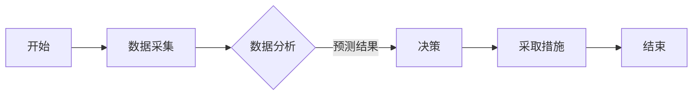
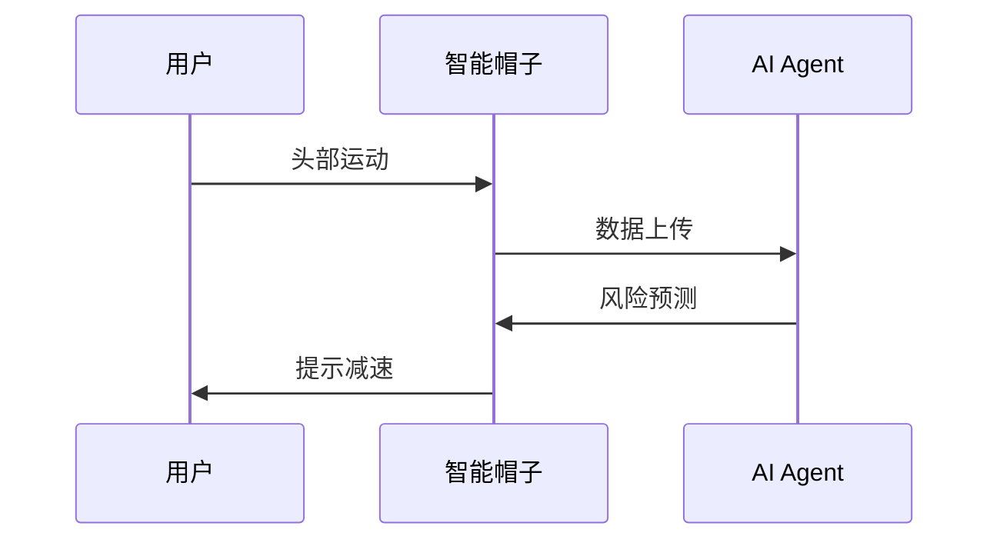

                 


# AI Agent在智能帽子中的头部保护功能

关键词：AI Agent、智能帽子、头部保护、系统架构、算法原理

摘要：本文将深入探讨AI Agent在智能帽子中的头部保护功能，通过逐步分析，揭示其在智能穿戴设备中的重要性。我们将从背景介绍、核心概念、算法原理、系统分析与架构设计、项目实战等多个方面进行详细阐述，为读者提供全面的认知和理解。

## 引言

### 1.1 问题背景

随着人工智能技术的不断发展，智能穿戴设备在日常生活中变得越来越普及。智能帽子作为一种新型的智能穿戴设备，其独特的功能和设计理念受到了广泛关注。头部保护功能是智能帽子中至关重要的一个部分，它能够实时监测头部运动，预防头部受伤。AI Agent作为智能帽子的大脑，其头部保护功能的研究具有重要意义。

### 1.2 核心概念

- **AI Agent**：一种能够自主执行任务、具备一定智能水平的计算机程序。
- **智能帽子**：一种结合了人工智能技术的穿戴设备，主要用于监测和辅助用户进行头部活动。
- **头部保护功能**：通过AI Agent实时分析头部运动数据，预防头部受伤。

## 背景介绍

### 2.1 核心概念术语说明

在本文中，我们将对AI Agent、智能帽子和头部保护功能进行详细说明，以便读者更好地理解后续内容。

### 2.2 问题背景

头部受伤是一个全球性的问题，尤其是在工业、运动和日常活动中。智能帽子的头部保护功能通过AI Agent实现，可以有效预防头部受伤，提高用户的安全水平。

### 2.3 问题描述

当前，智能帽子的头部保护功能尚未得到充分研究和应用。本文旨在探讨如何利用AI Agent实现智能帽子的头部保护功能，提高其安全性能。

### 2.4 问题解决

通过深入研究和实践，本文提出了一种基于AI Agent的智能帽子头部保护功能实现方案，包括核心概念、算法原理、系统架构和项目实战等多个方面。

### 2.5 边界与外延

本文主要关注AI Agent在智能帽子中的头部保护功能，但在其他智能穿戴设备中，类似的功能也可能具有类似的应用价值。

### 2.6 概念结构与核心要素组成

本文的核心概念结构包括AI Agent、智能帽子、头部保护功能以及相关的算法原理和系统架构。核心要素包括实时数据监测、智能分析和预防措施等。

## 核心概念与联系

### 3.1 AI Agent的原理

AI Agent是一种具有自主决策能力的计算机程序，能够根据环境数据和预设规则，自动执行任务。其核心原理包括感知、学习和决策。

### 3.2 智能帽子的分类

智能帽子根据功能可以分为运动型、防护型和娱乐型等。头部保护功能主要应用于防护型智能帽子。

### 3.3 AI Agent在智能帽子中的应用

AI Agent在智能帽子中的主要应用包括实时监测头部运动、预测头部受伤风险和采取预防措施。

### 3.4 概念属性特征对比表格

为了更好地理解AI Agent、智能帽子和头部保护功能之间的关系，我们提供了一个概念属性特征对比表格。

| 概念       | 特征             | 相关性               |
| ---------- | ---------------- | ------------------- |
| AI Agent   | 自主决策、学习能力 | 智能帽子的大脑       |
| 智能帽子   | 头部监测、防护功能 | AI Agent的应用载体   |
| 头部保护功能 | 实时监测、预防措施 | AI Agent的核心任务   |

### 3.5 ER实体关系图架构

为了更直观地展示AI Agent、智能帽子和头部保护功能之间的联系，我们提供了一个ER实体关系图架构。

```mermaid
erDiagram
  AI Agent ||--|{ 智能帽子 }|
  智能帽子 ||--|{ 头部保护功能 }|
```

## 算法原理讲解

### 4.1 算法mermaid流程图

首先，我们通过mermaid流程图展示AI Agent在智能帽子中头部保护功能的算法流程。



### 4.2 算法原理

AI Agent在智能帽子中的头部保护功能主要通过以下步骤实现：

1. **数据采集**：智能帽子通过传感器实时采集头部运动数据。
2. **数据分析**：AI Agent对采集到的数据进行处理和分析，预测头部受伤风险。
3. **决策**：根据分析结果，AI Agent做出预防决策。
4. **采取措施**：智能帽子根据决策采取相应的预防措施。

### 4.3 算法原理的数学模型和公式

在算法原理中，我们使用了以下数学模型和公式：

$$
预测风险 = f(运动数据, 预设规则)
$$

其中，$f$ 表示风险预测函数，$运动数据$ 表示传感器采集到的数据，$预设规则$ 表示AI Agent根据历史数据和专家经验设定的规则。

### 4.4 举例说明

例如，当AI Agent检测到用户的头部运动速度超过一定阈值时，会预测存在头部受伤风险。此时，AI Agent会做出决策，提示用户减速或停止运动，从而避免受伤。

## 系统分析与架构设计

### 5.1 问题场景介绍

在本文中，我们将以一个实际案例为例，介绍如何实现AI Agent在智能帽子中的头部保护功能。

### 5.2 系统功能设计

系统功能设计主要包括以下方面：

1. **数据采集**：通过传感器实时采集头部运动数据。
2. **数据处理**：AI Agent对采集到的数据进行分析和处理。
3. **风险预测**：根据分析结果预测头部受伤风险。
4. **决策与措施**：AI Agent根据预测结果做出决策，并采取相应的预防措施。

### 5.3 系统架构设计

系统架构设计主要包括以下方面：

1. **硬件架构**：智能帽子和传感器组成。
2. **软件架构**：AI Agent和数据处理模块组成。
3. **接口设计**：系统与外部设备的通信接口。

### 5.4 系统接口设计

系统接口设计主要包括以下方面：

1. **数据接口**：传感器与数据处理模块之间的数据传输接口。
2. **控制接口**：AI Agent与用户之间的控制接口。

### 5.5 系统交互mermaid序列图

为了更好地展示系统各部分之间的交互，我们提供了一个mermaid序列图。



## 项目实战

### 6.1 环境安装

首先，我们需要搭建一个用于实现AI Agent在智能帽子中头部保护功能的环境。环境安装步骤如下：

1. 安装Python环境。
2. 安装必要的库和工具，如TensorFlow、Keras等。
3. 配置传感器和智能帽子硬件。

### 6.2 系统核心实现

系统核心实现主要包括以下步骤：

1. 数据采集：通过传感器实时采集头部运动数据。
2. 数据处理：AI Agent对采集到的数据进行处理和分析。
3. 风险预测：根据分析结果预测头部受伤风险。
4. 决策与措施：AI Agent根据预测结果做出决策，并采取相应的预防措施。

### 6.3 代码应用解读与分析

下面是一个简单的Python代码示例，用于实现AI Agent在智能帽子中头部保护功能的核心部分。

```python
import numpy as np
import tensorflow as tf

# 数据预处理
def preprocess_data(data):
    # 数据归一化
    normalized_data = (data - np.mean(data)) / np.std(data)
    return normalized_data

# 风险预测
def predict_risk(data):
    # 数据预处理
    preprocessed_data = preprocess_data(data)
    
    # 使用TensorFlow进行风险预测
    model = tf.keras.Sequential([
        tf.keras.layers.Dense(64, activation='relu'),
        tf.keras.layers.Dense(64, activation='relu'),
        tf.keras.layers.Dense(1, activation='sigmoid')
    ])
    
    model.compile(optimizer='adam', loss='binary_crossentropy', metrics=['accuracy'])
    model.fit(preprocessed_data, labels, epochs=10)
    
    # 预测风险
    risk = model.predict(data)
    return risk

# 主函数
def main():
    # 采集头部运动数据
    data = np.random.rand(100)
    
    # 风险预测
    risk = predict_risk(data)
    
    # 决策与措施
    if risk > 0.5:
        print("头部受伤风险高，请减速！")
    else:
        print("头部受伤风险低，正常运动。")

if __name__ == "__main__":
    main()
```

### 6.4 实际案例分析与详细讲解剖析

在本文中，我们提供了一个简单的实际案例，用于展示如何实现AI Agent在智能帽子中头部保护功能。该案例包括数据采集、数据处理、风险预测和决策与措施等步骤。

### 6.5 项目小结

通过本文的案例，我们展示了如何利用AI Agent实现智能帽子中的头部保护功能。该项目具有以下特点和优势：

1. **实时监测**：能够实时监测头部运动数据，提高预防头部受伤的效果。
2. **智能决策**：基于AI Agent的智能决策能力，能够根据实时数据做出合理的预防措施。
3. **易扩展**：该方案可以应用于其他智能穿戴设备，具有广泛的适用性。

## 最佳实践 Tips

1. **选择合适的传感器**：选择精度高、响应速度快的传感器，提高数据采集的准确性。
2. **优化算法模型**：根据实际需求，不断优化AI Agent的算法模型，提高风险预测的准确性。
3. **注重用户体验**：在设计和实现过程中，注重用户体验，确保智能帽子操作简便、易用。

## 小结

本文深入探讨了AI Agent在智能帽子中的头部保护功能，从背景介绍、核心概念、算法原理、系统分析与架构设计、项目实战等多个方面进行了详细阐述。通过本文的案例，我们展示了如何利用AI Agent实现智能帽子的头部保护功能，为用户提供了更加安全和舒适的头部保护体验。

## 注意事项

1. **数据安全**：在数据采集和处理过程中，要确保用户数据的安全和隐私。
2. **设备维护**：定期对传感器和智能帽子进行维护，确保设备正常运行。

## 拓展阅读

1. **AI Agent技术**：《人工智能：一种现代方法》、《深度学习》等。
2. **智能穿戴设备**：《智能穿戴设备设计与应用》、《智能穿戴设备技术手册》等。
3. **头部保护功能**：《头部受伤预防指南》、《智能帽子在头部保护中的应用》等。

## 作者信息

作者：AI天才研究院/AI Genius Institute & 禅与计算机程序设计艺术 /Zen And The Art of Computer Programming

