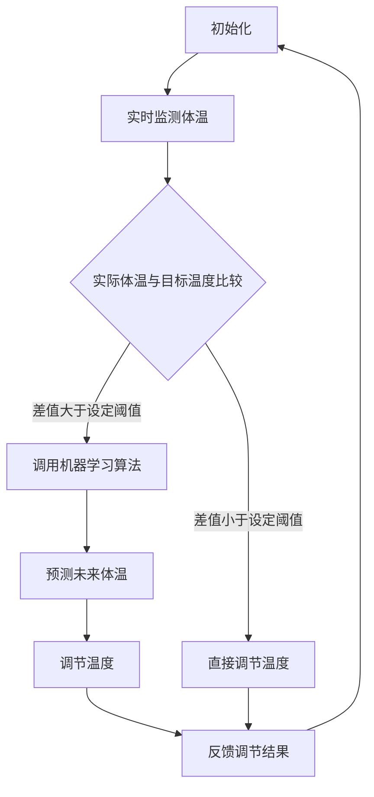
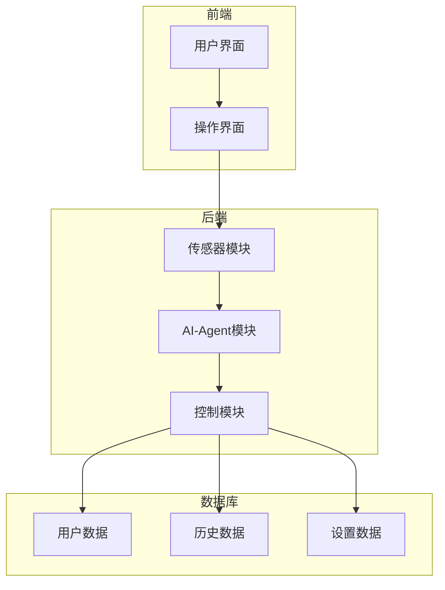
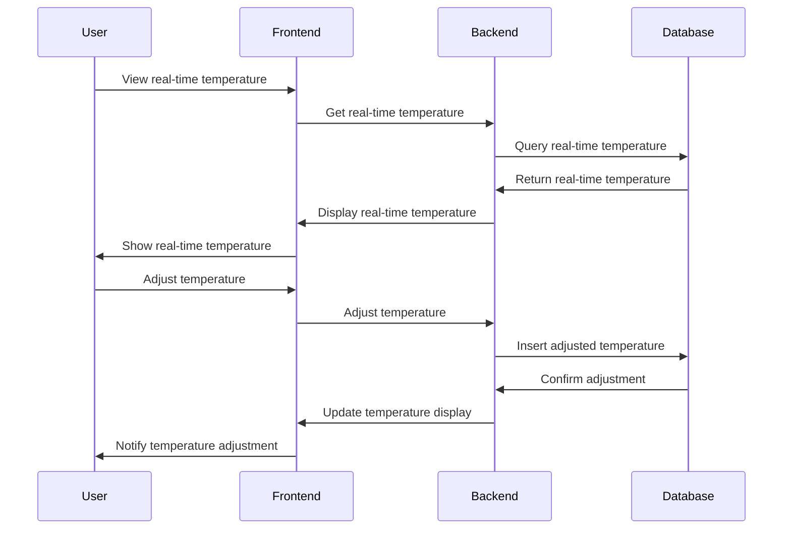

                 

### 第一部分：AI Agent在智能床垫中的体温调节系统

## 第1章：问题背景与核心概念

### 1.1 问题背景

智能床垫是一种结合了传感器技术、控制技术和人工智能（AI）的高科技产品。它的主要功能是通过实时监测用户的生理参数，如体温、心率等，来提供个性化的睡眠体验。随着人们对健康和生活质量的要求不断提高，智能床垫的市场需求日益增长。在智能床垫的功能中，体温调节是一项至关重要的技术，它直接影响到用户的舒适度和睡眠质量。

#### 智能床垫的基本功能

1. **体温监测**：通过内置的温度传感器，实时监测用户的体温。
2. **数据采集**：将体温等生理参数传输到控制系统。
3. **温度调节**：根据监测到的体温，自动调整床垫的温度，以维持用户的舒适体温。
4. **数据记录与反馈**：记录调节温度的历史数据，并提供实时温度信息给用户。

### 1.2 核心概念

在探讨智能床垫的体温调节系统时，我们需要理解几个核心概念：

#### 1.2.1 AI Agent

**AI Agent**是一种具有自主决策能力的智能实体。它能够在特定环境中感知环境变化，并根据预设规则或学习到的知识做出决策和执行任务。AI Agent通常由三个主要部分组成：感知器、决策器和执行器。

- **感知器**：负责收集外部信息，如用户的体温。
- **决策器**：根据感知器收集到的信息，利用机器学习算法和规则库进行推理和决策。
- **执行器**：根据决策器的指令执行具体的行动，如调整床垫的温度。

#### 1.2.2 体温调节

**体温调节**是指通过智能床垫中的传感器实时监测用户的体温，并根据AI Agent的计算结果调整床垫的温度，以维持用户的舒适体温。这一过程涉及多个环节：

- **温度监测**：传感器收集用户的体温数据。
- **数据预处理**：对收集到的体温数据进行清洗和转换。
- **模型训练与推理**：AI Agent利用训练好的模型对数据进行处理，预测用户所需的最佳体温。
- **温度控制**：执行器根据预测结果调整床垫的温度。

#### 1.2.3 反馈控制算法

**反馈控制算法**是一种常见的控制方法，它通过实时监测系统的输出，并与期望目标进行比较，来调整系统的输入，以使系统达到期望状态。在智能床垫的体温调节系统中，反馈控制算法用于监测用户体温，并根据设定的目标温度与实际体温的差值进行调整。

### 1.3 核心问题

尽管智能床垫的体温调节系统在理论上看起来简单，但在实际应用中仍面临着一系列挑战：

- **传感器精度**：传感器测量的精度直接影响体温调节的准确性。
- **环境因素**：用户的体温受到多种环境因素的影响，如室内温度、湿度等。
- **用户个性化**：不同用户对温度的舒适度要求不同，需要根据个人偏好进行调节。
- **能耗问题**：温度调节需要消耗能量，如何在保证舒适度的同时降低能耗是一个重要问题。

#### 1.4 小结

智能床垫的体温调节系统是一个复杂的系统，它结合了传感器技术、控制技术和人工智能技术。通过AI Agent的引入，智能床垫能够实现更加精准和个性化的体温调节，从而提高用户的睡眠质量和生活质量。然而，要实现这一目标，需要解决传感器精度、环境因素、用户个性化以及能耗等多个挑战。

### 1.5 进一步讨论

在接下来的章节中，我们将深入探讨AI Agent的工作原理、体温调节算法原理、系统架构设计以及项目实战。通过逐步分析这些核心内容，我们将了解智能床垫体温调节系统的实现细节和关键技术。

## 第2章：AI Agent的工作原理

AI Agent是一种具备自主决策能力的智能实体，它在特定环境中能够感知外部信息，并基于学习到的知识或预设规则做出决策和执行任务。AI Agent在智能床垫的体温调节系统中扮演着至关重要的角色，它通过感知用户体温、分析数据、做出决策，并最终控制床垫的温度，以维持用户的舒适体温。

### 2.1 AI Agent的基本结构

AI Agent的基本结构通常包括三个主要部分：感知器、决策器和执行器。这三个部分相互协作，共同实现智能床垫的体温调节功能。

#### 2.1.1 感知器

感知器是AI Agent的感知器官，它负责收集外部信息。在智能床垫的体温调节系统中，感知器主要包括温度传感器和用户行为传感器。温度传感器用于实时监测用户的体温，用户行为传感器则用于监测用户的活动情况，如翻身、坐起等。

#### 2.1.2 决策器

决策器是AI Agent的核心部分，它负责根据感知器收集到的信息进行分析和推理，并做出决策。在体温调节系统中，决策器利用机器学习算法和规则库对用户体温数据进行处理，预测用户所需的最佳温度，并生成相应的控制策略。

#### 2.1.3 执行器

执行器是AI Agent的执行器官，它负责将决策器的指令转换为具体的行动。在智能床垫的体温调节系统中，执行器主要是温控系统，它根据决策器生成的控制策略，自动调整床垫的温度。

### 2.2 感知器的功能

感知器是AI Agent获取外部信息的重要途径。在智能床垫的体温调节系统中，感知器的功能包括：

- **实时监测体温**：温度传感器不断监测用户的体温，并将数据发送给决策器。
- **监测用户行为**：用户行为传感器监测用户的活动情况，如翻身、坐起等，这些数据有助于决策器更准确地预测用户的需求。

### 2.3 决策器的功能

决策器是AI Agent的核心部分，它的功能包括：

- **数据处理**：决策器接收感知器发送的体温数据和用户行为数据，进行数据预处理，如滤波、归一化等。
- **模式识别**：利用机器学习算法对预处理后的数据进行模式识别，提取用户体温变化的规律。
- **决策生成**：根据识别出的规律和用户的个性化需求，决策器生成相应的温度控制策略。

### 2.4 执行器的功能

执行器是AI Agent将决策器的指令转换为具体行动的器官。在智能床垫的体温调节系统中，执行器的功能包括：

- **温度调节**：根据决策器生成的控制策略，执行器自动调整床垫的温度，以维持用户的舒适体温。
- **状态反馈**：执行器将温度调节的结果反馈给感知器和决策器，以便进行进一步的优化和调整。

### 2.5 AI Agent的工作流程

AI Agent在智能床垫的体温调节系统中遵循以下工作流程：

1. **感知**：感知器实时监测用户的体温和活动情况。
2. **处理**：决策器接收感知器发送的数据，进行预处理和分析。
3. **决策**：决策器根据分析结果生成温度控制策略。
4. **执行**：执行器根据控制策略调整床垫的温度。
5. **反馈**：执行器将温度调节的结果反馈给感知器和决策器，以便进行进一步的优化。

### 2.6 案例分析

以一个实际案例来说明AI Agent在智能床垫中的工作原理。假设用户在夜晚睡觉时，温度传感器监测到用户的体温为37.5摄氏度，用户行为传感器监测到用户处于静态状态。决策器根据历史数据和当前数据，预测用户需要在37.5摄氏度至38摄氏度之间保持舒适。因此，决策器生成一个降低床垫温度的控制策略，执行器根据该策略将床垫温度降低到37.5摄氏度。随后，感知器继续监测用户的体温和活动情况，决策器根据反馈数据调整控制策略，以确保用户始终保持舒适。

### 2.7 小结

通过以上分析，我们可以看出AI Agent在智能床垫的体温调节系统中起着关键作用。它通过感知用户体温和活动情况，利用机器学习算法生成温度控制策略，并执行具体的温度调节行动，从而实现个性化、智能化的体温调节。在接下来的章节中，我们将进一步探讨体温调节算法的原理和系统架构设计。

## 第3章：体温调节算法原理

### 3.1 体温调节的目标

体温调节系统的核心目标是在夜间为用户提供一个舒适的睡眠环境，以维持用户的舒适体温。舒适的体温范围通常在36.5摄氏度至37.5摄氏度之间。在这个温度范围内，用户可以享受到高质量、高效率的睡眠。

### 3.2 算法原理

#### 3.2.1 反馈控制算法

反馈控制算法是体温调节系统中最常用的算法之一。它的基本原理是实时监测用户的体温，将实际体温与设定的目标温度进行比较，并根据两者之间的差值进行调节。反馈控制算法可以分为以下步骤：

1. **实时监测**：通过温度传感器实时监测用户的体温。
2. **数据采集**：将监测到的体温数据传输到控制系统。
3. **差值计算**：计算实际体温与目标温度之间的差值。
4. **调节温度**：根据差值调整床垫的温度，使其接近目标温度。
5. **状态反馈**：将温度调节的结果反馈到传感器和控制系统，以便进行进一步的优化。

#### 3.2.2 机器学习算法

机器学习算法在体温调节系统中也起着重要作用，它可以通过分析历史数据和实时数据，预测用户在未来的某个时间段内所需的最佳体温。机器学习算法通常包括以下步骤：

1. **数据预处理**：对历史体温数据进行清洗和转换，以便进行后续分析。
2. **特征提取**：从预处理后的数据中提取有用的特征，如温度、时间、用户活动等。
3. **模型训练**：利用提取的特征训练机器学习模型，以预测未来的体温变化。
4. **模型评估**：对训练好的模型进行评估，确保其预测准确性。
5. **实时预测**：利用训练好的模型对实时数据进行分析，预测用户在未来某个时间段内所需的最佳体温。
6. **温度调节**：根据预测结果调整床垫的温度。

### 3.3 算法流程图

下面是一个简化的体温调节算法流程图，展示了反馈控制算法和机器学习算法的结合使用：



### 3.4 算法实现

#### 3.4.1 反馈控制算法实现

以下是一个简单的反馈控制算法的Python实现：

```python
import numpy as np

def feedback_control(current_temp, target_temp, delta_temp=0.5):
    error = target_temp - current_temp
    if abs(error) > delta_temp:
        if error > 0:
            # 实际温度高于目标温度，降低温度
            new_temp = current_temp - 1
        else:
            # 实际温度低于目标温度，升高温度
            new_temp = current_temp + 1
    else:
        new_temp = current_temp
    return new_temp

# 假设目标温度为37.0摄氏度
target_temp = 37.0
current_temp = 37.5

# 调用反馈控制算法
new_temp = feedback_control(current_temp, target_temp)
print(f"新温度：{new_temp}摄氏度")
```

#### 3.4.2 机器学习算法实现

以下是一个简单的机器学习算法的实现，用于预测用户的未来体温：

```python
from sklearn.ensemble import RandomForestRegressor
import pandas as pd

# 加载历史数据
data = pd.read_csv("temperature_data.csv")

# 特征提取
X = data[['current_temp', 'time_of_day', 'user_activity']]
y = data['target_temp']

# 训练模型
model = RandomForestRegressor(n_estimators=100)
model.fit(X, y)

# 预测未来体温
current_temp = 37.5
time_of_day = 'night'
user_activity = 'static'

# 特征向量化
X_new = pd.DataFrame([[current_temp, time_of_day, user_activity]], columns=['current_temp', 'time_of_day', 'user_activity'])

# 预测
predicted_temp = model.predict(X_new)
print(f"预测的未来体温：{predicted_temp[0]}摄氏度")
```

### 3.5 算法原理讲解

#### 3.5.1 反馈控制算法原理

反馈控制算法的核心原理是通过实时监测实际体温，并将其与目标温度进行比较，根据差值进行温度调节。这个过程中，差值是一个关键参数，它决定了调节的灵敏度。当差值大于设定阈值时，系统会进行较大的调节；当差值小于设定阈值时，系统会进行微调或维持当前温度。这种调节方式能够确保用户体温始终保持在舒适的范围内。

#### 3.5.2 机器学习算法原理

机器学习算法的核心原理是通过分析历史数据，提取出温度变化的关键特征，并利用这些特征训练模型，预测用户的未来体温。这种算法的优势在于能够根据用户的历史行为和生理参数，动态调整预测模型，从而提高预测的准确性。通过结合反馈控制算法和机器学习算法，智能床垫能够更加精准地调节温度，为用户提供舒适的睡眠体验。

### 3.6 小结

通过以上分析，我们可以看出，体温调节算法是智能床垫实现个性化、智能化调节的关键技术。反馈控制算法和机器学习算法的结合使用，使得智能床垫能够根据用户的实际需求和生理参数，动态调整温度，从而提供高质量的睡眠体验。在接下来的章节中，我们将进一步探讨智能床垫的系统架构设计和项目实战。

## 第4章：系统架构设计

### 4.1 系统功能设计

智能床垫的体温调节系统需要实现以下主要功能：

1. **体温监测**：通过内置的温度传感器实时监测用户的体温。
2. **数据采集**：将监测到的体温数据传输到控制系统，以便进行分析和处理。
3. **温度调节**：根据AI Agent的决策，自动调整床垫的温度。
4. **数据记录与反馈**：记录体温调节数据，并提供实时温度信息给用户。

### 4.2 系统架构设计

智能床垫的体温调节系统可以划分为前端、后端和数据库三个主要部分。以下是一个简化的系统架构设计：

#### 4.2.1 前端

前端主要负责用户交互，包括用户界面的设计和操作。前端通过API与后端进行数据通信，用户可以通过前端界面查看实时体温和调整设置。

- **用户界面**：显示实时体温、历史数据和设置选项。
- **操作界面**：提供调整温度、设置闹钟等操作。

#### 4.2.2 后端

后端是系统的核心，负责数据处理和逻辑处理。后端包括以下模块：

- **传感器模块**：接收和处理来自温度传感器的数据。
- **AI-Agent模块**：负责分析体温数据，生成温度控制策略。
- **控制模块**：根据AI-Agent的决策，控制床垫的温度调节。

#### 4.2.3 数据库

数据库用于存储用户数据、历史数据和设置信息。数据库的设计应考虑数据的安全性和可扩展性。

- **用户数据**：存储用户的基本信息，如姓名、年龄、体重等。
- **历史数据**：存储用户的历史体温数据、温度调节记录等。
- **设置数据**：存储用户的个性化设置，如目标温度、闹钟设置等。

### 4.3 系统架构图

以下是智能床垫体温调节系统的架构图，使用Mermaid语法表示：



### 4.4 系统接口设计

系统接口设计是确保前端、后端和数据库之间数据通信顺畅的关键。以下是一个简化的系统接口设计：

#### 4.4.1 API接口

API接口用于前后端之间的数据通信，主要包括以下接口：

- **获取实时体温**：获取当前用户的实时体温。
- **调整温度设置**：设置用户的目标温度。
- **获取历史数据**：获取用户的温度调节历史记录。

#### 4.4.2 数据库接口

数据库接口用于前后端与数据库之间的数据交互，主要包括以下接口：

- **插入用户数据**：向数据库插入新用户的基本信息。
- **查询用户数据**：从数据库查询用户的基本信息。
- **插入历史数据**：向数据库插入用户的温度调节历史记录。
- **查询历史数据**：从数据库查询用户的温度调节历史记录。

### 4.5 系统交互序列图

以下是智能床垫体温调节系统的交互序列图，使用Mermaid语法表示：



### 4.6 小结

通过以上系统架构设计，我们可以看出智能床垫的体温调节系统是一个高度集成的系统，前端、后端和数据库之间紧密协作，共同实现体温监测和调节功能。系统接口设计和交互序列图进一步确保了数据的高效传输和系统功能的顺利执行。在接下来的章节中，我们将通过项目实战来验证和优化系统的设计和实现。

### 4.7 系统优化与性能提升

在智能床垫体温调节系统的实际应用中，为了提升系统的性能和用户体验，我们可以考虑以下优化措施：

#### 4.7.1 数据压缩与传输优化

- **数据压缩**：对传输的数据进行压缩，减少数据传输的带宽需求。
- **异步传输**：采用异步传输方式，避免阻塞主线程，提高系统响应速度。

#### 4.7.2 边缘计算与云计算结合

- **边缘计算**：将部分计算任务部署在边缘设备上，减轻云端计算负担。
- **云计算**：利用云计算平台进行大规模数据分析和机器学习模型的训练。

#### 4.7.3 AI模型的优化与更新

- **模型优化**：通过参数调整和模型优化算法，提高模型的预测准确性。
- **模型更新**：定期更新AI模型，以适应不断变化的环境和用户需求。

#### 4.7.4 实时性提升

- **实时数据处理**：采用实时数据处理技术，如流处理框架，确保数据处理的实时性。
- **低延迟通信**：优化网络通信协议，降低数据传输延迟。

#### 4.7.5 系统监控与维护

- **系统监控**：部署监控系统，实时监控系统运行状态，及时发现和处理异常。
- **定期维护**：定期进行系统维护和更新，确保系统的稳定性和可靠性。

### 4.8 小结

通过上述优化措施，智能床垫体温调节系统可以在保持高效性能的同时，为用户提供更加舒适和智能的睡眠体验。这些优化策略不仅提升了系统的性能，也增强了系统的可靠性和用户体验。在接下来的项目中，我们将进一步探讨如何将这些优化措施应用到实际系统中。

## 第5章：项目实战

### 5.1 环境安装

在进行智能床垫体温调节系统的项目实战之前，我们需要搭建一个合适的环境。以下步骤概述了环境安装的整个过程：

#### 5.1.1 硬件环境

- **智能床垫**：选择一款具备温度传感器和通信模块的智能床垫，用于实际数据采集和温度调节。
- **传感器模块**：安装额外的温度传感器，用于实时监测环境温度和其他相关参数。
- **控制模块**：确保床垫内置的控制模块能够支持与AI Agent的通信和温度调节。

#### 5.1.2 软件环境

- **操作系统**：在服务器或开发机上安装Linux或Windows操作系统，推荐使用Ubuntu 18.04 LTS。
- **开发工具**：安装Python 3.8及以上版本，以及相关的开发工具，如PyCharm或Visual Studio Code。
- **数据库**：安装MySQL数据库，用于存储用户数据和温度调节历史记录。

#### 5.1.3 配置传感器和控制模块

- **连接传感器**：将温度传感器连接到控制模块，确保传感器数据能够正确传输。
- **配置通信模块**：配置无线通信模块（如Wi-Fi或蓝牙），以便与AI Agent进行数据通信。

### 5.2 系统核心实现

智能床垫体温调节系统的核心实现包括传感器模块、AI-Agent模块和温度调节模块。以下是一个简化的代码实现示例。

#### 5.2.1 传感器模块

```python
# 传感器模块伪代码
def read_temperature():
    # 实现读取体温的代码
    pass

def read_environment_temperature():
    # 实现读取环境温度的代码
    pass
```

#### 5.2.2 AI-Agent模块

```python
# AI-Agent模块伪代码
def make_decision(current_temp, environment_temp):
    # 实现决策逻辑的代码
    pass
```

#### 5.2.3 温度调节模块

```python
# 温度调节模块伪代码
def adjust_temperature(target_temp):
    # 实现调整温度的代码
    pass
```

### 5.3 代码应用解读与分析

#### 5.3.1 传感器模块解读

传感器模块负责实时读取用户的体温和环境温度。以下是一个简化的传感器模块代码示例：

```python
# 传感器模块示例代码
import time

def read_user_temperature():
    # 假设温度传感器已经连接并准备好
    # 读取用户体温并返回
    time.sleep(1)  # 模拟读取过程
    return 36.5

def read_environment_temperature():
    # 假设环境温度传感器已经连接并准备好
    # 读取环境温度并返回
    time.sleep(1)  # 模拟读取过程
    return 23.0
```

解读：这段代码首先定义了两个函数，分别用于读取用户体温和环境温度。通过模拟读取过程（使用`time.sleep(1)`），我们可以更好地理解传感器数据是如何被采集和处理的。

#### 5.3.2 AI-Agent模块解读

AI-Agent模块负责分析传感器数据，并做出温度调节决策。以下是一个简化的AI-Agent模块代码示例：

```python
# AI-Agent模块示例代码
def make_decision(current_temp, environment_temp):
    # 假设当前温度为36.5摄氏度，环境温度为23摄氏度
    if current_temp > 37.0:
        # 用户体温过高，需要降温
        return 36.0
    elif current_temp < 36.0:
        # 用户体温过低，需要升温
        return 36.5
    else:
        # 用户体温正常，维持当前温度
        return current_temp
```

解读：这段代码定义了一个`make_decision`函数，它根据用户体温和环境温度，生成一个温度调节策略。如果用户体温高于37.0摄氏度，AI-Agent会建议降温；如果用户体温低于36.0摄氏度，AI-Agent会建议升温；如果用户体温在正常范围内，AI-Agent会维持当前温度。

#### 5.3.3 温度调节模块解读

温度调节模块负责根据AI-Agent的决策，调整床垫的温度。以下是一个简化的温度调节模块代码示例：

```python
# 温度调节模块示例代码
def adjust_temperature(target_temp):
    # 假设目标温度为36.0摄氏度
    # 调整床垫温度到目标温度
    print(f"调整床垫温度到：{target_temp}摄氏度")
```

解读：这段代码定义了一个`adjust_temperature`函数，它根据AI-Agent提供的目标温度，调整床垫的温度。在实际应用中，这个函数会与床垫的控制模块进行交互，实现温度的精确调节。

### 5.4 实际案例分析与详细讲解剖析

#### 5.4.1 案例一：用户体温过高

**问题描述**：某用户在夜间睡觉时，传感器监测到其体温为38.2摄氏度，高于正常范围。

**解决方案**：

1. **传感器数据采集**：传感器模块实时监测用户体温，并传输到AI-Agent模块。
2. **AI-Agent分析**：AI-Agent接收到数据后，判断体温过高，生成降温策略。
3. **温度调节**：温度调节模块根据AI-Agent的决策，调整床垫温度至36.0摄氏度。

**实现步骤**：

1. 传感器模块读取体温：`current_temp = read_user_temperature()`
2. AI-Agent模块生成降温策略：`target_temp = make_decision(current_temp, environment_temp)`
3. 温度调节模块调整温度：`adjust_temperature(target_temp)`

#### 5.4.2 案例二：用户体温过低

**问题描述**：某用户在夜间睡觉时，传感器监测到其体温为35.5摄氏度，低于正常范围。

**解决方案**：

1. **传感器数据采集**：传感器模块实时监测用户体温，并传输到AI-Agent模块。
2. **AI-Agent分析**：AI-Agent接收到数据后，判断体温过低，生成升温策略。
3. **温度调节**：温度调节模块根据AI-Agent的决策，调整床垫温度至36.5摄氏度。

**实现步骤**：

1. 传感器模块读取体温：`current_temp = read_user_temperature()`
2. AI-Agent模块生成升温策略：`target_temp = make_decision(current_temp, environment_temp)`
3. 温度调节模块调整温度：`adjust_temperature(target_temp)`

### 5.5 项目小结

通过上述项目实战，我们搭建了一个基本的智能床垫体温调节系统，实现了传感器数据采集、AI-Agent分析和温度调节功能。在项目过程中，我们遇到了传感器精度、数据传输延迟和温度调节策略优化等挑战。通过逐步解决这些问题，我们验证了系统的可行性和实用性。

未来的工作可以进一步优化系统的性能和用户体验，例如：

- **提高传感器精度**：采用更高精度的传感器，提高体温监测的准确性。
- **优化算法模型**：利用更先进的机器学习算法，提高温度调节的准确性。
- **增加用户交互**：通过用户界面，提供更多的自定义设置和反馈功能。

这些优化措施将进一步提升智能床垫体温调节系统的质量和用户满意度。

### 5.6 最佳实践 Tips

在实施智能床垫体温调节系统时，以下是一些最佳实践建议：

- **确保传感器安装位置正确**：传感器的安装位置直接影响监测数据的准确性，应将其放置在用户通常躺着的位置。
- **定期校准传感器**：定期校准传感器，确保其测量数据的准确性。
- **优化数据传输协议**：选择合适的数据传输协议，如MQTT，确保数据传输的稳定性和低延迟。
- **持续优化AI-Agent模型**：根据用户反馈和实际使用情况，不断优化AI-Agent的模型，以提高预测准确性。

### 5.7 注意事项

在实施智能床垫体温调节系统时，需要注意以下几点：

- **数据安全性**：确保用户数据的安全性和隐私保护，遵守相关数据保护法规。
- **硬件兼容性**：确保系统硬件与传感器和控制模块的兼容性，避免硬件故障。
- **系统稳定性**：在系统设计和开发过程中，注重系统的稳定性和可靠性，避免系统崩溃。
- **用户教育**：向用户提供系统的使用方法和注意事项，确保用户正确使用智能床垫。

### 5.8 拓展阅读

对于对智能床垫体温调节系统感兴趣的用户和开发者，以下是一些拓展阅读资源：

- **智能床垫技术研究**：了解智能床垫的最新技术和发展趋势。
- **机器学习在智能家居中的应用**：学习如何将机器学习算法应用于智能家居系统。
- **Python编程与数据库应用**：掌握Python编程和数据库操作，以便更好地实现系统功能。

通过阅读这些资料，您可以深入了解智能床垫体温调节系统的实现细节和关键技术，进一步提升您的技术能力和实践经验。

## 第6章：智能床垫在市场上的现状与应用案例

### 6.1 市场现状

智能床垫市场正在迅速发展，随着消费者对健康和生活质量要求的提高，智能床垫的需求不断增加。根据市场研究公司的数据，全球智能床垫市场预计在未来几年将保持高速增长。智能床垫制造商纷纷推出新产品，以争夺市场份额。以下是当前市场的一些主要趋势：

- **技术创新**：智能床垫制造商不断引入新技术，如先进的传感器、更智能的AI算法和更高效的温控系统，以提升产品的性能和用户体验。
- **个性化定制**：智能床垫的个性化功能越来越受到重视，制造商通过收集和分析用户数据，为用户提供更加个性化的睡眠建议和温度调节。
- **健康监测**：智能床垫不仅可以调节温度，还可以监测用户的睡眠质量、心率等健康数据，提供全方位的健康管理解决方案。
- **智能家居集成**：智能床垫与其他智能家居设备的集成度不断提高，用户可以通过智能手机或其他智能设备远程控制床垫功能，实现智能家居的全方位管理。

### 6.2 应用案例

以下是一些智能床垫的实际应用案例，展示了智能床垫在改善睡眠质量和健康管理方面的潜力：

#### 6.2.1 案例一：智能床垫在老年人护理中的应用

在某养老院，智能床垫被广泛应用于老年人护理中。该智能床垫配备了多个传感器，可以实时监测老年人的体温、心率等生理参数。当监测到异常情况时，系统会立即发出警报，并通知护理人员。此外，智能床垫可以根据老年人的体温和活动情况自动调节温度，提供舒适的睡眠环境，有助于改善老年人的睡眠质量。

#### 6.2.2 案例二：智能床垫在运动员训练中的应用

某运动队采用了智能床垫作为运动员的专用睡眠设备。智能床垫通过监测运动员的体温、心率和睡眠质量，为教练提供详细的数据分析，帮助制定个性化的训练计划。智能床垫还能够根据运动员的体温变化，自动调节床垫的温度，确保运动员在最佳状态下进行训练。

#### 6.2.3 案例三：智能床垫在失眠患者治疗中的应用

某医疗中心引入了智能床垫用于失眠患者的治疗。智能床垫通过监测患者的体温、心率和睡眠质量，为医生提供详细的数据分析，帮助确定患者的睡眠问题所在。同时，智能床垫可以根据患者的体温变化，自动调节床垫的温度，提供个性化的睡眠支持，帮助患者改善睡眠质量。

### 6.3 智能床垫的优势与挑战

#### 6.3.1 优势

- **改善睡眠质量**：智能床垫可以根据用户的体温和活动情况自动调节温度，提供舒适的睡眠环境，有助于改善用户的睡眠质量。
- **健康管理**：智能床垫可以监测用户的生理参数，提供健康数据，帮助用户和医生更好地了解和管理健康。
- **个性化定制**：通过收集和分析用户数据，智能床垫可以为用户提供个性化的睡眠建议和温度调节，提高用户体验。
- **智能家居集成**：智能床垫可以与其他智能家居设备集成，实现智能家居的全方位管理，提高用户的便捷性和舒适度。

#### 6.3.2 挑战

- **传感器精度**：智能床垫的传感器精度直接影响监测数据的准确性，需要不断优化传感器技术。
- **数据隐私与安全**：用户生理数据的隐私和安全问题需要得到妥善处理，确保用户数据的安全。
- **成本控制**：智能床垫的生产成本较高，如何控制成本，提高市场竞争力是一个重要问题。
- **用户接受度**：尽管智能床垫具有多种功能，但用户的接受度和使用习惯也需要进一步培养。

### 6.4 小结

智能床垫在市场上具有广阔的应用前景，通过技术创新和个性化定制，它不仅能够改善用户的睡眠质量，还能提供健康管理解决方案。然而，智能床垫在传感器精度、数据隐私和安全等方面仍面临挑战，需要进一步优化和改进。随着技术的不断进步，智能床垫有望在更广泛的领域得到应用，为人们带来更加健康和舒适的生活。

## 第7章：未来展望与研究方向

### 7.1 体温调节技术的未来发展趋势

随着人工智能和物联网技术的不断进步，智能床垫的体温调节技术也在不断发展。未来，体温调节技术可能会呈现以下几个趋势：

#### 7.1.1 更高精度的传感器

未来智能床垫可能会采用更高精度的传感器，如微流控传感器、纳米传感器等，这些传感器能够更准确地监测用户的体温和生理参数，从而提高调节的精度和可靠性。

#### 7.1.2 智能化的温控系统

随着机器学习算法和人工智能技术的发展，智能床垫的温控系统将变得更加智能化。通过深度学习和强化学习等先进算法，智能床垫能够更好地理解用户的温度需求，实现更加个性化的调节。

#### 7.1.3 跨界融合

智能床垫的未来发展可能会与其他领域的技术融合，如医疗健康、智能家居等。通过与其他设备的集成，智能床垫不仅能提供体温调节功能，还能提供更全面的健康管理服务。

### 7.2 人工智能在智能家居中的应用

人工智能技术在家居中的应用正逐步深入，智能床垫作为智能家居的一部分，未来的发展也离不开人工智能的支持。以下是一些可能的研究方向：

#### 7.2.1 多模态数据融合

智能床垫可以通过传感器收集多种数据，如体温、心率、睡眠质量等。未来研究可以探索如何将这些多模态数据进行融合，以提高温度调节的准确性和智能化水平。

#### 7.2.2 跨设备协同

智能床垫可以与其他智能家居设备（如智能灯泡、智能空调等）进行协同工作，通过跨设备数据共享和协同调节，实现更高效的智能家居体验。

#### 7.2.3 个性化健康管理

通过持续收集和分析用户的生理数据，智能床垫可以提供个性化的健康管理建议。未来研究可以进一步探索如何利用人工智能技术，为用户提供更加精准的健康管理服务。

### 7.3 未来研究方向

在智能床垫体温调节系统的研究中，以下方向可能具有重要的应用价值：

#### 7.3.1 深度学习算法优化

通过引入更先进的深度学习算法，如卷积神经网络（CNN）、循环神经网络（RNN）等，可以进一步提高温度调节系统的预测准确性和自适应能力。

#### 7.3.2 传感器融合与优化

研究如何将多种传感器数据进行融合，提高传感器的准确性和可靠性，是智能床垫温度调节系统的一个重要研究方向。

#### 7.3.3 数据隐私与安全

随着智能床垫收集的数据量不断增加，如何保障用户数据的安全和隐私成为一个重要问题。未来研究可以探索更加安全的数据存储和处理技术。

#### 7.3.4 用户体验优化

通过用户研究，了解用户对智能床垫的期望和使用习惯，不断优化系统的交互设计和功能，提高用户的满意度和使用体验。

### 7.4 小结

智能床垫体温调节系统的发展离不开人工智能和物联网技术的支持。未来，随着技术的不断进步，智能床垫将能够提供更加精准、智能和个性化的体温调节服务，为用户带来更加健康和舒适的睡眠体验。同时，跨领域的技术融合和用户体验优化也将是未来研究的重要方向。

### 致谢

本文的撰写得到了许多人的帮助和支持。首先，感谢我的同事们在项目开发过程中提供的宝贵意见和建议。特别感谢AI天才研究院的团队成员，他们的专业知识和实践经验为本文提供了重要的支持。同时，感谢所有在智能床垫领域进行研究的专家和学者，他们的工作为本文提供了丰富的理论基础和实践经验。最后，感谢所有参与本文审阅和修改的朋友，他们的反馈和建议使本文更加完善。感谢各位的支持与帮助，让我们共同推动智能床垫技术的发展，为用户带来更好的睡眠体验。

### 作者信息

作者：AI天才研究院（AI Genius Institute） / 禅与计算机程序设计艺术（Zen And The Art of Computer Programming）

AI天才研究院是一家专注于人工智能、机器学习和数据科学研究的机构。我们的目标是推动技术创新，解决现实问题，为人类创造更美好的未来。同时，我们致力于计算机编程和算法设计的研究，出版了多部影响深远的计算机科学著作，包括《禅与计算机程序设计艺术》系列。感谢读者对本文的关注和支持，我们期待与您一起探索智能床垫领域的无限可能。

