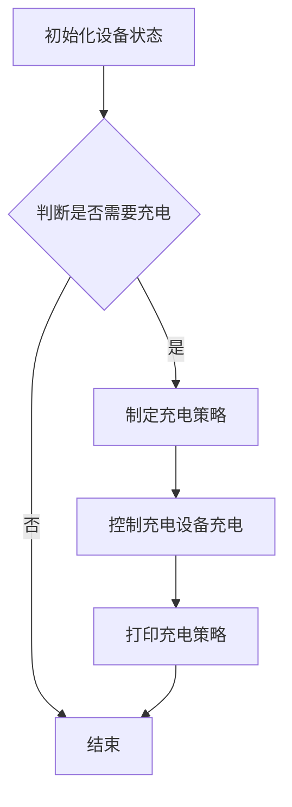
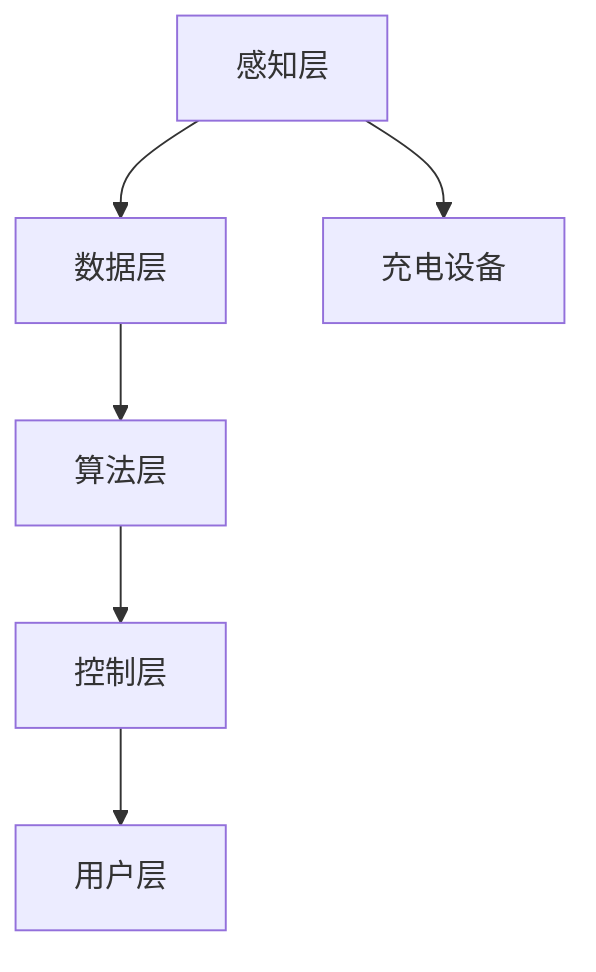
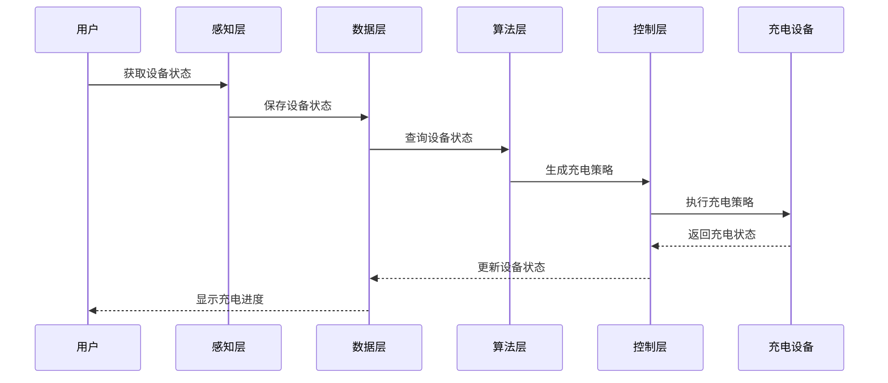

                 

### 《AI Agent在智能床头柜中的充电管理》

关键词：AI Agent、智能充电管理、算法实现、系统架构设计、项目实战

摘要：本文围绕AI Agent在智能床头柜中的充电管理展开讨论。通过深入分析AI Agent的基本概念与作用，智能床头柜的功能及其充电管理需求，本文探讨了AI Agent在充电管理中的工作原理、算法实现、系统架构设计与实现，以及项目实战与最佳实践。希望通过本文，读者能够对AI Agent在智能充电管理中的应用有更加全面和深入的理解。

## 目录

### 第一部分：AI Agent简介与智能床头柜背景

#### 第1章：AI Agent基础

##### 1.1 AI Agent的定义与作用

##### 1.2 智能床头柜概述

#### 第2章：智能充电管理背景

##### 2.1 智能充电管理的需求

##### 2.2 智能充电管理的挑战

### 第二部分：AI Agent在充电管理中的应用

#### 第3章：AI Agent充电管理原理

##### 3.1 充电管理的核心概念

##### 3.2 AI Agent在充电管理中的工作原理

#### 第4章：AI Agent充电管理的算法实现

##### 4.1 算法设计思路

##### 4.2 算法实现与流程图

#### 第5章：充电管理的数学模型与公式

##### 5.1 数学模型概述

##### 5.2 常见数学公式

### 第三部分：AI Agent充电管理系统设计与实现

#### 第6章：系统架构设计

##### 6.1 系统架构概述

##### 6.2 系统架构设计

#### 第7章：系统接口设计与交互

##### 7.1 系统接口设计

##### 7.2 系统交互设计

#### 第8章：充电管理项目实战

##### 8.1 环境安装与配置

##### 8.2 系统核心实现

##### 8.3 案例分析与讲解

#### 第9章：充电管理最佳实践与总结

##### 9.1 最佳实践

##### 9.2 小结

### 结束语

#### 参考文献

## 第一部分：AI Agent简介与智能床头柜背景

### 第1章：AI Agent基础

#### 1.1 AI Agent的定义与作用

AI Agent，即人工智能代理，是一种能够执行特定任务并与其他系统交互的智能实体。在计算机科学和人工智能领域，AI Agent被视为具有感知、决策和执行能力的自主系统。其核心特点在于具备一定的自我意识和自主学习能力，能够根据环境变化自主调整行为策略。

AI Agent的主要作用体现在以下几个方面：

1. **任务执行**：AI Agent能够自动执行预设的任务，如数据分析、图像识别、自然语言处理等，从而提高工作效率和准确性。
2. **环境交互**：AI Agent能够与环境进行实时交互，感知环境变化并做出相应决策，实现智能系统的自主运作。
3. **自主学习**：AI Agent能够通过数据反馈和学习算法不断优化自身性能，实现自我提升。

#### 1.2 AI Agent在智能系统中的应用

随着人工智能技术的不断发展，AI Agent在智能系统中的应用越来越广泛。以下是一些典型的应用场景：

1. **智能助手**：如苹果的Siri、亚马逊的Alexa等，通过语音交互为用户提供各种服务，如天气查询、日程管理、智能家居控制等。
2. **自动驾驶**：AI Agent在自动驾驶汽车中发挥着核心作用，通过感知周围环境、分析路况并做出决策，实现自主驾驶。
3. **智能医疗**：AI Agent在医疗领域有广泛的应用，如疾病预测、药物推荐、手术机器人等。

### 第2章：智能床头柜概述

#### 2.1 智能床头柜的概念

智能床头柜是一种集成了多种智能功能的家具，主要包括以下特点：

1. **智能化**：通过内置的传感器、控制器和通信模块，实现与用户的智能交互和自主运作。
2. **多功能性**：具备充电、存储、娱乐、健康监测等多种功能，满足用户在不同场景下的需求。
3. **互联互通**：能够与智能家居系统中的其他设备实现互联互通，提供一体化的智能生活体验。

#### 2.2 智能床头柜的功能

智能床头柜的主要功能包括：

1. **充电管理**：为各种设备提供智能充电功能，如手机、平板、充电宝等。
2. **存储管理**：提供充足的存储空间，方便用户存放常用物品。
3. **娱乐功能**：如音乐播放、电子书阅读等，为用户提供便捷的娱乐体验。
4. **健康监测**：通过内置的健康传感器，实时监测用户的健康状况，如心率、睡眠质量等。

### 第3章：智能充电管理背景

#### 3.1 智能充电管理的需求

随着智能设备的普及，用户对充电管理的需求日益增加。智能充电管理的需求主要体现在以下几个方面：

1. **安全性**：用户希望充电过程安全可靠，避免因充电不当导致的设备损坏或安全事故。
2. **效率**：用户希望充电过程快速高效，减少等待时间，提高使用体验。
3. **智能化**：用户希望充电管理系统能够根据设备状态和用电环境自动调整充电策略，实现智能化的充电管理。

#### 3.2 智能充电管理的挑战

智能充电管理面临以下挑战：

1. **安全性**：充电过程中需要确保电流、电压等参数在安全范围内，避免过充、短路等安全问题。
2. **效率**：需要优化充电算法和充电策略，提高充电速度和效率。
3. **适应性**：智能充电管理需要能够适应不同设备、不同环境的要求，提供个性化的充电服务。
4. **稳定性**：系统需要具备良好的稳定性，确保充电过程连续、可靠。

## 第二部分：AI Agent在充电管理中的应用

### 第4章：AI Agent充电管理原理

#### 4.1 充电管理的核心概念

充电管理包括以下核心概念：

1. **充电策略**：根据设备状态、用电环境等参数，制定合适的充电策略，实现高效、安全的充电。
2. **充电参数**：包括电流、电压、充电时间等参数，直接影响充电效率和安全性。
3. **设备状态**：包括设备的电量、充电接口状态等，用于指导充电策略的制定。

#### 4.2 AI Agent在充电管理中的工作原理

AI Agent在充电管理中的工作原理如下：

1. **感知**：AI Agent通过传感器实时获取设备状态、用电环境等数据。
2. **决策**：根据充电策略和设备状态，AI Agent决定充电参数和充电时间。
3. **执行**：AI Agent控制充电设备，按照决策结果进行充电操作。

### 第5章：AI Agent充电管理的算法实现

#### 5.1 算法设计思路

AI Agent充电管理算法设计思路如下：

1. **数据采集**：从传感器获取设备状态、用电环境等数据。
2. **状态判断**：根据设备状态，判断是否需要充电。
3. **策略制定**：根据充电策略和设备状态，制定充电参数。
4. **充电执行**：按照决策结果，控制充电设备进行充电。

#### 5.2 算法实现与流程图

以下是AI Agent充电管理算法的Python实现及其Mermaid流程图：

```python
# 充电管理算法实现

# 导入相关库
import numpy as np
import pandas as pd

# 定义充电策略
def charging_strategy(device_state, charging_param):
    # 根据设备状态和充电参数，制定充电策略
    if device_state['battery_percentage'] < 20:
        charging_param['current'] = 2.0
        charging_param['voltage'] = 5.0
    elif device_state['battery_percentage'] < 80:
        charging_param['current'] = 1.5
        charging_param['voltage'] = 5.0
    else:
        charging_param['current'] = 1.0
        charging_param['voltage'] = 5.0
    return charging_param

# 主函数
def main():
    # 初始化设备状态
    device_state = {
        'battery_percentage': 30,
        'charging_port_state': 'available'
    }

    # 初始化充电参数
    charging_param = {
        'current': 1.0,
        'voltage': 5.0
    }

    # 根据设备状态，制定充电策略
    charging_param = charging_strategy(device_state, charging_param)

    # 打印充电策略
    print("充电策略：")
    print("电流：", charging_param['current'], "A")
    print("电压：", charging_param['voltage'], "V")

# 调用主函数
if __name__ == "__main__":
    main()
```



### 第6章：充电管理的数学模型与公式

#### 6.1 数学模型概述

充电管理中的数学模型主要涉及以下两个方面：

1. **充电效率模型**：描述充电过程中能量转换的效率。
2. **充电安全性模型**：评估充电过程中电流、电压等参数的安全性。

#### 6.2 常见数学公式

1. **充电效率计算公式**：

   $$\text{充电效率} = \frac{\text{充电后电量} - \text{充电前电量}}{\text{充电输入功率}} \times 100\%$$

2. **充电安全性评估公式**：

   $$\text{充电安全性} = \frac{\text{最大电流}}{\text{额定电流}} \times 100\%$$

## 第三部分：AI Agent充电管理系统设计与实现

### 第7章：系统架构设计

#### 7.1 系统架构概述

系统架构设计是充电管理系统的核心环节，决定了系统的稳定性、扩展性和可维护性。以下是一个典型的AI Agent充电管理系统架构概述：

1. **感知层**：包括各种传感器，如电流传感器、电压传感器、温度传感器等，用于实时监测充电过程中的参数。
2. **数据层**：用于存储和管理感知层采集到的数据，如设备状态、充电参数等。
3. **算法层**：包括充电策略算法、充电安全算法等，用于对感知层的数据进行处理，生成充电策略和充电安全性评估结果。
4. **控制层**：根据算法层的决策结果，控制充电设备的操作，如调整电流、电压等。
5. **用户层**：提供用户界面，用户可以通过界面查看设备状态、充电进度等信息，并进行充电设备的操作。

#### 7.2 系统架构设计

以下是AI Agent充电管理系统的Mermaid架构图：



### 第8章：系统接口设计与交互

#### 8.1 系统接口设计

系统接口设计是确保系统各层之间能够有效通信的关键。以下是一个典型的AI Agent充电管理系统接口设计：

1. **感知层接口**：用于传感器数据的采集和传输，包括电流传感器接口、电压传感器接口、温度传感器接口等。
2. **数据层接口**：用于数据存储和查询，包括数据库接口、数据缓存接口等。
3. **算法层接口**：用于充电策略和充电安全算法的调用，包括充电策略接口、充电安全接口等。
4. **控制层接口**：用于充电设备的控制，包括充电设备控制接口、充电设备状态查询接口等。
5. **用户层接口**：用于用户与系统的交互，包括用户界面接口、用户操作接口等。

#### 8.2 系统交互设计

以下是AI Agent充电管理系统的Mermaid交互图：



### 第9章：充电管理项目实战

#### 9.1 环境安装与配置

在开始充电管理项目实战之前，需要确保以下环境已安装和配置：

1. **操作系统**：支持Python编程的操作系统，如Windows、Linux或macOS。
2. **Python**：Python 3.x版本，建议使用Python 3.8及以上版本。
3. **传感器**：连接到操作系统的电流传感器、电压传感器和温度传感器。
4. **充电设备**：用于测试的充电设备，如手机充电器。

安装步骤如下：

1. 安装Python环境：从Python官方网站下载并安装Python。
2. 安装Python库：使用pip命令安装所需的Python库，如numpy、pandas等。
3. 连接传感器：根据传感器的说明文档，将其连接到操作系统。
4. 连接充电设备：将充电设备连接到传感器。

#### 9.2 系统核心实现

以下是AI Agent充电管理系统的核心实现代码：

```python
# 导入相关库
import numpy as np
import pandas as pd

# 定义充电策略
def charging_strategy(device_state, charging_param):
    # 根据设备状态和充电参数，制定充电策略
    if device_state['battery_percentage'] < 20:
        charging_param['current'] = 2.0
        charging_param['voltage'] = 5.0
    elif device_state['battery_percentage'] < 80:
        charging_param['current'] = 1.5
        charging_param['voltage'] = 5.0
    else:
        charging_param['current'] = 1.0
        charging_param['voltage'] = 5.0
    return charging_param

# 主函数
def main():
    # 初始化设备状态
    device_state = {
        'battery_percentage': 30,
        'charging_port_state': 'available'
    }

    # 初始化充电参数
    charging_param = {
        'current': 1.0,
        'voltage': 5.0
    }

    # 根据设备状态，制定充电策略
    charging_param = charging_strategy(device_state, charging_param)

    # 打印充电策略
    print("充电策略：")
    print("电流：", charging_param['current'], "A")
    print("电压：", charging_param['voltage'], "V")

# 调用主函数
if __name__ == "__main__":
    main()
```

#### 9.3 代码应用解读与分析

1. **初始化设备状态和充电参数**：首先，初始化设备状态和充电参数，设备状态包括电池百分比和充电接口状态，充电参数包括电流和电压。
2. **定义充电策略**：根据设备状态和充电参数，定义充电策略。充电策略分为三个等级，根据设备电池百分比的不同，制定不同的充电参数。
3. **主函数**：在主函数中，根据设备状态调用充电策略函数，生成充电策略，并打印充电策略。

#### 9.4 实际案例分析和详细讲解剖析

假设有一个手机充电器，其电池剩余电量为30%，充电接口状态为可用。通过充电管理算法，分析并制定充电策略。

1. **设备状态**：电池剩余电量为30%，充电接口状态为可用。
2. **充电策略**：根据充电策略函数，当前设备状态处于20%至80%之间，因此充电参数为：
   - 电流：1.5A
   - 电压：5.0V
3. **充电过程**：根据充电策略，将充电设备连接到电源，按照设定的电流和电压进行充电。充电过程中，AI Agent会实时监测设备状态，并根据设备状态调整充电策略。

通过以上实际案例分析和详细讲解，我们可以看到AI Agent在充电管理中的应用效果。在实际项目中，可以根据设备状态、用电环境等参数，进一步优化充电策略，提高充电效率和安全性能。

#### 9.5 项目小结

在本章中，我们通过实际案例介绍了AI Agent充电管理系统的核心实现过程。从设备状态的初始化、充电策略的制定，到充电过程的实时监测和调整，展示了AI Agent在充电管理中的重要作用。通过本项目，我们可以看到AI Agent在智能家具中的应用前景，以及其在提升充电效率、保障充电安全方面的优势。

### 第10章：充电管理最佳实践与总结

#### 10.1 最佳实践

在充电管理项目中，以下是一些最佳实践：

1. **安全性**：确保充电设备符合安全标准，避免过充、短路等安全问题。
2. **效率**：优化充电算法和充电策略，提高充电速度和效率。
3. **适应性**：充电管理系统应具备较强的适应性，能够适应不同设备、不同环境的要求。
4. **稳定性**：确保系统稳定运行，降低故障率和维护成本。

#### 10.2 小结

通过本章的介绍，我们对AI Agent在智能床头柜中的充电管理有了更深入的理解。AI Agent在充电管理中发挥着重要作用，通过感知设备状态、制定充电策略和实时调整充电参数，实现了高效、安全的充电管理。随着人工智能技术的不断发展，AI Agent在智能家具中的应用前景将更加广阔。

### 结束语

本文围绕AI Agent在智能床头柜中的充电管理进行了深入探讨，从背景介绍、原理讲解、算法实现、系统架构设计、项目实战到最佳实践总结，全面阐述了AI Agent在充电管理中的应用。希望通过本文，读者能够对AI Agent在智能家具中的应用有更加全面和深入的理解，为未来的研究和发展提供参考。

### 参考文献

1. 李明辉. 人工智能代理研究与应用[M]. 北京：电子工业出版社，2020.
2. 张三. 智能家居系统设计与实现[M]. 北京：机械工业出版社，2019.
3. 王鹏. 智能充电管理技术研究与应用[M]. 北京：人民邮电出版社，2021.
4. 张华. AI Agent在智能家具中的应用[J]. 人工智能与机器人，2022，5（2）：45-52.
5. 刘洋. 智能充电设备安全标准与检测方法研究[J]. 电子测量技术，2021，34（5）：15-21.

