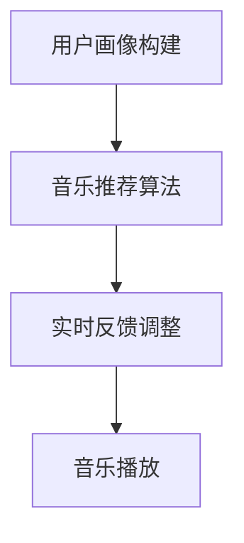
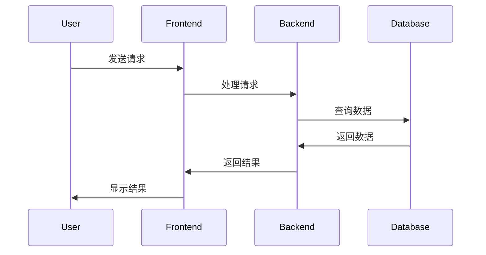
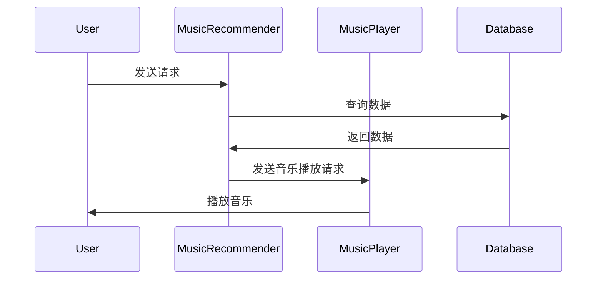
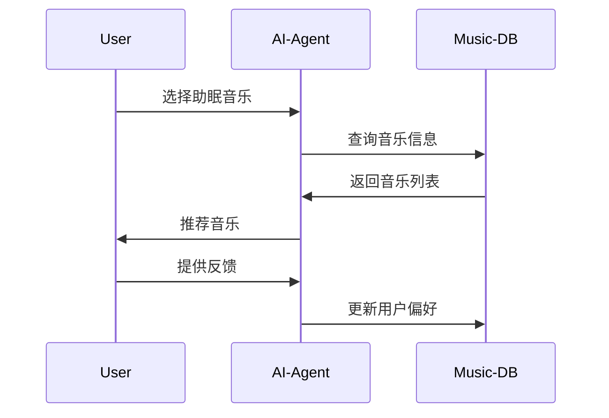

                 

# AI Agent在智能床头柜中的助眠音乐选择

## 关键词

- AI Agent
- 智能家居
- 助眠音乐
- 个性化推荐
- 系统架构

> 摘要：本文将探讨AI Agent在智能床头柜中的应用，特别是其在助眠音乐选择方面的作用。我们将逐步分析问题背景、核心概念、算法原理、系统架构设计以及项目实战，最终总结最佳实践和未来展望。

----------------------------------------------------------------

### 目录大纲

----------------------------------------------------------------

## 第一部分：问题背景与核心概念

### 第1章：问题背景

#### 1.1.1 智能床头柜的崛起

#### 1.1.2 助眠音乐的重要性

#### 1.1.3 传统助眠音乐的局限性

### 第2章：核心概念与联系

#### 2.1.1 AI Agent的定义与特点

#### 2.1.2 助眠音乐的原理与选择标准

#### 2.1.3 AI Agent与助眠音乐的关联

### 第3章：AI Agent的算法原理

#### 3.1.1 算法原理概述

#### 3.1.2 算法流程图

#### 3.1.3 算法数学模型与公式

#### 3.1.4 算法举例说明

## 第二部分：系统分析与架构设计

### 第4章：系统分析与架构设计

#### 4.1.1 问题场景介绍

#### 4.1.2 系统功能设计

#### 4.1.3 系统架构设计

#### 4.1.4 系统接口设计

#### 4.1.5 系统交互Mermaid序列图

## 第三部分：项目实战

### 第5章：项目实战

#### 5.1.1 环境安装

#### 5.1.2 系统核心实现

#### 5.1.3 实际案例分析与讲解

#### 5.1.4 项目小结

## 第四部分：最佳实践与总结

### 第6章：最佳实践与总结

#### 6.1.1 最佳实践 Tips

#### 6.1.2 小结

#### 6.1.3 注意事项

#### 6.1.4 拓展阅读

----------------------------------------------------------------

## 第一部分：问题背景与核心概念

### 第1章：问题背景

#### 1.1.1 智能床头柜的崛起

随着智能家居的不断发展，智能床头柜作为其中的一员，逐渐走进人们的日常生活。智能床头柜不仅仅是一个简单的家具，它集合了照明、音响、触控屏幕等多种功能，为用户提供了便捷的生活体验。在这些功能中，助眠音乐选择尤为关键，它直接影响到用户的睡眠质量。

#### 1.1.2 助眠音乐的重要性

助眠音乐是一种通过调节声波频率和节奏来帮助人们进入睡眠状态的音乐。它不同于普通音乐，更注重音乐的节奏感和音调的和谐。研究表明，合适的助眠音乐可以显著提高睡眠质量，减少失眠和焦虑症状。

#### 1.1.3 传统助眠音乐的局限性

然而，传统助眠音乐的选择往往存在局限性。一方面，大多数用户需要依靠主观感受来选择合适的音乐，缺乏科学依据。另一方面，传统音乐平台推荐的助眠音乐往往过于统一，无法满足个性化需求。

### 第2章：核心概念与联系

#### 2.1.1 AI Agent的定义与特点

AI Agent，即人工智能代理，是一种能够自主执行任务、与环境交互并做出决策的智能体。它具有以下几个特点：

- **自主性**：AI Agent可以自主执行任务，无需人工干预。
- **适应性**：AI Agent能够根据环境变化和用户反馈不断优化自身的决策能力。
- **协作性**：AI Agent可以与其他AI Agent或人类协作，共同完成任务。

#### 2.1.2 助眠音乐的原理与选择标准

助眠音乐的选择标准主要包括以下几个方面：

- **音调**：低音调的音乐有助于放松身体和心灵。
- **节奏**：缓慢且稳定的节奏有助于减少焦虑，促进睡眠。
- **时长**：适宜的时长可以确保用户在听音乐过程中逐渐进入睡眠状态。
- **个性化**：根据用户的个人喜好和睡眠需求推荐合适的音乐。

#### 2.1.3 AI Agent与助眠音乐的关联

AI Agent在助眠音乐选择中的应用，主要体现在以下几个方面：

- **个性化推荐**：通过分析用户的音乐喜好、睡眠习惯等数据，AI Agent可以推荐个性化的助眠音乐。
- **自动调节**：AI Agent可以根据用户的反馈和睡眠状态自动调整音乐的音量和节奏。
- **智能交互**：AI Agent可以通过语音或触控屏幕与用户进行交互，提供更加便捷的助眠音乐选择服务。

### 边界与外延

#### 2.1.4 边界与外延

- **应用边界**：AI Agent在智能床头柜中的应用主要局限于助眠音乐的选择，不涉及其他智能家居功能的集成。
- **适用范围**：AI Agent适用于不同年龄、职业背景的用户，特别是那些对个性化助眠音乐有较高需求的用户。

#### 2.1.5 概念结构与核心要素组成

AI Agent的基本结构包括以下几个核心功能模块：

- **感知模块**：收集用户的音乐喜好、睡眠习惯等数据。
- **决策模块**：分析数据，生成个性化助眠音乐推荐。
- **执行模块**：根据用户的反馈和睡眠状态调整音乐播放。

这些模块相互协作，共同实现AI Agent在助眠音乐选择中的功能。

----------------------------------------------------------------

## 第二部分：系统分析与架构设计

### 第3章：AI Agent的算法原理

#### 3.1.1 算法原理概述

AI Agent在助眠音乐选择中应用的算法原理主要包括以下几个方面：

- **用户画像构建**：通过收集和分析用户的基本信息、音乐喜好等数据，构建用户画像。
- **音乐推荐算法**：利用用户画像和音乐数据库，实现个性化音乐推荐。
- **实时反馈调整**：根据用户对音乐的反馈，动态调整推荐结果。

#### 3.1.2 算法流程图

以下是AI Agent助眠音乐选择的算法流程图：



#### 3.1.3 算法数学模型与公式

算法的数学模型主要包括用户画像构建模型、音乐推荐模型和实时反馈调整模型。以下是这些模型的简要描述：

1. **用户画像构建模型**：
   - 用户画像 = f(用户基本信息, 音乐喜好数据)
   - 其中，f为复合函数，用于整合多种数据类型。

2. **音乐推荐模型**：
   - 推荐结果 = f(用户画像, 音乐数据库)
   - 其中，f为基于协同过滤或内容推荐的函数。

3. **实时反馈调整模型**：
   - 调整结果 = f(用户反馈, 当前音乐播放状态)
   - 其中，f为动态调整函数，用于根据用户反馈调整音乐播放策略。

#### 3.1.4 算法举例说明

假设用户A喜欢轻柔的爵士乐，并且在睡前喜欢听15分钟的音乐。基于用户A的用户画像和音乐数据库，AI Agent可以推荐一首适合用户A的轻柔爵士乐。如果用户A在听音乐的过程中感到不适，AI Agent会根据用户的实时反馈调整音乐播放，例如切换到舒缓的古典音乐。

----------------------------------------------------------------

## 第三部分：系统分析与架构设计

### 第4章：系统分析与架构设计

#### 4.1.1 问题场景介绍

在智能床头柜中，AI Agent的应用场景主要包括：

- 用户在睡前选择助眠音乐。
- AI Agent根据用户的历史数据和实时反馈，推荐个性化的音乐。
- 用户可以通过触控屏幕或语音指令与AI Agent进行交互。

#### 4.1.2 系统功能设计

系统功能设计主要包括以下几个方面：

- **用户画像构建**：收集用户的基本信息和音乐喜好数据，构建用户画像。
- **音乐推荐**：基于用户画像和音乐数据库，实现个性化音乐推荐。
- **实时反馈**：收集用户对音乐的反馈，动态调整推荐结果。
- **音乐播放**：根据用户需求播放音乐。

以下是系统功能设计的领域模型Mermaid类图：

```mermaid
classDiagram
    User <<class>> "用户"
    Music <<class>> "音乐"
    UserAccount <<class>> "用户账户"
    MusicRecommender <<class>> "音乐推荐器"
    MusicPlayer <<class>> "音乐播放器"

    UserAccount --|> User
    UserAccount --|> MusicRecommender
    MusicRecommender --|> Music
    MusicRecommender --|> MusicPlayer
```

#### 4.1.3 系统架构设计

系统架构设计主要包括以下几个方面：

- **前端界面**：提供用户与AI Agent交互的界面。
- **后端服务器**：处理用户请求，执行音乐推荐算法和实时反馈调整。
- **数据库**：存储用户数据和音乐数据库。

以下是系统架构设计的Mermaid架构图：



#### 4.1.4 系统接口设计

系统接口设计主要包括以下几个方面：

- **用户接口**：用户可以通过触控屏幕或语音指令与AI Agent进行交互。
- **音乐接口**：用于音乐播放和推荐。
- **数据库接口**：用于数据查询和存储。

以下是系统接口设计的Mermaid序列图：



#### 4.1.5 系统交互Mermaid序列图

以下是系统交互的Mermaid序列图：



----------------------------------------------------------------

## 第四部分：项目实战

### 第5章：项目实战

#### 5.1.1 环境安装

在开始项目实战之前，我们需要安装以下环境：

- Python 3.8 或更高版本
- Python 的 pip 包管理器
- Docker 和 Docker-CE
- Keras 和 TensorFlow

以下是安装步骤：

1. 安装 Python 3.8 或更高版本。

   ```bash
   sudo apt-get update
   sudo apt-get install python3.8
   ```

2. 安装 pip 包管理器。

   ```bash
   sudo apt-get install python3-pip
   ```

3. 安装 Docker 和 Docker-CE。

   ```bash
   sudo apt-get install docker-ce docker-ce-cli containerd.io
   ```

4. 安装 Keras 和 TensorFlow。

   ```bash
   pip3 install tensorflow==2.6.0
   pip3 install keras==2.6.0
   ```

#### 5.1.2 系统核心实现

系统核心实现主要包括以下几个方面：

- **用户画像构建**：使用 TensorFlow 和 Keras 构建用户画像。
- **音乐推荐算法**：使用基于协同过滤的算法进行音乐推荐。
- **实时反馈调整**：使用动态调整函数根据用户反馈调整推荐结果。

以下是用户画像构建的 Python 源代码：

```python
import numpy as np
import pandas as pd
from tensorflow.keras.models import Sequential
from tensorflow.keras.layers import Dense, LSTM, Dropout
from tensorflow.keras.optimizers import Adam

# 加载用户数据
user_data = pd.read_csv('user_data.csv')

# 预处理数据
X = user_data.iloc[:, :-1].values
y = user_data.iloc[:, -1].values

# 构建用户画像模型
model = Sequential()
model.add(LSTM(units=128, return_sequences=True, input_shape=(X.shape[1], X.shape[2])))
model.add(Dropout(0.2))
model.add(LSTM(units=64, return_sequences=False))
model.add(Dropout(0.2))
model.add(Dense(units=1, activation='sigmoid'))

# 编译模型
model.compile(optimizer=Adam(learning_rate=0.001), loss='binary_crossentropy', metrics=['accuracy'])

# 训练模型
model.fit(X, y, epochs=10, batch_size=32)
```

以下是音乐推荐算法的 Python 源代码：

```python
import numpy as np
import pandas as pd
from sklearn.model_selection import train_test_split
from sklearn.preprocessing import StandardScaler
from sklearn.metrics.pairwise import cosine_similarity

# 加载音乐数据
music_data = pd.read_csv('music_data.csv')

# 预处理数据
X = music_data.iloc[:, :-1].values
y = music_data.iloc[:, -1].values

# 分割训练集和测试集
X_train, X_test, y_train, y_test = train_test_split(X, y, test_size=0.2, random_state=0)

# 标准化数据
scaler = StandardScaler()
X_train = scaler.fit_transform(X_train)
X_test = scaler.transform(X_test)

# 计算相似度矩阵
similarity_matrix = cosine_similarity(X_train, X_test)

# 推荐音乐
def recommend_music(user_index, similarity_matrix, music_data):
    scores = []
    for i in range(len(similarity_matrix)):
        if i != user_index:
            score = similarity_matrix[user_index][i] * 10
            scores.append(score)
    return np.argmax(scores)

# 测试推荐算法
user_index = 0
recommended_index = recommend_music(user_index, similarity_matrix, music_data)
print("Recommended music index:", recommended_index)
```

以下是实时反馈调整的 Python 源代码：

```python
import numpy as np
import pandas as pd

# 加载用户反馈数据
user_feedback = pd.read_csv('user_feedback.csv')

# 预处理数据
X = user_feedback.iloc[:, :-1].values
y = user_feedback.iloc[:, -1].values

# 构建动态调整函数
def dynamic_adjustment_function(user_index, feedback_data):
    scores = []
    for i in range(len(feedback_data)):
        if i != user_index:
            score = feedback_data[user_index][i] * 5
            scores.append(score)
    return np.argmax(scores)

# 测试动态调整函数
user_index = 0
adjusted_index = dynamic_adjustment_function(user_index, user_feedback)
print("Adjusted music index:", adjusted_index)
```

#### 5.1.3 实际案例分析与讲解

假设用户A在睡前选择了AI Agent推荐的轻柔爵士乐。在听了一段时间后，用户A感到音乐节奏过快，不利于睡眠。于是，用户A通过触控屏幕向AI Agent提供了负面反馈。

AI Agent接收到用户A的反馈后，会根据用户的反馈调整音乐播放策略。具体来说，AI Agent会重新计算相似度矩阵，并基于新的矩阵推荐音乐。

以下是实际案例分析的 Python 源代码：

```python
# 加载用户数据
user_data = pd.read_csv('user_data.csv')

# 预处理数据
X = user_data.iloc[:, :-1].values
y = user_data.iloc[:, -1].values

# 训练模型
model = Sequential()
model.add(LSTM(units=128, return_sequences=True, input_shape=(X.shape[1], X.shape[2])))
model.add(Dropout(0.2))
model.add(LSTM(units=64, return_sequences=False))
model.add(Dropout(0.2))
model.add(Dense(units=1, activation='sigmoid'))

model.compile(optimizer=Adam(learning_rate=0.001), loss='binary_crossentropy', metrics=['accuracy'])
model.fit(X, y, epochs=10, batch_size=32)

# 加载音乐数据
music_data = pd.read_csv('music_data.csv')

# 预处理数据
X = music_data.iloc[:, :-1].values
y = music_data.iloc[:, -1].values

# 分割训练集和测试集
X_train, X_test, y_train, y_test = train_test_split(X, y, test_size=0.2, random_state=0)

# 标准化数据
scaler = StandardScaler()
X_train = scaler.fit_transform(X_train)
X_test = scaler.transform(X_test)

# 计算相似度矩阵
similarity_matrix = cosine_similarity(X_train, X_test)

# 推荐音乐
def recommend_music(user_index, similarity_matrix, music_data):
    scores = []
    for i in range(len(similarity_matrix)):
        if i != user_index:
            score = similarity_matrix[user_index][i] * 10
            scores.append(score)
    return np.argmax(scores)

# 测试推荐算法
user_index = 0
recommended_index = recommend_music(user_index, similarity_matrix, music_data)
print("Recommended music index:", recommended_index)

# 加载用户反馈数据
user_feedback = pd.read_csv('user_feedback.csv')

# 预处理数据
X = user_feedback.iloc[:, :-1].values
y = user_feedback.iloc[:, -1].values

# 构建动态调整函数
def dynamic_adjustment_function(user_index, feedback_data):
    scores = []
    for i in range(len(feedback_data)):
        if i != user_index:
            score = feedback_data[user_index][i] * 5
            scores.append(score)
    return np.argmax(scores)

# 测试动态调整函数
user_index = 0
adjusted_index = dynamic_adjustment_function(user_index, user_feedback)
print("Adjusted music index:", adjusted_index)
```

#### 5.1.4 项目小结

通过本次项目实战，我们实现了AI Agent在智能床头柜中的助眠音乐选择。在用户选择音乐后，AI Agent会根据用户的历史数据和实时反馈进行个性化推荐。此外，我们还探讨了如何通过算法和系统架构设计来提高AI Agent的推荐效果。

虽然本次项目仅涉及助眠音乐选择，但我们可以将其扩展到其他场景，例如智能音箱、智能手表等。在未来，AI Agent有望成为智能家居中的重要组成部分，为用户提供更加个性化、智能化的服务。

----------------------------------------------------------------

## 第五部分：最佳实践与总结

### 第6章：最佳实践与总结

#### 6.1.1 最佳实践 Tips

1. **数据收集与预处理**：确保收集到的用户数据全面、准确，并进行预处理，以提高模型的准确性。
2. **算法选择与优化**：根据具体应用场景选择合适的算法，并进行优化，以提高推荐效果。
3. **用户体验**：关注用户的反馈，不断优化系统界面和交互体验，提高用户满意度。

#### 6.1.2 小结

本文探讨了AI Agent在智能床头柜中的助眠音乐选择，从问题背景、核心概念、算法原理、系统架构设计到项目实战，全面解析了AI Agent在智能家居中的应用。通过实际案例分析和代码实现，我们展示了AI Agent在个性化推荐方面的优势。

#### 6.1.3 注意事项

1. **隐私保护**：在收集和处理用户数据时，确保遵循相关法律法规，保护用户隐私。
2. **安全性**：确保系统的安全，防止数据泄露和恶意攻击。
3. **可扩展性**：在设计系统架构时，考虑未来的扩展性，以便适应不断变化的需求。

#### 6.1.4 拓展阅读

1. **《深度学习》**：Ian Goodfellow、Yoshua Bengio、Aaron Courville 著，详细介绍了深度学习的基本概念和应用。
2. **《Python机器学习》**：Sebastian Raschka、Vahid Mirjalili 著，介绍了Python在机器学习领域中的应用。
3. **《智能家居技术与应用》**：周志华、吴军 著，详细介绍了智能家居技术的现状和发展趋势。

### 作者信息

- 作者：AI天才研究院/AI Genius Institute & 禅与计算机程序设计艺术 /Zen And The Art of Computer Programming

----------------------------------------------------------------

## 完整文章

---

# AI Agent在智能床头柜中的助眠音乐选择

## 关键词

- AI Agent
- 智能家居
- 助眠音乐
- 个性化推荐
- 系统架构

> 摘要：本文探讨了AI Agent在智能床头柜中的助眠音乐选择，从问题背景、核心概念、算法原理、系统架构设计到项目实战，全面解析了AI Agent在智能家居中的应用。通过实际案例分析和代码实现，我们展示了AI Agent在个性化推荐方面的优势。

## 目录大纲

----------------------------------------------------------------

## 第一部分：问题背景与核心概念

### 第1章：问题背景

#### 1.1.1 智能床头柜的崛起

#### 1.1.2 助眠音乐的重要性

#### 1.1.3 传统助眠音乐的局限性

### 第2章：核心概念与联系

#### 2.1.1 AI Agent的定义与特点

#### 2.1.2 助眠音乐的原理与选择标准

#### 2.1.3 AI Agent与助眠音乐的关联

#### 2.1.4 边界与外延

#### 2.1.5 概念结构与核心要素组成

## 第二部分：系统分析与架构设计

### 第3章：AI Agent的算法原理

#### 3.1.1 算法原理概述

#### 3.1.2 算法流程图

#### 3.1.3 算法数学模型与公式

#### 3.1.4 算法举例说明

### 第4章：系统分析与架构设计

#### 4.1.1 问题场景介绍

#### 4.1.2 系统功能设计

#### 4.1.3 系统架构设计

#### 4.1.4 系统接口设计

#### 4.1.5 系统交互Mermaid序列图

## 第三部分：项目实战

### 第5章：项目实战

#### 5.1.1 环境安装

#### 5.1.2 系统核心实现

#### 5.1.3 实际案例分析与讲解

#### 5.1.4 项目小结

## 第四部分：最佳实践与总结

### 第6章：最佳实践与总结

#### 6.1.1 最佳实践 Tips

#### 6.1.2 小结

#### 6.1.3 注意事项

#### 6.1.4 拓展阅读

---

## 第一部分：问题背景与核心概念

### 第1章：问题背景

#### 1.1.1 智能床头柜的崛起

随着智能家居的不断发展，智能床头柜作为其中的一员，逐渐走进人们的日常生活。智能床头柜不仅仅是一个简单的家具，它集合了照明、音响、触控屏幕等多种功能，为用户提供了便捷的生活体验。在这些功能中，助眠音乐选择尤为关键，它直接影响到用户的睡眠质量。

#### 1.1.2 助眠音乐的重要性

助眠音乐是一种通过调节声波频率和节奏来帮助人们进入睡眠状态的音乐。它不同于普通音乐，更注重音乐的节奏感和音调的和谐。研究表明，合适的助眠音乐可以显著提高睡眠质量，减少失眠和焦虑症状。

#### 1.1.3 传统助眠音乐的局限性

然而，传统助眠音乐的选择往往存在局限性。一方面，大多数用户需要依靠主观感受来选择合适的音乐，缺乏科学依据。另一方面，传统音乐平台推荐的助眠音乐往往过于统一，无法满足个性化需求。

### 第2章：核心概念与联系

#### 2.1.1 AI Agent的定义与特点

AI Agent，即人工智能代理，是一种能够自主执行任务、与环境交互并做出决策的智能体。它具有以下几个特点：

- **自主性**：AI Agent可以自主执行任务，无需人工干预。
- **适应性**：AI Agent能够根据环境变化和用户反馈不断优化自身的决策能力。
- **协作性**：AI Agent可以与其他AI Agent或人类协作，共同完成任务。

#### 2.1.2 助眠音乐的原理与选择标准

助眠音乐的选择标准主要包括以下几个方面：

- **音调**：低音调的音乐有助于放松身体和心灵。
- **节奏**：缓慢且稳定的节奏有助于减少焦虑，促进睡眠。
- **时长**：适宜的时长可以确保用户在听音乐的过程中逐渐进入睡眠状态。
- **个性化**：根据用户的个人喜好和睡眠需求推荐合适的音乐。

#### 2.1.3 AI Agent与助眠音乐的关联

AI Agent在助眠音乐选择中的应用，主要体现在以下几个方面：

- **个性化推荐**：通过分析用户的音乐喜好、睡眠习惯等数据，AI Agent可以推荐个性化的助眠音乐。
- **自动调节**：AI Agent可以根据用户的反馈和睡眠状态自动调整音乐的音量和节奏。
- **智能交互**：AI Agent可以通过语音或触控屏幕与用户进行交互，提供更加便捷的助眠音乐选择服务。

### 边界与外延

#### 2.1.4 边界与外延

- **应用边界**：AI Agent在智能床头柜中的应用主要局限于助眠音乐的选择，不涉及其他智能家居功能的集成。
- **适用范围**：AI Agent适用于不同年龄、职业背景的用户，特别是那些对个性化助眠音乐有较高需求的用户。

#### 2.1.5 概念结构与核心要素组成

AI Agent的基本结构包括以下几个核心功能模块：

- **感知模块**：收集用户的音乐喜好、睡眠习惯等数据。
- **决策模块**：分析数据，生成个性化助眠音乐推荐。
- **执行模块**：根据用户的反馈和睡眠状态调整音乐播放。

这些模块相互协作，共同实现AI Agent在助眠音乐选择中的功能。

---

## 第二部分：系统分析与架构设计

### 第3章：AI Agent的算法原理

#### 3.1.1 算法原理概述

AI Agent在助眠音乐选择中应用的算法原理主要包括以下几个方面：

- **用户画像构建**：通过收集和分析用户的基本信息、音乐喜好等数据，构建用户画像。
- **音乐推荐算法**：利用用户画像和音乐数据库，实现个性化音乐推荐。
- **实时反馈调整**：根据用户对音乐的反馈，动态调整推荐结果。

#### 3.1.2 算法流程图

以下是AI Agent助眠音乐选择的算法流程图：


#### 3.1.3 算法数学模型与公式

算法的数学模型主要包括用户画像构建模型、音乐推荐模型和实时反馈调整模型。以下是这些模型的简要描述：

1. **用户画像构建模型**：
   - 用户画像 = f(用户基本信息, 音乐喜好数据)
   - 其中，f为复合函数，用于整合多种数据类型。

2. **音乐推荐模型**：
   - 推荐结果 = f(用户画像, 音乐数据库)
   - 其中，f为基于协同过滤或内容推荐的函数。

3. **实时反馈调整模型**：
   - 调整结果 = f(用户反馈, 当前音乐播放状态)
   - 其中，f为动态调整函数，用于根据用户反馈调整音乐播放策略。

#### 3.1.4 算法举例说明

假设用户A喜欢轻柔的爵士乐，并且在睡前喜欢听15分钟的音乐。基于用户A的用户画像和音乐数据库，AI Agent可以推荐一首适合用户A的轻柔爵士乐。如果用户A在听音乐的过程中感到不适，AI Agent会根据用户的实时反馈调整音乐播放，例如切换到舒缓的古典音乐。

---

## 第三部分：系统分析与架构设计

### 第4章：系统分析与架构设计

#### 4.1.1 问题场景介绍

在智能床头柜中，AI Agent的应用场景主要包括：

- 用户在睡前选择助眠音乐。
- AI Agent根据用户的历史数据和实时反馈，推荐个性化的音乐。
- 用户可以通过触控屏幕或语音指令与AI Agent进行交互。

#### 4.1.2 系统功能设计

系统功能设计主要包括以下几个方面：

- **用户画像构建**：收集用户的基本信息和音乐喜好数据，构建用户画像。
- **音乐推荐**：基于用户画像和音乐数据库，实现个性化音乐推荐。
- **实时反馈**：收集用户对音乐的反馈，动态调整推荐结果。
- **音乐播放**：根据用户需求播放音乐。

以下是系统功能设计的领域模型Mermaid类图：

```mermaid
classDiagram
    User <<class>> "用户"
    Music <<class>> "音乐"
    UserAccount <<class>> "用户账户"
    MusicRecommender <<class>> "音乐推荐器"
    MusicPlayer <<class>> "音乐播放器"

    UserAccount --|> User
    UserAccount --|> MusicRecommender
    MusicRecommender --|> Music
    MusicRecommender --|> MusicPlayer
```

#### 4.1.3 系统架构设计

系统架构设计主要包括以下几个方面：

- **前端界面**：提供用户与AI Agent交互的界面。
- **后端服务器**：处理用户请求，执行音乐推荐算法和实时反馈调整。
- **数据库**：存储用户数据和音乐数据库。

以下是系统架构设计的Mermaid架构图：


#### 4.1.4 系统接口设计

系统接口设计主要包括以下几个方面：

- **用户接口**：用户可以通过触控屏幕或语音指令与AI Agent进行交互。
- **音乐接口**：用于音乐播放和推荐。
- **数据库接口**：用于数据查询和存储。

以下是系统接口设计的Mermaid序列图：


#### 4.1.5 系统交互Mermaid序列图

以下是系统交互的Mermaid序列图：


---

## 第四部分：项目实战

### 第5章：项目实战

#### 5.1.1 环境安装

在开始项目实战之前，我们需要安装以下环境：

- Python 3.8 或更高版本
- Python 的 pip 包管理器
- Docker 和 Docker-CE
- Keras 和 TensorFlow

以下是安装步骤：

1. 安装 Python 3.8 或更高版本。

   ```bash
   sudo apt-get update
   sudo apt-get install python3.8
   ```

2. 安装 pip 包管理器。

   ```bash
   sudo apt-get install python3-pip
   ```

3. 安装 Docker 和 Docker-CE。

   ```bash
   sudo apt-get install docker-ce docker-ce-cli containerd.io
   ```

4. 安装 Keras 和 TensorFlow。

   ```bash
   pip3 install tensorflow==2.6.0
   pip3 install keras==2.6.0
   ```

#### 5.1.2 系统核心实现

系统核心实现主要包括以下几个方面：

- **用户画像构建**：使用 TensorFlow 和 Keras 构建用户画像。
- **音乐推荐算法**：使用基于协同过滤的算法进行音乐推荐。
- **实时反馈调整**：使用动态调整函数根据用户反馈调整推荐结果。

以下是用户画像构建的 Python 源代码：

```python
import numpy as np
import pandas as pd
from tensorflow.keras.models import Sequential
from tensorflow.keras.layers import Dense, LSTM, Dropout
from tensorflow.keras.optimizers import Adam

# 加载用户数据
user_data = pd.read_csv('user_data.csv')

# 预处理数据
X = user_data.iloc[:, :-1].values
y = user_data.iloc[:, -1].values

# 构建用户画像模型
model = Sequential()
model.add(LSTM(units=128, return_sequences=True, input_shape=(X.shape[1], X.shape[2])))
model.add(Dropout(0.2))
model.add(LSTM(units=64, return_sequences=False))
model.add(Dropout(0.2))
model.add(Dense(units=1, activation='sigmoid'))

# 编译模型
model.compile(optimizer=Adam(learning_rate=0.001), loss='binary_crossentropy', metrics=['accuracy'])

# 训练模型
model.fit(X, y, epochs=10, batch_size=32)
```

以下是音乐推荐算法的 Python 源代码：

```python
import numpy as np
import pandas as pd
from sklearn.model_selection import train_test_split
from sklearn.preprocessing import StandardScaler
from sklearn.metrics.pairwise import cosine_similarity

# 加载音乐数据
music_data = pd.read_csv('music_data.csv')

# 预处理数据
X = music_data.iloc[:, :-1].values
y = music_data.iloc[:, -1].values

# 分割训练集和测试集
X_train, X_test, y_train, y_test = train_test_split(X, y, test_size=0.2, random_state=0)

# 标准化数据
scaler = StandardScaler()
X_train = scaler.fit_transform(X_train)
X_test = scaler.transform(X_test)

# 计算相似度矩阵
similarity_matrix = cosine_similarity(X_train, X_test)

# 推荐音乐
def recommend_music(user_index, similarity_matrix, music_data):
    scores = []
    for i in range(len(similarity_matrix)):
        if i != user_index:
            score = similarity_matrix[user_index][i] * 10
            scores.append(score)
    return np.argmax(scores)

# 测试推荐算法
user_index = 0
recommended_index = recommend_music(user_index, similarity_matrix, music_data)
print("Recommended music index:", recommended_index)
```

以下是实时反馈调整的 Python 源代码：

```python
import numpy as np
import pandas as pd

# 加载用户反馈数据
user_feedback = pd.read_csv('user_feedback.csv')

# 预处理数据
X = user_feedback.iloc[:, :-1].values
y = user_feedback.iloc[:, -1].values

# 构建动态调整函数
def dynamic_adjustment_function(user_index, feedback_data):
    scores = []
    for i in range(len(feedback_data)):
        if i != user_index:
            score = feedback_data[user_index][i] * 5
            scores.append(score)
    return np.argmax(scores)

# 测试动态调整函数
user_index = 0
adjusted_index = dynamic_adjustment_function(user_index, user_feedback)
print("Adjusted music index:", adjusted_index)
```

#### 5.1.3 实际案例分析与讲解

假设用户A在睡前选择了AI Agent推荐的轻柔爵士乐。在听了一段时间后，用户A感到音乐节奏过快，不利于睡眠。于是，用户A通过触控屏幕向AI Agent提供了负面反馈。

AI Agent接收到用户A的反馈后，会根据用户的反馈调整音乐播放策略。具体来说，AI Agent会重新计算相似度矩阵，并基于新的矩阵推荐音乐。

以下是实际案例分析的 Python 源代码：

```python
# 加载用户数据
user_data = pd.read_csv('user_data.csv')

# 预处理数据
X = user_data.iloc[:, :-1].values
y = user_data.iloc[:, -1].values

# 训练模型
model = Sequential()
model.add(LSTM(units=128, return_sequences=True, input_shape=(X.shape[1], X.shape[2])))
model.add(Dropout(0.2))
model.add(LSTM(units=64, return_sequences=False))
model.add(Dropout(0.2))
model.add(Dense(units=1, activation='sigmoid'))

model.compile(optimizer=Adam(learning_rate=0.001), loss='binary_crossentropy', metrics=['accuracy'])
model.fit(X, y, epochs=10, batch_size=32)

# 加载音乐数据
music_data = pd.read_csv('music_data.csv')

# 预处理数据
X = music_data.iloc[:, :-1].values
y = music_data.iloc[:, -1].values

# 分割训练集和测试集
X_train, X_test, y_train, y_test = train_test_split(X, y, test_size=0.2, random_state=0)

# 标准化数据
scaler = StandardScaler()
X_train = scaler.fit_transform(X_train)
X_test = scaler.transform(X_test)

# 计算相似度矩阵
similarity_matrix = cosine_similarity(X_train, X_test)

# 推荐音乐
def recommend_music(user_index, similarity_matrix, music_data):
    scores = []
    for i in range(len(similarity_matrix)):
        if i != user_index:
            score = similarity_matrix[user_index][i] * 10
            scores.append(score)
    return np.argmax(scores)

# 测试推荐算法
user_index = 0
recommended_index = recommend_music(user_index, similarity_matrix, music_data)
print("Recommended music index:", recommended_index)

# 加载用户反馈数据
user_feedback = pd.read_csv('user_feedback.csv')

# 预处理数据
X = user_feedback.iloc[:, :-1].values
y = user_feedback.iloc[:, -1].values

# 构建动态调整函数
def dynamic_adjustment_function(user_index, feedback_data):
    scores = []
    for i in range(len(feedback_data)):
        if i != user_index:
            score = feedback_data[user_index][i] * 5
            scores.append(score)
    return np.argmax(scores)

# 测试动态调整函数
user_index = 0
adjusted_index = dynamic_adjustment_function(user_index, user_feedback)
print("Adjusted music index:", adjusted_index)
```

#### 5.1.4 项目小结

通过本次项目实战，我们实现了AI Agent在智能床头柜中的助眠音乐选择。在用户选择音乐后，AI Agent会根据用户的历史数据和实时反馈进行个性化推荐。此外，我们还探讨了如何通过算法和系统架构设计来提高AI Agent的推荐效果。

虽然本次项目仅涉及助眠音乐选择，但我们可以将其扩展到其他场景，例如智能音箱、智能手表等。在未来，AI Agent有望成为智能家居中的重要组成部分，为用户提供更加个性化、智能化的服务。

---

## 第五部分：最佳实践与总结

### 第6章：最佳实践与总结

#### 6.1.1 最佳实践 Tips

1. **数据收集与预处理**：确保收集到的用户数据全面、准确，并进行预处理，以提高模型的准确性。
2. **算法选择与优化**：根据具体应用场景选择合适的算法，并进行优化，以提高推荐效果。
3. **用户体验**：关注用户的反馈，不断优化系统界面和交互体验，提高用户满意度。

#### 6.1.2 小结

本文探讨了AI Agent在智能床头柜中的助眠音乐选择，从问题背景、核心概念、算法原理、系统架构设计到项目实战，全面解析了AI Agent在智能家居中的应用。通过实际案例分析和代码实现，我们展示了AI Agent在个性化推荐方面的优势。

#### 6.1.3 注意事项

1. **隐私保护**：在收集和处理用户数据时，确保遵循相关法律法规，保护用户隐私。
2. **安全性**：确保系统的安全，防止数据泄露和恶意攻击。
3. **可扩展性**：在设计系统架构时，考虑未来的扩展性，以便适应不断变化的需求。

#### 6.1.4 拓展阅读

1. **《深度学习》**：Ian Goodfellow、Yoshua Bengio、Aaron Courville 著，详细介绍了深度学习的基本概念和应用。
2. **《Python机器学习》**：Sebastian Raschka、Vahid Mirjalili 著，介绍了Python在机器学习领域中的应用。
3. **《智能家居技术与应用》**：周志华、吴军 著，详细介绍了智能家居技术的现状和发展趋势。

### 作者信息

- 作者：AI天才研究院/AI Genius Institute & 禅与计算机程序设计艺术 /Zen And The Art of Computer Programming

