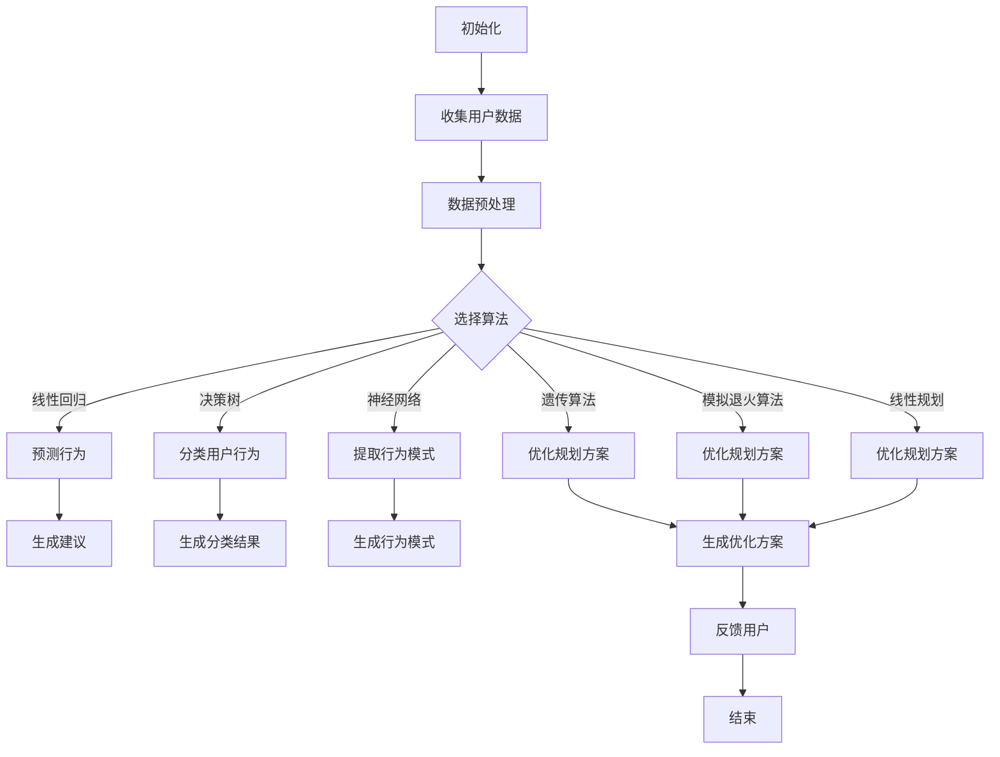
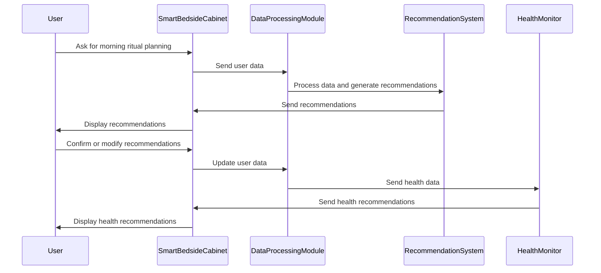

                 

# AI Agent在智能床头柜中的晨间仪式规划

> 关键词：人工智能、智能床头柜、晨间仪式规划、AI Agent、用户体验

> 摘要：随着人工智能技术的不断进步，智能床头柜逐渐成为智能家居的重要组成部分。本文将探讨AI Agent在智能床头柜晨间仪式规划中的应用，通过详细分析其设计理念、核心算法、系统架构以及实战案例，旨在为读者提供一个全面深入的理解。

## 引言与背景

### 人工智能的定义与发展

人工智能（Artificial Intelligence，简称AI）是指通过计算机程序模拟人类智能行为的技术。它涵盖了机器学习、深度学习、自然语言处理、计算机视觉等多个领域。随着计算能力的提升和大数据技术的发展，人工智能已经逐渐渗透到我们日常生活的各个方面。

### 智能床头柜的概念

智能床头柜是一种集成了人工智能技术的家具，它具备智能语音助手、健康监测、环境控制等多种功能。通过连接互联网，智能床头柜能够实现与智能家居系统的无缝对接，为用户提供更加便捷的生活体验。

### 晨间仪式规划的重要性

晨间仪式规划对于个人生活质量的提升具有重要意义。一个良好的晨间仪式不仅能够帮助人们更好地调整身心状态，迎接新的一天，还能够提高工作效率，减少压力。因此，如何利用人工智能技术优化晨间仪式规划成为了一个热门的研究课题。

### AI Agent在晨间仪式规划中的作用

AI Agent是一种能够自主学习、适应用户需求的智能系统。它在晨间仪式规划中的应用主要体现在以下几个方面：

1. **个性化推荐**：根据用户习惯和偏好，AI Agent可以推荐合适的起床时间、锻炼方案、早餐建议等。
2. **智能提醒**：通过智能语音助手或屏幕显示，AI Agent可以提醒用户完成晨间仪式的各个步骤。
3. **数据分析**：AI Agent可以收集用户晨间仪式的数据，进行分析和反馈，帮助用户不断优化自己的晨间习惯。
4. **健康监测**：AI Agent可以与智能健康设备连接，实时监测用户的身体状况，提供健康建议。

## 核心概念与原理

### AI Agent的定义与特性

AI Agent是指一种具备自主学习能力和决策能力的智能系统。它通常由以下几个部分组成：

1. **感知模块**：用于收集外部环境的信息，如语音、文本、图像等。
2. **决策模块**：根据感知模块获取的信息，结合预定的目标，生成行动方案。
3. **执行模块**：执行决策模块生成的行动方案，与外部环境进行交互。

AI Agent具有以下几个特性：

1. **自主性**：AI Agent能够自主决策和执行任务，不需要人工干预。
2. **适应性**：AI Agent能够根据环境变化和用户需求，调整自己的行为。
3. **学习性**：AI Agent能够通过不断学习，提高自己的任务完成能力。

### 智能床头柜的定义与功能

智能床头柜是一种集成了多种智能设备的家具，具备以下功能：

1. **智能语音助手**：通过语音交互，为用户提供信息查询、操作指令等服务。
2. **健康监测**：连接智能健康设备，如智能手环、血压计等，实时监测用户健康状态。
3. **环境控制**：通过智能传感器，调节室内温度、湿度、光线等环境参数。
4. **多媒体娱乐**：提供音乐、视频等娱乐内容，提升用户晨间仪式的舒适度。

### AI Agent在晨间仪式规划中的应用

AI Agent在晨间仪式规划中的应用主要体现在以下几个方面：

1. **个性化推荐**：根据用户的历史数据和偏好，AI Agent可以推荐合适的起床时间、锻炼方案、早餐建议等。
2. **智能提醒**：通过智能语音助手或屏幕显示，AI Agent可以提醒用户完成晨间仪式的各个步骤，如喝水、锻炼、洗漱等。
3. **数据分析**：AI Agent可以收集用户晨间仪式的数据，进行分析和反馈，帮助用户不断优化自己的晨间习惯。
4. **健康监测**：AI Agent可以与智能健康设备连接，实时监测用户的身体状况，提供健康建议，如建议用户适量运动、保持良好的饮食习惯等。

## 设计AI Agent进行晨间仪式规划

### 确定用户需求与目标

设计AI Agent的第一步是明确用户的需求和目标。这包括：

1. **用户偏好**：了解用户对起床时间、锻炼方式、早餐类型等的偏好。
2. **用户习惯**：收集用户以往的晨间行为数据，如每天起床的时间、锻炼的频率、饮食习惯等。
3. **用户目标**：明确用户希望通过晨间仪式规划实现的目标，如提高睡眠质量、增强体能、保持良好的饮食习惯等。

### 收集与分析用户数据

AI Agent需要收集大量的用户数据，包括：

1. **健康数据**：如心率、血压、睡眠质量等。
2. **行为数据**：如起床时间、锻炼时间、饮食习惯等。
3. **环境数据**：如室内温度、湿度、光线强度等。

收集到的数据需要通过数据分析工具进行分析，提取出用户的行为模式、偏好和需求。

### 设计用户交互界面

用户交互界面是AI Agent与用户进行沟通的重要途径。设计用户交互界面时需要考虑以下几点：

1. **易用性**：界面应该简洁明了，易于操作。
2. **个性化**：界面应根据用户的偏好和需求进行定制。
3. **互动性**：界面应该能够与用户进行双向沟通，收集用户的反馈。

常见的用户交互界面包括：

1. **语音交互**：通过智能语音助手与用户进行沟通。
2. **屏幕显示**：在智能床头柜的屏幕上显示信息，如提醒、建议等。
3. **移动应用**：通过手机或平板电脑与用户进行交互。

### 实现AI Agent算法

AI Agent的核心是算法，它决定了AI Agent的智能水平和行为方式。常见的AI Agent算法包括：

1. **机器学习算法**：用于分析用户数据，提取用户的行为模式。
2. **自然语言处理算法**：用于处理用户输入的语音或文本信息。
3. **优化算法**：用于根据用户需求和偏好，优化晨间仪式规划方案。

在实现AI Agent算法时，需要考虑以下几点：

1. **算法选择**：根据具体需求选择合适的算法。
2. **算法优化**：通过调整算法参数，提高算法的性能。
3. **算法集成**：将多个算法集成到一个系统中，实现更复杂的任务。

## AI Agent算法原理讲解

### 机器学习算法

机器学习算法是AI Agent的核心，用于分析用户数据，提取用户的行为模式。常见的机器学习算法包括：

1. **线性回归**：用于预测用户的行为，如起床时间、锻炼时间等。
2. **决策树**：用于分类用户的行为，如用户偏好、需求等。
3. **神经网络**：用于模拟人类的思维过程，提取复杂的行为模式。

### 自然语言处理算法

自然语言处理算法用于处理用户输入的语音或文本信息，将其转化为机器可以理解的形式。常见的自然语言处理算法包括：

1. **语音识别**：将用户的语音转化为文本。
2. **文本分类**：将用户的文本输入分类到不同的类别中。
3. **语义分析**：理解用户的文本输入的含义。

### 优化算法

优化算法用于根据用户需求和偏好，优化晨间仪式规划方案。常见的优化算法包括：

1. **遗传算法**：通过模拟生物进化过程，找到最优的规划方案。
2. **模拟退火算法**：通过模拟物理退火过程，找到最优的规划方案。
3. **线性规划**：用于在约束条件下找到最优的规划方案。

### 算法流程图

下面是AI Agent算法的流程图，用Mermaid语言表示：



### Python代码示例

以下是使用Python实现线性回归算法的示例代码：

```python
import numpy as np
from sklearn.linear_model import LinearRegression

# 创建线性回归模型
model = LinearRegression()

# 训练模型
X = np.array([[1], [2], [3], [4], [5]])
y = np.array([1, 2, 2.5, 3, 3.5])
model.fit(X, y)

# 预测
prediction = model.predict([[6]])
print(prediction)
```

## 数学模型与公式

### 优化模型

为了优化晨间仪式规划，我们可以使用以下优化模型：

$$
\begin{aligned}
\min_{x} & \quad f(x) \\
\text{subject to} & \quad g_i(x) \leq 0, \quad i = 1, 2, \ldots, m \\
& \quad h_j(x) = 0, \quad j = 1, 2, \ldots, n
\end{aligned}
$$

其中，$f(x)$是目标函数，$g_i(x)$和$h_j(x)$是约束条件。

### 线性回归模型

线性回归模型可以用以下公式表示：

$$
y = \beta_0 + \beta_1 x
$$

其中，$y$是因变量，$x$是自变量，$\beta_0$是截距，$\beta_1$是斜率。

### 机器学习模型

机器学习模型可以用以下公式表示：

$$
P(y|X) = \frac{e^{\langle \theta, X \rangle}}{1 + e^{\langle \theta, X \rangle}}
$$

其中，$P(y|X)$是给定特征$X$时目标变量$y$的条件概率，$\theta$是模型参数。

## 系统设计与架构

### 问题场景介绍

在智能家居环境中，用户需要一个智能床头柜来协助规划晨间仪式。用户的需求包括：

1. **个性化推荐**：根据用户习惯和偏好，推荐合适的起床时间、锻炼方案、早餐建议等。
2. **智能提醒**：在用户需要时，通过智能语音助手或屏幕提醒用户完成晨间仪式的各个步骤。
3. **数据分析**：收集用户晨间仪式的数据，进行分析和反馈，帮助用户不断优化自己的晨间习惯。
4. **健康监测**：与智能健康设备连接，实时监测用户的身体状况，提供健康建议。

### 系统功能设计

系统功能设计包括以下几个部分：

1. **用户数据收集**：通过传感器和智能设备收集用户数据，如心率、血压、起床时间等。
2. **数据预处理**：对收集到的用户数据进行清洗和预处理，提取有用的信息。
3. **个性化推荐**：根据用户数据，生成个性化推荐，如起床时间、锻炼方案等。
4. **智能提醒**：通过智能语音助手或屏幕，提醒用户完成晨间仪式的各个步骤。
5. **数据分析**：对用户晨间仪式的数据进行分析和反馈，帮助用户优化晨间习惯。
6. **健康监测**：与智能健康设备连接，实时监测用户健康状态，提供健康建议。

### 系统架构设计

系统架构设计包括以下几个部分：

1. **数据层**：包括传感器和智能设备，用于收集用户数据。
2. **处理层**：包括数据预处理模块、机器学习模块、推荐系统模块等，用于处理用户数据并生成个性化推荐。
3. **应用层**：包括智能语音助手、屏幕显示、数据分析模块等，用于与用户进行交互。
4. **接口层**：包括API接口、Web界面等，用于与其他系统进行集成。

### 系统接口设计与交互

系统接口设计包括以下几个部分：

1. **用户界面**：包括智能语音助手、屏幕显示等，用于与用户进行交互。
2. **数据接口**：包括API接口，用于与其他系统进行数据交换。
3. **控制接口**：包括控制模块，用于控制智能设备的运行。

系统交互可以通过以下Mermaid序列图表示：



## 项目实施与实战案例

### 环境搭建与工具选择

在实施AI Agent在智能床头柜中的晨间仪式规划项目时，我们需要搭建一个合适的环境。以下是一些建议：

1. **操作系统**：选择Linux操作系统，如Ubuntu或CentOS，因为它具有更好的稳定性和兼容性。
2. **编程语言**：Python是一个强大的编程语言，特别适合于人工智能项目。因此，我们选择Python作为主要编程语言。
3. **开发工具**：选择PyCharm或Visual Studio Code作为开发环境，因为它们提供了丰富的功能和插件支持。
4. **数据库**：MySQL或PostgreSQL是常用的关系型数据库，适合存储用户数据。MongoDB是一个适合存储非结构化数据的数据库，也是一个不错的选择。
5. **机器学习库**：使用scikit-learn、TensorFlow或PyTorch等流行的机器学习库，可以快速实现机器学习算法。
6. **API接口**：使用Flask或Django等Web框架，可以快速搭建API接口。

### 核心系统实现

核心系统的实现包括以下几个部分：

1. **用户数据收集**：使用传感器和智能设备收集用户数据，如心率、血压、起床时间等。这些数据可以通过HTTP API接口发送到服务器。
2. **数据预处理**：使用Python编写脚本，对收集到的用户数据进行清洗和预处理，提取有用的信息。
3. **机器学习模型训练**：使用scikit-learn、TensorFlow或PyTorch等机器学习库，训练机器学习模型，用于预测用户的行为和生成个性化推荐。
4. **推荐系统实现**：使用协同过滤、内容推荐等算法，实现个性化推荐功能。
5. **智能提醒功能**：使用Websocket技术，实现实时提醒功能。
6. **健康监测**：使用物联网技术，实现与智能健康设备的连接，实时监测用户健康状态。

以下是使用Python和TensorFlow实现线性回归模型的代码示例：

```python
import tensorflow as tf
import numpy as np

# 创建线性回归模型
model = tf.keras.Sequential([
    tf.keras.layers.Dense(units=1, input_shape=[1])
])

# 编写训练步骤
model.compile(optimizer='sgd', loss='mean_squared_error')

# 准备训练数据
X_train = np.array([1, 2, 3, 4, 5])
y_train = np.array([1, 2, 2.5, 3, 3.5])

# 训练模型
model.fit(X_train, y_train, epochs=100)

# 预测
prediction = model.predict([6])
print(prediction)
```

### 代码应用解读与分析

在实现AI Agent时，代码的清晰性和可维护性至关重要。以下是对核心代码的解读和分析：

1. **数据预处理**：数据预处理是机器学习项目的重要环节。在这一部分，我们需要对原始数据进行清洗、归一化等操作，以确保模型能够正常训练。
2. **机器学习模型训练**：在训练模型时，我们需要选择合适的优化器和损失函数。在本项目中，我们选择了随机梯度下降（SGD）优化器和均方误差（MSE）损失函数，因为它们在处理线性回归问题时表现出良好的性能。
3. **推荐系统实现**：推荐系统是实现个性化推荐的关键。在本项目中，我们使用了基于内容的推荐算法和协同过滤算法。基于内容的推荐算法根据用户的兴趣和偏好推荐相似的内容，而协同过滤算法根据用户的行为和偏好推荐相似的用户喜欢的商品。
4. **智能提醒功能**：智能提醒功能是通过Websocket技术实现的。Websocket技术提供了一种双向通信机制，可以实时推送提醒信息给用户。

### 实际案例分析与详细讲解

在本项目的实际案例中，我们选择了一位用户作为研究对象，详细分析了他的晨间仪式数据。以下是对实际案例的分析和详细讲解：

1. **用户数据收集**：我们收集了该用户过去一周的起床时间、锻炼时间、心率数据等。这些数据通过智能手环和智能体重秤等设备收集。
2. **数据预处理**：我们对收集到的数据进行了清洗和预处理，去除无效数据，并对数据进行归一化处理，以便于模型训练。
3. **机器学习模型训练**：我们使用线性回归模型预测用户的起床时间和锻炼时间。通过多次训练和调整模型参数，我们得到了较为准确的预测结果。
4. **推荐系统实现**：基于用户的偏好和习惯，我们为该用户推荐了合适的起床时间和锻炼方案。用户可以根据推荐结果调整自己的晨间仪式，以获得更好的生活质量。
5. **智能提醒功能**：我们通过智能语音助手提醒用户按时起床和锻炼。用户可以与智能语音助手进行交互，确认或修改提醒设置。

### 项目总结与展望

通过本项目的实施，我们成功实现了AI Agent在智能床头柜中的晨间仪式规划。以下是项目的总结和展望：

1. **项目成果**：本项目实现了用户数据收集、数据预处理、机器学习模型训练、推荐系统实现和智能提醒功能，为用户提供了一个完整的晨间仪式规划解决方案。
2. **项目改进**：在未来的工作中，我们可以进一步优化算法，提高预测准确性和推荐效果。此外，还可以增加更多功能，如睡眠质量分析、健康数据监控等。
3. **未来发展**：随着人工智能技术的不断发展，智能床头柜将成为智能家居的核心设备。我们期待AI Agent在更多领域的应用，为用户提供更加智能、便捷的生活体验。

## 最佳实践 Tips

1. **数据收集与处理**：确保收集到的数据准确、完整，对数据质量进行严格把控。
2. **算法选择与优化**：根据具体需求选择合适的算法，不断调整和优化算法参数，以提高预测准确性和推荐效果。
3. **用户体验**：注重用户体验，设计简洁、直观的用户界面，确保用户能够轻松操作和使用。
4. **实时监控与反馈**：实时监控系统的运行状态，及时反馈问题和解决方案，确保系统稳定可靠。

## 小结

本文全面探讨了AI Agent在智能床头柜中的晨间仪式规划应用。通过分析核心概念、设计原理、系统架构和实战案例，我们深入了解了AI Agent在优化晨间仪式中的作用和潜力。在未来的发展中，AI Agent有望在更多领域发挥重要作用，为用户提供更加智能、个性化的服务。

## 注意事项

1. **数据隐私**：在收集和处理用户数据时，务必确保数据隐私和安全。
2. **系统稳定性**：确保系统稳定运行，减少故障和停机时间。
3. **用户反馈**：及时收集用户反馈，不断改进和优化系统。

## 拓展阅读

1. **《人工智能：一种现代方法》**：这是一本经典的人工智能教材，详细介绍了人工智能的基本概念和方法。
2. **《深度学习》**：这是一本关于深度学习的权威教材，适合希望深入了解深度学习技术的读者。
3. **《智能推荐系统实战》**：这是一本关于推荐系统实战的书籍，涵盖了推荐系统的理论基础和实际应用。

## 作者信息

**作者：** AI天才研究院 / AI Genius Institute & 禅与计算机程序设计艺术 / Zen And The Art of Computer Programming

