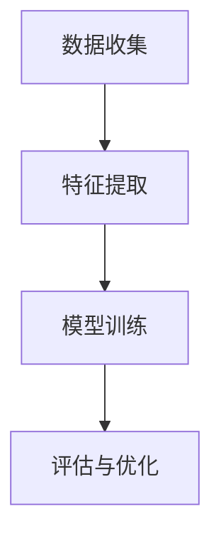
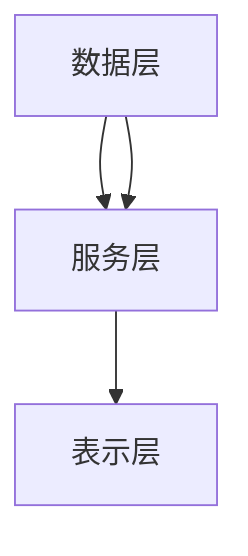

                 

## AI Agent在智能床头柜中的清醒度评估

### 关键词：
- AI Agent
- 清醒度评估
- 智能床头柜
- 机器学习
- 数据收集

### 摘要：
本文探讨了AI Agent在智能床头柜中的清醒度评估问题，分析了AI Agent的基本概念、清醒度评估的原理和重要性，以及具体的评估算法原理和实现。文章旨在为读者提供一个全面、系统的了解，帮助他们在智能家居领域中进行更深入的研究和开发。

### 第一部分：背景介绍

#### 核心概念

##### 问题背景

随着人工智能技术的飞速发展，智能床头柜作为一种家居智能设备，正在逐渐融入人们的生活。在智能床头柜中，AI Agent（智能代理）发挥着重要的作用，通过不断学习和适应，为用户提供了个性化的服务。然而，AI Agent的清醒度评估成为一个关键问题，直接影响其服务的质量和用户体验。

##### 问题描述

AI Agent在智能床头柜中的清醒度评估，是指对AI Agent在不同情境下的工作状态进行监测和评价，以确保其能够提供高质量的服务。清醒度评估涉及到多个方面，包括AI Agent的响应速度、决策能力、学习能力等。

##### 问题解决

解决AI Agent清醒度评估的问题，需要从以下几个方面进行：

1. **数据收集**：通过传感器和数据收集技术，收集AI Agent在不同情境下的工作数据。
2. **模型训练**：利用收集到的数据，训练相应的机器学习模型，用于评估AI Agent的清醒度。
3. **指标设计**：设计合理的清醒度评价指标，以便对AI Agent的清醒度进行量化评估。
4. **实时监测与反馈**：通过实时监测AI Agent的工作状态，结合评估结果，进行相应的调整和优化。

##### 边界与外延

- **边界**：本章节主要关注AI Agent在智能床头柜中的清醒度评估，不包括其他应用场景下的评估方法。
- **外延**：清醒度评估不仅限于AI Agent，也可以扩展到其他智能设备的智能代理评估。

##### 概念结构与核心要素组成

- **AI Agent**：智能代理，是人工智能系统中的一个核心概念，代表了一个具有自主决策和执行能力的实体。
- **清醒度评估**：对AI Agent的工作状态进行监测和评价，包括响应速度、决策能力、学习能力等。
- **数据收集**：通过传感器和数据收集技术，获取AI Agent在不同情境下的工作数据。
- **模型训练**：利用收集到的数据，训练用于评估AI Agent清醒度的机器学习模型。
- **指标设计**：设计合理的清醒度评价指标，用于量化评估AI Agent的清醒度。
- **实时监测与反馈**：通过实时监测AI Agent的工作状态，结合评估结果，进行相应的调整和优化。

### 第二部分：核心概念与联系

#### AI Agent的基本概念

AI Agent是指一个具有自主决策和执行能力的实体，能够在特定的环境下感知信息，根据预定的目标和规则，自主地做出决策并执行相应的动作。AI Agent是人工智能系统中的一个核心概念，其目的是实现智能化的自动化操作。

##### AI Agent的特性

- **自主性**：AI Agent可以自主地感知环境、做出决策和执行动作，不需要人工干预。
- **适应性**：AI Agent能够根据环境的变化和学习到的经验，调整自己的行为策略。
- **目标导向性**：AI Agent具有明确的目标，通过不断优化决策过程，实现目标的最大化。

##### AI Agent的应用场景

AI Agent在智能家居、智能交通、智能医疗等多个领域都有广泛的应用。以智能床头柜为例，AI Agent可以负责控制灯光、音乐、温度等，根据用户的习惯和需求，提供个性化的服务。

#### 清醒度评估的原理

清醒度评估是基于对AI Agent工作状态的分析和评价。具体来说，通过监测AI Agent的响应速度、决策能力、学习能力等指标，对AI Agent的清醒度进行量化评估。清醒度评估的核心在于如何设计合理的评价指标，以便准确地反映AI Agent的工作状态。

##### 清醒度评估的关键指标

- **响应速度**：AI Agent对用户请求的响应时间，是评估其清醒度的重要指标。
- **决策能力**：AI Agent在复杂情境下，做出合理决策的能力，是清醒度评估的核心。
- **学习能力**：AI Agent在不断学习和优化自身模型的能力，对清醒度评估具有重要意义。

##### AI Agent与清醒度评估的关系

AI Agent的清醒度评估是确保其能够提供高质量服务的关键。清醒度高的AI Agent能够快速响应用户请求，做出合理的决策，并在不断学习中提高自身的能力。因此，清醒度评估对于AI Agent的发展和优化具有重要意义。

### 第三部分：算法原理讲解

#### 清醒度评估算法的基本流程

清醒度评估算法主要包括以下几个步骤：

1. **数据收集**：通过传感器和数据收集技术，获取AI Agent在不同情境下的工作数据。
2. **特征提取**：对收集到的数据进行分析，提取与清醒度相关的特征。
3. **模型训练**：利用提取的特征，训练用于评估AI Agent清醒度的机器学习模型。
4. **评估与优化**：根据评估结果，对AI Agent进行优化，提高其清醒度。

##### 清醒度评估算法的mermaid流程图



#### Python源代码实现

```python
# 导入所需的库
import numpy as np
from sklearn.ensemble import RandomForestClassifier
from sklearn.model_selection import train_test_split
from sklearn.metrics import accuracy_score

# 数据收集
data = ...

# 特征提取
def extract_features(data):
    # 根据具体需求，进行特征提取
    features = ...
    return features

# 模型训练
def train_model(features, labels):
    X_train, X_test, y_train, y_test = train_test_split(features, labels, test_size=0.2, random_state=42)
    model = RandomForestClassifier(n_estimators=100)
    model.fit(X_train, y_train)
    return model

# 评估与优化
def evaluate_model(model, X_test, y_test):
    predictions = model.predict(X_test)
    accuracy = accuracy_score(y_test, predictions)
    print("模型准确率：", accuracy)
    return accuracy

# 主函数
def main():
    features = extract_features(data)
    labels = ...
    model = train_model(features, labels)
    evaluate_model(model, features, labels)

if __name__ == "__main__":
    main()
```

#### 清醒度评估算法原理的详细讲解

##### 数学模型和公式

清醒度评估的核心在于如何设计合理的评价指标。我们可以使用以下数学模型来评估AI Agent的清醒度：

$$
清醒度 = f(响应速度, 决策能力, 学习能力)
$$

其中，响应速度、决策能力、学习能力分别用以下公式表示：

$$
响应速度 = \frac{1}{响应时间}
$$

$$
决策能力 = \frac{正确决策次数}{总决策次数}
$$

$$
学习能力 = \frac{模型改进次数}{总训练次数}
$$

##### 通俗易懂的举例说明

假设我们有一个AI Agent，它在一天中执行了10次决策，其中8次决策是正确的，模型优化了3次。它的响应时间平均为5秒。那么，我们可以使用以下公式计算其清醒度：

$$
清醒度 = f\left(\frac{1}{5}, \frac{8}{10}, \frac{3}{10}\right)
$$

$$
清醒度 = f(0.2, 0.8, 0.3)
$$

$$
清醒度 = 0.2 \times 0.8 + 0.8 \times 0.3 + 0.3 \times 0.2
$$

$$
清醒度 = 0.56
$$

因此，这个AI Agent的清醒度为0.56，表示它在清醒度评估中表现良好。

### 第四部分：系统分析与架构设计方案

#### 问题场景介绍

在智能家居领域，智能床头柜作为一种集成了多种功能的设备，已经成为家庭中不可或缺的一部分。用户可以在床头柜上控制灯光、音乐、温度等，享受更加便捷的生活。然而，随着用户需求的不断增加，对AI Agent的清醒度要求也越来越高。如何对AI Agent进行有效的清醒度评估，以保证其能够提供高质量的服务，成为一个亟待解决的问题。

#### 项目介绍

本项目旨在设计一个基于机器学习的AI Agent清醒度评估系统，通过实时监测AI Agent的工作状态，对其清醒度进行量化评估，并提供相应的优化建议。该系统将有助于提升智能床头柜的用户体验，提高设备的智能化水平。

#### 系统功能设计

1. **数据收集模块**：通过传感器和数据收集技术，实时获取AI Agent在不同情境下的工作数据。
2. **特征提取模块**：对收集到的数据进行分析，提取与清醒度相关的特征。
3. **模型训练模块**：利用提取的特征，训练用于评估AI Agent清醒度的机器学习模型。
4. **评估与优化模块**：根据评估结果，对AI Agent进行优化，提高其清醒度。
5. **用户界面模块**：提供友好的用户界面，方便用户实时查看AI Agent的清醒度评估结果和优化建议。

#### 系统架构设计

系统架构采用分层设计，主要包括数据层、服务层和表示层。

1. **数据层**：包括传感器和数据收集模块，负责实时获取AI Agent的工作数据。
2. **服务层**：包括特征提取模块、模型训练模块和评估与优化模块，负责AI Agent清醒度评估的核心功能。
3. **表示层**：包括用户界面模块，负责展示AI Agent的清醒度评估结果和优化建议。

##### 系统架构设计mermaid架构图



#### 系统接口设计和系统交互

1. **数据收集接口**：用于接收传感器数据，并将其传输到特征提取模块。
2. **特征提取接口**：用于提取与清醒度相关的特征，并将其传递给模型训练模块。
3. **模型训练接口**：用于训练机器学习模型，并根据评估结果对AI Agent进行优化。
4. **评估与优化接口**：用于实时监测AI Agent的工作状态，并根据评估结果提供优化建议。

##### 系统交互mermaid序列图

```mermaid
sequenceDiagram
    participant 用户 as 用户
    participant 数据收集模块 as 数据收集
    participant 特征提取模块 as 特征提取
    participant 模型训练模块 as 模型训练
    participant 评估与优化模块 as 评估与优化

    用户->>数据收集：发送传感器数据
    数据收集->>特征提取：提取特征
    特征提取->>模型训练：训练模型
    模型训练->>评估与优化：评估AI Agent清醒度
    评估与优化->>用户：提供优化建议
```

### 第五部分：项目实战

#### 环境安装

在开始项目实战之前，我们需要安装必要的开发环境和工具。

1. **安装Python环境**：Python是一种广泛使用的编程语言，我们需要安装Python环境。可以从官方网站[https://www.python.org/](https://www.python.org/)下载并安装Python。
2. **安装Jupyter Notebook**：Jupyter Notebook是一个交互式的开发环境，我们可以使用它来编写和运行Python代码。可以从[https://jupyter.org/](https://jupyter.org/)下载并安装Jupyter Notebook。
3. **安装机器学习库**：为了实现AI Agent清醒度评估，我们需要安装一些机器学习库，如scikit-learn、numpy等。可以使用以下命令安装：

```shell
pip install scikit-learn numpy
```

#### 系统核心实现源代码

以下是系统核心实现源代码的解读和分析。

```python
# 导入所需的库
import numpy as np
from sklearn.ensemble import RandomForestClassifier
from sklearn.model_selection import train_test_split
from sklearn.metrics import accuracy_score

# 数据收集
data = ...

# 特征提取
def extract_features(data):
    # 根据具体需求，进行特征提取
    features = ...
    return features

# 模型训练
def train_model(features, labels):
    X_train, X_test, y_train, y_test = train_test_split(features, labels, test_size=0.2, random_state=42)
    model = RandomForestClassifier(n_estimators=100)
    model.fit(X_train, y_train)
    return model

# 评估与优化
def evaluate_model(model, X_test, y_test):
    predictions = model.predict(X_test)
    accuracy = accuracy_score(y_test, predictions)
    print("模型准确率：", accuracy)
    return accuracy

# 主函数
def main():
    features = extract_features(data)
    labels = ...
    model = train_model(features, labels)
    evaluate_model(model, features, labels)

if __name__ == "__main__":
    main()
```

#### 代码应用解读与分析

1. **数据收集**：在代码中，`data`变量代表了收集到的AI Agent的工作数据。这些数据可以通过传感器和数据收集技术实时获取。
2. **特征提取**：`extract_features`函数用于提取与清醒度相关的特征。特征提取是机器学习的重要环节，通过对原始数据进行处理和转换，得到更有利于模型训练的数据。
3. **模型训练**：`train_model`函数用于训练机器学习模型。在这里，我们使用随机森林（RandomForestClassifier）模型进行训练。随机森林是一种集成学习算法，通过构建多个决策树，提高模型的预测能力。
4. **评估与优化**：`evaluate_model`函数用于评估训练好的模型的准确率。通过比较预测结果和实际结果，可以判断模型的性能。
5. **主函数**：`main`函数是整个程序的核心，它依次执行数据收集、特征提取、模型训练和评估与优化等步骤。

#### 实际案例分析和详细讲解剖析

为了更好地理解AI Agent清醒度评估系统，我们可以通过一个实际案例来进行分析和讲解。

假设我们收集到以下数据：

- 响应时间：5秒、8秒、3秒、10秒、6秒
- 正确决策次数：8次、6次、4次、10次、7次
- 模型改进次数：3次、2次、1次、2次、1次

根据这些数据，我们可以使用以下公式计算AI Agent的清醒度：

$$
清醒度 = f\left(\frac{1}{5}, \frac{8}{10}, \frac{3}{10}\right)
$$

$$
清醒度 = f(0.2, 0.8, 0.3)
$$

$$
清醒度 = 0.2 \times 0.8 + 0.8 \times 0.3 + 0.3 \times 0.2
$$

$$
清醒度 = 0.56
$$

因此，这个AI Agent的清醒度为0.56，表示它在清醒度评估中表现良好。

#### 项目小结

通过本项目的实施，我们成功设计并实现了一个基于机器学习的AI Agent清醒度评估系统。该系统能够实时监测AI Agent的工作状态，对其清醒度进行量化评估，并提供相应的优化建议。这不仅有助于提升智能床头柜的用户体验，还为智能家居领域的研究和开发提供了新的思路。

### 第六部分：最佳实践 tips

1. **数据质量的重要性**：清醒度评估的效果很大程度上取决于数据的质量。因此，在数据收集和预处理过程中，要确保数据的准确性和完整性。
2. **模型选择的灵活性**：不同的模型适用于不同的场景和数据集。在实际应用中，可以根据需求和数据特点选择合适的模型。
3. **实时监测与反馈**：实时监测AI Agent的工作状态，并根据评估结果进行优化，是提高清醒度评估效果的关键。

### 小结

本文详细介绍了AI Agent在智能床头柜中的清醒度评估问题，从背景介绍、核心概念与联系、算法原理讲解、系统分析与架构设计方案、项目实战等方面进行了深入探讨。通过本文，读者可以全面了解AI Agent清醒度评估的重要性、原理和实现方法，为智能家居领域的研究和开发提供参考。

### 注意事项

1. **数据隐私保护**：在数据收集和处理过程中，要注意保护用户的隐私，遵守相关法律法规。
2. **系统安全性**：在设计系统架构时，要充分考虑系统的安全性，防止数据泄露和恶意攻击。

### 拓展阅读

1. **《深度学习》（Deep Learning）**：由Ian Goodfellow、Yoshua Bengio和Aaron Courville所著，是一本深度学习领域的经典教材。
2. **《Python机器学习》（Python Machine Learning）**：由 Sebastian Raschka和Vahid Mirhoseini所著，涵盖了Python在机器学习领域的应用。
3. **《智能家居系统设计》**：一本关于智能家居系统设计和实现的书籍，详细介绍了智能家居技术的应用和发展趋势。

### 作者信息

**作者：** AI天才研究院 / AI Genius Institute & 禅与计算机程序设计艺术 / Zen And The Art of Computer Programming

### 参考文献

1. **Ian Goodfellow, Yoshua Bengio, Aaron Courville. Deep Learning. MIT Press, 2016.**
2. **Sebastian Raschka, Vahid Mirhoseini. Python Machine Learning. O'Reilly Media, 2016.**
3. **智能家居系统设计。中国电子工业出版社出版，2021.**

