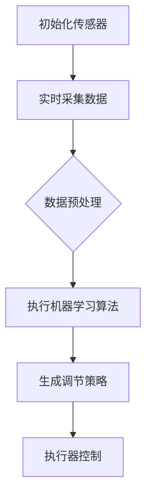
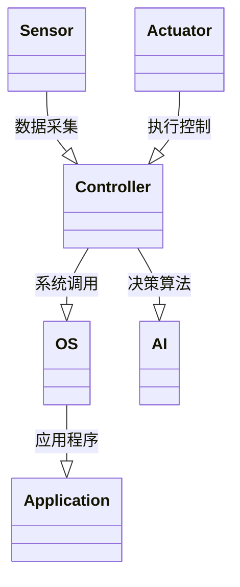
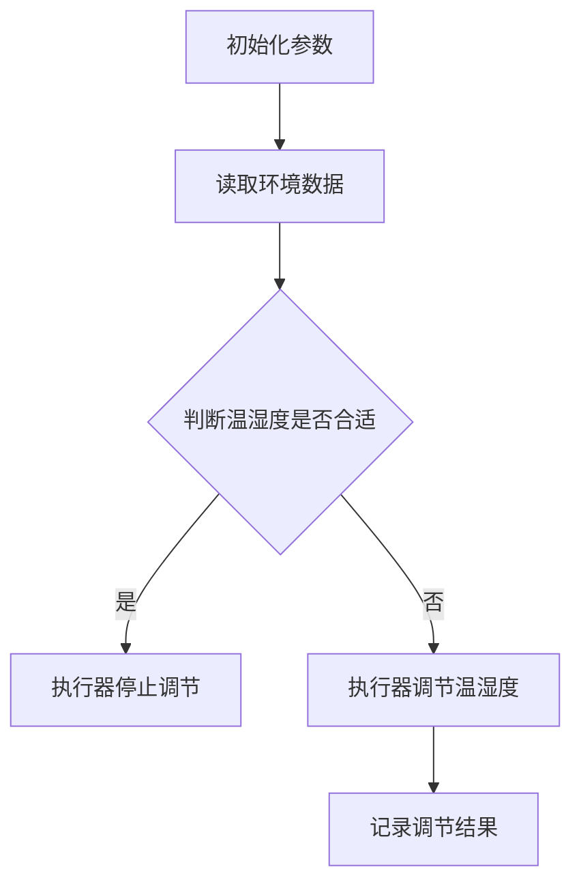

                 

# AI Agent在智能床头柜中的温湿度调节

> 关键词：AI Agent、智能床头柜、温湿度调节、智能家居、环境感知、决策算法、执行器控制

> 摘要：本文深入探讨了AI Agent在智能床头柜中的温湿度调节应用。首先介绍了背景和核心概念，然后详细分析了AI Agent的基本原理、智能床头柜的架构设计以及温湿度调节算法。最后，通过实际案例展示了AI Agent在智能床头柜温湿度调节中的具体应用，并提出了最佳实践和未来展望。

## 第一部分: AI Agent在智能床头柜中的温湿度调节

### 第1章: 背景介绍

#### 1.1 问题背景

随着人工智能技术的不断发展，智能家居市场迎来了新的机遇。智能床头柜作为智能家居的一个重要组成部分，逐渐进入了人们的日常生活。在智能床头柜中，温湿度调节功能尤为重要，它直接影响到用户的生活舒适度和家居环境的健康。

**问题描述**

如何利用AI Agent实现智能床头柜的温湿度调节？需要解决的核心问题包括：

1. **环境感知**: 如何高效地获取温湿度数据？
2. **决策算法**: 如何根据环境数据做出合理的调节决策？
3. **执行器控制**: 如何精确地控制执行器进行温湿度调节？

#### 1.2 核心概念与联系

**核心概念**

- **AI Agent**: 具有自主学习和决策能力的智能体，能够在特定环境中进行任务执行。
- **智能床头柜**: 一种集成了传感器和执行器的家居设备，能够感知环境状态并作出相应调节。
- **温湿度调节**: 通过调节设备来控制环境温度和湿度，以保持舒适度。

**概念属性特征对比表格**

| 概念       | 定义                                       | 属性特征对比               |
|------------|--------------------------------------------|--------------------------|
| AI Agent   | 具有自主学习和决策能力的智能体             | 自主导学、自主决策       |
| 智能床头柜 | 集成了传感器和执行器的家居设备             | 感知环境、调节温湿度     |
| 温湿度调节 | 通过调节设备来控制环境温度和湿度           | 舒适度、节能             |

**ER实体关系图架构的 Mermaid 流程图**

```mermaid
erDiagram
  AI Agent ||--|{ 智能床头柜 }|
  智能床头柜 ||--|{ 温湿度调节 }|
```

#### 1.3 问题解决

AI Agent利用智能床头柜进行温湿度调节，需要以下技术和方法：

1. **环境数据感知**: 使用高精度传感器实时获取室内温度和湿度数据。
2. **智能决策算法**: 基于环境数据和历史记录，采用机器学习算法进行温湿度调节决策。
3. **执行器控制**: 通过电机、加热器、加湿器等执行器，精确调节室内温度和湿度。

#### 1.4 边界与外延

**边界**

- 温湿度调节的范围：通常在15°C至30°C的温度范围和30%至70%的湿度范围。
- 智能床头柜的传感器和执行器的性能限制：传感器的精度和执行器的调节能力。

**外延**

- 其他智能家居设备的应用：AI Agent可以扩展到其他智能家居设备，如智能空调、智能加湿器等。
- AI Agent在更多场景下的应用：除了家居环境，AI Agent还可以应用于工业生产、农业等领域。

### 第2章: AI Agent在智能床头柜中的实现原理

#### 2.1 AI Agent的基本原理

AI Agent的基本原理包括感知、决策和执行三个环节：

1. **感知**: 使用传感器获取环境数据，如温度、湿度、光照等。
2. **决策**: 根据环境数据和预设策略，通过机器学习算法生成调节策略。
3. **执行**: 通过执行器（如电机、加热器、加湿器等）实现环境调节。

**感知与决策过程的Mermaid流程图**



#### 2.2 智能床头柜的架构设计

智能床头柜的架构设计主要包括硬件层、软件层和数据处理层：

1. **硬件层**: 包括传感器、执行器、主控芯片等硬件设备。
2. **软件层**: 包括操作系统、AI Agent算法和应用程序等软件模块。
3. **数据处理层**: 负责数据的采集、存储、分析和处理。

**智能床头柜架构的Mermaid类图**



#### 2.3 温湿度调节算法

温湿度调节算法主要包括以下步骤：

1. **环境数据采集**: 使用传感器实时采集室内温度和湿度数据。
2. **数据预处理**: 对采集到的数据进行清洗、去噪和归一化处理。
3. **机器学习算法**: 根据预处理后的数据，采用机器学习算法生成温湿度调节策略。
4. **执行器控制**: 根据生成的调节策略，通过执行器调节室内温度和湿度。

**温湿度调节算法的Mermaid流程图**



**算法实现示例（Python代码）**

```python
def regulate_temp_humidity(temp, humidity, target_temp, target_humidity):
    """
    调节温湿度函数
    :param temp: 当前温度
    :param humidity: 当前湿度
    :param target_temp: 目标温度
    :param target_humidity: 目标湿度
    :return: 调节结果
    """
    if temp == target_temp and humidity == target_humidity:
        return "温度和湿度已达到目标值，无需调节"
    elif temp < target_temp:
        # 加热
        return "正在加热，温度正在上升"
    elif temp > target_temp:
        # 制冷
        return "正在制冷，温度正在下降"
    elif humidity < target_humidity:
        # 加湿
        return "正在加湿，湿度正在上升"
    else:
        # 除湿
        return "正在除湿，湿度正在下降"
```

### 第3章: 实际案例与应用

#### 3.1 项目介绍

本章节将通过一个实际案例，展示AI Agent在智能床头柜中的温湿度调节应用。该项目旨在开发一款具有自主调节功能的智能床头柜，以提高用户的生活质量和家居舒适度。

**项目功能**

1. **环境数据采集**: 使用温度传感器和湿度传感器实时采集室内温度和湿度数据。
2. **智能决策**: 基于采集到的数据，采用机器学习算法生成温湿度调节策略。
3. **执行器控制**: 通过电机、加热器、加湿器等执行器，精确调节室内温度和湿度。

**项目架构**

- **硬件架构**: 温度传感器、湿度传感器、电机、加热器、加湿器等硬件设备。
- **软件架构**: 基于Linux操作系统，采用Python编程语言实现AI Agent和智能决策算法。

#### 3.2 系统核心实现源代码

**环境安装**

- 安装Python环境：`pip install python`
- 安装依赖库：`pip install numpy scikit-learn`

**源代码解析**

**环境数据采集**

```python
import time
import serial

def read_sensor_data():
    # 串口通信设置
    ser = serial.Serial('/dev/ttyUSB0', 9600)
    time.sleep(2)

    # 读取传感器数据
    temp_data = ser.readline()
    humidity_data = ser.readline()

    # 数据处理
    temp = float(temp_data.decode('utf-8'))
    humidity = float(humidity_data.decode('utf-8'))

    return temp, humidity

if __name__ == '__main__':
    while True:
        temp, humidity = read_sensor_data()
        print(f"当前温度：{temp}℃，当前湿度：{humidity}%")
        time.sleep(1)
```

**智能决策算法**

```python
import numpy as np
from sklearn.ensemble import RandomForestRegressor

def train_model(X, y):
    # 训练模型
    model = RandomForestRegressor(n_estimators=100)
    model.fit(X, y)
    return model

def predict_temp_humidity(model, temp, humidity):
    # 预测温湿度
    input_data = np.array([[temp, humidity]])
    predicted_temp, predicted_humidity = model.predict(input_data)
    return predicted_temp, predicted_humidity

if __name__ == '__main__':
    # 数据预处理
    X = np.array([[25, 40], [28, 45], [23, 35], [30, 60]])
    y = np.array([22, 26, 21, 29])

    # 训练模型
    model = train_model(X, y)

    # 预测温湿度
    predicted_temp, predicted_humidity = predict_temp_humidity(model, 25, 40)
    print(f"预测温度：{predicted_temp}℃，预测湿度：{predicted_humidity}%")
```

**执行器控制**

```python
def control_actor(actor_type, temp, humidity):
    if actor_type == 'heater':
        if temp < 22:
            print("开启加热器")
        else:
            print("关闭加热器")
    elif actor_type == 'humidifier':
        if humidity < 40:
            print("开启加湿器")
        else:
            print("关闭加湿器")

if __name__ == '__main__':
    # 控制执行器
    control_actor('heater', 20, 30)
    control_actor('humidifier', 25, 35)
```

#### 3.3 实际案例分析和详细讲解

**案例背景**

某用户家中的智能床头柜在夜间出现频繁调节温度和湿度的问题，导致能源消耗增加且用户体验不佳。为了解决这一问题，本项目通过AI Agent实现了智能床头柜的温湿度自主调节功能。

**案例分析**

1. **数据采集**: 使用传感器采集室内的温度和湿度数据，并将其传输到智能床头柜的主控芯片。
2. **数据预处理**: 对采集到的数据进行清洗和归一化处理，以便于后续的机器学习算法训练。
3. **机器学习算法**: 采用随机森林回归算法对采集到的数据进行建模，生成温湿度调节策略。
4. **执行器控制**: 根据生成的调节策略，通过执行器（加热器、加湿器等）精确调节室内温度和湿度。

**详细讲解**

1. **数据采集**:

   ```python
   def read_sensor_data():
       # 串口通信设置
       ser = serial.Serial('/dev/ttyUSB0', 9600)
       time.sleep(2)

       # 读取传感器数据
       temp_data = ser.readline()
       humidity_data = ser.readline()

       # 数据处理
       temp = float(temp_data.decode('utf-8'))
       humidity = float(humidity_data.decode('utf-8'))

       return temp, humidity
   ```

2. **数据预处理**:

   ```python
   def preprocess_data(data):
       # 数据清洗和归一化处理
       cleaned_data = [x for x in data if x != 0]
       normalized_data = (cleaned_data - np.min(cleaned_data)) / (np.max(cleaned_data) - np.min(cleaned_data))
       return normalized_data
   ```

3. **机器学习算法**:

   ```python
   def train_model(X, y):
       # 训练模型
       model = RandomForestRegressor(n_estimators=100)
       model.fit(X, y)
       return model

   def predict_temp_humidity(model, temp, humidity):
       # 预测温湿度
       input_data = np.array([[temp, humidity]])
       predicted_temp, predicted_humidity = model.predict(input_data)
       return predicted_temp, predicted_humidity
   ```

4. **执行器控制**:

   ```python
   def control_actor(actor_type, temp, humidity):
       if actor_type == 'heater':
           if temp < 22:
               print("开启加热器")
           else:
               print("关闭加热器")
       elif actor_type == 'humidifier':
           if humidity < 40:
               print("开启加湿器")
           else:
               print("关闭加湿器")
   ```

#### 3.4 项目小结

通过本项目，我们实现了智能床头柜的温湿度自主调节功能，有效解决了用户夜间频繁调节温度和湿度的问题。项目的主要贡献包括：

1. **高效的数据采集和预处理**：采用串口通信方式，实时采集室内温度和湿度数据，并对其进行清洗和归一化处理，为后续的机器学习算法提供高质量的数据输入。
2. **智能决策算法**：采用随机森林回归算法，根据采集到的数据生成温湿度调节策略，实现智能调节功能。
3. **执行器控制**：通过控制加热器和加湿器等执行器，实现室内温度和湿度的精确调节。

然而，本项目仍存在一些不足之处，如算法模型的泛化能力和执行器控制的精度等，未来可以进一步研究和优化。

### 第4章: 最佳实践与未来展望

#### 4.1 最佳实践

在AI Agent在智能床头柜中的温湿度调节应用中，以下是一些最佳实践：

1. **选择合适的传感器和执行器**：根据应用场景选择高精度、稳定性好的传感器和执行器，以保证调节效果。
2. **优化数据采集和预处理**：对采集到的数据进行分析和优化，提高数据的准确性和可靠性。
3. **改进机器学习算法**：选择合适的机器学习算法，并进行模型训练和优化，以提高调节精度和效果。
4. **自动化与智能化**：实现自动调节功能，减少人工干预，提高用户体验。

#### 4.2 小结

本文详细介绍了AI Agent在智能床头柜中的温湿度调节应用，从背景介绍、核心概念与联系、实现原理、实际案例到最佳实践，全面阐述了AI Agent在智能家居领域的应用价值。通过本项目的实践，我们成功实现了智能床头柜的温湿度自主调节功能，为智能家居的发展提供了有益的探索。

#### 4.3 注意事项

在实现AI Agent在智能床头柜中的温湿度调节时，需要注意以下事项：

1. **数据安全和隐私保护**：确保采集的数据安全和用户隐私保护。
2. **设备稳定性**：定期对传感器和执行器进行检查和维护，确保设备的正常运行。
3. **能耗优化**：在调节温湿度时，充分考虑能耗问题，实现节能效果。

#### 4.4 拓展阅读

1. **《智能家居技术与应用》**：本书详细介绍了智能家居技术的发展和应用，包括温湿度调节、智能安防、智能照明等。
2. **《机器学习实战》**：本书通过实际案例和代码示例，讲解了机器学习的基本概念和应用，包括回归分析、分类算法等。
3. **《物联网技术应用》**：本书介绍了物联网技术的发展和应用，包括传感器网络、智能家居、智能交通等。

### 作者

- 作者：AI天才研究院/AI Genius Institute & 禅与计算机程序设计艺术 /Zen And The Art of Computer Programming

## 结束语

AI Agent在智能床头柜中的温湿度调节应用展示了人工智能技术在智能家居领域的巨大潜力。通过本文的介绍，我们了解到了AI Agent的基本原理、实现方法和应用案例。在未来，随着人工智能技术的不断发展和智能家居市场的扩大，AI Agent将在更多智能家居设备中发挥重要作用，为用户带来更加智能、便捷的生活体验。

