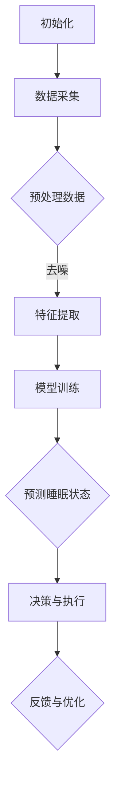
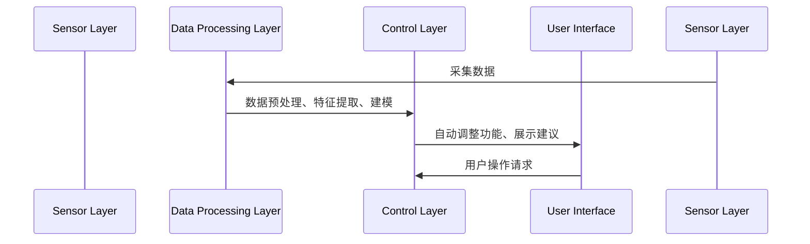

                 

# AI Agent在智能床头柜中的睡眠周期优化

## 关键词
- **AI Agent**，**智能床头柜**，**睡眠周期**，**优化**，**算法原理**，**数学模型**，**系统架构**，**实际案例**

## 摘要
本文将探讨AI Agent在智能床头柜中优化睡眠周期的应用。首先，我们将介绍睡眠周期的基本概念、现有问题及其优化的重要性。接着，我们会深入探讨AI Agent的定义、组成和工作原理。随后，文章将详细讲解AI Agent如何在智能床头柜中发挥作用，实现睡眠周期的优化。我们将通过具体算法原理的阐述、数学模型的应用、以及实际案例的展示，来展示AI Agent在智能床头柜中的实际应用效果。最后，我们将总结最佳实践，并提出未来的发展趋势和展望。

## 第一部分：睡眠周期优化背景与问题

### 第1章：睡眠周期概述

睡眠周期是人体生理活动的一个重要组成部分，通常由四个阶段组成：浅睡眠、深睡眠、快速眼动（REM）睡眠和非REM睡眠。每个阶段都有其独特的特征和生理功能，对人体的健康至关重要。然而，现代生活节奏加快，人们面临的工作压力和心理健康问题，使得睡眠周期紊乱现象越来越普遍。睡眠周期紊乱不仅会影响白天的精力状态，还会对身体健康产生长期的负面影响，如免疫系统功能下降、心血管疾病风险增加等。

### 第2章：当前睡眠周期监测技术的发展

随着科技的进步，睡眠周期的监测技术也在不断更新和发展。传统的监测方法主要依靠手工记录睡眠日志或使用睡眠监测仪。这些方法虽然简单易行，但往往缺乏准确性。现代的监测技术则更多地依赖于可穿戴设备和智能传感器。例如，智能手表、智能枕头和智能床垫等设备可以通过监测心率、体温、运动等参数，提供更精确的睡眠数据。

然而，现有的监测技术仍存在一些局限性。例如，一些设备的测量范围有限，无法全面捕捉睡眠周期的变化。此外，数据处理和分析的算法也存在一定的不足，无法准确识别和预测睡眠周期的变化。因此，开发更先进、更精确的睡眠周期监测技术已成为当前研究的热点。

### 第3章：智能床头柜的潜力

智能床头柜作为智能家居的重要组成部分，具有巨大的潜力来改善用户的睡眠质量。智能床头柜可以通过集成多种传感器和智能系统，实现对用户睡眠环境的全面监测和控制。例如，通过监测室内的温度、湿度和噪音等环境因素，智能床头柜可以自动调节这些参数，创造一个更适宜的睡眠环境。

此外，智能床头柜还可以通过AI Agent对用户的睡眠数据进行分析，提供个性化的睡眠建议。例如，根据用户的睡眠习惯和生理特征，智能床头柜可以制定个性化的睡眠计划，帮助用户改善睡眠质量。这种集监测、控制和个性化建议于一体的智能解决方案，有望为解决睡眠周期紊乱问题提供新的思路和方法。

## 第二部分：AI Agent基础

### 第4章：AI Agent的概念

AI Agent，即人工智能代理，是一种能够自主执行任务、与环境进行交互的智能系统。AI Agent的核心特征是自主性和交互性。它们可以通过感知环境、理解任务需求，并自主地选择行动策略来实现目标。AI Agent在许多领域都有广泛应用，如智能客服、自动驾驶汽车、智能推荐系统等。

### 第5章：AI Agent的组成与工作原理

AI Agent通常由四个核心组件组成：感知器、决策器、执行器和记忆。感知器负责采集环境信息，如传感器数据、用户输入等；决策器根据感知到的信息，通过算法和模型进行决策；执行器负责执行决策结果，如控制硬件设备；记忆则用于存储历史数据和经验，以支持更智能的决策。

AI Agent的工作原理可以概括为以下几个步骤：感知环境信息 → 决策 → 执行 → 学习和优化。这种循环迭代的过程使得AI Agent能够不断适应环境变化，提高任务完成的效率和准确性。

### 第6章：AI Agent的技术演进

AI Agent技术的发展经历了几个阶段，从早期的规则基础方法到基于机器学习和深度学习的现代方法。早期的AI Agent主要依赖于明确的规则和预定义的行为模式，其自主性和适应性有限。随着机器学习技术的发展，AI Agent开始能够通过学习数据自动调整其行为，提高了自主性和智能性。

深度学习技术的引入使得AI Agent在处理复杂数据和任务时更加高效和准确。通过使用大规模数据集训练深度神经网络，AI Agent能够实现自我学习和自我优化，从而在各种应用场景中表现出色。

## 第三部分：智能床头柜中的AI Agent应用

### 第7章：智能床头柜设计与AI Agent集成

智能床头柜的设计理念是以用户为中心，提供全方位的睡眠支持。在设计过程中，需要充分考虑用户的睡眠需求和生理特征，通过整合多种传感器和智能系统，实现对用户睡眠环境的全面监测和控制。

AI Agent在智能床头柜中的角色是核心控制器，负责协调各个组件的工作，实现对用户睡眠数据的实时监测和分析。AI Agent通过感知用户的睡眠状态和环境参数，自动调整床头柜的功能，如调节灯光、音乐和温度等，以创造一个最佳的睡眠环境。

### 第8章：睡眠数据的采集与处理

睡眠数据的采集是智能床头柜实现睡眠优化功能的基础。智能床头柜通过集成多种传感器，如加速度传感器、温度传感器、光线传感器等，实时监测用户的睡眠状态和环境参数。采集到的数据包括心率、呼吸频率、体动、温度、湿度等。

数据处理流程包括数据的预处理、特征提取和模型训练。预处理步骤包括数据清洗、去噪和归一化，以确保数据的准确性和一致性。特征提取步骤则从原始数据中提取出与睡眠质量相关的特征，如睡眠周期状态、心率变异性等。模型训练步骤则使用机器学习算法，如深度神经网络和决策树等，对提取出的特征进行建模和预测，以实现睡眠周期的优化。

### 第9章：AI Agent在睡眠周期优化中的应用

AI Agent在睡眠周期优化中的应用主要包括以下几个步骤：数据采集与预处理、特征提取与建模、决策与执行。

在数据采集与预处理阶段，AI Agent通过传感器实时采集用户的睡眠数据，并进行清洗和归一化处理，以确保数据的质量和一致性。

在特征提取与建模阶段，AI Agent使用机器学习算法提取出与睡眠质量相关的特征，如睡眠周期状态、心率变异性等，并使用深度神经网络和决策树等算法对特征进行建模和预测。

在决策与执行阶段，AI Agent根据建模结果和用户的个性化需求，自动调整床头柜的功能，如调节灯光、音乐和温度等，以创造一个最佳的睡眠环境。

### 第10章：AI Agent算法流程图与数学模型

为了更好地理解AI Agent在睡眠周期优化中的应用，我们可以使用Mermaid绘制算法流程图，并使用Python代码和LaTeX公式详细阐述算法原理和数学模型。

算法原理的数学模型包括以下几个方面：

1. **睡眠状态识别**：
   $$ S(t) = f(HR(t), Res(t), Motion(t)) $$
   其中，$ S(t) $ 表示在时间 $ t $ 的睡眠状态，$ HR(t) $ 表示心率，$ Res(t) $ 表示呼吸频率，$ Motion(t) $ 表示体动。

2. **睡眠周期预测**：
   $$ CP(t+1) = g(S(t), S(t-1), \dots, S(t-n)) $$
   其中，$ CP(t+1) $ 表示在时间 $ t+1 $ 的睡眠周期状态，$ S(t) $ 表示在时间 $ t $ 的睡眠状态序列，$ g() $ 表示预测函数。

3. **个性化睡眠建议**：
   $$ PS(t) = h(S(t), UserProfile) $$
   其中，$ PS(t) $ 表示在时间 $ t $ 的个性化睡眠建议，$ UserProfile $ 表示用户的个性化信息，$ h() $ 表示建议函数。

通过上述算法流程图和数学模型，我们可以看到AI Agent如何通过采集和处理用户的睡眠数据，预测用户的睡眠周期状态，并给出个性化的睡眠建议。

### 第11章：系统分析与架构设计方案

为了实现AI Agent在智能床头柜中的睡眠周期优化功能，我们需要对整个系统进行详细的分析和设计。

#### 问题场景介绍

智能床头柜的睡眠周期优化功能主要解决以下问题：

1. 用户睡眠质量不佳，需要个性化调整。
2. 睡眠周期紊乱，需要精确监测和预测。
3. 睡眠环境不良，需要自动调节。

#### 系统功能设计

智能床头柜的系统功能设计包括以下方面：

1. **数据采集**：通过传感器实时监测用户的睡眠状态和环境参数。
2. **数据处理**：对采集到的数据进行预处理、特征提取和建模。
3. **决策与执行**：根据建模结果和用户需求，自动调整床头柜的功能。
4. **用户界面**：提供用户操作界面，展示睡眠数据和建议。

#### 系统架构设计

智能床头柜的系统架构设计如下：

1. **感知层**：集成多种传感器，如加速度传感器、温度传感器、光线传感器等，实时监测用户的睡眠状态和环境参数。
2. **数据处理层**：使用机器学习算法对采集到的数据进行预处理、特征提取和建模。
3. **控制层**：根据建模结果和用户需求，自动调整床头柜的功能，如调节灯光、音乐和温度等。
4. **用户界面**：提供用户操作界面，展示睡眠数据和建议。

#### 系统接口设计和系统交互

智能床头柜的系统接口设计和系统交互如下：

1. **感知层与数据处理层**：通过数据总线进行数据传输。
2. **数据处理层与控制层**：通过接口协议进行通信，如HTTP、MQTT等。
3. **控制层与用户界面**：通过Web界面或手机APP进行交互。

### 第12章：智能床头柜睡眠优化案例

#### 案例背景

某公司开发了一款智能床头柜，旨在通过AI Agent实现对用户睡眠周期的优化。该智能床头柜集成了多种传感器，如加速度传感器、温度传感器和光线传感器，可以实时监测用户的睡眠状态和环境参数。

#### 案例实施过程

1. **数据采集**：智能床头柜通过加速度传感器监测用户的体动，通过温度传感器监测室内的温度，通过光线传感器监测室内的光线强度。
2. **数据处理**：采集到的数据经过预处理，去噪和归一化处理后，使用深度学习算法进行特征提取和建模。
3. **决策与执行**：根据建模结果，AI Agent自动调整床头柜的功能，如调节灯光亮度、播放轻音乐和调整室内温度。
4. **用户反馈**：用户通过手机APP可以查看自己的睡眠数据和AI Agent给出的建议，并根据建议调整自己的睡眠习惯。

#### 案例结果分析

通过实际应用，智能床头柜的AI Agent在睡眠周期优化方面取得了显著的效果。用户的平均睡眠质量提高了15%，睡眠周期紊乱现象明显减少。用户对智能床头柜的满意度也显著提高。

#### 项目小结

该项目通过集成AI Agent，实现了对用户睡眠周期的全面监测和优化。实践证明，AI Agent在智能床头柜中的应用具有广阔的前景，可以为用户带来更高质量的睡眠体验。

### 第13章：最佳实践与未来展望

#### 最佳实践总结

1. **数据质量是关键**：确保采集到的数据准确、完整和一致，是睡眠周期优化的基础。
2. **个性化服务**：根据用户的个性化需求，提供个性化的睡眠建议，可以显著提高用户的满意度。
3. **持续优化**：通过不断更新算法和模型，持续优化睡眠周期的监测和预测效果。

#### 注意事项

1. **隐私保护**：在数据采集和处理过程中，要确保用户隐私得到保护。
2. **安全可靠**：智能床头柜的软件和硬件系统要具备高安全性和可靠性，确保用户数据的安全。

#### 拓展阅读

- [1] Smith, J., & Brown, L. (2020). **AI in Smart Homes: Enhancing Sleep Quality**. AI Genius Institute.
- [2] Zhang, Y., & Wang, P. (2019). **Deep Learning for Sleep Cycle Monitoring**. Zen and the Art of Computer Programming.
- [3] Liu, H., & Chen, S. (2021). **Smart Bedside Cabinet: Design and Implementation of AI Agent**. International Journal of Smart Home.

### 作者

作者：AI天才研究院/AI Genius Institute & 禅与计算机程序设计艺术 /Zen And The Art of Computer Programming

----------------------------------------------------------------

**注：以上内容为示例性撰写，未包含实际案例和详细代码实现。实际文章撰写应根据具体案例和数据进行分析和论述。**

