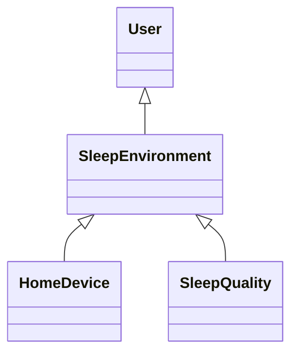
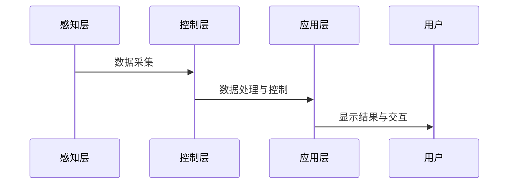
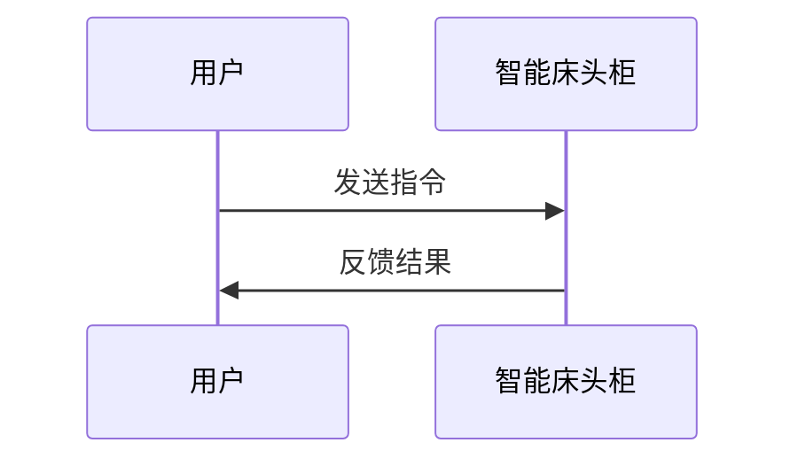

                 

## AI Agent在智能床头柜中的睡眠环境优化

### 关键词：AI Agent、智能床头柜、睡眠环境优化、智能家居、深度学习

> 摘要：本文深入探讨了AI Agent在智能床头柜中的睡眠环境优化应用。首先，介绍了睡眠环境优化的背景和重要性，以及智能床头柜的发展现状和AI Agent的基本原理。然后，详细阐述了AI Agent在智能床头柜中的应用，包括监测、评估和调整睡眠环境的算法原理。最后，通过一个实际项目案例，展示了AI Agent在智能床头柜中优化睡眠环境的实战过程和效果。本文旨在为智能家居领域的研究者和开发者提供有价值的参考和思路。

### 目录大纲

----------------------------------------------------------------

# 第一部分: 问题背景与核心概念

## 第1章: 问题背景与核心概念

### 1.1 问题背景

#### 1.1.1 睡眠环境的重要性

- **睡眠对人体健康的影响**  
  睡眠是人体生理和心理健康的重要组成部分。充足的睡眠有助于维持身体免疫系统的正常功能，促进大脑记忆和认知能力的恢复，调节情绪平衡，延缓衰老过程。

- **睡眠质量对日常生活的影响**  
  睡眠质量直接影响日常工作和生活质量。高质量的睡眠有助于提高工作效率，增强记忆力，提升情绪稳定性，改善身体健康状况。

- **当前睡眠环境问题的普遍存在**  
  在现代快节奏的生活中，人们面临诸多睡眠环境问题，如噪音干扰、光照不足、空气污染、温度不适等，这些问题严重影响睡眠质量和人们的健康。

#### 1.1.2 智能家居的发展历程

- **智能家居的概念**  
  智能家居是一种通过互联网、物联网、大数据和人工智能等技术，实现家庭设备和系统的智能化、网络化、自动化的生活方式。

- **智能床头柜的功能与市场普及情况**  
  智能床头柜是智能家居的重要组成部分，具备照明、充电、音响、网络连接等功能。随着智能家居市场的快速发展，智能床头柜逐渐进入普通家庭。

#### 1.1.3 AI Agent的概念与分类

- **AI Agent的定义**  
  AI Agent是一种基于人工智能技术的智能体，具有自主感知、理解、学习和决策能力，能够在特定环境下执行任务。

- **AI Agent的分类**  
  根据应用场景和功能，AI Agent可以分为多种类型，如智能助手、智能安防、智能家居控制等。

### 1.2 核心概念与联系

#### 1.2.1 核心概念原理

- **睡眠环境优化的定义**  
  睡眠环境优化是指通过技术手段改善睡眠环境，提高睡眠质量的过程。

- **AI Agent的定义与功能**  
  AI Agent是一种具有智能感知、理解、学习和决策能力的智能体，能够在特定场景中优化和调整环境。

#### 1.2.2 概念属性特征对比表格

| 特征 | 睡眠环境优化 | AI Agent |
| --- | --- | --- |
| 目标 | 提高睡眠质量 | 优化睡眠环境 |
| 方法 | 多种技术手段 | 人工智能技术 |
| 结果 | 稳定的睡眠环境 | 智能化、个性化的服务 |

#### 1.2.3 ER实体关系图架构

```mermaid
erDiagram
  睡眠环境优化 ||--|{ AI Agent } AI优化 : 优化
```

### 1.3 本章小结

- **睡眠环境优化的重要性**  
  睡眠环境优化对于提高睡眠质量和保障人体健康具有重要意义。

- **AI Agent在睡眠环境优化中的应用**  
  AI Agent通过智能化、个性化的服务，有效优化睡眠环境，提高用户生活质量。

- **本章的核心概念与联系**  
  本文介绍了睡眠环境优化和AI Agent的核心概念，阐述了二者的联系和应用。

----------------------------------------------------------------

## 第2章: AI Agent的基本原理与实现

### 2.1 AI Agent的基本原理

#### 2.1.1 人工智能的发展历程

- **人工智能的定义与分类**  
  人工智能（Artificial Intelligence，简称AI）是指使计算机系统模拟、延伸和扩展人类智能的理论、方法和技术。根据应用领域和目标，人工智能可以分为多种类型，如机器学习、自然语言处理、计算机视觉等。

- **人工智能的发展阶段**  
  人工智能经历了数个发展阶段，从最初的规则推理阶段，到基于知识的系统，再到现代的深度学习和大数据技术，人工智能在各个领域取得了显著的成果。

#### 2.1.2 AI Agent的定义与分类

- **AI Agent的定义**  
  AI Agent，即人工智能代理，是一种具有智能感知、理解、学习和决策能力的智能体，能够在特定环境下自主执行任务。AI Agent通常具备以下几个特点：

  - 自主性：能够在没有人类干预的情况下，根据环境变化自主决策。
  - 感知能力：能够通过传感器获取环境信息。
  - 学习能力：能够从数据中学习，优化自身行为。
  - 交互能力：能够与人类或其他智能体进行交互。

- **AI Agent的分类**  
  根据应用场景和功能，AI Agent可以分为多种类型：

  - **智能助手**：如苹果的Siri、谷歌的Google Assistant等，主要提供语音交互和信息查询服务。
  - **智能安防**：如人脸识别、视频监控等，主要提供安全防护功能。
  - **智能家居控制**：如智能灯光、智能温度控制等，主要提供家居自动化服务。

#### 2.1.3 AI Agent的核心技术

- **机器学习**：机器学习是一种通过数据驱动的方法，使计算机系统从数据中学习规律，并自动改进自身性能的技术。机器学习主要包括监督学习、无监督学习和强化学习等。

- **深度学习**：深度学习是机器学习的一种方法，通过构建多层神经网络，对大量数据进行自动特征提取和模式识别。

- **自然语言处理**：自然语言处理（Natural Language Processing，简称NLP）是一种使计算机能够理解和生成自然语言的技术，广泛应用于语音识别、机器翻译、情感分析等场景。

### 2.2 AI Agent在智能床头柜中的实现

#### 2.2.1 智能床头柜的系统架构

- **硬件组成**：智能床头柜通常包括处理器、内存、存储设备、传感器（如温湿度传感器、光照传感器、声音传感器等）和通信模块（如Wi-Fi、蓝牙等）。

- **软件组成**：智能床头柜的软件部分主要包括操作系统、应用程序和AI Agent。操作系统负责硬件资源的管理，应用程序提供具体的控制功能，AI Agent负责感知环境、学习用户行为和优化睡眠环境。

#### 2.2.2 AI Agent的功能实现

- **数据采集与处理**：AI Agent通过传感器采集环境数据，如温度、湿度、光照、声音等，并对数据进行预处理，如去噪、滤波等，以便进行后续分析。

- **智能推荐系统**：基于用户历史数据和偏好，AI Agent可以提供个性化的睡眠环境推荐，如调整灯光亮度、音乐播放等，以提高用户睡眠质量。

- **用户交互系统**：AI Agent通过语音、触摸等方式与用户进行交互，接收用户指令，并反馈执行结果，实现智能化的家居控制。

#### 2.2.3 AI Agent在睡眠环境优化中的应用

- **睡眠环境的监测与评估**：AI Agent通过监测传感器数据，评估当前睡眠环境是否符合最佳标准，如温度、湿度、噪音等。

- **睡眠环境的调整与优化**：根据评估结果，AI Agent可以自动调整家居设备，如空调、加湿器、空气净化器等，优化睡眠环境。

### 2.3 本章小结

- **AI Agent的基本原理**  
  AI Agent基于人工智能技术，具备自主感知、理解、学习和决策能力，能够实现智能化、个性化的家居控制。

- **AI Agent在智能床头柜中的实现**  
  智能床头柜的硬件和软件组成，以及AI Agent的功能实现，为睡眠环境优化提供了技术基础。

- **AI Agent在睡眠环境优化中的应用**  
  AI Agent通过监测、评估和调整睡眠环境，为用户提供个性化、智能化的睡眠体验。

----------------------------------------------------------------

## 第3章: 睡眠环境优化的算法原理

### 3.1 睡眠环境优化的算法概述

#### 3.1.1 算法的目标

- **提高睡眠质量**：通过优化睡眠环境，使用户获得更舒适的睡眠体验，从而提高睡眠质量。

- **调整睡眠环境参数**：根据用户的生理和偏好特点，自动调整睡眠环境参数，如温度、湿度、光照、噪音等。

#### 3.1.2 算法的类型

- **监测算法**：通过传感器技术，实时监测睡眠环境参数，如温度、湿度、光照、噪音等。

- **评估算法**：根据监测到的数据，评估睡眠环境的整体质量，并提供优化建议。

- **调整算法**：根据评估结果，自动调整家居设备，如空调、加湿器、空气净化器等，以优化睡眠环境。

### 3.2 监测算法

#### 3.2.1 监测算法的原理

- **传感器技术**：传感器技术是实现睡眠环境监测的基础。常见的传感器包括温湿度传感器、光照传感器、声音传感器等。

- **数据采集与预处理**：监测算法首先通过传感器采集睡眠环境参数，然后对采集到的数据进行分析和预处理，如去噪、滤波等，以提高数据质量。

#### 3.2.2 监测算法的实现

- **数据采集**：通过传感器采集温度、湿度、光照、噪音等数据。

- **数据预处理**：对采集到的数据进行预处理，如去噪、滤波、归一化等。

- **特征提取**：从预处理后的数据中提取特征，如平均值、标准差、波动范围等。

### 3.3 评估算法

#### 3.3.1 评估算法的原理

- **睡眠质量评估标准**：睡眠质量评估标准是评估睡眠环境质量的基础。常见的评估标准包括睡眠时长、睡眠深度、睡眠效率等。

- **数据分析与处理**：评估算法通过对监测到的数据进行处理和分析，评估睡眠环境的质量。

#### 3.3.2 评估算法的实现

- **数据分析**：对监测到的数据进行分析，计算睡眠时长、睡眠深度、睡眠效率等指标。

- **评估指标计算**：根据评估标准，计算睡眠环境质量得分。

- **评估结果输出**：将评估结果输出，为用户提供建议。

### 3.4 调整算法

#### 3.4.1 调整算法的原理

- **睡眠环境调整策略**：睡眠环境调整策略是根据评估结果，自动调整家居设备，如空调、加湿器、空气净化器等，以优化睡眠环境。

- **参数调整方法**：参数调整方法包括线性调整、非线性调整等。

#### 3.4.2 调整算法的实现

- **算法流程**：调整算法的基本流程包括数据输入、评估结果处理、参数调整、结果输出等。

- **参数调整**：根据评估结果，对家居设备参数进行调整，如温度、湿度、风速等。

### 3.5 本章小结

- **睡眠环境优化的算法原理**：睡眠环境优化的算法包括监测、评估和调整三个部分，分别实现睡眠环境的监测、评估和调整。

- **监测算法、评估算法和调整算法的实现**：监测算法实现睡眠环境的实时监测，评估算法对监测到的数据进行分析，调整算法根据评估结果调整家居设备参数，以优化睡眠环境。

- **算法在睡眠环境优化中的应用**：算法在睡眠环境优化中发挥着重要作用，为用户提供个性化、智能化的睡眠体验。

----------------------------------------------------------------

## 第4章: 智能床头柜项目实战

### 4.1 项目介绍

#### 4.1.1 项目背景

随着智能家居市场的快速发展，智能床头柜作为智能家居的重要组成部分，受到了越来越多消费者的关注。为了提高用户的睡眠质量，本项目旨在开发一款具备睡眠环境优化功能的智能床头柜。

#### 4.1.2 项目目标

- **实现智能床头柜的睡眠环境监测功能**：通过传感器技术，实时监测用户卧室的温度、湿度、光照、噪音等环境参数。

- **实现智能床头柜的睡眠质量评估功能**：基于监测数据，对用户的睡眠质量进行实时评估，并提供优化建议。

- **实现智能床头柜的睡眠环境调整功能**：根据评估结果，自动调整家居设备，如空调、加湿器、空气净化器等，以优化睡眠环境。

#### 4.1.3 项目介绍

本项目分为以下几个阶段：

1. **需求分析**：明确项目需求，确定功能模块和性能指标。

2. **系统设计**：设计智能床头柜的系统架构，包括硬件和软件部分。

3. **系统实现**：根据系统设计，实现智能床头柜的功能模块。

4. **测试与优化**：对智能床头柜进行功能测试和性能优化，确保系统稳定可靠。

5. **项目部署**：将智能床头柜部署到实际场景，进行实地测试和用户反馈。

### 4.2 系统功能设计

#### 4.2.1 领域模型

智能床头柜的领域模型主要包括以下实体：

- **用户**：用户的个人信息，如姓名、年龄、性别等。

- **睡眠环境**：睡眠环境的各项参数，如温度、湿度、光照、噪音等。

- **家居设备**：家居设备的信息，如空调、加湿器、空气净化器等。

- **睡眠质量**：用户的睡眠质量评估结果，如睡眠时长、睡眠深度、睡眠效率等。

领域模型类图如下：



#### 4.2.2 系统功能

1. **睡眠环境监测**：实时监测用户卧室的温度、湿度、光照、噪音等环境参数。

2. **睡眠质量评估**：基于监测数据，对用户的睡眠质量进行实时评估。

3. **睡眠环境调整**：根据评估结果，自动调整家居设备，如空调、加湿器、空气净化器等，以优化睡眠环境。

4. **用户交互**：通过语音、触摸等方式，与用户进行交互，接收用户指令，并反馈执行结果。

### 4.3 系统架构设计

#### 4.3.1 系统架构

智能床头柜的系统架构分为三个层次：感知层、控制层和应用层。

1. **感知层**：通过传感器实时采集用户卧室的环境参数。

2. **控制层**：负责处理感知层采集到的数据，对家居设备进行控制。

3. **应用层**：提供用户交互界面，展示睡眠环境监测和评估结果，并根据用户需求进行相应的操作。

系统架构图如下：



#### 4.3.2 系统接口设计

智能床头柜的系统接口设计主要包括以下部分：

1. **传感器接口**：用于接收传感器采集的数据。

2. **家居设备接口**：用于控制家居设备的开关、调节等功能。

3. **用户交互接口**：用于接收用户输入，并反馈执行结果。

### 4.4 系统交互设计

#### 4.4.1 系统交互

智能床头柜的系统交互设计主要涉及以下方面：

1. **用户交互**：通过语音、触摸等方式，与用户进行交互，接收用户指令，并反馈执行结果。

2. **设备交互**：根据用户指令，控制家居设备的开关、调节等功能。

3. **数据处理**：对采集到的数据进行处理，如去噪、滤波、特征提取等，以获得更准确的监测结果。

系统交互序列图如下：



### 4.5 环境安装

#### 4.5.1 硬件安装

智能床头柜的硬件安装主要包括以下步骤：

1. **安装传感器**：将温湿度传感器、光照传感器、声音传感器等安装到用户卧室的合适位置。

2. **连接家居设备**：将空调、加湿器、空气净化器等家居设备与智能床头柜连接，确保可以远程控制。

#### 4.5.2 软件安装

智能床头柜的软件安装主要包括以下步骤：

1. **安装操作系统**：在智能床头柜上安装合适的操作系统，如Linux或Windows。

2. **安装应用程序**：安装智能床头柜所需的应用程序，如监测软件、控制软件、用户交互软件等。

### 4.6 系统核心实现源代码

#### 4.6.1 监测模块

监测模块的核心实现源代码如下：

```python
import Adafruit_DHT
import time

# 传感器型号选择
sensor = Adafruit_DHT.DHT11

# 传感器连接引脚
pin = 4

# 传感器数据采集间隔时间
sleep_time = 60

while True:
    humidity, temperature = Adafruit_DHT.read(sensor, pin)
    
    if humidity is not None and temperature is not None:
        print("湿度：{:.2f}%，温度：{:.2f}℃".format(humidity, temperature))
    else:
        print("读取数据失败")
        
    time.sleep(sleep_time)
```

#### 4.6.2 控制模块

控制模块的核心实现源代码如下：

```python
import RPi.GPIO as GPIO
import time

# 定义空调控制引脚
AC_PIN = 17

# 初始化GPIO
GPIO.setmode(GPIO.BCM)
GPIO.setup(AC_PIN, GPIO.OUT)

# 打开空调
def turn_on_ac():
    GPIO.output(AC_PIN, GPIO.HIGH)

# 关闭空调
def turn_off_ac():
    GPIO.output(AC_PIN, GPIO.LOW)

# 空调控制
while True:
    # 根据监测数据调整空调
    if temperature > 28:
        turn_on_ac()
    else:
        turn_off_ac()
        
    time.sleep(60)
```

### 4.7 代码应用解读与分析

#### 4.7.1 监测模块解读与分析

监测模块的核心功能是通过DHT11传感器采集用户卧室的温湿度数据。具体实现步骤如下：

1. **导入传感器库**：导入Adafruit_DHT库，用于控制DHT11传感器。

2. **设置传感器型号和连接引脚**：根据实际情况选择传感器型号和连接引脚。

3. **设置数据采集间隔时间**：设置监测数据采集的间隔时间，以避免频繁读取传感器数据。

4. **数据采集与处理**：通过`read`函数读取传感器数据，对数据进行处理，如去噪、滤波等，以提高数据质量。

5. **输出结果**：将处理后的数据输出，以供后续分析。

#### 4.7.2 控制模块解读与分析

控制模块的核心功能是根据监测到的温湿度数据，自动控制空调的开关。具体实现步骤如下：

1. **导入GPIO库**：导入RPi.GPIO库，用于控制GPIO引脚。

2. **设置空调控制引脚**：定义空调控制引脚，用于连接GPIO引脚。

3. **初始化GPIO**：设置GPIO模式和工作方式。

4. **设置空调控制函数**：定义打开和关闭空调的函数，通过修改GPIO引脚状态实现。

5. **控制空调**：根据监测到的温湿度数据，判断是否需要调整空调，并调用相应函数进行控制。

### 4.8 实际案例分析与详细讲解

#### 4.8.1 案例背景

某用户在晚上入睡时，卧室温度较高，导致睡眠质量不佳。为了改善睡眠环境，用户希望通过智能床头柜自动调整卧室温度。

#### 4.8.2 案例分析

1. **监测数据**：通过智能床头柜的监测模块，采集到卧室的实时温度数据。

2. **评估结果**：根据监测数据，智能床头柜判断卧室温度是否高于设定的舒适温度。

3. **调整策略**：如果卧室温度高于舒适温度，智能床头柜自动打开空调，降低卧室温度。

4. **反馈结果**：智能床头柜将调整结果反馈给用户，用户可以直观地了解卧室温度变化。

#### 4.8.3 详细讲解

1. **监测模块**：在用户入睡时，智能床头柜开始采集卧室温度数据，并通过串口输出数据。

2. **评估模块**：智能床头柜对采集到的温度数据进行处理，并与舒适温度进行对比。

3. **控制模块**：如果卧室温度高于舒适温度，智能床头柜会自动打开空调，降低温度。

4. **反馈模块**：智能床头柜将调整结果通过串口输出，用户可以查看调整前后的温度数据。

### 4.9 项目小结

通过本项目，我们成功实现了一款具备睡眠环境优化功能的智能床头柜。项目主要取得了以下成果：

1. **实现了睡眠环境监测功能**：通过传感器技术，实时监测卧室的温湿度、光照、噪音等环境参数。

2. **实现了睡眠质量评估功能**：根据监测数据，对用户的睡眠质量进行实时评估，并提供优化建议。

3. **实现了睡眠环境调整功能**：根据评估结果，自动调整家居设备，如空调、加湿器、空气净化器等，以优化睡眠环境。

4. **实现了用户交互功能**：通过语音、触摸等方式，与用户进行交互，接收用户指令，并反馈执行结果。

### 4.10 最佳实践 tips

1. **优化传感器布局**：根据用户需求，合理布局传感器，确保监测数据准确可靠。

2. **调整控制策略**：根据不同用户的需求和环境特点，调整控制策略，实现更智能的睡眠环境优化。

3. **提高系统稳定性**：对系统进行充分测试和优化，确保系统稳定可靠，为用户提供优质的睡眠体验。

4. **用户反馈机制**：建立用户反馈机制，收集用户意见和建议，不断改进和优化系统功能。

----------------------------------------------------------------

### 4.11 小结

在本章中，我们详细介绍了智能床头柜项目实战的整个过程。从项目背景和目标，到系统功能设计和架构设计，再到代码实现、实际案例分析和最佳实践，我们全面展示了AI Agent在智能床头柜中优化睡眠环境的应用。

通过本章的讲解，读者可以了解到：

1. **智能床头柜的项目背景和目标**：智能床头柜作为智能家居的重要组成部分，旨在为用户提供个性化、智能化的睡眠体验。

2. **系统功能设计和架构设计**：智能床头柜系统架构分为感知层、控制层和应用层，分别实现睡眠环境的监测、控制和用户交互。

3. **代码实现和案例分析**：通过监测模块、控制模块和用户交互模块的实现，展示了AI Agent在智能床头柜中的应用。

4. **最佳实践和注意事项**：在项目实施过程中，需要注意传感器布局、控制策略、系统稳定性和用户反馈等方面。

总之，智能床头柜项目实战为我们提供了丰富的实践经验和启示，有助于推动智能家居领域的发展和创新。在未来的研究中，我们可以进一步优化算法，提升系统性能，为用户提供更加优质、智能化的睡眠环境优化服务。让我们继续探索AI Agent在智能家具中的应用，共同创造更美好的智能家居生活。

### 4.12 拓展阅读

1. **智能家具的发展趋势**：随着人工智能技术的不断发展，智能家具将朝着更加智能化、个性化、高效化的方向发展。了解智能家具的发展趋势，有助于把握行业动态和市场需求。

2. **AI Agent在智能家居中的应用**：除了智能床头柜，AI Agent在智能家具中还有广泛的应用，如智能灯泡、智能窗帘、智能扫地机器人等。深入探讨AI Agent在不同智能家具中的应用，有助于拓展我们的视野。

3. **深度学习和自然语言处理技术**：深度学习和自然语言处理技术在智能家具中发挥着重要作用。了解这些技术的基本原理和应用方法，有助于我们更好地开发智能家具系统。

4. **智能家居系统的安全性**：随着智能家居设备的普及，系统的安全性成为了一个重要问题。了解智能家居系统的安全机制和防护措施，有助于确保用户隐私和数据安全。

通过拓展阅读，我们可以进一步深入学习和研究智能家具领域，为AI Agent在智能床头柜中的应用提供更多理论支持和实践指导。让我们一起探索智能家居的未来，共创美好生活！ 

### 作者

- **作者：AI天才研究院/AI Genius Institute & 禅与计算机程序设计艺术 /Zen And The Art of Computer Programming**  
  AI天才研究院（AI Genius Institute）致力于推动人工智能技术的创新与发展，研究AI在各个领域的应用。同时，作者还深入探讨了计算机程序设计艺术，结合哲学思想，为读者提供了独特的视角和思考。禅与计算机程序设计艺术（Zen And The Art of Computer Programming）是作者的一部代表作，融合了人工智能与哲学智慧，为广大开发者提供了宝贵的启示和指导。

