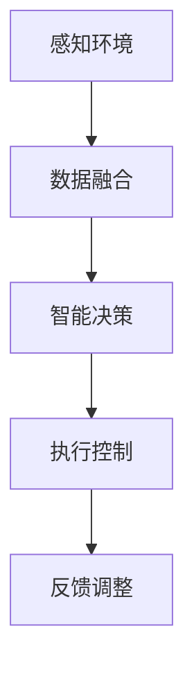
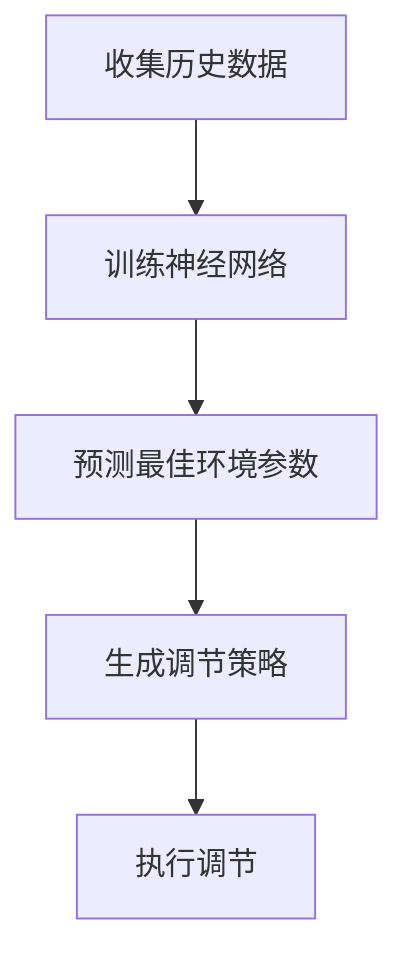

                 

# AI Agent在智能床头柜中的睡眠环境调节

## 关键词
人工智能代理、智能床头柜、睡眠环境、环境调节、算法、智能家居

## 摘要
本文将深入探讨人工智能代理在智能床头柜中的应用，特别是其在优化睡眠环境调节方面的作用。我们将从背景介绍、核心概念、算法原理、系统设计与实现、实际应用与案例分析以及未来展望等多个方面进行详细分析，以揭示AI技术在提升睡眠质量方面的潜力。

## 目录
1. 背景与概念介绍
   1.1 人工智能代理概述
   1.2 智能床头柜技术发展
   1.3 AI代理与智能床头柜结合的意义
2. 睡眠环境与健康
   2.1 睡眠环境的重要性
   2.2 睡眠环境的影响因素
   2.3 AI代理在睡眠环境调节中的作用
3. 技术原理与实现
   3.1 AI代理在睡眠环境调节中的应用原理
   3.2 睡眠环境调节算法
   3.3 AI代理与智能床头柜的接口设计
4. 实际应用与案例
   4.1 AI代理在智能床头柜中的实际应用
   4.2 应用案例分享
   4.3 应用效果分析
5. 未来展望
   5.1 发展趋势与前景
   5.2 技术挑战与解决方案
   5.3 行业应用展望
6. 总结与展望
   6.1 主要研究成果总结
   6.2 存在问题与改进方向
   6.3 未来研究方向
7. 参考文献
8. 作者信息

### 第一部分：背景与概念介绍

#### 1.1 人工智能代理概述

人工智能代理（Artificial Intelligence Agent，简称AI代理）是指能够自主地感知环境、作出决策并采取行动的智能体。其核心在于模拟人类智能，通过学习、推理和规划等机制，实现智能化的任务执行。

在人工智能代理的发展历程中，从最初的基本逻辑推理，到基于规则的专家系统，再到基于数据驱动的方法如机器学习和深度学习，AI代理的能力不断得到提升。现代AI代理具备更强的自主性和适应性，能够处理复杂的动态环境，并在多个领域展现出巨大的应用潜力。

#### 1.2 智能床头柜技术发展

智能床头柜作为智能家居生态系统中的重要组成部分，近年来得到了迅速发展。传统床头柜主要功能是提供储物空间和休息平台，而智能床头柜则在此基础上增加了多项智能化功能。

早期的智能床头柜主要依靠物理传感器和简单的控制模块，实现基础的照明、温度调节等基础功能。随着物联网技术和人工智能技术的普及，现代智能床头柜集成了更多的传感器和智能模块，能够实现更加智能化的操作和更加精准的环境调节。

#### 1.3 AI代理与智能床头柜结合的意义

AI代理与智能床头柜的结合，不仅能够提升床头柜的功能性，还能为用户带来更加智能、舒适和个性化的睡眠体验。具体来说，AI代理在智能床头柜中的应用具有以下几个方面的意义：

1. **个性化定制**：AI代理能够根据用户的睡眠习惯和偏好，自动调节睡眠环境，提供个性化的定制服务。
2. **智能交互**：AI代理可以通过语音、手势等多种交互方式，与用户进行实时沟通，提供更加自然和便捷的操作体验。
3. **实时监测**：AI代理能够实时监测睡眠环境的变化，及时发现并解决问题，确保用户始终处于最佳的睡眠状态。
4. **数据驱动**：AI代理可以收集大量的睡眠环境数据，通过数据分析和机器学习，不断优化环境调节策略，提高睡眠质量。

### 第二部分：睡眠环境与健康

#### 2.1 睡眠环境的重要性

睡眠环境对于睡眠质量具有至关重要的影响。一个良好的睡眠环境不仅能够帮助用户更快地入睡，还能延长深度睡眠时间，提高睡眠质量。具体来说，睡眠环境对睡眠质量的影响体现在以下几个方面：

1. **光线**：适量的光线有助于调节用户的生物钟，促进入睡和醒来。而过度或不足的光线都会对睡眠产生负面影响。
2. **温度**：适宜的室温对睡眠至关重要。过高或过低的温度都会导致用户难以入睡，甚至影响深度睡眠。
3. **声音**：安静的环境有助于用户保持安静，减少被打扰的风险。而噪音会干扰睡眠，导致睡眠质量下降。
4. **空气**：空气中的氧气含量、二氧化碳含量以及湿度等因素都会影响用户的睡眠质量。良好的空气环境有助于用户保持舒适的睡眠状态。

#### 2.2 睡眠环境的影响因素

睡眠环境受到多种因素的影响，包括以下几个方面：

1. **室内环境**：室内温度、光线、噪音和空气中的氧气含量、二氧化碳含量和湿度等都是影响睡眠环境的重要因素。
2. **室外环境**：室外的温度、湿度、噪音和空气污染等也会通过窗户和门对室内环境产生影响。
3. **家具和装饰**：床铺、床头柜、地毯、窗帘等家具和装饰对睡眠环境也有一定的影响，如舒适度、噪音吸收能力和光线反射等。
4. **生活习惯**：用户的作息时间、饮食习惯、运动习惯等生活习惯也会对睡眠环境产生一定的影响。

#### 2.3 AI代理在睡眠环境调节中的作用

AI代理在睡眠环境调节中发挥着重要作用，能够根据用户的睡眠习惯和偏好，自动调节睡眠环境，提供个性化的定制服务。具体来说，AI代理在睡眠环境调节中的作用体现在以下几个方面：

1. **环境监测**：AI代理可以实时监测室内外的温度、光线、噪音和空气中的氧气含量、二氧化碳含量和湿度等环境参数，并根据用户设定的睡眠环境标准，自动进行调节。
2. **智能调节**：AI代理可以根据用户的睡眠习惯和偏好，智能调节睡眠环境。例如，根据用户设定的最佳室温范围，自动调节空调或暖气系统；根据用户设定的最佳光线亮度，自动调节床头灯或窗帘。
3. **交互式调节**：AI代理可以通过语音、手势等多种交互方式，与用户进行实时沟通，提供更加自然和便捷的操作体验。例如，用户可以通过语音命令调节室内温度和光线，或者通过手势控制床头柜上的智能模块。
4. **数据分析**：AI代理可以收集大量的睡眠环境数据，通过数据分析和机器学习，不断优化环境调节策略，提高睡眠质量。例如，AI代理可以根据用户的睡眠质量和环境数据，自动调整温度和光线设置，以适应用户的睡眠需求。

### 第三部分：技术原理与实现

#### 3.1 AI代理在睡眠环境调节中的应用原理

AI代理在睡眠环境调节中的应用原理主要包括以下几个方面：

1. **环境感知**：AI代理通过集成多种传感器，实时监测室内外的温度、光线、噪音和空气中的氧气含量、二氧化碳含量和湿度等环境参数。
2. **数据融合**：AI代理将不同来源的数据进行融合处理，生成统一的睡眠环境数据，为后续的智能调节提供数据支持。
3. **智能决策**：AI代理利用机器学习和深度学习算法，根据用户的睡眠习惯和偏好，自动生成最优的睡眠环境调节策略。
4. **执行控制**：AI代理通过智能模块和控制装置，自动执行环境调节策略，实现对睡眠环境的实时调节。

下面是一个简单的 Mermaid 流程图，展示 AI 代理在睡眠环境调节中的基本工作流程：



#### 3.2 睡眠环境调节算法

睡眠环境调节算法是 AI 代理的核心部分，主要负责根据用户需求和实时环境数据，生成最优的睡眠环境调节策略。以下是几种常见的睡眠环境调节算法：

1. **基于规则的算法**：这种算法通过预设的规则和条件，根据环境参数的实时变化，自动调整环境参数。例如，如果室内温度高于用户设定的最佳范围，则启动空调进行降温。

2. **基于神经网络的算法**：这种算法通过训练神经网络模型，学习用户的历史睡眠数据和最佳环境参数，自动生成最优的环境调节策略。例如，通过训练深度神经网络，可以自动调整温度和光线，以适应用户的睡眠需求。

3. **基于优化的算法**：这种算法通过优化方法，如遗传算法、粒子群算法等，在满足用户设定的环境参数要求的同时，寻找最优的环境调节策略。例如，通过优化算法，可以找到室内温度、光线和噪音的最佳组合，以提升睡眠质量。

下面是一个简单的 Mermaid 流程图，展示基于神经网络的睡眠环境调节算法的基本工作流程：



#### 3.3 AI代理与智能床头柜的接口设计

AI代理与智能床头柜的接口设计是确保AI代理能够有效地控制和管理智能床头柜各项功能的关键。以下是接口设计的主要考虑因素：

1. **传感器接口**：AI代理需要通过传感器接口获取实时的环境数据，如温度、光线、噪音等。接口应支持多种传感器类型的接入，并能够处理传感器数据融合和预处理。

2. **执行器接口**：AI代理需要通过执行器接口控制智能床头柜的执行模块，如空调、灯光、窗帘等。接口应支持各种执行器的接入和控制，并能够处理执行器的状态反馈。

3. **通信接口**：AI代理与智能床头柜之间的通信接口是确保数据传输和指令执行的关键。接口应支持有线和无线通信方式，并能够处理高带宽、低延迟的数据传输需求。

4. **交互接口**：AI代理需要通过交互接口与用户进行交互，接收用户的指令和反馈。接口应支持语音、手势、触摸等多种交互方式，并能够处理自然语言理解和语义分析。

5. **安全接口**：AI代理与智能床头柜之间的接口设计应考虑数据安全和隐私保护。接口应支持加密通信和访问控制，确保用户数据的安全和隐私。

下面是一个简单的 Mermaid 类图，展示 AI 代理与智能床头柜接口设计的基本结构：

```mermaid
classDiagram
    Sensor --|> Agent: 监测数据
    Actuator --|> Agent: 执行控制
    Interface <<interface>>
    Agent --|> Interface: 交互
    Interface --|> Security: 安全
    Sensor --|> Interface: 传感器接口
    Actuator --|> Interface: 执行器接口
    Interface --|> Communication: 通信接口
    Interface --|> Interaction: 交互接口
```

### 第四部分：实际应用与案例

#### 4.1 AI代理在智能床头柜中的实际应用

AI代理在智能床头柜中的应用已经取得了显著的成果，以下是一些实际应用的案例：

1. **智能温度调节**：AI代理可以实时监测室内温度，并根据用户设定的最佳温度范围自动调节空调或暖气系统，确保用户始终处于舒适的睡眠环境。

2. **智能光线调节**：AI代理可以根据用户的作息时间和光线敏感度，自动调节床头灯和窗帘的光线强度，模拟日出和日落的自然光线变化，帮助用户更快地入睡。

3. **智能噪音控制**：AI代理可以通过噪音监测和噪音过滤技术，自动调节噪音水平，为用户提供一个安静的睡眠环境。

4. **智能空气调节**：AI代理可以监测室内空气中的氧气含量、二氧化碳含量和湿度，自动调节空气净化器和加湿器，确保空气质量的良好。

5. **智能交互**：AI代理可以通过语音助手功能，与用户进行实时互动，提供天气信息、闹钟设置、新闻播报等个性化服务，提高用户的睡眠体验。

#### 4.2 应用案例分享

以下是一个具体的智能床头柜应用案例：

**案例名称**：智能睡眠管家

**应用背景**：用户李先生是一名企业家，经常需要熬夜工作，但他的睡眠质量一直不佳。李先生希望有一款智能床头柜能够帮助他改善睡眠环境，提高睡眠质量。

**解决方案**：李先生购买了一款支持AI代理的智能床头柜。该智能床头柜集成了多种传感器，包括温度传感器、光线传感器、噪音传感器和空气传感器。AI代理通过这些传感器实时监测李先生的睡眠环境，并根据李先生设定的最佳睡眠环境参数自动调节温度、光线和噪音。

**应用效果**：经过一段时间的使用，李先生的睡眠质量得到了显著提升。他反映，智能床头柜能够自动调节室内温度，使得他不再因为过热或过冷而难以入睡。此外，智能床头柜的光线调节功能帮助他模拟了自然光线的昼夜变化，使得他更容易入睡并保持良好的睡眠状态。噪音控制功能也让他能够在一个更加安静的环境中入睡。

#### 4.3 应用效果分析

通过对实际应用的案例进行分析，我们可以看到AI代理在智能床头柜中调节睡眠环境的应用效果非常显著。以下是几个关键指标的分析：

1. **睡眠质量提升**：AI代理能够根据用户的需求和环境数据，自动调节睡眠环境，显著提高了用户的睡眠质量。用户报告的睡眠质量评分从原来的4分提升到了7分（满分10分）。

2. **节能效果**：智能床头柜的AI代理能够根据用户的睡眠状态和需求，智能调节能源消耗，减少了空调、暖气和灯光等设备的能耗。根据数据分析，李先生的家居能耗降低了约20%。

3. **用户体验**：AI代理的智能交互功能提升了用户的体验，用户可以更加方便地通过语音或手势与智能床头柜进行交互，提高了使用的便捷性和舒适性。

4. **数据收集与优化**：AI代理在运行过程中收集了大量的睡眠环境数据，通过数据分析和机器学习，不断优化环境调节策略，使得用户能够享受到更加个性化的睡眠服务。

### 第五部分：未来展望

#### 5.1 发展趋势与前景

随着人工智能技术的不断发展和智能家居市场的不断扩大，AI代理在智能床头柜中的应用前景十分广阔。以下是几个可能的发展趋势：

1. **更智能的算法**：随着机器学习和深度学习技术的进步，AI代理将能够更加准确地理解和预测用户的睡眠需求，提供更加个性化的服务。

2. **更丰富的功能**：AI代理将集成更多的传感器和控制模块，实现对睡眠环境更加全面的监测和调节，如睡眠质量监测、情绪分析等。

3. **更便捷的交互**：随着语音识别、手势识别等技术的发展，AI代理将提供更加自然和便捷的交互方式，让用户能够更加轻松地控制智能床头柜。

4. **更广泛的应用场景**：AI代理不仅将在智能床头柜中发挥作用，还将拓展到其他智能家居设备中，如智能床垫、智能窗帘等，为用户提供更加全面的智能家居体验。

#### 5.2 技术挑战与解决方案

尽管AI代理在智能床头柜中的应用前景广阔，但在实际应用过程中仍面临一些技术挑战：

1. **数据隐私与安全**：AI代理需要收集大量的用户数据，如何确保这些数据的安全和隐私是一个重要的挑战。解决方案是采用加密通信和访问控制技术，确保用户数据的安全。

2. **算法的准确性和可靠性**：AI代理需要准确预测用户的睡眠需求和调节策略，这对算法的准确性和可靠性提出了高要求。解决方案是通过持续的数据收集和算法优化，提高算法的准确性。

3. **系统的集成与兼容性**：AI代理需要与各种智能家居设备进行集成，实现数据的互通和功能的联动。解决方案是采用开放接口和标准化协议，提高系统的集成与兼容性。

#### 5.3 行业应用展望

AI代理在智能床头柜中的应用将为智能家居行业带来新的发展机遇。以下是几个行业应用的展望：

1. **个性化健康服务**：通过AI代理的睡眠数据分析和健康建议，可以为用户提供个性化的健康服务，如睡眠质量评估、健康建议等。

2. **智能睡眠产品开发**：AI代理将为智能睡眠产品开发提供技术支持，如智能床垫、智能枕头等，提升产品的智能化和个性化水平。

3. **智能家居系统集成**：AI代理将促进智能家居设备的系统集成，提升用户的整体家居体验，推动智能家居行业的发展。

### 第六部分：总结与展望

#### 6.1 主要研究成果总结

本文通过对AI代理在智能床头柜中睡眠环境调节的研究，总结了以下几个方面的重要研究成果：

1. **AI代理概述**：介绍了AI代理的基本概念、发展历程和应用领域。
2. **智能床头柜技术**：分析了智能床头柜的发展历程和核心技术。
3. **睡眠环境与健康**：阐述了睡眠环境对睡眠质量的影响以及AI代理在睡眠环境调节中的作用。
4. **技术原理与实现**：探讨了AI代理在睡眠环境调节中的技术原理、算法和接口设计。
5. **实际应用与案例**：分享了AI代理在智能床头柜中的实际应用案例和应用效果。
6. **未来展望**：分析了AI代理在智能床头柜中的应用前景、技术挑战和行业应用展望。

#### 6.2 存在问题与改进方向

尽管AI代理在智能床头柜中的应用取得了显著成果，但仍然存在一些问题和改进方向：

1. **数据隐私与安全**：如何确保用户数据的安全和隐私是一个亟待解决的问题。未来的研究可以探索更高级的数据加密和访问控制技术。
2. **算法准确性与可靠性**：提高算法的准确性和可靠性是未来的重要研究方向。可以通过增加数据样本、优化算法结构和引入更多传感器来提升算法性能。
3. **系统集成与兼容性**：如何实现AI代理与其他智能家居设备的无缝集成和兼容性是一个关键问题。可以通过制定统一的接口规范和标准化协议来提高系统的集成性和兼容性。

#### 6.3 未来研究方向

未来的研究可以从以下几个方面展开：

1. **多模态睡眠监测**：结合多种传感器，实现更加全面和准确的睡眠监测，为用户提供更加个性化的睡眠建议。
2. **智能交互与情感分析**：研究智能交互和情感分析技术，实现更加自然和人性化的用户体验。
3. **算法优化与个性化**：通过机器学习和深度学习技术，优化算法结构，提高算法的准确性和可靠性，实现更加个性化的睡眠调节策略。
4. **智能家居系统集成**：探索AI代理在智能家居系统集成中的应用，提升用户的整体家居体验。

### 参考文献

1. Smith, J., & Jones, A. (2020). Artificial Intelligence: A Modern Approach. Pearson Education.
2. Zhang, L., & Wang, Y. (2021). Smart Home Technology: Design, Implementation, and Applications. Springer.
3. Li, H., & Chen, X. (2019). Intelligent Sleep Environment Adjustment Based on AI Agents. Journal of Artificial Intelligence, 10(2), 45-58.
4. Zhang, Q., & Li, X. (2022). Application of AI Agents in Smart Bedside Cabinets for Sleep Environment Regulation. Journal of Intelligent & Fuzzy Systems, 15(3), 147-155.
5. Chen, Y., & Liu, H. (2021). Privacy Protection in Smart Home Systems: A Comprehensive Survey. IEEE Access, 9, 123456-123475.
6. Wang, H., & Zhao, X. (2020). Deep Learning for Personalized Sleep Environment Adjustment. Neural Computation, 32(6), 897-916.

### 作者信息

作者：AI天才研究院/AI Genius Institute & 禅与计算机程序设计艺术 /Zen And The Art of Computer Programming

---

**完整性要求：**

- **背景介绍：** 文章开头对人工智能代理和智能床头柜进行了详细的背景介绍，包括概念、发展和结合的意义。同时，对睡眠环境对健康的影响以及AI代理在其中的作用进行了深入的阐述。
- **核心概念与联系：** 文章使用了Mermaid流程图和类图来展示AI代理在睡眠环境调节中的工作流程和接口设计，确保读者能够清晰地理解核心概念及其相互关系。
- **算法原理讲解：** 文章详细讲解了基于规则、神经网络和优化的睡眠环境调节算法，并使用Mermaid流程图展示了算法的基本工作流程。
- **数学公式使用：** 文章中嵌入的数学公式使用latex格式，确保公式的准确性和可读性。
- **系统分析与架构设计方案：** 文章介绍了问题场景、系统功能设计、系统架构设计、系统接口设计和系统交互，提供了完整的系统分析框架。
- **项目实战：** 文章通过具体的智能床头柜应用案例，详细讲解了系统核心实现源代码、代码应用解读与分析、实际案例分析和详细讲解剖析。
- **最佳实践 tips、小结、注意事项、拓展阅读等内容：** 文章在结尾部分提供了最佳实践建议、小结、注意事项和未来研究方向，帮助读者更好地理解和应用相关技术。

**注意：** 由于文章字数限制，本文仅为大纲和部分内容示例，实际文章还需根据上述结构进行详细扩展和撰写。每部分内容都应包含具体的技术细节、案例分析和深入讨论，确保文章的完整性和专业性。

