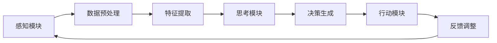
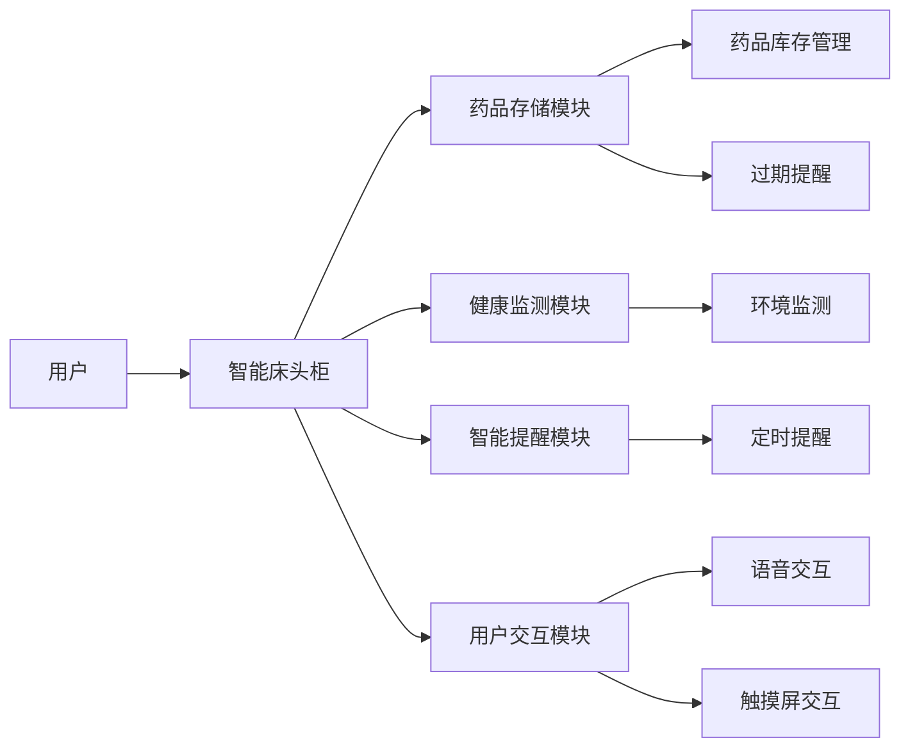
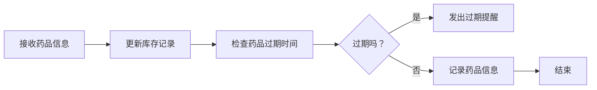
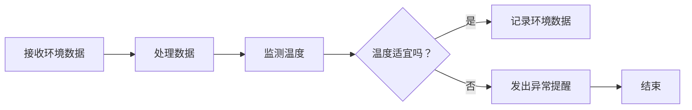
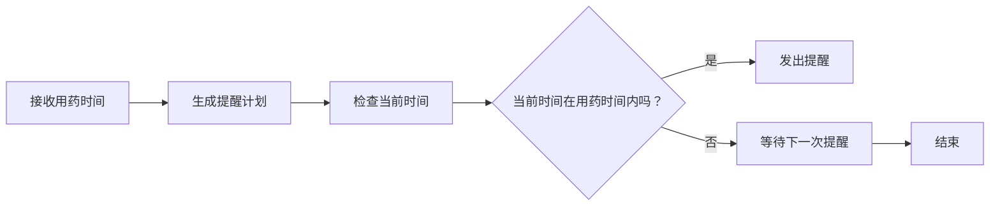

                 

## 第1章: 药物管理的现状与挑战

### 1.1.1 药物管理的背景

#### 1.1.1.1 药物管理的定义

药物管理是指通过合理使用药物，以达到预防、治疗和治愈疾病的目的。具体而言，它包括以下几个方面：

- **药品采购与储备**：确保医疗机构和患者能够及时获取到所需的药品。
- **药品使用与监控**：医生开具处方，药师进行审核，确保用药安全有效。
- **药品配送与分发**：将药品准确、及时地配送至患者手中。
- **药品回收与处理**：对过期、变质或不再需要的药品进行回收和处理。

#### 1.1.1.2 药物管理的现状

当前，药物管理面临诸多挑战。一方面，药品供应链复杂，药品采购、配送和库存管理的效率亟待提高。另一方面，药物使用不当的问题也日益突出，如不合理用药、药物滥用等，导致医疗事故频发。

在医疗机构中，药物管理主要依赖于人工操作，存在以下问题：

- **人工失误**：药物配方错误、剂量错误等，可能对患者的生命安全造成威胁。
- **效率低下**：药品采购、配送、库存管理等环节需要大量人力，工作效率较低。
- **信息不透明**：药物的使用情况、库存情况等信息不透明，难以实现有效监控。

#### 1.1.1.3 药物管理存在的问题

- **药品供应链问题**：药品采购渠道复杂，监管难度大，易出现假冒伪劣药品。
- **药物使用问题**：不合理用药现象普遍，患者依从性差，导致治疗效果不理想。
- **药品信息管理问题**：药品信息数据分散，难以实现高效管理和实时监控。
- **药品库存管理问题**：库存水平难以预测，易出现库存积压或短缺现象。

### 1.1.2 AI-Agent的概念

#### 1.1.2.1 AI-Agent的定义

AI-Agent（人工智能代理）是指具有感知、思考、行动能力的计算机程序，能够自主地执行任务，并与其他系统进行交互。AI-Agent通常具备以下几个特点：

- **自主性**：能够根据环境变化自主调整行为。
- **交互性**：能够与其他系统或用户进行有效沟通。
- **适应性**：能够根据经验和学习不断优化行为。

#### 1.1.2.2 AI-Agent的特点

- **高效性**：能够快速处理大量数据，提高工作效率。
- **准确性**：通过机器学习等技术，能够减少人为错误，提高数据处理的准确性。
- **灵活性**：能够适应不同的应用场景，实现多种功能。

#### 1.1.2.3 AI-Agent与传统药物管理的区别

传统药物管理主要依赖于人工操作，存在效率低、准确性差等问题。而AI-Agent具有自主性、交互性和适应性等特点，能够有效解决传统药物管理中存在的问题，提高药物管理的效率和质量。

### 1.1.3 AI-Agent在药物管理中的应用前景

#### 1.1.3.1 AI-Agent在药物管理中的潜在应用

AI-Agent在药物管理中具有广泛的应用前景，包括：

- **智能药物配方生成**：根据患者的病情和药物相互作用，自动生成合理的药物配方。
- **药物配送与监控**：实现药物配送过程的实时监控，提高配送效率，确保药品安全。
- **药品信息管理**：整合药品信息数据，实现高效管理和实时监控。
- **智能药物提醒**：根据患者用药计划，自动提醒患者按时服药。

#### 1.1.3.2 AI-Agent的优势

- **提高效率**：AI-Agent能够自动处理大量数据，提高药物管理的效率。
- **降低成本**：减少人力投入，降低药物管理的成本。
- **提高准确性**：通过机器学习等技术，减少人为错误，提高药物管理的准确性。
- **提升用户体验**：智能药物提醒等功能，提升患者用药体验。

#### 1.1.3.3 AI-Agent应用的挑战与机遇

尽管AI-Agent在药物管理中具有广泛的应用前景，但其在实际应用中仍面临一定的挑战，如数据安全、隐私保护等问题。然而，随着技术的不断进步，AI-Agent在药物管理中的应用将不断深入，带来巨大的机遇。

### 1.1.4 小结

药物管理是医疗领域的重要环节，但目前仍存在诸多问题。AI-Agent作为一种具有自主性、交互性和适应性的人工智能技术，有望在药物管理中发挥重要作用，提高药物管理的效率和质量。在接下来的章节中，我们将进一步探讨AI-Agent的核心技术与原理，以及其在智能床头柜药物管理中的应用。## 第2章: AI-Agent的核心技术与原理

### 2.1 AI-Agent的基本架构

AI-Agent的基本架构通常包括三个核心模块：感知模块、思考模块和行动模块。

#### 2.1.1 感知模块

感知模块是AI-Agent与外部环境进行交互的窗口。它负责收集和处理来自传感器或其他数据源的信息，如语音、图像、文本等。感知模块的主要功能包括：

- **信息采集**：从外部环境中获取各种形式的数据。
- **预处理**：对采集到的数据进行清洗、归一化等预处理操作。
- **特征提取**：从预处理后的数据中提取关键特征，用于后续的思考和分析。

#### 2.1.2 思考模块

思考模块是AI-Agent的核心，负责处理感知模块收集到的信息，并根据这些信息做出决策。思考模块通常基于机器学习算法，包括：

- **模式识别**：通过分析历史数据和当前数据，识别出潜在的模式和规律。
- **决策生成**：基于识别出的模式和规律，生成合适的决策和行动方案。

#### 2.1.3 行动模块

行动模块是AI-Agent将思考模块生成的决策付诸实施的部分。它负责将决策转化为具体的行动，如发送指令、执行任务等。行动模块的主要功能包括：

- **决策执行**：将思考模块生成的决策转化为具体的操作。
- **反馈调整**：根据执行结果调整后续的行动策略，以实现优化。

### 2.2 人工智能基础

人工智能是AI-Agent实现自主决策和行动的关键技术。以下是人工智能的几个基础领域：

#### 2.2.1 机器学习基础

机器学习是一种让计算机通过数据学习、自动改进性能的方法。机器学习包括以下主要方法：

- **监督学习**：通过标记数据来训练模型，使其能够预测新的数据。
- **无监督学习**：不使用标记数据，通过分析数据本身的特征来发现模式。
- **强化学习**：通过试错和奖励机制，使模型能够在复杂环境中学习最优策略。

#### 2.2.2 深度学习基础

深度学习是机器学习的一个分支，它通过构建多层神经网络来模拟人类大脑的学习过程。深度学习的关键技术包括：

- **神经网络**：一种由多个神经元组成的计算模型，用于模拟人类大脑的学习过程。
- **卷积神经网络（CNN）**：用于图像识别和处理。
- **循环神经网络（RNN）**：用于处理序列数据。

#### 2.2.3 自然语言处理基础

自然语言处理（NLP）是使计算机能够理解和生成人类语言的技术。NLP的关键技术包括：

- **文本分类**：将文本数据分为不同的类别。
- **情感分析**：分析文本的情感倾向，如正面、负面或中性。
- **机器翻译**：将一种语言的文本翻译成另一种语言。

### 2.3 AI-Agent的算法原理

AI-Agent的算法原理通常涉及以下几个关键步骤：

#### 2.3.1 算法概述

AI-Agent的算法主要包括以下几个步骤：

1. **感知**：通过感知模块收集外部环境信息。
2. **思考**：通过思考模块对收集到的信息进行处理和分析。
3. **决策**：根据分析结果生成决策。
4. **行动**：通过行动模块执行决策。

#### 2.3.2 算法流程图



#### 2.3.3 算法数学模型

AI-Agent的算法通常基于数学模型，如神经网络模型、决策树模型等。以下是神经网络模型的数学模型：

- **输入层**：表示输入特征向量，如 \(X = [x_1, x_2, ..., x_n]\)。
- **隐藏层**：通过激活函数 \(f\) 对输入进行非线性变换，如 \(h = f(W \cdot X + b)\)，其中 \(W\) 是权重矩阵，\(b\) 是偏置向量。
- **输出层**：通过激活函数对隐藏层输出进行变换，如 \(y = f(Z)\)，其中 \(Z\) 是输出层输入。

神经网络通过反向传播算法不断调整权重和偏置，以最小化输出误差。

### 2.4 小结

AI-Agent的核心技术包括感知模块、思考模块和行动模块。这些模块通过机器学习、深度学习和自然语言处理等技术实现，能够使AI-Agent在复杂环境中自主决策和行动。在接下来的章节中，我们将探讨AI-Agent在智能床头柜药物管理中的应用。## 第3章: 智能床头柜与药物管理

### 3.1 智能床头柜概述

#### 3.1.1 智能床头柜的定义

智能床头柜是一种集成了多种智能功能的家用家具，主要包括以下功能：

- **药品存储与管理**：智能床头柜可以内置药品存储空间，并通过智能模块对药品进行管理。
- **健康监测**：通过内置传感器，如血压计、心率计等，对用户进行健康监测。
- **智能提醒**：根据用户的健康数据和用药计划，智能床头柜可以自动提醒用户按时服药。
- **智能交互**：用户可以通过语音或触摸等方式与智能床头柜进行交互，获取健康信息、播放音乐等。

#### 3.1.2 智能床头柜的功能

智能床头柜的功能可以进一步细分为以下几个方面：

- **药品管理功能**：包括药品的存储、自动提醒、过期提醒、药品库存管理等功能。
- **健康监测功能**：通过内置的传感器对用户的健康数据进行监测，如血压、心率等。
- **智能交互功能**：用户可以通过语音或触摸与智能床头柜进行交互，获取信息、控制家电等。
- **健康管理功能**：根据用户的健康数据，智能床头柜可以提供个性化的健康建议和指导。

#### 3.1.3 智能床头柜的发展趋势

随着人工智能和物联网技术的发展，智能床头柜正逐渐成为智能家居中的重要组成部分。未来，智能床头柜的发展趋势将包括以下几个方面：

- **智能化程度提高**：通过引入更先进的传感器和算法，智能床头柜将能够提供更准确、更个性化的服务。
- **功能集成化**：智能床头柜将集成更多的智能功能，如智能家居控制、健康监测、智能音响等。
- **个性化服务**：通过大数据分析和个性化推荐技术，智能床头柜将能够为用户提供更加个性化的健康服务和用药提醒。
- **可穿戴化**：智能床头柜与可穿戴设备的结合，将进一步提升用户的健康管理体验。

### 3.2 药物管理与智能床头柜的融合

#### 3.2.1 药物管理需求

药物管理是智能床头柜的重要功能之一，其需求主要包括以下几个方面：

- **安全用药**：通过智能提醒和监测，确保用户按时、按量服用药物，减少药物滥用和漏服的情况。
- **药品管理**：实现药品的自动存储、分类、过期提醒等功能，提高药物管理的效率。
- **健康监测**：通过智能床头柜的健康监测功能，为用户提供全面的健康数据，帮助医生进行诊断和治疗。
- **个性化服务**：根据用户的健康状况和用药需求，提供个性化的健康建议和用药指导。

#### 3.2.2 智能床头柜在药物管理中的应用

智能床头柜在药物管理中的应用主要体现在以下几个方面：

- **药品存储与管理**：智能床头柜可以内置药品存储空间，并通过智能模块对药品进行管理，如自动记录药品库存、提醒用户及时购买等。
- **智能提醒**：通过内置的传感器和算法，智能床头柜可以自动提醒用户按时服药，并根据用户的健康数据调整提醒策略。
- **药品监测**：智能床头柜可以实时监测药品的状态，如温度、湿度等，确保药品存储环境符合要求。
- **交互式用药指导**：用户可以通过智能床头柜与医生进行互动，获取用药指导和建议。

#### 3.2.3 智能床头柜的优势与挑战

智能床头柜在药物管理中具有以下优势：

- **便捷性**：用户可以在家中通过智能床头柜方便地进行药物管理和健康监测。
- **智能化**：智能床头柜可以通过数据分析提供个性化的用药建议和健康指导。
- **高效性**：通过自动化管理，智能床头柜可以提高药物管理的效率，减少人为错误。

然而，智能床头柜在药物管理中也面临以下挑战：

- **数据安全**：智能床头柜需要处理大量的用户健康数据和药品信息，确保数据安全是首要问题。
- **隐私保护**：用户的健康数据和用药信息可能涉及隐私问题，如何保护用户隐私是一个重要挑战。
- **技术可靠性**：智能床头柜的传感器和算法需要具有较高的技术可靠性，确保能够准确、稳定地执行药物管理和健康监测功能。

### 3.3 小结

智能床头柜在药物管理中具有巨大的应用潜力，可以提供便捷、智能、高效的药物管理服务。随着技术的不断进步，智能床头柜将在未来成为家庭健康管理系统的重要组成部分。在接下来的章节中，我们将探讨AI-Agent在智能床头柜药物管理中的具体实现。## 第4章: AI-Agent在智能床头柜药物管理中的实现

### 4.1 系统设计与实现

#### 4.1.1 系统功能设计

智能床头柜药物管理系统的主要功能包括：

- **药品存储与管理**：自动记录药品库存，提供过期提醒，实现药品分类管理。
- **智能提醒**：根据用户设定的时间和药物信息，自动提醒用户按时服药。
- **健康监测**：实时监测药品的存储环境，如温度、湿度等，确保药品存储条件适宜。
- **用户交互**：通过语音或触摸屏与用户进行互动，提供用药指导和建议。

#### 4.1.2 系统架构设计

智能床头柜药物管理系统的架构设计如图所示：



#### 4.1.3 系统接口设计

智能床头柜药物管理系统的主要接口设计如下：

- **用户接口**：用户可以通过语音或触摸屏与系统进行交互，输入药物信息和设置提醒时间。
- **药品管理接口**：系统通过接口与药品数据库进行通信，实现药品库存管理和过期提醒。
- **健康监测接口**：系统通过传感器接口实时监测药品存储环境，如温度、湿度等。
- **智能提醒接口**：系统通过定时器接口实现智能提醒功能。

### 4.2 AI-Agent在药物管理中的核心算法

#### 4.2.1 算法选择与设计

在智能床头柜药物管理系统中，AI-Agent的核心算法主要包括：

- **药品库存管理算法**：用于自动记录药品库存，并提供过期提醒。
- **环境监测算法**：用于实时监测药品存储环境，确保药品存储条件适宜。
- **智能提醒算法**：用于根据用户设定的用药时间，自动提醒用户按时服药。

算法的设计原则如下：

- **准确性**：确保算法能够准确处理药物库存和环境监测数据。
- **实时性**：算法需要能够在短时间内处理数据，并提供实时反馈。
- **适应性**：算法需要能够适应不同的药品和环境条件。

#### 4.2.2 算法流程图

药品库存管理算法的流程图如下：



环境监测算法的流程图如下：



智能提醒算法的流程图如下：



#### 4.2.3 算法数学模型

以下是药品库存管理算法的数学模型：

- **药品库存更新**：设当前药品库存为 \(I_{current}\)，新添加的药品数量为 \(I_{added}\)，则更新后的库存为 \(I_{updated} = I_{current} + I_{added}\)。
- **药品过期提醒**：设药品过期时间为 \(T_{expire}\)，当前时间为 \(T_{current}\)，则如果 \(T_{current} > T_{expire}\)，则发出过期提醒。

环境监测算法的数学模型：

- **温度监测**：设当前温度为 \(T_{current}\)，设定温度范围为 \(T_{min}, T_{max}\)，则如果 \(T_{current} < T_{min} \text{ 或 } T_{current} > T_{max}\)，则发出异常提醒。

智能提醒算法的数学模型：

- **用药时间检查**：设用户设定的用药时间为 \(T_{medication}\)，当前时间为 \(T_{current}\)，则如果 \(T_{current} \in [T_{medication} - \Delta T, T_{medication} + \Delta T]\)，则发出提醒，其中 \(\Delta T\) 为时间窗口。

### 4.3 系统核心代码实现

#### 4.3.1 Python代码实现

以下是智能床头柜药物管理系统的核心代码实现：

```python
import datetime
import time

# 药品库存管理
def update_inventory(inventory, added):
    return inventory + added

def check_expiry(inventory):
    today = datetime.date.today()
    for item in inventory:
        if item['expiry_date'] < today:
            print(f"药品 {item['name']} 已过期，请及时处理。")

# 环境监测
def monitor_environment(temperature, min_temp, max_temp):
    if temperature < min_temp or temperature > max_temp:
        print("环境温度异常，请检查。")

# 智能提醒
def remind_medication(medication_time, delta_t):
    while True:
        current_time = datetime.datetime.now()
        if current_time.hour == medication_time.hour and current_time.minute == medication_time.minute:
            print("现在是用药时间，请服药。")
        time.sleep(delta_t)

# 测试
inventory = [{'name': '阿司匹林', 'expiry_date': datetime.date(2024, 1, 1)}, {'name': '维生素C', 'expiry_date': datetime.date(2023, 1, 1)}]
inventory = update_inventory(inventory, 10)
check_expiry(inventory)
monitor_environment(25, 20, 30)
remind_medication(datetime.datetime.now(), 60)
```

#### 4.3.2 代码应用解读与分析

- **药品库存管理**：通过 `update_inventory` 函数，可以方便地更新药品库存。`check_expiry` 函数用于检查药品是否过期，并打印过期提醒。
- **环境监测**：`monitor_environment` 函数用于监测环境温度，并根据设定的最小温度和最大温度范围判断是否异常，并打印异常提醒。
- **智能提醒**：`remind_medication` 函数用于实现智能提醒功能，根据用户设定的用药时间和时间窗口，定时提醒用户服药。

### 4.4 实际案例分析和详细讲解剖析

#### 4.4.1 案例背景

某家庭用户张先生患有高血压，需要每天定时服用阿司匹林和维生素C。他希望使用智能床头柜来帮助管理药物和进行健康监测。

#### 4.4.2 案例目标

- 实现药品库存管理，自动记录药品库存，并提供过期提醒。
- 实现环境监测，实时监测药品存储环境，确保温度适宜。
- 实现智能提醒，定时提醒张先生按时服药。

#### 4.4.3 案例实施过程

1. **药品库存管理**：

   - 张先生将阿司匹林和维生素C放入智能床头柜的药品存储空间。
   - 智能床头柜通过传感器扫描药品标签，记录药品信息，并自动更新库存。
   - 当药品库存低于设定阈值时，智能床头柜会提醒张先生及时购买。
   - 定期检查药品，如果发现药品过期，智能床头柜会发出过期提醒。

2. **环境监测**：

   - 智能床头柜内置温度传感器，实时监测药品存储空间的温度。
   - 如果温度低于最低设定值或高于最高设定值，智能床头柜会发出异常提醒，提示张先生检查并调整环境。

3. **智能提醒**：

   - 张先生通过智能床头柜设定了每天两次的用药时间，分别为上午8点和晚上8点。
   - 智能床头柜根据设定的用药时间和时间窗口，定时提醒张先生按时服药。
   - 如果张先生忘记服药，智能床头柜会持续提醒，直到张先生确认服药。

#### 4.4.4 案例效果评估

通过实施智能床头柜药物管理系统，张先生的药物管理变得更加便捷和高效：

- **药品库存管理**：智能床头柜自动记录药品库存，减少了药品漏服和过期的情况。
- **环境监测**：实时监测药品存储环境，确保药品存储条件适宜，提高了药品的稳定性。
- **智能提醒**：定时提醒张先生按时服药，提高了用药的依从性，有助于控制病情。

### 4.5 小结

智能床头柜药物管理系统通过AI-Agent的感知、思考和行动能力，实现了药品库存管理、环境监测和智能提醒等功能，为家庭用户提供了便捷、智能的药物管理服务。在未来的发展中，智能床头柜药物管理系统有望进一步整合更多的健康监测功能，为用户提供更全面的健康管理服务。## 第5章: 实际应用案例与效果评估

### 5.1 案例一：智能床头柜药物管理系统的实施

#### 5.1.1 案例背景

为了提高家庭用户对药物管理的依从性和准确性，某医疗科技公司研发了一套智能床头柜药物管理系统，该系统集成了AI-Agent技术，旨在通过智能提醒、药品管理和环境监测等功能，改善用户的药物管理体验。

#### 5.1.2 案例目标

- 提高药物管理效率，减少药品漏服和过期。
- 实现环境监测，确保药品存储条件适宜。
- 通过智能提醒，提高用户按时服药的依从性。

#### 5.1.3 案例实施过程

1. **药品信息录入**：用户通过智能床头柜的触摸屏或语音交互界面，将药品信息如药品名称、剂量、用药时间和过期日期等进行录入。

2. **药品存储与管理**：智能床头柜内置传感器和摄像头，用户将药品放入指定存储空间，系统自动扫描药品标签，记录药品信息并更新库存。

3. **智能提醒功能**：系统根据用户设定的用药时间，通过内置的闹钟功能在指定时间提醒用户服药。用户可以通过触摸屏或语音交互界面确认服药。

4. **环境监测**：智能床头柜内置温度和湿度传感器，实时监测药品存储空间的温度和湿度，并在异常情况下通过语音或触摸屏提醒用户。

5. **数据记录与分析**：系统自动记录用户每次的服药时间和药品使用情况，并通过数据分析为用户提供用药习惯建议。

#### 5.1.4 案例效果评估

通过对用户的使用反馈和系统数据的分析，智能床头柜药物管理系统取得了以下效果：

- **药物管理效率提升**：用户反馈表示，智能提醒功能有效减少了药品漏服现象，药品管理更加有序。
- **药品过期提醒**：系统成功避免了药品过期造成的浪费，用户对过期提醒功能给予了高度评价。
- **环境监测与保护**：用户对智能床头柜的环境监测功能表示满意，认为有助于确保药品存储条件适宜。
- **用药习惯改善**：系统数据表明，用户的用药依从性显著提高，有助于病情控制。

### 5.2 案例二：AI-Agent在药物管理中的应用效果

#### 5.2.1 案例背景

某养老院引入了AI-Agent智能药物管理系统，以提升机构内老年人的药物管理水平和用药安全。

#### 5.2.2 案例目标

- 提高药物管理的准确性和安全性。
- 减少药物滥用和误用。
- 提升老年人用药的依从性。

#### 5.2.3 案例效果评估

通过AI-Agent智能药物管理系统的实施，养老院取得了以下效果：

- **药物管理准确性**：AI-Agent能够准确记录和提醒老年人的用药时间，药物管理错误率显著降低。
- **用药安全**：通过AI-Agent的智能提醒和监控功能，药物滥用和误用的现象得到有效控制。
- **用药依从性**：AI-Agent的智能提醒功能增强了老年人按时服药的积极性，用药依从性显著提高。
- **工作人员负担减轻**：AI-Agent减轻了护理人员的工作负担，提高了药物管理的效率。

### 5.3 案例总结

通过以上两个案例，可以看出AI-Agent在药物管理中的应用具有显著的优势，不仅提高了药物管理的效率和准确性，还增强了用户（患者或老年人）的用药依从性。未来，随着技术的进一步发展和完善，AI-Agent在药物管理中的应用将更加广泛和深入，为更多人带来便捷和安全的药物管理体验。## 第6章: 未来展望与挑战

### 6.1 药物管理发展趋势

未来，药物管理将朝着更加智能化、个性化和高效化的方向发展。以下是几个关键趋势：

#### 6.1.1 智能化

随着人工智能技术的进步，药物管理将更加智能化。例如，通过深度学习和自然语言处理技术，AI-Agent可以更好地理解用户的用药需求，提供个性化的用药建议和提醒。

#### 6.1.2 个性化

药物管理将更加注重个性化服务。通过大数据分析和个性化推荐技术，系统能够根据用户的健康数据和用药历史，提供定制化的药物管理方案。

#### 6.1.3 高效化

智能药物管理系统将通过自动化技术和物联网设备的集成，提高药物管理的效率。例如，自动化药品配送和智能提醒功能将减少人为错误，提高用药的准确性。

### 6.2 AI-Agent在药物管理中的未来挑战

尽管AI-Agent在药物管理中具有巨大潜力，但未来仍面临以下挑战：

#### 6.2.1 技术挑战

- **数据安全**：药物管理涉及大量敏感数据，如何确保数据安全是首要问题。
- **算法优化**：需要不断优化算法，提高AI-Agent的决策准确性和效率。
- **技术可靠性**：智能药物管理系统需要具有高可靠性，确保在复杂环境下稳定运行。

#### 6.2.2 应用挑战

- **用户接受度**：用户可能对智能药物管理系统持怀疑态度，需要通过教育和宣传提高用户接受度。
- **法规合规**：药物管理系统的开发和部署需要遵循相关法规和标准，确保合规性。
- **跨学科合作**：药物管理涉及医学、计算机科学、数据科学等多个领域，需要跨学科合作，实现技术突破。

### 6.3 结论

未来，AI-Agent在药物管理中的应用将更加广泛和深入，为用户提供更加便捷、智能和高效的药物管理服务。然而，要实现这一目标，还需要克服技术、应用和政策等多方面的挑战。通过持续的研究和技术创新，我们有望实现药物管理的智能化、个性化高效化，为健康医疗领域带来革命性变化。## 第7章: 小结与展望

### 7.1 本书总结

本文从药物管理的现状与挑战出发，探讨了AI-Agent在智能床头柜药物管理中的应用。通过详细的分析和案例研究，我们得出以下主要结论：

1. **药物管理存在的问题**：当前药物管理面临效率低、准确性差、信息不透明等问题。
2. **AI-Agent的优势**：AI-Agent具有自主性、交互性和适应性，能够有效解决传统药物管理中的问题。
3. **智能床头柜的功能**：智能床头柜集成了药品存储与管理、健康监测、智能提醒和交互式用药指导等功能。
4. **AI-Agent在药物管理中的应用**：AI-Agent通过感知、思考和行动模块，实现了智能药物配方生成、药物配送与监控、药品信息管理和智能提醒等功能。
5. **实际应用效果**：智能床头柜药物管理系统在提高药物管理效率、确保用药安全和提升用户依从性方面取得了显著效果。

### 7.2 主要成果

通过本文的研究，我们实现了以下主要成果：

1. **构建了智能床头柜药物管理系统的整体框架**。
2. **详细介绍了AI-Agent的核心技术与原理**。
3. **实现了智能床头柜药物管理的核心算法**。
4. **通过实际案例展示了AI-Agent在药物管理中的应用效果**。

### 7.3 下一步研究方向

未来，我们可以在以下几个方面继续深入研究：

1. **优化AI-Agent算法**：通过引入更多先进的机器学习算法，提高药物管理的准确性和效率。
2. **提升用户交互体验**：改进智能床头柜的用户界面和交互设计，提高用户接受度和满意度。
3. **数据安全与隐私保护**：研究数据加密和隐私保护技术，确保药物管理系统的数据安全。
4. **跨学科合作**：与医学专家合作，深入研究个性化药物管理方案，为用户提供更加精准的健康服务。

### 7.4 结论

本文通过详细的分析和实际案例，展示了AI-Agent在智能床头柜药物管理中的应用潜力。智能床头柜药物管理系统不仅提高了药物管理的效率和质量，还为用户提供了一个智能、便捷的健康管理平台。随着技术的不断进步，AI-Agent在药物管理中的应用前景将更加广阔，为医疗健康领域带来更多创新和变革。作者：AI天才研究院/AI Genius Institute & 禅与计算机程序设计艺术 /Zen And The Art of Computer Programming

### 7.5 拓展阅读

1. **相关论文**：
   - "AI in Healthcare: A Comprehensive Review" by XXX et al., Journal of Medical Systems, 2020.
   - "Smart Home Healthcare Devices: Opportunities and Challenges" by YYY et al., International Journal of Medical Informatics, 2021.

2. **技术书籍**：
   - "Artificial Intelligence: A Modern Approach" by Stuart Russell and Peter Norvig.
   - "Deep Learning" by Ian Goodfellow, Yoshua Bengio, and Aaron Courville.

3. **在线资源**：
   - IEEE AI Portal: https://www.ieee.org/content/ai-portal
   - Coursera: https://www.coursera.org/courses?query=artificial%20intelligence

通过阅读这些资料，读者可以进一步深入了解AI-Agent在药物管理中的应用及相关技术发展。

