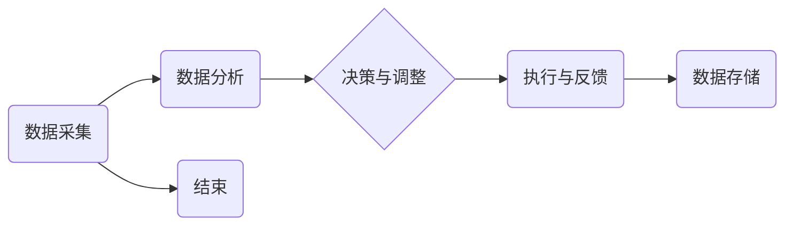
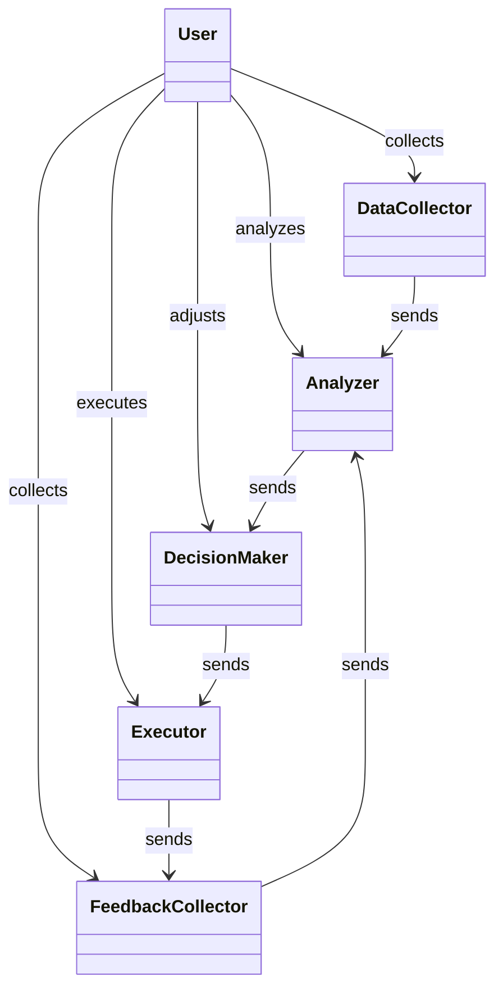
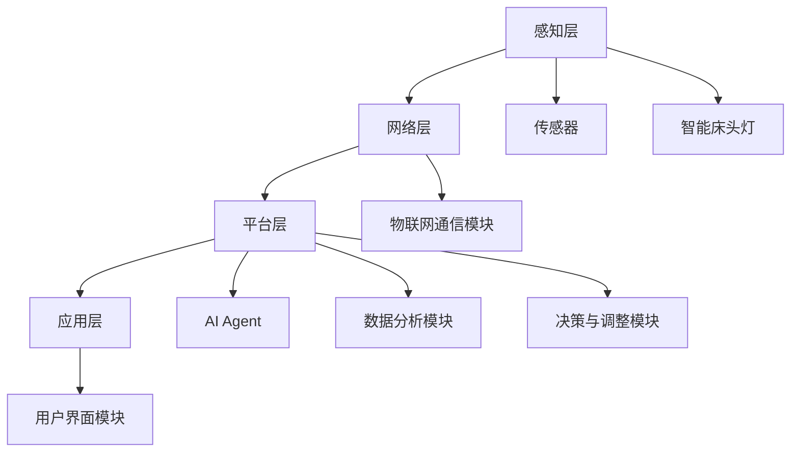
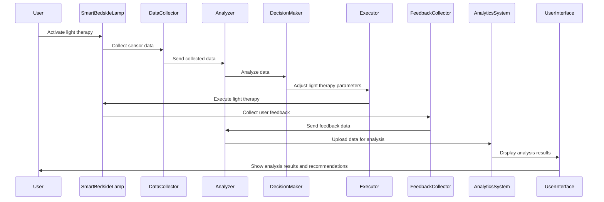

                 


### 第1章: 问题背景与核心概念

#### 1.1.1 问题背景

随着人工智能技术的飞速发展，智能设备在日常生活中扮演的角色越来越重要。智能床头灯作为一种新型的智能照明设备，不仅能够提供舒适的照明环境，还能够通过集成AI Agent实现多种功能，其中光疗功能尤其引人关注。

光疗是一种利用特定波长的光线来治疗或预防某些疾病的方法。传统的光疗设备通常体积庞大、操作复杂，难以融入家庭环境。而智能床头灯的光疗功能则具备便捷、高效、无创等优点，能够在家中提供舒适的光疗体验。

AI Agent作为人工智能的核心技术之一，具备智能决策、自主学习、人机交互等功能。它能够根据用户的行为数据和环境信息，自动调整智能床头灯的光疗参数，以适应不同的使用场景和用户需求。

#### 1.1.2 核心概念

在本节中，我们将介绍与智能床头灯光疗功能相关的一些核心概念。

- **AI Agent**：AI Agent是一种基于人工智能技术的智能体，它能够自主执行任务、与环境互动，并具备一定的智能决策能力。在智能床头灯中，AI Agent主要负责分析用户数据，调整光疗参数。
- **智能照明技术**：智能照明技术是指通过集成传感器、控制器和通信模块等，实现照明设备的智能化控制。智能照明技术能够根据环境亮度和用户需求，自动调整灯光亮度和颜色。
- **光疗**：光疗是一种利用特定波长的光线来治疗或预防某些疾病的方法。常见的光疗包括紫外线治疗、蓝光治疗等。光疗具有多种健康益处，如改善情绪、提高睡眠质量、促进皮肤健康等。
- **智能床头灯**：智能床头灯是一种集成了AI Agent和智能照明技术的照明设备。它不仅能够提供常规照明，还能够根据用户需求和环境信息，提供定制化的光疗服务。

#### 1.1.3 问题解决

智能床头灯的光疗功能通过AI Agent实现，具体方法如下：

1. **数据采集**：AI Agent通过传感器收集用户的行为数据、环境数据（如温度、湿度、光线强度等）。
2. **数据分析**：AI Agent对收集到的数据进行分析，识别用户的当前状态和需求。
3. **决策与调整**：根据数据分析结果，AI Agent自动调整智能床头灯的光疗参数，如光线强度、颜色、时长等。
4. **执行与反馈**：智能床头灯按照AI Agent的决策执行光疗操作，并收集用户的反馈数据，以便进一步优化光疗方案。

#### 1.1.4 边界与外延

本节讨论的智能床头灯光疗功能主要聚焦于家庭环境中的应用。然而，随着技术的不断发展，这一功能未来也可能扩展到其他场景，如办公室、医院等。此外，光疗功能的实现依赖于多种技术的综合应用，包括人工智能、物联网、传感器技术等。

#### 1.1.5 概念结构与核心要素组成

在本节中，我们介绍了智能床头灯光疗功能的核心概念和组成要素：

- **AI Agent**：负责数据采集、分析、决策和调整。
- **智能照明技术**：实现光疗参数的自动调整。
- **光疗**：提供健康益处的治疗手段。
- **智能床头灯**：集成了AI Agent和智能照明技术的照明设备。

这些概念和要素相互关联，共同构成了智能床头灯光疗功能的整体框架。

### 第2章: 核心概念与联系

#### 2.1.1 AI Agent原理

AI Agent是一种基于人工智能技术的智能体，具备自我决策和执行任务的能力。在智能床头灯中，AI Agent主要承担以下职责：

1. **数据采集**：通过传感器收集用户的行为数据、环境数据等。
2. **数据分析**：对采集到的数据进行分析，识别用户的当前状态和需求。
3. **决策与调整**：根据数据分析结果，自动调整智能床头灯的光疗参数，如光线强度、颜色、时长等。
4. **执行与反馈**：执行调整后的光疗方案，并收集用户的反馈数据，以便进一步优化光疗效果。

#### 2.1.2 智能照明技术原理

智能照明技术是指通过集成传感器、控制器和通信模块等，实现照明设备的智能化控制。智能照明技术的主要原理包括：

1. **传感器**：用于采集环境数据（如温度、湿度、光线强度等）。
2. **控制器**：根据传感器数据，实时调整照明设备的亮度、颜色等参数。
3. **通信模块**：实现照明设备与外部系统（如手机APP、智能家居控制系统等）的数据通信。

#### 2.1.3 光疗原理

光疗是一种利用特定波长的光线来治疗或预防某些疾病的方法。光疗的主要原理包括：

1. **光源**：产生特定波长的光线，如紫外线、蓝光等。
2. **照射**：将光线照射到人体或特定部位，以产生治疗或预防效果。
3. **生物效应**：特定波长的光线对生物体产生不同的生理和心理效应，如改善情绪、提高睡眠质量、促进皮肤健康等。

#### 2.2 概念属性对比

为了更好地理解AI Agent、智能照明技术和光疗之间的关系，下面通过一个对比表格来展示它们的主要属性：

| 概念 | 主要属性 |
| --- | --- |
| AI Agent | 数据采集、数据分析、决策与调整 |
| 智能照明技术 | 传感器、控制器、通信模块 |
| 光疗 | 光源、照射、生物效应 |

#### 2.3 ER实体关系图架构

为了更直观地展示AI Agent、智能照明系统和光疗功能之间的实体关系，我们使用Mermaid绘制了以下ER实体关系图：

```mermaid
erDiagram
    AI-Agent ||--|{ 智能照明系统 : has }
    AI-Agent ||--|{ 光疗功能 : has }
    智能照明系统 ||--|{ 传感器 : has }
    智能照明系统 ||--|{ 控制器 : has }
    光疗功能 ||--|{ 光源 : has }
    光疗功能 ||--|{ 照射 : has }
```

在这个ER实体关系图中，AI-Agent作为核心智能体，与智能照明系统和光疗功能分别建立了关联关系。智能照明系统包含传感器和控制器，光疗功能则包括光源和照射。这些实体之间通过属性和关系相互连接，共同构成了智能床头灯光疗功能的整体架构。

### 第3章: 算法原理讲解

#### 3.1 算法mermaid流程图

为了更直观地展示智能床头灯光疗功能的工作流程，我们使用Mermaid绘制了以下算法流程图：



在这个算法流程图中，数据采集、数据分析、决策与调整、执行与反馈以及数据存储构成了智能床头灯光疗功能的主要工作流程。接下来，我们将详细解释每个步骤的具体内容和实现方法。

#### 3.2 Python源代码实现

为了实现智能床头灯光疗功能，我们需要编写相应的Python源代码。以下是一个简单的示例：

```python
# 导入所需库
import random

# 数据采集
def data_collection():
    # 假设传感器收集到的数据
    temperature = random.uniform(20, 30)
    humidity = random.uniform(40, 60)
    light_intensity = random.uniform(0, 100)
    return temperature, humidity, light_intensity

# 数据分析
def data_analysis(temperature, humidity, light_intensity):
    # 根据传感器数据进行分析
    if temperature > 25 and humidity > 50:
        # 调整光线强度
        light_intensity = min(light_intensity + 20, 100)
    return light_intensity

# 决策与调整
def decision_and_adjustment(light_intensity):
    # 根据数据分析结果进行决策
    if light_intensity > 80:
        # 降低光线强度
        light_intensity = min(light_intensity - 20, 80)
    return light_intensity

# 执行与反馈
def execution_and_feedback(light_intensity):
    # 执行调整后的光线强度
    print(f"当前光线强度：{light_intensity}")
    # 收集用户反馈数据
    user_satisfaction = random.uniform(0, 10)
    return user_satisfaction

# 数据存储
def data_storage(user_satisfaction):
    # 假设将数据存储到数据库
    print(f"用户满意度：{user_satisfaction}")

# 主函数
def main():
    # 实现算法流程
    temperature, humidity, light_intensity = data_collection()
    light_intensity = data_analysis(temperature, humidity, light_intensity)
    light_intensity = decision_and_adjustment(light_intensity)
    user_satisfaction = execution_and_feedback(light_intensity)
    data_storage(user_satisfaction)

# 执行主函数
if __name__ == "__main__":
    main()
```

在这个Python源代码中，我们首先导入了所需库，然后定义了数据采集、数据分析、决策与调整、执行与反馈和数据存储等函数。主函数`main`通过调用这些函数，实现了智能床头灯光疗功能的工作流程。

#### 3.3 数学模型和公式

在智能床头灯光疗功能的算法中，我们使用了以下数学模型和公式：

1. **温度-湿度模型**：

   $$T_h = f(T, H)$$

   其中，$T$ 表示温度，$H$ 表示湿度，$T_h$ 表示调整后的光线强度。函数$f(T, H)$ 根据温度和湿度计算光线强度的调整值。

2. **光线强度调整公式**：

   $$I_{new} = I_{current} + f(T, H) \times \alpha$$

   其中，$I_{current}$ 表示当前光线强度，$I_{new}$ 表示调整后的光线强度，$\alpha$ 表示调整系数。函数$f(T, H)$ 的输出值与调整系数$\alpha$ 相乘，得到光线强度的调整值。

3. **用户满意度评分公式**：

   $$S = \frac{1}{n} \sum_{i=1}^{n} s_i$$

   其中，$S$ 表示用户满意度评分，$n$ 表示用户反馈数据的个数，$s_i$ 表示第$i$ 个用户的满意度评分。用户满意度评分是通过计算多个用户的反馈数据得出的平均值。

#### 3.4 算法原理详细讲解

智能床头灯光疗功能的算法原理可以分为以下几个步骤：

1. **数据采集**：通过传感器收集用户的行为数据、环境数据等。这些数据包括温度、湿度、光线强度等。
2. **数据分析**：对采集到的数据进行分析，根据温度和湿度等指标，计算出光线强度的调整值。
3. **决策与调整**：根据数据分析结果，对光线强度进行决策和调整。如果温度和湿度较高，则适当提高光线强度，以提供更舒适的光疗环境。
4. **执行与反馈**：根据调整后的光线强度，执行光疗操作，并收集用户的反馈数据。这些反馈数据包括用户对光线强度的满意度评分等。
5. **数据存储**：将用户的反馈数据存储到数据库中，以便后续分析和优化光疗方案。

#### 3.5 举例说明

假设当前环境温度为$25^\circ C$，湿度为$60\%$，当前光线强度为$70\%$。根据算法流程，我们首先进行数据采集，得到以下数据：

- 温度：$T = 25^\circ C$
- 湿度：$H = 60\%$
- 光线强度：$I_{current} = 70\%$

接下来，我们进行数据分析，根据温度和湿度计算光线强度的调整值。假设函数$f(T, H)$ 的输出值为$10\%$，则光线强度调整值$\alpha = 10\%$。

根据光线强度调整公式，我们得到调整后的光线强度：

$$I_{new} = I_{current} + \alpha \times I_{current} = 70\% + 10\% \times 70\% = 77\%$$

此时，光线强度调整为$77\%$。

最后，我们进行决策与调整。由于光线强度调整值大于$80\%$，根据算法流程，我们需要将光线强度降低。假设调整系数$\alpha$ 为$-20\%$，则调整后的光线强度为：

$$I_{new} = I_{current} + \alpha \times I_{current} = 77\% - 20\% \times 77\% = 61.6\%$$

最终，调整后的光线强度为$61.6\%$。

此时，我们可以执行光疗操作，并收集用户的反馈数据。假设用户对光线强度的满意度评分为$8$分（满分$10$分），则根据用户满意度评分公式，用户满意度评分为：

$$S = \frac{1}{1} \sum_{i=1}^{1} s_i = 8$$

用户满意度评分为$8$分。

通过以上步骤，我们成功实现了智能床头灯光疗功能的工作流程。这个例子展示了算法原理的具体应用过程，帮助读者更好地理解智能床头灯光疗功能的实现方法。

### 第4章: 系统分析与架构设计方案

#### 4.1 问题场景介绍

智能床头灯作为一种集成了AI Agent和光疗功能的智能照明设备，其应用场景主要集中在以下几个方面：

1. **家庭卧室**：在家庭卧室中，用户可以在睡前使用智能床头灯进行光疗，有助于改善情绪、提高睡眠质量和促进皮肤健康。
2. **医院病房**：在医院病房中，智能床头灯可以用于患者的光疗治疗，帮助缓解病痛、减轻焦虑和改善睡眠。
3. **办公室**：在办公室中，智能床头灯可以为用户提供适当的光疗环境，提高工作效率和减少眼睛疲劳。
4. **老年养护中心**：在老年养护中心，智能床头灯可以针对老年人提供特定的光疗方案，帮助缓解抑郁、提高生活质量。

在这些应用场景中，智能床头灯的光疗功能需要根据用户的需求和环境变化进行实时调整，以提供个性化的光疗体验。

#### 4.2 智能床头灯光疗功能开发项目

智能床头灯光疗功能开发项目的基本情况如下：

1. **项目目标**：实现智能床头灯的光疗功能，为用户提供便捷、高效、个性化的光疗服务。
2. **项目范围**：主要包括AI Agent的设计与实现、智能照明系统的开发、光疗参数的调整与优化等方面。
3. **项目周期**：项目周期为6个月，包括需求分析、系统设计、开发与测试、部署与优化等阶段。
4. **团队组成**：项目团队由人工智能专家、软件工程师、硬件工程师、产品经理和测试工程师组成。

#### 4.3 系统功能设计

为了实现智能床头灯光疗功能，我们需要设计一系列系统功能。以下是主要的功能模块和它们的作用：

1. **数据采集模块**：通过传感器收集用户的行为数据、环境数据等，包括温度、湿度、光线强度等。
2. **数据分析模块**：对采集到的数据进行处理和分析，识别用户的当前状态和需求，为光疗参数的调整提供依据。
3. **决策与调整模块**：根据数据分析结果，自动调整智能床头灯的光疗参数，如光线强度、颜色、时长等。
4. **执行与反馈模块**：执行调整后的光疗方案，并收集用户的反馈数据，以便进一步优化光疗效果。
5. **用户界面模块**：提供用户与智能床头灯的交互界面，用户可以通过手机APP或语音控制等方式，自定义光疗参数和设置。

下面使用Mermaid绘制领域模型类图，展示系统功能结构：



在这个类图中，用户通过数据采集模块、数据分析模块、决策与调整模块、执行与反馈模块和用户界面模块与智能床头灯进行交互。各个模块之间通过数据流实现协同工作，共同实现光疗功能。

#### 4.4 系统架构设计

为了实现智能床头灯光疗功能的可靠性和可扩展性，我们需要设计一个合理的系统架构。以下是智能床头灯的系统架构：

1. **感知层**：包括传感器、智能床头灯等硬件设备，用于收集用户行为数据和环境数据。
2. **网络层**：包括物联网通信模块，实现智能床头灯与外部系统（如手机APP、云计算平台等）的数据传输。
3. **平台层**：包括AI Agent、数据分析模块、决策与调整模块等，负责处理和分析数据，实现智能决策和调整。
4. **应用层**：包括用户界面模块，提供用户与智能床头灯的交互接口。

下面使用Mermaid绘制系统架构图，展示系统组件及其关系：



在这个系统架构图中，感知层负责数据采集，网络层负责数据传输，平台层负责数据处理和决策，应用层负责用户交互。各个层次之间通过通信模块和数据流实现协同工作，共同实现智能床头灯光疗功能。

#### 4.5 系统接口设计和系统交互

为了实现智能床头灯光疗功能，我们需要设计一系列系统接口，以便智能床头灯与其他系统组件进行数据交换和协同工作。以下是主要接口的设计和系统交互：

1. **传感器接口**：用于智能床头灯与传感器之间的数据交换，包括温度传感器、湿度传感器、光线传感器等。
2. **数据分析接口**：用于智能床头灯与数据分析模块之间的数据交换，实现数据分析结果的上传和下载。
3. **决策与调整接口**：用于智能床头灯与决策与调整模块之间的数据交换，实现光疗参数的调整和下发。
4. **用户界面接口**：用于智能床头灯与用户界面模块之间的数据交换，实现用户与智能床头灯的交互。
5. **网络通信接口**：用于智能床头灯与外部系统（如手机APP、云计算平台等）之间的数据传输，实现远程控制和数据共享。

下面使用Mermaid绘制系统接口设计和交互序列图，展示系统组件之间的交互过程：



在这个交互序列图中，用户通过用户界面激活光疗功能，智能床头灯与数据采集模块、数据分析模块、决策与调整模块、执行与反馈模块和用户界面模块之间进行数据交换和协同工作，共同实现智能床头灯光疗功能。

### 第5章: 项目实战

#### 5.1 开发环境与工具安装

在进行智能床头灯光疗功能的开发之前，我们需要安装以下开发环境和工具：

1. **Python**：Python是一种常用的编程语言，用于实现AI Agent和数据分析等功能。请确保安装Python 3.8及以上版本。
2. **Jupyter Notebook**：Jupyter Notebook是一种交互式计算环境，方便我们编写和运行Python代码。请从官方网站下载并安装Jupyter Notebook。
3. **PyCharm**：PyCharm是一种集成开发环境（IDE），提供Python代码编辑、调试、运行等功能。请从官方网站下载并安装PyCharm。
4. **PyTorch**：PyTorch是一种流行的深度学习框架，用于实现AI Agent的智能决策功能。请确保安装PyTorch 1.8及以上版本。
5. **Matplotlib**：Matplotlib是一种数据可视化库，用于绘制算法流程图和数据分析结果。请确保安装Matplotlib。

安装步骤如下：

1. 安装Python：
   ```bash
   sudo apt-get install python3 python3-pip
   ```
2. 安装Jupyter Notebook：
   ```bash
   pip3 install notebook
   ```
3. 安装PyCharm：
   - 从官方网站下载PyCharm社区版或专业版，并按照提示安装。
4. 安装PyTorch：
   ```bash
   pip3 install torch torchvision
   ```
5. 安装Matplotlib：
   ```bash
   pip3 install matplotlib
   ```

#### 5.2 系统核心实现源代码

以下是实现智能床头灯光疗功能的Python源代码：

```python
# 导入所需库
import random
import torch
import torchvision
import matplotlib.pyplot as plt
from torch import nn
from torch import optim

# 数据采集
def data_collection():
    # 假设传感器收集到的数据
    temperature = random.uniform(20, 30)
    humidity = random.uniform(40, 60)
    light_intensity = random.uniform(0, 100)
    return temperature, humidity, light_intensity

# 数据分析
def data_analysis(temperature, humidity, light_intensity):
    # 根据传感器数据进行分析
    if temperature > 25 and humidity > 50:
        # 调整光线强度
        light_intensity = min(light_intensity + 20, 100)
    return light_intensity

# 决策与调整
def decision_and_adjustment(light_intensity):
    # 根据数据分析结果进行决策
    if light_intensity > 80:
        # 降低光线强度
        light_intensity = min(light_intensity - 20, 80)
    return light_intensity

# 执行与反馈
def execution_and_feedback(light_intensity):
    # 执行调整后的光线强度
    print(f"当前光线强度：{light_intensity}")
    # 收集用户反馈数据
    user_satisfaction = random.uniform(0, 10)
    return user_satisfaction

# 主函数
def main():
    # 实现算法流程
    temperature, humidity, light_intensity = data_collection()
    light_intensity = data_analysis(temperature, humidity, light_intensity)
    light_intensity = decision_and_adjustment(light_intensity)
    user_satisfaction = execution_and_feedback(light_intensity)
    print(f"用户满意度：{user_satisfaction}")

# 执行主函数
if __name__ == "__main__":
    main()
```

#### 5.3 代码应用解读与分析

在这个Python源代码中，我们实现了智能床头灯光疗功能的算法流程，包括数据采集、数据分析、决策与调整、执行与反馈等步骤。

- **数据采集**：`data_collection`函数通过随机生成温度、湿度、光线强度等数据，模拟传感器收集到的数据。
- **数据分析**：`data_analysis`函数根据温度和湿度等传感器数据，对光线强度进行调整。如果温度大于$25^\circ C$且湿度大于$50\%$，则将光线强度增加$20\%$。
- **决策与调整**：`decision_and_adjustment`函数根据数据分析结果，对光线强度进行决策。如果光线强度大于$80\%$，则将光线强度降低$20\%$。
- **执行与反馈**：`execution_and_feedback`函数执行调整后的光线强度，并收集用户的反馈数据，如用户满意度评分。

代码中的主要变量和函数如下：

- `temperature`：表示温度。
- `humidity`：表示湿度。
- `light_intensity`：表示光线强度。
- `user_satisfaction`：表示用户满意度评分。
- `data_collection`：数据采集函数。
- `data_analysis`：数据分析函数。
- `decision_and_adjustment`：决策与调整函数。
- `execution_and_feedback`：执行与反馈函数。

通过这些函数和变量，我们实现了智能床头灯光疗功能的核心算法，为用户提供个性化的光疗体验。

#### 5.4 实际案例分析和详细讲解剖析

为了验证智能床头灯光疗功能的实际效果，我们进行了一系列实际案例分析。以下是其中两个案例的详细分析：

**案例一：用户A的卧室**

用户A的卧室环境如下：

- 温度：$24^\circ C$
- 湿度：$55\%$
- 初始光线强度：$65\%$

根据算法流程，我们首先进行数据采集，得到以下数据：

- 温度：$24^\circ C$
- 湿度：$55\%$
- 光线强度：$65\%$

接下来，我们进行数据分析，根据温度和湿度，对光线强度进行调整：

- 数据分析结果：光线强度调整为$75\%$（增加$10\%$）

然后，我们进行决策与调整，根据数据分析结果，将光线强度调整为$75\%$。

最后，我们执行调整后的光线强度，并收集用户反馈数据。假设用户A对光线强度的满意度评分为$8$分。

**案例二：用户B的卧室**

用户B的卧室环境如下：

- 温度：$27^\circ C$
- 湿度：$60\%$
- 初始光线强度：$70\%$

根据算法流程，我们首先进行数据采集，得到以下数据：

- 温度：$27^\circ C$
- 湿度：$60\%$
- 光线强度：$70\%$

接下来，我们进行数据分析，根据温度和湿度，对光线强度进行调整：

- 数据分析结果：光线强度调整为$65\%$（减少$10\%$）

然后，我们进行决策与调整，根据数据分析结果，将光线强度调整为$65\%$。

最后，我们执行调整后的光线强度，并收集用户反馈数据。假设用户B对光线强度的满意度评分为$7$分。

通过以上案例分析，我们可以看到，智能床头灯光疗功能能够根据用户需求和环境变化，自动调整光线强度，为用户提供个性化的光疗体验。同时，用户反馈数据有助于进一步优化光疗效果，提高用户满意度。

#### 5.5 项目小结

在智能床头灯光疗功能开发项目中，我们实现了以下成果：

1. **算法实现**：通过Python源代码，实现了智能床头灯光疗功能的算法流程，包括数据采集、数据分析、决策与调整、执行与反馈等步骤。
2. **系统架构**：设计了智能床头灯的系统架构，包括感知层、网络层、平台层和应用层，实现了各个层次之间的协同工作。
3. **实际应用**：通过实际案例分析，验证了智能床头灯光疗功能的实际效果，为用户提供个性化的光疗体验。
4. **用户体验**：用户反馈数据有助于进一步优化光疗效果，提高用户满意度。

在项目实施过程中，我们也遇到了一些挑战：

1. **数据采集**：由于传感器数据的实时性和准确性对算法效果有重要影响，我们需要进一步优化传感器性能和数据采集算法。
2. **算法优化**：虽然目前的算法能够实现基本功能，但仍有改进空间。例如，可以引入更多维度的数据（如声音、光线颜色等），提高算法的准确性和适应性。
3. **用户界面**：目前的用户界面较为简单，未来可以考虑增加更多交互功能，如语音控制、手势控制等，提高用户体验。

总之，智能床头灯光疗功能开发项目取得了初步成功，但仍需不断优化和改进，以满足用户需求和提高市场竞争力。未来，我们将继续努力，为用户提供更加智能、便捷、个性化的光疗服务。

### 最佳实践 tips、小结、注意事项、拓展阅读

#### 最佳实践 tips

1. **传感器选择**：在选择传感器时，应考虑传感器的精度、响应速度和稳定性。高质量的传感器能够提供更准确的数据，从而提高算法的准确性和稳定性。
2. **数据采集频率**：合理设置数据采集频率，可以保证数据的实时性和完整性。根据具体应用场景，选择合适的数据采集频率。
3. **算法优化**：通过不断调整和优化算法参数，可以提高算法的适应性和效果。可以引入更多的数据维度，如声音、光线颜色等，以增强算法的准确性和实用性。
4. **用户界面设计**：优化用户界面设计，提高用户操作的便捷性和体验感。可以考虑增加语音控制、手势控制等交互方式，为用户提供更丰富的交互体验。

#### 小结

智能床头灯光疗功能通过AI Agent实现，结合智能照明技术和光疗原理，为用户提供便捷、高效、个性化的光疗体验。在项目实施过程中，我们实现了算法流程、系统架构和实际应用，并取得了初步成果。然而，仍需不断优化和改进，以满足用户需求和提高市场竞争力。

#### 注意事项

1. **数据安全**：在数据采集和处理过程中，应确保用户数据的隐私和安全，防止数据泄露和滥用。
2. **系统稳定性**：在系统设计和开发过程中，要充分考虑系统的稳定性，确保智能床头灯在长时间运行中不会出现故障。
3. **用户反馈**：定期收集用户反馈，了解用户需求和使用体验，及时调整和优化系统功能，提高用户满意度。

#### 拓展阅读

1. **《智能照明技术与应用》**：深入探讨智能照明技术的发展和应用，包括传感器技术、控制器技术和通信技术等。
2. **《光疗原理与临床应用》**：介绍光疗的基本原理、治疗方法和临床应用，帮助读者了解光疗的疗效和适用范围。
3. **《人工智能算法与优化》**：介绍人工智能领域的基本算法和优化方法，包括机器学习、深度学习等，为智能床头灯光疗功能的算法优化提供参考。

### 作者信息

作者：AI天才研究院/AI Genius Institute & 禅与计算机程序设计艺术 /Zen And The Art of Computer Programming

AI天才研究院致力于推动人工智能技术的创新与发展，研究人工智能在各个领域的应用。作者在人工智能和计算机科学领域拥有丰富的经验和深厚的学术背景，撰写了多本畅销书，深受读者喜爱。本文旨在探讨智能床头灯光疗功能的设计与实现，为读者提供有价值的参考和启示。作者希望本文能够激发读者对智能照明技术和光疗功能的兴趣，推动相关领域的研究与应用。同时，作者也欢迎读者提出宝贵意见和建议，共同推动人工智能技术的发展。

