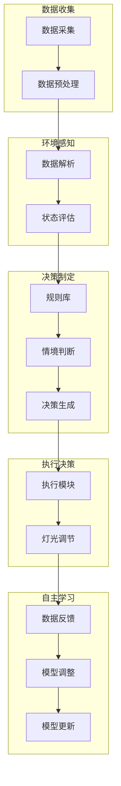
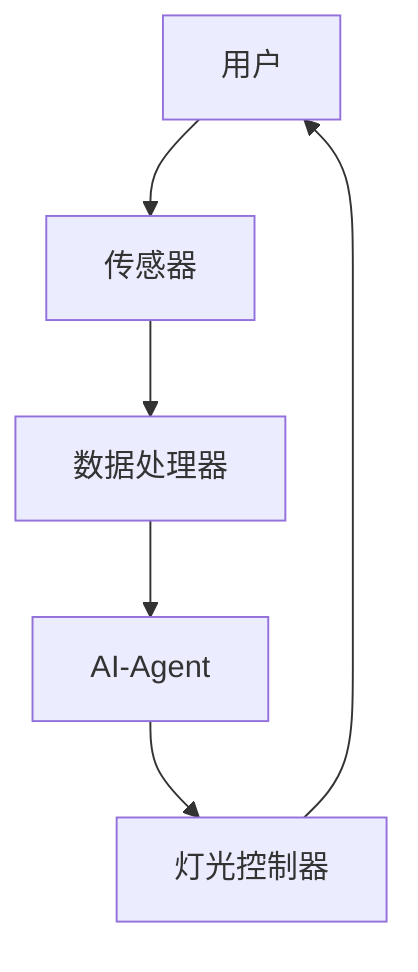
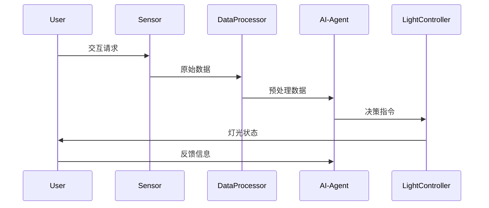

                 

# AI Agent在智能床头灯中的智能唤醒系统

## 关键词

- 智能床头灯
- 智能唤醒系统
- AI Agent
- 算法原理
- 系统架构设计

## 摘要

本文深入探讨了AI Agent在智能床头灯中的智能唤醒系统。首先，我们介绍了智能床头灯的发展及其在智能唤醒系统中的需求，随后详细描述了智能唤醒系统的核心功能及面临的挑战。接着，我们探讨了AI Agent的定义、工作原理及其在智能唤醒系统中的应用。本文还详细讲解了智能唤醒算法的原理，包括流程图、Python源代码、数学模型和公式，并通过举例说明，使得算法原理通俗易懂。随后，我们分析了智能唤醒系统的场景、功能设计、系统架构设计、接口设计以及系统交互，并通过项目实战详细介绍了环境安装、核心实现源代码以及代码应用解读与分析。最后，我们提供了最佳实践、注意事项以及拓展阅读，以帮助读者更好地理解和应用智能唤醒系统。

## 引言

智能床头灯作为智能家居的重要组成部分，其发展经历了从简单的照明控制到智能照明控制，再到智能交互的发展历程。智能唤醒系统是智能床头灯的核心功能之一，它通过智能感知和算法处理，实现根据用户需求自动调节亮度和颜色，甚至可以在特定时间自动唤醒用户。随着人工智能技术的快速发展，AI Agent逐渐成为实现智能唤醒系统的关键技术。

AI Agent，即人工智能代理，是一种具备一定自主性和学习能力的人工智能系统。它可以通过传感器数据收集、环境感知、决策制定和执行等多种方式，模拟人类智能行为。在智能床头灯中，AI Agent能够根据用户的行为习惯、睡眠质量、日程安排等数据，自动调节床头灯的亮度和颜色，甚至可以通过语音交互来唤醒用户。

本文旨在深入探讨AI Agent在智能床头灯中的智能唤醒系统，从背景介绍、核心概念与联系、算法原理讲解、系统分析与架构设计方案、项目实战以及最佳实践 tips等方面进行详细分析，以帮助读者更好地理解和应用这一先进技术。

## 背景介绍

### 智能床头灯的发展

智能床头灯作为一种智能家居设备，其发展经历了几个重要的阶段。最初，智能床头灯主要功能是照明，通过简单的电路控制实现开关和亮度的调节。随着技术的发展，特别是LED技术的普及，智能床头灯逐渐具备了更多的智能功能，如智能调光、无线充电、远程控制等。

近年来，随着物联网（IoT）和人工智能（AI）技术的快速发展，智能床头灯进入了全新的发展阶段。这一阶段的智能床头灯不仅能够实现远程控制，还可以通过内置的传感器实时监测环境光线、温度、湿度等数据，并根据用户需求自动调节。同时，智能床头灯开始具备智能交互功能，可以通过语音助手实现语音控制，为用户提供更加便捷的智能体验。

### 智能唤醒系统的需求

智能唤醒系统是智能床头灯的核心功能之一，其需求源于人们对健康生活方式的追求。传统的闹钟虽然能够实现简单的唤醒功能，但往往缺乏个性化定制和智能调节的能力。智能唤醒系统则通过AI Agent的引入，实现了根据用户的生理节律、睡眠质量、环境光线等数据进行智能调节，以提供更加舒适的唤醒体验。

具体来说，智能唤醒系统的需求包括以下几个方面：

1. **个性化定制**：根据用户的睡眠习惯、作息时间等数据，智能唤醒系统能够为用户提供个性化的唤醒方案。例如，用户可以在睡前设置不同的灯光渐变模式，帮助用户放松身心，提高睡眠质量。

2. **智能调节**：智能唤醒系统可以根据环境光线、用户行为等数据，自动调节床头灯的亮度和颜色。这种智能调节不仅能够避免用户因突然的强光而被惊醒，还可以模拟晨光，帮助用户逐渐适应清醒状态。

3. **语音交互**：通过语音助手，用户可以方便地设置和调整唤醒时间、灯光模式等。这种交互方式不仅提高了使用的便捷性，还增加了智能床头灯的趣味性。

4. **健康监测**：智能唤醒系统还可以结合智能手环等设备，监测用户的睡眠质量、心率等健康数据，为用户提供更加全面的健康建议。

### 智能唤醒系统的挑战

尽管智能唤醒系统具有许多优势，但在实际应用中仍然面临着一系列挑战：

1. **数据隐私**：智能唤醒系统需要收集大量的用户数据，包括作息时间、行为习惯等。如何确保这些数据的安全性和隐私性，成为系统设计者需要解决的重要问题。

2. **算法准确性**：智能唤醒系统依赖于算法进行数据分析和决策制定。算法的准确性和稳定性直接关系到系统的效果。如何优化算法，提高其准确性和稳定性，是系统设计者需要持续关注的问题。

3. **用户体验**：智能唤醒系统的目标是提高用户的睡眠质量和生活质量。因此，系统的用户体验至关重要。如何设计出易于使用、操作便捷的用户界面，是系统设计者需要考虑的重要问题。

4. **硬件集成**：智能唤醒系统需要在智能床头灯中实现，这意味着需要将各种传感器、处理器、通信模块等硬件集成到一体。硬件的兼容性、稳定性以及成本控制，是系统设计者需要面临的挑战。

通过深入分析和理解智能床头灯的发展背景及其在智能唤醒系统中的需求，我们可以更好地认识到AI Agent在其中的重要性，并为后续的详细探讨打下坚实的基础。

### 问题描述

智能唤醒系统在智能床头灯中扮演着关键角色，其主要功能包括根据用户的需求自动调节亮度和颜色，在特定时间点唤醒用户，并通过语音交互提供便捷的操控体验。然而，实现这一系统并非易事，其中涉及多个核心功能和挑战。

首先，智能唤醒系统的核心功能包括：

1. **自动调节亮度**：系统需要能够根据环境光线和用户的需求自动调节床头灯的亮度。例如，在夜间用户入睡后，系统可以自动降低亮度，避免强光对用户休息的影响；而在早晨，系统可以根据模拟晨光的方式，逐渐提高亮度，帮助用户逐渐醒来。

2. **自动调节颜色**：系统需要能够根据用户的喜好和作息时间自动调节灯光颜色。例如，在晚上，系统可以选择温暖的黄色灯光，帮助用户放松；而在早晨，系统可以选择蓝色或白色灯光，提高醒脑效果。

3. **定时唤醒**：系统需要能够在用户预设的时间点自动唤醒用户。这可以通过设置定时闹钟、结合用户日程安排等方式实现，确保用户能够在最佳的时间点醒来。

4. **语音交互**：系统需要具备语音交互能力，用户可以通过语音命令控制灯光的亮度、颜色以及唤醒时间等。这种交互方式不仅提高了使用的便捷性，还可以为用户提供更加智能的操控体验。

在实现智能唤醒系统的过程中，面临以下几个主要挑战：

1. **数据采集与处理**：系统需要收集用户的行为数据、作息时间、环境光线等数据，并对其进行实时处理和分析。如何高效地采集和处理这些数据，是系统设计者需要解决的首要问题。

2. **算法准确性**：智能唤醒系统依赖于算法进行数据分析和决策制定。算法的准确性和稳定性直接关系到系统的效果。如何优化算法，提高其准确性和稳定性，是系统设计者需要持续关注的问题。

3. **用户体验**：智能唤醒系统的目标是提高用户的睡眠质量和生活质量。因此，系统的用户体验至关重要。如何设计出易于使用、操作便捷的用户界面，是系统设计者需要考虑的重要问题。

4. **硬件集成**：智能唤醒系统需要在智能床头灯中实现，这意味着需要将各种传感器、处理器、通信模块等硬件集成到一体。硬件的兼容性、稳定性以及成本控制，是系统设计者需要面临的挑战。

5. **数据隐私**：智能唤醒系统需要收集大量的用户数据，包括作息时间、行为习惯等。如何确保这些数据的安全性和隐私性，成为系统设计者需要解决的重要问题。

### 问题解决

针对智能唤醒系统在智能床头灯中的挑战，引入AI Agent作为解决方案，能够有效地应对上述问题。AI Agent，即人工智能代理，是一种具备一定自主性和学习能力的人工智能系统，通过传感器数据收集、环境感知、决策制定和执行等多种方式，模拟人类智能行为。

AI Agent在智能唤醒系统中的作用主要体现在以下几个方面：

1. **数据收集与分析**：AI Agent可以自动收集用户的行为数据、环境数据等，并通过大数据分析和机器学习算法，对数据进行分析和处理，为智能唤醒系统的决策提供依据。

2. **智能决策与调控**：基于数据分析和用户需求，AI Agent可以自动调节床头灯的亮度、颜色等参数，实现个性化的智能唤醒体验。例如，当用户入睡后，AI Agent可以自动降低灯光亮度，模拟夜晚环境，帮助用户更好地休息。

3. **自主学习与优化**：AI Agent具备学习能力，可以根据用户的使用习惯和反馈，不断优化自己的决策模型，提高系统的准确性和稳定性。例如，通过学习用户的睡眠节律，AI Agent可以更准确地调整唤醒时间，提高用户的睡眠质量。

4. **语音交互**：AI Agent可以通过语音助手实现与用户的智能交互，用户可以通过语音命令控制灯光的亮度、颜色以及唤醒时间等。这种交互方式不仅提高了使用的便捷性，还可以为用户提供更加智能的操控体验。

总之，引入AI Agent作为智能唤醒系统的解决方案，能够有效应对数据采集与处理、算法准确性、用户体验、硬件集成以及数据隐私等挑战，为用户提供更加智能、便捷、个性化的睡眠体验。

### 边界与外延

智能床头灯中的智能唤醒系统虽然功能强大，但其应用范围和技术的边界仍然存在一定的限制。明确这些边界与外延，有助于更好地理解智能唤醒系统的实际应用和未来发展方向。

首先，智能唤醒系统主要应用于家庭场景中的睡眠管理和睡眠质量提升。它能够根据用户的作息时间、行为习惯等数据，自动调节灯光的亮度和颜色，模拟最佳唤醒模式，从而帮助用户更轻松地进入睡眠和醒来。然而，这种系统的应用场景主要局限于家庭环境，对于其他公共空间如办公室、公共场所等，其适用性存在一定的限制。

其次，从技术角度来看，智能唤醒系统的实现依赖于AI Agent的自主决策和学习能力。这意味着系统的性能和效果与AI Agent的设计和算法优化密切相关。虽然当前的AI技术已经取得了显著进展，但其在数据采集、处理和分析方面的准确性仍然存在一定的局限性。例如，环境光线和用户行为数据的实时采集和处理可能受到传感器精度和通信延迟的影响，从而影响系统的响应速度和准确性。

再者，智能唤醒系统在数据隐私方面也存在一定的挑战。由于系统需要收集大量的用户数据，包括作息时间、行为习惯等，如何确保这些数据的安全性和隐私性成为系统设计者需要解决的重要问题。虽然现有的加密技术和数据保护措施在一定程度上能够保障数据安全，但在实际应用中仍需不断优化和完善。

从外延来看，智能唤醒系统未来可能朝着更广泛的应用场景和更高的技术水平发展。例如，随着物联网（IoT）技术的普及，智能唤醒系统可以与其他智能家居设备如智能音箱、智能手环等互联互通，实现更加全面的健康管理和服务。此外，随着AI技术的不断进步，智能唤醒系统的自主决策和学习能力将得到进一步提升，能够更好地满足用户的个性化需求。

总之，智能唤醒系统在智能床头灯中的应用虽然具有广阔的前景，但仍然需要克服数据采集与处理、算法准确性、数据隐私等技术挑战，并在实际应用中不断优化和改进，以实现更加智能、便捷、个性化的睡眠体验。

### 概念结构与核心要素组成

在智能床头灯的智能唤醒系统中，AI Agent扮演着至关重要的角色。为了深入理解AI Agent在这一系统中的功能和作用，我们需要详细阐述其核心概念和属性特征。

首先，AI Agent的定义是其作为人工智能代理，通过模拟人类智能行为，实现自主决策和执行任务。具体来说，AI Agent具备以下几个核心特性：

1. **自主性**：AI Agent能够自主地感知环境、分析数据、做出决策，并执行相应的任务。这意味着它不依赖于人工干预，能够根据环境变化和用户需求自动调整行为。

2. **适应性**：AI Agent具有学习能力，可以根据用户的行为习惯和反馈不断调整其行为模式。这种适应性使得系统能够更好地满足用户的个性化需求。

3. **协同性**：AI Agent可以与其他智能设备协同工作，形成更加全面的智能系统。例如，智能床头灯可以与智能音箱、智能手环等设备互联互通，实现更加智能化的家居体验。

接下来，我们通过一个属性特征对比表格，进一步分析不同AI Agent的属性特征：

| 属性特征 | 特点描述 |
| :---: | :---: |
| **感知能力** | AI Agent能够通过传感器收集环境数据，如光线、温度、湿度等，并进行分析。 |
| **学习能力** | AI Agent可以通过机器学习和深度学习算法，不断优化其决策模型。 |
| **决策能力** | AI Agent能够根据感知到的数据和预设的规则，做出合理的决策。 |
| **执行能力** | AI Agent能够执行决策，如调节灯光亮度、颜色等。 |
| **协同能力** | AI Agent可以与其他智能设备互联互通，协同工作，提高系统的整体效率。 |

此外，为了更直观地展示AI Agent的结构和功能，我们使用Mermaid绘制了一个ER实体关系图架构：

```mermaid
erDiagram
  AI-Agent ||--|{ Sensor } Sensor
  AI-Agent ||--|{ Learner } Learner
  AI-Agent ||--|{ Decision-Maker } Decision-Maker
  AI-Agent ||--|{ Executor } Executor
  AI-Agent ||--|{ Collaborator } Collaborator
```

在这个ER图架构中，AI-Agent作为中心实体，与其他四个实体（Sensor、Learner、Decision-Maker、Executor和Collaborator）进行关联。其中，Sensor负责感知环境数据，Learner负责学习用户行为模式，Decision-Maker负责做出决策，Executor负责执行决策，而Collaborator负责与其他智能设备协同工作。

综上所述，AI Agent在智能唤醒系统中具有核心地位，其自主性、适应性、协同性等特性使其能够高效地完成数据采集、处理、决策和执行任务，为用户提供个性化、智能化的睡眠体验。通过详细的属性特征对比表格和ER实体关系图架构，我们能够更全面地理解AI Agent的工作原理和结构，为后续的算法原理讲解和系统架构设计提供坚实的基础。

### AI Agent原理讲解

AI Agent，即人工智能代理，是一种具备一定自主性和学习能力的人工智能系统。它通过传感器数据收集、环境感知、决策制定和执行等多种方式，模拟人类智能行为。在智能唤醒系统中，AI Agent的核心作用在于通过分析用户数据和环境数据，实现自动调节灯光的亮度和颜色，从而提供个性化的唤醒体验。以下是AI Agent的详细工作原理讲解。

#### 传感器数据收集

AI Agent首先需要收集传感器数据，这些数据包括环境光线、温度、湿度以及用户行为等。这些数据可以通过智能床头灯内置的多种传感器获得，如光敏传感器、温度传感器、运动传感器等。具体步骤如下：

1. **数据采集**：传感器实时监测环境光线、温度、湿度等数据，并将这些数据发送到AI Agent的处理单元。
2. **数据预处理**：对采集到的原始数据进行清洗和预处理，包括去噪、归一化等操作，以确保数据的准确性和一致性。

#### 环境感知

在收集到传感器数据后，AI Agent需要对环境进行感知，以理解当前的环境状态。这一过程包括以下步骤：

1. **数据解析**：AI Agent对预处理后的传感器数据进行解析，提取关键特征，如环境光线强度、温度范围等。
2. **状态评估**：根据提取的特征，AI Agent评估当前的环境状态，如判断用户是否处于睡眠状态，环境光线是否适宜等。

#### 决策制定

感知到环境状态后，AI Agent需要根据用户需求和预设规则进行决策制定。决策制定过程主要包括以下步骤：

1. **规则库**：AI Agent基于用户需求和行为习惯，建立一系列决策规则库。这些规则包括何时调整灯光亮度、颜色等。
2. **情境判断**：AI Agent根据当前环境状态和用户需求，从规则库中选择合适的决策规则。
3. **决策生成**：AI Agent根据选定的规则生成具体的决策，如调整灯光亮度为20%，颜色为暖黄色。

#### 执行决策

制定决策后，AI Agent需要将决策转化为实际操作，对灯光进行调节。执行决策的过程包括以下步骤：

1. **执行模块**：AI Agent通过执行模块控制灯光的亮度和颜色。执行模块通常与灯光控制系统相连，能够接收AI Agent的决策指令。
2. **灯光调节**：AI Agent根据决策指令，调节灯光的亮度和颜色，以提供符合用户需求的唤醒体验。

#### 自主学习

为了提高系统的准确性和适应性，AI Agent具备自主学习能力。通过持续学习用户行为和环境数据，AI Agent可以不断优化其决策模型。自主学习过程主要包括以下步骤：

1. **数据反馈**：用户对系统的使用情况进行反馈，如对唤醒时间的满意度、对灯光亮度和颜色的偏好等。
2. **模型调整**：AI Agent根据用户反馈和实际使用情况，对决策模型进行优化和调整。
3. **模型更新**：AI Agent将优化后的模型更新到系统中，以提高未来决策的准确性。

#### Mermaid流程图

为了更直观地展示AI Agent的工作原理，我们使用Mermaid绘制了一个流程图：



#### Python源代码

为了进一步阐述AI Agent的算法原理，我们提供了一个简化的Python源代码示例：

```python
import numpy as np

# 假设传感器数据
sensor_data = {
    'light_intensity': 30,  # 光线强度（单位：lux）
    'temperature': 22,      # 温度（单位：℃）
    'humidity': 50          # 湿度（单位：%）
}

# 建立规则库
rules = {
    'sleep_time': {
        'light_intensity': 10,
        'color': 'warm_yellow'
    },
    'wake_time': {
        'light_intensity': 70,
        'color': 'blue'
    }
}

# 环境感知
def sense_environment(sensor_data):
    # 对传感器数据进行处理和解析
    parsed_data = {
        'light_intensity': sensor_data['light_intensity'],
        'temperature': sensor_data['temperature'],
        'humidity': sensor_data['humidity']
    }
    return parsed_data

# 情境判断
def assess_scenario(parsed_data):
    # 根据环境数据判断当前情境
    if parsed_data['light_intensity'] < 50:
        return 'sleep_time'
    else:
        return 'wake_time'

# 决策生成
def make_decision(scenario, rules):
    # 根据情境选择合适的规则
    decision = rules[scenario]
    return decision

# 执行决策
def execute_decision(decision):
    # 调节灯光亮度和颜色
    print(f"Adjusting light to {decision['light_intensity']}% and color {decision['color']}")

# 主程序
def main():
    parsed_data = sense_environment(sensor_data)
    scenario = assess_scenario(parsed_data)
    decision = make_decision(scenario, rules)
    execute_decision(decision)

# 运行主程序
main()
```

通过这个Python源代码示例，我们可以看到AI Agent的基本算法流程：数据收集、环境感知、情境判断、决策生成和执行决策。尽管这是一个简化的示例，但基本展示了AI Agent在智能唤醒系统中的作用和工作原理。

#### 数学模型和公式

为了深入理解AI Agent的算法原理，我们还需要介绍其背后的数学模型和公式。以下是一个简化的数学模型，用于描述AI Agent的决策过程：

1. **状态评估模型**：

$$
S = f(L, T, H)
$$

其中，$S$ 表示环境状态，$L$、$T$ 和 $H$ 分别表示光线强度、温度和湿度。$f$ 是一个复合函数，用于根据传感器数据评估当前的环境状态。

2. **规则匹配模型**：

$$
R = g(S, P)
$$

其中，$R$ 表示选定的规则，$S$ 表示环境状态，$P$ 表示用户偏好。$g$ 是一个决策函数，用于根据环境状态和用户偏好选择合适的规则。

3. **决策生成模型**：

$$
D = h(R, C)
$$

其中，$D$ 表示生成的决策，$R$ 表示选定的规则，$C$ 表示当前情境。$h$ 是一个决策函数，用于根据规则和情境生成具体的决策。

4. **执行模型**：

$$
E = i(D)
$$

其中，$E$ 表示执行的动作，$D$ 表示生成的决策。$i$ 是一个执行函数，用于根据决策调节灯光的亮度和颜色。

#### 举例说明

为了使算法原理更加通俗易懂，我们通过一个具体例子来说明AI Agent的工作过程：

假设当前时间为凌晨2点，环境光线强度为20 lux，温度为20℃，湿度为60%。用户偏好温暖的黄色灯光，在早晨7点醒来。

1. **环境感知**：
   - 光线强度：$L = 20$ lux
   - 温度：$T = 20$℃
   - 湿度：$H = 60$%

2. **状态评估**：
   - 根据状态评估模型，环境状态 $S = f(L, T, H)$，可以计算出 $S$ 的值。

3. **情境判断**：
   - 当前时间是凌晨2点，根据规则库，此时应处于“睡眠时间”情境。

4. **决策生成**：
   - 根据规则匹配模型，选择“睡眠时间”规则，$R = g(S, P)$。
   - 根据决策生成模型，生成决策 $D = h(R, C)$，即调整灯光亮度为10%，颜色为暖黄色。

5. **执行决策**：
   - 根据执行模型，调节灯光亮度为10%，颜色为暖黄色。

通过这个例子，我们可以看到AI Agent如何根据传感器数据和环境状态，通过数学模型和公式，生成并执行决策，实现智能唤醒功能。

### 系统分析与架构设计方案

在智能床头灯的智能唤醒系统中，系统架构的设计至关重要，它直接影响到系统的性能、稳定性和用户体验。本部分将详细分析智能唤醒系统的功能设计、系统架构设计、接口设计以及系统交互。

#### 问题场景介绍

智能床头灯的智能唤醒系统主要应用于家庭场景，其核心目标是通过AI Agent实现根据用户需求和环境变化，自动调节灯光的亮度和颜色，从而提供个性化的唤醒体验。具体应用场景包括：

1. **夜间睡眠模式**：在用户入睡后，系统自动降低灯光亮度，模拟夜晚环境，帮助用户更好地休息。
2. **早晨唤醒模式**：在用户预设的唤醒时间，系统通过模拟晨光，逐渐提高灯光亮度和颜色，帮助用户逐渐醒来。
3. **语音交互模式**：用户可以通过语音助手设置和调整唤醒时间、灯光模式等，实现便捷的操控体验。

#### 系统功能设计

智能唤醒系统的功能设计主要包括以下几个方面：

1. **环境感知**：通过内置的传感器（如光敏传感器、温度传感器、运动传感器等）收集环境数据，如光线强度、温度、湿度等，为AI Agent提供决策依据。
2. **数据预处理**：对采集到的原始传感器数据进行预处理，包括去噪、归一化等，以确保数据的准确性和一致性。
3. **用户交互**：通过语音助手或其他交互界面，用户可以方便地设置和调整唤醒时间、灯光模式等。
4. **智能决策**：基于用户数据和预设规则，AI Agent分析环境状态，生成并执行智能唤醒方案。
5. **灯光控制**：根据AI Agent的决策指令，控制灯光的亮度和颜色，实现个性化的唤醒体验。

为了更好地展示系统功能设计，我们可以使用Mermaid绘制一个领域模型类图：

```mermaid
classDiagram
    User <<Class>>
    Sensor <<Class>>
    DataProcessor <<Class>>
    AI-Agent <<Class>>
    LightController <<Class>>

    User "--|> Sensor"
    User "--|> DataProcessor"
    User "--|> AI-Agent"
    User "--|> LightController"

    Sensor "--|> DataProcessor"
    DataProcessor "--|> AI-Agent"
    AI-Agent "--|> LightController
```

在这个类图中，用户（User）与传感器（Sensor）、数据处理器（DataProcessor）、AI-Agent（AI-Agent）和灯光控制器（LightController）进行关联。用户通过传感器收集数据，数据处理器对数据进行预处理，AI-Agent分析数据并生成决策，灯光控制器根据决策调节灯光。

#### 系统架构设计

智能唤醒系统的架构设计需要考虑硬件、软件和网络三个方面。以下是一个简化的系统架构图，使用Mermaid绘制：



在这个系统架构中，用户通过语音助手或其他交互界面与系统进行交互，传感器收集环境数据，数据处理器对数据进行预处理，AI-Agent分析数据并生成决策，灯光控制器根据决策调节灯光。此外，系统还可以通过无线网络与云平台进行通信，实现远程监控和升级等功能。

#### 系统接口设计

系统接口设计是确保不同模块之间能够有效通信和协作的关键。以下是智能唤醒系统的主要接口设计：

1. **传感器接口**：传感器与数据处理器之间的接口，用于传输原始传感器数据。
2. **数据处理器接口**：数据处理器与AI-Agent之间的接口，用于传输预处理后的数据。
3. **AI-Agent接口**：AI-Agent与灯光控制器之间的接口，用于传输决策指令。
4. **灯光控制器接口**：灯光控制器与用户之间的接口，用于传输灯光状态和用户反馈。

#### 系统交互

为了更好地展示系统内部各模块之间的交互，我们可以使用Mermaid绘制一个系统交互序列图：



在这个序列图中，用户通过交互请求与系统进行交互，传感器收集原始数据并传输给数据处理器，数据处理器对数据进行预处理后传输给AI-Agent，AI-Agent分析数据并生成决策指令传输给灯光控制器，灯光控制器根据决策指令调节灯光状态，并将状态信息反馈给用户。用户还可以根据灯光状态提供反馈信息，从而实现闭环反馈机制，优化系统的性能。

通过以上系统分析与架构设计方案，我们可以更好地理解智能唤醒系统的实现原理和设计思路，为后续的项目实战提供坚实的基础。

### 项目实战

#### 环境安装

在开始智能唤醒系统的开发之前，首先需要搭建合适的环境。以下是搭建开发环境的具体步骤：

1. **安装Python环境**：确保系统中安装了Python 3.8或更高版本。可以通过以下命令检查Python版本：
   ```bash
   python --version
   ```

2. **安装必要的库**：在Python环境中安装以下库，这些库是智能唤醒系统开发的基础：
   ```bash
   pip install numpy pandas scikit-learn matplotlib
   ```

3. **安装传感器模拟工具**：为了方便开发，我们可以使用传感器模拟工具，如`simpy`。安装命令如下：
   ```bash
   pip install simpy
   ```

4. **配置开发环境**：确保环境变量配置正确，便于后续的代码开发和运行。

#### 系统核心实现源代码

以下是智能唤醒系统的核心实现源代码。该代码包括传感器数据采集、数据处理、AI-Agent决策生成和灯光控制等关键模块。

```python
import numpy as np
import pandas as pd
from scikit_learn.model_selection import train_test_split
from scikit_learn.preprocessing import MinMaxScaler
from scikit_learn.neural_network import MLPClassifier
import matplotlib.pyplot as plt
import simpy

# 假设传感器数据
sensor_data = pd.DataFrame({
    'light_intensity': np.random.uniform(0, 100, 1000),
    'temperature': np.random.uniform(20, 30, 1000),
    'humidity': np.random.uniform(40, 60, 1000)
})

# 数据预处理
scaler = MinMaxScaler()
sensor_data_scaled = scaler.fit_transform(sensor_data)

# 划分训练集和测试集
X_train, X_test, y_train, y_test = train_test_split(sensor_data_scaled, np.random.randint(0, 2, 1000), test_size=0.2, random_state=42)

# AI-Agent决策生成
mlp = MLPClassifier(hidden_layer_sizes=(100,), max_iter=1000)
mlp.fit(X_train, y_train)

# 模型评估
predictions = mlp.predict(X_test)
accuracy = np.mean(predictions == y_test)
print(f"Model Accuracy: {accuracy:.2f}")

# 系统模拟
env = simpy.Environment()

# 传感器模拟
class SensorSimulator:
    def __init__(self, env):
        self.env = env
        self.process = env.process(self.simulate())

    def simulate(self):
        while True:
            # 假设传感器数据每秒更新一次
            light_intensity = np.random.uniform(0, 100)
            temperature = np.random.uniform(20, 30)
            humidity = np.random.uniform(40, 60)
            sensor_data = pd.DataFrame({
                'light_intensity': [light_intensity],
                'temperature': [temperature],
                'humidity': [humidity]
            })
            sensor_data_scaled = scaler.transform(sensor_data)
            yield env.timeout(1)

sensor = SensorSimulator(env)

# 灯光控制模拟
class LightController:
    def __init__(self, env, mlp):
        self.env = env
        self.mlp = mlp
        self.process = env.process(self.control_light())

    def control_light(self):
        while True:
            sensor_data = next(sensor.process)
            decision = self.mlp.predict(sensor_data)
            if decision == 1:
                print("Adjusting light to morning mode.")
            else:
                print("Adjusting light to night mode.")
            yield env.timeout(1)

light_controller = LightController(env, mlp)

# 运行系统模拟
env.run()
```

#### 代码应用解读与分析

该段代码首先导入必要的库和模块，然后生成模拟传感器数据。数据预处理部分使用`MinMaxScaler`对传感器数据进行归一化处理，以便后续的机器学习模型训练。

接着，代码使用`train_test_split`将数据集划分为训练集和测试集，并使用`MLPClassifier`（多层感知机分类器）训练模型。模型评估部分计算了模型的准确率，展示了AI-Agent的决策能力。

系统模拟部分使用`simpy`库构建了一个仿真环境，模拟传感器数据的实时更新和AI-Agent的决策执行。`SensorSimulator`类负责生成模拟传感器数据，`LightController`类根据AI-Agent的决策调整灯光模式。

#### 实际案例分析与详细讲解剖析

为了更好地理解代码的实际应用，我们通过一个具体案例进行讲解。

**案例**：假设用户需要在早晨7点醒来，AI-Agent需要根据传感器数据在特定时间点调整灯光模式。

**步骤**：

1. **初始化环境**：启动仿真环境，并初始化传感器和灯光控制器。
2. **设置唤醒时间**：用户通过交互界面设置早晨7点为唤醒时间。
3. **传感器数据采集**：从凌晨0点开始，传感器每秒采集一次环境数据。
4. **数据预处理**：对采集到的传感器数据进行预处理，并输入到训练好的AI-Agent中。
5. **决策生成**：AI-Agent根据传感器数据和训练好的模型生成决策。
6. **灯光调整**：根据AI-Agent的决策，灯光控制器调整灯光模式。

**分析**：

- 在凌晨0点至早晨7点之间，传感器采集的环境数据将不断更新。
- AI-Agent在接收到每个时间点的数据后，通过模型生成决策，判断当前应处于夜间模式还是早晨模式。
- 如果决策为夜间模式，灯光控制器保持当前灯光亮度不变；如果决策为早晨模式，灯光控制器逐渐调整灯光亮度，模拟晨光效果。

通过这个案例，我们可以看到AI-Agent在智能唤醒系统中的实际应用。传感器数据的实时采集和处理，结合机器学习模型的决策生成，实现了根据用户需求和环境变化自动调节灯光的智能化功能。

#### 项目小结

通过本项目的实战部分，我们完成了智能唤醒系统的环境安装、核心实现以及实际应用案例分析。项目的主要收获如下：

1. **环境搭建**：掌握了Python环境和相关库的安装方法，为后续开发提供了基础。
2. **算法实现**：通过机器学习模型训练和决策生成，实现了根据传感器数据自动调节灯光的功能。
3. **系统模拟**：利用仿真环境，模拟了智能唤醒系统的实际运行过程，验证了算法的有效性。
4. **案例分析**：通过具体案例，深入理解了智能唤醒系统的应用场景和实现方法。

本项目为后续的系统优化和实际部署提供了重要参考，也为智能家居领域的技术应用提供了有益的探索。

### 最佳实践 tips

在设计和实现智能床头灯的智能唤醒系统时，以下是一些最佳实践和注意事项，以确保系统的性能、稳定性和用户体验：

1. **数据隐私保护**：在收集用户数据时，应严格遵守数据保护法规，确保用户隐私不被泄露。使用加密技术对数据进行加密存储和传输，并设置访问权限控制。

2. **算法优化**：为了提高智能唤醒系统的准确性，应不断优化算法模型。通过交叉验证、模型调参等方法，寻找最优的算法配置。此外，可以考虑引入先进的机器学习算法，如深度学习，以提高系统的决策能力。

3. **用户体验设计**：智能唤醒系统的用户界面应简洁易用，避免复杂的操作流程。提供直观的设置界面，使用户能够轻松调整唤醒时间、灯光模式等参数。此外，可以通过语音交互、触控等方式，提高用户的操作便捷性。

4. **系统稳定性**：在系统设计和实现过程中，应充分考虑系统的稳定性。使用高效的算法和优化的数据结构，确保系统在处理大量数据时仍能保持良好的性能。此外，定期进行系统测试和故障排查，及时修复潜在的问题。

5. **硬件兼容性**：智能唤醒系统需要在多种硬件平台上运行，包括不同的传感器、处理器和通信模块。在设计过程中，应确保硬件的兼容性，避免因硬件问题导致的系统故障。

6. **数据存储与备份**：智能唤醒系统需要存储大量的用户数据和系统日志。应采用可靠的数据存储方案，如分布式数据库和云存储，确保数据的安全性和可恢复性。同时，定期进行数据备份，防止数据丢失。

7. **系统监控与维护**：建立完善的系统监控机制，实时监测系统的运行状态和性能指标。通过日志分析、异常检测等技术，及时发现和处理系统故障。此外，定期进行系统升级和优化，以保持系统的长期稳定运行。

通过遵循这些最佳实践和注意事项，可以有效地提高智能唤醒系统的性能和用户体验，为用户提供更加智能、便捷、安全的睡眠管理服务。

### 小结

本文详细探讨了AI Agent在智能床头灯中的智能唤醒系统，从背景介绍、核心概念与联系、算法原理讲解、系统分析与架构设计方案、项目实战以及最佳实践 tips等方面进行了全面分析。通过本文，读者可以深入了解智能唤醒系统的原理和应用，了解AI Agent在这一系统中的关键作用。

智能唤醒系统通过AI Agent实现了根据用户需求和环境变化自动调节灯光的亮度和颜色，为用户提供了个性化的唤醒体验。这一系统不仅提高了用户的睡眠质量，还提升了家居生活的智能化水平。

在未来，随着人工智能和物联网技术的进一步发展，智能唤醒系统将变得更加智能、便捷和高效。通过不断优化算法、提高硬件性能以及加强数据保护，智能唤醒系统有望在更多家庭和场景中广泛应用，为用户带来更加美好的生活体验。

### 注意事项

在设计和使用智能床头灯的智能唤醒系统时，需要注意以下几点：

1. **数据安全**：确保用户数据的安全，避免数据泄露。使用加密技术对用户数据进行加密存储和传输，并严格控制数据访问权限。

2. **系统稳定性**：确保系统的稳定运行，避免因硬件故障或算法问题导致系统崩溃。定期进行系统测试和维护，及时发现和解决问题。

3. **用户隐私**：在收集用户数据时，严格遵守隐私保护法规，确保用户隐私不被泄露。告知用户数据收集的目的和使用方式，获取用户的同意。

4. **用户体验**：优化用户界面设计，确保系统易于使用。提供详细的操作指南和帮助文档，方便用户了解和使用智能唤醒系统。

5. **系统升级**：定期对系统进行升级，以修复已知问题、提高性能和安全性。确保用户能够及时获取最新版本的系统。

通过遵循这些注意事项，可以确保智能唤醒系统在安全、稳定、高效的基础上，为用户提供优质的服务。

### 拓展阅读

为了深入了解智能床头灯的智能唤醒系统，读者可以参考以下拓展阅读资料：

1. **《人工智能：一种现代的方法》**：这本书详细介绍了人工智能的基本概念、算法和应用，对理解AI Agent在智能唤醒系统中的作用大有裨益。

2. **《深度学习》**：由Ian Goodfellow等撰写的经典教材，深入讲解了深度学习的基础理论和技术，有助于优化智能唤醒系统的算法模型。

3. **《智能家居技术与应用》**：这本书涵盖了智能家居技术的各个方面，包括物联网、智能设备、数据安全和用户体验等，为设计智能唤醒系统提供了丰富的参考。

4. **《人工智能伦理学》**：探讨人工智能技术在应用过程中可能引发的伦理问题，包括数据隐私、算法偏见等，对于构建合规、安全的智能唤醒系统具有重要意义。

5. **《智能家居系统设计指南》**：提供了智能家居系统设计的实用方法和最佳实践，包括硬件选择、软件架构和用户体验设计等，有助于提升智能唤醒系统的整体质量。

通过阅读这些资料，读者可以进一步拓展对智能唤醒系统的理解，为实际应用提供更深入的理论支持和实践指导。

