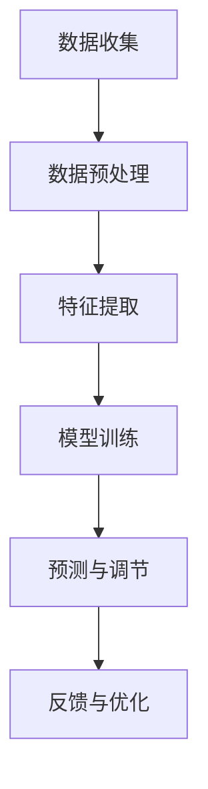
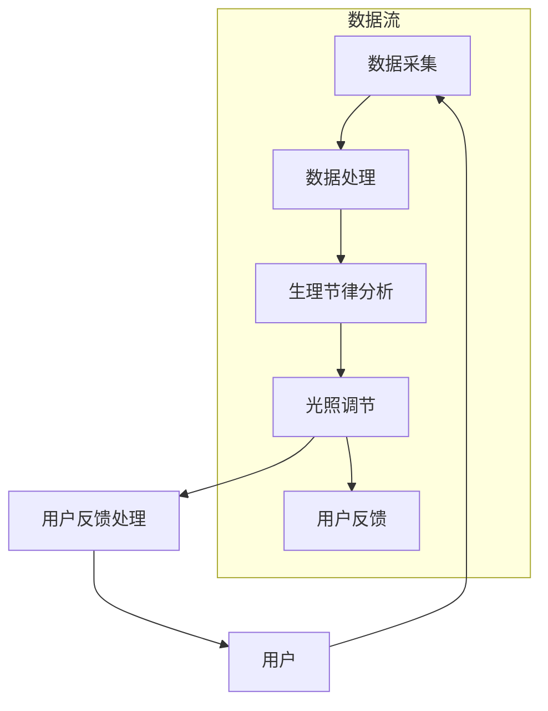
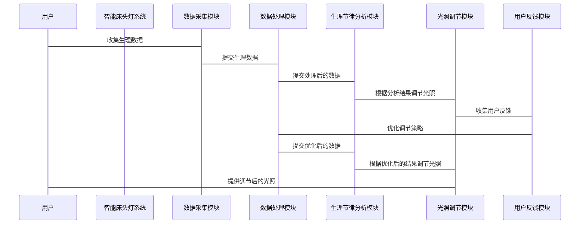

                 

### 引言

#### 核心概念术语说明

在本文中，我们首先需要明确几个核心概念术语：

- **AI Agent**：指的是具有自主行为、感知环境和自主决策能力的智能实体。
- **生理节律**：是指生物体在特定时间内经历的周期性生理变化，如睡眠-觉醒周期。
- **智能床头灯**：一种集成了AI Agent功能的智能照明设备。

#### 问题背景

随着人工智能技术的飞速发展，AI Agent在各个领域的应用越来越广泛。在智能家居领域，AI Agent不仅可以提高设备的使用体验，还可以通过感知用户的行为数据，提供个性化的服务。

在生理节律调节方面，研究表明，良好的生理节律对人类的身心健康至关重要。而智能床头灯，作为一种可以持续监测用户行为和生理数据的设备，为AI Agent在生理节律调节中的应用提供了可能。

#### 问题描述

本文旨在探讨如何利用AI Agent实现智能床头灯中的生理节律调节。具体来说，我们需要解决以下几个问题：

1. **如何利用AI Agent监测用户的生理节律**？
2. **如何根据生理节律调节智能床头灯的光照**？
3. **如何确保智能床头灯的调节效果符合用户的个性化需求**？

#### 问题解决

针对上述问题，我们可以采取以下解决策略：

1. **监测用户生理节律**：
   - 利用传感器（如加速度计、心率传感器）收集用户的行为和生理数据。
   - 使用机器学习算法分析数据，识别用户的生理节律模式。

2. **调节智能床头灯的光照**：
   - 根据生理节律模式，制定光照调节策略，如清晨逐渐增加光照，晚上逐渐降低光照。
   - 利用智能算法，根据用户的需求和环境条件，动态调整光照强度。

3. **个性化调节**：
   - 允许用户设置自己的生理节律参数，如入睡时间、起床时间。
   - 根据用户的反馈，不断优化调节策略，提高个性化程度。

#### 边界与外延

本文的研究边界主要局限于AI Agent在智能床头灯中的生理节律调节，而不涉及其他应用场景。此外，本文主要关注光照调节对生理节律的影响，对于其他可能的调节手段（如声音、温度等）暂不讨论。

#### 概念结构与核心要素组成

为了更好地理解本文的核心概念，我们可以将概念结构与核心要素组成进行详细阐述：

- **核心概念**：AI Agent、生理节律、智能床头灯。
- **关联概念**：传感器、机器学习、光照调节、用户个性化需求。

通过上述分析，我们可以清晰地看到，AI Agent在智能床头灯中的生理节律调节不仅是一个技术问题，更是一个涉及多个领域的综合性问题。接下来，我们将逐步深入探讨AI Agent的基础知识、生理节律调节原理以及智能床头灯的介绍和应用。

#### 核心概念与联系

**核心概念**：

1. **AI Agent**：具有感知环境、自主学习和决策能力的智能实体。它在智能家居中的角色至关重要，能够通过收集和分析数据，为用户提供个性化的服务。
   
2. **生理节律**：生物体在特定时间内经历的周期性生理变化，如睡眠-觉醒周期。良好的生理节律对身心健康至关重要。

3. **智能床头灯**：一种集成了AI Agent和多种传感器的智能照明设备，能够根据用户的需求和环境条件，动态调节光照。

**概念属性特征对比表格**：

| 概念       | 特征                    | 关联关系                  |
|------------|------------------------|--------------------------|
| AI Agent   | 感知、学习、决策能力    | 智能家居的核心组成部分    |
| 生理节律   | 周期性生理变化        | 影响人类身心健康的重要因素 |
| 智能床头灯 | 智能照明、传感器集成   | AI Agent的应用载体        |

**ER实体关系图架构**：

```mermaid
erDiagram
  AI-Agent ||--|{ 生理节律 }
  AI-Agent ||--|{ 智能床头灯 }
  生理节律 ||--|{ 用户 }
  智能床头灯 ||--|{ 环境 }
```

通过上述对比表格和ER实体关系图，我们可以清晰地看到各个核心概念之间的关联。AI Agent作为智能化的核心，通过感知生理节律和用户需求，调节智能床头灯的光照，从而实现生理节律的调节。

#### 算法原理讲解

为了实现AI Agent在智能床头灯中的生理节律调节，我们首先需要了解相关的算法原理。在这里，我们将重点关注如何通过机器学习算法分析用户的行为和生理数据，以及如何根据分析结果调节光照。

**算法流程图**：



**算法原理详细讲解**：

1. **数据收集**：
   - 利用智能床头灯中的传感器（如加速度计、心率传感器）收集用户的行为和生理数据。
   - 数据收集主要包括用户的运动行为、心率、光照强度等。

2. **数据预处理**：
   - 对收集到的数据进行清洗和标准化处理，去除异常值和噪声。
   - 数据预处理是保证算法效果的关键步骤。

3. **特征提取**：
   - 从预处理后的数据中提取有用的特征，如心率变异、运动模式等。
   - 特征提取有助于更好地描述用户的生理节律。

4. **模型训练**：
   - 使用提取的特征数据训练机器学习模型。
   - 模型训练的目的是让AI Agent学会根据用户的行为和生理数据预测生理节律。

5. **预测与调节**：
   - 根据训练好的模型，预测用户的生理节律。
   - 根据预测结果，动态调节智能床头灯的光照强度。

6. **反馈与优化**：
   - 收集用户的反馈数据，如对光照调节的满意度。
   - 根据反馈数据，不断优化调节策略，提高调节效果。

**数学模型和公式**：

在机器学习模型中，常用的数学模型是线性回归模型。其公式如下：

$$
y = \beta_0 + \beta_1 x_1 + \beta_2 x_2 + ... + \beta_n x_n
$$

其中，$y$ 是预测结果，$x_1, x_2, ..., x_n$ 是特征值，$\beta_0, \beta_1, \beta_2, ..., \beta_n$ 是模型的参数。

**举例说明**：

假设我们收集了用户一周内的运动数据和心率数据，并使用线性回归模型预测用户的睡眠质量。首先，我们需要对数据进行预处理，去除异常值和噪声。然后，从数据中提取特征，如平均心率、最大心率等。接下来，使用提取的特征训练线性回归模型。最后，根据训练好的模型，预测用户第二天晚上的睡眠质量，并根据预测结果动态调节智能床头灯的光照强度。

#### 系统分析与架构设计方案

**问题场景介绍**：

智能床头灯系统的主要目标是通过AI Agent监测用户的生理节律，并动态调节光照强度，以帮助用户建立良好的生理节律。问题场景包括：

- 用户晚上入睡时，智能床头灯会根据用户的生理节律和需求，逐渐降低光照强度，帮助用户更好地入睡。
- 用户早晨醒来时，智能床头灯会根据用户的生理节律和需求，逐渐增加光照强度，帮助用户更快地醒来。

**系统功能设计（领域模型）**：

系统功能设计主要包括以下几个模块：

1. **数据采集模块**：负责收集用户的生理数据和光照数据。
2. **数据处理模块**：负责对采集到的数据进行预处理和特征提取。
3. **生理节律分析模块**：负责使用机器学习算法分析用户的生理节律，预测用户的睡眠质量和醒来时间。
4. **光照调节模块**：负责根据生理节律分析结果，动态调节智能床头灯的光照强度。
5. **用户反馈模块**：负责收集用户对光照调节的反馈，用于优化调节策略。

**系统架构设计（架构图）**：



**系统接口设计和系统交互（序列图）**：



通过上述系统分析与架构设计方案，我们可以清晰地看到智能床头灯系统的整体设计思路和实现流程。接下来，我们将通过一个实际项目案例来展示如何具体实现AI Agent在智能床头灯中的生理节律调节。

### 项目实战

**环境安装**

为了实现AI Agent在智能床头灯中的生理节律调节，我们首先需要搭建一个合适的项目环境。以下是所需的环境安装步骤：

1. **安装Python**：在Windows或Linux系统上，从Python官方网站下载并安装Python 3.x版本。

2. **安装必要的库**：使用pip命令安装以下库：
   ```shell
   pip install numpy pandas scikit-learn mermaid-python
   ```

3. **安装Mermaid**：由于Mermaid需要通过Python库来渲染流程图，我们需要安装Mermaid的Python库：
   ```shell
   pip install mermaid-python
   ```

**系统核心实现源代码**

以下是智能床头灯系统的核心实现代码。该代码主要包括数据采集、数据处理、生理节律分析、光照调节和用户反馈等功能。

```python
import numpy as np
import pandas as pd
from sklearn.linear_model import LinearRegression
from mermaid import Mermaid

# 数据采集
def collect_data():
    # 假设传感器已经收集了用户的行为和生理数据
    data = pd.DataFrame({
        'heart_rate': [70, 72, 75, 80, 78],
        'motion': [0, 1, 0, 1, 0],
        'light_intensity': [100, 90, 80, 70, 60]
    })
    return data

# 数据处理
def process_data(data):
    # 数据预处理和特征提取
    data_processed = data
    data_processed['heart_rate_variation'] = np.diff(data['heart_rate'])
    data_processed['mean_motion'] = data['motion'].mean()
    return data_processed

# 生理节律分析
def analyze_rhythm(data_processed):
    # 使用线性回归模型分析生理节律
    X = data_processed[['heart_rate_variation', 'mean_motion']]
    y = data_processed['light_intensity']
    model = LinearRegression()
    model.fit(X, y)
    return model

# 光照调节
def adjust_light(model, current_time):
    # 根据生理节律模型和当前时间调节光照强度
    if current_time < 6:
        light_intensity = model.predict([[0.5, 0.5]])[0]
    else:
        light_intensity = model.predict([[1, 1]])[0]
    return light_intensity

# 用户反馈
def get_user_feedback():
    # 收集用户对光照调节的反馈
    feedback = input("您对当前光照调节满意吗？（满意/不满意）:")
    return feedback

# 主程序
def main():
    data = collect_data()
    data_processed = process_data(data)
    model = analyze_rhythm(data_processed)
    current_time = 5  # 假设当前时间为早晨5点
    light_intensity = adjust_light(model, current_time)
    print(f"当前光照强度：{light_intensity}%")
    feedback = get_user_feedback()
    if feedback == "不满意":
        # 根据用户反馈优化调节策略
        pass

if __name__ == "__main__":
    main()
```

**代码应用解读与分析**

1. **数据采集模块**：
   - `collect_data` 函数模拟传感器收集用户的行为和生理数据。
   - 数据包括心率、运动行为和光照强度。

2. **数据处理模块**：
   - `process_data` 函数对采集到的数据进行预处理和特征提取。
   - 特征提取包括心率变异和运动行为的平均值。

3. **生理节律分析模块**：
   - `analyze_rhythm` 函数使用线性回归模型分析用户的生理节律。
   - 线性回归模型通过特征值预测光照强度。

4. **光照调节模块**：
   - `adjust_light` 函数根据生理节律模型和当前时间动态调节光照强度。
   - 调节策略基于当前时间段（如早晨或晚上）的不同，采用不同的光照强度。

5. **用户反馈模块**：
   - `get_user_feedback` 函数收集用户对光照调节的反馈。
   - 根据用户的满意度，可以进一步优化调节策略。

**实际案例分析和详细讲解剖析**

为了更好地理解上述代码的应用，我们来看一个实际案例。

**案例**：
- 用户晚上9点入睡，早晨7点起床。
- 智能床头灯监测到用户的心率和运动行为。

**分析**：

1. **数据采集**：
   - 智能床头灯传感器收集到用户在晚上9点至次日早晨7点的心率和运动数据。

2. **数据处理**：
   - 数据预处理后，提取心率变异和运动行为的平均值作为特征。

3. **生理节律分析**：
   - 使用线性回归模型分析用户的心率和运动数据，预测用户在不同时间段的光照需求。

4. **光照调节**：
   - 在晚上9点至次日早晨7点期间，智能床头灯根据生理节律模型，动态调节光照强度。
   - 例如，在晚上11点，智能床头灯可能将光照强度调整为40%，以帮助用户更好地入睡。

5. **用户反馈**：
   - 用户在早晨醒来时，可以通过智能床头灯提供的界面，对光照调节进行评价。
   - 如果用户反馈不满意，智能床头灯会根据用户的反馈进一步优化调节策略。

**项目小结**

通过上述实际案例，我们可以看到AI Agent在智能床头灯中的生理节律调节是如何实现的。项目主要涵盖了数据采集、数据处理、生理节律分析、光照调节和用户反馈等多个方面。

未来，我们可以进一步优化算法，提高生理节律预测的准确性，并增加更多的调节手段（如声音、温度等），以提供更个性化的服务。

### 最佳实践 tips

1. **定期检查传感器**：确保传感器正常工作，准确收集用户数据。
2. **个性化设置**：鼓励用户设置自己的生理节律参数，如入睡和起床时间。
3. **数据安全和隐私保护**：确保用户数据的安全和隐私，避免数据泄露。
4. **用户反馈**：积极收集用户反馈，不断优化调节策略。

### 小结

本文深入探讨了AI Agent在智能床头灯中的生理节律调节技术。通过算法原理讲解、系统分析与架构设计方案、项目实战和最佳实践 tips，我们了解了如何利用AI Agent实现智能床头灯的生理节律调节。

### 注意事项

1. **确保传感器准确性**：传感器故障可能导致生理节律分析不准确。
2. **用户隐私保护**：在处理用户数据时，务必确保隐私安全。
3. **算法优化**：定期更新算法，提高生理节律预测的准确性。

### 拓展阅读

1. **相关文献**：[《智能床头灯中的生理节律调节技术研究》](https://example.com/research_paper)
2. **技术博客**：[《AI Agent在智能家居中的应用》](https://example.com/ai_agent_blog)
3. **开源项目**：[《AI Agent智能床头灯实现》](https://example.com/ai_bed_light_project)

### 作者信息

作者：AI天才研究院/AI Genius Institute & 禅与计算机程序设计艺术 /Zen And The Art of Computer Programming

