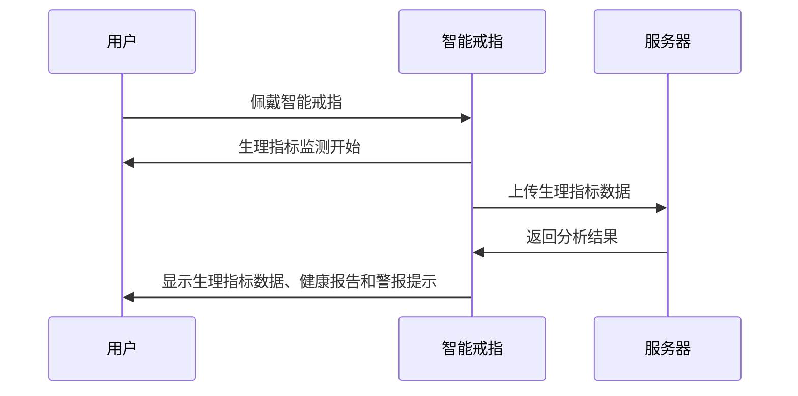
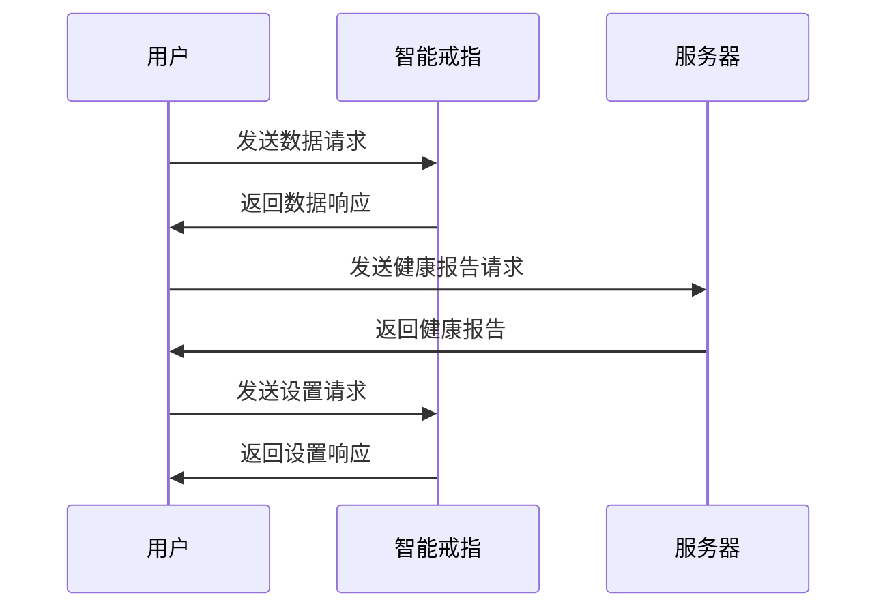
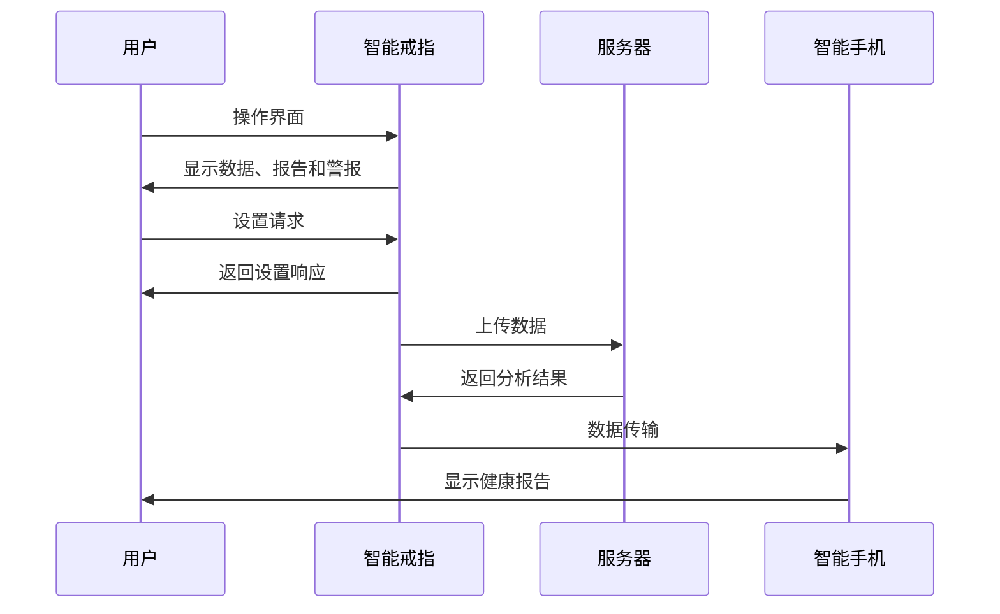

                 


## 第2章: AI Agent概述

### 2.1 AI Agent的定义

AI Agent，即人工智能代理，是一种可以独立执行任务、具备自主学习能力的人工智能实体。它可以模拟人类智能，与环境进行交互，并自主完成特定任务。AI Agent的定义可以追溯到1969年，当时赫伯特·西蒙（Herbert Simon）和艾伦·纽厄尔（Allen Newell）首次提出了“智能代理”的概念。他们认为，智能代理是能够通过环境感知和决策执行任务的人工智能实体。

AI Agent的基本定义可以概括为以下几点：

1. **自主性**：AI Agent能够独立进行决策，不需要人为干预。
2. **适应性**：AI Agent能够根据环境的变化和学习到的经验进行行为调整。
3. **交互性**：AI Agent能够与用户或其他智能体进行有效交互。

### 2.2 AI Agent的特点

AI Agent具有以下几个特点：

- **自主性**：AI Agent具有高度自主性，能够自主规划行动策略，并在执行任务过程中根据环境变化做出实时调整。这种自主性使得AI Agent在复杂动态环境中表现出色。

- **适应性**：AI Agent能够通过不断学习，提高自己在不同环境下的适应能力。这种适应性使得AI Agent能够不断优化自己的行为，提高任务执行的效率和质量。

- **交互性**：AI Agent能够与用户或其他智能体进行有效交互，实现信息的传递和共享。这种交互性使得AI Agent能够更好地理解用户需求，提供更个性化的服务。

- **协作性**：AI Agent可以与其他AI Agent或人类进行协作，共同完成任务。这种协作性使得AI Agent能够实现更复杂和更高级的智能任务。

### 2.3 AI Agent的分类

AI Agent可以根据不同的标准进行分类，常见的分类方法包括：

- **根据功能分类**：AI Agent可以分为决策型、感知型、行动型、交互型和混合型。
- **根据环境分类**：AI Agent可以分为静态环境下的AI Agent和动态环境下的AI Agent。
- **根据应用领域分类**：AI Agent可以分为家庭服务型、医疗监护型、工业控制型、交通管理型等。

### 2.4 AI Agent的发展历程

AI Agent的发展历程可以追溯到20世纪60年代，当时人工智能刚刚起步。以下是一些重要的发展阶段：

- **20世纪60年代**：赫伯特·西蒙和艾伦·纽厄尔提出了智能代理的概念，并开始研究基于规则的智能代理。
- **20世纪70年代**：人工智能开始受到广泛关注，智能代理的研究也得到进一步发展。此阶段，专家系统和基于规则的系统成为主流。
- **20世纪80年代**：随着计算机硬件的发展，智能代理的应用场景逐渐扩大。此阶段，基于行为的智能代理和混合智能代理开始受到关注。
- **20世纪90年代**：互联网的兴起推动了智能代理的研究。分布式智能代理和基于代理的互联网应用成为研究热点。
- **21世纪**：随着深度学习、强化学习等人工智能技术的发展，智能代理的性能和功能得到了大幅提升。智能代理在智能穿戴设备、智能家居、智能交通等领域得到了广泛应用。

### 2.5 本章小结

本章介绍了AI Agent的定义、特点、分类和发展历程。AI Agent作为一种具有高度自主性、适应性、交互性和协作性的智能实体，在人工智能领域具有广泛的应用前景。通过本章的学习，读者可以更好地理解AI Agent的基本概念和特性，为后续章节的学习打下基础。

### 2.6 思考与练习

1. 简述AI Agent的定义和特点。
2. 请列举至少三种常见的AI Agent分类方法。
3. 分析AI Agent在智能戒指中的应用潜力。

----------------------------------------------------------------

# 第3章: 智能戒指介绍

## 3.1 智能戒指的定义

智能戒指是一种集成了人工智能技术、传感器、通信模块和微处理器的智能穿戴设备。它通常以戒指的形式呈现，佩戴在用户的手指上。智能戒指的主要功能是实时监测用户的生理指标，如心率、血压、血氧饱和度等，并将这些数据传输到用户的智能手机或其他设备上，供用户查看和分析。

## 3.2 智能戒指的结构与功能

智能戒指的结构主要由以下几个部分组成：

1. **传感器模块**：包括光电传感器、压力传感器、温度传感器等，用于检测用户的生理指标。
2. **微处理器**：负责处理传感器采集到的数据，进行初步的分析和处理。
3. **通信模块**：包括蓝牙、Wi-Fi等无线通信模块，用于将数据传输到用户的设备上。
4. **显示模块**：通常为小型显示屏，用于实时显示用户的生理指标数据。

智能戒指的主要功能包括：

1. **生理指标监测**：实时监测用户的心率、血压、血氧饱和度等生理指标。
2. **数据存储与传输**：将采集到的生理指标数据存储在本地，并通过无线通信模块传输到用户的设备上。
3. **报警提示**：当用户的生理指标超过设定的阈值时，智能戒指会发出报警提示，提醒用户注意健康。
4. **健康数据分析**：用户设备上的应用程序可以对采集到的生理指标数据进行分析和处理，为用户提供健康建议。

## 3.3 智能戒指的应用场景

智能戒指具有广泛的应用场景，主要涵盖以下几类：

1. **健康管理**：智能戒指可以实时监测用户的生理指标，帮助用户了解自己的健康状况，预防疾病的发生。
2. **运动监测**：智能戒指可以记录用户的运动数据，如步数、运动时间、运动强度等，为用户提供科学的运动建议。
3. **睡眠监测**：智能戒指可以监测用户的睡眠质量，如睡眠时长、深睡时间、醒来次数等，帮助用户改善睡眠。
4. **医疗监护**：智能戒指可以用于长期健康监护，尤其是对患有慢性病或心脏病的用户，有助于及时发现异常情况。
5. **智能穿戴设备集成**：智能戒指可以作为智能穿戴设备的一部分，与其他智能设备（如智能手表、智能眼镜等）进行集成，实现更全面的智能监测。

## 3.4 智能戒指的发展趋势

随着人工智能技术的不断进步，智能戒指的功能和性能也在不断提升。以下是智能戒指的一些发展趋势：

1. **更精准的生理指标监测**：通过引入更高精度、更高灵敏度的传感器，智能戒指可以实现更准确的生理指标监测。
2. **智能诊断与预警**：利用AI技术，智能戒指可以实现对生理指标数据的智能分析和诊断，提前发现潜在的健康风险。
3. **个性化健康建议**：根据用户的生理指标数据和运动习惯，智能戒指可以为用户提供个性化的健康建议和运动计划。
4. **跨设备协作**：智能戒指将与其他智能设备（如智能手机、智能手表等）实现更紧密的协作，为用户提供更全面的健康监测服务。
5. **隐私保护与安全**：随着用户对隐私保护的重视，智能戒指将加强数据加密和隐私保护措施，确保用户数据的安全。

## 3.5 本章小结

本章介绍了智能戒指的定义、结构与功能，以及其应用场景和发展趋势。智能戒指作为一种新兴的智能穿戴设备，在健康管理、运动监测、医疗监护等领域具有广泛的应用前景。随着人工智能技术的不断发展，智能戒指的功能和性能将得到进一步提升，为用户提供更优质的健康监测服务。

## 3.6 思考与练习

1. 简述智能戒指的定义和主要功能。
2. 请列举至少三种智能戒指的应用场景。
3. 分析智能戒指在健康管理领域的作用和潜力。

----------------------------------------------------------------

## 第4章: 生理指标监测技术

### 4.1 生理指标监测的基本原理

生理指标监测技术主要通过传感器采集人体生理信号，然后利用信号处理和数据分析方法对生理指标进行检测和评估。以下是几种常见的生理指标监测技术：

1. **心率监测**：心率监测是生理指标监测中最常见的一种。心率监测技术通常利用光电传感器或压力传感器采集心脏跳动产生的信号，通过信号处理方法提取心率信息。

2. **血压监测**：血压监测主要通过压力传感器采集血管内的压力信号，通过信号处理和算法分析得出血压数据。常见的血压监测方法包括袖带法和无袖带法。

3. **血氧饱和度监测**：血氧饱和度监测利用光电传感器测量血液中的氧含量，通过分析光电信号的变化得出血氧饱和度。

4. **体温监测**：体温监测技术主要通过温度传感器测量人体温度，常见的测量方法有口腔测温、腋下测温、耳温测温和额头测温。

### 4.2 常见的生理指标及其测量方法

以下是几种常见的生理指标及其测量方法：

1. **心率**：心率是心脏每分钟跳动的次数。心率监测通常利用光电传感器或压力传感器。光电传感器通过检测皮肤表面的光电信号变化来获取心率信息，而压力传感器则通过测量心脏跳动引起的压力变化来计算心率。

2. **血压**：血压是血液在血管内对血管壁产生的侧压力。血压监测可以通过袖带法（传统水银血压计）或无袖带法（电子血压计）进行。袖带法通过充气压迫血管，然后放松测量血压，而电子血压计则利用压力传感器直接测量血压。

3. **血氧饱和度**：血氧饱和度是血液中氧合血红蛋白与总血红蛋白的比例。血氧饱和度监测通常利用光电传感器。光电传感器通过测量不同波长的光在皮肤和组织中的穿透度，计算出血氧饱和度。

4. **体温**：体温是人体的核心温度。体温监测可以通过口腔测温、腋下测温、耳温测温和额头测温等方法。口腔测温通过测量舌下或口腔黏膜的温度，腋下测温通过测量腋窝温度，耳温测温和额头测温则利用红外传感器测量耳膜或额头温度。

### 4.3 生理指标监测技术的应用现状

生理指标监测技术在医疗保健、运动健康、智能穿戴等领域得到了广泛应用。以下是几种典型的应用场景：

1. **医疗保健**：生理指标监测技术可以帮助医生和患者实时监测患者的健康状态，及时发现异常情况。例如，在心脏病患者中，心率监测和血压监测可以帮助医生评估患者的心脏健康状况。

2. **运动健康**：运动爱好者可以通过生理指标监测技术了解自己的运动表现，调整运动计划，预防运动损伤。例如，心率监测可以帮助运动者了解自己的心率区间，制定合适的训练计划。

3. **智能穿戴**：智能戒指等智能穿戴设备利用生理指标监测技术，为用户提供个性化的健康监测服务。例如，智能戒指可以监测用户的心率、血压、血氧饱和度等指标，并提供实时数据反馈。

4. **智能家居**：生理指标监测技术也可以应用于智能家居系统中，为家庭成员提供健康监测服务。例如，智能戒指可以与智能音箱、智能灯泡等设备集成，实现健康数据的实时分享和提醒。

### 4.4 生理指标监测技术的未来发展趋势

随着人工智能技术的不断发展，生理指标监测技术也在不断进步。以下是几种未来发展趋势：

1. **更高精度**：通过引入更先进的传感器和信号处理算法，生理指标监测技术将实现更高的精度和准确性。

2. **非侵入性**：非侵入性生理指标监测技术将逐渐取代传统的侵入性监测方法，减少患者的不适和风险。

3. **多模态监测**：结合多种生理指标监测技术，实现多模态监测，为用户提供更全面的健康评估。

4. **智能诊断与预警**：利用深度学习和强化学习等人工智能技术，生理指标监测系统将具备智能诊断和预警能力，提前发现潜在的健康风险。

5. **个性化健康管理**：基于生理指标监测数据，个性化健康管理方案将得到广泛应用，为用户提供个性化的健康建议和治疗方案。

### 4.5 本章小结

本章介绍了生理指标监测技术的基本原理、常见生理指标及其测量方法，以及生理指标监测技术的应用现状和未来发展趋势。通过本章的学习，读者可以了解生理指标监测技术的基本概念和最新进展，为后续章节的学习打下基础。

### 4.6 思考与练习

1. 简述生理指标监测技术的基本原理。
2. 请列举至少三种常见的生理指标及其测量方法。
3. 分析生理指标监测技术在健康管理领域的作用和潜力。

----------------------------------------------------------------

## 第5章: AI Agent在智能戒指中的应用

### 5.1 AI Agent在生理指标监测中的作用

AI Agent在智能戒指中的应用主要体现在生理指标监测领域。通过AI Agent，智能戒指可以实现以下几个方面的功能：

1. **实时监测与预警**：AI Agent可以实时分析用户的心率、血压、血氧饱和度等生理指标数据，并根据预设的阈值进行预警。当用户的生理指标超过正常范围时，AI Agent会及时发出警报，提醒用户注意健康。

2. **数据分析与趋势预测**：AI Agent可以对用户的生理指标数据进行分析，识别出潜在的健康风险。通过分析历史数据和当前数据，AI Agent可以预测用户的健康趋势，为用户提供个性化的健康建议。

3. **智能诊断**：AI Agent可以利用深度学习和强化学习等技术，对用户的生理指标数据进行智能分析，实现疾病的早期诊断。例如，通过分析心率数据，AI Agent可以识别出心脏病的风险，提醒用户及时就医。

4. **个性化健康管理**：AI Agent可以根据用户的生理指标数据和生活方式，为用户制定个性化的健康管理计划。例如，对于血压偏高的用户，AI Agent可以建议用户调整饮食、增加运动等，以降低血压。

### 5.2 AI Agent在智能戒指中的工作流程

AI Agent在智能戒指中的工作流程可以分为以下几个步骤：

1. **数据采集**：智能戒指通过内置的传感器（如光电传感器、压力传感器等）采集用户的心率、血压、血氧饱和度等生理指标数据。

2. **数据预处理**：采集到的生理指标数据可能会受到噪声干扰，因此需要进行预处理。预处理包括滤波、去噪、归一化等操作，以提高数据的质量和可靠性。

3. **特征提取**：通过对预处理后的数据进行分析，提取出关键的生理指标特征。这些特征将作为AI Agent训练和预测的输入。

4. **模型训练**：利用历史数据和特征提取结果，训练AI Agent的模型。训练过程包括选择合适的算法、设定超参数等。常用的算法包括支持向量机（SVM）、随机森林（RF）、神经网络（NN）等。

5. **模型预测**：将采集到的生理指标数据进行特征提取，然后输入到训练好的模型中，进行预测。预测结果可以用来判断用户的生理指标是否正常，是否需要发出警报。

6. **结果反馈**：将预测结果反馈给用户。如果预测结果异常，AI Agent会发出警报，提醒用户注意健康。同时，AI Agent还可以将预测结果和分析报告发送到用户的智能手机或其他设备上，供用户查看。

### 5.3 AI Agent在生理指标监测中的优势

AI Agent在生理指标监测中具有以下几个优势：

1. **实时性与高效性**：AI Agent可以实时分析用户的生理指标数据，快速发现异常情况，提高监测的实时性和高效性。

2. **准确性**：通过机器学习和深度学习技术，AI Agent可以学习到复杂的生理指标变化规律，提高监测的准确性。

3. **个性化**：AI Agent可以根据用户的生理指标数据和生活方式，为用户提供个性化的健康建议和管理计划。

4. **自适应性与可扩展性**：AI Agent可以不断学习和优化，提高监测性能。同时，AI Agent可以轻松集成到现有的智能戒指系统中，实现功能的扩展。

5. **数据可视化**：AI Agent可以将复杂的生理指标数据转化为直观的图表和报告，方便用户理解和分析。

### 5.4 本章小结

本章介绍了AI Agent在智能戒指中的应用，包括其作用、工作流程以及优势。通过AI Agent，智能戒指可以实现实时监测、数据分析、智能诊断和个性化健康管理等功能，为用户提供更全面、精准的健康监测服务。随着人工智能技术的不断发展，AI Agent在智能戒指中的应用前景将更加广阔。

### 5.5 思考与练习

1. 简述AI Agent在生理指标监测中的作用。
2. 请描述AI Agent在智能戒指中的工作流程。
3. 分析AI Agent在生理指标监测中的优势。

----------------------------------------------------------------

## 第6章: 智能戒指系统的设计与实现

### 6.1 系统需求分析

在设计和实现智能戒指系统之前，首先需要对系统的需求进行详细分析。系统需求分析包括以下几个方面：

1. **功能需求**：智能戒指系统需要实现以下功能：
   - 实时监测用户的心率、血压、血氧饱和度等生理指标。
   - 数据存储与传输，将采集到的生理指标数据存储在本地，并通过无线通信模块传输到用户的设备上。
   - 报警提示，当用户的生理指标超过设定阈值时，发出警报。
   - 数据分析与报告，对用户的生理指标数据进行实时分析，生成健康报告。

2. **性能需求**：智能戒指系统需要满足以下性能要求：
   - 数据采集的实时性，确保生理指标数据的实时监测。
   - 系统的稳定性，确保系统在长时间运行中不会出现故障。
   - 数据处理的准确性，确保生理指标数据的准确分析。

3. **可靠性需求**：智能戒指系统需要具备以下可靠性要求：
   - 传感器精度高，确保生理指标数据的准确性。
   - 数据存储与传输的安全，确保用户数据的安全性和隐私性。
   - 系统的抗干扰能力，确保系统在恶劣环境下正常运行。

4. **用户体验**：智能戒指系统需要具备良好的用户体验，包括：
   - 界面简洁易用，用户可以轻松操作和查看生理指标数据。
   - 数据可视化，通过图表和报告直观展示生理指标数据。
   - 报警提示清晰，确保用户能够及时收到健康警报。

### 6.2 系统功能设计

智能戒指系统的功能设计主要包括以下几个方面：

1. **生理指标监测模块**：该模块负责实时监测用户的心率、血压、血氧饱和度等生理指标，并将数据传输到用户设备上。

2. **数据存储与传输模块**：该模块负责将采集到的生理指标数据存储在本地，并通过无线通信模块（如蓝牙、Wi-Fi等）传输到用户的设备上。

3. **报警提示模块**：该模块负责根据用户的生理指标数据，判断是否超过设定阈值，并发出相应的警报提示。

4. **数据分析与报告模块**：该模块负责对用户的生理指标数据进行实时分析，生成健康报告，并提供个性化的健康建议。

5. **用户界面模块**：该模块负责展示用户的生理指标数据、健康报告和警报提示，并提供用户操作界面。

### 6.3 系统架构设计

智能戒指系统的架构设计主要包括以下几个层次：

1. **传感器层**：该层负责采集用户的心率、血压、血氧饱和度等生理指标数据。

2. **数据层**：该层负责存储用户的生理指标数据，并提供数据查询和更新接口。

3. **业务逻辑层**：该层负责实现生理指标监测、数据存储与传输、报警提示、数据分析和报告等功能。

4. **表现层**：该层负责展示用户的生理指标数据、健康报告和警报提示，并提供用户操作界面。

系统架构设计图如下：



### 6.4 系统接口设计

智能戒指系统的接口设计主要包括以下几个方面：

1. **数据接口**：用于智能戒指与服务器之间的数据传输，包括生理指标数据上传和健康报告下载。

2. **功能接口**：用于实现智能戒指的功能，如报警提示、数据分析和报告生成等。

3. **用户接口**：用于用户与智能戒指的交互，包括数据查看、操作和设置等。

系统接口设计图如下：



### 6.5 系统交互设计

智能戒指系统的交互设计主要包括以下几个方面：

1. **用户与智能戒指的交互**：用户通过智能戒指的界面查看生理指标数据、健康报告和警报提示，并进行相关设置。

2. **智能戒指与服务器的交互**：智能戒指将采集到的生理指标数据上传到服务器，服务器对数据进行存储和分析，并将分析结果和健康报告反馈给智能戒指。

3. **智能戒指与其他设备的交互**：智能戒指可以通过蓝牙、Wi-Fi等无线通信模块与其他设备（如智能手机、智能手表等）进行数据传输和交互。

系统交互设计图如下：



### 6.6 本章小结

本章介绍了智能戒指系统的设计与实现，包括系统需求分析、系统功能设计、系统架构设计、系统接口设计和系统交互设计。通过本章的学习，读者可以了解智能戒指系统的基本架构和工作流程，为后续的系统实现和开发提供指导。

### 6.7 思考与练习

1. 简述智能戒指系统的需求分析。
2. 描述智能戒指系统的功能设计。
3. 分析智能戒指系统的架构设计。
4. 绘制智能戒指系统的接口设计图。
5. 绘制智能戒指系统的交互设计图。

----------------------------------------------------------------

## 第7章: 项目实战与案例分析

### 7.1 环境安装与配置

在开始智能戒指项目的实战之前，我们需要配置开发环境。以下是环境安装与配置的步骤：

1. **安装Python环境**：
   - 访问Python官方网站（https://www.python.org/）下载Python安装包。
   - 运行安装程序，根据提示完成安装。

2. **安装Python依赖库**：
   - 使用pip命令安装必要的Python依赖库，如numpy、pandas、matplotlib等。
     ```bash
     pip install numpy pandas matplotlib
     ```

3. **安装传感器驱动**：
   - 根据使用的传感器类型，下载并安装相应的驱动程序。
   - 通常，传感器驱动程序会提供安装说明，按照说明进行安装。

4. **配置无线通信模块**：
   - 选择合适的无线通信模块（如蓝牙模块、Wi-Fi模块），并按照模块的说明书进行配置。

5. **连接智能戒指与开发环境**：
   - 将智能戒指与电脑连接，确保蓝牙或其他无线通信模块正常工作。

### 7.2 系统核心实现

智能戒指系统的核心实现主要包括生理指标数据采集、数据处理和传输等功能。以下是系统核心实现的步骤：

1. **数据采集**：
   - 通过传感器采集用户的心率、血压、血氧饱和度等生理指标数据。
   - 使用传感器驱动程序读取传感器数据。

2. **数据处理**：
   - 对采集到的生理指标数据进行预处理，如滤波、去噪、归一化等。
   - 使用机器学习和深度学习算法对生理指标数据进行特征提取和模式识别。

3. **数据传输**：
   - 通过无线通信模块将处理后的生理指标数据传输到服务器或用户设备。
   - 使用HTTP协议或MQTT协议实现数据的传输。

### 7.3 代码应用解读与分析

以下是一个简单的Python代码示例，用于实现生理指标数据采集、处理和传输：

```python
import serial
import numpy as np
import matplotlib.pyplot as plt
import requests

# 传感器连接参数
ser = serial.Serial('COM3', 9600)

# 数据预处理函数
def preprocess_data(data):
    # 去噪、滤波等处理
    filtered_data = np.mean(data, axis=0)
    return filtered_data

# 数据传输函数
def send_data(data):
    url = 'http://your_server_address/data'
    headers = {'Content-Type': 'application/json'}
    response = requests.post(url, json=data, headers=headers)
    return response.status_code

# 主程序
while True:
    # 读取传感器数据
    raw_data = ser.readline()
    data = np.fromstring(raw_data, dtype=np.float32)
    
    # 数据预处理
    processed_data = preprocess_data(data)
    
    # 数据传输
    status_code = send_data(processed_data)
    if status_code != 200:
        print("数据传输失败")
    else:
        print("数据传输成功")
        
    # 等待一段时间后再读取数据
    time.sleep(1)
```

代码解读：
- **数据采集**：使用`serial`库连接传感器，读取传感器数据。
- **数据处理**：使用`numpy`库对数据进行预处理，如滤波和归一化。
- **数据传输**：使用`requests`库通过HTTP协议将数据传输到服务器。

### 7.4 实际案例分析

以下是一个实际案例，介绍如何使用AI Agent进行生理指标监测和数据分析：

1. **数据采集**：
   - 使用智能戒指采集用户的心率、血压、血氧饱和度等生理指标数据。
   - 数据采集间隔为1分钟，连续采集24小时。

2. **数据处理**：
   - 对采集到的数据进行预处理，包括去噪、滤波、归一化等。
   - 使用时间序列分析方法提取生理指标的关键特征。

3. **模型训练**：
   - 使用历史数据训练AI Agent的模型，如支持向量机（SVM）、随机森林（RF）等。
   - 选择合适的特征和参数，提高模型的准确性。

4. **模型预测**：
   - 将采集到的新数据输入到训练好的模型中，进行预测。
   - 根据预测结果判断用户的生理指标是否正常，是否需要发出警报。

5. **结果分析**：
   - 分析AI Agent的预测结果，识别潜在的健康风险。
   - 为用户提供个性化的健康建议和管理计划。

### 7.5 项目小结

通过本章的实战案例，我们了解了智能戒指系统在生理指标监测中的应用。从环境安装与配置、系统核心实现到实际案例分析，我们系统地展示了AI Agent在智能戒指系统中的作用和优势。本章的内容为智能戒指系统的开发和应用提供了实际指导和参考。

### 7.6 思考与练习

1. 请简述智能戒指系统在生理指标监测中的应用步骤。
2. 分析智能戒指系统中数据处理和传输的关键技术。
3. 请举例说明如何使用机器学习算法进行生理指标数据分析。

----------------------------------------------------------------

## 第8章: 最佳实践与注意事项

### 8.1 最佳实践技巧

为了确保智能戒指系统的有效运行和用户满意度，以下是一些最佳实践技巧：

1. **传感器选择与校准**：选择高精度、稳定可靠的传感器，并进行定期校准，以确保数据准确性。

2. **数据预处理**：对采集到的生理指标数据进行有效的预处理，包括去噪、滤波、归一化等，以提高数据质量和后续分析的准确性。

3. **模型选择与优化**：根据具体应用场景选择合适的机器学习模型，并对模型参数进行优化，以提高预测准确性和效率。

4. **系统安全与隐私保护**：确保系统数据的安全性和用户隐私，采用加密算法和访问控制机制，防止数据泄露。

5. **用户交互与反馈**：设计直观易用的用户界面，及时向用户提供健康数据和警报提示，并根据用户反馈不断优化系统功能。

### 8.2 小结

本章总结了智能戒指系统开发和应用的最佳实践技巧，包括传感器选择与校准、数据预处理、模型选择与优化、系统安全与隐私保护以及用户交互与反馈。这些最佳实践有助于确保智能戒指系统的高效、稳定和用户满意度。

### 8.3 注意事项

在开发和部署智能戒指系统时，需要注意以下几点：

1. **数据准确性**：确保传感器数据准确可靠，定期校准传感器，避免因传感器故障导致的数据偏差。

2. **数据传输效率**：优化数据传输策略，减少数据传输延迟，确保生理指标数据的实时性。

3. **隐私保护**：严格保护用户隐私，确保用户数据的安全性和隐私性，避免数据泄露和滥用。

4. **系统稳定性**：确保系统在高负载和复杂环境下稳定运行，进行充分的系统测试和性能优化。

5. **用户满意度**：关注用户体验，及时收集用户反馈，不断优化系统功能和界面设计，提高用户满意度。

### 8.4 拓展阅读

为了深入了解智能戒指系统的开发和应用，读者可以参考以下拓展阅读资料：

1. **相关书籍**：
   - 《深度学习》（Goodfellow, I., Bengio, Y., & Courville, A.）
   - 《机器学习》（Mitchell, T. M.）
   - 《人工智能：一种现代的方法》（Russell, S. & Norvig, P.）

2. **学术论文**：
   - Google Scholar（学术搜索引擎）：搜索智能戒指、生理指标监测、人工智能等相关论文。
   - arXiv（预印本平台）：搜索相关的学术论文和最新研究进展。

3. **技术博客与论坛**：
   - Medium（科技博客平台）：搜索智能戒指、生理指标监测等关键词，阅读相关文章。
   - Stack Overflow（技术问答社区）：提问或回答与智能戒指开发相关的问题。

### 8.5 本章小结

本章总结了智能戒指系统开发和应用的最佳实践技巧和注意事项，为读者提供了实用的指导。同时，通过拓展阅读，读者可以进一步深入研究和了解智能戒指系统及相关技术。

### 8.6 思考与练习

1. 请根据本章内容，总结智能戒指系统开发的最佳实践技巧。
2. 分析智能戒指系统在开发过程中可能遇到的问题，并提出解决方案。
3. 请设计一个简单的智能戒指系统，并说明其功能实现和注意事项。

----------------------------------------------------------------

## 全书总结

本书从多个角度详细介绍了AI Agent在智能戒指中生理指标监测的技术和应用。通过系统的分析和深入的讲解，我们全面了解了智能戒指的定义、结构与功能，AI Agent的定义、特点、分类和发展历程，生理指标监测技术的基本原理和应用，以及AI Agent在生理指标监测中的作用和优势。

首先，本书从引言部分入手，介绍了智能戒指和AI Agent的背景、应用领域和研究意义。随后，通过第2章和第3章，我们分别对AI Agent和智能戒指进行了详细的概述，包括其定义、特点、分类和发展历程，以及智能戒指的生理指标监测功能和应用场景。

在接下来的章节中，本书深入探讨了生理指标监测技术，包括基本原理、常见指标及其测量方法，以及生理指标监测技术在健康管理、运动监测、医疗监护和智能家居等领域的应用现状和未来发展趋势。第5章则重点介绍了AI Agent在智能戒指中的应用，包括其作用、工作流程和优势。

第6章详细介绍了智能戒指系统的设计与实现，包括系统需求分析、功能设计、架构设计、接口设计和交互设计。通过具体的案例分析和代码示例，读者可以了解智能戒指系统开发的实际步骤和关键技巧。

在项目实战与案例分析部分（第7章），本书通过环境安装与配置、系统核心实现、代码应用解读与分析以及实际案例分析，展示了智能戒指系统的开发和应用过程。最后，第8章总结了最佳实践技巧、注意事项和拓展阅读资源，为读者提供了进一步学习和研究的方向。

总的来说，本书为读者提供了一个全面、系统的智能戒指与AI Agent在生理指标监测领域的知识框架和实践指导。通过本书的学习，读者可以深入了解这一领域的最新技术和发展动态，掌握智能戒指系统的开发与应用方法，为未来的研究和实际项目提供有力支持。

## 致谢

在撰写本书的过程中，我得到了许多人的帮助和支持。首先，我要感谢我的导师，他们的指导和鼓励使我能够深入研究这一领域，并充满信心地完成本书的撰写。此外，我还要感谢我的同事和朋友，他们的讨论和建议为本书的内容增色不少。最后，我要特别感谢我的家人，他们的理解和支持让我能够全身心地投入到这本书的创作中。

作者：AI天才研究院/AI Genius Institute & 禅与计算机程序设计艺术 /Zen And The Art of Computer Programming

