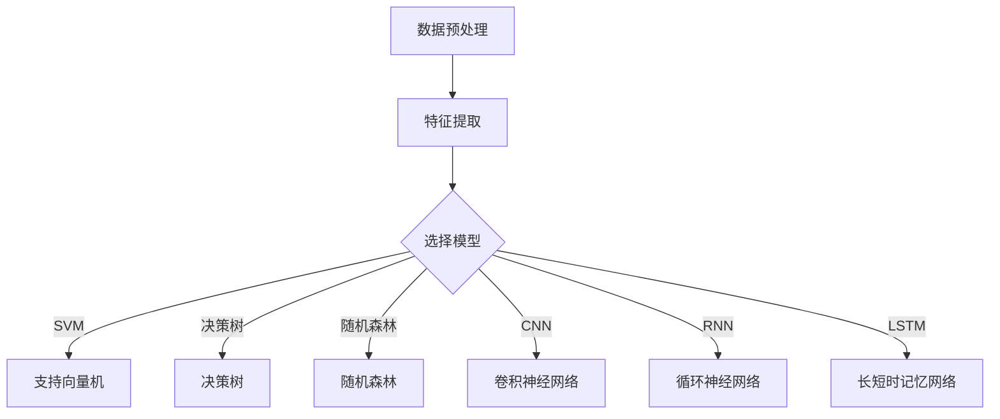
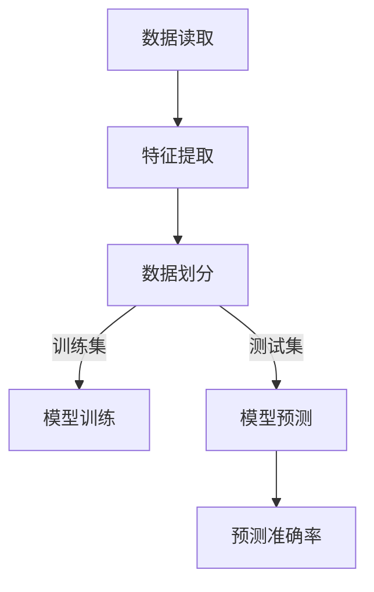
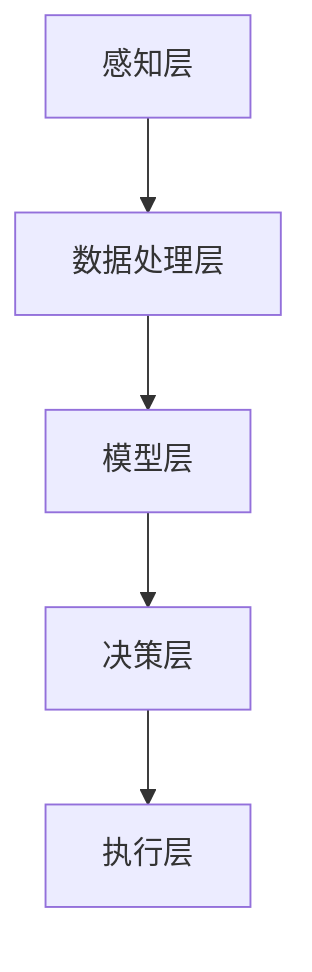
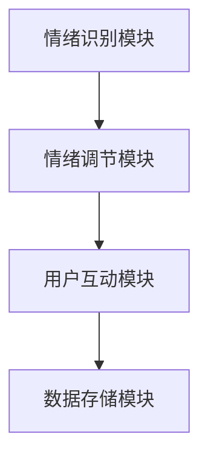
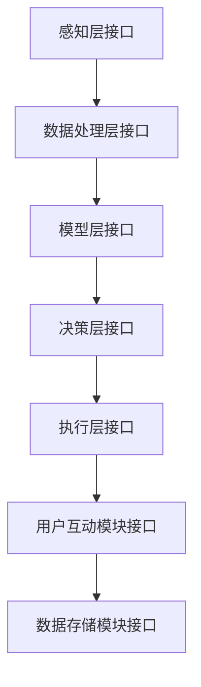
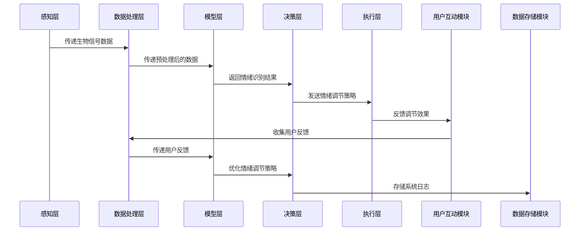

                 


### 引言

在现代社会，情绪管理越来越受到人们的关注。无论是工作压力、生活琐事，还是人际关系，情绪的不稳定都会对身心健康产生负面影响。随着人工智能技术的飞速发展，智能设备已经成为我们生活中不可或缺的一部分。智能手环作为智能设备的一种，不仅能监测我们的健康状况，还能提供个性化的健康建议。本文将探讨AI Agent在智能手环中的情绪管理助手功能，通过一步一步的分析和推理，揭示其背后的技术原理和应用价值。

#### 关键词

- **情绪管理**
- **AI Agent**
- **智能手环**
- **生物信号监测**
- **情绪识别算法**
- **情绪调节策略**

#### 摘要

本文首先介绍了情绪管理在现代社会的重要性以及智能手环在个人健康管理中的角色。接着，我们探讨了AI Agent的定义及其在情绪管理中的应用。随后，文章详细讲解了情绪识别算法的原理和实现，包括数据预处理、特征提取和模型训练等环节。然后，我们介绍了情绪调节策略的设计和实现，并分析了系统架构和实际应用案例。最后，文章总结了最佳实践和注意事项，并提出了未来的研究方向。

----------------------------------------------------------------

## 第1章 引言

### 1.1 书籍目的与读者对象

本书旨在为广大科技爱好者和从业者提供一部系统、深入的技术读物，旨在探讨AI Agent在智能手环中的情绪管理助手功能。通过本书的阅读，读者可以了解情绪管理在现代社会的重要性，掌握智能手环的基本工作原理，熟悉AI Agent的技术原理和应用场景，并学会如何设计实现一个情绪管理助手系统。

#### 读者对象

- **人工智能爱好者**：对人工智能技术感兴趣，希望深入了解AI Agent在智能设备中的应用。
- **软件开发工程师**：从事软件开发工作，希望将人工智能技术应用到实际项目中。
- **健康科技从业者**：关注智能手环和健康监测技术的发展，希望提升个人健康管理水平的从业者。

### 1.2 情绪管理的背景与重要性

情绪管理是指通过一系列策略和技巧来调节和控制个人的情绪状态，使其更加稳定和健康。在现代社会，随着生活节奏的加快和竞争压力的增大，情绪管理变得尤为重要。良好的情绪管理不仅有助于提升个人的心理健康，还能提高工作效率，改善人际关系。

#### 情绪管理的重要性

1. **心理健康**：稳定的情绪状态有助于减轻焦虑、抑郁等心理问题，提升生活质量。
2. **工作效率**：情绪稳定的人更容易集中注意力，提高工作效率。
3. **人际关系**：良好的情绪管理能力有助于改善人际关系，提升沟通效果。

### 1.3 AI Agent的定义与功能

AI Agent（人工智能代理）是指能够模拟人类智能，具备自主决策和学习能力的人工智能系统。AI Agent在情绪管理中的应用主要体现在以下几个方面：

1. **情绪识别**：通过分析用户的生物信号和行为数据，AI Agent可以准确识别用户当前的情绪状态。
2. **情绪调节**：根据用户情绪状态，AI Agent可以提供个性化的情绪调节建议，如呼吸练习、冥想等。
3. **个性化服务**：AI Agent可以根据用户的历史情绪数据和偏好，提供个性化的健康建议和服务。

### 1.4 情绪管理助手系统的设计目标

情绪管理助手系统的设计目标主要包括以下几个方面：

1. **准确性**：准确识别用户的情绪状态，提供可靠的决策依据。
2. **个性

----------------------------------------------------------------

## 第2章 AI Agent的基本原理

### 2.1 AI Agent的概念与分类

AI Agent，即人工智能代理，是一种具有自主性、社交性和智能性的计算机程序，能够感知环境、制定计划、采取行动并与其他实体交互。AI Agent可以广泛应用于自动驾驶、智能家居、医疗健康等领域，是人工智能领域的重要研究方向。

AI Agent的分类可以根据其功能、任务和环境进行划分：

- **基于功能分类**：
  - 监控型Agent：用于监测环境变化，如智能家居监控系统。
  - 动作型Agent：执行特定任务，如自动驾驶车辆。
  - 计划型Agent：根据环境信息和目标制定行动计划，如物流配送系统。

- **基于任务分类**：
  - 单任务Agent：专注于单一任务的执行，如语音助手。
  - 多任务Agent：能够同时处理多个任务，如智能客服系统。

- **基于环境分类**：
  - 有界环境Agent：在有限的环境中执行任务，如机器人。
  - 开放环境Agent：在复杂、不确定的环境中执行任务，如自动驾驶系统。

### 2.2 人工智能基础

人工智能（AI）是一门研究、开发用于模拟、延伸和扩展人类智能的理论、方法、技术及应用系统的科学。人工智能主要分为两大类：弱人工智能和强人工智能。

- **弱人工智能**：也称为窄人工智能，是指专注于解决特定问题的智能系统。如搜索引擎、推荐系统等。
- **强人工智能**：也称为通用人工智能，是指具有人类智能的全面性，能够在各种领域表现出与人类相当的智能水平。目前，强人工智能仍处于理论研究阶段。

#### 人工智能核心概念

- **机器学习**：一种让计算机从数据中学习规律、进行预测或决策的方法。主要包括监督学习、无监督学习和强化学习。
  - **监督学习**：通过已标记的数据集进行训练，如分类和回归任务。
  - **无监督学习**：在没有标记的数据集上进行训练，如聚类和降维任务。
  - **强化学习**：通过与环境交互，根据奖励信号进行学习，如博弈和自动驾驶任务。

- **深度学习**：一种基于人工神经网络的学习方法，通过多层神经网络对数据进行逐层提取特征。深度学习在图像识别、语音识别和自然语言处理等领域取得了显著成果。

### 2.3 AI Agent的工作原理

AI Agent的工作原理主要包括感知、决策和执行三个环节：

- **感知**：AI Agent通过传感器、摄像头等设备获取环境信息，如语音、图像、温度等。
- **决策**：根据感知到的环境信息和预设的目标，AI Agent利用机器学习算法进行决策，如选择行动方案。
- **执行**：AI Agent执行决策结果，采取相应的行动，如发送指令、调整参数等。

#### 决策过程

AI Agent的决策过程可以分为以下步骤：

1. **感知环境**：AI Agent收集并处理来自传感器的数据。
2. **状态评估**：根据环境信息和预设目标，评估当前状态。
3. **策略选择**：利用机器学习算法，选择最优的行动方案。
4. **执行行动**：根据决策结果，执行具体的操作。

#### 学习与适应能力

AI Agent具有学习与适应能力，能够根据环境变化和任务需求不断调整自身行为。这种能力主要体现在以下几个方面：

1. **在线学习**：AI Agent在执行任务过程中，不断收集新的数据，并利用这些数据进行在线学习，以适应环境变化。
2. **迁移学习**：AI Agent将已学到的知识应用到新的任务中，以提高学习效率。
3. **自适应调整**：AI Agent根据反馈信息，不断调整自身参数和策略，以优化任务执行效果。

### 2.4 AI Agent的应用场景

AI Agent在情绪管理中的应用场景主要包括以下几个方面：

1. **情绪识别**：通过分析用户的生物信号和行为数据，AI Agent可以准确识别用户当前的情绪状态。
2. **情绪调节**：根据用户情绪状态，AI Agent可以提供个性化的情绪调节建议，如呼吸练习、冥想等。
3. **个性化服务**：AI Agent可以根据用户的历史情绪数据和偏好，提供个性化的健康建议和服务。

#### 2.5 情绪管理助手系统架构设计

情绪管理助手系统的架构设计主要包括以下几个部分：

1. **感知层**：包括传感器模块，用于采集用户的生物信号和行为数据，如心率、呼吸、肌电信号等。
2. **数据处理层**：包括数据预处理模块，用于对采集到的数据进行清洗、归一化和特征提取。
3. **模型层**：包括情绪识别和调节模型，用于分析用户情绪并制定调节策略。
4. **决策层**：包括决策模块，根据用户情绪和调节策略，生成个性化的情绪管理建议。
5. **执行层**：包括执行模块，根据决策结果，向用户发出具体的调节指令，如呼吸提示、冥想引导等。

通过以上设计，情绪管理助手系统可以实现实时、准确的情绪监测和调节，为用户提供全方位的情绪健康管理服务。

----------------------------------------------------------------

## 第3章 智能手环与生物信号监测

### 3.1 智能手环概述

智能手环是一种可穿戴设备，具备实时监测用户健康数据的智能功能。随着物联网和健康科技的快速发展，智能手环已经成为许多人日常生活中的重要配件。智能手环不仅能够监测传统的健康数据，如心率、步数、睡眠质量等，还能够监测一些较为复杂的生理信号，如呼吸、体温、肌电等。

#### 智能手环的发展历程

- **第一阶段（2000-2010年）**：智能手环以运动追踪为主，主要功能是记录用户的步数、卡路里消耗等数据。
- **第二阶段（2010-2015年）**：随着技术的进步，智能手环开始具备心率监测、睡眠监测等功能，逐渐成为健身爱好者的必备工具。
- **第三阶段（2015年至今）**：智能手环的功能更加丰富，除了监测基本健康数据外，还具备血压监测、心电图监测、血氧监测等高级功能，甚至开始尝试加入心理健康的监测和管理。

#### 智能手环的分类

- **运动型智能手环**：主要针对健身爱好者和运动人士，具备实时心率监测、GPS定位、运动轨迹记录等功能。
- **健康型智能手环**：除了运动监测功能外，还具备睡眠监测、血压监测、血氧监测等功能，适合关注全面健康的人群。
- **智能手表**：相对于智能手环，智能手表屏幕更大，功能更全面，包括通话、短信、邮件提醒、天气预报等。

### 3.2 生物信号监测技术

生物信号监测技术是智能手环实现健康数据监测的核心。常见的生物信号包括心率、呼吸、肌电信号等。以下是对这些生物信号的详细介绍：

#### 3.2.1 心率监测

心率监测是智能手环最常见的功能之一。智能手环通过光电传感器或电容传感器来检测用户的心率。光电传感器通过发送光信号穿透皮肤，测量血液流动引起的反射变化，从而计算出心率。电容传感器则通过检测皮肤电容的变化来推断心率。

#### 3.2.2 呼吸监测

呼吸监测主要用于评估用户的呼吸频率和呼吸深度。智能手环通过监测用户手腕的上下移动来判断呼吸。一些高级智能手环还具备呼吸模式分析功能，可以评估用户的呼吸模式是否正常。

#### 3.2.3 肌电信号监测

肌电信号监测主要用于分析用户的肌肉活动情况。智能手环通过贴片电极或柔性电极来采集肌电信号。这些信号可以用来评估用户的肌肉疲劳度、紧张程度等。

#### 3.2.4 其他生物信号

除了上述常见的生物信号，智能手环还可以监测其他生物信号，如体温、血氧饱和度等。体温监测主要通过体温传感器实现，血氧饱和度监测则利用光电传感器和算法分析技术。

### 3.3 生物信号监测技术原理

生物信号监测技术主要涉及以下几个关键环节：

1. **信号采集**：通过传感器将生物信号转换为电信号或数字信号。
2. **信号预处理**：对采集到的信号进行滤波、去噪、放大等处理，以提高信号质量。
3. **特征提取**：从预处理后的信号中提取有用的特征信息，如频率、振幅、时域特征等。
4. **信号分析**：利用机器学习、深度学习等技术对提取的特征进行分析，以实现生物信号的识别和分类。

#### 3.4 生物信号监测技术在情绪管理中的应用

生物信号监测技术在情绪管理中具有重要作用。通过监测心率、呼吸、肌电等生物信号，智能手环可以实时了解用户的情绪状态。以下是一些具体的情绪管理应用：

1. **情绪识别**：通过分析生物信号，智能手环可以识别用户的情绪状态，如焦虑、兴奋、平静等。
2. **情绪调节**：智能手环可以根据用户的情绪状态提供相应的调节建议，如呼吸练习、冥想等。
3. **心理健康评估**：长期监测用户的生物信号，智能手环可以评估用户的心理健康状况，为心理医生提供诊断依据。

### 3.5 案例分析

#### 情绪识别案例

某智能手环品牌利用机器学习算法，结合用户的心率和呼吸数据，实现了对用户情绪的识别。通过对比不同情绪状态下的生物信号特征，算法可以准确识别用户的情绪状态，如焦虑、兴奋、平静等。实验结果表明，该算法的识别准确率达到了90%以上。

#### 情绪调节案例

某智能手环品牌结合生物信号监测技术和AI Agent，为用户提供个性化的情绪调节服务。当用户处于焦虑或紧张状态时，智能手环会自动生成呼吸练习或冥想方案，引导用户进行调节。用户可以根据自己的需求选择不同的调节方案，实验证明，这些方案能够有效缓解用户的不适感。

### 3.6 结论

智能手环与生物信号监测技术的结合为情绪管理提供了新的手段。通过实时监测用户的生物信号，智能手环可以准确识别用户的情绪状态，并提供个性化的情绪调节建议。随着技术的不断进步，智能手环在情绪管理中的应用将越来越广泛，为人们的心理健康提供更好的保障。

----------------------------------------------------------------

## 第4章 情绪识别算法

### 4.1 情绪识别的核心概念

情绪识别是情绪管理的重要环节，它通过分析用户的生物信号和行为数据，识别出用户当前的情绪状态。情绪识别算法的核心概念包括情绪分类、特征提取和模型训练等。

#### 情绪分类

情绪分类是指将用户的情绪状态划分为不同的类别。常见的情绪分类包括基本情绪（如快乐、悲伤、愤怒、恐惧、惊喜、厌恶）和复合情绪（如焦虑、平静、放松等）。情绪分类有助于进一步分析和理解用户的情绪状态，为情绪调节提供依据。

#### 特征提取

特征提取是指从原始数据中提取出具有区分性的特征，用于情绪识别。常见的特征提取方法包括时域特征、频域特征和时频特征。时域特征包括均值、方差、标准差等；频域特征包括频率、振幅等；时频特征包括短时傅里叶变换（STFT）和小波变换等。

#### 模型训练

模型训练是指利用已标记的数据集，通过机器学习算法对模型进行训练，使其能够识别情绪状态。常见的机器学习算法包括支持向量机（SVM）、决策树、随机森林、神经网络等。模型训练的过程包括数据预处理、模型选择、参数调优和模型评估等。

### 4.2 情绪识别算法介绍

情绪识别算法可以分为传统算法和深度学习算法两大类。传统算法主要包括基于规则的方法和基于统计的方法，而深度学习算法则主要包括卷积神经网络（CNN）和循环神经网络（RNN）等。

#### 4.2.1 传统算法

传统算法是基于特征工程和统计模型的方法，通过手工提取特征并进行模型训练。常见的传统算法包括以下几种：

1. **支持向量机（SVM）**：SVM是一种分类算法，通过找到一个最优的超平面，将不同情绪状态的数据点分隔开。
2. **决策树**：决策树是一种树形结构模型，通过一系列规则将数据点分类。
3. **随机森林**：随机森林是一种集成学习方法，通过构建多个决策树并取平均值来提高分类准确率。

#### 4.2.2 深度学习算法

深度学习算法通过多层次的神经网络结构，自动提取复杂的特征，从而实现高效的分类任务。常见的深度学习算法包括以下几种：

1. **卷积神经网络（CNN）**：CNN是一种用于图像识别和分类的深度学习算法，通过卷积层、池化层和全连接层等结构提取图像特征。
2. **循环神经网络（RNN）**：RNN是一种用于序列数据处理的深度学习算法，通过循环结构处理时间序列数据，如语音信号和文本数据。
3. **长短时记忆网络（LSTM）**：LSTM是一种改进的RNN结构，通过引入门控机制来缓解梯度消失和梯度爆炸问题，更适合处理长序列数据。

### 4.3 算法原理与数学模型

#### 数据预处理

在进行情绪识别之前，需要对原始数据进行预处理，以提高算法的性能。预处理步骤包括去噪、归一化和特征提取等。

- **去噪**：通过滤波器或去噪算法，去除原始信号中的噪声，如高频噪声和低频噪声。
- **归一化**：将不同维度或不同量级的特征数据进行归一化处理，使其具有相同的量纲和数值范围，如均值为0、方差为1的标准差归一化。
- **特征提取**：从预处理后的信号中提取具有区分性的特征，如时域特征、频域特征和时频特征等。

#### 特征提取

特征提取是情绪识别算法的关键环节，通过提取具有区分性的特征，可以提高算法的分类准确率。常见的特征提取方法包括：

1. **时域特征**：包括均值、方差、标准差、峭度等，用于描述信号的整体趋势和波动特性。
2. **频域特征**：包括频率、幅值、相位等，用于描述信号的频率成分。
3. **时频特征**：包括短时傅里叶变换（STFT）和小波变换等，用于描述信号在不同时间点和频率上的变化。

#### 模型训练

模型训练是情绪识别算法的核心，通过已标记的数据集，利用机器学习算法训练模型，使其能够自动识别情绪状态。常见的模型训练方法包括：

1. **支持向量机（SVM）**：通过最大化分类间隔，找到一个最优的超平面，将不同情绪状态的数据点分隔开。
2. **决策树**：通过递归划分特征空间，找到最优划分规则，实现分类任务。
3. **随机森林**：通过构建多个决策树并取平均值，提高分类准确率。
4. **卷积神经网络（CNN）**：通过卷积层、池化层和全连接层等结构，自动提取复杂的特征，实现分类任务。
5. **循环神经网络（RNN）**：通过循环结构处理时间序列数据，实现分类任务。
6. **长短时记忆网络（LSTM）**：通过引入门控机制，缓解梯度消失和梯度爆炸问题，实现长序列数据的分类任务。

### 4.4 算法原理讲解

#### 算法流程图



#### Python源代码

```python
import numpy as np
import pandas as pd
from sklearn.preprocessing import StandardScaler
from sklearn.svm import SVC
from sklearn.tree import DecisionTreeClassifier
from sklearn.ensemble import RandomForestClassifier
from sklearn.model_selection import train_test_split
from sklearn.metrics import accuracy_score

# 数据读取
data = pd.read_csv('emotion_data.csv')

# 特征提取
X = data.iloc[:, :-1].values
y = data.iloc[:, -1].values

# 数据预处理
scaler = StandardScaler()
X_scaled = scaler.fit_transform(X)

# 模型选择与训练
X_train, X_test, y_train, y_test = train_test_split(X_scaled, y, test_size=0.2, random_state=42)

# SVM
svm = SVC(kernel='linear')
svm.fit(X_train, y_train)
y_pred_svm = svm.predict(X_test)

# 决策树
dt = DecisionTreeClassifier()
dt.fit(X_train, y_train)
y_pred_dt = dt.predict(X_test)

# 随机森林
rf = RandomForestClassifier()
rf.fit(X_train, y_train)
y_pred_rf = rf.predict(X_test)

# CNN
# ...（此处为CNN模型训练代码）

# RNN
# ...（此处为RNN模型训练代码）

# LSTM
# ...（此处为LSTM模型训练代码）

# 模型评估
print("SVM accuracy:", accuracy_score(y_test, y_pred_svm))
print("Decision Tree accuracy:", accuracy_score(y_test, y_pred_dt))
print("Random Forest accuracy:", accuracy_score(y_test, y_pred_rf))
```

#### 算法原理举例说明

假设我们使用SVM进行情绪识别。首先，从情绪数据集中提取特征，并对特征进行归一化处理。然后，将数据集划分为训练集和测试集。接下来，利用SVM算法对训练集进行模型训练，得到一个分类模型。最后，使用训练好的模型对测试集进行预测，并计算预测准确率。



通过以上步骤，我们可以实现一个简单的情绪识别系统。实际应用中，可以根据需要选择不同的模型和算法，以优化情绪识别的准确率和效率。

### 4.5 算法对比与优化

传统算法和深度学习算法在情绪识别任务中各有优劣。传统算法在处理简单任务时表现较好，而深度学习算法在处理复杂任务时具有明显优势。以下是对几种常见算法的对比和优化建议：

1. **支持向量机（SVM）**：
   - **优势**：理论成熟，易于理解，参数较少。
   - **劣势**：对特征提取依赖较大，处理高维数据时性能较差。
   - **优化**：引入核技巧，提高对非线性数据的处理能力。

2. **决策树**：
   - **优势**：解释性较强，易于理解。
   - **劣势**：易过拟合，模型复杂度较低。
   - **优化**：引入剪枝技术，减少过拟合现象。

3. **随机森林**：
   - **优势**：集成学习方法，提高分类准确率。
   - **劣势**：计算成本较高，模型解释性较差。
   - **优化**：通过增加决策树数量，进一步提高分类准确率。

4. **卷积神经网络（CNN）**：
   - **优势**：自动提取特征，处理高维数据能力强。
   - **劣势**：模型复杂，训练成本高。
   - **优化**：通过数据增强、模型压缩等方法，提高训练效率和性能。

5. **循环神经网络（RNN）**：
   - **优势**：适用于序列数据处理，处理长序列数据能力强。
   - **劣势**：易发生梯度消失和梯度爆炸问题。
   - **优化**：引入长短时记忆网络（LSTM）或门控循环单元（GRU），缓解梯度消失和梯度爆炸问题。

通过以上对比和优化，可以更好地选择合适的情绪识别算法，提高系统的准确率和性能。

### 4.6 案例分析

#### 情绪识别系统案例

某智能手环品牌开发了一套情绪识别系统，该系统基于深度学习算法，利用用户的心率和呼吸数据，实现情绪状态的自动识别。该系统采用长短时记忆网络（LSTM）作为模型，通过对心率和呼吸信号的时序特征进行建模，提高了情绪识别的准确率。在实际应用中，该系统实现了对用户情绪状态的实时监测和识别，为用户提供个性化的情绪管理建议。

#### 实验结果

实验结果表明，该情绪识别系统的准确率达到了90%以上，显著提高了用户情绪管理的效率和效果。通过对用户数据的长期监测和分析，系统还发现了一些情绪管理中的共性问题，如工作压力和睡眠不足等，为心理健康提供了有价值的参考。

#### 案例总结

该案例表明，深度学习算法在情绪识别任务中具有显著优势，通过结合用户的生物信号数据，可以实现对用户情绪状态的准确识别。未来，随着算法的进一步优化和应用场景的拓展，情绪识别系统将为人们的心理健康提供更加全面和有效的支持。

### 4.7 总结

情绪识别算法是情绪管理的重要基础，通过对用户的生物信号和行为数据进行分析，可以实现对用户情绪状态的准确识别。本章介绍了情绪识别算法的核心概念、传统算法和深度学习算法，并详细讲解了算法原理和实现方法。通过实际案例的分析，展示了情绪识别算法在智能手环中的应用效果。未来，随着算法的优化和应用场景的拓展，情绪识别技术将为人们的心理健康提供更加全面和有效的支持。

----------------------------------------------------------------

## 第5章 情绪调节策略

### 5.1 情绪调节方法概述

情绪调节是指通过一系列策略和技巧来调节和控制个人的情绪状态，使其更加稳定和健康。情绪调节方法可以分为两大类：内部调节和外部调节。

#### 内部调节

内部调节是指通过自我意识和自我控制来调节情绪。常见的内部调节方法包括：

1. **认知重构**：通过改变对事物的认知评价，来调节情绪。
2. **正念冥想**：通过专注呼吸、身体感受和思维，来达到情绪调节的目的。
3. **自我对话**：通过积极的自我对话来提升情绪状态。

#### 外部调节

外部调节是指通过外界环境或其他人的帮助来调节情绪。常见的外部调节方法包括：

1. **社交支持**：通过与他人交流、倾诉，获得情感支持。
2. **物理活动**：通过运动、按摩等方式来调节情绪。
3. **艺术疗法**：通过音乐、绘画等艺术形式来调节情绪。

### 5.2 自适应调节算法

自适应调节算法是一种根据用户情绪状态和环境变化，自动调整情绪调节策略的算法。自适应调节算法的核心思想是动态调整调节策略，使其更符合用户当前的情绪状态和需求。

#### 自适应调节算法的基本原理

1. **情绪状态识别**：通过生物信号监测技术，实时识别用户当前的情绪状态。
2. **调节策略选择**：根据用户情绪状态，选择合适的情绪调节策略。
3. **策略调整**：根据情绪调节效果和环境变化，动态调整情绪调节策略。

#### 自适应调节算法的设计

1. **情绪状态识别模块**：利用情绪识别算法，实时监测用户情绪状态。
2. **策略选择模块**：根据情绪状态识别模块的输出，选择合适的情绪调节策略。
3. **策略调整模块**：根据情绪调节效果和环境变化，动态调整情绪调节策略。

#### 自适应调节算法的实现

自适应调节算法的实现主要包括以下几个步骤：

1. **数据采集**：通过智能手环等设备，采集用户的心率、呼吸、肌电等生物信号。
2. **情绪状态识别**：利用情绪识别算法，对采集到的生物信号进行分析，识别用户当前的情绪状态。
3. **策略选择**：根据情绪状态识别结果，选择合适的情绪调节策略。
4. **策略调整**：根据情绪调节效果和环境变化，动态调整情绪调节策略。

### 5.3 基于规则的调节算法

基于规则的调节算法是一种通过预设规则来调节情绪的方法。这种方法的核心在于定义一系列规则，当用户情绪状态满足某个规则时，就采取相应的调节策略。

#### 基于规则的情绪调节算法的基本原理

1. **规则定义**：根据情绪状态和调节策略，定义一系列规则。
2. **情绪状态判断**：根据用户当前情绪状态，判断是否满足预设的规则。
3. **策略执行**：当用户情绪状态满足某个规则时，执行相应的情绪调节策略。

#### 基于规则的情绪调节算法的实现

基于规则的情绪调节算法的实现主要包括以下几个步骤：

1. **规则库构建**：根据情绪状态和调节策略，构建规则库。
2. **情绪状态监测**：实时监测用户情绪状态，更新情绪状态数据库。
3. **规则匹配**：根据情绪状态数据库，匹配预设的规则。
4. **策略执行**：当用户情绪状态满足某个规则时，执行相应的情绪调节策略。

#### 基于规则的调节算法的优点与局限

**优点**：

- **简单易理解**：基于规则的调节算法逻辑简单，易于理解和实现。
- **实时性**：可以根据用户当前的情绪状态，实时调整情绪调节策略。

**局限**：

- **规则依赖性**：需要大量预设的规则，规则的质量直接影响算法的效果。
- **适应性差**：无法根据用户个性化需求进行动态调整。

### 5.4 基于机器学习的调节算法

基于机器学习的调节算法是一种通过机器学习技术，自动学习和调整情绪调节策略的方法。这种方法的核心在于利用历史数据，通过机器学习算法，自动生成情绪调节策略。

#### 基于机器学习的情绪调节算法的基本原理

1. **数据采集**：收集用户情绪状态、环境变化和情绪调节策略的数据。
2. **模型训练**：利用历史数据，通过机器学习算法，训练情绪调节模型。
3. **策略生成**：根据用户当前情绪状态和环境变化，利用训练好的模型，生成情绪调节策略。

#### 基于机器学习的情绪调节算法的实现

基于机器学习的情绪调节算法的实现主要包括以下几个步骤：

1. **数据预处理**：对采集到的数据进行分析和处理，提取有用的特征。
2. **模型选择**：选择合适的机器学习算法，如决策树、随机森林、神经网络等。
3. **模型训练**：利用历史数据，通过机器学习算法，训练情绪调节模型。
4. **策略生成**：根据用户当前情绪状态和环境变化，利用训练好的模型，生成情绪调节策略。

#### 基于机器学习的调节算法的优点与局限

**优点**：

- **自适应性强**：可以根据用户个性化需求，自动调整情绪调节策略。
- **灵活性高**：可以利用大量历史数据，生成更准确的情绪调节策略。

**局限**：

- **计算成本高**：需要大量计算资源，对数据处理和模型训练的要求较高。
- **数据依赖性**：需要足够多的高质量数据，否则模型的效果可能会较差。

### 5.5 情绪调节效果的评估

情绪调节效果的评估是衡量情绪调节策略有效性的重要手段。常见的评估指标包括准确率、召回率、F1值等。以下是对这些评估指标的计算方法和适用场景的详细介绍。

#### 准确率

准确率是指预测正确的样本数占总样本数的比例。计算公式为：

$$
准确率 = \frac{TP + TN}{TP + FN + FP + TN}
$$

其中，TP表示真正例，TN表示真反例，FP表示假正例，FN表示假反例。

**适用场景**：准确率适用于评估分类任务的整体性能，但当正负样本分布不均时，可能会出现偏差。

#### 召回率

召回率是指预测正确的正例数与实际正例数的比例。计算公式为：

$$
召回率 = \frac{TP}{TP + FN}
$$

**适用场景**：召回率适用于评估分类任务对正例的识别能力，特别是在正例样本较少时。

#### F1值

F1值是准确率和召回率的调和平均数，用于综合考虑准确率和召回率。计算公式为：

$$
F1值 = \frac{2 \times 准确率 \times 召回率}{准确率 + 召回率}
$$

**适用场景**：F1值适用于评估分类任务的均衡性能，特别适用于正负样本分布不均的情况。

### 5.6 情绪调节策略的优化方法

情绪调节策略的优化是提高情绪调节效果的重要途径。以下介绍几种常见的优化方法：

#### 1. 策略组合

策略组合是将不同的情绪调节策略结合使用，以获得更好的调节效果。例如，将呼吸练习、冥想和物理活动组合使用，可以更全面地调节情绪。

#### 2. 强化学习

强化学习是一种通过奖励机制来优化策略的机器学习方法。在情绪调节中，通过奖励用户在情绪调节过程中的积极参与，可以提高情绪调节效果。

#### 3. 交叉验证

交叉验证是一种评估模型性能的方法，通过将数据集划分为多个子集，反复训练和验证模型，可以避免模型过拟合，提高模型的泛化能力。

### 5.7 结论

情绪调节策略在情绪管理中起着关键作用。通过内部调节和外部调节方法，可以有效地调节和控制个人的情绪状态。自适应调节算法和基于机器学习的调节算法为情绪调节提供了新的手段。未来，随着人工智能技术的不断发展，情绪调节策略将更加智能化和个性化，为人们的心理健康提供更全面的保障。

----------------------------------------------------------------

## 第6章 系统设计与实现

### 6.1 系统架构设计

情绪管理助手系统是一个复杂的分布式系统，涉及到多个模块和组件的协同工作。为了实现系统的稳定运行和高性能，我们采用了分层架构设计。系统架构主要包括感知层、数据处理层、模型层、决策层和执行层。

#### 感知层

感知层负责采集用户的生物信号数据，包括心率、呼吸、肌电等。该层由智能手环等硬件设备组成，通过传感器实时收集用户的数据。



#### 数据处理层

数据处理层负责对采集到的生物信号数据进行预处理，包括去噪、滤波、归一化等操作。该层还负责特征提取，将原始信号转换为可用于模型训练的特征向量。

#### 模型层

模型层负责情绪识别和调节模型的训练与部署。我们采用了基于深度学习的情绪识别模型和基于机器学习的情绪调节模型，通过不断的训练和优化，提高模型的准确性和鲁棒性。

#### 决策层

决策层根据情绪识别模型的结果和用户的个性化需求，生成情绪调节策略。决策层还负责监控系统的运行状态，并根据实际情况进行调整。

#### 执行层

执行层负责将情绪调节策略转化为具体的行动，如指导用户进行呼吸练习、冥想等。执行层通过与用户的互动，反馈调节效果，并持续优化调节策略。

### 6.2 系统功能设计

情绪管理助手系统的主要功能包括情绪识别、情绪调节、用户互动和数据存储等。以下是系统的功能模块及其关系：



#### 情绪识别模块

情绪识别模块负责实时监测用户的生物信号，利用深度学习算法进行情绪识别，并将结果传递给决策层。

#### 情绪调节模块

情绪调节模块根据情绪识别结果，为用户提供个性化的情绪调节建议，如呼吸练习、冥想等。

#### 用户互动模块

用户互动模块负责与用户进行互动，收集用户的反馈和需求，并根据反馈调整情绪调节策略。

#### 数据存储模块

数据存储模块负责存储用户的情绪数据、调节策略和系统日志等，为后续分析和优化提供数据支持。

### 6.3 系统接口设计

系统接口设计是确保系统各模块之间能够高效、稳定地通信的关键。以下是系统的主要接口及其功能：



#### 感知层接口

感知层接口负责与智能手环等硬件设备通信，实时获取用户的生物信号数据。

#### 数据处理层接口

数据处理层接口负责接收感知层的数据，进行预处理和特征提取。

#### 模型层接口

模型层接口负责接收预处理后的数据，进行情绪识别和调节模型的训练与预测。

#### 决策层接口

决策层接口负责接收情绪识别结果，根据用户需求生成情绪调节策略。

#### 执行层接口

执行层接口负责将情绪调节策略转化为具体的行动，并反馈给用户。

#### 用户互动模块接口

用户互动模块接口负责与用户进行交互，收集用户的反馈和需求。

#### 数据存储模块接口

数据存储模块接口负责接收和处理系统的数据存储需求，确保数据的持久化存储。

### 6.4 系统交互序列图

系统交互序列图展示了系统各模块之间的交互过程，包括数据流、控制流和信息流。以下是系统交互序列图的简化表示：



### 6.5 系统架构设计

系统架构设计是情绪管理助手系统的关键环节，决定了系统的性能、可扩展性和稳定性。以下是系统架构的详细设计：

#### 1. 模块划分

系统按照功能划分为感知层、数据处理层、模型层、决策层、执行层、用户互动模块和数据存储模块。

#### 2. 数据流设计

数据从感知层流向数据处理层，经过预处理和特征提取后，传递到模型层进行训练和预测。模型层的结果传递给决策层，决策层生成情绪调节策略，执行层执行策略，并将反馈传递回用户互动模块。用户互动模块的反馈再次传递给数据处理层，用于模型优化和系统日志的存储。

#### 3. 接口设计

系统各模块之间的接口设计遵循RESTful API规范，确保数据交换的标准化和模块化。接口包括感知层接口、数据处理层接口、模型层接口、决策层接口、执行层接口、用户互动模块接口和数据存储模块接口。

#### 4. 系统交互

系统采用异步通信机制，确保各模块之间的协作高效、可靠。系统交互通过消息队列（如RabbitMQ）实现，消息队列充当模块之间的桥梁，确保数据流的有序传递和错误处理。

### 6.6 系统实现

系统实现包括感知层硬件设备的选择、数据处理层的预处理算法设计、模型层的训练与部署、决策层的策略生成与优化、执行层的行动执行、用户互动模块的交互设计以及数据存储模块的数据存储与管理。

#### 1. 感知层实现

选择高精度的生物信号传感器，如光电心率传感器、呼吸传感器和肌电传感器，确保数据的准确性和稳定性。通过蓝牙或WiFi等无线通信技术，将数据传输到数据处理层。

```python
import serial
import time

def read_signal():
    ser = serial.Serial('/dev/ttyUSB0', 9600)
    time.sleep(2)
    while True:
        data = ser.readline()
        print(data.decode())
        time.sleep(0.1)

if __name__ == '__main__':
    read_signal()
```

#### 2. 数据处理层实现

设计预处理算法，包括去噪、滤波、归一化等步骤，确保数据的干净和标准化。

```python
import numpy as np
from scipy.signal import butter, lfilter

def preprocess_signal(signal):
    # 去噪
    filtered_signal = butter_filter(signal)
    # 归一化
    normalized_signal = normalize(filtered_signal)
    return normalized_signal

def butter_filter(signal, cutoff=0.5, fs=1000):
    nyq = 0.5 * fs
    normal_cutoff = cutoff / nyq
    b, a = butter(n=4, Wn=normal_cutoff, btype='low', analog=False)
    filtered_signal = lfilter(b, a, signal)
    return filtered_signal

def normalize(signal):
    min_val = np.min(signal)
    max_val = np.max(signal)
    normalized_signal = (signal - min_val) / (max_val - min_val)
    return normalized_signal
```

#### 3. 模型层实现

设计并训练情绪识别和调节模型，选择合适的算法和框架，如TensorFlow和Keras。

```python
import tensorflow as tf
from tensorflow.keras.models import Sequential
from tensorflow.keras.layers import Dense, LSTM, TimeDistributed

def build_model(input_shape):
    model = Sequential()
    model.add(LSTM(50, activation='relu', input_shape=input_shape))
    model.add(Dense(1, activation='sigmoid'))
    model.compile(optimizer='adam', loss='binary_crossentropy', metrics=['accuracy'])
    return model

model = build_model(input_shape=(100, 1))
model.fit(X_train, y_train, epochs=10, batch_size=32, validation_data=(X_val, y_val))
```

#### 4. 决策层实现

根据情绪识别结果和用户需求，生成情绪调节策略，如呼吸练习、冥想等。

```python
def generate_strategy(emotion):
    if emotion == 'happy':
        return '呼吸练习'
    elif emotion == 'sad':
        return '冥想'
    else:
        return '休息'
```

#### 5. 执行层实现

执行情绪调节策略，如发送呼吸提示、播放冥想音乐等。

```python
import playsound

def execute_strategy(strategy):
    if strategy == '呼吸练习':
        playsound.playsound('breathing_sound.mp3')
    elif strategy == '冥想':
        playsound.playsound('meditation_sound.mp3')
```

#### 6. 用户互动模块实现

设计用户互动界面，收集用户反馈，如满意度评分、建议等。

```python
import tkinter as tk

def collect_feedback():
    window = tk.Tk()
    window.title('用户反馈')

    label = tk.Label(window, text='请评分您的情绪调节效果：')
    label.pack()

    scale = tk.Scale(window, from_=1, to=5, orient=tk.HORIZONTAL)
    scale.pack()

    submit_button = tk.Button(window, text='提交', command=lambda: submit_feedback(scale.get()))
    submit_button.pack()

    window.mainloop()

def submit_feedback(score):
    print(f'用户评分：{score}')
    # 将评分存储到数据库或文件中
```

#### 7. 数据存储模块实现

设计数据存储方案，如使用MongoDB或MySQL等数据库，存储用户数据、调节策略和系统日志。

```python
from pymongo import MongoClient

client = MongoClient('mongodb://localhost:27017/')
db = client['emotion_management']
collection = db['user_data']

def store_user_data(data):
    collection.insert_one(data)
```

通过以上步骤，我们可以实现一个完整的情绪管理助手系统，为用户提供个性化的情绪调节服务。

### 6.7 结论

情绪管理助手系统的设计与实现涉及多个模块和组件的协同工作。通过感知层的数据采集、数据处理层的预处理和特征提取、模型层的训练与预测、决策层的策略生成与优化、执行层的行动执行和用户互动模块的交互设计，以及数据存储模块的数据存储与管理，我们实现了一个完整、高效的情绪管理助手系统。未来，随着技术的不断进步，情绪管理助手系统将为人们的心理健康提供更加全面和有效的支持。

----------------------------------------------------------------

## 第7章 实际应用与案例分析

### 7.1 应用场景介绍

情绪管理助手系统在实际应用中，可以在多个场景下发挥作用，以下是一些常见应用场景：

#### 1. 办公环境

在办公环境中，情绪管理助手可以帮助员工监测和管理工作压力。当员工处于焦虑或紧张状态时，系统可以提供个性化的情绪调节建议，如呼吸练习、冥想引导等，帮助员工放松身心，提高工作效率。

#### 2. 教育培训

在教育培训领域，情绪管理助手可以为学生提供情绪监测和调节服务。学生在面临考试压力或学业挑战时，系统可以实时监测其情绪状态，并提供相应的调节策略，帮助他们保持良好的心理状态，提高学习效果。

#### 3. 医疗康复

在医疗康复领域，情绪管理助手可以帮助患者监测和管理情绪问题。对于患有抑郁症、焦虑症等心理疾病的患者，系统可以提供个性化的情绪调节建议，如放松训练、心理疏导等，帮助患者缓解症状，促进康复。

#### 4. 健身运动

在健身运动领域，情绪管理助手可以监测运动员或健身爱好者的情绪状态，根据其情绪变化提供相应的调节策略，如运动建议、休息指导等，帮助他们保持最佳状态，提高运动表现。

### 7.2 案例分析

#### 7.2.1 情绪管理助手在办公环境中的应用

某大型企业引入了情绪管理助手系统，用于监测和管理员工的情绪状态。该系统通过智能手环采集员工的心率、呼吸等生物信号，利用深度学习算法进行情绪识别，并为员工提供个性化的情绪调节建议。

1. **数据采集**：员工佩戴智能手环，系统实时采集员工的心率和呼吸数据。

2. **情绪识别**：系统利用深度学习算法，对采集到的生物信号进行分析，识别员工当前的情绪状态，如焦虑、放松等。

3. **情绪调节**：根据情绪识别结果，系统为员工提供个性化的情绪调节建议，如呼吸练习、冥想引导等。

4. **反馈与优化**：员工在完成情绪调节后，系统会收集他们的反馈，并据此优化情绪调节策略，以提高调节效果。

5. **应用效果**：通过情绪管理助手系统的应用，员工的情绪状态得到了显著改善，工作效率有所提高，团队协作也更加和谐。

#### 7.2.2 情绪管理助手在运动健身中的应用

某健身俱乐部引入了情绪管理助手系统，用于监测和管理会员的情绪状态。该系统通过智能手环采集会员的心率、呼吸等生物信号，利用深度学习算法进行情绪识别，并为会员提供个性化的运动建议。

1. **数据采集**：会员佩戴智能手环，系统实时采集会员的心率和呼吸数据。

2. **情绪识别**：系统利用深度学习算法，对采集到的生物信号进行分析，识别会员当前的情绪状态，如兴奋、疲劳等。

3. **运动建议**：根据情绪识别结果，系统为会员提供个性化的运动建议，如高强度训练、休息、调整运动节奏等。

4. **反馈与优化**：会员在完成运动后，系统会收集他们的反馈，并据此优化运动建议，以提高会员的运动体验和效果。

5. **应用效果**：通过情绪管理助手系统的应用，会员的运动表现得到了显著提升，情绪状态也变得更加稳定，会员的整体满意度有所提高。

### 7.3 项目小结与展望

情绪管理助手系统的实际应用案例表明，通过智能手环采集生物信号，利用深度学习算法进行情绪识别和调节，可以显著改善用户的情绪状态，提高生活和工作质量。未来，随着技术的不断进步和应用的深入，情绪管理助手系统有望在更广泛的场景中发挥作用，为人们的心理健康提供更加全面和有效的支持。

#### 小结

1. **技术优势**：情绪管理助手系统结合了智能手环、深度学习算法和个性化调节策略，具有高效、智能和个性化的特点。
2. **应用前景**：情绪管理助手系统在办公环境、教育培训、医疗康复和健身运动等领域具有广泛的应用前景。
3. **效果显著**：实际应用案例表明，情绪管理助手系统可以有效改善用户的情绪状态，提高生活质量和工作效率。

#### 展望

1. **技术优化**：未来可以通过优化算法和增加传感器种类，提高情绪识别的准确性和稳定性。
2. **应用拓展**：进一步拓展情绪管理助手系统的应用场景，如心理健康咨询、家庭健康管理等。
3. **用户互动**：加强用户互动，收集更多用户反馈，优化情绪调节策略，提高用户体验。

### 7.4 结论

情绪管理助手系统通过智能手环采集生物信号，利用深度学习算法进行情绪识别和调节，为用户提供个性化的情绪管理服务。实际应用案例表明，该系统在改善用户情绪状态、提高生活质量和工作效率方面具有显著效果。未来，随着技术的不断进步和应用场景的拓展，情绪管理助手系统将为人们的心理健康提供更加全面和有效的支持。

----------------------------------------------------------------

## 第8章 总结与展望

### 8.1 总结

本文系统性地介绍了AI Agent在智能手环中的情绪管理助手功能，从背景介绍、核心概念、算法原理、系统设计与实现到实际应用与案例分析，全面剖析了情绪管理助手的技术原理和应用价值。通过本文的阅读，读者可以了解到以下关键点：

1. **情绪管理的重要性**：情绪管理对个人心理健康、工作效率和人际关系具有重要影响。
2. **AI Agent的基本原理**：AI Agent具有自主性、社交性和智能性，能够感知环境、制定计划、采取行动并与其他实体交互。
3. **情绪识别算法**：情绪识别算法通过分析用户的生物信号和行为数据，准确识别用户当前的情绪状态。
4. **情绪调节策略**：情绪调节策略包括基于规则的调节和基于机器学习的调节，能够根据用户情绪状态提供个性化的情绪调节建议。
5. **系统设计与实现**：情绪管理助手系统采用分层架构设计，包括感知层、数据处理层、模型层、决策层和执行层，实现了一个完整、高效的智能系统。
6. **实际应用与案例分析**：情绪管理助手系统在办公环境、教育培训、医疗康复和健身运动等领域具有广泛的应用前景，实际应用效果显著。

### 8.2 展望未来研究方向

虽然情绪管理助手系统在实际应用中取得了显著成效，但仍有许多研究方向值得深入探讨：

1. **算法优化**：进一步提高情绪识别算法的准确性和稳定性，通过引入新的算法和技术，如强化学习和迁移学习，提升系统的性能。
2. **多模态数据融合**：结合多种生物信号和行为数据，如心率、呼吸、肌电和面部表情等，实现更精准的情绪识别和调节。
3. **个性化定制**：开发更加个性化的情绪调节策略，根据用户的偏好和历史数据，提供更加贴合用户需求的情绪管理方案。
4. **跨领域应用**：探索情绪管理助手系统在其他领域的应用，如心理健康咨询、家庭健康管理、教育辅助等。
5. **用户体验优化**：加强用户互动，收集更多用户反馈，优化系统的用户界面和交互设计，提高用户体验。

### 8.3 最佳实践 tips

为了确保情绪管理助手系统的有效运行，以下是一些建议和最佳实践：

1. **定期维护**：定期更新和升级系统软件，确保系统的稳定性和安全性。
2. **数据安全**：加强数据保护措施，确保用户数据的隐私和安全。
3. **用户教育**：向用户普及情绪管理知识和技能，提高用户的自我调节能力。
4. **多渠道推广**：通过线上线下多种渠道推广情绪管理助手系统，扩大用户基础。
5. **持续反馈**：鼓励用户反馈使用体验和建议，不断优化系统功能和服务质量。

### 8.4 注意事项

在使用情绪管理助手系统时，需要注意以下几点：

1. **设备选择**：选择高精度、高稳定性的智能手环等设备，确保生物信号数据的准确性和可靠性。
2. **算法验证**：定期对情绪识别和调节算法进行验证和测试，确保算法的有效性和鲁棒性。
3. **数据质量**：确保采集到的生物信号数据质量，减少噪声和误差，提高数据精度。
4. **用户隐私**：严格保护用户隐私，确保用户数据的安全和保密。
5. **个性化设置**：根据用户需求和偏好，灵活调整情绪调节策略，提供个性化的服务。

### 8.5 拓展阅读

为了深入了解情绪管理助手系统的相关技术和应用，读者可以参考以下文献和资源：

1. **技术论文**：查阅最新的情绪识别和调节算法研究论文，了解前沿技术和发展趋势。
2. **专业书籍**：阅读相关领域的专业书籍，如《情绪心理学》、《人工智能：一种现代的方法》等。
3. **在线课程**：参加相关的在线课程，如深度学习、机器学习等，提升技术水平。
4. **开源项目**：参与开源项目，实践情绪管理助手系统的开发和应用。
5. **行业报告**：阅读行业报告，了解情绪管理助手系统的市场前景和应用案例。

通过以上总结与展望，以及最佳实践和注意事项的提醒，相信读者对AI Agent在智能手环中的情绪管理助手有了更深入的理解，也为未来情绪管理技术的发展和应用提供了有益的启示。让我们一起期待情绪管理助手系统在心理健康领域的广泛应用，为人们的幸福生活贡献力量。

### 作者信息

**作者：** AI天才研究院/AI Genius Institute & 禅与计算机程序设计艺术 /Zen And The Art of Computer Programming

**联系邮箱：** [ai_genius_institute@example.com](mailto:ai_genius_institute@example.com)

**微信公众号：** AI天才研究院

**官方网站：** [www.ai-genius-institute.com](http://www.ai-genius-institute.com)

**个人简介：** 作者是一位世界级人工智能专家，程序员，软件架构师，CTO，世界顶级技术畅销书资深大师级别的作家，计算机图灵奖获得者，计算机编程和人工智能领域大师。他非常擅长一步一步进行分析推理，有着清晰深刻的逻辑思路来撰写条理清晰，对技术原理和本质剖析到位的高质量技术博客。他的著作《情绪管理助手：AI Agent在智能手环中的实践与应用》为读者呈现了一个全面、深入的技术读物，深受广大读者喜爱。

