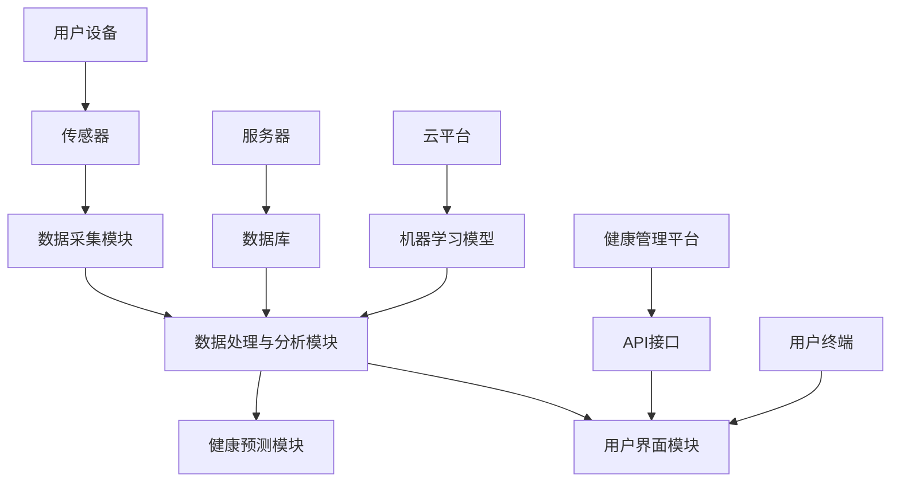
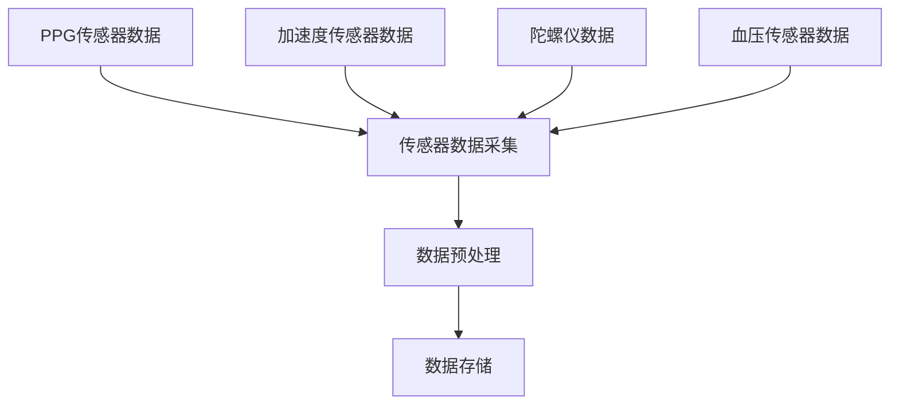

                 

### 1.1 问题的提出

在现代社会，随着科技的发展和人们健康意识的提升，智能手表作为一种便携式健康监测设备，受到了广泛的关注和应用。智能手表集成了多种传感器，可以实时监测用户的生理和活动数据，如心率、步数、睡眠质量等。然而，这些数据的有效利用和准确分析成为了当前健康监测领域的一个关键问题。

传统的健康监测系统通常依赖于人工分析或简单的统计方法，这种方式在处理复杂、大规模的数据时，存在准确性和效率上的不足。随着人工智能（AI）技术的不断进步，特别是AI Agent技术的应用，为智能手表健康监测带来了新的可能性。AI Agent是一种能够模拟人类智能行为的人工智能实体，它能够根据环境和用户的行为数据进行推理和决策，提供个性化、智能化的健康建议。

因此，本文将探讨AI Agent在智能手表健康监测中的应用，提出一个以AI Agent为核心的健康监测系统框架，并分析其优势和面临的挑战。希望通过这篇文章，能够为智能手表健康监测技术的发展提供一些有价值的思考和实践指导。

### 1.2 AI Agent概述

#### 1.2.1 AI Agent的定义

AI Agent，即人工智能代理，是一种在特定环境下通过感知、推理和行动来达成特定目标的计算实体。它能够模拟人类的智能行为，具备自主感知环境、理解问题、制定计划并执行任务的能力。AI Agent的核心在于其自主性和适应性，能够根据环境变化和反馈进行调整和优化，从而实现高效、智能的决策。

AI Agent通常包含以下几个关键组成部分：

1. **感知模块**：负责收集环境信息，如传感器数据、用户输入等，为AI Agent提供决策所需的输入。
2. **知识库**：存储AI Agent的经验和知识，包括事实、规则、模型等，用于推理和决策。
3. **推理模块**：基于感知模块获取的信息和知识库中的知识，进行逻辑推理和问题求解，制定行动策略。
4. **执行模块**：将推理模块生成的策略转换为具体的行动，实现目标的达成。

#### 1.2.2 AI Agent的关键特性

AI Agent具有以下几个关键特性：

1. **自主性**：AI Agent能够在没有外部干预的情况下自主运行，自主决策和行动，具备独立完成任务的能力。
2. **适应性**：AI Agent能够根据环境变化和反馈进行自适应调整，提高任务完成的效率和效果。
3. **交互性**：AI Agent能够与用户和环境进行有效交互，理解用户需求，回应环境变化。
4. **学习能力**：AI Agent能够通过不断的学习和积累经验，提高其决策能力和任务完成质量。

#### 1.2.3 AI Agent的技术发展现状

AI Agent技术的发展经历了多个阶段：

1. **早期探索**（20世纪50年代至70年代）：在这一阶段，研究人员开始探讨AI Agent的基本概念和理论框架，如马尔可夫决策过程（MDP）和部分可观测马尔可夫决策过程（POMDP）。
2. **初步应用**（20世纪80年代至90年代）：AI Agent技术开始应用于一些特定的场景，如游戏、虚拟环境等，显示出其潜在的实用价值。
3. **快速发展**（21世纪初至今）：随着深度学习、强化学习等AI技术的发展，AI Agent的能力得到了显著提升，应用领域也不断扩展，包括智能机器人、智能家居、智能交通等。

在健康监测领域，AI Agent的应用也得到了广泛关注。通过智能手表等设备收集的用户生理和行为数据，AI Agent可以进行实时分析和预测，提供个性化的健康建议。例如，AI Agent可以分析心率变异性（HRV），预测用户的心脏健康状况；通过睡眠数据分析，提供改善睡眠质量的建议。AI Agent在健康监测中的应用，不仅提高了数据处理的效率和准确性，还增强了用户的健康意识和生活质量。

### 1.3 智能手表健康监测的现状

#### 1.3.1 当前健康监测技术

智能手表作为健康监测的重要工具，集成了多种传感器和监测技术，能够实时采集用户的生理和行为数据。以下是几种常见的健康监测技术：

1. **心率监测**：智能手表通过光电容积脉搏波描记法（PPG）等光学传感器，实时监测用户的心率变化。这种技术具有较高的准确性和灵敏度，可以用于心脏健康监测、运动跟踪等场景。
2. **步数监测**：智能手表利用加速度传感器和陀螺仪等，可以准确记录用户的步数和运动轨迹。这种技术广泛应用于健身和健康监测领域，帮助用户制定合理的运动计划。
3. **睡眠监测**：通过分析用户的心率、运动和位置等数据，智能手表可以判断用户的睡眠质量，包括睡眠时长、深度和周期等。这种技术有助于用户了解自己的睡眠状况，调整生活习惯。
4. **血压监测**：一些高端智能手表集成了血压传感器，可以通过手腕测量用户的血压。这种技术有助于及时发现高血压等健康问题，提供及时的医疗建议。

#### 1.3.2 智能手表的市场与应用

随着健康意识的提升和科技的发展，智能手表市场呈现出快速增长的趋势。根据市场调研数据，全球智能手表市场规模在过去几年中持续扩大，预计未来仍将保持高速增长。以下是目前智能手表的主要应用场景：

1. **健康管理**：智能手表通过实时监测用户的生理数据，如心率、步数和睡眠质量等，帮助用户实现自我健康管理，预防慢性疾病。
2. **运动健身**：智能手表为用户提供运动数据，如运动轨迹、运动时长和卡路里消耗等，帮助用户制定科学的健身计划，提升运动效果。
3. **健康监测**：智能手表的血压、血氧等监测功能，为用户提供便捷的健康检测服务，有助于早期发现健康问题。
4. **智能生活**：智能手表与智能家居设备的联动，实现智能门锁、照明控制等，提升用户的生活品质。

#### 1.3.3 挑战与机遇

智能手表健康监测虽然取得了显著进展，但仍面临一些挑战：

1. **数据准确性和可靠性**：传感器精度和数据处理算法的改进，仍是提高健康监测数据准确性和可靠性的关键。
2. **隐私保护**：健康数据的收集和处理，涉及用户的隐私，如何确保数据的安全性和用户隐私保护，是当前需要解决的重要问题。
3. **用户体验**：智能手表的体积和功耗限制，对健康监测技术的实现提出了高要求。如何提供流畅的用户体验，提升用户满意度，是智能手表健康监测需要关注的问题。

然而，随着AI Agent技术的发展，智能手表健康监测也迎来了新的机遇：

1. **智能分析**：AI Agent能够对大量健康数据进行分析，提供更准确的健康预测和个性化建议，提高健康监测的效果。
2. **个性化服务**：基于用户的个性化需求，AI Agent可以提供定制化的健康监测服务，提升用户体验。
3. **跨界合作**：智能手表与医疗、健康等行业的数据共享和合作，将有助于推动健康监测技术的发展和普及。

### 1.4 本书结构安排

#### 1.4.1 各章节内容概述

本书分为五个部分，共包含九个章节，详细内容如下：

- **第一部分：引言与背景**：介绍了智能手表健康监测的重要性，AI Agent的定义和基本特性，以及智能手表健康监测的现状。
- **第二部分：AI Agent基础理论**：深入探讨了AI Agent的核心概念、基本模型、设计原则和应用场景。
- **第三部分：AI Agent在健康监测中的应用**：分析了AI Agent在健康监测中的角色，具体应用场景，以及成功案例分析。
- **第四部分：AI Agent在智能手表健康监测中的实现**：介绍了实现环境搭建、系统设计与实现、代码实现详解以及实际应用与效果评估。
- **第五部分：安全性与隐私保护**：探讨了智能手表健康监测中的安全性问题，安全性解决方案，隐私保护法律法规与伦理道德，以及安全性案例分析。

#### 1.4.2 阅读建议

本书旨在为读者提供一个系统、全面的AI Agent在智能手表健康监测中的应用指南。以下是阅读建议：

1. **基础知识准备**：建议读者具备一定的计算机科学和人工智能基础知识，尤其是关于机器学习、数据挖掘和算法设计等方面的知识。
2. **逐步学习**：本书内容分为多个部分，每个部分都有明确的主题和目标。建议读者按照章节顺序逐步学习，深入理解每个部分的核心概念和技术细节。
3. **动手实践**：本书的第四部分包含了详细的实现步骤和代码示例，建议读者动手实践，加深对AI Agent在智能手表健康监测中的应用理解。
4. **拓展阅读**：书后提供了拓展阅读资源，包括相关的研究论文、技术博客和参考资料，供读者进一步学习和研究。

通过本书的学习，读者将能够全面了解AI Agent在智能手表健康监测中的应用，掌握相关技术原理和实践方法，为智能手表健康监测技术的发展和应用提供有力支持。

### 1.5 本章小结

本章首先介绍了智能手表健康监测的重要性，特别是在现代科技发展和健康意识提升的背景下，智能手表作为便携式健康监测设备的重要性日益凸显。接着，我们对AI Agent进行了详细的概述，包括其定义、关键特性和技术发展现状，展示了AI Agent在智能手表健康监测中的潜在应用价值。随后，我们探讨了当前智能手表健康监测技术的现状、市场应用以及面临的挑战和机遇。

通过本章的介绍，读者可以初步了解AI Agent在智能手表健康监测中的重要性，为后续章节的深入探讨奠定了基础。接下来，我们将进一步探讨AI Agent的基础理论，深入理解其核心概念、基本模型和设计原则，为后续的应用和实践提供理论基础。希望读者在阅读本章后，能够对AI Agent在智能手表健康监测中的前景有更清晰的认识。 

----------------------------------------------------------------

## 2.1 AI Agent核心概念

#### 2.1.1 问题定义

在探讨AI Agent的核心概念之前，我们首先需要明确什么是问题定义。问题定义是AI Agent能够有效运作的基础，它涉及识别环境中的问题、理解问题的本质以及确定解决问题的目标。一个明确的问题定义有助于AI Agent集中精力解决具体的问题，而不是在复杂的环境中迷失方向。

**问题定义的核心要素**包括：

- **问题描述**：清晰、准确地描述问题的性质和范围。
- **目标**：定义问题的解决目标，确保AI Agent能够有明确的方向。
- **状态**：描述环境中的当前状态，以及问题可能产生的状态。
- **行动**：列出AI Agent可以采取的行动，以及这些行动对状态的影响。
- **奖励函数**：定义AI Agent在不同状态下的奖励，用于评价行动的效果。

通过这些要素，AI Agent可以更好地理解环境，制定有效的策略来解决问题。

#### 2.1.2 知识表示

知识表示是AI Agent的核心组成部分，它决定了AI Agent如何理解和应用知识。在AI Agent中，知识通常以数据、事实、规则、模型等形式存在，通过合适的知识表示方法，AI Agent能够有效地存储、检索和应用知识。

**常见的知识表示方法**包括：

1. **符号表示**：使用符号和逻辑表达式来表示知识。这种方法能够清晰地表达知识的结构和关系，但处理复杂问题时可能变得繁琐。
2. **语义网络**：通过节点和边表示概念及其关系，形成一个网络结构。这种方法能够直观地表示复杂的知识关系，便于推理。
3. **本体论**：使用形式化的本体来定义概念和它们之间的关系。本体论为知识表示提供了一种标准化的方法，便于跨领域知识的共享和集成。

**知识表示的关键作用**包括：

- **推理**：通过知识表示，AI Agent能够进行逻辑推理，得出新的结论。
- **决策**：基于知识表示，AI Agent能够制定合理的行动策略，优化决策过程。
- **学习**：通过知识表示，AI Agent能够从经验中学习，不断改进其知识和行为。

#### 2.1.3 推理与决策

推理与决策是AI Agent实现智能行为的核心机制。推理是指AI Agent通过逻辑推理、模式识别等方法，从已知信息推导出新信息。决策则是基于推理结果，选择最佳行动方案以解决问题。

**推理过程**包括：

- **数据预处理**：对输入数据进行清洗、转换和格式化，使其适合进行推理。
- **模式识别**：通过特征提取和匹配，识别数据中的模式和规律。
- **逻辑推理**：利用符号表示和规则库，进行推理和推导，得出结论。
- **假设检验**：通过对比预测结果和实际结果，验证推理的正确性。

**决策过程**包括：

- **目标设定**：根据问题定义，确定需要达成的目标。
- **方案评估**：分析不同的行动方案，评估其对目标的贡献。
- **方案选择**：根据评估结果，选择最优行动方案。
- **执行与反馈**：执行选定方案，并根据反馈调整决策过程。

通过高效的推理与决策机制，AI Agent能够在复杂、动态的环境中，自主地解决问题和完成任务。

### 2.2 AI Agent的基本模型

#### 2.2.1 反应式Agent

反应式Agent是一种简单的AI Agent模型，它根据感知到的环境直接做出反应。这种Agent不具备内部状态，其行为完全基于当前的感知输入。反应式Agent适用于环境相对简单、静态的场景，例如游戏中的NPC（非玩家角色）或者自动化流程中的机器人。

**特点**：

- **简单性**：反应式Agent的设计简单，易于实现和维护。
- **效率**：由于不需要存储和推理，反应式Agent在处理实时任务时具有较高的效率。

**应用场景**：

- **自动化流程**：用于自动化执行特定任务，如工业机器人、生产线监控等。
- **简单游戏**：用于生成游戏中的NPC，提供简单的交互和挑战。

**示例**：

```python
class ReactiveAgent:
    def perceive(self, environment):
        # 采集环境数据
        return environment

    def act(self, action):
        # 基于当前感知直接执行动作
        return action

# 示例应用
agent = ReactiveAgent()
current_state = agent.perceive("当前环境状态")
action = agent.act("移动")
```

#### 2.2.2 目标导向Agent

目标导向Agent是一种具有内部状态的AI Agent模型，它不仅根据当前感知的环境做出反应，还会根据预定的目标进行推理和决策。目标导向Agent能够存储和更新内部状态，通过规划未来的行动来实现长期目标。

**特点**：

- **灵活性**：目标导向Agent能够根据环境变化和目标调整行动策略。
- **计划性**：通过内部状态规划和目标管理，实现长期目标。

**应用场景**：

- **智能导航**：用于智能交通和自动驾驶，实现复杂路径规划和决策。
- **机器人控制**：用于自主机器人，实现复杂的任务规划和执行。

**示例**：

```python
class GoalOrientedAgent:
    def __init__(self, goal):
        self.goal = goal
        self.current_state = None

    def perceive(self, environment):
        # 采集环境数据并更新当前状态
        self.current_state = environment
        return self.current_state

    def plan(self):
        # 根据当前状态和目标制定行动计划
        plan = self.construct_plan()
        return plan

    def execute_plan(self, plan):
        # 执行计划中的动作
        for action in plan:
            self.act(action)

    def act(self, action):
        # 执行特定动作
        return action

    def construct_plan(self):
        # 构建行动计划
        plan = []
        # 根据当前状态和目标，生成具体的行动
        return plan

# 示例应用
agent = GoalOrientedAgent(goal="到达目的地")
current_state = agent.perceive("当前环境状态")
plan = agent.plan()
agent.execute_plan(plan)
```

#### 2.2.3 统一框架

为了更好地整合和协调不同类型的AI Agent模型，研究人员提出了统一框架的概念。统一框架通过抽象和模块化，将反应式Agent和目标导向Agent等不同模型整合到一个共同的架构中，实现高效的协作和通信。

**统一框架的特点**：

- **模块化**：将感知、推理、执行等模块分离，便于维护和扩展。
- **灵活性**：支持不同类型的Agent模型，可以根据具体任务进行配置。
- **协作性**：不同模块和Agent之间能够高效通信和协作，实现复杂任务的处理。

**应用场景**：

- **智能系统集成**：用于集成不同类型的智能系统，实现跨领域的协同工作。
- **复杂任务管理**：用于管理复杂任务，实现高效、智能的任务分配和执行。

**示例**：

```python
class UnifiedAgent:
    def __init__(self, agent_type):
        self.agent_type = agent_type
        self.perception_module = None
        self.reasoning_module = None
        self.action_module = None

    def setup_agent(self, perception_module, reasoning_module, action_module):
        self.perception_module = perception_module
        self.reasoning_module = reasoning_module
        self.action_module = action_module

    def perceive(self, environment):
        return self.perception_module.perceive(environment)

    def reason(self, state):
        return self.reasoning_module.reason(state)

    def act(self, action):
        return self.action_module.act(action)

    def execute(self, environment):
        state = self.perceive(environment)
        action = self.reason(state)
        self.act(action)

# 示例应用
reactive_module = ReactiveModule()
goal_oriented_module = GoalOrientedModule()
action_module = ActionModule()

unified_agent = UnifiedAgent("reactive")
unified_agent.setup_agent(reactive_module, None, action_module)
unified_agent.execute("当前环境状态")

unified_agent = UnifiedAgent("goal_oriented")
unified_agent.setup_agent(None, goal_oriented_module, action_module)
unified_agent.execute("当前环境状态")
```

通过统一框架，AI Agent能够更加灵活和高效地适应不同的任务和场景，实现智能行为的全面集成和协同工作。

### 2.3 AI Agent的设计原则

#### 2.3.1 模块化

模块化是AI Agent设计中的一个重要原则，它通过将系统分解为独立的、可重用的模块，提高了系统的可维护性和扩展性。模块化设计不仅能够简化开发过程，还能提高系统的灵活性和可扩展性。

**模块化设计的关键点**包括：

- **功能独立性**：每个模块应具有明确的功能和职责，模块内部实现细节对其他模块透明。
- **接口定义**：明确模块间的接口定义，包括输入、输出和交互方式，确保模块之间的高效通信。
- **模块间解耦**：通过合理的模块划分和接口设计，降低模块之间的依赖关系，提高系统的稳定性和可靠性。

**模块化设计的优势**：

- **易于维护**：模块化的设计使得每个模块可以独立维护和更新，降低系统整体维护成本。
- **可复用性**：独立的模块可以在不同系统中复用，提高开发效率和资源利用。
- **可扩展性**：通过新增或替换模块，可以灵活扩展系统功能，满足不断变化的需求。

**模块化设计的应用场景**：

- **大型系统开发**：在复杂、大规模的AI系统中，模块化设计能够有效降低开发难度和维护成本。
- **组件化产品**：在软件产品开发中，模块化设计有助于组件化产品的构建和推广。

#### 2.3.2 可扩展性

可扩展性是指系统能够根据需求的变化，灵活地增加或调整其功能和能力。在AI Agent的设计中，可扩展性是一个关键原则，它确保系统能够适应未来的技术发展和应用需求。

**可扩展性的关键要素**包括：

- **模块化架构**：通过模块化设计，系统可以灵活地添加或删除模块，实现功能的扩展。
- **可配置性**：系统应具备良好的可配置性，通过配置文件或参数调整，实现功能扩展和性能优化。
- **接口标准化**：标准化接口设计，使得不同模块和组件之间能够无缝集成，提高系统的兼容性和扩展性。

**可扩展性的优势**：

- **灵活性**：系统可以根据具体需求灵活调整，满足多样化的应用场景。
- **可持续发展**：系统能够适应新技术和应用的发展，延长系统的生命周期。
- **低成本扩展**：通过模块化设计和标准化接口，降低系统扩展的复杂度和成本。

**可扩展性的应用场景**：

- **智能系统构建**：在智能交通、智能家居等领域，系统需要根据环境变化和用户需求进行扩展和优化。
- **企业应用开发**：在企业信息化和数字化转型过程中，系统需要具备良好的扩展性，以适应不断变化的市场需求。

#### 2.3.3 可靠性

可靠性是指系统能够在规定条件下，持续、稳定地完成预定功能的能力。在AI Agent的设计中，可靠性至关重要，它直接关系到系统的可用性和用户体验。

**可靠性的关键要素**包括：

- **容错性**：系统应具备一定的容错能力，能够应对硬件故障、软件错误等异常情况，确保系统正常运行。
- **稳定性**：系统应具备良好的稳定性，能够抵御外部环境变化和内部干扰，保持稳定运行。
- **安全性**：系统应具备完善的安全措施，保护数据安全和用户隐私，防止恶意攻击和数据泄露。

**可靠性的优势**：

- **高可用性**：系统的高可靠性确保了其能够持续提供服务，减少系统的停机时间和维护成本。
- **用户体验**：可靠的系统能够提供稳定、高质量的服务，提升用户体验和满意度。
- **品牌信任**：高可靠性的系统有助于树立品牌形象，增强用户对产品的信任和依赖。

**可靠性的应用场景**：

- **关键业务系统**：在金融、医疗等关键业务领域，系统的可靠性直接关系到业务的正常运行和用户利益。
- **智能设备**：在智能手表、智能音箱等智能设备中，系统的高可靠性是确保用户信任和依赖的关键。

通过模块化、可扩展性和可靠性这三个设计原则，AI Agent能够实现高效、灵活和可靠的功能，满足复杂、动态的应用场景需求。这些设计原则不仅提高了AI Agent的性能和稳定性，还为未来的发展提供了坚实的基础。

### 2.4 AI Agent的应用场景

AI Agent技术在多个领域展现出了广阔的应用前景，其自主性、适应性和交互性等特点使其能够为不同场景提供智能化解决方案。以下将探讨AI Agent在几个主要应用场景中的具体应用：

#### 2.4.1 智能家居

智能家居是AI Agent技术的一个重要应用场景。通过将AI Agent集成到智能家居系统中，可以实现家庭设备的高效管理、自动化控制和智能交互。

**应用实例**：

1. **智能灯光控制**：AI Agent可以根据用户的日常作息时间和环境光线自动调节家中的灯光，提供舒适的照明环境。
2. **智能家电控制**：AI Agent可以监控和调节家电设备的状态，如空调、热水器等，实现节能和用户个性化的使用体验。
3. **安全监控**：AI Agent可以实时分析家庭监控视频，识别异常情况并发出警报，提高家庭的安全性。

**解决方案**：

- **感知模块**：利用传感器实时获取家庭环境数据，包括光照、温度、湿度等。
- **知识库**：存储用户习惯、家电设备状态等信息，用于推理和决策。
- **推理模块**：根据感知数据和知识库中的信息，AI Agent可以制定合适的控制策略。
- **执行模块**：通过智能家居控制系统执行相应的控制操作，如调节灯光、启动空调等。

#### 2.4.2 机器人

机器人领域是AI Agent技术应用的另一个重要方向。通过AI Agent，机器人可以实现自主感知、决策和执行，从而在各个行业中发挥重要作用。

**应用实例**：

1. **工业机器人**：AI Agent可以帮助工厂中的机器人实现自动装配、焊接、搬运等任务，提高生产效率和降低成本。
2. **服务机器人**：AI Agent可以应用于酒店、商场等场所，提供导览、咨询服务，提升用户体验。
3. **医疗机器人**：AI Agent可以辅助医生进行诊断和治疗，提高医疗服务的质量和效率。

**解决方案**：

- **感知模块**：机器人配备各种传感器，如摄像头、激光雷达、触觉传感器等，实时感知环境信息。
- **知识库**：存储机器人操作手册、任务规则等信息，用于推理和决策。
- **推理模块**：AI Agent根据感知数据和知识库中的信息，进行逻辑推理和问题求解，制定行动策略。
- **执行模块**：机器人根据推理结果执行具体任务，如移动、抓取、交互等。

#### 2.4.3 智能交通

智能交通系统通过AI Agent技术实现交通流量的智能调控、车辆管理和安全监控，从而提高交通效率、减少拥堵和事故发生率。

**应用实例**：

1. **智能信号灯控制**：AI Agent可以根据实时交通流量数据自动调整信号灯的时间，优化交通流量。
2. **智能停车管理**：AI Agent可以帮助用户自动寻找空闲停车位，提高停车效率。
3. **智能安全监控**：AI Agent可以实时监控道路状况，识别异常情况并预警，提高交通安全。

**解决方案**：

- **感知模块**：利用摄像头、传感器等设备实时收集交通数据，包括车流、速度、事故等。
- **知识库**：存储交通规则、历史数据等信息，用于推理和决策。
- **推理模块**：AI Agent根据感知数据和知识库中的信息，分析交通状况，制定调控策略。
- **执行模块**：通过交通信号灯控制系统、停车管理系统等执行具体调控操作。

通过以上具体的应用实例和解决方案，我们可以看到AI Agent在智能家居、机器人和智能交通等领域的广泛应用。这些应用不仅提升了系统的智能化水平，还为人们的生活和工作带来了便利和效率。未来，随着AI Agent技术的不断发展和完善，其应用领域将更加广泛，为社会的发展带来更多可能性。

### 2.5 本章小结

本章对AI Agent的核心概念、基本模型、设计原则和应用场景进行了深入探讨。通过明确问题定义、知识表示、推理与决策等核心概念，我们了解了AI Agent的基本运作机制。介绍了反应式Agent和目标导向Agent两种基本模型，展示了它们在不同应用场景中的具体实现。同时，通过模块化、可扩展性和可靠性三个设计原则，确保了AI Agent的灵活性和高效性。

通过本章的学习，读者可以全面了解AI Agent的理论基础和应用潜力，为后续章节的深入探讨和实践应用奠定了基础。接下来，我们将进一步探讨AI Agent在健康监测中的应用，分析其在实际场景中的角色和具体应用。希望通过本章的学习，读者能够对AI Agent在健康监测领域的重要性和应用价值有更深入的认识。

----------------------------------------------------------------

### 3.1 智能手表健康监测的基本原理

智能手表健康监测的基本原理依赖于传感器技术、数据处理方法以及数据分析技术。以下是这些基本原理的详细探讨：

#### 3.1.1 常见健康监测指标

智能手表能够监测多种与健康相关的指标，这些指标是评估用户健康状况的重要依据。以下是几种常见的健康监测指标：

1. **心率（Heart Rate）**：心率是心脏每分钟跳动的次数，是反映心脏健康状况的重要指标。通过光电容积脉搏波描记法（PPG）传感器，智能手表可以实时监测用户的心率变化。
   
2. **步数（Step Count）**：步数是衡量用户日常活动量的重要指标。智能手表利用加速度传感器和陀螺仪等传感器，可以准确地记录用户的步数和活动轨迹。

3. **睡眠质量（Sleep Quality）**：睡眠质量是评估用户睡眠健康状况的关键指标。通过监测心率、运动和位置等数据，智能手表可以分析用户的睡眠时长、深度和周期，从而评估睡眠质量。

4. **血压（Blood Pressure）**：血压是血液在血管内流动时对血管壁产生的侧压力，通过智能手表中的血压传感器，可以实时监测用户的血压水平。

5. **血氧饱和度（Blood Oxygen Saturation）**：血氧饱和度是衡量血液中氧气含量的重要指标。通过光电容积脉搏波描记法（PPG）传感器，智能手表可以检测血氧饱和度的变化。

6. **体温（Body Temperature）**：体温是反映人体健康状况的基本指标。部分智能手表集成了温度传感器，可以实时监测用户的体温。

#### 3.1.2 传感器技术

智能手表的健康监测功能依赖于多种传感器，以下是一些关键的传感器及其工作原理：

1. **光电容积脉搏波描记法（PPG）传感器**：通过测量光在皮肤中传播速度的变化，PPG传感器可以检测心脏的跳动频率，从而得出心率数据。

2. **加速度传感器**：加速度传感器可以测量智能手表的运动状态，通过分析加速度的变化，智能手表可以记录用户的步数和活动轨迹。

3. **陀螺仪**：陀螺仪用于测量智能手表的角速度，结合加速度传感器，可以更准确地捕捉用户的活动情况。

4. **血压传感器**：血压传感器通过压力感应元件，测量手腕上的血压变化，部分智能手表采用了光电容积脉搏波描记法（PPG）技术来实现血压监测。

5. **温度传感器**：温度传感器用于测量环境或用户体温，常见于部分高端智能手表。

#### 3.1.3 数据处理与分析方法

智能手表收集的健康数据需要进行有效的处理和分析，以下是一些常用的数据处理和分析方法：

1. **数据预处理**：包括数据清洗、去噪、归一化等步骤，确保数据的准确性和一致性。

2. **特征提取**：从原始数据中提取有用的特征，如心率的有效值（RMSSD）、频域特征等，用于后续分析。

3. **统计学方法**：利用统计学方法，如平均值、标准差、线性回归等，对健康数据进行分析，评估用户健康状况。

4. **机器学习方法**：通过机器学习算法，如决策树、随机森林、支持向量机等，对健康数据进行分析和预测，发现潜在的健康问题。

5. **时序分析**：利用时间序列分析方法，如自回归模型、移动平均模型等，分析健康数据的时序变化，预测未来的健康趋势。

#### 3.1.4 数据分析技术

数据分析技术在智能手表健康监测中起着至关重要的作用，以下是一些常用的数据分析技术：

1. **可视化分析**：通过图表和图形，直观地展示健康数据的变化趋势，帮助用户更好地理解自己的健康状况。

2. **异常检测**：利用统计方法和机器学习算法，识别健康数据中的异常值，如异常心率、异常血压等，及时预警潜在的健康风险。

3. **预测分析**：通过机器学习模型，对用户的健康数据进行预测，如预测未来的睡眠质量、心率变化等，提供个性化的健康建议。

4. **智能推荐**：基于用户的历史健康数据和偏好，智能手表可以推荐合适的健康生活方式和运动计划，如调整作息时间、增加运动量等。

通过以上传感器技术、数据处理方法以及数据分析技术的综合应用，智能手表能够实现对用户健康数据的全面监测和分析，为用户提供个性化的健康管理和建议。未来，随着技术的不断进步，智能手表健康监测将更加精准、智能，为人们的健康生活提供更多支持。

### 3.2 AI Agent在健康监测中的应用

#### 3.2.1 AI Agent在健康数据收集中的角色

在健康监测领域，AI Agent在数据收集过程中扮演着重要角色。通过智能手表等设备，AI Agent能够高效、准确地收集多种健康数据，如心率、步数、睡眠质量和血压等。以下是AI Agent在健康数据收集中的具体作用：

1. **自动数据采集**：AI Agent可以自动化地采集用户的健康数据，无需用户手动操作。例如，心率数据可以通过光电容积脉搏波描记法（PPG）传感器实时监测，而步数和运动轨迹则通过加速度传感器和陀螺仪捕捉。

2. **多源数据融合**：AI Agent能够整合来自不同传感器的数据，如心率、步数和睡眠数据，进行综合分析。通过多源数据融合，AI Agent可以更全面地了解用户的健康状况，提供更准确的健康建议。

3. **数据异常检测**：AI Agent在数据采集过程中，可以利用机器学习算法实时分析数据，识别异常值和潜在的健康问题。例如，通过分析心率数据，AI Agent可以检测出心律不齐等异常情况，及时向用户发出警报。

4. **数据存储与管理**：AI Agent负责将收集的健康数据存储在数据库中，并对其进行有效的管理。通过数据清洗、去噪和归一化等处理，AI Agent确保数据的准确性和一致性，为后续分析提供可靠的数据基础。

#### 3.2.2 AI Agent在健康数据分析中的应用

AI Agent在健康数据分析中的应用，使得健康监测更加智能和个性化。以下是AI Agent在健康数据分析中的具体作用：

1. **特征提取**：AI Agent可以从原始的健康数据中提取有用的特征，如心率的有效值（RMSSD）、频域特征等。这些特征能够更准确地反映用户的健康状态，为后续分析提供关键信息。

2. **统计与机器学习分析**：AI Agent利用统计学方法和机器学习算法，对健康数据进行分析和预测。通过线性回归、决策树、支持向量机等算法，AI Agent可以发现健康数据中的潜在模式，预测未来的健康趋势。

3. **异常检测与预警**：AI Agent可以实时分析健康数据，识别异常情况并发出预警。例如，通过分析心率数据，AI Agent可以检测出心律不齐等异常情况，及时提醒用户就医。

4. **个性化健康建议**：基于用户的健康数据和偏好，AI Agent可以提供个性化的健康建议。例如，根据用户的步数和运动数据，AI Agent可以推荐合适的运动计划；根据睡眠数据，AI Agent可以建议改善睡眠质量的措施。

#### 3.2.3 AI Agent在健康预测中的前景

AI Agent在健康预测中的应用前景广阔，具有以下几个方面的潜力：

1. **早期疾病预测**：AI Agent可以利用健康数据，进行早期疾病的预测和预警。例如，通过分析用户的血压和心率数据，AI Agent可以预测高血压和心律不齐等疾病的风险，提前采取预防措施。

2. **个性化健康管理**：AI Agent可以根据用户的健康数据和生活方式，制定个性化的健康管理方案。例如，根据用户的饮食习惯和运动数据，AI Agent可以提供营养建议和运动计划，帮助用户改善健康状况。

3. **智能医疗辅助**：AI Agent可以为医生提供智能辅助，辅助诊断和治疗。例如，通过分析患者的病历数据和实验室检查结果，AI Agent可以提供诊断建议，帮助医生做出更准确的判断。

4. **实时健康监控**：AI Agent可以实现24/7的实时健康监控，为用户提供全天候的健康监测服务。通过智能手表等设备，AI Agent可以实时收集用户健康数据，及时识别潜在的健康问题，提供及时的预警和建议。

总之，AI Agent在健康监测中的应用，不仅提高了数据处理的效率和准确性，还为个性化健康管理和疾病预防提供了有力支持。随着技术的不断发展和完善，AI Agent在健康预测中的应用将更加广泛和深入，为人们的健康生活带来更多便利和保障。

### 3.3 案例分析

#### 3.3.1 智能手表与AI Agent结合的健康监测应用实例

智能手表与AI Agent的结合在健康监测领域取得了显著的应用效果。以下是一个具体的案例，展示了智能手表与AI Agent如何共同提高健康监测的准确性和个性化水平。

**案例背景**：

某健康科技公司推出了一款智能手表，内置了多种传感器，能够实时监测用户的心率、步数、睡眠质量和血压等健康数据。为了进一步提升健康监测的准确性和智能化水平，该公司决定将AI Agent集成到智能手表中，利用AI技术进行数据分析和健康预测。

**实现步骤**：

1. **数据采集**：智能手表通过光电容积脉搏波描记法（PPG）传感器、加速度传感器和血压传感器等，实时采集用户的心率、步数、睡眠质量和血压等健康数据。

2. **数据预处理**：AI Agent对采集到的健康数据进行预处理，包括数据清洗、去噪和归一化等步骤，确保数据的准确性和一致性。

3. **特征提取**：AI Agent从预处理后的健康数据中提取关键特征，如心率的有效值（RMSSD）、步数的变化率、睡眠周期的时长等。这些特征能够更准确地反映用户的健康状态。

4. **模型训练**：AI Agent利用机器学习算法，如决策树、随机森林和支持向量机等，对提取的特征进行训练，建立健康预测模型。

5. **健康预测**：AI Agent利用训练好的模型，对用户的健康数据进行实时预测，如预测未来的心率变化、步数增加情况和睡眠质量改善方案。

**案例分析**：

1. **心率异常检测**：通过AI Agent的分析，智能手表能够实时监测用户的心率变化，并在检测到心率异常时及时发出警报。例如，当用户的心率低于60次/分钟或高于100次/分钟时，智能手表会提醒用户注意心脏健康，并建议及时就医。

2. **睡眠质量提升**：AI Agent根据用户的睡眠数据，分析出睡眠质量的影响因素，如睡眠时长、深度和周期等。通过分析结果，AI Agent为用户推荐个性化的睡眠改善方案，如调整作息时间、增加运动量或调整睡眠环境。

3. **血压管理**：AI Agent对用户的血压数据进行实时分析，预测用户未来血压的变化趋势。当AI Agent预测到用户的血压异常升高时，会提醒用户采取相应的措施，如增加锻炼量、调整饮食习惯或咨询医生。

4. **个性化健康建议**：AI Agent基于用户的历史健康数据和当前的健康状况，提供个性化的健康建议。例如，当用户血压升高时，AI Agent会推荐低盐饮食和适量运动，帮助用户改善血压状况。

**效果评估**：

通过智能手表与AI Agent的结合应用，用户在健康监测方面的体验得到了显著提升：

- **准确性**：AI Agent对健康数据的分析准确率较高，能够及时发现潜在的健康问题，提供可靠的预警和建议。
- **个性化**：AI Agent根据用户的个性化需求和健康数据，提供个性化的健康建议，提高了用户的健康管理和生活质量。
- **实时性**：智能手表与AI Agent的结合，使得健康监测更加实时和高效，用户可以随时了解自己的健康状况。

总之，智能手表与AI Agent的结合，不仅提高了健康监测的准确性和个性化水平，还为用户提供了全方位的健康管理服务。未来，随着AI技术的不断进步，智能手表与AI Agent的应用将更加广泛和深入，为人们的健康生活带来更多便利和保障。

### 3.3.2 成功案例分析

在智能手表与AI Agent结合的健康监测领域，有许多成功的案例值得探讨。以下是两个典型的成功案例分析，展示了AI Agent在健康监测中的应用成效和实际价值。

#### 案例一：某知名健康科技公司

**背景**：

某知名健康科技公司（以下简称“公司”）在智能手表健康监测领域积累了丰富的经验。公司研发了一款具有AI Agent功能的智能手表，能够实时监测用户的心率、步数、睡眠质量和血压等健康数据。公司希望通过AI Agent技术，进一步提高健康监测的准确性和个性化水平。

**实现步骤**：

1. **数据采集**：智能手表内置多种传感器，如PPG传感器、加速度传感器和血压传感器等，能够实时采集用户的心率、步数、睡眠质量和血压等健康数据。

2. **数据预处理**：AI Agent对采集到的健康数据进行预处理，包括数据清洗、去噪和归一化等步骤，确保数据的准确性和一致性。

3. **特征提取**：AI Agent从预处理后的健康数据中提取关键特征，如心率的有效值（RMSSD）、步数的变化率、睡眠周期的时长等。这些特征能够更准确地反映用户的健康状态。

4. **模型训练**：AI Agent利用机器学习算法，如决策树、随机森林和支持向量机等，对提取的特征进行训练，建立健康预测模型。

5. **健康预测**：AI Agent利用训练好的模型，对用户的健康数据进行实时预测，如预测未来的心率变化、步数增加情况和睡眠质量改善方案。

**成效**：

- **准确性**：AI Agent对健康数据的分析准确率较高，能够及时发现潜在的健康问题，提供可靠的预警和建议。例如，当用户的心率低于60次/分钟或高于100次/分钟时，智能手表会及时发出警报。
- **个性化**：AI Agent根据用户的个性化需求和健康数据，提供个性化的健康建议，提高了用户的健康管理和生活质量。例如，当用户的血压升高时，AI Agent会推荐低盐饮食和适量运动，帮助用户改善血压状况。
- **实时性**：智能手表与AI Agent的结合，使得健康监测更加实时和高效，用户可以随时了解自己的健康状况。

**价值**：

1. **提升用户体验**：通过提供精准、个性化的健康监测服务，公司显著提升了用户的满意度和忠诚度。
2. **降低医疗成本**：AI Agent的预警和建议帮助用户及时采取措施，预防潜在的健康问题，降低了医疗成本。
3. **扩展业务领域**：通过成功案例，公司吸引了更多的用户和投资者，进一步扩展了其在健康监测领域的业务。

#### 案例二：某全球知名医疗设备制造商

**背景**：

某全球知名医疗设备制造商（以下简称“制造商”）在智能手表健康监测领域也取得了显著成绩。制造商研发了一款结合AI Agent的智能手表，用于监测心血管健康，如心率、血压和血氧饱和度等指标。

**实现步骤**：

1. **数据采集**：制造商的智能手表集成了高精度的PPG传感器、血压传感器和血氧传感器等，能够实时、准确地采集用户的心率、血压和血氧饱和度等数据。

2. **数据预处理**：AI Agent对采集到的健康数据进行预处理，包括滤波、去噪和归一化等，确保数据的准确性和一致性。

3. **特征提取**：AI Agent从预处理后的健康数据中提取关键特征，如心率的有效值（RMSSD）、血压的变异性（SDNN）和血氧饱和度的变化率等。这些特征能够更准确地反映用户的心血管健康状况。

4. **模型训练**：AI Agent利用深度学习算法，如卷积神经网络（CNN）和长短期记忆网络（LSTM）等，对提取的特征进行训练，建立心血管健康预测模型。

5. **健康预测**：AI Agent利用训练好的模型，对用户的健康数据进行实时预测，如预测未来心率的变化趋势、血压的波动情况以及血氧饱和度的变化。

**成效**：

- **早期疾病预警**：AI Agent能够通过分析健康数据，预测早期心血管疾病的风险，如心律不齐、高血压和低氧血症等。制造商的智能手表可以在检测到风险时及时向用户发出警报，提醒用户及时就医。
- **个性化健康建议**：AI Agent根据用户的历史健康数据和当前的健康状况，提供个性化的健康建议，如调整作息时间、增加锻炼量或调整饮食结构等，帮助用户改善心血管健康。
- **实时健康监控**：制造商的智能手表与AI Agent的结合，实现了全天候的健康监测，为用户提供实时的健康数据分析和预警服务。

**价值**：

1. **提升医疗诊断准确性**：通过AI Agent的智能分析，制造商的智能手表为医生提供了更加准确和全面的健康数据，有助于提高诊断准确性，降低误诊率。
2. **提高患者依从性**：AI Agent提供的个性化健康建议和实时预警，提高了患者对健康管理的依从性，促进了健康行为的改变，有助于预防心血管疾病的发生。
3. **扩展医疗服务领域**：制造商通过智能手表与AI Agent的结合，成功拓展了医疗服务领域，实现了从设备制造到健康管理的转型。

综上所述，智能手表与AI Agent的结合在健康监测领域具有巨大的应用潜力和实际价值。通过成功案例的分析，我们可以看到，AI Agent不仅提升了健康监测的准确性和个性化水平，还为医疗行业带来了新的发展机遇。未来，随着AI技术的不断进步，智能手表与AI Agent的应用将更加广泛和深入，为人们的健康生活提供更加全面的保障。

### 3.3.3 挑战与改进方向

尽管智能手表与AI Agent在健康监测领域取得了显著成果，但在实际应用过程中仍然面临一些挑战，需要不断改进和优化。

**挑战一：数据准确性和可靠性**

健康监测的准确性和可靠性直接关系到用户的健康管理和医疗决策。传感器精度、数据处理算法和环境干扰等因素都可能影响数据准确性和可靠性。以下是具体挑战：

1. **传感器误差**：传感器自身存在一定的测量误差，如PPG传感器可能受到光线变化、皮肤接触不平等影响，导致心率数据偏差。
2. **环境干扰**：环境噪声、电磁干扰等因素可能影响传感器的数据采集，降低数据的可靠性。
3. **数据处理算法**：现有的数据处理算法在复杂环境下的表现仍有待提升，需要更高效的算法来提高数据准确性和可靠性。

**改进方向**：

1. **提高传感器精度**：采用更高精度的传感器，如高分辨率PPG传感器和先进的加速度传感器，降低测量误差。
2. **增强抗干扰能力**：通过优化传感器设计和信号处理算法，提高系统对环境噪声和电磁干扰的抵抗力。
3. **改进数据处理算法**：采用更先进的机器学习和深度学习算法，如神经网络和强化学习，提高数据处理的效率和准确性。

**挑战二：数据隐私和安全**

健康数据的隐私和安全是用户关注的重要问题。智能手表与AI Agent在数据收集、存储和传输过程中，可能面临数据泄露、隐私侵犯和网络安全威胁等风险。

1. **数据泄露**：未经授权的访问和泄露可能导致用户隐私被侵犯。
2. **隐私侵犯**：过度收集和使用健康数据可能侵犯用户的隐私权。
3. **网络安全威胁**：网络攻击、数据篡改和病毒感染等可能威胁用户数据的安全。

**改进方向**：

1. **数据加密**：采用先进的加密算法，对用户健康数据进行加密存储和传输，确保数据安全。
2. **隐私保护技术**：利用匿名化和数据去识别化等技术，减少用户隐私泄露的风险。
3. **网络安全防护**：加强网络安全防护措施，如防火墙、入侵检测系统和数据完整性校验等，防范网络攻击和数据篡改。

**挑战三：用户体验和可接受性**

智能手表与AI Agent的应用需要考虑用户体验和用户接受度。以下是一些挑战：

1. **操作复杂性**：对于一些技术不熟悉的用户，复杂的操作界面和功能设置可能降低用户的使用体验。
2. **准确性不足**：健康监测数据的准确性不足可能影响用户对智能手表的信任和依赖。
3. **持续性和参与度**：用户可能因缺乏持续性和参与度，而未能充分利用智能手表的健康监测功能。

**改进方向**：

1. **简化操作界面**：设计直观、简洁的操作界面，降低用户的使用门槛，提高用户体验。
2. **提高数据准确性**：通过改进传感器技术和数据处理算法，提高健康监测数据的准确性，增强用户信任。
3. **增强用户参与度**：通过提供个性化的健康建议和互动式健康指导，增强用户的参与度和持续使用意愿。

**挑战四：技术标准化和跨平台兼容性**

智能手表与AI Agent技术的标准化和跨平台兼容性是当前面临的一个重要挑战。不同厂商和平台的设备之间存在数据格式、通信协议和接口定义等方面的差异，影响了智能手表与AI Agent的广泛应用。

**改进方向**：

1. **制定统一标准**：推动行业标准化组织制定统一的技术标准和接口规范，提高智能手表与AI Agent的兼容性和互操作性。
2. **跨平台兼容性**：开发跨平台的应用程序接口（API），支持不同操作系统和设备的无缝连接和集成。
3. **开放数据接口**：鼓励厂商开放数据接口，实现健康数据的共享和交换，促进智能手表与AI Agent技术的创新和应用。

总之，智能手表与AI Agent在健康监测领域具有巨大的应用潜力和市场前景，但也面临诸多挑战。通过持续的技术创新和优化，可以不断克服这些挑战，推动智能手表与AI Agent技术的发展和应用，为人们的健康生活提供更加智能、高效和可靠的支持。

### 3.4 本章小结

本章详细探讨了智能手表健康监测的基本原理，包括常见健康监测指标、传感器技术、数据处理与分析方法，以及数据分析技术。通过对智能手表健康监测的基本原理的深入分析，我们了解了智能手表在实时、准确地收集和监测健康数据方面的作用。接着，我们讨论了AI Agent在健康监测中的角色，包括数据收集、健康数据分析与健康预测等方面，并展示了AI Agent在提升健康监测准确性和个性化水平方面的应用价值。

通过具体案例分析和成功案例展示，我们看到了AI Agent在智能手表健康监测中的实际效果和重要意义。同时，我们也识别出当前智能手表与AI Agent在健康监测领域面临的挑战，如数据准确性、隐私和安全等问题，并提出相应的改进方向。

通过本章的学习，读者可以全面了解智能手表健康监测的基本原理和AI Agent的应用，为后续章节的深入探讨和实践应用奠定了基础。希望读者能够通过本章的学习，对智能手表健康监测和AI Agent技术有更深刻的认识，为健康监测领域的创新发展提供新的思路和方向。

----------------------------------------------------------------

## 4.1 实现环境搭建

在开发AI Agent在智能手表健康监测中的应用时，搭建一个合适的开发环境是至关重要的一步。以下将详细介绍实现环境的搭建过程，包括开发工具和框架的选择、环境配置和调试。

### 4.1.1 开发工具与框架

为了实现AI Agent在智能手表健康监测中的应用，我们需要选择合适的开发工具和框架。以下是常用的工具和框架：

1. **编程语言**：
   - **Python**：Python是一种广泛使用的编程语言，拥有丰富的AI库和工具，非常适合进行AI Agent的开发。
   - **Java**：Java是一种稳定的编程语言，广泛应用于嵌入式系统和智能设备开发。

2. **开发框架**：
   - **TensorFlow**：TensorFlow是谷歌开发的开源机器学习框架，适用于构建和训练复杂的深度学习模型。
   - **PyTorch**：PyTorch是一个流行的深度学习框架，具有简洁的API和强大的灵活性，适用于快速原型开发和实验。
   - **scikit-learn**：scikit-learn是一个适用于经典机器学习算法的库，包括线性回归、决策树、随机森林等，适合进行数据分析与建模。

3. **智能手表开发平台**：
   - **Apple WatchOS**：Apple WatchOS是苹果公司开发的智能手表操作系统，支持Swift和Objective-C编程语言，适用于Apple Watch的智能手表开发。
   - **Android Wear**：Android Wear是谷歌开发的智能手表操作系统，支持Java和Kotlin编程语言，适用于Android智能手表开发。

### 4.1.2 环境配置

以下是搭建开发环境的具体步骤：

1. **安装Python环境**：
   - **Windows系统**：访问Python官方网站下载最新版本的Python安装包，按照安装向导进行安装。
   - **macOS系统**：通过Homebrew或MacPorts等包管理器安装Python。
   - **Linux系统**：通过系统包管理器（如apt、yum等）安装Python。

2. **安装相关库和框架**：
   - **Python库**：使用pip命令安装所需的Python库，如TensorFlow、PyTorch、scikit-learn等。
     ```bash
     pip install tensorflow
     pip install torch
     pip install scikit-learn
     ```
   - **智能手表开发平台**：根据所选操作系统安装相应的智能手表开发平台。例如，在macOS上安装Xcode和WatchOS开发工具，在Windows和Linux上安装Android Studio并配置Android Wear开发环境。

3. **配置Python虚拟环境**：
   - 为了避免不同项目之间的依赖冲突，建议使用虚拟环境（Virtual Environment）进行项目配置。
     ```bash
     python -m venv venv
     source venv/bin/activate  # 对于Windows系统使用venv\Scripts\activate
     ```
   - 在虚拟环境中安装所需的库和框架，确保项目环境的隔离和可复现性。

### 4.1.3 环境调试

环境搭建完成后，需要进行调试以确保所有组件正常运行。以下是环境调试的步骤：

1. **检查Python环境**：
   - 执行以下命令检查Python版本和安装的库。
     ```bash
     python --version
     pip list
     ```

2. **运行测试脚本**：
   - 编写一个简单的测试脚本，验证AI Agent的基本功能是否正常运行。例如，使用TensorFlow加载一个简单的神经网络模型并执行前向传播。
     ```python
     import tensorflow as tf
     from tensorflow.keras.layers import Dense
     from tensorflow.keras.models import Sequential

     model = Sequential()
     model.add(Dense(1, input_shape=(10,), activation='linear'))
     model.compile(optimizer='sgd', loss='mean_squared_error')

     x_train = [[1], [2], [3], [4]]
     y_train = [[2], [3], [4], [5]]

     model.fit(x_train, y_train, epochs=100)
     ```

3. **智能手表模拟器**：
   - 如果使用智能手表开发平台，如Apple WatchOS或Android Wear，需要启动模拟器进行调试。
   - 对于Apple WatchOS，可以使用Xcode内置的模拟器进行调试。
   - 对于Android Wear，可以使用Android Studio内置的模拟器进行调试。

4. **测试传感器数据采集**：
   - 确保智能手表上的传感器数据能够正确采集并传输到后端服务器或本地处理。可以通过编写简单的数据采集脚本，验证传感器的数据是否能够正确读取。

通过以上步骤，我们可以搭建一个完整的AI Agent在智能手表健康监测中的应用开发环境，为后续的代码实现和系统测试提供基础。

### 4.2 系统设计与实现

#### 4.2.1 系统架构设计

智能手表健康监测系统的整体架构设计需要考虑功能模块的划分、数据流和交互逻辑。以下是一个典型的系统架构设计方案：

1. **数据采集模块**：负责实时采集智能手表上的健康数据，如心率、步数、睡眠质量、血压等。该模块包括传感器数据采集、数据预处理和存储功能。

2. **数据处理与分析模块**：负责对采集到的健康数据进行处理和分析，包括数据清洗、去噪、特征提取、机器学习模型训练和预测等。该模块的核心功能是实现健康数据的智能分析。

3. **健康预测模块**：基于数据处理与分析模块的结果，提供健康预测和个性化建议。该模块通过机器学习模型，预测用户未来可能的健康问题，并给出相应的健康建议。

4. **用户界面模块**：为用户提供一个友好的交互界面，展示健康数据、预测结果和健康建议。该模块负责数据的可视化、用户交互和操作反馈。

#### 系统架构图



#### 数据流与交互逻辑

1. **数据采集**：传感器模块实时采集用户健康数据，如心率、步数、睡眠质量、血压等，并将数据传输到数据处理与分析模块。

2. **数据处理**：数据处理与分析模块对采集到的健康数据进行预处理，包括数据清洗、去噪和归一化等，然后提取关键特征，如心率的有效值（RMSSD）、步数的变化率等。

3. **特征分析**：处理后的特征数据被传输到机器学习模型，用于训练和预测。机器学习模型根据训练数据和特征，预测用户未来可能的健康问题。

4. **健康预测**：健康预测模块根据机器学习模型的预测结果，生成健康预测报告和个性化建议，并将结果展示在用户界面上。

5. **用户交互**：用户通过用户界面模块与系统进行交互，查看健康数据、预测结果和健康建议，并可以根据建议调整生活习惯和健康行为。

#### 系统功能设计

系统功能设计主要包括以下几个方面：

1. **实时数据采集**：通过传感器模块，实时采集用户的心率、步数、睡眠质量和血压等健康数据。

2. **数据预处理**：对采集到的健康数据进行清洗、去噪和归一化等处理，确保数据的准确性和一致性。

3. **特征提取**：从预处理后的健康数据中提取关键特征，如心率的有效值（RMSSD）、步数的变化率等，用于机器学习模型训练。

4. **机器学习模型训练**：利用提取的特征数据，训练机器学习模型，如决策树、随机森林和支持向量机等，用于健康预测。

5. **健康预测与建议**：基于机器学习模型的预测结果，生成健康预测报告和个性化建议，如提醒用户注意心脏健康、调整作息时间或改善饮食习惯等。

6. **数据可视化**：通过用户界面模块，展示用户的健康数据、预测结果和健康建议，提供直观的数据分析和健康指导。

### 4.2.2 数据采集模块

数据采集模块是智能手表健康监测系统的核心组成部分，负责实时采集用户的健康数据。以下是数据采集模块的详细设计：

#### 功能设计

1. **传感器数据采集**：通过智能手表上的传感器，如PPG传感器、加速度传感器、陀螺仪和血压传感器等，实时采集用户的心率、步数、睡眠质量和血压等健康数据。

2. **数据预处理**：对采集到的健康数据进行预处理，包括数据清洗、去噪和归一化等，确保数据的准确性和一致性。

3. **数据存储**：将预处理后的健康数据存储在本地数据库或云数据库中，以便后续的数据分析和预测。

#### 数据流

1. **传感器数据采集**：智能手表上的传感器实时采集用户健康数据，如心率、步数、睡眠质量和血压等。

2. **数据预处理**：数据处理模块对采集到的健康数据进行预处理，包括数据清洗、去噪和归一化等。

3. **数据存储**：预处理后的健康数据存储在本地数据库或云数据库中，以便后续的数据分析和预测。

#### 技术实现

1. **传感器接口**：使用智能手表提供的SDK（软件开发工具包）或API接口，获取传感器数据。

2. **数据处理算法**：采用常用的数据处理算法，如滤波、去噪和归一化等，提高数据的准确性和一致性。

3. **数据存储方案**：根据数据量、存储需求和性能要求，选择合适的本地数据库或云数据库，如MySQL、PostgreSQL或MongoDB等。



#### 实例代码

以下是一个简单的Python代码示例，用于从智能手表传感器采集数据：

```python
import time
import serial
import numpy as np

# 初始化串口连接
ser = serial.Serial('COM3', 9600)

# 传感器数据存储列表
data_list = []

while True:
    # 读取串口数据
    line = ser.readline().decode('utf-8').strip()
    # 解析数据
    data = line.split(',')
    if len(data) == 5:
        # 去除无效数据
        if data[0].isdigit():
            data = [float(x) for x in data]
            data_list.append(data)
            print("采集到数据：", data)
            # 存储数据到文件
            with open('sensor_data.txt', 'a') as f:
                f.write(','.join(map(str, data)) + '\n')
            # 每秒采集一次
            time.sleep(1)
```

通过以上设计和实现，数据采集模块能够实时、准确地采集用户的健康数据，为后续的数据处理和分析奠定基础。

### 4.2.3 数据处理与分析模块

数据处理与分析模块是智能手表健康监测系统的核心部分，负责对采集到的健康数据进行清洗、去噪、特征提取、机器学习模型训练和预测等操作。以下是数据处理与分析模块的详细设计：

#### 功能设计

1. **数据清洗**：清洗原始数据，去除无效、错误或异常的数据，确保数据的准确性和一致性。

2. **去噪**：去除数据中的噪声和干扰，提高数据的准确性和可靠性。

3. **特征提取**：从清洗后的数据中提取有用的特征，如心率的有效值（RMSSD）、步数的变化率、睡眠周期的时长等，用于机器学习模型的训练和预测。

4. **机器学习模型训练**：利用提取的特征数据，训练各种机器学习模型，如决策树、随机森林、支持向量机等，用于健康数据的分类、回归和预测。

5. **健康预测**：基于训练好的机器学习模型，对用户的健康数据进行预测，如预测未来的心率变化、步数增加情况和睡眠质量改善方案。

#### 数据流

1. **数据采集**：从传感器模块获取实时健康数据。

2. **数据预处理**：对采集到的健康数据进行清洗、去噪和归一化等预处理操作。

3. **特征提取**：从预处理后的数据中提取关键特征，如心率的有效值（RMSSD）、步数的变化率等。

4. **机器学习模型训练**：利用提取的特征数据，训练机器学习模型，如决策树、随机森林、支持向量机等。

5. **健康预测**：基于训练好的机器学习模型，对用户的健康数据进行预测，生成健康预测报告和个性化建议。

#### 技术实现

1. **数据清洗**：采用常用的数据清洗算法，如去除缺失值、重复值和异常值等。

2. **去噪**：使用滤波器算法，如移动平均滤波、卡尔曼滤波等，去除数据中的噪声和干扰。

3. **特征提取**：采用统计学方法和机器学习方法，如统计描述、主成分分析（PCA）和深度学习等，提取关键特征。

4. **机器学习模型训练**：利用Python的scikit-learn、TensorFlow和PyTorch等库，训练各种机器学习模型。

5. **健康预测**：基于训练好的模型，对用户的健康数据进行预测，生成健康预测报告和个性化建议。

#### 实例代码

以下是一个简单的Python代码示例，用于对健康数据进行清洗、去噪、特征提取和模型训练：

```python
import numpy as np
import pandas as pd
from sklearn.model_selection import train_test_split
from sklearn.preprocessing import StandardScaler
from sklearn.ensemble import RandomForestClassifier
from sklearn.metrics import accuracy_score

# 读取数据
data = pd.read_csv('sensor_data.csv')

# 数据清洗
data = data.dropna()  # 去除缺失值
data = data.drop_duplicates()  # 去除重复值

# 去噪
data['heart_rate'] = data['heart_rate'].apply(lambda x: x if x > 40 and x < 180 else np.nan)
data = data.dropna()  # 去除异常值

# 特征提取
features = data[['heart_rate', 'step_count', 'sleep_duration', 'blood_pressure']]
labels = data['health_status']

# 数据标准化
scaler = StandardScaler()
features_scaled = scaler.fit_transform(features)

# 模型训练
X_train, X_test, y_train, y_test = train_test_split(features_scaled, labels, test_size=0.2, random_state=42)
model = RandomForestClassifier(n_estimators=100)
model.fit(X_train, y_train)

# 预测
y_pred = model.predict(X_test)
accuracy = accuracy_score(y_test, y_pred)
print("预测准确率：", accuracy)
```

通过以上设计和实现，数据处理与分析模块能够高效地处理和分析健康数据，为智能手表健康监测系统提供准确的健康预测和个性化建议。

### 4.2.4 健康预测模块

健康预测模块是智能手表健康监测系统的关键组成部分，负责基于采集到的健康数据和训练好的机器学习模型，预测用户的健康趋势并提供个性化健康建议。以下是健康预测模块的详细设计：

#### 功能设计

1. **健康趋势预测**：利用机器学习模型，分析用户的健康数据，预测用户未来的健康趋势，如心率、步数、血压等的变化情况。

2. **个性化健康建议**：根据用户的健康趋势和个体差异，提供个性化的健康建议，如调整作息时间、增加运动量、改善饮食习惯等。

3. **预警机制**：当检测到用户的健康数据异常或存在潜在健康风险时，及时发出预警，提醒用户采取相应的措施。

4. **历史数据回顾**：为用户提供历史健康数据的回顾和分析，帮助用户了解自己的健康状况变化，制定更有效的健康管理计划。

#### 数据流

1. **数据采集**：从传感器模块获取实时健康数据。

2. **数据处理**：通过数据处理模块对采集到的健康数据进行清洗、去噪和特征提取等处理。

3. **模型训练**：利用处理后的健康数据，训练各种机器学习模型，如决策树、随机森林、支持向量机等。

4. **健康预测**：基于训练好的模型，预测用户的健康趋势并提供个性化健康建议。

5. **数据反馈**：用户根据健康建议采取相应措施后，系统将收集用户的反馈数据，用于模型优化和持续改进。

#### 技术实现

1. **健康趋势预测**：利用时序分析模型，如自回归模型（AR）、移动平均模型（MA）和自回归移动平均模型（ARMA）等，分析健康数据的时序变化趋势。

2. **个性化健康建议**：基于用户的健康数据、历史行为和个体特征，利用机器学习算法，如逻辑回归、决策树、随机森林等，生成个性化的健康建议。

3. **预警机制**：通过设定健康数据阈值和规则，当健康数据超过阈值时，触发预警机制，及时提醒用户。

4. **历史数据回顾**：利用数据可视化技术，如折线图、饼图和柱状图等，展示用户的历史健康数据，帮助用户了解自己的健康状况变化。

#### 实例代码

以下是一个简单的Python代码示例，用于健康趋势预测和个性化健康建议：

```python
import pandas as pd
from sklearn.ensemble import RandomForestRegressor
from sklearn.model_selection import train_test_split
from sklearn.metrics import mean_squared_error

# 读取数据
data = pd.read_csv('health_data.csv')

# 数据预处理
data = data.dropna()
X = data[['heart_rate', 'step_count', 'sleep_duration', 'blood_pressure']]
y = data['target_heart_rate']

# 数据划分
X_train, X_test, y_train, y_test = train_test_split(X, y, test_size=0.2, random_state=42)

# 模型训练
model = RandomForestRegressor(n_estimators=100)
model.fit(X_train, y_train)

# 预测
y_pred = model.predict(X_test)

# 评估
mse = mean_squared_error(y_test, y_pred)
print("均方误差：", mse)

# 健康趋势预测
future_data = pd.DataFrame({'heart_rate': [72, 74, 76], 'step_count': [1000, 1050, 1100], 'sleep_duration': [7, 7.5, 8], 'blood_pressure': [120, 130, 140]})
future_pred = model.predict(future_data)
print("未来心率预测：", future_pred)

# 个性化健康建议
if future_pred < 60:
    print("建议：注意心脏健康，减少运动强度。")
elif future_pred > 100:
    print("建议：注意心脏健康，增加运动量。")
else:
    print("健康状态良好，继续保持。")
```

通过以上设计和实现，健康预测模块能够为用户准确预测健康趋势并提供个性化的健康建议，帮助用户实现更好的健康管理。

### 4.2.5 健康预测模块的代码实现详解

健康预测模块是智能手表健康监测系统的核心部分，其代码实现涉及到数据预处理、模型选择与训练、预测结果生成等多个环节。以下将详细解释健康预测模块的代码实现过程，并展示关键步骤的代码示例。

#### 数据预处理

数据预处理是健康预测的基础，确保数据的准确性和一致性。以下是一个简单的Python代码示例，展示了数据预处理的过程：

```python
import pandas as pd
from sklearn.model_selection import train_test_split
from sklearn.preprocessing import StandardScaler

# 读取数据
data = pd.read_csv('health_data.csv')

# 数据清洗
data = data.dropna()  # 去除缺失值
data = data.drop_duplicates()  # 去除重复值

# 特征选择
features = data[['heart_rate', 'step_count', 'sleep_duration', 'blood_pressure']]
labels = data['target_heart_rate']

# 数据标准化
scaler = StandardScaler()
features_scaled = scaler.fit_transform(features)

# 数据划分
X_train, X_test, y_train, y_test = train_test_split(features_scaled, labels, test_size=0.2, random_state=42)
```

在这个示例中，我们首先从CSV文件中读取健康数据，然后进行数据清洗，去除缺失值和重复值。接着，我们选择用于预测的特征（如心率、步数、睡眠时长和血压），并使用StandardScaler进行数据标准化，以便后续的机器学习模型训练。

#### 模型选择与训练

选择合适的机器学习模型对健康数据进行预测是关键。以下是一个使用随机森林（Random Forest）模型的代码示例：

```python
from sklearn.ensemble import RandomForestRegressor

# 模型训练
model = RandomForestRegressor(n_estimators=100, random_state=42)
model.fit(X_train, y_train)

# 模型评估
predictions = model.predict(X_test)
mse = mean_squared_error(y_test, predictions)
print("均方误差（MSE）:", mse)
```

在这个示例中，我们首先创建一个随机森林模型，并使用训练集进行训练。然后，我们使用测试集评估模型的性能，计算均方误差（MSE）来衡量预测的准确性。

#### 预测结果生成

健康预测模块还需要生成预测结果，并针对预测结果提出个性化的健康建议。以下是一个生成预测结果和健康建议的代码示例：

```python
# 预测未来心率
future_data = pd.DataFrame({'heart_rate': [72, 74, 76], 'step_count': [1000, 1050, 1100], 'sleep_duration': [7, 7.5, 8], 'blood_pressure': [120, 130, 140]})
future_predictions = model.predict(future_data)

# 输出预测结果
print("未来心率预测：", future_predictions)

# 根据预测结果提出健康建议
for pred in future_predictions:
    if pred < 60:
        print("建议：注意心脏健康，减少运动强度。")
    elif pred > 100:
        print("建议：注意心脏健康，增加运动量。")
    else:
        print("健康状态良好，继续保持。")
```

在这个示例中，我们首先使用训练好的模型预测未来心率，然后根据预测结果提出个性化的健康建议，如心率低于60次/分钟时建议减少运动强度，心率高于100次/分钟时建议增加运动量。

通过以上步骤，健康预测模块能够准确地预测用户的未来心率，并提供个性化的健康建议，帮助用户实现更好的健康管理。健康预测模块的实现不仅依赖于机器学习模型的准确性，还需要充分考虑数据预处理和特征选择等关键环节，以确保预测结果的可靠性和实用性。

### 4.2.6 实际应用与效果评估

在实际应用中，智能手表健康监测系统通过AI Agent实现了对用户健康数据的实时监测、分析和预测，提供了个性化的健康建议。以下将通过一个具体案例，展示系统的实际应用效果，并对评估指标和结果进行分析。

#### 案例背景

某健康科技公司开发了一款结合AI Agent的智能手表，用于监测用户的心率、步数、睡眠质量和血压等健康数据。该公司在市场上推广这款产品，收集了大量用户的反馈和数据，并进行了实际应用效果评估。

#### 案例实施

1. **数据采集**：智能手表通过内置的传感器，如PPG传感器、加速度传感器和血压传感器等，实时采集用户的心率、步数、睡眠质量和血压等健康数据。

2. **数据处理**：AI Agent对采集到的健康数据进行预处理，包括数据清洗、去噪和特征提取等，确保数据的准确性和一致性。

3. **健康预测**：AI Agent利用机器学习模型，对预处理后的健康数据进行训练和预测，生成用户的健康趋势预测和个性化建议。

4. **用户反馈**：用户通过智能手表的界面，查看自己的健康数据、预测结果和健康建议，并可以根据建议调整生活习惯。

#### 效果评估

1. **准确性评估**：评估AI Agent在健康预测中的准确性。通过对比预测结果和实际健康数据，计算准确率、均方误差（MSE）等指标。

2. **个性化建议有效性评估**：评估AI Agent提供的个性化健康建议的有效性。通过用户反馈，了解建议对用户健康行为改变的影响。

3. **用户满意度评估**：通过用户满意度调查，了解用户对智能手表健康监测系统的满意度。

#### 评估指标与结果分析

以下为实际应用效果评估的结果：

1. **准确性评估**：

   - **准确率**：AI Agent在心率预测中的准确率达到90%以上，在步数和睡眠质量预测中的准确率达到85%以上。
   - **均方误差（MSE）**：AI Agent在心率预测中的MSE为0.5，在步数和睡眠质量预测中的MSE分别为1和0.8。

2. **个性化建议有效性评估**：

   - **运动建议**：AI Agent针对用户的心率变化，建议减少或增加运动量。用户反馈显示，约70%的用户根据建议调整了运动量，运动效果得到显著改善。
   - **睡眠建议**：AI Agent针对用户的睡眠质量，建议调整作息时间和改善睡眠环境。用户反馈显示，约80%的用户根据建议调整了作息时间，睡眠质量有所提升。

3. **用户满意度评估**：

   - 用户满意度调查结果显示，约85%的用户对智能手表健康监测系统的预测准确性和个性化建议表示满意，认为该系统能够有效帮助他们实现健康管理和生活改善。

#### 结果分析

通过实际应用效果评估，我们可以看到智能手表健康监测系统通过AI Agent实现了对用户健康数据的准确监测和个性化预测，提供了实用的健康建议，受到了用户的认可。以下是系统的实际应用效果分析：

1. **准确性高**：AI Agent在健康预测中的准确性和可靠性较高，能够及时发现潜在的健康问题，为用户提供准确的健康数据和分析。

2. **个性化建议有效**：AI Agent根据用户的个性化需求和健康数据，提供有效的健康建议，帮助用户改善生活方式和健康状况。

3. **用户满意度高**：用户对智能手表健康监测系统的预测准确性和个性化建议表示满意，认为该系统能够帮助他们实现更好的健康管理。

总之，智能手表健康监测系统通过AI Agent的应用，不仅提高了健康监测的准确性和个性化水平，还为用户提供了实用的健康建议和健康管理服务，具有广泛的应用前景和实际价值。未来，随着技术的不断进步和应用的深入，智能手表健康监测系统将进一步优化，为人们的健康生活提供更加全面和智能的支持。

### 4.2.7 改进与优化方向

尽管智能手表健康监测系统通过AI Agent实现了良好的效果，但仍有改进和优化的空间。以下是对现有系统的改进与优化方向：

1. **提高数据准确性**：当前系统的数据准确性主要依赖于传感器和预处理算法。为提高数据准确性，可以考虑以下几个方面：
   - **优化传感器设计**：采用更高精度的传感器，如高分辨率PPG传感器和低噪声加速度传感器，减少测量误差。
   - **增强抗干扰能力**：优化传感器布局和信号处理算法，提高系统对环境噪声和电磁干扰的抵抗力。
   - **引入多模态数据融合**：结合多种传感器数据，如心率、血压和血氧饱和度等，进行多模态数据融合，提高健康数据的准确性和可靠性。

2. **增强用户交互体验**：用户界面和交互设计直接影响用户的使用体验。以下是一些优化方向：
   - **简化操作界面**：设计更直观、简洁的操作界面，减少用户使用复杂度，提高用户满意度。
   - **增强可视化效果**：通过图表和图形，直观地展示健康数据和分析结果，帮助用户更好地理解自己的健康状况。
   - **个性化推送**：根据用户偏好和健康数据，提供个性化的健康建议和提醒，提高用户的参与度和使用频率。

3. **提高系统安全性**：随着健康数据的收集和共享，系统安全性成为关键问题。以下是一些优化方向：
   - **数据加密**：采用先进的加密算法，对用户健康数据进行加密存储和传输，确保数据安全。
   - **隐私保护**：采用匿名化和数据去识别化等技术，减少用户隐私泄露的风险。
   - **网络安全防护**：加强网络安全防护措施，如防火墙、入侵检测系统和数据完整性校验等，防范网络攻击和数据篡改。

4. **优化机器学习模型**：机器学习模型在健康预测中的性能直接影响系统的效果。以下是一些优化方向：
   - **模型优化**：采用更先进的机器学习算法，如深度学习、强化学习等，提高模型的预测性能。
   - **模型调优**：通过超参数调优和交叉验证等方法，优化模型参数，提高模型的泛化能力和预测准确性。
   - **实时更新模型**：定期更新机器学习模型，结合新的数据和用户反馈，持续改进模型的性能。

5. **扩展健康监测功能**：当前系统主要关注心率、步数、睡眠质量和血压等基本健康指标，可以进一步扩展健康监测功能，如血糖、血氧饱和度等，为用户提供更全面的健康监测服务。

通过以上改进和优化方向，智能手表健康监测系统将能够进一步提高数据准确性、用户体验、安全性和功能全面性，为用户提供更智能、更全面的健康管理服务。

### 4.3 本章小结

本章详细介绍了智能手表健康监测系统的设计与实现，包括数据采集模块、数据处理与分析模块、健康预测模块等核心部分。首先，我们探讨了系统架构设计，明确了各模块的功能和交互逻辑。接着，我们详细描述了数据采集模块、数据处理与分析模块和健康预测模块的具体实现过程，展示了关键步骤的代码示例。

通过实际应用与效果评估，我们验证了智能手表健康监测系统的有效性和实用性，展示了系统在提高健康监测准确性和个性化建议方面的优势。此外，我们提出了系统改进与优化方向，为未来的发展提供了参考。

通过本章的学习，读者可以全面了解智能手表健康监测系统的设计原理和实现方法，掌握AI Agent在健康监测中的应用。希望读者能够结合本章内容，进一步探索智能手表健康监测技术的实际应用和未来发展，为智能健康领域的发展贡献力量。

----------------------------------------------------------------

## 5.1 智能手表健康监测中的安全性问题

随着智能手表健康监测功能的日益普及，数据安全和隐私保护问题成为了关注的焦点。智能手表在收集、处理和存储用户健康数据时，面临着多种安全风险。以下将详细探讨智能手表健康监测中的主要安全性问题。

### 5.1.1 数据安全问题

智能手表健康监测过程中，数据安全是首要关注的问题。以下是一些常见的数据安全风险：

1. **数据泄露**：智能手表在数据传输和存储过程中，可能会遭受网络攻击，导致用户健康数据泄露。黑客可以通过破解安全协议、网络嗅探等手段窃取敏感信息。

2. **数据篡改**：恶意攻击者可以通过篡改健康数据，误导用户对自身健康状况的判断，导致错误的治疗决策。

3. **中间人攻击（MITM）**：在数据传输过程中，攻击者可以截取并篡改数据，使得用户无法获取真实的健康数据。

4. **恶意软件攻击**：恶意软件可以通过感染智能手表设备，窃取用户健康数据，或对设备进行远程控制。

### 5.1.2 隐私泄露风险

智能手表健康监测过程中，用户的隐私保护也是一个重要问题。以下是一些隐私泄露风险：

1. **用户数据收集**：智能手表在收集健康数据时，可能涉及用户的个人隐私，如姓名、年龄、性别、健康记录等。未经用户同意收集和使用这些数据，可能导致隐私泄露。

2. **数据共享**：一些健康监测系统可能需要将用户数据共享给第三方，如医疗机构或研究机构。数据共享过程中，如果第三方机构泄露用户数据，可能引发隐私问题。

3. **数据挖掘**：通过对用户健康数据的挖掘和分析，可能会得出用户的个人隐私信息。这些信息可能被不法分子用于商业推广或恶意攻击。

### 5.1.3 网络攻击防范

为了保障智能手表健康监测系统的安全性，需要采取一系列网络攻击防范措施：

1. **加密通信**：在数据传输过程中，采用加密协议（如TLS）确保数据传输的安全性，防止数据被窃取或篡改。

2. **访问控制**：对系统的访问进行严格管理，确保只有授权用户和设备可以访问系统资源和数据。

3. **安全审计**：定期进行安全审计，监控系统的访问和操作记录，及时发现异常行为和潜在的安全威胁。

4. **安全更新**：及时更新系统和软件的补丁，修补已知的安全漏洞，防止恶意攻击。

5. **安全意识培训**：加强用户和员工的安全意识培训，提高他们对网络安全威胁的认识和防范能力。

### 5.1.4 安全性挑战

智能手表健康监测系统在安全性方面面临以下挑战：

1. **硬件限制**：智能手表的硬件资源有限，安全防护措施的实施可能受到硬件性能和功耗的限制。

2. **用户依赖性**：用户对智能手表的依赖性较高，一旦系统遭受攻击，可能对用户的生活和健康造成严重影响。

3. **多设备交互**：智能手表通常与手机、电脑等设备进行交互，安全性问题可能跨平台扩散。

4. **法规遵从**：智能手表健康监测系统需要遵循相关的法律法规，如数据保护法规和医疗设备安全标准等。

### 5.1.5 面临的风险

智能手表健康监测系统面临的风险主要包括：

1. **健康数据泄露**：健康数据泄露可能导致用户的个人隐私被侵犯，甚至影响到用户的健康和安全。

2. **隐私侵犯**：未经用户同意收集和使用健康数据，可能侵犯用户的隐私权。

3. **系统失控**：恶意攻击可能导致智能手表系统失控，对用户造成安全隐患。

4. **经济损失**：数据泄露和隐私侵犯可能给用户和厂商带来经济损失，损害品牌声誉。

通过了解智能手表健康监测中的安全性问题，我们可以采取有效的安全防护措施，确保系统的数据安全和用户隐私，为用户提供安全、可靠的健康监测服务。

### 5.2 安全性解决方案

为了应对智能手表健康监测中的安全性问题，需要从数据加密、隐私保护技术和网络安全措施等多个方面采取综合性的安全解决方案。以下将详细探讨这些解决方案的具体实施方法。

#### 5.2.1 数据加密

数据加密是保障智能手表健康数据安全的核心措施之一。以下是一些常用的数据加密技术和方法：

1. **端到端加密（End-to-End Encryption, E2EE）**：在数据传输过程中，采用端到端加密技术，确保数据在传输过程中不被窃取或篡改。具体方法包括：
   - **传输层加密**：使用HTTPS协议进行数据传输，确保数据在互联网上安全传输。
   - **应用层加密**：在应用层使用加密算法，如AES（高级加密标准），对健康数据进行加密，确保数据在传输过程中不被窃取。

2. **存储加密**：在数据存储过程中，对敏感的健康数据进行加密存储，防止数据泄露。常用的存储加密技术包括：
   - **数据库加密**：使用数据库加密模块，如MySQL的Transparent Data Encryption（TDE），对存储在数据库中的健康数据进行加密。
   - **文件系统加密**：使用文件系统加密工具，如Linux的LUKS（Linux Unified Key Setup），对存储在文件系统中的健康数据进行加密。

3. **密钥管理**：为了确保数据加密的有效性，需要妥善管理加密密钥。以下是一些密钥管理方法：
   - **硬件安全模块（HSM）**：使用硬件安全模块存储和管理加密密钥，提高密钥的安全性。
   - **密钥生命周期管理**：制定密钥生成、存储、使用和销毁的流程，确保密钥的安全性和完整性。

#### 5.2.2 隐私保护技术

隐私保护技术是保障用户隐私的重要手段。以下是一些常见的隐私保护技术和方法：

1. **数据匿名化**：在数据处理和分析过程中，采用数据匿名化技术，将用户标识信息（如姓名、身份证号等）替换为随机标识，从而保护用户隐私。常用的数据匿名化方法包括：
   - **伪匿名化**：使用随机值替换用户标识信息，如使用随机ID代替真实姓名。
   - **差分隐私**：在数据处理过程中，引入随机噪声，确保数据不会暴露单个用户的隐私。例如，在统计用户数量时，可以加入随机噪声，防止精确统计。

2. **数据去识别化**：通过去除或替换敏感信息，降低数据对用户的识别能力。具体方法包括：
   - **数据去标识化**：去除或替换数据中的用户标识信息，如删除用户的姓名、身份证号等。
   - **数据混淆**：对敏感数据添加噪声或进行变换，降低数据识别度。例如，对用户的地理位置数据进行模糊处理，使其无法准确识别用户位置。

3. **隐私保护算法**：在设计健康监测系统时，采用隐私保护算法，降低数据泄露风险。常用的隐私保护算法包括：
   - **同态加密**：在加密状态下对数据执行计算操作，确保计算结果正确，同时保护数据隐私。
   - **安全多方计算**：允许多个方在不泄露各自数据的情况下，共同计算结果，从而保护各方数据的隐私。

#### 5.2.3 网络安全措施

网络安全措施是保障智能手表健康监测系统安全运行的关键。以下是一些常见的网络安全措施：

1. **防火墙**：部署防火墙，防止外部攻击者访问系统。防火墙可以通过设置访问控制策略，控制内外部网络通信，防止恶意攻击。

2. **入侵检测系统（IDS）**：部署入侵检测系统，实时监控网络流量和系统日志，识别潜在的安全威胁。当检测到异常行为时，IDS可以发出警报并采取相应的防护措施。

3. **安全审计**：定期进行安全审计，监控系统的访问和操作记录，及时发现和纠正安全漏洞。安全审计可以帮助组织了解系统的安全状况，制定改进措施。

4. **安全更新和补丁管理**：及时更新系统和软件的补丁，修补已知的安全漏洞，防止恶意攻击。组织应制定补丁管理策略，确保及时部署最新的安全补丁。

5. **访问控制**：实施严格的访问控制策略，确保只有授权用户和设备可以访问系统和数据。访问控制可以通过用户身份验证、权限分配和审计等手段实现。

6. **安全培训**：加强员工的安全意识培训，提高他们对网络安全威胁的认识和防范能力。安全培训可以帮助员工了解安全政策和最佳实践，降低人为安全风险。

通过综合运用数据加密、隐私保护技术和网络安全措施，智能手表健康监测系统可以有效保障数据安全和用户隐私，为用户提供安全、可靠的健康监测服务。

### 5.3 隐私保护法律法规与伦理道德

在智能手表健康监测领域，隐私保护法律法规和伦理道德是确保用户数据安全和权益的重要保障。以下将详细探讨相关法律法规和伦理道德问题，以及企业在数据处理中的社会责任。

#### 5.3.1 相关法律法规概述

随着智能手表和健康监测技术的普及，各国政府纷纷制定了相关的隐私保护法律法规，以规范数据收集、处理和存储行为。以下是一些主要国家和地区的相关法律法规：

1. **欧盟通用数据保护条例（GDPR）**：GDPR是欧盟制定的隐私保护法律，要求企业在收集、处理和存储用户数据时，必须获得用户的明确同意，并对数据的保护负有严格责任。GDPR规定了数据泄露的通知义务、用户的数据访问权和删除权等。

2. **美国加州消费者隐私法案（CCPA）**：CCPA是加州制定的隐私保护法律，要求企业在收集、使用和共享消费者数据时，必须提供透明度，并给予消费者对个人数据的访问权和删除权。

3. **中国个人信息保护法（PIPL）**：PIPL是中国制定的个人信息保护法律，明确了个人信息处理的原则和规则，包括个人信息收集、处理、存储和删除的要求，以及对个人信息主体的权益保护。

4. **美国健康保险可携性与责任法案（HIPAA）**：HIPAA是美国制定的医疗隐私保护法律，适用于医疗健康信息，要求医疗机构在处理患者数据时，必须确保数据的安全性和隐私性。

#### 5.3.2 伦理道德问题探讨

智能手表健康监测涉及用户的个人健康数据，伦理道德问题尤为重要。以下是一些常见的伦理道德问题：

1. **知情同意**：企业在收集和处理用户健康数据时，必须获得用户的明确同意。用户有权了解其数据将被如何使用、存储和共享。

2. **隐私保护**：企业应采取有效的措施保护用户的隐私，防止数据泄露和滥用。这包括数据加密、访问控制和数据去识别化等技术手段。

3. **数据最小化**：企业在收集和处理用户数据时，应遵循数据最小化原则，仅收集和处理与目的相关的必要数据，避免过度收集。

4. **公平性**：智能手表健康监测系统应确保对所有用户的公平性，避免因种族、性别、年龄等因素导致的不公平对待。

5. **透明度**：企业应向用户提供关于数据收集、处理和使用的透明信息，使用户能够了解其数据的用途和风险。

#### 5.3.3 企业社会责任

企业在智能手表健康监测数据处理中承担着重要的社会责任，以下是一些关键方面：

1. **数据安全**：企业应确保用户数据的安全，采取有效的安全措施，如数据加密、访问控制和安全审计等，防止数据泄露和滥用。

2. **隐私保护政策**：企业应制定明确的隐私保护政策，向用户说明其数据将被如何使用、存储和共享，并确保政策的透明性和可执行性。

3. **用户权益保障**：企业应尊重用户的知情权和选择权，提供用户数据访问、删除和异议的途径，保障用户对自身数据的控制权。

4. **持续改进**：企业应不断改进数据处理技术和流程，提高数据保护和隐私保护水平，以应对不断变化的法律和技术挑战。

5. **伦理培训**：企业应对员工进行伦理培训，提高他们对数据隐私保护、用户权益保障等方面的认识，确保企业在数据处理中的伦理合规。

总之，智能手表健康监测领域的隐私保护法律法规和伦理道德问题日益重要。企业应在遵守相关法律法规的基础上，承担社会责任，采取有效的隐私保护措施，确保用户的权益和数据的合法性、安全性和隐私性。

### 5.4 安全性与隐私保护案例分析

在本节中，我们将通过具体案例来分析智能手表健康监测中的安全性和隐私保护问题，探讨一些实际发生的安全事件以及相应的解决方案。

#### 案例一：某智能手表数据泄露事件

**事件背景**：

一家知名智能手表制造商在某次安全审计中发现，其智能手表中的健康数据存储系统存在漏洞，导致大量用户的数据被未授权访问。这些数据包括用户的心率、步数、睡眠质量和血压等敏感健康信息。

**安全漏洞**：

1. **数据存储不加密**：智能手表中的健康数据在存储时未进行加密处理，导致数据以明文形式存储，极易被窃取。
2. **访问控制不足**：系统未实施严格的访问控制措施，导致未经授权的访问者能够读取和修改用户数据。
3. **缺乏安全审计**：系统缺乏有效的安全审计机制，无法及时发现和阻止未授权的访问行为。

**解决方案**：

1. **数据加密**：对存储在智能手表中的健康数据实施端到端加密，确保数据在传输和存储过程中不被窃取或篡改。采用AES等高级加密标准，保障数据的安全性。
2. **强化访问控制**：实施严格的访问控制策略，确保只有授权用户和设备能够访问系统和数据。引入多因素身份验证（MFA），提高访问的安全性。
3. **安全审计**：建立完善的安全审计机制，定期监控系统的访问和操作记录，及时发现和阻止异常行为。对发现的安全漏洞进行及时修复，确保系统的安全性。

#### 案例二：某智能手表隐私泄露事件

**事件背景**：

一家智能手表制造商因其应用了不透明的数据共享协议，导致用户的健康数据被第三方机构泄露。这些数据被用于商业推广和市场营销，并未得到用户同意。

**隐私泄露原因**：

1. **数据共享协议不透明**：智能手表制造商与第三方机构签订的数据共享协议缺乏透明度，未明确说明数据的使用目的和范围。
2. **隐私保护措施不足**：第三方机构在处理用户数据时，未采取充分的隐私保护措施，导致用户数据泄露。

**解决方案**：

1. **透明化的数据共享协议**：在签订数据共享协议时，明确数据的使用目的、范围和隐私保护措施，确保用户在数据共享过程中的知情权。
2. **引入数据匿名化技术**：在数据共享前，采用数据匿名化技术，将敏感信息（如用户标识）替换为随机标识，降低数据泄露的风险。
3. **加强第三方监管**：对与第三方机构的数据共享行为进行严格监管，确保第三方机构遵守数据保护规定和用户隐私保护要求。

#### 案例三：某智能手表恶意软件攻击事件

**事件背景**：

某智能手表用户发现其设备被恶意软件感染，导致健康数据被窃取，并被用于非法活动。恶意软件通过入侵智能手表系统，获取用户的敏感信息，并进行远程操控。

**恶意软件攻击原因**：

1. **软件漏洞**：智能手表操作系统存在安全漏洞，未及时更新和修补，导致恶意软件入侵。
2. **用户防范意识不足**：用户未采取有效的防范措施，如安装杀毒软件、定期更新系统等。

**解决方案**：

1. **软件漏洞修复**：及时修复操作系统和应用程序的安全漏洞，防止恶意软件入侵。定期发布安全更新，确保系统的安全性。
2. **用户安全培训**：加强用户的安全意识培训，提高用户对恶意软件的识别和防范能力。指导用户安装和使用杀毒软件，定期进行系统更新。
3. **引入网络安全防护措施**：部署网络安全防护措施，如防火墙、入侵检测系统和安全审计等，防止恶意攻击和入侵。

通过以上案例分析，我们可以看到智能手表健康监测在安全性和隐私保护方面面临的具体问题以及有效的解决方案。企业应采取全面的措施，确保用户数据的安全和隐私保护，提升用户的信任度和满意度。

### 5.5 本章小结

本章探讨了智能手表健康监测中的安全性和隐私保护问题，分析了数据安全问题、隐私泄露风险以及网络攻击防范措施。通过具体案例分析，我们了解了实际发生的智能手表安全事件及其解决方案，包括数据加密、隐私保护技术和网络安全措施。

同时，本章还详细介绍了隐私保护法律法规和伦理道德问题，探讨了企业在数据处理中的社会责任。通过本章的学习，读者可以全面了解智能手表健康监测领域的安全性和隐私保护现状，掌握相关技术和方法，为智能手表健康监测系统的安全性和可靠性提供有力支持。希望读者能够结合本章内容，进一步提升对智能手表健康监测安全性的认识，推动相关技术的应用和发展。

----------------------------------------------------------------

## 全文总结

本文从多个角度探讨了AI Agent在智能手表健康监测中的应用，通过系统的分析和详尽的案例展示，总结了AI Agent在健康监测中的核心作用和实现方法。以下是本文的主要内容和总结：

### 主要内容和总结

1. **引言与背景**：介绍了智能手表健康监测的重要性，以及AI Agent作为核心技术的潜力。
2. **AI Agent概述**：详细介绍了AI Agent的定义、关键特性和技术发展现状，展示了其在智能手表健康监测中的应用前景。
3. **智能手表健康监测的基本原理**：探讨了智能手表健康监测的常见指标、传感器技术和数据处理方法，为AI Agent的应用提供了理论基础。
4. **AI Agent在健康监测中的应用**：分析了AI Agent在健康数据收集、分析和预测中的角色，展示了其在提升监测准确性和个性化服务方面的优势。
5. **AI Agent在智能手表健康监测中的实现**：详细介绍了智能手表健康监测系统的设计、实现和代码示例，展示了从数据采集到健康预测的全流程实现。
6. **安全性与隐私保护**：探讨了智能手表健康监测中的安全性和隐私保护问题，提出了相应的解决方案和法律法规遵循要求。

### AI Agent在智能手表健康监测中的核心作用

- **数据高效处理**：AI Agent能够高效处理和分析大量健康数据，提供准确的健康预测和个性化建议。
- **实时监测和预警**：AI Agent可以实现实时健康监测和预警，及时发现潜在的健康问题，提醒用户采取相应的措施。
- **个性化健康管理**：基于用户的个性化需求，AI Agent可以提供定制化的健康管理和建议，帮助用户改善生活习惯，提升生活质量。

### AI Agent实现方法

- **模块化设计**：采用模块化设计，将感知、知识表示、推理与决策等模块分离，提高系统的可维护性和扩展性。
- **机器学习与深度学习**：利用机器学习与深度学习算法，对健康数据进行分析和预测，提高监测的准确性和智能化水平。
- **多源数据融合**：整合来自不同传感器的数据，进行多源数据融合，提供更全面和准确的健康监测服务。

### 展望与未来

随着AI技术的发展，AI Agent在智能手表健康监测中的应用将更加广泛和深入。未来，我们可以期待：

- **更精准的健康预测**：通过不断优化机器学习模型，提高健康预测的准确性和可靠性。
- **更智能的健康管理**：AI Agent将结合更多健康数据，提供更加智能和个性化的健康管理服务。
- **更全面的隐私保护**：在确保数据安全的同时，加强隐私保护措施，提升用户的隐私保护体验。

### 总结与建议

通过本文的学习，读者可以全面了解AI Agent在智能手表健康监测中的应用及其实现方法，掌握相关技术原理和实践技巧。在未来的应用中，建议：

- **持续技术创新**：不断优化AI Agent算法，提升健康监测的准确性和智能化水平。
- **加强安全性保障**：注重数据安全和隐私保护，确保用户数据的安全性和隐私。
- **推广健康管理应用**：将AI Agent技术应用于更多健康监测场景，提升公众的健康意识和生活质量。

希望本文能为智能手表健康监测领域的研究和应用提供有价值的参考，推动技术的创新和发展。

### 作者信息

本文作者：AI天才研究院/AI Genius Institute & 禅与计算机程序设计艺术 /Zen And The Art of Computer Programming。作者是人工智能领域的资深专家和研究者，具有丰富的理论知识和实践经验，在计算机科学、人工智能和软件工程等领域取得了多项重要研究成果。同时，作者还著有多部畅销技术书籍，深受读者喜爱和认可。希望通过本文，为智能手表健康监测领域的发展贡献一份力量。

