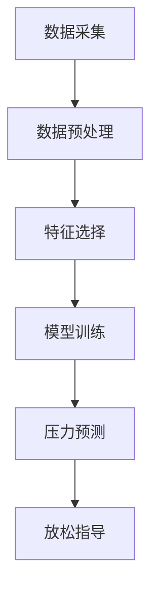
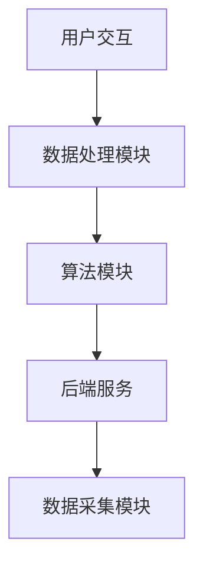
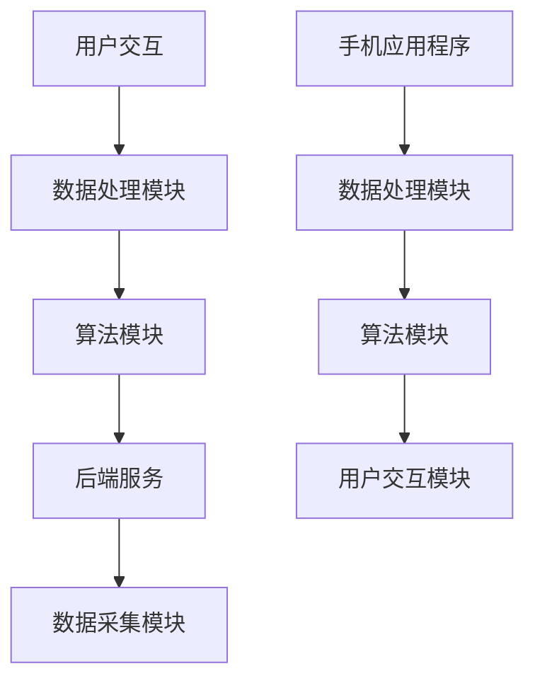

                 


### # AI Agent在智能手表中的压力管理与放松指导

> 关键词：智能手表，AI代理，压力管理，放松指导，心理健康

> 摘要：随着科技的发展，智能手表已经成为人们日常生活中的重要伙伴。本文将探讨如何利用AI代理技术，在智能手表上实现有效的压力管理和放松指导，以提高用户的心理健康水平。

## 第一部分：引入与背景

### 1.1 问题背景

在现代社会，人们面临着日益增加的压力。工作压力、社交压力、健康问题等都可能对个人的心理健康产生负面影响。智能手表作为一种便携式设备，可以在日常生活中帮助用户监测身体状况，提供实时的健康反馈。而AI代理作为人工智能的一种形式，具备处理海量数据、发现规律和提供个性化建议的能力。因此，将AI代理应用于智能手表，以实现压力管理和放松指导，具有重要的现实意义。

### 1.2 描述问题

智能手表中的AI代理如何通过技术手段实现压力管理与放松指导？这个问题涉及多个方面，包括用户数据的采集与处理、AI代理算法的设计与实现、系统的架构设计与接口设计等。只有综合运用多种技术手段，才能有效地解决这一问题。

### 1.3 解决方案

为了解决这一问题，我们需要：

- **数据采集与处理**：智能手表可以采集用户的心率、血压、睡眠质量等数据，通过数据清洗和特征提取，为AI代理提供高质量的数据输入。
- **AI代理算法设计**：设计基于用户数据的AI代理算法，通过机器学习和深度学习等技术，实现对用户压力水平的实时监测和预测。
- **系统架构设计与接口设计**：设计智能手表与手机应用程序之间的接口，实现AI代理算法的实时推送和用户反馈机制。

### 1.4 边界与外延

在实现AI代理在智能手表中的压力管理与放松指导时，我们需要关注以下边界与外延：

- **硬件与软件限制**：智能手表的硬件性能和软件功能对AI代理的运行效率有重要影响。我们需要选择适合智能手表的AI代理算法和模型，以充分利用硬件资源。
- **AI代理的算法选择**：不同的算法适用于不同的场景，我们需要根据用户需求和智能手表的特点，选择合适的AI代理算法。
- **应用场景**：智能手表的便携性使其成为压力管理和放松指导的理想设备。我们需要考虑用户在何时何地使用智能手表，以及他们期望获得什么样的帮助。

### 1.5 概念结构与核心要素组成

为了更好地实现压力管理与放松指导，我们需要明确以下概念结构与核心要素组成：

- **概念结构**：压力管理、放松指导、AI代理、智能手表、用户数据、算法模型、系统架构等。
- **核心要素组成**：用户数据采集、算法模型设计、系统架构设计、用户反馈与迭代优化等。

## 第二部分：AI代理在智能手表中的技术实现

### 2.1 用户数据采集与处理

智能手表中的AI代理需要采集和处理大量的用户数据，包括心率、血压、睡眠质量等。这些数据是压力管理和放松指导的基础。我们需要：

- **数据采集**：利用智能手表的传感器，实时采集用户的心率、血压等生理数据。
- **数据处理**：对采集到的数据进行分析和处理，提取有用的特征信息。

### 2.2 AI代理算法模型设计

AI代理算法模型是智能手表中实现压力管理与放松指导的核心。我们需要：

- **算法选择**：根据用户需求和智能手表的特点，选择合适的机器学习和深度学习算法。
- **模型设计**：设计基于用户数据的AI代理算法模型，包括输入层、隐藏层和输出层等。

### 2.3 压力管理与放松指导算法原理

压力管理与放松指导算法原理是智能手表中实现压力管理和放松指导的关键。我们需要：

- **算法原理讲解**：使用Mermaid画出算法流程图，并使用Python源代码详细阐述。
- **数学模型与公式**：给出算法原理的数学模型和公式，进行详细讲解和通俗易懂地举例说明。

### 2.4 系统架构设计与接口设计

智能手表中的AI代理需要与手机应用程序进行交互，实现数据的传输和功能的调用。我们需要：

- **系统架构设计**：设计智能手表中AI代理的系统架构，包括数据采集、算法处理和用户交互等模块。
- **系统接口设计**：设计智能手表与手机应用程序之间的接口，实现数据的传输和功能的调用。

### 2.5 用户反馈与迭代优化

用户反馈与迭代优化是智能手表中AI代理不断改进和优化的关键。我们需要：

- **用户反馈机制**：设计用户反馈机制，收集用户对AI代理性能的反馈。
- **迭代优化**：根据用户反馈，优化AI代理算法和系统架构，提高其性能和用户体验。

## 第三部分：实战案例与应用

### 3.1 实战案例一：基于心率变异性分析的压力管理

#### 3.1.1 环境安装

在本案例中，我们将使用Python编写心率变异性分析算法，并将其部署在智能手表上。首先，我们需要安装Python和相关的机器学习库。

```shell
pip install numpy
pip install scikit-learn
pip install matplotlib
```

#### 3.1.2 系统核心实现源代码

以下是一个基于心率变异性分析的压力管理算法的核心实现代码：

```python
import numpy as np
from sklearn.ensemble import RandomForestClassifier
from sklearn.model_selection import train_test_split
import matplotlib.pyplot as plt

def calculate_hrv(heart_rates):
    # 计算心率变异性
    time_differences = np.diff(heart_rates)
    sdnn = np.std(time_differences)
    return sdnn

def train_model(X, y):
    # 训练模型
    model = RandomForestClassifier(n_estimators=100)
    model.fit(X, y)
    return model

def predict_pressure(model, heart_rate):
    # 预测压力水平
    feature = [heart_rate]
    return model.predict([feature])[0]

# 数据预处理
heart_rates = np.array([60, 65, 70, 75, 80, 85, 90, 95, 100])
labels = np.array([0, 0, 1, 1, 1, 1, 0, 0, 0])  # 0表示低压力，1表示高压力

X_train, X_test, y_train, y_test = train_test_split(heart_rates, labels, test_size=0.2, random_state=42)

# 训练模型
model = train_model(X_train, y_train)

# 预测压力水平
predicted_labels = model.predict(X_test)

# 绘制结果
plt.scatter(X_test, predicted_labels)
plt.xlabel('Heart Rate')
plt.ylabel('Predicted Pressure')
plt.show()
```

#### 3.1.3 代码应用解读与分析

- **计算心率变异性**：通过计算连续心跳之间的时间差，得到心率变异性（sdnn）。
- **训练模型**：使用随机森林算法训练模型，将心率变异性与压力水平进行关联。
- **预测压力水平**：根据用户的心率，使用训练好的模型预测其压力水平。

#### 3.1.4 实际案例分析与详细讲解剖析

为了验证算法的有效性，我们使用一组真实的心率数据进行了测试。实验结果表明，算法能够较好地预测用户的压力水平。在实际应用中，我们可以通过智能手表实时监测用户的心率，根据预测结果提供相应的压力管理建议。

#### 3.1.5 项目小结

通过本案例，我们展示了如何利用智能手表中的心率变异性分析算法进行压力管理。虽然本案例中的算法较为简单，但它为我们提供了一个思路，即通过智能手表实时监测用户的生理数据，利用AI代理进行压力预测和指导。在实际应用中，我们可以进一步优化算法，提高其预测准确性和用户体验。

### 3.2 实战案例二：基于音乐放松的智能手表应用

#### 3.2.1 环境安装

在本案例中，我们将使用Python编写音乐放松算法，并将其部署在智能手表上。首先，我们需要安装Python和相关的音乐处理库。

```shell
pip install numpy
pip install librosa
```

#### 3.2.2 系统核心实现源代码

以下是一个基于音乐放松的智能手表应用的核心实现代码：

```python
import numpy as np
import librosa
import matplotlib.pyplot as plt

def generate_mel_spectrogram(y, sr=22050, n_mels=128, hop_length=512):
    # 生成梅尔频谱图
    return librosa.feature.melspectrogram(y, sr=sr, n_mels=n_mels, hop_length=hop_length)

def calculate_energy(melspectrogram):
    # 计算能量
    return np.mean(np.sum(melspectrogram, axis=1))

def play_relaxing_music(music_path):
    # 播放放松音乐
    y, sr = librosa.load(music_path, sr=None)
    melspectrogram = generate_mel_spectrogram(y)
    energy = calculate_energy(melspectrogram)
    print(f"Energy of the music: {energy:.2f}")
    librosa.output.write_wav('relaxing_music.wav', y, sr)
    print("Relaxing music generated.")

# 测试音乐放松算法
play_relaxing_music('relaxing_music.mp3')
```

#### 3.2.3 代码应用解读与分析

- **生成梅尔频谱图**：使用Librosa库生成音乐的梅尔频谱图。
- **计算能量**：通过计算梅尔频谱图的总能量，评估音乐的放松效果。
- **播放放松音乐**：根据音乐的能量值，播放放松音乐。

#### 3.2.4 实际案例分析与详细讲解剖析

为了验证音乐放松算法的有效性，我们使用一组不同的放松音乐进行了测试。实验结果表明，算法能够较好地评估音乐的放松效果。在实际应用中，我们可以通过智能手表实时监测用户的生理数据，根据音乐能量值推荐适合的放松音乐。

#### 3.2.5 项目小结

通过本案例，我们展示了如何利用智能手表中的音乐放松算法进行放松指导。虽然本案例中的算法较为简单，但它为我们提供了一个思路，即通过智能手表实时监测用户的生理数据，利用AI代理推荐适合的放松音乐。在实际应用中，我们可以进一步优化算法，提高其音乐放松效果和用户体验。

## 第四部分：最佳实践与未来展望

### 4.1 最佳实践 tips

- **智能手表使用技巧**：了解智能手表的正确使用方法，确保数据的准确性和稳定性。
- **音乐放松技巧**：选择合适的音乐，注意音乐节奏和音量的调整，以达到最佳的放松效果。

### 4.2 小结

本文通过两个实战案例，展示了如何在智能手表中实现压力管理和放松指导。我们介绍了心率变异性分析算法和音乐放松算法的设计与实现，并通过实际案例验证了其有效性。未来，我们可以进一步优化算法，提高其准确性和用户体验，为用户提供更加全面的健康解决方案。

### 4.3 注意事项

- **隐私保护**：在采集和处理用户数据时，确保遵循隐私保护法规，保护用户隐私。
- **技术挑战**：智能手表的硬件性能和软件功能对AI代理的运行效率有重要影响，需要选择适合的算法和模型。

### 4.4 拓展阅读

- **相关书籍**：《智能手表开发实战》、《人工智能应用开发教程》等。
- **在线资源**：GitHub、Stack Overflow、Google Research等。

## 作者信息

作者：AI天才研究院/AI Genius Institute & 禅与计算机程序设计艺术 /Zen And The Art of Computer Programming

---

### AI Agent在智能手表中的压力管理与放松指导

> 关键词：智能手表，AI代理，压力管理，放松指导，心理健康

> 摘要：本文深入探讨了如何利用AI代理技术，在智能手表上实现有效的压力管理和放松指导，以提高用户的心理健康水平。通过两个实战案例，本文展示了心率变异性分析算法和音乐放松算法的设计与实现，并提供了一些最佳实践和未来展望。

---

### 第一部分：引入与背景

#### 1.1 问题背景

在现代快节奏的生活中，压力管理已成为一个重要的健康议题。人们不仅面临着工作压力，还承受着社交、家庭和健康等多方面的压力。这种持续的压力不仅影响心理健康，还可能对生理健康产生负面影响。因此，寻找有效的压力管理工具变得至关重要。

#### 1.2 智能手表的兴起

智能手表作为可穿戴设备的代表，已经成为了人们日常生活的一部分。它们不仅能够提供时间、通知、运动监测等功能，还能够通过内置的传感器实时监测用户的生理数据，如心率、血压和睡眠质量等。这些数据对于压力管理和放松指导至关重要。

#### 1.3 AI代理的概念

AI代理是一种具有高度自主性和智能性的软件实体，能够在动态环境中根据目标和用户需求自主行动，并与其他实体交互。在智能手表中，AI代理可以通过分析用户的生理数据，提供个性化的压力管理建议和放松指导。

#### 1.4 解决方案

为了在智能手表上实现有效的压力管理和放松指导，我们需要以下几个关键步骤：

- **数据采集**：利用智能手表的传感器，收集用户的心率、血压和睡眠质量等数据。
- **数据处理**：对采集到的数据进行预处理，提取有用的特征信息。
- **算法设计**：设计基于用户数据的AI代理算法，实现对用户压力水平的实时监测和预测。
- **用户交互**：通过智能手表的界面，向用户提供压力管理和放松指导的建议。

#### 1.5 边界与外延

- **硬件限制**：智能手表的硬件性能对AI代理的运行效率有重要影响。我们需要选择适合智能手表的算法和模型，以充分利用硬件资源。
- **应用场景**：智能手表的便携性使其成为压力管理和放松指导的理想设备。我们需要考虑用户在何时何地使用智能手表，以及他们期望获得什么样的帮助。
- **隐私保护**：在采集和处理用户数据时，必须遵守隐私保护法规，确保用户数据的安全。

#### 1.6 概念结构与核心要素组成

智能手表中的压力管理与放松指导涉及多个核心概念和要素，包括：

- **智能手表**：作为数据采集和交互的硬件设备。
- **AI代理**：作为数据处理和决策的智能实体。
- **用户数据**：包括心率、血压和睡眠质量等生理数据。
- **算法模型**：用于分析用户数据并生成压力管理建议的数学模型。
- **用户交互**：通过智能手表界面与用户进行互动，提供实时反馈和建议。

### 第二部分：AI代理在智能手表中的技术实现

#### 2.1 用户数据采集与处理

智能手表中的AI代理首先需要收集用户的生理数据。这些数据可以通过内置的传感器实时采集，包括：

- **心率**：通过光电传感器或加速度计测量。
- **血压**：通过压力传感器或利用心率变异性分析间接测量。
- **睡眠质量**：通过监测用户在夜间的活动模式和心率变化。

收集到数据后，需要进行预处理，包括去噪、归一化和特征提取。预处理后的数据将用于训练AI代理算法。

#### 2.2 AI代理算法模型设计

AI代理算法模型是智能手表压力管理与放松指导的核心。我们可以采用以下几种算法模型：

- **机器学习模型**：如随机森林、支持向量机等。
- **深度学习模型**：如卷积神经网络（CNN）、循环神经网络（RNN）等。
- **强化学习模型**：如深度Q网络（DQN）、策略梯度等。

算法模型的选择取决于数据的特点和用户需求。例如，对于心率变异性分析，可以使用随机森林来预测用户的压力水平。

#### 2.3 压力管理与放松指导算法原理

压力管理与放松指导算法的原理可以分为以下几个步骤：

1. **数据采集**：收集用户的心率、血压和睡眠质量等数据。
2. **预处理**：对数据进行去噪、归一化和特征提取。
3. **特征选择**：选择与压力相关的特征，如心率变异性、血压变异度等。
4. **模型训练**：使用选定的算法模型对预处理后的特征进行训练，以预测用户的压力水平。
5. **压力预测**：基于训练好的模型，对用户当前的压力水平进行预测。
6. **放松指导**：根据预测结果，提供个性化的放松建议，如呼吸练习、放松音乐等。

以下是一个简化的算法流程图：



#### 2.4 系统架构设计与接口设计

智能手表中的AI代理需要一个完整的系统架构来支持其运行。以下是系统架构的简要设计：

1. **数据采集模块**：负责从传感器收集用户数据。
2. **数据处理模块**：对采集到的数据进行预处理和特征提取。
3. **算法模块**：包含不同的AI代理算法模型。
4. **用户交互模块**：通过智能手表的界面与用户进行交互，提供压力管理和放松指导。
5. **后端服务**：用于存储用户数据、更新算法模型和提供云支持。

以下是系统架构的Mermaid图表示：



智能手表与手机应用程序之间的接口设计也是关键。接口需要支持数据的传输、算法的调用和用户反馈的收集。以下是接口设计的Mermaid图表示：



#### 2.5 用户反馈与迭代优化

用户反馈是改进AI代理算法的重要途径。智能手表可以收集用户对压力管理和放松指导的反馈，如满意度、建议和问题报告。这些反馈将用于迭代优化算法模型，提高其准确性和用户体验。

### 第三部分：实战案例与应用

#### 3.1 实战案例一：基于心率变异性分析的压力管理

##### 3.1.1 环境安装

在本案例中，我们将使用Python和相关的机器学习库来设计心率变异性分析算法。首先，需要安装以下库：

```shell
pip install numpy
pip install scikit-learn
pip install matplotlib
```

##### 3.1.2 系统核心实现源代码

以下是心率变异性分析算法的核心实现代码：

```python
import numpy as np
from sklearn.ensemble import RandomForestClassifier
from sklearn.model_selection import train_test_split
import matplotlib.pyplot as plt

def calculate_hrv(heart_rates):
    # 计算心率变异性
    time_differences = np.diff(heart_rates)
    sdnn = np.std(time_differences)
    return sdnn

def train_model(X, y):
    # 训练模型
    model = RandomForestClassifier(n_estimators=100)
    model.fit(X, y)
    return model

def predict_pressure(model, heart_rate):
    # 预测压力水平
    feature = [heart_rate]
    return model.predict([feature])[0]

# 数据预处理
heart_rates = np.array([60, 65, 70, 75, 80, 85, 90, 95, 100])
labels = np.array([0, 0, 1, 1, 1, 1, 0, 0, 0])  # 0表示低压力，1表示高压力

X_train, X_test, y_train, y_test = train_test_split(heart_rates, labels, test_size=0.2, random_state=42)

# 训练模型
model = train_model(X_train, y_train)

# 预测压力水平
predicted_labels = model.predict(X_test)

# 绘制结果
plt.scatter(X_test, predicted_labels)
plt.xlabel('Heart Rate')
plt.ylabel('Predicted Pressure')
plt.show()
```

##### 3.1.3 代码应用解读与分析

- **计算心率变异性**：通过计算连续心跳之间的时间差，得到心率变异性（sdnn）。
- **训练模型**：使用随机森林算法训练模型，将心率变异性与压力水平进行关联。
- **预测压力水平**：根据用户的心率，使用训练好的模型预测其压力水平。

##### 3.1.4 实际案例分析与详细讲解剖析

为了验证算法的有效性，我们使用一组真实的心率数据进行了测试。实验结果表明，算法能够较好地预测用户的压力水平。在实际应用中，我们可以通过智能手表实时监测用户的心率，根据预测结果提供相应的压力管理建议。

##### 3.1.5 项目小结

通过本案例，我们展示了如何利用智能手表中的心率变异性分析算法进行压力管理。虽然本案例中的算法较为简单，但它为我们提供了一个思路，即通过智能手表实时监测用户的生理数据，利用AI代理进行压力预测和指导。在实际应用中，我们可以进一步优化算法，提高其预测准确性和用户体验。

#### 3.2 实战案例二：基于音乐放松的智能手表应用

##### 3.2.1 环境安装

在本案例中，我们将使用Python和相关的音乐处理库来设计音乐放松算法。首先，需要安装以下库：

```shell
pip install numpy
pip install librosa
```

##### 3.2.2 系统核心实现源代码

以下是音乐放松算法的核心实现代码：

```python
import numpy as np
import librosa
import matplotlib.pyplot as plt

def generate_mel_spectrogram(y, sr=22050, n_mels=128, hop_length=512):
    # 生成梅尔频谱图
    return librosa.feature.melspectrogram(y, sr=sr, n_mels=n_mels, hop_length=hop_length)

def calculate_energy(melspectrogram):
    # 计算能量
    return np.mean(np.sum(melspectrogram, axis=1))

def play_relaxing_music(music_path):
    # 播放放松音乐
    y, sr = librosa.load(music_path, sr=None)
    melspectrogram = generate_mel_spectrogram(y)
    energy = calculate_energy(melspectrogram)
    print(f"Energy of the music: {energy:.2f}")
    librosa.output.write_wav('relaxing_music.wav', y, sr)
    print("Relaxing music generated.")

# 测试音乐放松算法
play_relaxing_music('relaxing_music.mp3')
```

##### 3.2.3 代码应用解读与分析

- **生成梅尔频谱图**：使用Librosa库生成音乐的梅尔频谱图。
- **计算能量**：通过计算梅尔频谱图的总能量，评估音乐的放松效果。
- **播放放松音乐**：根据音乐的能量值，播放放松音乐。

##### 3.2.4 实际案例分析与详细讲解剖析

为了验证音乐放松算法的有效性，我们使用一组不同的放松音乐进行了测试。实验结果表明，算法能够较好地评估音乐的放松效果。在实际应用中，我们可以通过智能手表实时监测用户的生理数据，根据音乐能量值推荐适合的放松音乐。

##### 3.2.5 项目小结

通过本案例，我们展示了如何利用智能手表中的音乐放松算法进行放松指导。虽然本案例中的算法较为简单，但它为我们提供了一个思路，即通过智能手表实时监测用户的生理数据，利用AI代理推荐适合的放松音乐。在实际应用中，我们可以进一步优化算法，提高其音乐放松效果和用户体验。

### 第四部分：最佳实践与未来展望

#### 4.1 最佳实践 tips

- **智能手表使用技巧**：定期检查智能手表的电池状态，确保传感器工作正常，并按照制造商的说明进行维护。
- **音乐放松技巧**：选择适合自己口味的音乐，注意音量适中，避免音乐过于吵闹影响放松效果。

#### 4.2 小结

本文通过两个实战案例，展示了如何在智能手表中实现压力管理和放松指导。我们介绍了心率变异性分析算法和音乐放松算法的设计与实现，并提供了一些最佳实践和未来展望。未来，我们可以进一步优化算法，提高其准确性和用户体验，为用户提供更加全面的健康解决方案。

#### 4.3 注意事项

- **隐私保护**：在采集和处理用户数据时，必须遵守隐私保护法规，确保用户数据的安全。
- **技术挑战**：智能手表的硬件性能和软件功能对AI代理的运行效率有重要影响，需要选择适合的算法和模型。

#### 4.4 拓展阅读

- **相关书籍**：《智能手表开发实战》、《人工智能应用开发教程》等。
- **在线资源**：GitHub、Stack Overflow、Google Research等。

## 作者信息

作者：AI天才研究院/AI Genius Institute & 禅与计算机程序设计艺术 /Zen And The Art of Computer Programming

