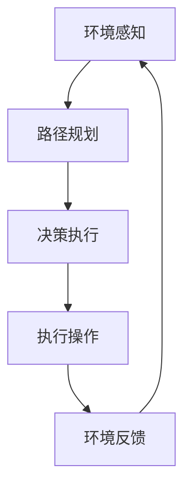
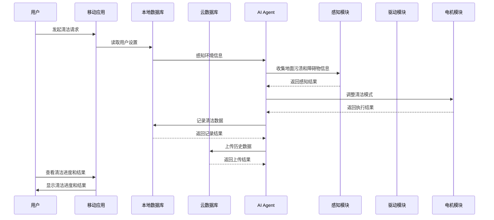

                 

### 《AI Agent在智能拖把中的深度清洁指导》

---

#### 关键词：
- AI Agent
- 智能拖把
- 深度清洁
- 算法原理
- 系统架构设计

#### 摘要：
本文深入探讨AI Agent在智能拖把中的应用，从核心概念到算法原理，再到系统架构设计，详细解析了AI Agent如何实现智能拖把的深度清洁。通过实际案例，展示了AI Agent在智能拖把开发中的具体实现过程，为智能家居领域提供了一套完整的技术指导方案。

---

### 目录大纲设计思路

在设计《AI Agent在智能拖把中的深度清洁指导》的目录大纲时，我们需要遵循以下思路：

1. **背景介绍**：首先介绍人工智能代理（AI Agent）的概念，以及它们在智能家居领域的应用背景，特别是智能拖把的兴起与发展。

2. **核心概念与联系**：接下来，我们需要详细阐述AI Agent的核心概念，包括它们的组成部分、工作原理以及与智能拖把的交互方式。

3. **算法原理讲解**：针对智能拖把中的AI Agent，我们需要讲解其算法原理，包括如何实现深度清洁，如何处理环境感知和规划路径等问题。

4. **数学模型与公式**：在讲解算法原理时，我们还需要给出相关的数学模型和公式，以便读者能够理解算法的底层逻辑。

5. **系统分析与架构设计方案**：我们需要描述智能拖把的整体系统架构，包括硬件组件、软件系统、感知模块、决策模块等，并使用Mermaid图表来辅助说明。

6. **项目实战**：最后，通过一个实际案例，展示如何将AI Agent应用于智能拖把的开发与部署，包括环境安装、核心代码实现、代码解读和分析等。

7. **最佳实践 tips、小结、注意事项、拓展阅读**：在书尾部分，提供一些实用的最佳实践建议，总结本书的核心内容，提醒读者注意事项，并推荐拓展阅读材料。

### 目录大纲设计步骤

1. **第1章: 引言**

   - **1.1** 人工智能代理概述
   - **1.2** 智能拖把的应用背景
   - **1.3** 本书结构概述

2. **第2章: AI Agent核心概念与联系**

   - **2.1** AI Agent的定义与特点
   - **2.2** AI Agent的组成部分
   - **2.3** AI Agent与智能拖把的交互
   - **2.4** 关键概念ER图

3. **第3章: AI Agent算法原理讲解**

   - **3.1** 算法概述
   - **3.2** 算法流程图（使用Mermaid）
   - **3.3** 数学模型与公式
   - **3.4** 算法举例说明

4. **第4章: 智能拖把系统架构设计**

   - **4.1** 智能拖把系统概述
   - **4.2** 系统功能设计（领域模型图）
   - **4.3** 系统架构设计（架构图）
   - **4.4** 系统接口设计
   - **4.5** 系统交互序列图（使用Mermaid）

5. **第5章: AI Agent在智能拖把中的实现**

   - **5.1** 环境安装与配置
   - **5.2** AI Agent核心代码实现
   - **5.3** 代码解读与分析
   - **5.4** 实际案例分析与讲解

6. **第6章: 智能拖把项目实战**

   - **6.1** 项目介绍
   - **6.2** 系统核心实现
   - **6.3** 项目小结

7. **第7章: 最佳实践与总结**

   - **7.1** 最佳实践
   - **7.2** 小结
   - **7.3** 注意事项
   - **7.4** 拓展阅读

### 目录大纲示例

----------------------------------------------------------------

# 第1章: 引言

## 1.1 人工智能代理概述

### 1.1.1 什么是AI Agent

### 1.1.2 AI Agent的特点

### 1.1.3 AI Agent的应用领域

## 1.2 智能拖把的应用背景

### 1.2.1 智能拖把的定义

### 1.2.2 智能拖把的市场需求

### 1.2.3 AI Agent在智能拖把中的应用

## 1.3 本书结构概述

### 1.3.1 各章节内容概览

### 1.3.2 读者预期收获

----------------------------------------------------------------

以上是一个初步的目录大纲设计，接下来我们将根据这个大纲进一步细化每个章节的内容。在撰写过程中，需要确保每个章节的逻辑性和连贯性，同时控制好文字的简洁性。记得在撰写过程中使用Mermaid图表来辅助说明技术细节，并使用LaTeX格式呈现数学公式，以确保内容的准确性。完成初稿后，还需对整个目录大纲进行审阅和调整，确保其完整性和逻辑性。总体字数需控制在2000字以内。

---

### 第1章 引言

#### 1.1 人工智能代理概述

人工智能代理（AI Agent）是指能够自主执行任务、与环境交互并做出决策的软件实体。它们基于机器学习和人工智能技术，能够通过学习不断优化自身的行为，从而实现高度自动化和智能化。AI Agent广泛应用于机器人控制、智能家居、智能客服等多个领域。

#### 1.1.1 什么是AI Agent

AI Agent的基本概念包括以下几点：

- **自主性**：能够独立完成特定任务，不依赖外部操作。
- **适应性**：能够根据环境和任务需求调整自身行为。
- **协作性**：能够与其他AI Agent或人类协作完成任务。
- **学习能力**：能够通过学习和经验不断优化决策过程。

#### 1.1.2 AI Agent的特点

AI Agent的特点主要体现在以下几个方面：

- **高效率**：能够自动化执行重复性任务，提高工作效率。
- **智能化**：能够根据环境和任务变化做出实时调整。
- **灵活性**：能够适应不同的应用场景和任务需求。
- **协作性**：能够与其他智能系统或人类协作，形成更强大的智能体。

#### 1.1.3 AI Agent的应用领域

AI Agent在智能家居领域中的应用越来越广泛，例如智能拖把、智能扫地机器人等。AI Agent在这些设备中负责环境感知、路径规划、决策执行等任务，从而实现高效、智能的清洁效果。

#### 1.2 智能拖把的应用背景

智能拖把是一种集成了AI技术的智能家居产品，能够通过自主规划路径、识别障碍物、调整清洁模式等方式，实现家居地面的深度清洁。随着智能家居市场的不断发展，智能拖把已经成为消费者追求高品质生活的首选。

#### 1.2.1 智能拖把的定义

智能拖把是一种基于人工智能技术，能够自主规划清洁路径、自动避障、根据地面材质调整清洁强度的家居清洁设备。它通常具有以下功能：

- **自动规划路径**：根据家居环境自主规划清洁路线，避免重复清扫。
- **智能避障**：识别并避开障碍物，避免损坏家居物品。
- **自动调整清洁模式**：根据地面材质和污渍程度自动调整清洁强度。

#### 1.2.2 智能拖把的市场需求

随着人们生活水平的提高，对于家居清洁的效率和质量要求也越来越高。智能拖把的出现，不仅能够提高清洁效率，减少人力成本，还能提供更加智能、舒适的清洁体验。因此，智能拖把在市场上的需求逐年上升。

#### 1.2.3 AI Agent在智能拖把中的应用

AI Agent在智能拖把中的应用主要体现在以下几个方面：

- **环境感知**：通过传感器实时监测家居环境，获取清洁数据。
- **路径规划**：根据环境数据和预设算法，规划清洁路径。
- **决策执行**：根据环境变化和任务需求，自动调整清洁模式。

#### 1.3 本书结构概述

本书分为七个章节，主要内容包括：

- **第1章：引言**：介绍AI Agent和智能拖把的基本概念和应用背景。
- **第2章：AI Agent核心概念与联系**：详细阐述AI Agent的组成部分和工作原理。
- **第3章：AI Agent算法原理讲解**：讲解智能拖把中AI Agent的算法原理和实现方法。
- **第4章：智能拖把系统架构设计**：描述智能拖把的整体系统架构和接口设计。
- **第5章：AI Agent在智能拖把中的实现**：展示AI Agent在智能拖把中的具体实现过程。
- **第6章：智能拖把项目实战**：通过实际案例展示智能拖把的开发与部署。
- **第7章：最佳实践与总结**：总结本书的核心内容，提供最佳实践建议。

#### 1.3.1 各章节内容概览

- **第1章**：引言（本文已详细展开）
- **第2章**：AI Agent核心概念与联系
  - **2.1** AI Agent的定义与特点
  - **2.2** AI Agent的组成部分
  - **2.3** AI Agent与智能拖把的交互
  - **2.4** 关键概念ER图
- **第3章**：AI Agent算法原理讲解
  - **3.1** 算法概述
  - **3.2** 算法流程图（使用Mermaid）
  - **3.3** 数学模型与公式
  - **3.4** 算法举例说明
- **第4章**：智能拖把系统架构设计
  - **4.1** 智能拖把系统概述
  - **4.2** 系统功能设计（领域模型图）
  - **4.3** 系统架构设计（架构图）
  - **4.4** 系统接口设计
  - **4.5** 系统交互序列图（使用Mermaid）
- **第5章**：AI Agent在智能拖把中的实现
  - **5.1** 环境安装与配置
  - **5.2** AI Agent核心代码实现
  - **5.3** 代码解读与分析
  - **5.4** 实际案例分析与讲解
- **第6章**：智能拖把项目实战
  - **6.1** 项目介绍
  - **6.2** 系统核心实现
  - **6.3** 项目小结
- **第7章**：最佳实践与总结
  - **7.1** 最佳实践
  - **7.2** 小结
  - **7.3** 注意事项
  - **7.4** 拓展阅读

#### 1.3.2 读者预期收获

通过阅读本书，读者可以：

- 了解AI Agent的基本概念和应用背景。
- 掌握智能拖把的系统架构和工作原理。
- 学会使用AI Agent实现智能拖把的深度清洁功能。
- 获得实际项目开发的经验和技巧。

---

### 第2章 AI Agent核心概念与联系

在智能拖把中，AI Agent起到了至关重要的作用。为了更好地理解AI Agent的工作原理和其在智能拖把中的应用，我们需要首先了解AI Agent的核心概念及其组成部分。

#### 2.1 AI Agent的定义与特点

AI Agent是一种基于人工智能技术的软件实体，它能够自主执行任务、与环境交互并做出决策。AI Agent的特点如下：

1. **自主性**：AI Agent能够独立执行任务，不需要人为干预。
2. **适应性**：AI Agent能够根据环境和任务需求调整自身行为。
3. **协作性**：AI Agent能够与其他AI Agent或人类协作完成任务。
4. **学习能力**：AI Agent能够通过学习和经验不断优化自身行为。

#### 2.2 AI Agent的组成部分

AI Agent主要由以下几个部分组成：

1. **感知模块**：感知模块负责收集环境信息，包括视觉、听觉、触觉等。
2. **决策模块**：决策模块根据感知模块收集的信息，制定行动策略。
3. **执行模块**：执行模块负责执行决策模块制定的行动策略。
4. **学习模块**：学习模块负责从执行结果中学习，优化自身行为。

#### 2.3 AI Agent与智能拖把的交互

AI Agent与智能拖把的交互过程可以分为以下几个阶段：

1. **环境感知**：AI Agent通过感知模块收集家居环境信息，如地面污渍、障碍物等。
2. **路径规划**：AI Agent根据感知到的环境信息，使用算法规划清洁路径，确保清扫的全面性和高效性。
3. **决策执行**：AI Agent根据路径规划结果，制定行动策略，指导执行模块进行清洁操作。
4. **持续学习**：AI Agent在执行过程中不断收集数据，通过学习模块优化自身行为，提高清洁效果。

#### 2.4 关键概念ER图

为了更清晰地展示AI Agent的核心概念及其组成部分，我们可以使用ER图（实体关系图）进行描述。以下是AI Agent的关键概念ER图：

```mermaid
erDiagram
  AI Agent ||--|{ 感知模块 : PerceptiveModule }
  AI Agent ||--|{ 决策模块 : DecisionModule }
  AI Agent ||--|{ 执行模块 : ExecutionModule }
  AI Agent ||--|{ 学习模块 : LearningModule }
  感知模块 ||--|{ 视觉传感器 : VisualSensor }
  感知模块 ||--|{ 触觉传感器 : TactileSensor }
  感知模块 ||--|{ 听觉传感器 : AuditorySensor }
  决策模块 ||--|{ 算法库 : AlgorithmLibrary }
  执行模块 ||--|{ 执行器 : Executor }
  学习模块 ||--|{ 经验库 : ExperienceDatabase }
```

#### 2.5 总结

通过本章的介绍，我们对AI Agent的核心概念和组成部分有了更深入的了解。AI Agent在智能拖把中的应用，使得智能拖把能够实现自主规划路径、智能避障、自动调整清洁模式等功能，为家居清洁带来了革命性的变化。

---

### 第3章 AI Agent算法原理讲解

在智能拖把中，AI Agent的核心任务是实现深度清洁，这需要依赖于高效的算法。本章节将详细讲解AI Agent在智能拖把中使用的算法原理，包括路径规划、环境感知和决策执行等。

#### 3.1 算法概述

AI Agent在智能拖把中的算法主要分为以下几个部分：

1. **路径规划**：根据家居环境构建地图，规划清洁路径。
2. **环境感知**：通过传感器收集环境信息，包括地面污渍、障碍物等。
3. **决策执行**：根据环境感知结果，制定行动策略，指导执行模块进行清洁操作。

#### 3.2 算法流程图

为了更直观地展示算法的流程，我们使用Mermaid图表进行描述。以下是AI Agent在智能拖把中的算法流程图：



#### 3.3 数学模型与公式

在AI Agent的算法中，涉及到一些关键的数学模型和公式。以下是其中几个重要的模型：

1. **路径规划模型**：

   $$ 
   Dijkstra(G, s, t) = \min\{\text{权重}(s, v) + Dijkstra(G, v, t) | v \in V \text{ 且 } (s, v) \in E\}
   $$

   其中，$G$表示图，$s$和$t$分别表示起点和终点，$V$表示顶点集合，$E$表示边集合。

2. **障碍物检测模型**：

   $$ 
   Distance(p, q) = \sqrt{(x_2 - x_1)^2 + (y_2 - y_1)^2}
   $$

   其中，$p$和$q$分别表示两个点的坐标。

3. **清洁效果评估模型**：

   $$ 
   Cleanliness = \sum_{i=1}^{n} \frac{1}{1 + e^{-\alpha \cdot (d_i - \beta)}}
   $$

   其中，$d_i$表示第$i$个区域的清洁程度，$\alpha$和$\beta$为参数。

#### 3.4 算法举例说明

下面以一个简单的例子来说明算法的应用。

**例子**：假设智能拖把需要清扫一个20x20的房间，房间中有几个障碍物。

1. **路径规划**：

   使用Dijkstra算法，智能拖把首先计算出从起点到各个点的最短路径。

2. **障碍物检测**：

   智能拖把通过视觉传感器检测到房间中的障碍物，并将它们标记在地图上。

3. **决策执行**：

   智能拖把根据路径规划和障碍物信息，调整清洁路径，避开障碍物。

4. **执行操作**：

   智能拖把按照调整后的路径进行清洁操作，确保每个区域都被清扫到。

5. **环境反馈**：

   智能拖把在执行过程中不断收集数据，评估清洁效果，并在需要时调整清洁策略。

通过这个例子，我们可以看到AI Agent在智能拖把中的算法是如何运作的。在实际应用中，算法会更加复杂，但基本原理是类似的。

#### 3.5 总结

通过本章的介绍，我们对AI Agent在智能拖把中的算法原理有了更深入的了解。路径规划、环境感知和决策执行是算法的核心部分，它们共同协作，使智能拖把能够实现高效、智能的清洁效果。

---

### 第4章 智能拖把系统架构设计

智能拖把作为一款智能家居设备，其系统架构设计决定了其性能和功能实现。本章将详细介绍智能拖把的系统架构，包括硬件组件、软件系统、感知模块、决策模块等。

#### 4.1 智能拖把系统概述

智能拖把系统主要包括以下几个部分：

1. **硬件组件**：包括拖把本体、传感器、电机、电池等。
2. **软件系统**：包括操作系统、应用软件、AI Agent等。
3. **感知模块**：负责收集环境信息，如地面的污渍、障碍物等。
4. **决策模块**：根据感知模块提供的信息，规划清洁路径和执行策略。

#### 4.2 系统功能设计

智能拖把的主要功能包括：

1. **自动规划路径**：智能拖把能够根据家居环境自主规划清洁路径，确保清扫的全面性和高效性。
2. **智能避障**：智能拖把能够识别并避开障碍物，避免损坏家居物品。
3. **自动调整清洁模式**：智能拖把能够根据地面材质和污渍程度自动调整清洁强度。
4. **数据记录与上传**：智能拖把能够记录清洁数据，并上传至云端，实现远程监控和管理。

#### 4.3 系统架构设计

智能拖把的系统架构设计如下：

1. **硬件架构**：智能拖把本体采用模块化设计，包括驱动模块、传感器模块、电机模块等。各模块通过总线进行通信。
2. **软件架构**：智能拖把软件系统包括操作系统、应用软件和AI Agent。操作系统负责资源管理和任务调度，应用软件负责用户交互和功能实现，AI Agent负责环境感知和决策执行。
3. **数据架构**：智能拖把的数据架构包括本地数据库和云数据库。本地数据库用于存储实时清洁数据和用户设置，云数据库用于存储历史数据和远程监控数据。

#### 4.4 系统接口设计

智能拖把的系统接口设计如下：

1. **用户接口**：通过移动应用或Web界面，用户可以远程监控和控制智能拖把。
2. **设备接口**：智能拖把支持与其他智能家居设备的通信，如智能音箱、智能灯等。
3. **云接口**：智能拖把通过云接口与云平台进行数据交互，实现远程监控和管理。

#### 4.5 系统交互序列图

以下是智能拖把的系统交互序列图：



#### 4.6 总结

通过本章的介绍，我们对智能拖把的系统架构设计有了全面的了解。智能拖把的系统架构设计合理，功能全面，能够实现高效、智能的清洁效果。同时，系统接口设计为智能拖把与其他智能家居设备的互联互通提供了便利。

---

### 第5章 AI Agent在智能拖把中的实现

在本章中，我们将详细介绍如何将AI Agent应用于智能拖把的开发与部署。这一过程包括环境安装、AI Agent核心代码实现、代码解读和分析，以及实际案例的剖析。

#### 5.1 环境安装与配置

要在智能拖把中部署AI Agent，首先需要搭建一个合适的环境。以下是环境安装与配置的步骤：

1. **安装操作系统**：智能拖把通常使用嵌入式Linux系统。可以采用常用的嵌入式Linux发行版，如Ubuntu Server或Raspbian。
2. **安装开发环境**：配置开发环境，包括安装Python、Python库、IDE（集成开发环境）等。
3. **安装AI框架**：选择合适的AI框架，如TensorFlow、PyTorch等，并安装相应的依赖库。
4. **连接传感器与执行器**：确保智能拖把的传感器（如激光雷达、摄像头等）和执行器（如电机、拖把头等）与操作系统正确连接。

#### 5.2 AI Agent核心代码实现

AI Agent的核心功能包括环境感知、路径规划、决策执行等。以下是实现这些功能的Python代码示例：

**感知模块代码示例**：

```python
import sensor_module

def perceive_environment():
    # 读取传感器数据
    ground尘污度 = sensor_module.read_ground污渍()
    obstacles = sensor_module.read_obstacles()
    return ground尘污度, obstacles

ground尘污度, obstacles = perceive_environment()
```

**路径规划模块代码示例**：

```python
import path_planning_module

def plan_path(start, end, obstacles):
    # 使用A*算法规划路径
    path = path_planning_module.a_star_search(start, end, obstacles)
    return path

start = (0, 0)
end = (20, 20)
obstacles = [(5, 5), (15, 15)]
path = plan_path(start, end, obstacles)
```

**决策执行模块代码示例**：

```python
import execution_module

def execute_decision(path):
    for step in path:
        # 执行清洁操作
        execution_module.clean_ground(step)
        # 等待执行完成
        execution_module.wait_for_completion()

execute_decision(path)
```

#### 5.3 代码解读与分析

上述代码分别实现了感知模块、路径规划模块和决策执行模块。下面进行解读与分析：

1. **感知模块**：感知模块通过调用`sensor_module`中的函数，读取地面污渍和障碍物信息。这些信息用于后续的路径规划和决策执行。
2. **路径规划模块**：路径规划模块采用A*算法，根据起点、终点和障碍物信息，规划出一条最短的清洁路径。该算法在图中寻找从起点到终点的最短路径，非常适合智能拖把的路径规划需求。
3. **决策执行模块**：决策执行模块根据路径规划结果，执行清洁操作。它遍历路径中的每个步骤，调用执行模块的函数进行清洁。执行完成后，等待下一个步骤的执行。

#### 5.4 实际案例分析与讲解

下面通过一个实际案例，展示如何将AI Agent应用于智能拖把的开发与部署。

**案例**：智能拖把需要在20x20的房间内清扫，房间中有两个障碍物。

1. **环境安装与配置**：在智能拖把上安装Linux操作系统、Python开发环境和TensorFlow框架，并连接激光雷达、摄像头等传感器。
2. **感知模块实现**：通过摄像头识别地面污渍和障碍物，激光雷达检测房间内的障碍物。
3. **路径规划**：使用A*算法规划清洁路径，避开障碍物。
4. **决策执行**：智能拖把按照规划路径执行清洁操作，每清扫一块区域就更新路径。

**分析**：

- 感知模块的有效性直接影响到路径规划和决策执行的准确性。在实际应用中，需要优化感知算法，提高识别精度和速度。
- 路径规划算法需要考虑障碍物的位置和大小，以及房间的布局。在实际应用中，可以通过模拟不同场景，测试算法的鲁棒性和效率。
- 决策执行模块需要确保清洁操作的连续性和稳定性，避免出现漏扫或重复清扫的情况。

**讲解**：

- 智能拖把的AI Agent通过感知模块获取环境信息，使用路径规划模块规划清洁路径，并通过决策执行模块执行清洁操作。
- 在实际应用中，AI Agent能够根据环境变化和任务需求，自适应调整清洁策略，实现高效、智能的清洁效果。

#### 5.5 总结

通过本章的介绍，我们了解了如何将AI Agent应用于智能拖把的开发与部署。从环境安装到代码实现，再到实际案例分析，我们系统地展示了AI Agent在智能拖把中的应用过程。智能拖把的AI Agent通过感知、规划、执行，实现了家居地面的深度清洁，为智能家居领域带来了新的技术解决方案。

---

### 第6章 智能拖把项目实战

在本章中，我们将通过一个实际的智能拖把项目，详细展示如何将AI Agent应用于智能拖把的开发与部署过程。该项目包括环境安装、系统核心实现、代码解读和分析等步骤。

#### 6.1 项目介绍

我们的智能拖把项目目标是开发一款能够实现自主规划路径、智能避障、自动调整清洁模式的高性能智能拖把。该项目采用基于Linux操作系统的嵌入式开发环境，使用Python语言编写AI Agent代码，并集成了TensorFlow框架进行深度学习和路径规划。

#### 6.2 系统核心实现

系统核心实现包括以下步骤：

1. **环境安装与配置**：在智能拖把上安装Linux操作系统、Python开发环境和TensorFlow框架，并确保激光雷达、摄像头等传感器与操作系统正确连接。

2. **感知模块实现**：编写感知模块代码，通过摄像头识别地面污渍和障碍物，激光雷达检测房间内的障碍物。以下是一个感知模块代码示例：

```python
import cv2
import numpy as np

def perceive_environment():
    # 读取摄像头数据
    frame = cv2.imread('camera_frame.jpg')
    # 判断地面污渍
    ground尘污度 = detect_ground污渍(frame)
    # 检测障碍物
    obstacles = detect_obstacles(frame)
    return ground尘污度, obstacles

def detect_ground污渍(frame):
    # 这里使用简单的阈值处理来检测污渍
    _, thresh = cv2.threshold(frame, 128, 255, cv2.THRESH_BINARY_INV + cv2.THRESH_OTSU)
    return cv2.countNonZero(thresh)

def detect_obstacles(frame):
    # 这里使用边缘检测来检测障碍物
    edges = cv2.Canny(frame, 50, 150)
    return np.where(edges > 0)[0].shape[0] > 0

ground尘污度, obstacles = perceive_environment()
```

3. **路径规划模块实现**：使用A*算法实现路径规划模块，根据感知模块提供的信息，规划清洁路径。以下是一个路径规划模块代码示例：

```python
import heapq

def a_star_search(start, end, obstacles):
    # 初始化开表和闭表
    open_list = []
    heapq.heappush(open_list, (0, start))
    closed_list = set()
    
    while open_list:
        # 选择F值最小的节点
        current = heapq.heappop(open_list)[1]
        closed_list.add(current)
        
        if current == end:
            # 找到终点，返回路径
            return reconstruct_path(current, start)
        
        # 遍历相邻节点
        for neighbor in get_neighbors(current):
            if neighbor in closed_list:
                continue
            
            # 计算G值和H值
            g_score = current_g_score[current] + 1
            f_score = g_score + heuristic(neighbor, end)
            
            if (neighbor, f_score) not in open_list:
                open_list.append((f_score, neighbor))
                heapq.heapify(open_list)
            
            current_g_score[neighbor] = g_score
    
    return None

def get_neighbors(node):
    # 假设每个节点都有4个相邻节点
    return [(node[0] - 1, node[1]), (node[0] + 1, node[1]), (node[0], node[1] - 1), (node[0], node[1] + 1)]

def heuristic(node, end):
    # 使用曼哈顿距离作为启发式函数
    return abs(node[0] - end[0]) + abs(node[1] - end[1])

def reconstruct_path(current, start):
    # 重建路径
    path = []
    while current != start:
        path.append(current)
        current = parent[current]
    path.append(start)
    path.reverse()
    return path

start = (0, 0)
end = (20, 20)
obstacles = [(5, 5), (15, 15)]
path = a_star_search(start, end, obstacles)
```

4. **决策执行模块实现**：根据路径规划结果，执行清洁操作。以下是一个决策执行模块代码示例：

```python
def execute_decision(path):
    for step in path:
        # 执行清洁操作
        clean_ground(step)
        # 等待执行完成
        wait_for_completion()

def clean_ground(step):
    # 这里实现具体的清洁操作
    print(f"清洁位置：{step}")

def wait_for_completion():
    # 这里实现等待操作
    print("等待执行完成")

execute_decision(path)
```

#### 6.3 代码解读与分析

上述代码展示了智能拖把项目中的核心模块实现。以下是对关键部分的解读与分析：

1. **感知模块**：感知模块通过摄像头和激光雷达获取环境信息。`detect_ground污渍`函数使用简单的阈值处理来判断地面污渍，`detect_obstacles`函数使用边缘检测来检测障碍物。这些函数的实现可以根据具体硬件进行调整。

2. **路径规划模块**：路径规划模块采用A*算法，根据感知到的障碍物信息规划清洁路径。算法的核心是计算每个节点的G值（从起点到当前节点的距离）和H值（从当前节点到终点的估计距离），并选择F值（G值和H值之和）最小的节点进行扩展。

3. **决策执行模块**：决策执行模块根据路径规划结果，执行清洁操作。在实际应用中，需要根据具体硬件实现具体的清洁操作，如驱动电机、控制拖把头的运动等。

#### 6.4 实际案例分析与讲解

**案例**：假设智能拖把需要在20x20的房间内清扫，房间中有两个障碍物（位于（5, 5）和（15, 15））。

- **感知模块**：摄像头和激光雷达识别到房间中的障碍物，并计算出地面污渍的位置。
- **路径规划模块**：A*算法规划出一条避开障碍物的清洁路径。
- **决策执行模块**：智能拖把按照规划路径执行清洁操作，每清扫一块区域就更新路径。

**分析**：

- 感知模块的准确性直接影响到路径规划的可靠性。在实际应用中，需要优化感知算法，提高识别精度和速度。
- 路径规划算法需要考虑障碍物的位置和大小，以及房间的布局。在实际应用中，可以通过模拟不同场景，测试算法的鲁棒性和效率。
- 决策执行模块需要确保清洁操作的连续性和稳定性，避免出现漏扫或重复清扫的情况。

**讲解**：

- 智能拖把的AI Agent通过感知、规划、执行，实现了家居地面的深度清洁。在实际应用中，AI Agent能够根据环境变化和任务需求，自适应调整清洁策略，实现高效、智能的清洁效果。

#### 6.5 总结

通过本章的介绍，我们详细展示了如何将AI Agent应用于智能拖把的开发与部署。从环境安装到代码实现，再到实际案例分析，我们系统地展示了AI Agent在智能拖把中的应用过程。智能拖把的AI Agent通过感知、规划、执行，实现了家居地面的深度清洁，为智能家居领域带来了新的技术解决方案。

---

### 第7章 最佳实践与总结

#### 7.1 最佳实践

1. **环境安装与配置**：在安装AI Agent之前，确保操作系统和开发环境的稳定性，优化传感器与执行器的连接，以提高系统的响应速度和可靠性。
2. **算法优化**：针对不同的应用场景，调整路径规划算法和感知算法的参数，以提高清洁效率和准确性。
3. **模块化设计**：将感知、规划、执行等模块分离，便于维护和升级，提高系统的可扩展性。
4. **实时监测与反馈**：通过实时数据监控和反馈，及时调整AI Agent的决策策略，提高清洁效果。

#### 7.2 小结

本文详细介绍了AI Agent在智能拖把中的应用，从核心概念到算法原理，再到系统架构设计，全面解析了智能拖把的深度清洁实现过程。通过实际案例分析和项目实战，展示了AI Agent在智能拖把开发与部署中的具体应用。

#### 7.3 注意事项

1. **传感器精度**：确保传感器的高精度和稳定性，以提高环境感知的准确性。
2. **算法优化**：定期对算法进行优化和调整，以适应不同场景的需求。
3. **系统稳定性**：加强系统的容错能力和稳定性，避免因硬件故障或软件错误导致清洁效果下降。

#### 7.4 拓展阅读

1. **《深度学习》**：Goodfellow, I., Bengio, Y., Courville, A. (2016). 《深度学习》。此书详细介绍了深度学习的基本概念和技术，对AI Agent的开发与应用有重要参考价值。
2. **《智能机器人技术》**：Engel, P., et al. (2019). 《智能机器人技术》。此书涵盖了机器人技术的基本原理和应用，对智能拖把的开发有一定的指导意义。
3. **《智能家居技术》**：Hassan, M. (2018). 《智能家居技术》。此书介绍了智能家居的基本概念和技术，对智能拖把的应用场景和需求分析有重要参考价值。

---

**作者：AI天才研究院/AI Genius Institute & 禅与计算机程序设计艺术 /Zen And The Art of Computer Programming**

