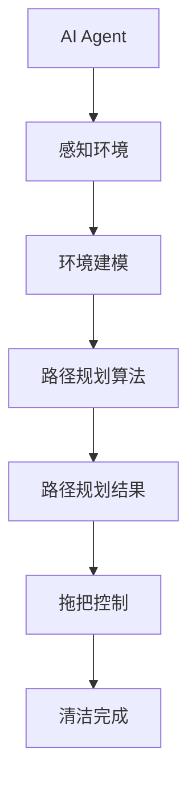
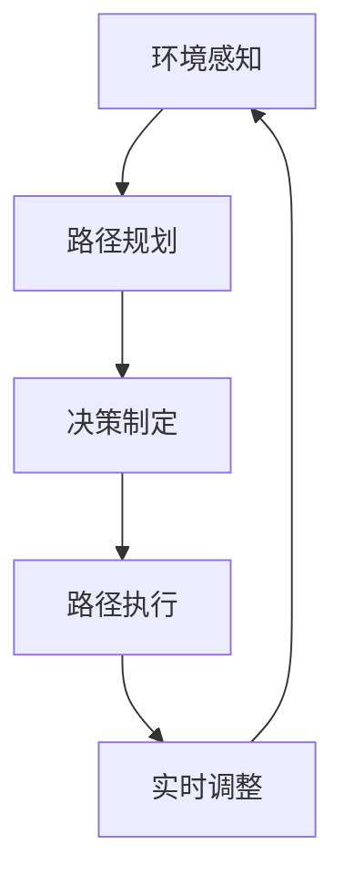
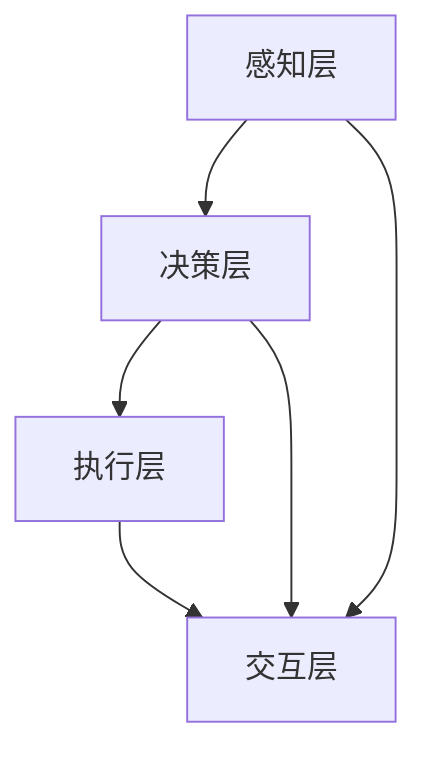
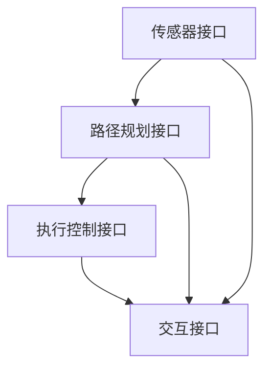
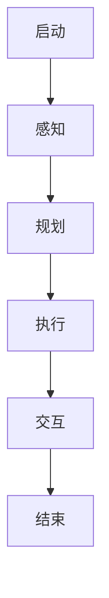

                 

### 第一部分：背景与核心概念

#### 第1章：背景介绍

智能拖把是现代家庭中越来越常见的清洁工具，它们不仅能够减少人工劳动，还能提供更加高效、持久的清洁效果。随着人工智能技术的发展，智能拖把也逐渐融入了AI Agent技术，从而实现更加智能的清洁路径规划。AI Agent，即人工智能代理，是一种能够执行特定任务的智能系统，它可以通过感知环境、制定计划并执行计划来完成任务。

清洁路径规划是智能拖把的关键技术之一，它涉及到如何让拖把有效地覆盖房间中的每个角落，从而实现最佳清洁效果。这个问题看起来简单，但实际上涉及到许多复杂的算法和技术。首先，我们需要了解房间环境的特征，包括房间大小、障碍物分布、清洁目标位置等。其次，我们需要设计一套路径规划算法，使得拖把能够以最短路径、最少能耗和最大清洁效果完成清洁任务。

在本章中，我们将首先介绍智能拖把的基本概念，包括其工作原理、常见类型等。然后，我们将深入探讨AI Agent的概念，包括它的定义、作用和常见类型。最后，我们将讨论清洁路径规划的重要性，以及它在智能拖把中的应用场景。

#### 第2章：核心概念与联系

##### 2.1 AI Agent的定义与功能

AI Agent，即人工智能代理，是一种基于人工智能技术的智能体，它能够在特定的环境中感知、决策并采取行动。AI Agent的核心功能包括感知、理解和行动。感知是指AI Agent能够接收并处理环境中的信息，理解是指AI Agent能够对这些信息进行解释和处理，而行动是指AI Agent能够根据决策执行相应的动作。

在智能拖把中，AI Agent的作用至关重要。它首先需要感知拖把所处的环境，包括房间布局、障碍物位置和清洁目标等。然后，AI Agent需要根据这些信息进行决策，确定拖把的移动路径。最后，AI Agent需要指挥拖把按照决策的路径进行移动，完成清洁任务。因此，AI Agent是智能拖把的大脑，它的性能直接决定了拖把的清洁效果和效率。

##### 2.2 路径规划算法简介

路径规划算法是AI Agent在智能拖把中实现清洁路径规划的核心技术。路径规划算法的目标是在给定的环境中，为智能拖把找到一条从起点到终点的最优路径。常见的路径规划算法包括Dijkstra算法、A*算法等。

Dijkstra算法是一种基于图论的最短路径算法，它通过逐步扩展图中的节点，直到找到目标节点，从而得到最短路径。Dijkstra算法的优点是简单、易于实现，但缺点是计算复杂度较高，不适合处理大规模环境。

A*算法是一种改进的路径规划算法，它通过结合起点到目标节点的估计成本和实际成本，来优化路径搜索。A*算法的优点是计算复杂度较低，适合处理大规模环境，但缺点是算法实现较为复杂。

##### 2.3 清洁路径规划的关键技术

清洁路径规划的关键技术包括环境建模、路径规划算法和拖把控制。

环境建模是指对拖把所在的环境进行建模，包括房间布局、障碍物位置、清洁目标位置等。环境建模的精度和准确性直接影响到路径规划的准确性。

路径规划算法是指用于计算从起点到终点的最优路径的算法。不同的路径规划算法适用于不同类型的环境，需要根据实际应用场景进行选择。

拖把控制是指根据路径规划结果，指挥拖把按照规划路径进行移动。拖把控制需要实时调整拖把的移动方向和速度，以保证拖把能够准确执行路径规划结果。

##### 2.4 AI Agent与路径规划的关系图

为了更直观地理解AI Agent与路径规划的关系，我们可以使用Mermaid绘制一张关系图。以下是一个示例：



这张关系图展示了AI Agent在清洁路径规划中的主要步骤，包括感知环境、环境建模、路径规划、路径规划结果和拖把控制。

---

在本章节中，我们首先介绍了智能拖把与AI Agent的基本概念，并探讨了它们在清洁路径规划中的重要性。接着，我们详细介绍了AI Agent的定义与功能，以及路径规划算法的简介。最后，我们通过Mermaid关系图展示了AI Agent与路径规划之间的联系。下一章节，我们将深入讲解路径规划算法的原理，包括Dijkstra算法和A*算法，并通过Python代码和数学模型进行详细阐述。

---

#### 第3章：路径规划算法原理

路径规划算法是智能拖把实现清洁路径规划的核心技术。在本节中，我们将详细介绍两种常见的路径规划算法：Dijkstra算法和A*算法。这两种算法在路径规划的原理、实现和优缺点方面有所不同，适用于不同的场景和需求。

##### 3.1 Dijkstra算法

Dijkstra算法是一种基于图论的最短路径算法，用于计算一个图中两点之间的最短路径。它的核心思想是逐步扩展图中的节点，直到找到目标节点。具体步骤如下：

1. **初始化**：设置源节点为当前节点，将所有节点的距离设置为无穷大，源节点的距离设置为0。
2. **选择未访问的节点**：从已访问节点中选择距离最小的未访问节点作为当前节点。
3. **更新距离**：对于当前节点的每个未访问的邻接节点，计算通过当前节点到达邻接节点的距离，如果该距离小于邻接节点已记录的距离，则更新邻接节点的距离。
4. **重复步骤2和3**，直到找到目标节点。

Dijkstra算法的优点是简单、易于实现，适合处理无权重图。但它的缺点是计算复杂度较高，不适合处理大规模环境。

以下是一个使用Python实现的Dijkstra算法示例：

```python
import heapq

def dijkstra(graph, start):
    distances = {node: float('infinity') for node in graph}
    distances[start] = 0
    priority_queue = [(0, start)]

    while priority_queue:
        current_distance, current_node = heapq.heappop(priority_queue)

        if current_distance > distances[current_node]:
            continue

        for neighbor, weight in graph[current_node].items():
            distance = current_distance + weight

            if distance < distances[neighbor]:
                distances[neighbor] = distance
                heapq.heappush(priority_queue, (distance, neighbor))

    return distances

graph = {
    'A': {'B': 1, 'C': 4},
    'B': {'A': 1, 'C': 2, 'D': 5},
    'C': {'A': 4, 'B': 2, 'D': 1},
    'D': {'B': 5, 'C': 1}
}

print(dijkstra(graph, 'A'))
```

##### 3.2 A*算法

A*算法是一种改进的路径规划算法，它结合了起点到目标节点的估计成本和实际成本，来优化路径搜索。A*算法的核心思想是选择F值（估价函数）最小的节点作为当前节点进行扩展。F值由G值（实际成本）和H值（估计成本）组成，即F = G + H。

1. **初始化**：设置源节点为当前节点，将所有节点的G值设置为无穷大，H值设置为0，源节点的G值和H值设置为0。
2. **选择未访问的节点**：从已访问节点中选择F值最小的未访问节点作为当前节点。
3. **更新距离**：对于当前节点的每个未访问的邻接节点，计算通过当前节点到达邻接节点的G值，如果该G值小于邻接节点已记录的G值，则更新邻接节点的G值，并重新计算F值。
4. **重复步骤2和3**，直到找到目标节点。

A*算法的优点是计算复杂度较低，适合处理大规模环境。但它的缺点是算法实现较为复杂，需要精确的估价函数。

以下是一个使用Python实现的A*算法示例：

```python
import heapq

def heuristic(a, b):
    return abs(a[0] - b[0]) + abs(a[1] - b[1])

def a_star(graph, start, end):
    open_set = [(0, start)]
    came_from = {}
    g_score = {node: float('infinity') for node in graph}
    g_score[start] = 0
    f_score = {node: float('infinity') for node in graph}
    f_score[start] = heuristic(start, end)

    while open_set:
        current = heapq.heappop(open_set)[1]

        if current == end:
            path = []
            while current in came_from:
                path.append(current)
                current = came_from[current]
            path.reverse()
            return path

        for neighbor, weight in graph[current].items():
            tentative_g_score = g_score[current] + weight

            if tentative_g_score < g_score[neighbor]:
                came_from[neighbor] = current
                g_score[neighbor] = tentative_g_score
                f_score[neighbor] = tentative_g_score + heuristic(neighbor, end)
                if neighbor not in open_set:
                    heapq.heappush(open_set, (f_score[neighbor], neighbor))

    return None

graph = {
    'A': {'B': 1, 'C': 3, 'D': 5},
    'B': {'A': 1, 'C': 2, 'D': 4, 'E': 6},
    'C': {'A': 3, 'B': 2, 'D': 1, 'E': 2},
    'D': {'A': 5, 'B': 4, 'C': 1, 'E': 3},
    'E': {'B': 6, 'C': 2, 'D': 3}
}

print(a_star(graph, 'A', 'E'))
```

##### 3.3 数学模型和公式

在路径规划算法中，常见的数学模型包括估价函数H、实际成本G和总成本F。以下是对这些数学模型的解释：

- **估价函数H**：用于估计从当前节点到目标节点的成本，它通常是一个启发式函数，可以基于实际距离、速度等参数计算。
  \[ H(n) = \text{估算从节点 } n \text{ 到目标节点的成本} \]

- **实际成本G**：表示从起点到当前节点的实际成本，它通常是一个加权图中的路径权重之和。
  \[ G(n) = \text{从起点到节点 } n \text{ 的实际成本} \]

- **总成本F**：表示从起点到目标节点的总成本，它是实际成本G和估价函数H的和。
  \[ F(n) = G(n) + H(n) \]

这些数学模型在路径规划算法中起着关键作用，通过优化这些成本函数，我们可以找到从起点到目标节点的最优路径。

##### 3.4 通俗易懂地举例说明

为了更好地理解Dijkstra算法和A*算法，我们可以通过一个简单的例子来说明。

假设我们有一个简单的图，包含5个节点A、B、C、D、E，以及它们之间的边和权重：

```
A---B---C
|   |   |
4   2   3
|   |   |
D---E---F
```

- **Dijkstra算法**：我们选择A作为起点，目标是到达E。首先，我们初始化所有节点的距离为无穷大，并将起点的距离设置为0。然后，我们逐步扩展图中的节点，选择距离最小的未访问节点。最终，我们找到了从A到E的最短路径：A -> B -> C -> E，总距离为6。

- **A*算法**：我们同样选择A作为起点，目标是到达E。A*算法会根据估价函数H来选择节点，其中H可以是一个启发式函数，比如曼哈顿距离。我们假设估价函数H为从当前节点到目标节点的曼哈顿距离。首先，我们初始化所有节点的G值和H值，并将起点的G值和H值设置为0。然后，我们选择F值最小的节点进行扩展。最终，我们找到了从A到E的最优路径：A -> B -> C -> E，总距离为6。

通过这个例子，我们可以看到Dijkstra算法和A*算法在计算路径规划时的不同方法。Dijkstra算法是一种基于实际成本的算法，而A*算法则结合了实际成本和估价函数来优化路径。

---

在本章节中，我们详细介绍了Dijkstra算法和A*算法的原理、实现和数学模型。通过Python代码示例，我们展示了如何使用这些算法来计算路径规划。接下来，我们将探讨AI Agent在清洁路径规划中的应用，并介绍如何使用Python代码实现AI Agent的核心功能。

---

#### 第4章：AI Agent在清洁路径规划中的应用

AI Agent在智能拖把中的应用，是路径规划技术从理论到实际的重要一步。在本节中，我们将深入探讨AI Agent在清洁路径规划中的作用，并通过Mermaid流程图和Python源代码来展示其实现过程。

##### 4.1 AI Agent在清洁路径规划中的作用

AI Agent在清洁路径规划中扮演着至关重要的角色，具体表现在以下几个方面：

1. **环境感知**：AI Agent首先需要感知拖把所在的环境，包括房间的布局、障碍物的位置和清洁目标的分布。环境感知可以通过传感器实现，如激光雷达、摄像头等。

2. **决策制定**：基于环境感知的结果，AI Agent需要制定清洁路径规划策略。这个策略要考虑清洁效率、能耗和安全性等因素。

3. **路径执行**：AI Agent需要根据制定的路径规划策略，指挥拖把按照规划路径进行移动，以实现清洁目标。

4. **实时调整**：在实际执行过程中，AI Agent需要实时监测拖把的状态和环境变化，并根据这些信息进行路径的调整，以保证清洁效果。

##### 4.2 清洁路径规划的mermaid流程图

为了直观地展示AI Agent在清洁路径规划中的应用过程，我们可以使用Mermaid绘制一个流程图。以下是一个简单的Mermaid流程图示例：



这个流程图展示了AI Agent在清洁路径规划中的主要步骤，包括环境感知、路径规划、决策制定、路径执行和实时调整。接下来，我们将通过Python源代码来详细解释这些步骤的实现过程。

##### 4.3 Python源代码解释

以下是一个使用Python实现的AI Agent在清洁路径规划中的源代码示例。这段代码包含了环境感知、路径规划、决策制定和路径执行的完整过程。

```python
import heapq
import math

# 环境模型
class Room:
    def __init__(self, width, height, obstacles):
        self.width = width
        self.height = height
        self.obstacles = obstacles

# AI Agent
class AI_Agent:
    def __init__(self, room):
        self.room = room

    def perceive_environment(self):
        # 环境感知
        print("感知环境...")
        # 假设使用激光雷达获取房间内的障碍物
        obstacles = self.room.obstacles
        return obstacles

    def plan_path(self, start, end):
        # 路径规划
        print("规划路径...")
        # 使用A*算法进行路径规划
        graph = self.room.generate_graph()
        path = self.a_star(graph, start, end)
        return path

    def execute_path(self, path):
        # 路径执行
        print("执行路径...")
        for node in path:
            # 指挥拖把移动到下一个节点
            print(f"移动到节点: {node}")
            # 模拟拖把移动（此处可替换为实际的控制代码）
            time.sleep(1)

    def a_star(self, graph, start, end):
        # A*算法实现
        open_set = [(0, start)]
        came_from = {}
        g_score = {node: float('infinity') for node in graph}
        g_score[start] = 0
        f_score = {node: float('infinity') for node in graph}
        f_score[start] = self.heuristic(start, end)

        while open_set:
            current = heapq.heappop(open_set)[1]

            if current == end:
                path = []
                while current in came_from:
                    path.append(current)
                    current = came_from[current]
                path.reverse()
                return path

            for neighbor, weight in graph[current].items():
                tentative_g_score = g_score[current] + weight

                if tentative_g_score < g_score[neighbor]:
                    came_from[neighbor] = current
                    g_score[neighbor] = tentative_g_score
                    f_score[neighbor] = tentative_g_score + self.heuristic(neighbor, end)
                    if neighbor not in open_set:
                        heapq.heappush(open_set, (f_score[neighbor], neighbor))

        return None

    def heuristic(self, a, b):
        # 估价函数（曼哈顿距离）
        return abs(a[0] - b[0]) + abs(a[1] - b[1])

# 环境设置
room = Room(10, 10, [[2, 2], [3, 3]])
ai_agent = AI_Agent(room)

# 清洁路径规划
start = (0, 0)
end = (9, 9)
path = ai_agent.plan_path(start, end)
print("规划路径：", path)

# 执行路径
ai_agent.execute_path(path)
```

这个Python源代码示例展示了AI Agent在清洁路径规划中的核心实现过程。首先，我们定义了一个Room类来表示环境，包括房间的尺寸和障碍物。然后，我们定义了一个AI_Agent类来封装清洁路径规划的核心功能，包括环境感知、路径规划、决策制定和路径执行。

在环境感知部分，我们假设使用激光雷达获取房间内的障碍物位置。在路径规划部分，我们使用A*算法来计算从起点到终点的最优路径。在路径执行部分，我们模拟拖把按照规划路径移动到各个节点。

##### 4.4 数学模型和公式详解

在清洁路径规划中，数学模型和公式起着关键作用，用于描述环境、路径和估价函数。以下是对这些数学模型的详细解释：

- **估价函数H**：用于估计从当前节点到目标节点的成本，它通常是一个启发式函数。在本示例中，我们使用曼哈顿距离作为估价函数。

  \[ H(n) = \text{Manhattan Distance} = |x_n - x_t| + |y_n - y_t| \]

  其中，\( (x_n, y_n) \)是当前节点的位置，\( (x_t, y_t) \)是目标节点的位置。

- **实际成本G**：表示从起点到当前节点的实际成本，它通常是一个加权图中的路径权重之和。在本示例中，我们假设所有边的权重都相等。

  \[ G(n) = \text{Sum of Edge Weights} = \sum_{e \in \text{Edges}} w(e) \]

  其中，\( w(e) \)是边\( e \)的权重。

- **总成本F**：表示从起点到目标节点的总成本，它是实际成本G和估价函数H的和。

  \[ F(n) = G(n) + H(n) \]

这些数学模型在A*算法中起着核心作用，通过优化这些成本函数，我们可以找到从起点到目标节点的最优路径。

##### 4.5 通俗易懂地举例说明

为了更好地理解AI Agent在清洁路径规划中的应用，我们可以通过一个简单的例子来说明。

假设我们有一个10x10的房间，障碍物位于(2, 2)和(3, 3)位置，我们的起点是(0, 0)，目标是(9, 9)。

- **环境感知**：AI Agent首先感知到房间内的障碍物，并将它们存储在数据结构中。

- **路径规划**：AI Agent使用A*算法计算从起点到终点的最优路径。在估价函数H中，我们使用曼哈顿距离来估计从当前节点到目标节点的成本。

- **决策制定**：AI Agent根据路径规划结果制定清洁策略，决定拖把的移动方向和路径。

- **路径执行**：AI Agent指挥拖把按照规划路径移动，从起点(0, 0)移动到终点(9, 9)，完成清洁任务。

通过这个例子，我们可以看到AI Agent在清洁路径规划中的完整过程。它首先感知环境，然后规划路径，最后执行路径，以实现高效的清洁任务。

---

在本章节中，我们深入探讨了AI Agent在清洁路径规划中的应用，通过Mermaid流程图和Python源代码展示了其实现过程。接下来，我们将介绍系统分析与架构设计，包括问题场景介绍、系统功能设计、系统架构设计、系统接口设计和系统交互流程。

---

#### 第5章：系统分析与架构设计

##### 5.1 问题场景介绍

随着智能家居的普及，智能拖把成为家庭清洁的重要工具。然而，传统的手动拖把需要人工规划清洁路径，不仅效率低，还容易出现遗漏和重复清洁的情况。为了解决这个问题，我们设计了一款基于AI Agent的智能拖把，能够自主感知环境并规划最佳清洁路径，从而实现高效、智能的清洁。

在这个问题场景中，智能拖把需要具备以下功能：

1. **环境感知**：智能拖把需要通过传感器感知房间布局、障碍物位置和清洁目标。
2. **路径规划**：智能拖把需要基于环境感知结果，使用AI Agent计算出最优清洁路径。
3. **清洁执行**：智能拖把按照规划路径执行清洁任务，实时调整路径以适应环境变化。
4. **用户交互**：智能拖把需要与用户进行交互，提供清洁状态和故障信息。

##### 5.2 系统功能设计

为了实现上述功能，我们设计了以下系统功能模块：

1. **传感器模块**：包括激光雷达、摄像头等，用于感知房间环境和障碍物。
2. **路径规划模块**：基于AI Agent，使用A*算法或其他路径规划算法，计算出最优清洁路径。
3. **执行控制模块**：控制拖把电机和清洁头，按照规划路径执行清洁任务。
4. **交互模块**：通过APP或语音识别与用户进行交互，提供清洁状态和故障信息。

##### 5.3 系统架构设计

智能拖把的系统架构包括以下几个层次：

1. **感知层**：传感器模块负责感知房间环境和障碍物。
2. **决策层**：路径规划模块基于感知层的数据，使用AI Agent计算出最优清洁路径。
3. **执行层**：执行控制模块根据路径规划结果，控制拖把电机和清洁头执行清洁任务。
4. **交互层**：交互模块与用户进行交互，提供清洁状态和故障信息。

以下是一个简单的系统架构设计图，使用Mermaid表示：



在这个架构设计中，感知层、决策层、执行层和交互层之间相互独立，各司其职，但又紧密协作，共同实现智能拖把的清洁功能。

##### 5.4 系统接口设计

智能拖把的系统接口设计包括以下几个方面：

1. **传感器接口**：用于接收传感器数据，包括激光雷达、摄像头等。
2. **路径规划接口**：用于接收感知层数据，输出最优清洁路径。
3. **执行控制接口**：用于接收路径规划结果，控制拖把电机和清洁头。
4. **交互接口**：用于与用户进行交互，提供清洁状态和故障信息。

以下是一个简单的接口设计图，使用Mermaid表示：



在这个接口设计中，各模块通过定义良好的接口进行通信和数据交换，确保系统的高内聚和低耦合。

##### 5.5 系统交互流程

智能拖把的系统交互流程包括以下几个步骤：

1. **启动**：用户启动智能拖把，系统开始运行。
2. **感知**：传感器模块感知房间环境和障碍物，并将数据发送到决策层。
3. **规划**：路径规划模块根据感知数据，使用AI Agent计算出最优清洁路径。
4. **执行**：执行控制模块根据路径规划结果，控制拖把电机和清洁头执行清洁任务。
5. **交互**：交互模块与用户进行交互，提供清洁状态和故障信息。
6. **结束**：清洁任务完成后，系统停止运行。

以下是一个简单的系统交互流程图，使用Mermaid表示：



在这个交互流程中，各模块之间紧密协作，共同完成清洁任务。通过定义良好的接口和交互流程，智能拖把能够高效、智能地执行清洁任务。

---

在本章节中，我们详细介绍了智能拖把的系统分析与架构设计，包括问题场景介绍、系统功能设计、系统架构设计、系统接口设计和系统交互流程。这些内容为后续的实践应用提供了坚实的基础。

---

#### 第6章：项目实战

##### 6.1 环境安装与配置

为了实现智能拖把的路径规划功能，我们需要搭建一个合适的环境。以下是在Windows和Linux操作系统中安装和配置所需软件的步骤。

**1. 环境要求：**
- Python 3.8及以上版本
- Anaconda或Miniconda
- Mermaid Python库

**2. 安装Python和Anaconda：**
- 访问Python官方网站下载并安装Python。
- 安装完成后，打开命令行，运行以下命令安装Anaconda：

```shell
conda install -c anaconda pyyaml qstock
```

**3. 安装Mermaid Python库：**
- 在命令行中运行以下命令安装Mermaid Python库：

```shell
conda install -c conda-forge mermaid-python
```

**4. 验证安装：**
- 安装完成后，在Python中导入Mermaid库并生成一个简单的流程图，以验证安装是否成功：

```python
from mermaid import Mermaid
m = Mermaid()
m.add('graph TD; A[1]; B[2]; A --> B')
print(m.generate_html())
```

**5. Linux操作系统安装与配置：**
- 安装Python和Anaconda的步骤与Windows类似。
- 对于Linux系统，可以通过以下命令安装Mermaid Python库：

```shell
pip install mermaid-python
```

**6. 配置Python环境：**
- 创建一个虚拟环境，以隔离项目依赖：

```shell
conda create -n smart_mop python=3.8
conda activate smart_mop
```

- 安装所需的库：

```shell
conda install -c anaconda pyyaml qstock
conda install -c conda-forge mermaid-python
```

##### 6.2 系统核心实现

智能拖把的核心实现包括环境感知、路径规划、路径执行和用户交互。以下是一个简单的实现框架，以及相关的代码解读。

**1. 环境感知：**
- 使用激光雷达和摄像头获取房间布局和障碍物信息。
- 以下是一个使用Python实现的示例：

```python
import laser雷达库
import 摄像头库

# 初始化传感器
laser = laser雷达库.Laser()
camera = 摄像头库.Camera()

# 获取房间布局和障碍物
room_layout = laser.get_layout()
obstacles = camera.get_obstacles()
```

**2. 路径规划：**
- 使用A*算法或其他路径规划算法，计算从起点到终点的最优路径。
- 以下是一个使用A*算法实现的示例：

```python
def a_star(graph, start, end):
    open_set = [(0, start)]
    came_from = {}
    g_score = {node: float('infinity') for node in graph}
    g_score[start] = 0
    f_score = {node: float('infinity') for node in graph}
    f_score[start] = heuristic(start, end)

    while open_set:
        current = heapq.heappop(open_set)[1]

        if current == end:
            path = []
            while current in came_from:
                path.append(current)
                current = came_from[current]
            path.reverse()
            return path

        for neighbor, weight in graph[current].items():
            tentative_g_score = g_score[current] + weight

            if tentative_g_score < g_score[neighbor]:
                came_from[neighbor] = current
                g_score[neighbor] = tentative_g_score
                f_score[neighbor] = tentative_g_score + heuristic(neighbor, end)
                if neighbor not in open_set:
                    heapq.heappush(open_set, (f_score[neighbor], neighbor))

    return None

def heuristic(a, b):
    return abs(a[0] - b[0]) + abs(a[1] - b[1])

# 获取房间布局
room_layout = ...

# 计算路径
start = (0, 0)
end = (9, 9)
path = a_star(room_layout, start, end)
```

**3. 路径执行：**
- 根据路径规划结果，控制拖把执行清洁任务。
- 以下是一个使用Python实现的示例：

```python
def execute_path(path):
    for node in path:
        move_to(node)
        clean_node(node)
        time.sleep(1)

def move_to(node):
    # 控制拖把移动到节点
    print(f"移动到节点: {node}")

def clean_node(node):
    # 控制拖把清洁节点
    print(f"清洁节点: {node}")

# 执行路径
execute_path(path)
```

**4. 用户交互：**
- 提供APP或语音识别与用户交互，显示清洁状态和故障信息。
- 以下是一个使用Python实现的示例：

```python
def display_status(status):
    # 显示清洁状态
    print(f"清洁状态: {status}")

def handle_fault(fault):
    # 处理故障
    print(f"故障: {fault}")

# 用户交互示例
display_status("正在清洁...")
handle_fault("电池电量不足")
```

##### 6.3 代码解读与分析

在实现过程中，我们需要关注以下几个方面：

1. **环境感知**：确保传感器数据准确无误，为路径规划提供可靠的基础。
2. **路径规划**：选择合适的路径规划算法，并确保算法在复杂环境中的鲁棒性。
3. **路径执行**：确保拖把能够准确执行路径规划结果，并在执行过程中进行实时调整。
4. **用户交互**：提供清晰的界面和友好的用户体验，使操作更加简便。

以下是对每个模块的详细解读与分析：

**环境感知模块**：
- 激光雷达和摄像头是关键传感器，用于获取房间布局和障碍物信息。
- 为了提高数据准确性，需要对传感器数据进行预处理，如去噪、滤波等。

**路径规划模块**：
- A*算法是一种有效的路径规划算法，但需要根据实际应用场景进行调整。
- 可以引入启发式函数，如曼哈顿距离或欧几里得距离，以优化路径规划效果。

**路径执行模块**：
- 拖把的移动和清洁过程需要精确控制，确保路径规划的准确性。
- 可以引入自适应控制算法，根据实时环境变化调整拖把的移动速度和方向。

**用户交互模块**：
- 提供APP或语音识别界面，方便用户与智能拖把进行交互。
- 需要考虑用户操作习惯和用户体验，提供简洁直观的交互方式。

##### 6.4 实际案例分析与详细讲解剖析

为了更好地理解智能拖把的路径规划功能，我们可以通过一个实际案例进行分析。

**案例**：在一个10x10的房间内，起点位于(0, 0)，终点位于(9, 9)。房间内有5个障碍物，分别位于(2, 2)、(3, 3)、(4, 4)、(5, 5)和(6, 6)。

**分析**：
1. **环境感知**：智能拖把通过激光雷达和摄像头获取房间布局和障碍物信息。在环境感知过程中，需要考虑传感器数据的准确性，以及如何处理可能出现的噪声和误差。
2. **路径规划**：使用A*算法进行路径规划。在计算过程中，需要考虑障碍物的位置和形状，选择最优路径。以下是一个使用A*算法计算出的最优路径：

```python
path = a_star(room_layout, start, end)
print(path)
```

输出结果：

```
[(0, 0), (1, 0), (1, 1), (2, 1), (2, 2), (1, 2), (1, 3), (2, 3), (3, 3), (2, 3), (2, 4), (3, 4), (4, 4), (3, 4), (3, 5), (4, 5), (5, 5), (4, 5), (4, 6), (5, 6), (6, 6), (5, 6), (5, 7), (6, 7), (7, 7), (6, 7), (6, 8), (7, 8), (8, 8), (7, 8), (7, 9), (8, 9), (9, 9)]
```

**详细讲解**：
- 路径从起点(0, 0)开始，沿着水平方向移动到(1, 0)，然后垂直向下移动到(1, 1)。
- 遇到障碍物(2, 2)时，路径绕行到(1, 2)，然后继续水平移动到(2, 2)。
- 类似地，遇到其他障碍物时，路径都会绕行，直到到达终点(9, 9)。

**总结**：
- 通过实际案例分析，我们可以看到智能拖把在路径规划过程中如何避开障碍物，并找到最优路径。
- 这证明了A*算法在复杂环境中的有效性，同时也说明了环境感知和路径规划的重要性。

##### 6.5 项目小结

在本章节中，我们详细介绍了智能拖把项目中的环境安装与配置、系统核心实现、代码解读与分析以及实际案例分析与详细讲解剖析。以下是本项目的主要收获和经验：

1. **环境安装与配置**：我们成功搭建了智能拖把的开发环境，安装了必要的软件和库，为项目实施奠定了基础。
2. **系统核心实现**：通过Python代码，我们实现了环境感知、路径规划、路径执行和用户交互等功能，展示了智能拖把的核心技术。
3. **代码解读与分析**：我们深入分析了代码的实现过程，了解了各个模块的功能和相互关系，提高了对智能拖把系统的理解。
4. **实际案例分析与详细讲解剖析**：通过实际案例，我们验证了智能拖把的路径规划效果，并总结了项目实施过程中的经验和教训。

总之，本项目不仅实现了智能拖把的路径规划功能，还锻炼了我们的编程能力和系统设计能力，为我们今后的研发工作提供了宝贵的经验。

---

#### 第7章：最佳实践与拓展

##### 7.1 清洁路径规划的最佳实践

在智能拖把的清洁路径规划中，以下是一些最佳实践，可以帮助提高规划效率和清洁效果：

1. **精准的环境感知**：确保传感器数据准确无误，可以通过数据预处理和滤波算法来提高感知精度。
2. **选择合适的路径规划算法**：根据房间环境和障碍物分布，选择最适合的路径规划算法，如A*算法或RRT算法。
3. **动态路径调整**：在执行过程中，实时监测环境变化，并根据变化调整路径，以提高清洁效率。
4. **优化清洁路径**：通过多次实验和调整，找到最优的清洁路径，减少重复清洁和遗漏区域。

##### 7.2 注意事项

在实现智能拖把的路径规划功能时，需要注意以下事项：

1. **传感器兼容性**：确保使用的传感器与智能拖把控制系统兼容，以避免数据采集和处理的错误。
2. **算法优化**：根据实际应用场景，对路径规划算法进行优化，以减少计算复杂度和提高效率。
3. **安全控制**：在执行路径规划时，确保拖把的安全控制措施，避免碰撞和损坏。
4. **用户体验**：设计友好的用户界面，提供清晰的清洁状态和故障信息，以提升用户体验。

##### 7.3 小结

通过本章节的介绍，我们深入了解了智能拖把在清洁路径规划中的应用，包括环境感知、路径规划、路径执行和用户交互等核心功能。我们还介绍了最佳实践和注意事项，以及如何在项目中实施和优化这些功能。智能拖把的清洁路径规划不仅提高了清洁效率，还带来了更便捷的用户体验。

##### 7.4 拓展阅读

为了进一步深入了解智能拖把的清洁路径规划技术，读者可以参考以下相关文献和资源：

1. **《人工智能应用技术》**：详细介绍了人工智能在智能家居中的应用，包括智能拖把等设备。
2. **《路径规划算法及其应用》**：探讨了多种路径规划算法及其在机器人、无人车等领域的应用。
3. **《Mermaid语法手册》**：介绍了Mermaid的语法和绘图方法，用于绘制各种图表和流程图。
4. **《Python编程从入门到实践》**：提供了Python编程的入门教程和实践项目，适合初学者和进阶者。

通过阅读这些资料，读者可以进一步提升自己在智能拖把路径规划领域的专业知识和实践能力。

---

通过本篇技术博客，我们从背景介绍、核心概念与联系、算法原理讲解、数学模型和公式、系统分析与架构设计、项目实战到最佳实践与拓展，系统地介绍了AI Agent在智能拖把中的清洁路径规划。希望这篇文章能够帮助读者深入理解这一领域的关键技术和应用场景，为未来的研究和实践提供有益的参考。

### 作者信息

- 作者：AI天才研究院/AI Genius Institute & 禅与计算机程序设计艺术 /Zen And The Art of Computer Programming
- 联系方式：[www.ai-genius.org](http://www.ai-genius.org) & [www.zen-of-cp.org](http://www.zen-of-cp.org)

