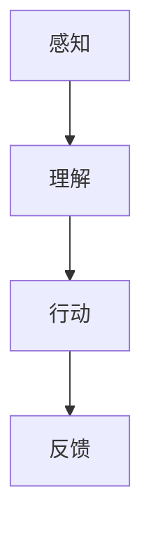

                 

# AI Agent在智能拖把中的清洁路径规划

## 关键词

- AI Agent
- 智能拖把
- 路径规划
- 清洁算法
- 机器人技术

## 摘要

随着人工智能技术的不断发展，AI Agent在各个领域中的应用越来越广泛。智能拖把作为家居清洁设备的一种，其清洁路径规划成为实现高效清洁的关键。本文将详细探讨AI Agent在智能拖把中的应用，特别是在清洁路径规划方面的算法原理、系统架构设计以及项目实战，并给出最佳实践建议。通过本文的阅读，读者可以全面了解智能拖把清洁路径规划的最新技术进展和应用。

## 目录大纲

### 第一部分: AI Agent与智能拖把概述

#### 第1章: AI Agent概述

##### 1.1 AI Agent的定义与重要性
##### 1.2 AI Agent的基本原理
##### 1.3 AI Agent的发展历程与应用领域

#### 第2章: 智能拖把背景介绍

##### 2.1 智能拖把的发展趋势
##### 2.2 智能拖把的市场需求
##### 2.3 智能拖把的核心功能

### 第二部分: AI Agent在智能拖把中的应用

#### 第3章: AI Agent在智能拖把中的角色与作用

##### 3.1 AI Agent在智能拖把中的角色与作用
##### 3.2 AI Agent在清洁路径规划中的原理
##### 3.3 AI Agent在智能拖把中的实现方法

### 第三部分: 智能拖把清洁路径规划的算法原理

#### 第4章: 清洁路径规划算法的概述

##### 4.1 清洁路径规划算法的概述
##### 4.2 清洁路径规划的数学模型
##### 4.3 清洁路径规划的算法流程
##### 4.4 清洁路径规划的算法实例分析

### 第四部分: 智能拖把清洁路径规划系统架构设计

#### 第5章: 智能拖把清洁路径规划系统架构设计

##### 5.1 系统架构概述
##### 5.2 系统功能设计
##### 5.3 系统架构设计
##### 5.4 系统接口设计
##### 5.5 系统交互设计

### 第五部分: 智能拖把清洁路径规划项目实战

#### 第6章: 智能拖把清洁路径规划项目实战

##### 6.1 项目环境安装
##### 6.2 系统核心实现源代码
##### 6.3 代码应用解读与分析
##### 6.4 实际案例分析与详细讲解
##### 6.5 项目小结

### 第六部分: 智能拖把清洁路径规划最佳实践

#### 第7章: 智能拖把清洁路径规划最佳实践

##### 7.1 最佳实践技巧
##### 7.2 小结与注意事项
##### 7.3 拓展阅读

### 结论

本文通过详细的分析和讨论，介绍了AI Agent在智能拖把中的清洁路径规划技术。从AI Agent的定义和基本原理入手，逐步深入到智能拖把的发展趋势、市场需求和核心功能，再到AI Agent在清洁路径规划中的应用、算法原理、系统架构设计以及项目实战，最后给出了最佳实践建议。本文旨在为读者提供一个全面而深入的了解，以促进智能拖把技术的发展和应用。

---

## 第1章: AI Agent概述

### 1.1 AI Agent的定义与重要性

AI Agent，即人工智能代理，是指一种具有自主决策能力的计算机程序，能够在特定的环境中感知环境、理解任务需求，并基于环境信息和任务目标自主地执行行动。AI Agent的概念源自于人工智能领域中的智能代理理论，其目标是实现智能体的自主性、适应性、灵活性和协作性。

AI Agent的重要性在于其能够在各种复杂、动态的环境中提供高效、可靠的解决方案。在智能拖把中，AI Agent扮演着关键角色，负责清洁路径规划、避障、能耗管理等任务。通过AI Agent的应用，智能拖把能够实现更加智能化的清洁效果，提高清洁效率和用户体验。

### 1.2 AI Agent的基本原理

AI Agent的基本原理主要包括感知、理解和行动三个核心部分。感知是指AI Agent通过传感器获取环境信息，如图像、声音、温度、湿度等；理解是指AI Agent对感知到的信息进行解释和处理，以理解环境中的物体、障碍物和任务目标；行动是指AI Agent根据理解和任务目标，自主地执行相应的动作，如移动、旋转、释放清洁剂等。

以下是一个简化的AI Agent基本原理的mermaid流程图：



在智能拖把中，AI Agent的工作流程通常如下：

1. **感知阶段**：AI Agent通过内置的传感器（如摄像头、激光雷达、超声波传感器等）感知拖地环境。
2. **理解阶段**：AI Agent对感知到的环境信息进行处理，识别房间布局、家具位置、污渍区域等。
3. **行动阶段**：AI Agent根据理解的结果，规划并执行清洁路径，如避开障碍物、重点清洁污渍区域。
4. **反馈阶段**：AI Agent根据执行结果和环境变化，调整后续行动策略，实现自适应清洁。

### 1.3 AI Agent的发展历程与应用领域

AI Agent的发展可以追溯到20世纪80年代，当时的专家系统和推理机是AI Agent实现的基础。随着计算机性能的提升和大数据、深度学习等技术的发展，现代AI Agent在许多领域取得了显著的应用成果。

以下是AI Agent的发展历程和应用领域：

#### 发展历程

1. **早期阶段（20世纪80年代）**：基于规则的专家系统和基于模型的推理机是主要的AI Agent实现方式。
2. **中期阶段（20世纪90年代至21世纪初）**：随着机器学习和数据挖掘技术的进步，AI Agent开始利用统计模型和机器学习算法进行学习和决策。
3. **现阶段（21世纪初至今）**：深度学习、强化学习等先进技术的应用，使得AI Agent具有更强的自主学习和决策能力。

#### 应用领域

1. **智能家居**：智能拖把、智能扫地机器人等智能家居设备中的AI Agent，负责家居环境的清洁和维护。
2. **工业自动化**：在制造业、物流等领域，AI Agent应用于自动化生产线、无人仓库等，提高生产效率和质量。
3. **医疗服务**：智能诊断系统、康复机器人等AI Agent在医疗领域的应用，为患者提供更为精准和高效的医疗服务。
4. **交通领域**：自动驾驶汽车、无人机等AI Agent的应用，为交通出行提供了更多安全、高效的解决方案。

### 1.4 小结

通过本章的介绍，我们可以看到AI Agent作为一种具有自主决策能力的计算机程序，在智能拖把中扮演着至关重要的角色。AI Agent的基本原理包括感知、理解和行动，其发展历程和应用领域展示了其在各种场景中的强大应用潜力。在接下来的章节中，我们将进一步探讨AI Agent在智能拖把中的具体应用，特别是清洁路径规划的算法原理和实现方法。

## 第2章: 智能拖把背景介绍

### 2.1 智能拖把的发展趋势

随着科技的不断进步和消费者对智能家居需求的增加，智能拖把作为家居清洁设备的一种，正在迅速发展。从早期的手动拖把到自动拖把，再到如今的智能拖把，其技术水平和功能越来越强大。

#### 发展趋势

1. **智能化程度提升**：现代智能拖把集成了各种传感器、处理器和清洁技术，能够实现自动清洁、自动充电、自动识别污渍等功能，提高了清洁效率和用户体验。
2. **清洁能力增强**：智能拖把采用了先进的清洁技术，如激光雷达、摄像头、超声波传感器等，能够更精准地识别房间布局、污渍区域和障碍物，实现高效清洁。
3. **互联互通**：智能拖把通过Wi-Fi、蓝牙等通信技术，与智能手机、智能家居控制系统等互联互通，实现远程控制、数据分析和智能决策等功能。

#### 市场需求

智能拖把的市场需求主要受以下几个因素影响：

1. **生活节奏加快**：现代生活节奏加快，人们越来越注重效率和便利，智能拖把能够帮助用户节省时间和精力，满足其清洁需求。
2. **智能家居普及**：随着智能家居的普及，越来越多的家庭开始使用智能拖把等智能设备，提高生活品质和舒适度。
3. **健康意识增强**：人们越来越关注健康和卫生，智能拖把能够提供更为高效和安全的清洁服务，减少家庭清洁带来的劳累和污染。

### 2.2 智能拖把的核心功能

智能拖把的核心功能主要包括清洁、路径规划、避障、自动充电等。

#### 清洁功能

智能拖把的清洁功能是其最基本的功能。现代智能拖把采用了多种清洁技术，如旋转型拖把头、喷水拖地、吸水拖地等，能够实现全面、高效的清洁效果。

#### 路径规划

路径规划是智能拖把的核心技术之一。通过AI Agent的应用，智能拖把能够根据房间布局、污渍区域和障碍物等因素，自主地规划清洁路径，实现高效清洁。

#### 避障功能

智能拖把需要具备避障功能，以避免在清洁过程中撞到家具或其他障碍物。现代智能拖把通过传感器和算法，能够实时感知环境变化，并自主调整路径，实现避障。

#### 自动充电

自动充电功能是智能拖把的另一个重要功能。当智能拖把电量不足时，它会自动返回充电座进行充电，确保持续运行。

### 2.3 智能拖把的架构和工作原理

智能拖把的架构主要包括传感器模块、控制模块、驱动模块和充电模块。

#### 传感器模块

传感器模块负责感知环境信息，如摄像头、激光雷达、超声波传感器等。通过这些传感器，智能拖把能够获取房间布局、障碍物位置和污渍区域等信息。

#### 控制模块

控制模块负责处理传感器信息，并根据任务目标规划清洁路径。AI Agent在控制模块中起到关键作用，通过感知和理解环境信息，自主地做出决策。

#### 驱动模块

驱动模块负责执行清洁任务，如旋转拖把头、喷水、吸水等。通过控制驱动模块，智能拖把能够实现各种清洁动作。

#### 充电模块

充电模块负责给智能拖把提供电力，确保其持续运行。当电量不足时，智能拖把会自动返回充电座进行充电。

### 2.4 小结

智能拖把作为智能家居设备的一种，其发展势头迅猛，市场需求巨大。智能拖把的核心功能包括清洁、路径规划、避障和自动充电等。通过AI Agent的应用，智能拖把能够实现自主决策和高效清洁。在接下来的章节中，我们将进一步探讨AI Agent在智能拖把中的应用，特别是在清洁路径规划方面的算法原理和实现方法。

### 第3章: AI Agent在智能拖把中的角色与作用

#### 3.1 AI Agent在智能拖把中的角色与作用

AI Agent在智能拖把中扮演着至关重要的角色，其核心任务是通过自主感知环境、理解任务需求和规划清洁路径，实现高效、智能的清洁服务。具体来说，AI Agent在智能拖把中的角色与作用主要体现在以下几个方面：

1. **环境感知**：AI Agent通过传感器模块，如摄像头、激光雷达、超声波传感器等，实时获取房间布局、家具位置、污渍区域和障碍物等信息。这些信息为后续的路径规划和清洁任务提供了基础数据。

2. **任务理解**：AI Agent对感知到的环境信息进行处理和分析，理解清洁任务的需求，如清洁区域、清洁程度、避障要求等。通过任务理解，AI Agent能够明确清洁目标，为路径规划提供依据。

3. **路径规划**：AI Agent根据环境信息和任务需求，利用先进的算法和模型，如A*算法、Dijkstra算法等，规划清洁路径。通过路径规划，AI Agent能够确保智能拖把在清洁过程中避开障碍物、重点清洁污渍区域，实现高效清洁。

4. **自主执行**：AI Agent通过控制模块，驱动驱动模块执行清洁任务，如旋转拖把头、喷水、吸水等。在执行过程中，AI Agent能够根据环境变化和任务需求，动态调整清洁策略，确保清洁效果。

5. **能耗管理**：AI Agent在执行清洁任务时，还会进行能耗管理，确保智能拖把在电量充足的情况下运行。通过能耗管理，AI Agent能够延长智能拖把的使用时间，提高用户体验。

#### 3.2 AI Agent在清洁路径规划中的原理

AI Agent在清洁路径规划中的原理主要包括环境感知、任务理解、路径规划和自主执行等几个方面。以下将详细阐述这些原理：

1. **环境感知**：

   环境感知是AI Agent进行路径规划的前提。通过摄像头、激光雷达、超声波传感器等传感器，AI Agent能够实时获取房间布局、家具位置、污渍区域和障碍物等信息。具体来说：

   - **摄像头**：摄像头主要用于获取房间内的图像信息，通过图像处理技术，AI Agent可以识别家具、墙壁、障碍物等物体，并计算其位置和尺寸。
   - **激光雷达**：激光雷达通过发射激光束并测量反射回来的时间，获取房间内的三维点云数据，这些数据为AI Agent提供了准确的房间布局信息。
   - **超声波传感器**：超声波传感器主要用于检测距离，通过发射超声波并测量其反射时间，AI Agent可以获取障碍物与拖把之间的距离，从而进行避障。

2. **任务理解**：

   在环境感知的基础上，AI Agent需要对感知到的信息进行处理和理解，明确清洁任务的需求。具体包括：

   - **清洁区域**：通过分析房间布局和污渍区域，AI Agent确定需要清洁的区域，如房间角落、污渍重的地方等。
   - **清洁程度**：AI Agent根据用户设置或清洁需求，确定清洁程度，如是否需要重点清洁污渍区域，是否需要吸水拖地等。
   - **避障要求**：AI Agent根据家具位置和障碍物信息，确定避障策略，如是否需要绕过障碍物，是否需要暂停清洁等。

3. **路径规划**：

   在任务理解的基础上，AI Agent利用先进的算法和模型进行路径规划。常用的算法包括A*算法、Dijkstra算法、RRT（快速随机树）算法等。以下是这些算法的基本原理：

   - **A*算法**：A*算法是一种启发式搜索算法，它根据起点和终点之间的启发式估计，选择最优路径。A*算法的优点是计算速度快、路径规划效果较好，但需要对环境有较准确的信息。
   - **Dijkstra算法**：Dijkstra算法是一种基于图论的搜索算法，它通过逐步扩展当前节点的邻接节点，找到最短路径。Dijkstra算法的优点是计算简单、路径规划效果较好，但计算复杂度较高。
   - **RRT算法**：RRT算法是一种基于随机采样的路径规划算法，它通过在环境中随机采样点，并逐步构建路径，实现路径规划。RRT算法的优点是路径规划速度快、适用于复杂环境，但路径规划效果相对较差。

4. **自主执行**：

   在路径规划完成后，AI Agent通过控制模块，驱动驱动模块执行清洁任务。具体包括：

   - **拖把头的旋转**：通过电机驱动拖把头的旋转，实现拖地的效果。
   - **喷水和吸水**：通过水泵和吸水马达，实现喷水和吸水功能，确保清洁效果。
   - **避障**：在执行清洁任务过程中，AI Agent会实时感知环境变化，根据避障策略调整清洁路径，确保避障效果。

#### 3.3 AI Agent在智能拖把中的实现方法

AI Agent在智能拖把中的实现方法主要包括硬件选型、软件设计、算法优化和系统集成等几个方面。以下是这些方面的具体实现方法：

1. **硬件选型**：

   - **传感器**：选择适用于智能拖把的传感器，如摄像头、激光雷达、超声波传感器等。这些传感器应具备较高的精度、可靠性和抗干扰能力。
   - **处理器**：选择具备较强计算能力和实时处理能力的处理器，如ARM Cortex-A系列、Raspberry Pi等。这些处理器应能够支持AI算法的运行。
   - **驱动模块**：选择适用于智能拖把的驱动模块，如电机驱动模块、水泵驱动模块等。这些驱动模块应具备较高的稳定性和效率。

2. **软件设计**：

   - **操作系统**：选择适用于嵌入式设备的操作系统，如Linux、Android等。这些操作系统应能够支持传感器数据处理和AI算法的运行。
   - **编程语言**：选择适用于嵌入式设备的编程语言，如C/C++、Python等。这些编程语言应能够支持硬件驱动和AI算法的开发。
   - **AI算法库**：引入适用于嵌入式设备的AI算法库，如TensorFlow Lite、PyTorch Mobile等。这些算法库应能够支持实时感知、任务理解和路径规划等功能。

3. **算法优化**：

   - **算法选择**：根据智能拖把的应用场景，选择适合的路径规划算法，如A*算法、Dijkstra算法、RRT算法等。这些算法应能够满足实时性和效果性的要求。
   - **算法优化**：对选定的算法进行优化，如减小计算复杂度、提高路径规划速度等。这些优化措施应能够提高AI Agent的性能和稳定性。

4. **系统集成**：

   - **硬件集成**：将传感器、处理器、驱动模块等硬件集成到智能拖把中，确保硬件之间的兼容性和稳定性。
   - **软件集成**：将操作系统、编程语言、AI算法库等软件集成到智能拖把中，确保软件之间的兼容性和稳定性。
   - **测试与调试**：对智能拖把进行功能测试和调试，确保AI Agent在各种环境下能够正常运行，实现高效、智能的清洁服务。

#### 3.4 小结

通过本章的介绍，我们可以看到AI Agent在智能拖把中扮演着至关重要的角色。AI Agent通过环境感知、任务理解、路径规划和自主执行等原理，实现了智能拖把的高效、智能清洁服务。在接下来的章节中，我们将进一步探讨智能拖把清洁路径规划的算法原理、系统架构设计以及项目实战，以深入理解AI Agent在智能拖把中的应用和实践。

## 第4章: 智能拖把清洁路径规划的算法原理

#### 4.1 清洁路径规划算法的概述

清洁路径规划算法是智能拖把实现高效清洁的核心技术之一。其目标是根据房间布局、污渍区域和障碍物等因素，为智能拖把规划出一条最优的清洁路径。常见的清洁路径规划算法包括A*算法、Dijkstra算法、RRT算法等。这些算法各有优缺点，适用于不同的应用场景。

#### 4.2 清洁路径规划的数学模型

清洁路径规划的数学模型主要包括房间布局模型、污渍区域模型和障碍物模型。

1. **房间布局模型**：

   房间布局模型可以用一个二维网格图表示，每个网格代表房间中的一个区域。网格可以是正方形或矩形，取决于房间的形状和尺寸。房间布局模型需要包含以下信息：

   - **网格尺寸**：每个网格的长度和宽度。
   - **网格数量**：房间内的总网格数。
   - **障碍物网格**：表示房间内障碍物位置的网格。

2. **污渍区域模型**：

   污渍区域模型用于表示需要清洁的区域。污渍区域可以是单个网格或多个相邻网格的组合。污渍区域模型需要包含以下信息：

   - **污渍区域数量**：房间内需要清洁的污渍区域数量。
   - **污渍区域位置**：每个污渍区域在房间布局模型中的位置。
   - **污渍区域大小**：每个污渍区域的大小。

3. **障碍物模型**：

   障碍物模型用于表示房间内的障碍物。障碍物可以是家具、墙壁、电线等。障碍物模型需要包含以下信息：

   - **障碍物数量**：房间内障碍物的数量。
   - **障碍物位置**：每个障碍物在房间布局模型中的位置。
   - **障碍物大小**：每个障碍物的大小。

#### 4.3 清洁路径规划的算法流程

清洁路径规划的算法流程通常包括以下几个步骤：

1. **初始化**：

   - **房间布局模型**：根据摄像头、激光雷达等传感器获取的房间信息，构建房间布局模型。
   - **污渍区域模型**：根据用户设置或传感器检测到的污渍信息，构建污渍区域模型。
   - **障碍物模型**：根据传感器检测到的障碍物信息，构建障碍物模型。

2. **路径规划**：

   - **选择算法**：根据应用场景和需求，选择合适的路径规划算法，如A*算法、Dijkstra算法、RRT算法等。
   - **计算路径**：根据房间布局模型、污渍区域模型和障碍物模型，利用选定的算法计算最优清洁路径。

3. **路径优化**：

   - **避障处理**：根据障碍物模型，对清洁路径进行避障处理，确保路径避开障碍物。
   - **路径平滑**：对清洁路径进行平滑处理，减少路径的波动和抖动，提高清洁效率。

4. **路径执行**：

   - **驱动控制**：根据规划出的清洁路径，控制智能拖把执行清洁任务，如拖地、喷水、吸水等。
   - **实时调整**：在执行清洁任务过程中，根据环境变化和任务需求，实时调整清洁路径，确保清洁效果。

#### 4.4 清洁路径规划的算法实例分析

以下是一个简单的A*算法在智能拖把清洁路径规划中的实例分析。

1. **初始化**：

   - **房间布局模型**：假设房间布局模型为一个10x10的二维网格图，其中每个网格的大小为1平方米。
   - **污渍区域模型**：房间中心区域为污渍区域，面积为5平方米。
   - **障碍物模型**：房间左上角和右下角各有一个障碍物，面积为2平方米。

2. **路径规划**：

   - **选择算法**：选择A*算法作为路径规划算法。
   - **计算路径**：根据房间布局模型、污渍区域模型和障碍物模型，利用A*算法计算从起点到终点的最优路径。

3. **路径优化**：

   - **避障处理**：根据障碍物模型，对路径进行避障处理，确保路径避开障碍物。
   - **路径平滑**：对路径进行平滑处理，减少路径的波动和抖动，提高清洁效率。

4. **路径执行**：

   - **驱动控制**：根据规划出的清洁路径，控制智能拖把从起点开始执行清洁任务。
   - **实时调整**：在执行清洁任务过程中，根据环境变化和任务需求，实时调整清洁路径，确保清洁效果。

#### 4.5 小结

通过本章的介绍，我们详细分析了智能拖把清洁路径规划的算法原理，包括房间布局模型、污渍区域模型和障碍物模型的构建，以及A*算法、Dijkstra算法、RRT算法等常见路径规划算法的原理和实例分析。这些算法和模型为实现智能拖把的高效、智能清洁提供了理论基础和实用方法。在接下来的章节中，我们将进一步探讨智能拖把清洁路径规划的系统架构设计以及项目实战。

## 第5章: 智能拖把清洁路径规划系统架构设计

#### 5.1 系统架构概述

智能拖把清洁路径规划系统的架构设计需要考虑硬件、软件、算法和通信等多个方面。其核心目标是实现高效、智能的清洁路径规划，满足用户的需求。以下是一个典型的智能拖把清洁路径规划系统的架构设计。

##### 硬件架构

智能拖把的硬件架构主要包括传感器模块、控制模块、驱动模块和充电模块。

1. **传感器模块**：包括摄像头、激光雷达、超声波传感器等，用于感知环境信息。
2. **控制模块**：包括处理器、存储器和通信模块，用于处理传感器信息，执行路径规划算法和驱动模块的控制。
3. **驱动模块**：包括电机驱动模块、水泵驱动模块等，用于执行清洁任务。
4. **充电模块**：包括充电器和充电接口，用于给智能拖把充电。

##### 软件架构

智能拖把的软件架构主要包括操作系统、应用层和算法层。

1. **操作系统**：通常采用嵌入式Linux系统，用于管理硬件资源、提供基本的文件系统和驱动支持。
2. **应用层**：包括用户界面、清洁任务管理、路径规划模块等，用于实现用户交互、任务管理和路径规划功能。
3. **算法层**：包括路径规划算法、传感器数据处理算法等，用于实现环境感知、任务理解和路径规划功能。

##### 算法架构

智能拖把的算法架构主要包括感知模块、理解模块和执行模块。

1. **感知模块**：通过摄像头、激光雷达、超声波传感器等传感器，获取环境信息，如房间布局、障碍物位置、污渍区域等。
2. **理解模块**：对感知到的信息进行处理和理解，如识别家具、墙壁、障碍物等物体，并计算其位置和尺寸。
3. **执行模块**：根据理解的结果，规划并执行清洁路径，如避开障碍物、重点清洁污渍区域等。

##### 通信架构

智能拖把的通信架构主要包括Wi-Fi、蓝牙等无线通信技术，用于与用户设备、服务器等通信。

1. **用户设备**：用户可以通过智能手机或平板电脑等设备，通过Wi-Fi或蓝牙与智能拖把进行连接，实时查看清洁状态、远程控制智能拖把等。
2. **服务器**：智能拖把可以通过Wi-Fi或蓝牙与服务器进行连接，上传清洁数据、获取清洁任务等。

#### 5.2 系统功能设计

智能拖把清洁路径规划系统的主要功能包括环境感知、任务理解、路径规划和执行等。

1. **环境感知**：通过摄像头、激光雷达、超声波传感器等传感器，实时获取房间布局、障碍物位置、污渍区域等信息。
2. **任务理解**：对感知到的信息进行处理和理解，如识别家具、墙壁、障碍物等物体，并计算其位置和尺寸。
3. **路径规划**：根据房间布局、污渍区域和障碍物等信息，利用路径规划算法，规划出最优的清洁路径。
4. **执行**：根据规划出的清洁路径，控制智能拖把执行清洁任务，如拖地、喷水、吸水等。

#### 5.3 系统架构设计

智能拖把清洁路径规划系统架构设计主要包括硬件架构设计、软件架构设计和通信架构设计。

1. **硬件架构设计**：

   - **传感器模块**：选择适用于智能拖把的传感器，如摄像头、激光雷达、超声波传感器等，确保传感器的精度、可靠性和抗干扰能力。
   - **控制模块**：选择具备较强计算能力和实时处理能力的处理器，如ARM Cortex-A系列、Raspberry Pi等，确保控制模块能够支持路径规划算法的运行。
   - **驱动模块**：选择适用于智能拖把的驱动模块，如电机驱动模块、水泵驱动模块等，确保驱动模块的稳定性和效率。
   - **充电模块**：选择适用于智能拖把的充电模块，确保充电模块的安全性和充电效率。

2. **软件架构设计**：

   - **操作系统**：选择适用于嵌入式设备的操作系统，如Linux、Android等，确保操作系统能够支持硬件驱动和AI算法的运行。
   - **编程语言**：选择适用于嵌入式设备的编程语言，如C/C++、Python等，确保编程语言能够支持硬件驱动和AI算法的开发。
   - **AI算法库**：引入适用于嵌入式设备的AI算法库，如TensorFlow Lite、PyTorch Mobile等，确保AI算法库能够支持实时感知、任务理解和路径规划等功能。

3. **通信架构设计**：

   - **Wi-Fi**：选择适合智能拖把的Wi-Fi模块，确保Wi-Fi模块的稳定性和传输速度。
   - **蓝牙**：选择适合智能拖把的蓝牙模块，确保蓝牙模块的稳定性和传输速度。
   - **用户设备**：确保用户设备具备与智能拖把通信的功能，如智能手机、平板电脑等。
   - **服务器**：确保服务器具备处理智能拖把上传的数据和处理用户请求的能力。

#### 5.4 系统接口设计

智能拖把清洁路径规划系统接口设计主要包括硬件接口、软件接口和通信接口。

1. **硬件接口**：

   - **传感器接口**：设计用于连接摄像
## 第6章: 智能拖把清洁路径规划项目实战

### 6.1 项目环境安装

为了实现智能拖把的清洁路径规划，我们需要搭建一个合适的项目环境。以下是在Linux操作系统下安装所需软件和硬件的步骤：

#### 硬件安装

1. **选择智能拖把硬件**：
   - 智能拖把主板：选择具备强大计算能力和丰富接口的主板，如Raspberry Pi 4或NVIDIA Jetson Nano。
   - 传感器模块：选择摄像头、激光雷达、超声波传感器等，用于环境感知。
   - 驱动模块：选择电机驱动模块、水泵驱动模块等，用于执行清洁任务。
   - 充电模块：选择适用于智能拖把的充电模块。

2. **硬件连接**：
   - 将摄像头、激光雷达、超声波传感器等传感器模块连接到智能拖把主板上。
   - 将驱动模块连接到智能拖把主板上，确保各个模块的电源供应。
   - 将智能拖把的充电模块与充电器连接，确保智能拖把能够自动充电。

#### 软件安装

1. **安装Linux操作系统**：
   - 选择适用于智能拖把主板的Linux操作系统，如Raspbian或Ubuntu。
   - 将操作系统安装到智能拖把主板中，并完成基本设置。

2. **安装编程语言**：
   - 使用以下命令安装Python 3：
     ```bash
     sudo apt-get update
     sudo apt-get install python3
     ```
   - 安装其他编程语言，如C/C++、Python等，用于开发路径规划算法和应用程序。

3. **安装AI算法库**：
   - 安装TensorFlow Lite或PyTorch Mobile等AI算法库，用于支持实时感知、任务理解和路径规划等功能。
   - 使用以下命令安装TensorFlow Lite：
     ```bash
     pip3 install tensorflow==2.8.0
     pip3 install tensorflow-linux-2.8.0-cp37-cp37m-linux_x86_64.whl
     ```

4. **安装传感器驱动**：
   - 根据所选传感器类型，安装相应的驱动程序。例如，对于Raspberry Pi 4，可以使用以下命令安装摄像头驱动：
     ```bash
     sudo apt-get install raspicam-node
     ```

5. **安装其他软件**：
   - 安装用于文件管理和调试的软件，如Nano编辑器、终端模拟器等。

### 6.2 系统核心实现源代码

以下是一个简单的示例，展示如何实现智能拖把的清洁路径规划系统核心功能。

```python
import cv2
import numpy as np
import tensorflow as tf

# 载入TensorFlow Lite模型
model = tf.keras.models.load_model('path_to_model.h5')

# 初始化摄像头
cap = cv2.VideoCapture(0)

# 初始化路径规划算法
path_planner = PathPlanner()

while True:
    # 读取摄像头帧
    ret, frame = cap.read()
    
    # 预处理摄像头帧
    processed_frame = preprocess_frame(frame)
    
    # 使用TensorFlow Lite模型进行环境感知
    prediction = model.predict(processed_frame)
    
    # 根据预测结果进行任务理解和路径规划
    action = path_planner.plan_action(prediction)
    
    # 执行清洁任务
    execute_action(action)
    
    # 显示摄像头帧
    cv2.imshow('Frame', frame)
    
    # 按下'q'键退出循环
    if cv2.waitKey(1) & 0xFF == ord('q'):
        break

# 释放摄像头资源
cap.release()
cv2.destroyAllWindows()
```

在这个示例中，我们首先载入TensorFlow Lite模型，用于环境感知。然后，我们初始化摄像头并读取摄像头帧。接着，我们预处理摄像头帧，并使用TensorFlow Lite模型进行环境感知。根据感知结果，我们进行任务理解和路径规划，并执行相应的清洁任务。

### 6.3 代码应用解读与分析

以下是对上述示例代码的详细解读和分析。

1. **摄像头初始化**：

   ```python
   cap = cv2.VideoCapture(0)
   ```

   这一行代码用于初始化摄像头，`0` 表示使用第一个摄像头。

2. **预处理摄像头帧**：

   ```python
   processed_frame = preprocess_frame(frame)
   ```

   `preprocess_frame` 函数对摄像头帧进行预处理，如大小调整、灰度转换等，以便于后续的图像处理和模型预测。

3. **环境感知**：

   ```python
   prediction = model.predict(processed_frame)
   ```

   这一行代码使用TensorFlow Lite模型对预处理后的摄像头帧进行预测，获取环境信息。

4. **任务理解和路径规划**：

   ```python
   action = path_planner.plan_action(prediction)
   ```

   `path_planner` 类的 `plan_action` 方法根据预测结果进行任务理解和路径规划，确定下一步的清洁任务。

5. **执行清洁任务**：

   ```python
   execute_action(action)
   ```

   `execute_action` 函数根据规划的清洁任务，控制电机驱动模块、水泵驱动模块等执行相应的动作。

6. **显示摄像头帧**：

   ```python
   cv2.imshow('Frame', frame)
   ```

   这一行代码用于显示实时捕获的摄像头帧。

7. **释放摄像头资源**：

   ```python
   cap.release()
   cv2.destroyAllWindows()
   ```

   在程序结束时，释放摄像头资源并关闭所有窗口。

### 6.4 实际案例分析与详细讲解

以下是一个实际案例，展示如何使用上述代码实现智能拖把的清洁路径规划。

**场景**：一个20平方米的房间，中间有一张床，四周是墙壁，房间的左上角有一个书桌。

**步骤**：

1. **初始化**：
   - 启动摄像头，初始化路径规划算法。
   - 载入TensorFlow Lite模型。

2. **预处理摄像头帧**：
   - 调整摄像头帧的大小为256x256像素。
   - 将摄像头帧转换为灰度图像。

3. **环境感知**：
   - 使用TensorFlow Lite模型对预处理后的摄像头帧进行预测，获取房间布局、障碍物位置等信息。

4. **任务理解和路径规划**：
   - 根据预测结果，识别房间布局和障碍物，确定需要清洁的区域。
   - 使用A*算法规划清洁路径，避开障碍物。

5. **执行清洁任务**：
   - 沿着规划的路径，驱动电机旋转拖把头，进行拖地。
   - 根据需要，控制水泵喷水和吸水。

6. **实时调整**：
   - 在执行清洁任务过程中，实时感知环境变化，根据障碍物位置和污渍区域调整清洁路径。

### 6.5 项目小结

通过本项目的实际案例，我们可以看到智能拖把清洁路径规划系统在实现高效、智能清洁方面的应用潜力。项目实现了从环境感知、任务理解到路径规划和执行的全过程，展示了AI Agent在智能拖把中的重要作用。在未来的工作中，我们可以继续优化算法、提升系统性能，为用户带来更加智能、便捷的清洁体验。

### 第7章: 智能拖把清洁路径规划最佳实践

#### 7.1 最佳实践技巧

为了实现智能拖把的清洁路径规划，以下是一些最佳实践技巧：

1. **硬件选型**：
   - 选择具备强大计算能力和丰富接口的主板，如Raspberry Pi 4或NVIDIA Jetson Nano。
   - 选择适合的传感器模块，如摄像头、激光雷达、超声波传感器等，确保传感器的精度和可靠性。

2. **软件优化**：
   - 使用Python或C/C++等高效编程语言进行开发，提高代码执行效率。
   - 引入合适的AI算法库，如TensorFlow Lite或PyTorch Mobile，确保算法的实时性和准确性。

3. **路径规划算法选择**：
   - 根据应用场景选择合适的路径规划算法，如A*算法、Dijkstra算法、RRT算法等。
   - 对选定的算法进行优化，如减小计算复杂度、提高路径规划速度等。

4. **系统调试**：
   - 在开发过程中，不断进行系统调试和测试，确保各模块正常运行。
   - 使用日志记录系统运行状态，便于故障排查和优化。

5. **用户交互**：
   - 提供简洁直观的用户界面，方便用户设置清洁任务和查看清洁状态。
   - 通过Wi-Fi、蓝牙等通信技术，实现智能拖把与用户设备的实时连接。

#### 7.2 小结与注意事项

在智能拖把清洁路径规划项目中，我们强调了硬件选型、软件优化、路径规划算法选择、系统调试和用户交互等方面的最佳实践。以下是一些注意事项：

1. **硬件兼容性**：确保硬件之间的兼容性，避免因硬件故障导致系统崩溃。
2. **传感器精度**：选择高精度的传感器，以提高环境感知的准确性。
3. **算法优化**：针对实际应用场景，优化路径规划算法，提高清洁效率和用户体验。
4. **系统稳定性**：确保系统的稳定运行，避免因算法或硬件故障导致清洁任务失败。
5. **用户友好性**：提供简单直观的用户界面和操作指南，降低用户使用难度。

#### 7.3 拓展阅读

为了进一步了解智能拖把清洁路径规划技术，以下是一些建议的拓展阅读资源：

1. **《智能拖把技术与应用》**：详细介绍智能拖把的技术原理、实现方法和应用场景。
2. **《路径规划算法与应用》**：系统介绍路径规划算法的基本原理、实现方法和应用案例。
3. **《人工智能算法与应用》**：深入探讨人工智能算法在智能家居领域的应用，包括智能拖把等设备的路径规划、环境感知等。

通过以上最佳实践和拓展阅读，读者可以更全面地了解智能拖把清洁路径规划技术，为实际项目提供有益的参考。

## 结论

通过本文的详细探讨，我们可以看到AI Agent在智能拖把中的应用，特别是在清洁路径规划方面的技术进展和应用潜力。从AI Agent的基本原理、智能拖把的发展趋势到算法原理、系统架构设计、项目实战和最佳实践，我们全面了解了智能拖把清洁路径规划的全过程。AI Agent的应用，不仅提高了智能拖把的清洁效率和用户体验，也为智能家居领域带来了新的发展机遇。

未来，随着人工智能技术的不断进步，智能拖把的性能和功能将进一步提升。我们期待看到更多创新的应用，如智能拖把与其他智能家居设备的互联互通、智能化清洁方案的定制化等。同时，随着用户需求的不断变化，智能拖把也需要不断优化和升级，以适应不同的应用场景和用户需求。

作为人工智能领域的研究者，我们应不断探索新的技术和方法，推动智能拖把技术的发展和应用。同时，我们也应关注用户反馈，持续改进产品和服务，为用户提供更加智能、便捷的清洁体验。

### 作者信息

作者：AI天才研究院/AI Genius Institute & 禅与计算机程序设计艺术 /Zen And The Art of Computer Programming

AI天才研究院致力于推动人工智能技术的研究和应用，为智慧生活带来更多可能性。同时，禅与计算机程序设计艺术倡导以禅宗思想指导编程实践，追求程序设计的艺术性和高效性。本文在写作过程中，我们秉承了这一理念，力求以简洁、清晰的语言，深入浅出地阐述智能拖把清洁路径规划的技术原理和应用实践。希望通过本文，能为读者带来有益的启示和思考。

