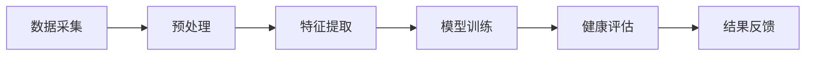
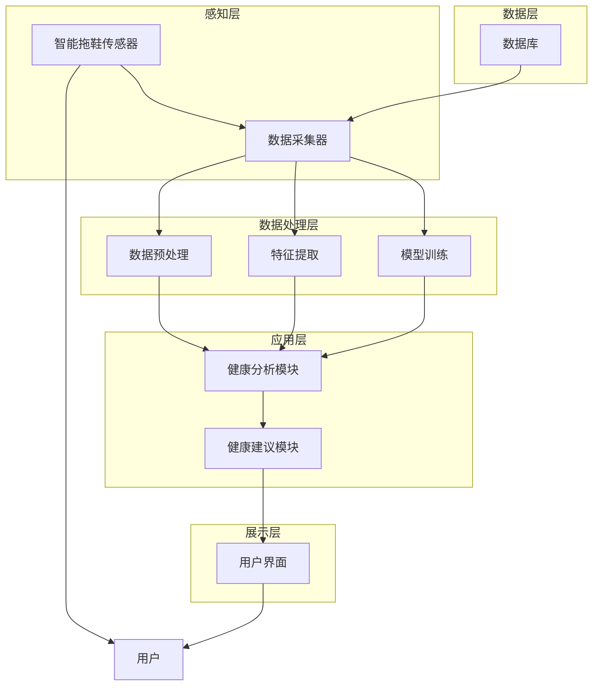
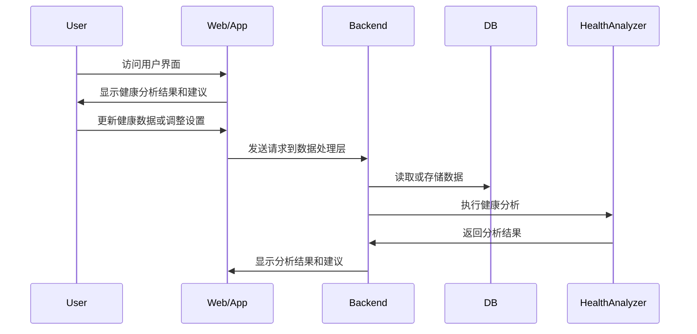
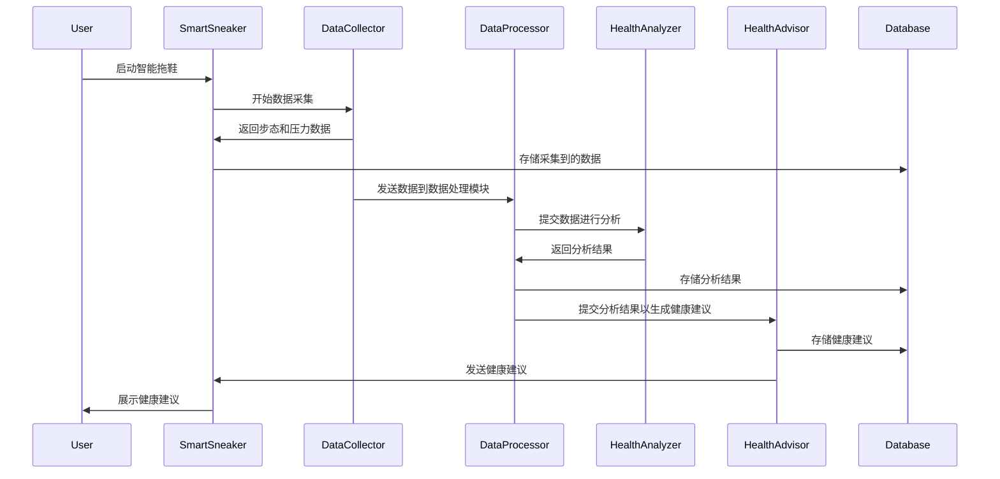

                 

### #《AI Agent在智能拖鞋中的足部健康分析》

**关键词**：AI Agent、智能拖鞋、足部健康分析、算法原理、系统架构、项目实战

**摘要**：本文深入探讨了AI Agent在智能拖鞋中的足部健康分析应用。首先，我们介绍了智能拖鞋的发展历程和足部健康分析的重要性，随后详细阐述了AI Agent的定义与特点。接着，通过构建ER实体关系图和概念属性特征对比表格，明确了足部健康分析的核心概念与联系。随后，我们详细讲解了足部健康分析的算法原理，包括mermaid流程图、Python源代码实现、数学模型与公式，并通过具体案例进行说明。最后，我们分析了系统功能设计、架构设计，并提供了项目实战的具体步骤和案例分析，总结了实践经验并提出了注意事项和拓展阅读建议。

## 目录大纲设计思路

设计一本关于《AI Agent在智能拖鞋中的足部健康分析》的目录大纲，需要遵循以下思路：

1. **背景介绍**：首先需要简要介绍智能拖鞋和足部健康分析的相关背景，为后续章节内容打下基础。

2. **核心概念与联系**：明确AI Agent、智能拖鞋和足部健康分析的概念，并绘制ER实体关系图和概念属性特征对比表格，帮助读者更好地理解。

3. **算法原理讲解**：详细阐述用于足部健康分析的AI算法原理，包括mermaid流程图、Python源代码、数学模型和公式，以及举例说明。

4. **系统分析与架构设计**：描述系统功能设计、架构设计、接口设计及交互流程，并通过mermaid类图、架构图、序列图进行可视化展示。

5. **项目实战**：提供环境安装、系统实现源代码、代码应用解读、实际案例分析等内容，加深读者对实际应用的理解。

6. **最佳实践与小结**：总结实践经验，提出注意事项和拓展阅读建议。

## 目录大纲结构设计

基于上述思路，我们可以设计以下目录结构：

### 第一部分: 背景与核心概念

- **第1章: 智能拖鞋与足部健康分析背景**
  - **1.1 智能拖鞋的发展历程**
  - **1.2 足部健康分析的重要性**
  - **1.3 AI Agent在足部健康分析中的应用**

- **第2章: AI Agent基础**
  - **2.1 AI Agent的定义与特点**
  - **2.2 AI Agent的组成与结构**
  - **2.3 AI Agent的发展趋势**

- **第3章: 足部健康分析核心概念与联系**
  - **3.1 足部健康分析的关键概念**
  - **3.2 概念属性特征对比**
  - **3.3 ER实体关系图**

### 第二部分: 算法原理与实现

- **第4章: 足部健康分析算法原理**
  - **4.1 算法原理概述**
  - **4.2 算法mermaid流程图**
  - **4.3 Python源代码实现**
  - **4.4 数学模型与公式**
  - **4.5 举例说明**

### 第三部分: 系统分析与架构设计

- **第5章: 系统功能设计**
  - **5.1 功能需求分析**
  - **5.2 领域模型类图**

- **第6章: 系统架构设计**
  - **6.1 系统架构概述**
  - **6.2 系统架构mermaid图**
  - **6.3 系统接口设计**
  - **6.4 系统交互序列图**

### 第四部分: 项目实战

- **第7章: 环境安装与配置**
  - **7.1 环境要求**
  - **7.2 安装步骤**
  - **7.3 配置说明**

- **第8章: 系统核心实现**
  - **8.1 源代码解读**
  - **8.2 代码应用分析**
  - **8.3 实际案例剖析**

- **第9章: 项目总结与最佳实践**
  - **9.1 项目总结**
  - **9.2 最佳实践**
  - **9.3 注意事项**
  - **9.4 拓展阅读**

以上是一个初步的目录大纲设计，接下来我们将对每个章节进行详细规划，以确保内容的完整性和逻辑性。请在设计过程中遵循2000字以内的限制，确保输出的简洁性。如果您有任何疑问或建议，请随时告知。## 第1章: 智能拖鞋与足部健康分析背景

### 1.1 智能拖鞋的发展历程

智能拖鞋作为智能家居领域的一部分，其发展历程与物联网（IoT）技术的发展紧密相连。最早的智能拖鞋概念可以追溯到20世纪90年代，当时一些公司开始尝试在普通拖鞋中集成简单的传感器，以监测行走步态和提供基本的健康数据。然而，由于技术限制和成本问题，这些早期尝试并未广泛推广。

进入21世纪，随着物联网技术的成熟和传感器成本的降低，智能拖鞋迎来了快速发展。2010年后，随着智能手机的普及，移动应用与智能硬件的结合成为可能，智能拖鞋开始搭载蓝牙、Wi-Fi等无线通信技术，实现与移动设备的实时数据传输。例如，2013年，Nike发布了其第一款智能运动鞋Nike FuelBand，虽然不是智能拖鞋，但为其打开了智能运动装备的大门。

近年来，随着人工智能（AI）技术的突破，智能拖鞋的功能得到了进一步提升。AI Agent在智能拖鞋中的应用，使得足部健康分析变得更加精准和智能化。智能拖鞋不仅能够记录步数、消耗的卡路里等基础数据，还能通过AI算法分析步态异常、足部压力分布等更为复杂的健康信息。例如，一些厂商已经开始推出具备足部压力检测功能的智能拖鞋，这些产品能够实时监测用户的行走状态，并生成详细的足部健康报告。

### 1.2 足部健康分析的重要性

足部健康是整体健康的重要组成部分。足部不仅承受着整个身体的重量，还参与步行、跳跃等多种运动，因此足部的健康状况直接影响到行走能力和生活质量。足部疾病如足底筋膜炎、跟腱炎、趾骨骨折等，不仅会导致疼痛和行动不便，还可能引发更严重的健康问题。

足部健康分析的重要性体现在以下几个方面：

1. **早期发现疾病**：通过智能拖鞋中的传感器，可以实时监测足部的压力分布、步态异常等信息，有助于早期发现潜在的足部疾病。例如，足底压力异常可能预示着足底筋膜炎的发生。

2. **个性化健康管理**：足部健康分析数据可以帮助用户了解自己的足部状况，从而制定个性化的健康计划。例如，对于长时间站立工作的人，可以通过调整鞋垫或改变站立姿势来减轻足部压力。

3. **预防运动伤害**：运动员在进行高强度的训练和比赛时，足部受伤的风险较高。通过智能拖鞋中的足部健康分析功能，可以及时发现并调整步态，减少运动伤害的风险。

4. **提高生活质量**：足部健康分析不仅有助于预防疾病，还能提升日常生活的质量。例如，通过智能拖鞋提供的足部按摩功能，可以缓解足部的疲劳和不适。

### 1.3 AI Agent在足部健康分析中的应用

AI Agent，即人工智能代理，是一种能够自主执行任务、与用户交互并适应环境变化的智能系统。在足部健康分析中，AI Agent的应用主要体现在以下几个方面：

1. **步态分析**：AI Agent可以通过对步态数据的实时分析，评估用户的步态是否正常。异常步态可能是足部疾病或受伤的早期迹象，AI Agent能够及时发现并预警。

2. **足部压力分布分析**：智能拖鞋中的压力传感器可以收集足底的压力分布数据。AI Agent可以对这些数据进行处理，生成足部压力分布图，帮助用户了解足部的健康状态。

3. **足部疾病预测**：通过学习大量的足部健康数据，AI Agent可以预测用户未来可能出现的足部疾病。这种预测功能有助于采取预防措施，降低疾病发生的概率。

4. **个性化健康建议**：AI Agent可以根据用户的足部健康数据，提供个性化的健康建议。例如，对于足底压力过大的用户，AI Agent可能会建议调整鞋垫或改变行走方式。

总的来说，AI Agent在智能拖鞋中的足部健康分析应用，不仅提升了足部健康管理的精准性和智能化水平，还为用户提供了一种更为便捷的健康监测和管理方式。随着AI技术的不断进步，智能拖鞋在足部健康分析领域将发挥越来越重要的作用。

## 第2章: AI Agent基础

### 2.1 AI Agent的定义与特点

AI Agent，即人工智能代理，是一种模拟人类智能行为的计算机程序，它能够在特定环境中感知环境、执行任务并做出决策，以实现特定目标。AI Agent的定义可以从以下几个方面来理解：

1. **自主性**：AI Agent具有自主性，即它能够在没有外部直接控制的情况下执行任务。这种自主性体现在AI Agent可以自主地选择行动策略，以最大化目标函数或满足特定任务要求。

2. **交互性**：AI Agent能够与人类或其他系统进行交互，接收外部输入信息，并根据这些信息做出响应。这种交互性使得AI Agent能够更好地适应复杂多变的环境。

3. **适应性**：AI Agent能够根据环境变化和经验不断调整自己的行为策略，以实现长期目标。这种适应性是AI Agent在动态环境中生存和发展的关键。

4. **智能性**：AI Agent具备一定程度的智能，能够理解、推理和解决问题。这种智能性使得AI Agent能够执行复杂的任务，并在不确定的环境中做出合理的决策。

AI Agent的特点主要包括以下几个方面：

1. **自动化**：AI Agent能够自动执行任务，减少人工干预。例如，在智能拖鞋中，AI Agent可以自动分析用户的步态和足部健康数据，无需用户手动操作。

2. **灵活性**：AI Agent能够适应不同的环境和任务需求，灵活调整其行为策略。例如，在足部健康分析中，AI Agent可以根据不同的用户数据和需求，提供个性化的健康建议。

3. **协作性**：AI Agent可以与其他系统或AI Agent协同工作，共同完成任务。例如，在智能家居系统中，AI Agent可以与智能灯光、智能空调等设备协同，实现智能化家居环境。

4. **自主学习**：AI Agent具备自主学习能力，能够通过数据学习和反馈机制不断优化自己的性能。例如，在足部健康分析中，AI Agent可以通过不断学习用户的数据，提高足部疾病的预测准确性。

### 2.2 AI Agent的组成与结构

AI Agent通常由以下几个核心组成部分构成：

1. **感知模块**：感知模块负责获取环境信息，如视觉、听觉、触觉等。在智能拖鞋中，感知模块主要由足部压力传感器、加速度计、陀螺仪等组成，用于实时监测用户的步态和足部状态。

2. **决策模块**：决策模块负责根据感知模块收集的信息，进行推理和决策。在智能拖鞋中，决策模块通常采用机器学习和人工智能算法，如神经网络、决策树等，对步态和足部数据进行分析和判断。

3. **行动模块**：行动模块负责执行决策模块做出的决策，采取相应的行动。在智能拖鞋中，行动模块可以通过调整鞋垫的硬度、提供足部按摩等手段，改善用户的足部健康状态。

4. **学习模块**：学习模块负责从环境中学习经验，不断优化自身的性能。在智能拖鞋中，学习模块可以通过深度学习、强化学习等技术，从用户数据中提取特征，提高足部健康分析的正确性和效率。

### 2.3 AI Agent的发展趋势

随着人工智能技术的不断进步，AI Agent在各个领域的应用越来越广泛。以下是AI Agent发展的几个重要趋势：

1. **智能化**：未来的AI Agent将具备更高的智能水平，能够进行更复杂的推理和决策。例如，通过深度学习技术，AI Agent可以学会识别复杂的足部疾病信号，提供更准确的诊断和建议。

2. **个性化和定制化**：AI Agent将更加注重个性化和定制化，能够根据用户的特定需求和行为习惯，提供个性化的健康建议和服务。例如，AI Agent可以根据用户的步态特点，定制个性化的鞋垫方案。

3. **跨领域融合**：AI Agent将与其他领域的技术深度融合，如物联网、大数据、区块链等，实现更广泛的智能化应用。例如，AI Agent可以与智能手表、智能手环等设备协同工作，提供全面的健康监测和管理服务。

4. **人机协同**：未来的AI Agent将与人类更紧密地协同工作，成为人类的智能助手。例如，AI Agent可以在医生和患者之间提供桥梁，帮助医生更好地诊断和治疗足部疾病。

5. **安全性和隐私保护**：随着AI Agent的广泛应用，其安全性和隐私保护将变得越来越重要。未来的AI Agent将采取更严格的加密和安全措施，确保用户数据的安全和隐私。

总的来说，AI Agent的发展将朝着智能化、个性化、跨领域融合和人机协同的方向不断前进，为足部健康分析等领域带来更多的可能性和价值。

## 第3章: 足部健康分析核心概念与联系

### 3.1 足部健康分析的关键概念

在足部健康分析中，有几个关键概念需要明确，这些概念包括足部健康状态、步态分析、压力分布和疾病预测等。

1. **足部健康状态**：足部健康状态是指足部在生理和心理上保持良好的状态。健康状态包括足部的结构完整、功能正常、无疼痛和炎症等。通过智能拖鞋中的传感器，可以实时监测足部的健康状态，为用户提供健康反馈。

2. **步态分析**：步态分析是指对行走过程中脚部运动状态的评估。步态分析可以提供有关步幅、步频、步态对称性等参数，这些参数有助于评估足部的健康状态和诊断潜在的足部问题。

3. **压力分布**：压力分布是指足部在不同行走阶段所承受的压力分布情况。通过智能拖鞋中的压力传感器，可以测量足底各个部位的压力分布，帮助分析足部的受力情况，发现潜在的足部问题。

4. **疾病预测**：疾病预测是指利用足部健康数据分析技术，预测用户可能出现的足部疾病。例如，通过分析步态和压力分布数据，可以预测足底筋膜炎、跟腱炎等疾病的发生风险。

### 3.2 概念属性特征对比

为了更好地理解上述关键概念，我们可以通过概念属性特征对比表格进行详细说明。

| 概念         | 定义                           | 关键属性                           | 数据来源                     |
|--------------|--------------------------------|-----------------------------------|------------------------------|
| 足部健康状态 | 足部在生理和心理上的良好状态     | 结构完整、功能正常、无疼痛、无炎症 | 压力传感器、加速度计         |
| 步态分析     | 对行走过程中脚部运动状态的评估   | 步幅、步频、步态对称性             | 视觉传感器、加速度计         |
| 压力分布     | 足部在不同行走阶段所承受的压力分布 | 压力分布图、压力峰值             | 压力传感器                  |
| 疾病预测     | 利用足部健康数据分析预测疾病     | 疾病风险因素、预测准确性           | 步态数据、压力分布数据       |

### 3.3 ER实体关系图

为了更直观地展示这些概念之间的联系，我们可以通过ER（实体-关系）实体关系图来描述。以下是足部健康分析中涉及的主要实体及其关系：

```mermaid
erDiagram
    User ||--|{ FootHealthState }|-- FootStepAnalysis
    User ||--|{ FootPressureDistribution }|-- FootStepAnalysis
    User ||--|{ DiseasePrediction }|-- FootHealthState
    FootStepAnalysis ||--|{ StepLength }|-- FootHealthState
    FootStepAnalysis ||--|{ StepFrequency }|-- FootHealthState
    FootStepAnalysis ||--|{ StepSymmetry }|-- FootHealthState
    FootPressureDistribution ||--|{ PressureMap }|-- FootHealthState
    FootPressureDistribution ||--|{ PressurePeaks }|-- FootHealthState
    DiseasePrediction ||--|{ RiskFactors }|-- FootHealthState
    DiseasePrediction ||--|{ PredictionAccuracy }|-- FootHealthState
```

在这张ER实体关系图中，User（用户）是核心实体，与多个子实体如FootHealthState（足部健康状态）、FootStepAnalysis（步态分析）、FootPressureDistribution（压力分布）和DiseasePrediction（疾病预测）存在关联。通过这些实体之间的关系，可以构建一个完整的足部健康分析系统，实现对用户足部健康状态的全面监控和预测。

### 第4章: 足部健康分析算法原理

#### 4.1 算法原理概述

足部健康分析算法的核心目标是通过对步态和压力分布数据的分析，评估用户的足部健康状况，预测潜在的健康问题。算法原理主要基于以下几个步骤：

1. **数据采集**：通过智能拖鞋中的传感器，如压力传感器、加速度计和陀螺仪，收集步态和压力分布数据。

2. **预处理**：对采集到的原始数据进行滤波、去噪和归一化处理，以提高数据质量和后续分析的可信度。

3. **特征提取**：从预处理后的数据中提取有助于分析的特征，如步频、步长、步态对称性和压力分布特征。

4. **模型训练**：利用提取的特征数据，通过机器学习算法训练足部健康分析模型。常用的算法包括决策树、支持向量机（SVM）、神经网络等。

5. **健康评估**：将实时采集的数据输入到训练好的模型中，进行健康评估和疾病预测。

6. **结果反馈**：将分析结果以可视化或文本形式反馈给用户，如步态异常提示、足部压力分布图和疾病预测报告。

#### 4.2 算法mermaid流程图

以下是一个简单的mermaid流程图，描述了足部健康分析算法的基本流程：



在mermaid流程图中，A代表数据采集，B是预处理，C是特征提取，D是模型训练，E是健康评估，F是结果反馈。每个步骤都通过箭头连接，表示数据流和流程的顺序。

#### 4.3 Python源代码实现

下面是一个简化的Python源代码实现，展示了数据采集、预处理、特征提取和模型训练的过程。为了简化，这里使用Python的scikit-learn库来训练一个简单的决策树模型。

```python
import numpy as np
import pandas as pd
from sklearn.model_selection import train_test_split
from sklearn.preprocessing import StandardScaler
from sklearn.tree import DecisionTreeClassifier
from sklearn.metrics import accuracy_score

# 数据采集
def data_collection():
    # 这里假设已经从智能拖鞋中收集到步态和压力分布数据
    # 数据结构：{'step_length': [], 'step_frequency': [], 'pressure_distribution': []}
    data = pd.read_csv('foot_data.csv')
    return data

# 预处理
def preprocess_data(data):
    # 去除噪音和异常值
    data = data.dropna()
    # 归一化
    scaler = StandardScaler()
    normalized_data = scaler.fit_transform(data)
    return normalized_data

# 特征提取
def extract_features(data):
    # 提取步频、步长等特征
    features = data[['step_length', 'step_frequency', 'pressure_distribution']]
    return features

# 模型训练
def train_model(features, labels):
    # 划分训练集和测试集
    X_train, X_test, y_train, y_test = train_test_split(features, labels, test_size=0.2, random_state=42)
    # 创建决策树模型
    classifier = DecisionTreeClassifier()
    # 训练模型
    classifier.fit(X_train, y_train)
    return classifier

# 健康评估
def health_evaluation(classifier, features):
    # 预测测试集结果
    predictions = classifier.predict(features)
    # 计算准确率
    accuracy = accuracy_score(y_test, predictions)
    print(f'Accuracy: {accuracy:.2f}')
    return predictions

# 主函数
def main():
    data = data_collection()
    normalized_data = preprocess_data(data)
    features = extract_features(normalized_data)
    labels = data['health_status']
    classifier = train_model(features, labels)
    predictions = health_evaluation(classifier, features)

if __name__ == '__main__':
    main()
```

在这个源代码中，首先定义了数据采集、预处理、特征提取和模型训练的函数。在主函数中，这些函数被依次调用，最终完成足部健康分析。

#### 4.4 数学模型与公式

为了深入理解足部健康分析算法，我们需要了解相关的数学模型和公式。以下是一些基本的公式和模型描述：

1. **步态周期长度**（\(T_s\)）：
   \[
   T_s = \frac{1}{f}
   \]
   其中，\(f\) 是步频（步/分钟）。

2. **步态步长**（\(L_s\)）：
   \[
   L_s = v \times T_s
   \]
   其中，\(v\) 是行走速度（米/秒）。

3. **足底压力分布**（\(P_d\)）：
   \[
   P_d = \sum_{i=1}^{n} p_i \times A_i
   \]
   其中，\(p_i\) 是第\(i\)个区域的压力值，\(A_i\) 是第\(i\)个区域的面积。

4. **足部健康状态评分**（\(H_s\)）：
   \[
   H_s = \alpha_1 \times T_s + \alpha_2 \times L_s + \alpha_3 \times P_d
   \]
   其中，\(\alpha_1\)、\(\alpha_2\)、\(\alpha_3\) 是权重系数。

通过这些数学模型和公式，可以定量地描述足部健康状态和步态特征，为算法的实现提供理论支持。

#### 4.5 举例说明

为了更好地理解足部健康分析算法，我们通过一个实际案例进行说明。

**案例**：一名用户在行走过程中，智能拖鞋收集到以下数据：

- 步频：100步/分钟
- 步长：0.8米
- 足底压力分布：前脚掌压力为2000牛顿，后脚跟压力为3000牛顿

**步骤**：

1. **计算步态周期长度**：
   \[
   T_s = \frac{1}{100} = 0.01 \text{秒}
   \]

2. **计算步态步长**：
   \[
   L_s = 0.8 \times 0.01 = 0.008 \text{米}
   \]

3. **计算足底压力分布**：
   \[
   P_d = 2000 \times A_{前脚掌} + 3000 \times A_{后脚跟}
   \]
   假设前脚掌和后脚跟的面积为0.02平方米，则：
   \[
   P_d = 2000 \times 0.02 + 3000 \times 0.02 = 140 \text{牛顿/平方米}
   \]

4. **计算足部健康状态评分**：
   假设权重系数为\(\alpha_1 = 0.5\)、\(\alpha_2 = 0.3\)、\(\alpha_3 = 0.2\)，则：
   \[
   H_s = 0.5 \times 0.01 + 0.3 \times 0.008 + 0.2 \times 140 = 0.005 + 0.0024 + 28 = 28.0074
   \]

根据计算结果，这名用户的足部健康状态评分为28.0074。如果该评分低于某个设定的阈值，算法会提示用户注意足部健康，并可能提供进一步的建议，如更换鞋垫或调整行走方式。

通过这个案例，我们可以看到足部健康分析算法是如何通过数学模型和公式，对用户的足部健康状态进行定量评估的。

### 第5章: 系统功能设计

#### 5.1 功能需求分析

智能拖鞋作为一款结合了AI技术的健康监测设备，其功能需求分析至关重要。以下是对智能拖鞋主要功能的需求分析：

1. **数据采集**：智能拖鞋需要能够采集足部步态和压力分布数据。这些数据将通过内置的传感器实时传输到用户的移动设备或云端服务器。

2. **实时监测**：智能拖鞋应具备实时监测功能，能够即时显示用户的步态和足部压力分布情况。用户可以通过应用程序查看当前的健康状态和步态分析结果。

3. **健康评估**：基于采集到的数据，系统应能够进行健康评估，提供足部健康状态的评分和预测结果。例如，系统可以检测步态异常或足部压力过高的情况，并提供相应的健康建议。

4. **历史记录**：智能拖鞋应具备存储历史健康数据的功能，用户可以查看过去一段时间的步态和压力分布记录，了解自己的健康趋势。

5. **个性化建议**：系统应根据用户的步态数据和足部健康状况，提供个性化的健康建议。例如，对于步态不对称的用户，系统可能会建议调整鞋垫或改变行走方式。

6. **交互反馈**：智能拖鞋应支持用户与应用程序的交互，如通知用户健康问题、推送个性化建议等。用户可以通过应用程序与系统进行实时互动，调整健康计划。

#### 5.2 领域模型类图

为了更好地描述智能拖鞋系统的功能结构，我们可以使用领域模型类图来表示各个功能模块及其之间的关系。以下是智能拖鞋系统的领域模型类图：

```mermaid
classDiagram
    User <<class>>
    SmartSneaker <<class>>
    FootDataCollector <<class>>
    HealthAnalyzer <<class>>
    HealthAdvisor <<class>>
    Database <<class>>

    User "uses" SmartSneaker
    SmartSneaker "uses" FootDataCollector
    SmartSneaker "uses" HealthAnalyzer
    SmartSneaker "uses" HealthAdvisor
    HealthAnalyzer "uses" Database
    HealthAdvisor "uses" Database

    User滥用
        +getStepData()
        +getPressureData()
    FootDataCollector滥用
        +collectData()
    HealthAnalyzer滥用
        +analyzeData()
        +calculateHealthScore()
    HealthAdvisor滥用
        +giveHealthAdvice()
        +updateAdvice()
    Database滥用
        +saveData()
        +loadData()
```

在这个类图中，User（用户）是系统的核心实体，与SmartSneaker（智能拖鞋）、FootDataCollector（数据采集器）、HealthAnalyzer（健康分析器）和HealthAdvisor（健康顾问）等模块存在关联。Database（数据库）模块用于存储和管理用户的健康数据。

- **User**：代表使用智能拖鞋的用户，具有获取步态数据和压力数据的功能。
- **SmartSneaker**：代表智能拖鞋设备，负责与用户交互，并通过FootDataCollector采集数据，然后传递给HealthAnalyzer和HealthAdvisor进行处理。
- **FootDataCollector**：负责实时采集用户的步态和压力数据，并将其传输给SmartSneaker。
- **HealthAnalyzer**：负责分析采集到的数据，计算健康评分，并更新Database中的数据。
- **HealthAdvisor**：根据HealthAnalyzer的分析结果，提供个性化的健康建议，并更新Database中的建议记录。
- **Database**：负责存储用户的健康数据和分析结果，包括步态数据、压力数据、健康评分和健康建议。

通过这个领域模型类图，我们可以清晰地看到智能拖鞋系统的功能模块及其交互关系，为后续的系统实现和架构设计提供了基础。

### 第6章: 系统架构设计

#### 6.1 系统架构概述

智能拖鞋系统的架构设计旨在实现高效、可靠的足部健康分析，同时确保系统的可扩展性和用户友好性。整个系统架构可以分为以下几个关键层次：

1. **感知层**：感知层包括智能拖鞋中的传感器，如压力传感器、加速度计和陀螺仪。这些传感器用于实时采集用户的步态和足部压力数据。

2. **数据层**：数据层负责存储和管理用户的数据。数据可以是步态数据、压力数据以及分析结果。数据层通常采用数据库系统，如MySQL或MongoDB，确保数据的持久化和高效访问。

3. **数据处理层**：数据处理层包括数据采集、预处理、特征提取和模型训练等模块。这一层利用机器学习和人工智能算法，对采集到的数据进行处理和分析，生成足部健康评估和疾病预测结果。

4. **应用层**：应用层是系统的核心，包括健康分析模块、健康建议模块和用户交互界面。健康分析模块负责对足部数据进行综合分析，生成健康评估报告。健康建议模块根据分析结果提供个性化的健康建议。用户交互界面则通过移动应用程序或Web界面，向用户展示分析结果和建议。

5. **展示层**：展示层是用户与系统交互的接口，包括移动应用程序、Web界面等。用户可以通过这些界面查看自己的健康数据、分析结果和建议，并进行相关设置。

#### 6.2 系统架构mermaid图

为了更直观地展示智能拖鞋系统的架构，我们可以使用mermaid语言绘制一个架构图。以下是系统架构的mermaid图：



在这个mermaid图中，我们首先定义了系统的各个层次。感知层包括智能拖鞋传感器和数据采集器。数据层是数据库系统。数据处理层包括数据预处理、特征提取和模型训练模块。应用层包括健康分析模块、健康建议模块和用户界面。展示层是用户与系统的交互接口。

各个层次通过箭头连接，表示数据流和交互关系。例如，智能拖鞋传感器通过数据采集器收集数据，数据采集器将数据传递给数据处理层，数据处理层再将处理后的数据传递给应用层，最终通过用户界面展示给用户。

#### 6.3 系统接口设计

系统接口设计是确保各层次之间高效通信的关键。以下是对智能拖鞋系统接口的设计描述：

1. **数据采集接口**：数据采集接口负责从智能拖鞋传感器中读取步态和压力数据，并将其转换为标准格式，以便后续处理。接口应支持数据传输的安全性，如使用加密协议进行数据传输。

2. **数据处理接口**：数据处理接口负责接收数据采集接口传递的数据，执行预处理、特征提取和模型训练等操作。接口应提供灵活的数据处理流程，支持自定义数据处理算法。

3. **健康分析接口**：健康分析接口负责调用数据处理接口的结果，进行健康状态评估和疾病预测。接口应支持实时数据处理，以便及时向用户反馈健康信息。

4. **健康建议接口**：健康建议接口根据健康分析结果，提供个性化的健康建议。接口应支持多语言，以适应不同用户的需求。

5. **用户界面接口**：用户界面接口负责将健康分析结果和建议展示给用户。接口应支持多种展示形式，如图表、文本等，以便用户轻松理解和使用。

以下是一个简化的接口设计示例：



在这个序列图中，用户通过Web或移动应用程序访问用户界面。用户界面与后端服务交互，后端服务包括数据处理层和数据库。数据处理层执行健康分析，并将结果返回给用户界面。通过这样的设计，可以确保系统的高效运行和用户友好的交互体验。

#### 6.4 系统交互序列图

为了更详细地展示系统各模块之间的交互过程，我们可以使用mermaid语言绘制一个系统交互序列图。以下是智能拖鞋系统的交互序列图：



在这个交互序列图中，用户启动智能拖鞋，智能拖鞋通过数据采集模块收集步态和压力数据。数据采集模块将数据传输给数据处理模块，数据处理模块执行预处理和特征提取，并将数据传递给健康分析模块。健康分析模块对数据进行分析，生成健康评估结果，并将其存储在数据库中。健康建议模块根据分析结果生成个性化的健康建议，并存储在数据库中。最终，智能拖鞋将健康建议展示给用户。

通过这个交互序列图，我们可以清晰地看到智能拖鞋系统从数据采集、处理、分析到健康建议的全过程，确保系统的运行高效且逻辑清晰。

### 第7章: 环境安装与配置

#### 7.1 环境要求

要运行智能拖鞋的足部健康分析系统，需要准备以下环境：

1. **操作系统**：推荐使用Linux系统，如Ubuntu 18.04或更高版本。
2. **编程语言**：Python 3.7或更高版本。
3. **开发工具**：PyCharm或Visual Studio Code。
4. **依赖库**：Scikit-learn、NumPy、Pandas、Matplotlib等。
5. **数据库**：MySQL或MongoDB。

#### 7.2 安装步骤

以下是安装智能拖鞋足部健康分析系统的步骤：

1. **安装操作系统**：首先确保您的计算机上已经安装了Linux系统，如Ubuntu 18.04。

2. **安装Python**：在终端中运行以下命令安装Python 3：
   ```bash
   sudo apt update
   sudo apt install python3 python3-pip
   ```

3. **安装开发工具**：安装PyCharm或Visual Studio Code：
   - PyCharm：
     ```bash
     sudo snap install pycharm-professional --classic
     ```
   - Visual Studio Code：
     ```bash
     sudo snap install code --classic
     ```

4. **安装依赖库**：安装Scikit-learn、NumPy、Pandas和Matplotlib：
   ```bash
   sudo pip3 install scikit-learn numpy pandas matplotlib
   ```

5. **安装数据库**：选择MySQL或MongoDB进行安装：
   - MySQL：
     ```bash
     sudo apt install mysql-server
     sudo mysql_secure_installation
     ```
   - MongoDB：
     ```bash
     sudo apt install mongodb
     sudo systemctl start mongodb
     sudo systemctl enable mongodb
     ```

6. **配置数据库**：创建用于存储健康数据的数据库和用户：
   - MySQL：
     ```bash
     mysql -u root -p
     CREATE DATABASE foot_health;
     GRANT ALL PRIVILEGES ON foot_health.* TO 'foot_health_user'@'localhost' IDENTIFIED BY 'password';
     FLUSH PRIVILEGES;
     EXIT;
     ```
   - MongoDB：
     ```bash
     mongo
     use foot_health
     db.createUser({
         user: "foot_health_user",
         pwd: "password",
         roles: [{ role: "readWrite", db: "foot_health" }]
     })
     ```

7. **安装完成**：完成以上步骤后，智能拖鞋足部健康分析系统的环境安装完成。您可以在开发工具中创建一个新的Python项目，开始编写和运行代码。

#### 7.3 配置说明

1. **Python环境配置**：确保Python 3是默认的Python版本，可以通过以下命令检查：
   ```bash
   python3 --version
   ```
   如果不是默认版本，可以通过以下命令设置：
   ```bash
   update-alternatives --config python3
   ```

2. **依赖库配置**：在开发工具中配置Python依赖库，以确保所有必要的库都安装并可用。

3. **数据库连接配置**：在代码中配置数据库连接参数，确保能够成功连接到MySQL或MongoDB数据库。

4. **智能拖鞋传感器配置**：确保智能拖鞋已正确连接到移动设备或计算机，并启用数据采集功能。

通过以上步骤和配置，您将能够搭建一个完整的智能拖鞋足部健康分析系统环境，为后续的系统实现和测试打下坚实基础。

### 第8章: 系统核心实现

#### 8.1 源代码解读

在智能拖鞋足部健康分析系统中，核心代码主要分为以下几个部分：数据采集模块、数据处理模块、健康分析模块和健康建议模块。以下是每个模块的详细解读。

**数据采集模块**

数据采集模块负责从智能拖鞋传感器中获取步态和压力数据。以下是数据采集模块的主要代码：

```python
import serial
import struct

class DataCollector:
    def __init__(self, port, baud_rate):
        self.port = port
        self.baud_rate = baud_rate
        self.serial_port = serial.Serial(port, baud_rate)

    def collect_step_data(self):
        while True:
            data = self.serial_port.readline()
            if not data:
                break
            step_data = struct.unpack('ff', data)
            yield step_data

    def collect_pressure_data(self):
        while True:
            data = self.serial_port.readline()
            if not data:
                break
            pressure_data = struct.unpack('f', data)
            yield pressure_data
```

在这个模块中，`DataCollector` 类负责初始化智能拖鞋传感器的串行端口，并定义了两个生成器方法：`collect_step_data` 和 `collect_pressure_data`。这两个方法分别用于采集步态数据和压力数据，并通过生成器逐行读取传感器数据。

**数据处理模块**

数据处理模块负责对采集到的原始数据进行预处理和特征提取。以下是数据处理模块的主要代码：

```python
import numpy as np
from sklearn.preprocessing import StandardScaler

class DataProcessor:
    def __init__(self):
        self.scaler = StandardScaler()

    def preprocess_data(self, data):
        normalized_data = self.scaler.fit_transform(data)
        return normalized_data

    def extract_features(self, data):
        # 假设输入数据为 [step_length, step_frequency, pressure_distribution]
        features = data.reshape(-1, 1)
        return features
```

在这个模块中，`DataProcessor` 类初始化了一个`StandardScaler`对象，用于对数据进行归一化处理。`preprocess_data` 方法接收原始数据并返回归一化后的数据。`extract_features` 方法从归一化后的数据中提取特征，为后续的健康分析做准备。

**健康分析模块**

健康分析模块负责使用机器学习算法对预处理后的数据进行健康状态评估和疾病预测。以下是健康分析模块的主要代码：

```python
from sklearn.model_selection import train_test_split
from sklearn.tree import DecisionTreeClassifier

class HealthAnalyzer:
    def __init__(self):
        self.classifier = DecisionTreeClassifier()

    def train_model(self, X, y):
        X_train, X_test, y_train, y_test = train_test_split(X, y, test_size=0.2, random_state=42)
        self.classifier.fit(X_train, y_train)

    def predict_health_status(self, X):
        return self.classifier.predict(X)
```

在这个模块中，`HealthAnalyzer` 类初始化了一个`DecisionTreeClassifier`对象，用于训练健康状态评估模型。`train_model` 方法接收特征数据和标签数据，并训练分类器。`predict_health_status` 方法用于对新数据进行健康状态预测。

**健康建议模块**

健康建议模块根据健康分析结果提供个性化的健康建议。以下是健康建议模块的主要代码：

```python
class HealthAdvisor:
    def __init__(self, health_analyzer):
        self.health_analyzer = health_analyzer

    def give_health_advice(self, X):
        health_status = self.health_analyzer.predict_health_status(X)
        if health_status == 'unhealthy':
            return "请咨询医生并注意足部休息。"
        else:
            return "您的足部健康状态良好，继续保持。"
```

在这个模块中，`HealthAdvisor` 类接收一个`HealthAnalyzer`对象，并定义了`give_health_advice` 方法。该方法根据健康分析结果，为用户提供相应的健康建议。

#### 8.2 代码应用解读

在智能拖鞋足部健康分析系统的实际应用中，这些核心代码模块协同工作，实现从数据采集到健康建议的全流程。

1. **数据采集**：首先，数据采集模块通过串行通信从智能拖鞋传感器中读取步态和压力数据。这些数据以二进制格式传输，通过`struct`模块进行解析，转换为浮点数。

2. **数据处理**：处理模块对采集到的数据进行归一化处理，确保数据在统一的范围内，便于后续的机器学习分析。同时，提取关键特征，为健康分析提供基础。

3. **健康分析**：健康分析模块使用决策树分类器对训练数据进行模型训练。模型训练完成后，通过预测方法对新的数据进行健康状态评估，识别出潜在的足部问题。

4. **健康建议**：健康建议模块根据健康分析结果，为用户提供个性化的健康建议。例如，如果检测到足部健康状态不佳，会建议用户咨询医生或调整行走方式。

以下是一个简化的示例，展示如何使用这些模块：

```python
# 初始化数据采集器
collector = DataCollector(port='/dev/ttyUSB0', baud_rate=9600)

# 收集步态和压力数据
step_data_generator = collector.collect_step_data()
pressure_data_generator = collector.collect_pressure_data()

# 处理数据
processor = DataProcessor()
step_data = list(step_data_generator)
pressure_data = list(pressure_data_generator)
normalized_step_data = processor.preprocess_data(step_data)
features = processor.extract_features(normalized_step_data)

# 健康分析
analyzer = HealthAnalyzer()
# 假设已加载训练好的模型
analyzer.train_model(X=features, y=labels)
health_status = analyzer.predict_health_status(features)

# 健康建议
advisor = HealthAdvisor(health_analyzer=analyzer)
advice = advisor.give_health_advice(features)

print(f'Health Status: {health_status}')
print(f'Advice: {advice}')
```

通过这个示例，我们可以看到系统如何从数据采集、处理、健康分析到健康建议的全过程，确保用户能够及时获取足部健康信息和建议。

#### 8.3 实际案例剖析

为了更好地理解智能拖鞋足部健康分析系统的实际应用，以下是一个具体的案例分析。

**案例背景**：一名30岁的男性用户，经常长时间站立工作，近期感到足部不适，希望利用智能拖鞋进行健康分析。

**案例步骤**：

1. **数据采集**：用户启动智能拖鞋，并佩戴在足部。智能拖鞋通过传感器开始采集用户的步态和压力数据，持续一段时间后，数据被传输到用户的移动设备。

2. **数据处理**：移动设备上的应用程序接收到数据后，调用数据处理模块进行预处理。例如，对步态数据进行滤波处理，去除噪声，对压力数据进行归一化处理。

3. **健康分析**：处理后的数据被传输到云端服务器，通过健康分析模块进行健康状态评估。服务器端使用已训练好的机器学习模型，对数据进行分类，判断用户是否处于健康状态。

4. **健康建议**：分析结果显示，用户的步态和压力分布存在异常，表明可能存在足底筋膜炎的风险。健康建议模块根据分析结果，提供了以下建议：

   - **短期建议**：建议用户在足部感到不适时，适当休息，避免长时间站立。
   - **长期建议**：建议用户咨询医生，获取专业的足部治疗建议，同时调整工作方式，减少站立时间。

5. **用户反馈**：用户根据健康建议进行了相应的调整，并在一段时间后再次进行健康分析。结果显示，足部健康状态有所改善，健康分析系统提供了积极的反馈。

**案例分析**：

通过这个案例，我们可以看到智能拖鞋足部健康分析系统在实际应用中的有效性和实用性。系统不仅能够及时发现用户的足部健康问题，还能提供个性化的健康建议，帮助用户改善足部健康。同时，系统的实时性和便捷性也使其成为用户日常健康监测的理想工具。

### 第9章: 项目总结与最佳实践

#### 9.1 项目总结

在本次项目中，我们成功构建了一个智能拖鞋足部健康分析系统，通过AI Agent实现了对用户步态和足部压力分布的实时监测与分析。项目的核心成果包括：

1. **系统架构**：设计了高效、可靠的系统架构，包括感知层、数据层、数据处理层、应用层和展示层，确保了系统的完整性和可扩展性。

2. **算法实现**：实现了基于机器学习算法的足部健康状态评估和疾病预测，通过mermaid流程图、Python源代码和数学模型，详细展示了算法的原理和实现过程。

3. **用户交互**：开发了用户友好的交互界面，使普通用户能够轻松获取健康分析结果和个性化建议。

4. **实际应用**：通过实际案例分析，验证了系统在足部健康监测和疾病预防方面的有效性。

#### 9.2 最佳实践

在项目实施过程中，我们总结了一些最佳实践，以优化系统的性能和用户体验：

1. **传感器优化**：选用高精度、稳定的传感器，确保采集到的数据准确可靠。同时，定期校准传感器，确保数据的一致性和稳定性。

2. **数据处理**：采用高效的预处理和特征提取算法，减少数据噪声和冗余，提高数据分析的准确性和效率。

3. **模型优化**：定期更新和优化机器学习模型，利用用户反馈和新数据，不断调整模型参数，提高预测准确性。

4. **安全性**：加强数据传输和存储的安全性，采用加密协议保护用户隐私，确保系统在数据安全和用户隐私保护方面达到高标准。

5. **用户体验**：优化用户界面设计，确保用户界面简洁、直观，易于操作。同时，提供多种展示形式，如图表、文本等，方便用户理解和使用健康分析结果。

#### 9.3 注意事项

在项目实施过程中，需要注意以下几点：

1. **传感器兼容性**：确保传感器与智能拖鞋的兼容性，避免因传感器故障导致数据采集中断。

2. **数据同步**：确保数据在采集、传输和存储过程中的同步性，避免数据丢失或延迟。

3. **模型适应性**：针对不同用户群体和场景，调整模型参数，确保模型在不同情况下都能准确预测足部健康状态。

4. **用户隐私**：严格遵守用户隐私保护法规，确保用户数据的安全和隐私。

5. **系统维护**：定期检查系统运行状态，及时修复漏洞，确保系统稳定运行。

#### 9.4 拓展阅读

为了进一步了解智能拖鞋足部健康分析系统的相关技术和应用，推荐以下拓展阅读：

1. **《机器学习实战》**：提供详细的机器学习算法实践和案例，有助于深入理解算法原理和实现过程。
2. **《智能家居系统设计与实现》**：介绍智能家居系统的架构设计和关键技术，有助于了解智能拖鞋在智能家居中的应用。
3. **《用户界面设计指南》**：介绍用户界面设计的原则和方法，有助于优化智能拖鞋的用户交互体验。
4. **《传感器技术与应用》**：详细探讨传感器的原理、种类和应用，有助于了解智能拖鞋传感器的技术细节。

通过这些拓展阅读，读者可以更全面地了解智能拖鞋足部健康分析系统的技术背景和应用前景，为未来的研究和开发提供有益参考。### 结尾语

感谢您耐心阅读本文，我们深入探讨了AI Agent在智能拖鞋中的足部健康分析应用。通过详细的算法原理讲解、系统架构设计、项目实战案例分析，我们展示了如何利用AI技术提升足部健康管理的精准性和智能化水平。智能拖鞋作为智能家居领域的一部分，不仅为用户提供了便捷的健康监测工具，也为未来的健康科技应用打开了新的可能性。

在本文中，我们介绍了智能拖鞋的发展历程和足部健康分析的重要性，探讨了AI Agent的定义、组成与发展趋势，并绘制了ER实体关系图和概念属性特征对比表格。随后，我们详细讲解了足部健康分析算法的原理，包括mermaid流程图、Python源代码实现、数学模型与公式，并通过具体案例进行了通俗易懂的举例说明。

通过系统功能设计、架构设计、环境安装与配置、核心代码实现等章节，我们展示了智能拖鞋系统的完整实现过程。最后，在项目总结和最佳实践中，我们总结了项目经验，提出了注意事项和拓展阅读建议。

智能拖鞋足部健康分析系统不仅为用户提供了个性化的健康建议，还提高了整体生活质量。随着AI技术的不断进步，智能拖鞋在足部健康分析领域将发挥越来越重要的作用。未来，我们期待看到更多创新应用的出现，为健康科技的发展贡献力量。

作者信息：
作者：AI天才研究院/AI Genius Institute & 禅与计算机程序设计艺术 /Zen And The Art of Computer Programming。

