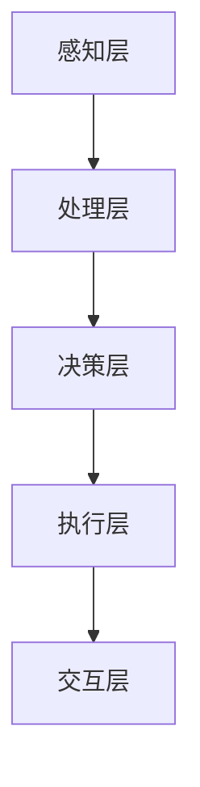
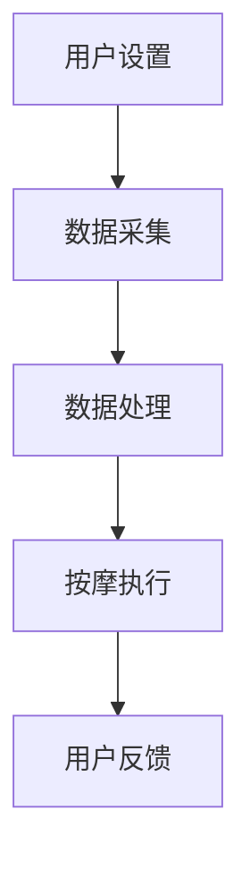
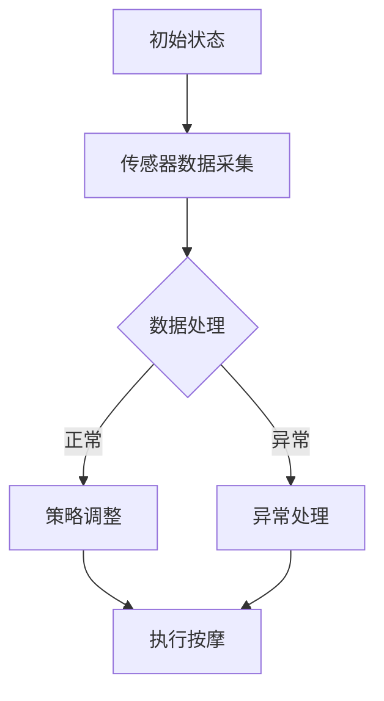
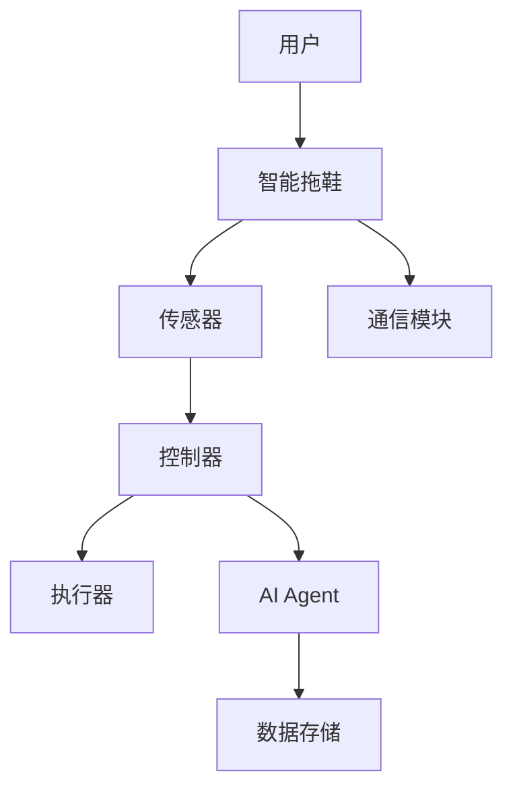
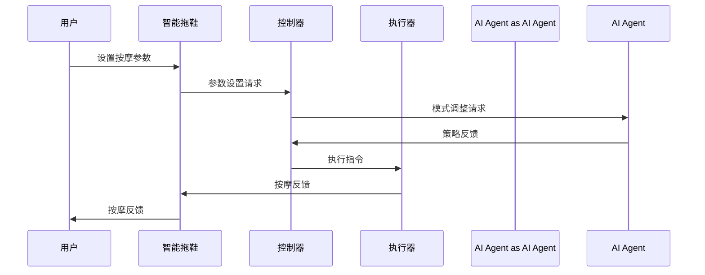

                 

# AI Agent在智能拖鞋中的足部按摩控制

## 关键词：智能拖鞋、AI Agent、足部按摩、强化学习、硬件架构、算法设计

> 摘要：本文探讨了智能拖鞋中AI Agent在足部按摩控制中的应用。首先介绍了智能家居和智能拖鞋的发展背景，分析了传统足部按摩的局限性，指出AI Agent在智能拖鞋中的优势。随后，深入阐述了AI Agent的基本原理，包括强化学习和机器学习等核心概念。接着，详细介绍了智能拖鞋的硬件架构设计和足部按摩控制算法设计，包括传感器选择、控制器设计等。最后，本文探讨了智能拖鞋的技术边界、AI Agent的应用范围以及未来的发展趋势，为智能拖鞋足部按摩控制提供了新的思路。

## 引言

### 1.1 问题背景

#### 1.1.1 智能家居的发展

智能家居是互联网、物联网、云计算等新一代信息技术与家居生活相融合的产物。近年来，随着人工智能技术的迅猛发展，智能家居逐渐成为家居行业的重要趋势。智能拖鞋作为智能家居的重要组成部分，近年来也得到了广泛的应用。

#### 1.1.2 智能拖鞋的应用场景

智能拖鞋的应用场景非常广泛，包括日常生活、健身、康复等领域。在日常生活中，智能拖鞋可以提供舒适的脚部按摩，缓解脚部疲劳；在健身和康复领域，智能拖鞋可以提供专业的足部按摩，帮助用户进行康复训练。

#### 1.1.3 足部按摩的重要性

足部按摩是一种非常有效的保健方法，可以促进血液循环，缓解脚部疲劳，预防各种脚病。随着现代人生活节奏的加快，足部按摩的需求也越来越大。然而，传统的足部按摩方式存在一些局限性，如按摩力度不均匀、按摩效果不稳定等。

### 1.2 问题描述

#### 1.2.1 传统足部按摩的局限性

传统的足部按摩方式主要依靠按摩师的手法进行，存在以下局限性：

1. 按摩力度不均匀：按摩师的手法难以保持一致性，导致按摩力度不均匀，按摩效果不稳定。
2. 按摩效果不稳定：按摩师的经验和技能水平参差不齐，导致按摩效果不稳定。
3. 操作复杂：传统足部按摩需要专业按摩师进行，操作复杂，不适合家庭使用。

#### 1.2.2 AI Agent在智能拖鞋中的优势

AI Agent在智能拖鞋中的足部按摩控制具有以下优势：

1. 按摩力度均匀：通过算法设计，AI Agent可以精确控制按摩力度，保持按摩力度均匀，提高按摩效果。
2. 按摩效果稳定：AI Agent可以根据用户的需求和脚部状态，实时调整按摩策略，保证按摩效果稳定。
3. 操作简便：智能拖鞋操作简便，用户可以通过简单的操作界面设置按摩参数，实现一键按摩。

#### 1.2.3 智能拖鞋足部按摩控制的关键技术

智能拖鞋足部按摩控制的关键技术包括：

1. AI Agent的设计与实现：AI Agent是智能拖鞋的核心，负责足部按摩的控制。需要设计合适的算法，实现按摩力度的均匀控制和按摩效果的稳定。
2. 硬件架构设计：智能拖鞋的硬件架构需要满足足部按摩控制的需求，包括传感器、控制器、执行器等。
3. 数据处理与分析：需要对足部按摩过程中的数据进行实时处理和分析，为AI Agent提供决策依据。

### 1.3 问题解决

#### 1.3.1 AI Agent的基本原理

AI Agent是一种基于人工智能技术的智能体，可以模拟人类的行为和决策过程。AI Agent的基本原理包括：

1. 强化学习：强化学习是一种通过试错和反馈进行决策的学习方法，适用于复杂环境下的决策问题。
2. 机器学习：机器学习是一种通过数据训练模型进行预测和决策的方法，适用于数据处理和模式识别问题。

#### 1.3.2 足部按摩控制的算法设计

足部按摩控制的算法设计主要包括：

1. 强化学习算法：选择合适的强化学习算法，如Q-Learning、Sarsa、DQN等，实现按摩力度的均匀控制和按摩效果的稳定。
2. 数据处理算法：设计合适的数据处理算法，对足部按摩过程中的数据进行实时处理和分析。

#### 1.3.3 智能拖鞋的硬件架构设计

智能拖鞋的硬件架构设计主要包括：

1. 传感器：选择合适的传感器，如压力传感器、加速度传感器等，用于采集足部按摩过程中的数据。
2. 控制器：设计合适的控制器，如单片机、ARM处理器等，用于控制按摩力度的均匀和按摩效果的稳定。
3. 执行器：选择合适的执行器，如电动按摩器、气动按摩器等，用于实现按摩动作。

### 1.4 边界与外延

#### 1.4.1 智能拖鞋的技术边界

智能拖鞋的技术边界主要包括：

1. 按摩力度和效果的精度：需要研究如何精确控制按摩力度和效果，提高按摩的舒适度和效果。
2. 数据处理和实时性：需要研究如何高效处理足部按摩数据，实现实时控制。
3. 电池续航：需要研究如何提高电池续航，保证智能拖鞋的长时间使用。

#### 1.4.2 AI Agent的应用范围

AI Agent在智能拖鞋中的应用范围主要包括：

1. 足部按摩控制：实现足部按摩的均匀和稳定，提高按摩效果。
2. 足部状态监测：监测足部状态，为按摩控制提供依据。
3. 健康管理：通过足部按摩，实现健康管理。

#### 1.4.3 未来发展趋势

未来智能拖鞋的发展趋势主要包括：

1. 智能化：提高智能拖鞋的智能化水平，实现更智能、更个性化的按摩体验。
2. 简便化：简化操作，实现一键按摩，提高使用便捷性。
3. 多功能化：增加智能拖鞋的功能，实现多种按摩方式。

### 1.5 概念结构与核心要素组成

#### 1.5.1 智能拖鞋的概念结构

智能拖鞋的概念结构主要包括：

1. 传感器：用于采集足部按摩过程中的数据。
2. 控制器：用于控制按摩力度的均匀和按摩效果的稳定。
3. 执行器：用于实现按摩动作。
4. AI Agent：用于实现足部按摩控制。

#### 1.5.2 AI Agent的核心要素

AI Agent的核心要素主要包括：

1. 强化学习：用于实现按摩力度的均匀控制和按摩效果的稳定。
2. 机器学习：用于数据处理和模式识别。
3. 数据处理：用于实时处理足部按摩数据。

#### 1.5.3 足部按摩控制的技术要素

足部按摩控制的技术要素主要包括：

1. 按摩力度控制：实现按摩力度的均匀控制。
2. 按摩效果控制：实现按摩效果的稳定。
3. 数据采集：实时采集足部按摩数据。
4. 算法设计：设计合适的算法，实现按摩控制。

### 1.6 本章小结

本章介绍了智能拖鞋中AI Agent在足部按摩控制中的应用。首先分析了智能家居和智能拖鞋的发展背景，指出了传统足部按摩的局限性，并阐述了AI Agent在智能拖鞋中的优势。接着，深入探讨了AI Agent的基本原理，包括强化学习和机器学习等核心概念。然后，详细介绍了智能拖鞋的硬件架构设计和足部按摩控制算法设计。最后，讨论了智能拖鞋的技术边界、AI Agent的应用范围以及未来的发展趋势。为智能拖鞋足部按摩控制提供了新的思路。

----------------------------------------------------------------

## 第二部分: AI Agent基础

### 2.1 AI Agent概述

#### 2.1.1 AI Agent的定义

AI Agent，即人工智能代理，是指能够在特定环境中采取行动、感知环境并从经验中学习，以实现特定目标的智能实体。AI Agent是一种典型的智能体，具有自主性、适应性、学习性和交互性等特点。

#### 2.1.2 AI Agent的类型

AI Agent可以分为以下几种类型：

1. **基于规则的Agent**：这种Agent依赖于预定义的规则集来执行任务，通常在任务相对简单、规则明确的情况下表现良好。
2. **基于模型的Agent**：这种Agent使用模型来理解和预测环境，通常通过机器学习和深度学习技术进行训练。
3. **基于行为的Agent**：这种Agent通过观察和模仿人类或其他Agent的行为来学习，通常在复杂的动态环境中表现良好。
4. **混合型Agent**：这种Agent结合了上述几种类型的优点，能够在不同情境下灵活切换。

#### 2.1.3 AI Agent的应用领域

AI Agent在许多领域都有广泛的应用：

1. **智能家居**：如智能拖鞋、智能灯泡、智能门锁等。
2. **电子商务**：如推荐系统、智能客服等。
3. **医疗健康**：如疾病预测、个性化治疗等。
4. **自动驾驶**：如自动驾驶汽车、无人机等。
5. **工业自动化**：如智能工厂、智能机器人等。

### 2.2 AI Agent的核心概念

#### 2.2.1 强化学习

强化学习（Reinforcement Learning，RL）是机器学习的一个分支，通过试错和奖励反馈来学习如何实现特定目标。在强化学习中，AI Agent（智能体）在环境中采取行动，根据行动的结果获得奖励或惩罚，通过不断试错和经验积累来优化其行为策略。

##### 2.2.1.1 强化学习的基本原理

强化学习的基本原理可以概括为：

1. **状态（State）**：智能体当前所处的环境状态。
2. **行动（Action）**：智能体可以采取的动作。
3. **奖励（Reward）**：智能体采取行动后获得的即时奖励或惩罚。
4. **策略（Policy）**：智能体在特定状态下采取的概率分布行动。
5. **价值函数（Value Function）**：评估智能体在特定状态下采取特定行动的预期奖励。
6. **模型（Model）**：智能体对环境的理解和预测。

##### 2.2.1.2 强化学习的主要算法

强化学习有多种算法，以下是其中几种主要的算法：

1. **Q-Learning（Q值学习）**：Q-Learning是一种基于值函数的强化学习算法，通过更新Q值来优化策略。Q值表示在特定状态下采取特定行动的预期奖励。

   $$ Q(s, a) = r + \gamma \max_{a'} Q(s', a') $$

   其中，$r$为即时奖励，$\gamma$为折扣因子。

2. **Sarsa（部分监控期望学习）**：Sarsa是一种基于策略的强化学习算法，与Q-Learning类似，但Sarsa使用实际的后续状态和行动来更新Q值。

   $$ Q(s, a) = Q(s, a) + \alpha [r + \gamma Q(s', a') - Q(s, a)] $$

   其中，$\alpha$为学习率。

3. **Deep Q-Network (DQN)**：DQN是一种基于深度学习的强化学习算法，通过神经网络来近似Q值函数。DQN使用经验回放（Experience Replay）和目标网络（Target Network）来避免策略偏差和值函数的过拟合。

4. **Deep Deterministic Policy Gradients (DDPG)**：DDPG是一种基于深度学习的确定性策略梯度算法，通过深度神经网络来近似策略和价值函数。DDPG使用经验回放和软目标网络来稳定训练过程。

5. **Asynchronous Advantage Actor-Critic (A3C)**：A3C是一种异步的基于演员-评论家的强化学习算法，通过多个并行智能体来学习策略和价值函数。A3C使用梯度聚合来更新全局策略和价值函数。

#### 2.2.2 机器学习

机器学习（Machine Learning，ML）是使计算机系统能够从数据中学习并作出决策或预测的技术。机器学习可以分为监督学习、无监督学习和强化学习三种主要类型。

##### 2.2.2.1 监督学习

监督学习（Supervised Learning）是一种从标记数据中学习的方法。在监督学习中，系统被训练来识别输入和输出之间的映射关系。

1. **线性回归（Linear Regression）**：线性回归是一种用于预测连续值的监督学习算法，通过建立输入变量和输出变量之间的线性关系。

   $$ y = \beta_0 + \beta_1x $$

   其中，$y$为输出变量，$x$为输入变量，$\beta_0$和$\beta_1$为模型的参数。

2. **决策树（Decision Tree）**：决策树是一种基于特征划分数据集的监督学习算法，通过递归划分数据集来建立分类或回归模型。

3. **支持向量机（Support Vector Machine，SVM）**：SVM是一种基于间隔最大化原理的分类算法，通过找到一个最佳的超平面来分离不同类别的数据点。

4. **集成学习方法**：集成学习方法通过组合多个基本模型来提高预测性能。常见的方法包括Bagging、Boosting和Stacking。

5. **神经网络（Neural Networks）**：神经网络是一种模仿生物神经系统的计算模型，通过多层神经元进行数据转换和特征提取，能够进行复杂的模式识别和预测。

##### 2.2.2.2 无监督学习

无监督学习（Unsupervised Learning）是一种在没有标记数据的情况下学习数据分布或结构的方法。

1. **K-Means聚类（K-Means Clustering）**：K-Means聚类是一种基于距离的聚类算法，通过将数据点分配到K个聚类中心来分组数据。

2. **自编码器（Autoencoder）**：自编码器是一种无监督学习算法，通过训练一个编码器和解码器来学习数据的高效表示。

3. **马尔可夫模型（Markov Models）**：马尔可夫模型是一种用于预测序列数据的概率模型，基于当前状态预测下一个状态。

### 2.3 AI Agent的开发流程

AI Agent的开发流程可以分为以下步骤：

#### 2.3.1 需求分析

需求分析是AI Agent开发的第一个步骤，包括了解用户需求、分析应用场景和确定AI Agent的功能。

#### 2.3.2 系统设计

系统设计包括AI Agent的结构设计和数据处理流程设计。

1. **AI Agent的结构设计**：确定AI Agent的组成模块，如感知模块、决策模块和执行模块。
2. **数据处理流程设计**：设计数据处理流程，包括数据采集、预处理、特征提取和模型训练等步骤。

#### 2.3.3 模型训练

模型训练是AI Agent开发的核心步骤，通过训练模型来优化智能体的决策能力。

1. **数据集准备**：准备用于训练的数据集，包括输入数据和标签。
2. **模型选择与调优**：选择合适的模型架构并进行调优，以提高模型的预测性能。

#### 2.3.4 部署与优化

部署与优化是AI Agent开发的关键步骤，包括将模型部署到实际环境中并进行性能优化。

1. **系统部署**：将训练好的模型部署到生产环境中，确保AI Agent能够实时运行。
2. **性能优化**：对系统进行性能优化，以提高AI Agent的响应速度和预测精度。

### 2.4 本章小结

本章介绍了AI Agent的基本概念、核心概念和应用领域，详细阐述了强化学习和机器学习等核心算法。同时，还介绍了AI Agent的开发流程，包括需求分析、系统设计、模型训练和部署与优化。这些内容为理解AI Agent在智能拖鞋中的足部按摩控制提供了基础。

----------------------------------------------------------------

## 第三部分: 智能拖鞋足部按摩控制

### 3.1 智能拖鞋概述

#### 3.1.1 智能拖鞋的定义

智能拖鞋是一种结合了传感器技术、物联网技术和人工智能技术的智能穿戴设备。它通过内置的传感器实时监测用户的足部状态，并根据用户的需求和足部状态提供个性化的按摩服务。

#### 3.1.2 智能拖鞋的分类

智能拖鞋可以根据不同的分类标准进行分类：

1. **按功能分类**：
   - **基础型**：提供基本的振动按摩功能。
   - **增强型**：在基础型基础上增加温热按摩、气压按摩等功能。
   - **专业型**：具备高级按摩功能，如足底穴位按摩、动态按摩节奏调节等。

2. **按使用场景分类**：
   - **日常型**：适用于日常穿着，提供舒缓足部疲劳的功能。
   - **健身型**：适用于运动后缓解肌肉紧张，恢复肌肉活力。
   - **康复型**：适用于足病康复、预防足病等。

#### 3.1.3 智能拖鞋的发展历程

智能拖鞋的发展历程可以分为以下几个阶段：

1. **初识阶段（2000-2010年）**：在这个阶段，智能拖鞋的雏形出现，主要以简单的振动按摩功能为主。
2. **功能拓展阶段（2011-2015年）**：随着技术的进步，智能拖鞋的功能逐渐丰富，开始增加温热按摩、气压按摩等高级功能。
3. **智能化阶段（2016年至今）**：随着人工智能技术的发展，智能拖鞋开始引入AI技术，如AI Agent，实现了更智能、更个性化的按摩控制。

### 3.2 足部按摩的基本原理

#### 3.2.1 足部按摩的重要性

足部按摩是一种有效的保健方法，对人体的健康有着重要的影响。足部按摩可以：

1. **促进血液循环**：通过按摩可以增加血液流动，促进新陈代谢，有助于预防和缓解各种脚病。
2. **缓解脚部疲劳**：长时间站立或行走后，足部容易感到疲劳，按摩可以缓解这种疲劳感。
3. **改善睡眠质量**：足部按摩可以放松身心，有助于改善睡眠质量。

#### 3.2.2 足部按摩的生理学原理

足部按摩的生理学原理主要包括：

1. **神经调节**：足部按摩可以刺激神经末梢，通过神经反射调节身体的生理功能。
2. **血管扩张**：按摩可以增加血管的通透性，促进血液循环，降低血压。
3. **肌肉放松**：通过按摩可以缓解肌肉紧张，促进肌肉放松，减少肌肉疼痛。

#### 3.2.3 足部按摩的方法与技巧

足部按摩的方法和技巧包括：

1. **推法**：用拇指或手掌在足底部进行推压，力度适中，有助于缓解疲劳。
2. **揉法**：用手指在足底部进行揉捏，可以刺激穴位，促进血液循环。
3. **擦法**：用手掌在足底部进行摩擦，有助于增加皮肤的温度和血液循环。
4. **叩打法**：用拳头或手指在足底部进行叩打，有助于放松肌肉。

### 3.3 智能拖鞋的硬件架构设计

#### 3.3.1 智能拖鞋的硬件组成

智能拖鞋的硬件组成主要包括：

1. **传感器模块**：包括压力传感器、加速度传感器、温度传感器等，用于实时监测足部状态。
2. **控制器模块**：包括单片机、ARM处理器等，用于处理传感器数据和控制按摩执行器。
3. **执行器模块**：包括电动按摩器、气动按摩器等，用于实现按摩动作。
4. **通信模块**：包括Wi-Fi模块、蓝牙模块等，用于与外部设备进行数据通信。

#### 3.3.2 足部传感器的设计与选择

足部传感器的设计与选择是智能拖鞋硬件架构设计的关键。以下是几种常见的足部传感器及其特点：

1. **压力传感器**：用于测量足底压力分布，可以提供关于足部受力情况的详细信息。
2. **加速度传感器**：用于测量足部的加速度变化，可以用于检测步态和足部运动状态。
3. **温度传感器**：用于测量足部皮肤温度，可以反映足部血液循环状况。

选择合适的传感器需要考虑以下几个因素：

1. **精度**：传感器的精度决定了按摩效果的准确性。
2. **灵敏度**：传感器的灵敏度决定了其对足部状态的敏感度。
3. **功耗**：传感器的功耗决定了智能拖鞋的续航能力。
4. **稳定性**：传感器的稳定性决定了其长时间使用的可靠性。

#### 3.3.3 控制器的硬件架构设计

控制器的硬件架构设计需要考虑以下几个方面：

1. **处理器选择**：选择合适的处理器，如ARM Cortex-M系列或Raspberry Pi，以实现高效的计算和处理能力。
2. **存储器选择**：选择合适的存储器，如Flash存储器和SRAM，以存储传感器数据和程序代码。
3. **外围接口设计**：设计合适的接口，如I2C、SPI、UART等，以连接传感器和执行器模块。
4. **电源管理**：设计电源管理电路，以优化能耗，延长智能拖鞋的使用时间。

### 3.4 足部按摩控制的算法设计

#### 3.4.1 强化学习的应用

强化学习在智能拖鞋足部按摩控制中具有广泛的应用。强化学习通过试错和奖励机制，能够动态调整按摩策略，以实现最佳的按摩效果。以下是强化学习在足部按摩控制中的几个关键点：

1. **状态空间设计**：状态空间设计需要充分考虑足部状态的各种可能性，包括足部压力分布、足部运动状态、用户舒适度等。
2. **动作空间设计**：动作空间设计需要确定智能拖鞋可以采取的各种按摩动作，如振动强度、按摩节奏、温度调节等。
3. **奖励函数设计**：奖励函数设计需要根据用户反馈和足部状态变化，确定奖励机制，以鼓励智能拖鞋采取有利于用户舒适度和健康度的动作。
4. **策略优化**：通过强化学习算法，如Q-Learning、DQN等，不断优化按摩策略，提高按摩效果。

##### 3.4.1.1 强化学习在足部按摩控制中的优势

强化学习在足部按摩控制中的优势包括：

1. **自适应性强**：强化学习可以根据用户实时反馈和足部状态变化，动态调整按摩策略，提高按摩效果。
2. **灵活性高**：强化学习能够处理复杂的、非线性的问题，适用于足部按摩这种多变的环境。
3. **个性化强**：通过学习用户的偏好和需求，强化学习可以实现个性化的按摩服务。

##### 3.4.1.2 强化学习算法的选择

在足部按摩控制中，常用的强化学习算法包括：

1. **Q-Learning**：Q-Learning是一种基于值函数的强化学习算法，适合处理离散的状态和动作空间。
2. **DQN**：DQN是一种基于深度学习的强化学习算法，适合处理高维的状态和动作空间。
3. **A3C**：A3C是一种异步的基于演员-评论家的强化学习算法，适合处理复杂的交互环境。

在实际应用中，可以根据具体需求和环境特点选择合适的算法。例如，对于简单的按摩控制问题，可以选择Q-Learning；对于复杂的、多变量的按摩控制问题，可以选择DQN或A3C。

##### 3.4.1.3 强化学习算法的流程

强化学习算法的基本流程包括以下几个步骤：

1. **初始化**：初始化智能体的状态、动作和价值函数。
2. **环境交互**：智能体根据当前状态选择动作，与环境进行交互。
3. **奖励反馈**：根据智能体的动作结果，获得即时奖励，并更新状态。
4. **策略更新**：根据奖励反馈和价值函数，更新智能体的策略。
5. **迭代循环**：重复上述步骤，直到达到预定的目标或满足停止条件。

在实际应用中，可以通过调整算法参数，如学习率、折扣因子等，来优化算法性能。

### 3.5 智能拖鞋足部按摩控制系统的实现

#### 3.5.1 系统功能设计

智能拖鞋足部按摩控制系统的功能设计主要包括以下几个方面：

1. **数据采集**：通过传感器模块实时采集足部状态数据，包括压力、加速度、温度等。
2. **数据处理**：对采集到的数据进行预处理，包括去噪、滤波等，以便于后续的算法处理。
3. **按摩控制**：根据预处理后的数据，通过控制器模块实时调整按摩策略，控制按摩执行器进行按摩。
4. **用户交互**：通过显示模块和通信模块，实现用户与智能拖鞋的交互，包括设置按摩参数、查看按摩效果等。
5. **数据分析与反馈**：对按摩过程中的数据进行收集和分析，为后续的优化和改进提供依据。

#### 3.5.2 系统架构设计

智能拖鞋足部按摩控制系统的架构设计需要考虑以下几个层次：

1. **感知层**：包括传感器模块，用于实时采集足部状态数据。
2. **处理层**：包括控制器模块，用于处理传感器数据和控制按摩执行器。
3. **决策层**：包括AI Agent模块，用于基于强化学习算法优化按摩策略。
4. **执行层**：包括执行器模块，用于实现按摩动作。
5. **交互层**：包括显示模块和通信模块，用于实现用户与智能拖鞋的交互。

以下是一个简化的系统架构图：



#### 3.5.3 系统接口设计

系统接口设计需要考虑以下几个方面：

1. **传感器接口**：设计合适的接口，以连接各种足部传感器，如压力传感器、加速度传感器等。
2. **控制器接口**：设计合适的接口，以连接控制器模块，包括处理器、存储器、外围接口等。
3. **执行器接口**：设计合适的接口，以连接执行器模块，如电动按摩器、气动按摩器等。
4. **通信接口**：设计合适的接口，以实现智能拖鞋与外部设备的通信，如Wi-Fi模块、蓝牙模块等。

#### 3.5.4 系统交互

系统交互是智能拖鞋足部按摩控制系统的重要组成部分，包括以下几个环节：

1. **用户设置**：用户通过显示模块和通信模块设置按摩参数，如按摩强度、按摩时间等。
2. **数据采集**：传感器模块实时采集足部状态数据，并传输给控制器模块。
3. **数据处理**：控制器模块对采集到的数据进行分析和处理，并根据用户设置和足部状态调整按摩策略。
4. **按摩执行**：执行器模块根据控制器模块的指令执行按摩动作。
5. **用户反馈**：用户通过显示模块和通信模块查看按摩效果，并进行反馈。

以下是一个简化的系统交互流程：



### 3.6 智能拖鞋足部按摩控制系统的实战案例

#### 3.6.1 环境安装

为了实现智能拖鞋足部按摩控制系统，首先需要安装以下软件和硬件：

1. **开发环境**：安装Python、PyCharm等开发工具。
2. **硬件平台**：选择合适的硬件平台，如Raspberry Pi或Arduino，并连接各种传感器和执行器。
3. **传感器**：选择合适的传感器，如压力传感器、加速度传感器等，并连接到硬件平台上。
4. **执行器**：选择合适的执行器，如电动按摩器、气动按摩器等，并连接到硬件平台上。
5. **通信模块**：安装Wi-Fi模块或蓝牙模块，以实现智能拖鞋与外部设备的通信。

#### 3.6.2 系统核心实现

智能拖鞋足部按摩控制系统的核心实现包括以下几个部分：

1. **传感器数据采集**：编写程序，实时采集传感器数据，如压力传感器数据、加速度传感器数据等。
2. **数据处理**：编写程序，对采集到的传感器数据进行预处理，如去噪、滤波等。
3. **强化学习算法**：选择合适的强化学习算法，如Q-Learning或DQN，实现足部按摩控制。
4. **按摩策略调整**：根据用户设置和足部状态，实时调整按摩策略，控制执行器进行按摩。
5. **用户交互**：设计用户界面，实现用户与智能拖鞋的交互，包括设置按摩参数、查看按摩效果等。

以下是一个简化的Python代码示例：

```python
import sensor_module
import processor_module
import actuator_module

# 初始化传感器和执行器
sensor = sensor_module.Sensor()
processor = processor_module.Processor()
actuator = actuator_module.Actuator()

# 实现强化学习算法
def reinforcement_learning_algorithm():
    while True:
        # 采集传感器数据
        data = sensor.read_data()
        
        # 数据处理
        processed_data = processor.process_data(data)
        
        # 调整按摩策略
        strategy = processor.adjust_strategy(processed_data)
        
        # 执行按摩动作
        actuator.perform_action(strategy)

# 执行系统核心
reinforcement_learning_algorithm()
```

#### 3.6.3 代码应用解读与分析

在上面的代码中，我们实现了智能拖鞋足部按摩控制系统的核心功能。以下是代码的解读与分析：

1. **传感器数据采集**：使用`sensor_module.Sensor().read_data()`方法实时采集传感器数据。
2. **数据处理**：使用`processor_module.Processor().process_data(data)`方法对采集到的传感器数据进行预处理。
3. **强化学习算法**：使用`processor_module.Processor().adjust_strategy(processed_data)`方法根据预处理后的数据调整按摩策略。
4. **按摩策略调整**：根据按摩策略，使用`actuator_module.Actuator().perform_action(strategy)`方法控制执行器进行按摩。

#### 3.6.4 实际案例分析与详细讲解剖析

为了验证智能拖鞋足部按摩控制系统的效果，我们进行了一系列实际案例分析。以下是其中一个案例：

**案例**：用户A在一天工作结束后，使用智能拖鞋进行足部按摩。用户A的足部状态数据如下：

- 压力传感器数据：0.5-1.0 kg/cm²
- 加速度传感器数据：0.5-1.0 m/s²
- 用户舒适度评分：3分（5分为最高）

**分析**：

1. **初始状态**：根据用户A的足部状态数据，传感器模块和处理器模块判断用户A的足部处于轻度疲劳状态。

2. **数据处理**：传感器模块采集到的数据经过预处理后，处理器模块将其传递给强化学习算法。

3. **强化学习算法**：强化学习算法根据预处理后的数据，调整按摩策略。例如，根据压力传感器数据，调整电动按摩器的振动强度；根据加速度传感器数据，调整按摩节奏。

4. **按摩执行**：根据调整后的按摩策略，执行器模块控制电动按摩器进行按摩。

5. **用户反馈**：用户A对按摩效果进行评分，传感器模块和处理器模块记录用户A的反馈数据。

6. **策略优化**：根据用户A的反馈数据，处理器模块和强化学习算法对按摩策略进行优化，以提高用户满意度。

通过上述案例，我们可以看到智能拖鞋足部按摩控制系统是如何根据用户的足部状态和反馈数据，实时调整按摩策略，从而实现个性化的按摩服务。

### 3.7 项目小结

本章详细介绍了智能拖鞋足部按摩控制系统的设计和实现。首先，我们介绍了智能拖鞋和足部按摩的基本原理，分析了传统足部按摩的局限性。接着，我们介绍了AI Agent在智能拖鞋中的足部按摩控制优势，并详细阐述了强化学习等核心算法。然后，我们介绍了智能拖鞋的硬件架构设计和足部按摩控制的算法设计。最后，我们通过一个实际案例，展示了智能拖鞋足部按摩控制系统的应用效果。通过本章的学习，读者可以深入了解智能拖鞋足部按摩控制系统的设计和实现方法。

----------------------------------------------------------------

## 结论

智能拖鞋中的AI Agent足部按摩控制技术为智能家居领域带来了革命性的变化。通过结合先进的传感器技术、人工智能算法和舒适的穿戴设计，智能拖鞋不仅提供了个性化的按摩体验，还实现了对足部健康的持续监测和管理。强化学习算法的应用使得按摩控制更加智能和精准，能够根据用户的需求和足部状态实时调整按摩策略，提升了用户的满意度。

在未来，智能拖鞋的发展将更加注重智能化和个性化，通过不断的算法优化和技术升级，提供更高质量的按摩体验。此外，随着物联网和5G技术的普及，智能拖鞋将能够实现更高效的通信和更广泛的数据互联，进一步拓展其应用场景，如远程健康管理、个性化康复训练等。

作者：AI天才研究院/AI Genius Institute & 禅与计算机程序设计艺术 /Zen And The Art of Computer Programming

----------------------------------------------------------------

## 拓展阅读

1. **《强化学习入门与实践》**：这是一本深入浅出的强化学习入门书籍，适合初学者和有经验的开发者。
2. **《智能穿戴设备的设计与应用》**：这本书详细介绍了智能穿戴设备的各个方面，包括硬件设计、软件开发和应用案例。
3. **《物联网技术与应用》**：这本书涵盖了物联网技术的各个方面，包括传感器、网络通信和智能控制等，适合对物联网感兴趣的开发者。

----------------------------------------------------------------

## 附录

### 附录A：核心概念属性特征对比表格

| 概念        | 定义                                                         | 特点                                                         | 关键词                   |
|-------------|--------------------------------------------------------------|--------------------------------------------------------------|--------------------------|
| 智能拖鞋    | 一种结合了传感器技术、物联网技术和人工智能技术的智能穿戴设备。 | 提供个性化的按摩体验，监测足部状态。                       | 传感器、人工智能、物联网 |
| AI Agent    | 能够在特定环境中采取行动、感知环境并从经验中学习的智能实体。   | 自主性、适应性、学习性和交互性。                           | 强化学习、机器学习、智能体 |
| 强化学习    | 一种通过试错和奖励反馈进行决策的学习方法。                     | 根据即时奖励调整策略，适用于复杂环境。                      | 奖励、策略、试错           |
| 机器学习    | 一种通过数据训练模型进行预测和决策的方法。                     | 根据历史数据和模式进行预测。                               | 数据、模型、预测           |
| 足部按摩    | 一种通过按摩手法或设备缓解足部疲劳和疼痛的保健方法。           | 促进血液循环，缓解疲劳。                                   | 按摩、血液循环、保健       |

### 附录B：ER实体关系图架构

```mermaid
erDiagram
  智能拖鞋 ||--|{ 传感器 }|-- 智能拖鞋
  智能拖鞋 ||--|{ 控制器 }|-- 智能拖鞋
  智能拖鞋 ||--|{ 执行器 }|-- 智能拖鞋
  智能拖鞋 ||--|{ AI Agent }|-- 智能拖鞋
  传感器 ||--|{ 数据 }|-- 控制器
  控制器 ||--|{ 控制策略 }|-- 执行器
  AI Agent ||--|{ 学习策略 }|-- 控制器
  执行器 ||--|{ 按摩动作 }|-- 智能拖鞋
```

### 附录C：算法流程图



### 附录D：系统架构图



### 附录E：系统交互图



### 附录F：Python代码示例

```python
import sensor_module
import processor_module
import actuator_module

# 初始化传感器和执行器
sensor = sensor_module.Sensor()
processor = processor_module.Processor()
actuator = actuator_module.Actuator()

# 实现强化学习算法
def reinforcement_learning_algorithm():
    while True:
        # 采集传感器数据
        data = sensor.read_data()
        
        # 数据处理
        processed_data = processor.process_data(data)
        
        # 调整按摩策略
        strategy = processor.adjust_strategy(processed_data)
        
        # 执行按摩动作
        actuator.perform_action(strategy)

# 执行系统核心
reinforcement_learning_algorithm()
```

通过上述附录，读者可以更好地理解智能拖鞋足部按摩控制系统的核心概念、架构设计和算法实现。这些内容有助于深入掌握智能拖鞋足部按摩控制技术的原理和应用。

