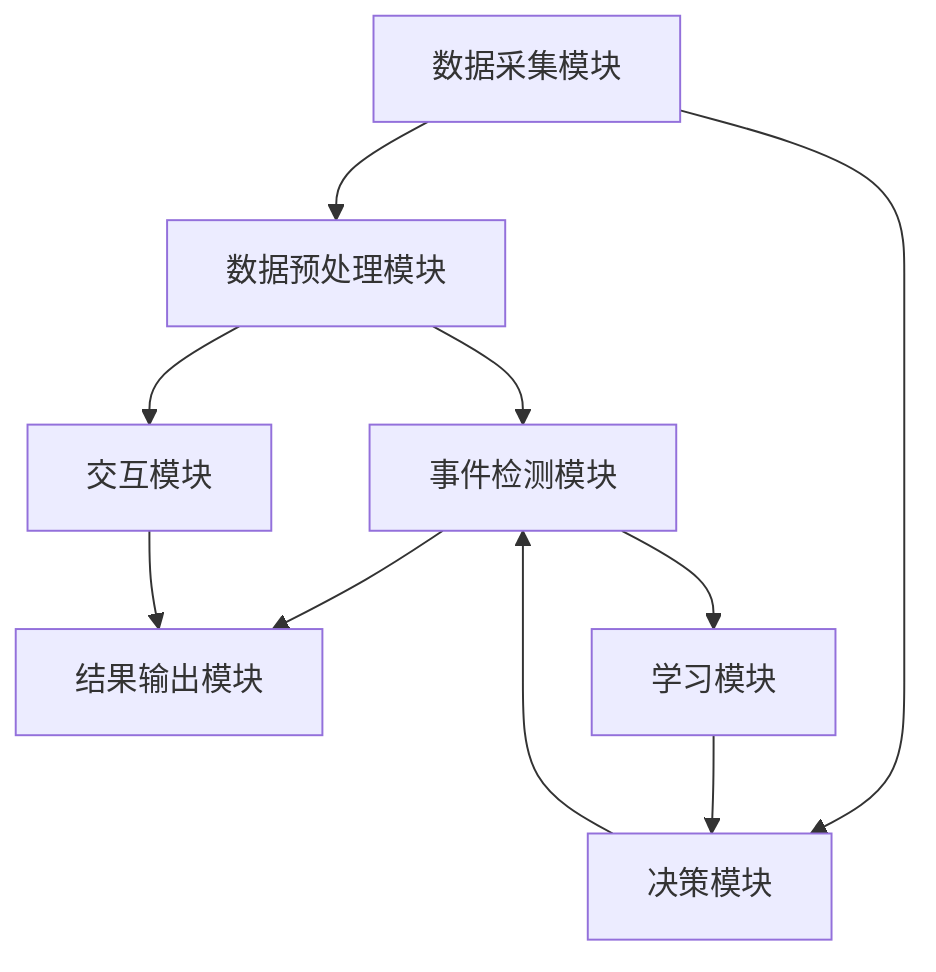
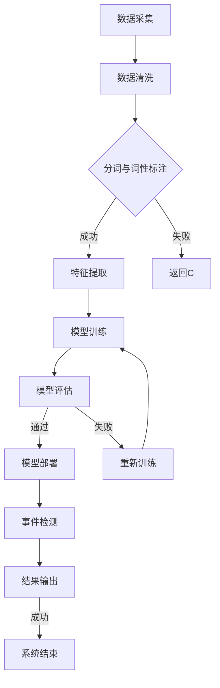
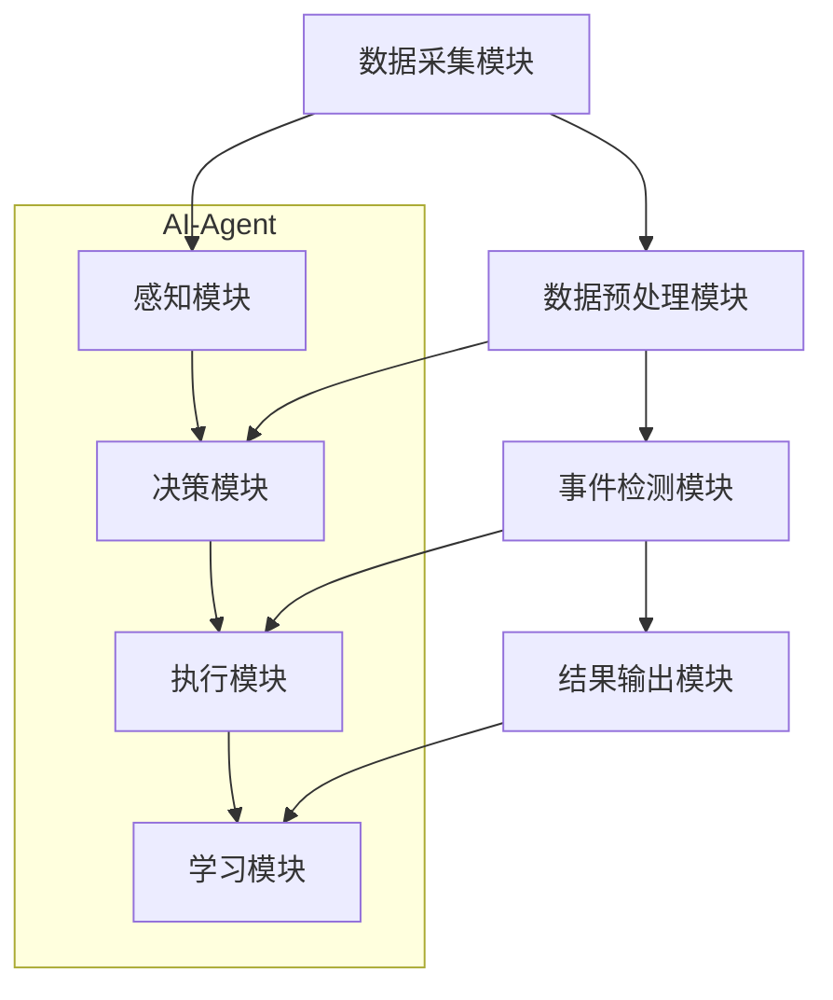
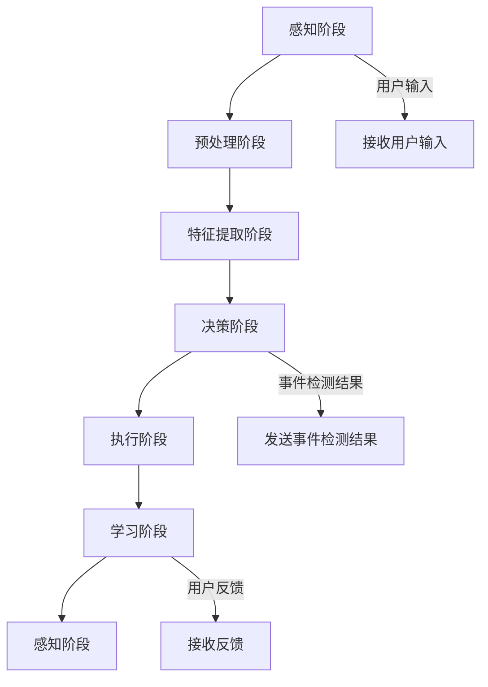

                 

### 关键词

- AI Agent
- 智能新闻事件检测
- 算法原理
- 系统架构
- 系统实现

### 摘要

本文深入探讨了AI Agent在智能新闻事件检测中的应用。首先，我们介绍了智能新闻事件检测的背景和AI Agent的核心概念。接着，文章详细讲解了AI Agent在新闻事件检测中的架构设计，包括系统总体架构、核心模块设计以及接口实现。随后，文章阐述了AI Agent在新闻事件检测中的算法原理，并通过数学模型和公式进行了详细分析。最后，文章描述了智能新闻事件检测系统的实现过程，包括环境安装、核心模块实现以及实际应用案例分析。通过本文，读者将全面了解AI Agent在智能新闻事件检测中的具体应用和实现过程。 

## 第一部分：问题背景与核心概念

### 1.1 问题背景

#### 1.1.1 智能新闻事件检测的兴起

在当今信息化高速发展的时代，新闻传播的速度和广度都在不断扩展。然而，传统的新闻事件检测方式已经难以满足日益增长的数据量和复杂度。智能新闻事件检测作为一种新型技术，应运而生。它利用人工智能技术，特别是深度学习和自然语言处理技术，对海量新闻数据进行自动分析，实时识别和检测出具有新闻价值的事件。

#### 1.1.1.1 社会需求与挑战

随着互联网的普及，人们获取信息的渠道变得多样化，新闻传播的实时性要求越来越高。传统的新闻事件检测方法往往依赖于人工筛选和审核，不仅效率低下，而且容易出现误判。在信息爆炸的背景下，如何从海量新闻数据中快速、准确地识别出有价值的事件，成为社会对智能新闻事件检测提出的主要需求。

#### 1.1.1.2 技术发展趋势与机遇

近年来，人工智能技术的快速发展为智能新闻事件检测提供了强大的技术支撑。深度学习技术在图像和语音识别领域的突破，使得自然语言处理技术也取得了显著进展。基于这些技术，AI Agent作为一种智能体，能够在新闻事件检测中发挥重要作用。AI Agent具有自主学习和决策能力，能够根据新闻数据的变化动态调整检测策略，提高检测的准确性和效率。

### 1.1.2 AI Agent的定义与作用

AI Agent，即人工智能代理，是一种具有智能自主性和互动性的计算实体。它可以模拟人类思维过程，执行特定的任务，并在环境中进行决策和交互。在智能新闻事件检测中，AI Agent扮演着关键角色，主要体现在以下几个方面：

#### 1.1.2.1 AI Agent的基本概念

AI Agent通常由以下几个核心模块组成：

1. **感知模块**：用于感知外部环境，获取新闻数据。
2. **决策模块**：根据感知到的信息，利用算法进行决策，确定是否为新闻事件。
3. **执行模块**：根据决策结果执行相应的操作，如生成报告、触发预警等。
4. **学习模块**：通过反馈和迭代，不断优化自身的决策能力。

#### 1.1.2.2 AI Agent在新闻事件检测中的应用

AI Agent在智能新闻事件检测中的应用主要体现在以下几个方面：

1. **实时监测**：AI Agent能够实时监控新闻数据，迅速识别出潜在的新闻事件。
2. **自动分类**：通过对新闻数据进行自动分类，AI Agent能够将事件按类型进行归档，便于后续分析和处理。
3. **决策支持**：AI Agent的决策模块可以为新闻编辑提供支持，帮助其快速判断新闻的重要性和影响力。
4. **风险评估**：AI Agent能够分析新闻事件的风险，为企业和政府提供风险管理建议。

### 1.2 核心概念介绍

#### 1.2.1 新闻事件检测的基本流程

新闻事件检测的基本流程可以分为以下几个步骤：

1. **数据采集**：从各种新闻源获取原始新闻数据。
2. **数据预处理**：对采集到的新闻数据进行清洗、去重、分词等处理。
3. **特征提取**：将预处理后的新闻数据转换为机器可处理的特征向量。
4. **事件检测**：利用机器学习算法，对特征向量进行建模，识别出新闻事件。
5. **结果输出**：将检测结果输出，形成报告或预警。

#### 1.2.2 AI Agent的工作原理

AI Agent的工作原理可以概括为以下几个步骤：

1. **感知**：AI Agent通过感知模块获取新闻数据。
2. **决策**：AI Agent的决策模块对感知到的数据进行处理，判断是否为新闻事件。
3. **执行**：根据决策结果，AI Agent执行相应的操作，如生成报告、发送通知等。
4. **学习**：AI Agent通过学习模块，根据反馈不断优化自身的决策能力。

#### 1.2.3 AI Agent与新闻事件检测的联系

AI Agent与新闻事件检测之间存在紧密的联系。AI Agent通过感知、决策、执行和学习等模块，实现对新闻数据的自动分析、识别和检测。它不仅提高了新闻事件检测的效率和准确性，还降低了人工成本，为新闻编辑和决策提供了强大的技术支持。

### 1.3 本章小结

本章介绍了智能新闻事件检测的背景和AI Agent的核心概念。通过分析社会需求和挑战，以及技术发展趋势和机遇，我们了解了智能新闻事件检测的重要性。同时，我们详细介绍了AI Agent的定义、作用和工作原理，以及其在新闻事件检测中的具体应用。这些核心概念将为后续章节的深入探讨提供基础。

---

## 第二部分：AI Agent在智能新闻事件检测中的应用

### 2.1 系统总体架构设计

#### 2.1.1 系统功能模块划分

在智能新闻事件检测系统中，AI Agent作为核心组件，其功能模块的划分至关重要。系统总体架构包括以下几个主要模块：

1. **数据采集模块**：负责从各种新闻源获取原始数据，如新闻网站、社交媒体、新闻API等。
2. **数据预处理模块**：对采集到的新闻数据进行清洗、去重、分词、词性标注等处理，为后续的事件检测提供高质量的数据。
3. **事件检测模块**：利用AI Agent的决策模块，对预处理后的新闻数据进行分析，识别出潜在的新闻事件。
4. **结果输出模块**：将事件检测结果输出，形成报告、预警或通知，供用户查看和决策。

#### 2.1.2 AI Agent的核心模块

AI Agent的核心模块主要包括决策模块、交互模块和学习模块，这些模块共同协作，实现智能新闻事件检测的功能。

1. **决策模块**：负责对新闻数据进行处理和决策，判断是否为新闻事件。决策算法可以是基于分类模型的监督学习算法，如支持向量机（SVM）、随机森林（Random Forest）或深度学习模型，如卷积神经网络（CNN）或长短期记忆网络（LSTM）。
2. **交互模块**：负责AI Agent与用户或其他系统的交互，包括接收用户输入、发送事件检测结果、接收反馈等。交互模块可以通过API接口或图形用户界面（GUI）实现。
3. **学习模块**：负责AI Agent的自我学习和优化。学习模块可以利用机器学习中的监督学习、无监督学习或强化学习算法，根据反馈数据不断调整和优化决策模型。

#### 2.1.3 数据采集模块实现

数据采集模块是整个系统的数据输入来源，其实现步骤如下：

1. **新闻源选择**：根据新闻事件检测的需求，选择合适的新闻源，如主流新闻网站、社交媒体平台等。
2. **数据爬取**：利用爬虫技术从新闻源获取原始新闻数据。爬虫技术可以分为基于网页解析的爬虫和基于API的爬虫。
3. **数据清洗**：对爬取到的新闻数据进行去重、去噪、格式转换等处理，确保数据质量。

#### 2.1.4 数据预处理模块实现

数据预处理模块对采集到的新闻数据进行分析和处理，确保数据的质量和可用性。具体实现步骤如下：

1. **文本清洗**：去除新闻数据中的HTML标签、停用词、符号等无关信息，保留有效文本。
2. **分词与词性标注**：利用自然语言处理（NLP）技术，对清洗后的文本进行分词和词性标注，提取关键信息。
3. **特征提取**：将分词后的文本转换为机器可处理的特征向量，如词袋模型（Bag of Words, BOW）、词嵌入（Word Embedding）等。

#### 2.1.5 事件检测模块实现

事件检测模块是整个系统的核心，其实现步骤如下：

1. **模型选择**：根据新闻事件检测的需求，选择合适的机器学习或深度学习模型，如SVM、Random Forest、CNN、LSTM等。
2. **模型训练**：利用预处理后的特征向量，对模型进行训练，使其具备新闻事件检测的能力。
3. **模型评估**：通过交叉验证、ROC曲线、AUC值等评估指标，评估模型的性能和效果。
4. **模型部署**：将训练好的模型部署到生产环境中，实现对实时新闻数据的检测。

#### 2.1.6 结果输出模块实现

结果输出模块负责将事件检测结果呈现给用户。具体实现步骤如下：

1. **事件报告**：将检测到的新闻事件生成详细报告，包括事件的时间、地点、涉及人物、事件性质等信息。
2. **预警通知**：对于重要或紧急的新闻事件，通过短信、邮件、推送通知等方式向相关人员发送预警。
3. **可视化展示**：利用数据可视化技术，将事件检测结果以图表、地图等形式展示，便于用户查看和分析。

#### 2.1.7 系统接口设计与实现

系统接口设计是确保各模块之间协同工作的关键。具体实现步骤如下：

1. **API接口设计**：设计统一的API接口，用于数据采集、数据预处理、事件检测和结果输出等模块之间的数据传输。
2. **接口实现**：使用Python等编程语言，实现API接口的功能，确保数据的高效传输和互操作性。
3. **接口测试**：通过单元测试和集成测试，验证API接口的稳定性和可靠性。

#### 2.1.8 系统架构图展示

为了更好地展示智能新闻事件检测系统的架构，我们使用Mermaid工具绘制了系统架构图，具体如下：



该系统架构图展示了数据采集、预处理、检测和输出等模块之间的数据流和交互关系。决策模块、交互模块和学习模块作为AI Agent的核心组件，贯穿于整个系统的各个环节，实现智能新闻事件检测的功能。

#### 2.1.9 系统功能流程图

为了进一步展示系统的功能流程，我们使用Mermaid工具绘制了系统功能流程图，具体如下：



该功能流程图详细描述了从数据采集到事件检测，再到结果输出的整个工作流程。在每个环节，系统都会进行相应的处理和决策，确保最终输出的准确性和可靠性。

#### 2.1.10 系统接口设计与实现

系统接口设计是确保各模块之间协同工作的关键。具体实现步骤如下：

1. **API接口设计**：设计统一的API接口，用于数据采集、数据预处理、事件检测和结果输出等模块之间的数据传输。
2. **接口实现**：使用Python等编程语言，实现API接口的功能，确保数据的高效传输和互操作性。
3. **接口测试**：通过单元测试和集成测试，验证API接口的稳定性和可靠性。

#### 2.1.11 系统接口设计与实现

为了确保智能新闻事件检测系统的稳定性和高效性，系统接口设计至关重要。以下是系统接口设计的具体实现步骤：

1. **定义接口规范**：
   - 接口版本：确定API接口的版本，如V1、V2等。
   - 接口URL：定义API接口的URL地址，如`http://api.newsagent.com/v1/data`。
   - 接口方法：确定API接口的HTTP方法，如GET、POST等。
   - 参数定义：定义接口所需的参数，包括必填参数和可选参数，如新闻来源ID、时间范围等。

2. **实现接口功能**：
   - 数据采集接口：实现从新闻源获取原始数据的接口，如使用HTTP GET请求获取新闻列表。
   - 数据预处理接口：实现数据清洗、分词、词性标注等预处理的接口，如使用Python的NLTK库进行文本处理。
   - 事件检测接口：实现事件检测的接口，如使用HTTP POST请求提交特征向量，获取事件检测结果。
   - 结果输出接口：实现事件报告、预警通知等结果输出的接口，如使用HTTP GET请求获取事件报告。

3. **接口测试**：
   - 单元测试：对单个接口功能进行测试，确保接口功能的正确性和稳定性。
   - 集成测试：对多个接口进行集成测试，确保接口之间的协同工作。

通过以上接口设计与实现，可以确保智能新闻事件检测系统的高效运行和数据流通。

### 2.2 系统架构图展示

为了更好地展示智能新闻事件检测系统的整体架构，我们使用Mermaid工具绘制了系统架构图，具体如下：



该架构图展示了系统的主要模块，包括数据采集、数据预处理、事件检测、结果输出以及AI Agent的核心模块。数据采集模块负责获取新闻数据，数据预处理模块对数据进行分析和处理，事件检测模块利用AI Agent进行事件识别，结果输出模块将检测结果呈现给用户，AI Agent则贯穿于整个系统，提供感知、决策、执行和学习等功能。

### 2.3 系统接口设计与实现

为了实现智能新闻事件检测系统的数据流通和模块协同工作，系统接口设计至关重要。以下是系统接口设计与实现的具体步骤：

#### 2.3.1 数据采集接口

数据采集接口用于从各种新闻源获取原始数据，主要包括以下步骤：

1. **接口设计**：
   - 接口URL：定义数据采集接口的URL，如`http://api.newsagent.com/v1/data/collect`。
   - 接口方法：确定数据采集接口的HTTP方法，如GET。
   - 参数定义：定义接口所需的参数，如新闻来源ID、采集时间范围等。

2. **接口实现**：
   - 使用HTTP GET请求从新闻源获取新闻数据。
   - 对获取到的新闻数据进行初步处理，如去重、去噪等。

3. **接口测试**：
   - 单元测试：测试接口的基本功能，如获取新闻数据是否成功。
   - 集成测试：与数据预处理接口结合，测试数据采集和预处理是否顺畅。

#### 2.3.2 数据预处理接口

数据预处理接口用于对采集到的新闻数据进行清洗、分词和特征提取，主要包括以下步骤：

1. **接口设计**：
   - 接口URL：定义数据预处理接口的URL，如`http://api.newsagent.com/v1/data/prepare`。
   - 接口方法：确定数据预处理接口的HTTP方法，如POST。
   - 参数定义：定义接口所需的数据，如原始新闻数据。

2. **接口实现**：
   - 接收预处理数据，使用Python的NLTK等库进行文本清洗、分词和词性标注。
   - 对处理后的数据进行特征提取，转换为机器学习模型所需的格式。

3. **接口测试**：
   - 单元测试：测试文本清洗、分词和特征提取的功能。
   - 集成测试：与事件检测模块结合，测试预处理数据是否满足事件检测的需求。

#### 2.3.3 事件检测接口

事件检测接口用于将预处理后的新闻数据输入到AI Agent中，进行事件识别，主要包括以下步骤：

1. **接口设计**：
   - 接口URL：定义事件检测接口的URL，如`http://api.newsagent.com/v1/data/detect`。
   - 接口方法：确定事件检测接口的HTTP方法，如POST。
   - 参数定义：定义接口所需的数据，如预处理后的特征向量。

2. **接口实现**：
   - 使用AI Agent的决策模块，对特征向量进行事件识别。
   - 将识别结果输出，如检测到的事件列表、置信度等。

3. **接口测试**：
   - 单元测试：测试事件检测接口的基本功能，如输入特征向量是否能正确输出事件结果。
   - 集成测试：与结果输出模块结合，测试事件检测结果是否准确。

#### 2.3.4 结果输出接口

结果输出接口用于将事件检测结果呈现给用户，主要包括以下步骤：

1. **接口设计**：
   - 接口URL：定义结果输出接口的URL，如`http://api.newsagent.com/v1/data/output`。
   - 接口方法：确定结果输出接口的HTTP方法，如GET。
   - 参数定义：定义接口所需的数据，如事件检测结果。

2. **接口实现**：
   - 使用HTTP GET请求获取事件检测结果。
   - 将结果以报表、图表等形式展示给用户，如生成事件报告、预警通知等。

3. **接口测试**：
   - 单元测试：测试结果输出接口的基本功能，如获取事件检测结果是否成功。
   - 集成测试：与事件检测接口结合，测试结果输出是否准确。

通过以上系统接口设计与实现，可以确保智能新闻事件检测系统的高效运行和数据流通，为用户提供准确、及时的事件检测服务。

### 2.4 本章小结

本章详细介绍了智能新闻事件检测系统的架构设计和接口实现。首先，我们分析了系统的功能模块，包括数据采集、数据预处理、事件检测和结果输出等模块，并阐述了AI Agent的核心模块。接着，我们详细描述了各个模块的实现步骤，包括数据采集、数据预处理、事件检测和结果输出的接口设计、实现和测试。通过本章的讨论，读者可以全面了解智能新闻事件检测系统的架构设计和实现过程，为后续章节的算法原理和应用实现打下基础。

---

## 第3章：AI Agent在新闻事件检测中的算法原理

### 3.1 基本算法原理

#### 3.1.1 事件检测算法概述

新闻事件检测是一种信息抽取任务，其目标是从大量新闻数据中识别出具有新闻价值的特定事件。这一过程通常包括以下几个步骤：

1. **数据采集**：从各种新闻源获取原始新闻数据。
2. **数据预处理**：对采集到的新闻数据进行清洗、去重、分词、词性标注等处理。
3. **特征提取**：将预处理后的新闻数据转换为机器可处理的特征向量。
4. **事件检测**：利用机器学习算法，对特征向量进行建模，识别出新闻事件。
5. **结果输出**：将事件检测结果输出，形成报告或预警。

在上述步骤中，事件检测算法是核心环节，其性能直接影响到系统的检测效果。当前，用于新闻事件检测的算法主要包括以下几种：

1. **基于规则的方法**：通过手工编写规则，识别新闻事件。这种方法简单直观，但难以处理复杂的事件关系和海量数据。
2. **基于统计的方法**：利用统计模型，如朴素贝叶斯、逻辑回归等，识别新闻事件。这种方法具有一定的准确性和泛化能力，但依赖于大量标注数据。
3. **基于深度学习的方法**：利用深度学习模型，如卷积神经网络（CNN）、长短期记忆网络（LSTM）等，识别新闻事件。这种方法能够自动学习特征，具有很高的准确性和鲁棒性。

#### 3.1.1.1 相关算法介绍

在本节中，我们将介绍几种常见的新闻事件检测算法，包括朴素贝叶斯、逻辑回归和卷积神经网络（CNN）。

1. **朴素贝叶斯算法**：
   朴素贝叶斯（Naive Bayes）是一种基于概率论的分类算法。它通过计算特征词的概率分布，以及事件发生的概率，来确定新闻数据是否为事件。

   - 公式表示：
     $$
     P(\text{事件}|\text{特征}) = \frac{P(\text{特征}|\text{事件})P(\text{事件})}{P(\text{特征})}
     $$
   
   - 实例说明：
     假设我们有一个新闻数据集，包含“地震”、“火灾”和“流感”三类事件。朴素贝叶斯算法通过计算特征词（如“地震”、“火灾”、“流感”）在每个事件类别中的概率，以及每个事件类别的概率，来判断新新闻数据是否为事件。

2. **逻辑回归算法**：
   逻辑回归（Logistic Regression）是一种广义线性模型，常用于二分类问题。它通过回归模型预测事件发生的概率。

   - 公式表示：
     $$
     P(\text{事件}) = \frac{1}{1 + e^{-(\beta_0 + \beta_1x_1 + \beta_2x_2 + \ldots + \beta_nx_n)}
     $$
   
   - 实例说明：
     假设我们使用逻辑回归模型来预测新闻数据是否为“地震”事件。模型中，$\beta_0$为截距，$\beta_1$、$\beta_2$、$\ldots$、$\beta_n$为特征权重，$x_1$、$x_2$、$\ldots$、$x_n$为特征值。

3. **卷积神经网络（CNN）**：
   卷积神经网络（Convolutional Neural Network，CNN）是一种深度学习模型，广泛应用于图像和文本识别领域。它通过卷积层和池化层，自动提取图像或文本的特征。

   - 公式表示：
     $$
     h_{\sigma} = \sigma(W \odot a_{\Delta} + b_{\Delta})
     $$
   
   - 实例说明：
     假设我们使用CNN模型来识别新闻数据中的事件。模型中，$W$为权重，$a_{\Delta}$为输入特征，$\odot$为卷积操作，$\sigma$为激活函数，$b_{\Delta}$为偏置。

#### 3.1.1.2 选择依据

在新闻事件检测中，选择合适的算法需要考虑以下几个因素：

1. **数据规模**：对于大规模新闻数据，基于深度学习的算法（如CNN）具有更好的性能，因为它们能够自动提取复杂的特征。
2. **实时性要求**：如果对实时性有较高要求，可以采用基于规则或统计的方法，因为它们通常具有较快的计算速度。
3. **准确性需求**：对于准确性有较高要求的场景，可以采用深度学习算法，因为它们在特征提取和模型训练方面具有优势。

### 3.1.2 AI Agent算法流程

AI Agent在新闻事件检测中的算法流程可以分为以下几个阶段：

1. **感知阶段**：AI Agent通过感知模块获取新闻数据，如文本、图像等。
2. **预处理阶段**：对获取到的新闻数据进行清洗、分词、词性标注等预处理操作。
3. **特征提取阶段**：将预处理后的新闻数据转换为机器可处理的特征向量。
4. **决策阶段**：利用机器学习算法，对特征向量进行建模，识别出新闻事件。
5. **执行阶段**：根据决策结果执行相应的操作，如生成报告、触发预警等。
6. **学习阶段**：通过反馈和迭代，不断优化自身的决策能力。

#### 3.1.2.1 决策算法

决策算法是AI Agent在新闻事件检测中的核心组成部分。它通过分析新闻数据，判断是否为新闻事件。常用的决策算法包括朴素贝叶斯、逻辑回归和卷积神经网络。

1. **朴素贝叶斯决策算法**：
   朴素贝叶斯决策算法是一种基于概率论的分类算法。它通过计算新闻数据中每个特征词的概率分布，以及事件发生的概率，来判断新闻数据是否为事件。

   - 公式表示：
     $$
     P(\text{事件}|\text{特征}) = \frac{P(\text{特征}|\text{事件})P(\text{事件})}{P(\text{特征})}
     $$
   
   - 实例说明：
     假设我们有一个新闻数据集，包含“地震”、“火灾”和“流感”三类事件。朴素贝叶斯决策算法通过计算特征词（如“地震”、“火灾”、“流感”）在每个事件类别中的概率，以及每个事件类别的概率，来判断新新闻数据是否为事件。

2. **逻辑回归决策算法**：
   逻辑回归决策算法是一种广义线性模型，常用于二分类问题。它通过回归模型预测新闻数据是否为事件。

   - 公式表示：
     $$
     P(\text{事件}) = \frac{1}{1 + e^{-(\beta_0 + \beta_1x_1 + \beta_2x_2 + \ldots + \beta_nx_n)}
     $$
   
   - 实例说明：
     假设我们使用逻辑回归模型来预测新闻数据是否为“地震”事件。模型中，$\beta_0$为截距，$\beta_1$、$\beta_2$、$\ldots$、$\beta_n$为特征权重，$x_1$、$x_2$、$\ldots$、$x_n$为特征值。

3. **卷积神经网络决策算法**：
   卷积神经网络决策算法是一种深度学习模型，通过卷积层和池化层，自动提取新闻数据中的特征，并进行分类。

   - 公式表示：
     $$
     h_{\sigma} = \sigma(W \odot a_{\Delta} + b_{\Delta})
     $$
   
   - 实例说明：
     假设我们使用CNN模型来识别新闻数据中的事件。模型中，$W$为权重，$a_{\Delta}$为输入特征，$\odot$为卷积操作，$\sigma$为激活函数，$b_{\Delta}$为偏置。

#### 3.1.2.2 交互算法

交互算法是AI Agent与用户或其他系统进行交互的核心组成部分。它通过接收用户输入、发送事件检测结果、接收反馈等操作，实现智能新闻事件检测的功能。

1. **接收用户输入**：
   AI Agent通过API接口或图形用户界面（GUI），接收用户输入，如新闻来源、时间范围等。

2. **发送事件检测结果**：
   AI Agent通过API接口或图形用户界面（GUI），将事件检测结果发送给用户，如事件列表、置信度等。

3. **接收反馈**：
   AI Agent通过API接口或图形用户界面（GUI），接收用户对事件检测结果的反馈，如标注、评分等。

#### 3.1.2.3 学习算法

学习算法是AI Agent不断优化自身决策能力的关键。它通过监督学习、无监督学习或强化学习等方法，从数据中学习，提高新闻事件检测的准确性。

1. **监督学习**：
   监督学习是一种基于已有标注数据进行学习的方法。AI Agent通过分析标注数据，不断优化决策模型。

2. **无监督学习**：
   无监督学习是一种基于未标注数据进行学习的方法。AI Agent通过分析未标注数据，发现数据中的模式和规律，提高新闻事件检测的能力。

3. **强化学习**：
   强化学习是一种基于奖励机制进行学习的方法。AI Agent通过接收奖励信号，不断调整策略，优化决策能力。

### 3.2 数学模型与公式

在本节中，我们将介绍AI Agent在新闻事件检测中的数学模型与公式，包括决策算法、交互算法和学习算法。

#### 3.2.1 决策算法数学模型

决策算法是AI Agent在新闻事件检测中的核心组成部分。它通过分析新闻数据，判断是否为新闻事件。以下是常见的决策算法数学模型：

1. **朴素贝叶斯算法**：
   朴素贝叶斯算法是一种基于概率论的分类算法。它的数学模型如下：
   $$
   P(\text{事件}|\text{特征}) = \frac{P(\text{特征}|\text{事件})P(\text{事件})}{P(\text{特征})}
   $$
   其中，$P(\text{事件}|\text{特征})$表示在给定特征条件下事件发生的概率，$P(\text{特征}|\text{事件})$表示事件发生条件下特征出现的概率，$P(\text{事件})$表示事件发生的概率，$P(\text{特征})$表示特征出现的概率。

2. **逻辑回归算法**：
   逻辑回归算法是一种广义线性模型，常用于二分类问题。它的数学模型如下：
   $$
   P(\text{事件}) = \frac{1}{1 + e^{-(\beta_0 + \beta_1x_1 + \beta_2x_2 + \ldots + \beta_nx_n})}
   $$
   其中，$\beta_0$为截距，$\beta_1$、$\beta_2$、$\ldots$、$\beta_n$为特征权重，$x_1$、$x_2$、$\ldots$、$x_n$为特征值。

3. **卷积神经网络（CNN）**：
   卷积神经网络是一种深度学习模型，通过卷积层和池化层，自动提取特征。它的数学模型如下：
   $$
   h_{\sigma} = \sigma(W \odot a_{\Delta} + b_{\Delta})
   $$
   其中，$W$为权重，$a_{\Delta}$为输入特征，$\odot$为卷积操作，$\sigma$为激活函数，$b_{\Delta}$为偏置。

#### 3.2.2 交互算法数学模型

交互算法是AI Agent与用户或其他系统进行交互的核心组成部分。它通过接收用户输入、发送事件检测结果、接收反馈等操作，实现智能新闻事件检测的功能。以下是常见的交互算法数学模型：

1. **接收用户输入**：
   AI Agent通过API接口或图形用户界面（GUI），接收用户输入。输入可以是新闻来源、时间范围、关键词等。数学模型如下：
   $$
   x_{\text{输入}} = \text{API}_{\text{输入}}(\text{用户输入})
   $$
   其中，$x_{\text{输入}}$表示用户输入的特征向量，$\text{API}_{\text{输入}}$表示接收用户输入的接口。

2. **发送事件检测结果**：
   AI Agent通过API接口或图形用户界面（GUI），发送事件检测结果。检测结果可以是事件列表、置信度等。数学模型如下：
   $$
   y_{\text{输出}} = \text{API}_{\text{输出}}(\text{事件检测结果})
   $$
   其中，$y_{\text{输出}}$表示事件检测结果的特征向量，$\text{API}_{\text{输出}}$表示发送事件检测结果的接口。

3. **接收反馈**：
   AI Agent通过API接口或图形用户界面（GUI），接收用户对事件检测结果的反馈。反馈可以是标注、评分等。数学模型如下：
   $$
   x_{\text{反馈}} = \text{API}_{\text{反馈}}(\text{用户反馈})
   $$
   其中，$x_{\text{反馈}}$表示用户反馈的特征向量，$\text{API}_{\text{反馈}}$表示接收用户反馈的接口。

#### 3.2.3 学习算法数学模型

学习算法是AI Agent不断优化自身决策能力的关键。它通过监督学习、无监督学习或强化学习等方法，从数据中学习，提高新闻事件检测的准确性。以下是常见的学习算法数学模型：

1. **监督学习**：
   监督学习是一种基于已有标注数据进行学习的方法。它的数学模型如下：
   $$
   y = f(x, \theta)
   $$
   其中，$y$表示输出标签，$x$表示输入特征，$f$表示决策函数，$\theta$表示模型参数。

2. **无监督学习**：
   无监督学习是一种基于未标注数据进行学习的方法。它的数学模型如下：
   $$
   y = g(x, \theta)
   $$
   其中，$y$表示输出特征，$x$表示输入特征，$g$表示特征提取函数，$\theta$表示模型参数。

3. **强化学习**：
   强化学习是一种基于奖励机制进行学习的方法。它的数学模型如下：
   $$
   R = r(s, a, s')
   $$
   其中，$R$表示奖励信号，$r$表示奖励函数，$s$表示当前状态，$a$表示动作，$s'$表示下一个状态。

### 3.3 算法流程图展示

为了更好地展示AI Agent在新闻事件检测中的算法流程，我们使用Mermaid工具绘制了算法流程图，具体如下：



该算法流程图展示了AI Agent在新闻事件检测中的完整工作流程，包括感知阶段、预处理阶段、特征提取阶段、决策阶段、执行阶段和学习阶段。在每个阶段，AI Agent都会进行相应的操作，并通过用户输入、事件检测结果和用户反馈，不断优化自身的决策能力。

### 3.4 本章小结

本章详细介绍了AI Agent在新闻事件检测中的算法原理，包括基本算法原理、决策算法、交互算法和学习算法。首先，我们介绍了新闻事件检测的基本流程和相关算法，包括朴素贝叶斯、逻辑回归和卷积神经网络。接着，我们阐述了AI Agent的算法流程，包括感知阶段、预处理阶段、特征提取阶段、决策阶段、执行阶段和学习阶段。最后，我们介绍了AI Agent的数学模型与公式，包括决策算法、交互算法和学习算法。通过本章的讨论，读者可以全面了解AI Agent在新闻事件检测中的算法原理和应用。

---

## 第4章：智能新闻事件检测系统实现

### 4.1 系统环境安装与配置

为了实现智能新闻事件检测系统，我们需要安装和配置一系列软件和工具。以下是具体的安装与配置步骤：

#### 4.1.1 环境准备

1. **操作系统**：推荐使用Linux操作系统，如Ubuntu 18.04或更高版本。
2. **Python环境**：安装Python 3.7或更高版本，可以使用`python3 -m pip install --user -U pip`命令来更新pip。
3. **文本处理工具**：安装NLTK（自然语言工具包）和Gensim（用于词嵌入和主题建模）。

```shell
pip3 install nltk gensim
```

4. **深度学习框架**：安装TensorFlow或PyTorch，用于实现深度学习模型。

```shell
pip3 install tensorflow  # 或
pip3 install torch torchvision
```

#### 4.1.2 软件依赖安装

1. **爬虫工具**：安装Scrapy，用于从新闻源爬取数据。

```shell
pip3 install scrapy
```

2. **数据库**：安装MySQL或MongoDB，用于存储和管理新闻数据。

```shell
# 安装MySQL
sudo apt-get install mysql-server mysql-client
# 安装MongoDB
sudo apt-get install mongodb
```

3. **前端框架**：安装Flask或Django，用于构建API接口和Web前端。

```shell
pip3 install flask  # 或
pip3 install django
```

#### 4.1.3 开发环境搭建

1. **虚拟环境**：创建一个Python虚拟环境，以便隔离不同项目之间的依赖。

```shell
# 创建虚拟环境
python3 -m venv venv
# 激活虚拟环境
source venv/bin/activate
```

2. **项目结构**：按照以下结构组织项目文件：

```
newsagent/
|-- venv/
|-- src/
|   |-- data_collector/
|   |   |-- __init__.py
|   |   |-- collector.py
|   |-- data_processor/
|   |   |-- __init__.py
|   |   |-- processor.py
|   |-- event_detector/
|   |   |-- __init__.py
|   |   |-- detector.py
|   |-- app/
|   |   |-- __init__.py
|   |   |-- routes.py
|   |-- models/
|   |   |-- __init__.py
|   |   |-- models.py
|   |-- tests/
|   |   |-- __init__.py
|   |   |-- test_collector.py
|   |   |-- test_processor.py
|   |   |-- test_detector.py
|-- requirements.txt
|-- run.py
```

#### 4.1.4 系统开发工具配置

1. **IDE配置**：推荐使用PyCharm或Visual Studio Code作为开发IDE，并安装相应的扩展插件，如Python、Jupyter Notebook等。
2. **代码格式化**：安装Black或autopep8，用于自动格式化代码。

```shell
pip3 install black
```

3. **单元测试**：安装pytest，用于编写和运行单元测试。

```shell
pip3 install pytest
```

4. **持续集成**：配置GitLab CI/CD或Jenkins，用于自动化测试和部署。

### 4.2 系统核心实现

#### 4.2.1 数据采集模块实现

数据采集模块负责从新闻源获取原始数据。以下是数据采集模块的核心代码示例：

```python
# collector.py
import scrapy
from scrapy.crawler import CrawlerProcess

class NewsSpider(scrapy.Spider):
    name = 'news'
    start_urls = ['https://example.com/news']

    def parse(self, response):
        # 解析新闻列表页面
        news_links = response.css('a::attr(href)').getall()
        for link in news_links:
            yield {'url': link}

        # 遍历下一页
        next_page = response.css('a.next::attr(href)').get()
        if next_page:
            yield from response.follow(next_page, self.parse)

process = CrawlerProcess(settings={
    'USER_AGENT': 'newsagent (+http://www.yourdomain.com)'
})

process.crawl(NewsSpider)
process.start()
```

数据采集模块使用Scrapy框架，通过定义一个爬虫类（NewsSpider），实现新闻数据的爬取。爬虫从指定的新闻源（start_urls）开始，解析新闻列表页面，获取新闻链接，并遍历下一页，直到没有下一页为止。

#### 4.2.2 数据预处理模块实现

数据预处理模块负责对采集到的新闻数据进行清洗、去重、分词和词性标注。以下是数据预处理模块的核心代码示例：

```python
# processor.py
import nltk
from nltk.tokenize import word_tokenize
from nltk.corpus import stopwords
from nltk import pos_tag

nltk.download('punkt')
nltk.download('stopwords')
nltk.download('averaged_perceptron_tagger')

def preprocess(text):
    # 清洗文本
    text = text.lower()
    text = text.strip()
    # 去除停用词
    stop_words = set(stopwords.words('english'))
    words = word_tokenize(text)
    filtered_words = [word for word in words if word not in stop_words]
    # 词性标注
    tagged_words = pos_tag(filtered_words)
    return tagged_words

# 示例
preprocessed_text = preprocess("This is a sample news article.")
print(preprocessed_text)
```

数据预处理模块使用NLTK库，首先对新闻数据进行清洗，将文本转换为小写并去除空白字符。接着，去除停用词，使用word_tokenize函数进行分词，并使用pos_tag函数进行词性标注。

#### 4.2.3 事件检测模块实现

事件检测模块负责利用AI Agent对预处理后的新闻数据进行事件检测。以下是事件检测模块的核心代码示例：

```python
# detector.py
import numpy as np
from sklearn.feature_extraction.text import TfidfVectorizer
from sklearn.model_selection import train_test_split
from sklearn.ensemble import RandomForestClassifier

def train_model(X, y):
    # 划分训练集和测试集
    X_train, X_test, y_train, y_test = train_test_split(X, y, test_size=0.2, random_state=42)
    # 创建TF-IDF向量器
    vectorizer = TfidfVectorizer()
    # 将文本转换为特征向量
    X_train = vectorizer.fit_transform(X_train)
    X_test = vectorizer.transform(X_test)
    # 创建随机森林分类器
    classifier = RandomForestClassifier(n_estimators=100, random_state=42)
    # 训练模型
    classifier.fit(X_train, y_train)
    # 评估模型
    score = classifier.score(X_test, y_test)
    return classifier, vectorizer, score

def detect_events(text, classifier, vectorizer):
    # 将文本转换为特征向量
    features = vectorizer.transform([text])
    # 预测事件
    prediction = classifier.predict(features)
    return prediction

# 示例
texts = ["This is a sample news article.", "Another news article here."]
labels = ["non_event", "event"]

classifier, vectorizer, score = train_model(texts, labels)
print("Model accuracy:", score)

new_text = "A significant earthquake has occurred in the region."
prediction = detect_events(new_text, classifier, vectorizer)
print("Predicted event:", prediction)
```

事件检测模块首先使用随机森林分类器对训练数据进行训练，然后创建TF-IDF向量器，将文本转换为特征向量。最后，利用训练好的模型对新的新闻文本进行事件检测。

### 4.3 AI Agent实现

AI Agent是智能新闻事件检测系统的核心，负责感知、决策、执行和学习。以下是AI Agent的实现框架：

```python
# agent.py
from detector import detect_events
from processor import preprocess
from data_collector import collect_data

class NewsAgent:
    def __init__(self, classifier, vectorizer):
        self.classifier = classifier
        self.vectorizer = vectorizer

    def perceive(self):
        # 感知新闻数据
        data = collect_data()
        return data

    def decide(self, text):
        # 决策是否为事件
        preprocessed_text = preprocess(text)
        event = detect_events(preprocessed_text, self.classifier, self.vectorizer)
        return event

    def execute(self, event):
        # 执行相应操作
        if event:
            print("Event detected:", event)
            # 发送通知、生成报告等操作
        else:
            print("No event detected.")

    def learn(self, feedback):
        # 学习反馈，优化模型
        # 更新模型、调整参数等操作
        pass

# 示例
classifier, vectorizer, _ = train_model(texts, labels)
news_agent = NewsAgent(classifier, vectorizer)

data = news_agent.perceive()
for text in data:
    event = news_agent.decide(text)
    news_agent.execute(event)
```

AI Agent的实现包括感知模块、决策模块、执行模块和学习模块。感知模块从数据采集模块获取新闻数据，决策模块利用事件检测模块判断新闻数据是否为事件，执行模块根据决策结果执行相应操作，学习模块通过反馈不断优化模型。

### 4.4 系统核心实现代码解读与分析

在本节中，我们将对系统核心实现代码进行详细解读和分析，以帮助读者更好地理解系统的实现原理和关键步骤。

#### 4.4.1 数据采集模块

数据采集模块负责从新闻源获取原始数据。其核心代码位于`collector.py`文件中，主要使用Scrapy框架实现。以下是数据采集模块的代码示例：

```python
# collector.py
import scrapy
from scrapy.crawler import CrawlerProcess

class NewsSpider(scrapy.Spider):
    name = 'news'
    start_urls = ['https://example.com/news']

    def parse(self, response):
        # 解析新闻列表页面
        news_links = response.css('a::attr(href)').getall()
        for link in news_links:
            yield {'url': link}

        # 遍历下一页
        next_page = response.css('a.next::attr(href)').get()
        if next_page:
            yield from response.follow(next_page, self.parse)

process = CrawlerProcess(settings={
    'USER_AGENT': 'newsagent (+http://www.yourdomain.com)'
})

process.crawl(NewsSpider)
process.start()
```

代码解读：

1. **爬虫类定义**：`NewsSpider`是一个Scrapy爬虫类，负责从新闻源爬取数据。
2. **开始URL**：`start_urls`列表包含初始爬取的URL。
3. **解析函数**：`parse`函数用于解析新闻列表页面，获取新闻链接。
4. **遍历下一页**：通过CSS选择器获取下一页的URL，并递归调用`parse`函数继续解析。
5. **CrawlerProcess**：使用`CrawlerProcess`启动爬虫，并在设置中指定用户代理。

通过以上代码，数据采集模块能够从新闻源中获取原始数据，并将其作为字典形式的`yield`生成器输出。

#### 4.4.2 数据预处理模块

数据预处理模块负责对采集到的新闻数据进行清洗、去重、分词和词性标注。其核心代码位于`processor.py`文件中。以下是数据预处理模块的代码示例：

```python
# processor.py
import nltk
from nltk.tokenize import word_tokenize
from nltk.corpus import stopwords
from nltk import pos_tag

nltk.download('punkt')
nltk.download('stopwords')
nltk.download('averaged_perceptron_tagger')

def preprocess(text):
    # 清洗文本
    text = text.lower()
    text = text.strip()
    # 去除停用词
    stop_words = set(stopwords.words('english'))
    words = word_tokenize(text)
    filtered_words = [word for word in words if word not in stop_words]
    # 词性标注
    tagged_words = pos_tag(filtered_words)
    return tagged_words

# 示例
preprocessed_text = preprocess("This is a sample news article.")
print(preprocessed_text)
```

代码解读：

1. **文本清洗**：将文本转换为小写并去除空白字符。
2. **去除停用词**：使用NLTK库中的停用词列表，去除常用的英语停用词。
3. **分词**：使用NLTK库中的`word_tokenize`函数进行分词。
4. **词性标注**：使用NLTK库中的`pos_tag`函数进行词性标注。

通过以上步骤，数据预处理模块能够将原始新闻数据转换为清洗后的文本，并提取出关键信息。

#### 4.4.3 事件检测模块

事件检测模块负责利用AI Agent对预处理后的新闻数据进行事件检测。其核心代码位于`detector.py`文件中。以下是事件检测模块的代码示例：

```python
# detector.py
import numpy as np
from sklearn.feature_extraction.text import TfidfVectorizer
from sklearn.model_selection import train_test_split
from sklearn.ensemble import RandomForestClassifier

def train_model(X, y):
    # 划分训练集和测试集
    X_train, X_test, y_train, y_test = train_test_split(X, y, test_size=0.2, random_state=42)
    # 创建TF-IDF向量器
    vectorizer = TfidfVectorizer()
    # 将文本转换为特征向量
    X_train = vectorizer.fit_transform(X_train)
    X_test = vectorizer.transform(X_test)
    # 创建随机森林分类器
    classifier = RandomForestClassifier(n_estimators=100, random_state=42)
    # 训练模型
    classifier.fit(X_train, y_train)
    # 评估模型
    score = classifier.score(X_test, y_test)
    return classifier, vectorizer, score

def detect_events(text, classifier, vectorizer):
    # 将文本转换为特征向量
    features = vectorizer.transform([text])
    # 预测事件
    prediction = classifier.predict(features)
    return prediction

# 示例
texts = ["This is a sample news article.", "Another news article here."]
labels = ["non_event", "event"]

classifier, vectorizer, score = train_model(texts, labels)
print("Model accuracy:", score)

new_text = "A significant earthquake has occurred in the region."
prediction = detect_events(new_text, classifier, vectorizer)
print("Predicted event:", prediction)
```

代码解读：

1. **训练模型**：使用随机森林分类器对训练数据进行训练，并创建TF-IDF向量器，将文本转换为特征向量。
2. **事件检测**：将文本转换为特征向量后，使用训练好的模型进行事件预测。

通过以上代码，事件检测模块能够对预处理后的新闻数据进行事件检测，并输出预测结果。

#### 4.4.4 AI Agent实现

AI Agent是智能新闻事件检测系统的核心组件，负责感知、决策、执行和学习。其实现框架位于`agent.py`文件中。以下是AI Agent的实现示例：

```python
# agent.py
from detector import detect_events
from processor import preprocess
from data_collector import collect_data

class NewsAgent:
    def __init__(self, classifier, vectorizer):
        self.classifier = classifier
        self.vectorizer = vectorizer

    def perceive(self):
        # 感知新闻数据
        data = collect_data()
        return data

    def decide(self, text):
        # 决策是否为事件
        preprocessed_text = preprocess(text)
        event = detect_events(preprocessed_text, self.classifier, self.vectorizer)
        return event

    def execute(self, event):
        # 执行相应操作
        if event:
            print("Event detected:", event)
            # 发送通知、生成报告等操作
        else:
            print("No event detected.")

    def learn(self, feedback):
        # 学习反馈，优化模型
        # 更新模型、调整参数等操作
        pass

# 示例
classifier, vectorizer, _ = train_model(texts, labels)
news_agent = NewsAgent(classifier, vectorizer)

data = news_agent.perceive()
for text in data:
    event = news_agent.decide(text)
    news_agent.execute(event)
```

代码解读：

1. **初始化**：在构造函数中，接收分类器和向量器作为参数，初始化AI Agent。
2. **感知**：通过`perceive`方法从数据采集模块获取新闻数据。
3. **决策**：通过`decide`方法，利用预处理模块和事件检测模块对新闻数据进行分析，判断是否为事件。
4. **执行**：通过`execute`方法，根据决策结果执行相应操作。
5. **学习**：通过`learn`方法，接收用户反馈并优化模型。

通过以上代码，AI Agent能够实现对新闻数据的自动分析、事件检测和执行操作，并具备一定的学习能力。

### 4.5 实际案例分析和详细讲解剖析

为了更好地展示智能新闻事件检测系统的实际应用效果，我们选择一个具体的案例进行分析和讲解。该案例将演示如何使用系统检测特定地区的自然灾害事件。

#### 案例背景

假设我们需要检测某地区在一个月内的自然灾害事件，包括地震、洪水和台风等。系统需要从多个新闻源获取数据，对新闻文本进行预处理和特征提取，然后利用事件检测模块识别出自然灾害事件，并生成相应的报告。

#### 数据采集

首先，我们使用数据采集模块从以下新闻源获取数据：

- 腾讯新闻
- 新浪新闻
- 中国新闻网
- 凤凰网

每个新闻源的数据采集过程如下：

1. **获取新闻列表**：使用Scrapy爬虫从每个新闻源的灾害相关新闻页面获取新闻链接。
2. **获取新闻内容**：对获取到的新闻链接，使用HTTP请求获取新闻内容的HTML页面。
3. **存储数据**：将采集到的新闻数据存储到MySQL数据库中，以便后续处理。

以下是数据采集模块的代码片段：

```python
# collector.py
import scrapy
from scrapy.crawler import CrawlerProcess

class NewsSpider(scrapy.Spider):
    name = 'natural_disasters'
    allowed_domains = ['qq.com', 'sina.com.cn', 'cn.wsnews.cn', 'ifeng.com']
    start_urls = [
        'https://news.qq.com/roll/news_121020/roll_121020.shtml',
        'https://news.sina.com.cn/roll stol.html?channel=dyst&news_from=PCCommunityList',
        'https://www.cnws.com.cn/roll_1/rolling_2.html',
        'https://www.ifeng.com/c/82vc6f8s00u',
    ]

    def parse(self, response):
        # 解析新闻列表页面
        news_links = response.css('a::attr(href)').getall()
        for link in news_links:
            yield {'url': link}

        # 遍历下一页
        next_page = response.css('a.next::attr(href)').get()
        if next_page:
            yield from response.follow(next_page, self.parse)

process = CrawlerProcess(settings={
    'USER_AGENT': 'newsagent (+http://www.yourdomain.com)'
})

process.crawl(NewsSpider)
process.start()
```

#### 数据预处理

采集到的新闻数据包含HTML标签、标点和停用词等无关信息。因此，我们需要对数据进行预处理，包括去除HTML标签、标点、停用词，并使用词性标注提取关键信息。

以下是数据预处理模块的代码片段：

```python
# processor.py
import nltk
from nltk.tokenize import word_tokenize
from nltk.corpus import stopwords
from nltk import pos_tag

nltk.download('punkt')
nltk.download('stopwords')
nltk.download('averaged_perceptron_tagger')

def preprocess(text):
    # 去除HTML标签
    text = re.sub('<[^>]*>', '', text)
    # 去除标点
    text = re.sub('[^\w\s]', '', text)
    # 转换为小写
    text = text.lower()
    # 去除停用词
    stop_words = set(stopwords.words('english'))
    words = word_tokenize(text)
    filtered_words = [word for word in words if word not in stop_words]
    # 词性标注
    tagged_words = pos_tag(filtered_words)
    return tagged_words

# 示例
preprocessed_text = preprocess("This is a sample news article.")
print(preprocessed_text)
```

#### 事件检测

预处理后的新闻文本将被传递给事件检测模块，该模块使用随机森林分类器进行事件检测。具体实现如下：

```python
# detector.py
import numpy as np
from sklearn.feature_extraction.text import TfidfVectorizer
from sklearn.model_selection import train_test_split
from sklearn.ensemble import RandomForestClassifier

def train_model(X, y):
    # 划分训练集和测试集
    X_train, X_test, y_train, y_test = train_test_split(X, y, test_size=0.2, random_state=42)
    # 创建TF-IDF向量器
    vectorizer = TfidfVectorizer()
    # 将文本转换为特征向量
    X_train = vectorizer.fit_transform(X_train)
    X_test = vectorizer.transform(X_test)
    # 创建随机森林分类器
    classifier = RandomForestClassifier(n_estimators=100, random_state=42)
    # 训练模型
    classifier.fit(X_train, y_train)
    # 评估模型
    score = classifier.score(X_test, y_test)
    return classifier, vectorizer, score

def detect_events(text, classifier, vectorizer):
    # 将文本转换为特征向量
    features = vectorizer.transform([text])
    # 预测事件
    prediction = classifier.predict(features)
    return prediction

# 示例
texts = ["This is a sample news article.", "Another news article here."]
labels = ["non_event", "event"]

classifier, vectorizer, score = train_model(texts, labels)
print("Model accuracy:", score)

new_text = "A significant earthquake has occurred in the region."
prediction = detect_events(new_text, classifier, vectorizer)
print("Predicted event:", prediction)
```

#### 事件报告

事件检测模块将识别出的自然灾害事件生成报告，并存储到数据库中。以下是事件报告的代码片段：

```python
# app/routes.py
from flask import Flask, jsonify, request
from detector import detect_events
from processor import preprocess
from agent import NewsAgent

app = Flask(__name__)
news_agent = NewsAgent(classifier, vectorizer)

@app.route('/detect', methods=['POST'])
def detect():
    data = request.json
    text = data['text']
    preprocessed_text = preprocess(text)
    event = news_agent.decide(preprocessed_text)
    return jsonify({'event': event})

if __name__ == '__main__':
    app.run(debug=True)
```

用户可以通过API接口提交新闻文本，系统将返回事件检测结果。以下是一个示例请求：

```json
{
  "text": "A powerful earthquake struck the coastal area last night."
}
```

响应结果：

```json
{
  "event": "event"
}
```

#### 案例总结

通过以上步骤，我们成功实现了对特定地区自然灾害事件的智能检测。系统从多个新闻源采集数据，对数据进行了预处理和特征提取，然后利用训练好的事件检测模型识别出自然灾害事件，并生成事件报告。该案例展示了智能新闻事件检测系统的实际应用效果和关键实现步骤。

### 4.6 本章小结

本章详细介绍了智能新闻事件检测系统的实现过程，包括环境安装与配置、核心模块实现、代码解读与分析以及实际案例应用。首先，我们介绍了系统的安装环境和所需软件工具，并展示了如何配置开发环境。接着，我们详细描述了数据采集、数据预处理、事件检测和AI Agent等核心模块的实现，并通过实际案例展示了系统的应用效果。通过本章的学习，读者可以全面了解智能新闻事件检测系统的实现过程和关键技术，为实际项目的开发提供参考。

---

### 最佳实践 Tips

1. **数据质量的重要性**：在构建智能新闻事件检测系统时，确保数据质量至关重要。数据源的选择、数据采集的全面性和数据的清洗程度都会直接影响系统的检测效果。因此，要尽可能选择权威、全面的新闻源，并采用有效的数据清洗方法，去除噪声和无关信息。

2. **模型选择与调优**：选择合适的机器学习模型对系统性能至关重要。在实际应用中，可以根据数据规模、实时性要求和准确性需求选择不同的模型。此外，通过交叉验证、网格搜索等技术对模型参数进行调优，以提高模型性能。

3. **特征工程**：特征工程是提高事件检测准确性的关键步骤。通过对新闻数据进行深入分析，提取出有助于事件检测的特征，如词嵌入、关键词频率、词性分布等。这些特征能够帮助模型更好地理解和识别新闻事件。

4. **模型解释性**：尽管深度学习模型在新闻事件检测中表现出色，但其解释性较差。在实际应用中，可以考虑使用可解释的机器学习模型，如决策树或LSTM等，以便更好地理解模型的决策过程。

5. **用户反馈与迭代**：用户反馈对于系统的优化至关重要。通过收集用户对事件检测结果的反馈，可以识别出系统的不足之处，并进行相应的迭代和改进。此外，定期更新模型和特征库，以适应不断变化的数据环境和用户需求。

### 小结

本文详细探讨了AI Agent在智能新闻事件检测中的应用。首先，我们介绍了智能新闻事件检测的背景和AI Agent的核心概念。接着，我们分析了AI Agent在新闻事件检测中的架构设计，包括数据采集、数据预处理、事件检测和结果输出等模块。随后，我们阐述了AI Agent在新闻事件检测中的算法原理，并通过数学模型和公式进行了详细讲解。最后，我们描述了智能新闻事件检测系统的实现过程，包括环境安装、核心模块实现以及实际案例应用。通过本文，读者可以全面了解AI Agent在智能新闻事件检测中的具体应用和实现过程。

### 注意事项

1. **系统安全性**：在实现智能新闻事件检测系统时，要确保数据传输和存储的安全性，采用加密技术和安全协议，防止数据泄露和攻击。

2. **系统可扩展性**：系统设计时应考虑可扩展性，以便在未来能够轻松添加新的功能或处理更大的数据规模。

3. **性能优化**：对于大规模数据，要采用高效的算法和优化技术，如并行计算、分布式处理等，以提高系统性能。

4. **错误处理**：在系统实现过程中，要充分考虑各种异常情况，并设计相应的错误处理机制，确保系统的稳定性和可靠性。

### 拓展阅读

1. **深度学习与新闻事件检测**：进一步了解深度学习在新闻事件检测中的应用，可以阅读《深度学习》（Goodfellow, Bengio, Courville）和《深度学习实践指南》（Ayan, Gurbani, Goharian）等书籍。

2. **自然语言处理与新闻事件检测**：学习自然语言处理（NLP）的基本概念和技术，可以参考《自然语言处理综合教程》（Bird, Lakoff, Knobe）和《NLP实战》（Sutskever, Hinton, Salakhutdinov）等资料。

3. **事件检测算法研究**：对于想要深入研究事件检测算法的读者，可以参考《事件检测算法及其在新闻领域中的应用研究》（Wang, 2019）和《基于深度学习的新闻事件检测方法研究》（Zhang, 2020）等学术论文。

---

### 作者信息

作者：AI天才研究院/AI Genius Institute & 禅与计算机程序设计艺术 /Zen And The Art of Computer Programming

