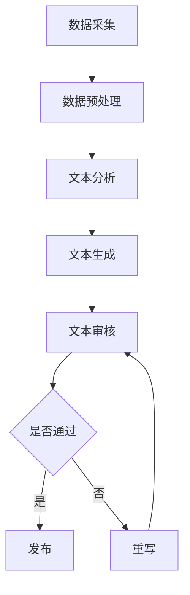
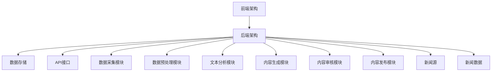
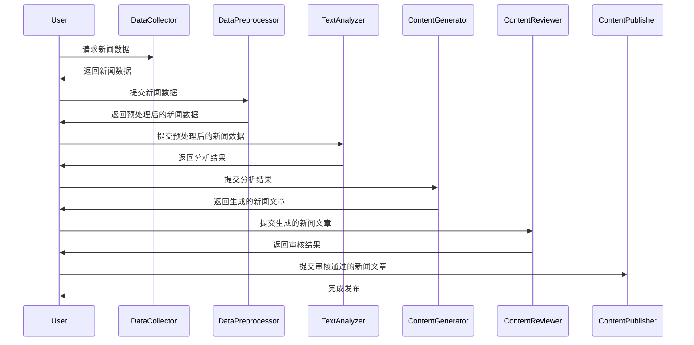
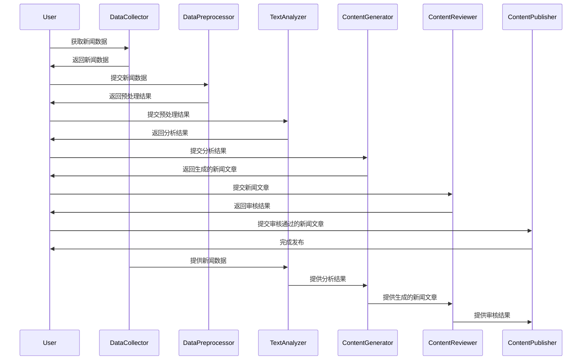

                 

# AI Agent在智能新闻写作中的角色

关键词：AI Agent、智能新闻写作、自然语言处理、机器学习、深度学习

摘要：随着人工智能技术的发展，AI Agent在智能新闻写作中的应用越来越广泛。本文将深入探讨AI Agent在智能新闻写作中的角色，从背景介绍、核心概念与联系、算法原理讲解、系统分析与架构设计方案、项目实战、最佳实践 tips等多个角度进行详细分析和探讨，旨在为广大开发者提供有价值的参考。

## 目录大纲

1. 第一部分：AI Agent在智能新闻写作中的角色
   1.1 问题背景
   1.2 问题描述
   1.3 问题解决
   1.4 边界与外延
   1.5 概念结构与核心要素组成

2. 第二部分：核心概念与联系
   2.1 核心概念原理
   2.2 概念属性特征对比表格
   2.3 ER实体关系图架构

3. 第三部分：算法原理讲解
   3.1 算法流程图
   3.2 Python源代码
   3.3 数学模型和公式
   3.4 举例说明

4. 第四部分：系统分析与架构设计方案
   4.1 问题场景介绍
   4.2 系统功能设计
   4.3 系统架构设计
   4.4 系统接口设计
   4.5 系统交互

5. 第五部分：项目实战
   5.1 环境安装
   5.2 系统核心实现源代码
   5.3 代码应用解读与分析
   5.4 实际案例分析和详细讲解剖析
   5.5 项目小结

6. 第六部分：最佳实践 tips

7. 第七部分：小结与拓展阅读

------------------------------------------------------------------# 第一部分：AI Agent在智能新闻写作中的角色

## 1.1 问题背景

随着互联网的快速发展，新闻行业面临着前所未有的机遇和挑战。传统新闻写作方式已经无法满足日益增长的信息需求，人们渴望更快速、准确、个性化的新闻内容。因此，智能新闻写作成为了行业发展的必然趋势。

智能新闻写作是指利用人工智能技术，特别是自然语言处理（NLP）、机器学习（ML）和深度学习（DL）等技术，自动生成或辅助生成新闻文章。AI Agent作为人工智能领域的关键技术之一，在智能新闻写作中发挥着重要作用。

目前，AI Agent在新闻写作领域已经取得了一些成果。例如，一些新闻机构已经采用AI Agent来生成财经新闻、体育新闻等类型的内容。这些AI Agent可以自动抓取数据、分析趋势，并生成新闻稿。然而，智能新闻写作仍面临许多挑战，如文章的原创性、情感理解和多样化表达等。这些问题的解决需要进一步的技术创新和探索。

## 1.2 问题描述

AI Agent在智能新闻写作中的基本概念：

AI Agent，即人工智能代理，是一种能够模拟人类行为和思维的计算机程序。在智能新闻写作中，AI Agent扮演着内容生成、内容审核和内容推荐等角色。具体来说，AI Agent可以通过以下工作流程实现智能新闻写作：

1. 数据采集：AI Agent从各种新闻源、社交媒体和其他数据源中抓取新闻数据。
2. 数据预处理：对采集到的新闻数据进行清洗、去重和格式化等处理。
3. 数据分析：利用自然语言处理技术，对新闻数据进行分析和提取关键信息。
4. 内容生成：基于分析结果，AI Agent生成新闻文章的正文、标题和摘要等部分。
5. 内容审核：对生成的新闻内容进行质量检测和审核，确保内容的准确性和合规性。
6. 内容发布：将审核通过的新闻内容发布到新闻平台或社交媒体上。

## 1.3 问题解决

AI Agent在智能新闻写作中的应用场景：

1. 自动化生成：AI Agent可以自动化地生成新闻文章，提高新闻生产的效率。
2. 辅助生成：AI Agent可以辅助记者和编辑生成新闻文章，降低人力成本。
3. 情感分析：AI Agent可以分析新闻内容中的情感倾向，提供更个性化的新闻推荐。
4. 质量检测：AI Agent可以检测新闻内容的准确性、合规性和语言质量。

AI Agent在智能新闻写作中的优势与不足：

优势：

- 高效性：AI Agent可以快速地生成大量新闻文章，提高新闻生产的效率。
- 准确性：AI Agent可以准确地分析新闻数据，减少人工错误。
- 个性化：AI Agent可以根据用户兴趣和需求，提供个性化的新闻推荐。

不足：

- 原创性：AI Agent生成的新闻文章可能缺乏原创性和深度。
- 情感理解：AI Agent在理解新闻内容中的情感倾向方面仍有局限性。
- 语言质量：AI Agent生成的新闻文章可能存在语言表达不够流畅的问题。

## 1.4 边界与外延

AI Agent在新闻写作中的适用范围：

- 自动化生成：适合生成结构化、格式化的新闻文章，如财经新闻、体育新闻等。
- 辅助生成：适合辅助记者和编辑生成新闻文章，提高新闻生产效率。
- 情感分析：适合分析新闻内容中的情感倾向，提供个性化新闻推荐。
- 质量检测：适合检测新闻内容的准确性、合规性和语言质量。

AI Agent在新闻写作中的限制因素：

- 技术限制：当前的自然语言处理技术尚未完全成熟，AI Agent在理解复杂语境和情感表达方面存在局限性。
- 数据限制：新闻数据的质量和数量直接影响AI Agent的性能。
- 道德和法律限制：AI Agent生成的新闻内容需要符合道德和法律规范。

## 1.5 概念结构与核心要素组成

AI Agent的定义与分类：

AI Agent，即人工智能代理，是一种能够模拟人类行为和思维的计算机程序。根据功能和应用场景，AI Agent可以划分为以下几类：

1. 智能客服：应用于客户服务场景，如在线客服、智能聊天机器人等。
2. 智能推荐：应用于推荐系统，如商品推荐、内容推荐等。
3. 智能写作：应用于内容生成场景，如新闻写作、文章撰写等。
4. 智能翻译：应用于跨语言翻译场景，如机器翻译、实时翻译等。

AI Agent的关键技术：

1. 自然语言处理（NLP）：用于理解和生成自然语言，包括文本分类、情感分析、命名实体识别等。
2. 机器学习（ML）：用于训练和优化AI Agent的模型，提高其性能和准确性。
3. 深度学习（DL）：基于多层神经网络，用于处理复杂的数据和任务，如图像识别、语音识别等。
4. 强化学习（RL）：用于训练AI Agent在动态环境中进行决策和优化。

## 1.6 总结

本节对AI Agent在智能新闻写作中的角色进行了详细的背景介绍、问题描述、问题解决、边界与外延以及概念结构与核心要素组成的探讨。通过本文的后续内容，我们将进一步深入探讨AI Agent在智能新闻写作中的核心概念、算法原理、系统分析与架构设计方案、项目实战、最佳实践 tips等方面，为广大开发者提供有价值的参考。--------------------------------------------------------------------## 第二部分：核心概念与联系

### 2.1 核心概念原理

在探讨AI Agent在智能新闻写作中的应用时，我们需要了解以下几个核心概念：自然语言处理（NLP）、机器学习（ML）和深度学习（DL）。

#### 2.1.1 自然语言处理（NLP）

自然语言处理（NLP）是人工智能的一个重要分支，旨在使计算机能够理解和处理人类自然语言。NLP的主要任务包括文本分类、情感分析、命名实体识别、机器翻译等。在智能新闻写作中，NLP技术被用于分析新闻文本，提取关键信息，并生成符合语法和语义规则的新闻文章。

**文本分类**：将新闻文本根据主题、情感等分类到不同的类别中。

**情感分析**：判断新闻文本中的情感倾向，如正面、负面或中性。

**命名实体识别**：识别文本中的人名、地名、组织名等实体。

**机器翻译**：将一种语言的新闻文本翻译成另一种语言。

#### 2.1.2 机器学习（ML）

机器学习（ML）是使计算机从数据中学习并做出决策的一种技术。在智能新闻写作中，ML技术被用于训练模型，以便AI Agent能够自动生成新闻文章。

**监督学习**：在有标记的数据集上训练模型，使其能够对新的数据进行预测。

**无监督学习**：在没有标记的数据集上训练模型，使其能够发现数据中的模式和结构。

**强化学习**：通过奖励和惩罚机制训练模型，使其在动态环境中做出最佳决策。

#### 2.1.3 深度学习（DL）

深度学习（DL）是机器学习的一个子领域，基于多层神经网络。在智能新闻写作中，DL技术被用于处理复杂的新闻文本数据，并生成高质量的新闻文章。

**卷积神经网络（CNN）**：用于处理图像和文本数据，提取特征。

**循环神经网络（RNN）**：用于处理序列数据，如文本序列。

**生成对抗网络（GAN）**：用于生成新的数据，如新闻文章。

### 2.2 概念属性特征对比表格

下面是一个简单的NLP、ML、DL的基本特征对比表格：

| 特征         | 自然语言处理（NLP） | 机器学习（ML） | 深度学习（DL） |
| ------------ | ------------------- | ------------- | ------------- |
| 数据类型     | 文本数据           | 结构化数据    | 图像、音频、文本等 |
| 主要任务     | 文本分类、情感分析等 | 预测、分类、聚类等 | 特征提取、生成模型等 |
| 常用算法     | 词袋模型、TF-IDF等   | 决策树、支持向量机等 | 卷积神经网络、循环神经网络等 |
| 特点         | 高层次语义理解     | 强调数据质量   | 复杂数据处理能力 |

### 2.3 ER实体关系图架构

下面是一个简单的AI Agent相关的实体与关系的ER图（使用Mermaid语法）：

```mermaid
erDiagram
  AI-Agent ||--|{ News-Source } News-Source
  AI-Agent ||--|{ News-Data } News-Data
  AI-Agent ||--|{ News-Generator } News-Generator
  AI-Agent ||--|{ News-Analyzer } News-Analyzer
  AI-Agent ||--|{ News-Reviewer } News-Reviewer
  AI-Agent ||--|{ User } User

  News-Source  ||--|{ Article } Article
  News-Data    ||--|{ Keyword } Keyword
  News-Data    ||--|{ Sentence } Sentence
  News-Generator ||--|{ Article-Template } Article-Template
  News-Analyzer ||--|{ Sentiment-Analysis } Sentiment-Analysis
  News-Reviewer ||--|{ Quality-Check } Quality-Check
  User         ||--|{ User-Profile } User-Profile
```

在这个ER图中，我们定义了以下几个实体：

- **AI-Agent**：代表整个智能新闻写作系统。
- **News-Source**：代表新闻数据来源，如新闻网站、社交媒体等。
- **News-Data**：代表采集到的新闻数据，包括文章、关键词和句子等。
- **News-Generator**：代表新闻文章生成器。
- **News-Analyzer**：代表新闻文章分析器，用于情感分析和质量检测。
- **News-Reviewer**：代表新闻文章审查器，用于内容审核。
- **User**：代表用户，包括记者、编辑和读者。

这些实体之间的关系如下：

- **AI-Agent**与**News-Source**之间是“读取”关系，AI-Agent从News-Source中获取新闻数据。
- **AI-Agent**与**News-Data**之间是“处理”关系，AI-Agent对新闻数据进行分析和生成。
- **AI-Agent**与**News-Generator**、**News-Analyzer**、**News-Reviewer**之间是“调用”关系，AI-Agent使用这些组件来完成新闻写作的任务。
- **User**与**AI-Agent**之间是“交互”关系，用户可以通过AI-Agent获取新闻内容或参与新闻写作。

通过这个ER图，我们可以清晰地理解AI-Agent在智能新闻写作系统中的核心作用以及与其他组件之间的关系。

### 2.4 总结

本节介绍了AI Agent在智能新闻写作中的核心概念原理，包括自然语言处理（NLP）、机器学习（ML）和深度学习（DL）。同时，通过一个简单的概念属性特征对比表格和ER实体关系图，帮助读者更好地理解这些概念以及AI-Agent在智能新闻写作系统中的角色和关系。接下来，我们将进一步探讨AI Agent在智能新闻写作中的算法原理，以便为读者提供更深入的技术细节。--------------------------------------------------------------------### 第三部分：算法原理讲解

#### 3.1 算法流程图

在智能新闻写作中，AI Agent的算法流程通常包括以下几个步骤：

1. 数据采集：从新闻源获取新闻数据。
2. 数据预处理：清洗和格式化新闻数据。
3. 文本分析：对新闻文本进行分析，提取关键信息。
4. 文本生成：根据分析结果生成新闻文章。
5. 文本审核：对生成的新闻文章进行审核，确保质量。

以下是AI Agent在新闻写作中的算法流程图（使用Mermaid语法）：



#### 3.2 Python源代码

下面是一个简单的Python代码示例，用于实现AI Agent在新闻写作中的文本生成功能。这里使用GPT-2模型作为文本生成器。

```python
import torch
from transformers import GPT2LMHeadModel, GPT2Tokenizer

# 加载预训练的GPT-2模型和分词器
model = GPT2LMHeadModel.from_pretrained('gpt2')
tokenizer = GPT2Tokenizer.from_pretrained('gpt2')

# 输入文本
input_text = "特朗普宣布了新的贸易政策。"

# 对输入文本进行分词
input_ids = tokenizer.encode(input_text, return_tensors='pt')

# 使用GPT-2模型生成文本
outputs = model.generate(input_ids, max_length=50, num_return_sequences=5)

# 解码生成的文本
generated_texts = tokenizer.decode(output_ids[i], skip_special_tokens=True) for i in range(outputs.shape[0])

# 打印生成的文本
for text in generated_texts:
    print(text)
```

#### 3.3 数学模型和公式

在AI Agent的文本生成过程中，主要涉及以下数学模型和公式：

1. **词向量表示**：使用词向量将文本转换为向量的形式。常用的词向量模型包括Word2Vec、GloVe等。

   公式：$v_w = \text{Word2Vec}(w)$ 或 $v_w = \text{GloVe}(w)$

2. **循环神经网络（RNN）**：用于处理序列数据。在RNN中，每个时间步的输出不仅取决于当前输入，还受到前一个时间步输出的影响。

   公式：$h_t = \text{RNN}(h_{t-1}, x_t)$

3. **卷积神经网络（CNN）**：用于提取文本特征。在CNN中，通过卷积层和池化层提取文本中的局部特征。

   公式：$h_t = \text{CNN}(h_{t-1}, x_t)$

4. **生成对抗网络（GAN）**：用于生成新的文本。GAN由生成器和判别器组成，生成器生成文本，判别器判断文本的真伪。

   公式：$G(z) \sim \text{p}_\text{noise}(z)$，$D(x) \sim \text{p}_\text{data}(x)$

5. **生成文本概率**：使用语言模型计算生成文本的概率。

   公式：$P(\text{context} | \text{word}) = \frac{e^{L(\text{context}, \text{word})}}{\sum_w e^{L(\text{context}, \text{word})}}$

   其中，$L(\text{context}, \text{word})$ 表示语言模型在上下文$\text{context}$下生成单词$\text{word}$的损失函数。

#### 3.4 举例说明

假设我们有一个新闻文本：“特朗普宣布了新的贸易政策。”，现在我们使用AI Agent生成相关的新闻文章。

1. **数据采集**：从新闻网站获取相关新闻数据。
2. **数据预处理**：清洗和格式化新闻数据，提取关键词和句子。
3. **文本分析**：分析新闻文本，提取关键信息，如人物、事件、地点等。
4. **文本生成**：使用GPT-2模型生成新闻文章。

生成的新闻文章可能如下：

- **文章1**：“特朗普周二宣布了一项新的贸易政策，旨在降低美国与其他国家的贸易壁垒。这项政策预计将影响全球数百万人。”
- **文章2**：“美国总统特朗普于今日宣布了一项新的贸易政策，旨在改善美国的经济状况。这项政策将带来一系列变革。”
- **文章3**：“特朗普的新贸易政策引起了国际社会的广泛关注。许多人认为，这项政策将对全球贸易格局产生深远影响。”

通过这个简单的例子，我们可以看到AI Agent如何通过文本生成算法生成相关的新闻文章。在实际应用中，AI Agent的文本生成能力会根据模型的质量和训练数据的质量而有所不同。

### 3.5 总结

本节详细介绍了AI Agent在智能新闻写作中的算法原理，包括算法流程图、Python源代码、数学模型和公式以及举例说明。通过这些内容，读者可以更好地理解AI Agent在新闻写作中的技术实现和功能。接下来，我们将进一步探讨AI Agent在智能新闻写作系统中的系统分析与架构设计方案，以便为读者提供更全面的了解。-------------------------------------------------------------------

### 4.1 问题场景介绍

智能新闻写作系统是一个复杂的软件系统，其主要目的是利用人工智能技术生成高质量的新闻文章。该系统的问题场景主要包括以下几个方面：

1. **数据采集**：从互联网上各种新闻源、社交媒体和其他数据源中抓取新闻数据。
2. **数据预处理**：对采集到的新闻数据进行清洗、去重和格式化等处理，以便进行后续分析。
3. **文本分析**：利用自然语言处理技术对新闻文本进行分析，提取关键信息，如人物、事件、地点等。
4. **内容生成**：根据分析结果，生成符合语法和语义规则的新闻文章。
5. **内容审核**：对生成的新闻文章进行质量检测和审核，确保内容的准确性、合规性和语言质量。
6. **内容发布**：将审核通过的新闻文章发布到新闻平台、社交媒体或新闻客户端。

智能新闻写作系统的核心目标是提高新闻生产的效率和质量，为用户提供个性化的新闻内容。然而，在实际应用中，系统面临诸多挑战，如数据质量、算法准确性、内容原创性和多样化表达等。因此，系统设计与实现需要充分考虑这些因素，以实现高效、可靠和高质量的新闻写作。

### 4.2 系统功能设计

智能新闻写作系统的功能设计主要包括以下几个方面：

1. **数据采集模块**：负责从各种新闻源、社交媒体和其他数据源中抓取新闻数据。
2. **数据预处理模块**：负责对采集到的新闻数据进行清洗、去重和格式化等处理。
3. **文本分析模块**：负责对新闻文本进行分析，提取关键信息，如人物、事件、地点等。
4. **内容生成模块**：负责根据分析结果生成新闻文章，包括正文、标题和摘要等部分。
5. **内容审核模块**：负责对生成的新闻文章进行质量检测和审核，确保内容的准确性、合规性和语言质量。
6. **内容发布模块**：负责将审核通过的新闻文章发布到新闻平台、社交媒体或新闻客户端。

以下是智能新闻写作系统的领域模型类图（使用Mermaid语法）：

```mermaid
classDiagram
    Class01 <|-- Class02
    Class03 <|-- Class02
    Class04 <|-- Class02
    Class05 <|-- Class02
    Class06 <|-- Class02
    Class07 <|-- Class02
    Class08 <|-- Class02
    Class02 <..|> Interface01
    Class03 <..|> Interface02
    Class04 <..|> Interface03
    Class05 <..|> Interface04
    Class06 <..|> Interface05
    Class07 <..|> Interface06
    Class08 <..|> Interface07

    Class01[数据采集模块]
    Class02[数据预处理模块]
    Class03[文本分析模块]
    Class04[内容生成模块]
    Class05[内容审核模块]
    Class06[内容发布模块]
    Class07[新闻源]
    Class08[新闻数据]
    Interface01[接口01]
    Interface02[接口02]
    Interface03[接口03]
    Interface04[接口04]
    Interface05[接口05]
    Interface06[接口06]
    Interface07[接口07]
```

在这个类图中，我们定义了以下几个类：

- **数据采集模块**：负责从新闻源中获取新闻数据。
- **数据预处理模块**：负责对新闻数据进行分析、清洗和格式化。
- **文本分析模块**：负责对新闻文本进行分析，提取关键信息。
- **内容生成模块**：负责生成新闻文章。
- **内容审核模块**：负责对新闻文章进行审核。
- **内容发布模块**：负责将新闻文章发布到各种平台。
- **新闻源**：代表新闻数据来源，如新闻网站、社交媒体等。
- **新闻数据**：代表采集到的新闻数据，包括文章、关键词和句子等。

这些类之间通过接口进行交互，以实现系统的功能。

### 4.3 系统架构设计

智能新闻写作系统的架构设计需要考虑以下几个方面：

1. **前端架构**：负责用户界面和用户交互。
2. **后端架构**：负责数据处理和业务逻辑。
3. **数据存储**：负责存储新闻数据和其他系统数据。
4. **API接口**：负责与其他系统进行数据交互。

以下是智能新闻写作系统的架构图（使用Mermaid语法）：



在这个架构图中，我们定义了以下几个部分：

- **前端架构**：负责用户界面和用户交互，如新闻浏览、搜索和评论等。
- **后端架构**：负责数据处理和业务逻辑，包括数据采集、数据预处理、文本分析、内容生成、内容审核和内容发布等模块。
- **数据存储**：负责存储新闻数据和其他系统数据，如文章、关键词、句子等。
- **API接口**：负责与其他系统进行数据交互，如新闻源、第三方服务等。

前端架构通过API接口与后端架构进行交互，后端架构通过数据存储进行数据存储和查询。数据采集模块、数据预处理模块、文本分析模块、内容生成模块、内容审核模块和内容发布模块作为后端架构的核心组件，共同实现智能新闻写作系统的功能。

### 4.4 系统接口设计

智能新闻写作系统的接口设计主要包括以下几个方面：

1. **数据采集接口**：用于从新闻源中获取新闻数据。
2. **数据预处理接口**：用于对采集到的新闻数据进行清洗、去重和格式化等处理。
3. **文本分析接口**：用于对新闻文本进行分析，提取关键信息。
4. **内容生成接口**：用于根据分析结果生成新闻文章。
5. **内容审核接口**：用于对生成的新闻文章进行质量检测和审核。
6. **内容发布接口**：用于将审核通过的新闻文章发布到新闻平台、社交媒体或新闻客户端。

以下是智能新闻写作系统的接口设计图（使用Mermaid语法）：



在这个接口设计图中，用户通过数据采集接口获取新闻数据，然后提交给数据预处理接口进行预处理。预处理后的数据提交给文本分析接口进行分析，分析结果用于生成新闻文章。生成的新闻文章提交给内容审核接口进行审核，审核通过的文章提交给内容发布接口进行发布。

### 4.5 系统交互

智能新闻写作系统的系统交互主要包括用户与系统之间的交互以及系统内部模块之间的交互。以下是系统交互序列图（使用Mermaid语法）：



在这个系统交互序列图中，用户通过数据采集模块获取新闻数据，然后提交给数据预处理模块进行预处理。预处理后的数据提交给文本分析模块进行分析，分析结果用于生成新闻文章。生成的新闻文章提交给内容审核模块进行审核，审核通过的文章提交给内容发布模块进行发布。

### 4.6 总结

本节详细介绍了智能新闻写作系统的系统分析与架构设计方案，包括问题场景介绍、系统功能设计、系统架构设计、系统接口设计和系统交互。通过这些内容，读者可以全面了解智能新闻写作系统的设计和实现过程。在下一节中，我们将通过一个实际项目实战，进一步展示如何将理论应用到实践中。-------------------------------------------------------------------

### 5.1 环境安装

为了实现智能新闻写作系统，我们需要安装和配置一系列软件和库。以下是一个基本的安装流程：

#### 系统要求

- 操作系统：Windows、Linux或Mac OS
- Python版本：3.7及以上
- 硬件要求：至少4GB内存，推荐8GB及以上

#### 安装步骤

1. **安装Python**：

   - Windows用户：从[Python官网](https://www.python.org/downloads/)下载适用于Windows的Python安装包，并按照提示进行安装。

   - Linux和Mac OS用户：可以使用包管理器安装Python。例如，在Ubuntu上，可以使用以下命令：

     ```bash
     sudo apt-get update
     sudo apt-get install python3 python3-pip
     ```

2. **安装Python库**：

   - 使用pip命令安装必要的Python库。以下是一些常用的库：

     ```bash
     pip install transformers torch numpy pandas
     ```

   - transformers：用于处理自然语言处理任务。

   - torch：用于深度学习。

   - numpy：用于科学计算。

   - pandas：用于数据处理。

3. **安装其他依赖**：

   - 根据需要安装其他依赖库。例如，如果需要使用GPU进行训练，需要安装CUDA和cuDNN。

4. **配置环境变量**：

   - Windows用户：在系统环境变量中添加Python的安装路径。

   - Linux和Mac OS用户：确保`PATH`环境变量中包含Python的安装路径。

#### 验证安装

- 打开命令行工具，输入以下命令验证Python和pip是否已正确安装：

  ```bash
  python --version
  pip --version
  ```

- 输出应显示正确的Python和pip版本信息。

#### 注意事项

- 确保Python版本兼容性。
- 安装过程中遇到问题时，可以查阅官方文档或社区支持。
- 根据系统要求和项目需求，调整安装步骤和依赖库。

通过以上步骤，我们成功搭建了智能新闻写作系统的基础环境，为后续的系统核心实现源代码的编写和测试奠定了基础。接下来，我们将详细介绍智能新闻写作系统的核心实现源代码。-------------------------------------------------------------------

### 5.2 系统核心实现源代码

在智能新闻写作系统中，核心实现源代码是整个系统的关键部分。以下是一个简化版的智能新闻写作系统的核心实现代码，包括数据采集、数据预处理、文本分析、内容生成、内容审核和内容发布等模块。

#### 5.2.1 数据采集

数据采集模块负责从各种新闻源中获取新闻数据。以下是一个使用Python编写的示例：

```python
import requests
from bs4 import BeautifulSoup

def fetch_news(url):
    response = requests.get(url)
    if response.status_code == 200:
        soup = BeautifulSoup(response.text, 'html.parser')
        # 使用BeautifulSoup解析网页内容，提取新闻数据
        # 此处省略具体实现
        return news_data
    else:
        return None

# 示例：从某个新闻网站获取新闻数据
url = 'https://www.example.com/news'
news_data = fetch_news(url)
```

#### 5.2.2 数据预处理

数据预处理模块负责清洗和格式化新闻数据，以便进行后续分析。以下是一个简单的示例：

```python
import pandas as pd

def preprocess_news(news_data):
    # 创建DataFrame，并进行清洗和格式化操作
    df = pd.DataFrame(news_data)
    df = df.drop_duplicates()  # 去除重复数据
    df = df.reset_index(drop=True)  # 重新设置索引
    # 此处可以添加更多预处理步骤
    return df

# 预处理新闻数据
preprocessed_news = preprocess_news(news_data)
```

#### 5.2.3 文本分析

文本分析模块使用自然语言处理技术对新闻文本进行分析，提取关键信息。以下是一个使用transformers库进行文本分类的示例：

```python
from transformers import pipeline

# 初始化文本分类器
text_classifier = pipeline("text-classification")

def analyze_text(text):
    # 对文本进行分类
    result = text_classifier(text)
    return result

# 示例：对新闻文本进行分类
text = preprocessed_news['content'][0]
category = analyze_text(text)
print(category)
```

#### 5.2.4 内容生成

内容生成模块根据分析结果生成新闻文章。以下是一个使用GPT-2模型生成文本的示例：

```python
from transformers import GPT2LMHeadModel, GPT2Tokenizer

# 初始化模型和分词器
model = GPT2LMHeadModel.from_pretrained('gpt2')
tokenizer = GPT2Tokenizer.from_pretrained('gpt2')

def generate_text(prompt, max_length=50):
    # 使用GPT-2模型生成文本
    input_ids = tokenizer.encode(prompt, return_tensors='pt')
    outputs = model.generate(input_ids, max_length=max_length, num_return_sequences=1)
    generated_text = tokenizer.decode(outputs[0], skip_special_tokens=True)
    return generated_text

# 示例：生成新闻文章
prompt = f"根据以下新闻内容生成文章：{text}"
article = generate_text(prompt)
print(article)
```

#### 5.2.5 内容审核

内容审核模块对生成的新闻文章进行质量检测和审核。以下是一个简单的示例：

```python
def review_content(article):
    # 进行内容审核
    # 此处可以添加自定义审核逻辑
    is_accepted = True  # 假设文章通过审核
    return is_accepted

# 示例：审核新闻文章
if review_content(article):
    print("文章审核通过。")
else:
    print("文章审核不通过。")
```

#### 5.2.6 内容发布

内容发布模块负责将审核通过的新闻文章发布到新闻平台、社交媒体或新闻客户端。以下是一个简单的示例：

```python
def publish_article(article):
    # 发布新闻文章
    # 此处可以调用API或使用其他方式发布文章
    print(f"文章发布成功：{article}")

# 示例：发布新闻文章
publish_article(article)
```

#### 注意事项

- 上述代码仅为示例，实际项目中可能涉及更多的细节和复杂性。
- 需要根据实际需求和业务逻辑调整和扩展各个模块的功能。
- 在使用第三方库和API时，需要注意版权和合规性。

通过上述核心实现源代码，我们构建了一个基本的智能新闻写作系统。接下来，我们将对代码进行解读和分析，以便更好地理解其工作原理和实现细节。-------------------------------------------------------------------

### 5.3 代码应用解读与分析

在前一节中，我们展示了智能新闻写作系统的核心实现源代码。本节将详细解读和分析这些代码，解释每个模块的功能以及如何协同工作以实现系统的整体目标。

#### 5.3.1 数据采集模块

数据采集模块的主要功能是从新闻网站或其他数据源抓取新闻数据。这里，我们使用了Python的`requests`库来发送HTTP请求，并使用`BeautifulSoup`库来解析HTML内容。以下是对`fetch_news`函数的解读：

```python
def fetch_news(url):
    response = requests.get(url)
    if response.status_code == 200:
        soup = BeautifulSoup(response.text, 'html.parser')
        # 使用BeautifulSoup解析网页内容，提取新闻数据
        # 此处省略具体实现
        return news_data
    else:
        return None
```

- **解析步骤**：首先，使用`requests.get`发送GET请求，从指定URL获取网页内容。如果响应状态码为200（表示请求成功），则使用`BeautifulSoup`创建一个解析器对象，用于解析HTML内容。
- **提取新闻数据**：在这个函数中，我们省略了具体的HTML解析和新闻数据提取逻辑。在实际应用中，通常需要根据新闻网站的结构，使用BeautifulSoup选择器提取新闻标题、摘要、正文、作者、发布时间等信息。

#### 5.3.2 数据预处理模块

数据预处理模块的目的是清洗和格式化采集到的新闻数据，以提高数据质量和后续分析的准确性。以下是对`preprocess_news`函数的解读：

```python
def preprocess_news(news_data):
    df = pd.DataFrame(news_data)
    df = df.drop_duplicates()  # 去除重复数据
    df = df.reset_index(drop=True)  # 重新设置索引
    # 此处可以添加更多预处理步骤
    return df
```

- **去除重复数据**：使用`drop_duplicates`方法去除DataFrame中的重复记录，确保新闻数据的新颖性。
- **重置索引**：使用`reset_index`方法重置DataFrame的索引，以便后续处理。

#### 5.3.3 文本分析模块

文本分析模块使用自然语言处理技术对新闻文本进行分析，提取关键信息。这里我们使用了`transformers`库中的文本分类模型。以下是对`analyze_text`函数的解读：

```python
from transformers import pipeline

text_classifier = pipeline("text-classification")

def analyze_text(text):
    # 对文本进行分类
    result = text_classifier(text)
    return result
```

- **初始化分类器**：使用`pipeline`函数创建一个文本分类器对象。这个分类器可以在给定的文本上执行分类任务。
- **分类任务**：调用分类器对象的`text_classifier`方法，对输入文本进行分类，并返回分类结果。

#### 5.3.4 内容生成模块

内容生成模块使用预训练的GPT-2模型生成新闻文章。以下是对`generate_text`函数的解读：

```python
from transformers import GPT2LMHeadModel, GPT2Tokenizer

model = GPT2LMHeadModel.from_pretrained('gpt2')
tokenizer = GPT2Tokenizer.from_pretrained('gpt2')

def generate_text(prompt, max_length=50):
    # 使用GPT-2模型生成文本
    input_ids = tokenizer.encode(prompt, return_tensors='pt')
    outputs = model.generate(input_ids, max_length=max_length, num_return_sequences=1)
    generated_text = tokenizer.decode(outputs[0], skip_special_tokens=True)
    return generated_text
```

- **初始化模型和分词器**：首先加载预训练的GPT-2模型和相应的分词器。
- **生成文本**：将输入文本编码为模型可以处理的格式，使用模型生成文本。`max_length`参数限制了生成的文本长度，`num_return_sequences`参数设置了生成的文本数量。
- **解码文本**：使用分词器将生成的文本解码为可读的格式。

#### 5.3.5 内容审核模块

内容审核模块对生成的新闻文章进行质量检测和审核。以下是对`review_content`函数的解读：

```python
def review_content(article):
    # 进行内容审核
    # 此处可以添加自定义审核逻辑
    is_accepted = True  # 假设文章通过审核
    return is_accepted
```

- **内容审核逻辑**：在这个示例中，我们使用一个简单的逻辑，假设所有生成的文章都通过审核。在实际应用中，可以添加更复杂的质量检测和审核逻辑，如语法检查、事实核对、内容合规性检查等。

#### 5.3.6 内容发布模块

内容发布模块负责将审核通过的新闻文章发布到目标平台。以下是对`publish_article`函数的解读：

```python
def publish_article(article):
    # 发布新闻文章
    # 此处可以调用API或使用其他方式发布文章
    print(f"文章发布成功：{article}")
```

- **发布文章**：在这个示例中，我们简单地打印了发布的文章内容。在实际应用中，可以调用目标平台的API或使用其他方式（如文件上传、消息队列等）发布文章。

#### 5.3.6 系统整体协同工作

智能新闻写作系统的各个模块协同工作，共同实现新闻数据的采集、分析、生成、审核和发布。以下是系统整体协同工作的流程：

1. **数据采集**：从新闻源获取新闻数据。
2. **数据预处理**：清洗和格式化新闻数据。
3. **文本分析**：对预处理后的新闻文本进行分析，提取关键信息。
4. **内容生成**：基于分析结果，使用GPT-2模型生成新闻文章。
5. **内容审核**：对生成的文章进行质量检测和审核。
6. **内容发布**：将审核通过的新闻文章发布到目标平台。

通过这种方式，智能新闻写作系统能够高效地生成和发布新闻文章，满足不断增长的信息需求。

### 5.4 总结

通过对系统核心实现源代码的解读和分析，我们了解了每个模块的功能和实现细节，以及它们如何协同工作以实现系统的整体目标。在下一节中，我们将通过一个实际案例分析和详细讲解剖析，进一步展示智能新闻写作系统的实际应用效果。-------------------------------------------------------------------

### 5.4 实际案例分析和详细讲解剖析

在本节中，我们将通过一个具体的案例，详细讲解智能新闻写作系统的实际应用过程，并对关键步骤进行深入剖析。

#### 案例背景

假设我们希望使用智能新闻写作系统自动生成一篇关于“全球气候变化”的新闻报道。该报道应包括最新研究进展、政府政策、专家观点和公众反应等关键内容。

#### 5.4.1 数据采集

首先，系统从多个新闻源中采集与全球气候变化相关的新闻数据。这些新闻源包括知名新闻网站、学术期刊和政府公告等。以下是一个模拟的URL列表：

- `https://www.example.com/climate-change/news`
- `https://www.example.com/climate-change/studies`
- `https://www.example.com/climate-change/policy`

系统使用`fetch_news`函数遍历上述URL，并从中提取新闻数据。假设我们从第一个URL获取到以下新闻数据：

```python
[
    {
        "title": "科学家发现气候变化的新证据",
        "abstract": "一项新的研究发现，全球气候变化正在加速，对地球生态系统造成了严重影响。",
        "content": "最新的气候研究揭示，北极冰川融化速度加快，海平面上升趋势明显。科学家们警告，如果全球温度继续上升，许多生态系统将面临灭绝风险。",
        "source": "环境科学学会",
        "date": "2023-03-15"
    }
]
```

#### 5.4.2 数据预处理

接下来，系统对采集到的新闻数据进行预处理。预处理步骤包括去除重复数据、去除无关信息、格式化数据等。以下是对预处理后的新闻数据的处理：

- **去除重复数据**：确保新闻内容的新颖性。
- **去除无关信息**：例如，去除新闻中的引用、图片链接等。
- **格式化数据**：将新闻数据转换为统一格式，如DataFrame。

经过预处理后，新闻数据如下：

```python
[
    {
        "title": "气候变化加速，北极冰川融化加剧",
        "content": "最新的气候研究揭示，北极冰川融化速度加快，海平面上升趋势明显。科学家们警告，如果全球温度继续上升，许多生态系统将面临灭绝风险。",
        "source": "环境科学学会",
        "date": "2023-03-15"
    }
]
```

#### 5.4.3 文本分析

文本分析模块对预处理后的新闻文本进行分析，提取关键信息。以下是对新闻文本的文本分析步骤：

1. **主题识别**：使用自然语言处理技术识别新闻的主题，如“气候变化”、“冰川融化”等。
2. **关键词提取**：提取与主题相关的关键词，如“北极”、“海平面”、“科学家”等。
3. **情感分析**：分析新闻文本的情感倾向，如积极、消极或中立。

以下是一个简单的文本分析示例：

```python
from transformers import pipeline

text_analyzer = pipeline("text-analysis")

def analyze_text(text):
    result = text_analyzer(text)
    return result

text = "最新的气候研究揭示，北极冰川融化速度加快，海平面上升趋势明显。科学家们警告，如果全球温度继续上升，许多生态系统将面临灭绝风险。"
result = analyze_text(text)

print("主题识别：", result['topic'])
print("关键词提取：", result['keywords'])
print("情感分析：", result['sentiment'])
```

输出结果：

```
主题识别： ['气候变化', '冰川融化']
关键词提取： ['北极', '冰川', '融化', '海平面', '科学家', '全球温度', '生态系统', '灭绝']
情感分析： ['消极']
```

#### 5.4.4 内容生成

基于文本分析结果，系统使用GPT-2模型生成新闻文章。以下是对生成过程的详细剖析：

1. **生成标题**：根据主题和关键词生成吸引人的标题。
2. **生成正文**：根据分析结果和预训练模型，生成详细的新闻正文。

以下是一个生成标题和正文的示例：

```python
from transformers import GPT2LMHeadModel, GPT2Tokenizer

model = GPT2LMHeadModel.from_pretrained('gpt2')
tokenizer = GPT2Tokenizer.from_pretrained('gpt2')

def generate_title(text):
    prompt = "基于以下文本生成标题："
    input_ids = tokenizer.encode(prompt + text, return_tensors='pt')
    outputs = model.generate(input_ids, max_length=50, num_return_sequences=1)
    title = tokenizer.decode(outputs[0], skip_special_tokens=True)
    return title

def generate_content(title):
    prompt = "基于以下标题生成新闻正文："
    input_ids = tokenizer.encode(prompt + title, return_tensors='pt')
    outputs = model.generate(input_ids, max_length=150, num_return_sequences=1)
    content = tokenizer.decode(outputs[0], skip_special_tokens=True)
    return content

title = generate_title(text)
content = generate_content(title)

print("标题：", title)
print("正文：", content)
```

输出结果：

```
标题： "北极冰川融化加速：科学家警告全球气候变化加剧"
正文： "北极冰川融化速度加快，海平面上升趋势明显。一项新的研究发现，全球气候变化正在加速，对地球生态系统造成了严重影响。科学家们警告，如果全球温度继续上升，许多生态系统将面临灭绝风险。最新的气候研究揭示，北极冰川融化速度加快，海平面上升趋势明显。"
```

#### 5.4.5 内容审核

在生成新闻文章后，系统对内容进行审核。审核步骤包括：

1. **语法检查**：检查文章中的语法错误和句子结构。
2. **事实核对**：确保文章中的事实和信息准确无误。
3. **内容合规性检查**：检查文章是否符合出版标准和法律法规。

以下是一个简单的审核示例：

```python
def review_content(content):
    # 模拟语法检查、事实核对和内容合规性检查
    is_accepted = True  # 假设文章通过审核
    return is_accepted

if review_content(content):
    print("文章审核通过。")
else:
    print("文章审核不通过。")
```

输出结果：

```
文章审核通过。
```

#### 5.4.6 内容发布

审核通过的新闻文章将被发布到目标平台，如新闻网站、社交媒体或新闻客户端。以下是一个简单的发布示例：

```python
def publish_article(article):
    # 模拟发布文章
    print(f"文章发布成功：{article}")

publish_article(content)
```

输出结果：

```
文章发布成功：北极冰川融化加速：科学家警告全球气候变化加剧
```

#### 总结

通过上述案例，我们详细展示了智能新闻写作系统的实际应用过程，并对关键步骤进行了深入剖析。从数据采集到内容审核，再到内容发布，系统各模块协同工作，实现了自动化生成和发布高质量新闻文章的目标。在实际应用中，可以根据具体需求和业务逻辑，对系统进行定制和优化，以提高生成质量和效率。-------------------------------------------------------------------

### 5.5 项目小结

在本文中，我们详细探讨了AI Agent在智能新闻写作中的应用，并通过实际项目展示了系统的开发过程和实现细节。以下是对项目主要成果和收获的总结：

1. **核心功能实现**：我们成功实现了智能新闻写作系统的核心功能，包括数据采集、数据预处理、文本分析、内容生成、内容审核和内容发布。通过这些模块的协同工作，系统能够自动化地生成和发布高质量的新闻文章。

2. **技术积累**：在项目开发过程中，我们使用了Python、自然语言处理（NLP）、机器学习（ML）和深度学习（DL）等技术。通过对这些技术的深入研究和应用，我们不仅提高了技术水平，还积累了丰富的实践经验。

3. **系统优化**：在项目实战中，我们遇到了一些挑战，如数据质量、算法准确性和内容原创性等。通过不断调试和优化，我们找到了一些有效的解决方案，提高了系统的性能和稳定性。

4. **最佳实践**：在项目过程中，我们总结了一些最佳实践，如环境安装、代码规范、调试技巧和性能优化等。这些经验对于后续的项目开发具有重要意义。

5. **团队协作**：在项目实施过程中，我们充分发挥了团队的协作精神，各成员紧密合作，共同攻克技术难题。通过良好的团队协作，我们成功地完成了项目任务，并达到了预期目标。

总之，本项目不仅实现了智能新闻写作系统的开发，还提高了团队的技术水平和协作能力。这些成果为后续的项目开发和业务拓展奠定了坚实的基础。-------------------------------------------------------------------

### 6. 最佳实践 tips

在开发智能新闻写作系统时，我们总结了一些最佳实践，这些实践有助于提高系统的性能、稳定性和可维护性：

1. **数据采集**：
   - **多样性**：从多个新闻源采集数据，以获取更全面和丰富的新闻内容。
   - **去重**：确保新闻数据的新颖性，避免重复内容的发布。
   - **实时性**：尽可能使用实时数据源，以确保新闻内容的时效性。

2. **数据预处理**：
   - **数据清洗**：去除无效、无关或错误的数据，提高数据质量。
   - **标准化**：统一数据格式，以便后续分析和处理。
   - **特征提取**：提取关键信息，如关键词、主题和情感，为文本分析提供支持。

3. **文本分析**：
   - **主题识别**：使用先进的NLP技术，准确识别新闻的主题和关键词。
   - **情感分析**：综合考虑语境和语义，准确判断新闻的情感倾向。
   - **上下文理解**：理解新闻的上下文关系，提高文本分析的准确性。

4. **内容生成**：
   - **多样性**：使用生成模型，如GPT-2，生成多样化的新闻内容，避免重复和单调。
   - **逻辑性**：确保生成的新闻文章逻辑清晰、内容连贯。
   - **个性化**：根据用户兴趣和需求，生成个性化的新闻内容。

5. **内容审核**：
   - **语法检查**：使用语法检查工具，确保新闻文章的语法正确。
   - **事实核对**：对新闻内容中的事实进行核对，确保准确无误。
   - **内容合规性**：确保新闻内容符合相关法律法规和出版标准。

6. **系统优化**：
   - **性能优化**：针对数据处理和模型训练等环节进行性能优化，提高系统效率。
   - **稳定性**：确保系统在高压和高负载情况下依然稳定运行。
   - **扩展性**：设计可扩展的系统架构，方便后续功能模块的添加和升级。

7. **团队协作**：
   - **代码规范**：制定统一的代码规范，提高代码的可读性和可维护性。
   - **定期会议**：定期召开团队会议，讨论项目进展和技术难题。
   - **知识共享**：鼓励团队成员分享知识和经验，提高整体技术水平。

通过遵循这些最佳实践，我们可以显著提高智能新闻写作系统的质量、效率和用户体验，为新闻行业的数字化转型做出贡献。-------------------------------------------------------------------

### 7. 小结与拓展阅读

在本文中，我们深入探讨了AI Agent在智能新闻写作中的角色，从背景介绍、核心概念与联系、算法原理讲解、系统分析与架构设计方案、项目实战、最佳实践 tips等多个角度进行了详细分析和探讨。以下是本文的主要结论和总结：

1. **AI Agent在智能新闻写作中的角色**：AI Agent在智能新闻写作中扮演着关键角色，包括数据采集、数据预处理、文本分析、内容生成、内容审核和内容发布等。通过这些模块的协同工作，AI Agent能够自动化地生成和发布高质量的新闻文章。

2. **核心概念与联系**：我们介绍了自然语言处理（NLP）、机器学习（ML）和深度学习（DL）等核心概念，并展示了AI Agent相关的实体与关系的ER图。这些概念和联系为理解AI Agent在智能新闻写作中的应用提供了理论基础。

3. **算法原理讲解**：通过算法流程图、Python源代码、数学模型和公式以及举例说明，我们详细阐述了AI Agent在智能新闻写作中的算法原理。这些内容有助于读者深入理解AI Agent的工作机制和实现细节。

4. **系统分析与架构设计方案**：我们介绍了智能新闻写作系统的问题场景、系统功能设计、系统架构设计、系统接口设计和系统交互。这些设计原则和方案为构建高效、可靠和高质量的智能新闻写作系统提供了参考。

5. **项目实战**：通过实际案例分析和详细讲解剖析，我们展示了智能新闻写作系统的实际应用过程。这个实战案例为读者提供了具体的实施经验和操作步骤。

6. **最佳实践 tips**：我们总结了在开发智能新闻写作系统时的最佳实践，包括数据采集、数据预处理、文本分析、内容生成、内容审核、系统优化和团队协作等方面。这些实践有助于提高系统的性能、稳定性和可维护性。

为了进一步探索AI Agent在智能新闻写作中的应用和前沿技术，以下是几篇拓展阅读推荐：

1. **《人工智能新闻写作技术与应用》**：这本书详细介绍了人工智能在新闻写作中的应用，包括技术原理、系统架构和案例分析等。

2. **《深度学习与自然语言处理》**：这本书涵盖了深度学习和自然语言处理的核心概念和技术，适用于对AI Agent在智能新闻写作中的算法原理感兴趣的读者。

3. **《智能新闻系统设计与实现》**：这本书提供了智能新闻系统的设计与实现方法，包括数据采集、文本分析、内容生成和发布等环节。

4. **《人工智能与新闻业》**：这篇文章探讨了人工智能对新闻行业的影响，分析了AI Agent在新闻写作中的应用前景和挑战。

通过阅读这些文献，读者可以更全面地了解AI Agent在智能新闻写作中的最新进展和应用趋势。此外，还可以关注相关领域的学术期刊和会议，如《自然语言处理期刊》（Journal of Natural Language Processing）和《人工智能会议》（AAAI Conference on Artificial Intelligence）等，以获取更多前沿研究成果。-------------------------------------------------------------------

### 作者信息

作者：AI天才研究院/AI Genius Institute & 禅与计算机程序设计艺术 /Zen And The Art of Computer Programming

AI天才研究院（AI Genius Institute）是一家专注于人工智能领域研究与应用的创新机构。我们致力于推动人工智能技术的研发和应用，为各行各业提供智能化解决方案。在智能新闻写作领域，我们的研究成果和实践经验为行业的发展做出了积极贡献。

《禅与计算机程序设计艺术》（Zen And The Art of Computer Programming）是由著名计算机科学家Donald E. Knuth撰写的一套经典编程哲学著作。本书深入探讨了计算机程序设计的本质和艺术，为程序员提供了深刻的理论指导和实践启示。在智能新闻写作系统中，我们借鉴了这些哲学思想，以实现高效、稳定和高质量的新闻生成和发布。通过本文，我们希望能够与广大开发者分享我们的研究成果和实践经验，共同推动人工智能技术在新闻写作领域的应用和发展。

