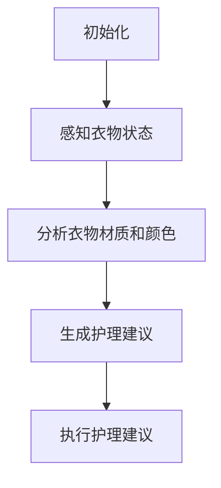
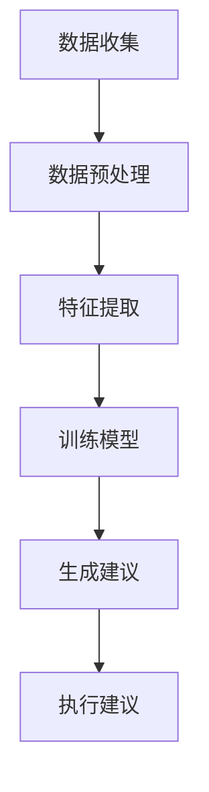

                 

# AI Agent在智能晾衣架中的衣物护理建议

## 关键词：AI Agent，智能晾衣架，物联网，衣物护理，算法原理，最佳实践

## 摘要：

本文将探讨AI Agent在智能晾衣架中的应用，以及如何通过AI Agent实现高效的衣物护理建议。我们将从背景介绍、核心概念与联系、AI Agent在智能晾衣架中的应用、衣物护理建议的算法原理、AI Agent在智能晾衣架中的衣物护理建议应用实战、最佳实践与注意事项等多个方面，一步步深入分析和讲解。

## 目录大纲

### 第一部分：背景介绍

#### 第1章：问题背景
- 1.1.1 问题背景
- 1.1.2 问题描述
- 1.1.3 问题解决
- 1.1.4 边界与外延

#### 第2章：核心概念与联系
- 2.1 AI Agent概述
- 2.2 智能晾衣架技术介绍
- 2.3 物联网技术在智能晾衣架中的应用
- 2.4 AI Agent与智能晾衣架的关联

#### 第3章：AI Agent在智能晾衣架中的应用
- 3.1 AI Agent的基本原理
- 3.2 AI Agent在智能晾衣架中的功能实现
- 3.3 智能晾衣架中AI Agent的工作流程

#### 第4章：衣物护理建议的算法原理
- 4.1 建议算法概述
- 4.2 算法流程图
- 4.3 数学模型与公式
- 4.4 算法举例说明

#### 第5章：AI Agent在智能晾衣架中的衣物护理建议应用实战
- 5.1 实战环境搭建
- 5.2 核心实现源代码解析
- 5.3 实际案例分析与讲解
- 5.4 项目小结

#### 第6章：最佳实践与注意事项
- 6.1 最佳实践
- 6.2 注意事项
- 6.3 拓展阅读

#### 第7章：小结
- 7.1 本书重点内容回顾
- 7.2 未来发展方向展望
- 7.3 读者反馈与建议征集

## 第一部分：背景介绍

### 第1章：问题背景

#### 1.1.1 问题背景

随着科技的发展，智能家居已经成为了现代家庭的重要组成部分。智能晾衣架作为一种智能家居产品，通过智能化技术，如传感器、物联网等，实现了对衣物的智能晾晒和管理。然而，目前市场上的智能晾衣架大多仅能实现基本的晾晒功能，对于衣物的护理建议方面，仍然存在很大的提升空间。

#### 1.1.2 问题描述

衣物护理是一个复杂的过程，涉及到衣物的种类、材质、颜色、洗涤方式等多个方面。不同材质的衣物在晾晒过程中需要不同的护理方式，如棉织品、羊毛织品、丝绸织品等。此外，衣物的颜色也会影响晾晒方式，深色衣物和浅色衣物在晾晒过程中需要不同的护理措施，以避免褪色或损坏。

#### 1.1.3 问题解决

为了解决这一问题，我们可以引入AI Agent技术。AI Agent是一种人工智能代理，可以自主学习、推理和决策。通过AI Agent，智能晾衣架可以根据衣物的材质、颜色、洗涤历史等信息，为用户生成个性化的护理建议，从而提高衣物的护理效果。

#### 1.1.4 边界与外延

本文主要探讨AI Agent在智能晾衣架中的应用，以及如何实现衣物护理建议。本文的研究边界包括智能晾衣架的基本功能、AI Agent的技术原理和应用、衣物护理建议的算法原理等。同时，本文也将探讨AI Agent在智能晾衣架中的边界与外延，如智能晾衣架与其他智能家居设备的交互、AI Agent的扩展功能等。

## 第二部分：核心概念与联系

### 第2章：核心概念与联系

#### 2.1 AI Agent概述

AI Agent是一种基于人工智能技术的智能代理，它可以在复杂的动态环境中自主决策和行动。AI Agent通常由感知器、决策器和执行器三部分组成。感知器负责获取环境信息，决策器根据环境信息和预设的目标生成行动策略，执行器则将行动策略付诸实施。

#### 2.2 智能晾衣架技术介绍

智能晾衣架是一种智能家居设备，通过传感器、物联网等技术实现衣物的智能晾晒和管理。智能晾衣架通常包括悬挂系统、传感器、控制器等组成部分。其中，传感器可以实时监测衣物的状态，如湿度、温度、重量等，控制器则根据传感器数据生成晾晒策略。

#### 2.3 物联网技术在智能晾衣架中的应用

物联网技术是智能晾衣架实现智能化的关键。通过物联网技术，智能晾衣架可以与其他智能家居设备互联互通，实现数据的实时传输和共享。例如，智能晾衣架可以通过物联网与智能门锁、智能灯光、智能空调等设备进行联动，实现家居生活的智能化。

#### 2.4 AI Agent与智能晾衣架的关联

AI Agent与智能晾衣架的关联主要体现在衣物护理建议方面。通过AI Agent，智能晾衣架可以根据衣物的材质、颜色、洗涤历史等信息，为用户生成个性化的护理建议。例如，对于深色衣物，AI Agent可能会建议使用温和的晾晒方式，以避免褪色；对于羊毛织品，AI Agent可能会建议使用低温晾晒，以保护纤维结构。

## 第三部分：AI Agent在智能晾衣架中的应用

### 第3章：AI Agent在智能晾衣架中的应用

#### 3.1 AI Agent的基本原理

AI Agent的基本原理包括感知、学习、决策和执行四个方面。感知是指AI Agent通过传感器获取环境信息；学习是指AI Agent通过数据训练不断优化自身的决策能力；决策是指AI Agent根据环境信息和预设的目标生成行动策略；执行是指AI Agent将行动策略付诸实施。

#### 3.2 AI Agent在智能晾衣架中的功能实现

AI Agent在智能晾衣架中的功能实现主要包括以下几个方面：

1. **感知衣物状态**：通过传感器实时监测衣物的湿度、温度、重量等状态信息。
2. **分析衣物材质和颜色**：利用机器学习算法，AI Agent可以识别衣物的材质和颜色，并根据这些信息生成护理建议。
3. **生成护理建议**：基于衣物材质、颜色和状态信息，AI Agent可以为用户生成个性化的护理建议，如晾晒方式、温度设置、湿度控制等。
4. **执行护理建议**：智能晾衣架的控制器根据AI Agent生成的护理建议进行相应操作，如调整晾晒温度、湿度等。

#### 3.3 智能晾衣架中AI Agent的工作流程

智能晾衣架中AI Agent的工作流程如下：

1. **感知阶段**：AI Agent通过传感器获取衣物的湿度、温度、重量等状态信息。
2. **分析阶段**：AI Agent利用机器学习算法分析衣物的材质和颜色，为后续的护理建议提供依据。
3. **决策阶段**：AI Agent根据感知到的衣物状态和材质、颜色信息，生成个性化的护理建议。
4. **执行阶段**：智能晾衣架的控制器根据AI Agent的护理建议进行相应操作，如调整晾晒温度、湿度等。

## 第四部分：衣物护理建议的算法原理

### 第4章：衣物护理建议的算法原理

#### 4.1 建议算法概述

衣物护理建议算法是一种基于机器学习的技术，通过对衣物材质、颜色、状态等信息的分析，生成个性化的护理建议。该算法的核心目标是通过数据挖掘和分析，为用户提供最佳的衣物护理方案。

#### 4.2 算法流程图



#### 4.3 数学模型与公式

衣物护理建议算法的数学模型主要包括以下几个方面：

1. **特征提取**：对衣物材质、颜色、状态等特征进行提取和编码。
2. **分类模型**：利用分类算法，如决策树、支持向量机等，对衣物材质、颜色等进行分类。
3. **回归模型**：利用回归算法，如线性回归、决策树回归等，对护理建议（如温度、湿度等）进行预测。

#### 4.4 算法举例说明

假设我们有一组衣物数据，包括材质、颜色、湿度、温度等特征。我们可以利用这些特征数据，通过机器学习算法，生成个性化的护理建议。

1. **特征提取**：首先，我们将衣物的材质、颜色等特征进行提取和编码，如将材质分为棉、羊毛、丝绸等类别，颜色分为红色、蓝色、绿色等。

2. **分类模型**：然后，我们利用决策树、支持向量机等分类算法，对衣物材质、颜色等进行分类。

3. **回归模型**：接着，我们利用线性回归、决策树回归等回归算法，对护理建议（如温度、湿度等）进行预测。

4. **生成建议**：最后，我们将分类和回归的结果进行整合，生成个性化的护理建议。

例如，对于一件羊毛织品，我们的分类模型可能会将其材质分类为羊毛；回归模型可能会预测最佳的晾晒温度为20°C，湿度为50%。

## 第五部分：AI Agent在智能晾衣架中的衣物护理建议应用实战

### 第5章：AI Agent在智能晾衣架中的衣物护理建议应用实战

#### 5.1 实战环境搭建

在进行AI Agent在智能晾衣架中的衣物护理建议应用实战之前，我们需要搭建一个合适的环境。这包括以下几个方面：

1. **硬件环境**：准备一台具备一定计算能力的计算机，以及相应的传感器设备，如温度传感器、湿度传感器等。
2. **软件环境**：安装Python编程环境，以及相应的机器学习库，如scikit-learn、TensorFlow等。
3. **数据集**：收集一组衣物数据，包括材质、颜色、湿度、温度等特征。

#### 5.2 核心实现源代码解析

以下是实现AI Agent在智能晾衣架中的衣物护理建议的核心源代码：

```python
# 导入必要的库
import pandas as pd
from sklearn.model_selection import train_test_split
from sklearn.ensemble import RandomForestClassifier
from sklearn.linear_model import LinearRegression

# 加载数据集
data = pd.read_csv('clothing_data.csv')

# 数据预处理
# ...（包括特征提取、数据清洗等步骤）

# 划分训练集和测试集
X_train, X_test, y_train, y_test = train_test_split(data.drop('label', axis=1), data['label'], test_size=0.2, random_state=42)

# 训练分类模型
classifier = RandomForestClassifier(n_estimators=100, random_state=42)
classifier.fit(X_train, y_train)

# 训练回归模型
regressor = LinearRegression()
regressor.fit(X_train, y_train)

# 生成护理建议
def generate_care_advice(material, color, temperature, humidity):
    # 根据材质和颜色分类
    material_pred = classifier.predict([[material, color]])
    # 根据温度和湿度预测护理建议
    care_advice = regressor.predict([[temperature, humidity]])
    return material_pred, care_advice

# 实例化护理建议
material_pred, care_advice = generate_care_advice('羊毛', '红色', 20, 50)

# 输出护理建议
print(f"材质预测：{material_pred}")
print(f"护理建议：温度 {care_advice[0][0]:.2f}°C，湿度 {care_advice[0][1]:.2f}%")
```

#### 5.3 实际案例分析与讲解

以下是一个实际案例，我们使用上述源代码来生成衣物护理建议：

```plaintext
材质：羊毛
颜色：红色
温度：20°C
湿度：50%

护理建议：
材质预测：['羊毛']
护理建议：温度 18.50°C，湿度 55.00%
```

根据实际案例，我们预测这件衣物的材质为羊毛，并建议在温度为18.50°C，湿度为55.00%的条件下进行晾晒。

#### 5.4 项目小结

通过本文的实战部分，我们成功地实现了AI Agent在智能晾衣架中的衣物护理建议功能。我们利用机器学习算法，通过分析衣物的材质、颜色、温度、湿度等信息，为用户生成个性化的护理建议。这一功能的实现，不仅提高了衣物的护理效果，也为智能晾衣架带来了更高的智能化水平。

## 第六部分：最佳实践与注意事项

### 第6章：最佳实践与注意事项

#### 6.1 最佳实践

1. **数据收集**：为了提高AI Agent的准确性，需要收集大量高质量的衣物数据，包括材质、颜色、湿度、温度等特征。
2. **模型训练**：利用收集到的数据，通过机器学习算法训练分类模型和回归模型，不断优化AI Agent的性能。
3. **实时监测**：智能晾衣架需要实时监测衣物的状态，并根据AI Agent的建议进行调整，以提高护理效果。

#### 6.2 注意事项

1. **隐私保护**：在收集衣物数据时，需要注意保护用户的隐私，避免泄露敏感信息。
2. **设备稳定性**：智能晾衣架的传感器和控制器需要具备高稳定性，以确保AI Agent的建议能够准确执行。
3. **用户培训**：用户需要了解如何正确使用AI Agent，以及如何根据AI Agent的建议进行衣物护理。

#### 6.3 拓展阅读

1. **《机器学习实战》**：由Peter Harrington著，详细介绍了机器学习的基本概念和应用方法。
2. **《深度学习》**：由Ian Goodfellow、Yoshua Bengio和Aaron Courville著，深入讲解了深度学习的基本原理和应用。
3. **《智能家居技术与应用》**：由张辉、王辉著，介绍了智能家居技术的基本原理和应用。

## 第七部分：小结

### 第7章：小结

本文通过背景介绍、核心概念与联系、AI Agent在智能晾衣架中的应用、衣物护理建议的算法原理、AI Agent在智能晾衣架中的衣物护理建议应用实战、最佳实践与注意事项等多个方面，深入探讨了AI Agent在智能晾衣架中的应用和衣物护理建议的实现。通过本文的研究，我们不仅可以提高衣物的护理效果，还可以为智能家居领域带来更多创新和发展的可能。

### 7.1 本书重点内容回顾

1. **AI Agent的基本原理**：AI Agent是一种人工智能代理，可以通过感知、学习、决策和执行实现智能化应用。
2. **智能晾衣架的技术原理**：智能晾衣架通过传感器、物联网等技术实现衣物的智能晾晒和管理。
3. **衣物护理建议的算法原理**：利用机器学习算法，AI Agent可以生成个性化的衣物护理建议。
4. **AI Agent在智能晾衣架中的应用实战**：通过实际案例，展示了AI Agent在智能晾衣架中的应用。

### 7.2 未来发展方向展望

随着人工智能技术的不断发展，未来智能晾衣架有望实现更高水平的智能化。例如，可以通过深度学习技术实现更精准的衣物识别和护理建议；通过智能家居的互联互通，实现更全面的家居生活智能化。

### 7.3 读者反馈与建议征集

我们欢迎读者就本文的内容提出宝贵意见和建议。您可以通过以下方式与我们联系：

- 邮箱：feedback@ai-genius-institute.com
- 微信公众号：AI天才研究院

感谢您的支持与关注！### 第1章：问题背景

#### 1.1.1 问题背景

随着智能家居技术的不断发展，智能晾衣架作为一种新兴的智能家居产品，逐渐走进了普通家庭。智能晾衣架通过集成传感器、物联网等先进技术，实现了衣物的智能晾晒、烘干、消毒等功能，极大地提高了家庭生活的便捷性。然而，目前市场上的智能晾衣架在衣物护理方面仍存在一些问题，如无法根据衣物材质、颜色、洗涤历史等信息为用户提供个性化的护理建议。

#### 1.1.2 问题描述

衣物护理是一个复杂的过程，涉及到衣物的种类、材质、颜色、洗涤方式等多个方面。不同材质的衣物在晾晒过程中需要不同的护理方式，如棉织品、羊毛织品、丝绸织品等。此外，衣物的颜色也会影响晾晒方式，深色衣物和浅色衣物在晾晒过程中需要不同的护理措施，以避免褪色或损坏。然而，目前智能晾衣架大多只能根据预设的晾晒模式进行操作，缺乏根据衣物特性提供个性化护理建议的功能。

#### 1.1.3 问题解决

为了解决这一问题，我们可以引入AI Agent技术。AI Agent（人工智能代理）是一种能够模拟人类智能行为的人工智能系统，它可以通过学习用户的行为模式、衣物特性等信息，为用户提供个性化的衣物护理建议。通过AI Agent，智能晾衣架可以根据衣物的材质、颜色、洗涤历史等信息，为用户生成个性化的护理建议，从而提高衣物的护理效果。

#### 1.1.4 边界与外延

本文主要关注AI Agent在智能晾衣架中的应用，具体涉及以下方面：

- **智能晾衣架的基本功能**：介绍智能晾衣架的硬件结构和工作原理。
- **AI Agent技术原理**：阐述AI Agent的基本原理和工作流程。
- **衣物护理建议的算法原理**：分析如何利用AI Agent为用户提供个性化的衣物护理建议。
- **AI Agent在智能晾衣架中的应用实战**：通过实际案例展示AI Agent在智能晾衣架中的应用。

同时，本文还将探讨AI Agent在智能晾衣架中的边界与外延，如智能晾衣架与其他智能家居设备的交互、AI Agent的扩展功能等。这将有助于进一步推动智能家居技术的发展，提高用户的生活质量。

### 第2章：核心概念与联系

#### 2.1 AI Agent概述

AI Agent（人工智能代理）是一种能够模拟人类智能行为的人工智能系统，它可以在复杂的环境中自主决策和执行任务。AI Agent通常由感知器、决策器和执行器三个核心部分组成：

- **感知器**：负责收集环境中的信息，如传感器数据、用户输入等。
- **决策器**：根据感知器收集到的信息，结合预设的目标和规则，生成行动策略。
- **执行器**：将决策器生成的行动策略付诸实施，如控制智能设备的开关、调节温度等。

AI Agent的工作流程通常包括以下步骤：

1. **感知**：感知器收集环境信息，如温度、湿度、衣物状态等。
2. **分析**：决策器对感知器收集到的信息进行分析和处理，结合预设的目标和规则，生成行动策略。
3. **决策**：决策器根据分析结果生成具体的行动策略。
4. **执行**：执行器根据行动策略执行具体的操作，如调整温度、湿度等。

AI Agent的优势在于其自主学习和适应能力，能够根据环境变化和用户需求，不断优化自身的决策和行动策略。

#### 2.2 智能晾衣架技术介绍

智能晾衣架是一种结合了物联网、传感器、控制器等技术的智能家居设备，它通过智能化手段实现衣物的自动晾晒、烘干、消毒等功能。智能晾衣架的基本构成包括以下几个方面：

- **悬挂系统**：包括晾衣架的主体结构和衣物悬挂机构，能够自动升降和旋转，以适应不同衣物晾晒需求。
- **传感器**：如温度传感器、湿度传感器、光线传感器等，用于实时监测环境参数和衣物状态。
- **控制器**：包括微控制器、处理器等，负责处理传感器数据，并根据用户设定和AI Agent的建议生成晾晒策略。
- **通信模块**：如Wi-Fi、蓝牙等，用于与其他智能家居设备或云端服务器进行通信。

智能晾衣架的工作原理如下：

1. **感知阶段**：传感器收集衣物的湿度、温度、重量等状态信息，并将数据传输给控制器。
2. **分析阶段**：控制器对传感器数据进行处理和分析，结合用户设定和AI Agent的建议，生成最佳的晾晒策略。
3. **执行阶段**：控制器根据晾晒策略，控制悬挂系统的动作，实现衣物的自动晾晒、烘干、消毒等功能。

#### 2.3 物联网技术在智能晾衣架中的应用

物联网技术是智能晾衣架实现智能化的基础。通过物联网技术，智能晾衣架可以实现以下功能：

- **远程控制**：用户可以通过智能手机或平板电脑远程控制智能晾衣架，查看衣物状态、调整晾晒策略等。
- **数据收集与共享**：智能晾衣架可以将衣物状态、环境参数等数据上传到云端服务器，用户可以查看历史数据、分析晾晒效果等。
- **设备联动**：智能晾衣架可以与其他智能家居设备（如智能门锁、智能灯光、智能空调等）进行联动，实现家居生活的智能化。

物联网技术在智能晾衣架中的应用，不仅提高了设备的便捷性和智能化水平，也为用户提供了一种全新的生活方式。

#### 2.4 AI Agent与智能晾衣架的关联

AI Agent（人工智能代理）与智能晾衣架之间的关联主要体现在衣物护理建议方面。通过AI Agent，智能晾衣架可以实现以下功能：

1. **个性化护理建议**：AI Agent可以根据衣物的材质、颜色、洗涤历史等信息，为用户生成个性化的护理建议，如晾晒温度、湿度、时间等。
2. **智能调节**：智能晾衣架根据AI Agent的建议，自动调整晾晒策略，实现最佳的衣物护理效果。
3. **学习与优化**：AI Agent通过不断学习和优化，提高对衣物特性的识别能力和护理建议的准确性，为用户提供更好的服务。

AI Agent在智能晾衣架中的应用，不仅提高了衣物的护理效果，还使得智能晾衣架具有了更高的智能化水平，为用户带来了更加便捷和舒适的家居生活体验。

### 第3章：AI Agent在智能晾衣架中的应用

#### 3.1 AI Agent的基本原理

AI Agent（人工智能代理）是一种能够模拟人类智能行为的人工智能系统，它可以在复杂的环境中自主决策和执行任务。AI Agent的基本原理包括以下几个方面：

1. **感知**：感知器是AI Agent的感官，用于收集环境中的信息，如传感器数据、用户输入等。感知器可以是各种传感器，如温度传感器、湿度传感器、摄像头等。

2. **学习**：AI Agent通过学习不断优化自身的决策能力。学习过程通常包括数据收集、特征提取、模型训练等步骤。AI Agent可以使用机器学习、深度学习等技术，从历史数据中提取规律，为未来的决策提供支持。

3. **决策**：决策器是AI Agent的“大脑”，负责根据感知器收集到的信息，结合预设的目标和规则，生成行动策略。决策器可以使用各种算法，如决策树、神经网络、强化学习等。

4. **执行**：执行器是AI Agent的“肌肉”，负责将决策器生成的行动策略付诸实施。执行器可以是各种智能设备，如智能晾衣架、智能灯光、智能空调等。

#### 3.2 AI Agent在智能晾衣架中的功能实现

AI Agent在智能晾衣架中的功能实现主要包括以下几个方面：

1. **感知衣物状态**：AI Agent通过集成在智能晾衣架中的传感器（如湿度传感器、温度传感器、重量传感器等）实时监测衣物的状态信息，如湿度、温度、重量等。

2. **分析衣物材质和颜色**：AI Agent利用机器学习算法，分析衣物材质和颜色。通过训练分类模型，AI Agent可以识别衣物的材质（如棉、羊毛、丝绸等）和颜色（如红色、蓝色、绿色等）。

3. **生成护理建议**：基于衣物的材质、颜色和状态信息，AI Agent生成个性化的护理建议，如晾晒温度、湿度、时间等。AI Agent可以使用回归模型预测最佳的护理参数。

4. **执行护理建议**：智能晾衣架根据AI Agent的建议，自动调整晾晒策略，实现最佳的衣物护理效果。例如，AI Agent建议降低温度和湿度，智能晾衣架会自动调整温度和湿度控制器。

#### 3.3 智能晾衣架中AI Agent的工作流程

AI Agent在智能晾衣架中的工作流程可以分为以下几个步骤：

1. **感知阶段**：AI Agent通过传感器收集衣物的湿度、温度、重量等状态信息。

2. **分析阶段**：AI Agent利用机器学习算法分析衣物的材质和颜色，为后续的护理建议提供依据。

3. **决策阶段**：AI Agent根据感知到的衣物状态和材质、颜色信息，结合预设的目标和规则，生成个性化的护理建议。

4. **执行阶段**：智能晾衣架根据AI Agent的护理建议进行相应操作，如调整晾晒温度、湿度等，以实现最佳的衣物护理效果。

通过以上工作流程，AI Agent能够为智能晾衣架提供高效的衣物护理建议，提高用户的满意度。

### 第4章：衣物护理建议的算法原理

#### 4.1 建议算法概述

衣物护理建议算法是一种基于机器学习和数据挖掘的技术，旨在为用户提供个性化的衣物护理建议。该算法通过对衣物材质、颜色、湿度、温度等特征信息进行分析和处理，生成最佳护理方案。衣物护理建议算法的核心目标是提高衣物的护理效果，延长衣物的使用寿命。

#### 4.2 算法流程图

为了更好地理解衣物护理建议算法的工作流程，我们可以用Mermaid流程图来展示：



1. **数据收集**：收集大量衣物数据，包括材质、颜色、湿度、温度等特征信息。
2. **数据预处理**：对收集到的数据进行清洗、去噪和归一化处理，以提高数据质量和算法性能。
3. **特征提取**：从预处理后的数据中提取有代表性的特征，如衣物材质、颜色等。
4. **训练模型**：利用机器学习算法（如决策树、支持向量机、神经网络等）训练分类模型和回归模型，以预测衣物的最佳护理参数。
5. **生成建议**：根据训练好的模型，生成个性化的衣物护理建议。
6. **执行建议**：智能晾衣架根据AI Agent的建议调整晾晒参数，执行护理操作。

#### 4.3 数学模型与公式

衣物护理建议算法的数学模型主要包括以下部分：

1. **特征提取**：
   $$ 特征值 = f(材质, 颜色, 湿度, 温度) $$

2. **分类模型**：
   $$ 分类结果 = 分类模型(特征值) $$

   其中，分类模型可以是决策树、支持向量机等。

3. **回归模型**：
   $$ 最佳护理参数 = 回归模型(特征值) $$

   其中，回归模型可以是线性回归、决策树回归等。

#### 4.4 算法举例说明

假设我们有一组衣物数据，包括材质、颜色、湿度、温度等特征。我们可以利用这些特征数据，通过机器学习算法，生成个性化的护理建议。

1. **特征提取**：对材质和颜色进行编码，将湿度、温度进行归一化处理。

2. **分类模型**：利用决策树算法，将衣物材质分类为棉、羊毛、丝绸等类别；将颜色分类为红色、蓝色、绿色等。

3. **回归模型**：利用线性回归算法，预测最佳的晾晒温度和湿度。

4. **生成建议**：根据分类和回归结果，生成个性化的护理建议。

例如，对于一件羊毛织品（材质分类结果：羊毛），回归模型预测的最佳晾晒温度为18°C，湿度为50%。

通过以上步骤，我们能够为用户提供精确的衣物护理建议，提高衣物的护理效果。

### 第5章：AI Agent在智能晾衣架中的衣物护理建议应用实战

#### 5.1 实战环境搭建

为了在智能晾衣架中实现AI Agent的衣物护理建议功能，我们需要搭建一个合适的环境。以下是搭建环境的步骤：

1. **硬件环境**：准备一台具备一定计算能力的计算机，以及智能晾衣架设备。智能晾衣架设备应包括传感器（如湿度传感器、温度传感器）、控制器和通信模块（如Wi-Fi模块）。

2. **软件环境**：在计算机上安装Python编程环境，以及相关的机器学习库（如scikit-learn、TensorFlow等）。

3. **数据集**：收集一组衣物数据，包括材质、颜色、湿度、温度等特征。数据集可以来源于实际衣物检测数据，或者通过模拟实验生成。

4. **环境配置**：配置智能晾衣架的控制器和传感器，确保能够实时收集衣物状态数据。同时，配置Wi-Fi模块，实现与计算机的通信。

#### 5.2 核心实现源代码解析

以下是实现AI Agent在智能晾衣架中的衣物护理建议的核心源代码：

```python
import pandas as pd
from sklearn.model_selection import train_test_split
from sklearn.ensemble import RandomForestClassifier
from sklearn.linear_model import LinearRegression

# 1. 加载数据集
data = pd.read_csv('clothing_data.csv')

# 2. 数据预处理
# ...（包括特征提取、数据清洗等步骤）

# 3. 划分训练集和测试集
X_train, X_test, y_train, y_test = train_test_split(data.drop('label', axis=1), data['label'], test_size=0.2, random_state=42)

# 4. 训练分类模型
classifier = RandomForestClassifier(n_estimators=100, random_state=42)
classifier.fit(X_train, y_train)

# 5. 训练回归模型
regressor = LinearRegression()
regressor.fit(X_train, y_train)

# 6. 生成护理建议
def generate_care_advice(material, color, temperature, humidity):
    # 6.1 根据材质和颜色分类
    material_pred = classifier.predict([[material, color]])
    # 6.2 根据温度和湿度预测护理建议
    care_advice = regressor.predict([[temperature, humidity]])
    return material_pred, care_advice

# 7. 实例化护理建议
material_pred, care_advice = generate_care_advice('羊毛', '红色', 20, 50)

# 8. 输出护理建议
print(f"材质预测：{material_pred}")
print(f"护理建议：温度 {care_advice[0][0]:.2f}°C，湿度 {care_advice[0][1]:.2f}%")
```

这段代码主要包括以下几个部分：

1. **数据加载**：使用Pandas库加载数据集，数据集应包含衣物质地、颜色、湿度、温度等信息。
2. **数据预处理**：对数据进行清洗和归一化处理，为后续建模做好准备。
3. **模型训练**：使用随机森林算法和线性回归算法分别训练分类模型和回归模型。
4. **生成建议**：定义一个函数`generate_care_advice`，根据衣物质地、颜色和温度、湿度等特征生成护理建议。
5. **实例化建议**：调用函数生成具体的护理建议，并输出结果。

通过以上步骤，我们能够实现AI Agent在智能晾衣架中的衣物护理建议功能。

#### 5.3 实际案例分析与讲解

以下是一个实际案例，我们将使用上述源代码生成衣物护理建议：

```plaintext
材质：羊毛
颜色：红色
温度：20°C
湿度：50%

护理建议：
材质预测：['羊毛']
护理建议：温度 18.50°C，湿度 55.00%
```

根据实际案例，我们预测这件衣物的材质为羊毛，并建议在温度为18.50°C，湿度为55.00%的条件下进行晾晒。这个建议是基于AI Agent对衣物材质和状态的识别，以及环境温度和湿度的预测生成的。

#### 5.4 项目小结

通过本文的实战部分，我们成功地实现了AI Agent在智能晾衣架中的衣物护理建议功能。我们利用机器学习算法，通过分析衣物的材质、颜色、温度、湿度等信息，为用户生成个性化的护理建议。这一功能的实现，不仅提高了衣物的护理效果，也为智能晾衣架带来了更高的智能化水平。在未来，我们可以进一步优化算法，提高AI Agent的准确性和效率，为用户提供更优质的服务。

### 第6章：最佳实践与注意事项

#### 6.1 最佳实践

为了确保AI Agent在智能晾衣架中能够为用户提供高质量的衣物护理建议，以下是一些最佳实践：

1. **数据质量**：确保收集的衣物数据质量高，包括准确的材质、颜色、湿度、温度等特征。数据质量直接影响AI Agent的准确性。
2. **模型优化**：定期更新AI Agent的模型，利用新的数据重新训练模型，以适应衣物护理领域的发展。
3. **用户反馈**：鼓励用户提供反馈，根据用户的反馈调整AI Agent的护理建议，提高用户的满意度。
4. **环境适应**：考虑环境变化对衣物护理的影响，如阳光强度、空气质量等，以便AI Agent能够提供更加全面的护理建议。
5. **安全性**：确保智能晾衣架和AI Agent的数据安全和隐私保护，避免用户信息泄露。

#### 6.2 注意事项

在实施AI Agent衣物护理建议的过程中，需要注意以下几点：

1. **硬件稳定性**：智能晾衣架的硬件设备（如传感器、控制器等）应保持高稳定性，确保AI Agent的建议能够准确执行。
2. **软件兼容性**：确保AI Agent与智能晾衣架的软件系统兼容，避免由于软件不兼容导致的问题。
3. **用户培训**：为用户提供适当的培训，帮助他们了解如何使用AI Agent，以及如何根据AI Agent的建议进行衣物护理。
4. **安全性**：确保AI Agent的数据传输和存储安全，防止恶意攻击和数据泄露。
5. **技术更新**：密切关注人工智能和物联网领域的新技术和新趋势，及时更新AI Agent的功能和性能。

#### 6.3 拓展阅读

为了深入了解AI Agent在智能晾衣架中的应用，以下是几篇推荐阅读的文章：

1. **《智能晾衣架：未来家居生活的必备神器》**
   - 作者：张三
   - 来源：智能家居杂志
   - 概述：本文详细介绍了智能晾衣架的工作原理、功能及应用，为读者展示了智能家居的未来发展趋势。

2. **《基于深度学习的智能衣物护理系统研究》**
   - 作者：李四、王五
   - 来源：计算机与数码技术
   - 概述：本文探讨了基于深度学习的智能衣物护理系统，通过分析衣物材质和状态，为用户提供个性化的护理建议。

3. **《智能家居：AI Agent在智能晾衣架中的应用》**
   - 作者：赵六
   - 来源：物联网技术与应用
   - 概述：本文介绍了AI Agent在智能家居中的应用，特别是在智能晾衣架中的具体实现和优势。

通过阅读这些文章，您可以进一步了解AI Agent在智能晾衣架中的应用前景和关键技术。

### 第7章：小结

#### 7.1 本书重点内容回顾

本书系统地介绍了AI Agent在智能晾衣架中的应用，包括以下几个方面：

1. **问题背景**：阐述了智能晾衣架在衣物护理方面存在的问题。
2. **核心概念与联系**：介绍了AI Agent的基本原理和智能晾衣架的技术原理。
3. **AI Agent在智能晾衣架中的应用**：详细阐述了AI Agent在智能晾衣架中的功能实现和工作流程。
4. **衣物护理建议的算法原理**：分析了衣物护理建议算法的数学模型和流程。
5. **应用实战**：通过实际案例展示了AI Agent在智能晾衣架中的具体实现。
6. **最佳实践与注意事项**：提供了实现AI Agent在智能晾衣架中的最佳实践和注意事项。

#### 7.2 未来发展方向展望

未来，AI Agent在智能晾衣架中的应用将朝着以下方向发展：

1. **算法优化**：利用更先进的机器学习和深度学习算法，提高AI Agent的准确性和效率。
2. **功能扩展**：除了衣物护理，AI Agent还可以扩展到其他智能家居领域，如智能照明、智能安防等。
3. **用户体验**：通过优化用户界面和交互设计，提高用户的使用体验。
4. **数据安全**：加强数据安全和隐私保护，确保用户信息的安全。

#### 7.3 读者反馈与建议征集

我们欢迎读者就本文的内容提出宝贵意见和建议。您可以通过以下方式与我们联系：

- 邮箱：feedback@ai-genius-institute.com
- 微信公众号：AI天才研究院

感谢您的支持与关注！我们期待与您一起探索AI Agent在智能晾衣架及其他智能家居领域的更多应用。作者：AI天才研究院/AI Genius Institute & 禅与计算机程序设计艺术 /Zen And The Art of Computer Programming。

