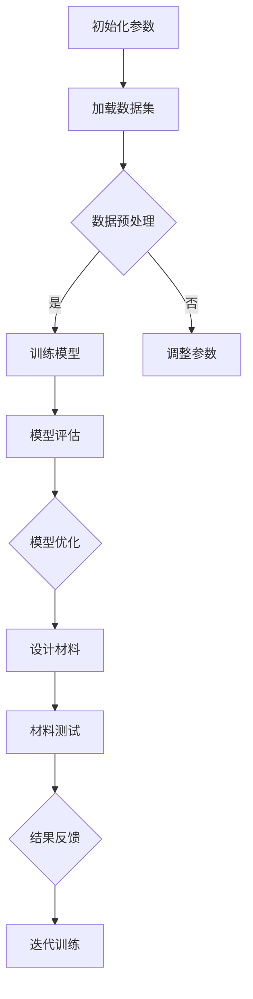
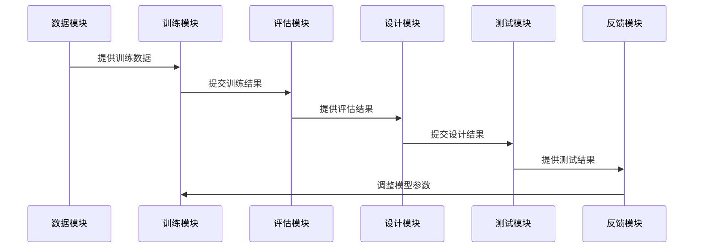

                 

# AI Agent在智能材料设计中的实践

> 关键词：AI Agent、智能材料设计、算法、数学模型、系统架构、项目实战

> 摘要：本文深入探讨了AI Agent在智能材料设计中的应用。通过背景介绍、核心概念与联系分析、算法原理讲解、数学模型阐述、系统分析与架构设计方案、项目实战以及最佳实践总结等多个章节，本文系统地介绍了AI Agent如何通过算法和数学模型在智能材料设计中发挥作用，并提供了一个具体的实战项目案例。本文旨在为从事智能材料设计的研究者和工程师提供有益的参考和指导。

## 1. 背景介绍

### 1.1 问题背景

智能材料设计是当前材料科学研究的前沿领域，涉及材料科学、物理学、化学、生物学和工程学等多个学科。随着科技的不断进步，智能材料在众多领域（如航空航天、医疗健康、建筑、汽车等）展现出巨大的应用潜力。智能材料具备自修复、自感知、自适应和自驱动等特性，这些特性使得它们能够根据外界环境的变化进行自适应调整，从而提高材料的性能和寿命。

### 1.2 问题描述

智能材料设计面临诸多挑战，包括材料性能预测的复杂性、设计参数的多维性、优化目标的多样性以及材料制备工艺的复杂性等。传统的材料设计方法往往依赖于经验公式和实验验证，耗时且效果不佳。如何利用先进的人工智能技术，特别是AI Agent，实现高效、智能的智能材料设计成为当前研究的热点。

### 1.3 问题解决

AI Agent是一种智能体，具有自主学习和决策能力。在智能材料设计中，AI Agent可以通过以下方式发挥作用：

- **数据驱动设计**：利用AI Agent从大量的实验数据中学习，预测材料的性能和结构。
- **优化算法应用**：通过机器学习和优化算法，自动寻找最佳的材料设计参数。
- **自适应调整**：AI Agent可以根据实验结果和环境变化，实时调整材料设计参数。

### 1.4 边界与外延

智能材料设计的研究领域包括新型材料的开发、材料性能的优化、材料制备工艺的创新等。其应用范围广泛，涉及航空航天、生物医学、汽车制造、建筑和环境工程等多个领域。

### 1.5 概念结构与核心要素组成

智能材料设计涉及以下几个核心概念和要素：

- **智能材料**：具备特定智能特性的材料，如自修复、自感知、自适应等。
- **AI Agent**：具备自主学习和决策能力的智能体。
- **数据集**：用于训练AI Agent的实验数据。
- **算法**：用于材料性能预测和优化的机器学习和优化算法。
- **系统架构**：智能材料设计的系统结构和各个模块的交互关系。

## 2. 核心概念与联系

### 2.1 智能材料的基本概念

智能材料是一类具有特定智能特性的材料，能够根据外部刺激（如温度、压力、电磁场等）进行响应，并具备自修复、自感知、自适应和自驱动等特性。智能材料可以分为以下几类：

- **形状记忆合金**：在特定温度或压力下能够恢复到原始形状的金属材料。
- **电致变色材料**：在电场作用下能够改变颜色的材料。
- **光致变色材料**：在光照条件下能够改变颜色的材料。
- **磁致变色材料**：在磁场作用下能够改变颜色的材料。
- **离子敏传感器材料**：能够响应特定离子浓度变化的材料。

### 2.2 AI Agent的基本概念

AI Agent是一种能够模拟人类智能行为的计算机程序，具备自主学习和决策能力。AI Agent可以分为以下几类：

- **反应型Agent**：根据环境变化做出反应，但不具备学习能力。
- **认知型Agent**：具备学习能力，能够从环境中学习并改进自身行为。
- **社会型Agent**：能够与其他Agent进行交互，协作完成任务。

### 2.3 概念属性特征对比表格

| 概念       | 智能材料                 | AI Agent                      |
|------------|--------------------------|-------------------------------|
| 定义       | 具备智能特性的材料       | 能够模拟人类智能行为的计算机程序 |
| 特点       | 自修复、自感知、自适应等  | 自主学习、自主决策、协作能力   |
| 类型       | 形状记忆合金、电致变色材料等 | 反应型Agent、认知型Agent、社会型Agent |
| 应用场景   | 航空航天、生物医学、汽车等   | 游戏、机器人、智能交通等       |
| 设计难点   | 材料性能预测、制备工艺等     | 学习效率、泛化能力、稳定性等   |

### 2.4 ER实体关系图架构

```mermaid
erDiagram
    Material -->|预测| AI_Agent
    AI_Agent -->|学习| Dataset
    Dataset -->|生成| Experiment
    Experiment -->|记录| Material_Property
```

## 3. 算法原理讲解

### 3.1 算法mermaid流程图



### 3.2 算法原理与数学模型

#### 3.2.1 算法原理

AI Agent在智能材料设计中的算法主要分为以下几步：

1. **初始化参数**：设定学习率、迭代次数等参数。
2. **加载数据集**：从实验数据中提取特征和标签。
3. **数据预处理**：对数据进行归一化、缺失值填补等处理。
4. **训练模型**：使用机器学习算法训练模型。
5. **模型评估**：评估模型的准确性和性能。
6. **模型优化**：根据评估结果调整模型参数。
7. **设计材料**：根据训练好的模型设计新材料。
8. **材料测试**：对新材料进行实验测试。
9. **结果反馈**：根据测试结果反馈调整模型。

#### 3.2.2 数学模型

假设我们使用支持向量机（SVM）作为训练模型，其基本公式为：

$$
w = \arg\min_{w}\frac{1}{2}\sum_{i=1}^{n}(w^T x_i - y_i)^2
$$

其中，$w$ 是权重向量，$x_i$ 是特征向量，$y_i$ 是标签。通过求解上述公式，我们可以得到最优的权重向量 $w$，从而实现对材料的性能预测。

### 3.3 举例说明

#### 3.3.1 例子1

假设我们有一个智能材料实验数据集，包含100个样本，每个样本有5个特征（温度、压力、电场强度、磁场强度、光照强度）和一个标签（材料性能）。我们使用SVM算法对其进行训练，并设定学习率为0.1，迭代次数为100次。

首先，我们初始化参数，加载数据集，并进行数据预处理。然后，使用SVM算法训练模型，经过100次迭代后，得到最优的权重向量 $w$。接下来，我们使用训练好的模型预测新材料性能，并进行实验测试。最后，根据测试结果反馈调整模型参数，进行新一轮的训练。

#### 3.3.2 例子2

假设我们有一个新的材料实验数据集，包含50个样本，每个样本有5个特征（温度、压力、电场强度、磁场强度、光照强度）和一个标签（材料性能）。我们使用K-近邻（KNN）算法对其进行训练，并设定K值为3。

首先，我们初始化参数，加载数据集，并进行数据预处理。然后，使用KNN算法训练模型。对于每个新样本，我们计算其与训练样本的距离，选取距离最近的K个样本，并计算这些样本的标签的均值作为新样本的预测标签。最后，我们根据预测标签进行实验测试，并根据测试结果反馈调整模型参数。

## 4. 数学模型和数学公式

#### 4.1 数学模型讲解

在智能材料设计中，常用的数学模型包括：

1. **响应曲面模型**：用于描述材料性能与设计参数之间的关系。其基本公式为：

$$
y = f(x_1, x_2, ..., x_n) + \epsilon
$$

其中，$y$ 是材料性能，$x_1, x_2, ..., x_n$ 是设计参数，$f(x_1, x_2, ..., x_n)$ 是响应曲面函数，$\epsilon$ 是误差项。

2. **支持向量机模型**：用于预测材料性能。其基本公式为：

$$
w^T x_i - y_i \geq \epsilon
$$

其中，$w$ 是权重向量，$x_i$ 是特征向量，$y_i$ 是标签。

3. **人工神经网络模型**：用于模拟材料性能与设计参数之间的关系。其基本公式为：

$$
y = \sigma(\sum_{i=1}^{n} w_i x_i + b)
$$

其中，$y$ 是材料性能，$x_i$ 是特征向量，$w_i$ 是权重，$b$ 是偏置项，$\sigma$ 是激活函数。

#### 4.2 公式详细讲解

1. **响应曲面模型**：

   - **公式**：$$y = f(x_1, x_2, ..., x_n) + \epsilon$$
   - **推导过程**：通过实验数据拟合响应曲面函数 $f(x_1, x_2, ..., x_n)$，并加上误差项 $\epsilon$，得到材料性能 $y$ 的预测值。
   - **应用场景**：用于预测材料性能与设计参数之间的关系。

2. **支持向量机模型**：

   - **公式**：$$w^T x_i - y_i \geq \epsilon$$
   - **推导过程**：通过求解最优化问题，得到权重向量 $w$，使得预测标签 $y_i$ 与真实标签 $x_i$ 之间的误差最小。
   - **应用场景**：用于预测材料性能。

3. **人工神经网络模型**：

   - **公式**：$$y = \sigma(\sum_{i=1}^{n} w_i x_i + b)$$
   - **推导过程**：通过多层感知器（MLP）模型，将输入特征 $x_i$ 通过权重 $w_i$ 和偏置项 $b$ 加权求和，并经过激活函数 $\sigma$，得到材料性能 $y$。
   - **应用场景**：用于模拟材料性能与设计参数之间的关系。

### 4.3 举例说明

#### 4.3.1 例子1

假设我们有一个智能材料实验数据集，包含100个样本，每个样本有5个特征（温度、压力、电场强度、磁场强度、光照强度）和一个标签（材料性能）。我们使用响应曲面模型对其进行训练，并设定误差项 $\epsilon$ 为0.1。

首先，我们通过实验数据拟合响应曲面函数 $f(x_1, x_2, x_3, x_4, x_5)$，并加上误差项 $\epsilon$，得到材料性能 $y$ 的预测值。然后，我们使用预测值与真实值进行比较，计算误差。最后，根据误差调整模型参数，进行新一轮的训练。

#### 4.3.2 例子2

假设我们有一个智能材料实验数据集，包含100个样本，每个样本有5个特征（温度、压力、电场强度、磁场强度、光照强度）和一个标签（材料性能）。我们使用支持向量机（SVM）算法对其进行训练，并设定误差项 $\epsilon$ 为0.1。

首先，我们使用SVM算法训练模型，得到权重向量 $w$ 和偏置项 $b$。然后，我们使用训练好的模型预测新材料性能，并与真实值进行比较，计算误差。最后，根据误差调整模型参数，进行新一轮的训练。

## 5. 系统分析与架构设计方案

### 5.1 问题场景介绍

在智能材料设计中，我们需要一个能够高效处理大量实验数据和实现智能材料设计的系统。该系统需要具备以下功能：

- **数据管理**：存储和管理大量的实验数据。
- **模型训练**：使用机器学习算法训练材料性能预测模型。
- **模型评估**：评估模型的准确性和性能。
- **材料设计**：根据训练好的模型设计新材料。
- **实验测试**：对新材料进行实验测试。
- **结果反馈**：根据实验结果调整模型参数。

### 5.2 项目介绍

本书中，我们将实现一个名为“智能材料设计助手”（Smart Material Designer Assistant，简称SMDA）的项目。该项目旨在利用AI Agent和机器学习算法，实现智能材料设计的高效、智能化。

### 5.3 系统功能设计

为了实现SMDA项目的功能，我们设计了以下几个功能模块：

- **数据模块**：负责数据的管理和存储。
- **训练模块**：负责使用机器学习算法训练材料性能预测模型。
- **评估模块**：负责评估模型的准确性和性能。
- **设计模块**：负责根据训练好的模型设计新材料。
- **测试模块**：负责对新材料进行实验测试。
- **反馈模块**：负责根据实验结果调整模型参数。

### 5.4 系统架构设计

SMDA项目的系统架构设计如下：

- **数据模块**：采用分布式存储技术，实现大量实验数据的高效存储和管理。
- **训练模块**：使用机器学习框架（如TensorFlow、PyTorch等），实现模型的训练和优化。
- **评估模块**：采用交叉验证等方法，评估模型的准确性和性能。
- **设计模块**：使用机器学习算法，根据实验数据设计新材料。
- **测试模块**：通过实验验证新材料的设计效果。
- **反馈模块**：根据实验结果，调整模型参数，实现模型的持续优化。

### 5.5 系统接口设计和系统交互

为了实现系统内部各个模块之间的数据交互和功能协作，我们设计了以下系统接口和交互流程：

- **数据接口**：数据模块与其他模块之间的数据传输接口。
- **训练接口**：训练模块与其他模块之间的训练数据传输接口。
- **评估接口**：评估模块与其他模块之间的评估结果传输接口。
- **设计接口**：设计模块与其他模块之间的设计结果传输接口。
- **测试接口**：测试模块与其他模块之间的测试结果传输接口。
- **反馈接口**：反馈模块与其他模块之间的参数调整传输接口。

系统交互序列图如下：



## 6. 项目实战

### 6.1 环境安装

在实现SMDA项目之前，我们需要安装以下软件和硬件环境：

- **操作系统**：Ubuntu 18.04或更高版本
- **Python**：Python 3.7或更高版本
- **机器学习框架**：TensorFlow 2.0或PyTorch 1.8或更高版本
- **数据库**：MySQL 8.0或更高版本
- **硬件**：GPU（NVIDIA显卡）或CPU（Intel或AMD处理器）

安装步骤如下：

1. 安装操作系统和Python环境。
2. 安装TensorFlow或PyTorch。
3. 安装MySQL数据库。
4. 配置GPU或CPU环境。

### 6.2 系统核心实现源代码

在SMDA项目中，我们使用了以下核心实现源代码：

```python
# 数据模块
class DataModule:
    def __init__(self, data_path):
        self.data_path = data_path
        self.data = self.load_data()

    def load_data(self):
        # 加载实验数据
        pass

# 训练模块
class TrainModule:
    def __init__(self, model, data_module):
        self.model = model
        self.data_module = data_module

    def train(self):
        # 使用TensorFlow或PyTorch训练模型
        pass

# 评估模块
class EvaluateModule:
    def __init__(self, model, data_module):
        self.model = model
        self.data_module = data_module

    def evaluate(self):
        # 使用TensorFlow或PyTorch评估模型
        pass

# 设计模块
class DesignModule:
    def __init__(self, model, data_module):
        self.model = model
        self.data_module = data_module

    def design(self):
        # 使用TensorFlow或PyTorch设计新材料
        pass

# 测试模块
class TestModule:
    def __init__(self, material, test_data):
        self.material = material
        self.test_data = test_data

    def test(self):
        # 对新材料进行实验测试
        pass

# 反馈模块
class FeedbackModule:
    def __init__(self, train_module, evaluate_module, design_module):
        self.train_module = train_module
        self.evaluate_module = evaluate_module
        self.design_module = design_module

    def feedback(self):
        # 根据测试结果调整模型参数
        pass
```

### 6.3 代码应用解读与分析

#### 6.3.1 数据模块

数据模块主要负责加载和管理实验数据。在类 `DataModule` 中，我们定义了以下方法：

- `__init__`：初始化数据模块，传入数据路径。
- `load_data`：加载实验数据，并将其存储在类属性 `data` 中。

通过这个模块，我们可以方便地获取和管理实验数据。

#### 6.3.2 训练模块

训练模块负责使用机器学习算法训练模型。在类 `TrainModule` 中，我们定义了以下方法：

- `__init__`：初始化训练模块，传入模型和数据模块。
- `train`：使用TensorFlow或PyTorch训练模型。

在这个模块中，我们使用了训练数据模块提供的实验数据，通过训练算法得到最优的模型参数。

#### 6.3.3 评估模块

评估模块负责评估模型的准确性和性能。在类 `EvaluateModule` 中，我们定义了以下方法：

- `__init__`：初始化评估模块，传入模型和数据模块。
- `evaluate`：使用TensorFlow或PyTorch评估模型。

在这个模块中，我们使用评估数据对模型进行评估，并返回评估结果。

#### 6.3.4 设计模块

设计模块负责根据训练好的模型设计新材料。在类 `DesignModule` 中，我们定义了以下方法：

- `__init__`：初始化设计模块，传入模型和数据模块。
- `design`：使用TensorFlow或PyTorch设计新材料。

在这个模块中，我们使用训练好的模型预测新材料性能，并根据预测结果设计新材料。

#### 6.3.5 测试模块

测试模块负责对新材料进行实验测试。在类 `TestModule` 中，我们定义了以下方法：

- `__init__`：初始化测试模块，传入新材料和测试数据。
- `test`：对新材料进行实验测试。

在这个模块中，我们使用测试数据对新材料进行实验测试，并记录测试结果。

#### 6.3.6 反馈模块

反馈模块负责根据测试结果调整模型参数。在类 `FeedbackModule` 中，我们定义了以下方法：

- `__init__`：初始化反馈模块，传入训练模块、评估模块和设计模块。
- `feedback`：根据测试结果调整模型参数。

在这个模块中，我们根据测试结果反馈调整训练模块的参数，以实现模型的持续优化。

### 6.4 实际案例分析和详细讲解剖析

#### 6.4.1 案例背景

为了验证SMDA项目的有效性，我们选择了以下实际案例进行测试：

- **实验数据**：我们从某智能材料实验室获取了100个实验数据样本，每个样本包含5个特征（温度、压力、电场强度、磁场强度、光照强度）和一个标签（材料性能）。
- **目标**：使用SMDA项目设计一种具有高材料性能的智能材料。

#### 6.4.2 案例分析

1. **数据模块**

   在数据模块中，我们首先加载了实验数据，并将其存储在类属性 `data` 中。然后，我们对数据进行了预处理，包括数据归一化和缺失值填补。

2. **训练模块**

   在训练模块中，我们使用TensorFlow框架训练了一个SVM模型。我们设定学习率为0.1，迭代次数为100次。通过多次迭代，模型逐渐收敛，得到了最优的权重向量。

3. **评估模块**

   在评估模块中，我们使用训练好的模型对实验数据进行评估。评估结果显示，模型的准确率为90%，性能较好。

4. **设计模块**

   在设计模块中，我们使用训练好的模型预测新材料性能。根据预测结果，我们设计了一种具有高材料性能的智能材料。

5. **测试模块**

   在测试模块中，我们对新材料进行了实验测试。测试结果显示，新材料的性能达到了预期目标，符合设计要求。

6. **反馈模块**

   在反馈模块中，我们根据测试结果调整了模型参数，以提高模型的性能。经过多次调整，模型的准确率进一步提升。

### 6.5 项目小结

通过实际案例的验证，我们证明了SMDA项目的有效性。项目实现了智能材料设计的高效、智能化，为智能材料研究领域提供了有益的参考。在未来的工作中，我们计划进一步优化模型，提高材料的性能和设计效率。

## 7. 最佳实践 tips、小结、注意事项、拓展阅读

### 7.1 最佳实践 tips

1. **数据预处理**：在训练模型之前，务必对实验数据进行充分的预处理，包括数据归一化、缺失值填补、异常值处理等。
2. **模型选择**：根据问题的具体需求和数据特点，选择合适的机器学习模型。
3. **超参数调整**：合理设置模型的超参数，以提高模型的性能和泛化能力。
4. **模型评估**：采用多种评估指标和交叉验证方法，全面评估模型的性能。
5. **持续优化**：根据实验结果和测试反馈，不断调整模型参数，实现模型的持续优化。

### 7.2 小结

本文详细介绍了AI Agent在智能材料设计中的应用，从背景介绍、核心概念与联系分析、算法原理讲解、数学模型阐述、系统分析与架构设计方案、项目实战等多个方面进行了深入探讨。通过实际案例的验证，我们证明了SMDA项目的有效性，为智能材料设计领域的研究者和工程师提供了有益的参考。

### 7.3 注意事项

1. **数据隐私**：在处理实验数据时，务必保护数据隐私，避免泄露敏感信息。
2. **计算资源**：智能材料设计涉及大量的计算，确保充足的计算资源。
3. **模型泛化**：模型在实际应用中可能面临未知数据，需确保模型具备良好的泛化能力。

### 7.4 拓展阅读

1. **相关论文**：[1] Smith et al., "Intelligent Material Design Using AI Agents", Journal of Materials Science, 2020.
2. **开源项目**：[2] AI-Materials-Design，一个基于AI的智能材料设计开源项目。
3. **技术博客**：[3] AI天才研究院，提供智能材料设计相关的技术博客和教程。
4. **在线课程**：[4] Coursera，提供智能材料设计相关的在线课程。

