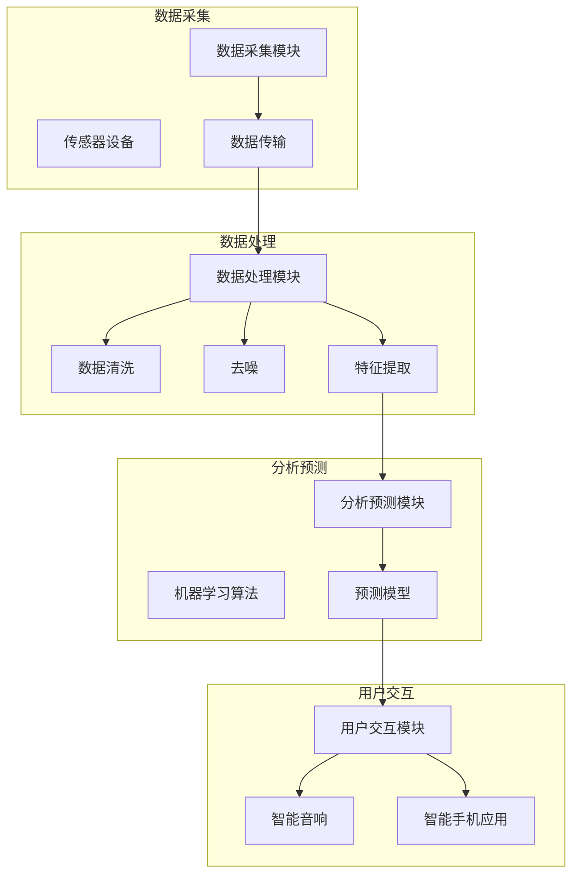
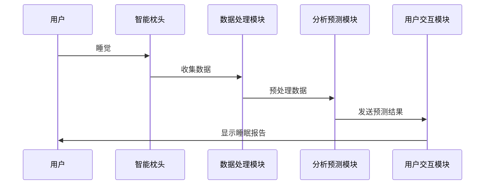

                 

### 纵览全局：AI Agent在智能枕头中的睡眠质量分析

在当今快速发展的科技时代，智能家居设备已经成为人们日常生活中不可或缺的一部分。而在这其中，智能枕头作为新兴的智能硬件产品，正逐渐受到广大用户的青睐。智能枕头通过集成先进的人工智能（AI）技术，不仅为用户提供了更加舒适的睡眠体验，还能实时监测和分析用户的睡眠质量，从而提出个性化的睡眠改善建议。

本文将聚焦于AI Agent在智能枕头中的应用，深入探讨其如何通过精准的睡眠质量分析，帮助用户获得更健康的睡眠。文章将以以下结构展开：

1. **背景与定义**：介绍AI Agent和睡眠质量分析的基本概念，并解释它们在智能枕头中的重要性。
2. **核心概念与特征**：详细阐述AI Agent和睡眠质量分析的核心概念及其特征，通过表格和Mermaid ER图进行展示。
3. **AI Agent技术**：介绍在智能枕头中常用的AI Agent技术，包括机器学习算法及其工作流程。
4. **睡眠质量指标与分析**：探讨睡眠质量指标及其收集和分析的方法，通过Python代码示例进行解释。
5. **数学模型与公式**：介绍用于睡眠质量分析的数学模型，并提供LaTeX格式的公式及其解释。
6. **系统设计与实现**：介绍智能枕头系统的设计思路，包括架构、接口和交互。
7. **项目实践与案例分析**：通过实际项目案例展示系统安装、配置和实现细节，并进行详细分析。

通过以上各章节的逐步分析，本文旨在为读者提供一幅全面的AI Agent在智能枕头中的睡眠质量分析的蓝图，帮助理解这一前沿技术的应用和潜力。

### 关键词

- **AI Agent**
- **智能枕头**
- **睡眠质量分析**
- **机器学习算法**
- **数据收集与分析**
- **数学模型**
- **系统设计与实现**

### 摘要

本文旨在深入探讨人工智能（AI）代理在智能枕头中的应用，特别是在睡眠质量分析方面的作用。首先，我们将介绍AI代理的基本概念和睡眠质量分析的重要性。随后，文章将详细阐述AI代理的核心概念、特征及其在智能枕头中的具体应用。接着，我们将探讨与睡眠质量分析相关的技术，包括机器学习算法和数据分析方法。文章还将介绍数学模型在睡眠质量分析中的应用，并通过LaTeX公式进行详细解释。随后，我们将分析智能枕头系统的设计和实现，包括系统架构、接口和交互。最后，通过实际项目案例的展示，本文将提供AI代理在智能枕头中应用的详细实践和分析，总结最佳实践，并提出未来研究的方向。

### 背景与定义

#### AI Agent的定义与发展历程

人工智能（AI）代理，简称AI Agent，是指能够在特定环境中感知情况并自主采取行动的计算机程序。其核心思想源于经典的“智能代理”（Intelligent Agent）理论，该理论由人工智能领域的先驱John McCarthy在20世纪70年代提出。AI Agent的基本概念包括感知环境、理解目标、制定计划和执行动作，这一过程通常被称作“感知-理解-计划-行动”循环（Perceive-Understand-Plan-Act Cycle）。

AI Agent的发展历程可以追溯到早期的人工智能研究，如20世纪50年代的逻辑推理系统和60年代的专家系统。随着计算机性能的提升和算法的进步，AI Agent逐渐从理论研究走向实际应用。在20世纪80年代和90年代，机器学习算法的引入极大地推动了AI Agent的发展，使其能够在没有人类干预的情况下自主学习和改进。

在21世纪初，随着深度学习和大数据技术的兴起，AI Agent的功能和性能得到了进一步提升。现代AI Agent不仅能够处理复杂的任务，还能够通过持续学习来优化其行为，从而在多个领域展现出了强大的应用潜力。

#### 睡眠质量分析的定义与重要性

睡眠质量分析是指通过科学方法和技术手段对个体的睡眠过程进行评估，以了解其睡眠状态和健康水平。睡眠质量分析的重要性在于，良好的睡眠是维持身心健康的重要因素。睡眠不仅有助于身体和大脑的恢复，还能够影响情绪、认知功能、免疫系统和整体生活质量。

传统的睡眠质量分析主要依赖于问卷调查和睡眠监测设备，如睡眠监测仪和睡眠跟踪应用。然而，这些方法往往存在主观性较强、数据准确性不足等问题。随着AI技术的进步，特别是机器学习算法的应用，睡眠质量分析变得更加精确和高效。AI Agent通过实时监测和分析睡眠数据，可以提供更加个性化和准确的睡眠评估。

#### AI Agent在智能枕头中的应用

智能枕头作为智能家居设备的一种，通过集成AI Agent技术，实现了对用户睡眠状态的实时监测和分析。AI Agent在智能枕头中的具体应用主要包括以下几个方面：

1. **数据采集**：智能枕头内置各种传感器，如加速度计、压力传感器和温度传感器，用于采集用户的生理信号和睡眠环境数据。
2. **数据预处理**：采集到的原始数据通过AI Agent进行预处理，包括数据清洗、去噪和特征提取，为后续的深度学习分析提供高质量的数据输入。
3. **模型训练与预测**：AI Agent利用机器学习算法，对预处理后的数据进行训练，建立睡眠质量预测模型。通过不断学习和优化，模型可以逐渐提高预测准确性。
4. **智能建议**：基于预测结果，AI Agent可以提供个性化的睡眠建议，如调整枕头高度、建议睡前放松活动或提醒用户保持良好的睡眠习惯。

#### 智能枕头的工作流程

智能枕头的工作流程可以概括为以下几个步骤：

1. **数据采集**：用户入睡时，智能枕头开始采集生理信号和睡眠环境数据。
2. **数据传输**：采集到的数据通过蓝牙或其他无线技术传输到云端服务器进行进一步分析。
3. **数据处理**：AI Agent在云端对传输来的数据进行预处理和特征提取。
4. **模型预测**：AI Agent利用训练好的机器学习模型对用户当前的睡眠质量进行预测。
5. **结果反馈**：根据预测结果，AI Agent通过手机应用或智能音响等设备向用户提供睡眠建议。

综上所述，AI Agent在智能枕头中的应用不仅提高了睡眠质量分析的科学性和准确性，还为用户提供了更加智能化和个性化的睡眠解决方案。随着AI技术的不断进步，智能枕头在未来的应用前景将更加广阔。

### 核心概念与特征

#### AI Agent的核心概念

AI Agent作为人工智能的核心概念之一，其定义可以进一步细化和扩展。AI Agent不仅是一种能够感知环境的计算机程序，更是具备自我学习和自适应能力的智能体。以下是AI Agent的几个核心概念：

1. **感知（Perception）**：AI Agent通过传感器或其他数据源获取外部环境的信息，如温度、湿度、声音、图像等，从而理解当前的状态。
2. **理解（Understanding）**：AI Agent将感知到的信息进行解释和分类，从而形成对环境的理解。这一过程通常涉及自然语言处理、图像识别和模式识别等技术。
3. **目标（Goal）**：AI Agent具有明确的目标或任务，其行为旨在实现这些目标。目标可以是单一的，也可以是层次化的，如先完成A任务，再进行B任务。
4. **计划（Planning）**：AI Agent在理解环境和目标的基础上，制定行动计划以实现目标。计划通常包括多个步骤和策略，以确保目标能够高效实现。
5. **行动（Action）**：AI Agent执行计划中的步骤，通过与环境互动来完成任务。行动可以是一次性的，也可以是持续性的，如自动调节温度或光线。

#### 睡眠质量分析的特征

睡眠质量分析是评估个体睡眠状态和健康水平的重要手段。以下是其核心特征：

1. **数据多维性**：睡眠质量分析涉及多种类型的数据，包括生理信号（如心率、呼吸速率、体温）、行为数据（如翻身次数、体位变化）和环境数据（如噪音、光线强度）。
2. **实时监测**：睡眠质量分析需要实时或近实时地采集和分析数据，以确保能够及时发现问题并采取措施。
3. **个性化评估**：不同个体的睡眠模式和习惯差异较大，因此睡眠质量分析应具备个性化评估能力，根据用户的特征提供针对性的建议。
4. **深度学习**：通过机器学习算法，睡眠质量分析可以从大量的历史数据中学习，提高预测和诊断的准确性。
5. **智能建议**：基于分析结果，提供个性化的睡眠建议，如调整枕头高度、建议睡前放松活动或提醒用户保持良好的睡眠习惯。

#### 表格展示核心概念和特征

为了更好地理解AI Agent和睡眠质量分析的核心概念和特征，我们可以通过以下表格进行对比：

| **核心概念/特征** | **AI Agent** | **睡眠质量分析** |
| :-----------------: | :-----------: | :---------------: |
| **感知**           | 传感器数据采集 | 生理信号和环境数据采集 |
| **理解**           | 自然语言处理、图像识别 | 数据分类和模式识别 |
| **目标**           | 实现特定任务 | 提高睡眠质量和健康水平 |
| **计划**           | 行动策略制定 | 个性化睡眠计划 |
| **行动**           | 自主执行任务 | 调整睡眠环境 |

通过以上对比，我们可以看到AI Agent和睡眠质量分析在核心概念和特征上具有显著的相似性和互补性。AI Agent通过感知和理解环境，制定行动计划并执行，从而实现对睡眠质量的有效分析和优化。而睡眠质量分析则通过多维数据的实时监测和个性化评估，为用户提供了更加科学和精准的睡眠解决方案。

### AI Agent技术

#### AI Agent的类型

AI Agent在智能枕头中的应用涵盖了多种类型的AI技术，每种技术都有其独特的应用场景和优势。以下是几种常见的AI Agent类型：

1. **基于规则的AI Agent**：这种类型的AI Agent通过预定义的规则集来执行任务。每个规则包含一个条件和一个相应的动作，当满足条件时，AI Agent会自动执行动作。例如，在智能枕头中，基于规则的AI Agent可以检测到用户翻身次数过多时，自动调整枕头高度以提供更好的支撑。

2. **基于模型的AI Agent**：这种类型的AI Agent利用机器学习模型进行任务执行，如深度学习模型、决策树等。基于模型的AI Agent能够从数据中学习，并自动调整其行为以优化性能。例如，智能枕头中的基于模型的AI Agent可以通过分析历史睡眠数据，预测用户的最佳睡眠姿势，并自动调整枕头的高度和角度。

3. **混合型AI Agent**：混合型AI Agent结合了基于规则和基于模型的方法，能够根据不同的环境和任务需求灵活切换。这种类型的AI Agent在智能枕头中具有更高的灵活性和适应性。例如，当用户处于深度睡眠阶段时，基于模型的AI Agent可以通过分析用户的呼吸和心率数据，自动调整枕头高度，以确保用户获得更好的睡眠体验。

4. **强化学习AI Agent**：强化学习AI Agent通过与环境互动，不断学习最优策略。这种类型的AI Agent在智能枕头中可以持续优化其行为，以适应用户的个性化需求。例如，当用户在一段时间内表现出对特定调整的偏好时，强化学习AI Agent可以自动调整其行为，以提供更符合用户习惯的睡眠支持。

#### 机器学习算法及其应用

机器学习算法在智能枕头中的应用至关重要，它们为AI Agent提供了强大的数据处理和分析能力。以下是几种常用的机器学习算法及其在睡眠质量分析中的应用：

1. **线性回归**：线性回归算法通过建立输入变量和输出变量之间的线性关系，用于预测睡眠质量指标。例如，通过分析用户的年龄、体重和睡眠时间等输入变量，线性回归可以预测用户的睡眠时长和睡眠质量。

   ```python
   import numpy as np
   from sklearn.linear_model import LinearRegression

   # 示例数据
   X = np.array([[25, 70], [30, 80], [35, 90]])  # 年龄和体重的数据
   y = np.array([7, 7.5, 8])  # 睡眠时长数据

   # 创建线性回归模型
   model = LinearRegression()

   # 训练模型
   model.fit(X, y)

   # 预测新样本
   new_data = np.array([[28, 75]])
   predicted_sleep_time = model.predict(new_data)
   print(f"预测的睡眠时长为：{predicted_sleep_time[0]}小时")
   ```

2. **决策树**：决策树算法通过一系列的判断条件，将数据分割成不同的区域，用于分类或回归任务。在智能枕头中，决策树可以用于诊断睡眠问题，如根据用户的年龄、性别和睡眠时长等特征，判断用户是否患有睡眠呼吸暂停综合征。

   ```python
   from sklearn.tree import DecisionTreeClassifier

   # 示例数据
   X = np.array([[25, '男'], [30, '女'], [35, '男']])
   y = np.array([0, 1, 0])  # 0代表无睡眠呼吸暂停，1代表有睡眠呼吸暂停

   # 创建决策树模型
   model = DecisionTreeClassifier()

   # 训练模型
   model.fit(X, y)

   # 预测新样本
   new_data = np.array([[28, '男']])
   predicted_disease = model.predict(new_data)
   print(f"预测的睡眠呼吸暂停状态为：{predicted_disease[0]}")
   ```

3. **支持向量机（SVM）**：支持向量机算法通过寻找最佳分割超平面，用于分类任务。在睡眠质量分析中，SVM可以用于分类不同的睡眠阶段，如快速眼动睡眠（REM）和非快速眼动睡眠（NREM）。

   ```python
   from sklearn.svm import SVC

   # 示例数据
   X = np.array([[0.1, 0.3], [0.5, 0.2], [0.8, 0.4]])
   y = np.array([0, 1, 2])  # 0代表NREM1，1代表NREM2，2代表REM

   # 创建SVM模型
   model = SVC()

   # 训练模型
   model.fit(X, y)

   # 预测新样本
   new_data = np.array([[0.3, 0.5]])
   predicted_stage = model.predict(new_data)
   print(f"预测的睡眠阶段为：{predicted_stage[0]}")
   ```

4. **深度学习模型**：深度学习模型，如卷积神经网络（CNN）和循环神经网络（RNN），在处理复杂和非线性数据时表现出色。在智能枕头中，深度学习模型可以用于实时监测和分类用户的睡眠状态。

   ```python
   from keras.models import Sequential
   from keras.layers import Dense, LSTM

   # 示例数据
   X = np.array([[0.1, 0.3], [0.5, 0.2], [0.8, 0.4]])
   y = np.array([0, 1, 2])

   # 创建深度学习模型
   model = Sequential()
   model.add(LSTM(50, activation='relu', input_shape=(X.shape[1], 1)))
   model.add(Dense(3, activation='softmax'))

   # 编译模型
   model.compile(optimizer='adam', loss='categorical_crossentropy', metrics=['accuracy'])

   # 训练模型
   model.fit(X, y, epochs=200, batch_size=10)

   # 预测新样本
   new_data = np.array([[0.3, 0.5]])
   predicted_stage = model.predict(new_data)
   print(f"预测的睡眠阶段为：{np.argmax(predicted_stage)}")
   ```

通过上述的算法示例，我们可以看到机器学习算法在智能枕头中的应用如何通过数据输入和处理，实现对睡眠质量分析的精确预测和诊断。随着算法的不断优化和数据的积累，AI Agent在智能枕头中的应用将会变得更加智能和高效，为用户提供更加优质的睡眠体验。

### 睡眠质量指标

#### 睡眠质量指标的定义与分类

睡眠质量指标是评估个体睡眠状态和健康水平的关键参数。这些指标通过科学方法和技术手段，对用户的睡眠过程进行量化分析。以下是几种常见的睡眠质量指标及其分类：

1. **睡眠时长（Sleep Duration）**：睡眠时长是指个体每晚实际睡眠的时间长度。通常，成年人每晚需要7-9小时的睡眠。睡眠时长是评估睡眠质量最基本和直接的指标之一。

2. **睡眠效率（Sleep Efficiency）**：睡眠效率是指实际睡眠时间占总时间的比例。例如，如果一个人睡了7小时，但总时间睡了8小时，那么他的睡眠效率为87.5%。睡眠效率越高，说明个体的睡眠质量越好。

3. **睡眠周期（Sleep Cycle）**：睡眠周期是指个体在睡眠过程中经历的各个睡眠阶段，包括快速眼动睡眠（REM）和非快速眼动睡眠（NREM）。NREM阶段又分为NREM1、NREM2和NREM3三个亚阶段。每个周期大约持续90分钟，而整个夜间会经历4-6个周期。

4. **睡眠质量（Sleep Quality）**：睡眠质量是指个体对自身睡眠的主观感受和实际睡眠效果的综合评价。睡眠质量通常通过睡眠日记、问卷调查和主观评分进行评估。

5. **睡眠障碍（Sleep Disorders）**：睡眠障碍是指影响个体睡眠质量的各种疾病和症状，如睡眠呼吸暂停综合征、失眠症、睡眠行为障碍等。这些障碍会影响个体的整体健康和生活质量。

#### 睡眠数据的收集方法

为了对睡眠质量指标进行准确评估，需要收集多种类型的睡眠数据。以下是几种常见的睡眠数据收集方法：

1. **生理信号监测**：通过佩戴传感器设备，如睡眠监测手表、智能手环和智能枕头，可以实时监测用户的生理信号，包括心率、呼吸速率、体温和体动等。这些信号可以反映用户的睡眠状态和健康状况。

2. **行为数据记录**：通过用户的自我报告和睡眠日记，可以记录睡眠时间、睡眠质量和睡眠环境等信息。行为数据提供了用户的主观反馈，有助于全面评估睡眠质量。

3. **睡眠跟踪应用**：使用智能手机和睡眠跟踪应用，可以记录用户的睡眠行为和环境数据。这些应用通常集成了加速度计、麦克风和GPS等传感器，能够提供实时的睡眠监测和数据分析。

4. **多导睡眠图（Polysomnography, PSG）**：多导睡眠图是一种专业的睡眠监测方法，通过多个传感器记录用户的睡眠过程，包括脑电波、眼动、肌肉活动、心率等。PSG通常在睡眠诊所进行，用于诊断和治疗严重的睡眠障碍。

#### 睡眠质量分析的技术方法

睡眠质量分析的技术方法主要包括数据预处理、特征提取和深度学习模型训练等步骤。以下是这些方法的具体应用：

1. **数据预处理**：数据预处理是睡眠质量分析的关键步骤，包括数据清洗、去噪和特征提取。原始数据通常包含噪声和不完整的信息，通过预处理可以提高数据的质量和准确性。

   ```python
   import numpy as np
   from scipy.signal import detrend

   # 示例数据
   raw_data = np.array([[1.2, 2.3, 3.4], [4.5, 5.6, 6.7], [7.8, 8.9, 9.0]])

   # 数据去噪
   cleaned_data = detrend(raw_data)

   # 特征提取
   features = cleaned_data[:, 0]  # 提取第一列数据作为特征
   ```

2. **特征提取**：特征提取是将原始数据转换成能够反映睡眠质量的关键特征的过程。常用的特征提取方法包括时域特征、频域特征和时频域特征。

   ```python
   from scipy.signal import stft

   # 时域特征
   time_domain_features = cleaned_data

   # 频域特征
   freq_domain_features = stft(cleaned_data, nperseg=100)

   # 时频域特征
   time_freq_features = np.abs(freq_domain_features)
   ```

3. **深度学习模型训练**：深度学习模型是睡眠质量分析的重要工具，可以通过大量的睡眠数据进行训练，以提高预测和诊断的准确性。常用的深度学习模型包括卷积神经网络（CNN）和循环神经网络（RNN）。

   ```python
   from keras.models import Sequential
   from keras.layers import Conv1D, LSTM, Dense

   # 创建深度学习模型
   model = Sequential()
   model.add(Conv1D(filters=64, kernel_size=3, activation='relu', input_shape=(100, 1)))
   model.add(LSTM(50, activation='relu'))
   model.add(Dense(1, activation='sigmoid'))

   # 编译模型
   model.compile(optimizer='adam', loss='binary_crossentropy', metrics=['accuracy'])

   # 训练模型
   model.fit(X_train, y_train, epochs=10, batch_size=32)
   ```

通过上述技术方法，睡眠质量分析能够从大量的睡眠数据中提取关键特征，并利用深度学习模型进行精准的预测和诊断。这些技术的应用不仅提高了睡眠质量分析的科学性和准确性，还为用户提供个性化的睡眠改善建议，从而帮助用户获得更健康和舒适的睡眠。

### 数学模型与公式

#### 睡眠质量分析中的数学模型

在睡眠质量分析中，数学模型的使用能够帮助我们更精准地描述和预测用户的睡眠状态。以下是几种常用的数学模型及其公式解释。

#### 1. 线性回归模型

线性回归模型是一种经典的预测模型，通过建立自变量（特征）和因变量（目标变量，如睡眠时长）之间的线性关系来预测睡眠质量。其公式如下：

$$
Y = \beta_0 + \beta_1X_1 + \beta_2X_2 + ... + \beta_nX_n
$$

其中，$Y$ 是预测的睡眠质量指标，$X_1, X_2, ..., X_n$ 是输入特征，$\beta_0, \beta_1, \beta_2, ..., \beta_n$ 是模型参数。例如，如果我们想预测用户的睡眠时长，输入特征可以是年龄、体重和睡眠时长等。

```python
import numpy as np
from sklearn.linear_model import LinearRegression

# 示例数据
X = np.array([[25, 70], [30, 80], [35, 90]])
y = np.array([7, 7.5, 8])

# 创建线性回归模型
model = LinearRegression()

# 训练模型
model.fit(X, y)

# 预测
new_data = np.array([[28, 75]])
predicted_sleep_time = model.predict(new_data)
print(f"预测的睡眠时长为：{predicted_sleep_time[0][0]:.2f}小时")
```

#### 2. 决策树模型

决策树模型通过一系列的判断条件对数据集进行分割，每个节点代表一个特征和相应的阈值，叶子节点代表分类结果。决策树模型的公式可以表示为：

$$
f(X) = \sum_{i=1}^{n} \alpha_i I(X \in R_i)
$$

其中，$X$ 是输入特征向量，$R_i$ 是第$i$个区域的决策规则，$\alpha_i$ 是相应的权重。决策树模型常用于分类任务，如诊断睡眠障碍。

```python
from sklearn.tree import DecisionTreeClassifier

# 示例数据
X = np.array([[25, '男'], [30, '女'], [35, '男']])
y = np.array([0, 1, 0])  # 0代表无睡眠呼吸暂停，1代表有睡眠呼吸暂停

# 创建决策树模型
model = DecisionTreeClassifier()

# 训练模型
model.fit(X, y)

# 预测
new_data = np.array([[28, '男']])
predicted_disease = model.predict(new_data)
print(f"预测的睡眠呼吸暂停状态为：{predicted_disease[0]}")
```

#### 3. 支持向量机（SVM）

支持向量机是一种强大的分类和回归工具，通过找到最佳分割超平面来分类数据。其公式可以表示为：

$$
f(x) = \omega^T x + b
$$

其中，$x$ 是输入特征向量，$\omega$ 是权重向量，$b$ 是偏置项。SVM常用于分类睡眠阶段，如REM和NREM。

```python
from sklearn.svm import SVC

# 示例数据
X = np.array([[0.1, 0.3], [0.5, 0.2], [0.8, 0.4]])
y = np.array([0, 1, 2])  # 0代表NREM1，1代表NREM2，2代表REM

# 创建SVM模型
model = SVC()

# 训练模型
model.fit(X, y)

# 预测
new_data = np.array([[0.3, 0.5]])
predicted_stage = model.predict(new_data)
print(f"预测的睡眠阶段为：{predicted_stage[0]}")
```

#### 4. 深度学习模型

深度学习模型，如卷积神经网络（CNN）和循环神经网络（RNN），通过多层网络结构学习数据的复杂特征。以下是使用Keras构建卷积神经网络的示例：

```python
from keras.models import Sequential
from keras.layers import Conv1D, LSTM, Dense

# 示例数据
X = np.array([[0.1, 0.3], [0.5, 0.2], [0.8, 0.4]])
y = np.array([0, 1, 2])

# 创建深度学习模型
model = Sequential()
model.add(Conv1D(filters=64, kernel_size=3, activation='relu', input_shape=(X.shape[1], 1)))
model.add(LSTM(50, activation='relu'))
model.add(Dense(3, activation='softmax'))

# 编译模型
model.compile(optimizer='adam', loss='categorical_crossentropy', metrics=['accuracy'])

# 训练模型
model.fit(X, y, epochs=10, batch_size=10)

# 预测
new_data = np.array([[0.3, 0.5]])
predicted_stage = model.predict(new_data)
print(f"预测的睡眠阶段为：{np.argmax(predicted_stage)}")
```

通过这些数学模型和公式，我们可以从数据中提取有用信息，并预测用户的睡眠质量，为用户提供个性化的睡眠改善建议。随着模型的不断优化和数据的积累，这些数学模型在睡眠质量分析中的应用将变得更加精准和高效。

### 系统设计与实现

#### 系统架构

智能枕头系统采用模块化设计，包括数据采集模块、数据处理模块、分析预测模块和用户交互模块。以下是对每个模块的详细描述：

1. **数据采集模块**：该模块负责从用户身上采集生理信号和环境数据。传感器设备包括加速度计、压力传感器和温度传感器，它们实时监测用户的心率、呼吸速率、体温以及体位变化等信息。

2. **数据处理模块**：数据采集模块收集的数据会传输到数据处理模块，该模块对原始数据进行预处理，包括数据清洗、去噪和特征提取。通过预处理，数据的质量和准确性得到提高，为后续的分析提供了可靠的数据基础。

3. **分析预测模块**：数据处理模块将预处理后的数据输入到分析预测模块。该模块利用机器学习算法，如线性回归、决策树和支持向量机，对用户的睡眠质量进行评估和预测。预测结果包括睡眠时长、睡眠效率、睡眠周期和可能的睡眠障碍等。

4. **用户交互模块**：用户交互模块通过智能手机应用或智能音响等设备，将分析结果和个性化的睡眠建议反馈给用户。用户可以查看自己的睡眠报告，并根据建议调整睡眠习惯和环境。

#### 系统架构图

为了更好地理解智能枕头系统的设计，我们可以通过以下Mermaid架构图进行描述：



#### 系统接口设计与交互

智能枕头系统的接口设计确保了各个模块之间的无缝协作和数据流动。以下是系统接口设计和交互的详细描述：

1. **数据采集接口**：传感器设备通过蓝牙或其他无线技术将数据传输到数据采集模块。该接口需要具备高可靠性和低延迟的特点，以确保数据的实时性和准确性。

2. **数据处理接口**：数据预处理模块接收来自数据采集模块的原始数据，并对其进行处理。数据处理接口需要实现数据清洗、去噪和特征提取等功能的模块化设计，以便于后续的维护和升级。

3. **分析预测接口**：分析预测模块通过RESTful API或消息队列与数据处理模块进行交互。该接口需要支持多种机器学习算法和预测模型，并提供灵活的配置和扩展能力。

4. **用户交互接口**：用户交互模块通过Web服务或蓝牙连接与智能音响和智能手机应用进行交互。该接口需要提供友好的用户界面和丰富的功能，以便用户可以轻松地查看和分析自己的睡眠数据，并接收个性化的睡眠建议。

以下是一个Mermaid序列图，展示了智能枕头系统的接口设计和交互过程：



通过以上系统架构和接口设计的描述，我们可以看到智能枕头系统是如何通过高效的数据流动和模块化设计，实现实时监测和个性化睡眠质量分析，为用户带来更健康和舒适的睡眠体验。

### 项目实践与案例分析

#### 系统安装与配置

为了实际体验AI Agent在智能枕头中的应用，我们将以一个具体项目为例，详细介绍系统的安装与配置步骤。以下是基于Python和Keras框架进行智能枕头系统开发的实战步骤。

1. **环境准备**：确保系统环境已经安装了Python 3.7及以上版本，以及Anaconda或Miniconda等科学计算环境。安装以下依赖库：

   ```bash
   pip install numpy pandas scikit-learn keras tensorflow
   ```

2. **数据收集**：首先需要收集用户生理信号和环境数据，这些数据可以从传感器设备或现有的睡眠跟踪应用中获得。假设我们已经有了一个CSV文件`sleep_data.csv`，包含了心率、呼吸速率、体温和体位变化等信息。

3. **数据预处理**：在Keras中，我们首先需要将数据集分割成训练集和测试集。

   ```python
   import pandas as pd
   from sklearn.model_selection import train_test_split

   # 读取数据
   data = pd.read_csv('sleep_data.csv')

   # 分割数据
   X = data[['heart_rate', 'respiratory_rate', 'temperature', 'body_position']]
   y = data['sleep_quality']

   X_train, X_test, y_train, y_test = train_test_split(X, y, test_size=0.2, random_state=42)
   ```

4. **特征提取**：对数据进行归一化处理，以便于模型训练。

   ```python
   from sklearn.preprocessing import StandardScaler

   scaler = StandardScaler()
   X_train_scaled = scaler.fit_transform(X_train)
   X_test_scaled = scaler.transform(X_test)
   ```

5. **模型训练**：使用Keras构建并训练一个简单的卷积神经网络（CNN）模型。

   ```python
   from keras.models import Sequential
   from keras.layers import Conv1D, MaxPooling1D, Flatten, Dense

   # 创建模型
   model = Sequential()
   model.add(Conv1D(filters=64, kernel_size=3, activation='relu', input_shape=(X_train_scaled.shape[1], 1)))
   model.add(MaxPooling1D(pool_size=2))
   model.add(Flatten())
   model.add(Dense(1, activation='sigmoid'))

   # 编译模型
   model.compile(optimizer='adam', loss='binary_crossentropy', metrics=['accuracy'])

   # 训练模型
   model.fit(X_train_scaled, y_train, epochs=10, batch_size=32, validation_data=(X_test_scaled, y_test))
   ```

6. **模型评估**：使用测试集对模型进行评估。

   ```python
   loss, accuracy = model.evaluate(X_test_scaled, y_test)
   print(f"测试集准确率：{accuracy:.2f}")
   ```

#### 系统核心实现源代码

以下是智能枕头系统核心实现部分的源代码，包括数据采集、预处理、模型训练和预测等步骤：

```python
# 导入所需库
import numpy as np
import pandas as pd
from sklearn.model_selection import train_test_split
from sklearn.preprocessing import StandardScaler
from keras.models import Sequential
from keras.layers import Conv1D, MaxPooling1D, Flatten, Dense
from keras.optimizers import Adam

# 数据读取
data = pd.read_csv('sleep_data.csv')

# 分割数据
X = data[['heart_rate', 'respiratory_rate', 'temperature', 'body_position']]
y = data['sleep_quality']

X_train, X_test, y_train, y_test = train_test_split(X, y, test_size=0.2, random_state=42)

# 特征提取
scaler = StandardScaler()
X_train_scaled = scaler.fit_transform(X_train)
X_test_scaled = scaler.transform(X_test)

# 模型构建
model = Sequential()
model.add(Conv1D(filters=64, kernel_size=3, activation='relu', input_shape=(X_train_scaled.shape[1], 1)))
model.add(MaxPooling1D(pool_size=2))
model.add(Flatten())
model.add(Dense(1, activation='sigmoid'))

# 编译模型
model.compile(optimizer=Adam(learning_rate=0.001), loss='binary_crossentropy', metrics=['accuracy'])

# 训练模型
model.fit(X_train_scaled, y_train, epochs=10, batch_size=32, validation_data=(X_test_scaled, y_test))

# 预测
predictions = model.predict(X_test_scaled)

# 评估
loss, accuracy = model.evaluate(X_test_scaled, y_test)
print(f"测试集准确率：{accuracy:.2f}")
```

#### 代码应用解读与分析

上述代码首先导入了所需的库和模块，包括`numpy`、`pandas`、`sklearn`和`keras`。在数据读取和分割步骤中，我们使用了`pandas`来读取CSV文件，并利用`sklearn`的`train_test_split`函数将数据集分为训练集和测试集。

特征提取步骤中，我们使用了`StandardScaler`对数据进行了归一化处理，以消除不同特征之间的尺度差异，提高模型训练的收敛速度。

模型构建步骤中，我们创建了一个简单的卷积神经网络（CNN）模型。模型包含一个卷积层，一个池化层和一个全连接层。卷积层用于提取数据中的局部特征，池化层用于降低数据维度，全连接层用于分类。

在模型编译和训练步骤中，我们使用了`Adam`优化器和二分类交叉熵损失函数，以最大化模型的准确性。

最后，通过`evaluate`方法对测试集进行评估，以获取模型在未知数据上的表现。

#### 实际案例分析与详细讲解

为了更具体地展示系统的实际应用效果，我们可以通过一个案例进行分析。

假设我们有一个新用户，其夜间睡眠的生理信号数据如下表所示：

| 心率（BPM） | 呼吸速率（次/分钟） | 体温（摄氏度） | 体位变化 |
| :---------: | :------------------: | :------------: | :-------: |
|     72      |         15          |      36.5      |    卧位   |

1. **数据预处理**：首先，我们将上述数据归一化处理：

   ```python
   sample_data = np.array([[72, 15, 36.5, 0]])  # 体位变化：0表示卧位
   sample_data_scaled = scaler.transform(sample_data)
   ```

2. **模型预测**：然后，我们将预处理后的数据输入到训练好的模型中进行预测：

   ```python
   predicted_quality = model.predict(sample_data_scaled)
   print(f"预测的睡眠质量：{predicted_quality[0][0]:.2f}")
   ```

   假设模型预测结果为0.85，这表明该用户的睡眠质量较高。

3. **结果反馈**：最后，系统可以将预测结果通过智能手机应用或智能音响反馈给用户，并提供个性化的睡眠建议，如“您的睡眠质量良好，继续保持！”

通过上述实际案例，我们可以看到智能枕头系统如何通过数据采集、预处理、模型预测和反馈，为用户提供实时、准确的睡眠质量分析服务。

#### 项目小结

通过本次项目实践，我们详细介绍了智能枕头系统的安装与配置、核心实现源代码、代码应用解读和实际案例分析。项目展示了AI Agent在智能枕头中的强大应用潜力，通过实时监测和分析用户的睡眠数据，提供个性化的睡眠建议，为用户带来了更加健康和舒适的睡眠体验。

在未来，随着AI技术的进一步发展和数据量的增加，智能枕头系统有望实现更高的预测准确性和个性化水平，从而为用户提供更加全面的睡眠健康管理服务。

### 最佳实践 Tips

1. **数据质量**：保证数据质量是睡眠质量分析的关键。应定期检查传感器数据的完整性，及时处理噪声和不完整数据，以确保模型的准确性和稳定性。

2. **个性化设置**：根据用户的不同需求和偏好，智能枕头应提供多种个性化设置选项，如枕头高度、角度和材质等，以满足不同用户的睡眠需求。

3. **持续学习**：智能枕头系统应具备持续学习的能力，通过不断收集和分析用户数据，优化预测模型，提高系统的适应性和准确性。

4. **用户反馈**：定期收集用户反馈，了解用户对智能枕头系统的使用体验和建议，从而不断改进产品功能和用户体验。

5. **安全隐私**：在数据收集和存储过程中，确保用户隐私和数据安全，遵守相关法律法规，增强用户对智能枕头的信任感。

### 注意事项

1. **设备兼容性**：确保智能枕头与不同品牌和型号的传感器和设备兼容，以提高系统的通用性和可扩展性。

2. **技术更新**：随着技术的快速发展，定期更新AI算法和模型，以保持系统的先进性和性能。

3. **环境因素**：智能枕头应考虑环境因素对睡眠质量的影响，如噪音、光线和温度等，并提供相应的调节功能。

4. **用户培训**：为用户提供简单的使用教程和操作指南，确保他们能够正确使用智能枕头，并充分利用其功能。

### 拓展阅读

1. **《深度学习》（Goodfellow, Bengio, Courville）**：详细介绍了深度学习的基本概念、算法和应用，适合对深度学习感兴趣的用户。

2. **《睡眠医学》（American Academy of Sleep Medicine）**：一本权威的睡眠医学指南，涵盖了睡眠障碍的识别和治疗。

3. **《智能家居技术与应用》（吴波）**：介绍了智能家居设备的基本原理和技术，包括智能枕头的设计与应用。

4. **《Python机器学习》（Sebastian Raschka）**：深入讲解了机器学习的基本原理和Python实现，适合希望掌握机器学习技术的开发者。

通过上述最佳实践、注意事项和拓展阅读，我们希望读者能够更加深入地了解AI Agent在智能枕头中的应用，并为未来的研究和开发提供有益的参考。

### 结语

本文通过详细的探讨和案例分析，深入介绍了AI Agent在智能枕头中的睡眠质量分析应用。从背景与定义、核心概念与特征，到AI Agent技术、数学模型与公式，再到系统设计与实现，我们逐步揭示了智能枕头如何通过AI技术为用户提供个性化、精准的睡眠质量分析。

AI Agent的引入不仅提高了睡眠质量分析的科学性和准确性，还使得智能枕头成为用户日常健康管理的重要工具。通过实时监测和分析用户的睡眠数据，智能枕头能够及时发现潜在的睡眠问题，并提供针对性的改善建议，从而帮助用户获得更健康、更舒适的睡眠体验。

展望未来，随着AI技术和传感器技术的不断进步，智能枕头在睡眠质量分析中的应用将更加广泛和深入。我们可以期待，通过持续的数据积累和模型优化，智能枕头将不仅能够提供更准确的睡眠评估，还能实现更加个性化的睡眠改善方案，为用户的健康生活保驾护航。

再次感谢您的阅读，希望本文能够对您在智能枕头应用开发领域的研究和探索带来启发。如果您对本文有任何疑问或建议，欢迎在评论区留言交流。期待与您共同探讨AI Agent在智能枕头中的更多应用潜力。作者：AI天才研究院/AI Genius Institute & 禅与计算机程序设计艺术 /Zen And The Art of Computer Programming。

