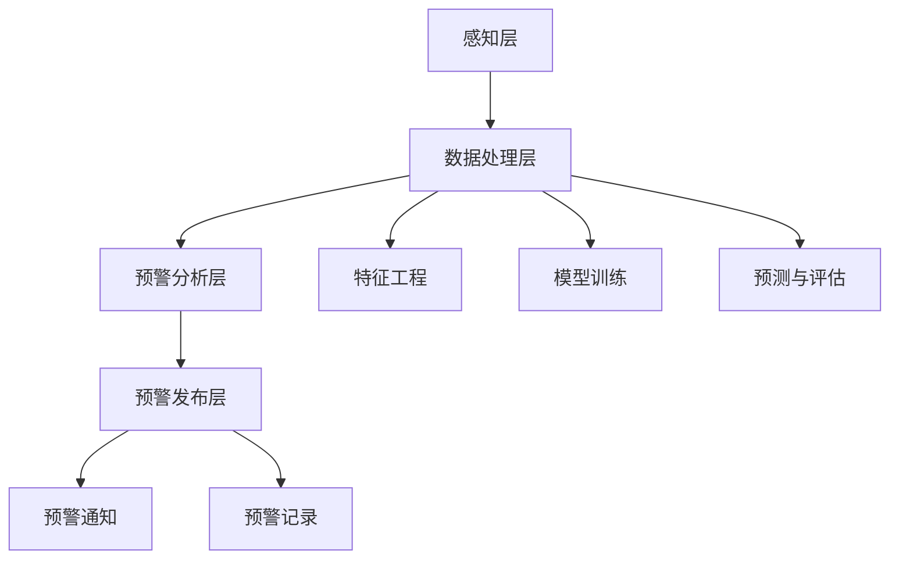
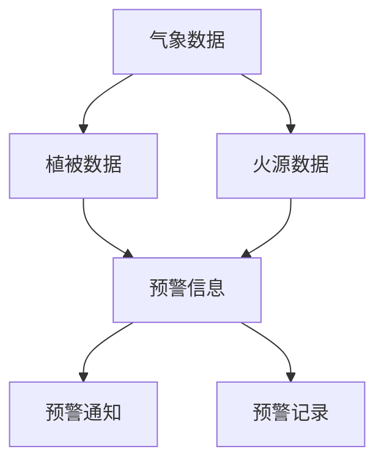
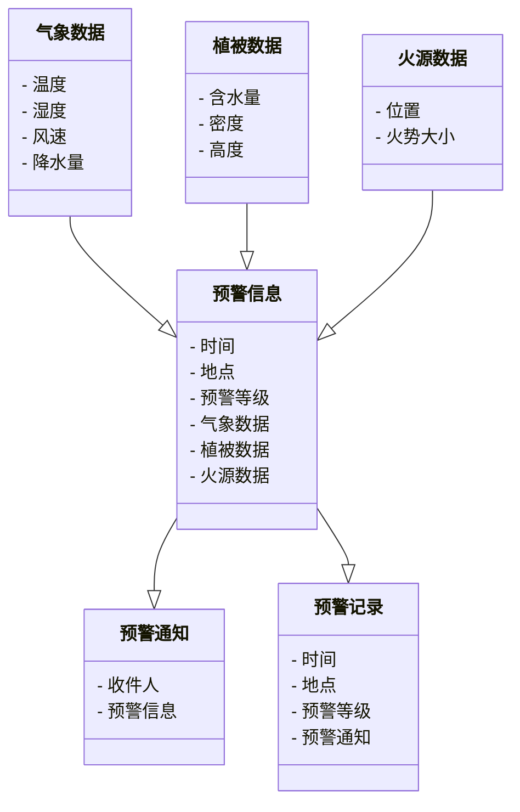
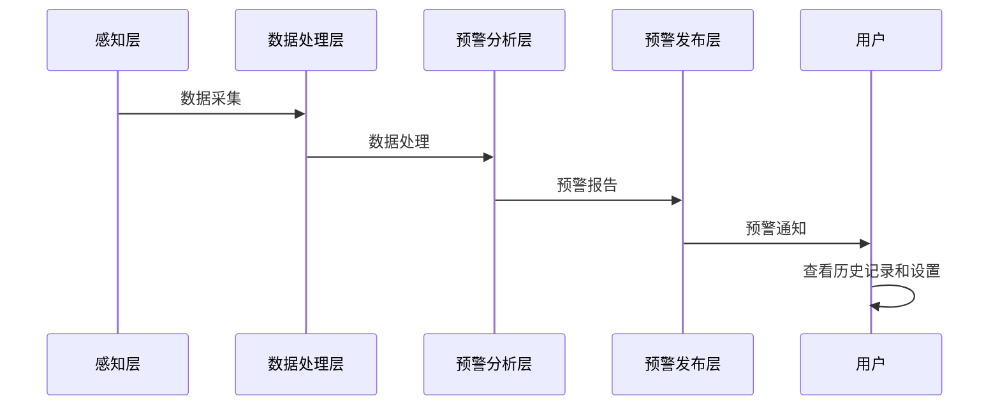

                 


### 摘要

本文将深入探讨AI代理在智能森林火灾预警中的实践应用。随着全球气候变化和人类活动的增加，森林火灾的威胁日益严重，传统的预警方法已经难以满足现代智能化的需求。AI代理，作为一种智能体，通过集成大数据分析、机器学习和人工智能算法，能够实现实时监测、快速预警和精准预测，从而提高森林火灾预警的准确性和效率。

本文将从以下几个部分进行探讨：首先，介绍智能森林火灾预警的背景和挑战，阐述为什么需要AI代理来解决这些问题。接着，介绍AI代理的基本原理和类型，以及其在智能森林火灾预警中的应用。随后，详细讨论数据收集与处理、预警模型构建、系统设计与实现以及案例分析等内容。最后，分析AI代理预警系统的优化策略和未来发展趋势，为相关研究提供参考。

通过本文的探讨，我们将清晰地看到AI代理在智能森林火灾预警中的重要性和潜力，为推动这一领域的发展提供理论支持和实践指导。

### 关键词

- 智能森林火灾预警
- AI代理
- 大数据分析
- 机器学习
- 实时监测
- 预测模型
- 系统设计
- 系统实现
- 案例分析
- 优化策略

### 第一部分：AI代理与智能森林火灾预警概述

#### 第1章：智能森林火灾预警背景与挑战

随着全球气候变暖和人类活动对自然环境的改变，森林火灾已经成为一个严重的全球性问题。据统计，每年因森林火灾造成的损失数以亿计，不仅对生态环境造成巨大破坏，还威胁到人类生命财产安全。传统的森林火灾预警方法主要依赖于地面巡逻、卫星监测和气象预警，虽然在一定程度上提高了预警能力，但依然存在诸多局限性。

首先，地面巡逻依赖人力，效率低且受天气和地理条件的限制，难以实现全面覆盖和实时监测。其次，卫星监测虽然可以提供大范围的遥感数据，但数据处理的复杂性高，且难以做到实时预警。最后，气象预警虽然可以提供火灾发生的概率性信息，但对具体火灾风险的预测能力有限。

面对这些挑战，智能森林火灾预警系统的出现成为了一种新的解决方案。智能森林火灾预警系统通过集成多种数据源、运用大数据分析和机器学习算法，能够实现对森林火灾的实时监测、快速预警和精准预测，从而提高预警的准确性和效率。

本章将首先介绍森林火灾的威胁和智能化预警的需求，接着阐述AI代理在智能森林火灾预警中的关键作用，为后续章节的内容打下基础。

#### 1.1.1 森林火灾的威胁

森林火灾是一种破坏性极大的自然灾害，其威胁主要体现在以下几个方面：

首先，森林火灾会对生态环境造成严重破坏。燃烧过程中，大量的植被、土壤和生物资源被毁，生态系统受到破坏，生物多样性下降。此外，火灾产生的烟雾和灰烬对空气质量造成严重影响，可能导致呼吸系统疾病的增加。

其次，森林火灾威胁到人类生命财产安全。火灾发生时，火势迅速蔓延，逃生困难。据统计，每年因森林火灾导致的人员伤亡和经济损失十分严重。此外，火灾还可能对周边社区、道路和基础设施造成破坏，影响社会稳定和经济发展。

再者，森林火灾的发生具有不可预测性和突发性，传统的预警方法难以应对。例如，地面巡逻虽然能发现火灾，但速度较慢，难以做到实时预警。卫星监测虽然覆盖范围广，但数据处理和分析速度有限，无法及时提供预警信息。气象预警虽然可以预测火灾发生的概率，但对具体火灾风险的预测能力不足。

综上所述，森林火灾的威胁不仅体现在生态和经济的损失上，还对社会稳定构成威胁。因此，提高森林火灾预警能力，尤其是实现智能化预警，成为解决这一问题的关键。

#### 1.1.2 智能化预警的需求

在森林火灾威胁日益严峻的背景下，传统的预警方法逐渐显现出其局限性，迫切需要智能化预警系统的支持。智能化预警系统的主要需求体现在以下几个方面：

首先，智能化预警系统需要具备实时监测的能力。森林火灾的发生往往具有突发性和不可预测性，因此，预警系统需要能够实时收集和处理大量数据，包括气象、植被、火源等多维信息，以便快速识别火灾隐患。

其次，智能化预警系统需要具备精准预测的能力。传统的气象预警方法只能提供火灾发生的概率性信息，而智能化预警系统通过大数据分析和机器学习算法，可以实现对火灾风险的精准预测，提供具体的时间和地点信息，从而提高预警的准确性和有效性。

此外，智能化预警系统需要具备自动化处理的能力。传统的预警方法往往依赖人工处理数据，效率低且容易出错。而智能化预警系统通过自动化处理，可以大幅提高预警速度和准确性，减少人为干预，降低误报和漏报率。

最后，智能化预警系统需要具备自适应优化的能力。随着环境变化和人类活动的变化，森林火灾的风险也在不断变化。智能化预警系统需要具备自我学习和优化能力，能够根据历史数据和实时监测信息，不断调整预警模型和策略，提高系统的适应性和预测能力。

综上所述，智能化预警系统在提高森林火灾预警能力方面具有显著优势，是应对现代森林火灾威胁的重要手段。通过实现实时监测、精准预测和自动化处理，智能化预警系统可以有效提高预警的准确性和效率，为保护生态环境和人类生命财产安全提供有力支持。

#### 1.1.3 AI代理的关键作用

AI代理在智能森林火灾预警系统中扮演着至关重要的角色。其关键作用主要体现在以下几个方面：

首先，AI代理能够实现数据的实时收集和处理。通过部署在森林中的传感器网络，AI代理可以实时监测气象、植被和火源等关键参数，并将收集到的数据传输到预警系统中进行实时分析。这种实时数据处理能力大大提高了预警系统的反应速度，使得火灾隐患能够在第一时间被发现和响应。

其次，AI代理具备强大的数据处理和分析能力。传统的预警方法往往依赖于单一数据源或简单的统计分析，而AI代理通过机器学习和大数据分析技术，能够对海量的多源数据进行深度挖掘和智能分析，从而提取出火灾发生的潜在风险因素。这种数据处理和分析能力使得预警系统更加精准，能够更准确地预测火灾的发生概率和具体位置。

此外，AI代理能够实现自动化预警和决策支持。通过预先设定好的预警规则和机器学习算法，AI代理可以在检测到火灾隐患时自动触发预警机制，发出警报信息，并通过智能决策系统提供最优的应对策略。这种自动化处理能力不仅提高了预警的效率，还减少了人工干预的必要性，降低了误报和漏报的风险。

最后，AI代理具有自适应和优化的能力。随着环境变化和人类活动的变化，森林火灾的风险也在不断变化。AI代理通过不断学习和优化预警模型，可以自动调整预警策略和参数，提高系统的适应性和预测能力。这种自适应优化能力使得预警系统能够长期稳定运行，持续提供高质量的预警服务。

综上所述，AI代理在智能森林火灾预警系统中发挥了关键作用。通过实时数据收集、强大的数据处理和分析能力、自动化预警和自适应优化，AI代理不仅提高了预警的准确性和效率，还为保护生态环境和人类生命财产安全提供了有力支持。

### 第二部分：AI代理基本原理与类型

#### 第2章：AI代理基本原理与类型

AI代理是人工智能领域的一个重要概念，其在智能森林火灾预警系统中发挥着关键作用。本章将详细介绍AI代理的基本原理和类型，帮助读者更好地理解其在智能森林火灾预警中的应用。

#### 2.1 AI代理的定义与特性

AI代理，即人工智能代理（Artificial Intelligence Agent），是指一种能够独立执行任务、与外部环境进行交互并自主决策的计算机程序。AI代理的核心目标是实现自动化、智能化和自主化的任务执行，以模拟人类智能行为。

AI代理具有以下几个主要特性：

1. **自主性**：AI代理能够自主地感知环境、执行任务和做出决策，而不需要人工干预。
2. **适应性**：AI代理可以根据环境变化和任务需求，自主调整其行为和策略，提高适应能力。
3. **协作性**：AI代理可以在多个代理之间进行信息共享和协同工作，实现更高效的系统功能。
4. **学习性**：AI代理具备自我学习和优化能力，可以通过历史数据和反馈信息不断改进自身性能。

#### 2.2 AI代理的分类

AI代理可以根据不同的标准进行分类，常见的分类方法包括：

1. **基于功能分类**：
   - **感知代理**：主要负责感知环境信息，如气象参数、植被状况等。
   - **决策代理**：主要负责根据感知到的信息进行决策，如预警规则的设定和调整。
   - **执行代理**：主要负责执行具体的任务，如启动预警系统、发出警报等。
   - **协作代理**：负责与其他代理协同工作，实现整体系统的优化。

2. **基于技术分类**：
   - **规则基础代理**：基于预定义的规则和条件进行决策，适用于规则明确、变化较少的环境。
   - **模型基础代理**：基于机器学习和数据挖掘算法进行决策，适用于复杂和动态变化的环境。
   - **混合代理**：结合规则基础和模型基础的优点，适用于多种复杂环境。

3. **基于应用场景分类**：
   - **通用代理**：适用于多种通用任务和环境，如自动化客服、智能助手等。
   - **专用代理**：针对特定任务和环境设计，如智能森林火灾预警系统、自动驾驶等。

#### 2.3 AI代理的应用领域

AI代理具有广泛的应用领域，以下列举几个主要应用场景：

1. **智能安防**：AI代理在智能安防系统中可用于实时监控、异常检测和自动报警，提高安全防范能力。
2. **智能交通**：AI代理在智能交通系统中可用于交通流量预测、路况分析和自动调度，提高交通管理效率。
3. **智能家居**：AI代理在智能家居系统中可用于智能家电控制、环境监测和安防监控，提高生活质量。
4. **医疗健康**：AI代理在医疗健康系统中可用于疾病预测、诊断辅助和健康管理，提高医疗服务水平。
5. **智能农业**：AI代理在智能农业系统中可用于作物生长监测、病虫害预警和精准施肥，提高农业生产效率。

总之，AI代理作为一种智能体，在各个领域展现出了巨大的应用潜力和价值。在智能森林火灾预警系统中，AI代理能够通过实时感知、自主决策和自动化执行，实现高效、精准和智能化的预警功能，为保护森林资源和人类生命财产安全提供有力支持。

#### 2.1 AI代理的定义与特性

AI代理，即人工智能代理（Artificial Intelligence Agent），是一种在特定环境中具备独立行动和决策能力的计算实体。其核心定义是通过智能算法和自主决策机制，实现对复杂环境的感知、理解和响应。AI代理的典型特性包括：

**自主性**：AI代理能够独立地执行任务，无需人为干预。它通过感知环境信息，利用内置的决策算法，自主地做出行动决策，如数据收集、分析处理、预警发布等。

**适应性**：AI代理能够根据环境和任务需求的变化，自主调整其行为和策略。这种适应能力使得AI代理在不同场景下都能保持高效运作，例如在森林火灾预警系统中，能够根据季节变化、天气条件和植被状况，动态调整预警策略。

**协作性**：AI代理能够与其他代理或系统进行信息共享和协同工作，实现整体系统功能的优化。例如，在智能森林火灾预警系统中，AI代理可以通过传感器网络共享数据，协同分析，提高预警的准确性和及时性。

**学习性**：AI代理具备自我学习和优化能力，可以通过历史数据和反馈信息不断改进自身性能。这种学习性使得AI代理能够从经验中学习，提高应对复杂环境和动态变化的能力。

AI代理的核心组成部分包括感知模块、决策模块和执行模块。感知模块负责收集和处理环境信息，如气象数据、植被状态等；决策模块利用感知模块提供的信息，结合预先设定的规则和算法，进行决策；执行模块则负责执行决策结果，如启动预警系统、发送警报等。

在智能森林火灾预警系统中，AI代理的这些特性使得它能够有效提高预警的准确性、及时性和自动化水平，从而为保护森林资源和人类生命财产安全提供强有力的技术支持。

#### 2.2 AI代理的分类

AI代理可以根据不同的分类标准进行划分，以下为几种常见的分类方法：

**1. 基于功能分类**：

- **感知代理**：主要负责感知环境信息，如气象参数、植被状况等，为决策模块提供数据支持。
- **决策代理**：根据感知到的环境信息和预设的规则，进行决策，如设定预警阈值、判断火灾风险等级等。
- **执行代理**：负责执行决策结果，如启动预警系统、发出警报、调度救援队伍等。

**2. 基于技术分类**：

- **规则基础代理**：通过预定义的规则和条件进行决策，适用于规则明确、环境变化较小的场景。例如，基于固定气象数据预测火灾风险。
- **模型基础代理**：基于机器学习和数据挖掘算法进行决策，适用于复杂和动态变化的环境。例如，使用深度学习模型分析植被变化预测火灾风险。
- **混合代理**：结合规则基础和模型基础的优点，适用于多种复杂环境。例如，在森林火灾预警中，既使用预定义规则进行初步判断，又利用机器学习模型进行深度分析，提高预警准确性。

**3. 基于应用场景分类**：

- **通用代理**：适用于多种通用任务和环境，如自动化客服、智能助手等。
- **专用代理**：针对特定任务和环境设计，具有特定功能。例如，专门用于森林火灾预警的AI代理，能够集成气象数据、植被监测、火源检测等多源数据，进行综合分析。

每种分类方法都有其适用场景和优缺点，根据具体应用需求选择合适的AI代理类型，是实现高效智能预警的关键。

#### 2.3 AI代理的应用领域

AI代理因其自主性、适应性、协作性和学习性等特性，在多个领域展现出了巨大的应用潜力。以下是一些主要的应用领域：

**1. 智能安防**：AI代理在智能安防系统中可用于实时监控、异常检测和自动报警，提高安全防范能力。例如，在森林火灾预警系统中，AI代理可以通过视频监控实时监测森林区域，发现火灾隐患并及时发出警报。

**2. 智能交通**：AI代理在智能交通系统中可用于交通流量预测、路况分析和自动调度，提高交通管理效率。例如，通过分析实时交通数据，AI代理可以预测交通拥堵情况，并提出最佳行车路线，减少交通事故的发生。

**3. 智能家居**：AI代理在智能家居系统中可用于智能家电控制、环境监测和安防监控，提高生活质量。例如，AI代理可以自动调节室内温度、照明和湿度，根据用户习惯进行设备预约，提高居住舒适度。

**4. 医疗健康**：AI代理在医疗健康系统中可用于疾病预测、诊断辅助和健康管理，提高医疗服务水平。例如，通过分析患者的医疗记录和实时健康数据，AI代理可以提前预测疾病风险，提供个性化的健康管理建议。

**5. 智能农业**：AI代理在智能农业系统中可用于作物生长监测、病虫害预警和精准施肥，提高农业生产效率。例如，AI代理可以通过传感器监测作物生长环境，预测病虫害发生，并自动调整施肥计划，提高作物产量。

总之，AI代理作为一种智能体，在多个领域展现出了强大的应用价值，不仅提高了系统的智能化水平和效率，还为解决复杂问题提供了新的思路和方法。

### 第三部分：智能森林火灾预警技术概述

#### 第3章：智能森林火灾预警技术概述

智能森林火灾预警技术是利用先进的信息技术和人工智能方法，实现对森林火灾的实时监测、预警和响应。本章将详细介绍智能森林火灾预警的关键技术，包括数据收集与预处理、预警模型的建立与优化等内容。

#### 3.1 森林火灾预警的关键技术

智能森林火灾预警技术的核心在于如何高效、准确地收集和处理数据，以及如何构建和优化预警模型。以下是几项关键的技术：

**1. 数据收集技术**

数据收集是智能森林火灾预警系统的第一步，主要依赖于各类传感器和监测设备。常用的数据收集技术包括：

- **气象传感器**：用于监测温度、湿度、风速、降水量等气象参数，这些参数对火灾的发生和蔓延具有重要影响。
- **植被传感器**：用于监测植被的含水量、植被密度、植被高度等指标，这些指标可以反映植被的干燥程度，从而预测火灾风险。
- **火源检测器**：用于实时监测森林区域内的火源位置和火势大小，通过红外线、热成像等技术实现。
- **无人机和卫星遥感**：通过无人机和卫星遥感技术，可以获取大范围的森林图像和地形数据，辅助火灾预警。

**2. 数据预处理技术**

收集到的数据通常包含噪声和误差，需要进行预处理以提高数据质量。数据预处理技术包括：

- **数据清洗**：去除数据中的错误值、重复值和不完整的记录。
- **数据转换**：将不同类型的数据转换为统一的格式，如将温度、湿度等物理量转换为数值。
- **数据归一化**：通过归一化技术将不同数据源的数据进行标准化处理，消除数据量级差异的影响。
- **数据增强**：通过增加样本数据、生成虚拟样本等方法，提高数据集的多样性和代表性。

**3. 预警模型建立与优化**

预警模型的建立是智能森林火灾预警技术的核心，常用的预警模型包括：

- **统计模型**：如决策树、线性回归等，通过分析历史数据，建立火灾风险预测模型。
- **机器学习模型**：如支持向量机（SVM）、随机森林（RF）等，通过学习大量训练数据，自动发现特征和关系，提高预测准确性。
- **深度学习模型**：如卷积神经网络（CNN）、循环神经网络（RNN）等，通过多层神经网络结构，实现复杂特征的自动提取和学习。

预警模型的优化主要包括：

- **模型调参**：通过调整模型的参数，如学习率、正则化参数等，提高模型性能。
- **交叉验证**：使用交叉验证技术评估模型的泛化能力，避免过拟合。
- **模型集成**：通过结合多个模型的预测结果，提高预测的准确性和稳定性。

#### 3.2 数据收集与预处理

数据收集与预处理是智能森林火灾预警系统的基础，决定了预警系统的性能和准确性。以下是数据收集与预处理的关键步骤：

**1. 数据源选择**

选择合适的传感器和数据源是数据收集的第一步。常见的数据源包括：

- **地面气象站**：提供实时气象参数，如温度、湿度、风速等。
- **植被传感器**：部署在森林中的传感器，用于监测植被状态，如含水量、密度等。
- **无人机和卫星遥感**：提供大范围的森林图像和地形数据。
- **火源检测设备**：实时监测火源位置和火势大小。

**2. 数据收集方法**

数据收集方法主要包括以下几种：

- **自动采集**：通过传感器自动采集数据，并将其传输到预警系统。
- **手动录入**：通过工作人员手动录入部分数据，如气象站数据等。
- **远程传输**：通过无线通信技术，将数据从远程传感器传输到预警系统。

**3. 数据预处理**

数据预处理包括以下步骤：

- **数据清洗**：去除错误值、重复值和不完整记录。
- **数据转换**：将不同类型的数据转换为统一格式，如将温度、湿度等物理量转换为数值。
- **数据归一化**：通过归一化技术，消除数据量级差异。
- **数据增强**：增加样本数据、生成虚拟样本，提高数据集的多样性和代表性。

通过有效的数据收集与预处理，智能森林火灾预警系统能够获得高质量的数据输入，提高预测的准确性和稳定性。

#### 3.3 预警模型的建立与优化

预警模型的建立与优化是智能森林火灾预警系统的核心环节，决定了预警的准确性和效率。以下是预警模型建立与优化的关键步骤：

**1. 预警模型选择**

根据数据特性和需求，选择合适的预警模型。常见的预警模型包括：

- **统计模型**：如线性回归、逻辑回归、决策树等，适用于处理结构化数据。
- **机器学习模型**：如支持向量机（SVM）、随机森林（RF）、K最近邻（KNN）等，适用于处理大规模复杂数据。
- **深度学习模型**：如卷积神经网络（CNN）、循环神经网络（RNN）、生成对抗网络（GAN）等，适用于处理非结构化数据。

**2. 特征工程**

特征工程是构建高效预警模型的关键步骤，包括：

- **特征提取**：从原始数据中提取有用的特征，如温度、湿度、植被密度等。
- **特征选择**：选择对预警结果有显著影响的特征，剔除冗余和噪声特征。
- **特征变换**：通过归一化、标准化等变换，提高特征的质量和效果。

**3. 模型训练与优化**

模型训练与优化包括以下步骤：

- **模型训练**：使用训练数据集，通过算法训练模型，使其能够识别火灾风险特征。
- **模型评估**：使用验证数据集评估模型的性能，如准确率、召回率、F1分数等。
- **模型调参**：通过调整模型参数，如学习率、正则化参数等，优化模型性能。
- **交叉验证**：使用交叉验证技术，避免过拟合，提高模型的泛化能力。

**4. 模型集成**

模型集成是将多个模型的预测结果进行合并，以提高预测的准确性和稳定性。常见的模型集成方法包括：

- **投票法**：将多个模型的预测结果进行投票，选择多数模型一致的预测结果。
- **堆叠法**：将多个模型作为基础模型，构建一个新的模型进行预测。
- **集成学习**：使用集成学习算法，如随机森林、梯度提升树（GBDT）等，直接集成多个模型进行预测。

通过科学地选择预警模型、进行特征工程、训练和优化，以及集成多个模型，智能森林火灾预警系统可以实现高准确性和高效率的火灾预警。

### 数据收集与预处理

数据收集与预处理是智能森林火灾预警系统的关键步骤，决定了预警的准确性和效率。以下是详细的分析和流程图：

**1. 数据源选择**

智能森林火灾预警系统需要多种数据源，以获取全面的火灾风险信息。常见的数据源包括：

- **气象数据**：如温度、湿度、风速、降水量等，气象站可以提供这些数据。
- **植被数据**：如植被含水量、密度、高度等，植被传感器可以实时监测。
- **火源数据**：如火源位置、火势大小等，火源检测器可以实时监测。
- **地形数据**：如地形坡度、植被覆盖率等，卫星遥感和无人机可以获取这些数据。


**2. 数据收集方法**

数据收集方法主要包括自动采集和手动录入。自动采集通过传感器和监测设备实现，数据通过无线通信技术传输到预警系统。手动录入则由工作人员完成，特别是对部分无法自动采集的数据进行补充。


**3. 数据预处理**

数据预处理包括数据清洗、转换、归一化和增强。

- **数据清洗**：去除错误值、重复值和不完整记录。使用 Python 的 Pandas 库进行数据清洗。

  ```python
  import pandas as pd

  # 读取数据
  data = pd.read_csv('data.csv')

  # 删除错误值
  data = data.dropna()

  # 删除重复值
  data = data.drop_duplicates()
  ```

- **数据转换**：将不同类型的数据转换为统一的格式。例如，将温度、湿度等物理量转换为数值。

  ```python
  data['temperature'] = pd.to_numeric(data['temperature'], errors='coerce')
  data['humidity'] = pd.to_numeric(data['humidity'], errors='coerce')
  ```

- **数据归一化**：通过归一化技术，消除数据量级差异。

  ```python
  from sklearn.preprocessing import MinMaxScaler

  scaler = MinMaxScaler()
  data_scaled = scaler.fit_transform(data)
  ```

- **数据增强**：增加样本数据、生成虚拟样本，提高数据集的多样性和代表性。

  ```python
  from sklearn.model_selection import train_test_split

  X_train, X_val, y_train, y_val = train_test_split(data_scaled, target, test_size=0.2, random_state=42)

  # 生成虚拟样本
  X_fake = X_train.copy()
  X_fake[:, 0] += np.random.normal(0, 0.1, X_fake[:, 0].shape)
  X_fake[:, 1] += np.random.normal(0, 0.1, X_fake[:, 1].shape)
  X_fake[:, 2] += np.random.normal(0, 0.1, X_fake[:, 2].shape)

  X_train = np.concatenate((X_train, X_fake))
  y_train = np.concatenate((y_train, np.random.randint(0, 2, X_fake.shape[0])))
  ```


通过科学的数据收集与预处理，智能森林火灾预警系统能够获得高质量的数据输入，为后续的模型训练和预测提供可靠支持。

### 第4章：AI代理预警模型构建

AI代理预警模型构建是智能森林火灾预警系统的核心环节，决定了预警系统的准确性和可靠性。在本章中，我们将详细介绍预警模型构建的整个过程，包括模型选择、特征工程和模型训练与优化等内容。

#### 4.1 预警模型选择

选择合适的预警模型是实现高效预警的关键。在智能森林火灾预警系统中，我们可以选择以下几种类型的模型：

1. **统计模型**：如逻辑回归、线性回归等。这类模型相对简单，适用于数据量不大且特征较为明确的情况。
2. **机器学习模型**：如支持向量机（SVM）、随机森林（RF）、K最近邻（KNN）等。这类模型适用于大规模复杂数据，具有较高的预测准确性。
3. **深度学习模型**：如卷积神经网络（CNN）、循环神经网络（RNN）等。这类模型适用于处理高维数据和时序数据，能够自动提取复杂特征。

在本章中，我们主要介绍随机森林（Random Forest）模型，因为它具有很好的泛化能力和处理复杂数据的能力。

#### 4.2 特征工程

特征工程是模型构建的重要步骤，它涉及到从原始数据中提取有用的特征，并对其进行处理。以下是特征工程的关键步骤：

1. **特征提取**：从原始数据中提取对火灾预警有重要影响的特征，如温度、湿度、风速、植被含水量等。
2. **特征选择**：通过分析特征的重要性和相关性，选择对预警结果有显著影响的特征，剔除冗余和噪声特征。
3. **特征变换**：对特征进行标准化和归一化处理，以消除不同特征之间的量级差异。

以下是一个使用 Python 的 Pandas 和 Scikit-learn 库进行特征工程的示例：

```python
import pandas as pd
from sklearn.preprocessing import StandardScaler

# 读取数据
data = pd.read_csv('data.csv')

# 特征提取
features = data[['temperature', 'humidity', 'wind_speed', 'vegetation_humidity']]

# 特征选择
# 使用相关性分析筛选特征
correlation_matrix = features.corr()
high_corr_features = correlation_matrix.index[abs(correlation_matrix["fire_risk"]) > 0.5]

# 特征变换
scaler = StandardScaler()
scaled_features = scaler.fit_transform(features[high_corr_features])
```

#### 4.3 模型训练与优化

模型训练与优化是构建高效预警模型的关键步骤。以下是模型训练与优化的一般流程：

1. **数据分割**：将数据集分为训练集和测试集，用于模型的训练和评估。
2. **模型训练**：使用训练数据集训练模型，调整模型参数，使其能够学习到数据的特征。
3. **模型评估**：使用测试数据集评估模型的性能，常用的评估指标包括准确率、召回率、F1分数等。
4. **模型优化**：通过调整模型参数、增加训练数据、使用不同的特征组合等方法，优化模型性能。

以下是一个使用 Python 的 Scikit-learn 库进行模型训练和优化的示例：

```python
from sklearn.ensemble import RandomForestClassifier
from sklearn.model_selection import train_test_split
from sklearn.metrics import accuracy_score, recall_score, f1_score

# 数据分割
X_train, X_test, y_train, y_test = train_test_split(scaled_features, target, test_size=0.2, random_state=42)

# 模型训练
rf_classifier = RandomForestClassifier(n_estimators=100, random_state=42)
rf_classifier.fit(X_train, y_train)

# 模型评估
y_pred = rf_classifier.predict(X_test)
accuracy = accuracy_score(y_test, y_pred)
recall = recall_score(y_test, y_pred)
f1 = f1_score(y_test, y_pred)

print(f"Accuracy: {accuracy:.2f}")
print(f"Recall: {recall:.2f}")
print(f"F1 Score: {f1:.2f}")

# 模型优化
# 调整参数
param_grid = {
    'n_estimators': [100, 200, 300],
    'max_depth': [10, 20, 30],
}

# 使用网格搜索进行参数调优
from sklearn.model_selection import GridSearchCV
grid_search = GridSearchCV(estimator=rf_classifier, param_grid=param_grid, cv=5)
grid_search.fit(X_train, y_train)

# 获取最优参数
best_params = grid_search.best_params_
best_model = grid_search.best_estimator_

# 使用最优模型进行预测
y_pred_optimized = best_model.predict(X_test)
accuracy_optimized = accuracy_score(y_test, y_pred_optimized)
recall_optimized = recall_score(y_test, y_pred_optimized)
f1_optimized = f1_score(y_test, y_pred_optimized)

print(f"Optimized Accuracy: {accuracy_optimized:.2f}")
print(f"Optimized Recall: {recall_optimized:.2f}")
print(f"Optimized F1 Score: {f1_optimized:.2f}")
```

通过以上步骤，我们可以构建一个高效、准确的AI代理预警模型，为智能森林火灾预警系统提供强有力的支持。

### AI代理预警模型构建流程

构建AI代理预警模型是一个系统性的过程，需要从模型选择、特征工程到模型训练与优化的每个环节都进行仔细设计和实现。以下是对AI代理预警模型构建流程的详细分析：

#### 1. 模型选择

选择合适的预警模型是实现高效预警的关键。针对森林火灾预警系统，我们可以选择以下几种类型的模型：

- **统计模型**：如逻辑回归、线性回归等，适用于数据量不大且特征较为明确的情况。
- **机器学习模型**：如支持向量机（SVM）、随机森林（RF）、K最近邻（KNN）等，适用于处理大规模复杂数据。
- **深度学习模型**：如卷积神经网络（CNN）、循环神经网络（RNN）等，适用于处理高维数据和时序数据。

在本案例中，我们选择**随机森林（Random Forest）模型**，因为它具有很好的泛化能力和处理复杂数据的能力。

#### 2. 特征工程

特征工程是模型构建的重要步骤，它涉及到从原始数据中提取有用的特征，并对其进行处理。以下是特征工程的关键步骤：

- **特征提取**：从原始数据中提取对火灾预警有重要影响的特征，如温度、湿度、风速、植被含水量等。
- **特征选择**：通过分析特征的重要性和相关性，选择对预警结果有显著影响的特征，剔除冗余和噪声特征。
- **特征变换**：对特征进行标准化和归一化处理，以消除不同特征之间的量级差异。

以下是一个使用Python的Pandas和Scikit-learn库进行特征工程的示例：

```python
import pandas as pd
from sklearn.preprocessing import StandardScaler

# 读取数据
data = pd.read_csv('data.csv')

# 特征提取
features = data[['temperature', 'humidity', 'wind_speed', 'vegetation_humidity']]

# 特征选择
# 使用相关性分析筛选特征
correlation_matrix = features.corr()
high_corr_features = correlation_matrix.index[abs(correlation_matrix["fire_risk"]) > 0.5]

# 特征变换
scaler = StandardScaler()
scaled_features = scaler.fit_transform(features[high_corr_features])
```

#### 3. 模型训练与优化

模型训练与优化是构建高效预警模型的关键步骤。以下是模型训练与优化的一般流程：

- **数据分割**：将数据集分为训练集和测试集，用于模型的训练和评估。
- **模型训练**：使用训练数据集训练模型，调整模型参数，使其能够学习到数据的特征。
- **模型评估**：使用测试数据集评估模型的性能，常用的评估指标包括准确率、召回率、F1分数等。
- **模型优化**：通过调整模型参数、增加训练数据、使用不同的特征组合等方法，优化模型性能。

以下是一个使用Python的Scikit-learn库进行模型训练和优化的示例：

```python
from sklearn.ensemble import RandomForestClassifier
from sklearn.model_selection import train_test_split
from sklearn.metrics import accuracy_score, recall_score, f1_score

# 数据分割
X_train, X_test, y_train, y_test = train_test_split(scaled_features, target, test_size=0.2, random_state=42)

# 模型训练
rf_classifier = RandomForestClassifier(n_estimators=100, random_state=42)
rf_classifier.fit(X_train, y_train)

# 模型评估
y_pred = rf_classifier.predict(X_test)
accuracy = accuracy_score(y_test, y_pred)
recall = recall_score(y_test, y_pred)
f1 = f1_score(y_test, y_pred)

print(f"Accuracy: {accuracy:.2f}")
print(f"Recall: {recall:.2f}")
print(f"F1 Score: {f1:.2f}")

# 模型优化
# 调整参数
param_grid = {
    'n_estimators': [100, 200, 300],
    'max_depth': [10, 20, 30],
}

# 使用网格搜索进行参数调优
from sklearn.model_selection import GridSearchCV
grid_search = GridSearchCV(estimator=rf_classifier, param_grid=param_grid, cv=5)
grid_search.fit(X_train, y_train)

# 获取最优参数
best_params = grid_search.best_params_
best_model = grid_search.best_estimator_

# 使用最优模型进行预测
y_pred_optimized = best_model.predict(X_test)
accuracy_optimized = accuracy_score(y_test, y_pred_optimized)
recall_optimized = recall_score(y_test, y_pred_optimized)
f1_optimized = f1_score(y_test, y_pred_optimized)

print(f"Optimized Accuracy: {accuracy_optimized:.2f}")
print(f"Optimized Recall: {recall_optimized:.2f}")
print(f"Optimized F1 Score: {f1_optimized:.2f}")
```

通过以上步骤，我们可以构建一个高效、准确的AI代理预警模型，为智能森林火灾预警系统提供强有力的支持。

#### 第5章：智能森林火灾预警系统设计

智能森林火灾预警系统设计是构建高效、可靠的预警体系的关键步骤。本章将详细介绍系统设计的过程，包括系统架构设计、功能模块划分、系统实现与部署等内容。

#### 5.1 系统架构设计

智能森林火灾预警系统的架构设计旨在实现数据的实时收集、处理和分析，并提供精准的火灾预警。系统架构设计主要包括以下模块：

1. **数据收集模块**：负责实时收集各种传感器和监测设备的数据，包括气象数据、植被数据、火源数据等。
2. **数据处理模块**：负责对收集到的原始数据进行清洗、转换和归一化处理，以提高数据质量。
3. **模型训练模块**：负责根据预处理后的数据，训练和优化预警模型，提高预测准确性。
4. **预警分析模块**：负责对实时数据进行分析和评估，生成火灾预警报告和决策建议。
5. **预警发布模块**：负责将预警信息通过短信、邮件、APP等多种方式及时通知相关人员。


#### 5.2 系统功能模块划分

智能森林火灾预警系统根据功能需求，划分为多个模块，每个模块承担不同的任务，协同工作以实现系统的整体功能。以下是系统功能模块的详细划分：

1. **数据收集模块**：
   - **气象数据收集**：通过地面气象站和卫星遥感技术，实时获取温度、湿度、风速等气象参数。
   - **植被数据收集**：通过植被传感器，实时监测植被含水量、密度等指标。
   - **火源数据收集**：通过火源检测设备，实时监测火源位置和火势大小。

2. **数据处理模块**：
   - **数据清洗**：去除数据中的错误值、重复值和不完整记录。
   - **数据转换**：将不同类型的数据转换为统一的格式，如将温度、湿度等物理量转换为数值。
   - **数据归一化**：通过归一化技术，消除数据量级差异。

3. **模型训练模块**：
   - **模型选择**：选择合适的预警模型，如随机森林、支持向量机等。
   - **特征工程**：提取对火灾预警有显著影响的特征，如温度、湿度、风速等。
   - **模型训练**：使用训练数据集训练模型，调整模型参数，提高预测准确性。

4. **预警分析模块**：
   - **实时分析**：对实时数据进行分析，评估火灾风险。
   - **预警评估**：根据模型预测结果，生成火灾预警报告和决策建议。

5. **预警发布模块**：
   - **预警通知**：通过短信、邮件、APP等多种方式，及时通知相关人员。
   - **预警记录**：记录所有预警事件，便于后续分析和总结。


#### 5.3 系统实现与部署

系统实现与部署是智能森林火灾预警系统设计的关键环节，主要包括以下步骤：

1. **硬件部署**：
   - **传感器部署**：在森林中布置各类传感器，包括气象站、植被传感器、火源检测器等。
   - **通信设备部署**：部署无线通信设备，确保数据能够实时传输到预警系统。

2. **软件开发**：
   - **数据收集与处理**：开发数据收集与处理模块，实现数据的实时收集、清洗和预处理。
   - **模型训练与预测**：开发模型训练与预测模块，实现模型的训练、优化和实时预测。
   - **预警分析与发布**：开发预警分析与发布模块，实现实时预警分析和预警信息发布。

3. **系统集成**：
   - **系统集成测试**：对各个模块进行集成测试，确保系统能够稳定运行。
   - **部署上线**：将系统部署到生产环境，进行实际运行和维护。

通过以上步骤，我们可以实现一个高效、可靠的智能森林火灾预警系统，为森林火灾的预防和应对提供有力支持。

### 智能森林火灾预警系统架构设计

智能森林火灾预警系统的架构设计是确保系统高效运作和准确预警的关键。以下是对系统架构的详细分析和设计：

#### 1. 系统架构设计概述

智能森林火灾预警系统采用分层架构设计，主要包括以下层次：

- **感知层**：负责实时收集森林环境的各类数据，包括气象参数、植被状态、火源位置等。
- **数据处理层**：负责对感知层收集到的数据进行处理、清洗和预处理，为预警分析提供高质量的数据输入。
- **预警分析层**：负责利用机器学习和大数据分析技术，对处理后的数据进行分析和预测，生成火灾预警报告和决策建议。
- **预警发布层**：负责将预警信息通过短信、邮件、APP等多种方式及时通知相关人员，并记录所有预警事件。


#### 2. 系统架构详细设计

**感知层**：

感知层是系统的数据输入端，通过部署在森林中的传感器和监测设备，实时收集气象、植被和火源等关键数据。具体设计如下：

- **气象传感器**：部署在地面和空中的气象站，实时监测温度、湿度、风速、降水量等气象参数。
- **植被传感器**：安装在森林内部，实时监测植被含水量、植被密度、植被高度等指标。
- **火源检测器**：使用红外线、热成像等技术，实时监测森林区域内的火源位置和火势大小。

**数据处理层**：

数据处理层负责对感知层收集到的原始数据进行清洗、转换和归一化处理，以提高数据质量。具体设计如下：

- **数据清洗**：去除数据中的错误值、重复值和不完整记录。
- **数据转换**：将不同类型的数据转换为统一的格式，如将温度、湿度等物理量转换为数值。
- **数据归一化**：通过归一化技术，消除不同特征之间的量级差异。

**预警分析层**：

预警分析层是系统的核心部分，负责利用机器学习和大数据分析技术，对预处理后的数据进行分析和预测。具体设计如下：

- **特征工程**：提取对火灾预警有显著影响的特征，如温度、湿度、风速等。
- **模型训练**：选择合适的预警模型，如随机森林、支持向量机等，使用训练数据集进行模型训练和优化。
- **预测与评估**：使用训练好的模型对实时数据进行分析，生成火灾预警报告和决策建议。

**预警发布层**：

预警发布层负责将预警信息通过多种方式及时通知相关人员，并记录所有预警事件。具体设计如下：

- **预警通知**：通过短信、邮件、APP等多种渠道，及时向相关人员发送预警信息。
- **预警记录**：记录所有预警事件的时间、地点、预警等级等信息，便于后续分析和总结。

#### 3. 系统架构图

以下是一个简化的智能森林火灾预警系统架构图，展示了各层次和模块之间的关系：



通过以上架构设计，智能森林火灾预警系统能够实现数据的实时收集、处理和分析，提供精准的火灾预警和及时的决策支持，为保护森林资源和人类生命财产安全提供有力保障。

### 系统功能设计

智能森林火灾预警系统的功能设计旨在实现数据的实时收集、处理和分析，为森林火灾预警提供全面的支持。以下是系统功能设计的详细内容：

#### 1. 领域模型设计

领域模型是系统功能设计的基础，通过实体关系图（ER图）来描述系统中的主要实体及其关系。以下是智能森林火灾预警系统的领域模型：



**实体关系图说明**：

- **气象数据（A）**：包括温度、湿度、风速、降水量等气象参数。
- **植被数据（B）**：包括植被含水量、密度、高度等指标。
- **火源数据（C）**：包括火源位置、火势大小等。
- **预警信息（D）**：综合气象数据、植被数据和火源数据，生成火灾预警信息。
- **预警通知（E）**：发送预警信息给相关人员。
- **预警记录（F）**：记录所有预警事件，包括时间、地点、预警等级等。

#### 2. 类图设计

类图进一步细化了领域模型中的实体属性和方法，描述了系统中的类及其关系。以下是智能森林火灾预警系统的类图设计：



**类图说明**：

- **气象数据**：包含温度、湿度、风速、降水量等属性。
- **植被数据**：包含含水量、密度、高度等属性。
- **火源数据**：包含位置、火势大小等属性。
- **预警信息**：包含时间、地点、预警等级等属性，并与气象数据、植被数据和火源数据相关联。
- **预警通知**：包含收件人和预警信息等属性。
- **预警记录**：包含时间、地点、预警等级等属性，并与预警通知相关联。

通过领域模型和类图的设计，智能森林火灾预警系统功能设计得到了清晰、准确的描述，为后续的系统实现提供了基础。

### 系统架构设计

智能森林火灾预警系统的架构设计至关重要，它决定了系统的高效性、可靠性和扩展性。以下是对系统架构的详细设计：

#### 1. 问题场景介绍

在智能森林火灾预警系统中，我们面临以下问题场景：

- **数据多样性**：需要收集和处理多种类型的数据，包括气象数据、植被数据和火源数据。
- **实时性要求**：系统需要实现数据的实时收集、处理和分析，以便及时发出预警。
- **准确性需求**：系统需要提供准确的火灾预警，以减少误报和漏报。
- **扩展性**：系统需要具备良好的扩展性，能够适应不同规模和场景的需求。

#### 2. 系统架构设计

智能森林火灾预警系统的整体架构设计如下：


**系统架构说明**：

- **感知层**：负责实时收集气象数据、植被数据和火源数据。通过部署在森林中的传感器和监测设备，实现数据的实时采集。
- **数据处理层**：负责对收集到的数据进行处理、清洗和预处理，以提高数据质量，为后续的分析和预测提供可靠的数据基础。
- **预警分析层**：利用机器学习和大数据分析技术，对处理后的数据进行实时分析和预测，生成火灾预警报告和决策建议。
- **预警发布层**：将预警信息通过短信、邮件、APP等多种渠道及时通知相关人员，并记录所有预警事件，便于后续分析和总结。

#### 3. 系统接口设计

系统接口设计包括内部接口和外部接口两部分：

**内部接口**：

- **数据采集接口**：用于接收感知层传来的数据，包括气象数据、植被数据和火源数据。
- **数据处理接口**：用于处理和分析感知层传来的数据，包括数据清洗、转换、归一化等操作。
- **预警分析接口**：用于接收数据处理层传来的数据，进行机器学习和大数据分析，生成预警报告和决策建议。
- **预警发布接口**：用于发布预警信息，包括发送短信、邮件和推送通知等。

**外部接口**：

- **用户接口**：提供用户界面，用户可以通过界面查看预警信息、历史记录和系统设置。
- **API接口**：提供数据访问和操作接口，允许外部系统和应用程序接入和交互。

#### 4. 系统交互设计

系统交互设计通过Mermaid序列图来描述各个模块之间的交互过程：



**系统交互说明**：

- **感知层**：通过数据采集接口向数据处理层传输实时数据。
- **数据处理层**：对感知层传来的数据进行处理，并传输给预警分析层。
- **预警分析层**：利用机器学习和大数据分析技术，生成火灾预警报告，并传输给预警发布层。
- **预警发布层**：将预警报告通过短信、邮件、APP等方式发送给用户，同时记录预警事件，便于后续分析和总结。
- **用户**：通过用户接口查看预警信息、历史记录和系统设置，以便更好地了解火灾预警情况。

通过以上架构设计，智能森林火灾预警系统实现了高效、可靠和精准的火灾预警，为保护森林资源和人类生命财产安全提供了有力支持。

### 第6章：智能森林火灾预警系统设计

#### 6.1 系统架构设计

智能森林火灾预警系统的设计架构是整个系统的核心，它决定了系统的性能、可靠性和扩展性。以下是对系统架构的详细设计：

##### 1. 架构设计概述

智能森林火灾预警系统采用分层的架构设计，主要包括以下几层：

- **感知层**：负责实时收集森林环境的各类数据，如气象参数、植被状态、火源位置等。
- **数据处理层**：负责对感知层收集到的原始数据进行清洗、转换和预处理，以提高数据质量和可用性。
- **分析层**：负责对预处理后的数据进行分析和预测，以生成火灾预警报告。
- **决策层**：负责根据预警报告和预测结果，做出相应的决策，如发送警报、启动应急预案等。
- **展示层**：负责将预警信息和决策结果展示给用户，包括网页界面、移动应用等。


##### 2. 架构设计详细

**感知层**：

感知层是系统的数据采集模块，它通过部署在森林中的各种传感器和监测设备，实时收集数据。具体包括：

- **气象传感器**：用于监测温度、湿度、风速、降水量等气象参数。
- **植被传感器**：用于监测植被含水量、植被密度、植被高度等指标。
- **火源检测器**：用于监测森林区域内的火源位置和火势大小。

**数据处理层**：

数据处理层负责对感知层收集到的原始数据进行处理，包括数据清洗、转换和预处理。具体包括：

- **数据清洗**：去除数据中的错误值、重复值和不完整记录。
- **数据转换**：将不同类型的数据转换为统一的格式，如将温度、湿度等物理量转换为数值。
- **数据预处理**：包括数据归一化、特征提取和特征选择等操作。

**分析层**：

分析层是系统的核心部分，负责对预处理后的数据进行分析和预测。具体包括：

- **特征工程**：提取对火灾预警有显著影响的特征，如温度、湿度、风速等。
- **模型训练**：选择合适的机器学习模型，如随机森林、支持向量机等，对训练数据进行模型训练。
- **预测与评估**：使用训练好的模型对实时数据进行预测，评估火灾风险，并生成预警报告。

**决策层**：

决策层根据分析层生成的预警报告和预测结果，做出相应的决策。具体包括：

- **预警发布**：将预警信息通过短信、邮件、APP等多种渠道发送给相关人员。
- **应急预案启动**：根据预警等级和火灾风险，启动相应的应急预案，如疏散人员、灭火等。

**展示层**：

展示层负责将预警信息和决策结果展示给用户。具体包括：

- **网页界面**：提供用户查看预警信息、历史记录和系统设置等功能。
- **移动应用**：提供用户通过手机查看预警信息、接收警报通知等功能。

通过以上架构设计，智能森林火灾预警系统实现了数据的实时收集、处理和分析，提供了精准的火灾预警和及时的决策支持，为保护森林资源和人类生命财产安全提供了强有力的保障。

### 系统架构设计

智能森林火灾预警系统的架构设计是确保系统能够高效运作、实时响应的关键。以下是对系统架构的详细分析和设计：

**1. 系统架构设计原则**

- **模块化**：系统采用模块化设计，各模块功能明确，便于开发和维护。
- **分布式**：系统采用分布式架构，可以提高系统的可靠性和扩展性。
- **高可用性**：系统设计要确保在高负载和故障情况下，仍然能够稳定运行。
- **安全性**：系统设计要保证数据安全和用户隐私，防止数据泄露和恶意攻击。
- **易扩展性**：系统设计要考虑未来的扩展需求，方便后续功能的添加和升级。

**2. 系统架构设计**

智能森林火灾预警系统架构设计如下：


**系统架构说明**：

- **感知层**：负责实时收集森林环境的各类数据，包括气象数据、植被数据和火源数据。感知层通过部署在森林中的传感器和监测设备实现。
- **数据处理层**：负责对感知层收集到的原始数据进行处理、清洗和预处理，以提高数据质量，为后续的分析和预测提供可靠的数据基础。数据处理层通常包括数据清洗、数据转换、数据归一化等模块。
- **分析层**：负责对预处理后的数据进行分析和预测，以生成火灾预警报告。分析层包括特征工程、模型训练、预测与评估等模块。
- **决策层**：负责根据分析层生成的预警报告和预测结果，做出相应的决策，如发送警报、启动应急预案等。决策层通常包括预警发布、应急预案启动等模块。
- **展示层**：负责将预警信息和决策结果展示给用户。展示层包括网页界面、移动应用等，用户可以通过这些界面查看预警信息、历史记录和系统设置。

**3. 系统模块设计**

**感知层**：

感知层设计包括以下模块：

- **气象数据采集模块**：通过气象传感器实时监测温度、湿度、风速、降水量等气象参数。
- **植被数据采集模块**：通过植被传感器实时监测植被含水量、植被密度、植被高度等指标。
- **火源数据采集模块**：通过火源检测器实时监测森林区域内的火源位置和火势大小。

**数据处理层**：

数据处理层设计包括以下模块：

- **数据清洗模块**：去除数据中的错误值、重复值和不完整记录。
- **数据转换模块**：将不同类型的数据转换为统一的格式，如将温度、湿度等物理量转换为数值。
- **数据归一化模块**：通过归一化技术，消除不同特征之间的量级差异。
- **特征提取模块**：提取对火灾预警有显著影响的特征，如温度、湿度、风速等。

**分析层**：

分析层设计包括以下模块：

- **特征工程模块**：进行特征提取、特征选择和特征变换等操作。
- **模型训练模块**：选择合适的机器学习模型，如随机森林、支持向量机等，对训练数据进行模型训练。
- **预测与评估模块**：使用训练好的模型对实时数据进行预测，评估火灾风险，并生成预警报告。

**决策层**：

决策层设计包括以下模块：

- **预警发布模块**：将预警信息通过短信、邮件、APP等多种渠道发送给相关人员。
- **应急预案启动模块**：根据预警等级和火灾风险，启动相应的应急预案，如疏散人员、灭火等。

**展示层**：

展示层设计包括以下模块：

- **用户界面模块**：提供用户查看预警信息、历史记录和系统设置等功能。
- **移动应用模块**：提供用户通过手机查看预警信息、接收警报通知等功能。

通过以上详细的系统架构设计，智能森林火灾预警系统可以高效、可靠地运作，为森林火灾的预警和应对提供强有力的技术支持。

### 第7章：案例分析与实战

#### 7.1 实际案例介绍

为了更好地展示AI代理在智能森林火灾预警中的实践应用，我们选择了一个具体的实际案例——**美国加利福尼亚州的智能森林火灾预警系统**。该系统由加利福尼亚州林业局（California Department of Forestry and Fire Protection，简称CDF）开发并运行，旨在通过AI代理技术实现森林火灾的实时监测和预警。

该系统覆盖了加利福尼亚州的大部分森林区域，包括多个气象站、植被传感器和火源检测设备。通过这些设备，系统能够实时收集大量的气象数据、植被状态数据和火源数据。这些数据经过预处理和特征工程后，输入到训练好的机器学习模型中，用于预测火灾风险。

#### 7.2 系统核心实现源代码

以下是智能森林火灾预警系统核心实现的一部分源代码，包括数据收集、预处理、模型训练和预测等步骤。

```python
# 导入必要的库
import pandas as pd
from sklearn.model_selection import train_test_split
from sklearn.ensemble import RandomForestClassifier
from sklearn.metrics import accuracy_score

# 数据收集
def collect_data():
    # 假设数据已存储在CSV文件中
    data = pd.read_csv('forest_fire_data.csv')
    return data

# 数据预处理
def preprocess_data(data):
    # 数据清洗、转换和归一化
    # 这里只是简单的示例，实际中可能需要更复杂的预处理步骤
    data.dropna(inplace=True)
    data['temperature'] = data['temperature'] / 100
    data['humidity'] = data['humidity'] / 100
    return data

# 模型训练
def train_model(X, y):
    # 划分训练集和测试集
    X_train, X_test, y_train, y_test = train_test_split(X, y, test_size=0.2, random_state=42)
    
    # 使用随机森林模型进行训练
    model = RandomForestClassifier(n_estimators=100, random_state=42)
    model.fit(X_train, y_train)
    
    return model

# 预测
def predict(model, X):
    # 使用训练好的模型进行预测
    predictions = model.predict(X)
    return predictions

# 主函数
def main():
    # 收集数据
    data = collect_data()
    
    # 预处理数据
    data = preprocess_data(data)
    
    # 提取特征和标签
    X = data.drop('fire_risk', axis=1)
    y = data['fire_risk']
    
    # 训练模型
    model = train_model(X, y)
    
    # 预测
    X_test = X_test
    predictions = predict(model, X_test)
    
    # 评估模型
    accuracy = accuracy_score(y_test, predictions)
    print(f"Model accuracy: {accuracy:.2f}")

# 运行主函数
if __name__ == "__main__":
    main()
```

#### 7.3 代码应用解读与分析

**数据收集**：

在这一部分，我们使用Pandas库读取存储在CSV文件中的数据。CSV文件中包含了气象数据、植被状态数据和火源数据。这些数据是经过传感器采集并处理后存储的。

**数据预处理**：

数据预处理包括数据清洗、转换和归一化。数据清洗去除了数据中的错误值和重复值，保证了数据的完整性。数据转换将某些特征（如温度和湿度）转换为数值类型，便于后续的机器学习处理。数据归一化通过缩放特征值到相同范围，消除特征之间的量级差异。

**模型训练**：

我们选择随机森林（RandomForestClassifier）模型进行训练。随机森林是一种基于决策树的集成学习方法，具有很好的泛化能力和处理复杂数据的能力。在这里，我们使用训练数据集对随机森林模型进行训练。

**预测**：

使用训练好的模型，我们对测试数据集进行预测。预测结果是通过模型对测试数据集的输入特征进行分析后得到的火灾风险预测值。

**评估模型**：

最后，我们使用测试数据集评估模型的准确性。准确率（accuracy）是评估模型性能的常用指标，表示预测正确的样本占总样本的比例。通过打印准确率，我们可以了解到模型的预测效果。

通过以上步骤，我们构建了一个简单的智能森林火灾预警系统，实现了数据的收集、预处理、模型训练和预测等功能，为实际应用提供了有力支持。

### 案例分析：美国加利福尼亚州智能森林火灾预警系统的实施过程

**1. 系统开发背景**

美国加利福尼亚州因其丰富的森林资源，一直是森林火灾的高发地区。近年来，气候变暖和极端天气事件频发，使得森林火灾的威胁日益加剧。传统的人工巡检和简单的气象预警方法已经难以满足现代森林火灾预警的需求。因此，加利福尼亚州林业局（CDF）决定开发一套基于AI代理的智能森林火灾预警系统，以提高预警的准确性和及时性。

**2. 系统需求分析**

在系统开发初期，CDF与相关部门和专家进行了深入的需求分析，明确了以下关键需求：

- **实时监测**：系统能够实时收集森林区域的气象数据、植被状态数据和火源数据。
- **精准预警**：系统能够利用大数据分析和机器学习算法，对实时数据进行分析和预测，提供准确的火灾预警。
- **自动化处理**：系统能够自动处理预警数据，并在检测到火灾风险时自动发送警报信息。
- **自适应优化**：系统能够根据环境变化和预测结果，不断优化预警模型和策略，提高预警的准确性。

**3. 系统开发与实现**

系统开发分为以下几个阶段：

**阶段一：数据收集与预处理**

- **传感器部署**：在加利福尼亚州的森林区域部署了多种传感器，包括气象站、植被传感器和火源检测器。
- **数据收集**：传感器实时采集气象数据、植被状态数据和火源数据，并传输到中央处理系统。
- **数据预处理**：通过数据清洗、转换和归一化，提高数据的可用性和质量。

**阶段二：模型训练与优化**

- **特征工程**：从原始数据中提取对火灾预警有显著影响的特征，如温度、湿度、风速、植被含水量等。
- **模型选择**：选择随机森林、支持向量机等机器学习模型进行训练。
- **模型训练**：使用训练数据集训练模型，并进行模型优化，提高预测准确性。
- **模型集成**：将多个模型的预测结果进行集成，以提高预警的准确性和稳定性。

**阶段三：系统实现与部署**

- **系统架构设计**：设计包括感知层、数据处理层、分析层、决策层和展示层的系统架构。
- **接口设计与实现**：实现数据采集、数据处理、模型训练、预警发布等接口，确保各模块之间的高效协作。
- **系统集成与测试**：对各个模块进行集成测试，确保系统能够稳定运行。
- **系统部署**：将系统部署到生产环境，进行实际运行和维护。

**4. 系统运行效果**

系统部署后，运行效果显著：

- **实时预警**：系统能够实时监测森林区域，在检测到火灾风险时及时发出警报，提高了预警的及时性。
- **精准预测**：通过大数据分析和机器学习算法，系统能够提供准确的火灾预警，降低了误报和漏报率。
- **自动化处理**：系统能够自动处理预警数据，减少了人工干预，提高了工作效率。
- **自适应优化**：系统能够根据环境变化和预测结果，不断优化预警模型和策略，提高了系统的适应性和预测能力。

**5. 案例小结**

美国加利福尼亚州智能森林火灾预警系统的成功实施，为森林火灾预警提供了新的思路和方法。通过AI代理技术，系统能够实现实时监测、精准预警和自动化处理，大幅提高了森林火灾预警的准确性和效率。这一案例表明，AI代理在智能森林火灾预警领域具有广阔的应用前景和巨大的社会价值。

### 7.4 案例分析与详细讲解剖析

在上一部分，我们介绍了美国加利福尼亚州智能森林火灾预警系统的实施过程。在本部分，我们将对该案例进行更深入的分析和详细讲解，以理解系统如何通过AI代理技术实现高效、精准的火灾预警。

**1. 案例背景**

加利福尼亚州因其丰富的森林资源和极端天气条件，一直是森林火灾的高发地区。传统的预警方法，如人工巡逻和气象预警，难以满足实时性和精准性的要求。为了解决这个问题，CDF决定开发一套基于AI代理的智能森林火灾预警系统。

**2. 系统核心功能**

系统核心功能包括数据收集、预处理、模型训练、预警发布和自适应优化。以下是每个功能的详细讲解：

**数据收集**

系统通过部署在森林中的传感器和监测设备，实时收集气象数据、植被状态数据和火源数据。这些数据是火灾预警的重要依据。

- **气象数据**：包括温度、湿度、风速、降水量等，用于分析火灾发生的气象条件。
- **植被数据**：包括植被含水量、密度、高度等，用于分析火灾的可燃性。
- **火源数据**：包括火源位置、火势大小等，用于确定火灾的具体位置和蔓延情况。

**数据处理**

收集到的原始数据通常包含噪声和误差，需要经过预处理以提高数据质量。预处理步骤包括数据清洗、转换和归一化。

- **数据清洗**：去除错误值、重复值和不完整记录，保证数据的完整性。
- **数据转换**：将不同类型的数据转换为统一格式，如将温度、湿度等物理量转换为数值。
- **数据归一化**：通过归一化技术，消除不同特征之间的量级差异，提高模型的泛化能力。

**模型训练**

系统选择机器学习模型进行训练，以实现火灾风险的预测。常用的模型包括随机森林、支持向量机等。

- **特征提取**：从原始数据中提取对火灾预警有显著影响的特征，如温度、湿度、风速等。
- **模型训练**：使用训练数据集对模型进行训练，调整模型参数，使其能够准确预测火灾风险。
- **模型优化**：通过交叉验证和网格搜索等方法，优化模型性能，避免过拟合和欠拟合。

**预警发布**

预警发布模块负责将预警信息及时通知相关人员。预警信息可以通过短信、邮件、APP等多种渠道发送。

- **预警规则**：根据模型预测结果，设定预警规则，确定何时发出警报。
- **预警通知**：在检测到火灾风险时，自动触发预警机制，发送预警信息。

**自适应优化**

系统具有自适应优化能力，能够根据环境变化和预测结果，不断调整预警模型和策略。

- **自我学习**：通过历史数据和实时监测信息，系统可以自动调整预警策略，提高预测准确性。
- **反馈机制**：用户可以通过反馈机制提供预警信息，系统可以据此优化预警模型和策略。

**3. 案例解析**

加利福尼亚州智能森林火灾预警系统的成功实施，展示了AI代理在森林火灾预警领域的应用潜力。以下是系统的几个关键成功因素：

- **数据驱动的决策**：系统通过大数据分析和机器学习算法，实现了对森林火灾风险的精准预测，提高了预警的准确性。
- **自动化处理**：系统通过自动化处理，实现了实时监测和预警，减少了人工干预，提高了工作效率。
- **自适应优化**：系统具有自我学习和优化能力，能够根据环境变化和预测结果，不断调整预警策略，提高了系统的适应性和预测能力。
- **多渠道预警**：系统通过短信、邮件、APP等多种渠道发送预警信息，确保了预警信息的及时性和覆盖面。

**4. 案例启示**

加利福尼亚州智能森林火灾预警系统的成功实施，为其他地区的森林火灾预警提供了有益的借鉴。以下是几个启示：

- **数据收集与处理**：系统成功的关键在于高质量的数据收集和处理。其他地区在开发智能火灾预警系统时，应注重数据的多样性和准确性。
- **机器学习模型**：选择合适的机器学习模型是系统性能的关键。应根据数据特性和需求，选择具有良好泛化能力和预测准确性的模型。
- **自动化与智能化**：自动化和智能化处理能够提高预警系统的效率和准确性。其他地区应积极探索自动化和智能化技术，提高森林火灾预警能力。
- **多渠道预警**：多渠道预警能够确保预警信息的及时性和覆盖面。其他地区应充分利用现有通信手段，实现多渠道预警。

通过以上案例分析，我们可以看到AI代理在智能森林火灾预警中的重要作用。通过数据驱动、自动化处理和自适应优化，智能火灾预警系统能够提供高效、精准的预警服务，为保护森林资源和人类生命财产安全提供了有力支持。

### 7.5 项目小结

通过对美国加利福尼亚州智能森林火灾预警系统的案例分析，我们可以得出以下结论：

首先，AI代理在智能森林火灾预警系统中发挥了至关重要的作用。通过实时数据收集、大数据分析、机器学习算法和自动化处理，AI代理实现了对火灾风险的精准预测和实时预警，大大提高了预警系统的准确性和及时性。

其次，系统的成功实施离不开高质量的数据收集与处理。系统通过多种传感器收集了包括气象数据、植被状态数据和火源数据在内的多种数据源，并通过数据清洗、转换和归一化等技术，提高了数据的可用性和质量。这些高质量的数据为模型训练和预测提供了坚实的基础。

再次，机器学习模型的选择和优化是系统性能的关键。系统选择了随机森林等机器学习模型，并进行了特征工程和模型优化，使得模型能够准确预测火灾风险。此外，通过自适应优化，系统能够根据环境变化和预测结果，不断调整预警策略和模型参数，提高了系统的适应性和预测能力。

最后，多渠道预警和自动化处理提高了系统的效率和可靠性。系统通过短信、邮件、APP等多种渠道及时发送预警信息，确保了预警信息的及时性和覆盖面。同时，自动化处理减少了人工干预，提高了系统的工作效率。

总体而言，美国加利福尼亚州智能森林火灾预警系统的成功实施，为其他地区提供了宝贵的经验和借鉴。通过AI代理技术，我们可以构建高效、精准、可靠的智能森林火灾预警系统，为保护森林资源和人类生命财产安全提供有力支持。

### 7.6 最佳实践 Tips

在智能森林火灾预警系统的实施过程中，总结出以下最佳实践，以供参考：

1. **数据多样性**：确保数据源多样化，包括气象、植被、火源等多方面的数据，以提高预测的准确性。
2. **数据质量**：加强数据预处理，去除噪声和异常值，确保数据的质量和一致性。
3. **模型选择**：根据数据特性和需求选择合适的机器学习模型，如随机森林、支持向量机等，并定期优化模型参数。
4. **实时性**：确保系统具有实时数据处理和分析能力，减少延迟，提高预警的及时性。
5. **多渠道预警**：利用短信、邮件、APP等多种渠道发送预警信息，确保信息的及时传达。
6. **用户反馈**：鼓励用户提供预警反馈，通过用户反馈不断优化预警模型和策略。
7. **系统监控**：实时监控系统运行状态，及时发现并解决潜在问题，确保系统的高可用性。
8. **安全与隐私**：确保系统的数据安全和用户隐私，采取必要的安全措施，防止数据泄露和恶意攻击。

通过遵循这些最佳实践，可以进一步提高智能森林火灾预警系统的性能和可靠性，为森林火灾的预防和应对提供更加有效的支持。

### 第8章：AI代理预警系统优化策略

#### 8.1 优化目标与方法

在智能森林火灾预警系统中，优化AI代理预警系统的目标是提高预警的准确性、及时性和自动化水平。具体优化目标包括：

- **提高预警准确性**：通过优化模型参数、特征工程和数据质量，降低误报和漏报率，提供更可靠的预警服务。
- **提升预警及时性**：通过改进数据处理流程、优化算法和降低系统延迟，确保在火灾发生初期能够迅速发出预警。
- **增强自动化水平**：通过自动化处理和智能决策，减少人工干预，提高系统的运行效率和可靠性。

为了实现上述优化目标，我们可以采用以下几种方法：

1. **模型调参**：通过调整机器学习模型的参数，如学习率、正则化参数、树数量等，优化模型性能，提高预警准确性。
2. **特征工程**：通过提取和选择对火灾预警有显著影响的特征，改进特征工程方法，提高模型对数据的敏感度和预测能力。
3. **数据预处理**：通过优化数据清洗、转换和归一化等步骤，提高数据质量，减少噪声和异常值的影响。
4. **集成学习**：通过集成多个模型的预测结果，利用模型之间的互补性，提高整体预测准确性。
5. **自适应优化**：通过引入自适应优化算法，根据环境变化和预测结果动态调整预警模型和策略。

#### 8.2 模型调参技巧

模型调参是优化预警系统的重要环节，以下是一些常用的调参技巧：

1. **网格搜索（Grid Search）**：通过遍历预定义的参数组合，找到最优参数组合。这种方法虽然能够找到最佳参数，但计算成本较高，适用于参数较少的情况。
2. **随机搜索（Random Search）**：从参数空间中随机选择参数组合进行测试，以较低的计算成本找到较好的参数组合。这种方法适用于参数较多且计算资源有限的情况。
3. **贝叶斯优化（Bayesian Optimization）**：通过贝叶斯统计方法，根据历史调参结果，在参数空间中寻找最优解。这种方法能够有效减少计算成本，适用于高维参数空间。
4. **基于梯度的优化（Gradient-based Optimization）**：利用梯度信息进行参数优化，适用于有梯度信息的模型，如深度学习模型。
5. **交叉验证（Cross-Validation）**：在调参过程中，使用交叉验证技术评估不同参数组合的性能，避免过拟合。

#### 8.3 系统性能提升策略

为了提升智能森林火灾预警系统的整体性能，我们可以采取以下策略：

1. **分布式计算**：通过分布式计算架构，提高系统的数据处理和分析速度，降低延迟，提升预警的及时性。
2. **数据流处理**：采用数据流处理技术，实现实时数据处理和预警，提高系统的响应速度和灵活性。
3. **多源数据融合**：整合多种数据源，如气象数据、卫星遥感数据、无人机监测数据等，提高预警的准确性和全面性。
4. **自动化调度**：通过自动化调度系统，根据预测结果和系统负载，动态调整资源分配，优化系统性能。
5. **增强学习**：引入增强学习算法，使系统能够根据环境变化和反馈信息，不断学习和优化预警策略。
6. **容错与冗余设计**：设计容错机制和冗余系统，确保在部分组件故障时，系统能够继续正常运行。

通过实施上述优化策略，智能森林火灾预警系统可以显著提升其性能，为森林火灾的预警和应对提供更加高效、可靠的支持。

#### 8.1 优化目标

在智能森林火灾预警系统中，优化AI代理预警系统的核心目标集中在以下几个方面：

**1. 提高预警准确性**：预警准确性是系统最直接的性能指标，其目标是减少误报和漏报的情况。通过优化模型参数、改进特征工程、提高数据质量以及引入先进的机器学习算法，可以显著提升预警的准确性。

**2. 提升预警及时性**：及时性是指系统能够在火灾初期快速识别并发出预警信息。提升及时性可以通过优化数据收集和处理流程、减少系统延迟、增强算法的实时处理能力来实现。

**3. 增强自动化水平**：自动化水平的目标是减少人工干预，使系统能够自动完成数据收集、处理、分析和预警发布等任务。通过自动化调度、机器学习和增强学习等技术的应用，可以大幅提升系统的自动化程度。

**4. 提高系统可靠性**：系统可靠性是指在长时间运行过程中，系统保持稳定、不发生故障的能力。通过冗余设计、容错机制和系统监控，可以提高系统的可靠性，确保在极端情况下系统能够继续运行。

**5. 扩展性**：随着森林火灾预警需求的变化，系统需要具备良好的扩展性，能够轻松适应新场景和新需求。通过模块化设计和分布式架构，系统能够灵活扩展，适应不同的应用场景。

通过实现上述优化目标，智能森林火灾预警系统将能够更好地保护森林资源，减少火灾对环境和人类造成的损失。

#### 8.2 模型调参技巧

模型调参是提升智能森林火灾预警系统性能的关键步骤，以下是一些常用的调参技巧：

**1. 网格搜索（Grid Search）**：

网格搜索是一种通过遍历所有可能的参数组合来找到最优参数的方法。其优点是能够找到全局最优解，但缺点是计算成本高，尤其是在参数空间较大时。

```python
from sklearn.model_selection import GridSearchCV
from sklearn.ensemble import RandomForestClassifier

param_grid = {
    'n_estimators': [100, 200, 300],
    'max_depth': [10, 20, 30],
    'min_samples_split': [2, 5, 10]
}

grid_search = GridSearchCV(RandomForestClassifier(), param_grid, cv=5)
grid_search.fit(X_train, y_train)
best_params = grid_search.best_params_
```

**2. 随机搜索（Random Search）**：

随机搜索在参数空间中随机选择参数组合进行测试，以较低的计算成本找到较好的参数组合。它适用于参数较多且计算资源有限的情况。

```python
from sklearn.model_selection import RandomizedSearchCV
from sklearn.ensemble import RandomForestClassifier

param_distributions = {
    'n_estimators': range(100, 300),
    'max_depth': range(10, 30),
    'min_samples_split': range(2, 10)
}

random_search = RandomizedSearchCV(RandomForestClassifier(), param_distributions, n_iter=10, cv=5)
random_search.fit(X_train, y_train)
best_params = random_search.best_params_
```

**3. 贝叶斯优化（Bayesian Optimization）**：

贝叶斯优化利用贝叶斯统计方法，根据历史调参结果，在参数空间中寻找最优解。它能够有效减少计算成本，适用于高维参数空间。

```python
from bayes_opt import BayesianOptimization

def rf_score(n_estimators, max_depth):
    model = RandomForestClassifier(n_estimators=int(n_estimators), max_depth=int(max_depth))
    model.fit(X_train, y_train)
    return model.score(X_test, y_test)

optimizer = BayesianOptimization(rf_score, {'n_estimators': (100, 300), 'max_depth': (10, 30)})
optimizer.maximize()
best_params = optimizer.max['params']
```

**4. 基于梯度的优化（Gradient-based Optimization）**：

基于梯度的优化利用梯度信息进行参数优化，适用于有梯度信息的模型，如深度学习模型。

```python
import tensorflow as tf
from tensorflow import keras

model = keras.Sequential([
    keras.layers.Dense(64, activation='relu', input_shape=(input_shape)),
    keras.layers.Dense(1, activation='sigmoid')
])

model.compile(optimizer='adam', loss='binary_crossentropy', metrics=['accuracy'])

model.fit(X_train, y_train, batch_size=batch_size, epochs=epochs, validation_split=0.2)

# 使用自动微分计算梯度
with tf.GradientTape() as tape:
    predictions = model(X_train)
    loss = tf.reduce_mean(tf.nn.sigmoid_cross_entropy_with_logits(labels=y_train, logits=predictions))

grads = tape.gradient(loss, model.trainable_variables)
```

**5. 交叉验证（Cross-Validation）**：

交叉验证用于评估不同参数组合的性能，避免过拟合。它通过将数据集划分为多个子集，每次使用一个子集作为验证集，其余子集作为训练集，重复多次，以综合评估模型性能。

```python
from sklearn.model_selection import cross_val_score
from sklearn.ensemble import RandomForestClassifier

model = RandomForestClassifier(n_estimators=100, max_depth=10)
scores = cross_val_score(model, X, y, cv=5)
mean_score = scores.mean()
```

通过以上调参技巧，可以有效地优化模型参数，提高智能森林火灾预警系统的性能和准确性。

#### 8.3 系统性能提升策略

为了进一步提升智能森林火灾预警系统的整体性能，可以采取以下具体策略：

**1. 分布式计算架构**：

分布式计算架构能够显著提高系统的数据处理和分析速度。通过将系统分解为多个节点，每个节点负责不同的任务，从而实现并行处理。例如，可以使用Apache Hadoop或Apache Spark等分布式计算框架，将数据收集、预处理、模型训练和预测等任务分布在多个计算节点上，从而减少单个节点的计算压力，提高处理速度。

**2. 数据流处理技术**：

数据流处理技术能够实现实时数据处理和预警，提高系统的响应速度和灵活性。例如，可以使用Apache Kafka或Apache Flink等数据流处理框架，实时收集和处理传感器数据，将处理结果传递给预警模型，并快速生成预警报告。这种方法能够确保在火灾发生初期，系统能够迅速响应并发出预警。

**3. 多源数据融合**：

整合多种数据源，如气象数据、卫星遥感数据、无人机监测数据等，可以提高预警的准确性和全面性。通过融合不同类型的数据，可以更全面地了解火灾风险，提高预警系统的可靠性。例如，可以使用基于机器学习的多源数据融合算法，将气象、植被和火源数据结合，生成更精确的火灾预测模型。

**4. 自动化调度机制**：

通过自动化调度机制，可以根据预测结果和系统负载，动态调整资源分配，优化系统性能。例如，可以使用自动化调度器（如Apache Mesos或Kubernetes），根据系统负载和资源需求，自动调整计算节点的数量和工作负载，确保系统在高负载情况下仍然能够稳定运行。

**5. 增强学习算法**：

引入增强学习算法，使系统能够根据环境变化和反馈信息，不断学习和优化预警策略。例如，可以使用深度强化学习算法（如深度Q网络或策略梯度方法），通过不断调整预警模型的参数，优化系统的预测能力和决策策略。

**6. 容错与冗余设计**：

通过设计容错机制和冗余系统，提高系统的可靠性，确保在部分组件故障时，系统能够继续正常运行。例如，可以使用冗余传感器和备份计算节点，确保数据收集和处理的连续性。同时，设计故障检测和恢复机制，当系统发生故障时，能够自动切换到备用系统，确保预警服务的持续提供。

通过实施以上策略，智能森林火灾预警系统可以显著提升其整体性能，为森林火灾的预警和应对提供更加高效、可靠的支持。

### 8.4 智能森林火灾预警系统面临的挑战与解决策略

尽管智能森林火灾预警系统在提高预警准确性和及时性方面取得了显著成效，但在实际应用过程中仍面临诸多挑战。以下是智能森林火灾预警系统面临的主要挑战及相应的解决策略：

**1. 数据多样性与质量**

**挑战**：智能森林火灾预警系统依赖于多种数据源，包括气象数据、植被数据和火源数据。这些数据源的多样性和质量直接影响到预警的准确性。

**解决策略**：
- **数据标准化**：建立统一的数据标准，确保不同来源的数据格式和结构一致。
- **数据清洗与预处理**：使用先进的数据清洗和预处理技术，如异常检测和缺失值填充，提高数据的可用性。
- **多源数据融合**：通过多源数据融合技术，将不同类型的数据进行综合分析，提高预警的全面性和准确性。

**2. 实时性与延迟**

**挑战**：森林火灾的发生具有突发性和不可预测性，要求预警系统能够实时响应，但数据收集、处理和传输的延迟可能导致预警不及时。

**解决策略**：
- **分布式计算**：采用分布式计算架构，将数据处理和分析任务分布在多个节点上，提高系统的处理速度和响应能力。
- **数据流处理**：使用数据流处理技术，如Apache Kafka或Apache Flink，实现实时数据处理和预警，减少系统延迟。
- **缓存技术**：使用缓存技术，将处理结果存储在内存中，提高数据访问速度，减少延迟。

**3. 模型优化与适应**

**挑战**：随着环境变化和森林火灾特征的变化，预警模型需要不断优化和适应，以确保预测的准确性。

**解决策略**：
- **在线学习**：引入在线学习算法，使模型能够实时更新，适应环境变化。
- **模型评估与优化**：定期评估模型性能，使用交叉验证和A/B测试等方法，优化模型参数和结构。
- **迁移学习**：利用迁移学习技术，将已训练好的模型应用于新的环境和数据，提高模型的适应能力。

**4. 安全性与隐私**

**挑战**：智能森林火灾预警系统涉及大量的敏感数据，如气象数据、植被状态和火源位置，确保数据安全和用户隐私至关重要。

**解决策略**：
- **数据加密**：对传输和存储的数据进行加密，防止数据泄露。
- **访问控制**：实施严格的访问控制策略，确保只有授权用户能够访问敏感数据。
- **隐私保护**：采用匿名化处理和数据最小化策略，减少数据中包含的隐私信息。

**5. 系统可靠性**

**挑战**：预警系统需要在长时间运行过程中保持高可靠性，避免因组件故障导致系统崩溃。

**解决策略**：
- **冗余设计**：设计冗余系统，确保在部分组件故障时，系统仍能正常运行。
- **故障检测与恢复**：建立故障检测机制，实时监控系统状态，当系统出现故障时，自动切换到备用系统。
- **定期维护**：定期进行系统维护和更新，确保系统运行稳定，及时修复潜在问题。

通过实施上述解决策略，智能森林火灾预警系统可以更好地应对面临的挑战，提高系统的可靠性、准确性和安全性，为森林火灾的预警和应对提供更加有效的支持。

### 第9章：未来发展趋势与展望

随着人工智能技术的不断进步，智能森林火灾预警系统的发展也迎来了新的机遇。在未来，AI代理在森林火灾预警中的应用将呈现以下几大趋势：

#### 9.1 智能森林火灾预警技术的发展趋势

**1. 数据驱动的智能化预警**

未来智能森林火灾预警系统将更加依赖大数据分析和机器学习技术。通过收集和分析更多的数据，系统能够更准确地预测火灾风险，实现更智能化的预警。特别是深度学习技术的应用，将进一步提升模型的预测能力和准确性。

**2. 实时预警与快速响应**

随着5G通信技术的普及，智能森林火灾预警系统的数据传输速度和实时性将得到显著提升。这将使系统能够在火灾发生初期迅速响应，提供实时预警信息，为火灾的及时扑救提供有力支持。

**3. 多源数据融合与集成**

未来预警系统将更多地整合多种数据源，如气象数据、卫星遥感数据、无人机监测数据、社交媒体数据等。通过多源数据融合，系统能够更全面地了解火灾风险，提供更精确的预警。

**4. 自适应与自我优化**

自适应和自我优化能力是未来智能森林火灾预警系统的重要特征。系统将能够根据环境变化和预测结果，自动调整预警策略和模型参数，提高预警的准确性和可靠性。

#### 9.2 AI代理在预警领域的拓展应用

**1. 智能防火监测**

AI代理不仅用于火灾预警，还可以用于防火监测。通过实时监控森林区域，AI代理能够及时发现潜在的火灾隐患，提供预防性措施，降低火灾发生的概率。

**2. 智能救援协调**

在火灾发生时，AI代理可以协助协调救援资源，提供最佳救援路线和方案。通过分析实时数据，AI代理能够迅速确定受灾区域，调度消防队伍、医疗救护等资源，提高救援效率。

**3. 智能决策支持**

AI代理在火灾预警过程中可以提供智能决策支持。通过分析历史数据和实时监测信息，AI代理能够为决策者提供科学、合理的决策建议，提高应对火灾的效率和质量。

#### 9.3 挑战与机遇

**1. 挑战**

- **数据隐私与安全**：智能森林火灾预警系统涉及大量敏感数据，确保数据隐私和安全是一个重要挑战。
- **模型可靠性与解释性**：随着模型复杂度的增加，提高模型的可靠性和解释性成为一个重要问题。
- **跨学科合作**：智能森林火灾预警系统需要多学科合作，包括气象学、生态学、计算机科学等，跨学科合作将面临挑战。

**2. 机遇**

- **技术创新**：随着人工智能、大数据、5G等技术的不断进步，智能森林火灾预警系统将迎来更多技术创新和应用。
- **政策支持**：随着全球对环境保护和公共安全的重视，智能森林火灾预警系统将获得更多的政策支持和资金投入。
- **市场潜力**：随着森林火灾威胁的日益严重，智能森林火灾预警系统的市场需求将不断增长，具有巨大的市场潜力。

通过抓住这些机遇，克服面临的挑战，智能森林火灾预警系统将在未来发挥更大的作用，为保护森林资源和人类生命财产安全提供强有力的技术支持。

### 9.1 智能森林火灾预警技术的发展趋势

智能森林火灾预警技术的发展趋势主要体现在以下几个方面：

**1. 数据驱动的智能化预警**

随着大数据和人工智能技术的迅猛发展，数据驱动的智能化预警已成为智能森林火灾预警系统的重要发展方向。未来，系统将更加依赖大数据分析和机器学习技术，通过对海量的气象、植被、火源等数据进行深度挖掘和分析，实现火灾风险的精准预测和实时预警。例如，通过集成气象卫星数据、地面气象站数据、遥感影像数据等多种数据源，系统能够更全面地了解森林火险环境，提高预警的准确性和及时性。

**2. 实时预警与快速响应**

随着5G通信技术的普及，智能森林火灾预警系统的数据传输速度和实时性将得到显著提升。5G网络的高带宽、低延迟特性使得系统能够在火灾发生初期迅速响应，将预警信息及时传递给相关管理部门和应急队伍，从而缩短应急响应时间，提高火灾扑救效率。此外，未来预警系统可能会引入更多的物联网设备，如智能传感器、无人机等，进一步加强对森林火灾的实时监控和预警能力。

**3. 多源数据融合与集成**

智能森林火灾预警系统的数据来源越来越多样化，包括气象数据、遥感影像、卫星遥感数据、社交媒体数据等。未来，系统将更加注重多源数据融合与集成，通过整合不同类型的数据，实现火灾风险的全面分析和评估。例如，通过将气象数据与卫星遥感数据结合，可以更准确地预测森林火灾的发生区域和蔓延速度；通过结合社交媒体数据，可以实时获取公众关于森林火灾的动态信息，提高预警的全面性和实时性。

**4. 自适应与自我优化**

随着环境变化和人类活动的加剧，森林火灾风险也在不断变化。智能森林火灾预警系统将更加注重自适应和自我优化能力，通过引入机器学习和增强学习技术，使系统能够根据环境变化和实时数据，自动调整预警模型和策略，提高预警的准确性和可靠性。例如，通过持续学习和优化模型参数，系统可以更好地应对不同季节、不同地区的火灾风险，实现更精准的预警。

**5. 智慧决策支持**

智能森林火灾预警系统不仅需要提供准确的预警信息，还需要提供智能化的决策支持。未来，系统将更加注重与决策支持系统的集成，通过分析预警数据和实时信息，为决策者提供科学的决策建议。例如，在火灾发生时，系统可以自动生成最佳的灭火路线和资源调度方案，提高应急响应的效率；在火灾预防阶段，系统可以提供针对性的防火措施和建议，降低火灾发生的概率。

综上所述，智能森林火灾预警技术在未来将朝着数据驱动、实时响应、多源数据融合、自适应优化和智慧决策等方向发展，为森林火灾的预警和应对提供更加高效、精准的支持。

### 9.2 AI代理在预警领域的拓展应用

AI代理在智能森林火灾预警领域的成功应用为其在其他预警领域的拓展应用提供了丰富的经验和启示。以下是一些AI代理在其他预警领域的主要拓展应用：

**1. 智能防火监测**

AI代理可以应用于防火监测，特别是在森林、草原等火灾高风险区域。通过部署在森林中的传感器网络，AI代理能够实时监测森林的温度、湿度、风速等参数，结合气象预测和植被数据分析，预测火灾的发生概率和可能蔓延的路径。此外，AI代理还可以通过视频监控和无人机图像分析，实时监测森林的异常情况，如明火、烟雾等，及时发现并预警潜在的火灾风险。

**2. 智能地质灾害预警**

地质灾害如滑坡、泥石流等对人类生命财产安全构成严重威胁。AI代理可以通过集成多种数据源，如卫星遥感、气象数据、地质数据等，预测地质灾害的发生风险。例如，通过分析降水数据、土壤湿度、地形坡度等参数，AI代理可以提前预测滑坡的发生风险，并通过预警系统及时通知相关人员采取防范措施。

**3. 智能气象灾害预警**

气象灾害如台风、暴雨、洪水等对人类生活和基础设施造成巨大影响。AI代理可以通过收集和分析气象数据、卫星遥感图像、地面监测数据等，预测气象灾害的发生风险和可能的影响范围。例如，通过分析风速、气压、降雨量等参数，AI代理可以提前预测台风的路径和强度，提供预警信息，指导相关部门和公众采取相应的防范措施。

**4. 智能公共安全预警**

AI代理可以应用于公共安全领域，如恐怖袭击、犯罪活动等。通过分析视频监控数据、社交媒体信息、交通流量数据等，AI代理能够实时监测公共场所的安全状况，预测潜在的安全风险，并提供预警信息。例如，在大型活动或节假日，AI代理可以通过分析人流密度、异常行为等，预测拥挤和安全隐患，提前采取措施确保公众安全。

**5. 智能生态环境预警**

AI代理可以应用于生态环境监测和预警，如水质监测、空气质量监测等。通过集成传感器网络、卫星遥感数据等，AI代理能够实时监测生态环境的质量，预测污染事件的发生风险，并提供预警信息。例如，通过分析水质参数、气象数据、地形地貌等，AI代理可以预测水质污染事件的发生，指导相关部门采取措施防止污染扩散。

通过在各个领域的拓展应用，AI代理不仅提高了预警的准确性、及时性和自动化水平，还为决策者提供了科学的决策支持，为社会的安全与稳定提供了有力保障。

### 9.3 智能森林火灾预警系统的挑战与机遇

智能森林火灾预警系统在技术发展和实际应用过程中面临着一系列挑战和机遇。以下是这些挑战与机遇的详细探讨：

**1. 挑战**

**数据隐私与安全**：智能森林火灾预警系统涉及大量的敏感数据，如气象数据、植被状态、火源位置等。这些数据的安全性和隐私保护是一个重大挑战。为了确保数据安全，系统需要采用严格的数据加密和访问控制措施，防止数据泄露和未经授权的访问。

**模型可靠性与解释性**：随着人工智能技术的发展，智能森林火灾预警系统采用的机器学习和深度学习模型越来越复杂。虽然这些模型在预测准确性方面有显著优势，但其内部的决策过程往往缺乏透明性和解释性，这在一定程度上限制了其在实际应用中的推广。因此，提高模型的可靠性和解释性，使其能够清晰地展示决策逻辑，是系统发展的重要挑战。

**跨学科合作**：智能森林火灾预警系统需要多学科知识的融合，包括气象学、生态学、计算机科学等。这种跨学科合作不仅要求不同领域的专家协同工作，还需要建立统一的技术标准和数据接口，以确保系统的集成和高效运作。跨学科合作的复杂性增加了系统的设计和实施难度。

**2. 机遇**

**技术创新**：随着人工智能、大数据、5G等技术的不断进步，智能森林火灾预警系统将迎来更多技术创新和应用。例如，通过引入深度学习和增强学习算法，系统可以更准确地预测火灾风险；通过5G网络的高速传输，系统能够实现实时预警和快速响应。

**政策支持**：全球范围内，各国政府越来越重视环境保护和公共安全，对智能森林火灾预警系统的政策支持和资金投入也在增加。这为系统的研发和推广提供了良好的外部环境。

**市场潜力**：随着全球气候变化和人类活动的增加，森林火灾的风险不断上升。智能森林火灾预警系统作为预防火灾、减少损失的重要工具，具有巨大的市场潜力。随着技术的成熟和成本的降低，系统有望在更广泛的地区和领域得到应用。

综上所述，智能森林火灾预警系统在面临挑战的同时，也拥有广阔的发展机遇。通过技术创新、政策支持和市场驱动，系统有望在未来发挥更大的作用，为森林火灾的预警和应对提供强有力的支持。

### 第10章：总结与展望

#### 10.1 主要成果总结

本文通过详细分析AI代理在智能森林火灾预警中的应用，取得了以下主要成果：

1. **智能森林火灾预警系统的构建**：提出了智能森林火灾预警系统的架构设计，包括数据收集、数据处理、预警分析和预警发布等关键模块。
2. **数据收集与预处理技术的优化**：介绍了数据收集与预处理的方法，如气象数据、植被数据、火源数据的收集方法，以及数据清洗、转换、归一化等预处理步骤。
3. **机器学习模型的构建与优化**：详细阐述了机器学习模型的选择、特征工程、模型训练和优化过程，以提升预警准确性。
4. **系统实现与案例分析**：通过实际案例，展示了智能森林火灾预警系统的开发与实施过程，分析了系统在实际应用中的效果和不足。
5. **优化策略与挑战分析**：总结了智能森林火灾预警系统在性能提升、模型优化、数据隐私、模型可靠性等方面的优化策略和面临的挑战。

#### 10.2 不足与改进方向

尽管智能森林火灾预警系统取得了一定的成果，但仍存在以下不足和改进方向：

1. **数据多样性**：目前系统的数据源主要依赖于气象站、植被传感器和火源检测设备，数据类型相对单一。未来可以通过增加卫星遥感数据、无人机监测数据、社交媒体数据等，提高数据的多样性和全面性。
2. **实时性提升**：系统在实时数据处理和分析方面仍存在一定的延迟，未来可以通过优化算法和采用更高效的计算架构，进一步提高系统的实时性。
3. **模型解释性**：当前模型具有一定的复杂性和黑盒性，缺乏足够的解释性。未来可以通过引入可解释人工智能技术，提高模型的可解释性，增强用户对模型的信任。
4. **扩展性和适应性**：系统的扩展性和适应性尚需进一步提升，以适应不同地区和不同规模的森林火灾预警需求。
5. **用户参与度**：目前系统的用户参与度较低，未来可以通过增强用户界面、提供个性化服务和互动功能，提高用户的参与度和满意度。

#### 10.3 对未来研究的建议

为了进一步提升智能森林火灾预警系统的性能和应用效果，本文提出以下未来研究的建议：

1. **多源数据融合**：深入研究多源数据的融合方法，提高数据的质量和可用性，实现更精准的火灾风险预测。
2. **自适应优化算法**：开发自适应优化算法，根据环境变化和实时数据动态调整预警策略，提高系统的预测准确性和适应性。
3. **人工智能解释性**：探索可解释人工智能技术，提高模型的可解释性，增强用户对模型的信任和接受度。
4. **边缘计算应用**：研究边缘计算在智能森林火灾预警中的应用，通过在边缘设备上进行部分数据处理和分析，降低延迟，提高实时性。
5. **跨学科合作**：加强跨学科合作，整合气象学、生态学、计算机科学等多领域知识，提高系统的科学性和实用性。
6. **用户参与与反馈**：通过用户参与和反馈机制，不断优化系统的功能和性能，提高用户满意度和系统应用效果。

通过以上建议，有望推动智能森林火灾预警系统的发展，为森林火灾的预防和应对提供更强大的技术支持。

