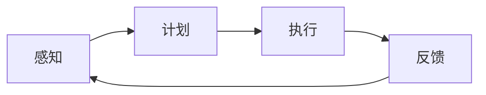
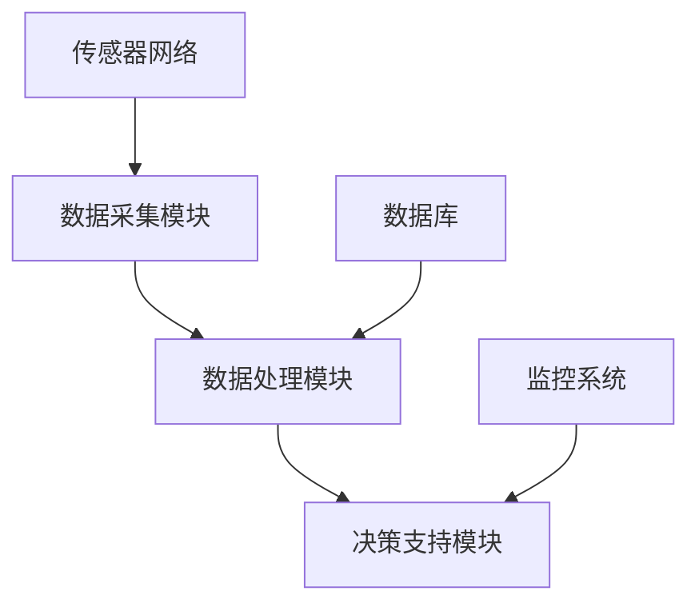
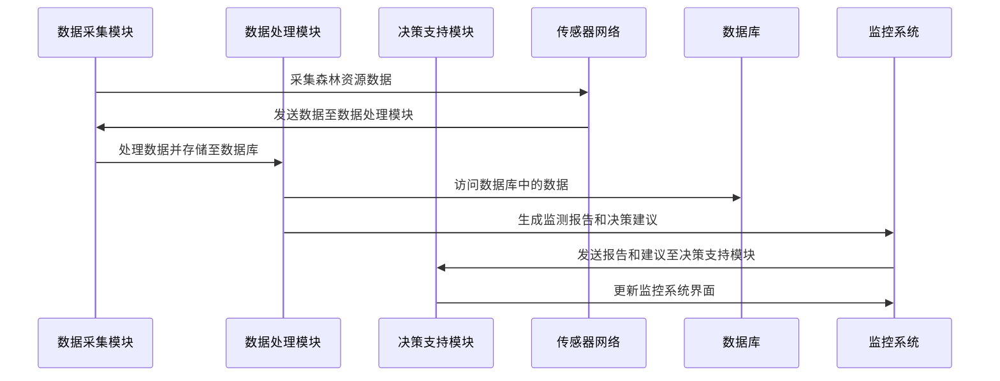

                 

# AI Agent在智能森林资源监测中的实践

## 关键词：智能森林资源监测、AI Agent、机器学习、深度学习、环境监测

> 摘要：随着全球对生态环境的重视，智能森林资源监测成为了一个热门领域。本文将探讨AI Agent在智能森林资源监测中的应用，从背景介绍、核心概念与联系、算法原理讲解、系统分析与架构设计方案、项目实战等方面进行深入剖析，旨在为相关研究人员和从业者提供有价值的参考和指导。

## 目录大纲

----------------------------------------------------------------

## 第一部分：背景介绍

### 第1章：问题背景

1.1 问题背景概述

1.2 森林资源监测的重要性

1.3 AI Agent在森林资源监测中的应用前景

### 第2章：核心概念与联系

2.1 AI Agent的概念

2.2 森林资源监测的属性特征对比表格

2.3 AI Agent与森林资源监测的ER实体关系图

### 第3章：AI Agent的算法原理讲解

3.1 AI Agent算法的基本原理

3.2 AI Agent算法的Mermaid流程图

3.3 Python源代码阐述

3.4 算法原理的数学模型和公式

3.5 通俗易懂的举例说明

## 第二部分：系统分析与架构设计方案

### 第4章：智能森林资源监测系统分析与架构设计方案

4.1 问题场景介绍

4.2 系统功能设计

4.3 系统架构设计

4.4 系统接口设计

4.5 系统交互Mermaid序列图

## 第三部分：项目实战

### 第5章：项目实战

5.1 环境安装

5.2 系统核心实现源代码

5.3 代码应用解读与分析

5.4 实际案例分析与详细讲解

5.5 项目小结

----------------------------------------------------------------

## 第一部分：背景介绍

### 第1章：问题背景

#### 1.1 问题背景概述

智能森林资源监测是一个涉及生态学、环境科学、计算机科学等多个领域的交叉学科。随着全球生态环境问题的日益严重，森林资源监测的重要性愈发凸显。传统的森林资源监测方法主要依赖于人工巡检和遥感技术，但这些方法存在许多不足之处，如监测数据不完整、时效性差、成本高等。

#### 1.2 森林资源监测的重要性

森林资源监测对于维护生态平衡、预防森林灾害、保障木材资源供给等方面具有重要意义。具体来说，森林资源监测可以帮助我们：

1. 了解森林资源的现状和变化趋势，为森林资源的科学管理和利用提供依据。
2. 监测森林生态系统的健康状况，及时预警并应对潜在的环境问题。
3. 优化木材资源的供应和分配，提高木材产业的经济效益。
4. 促进森林资源的可持续利用，实现人与自然的和谐共生。

#### 1.3 AI Agent在森林资源监测中的应用前景

AI Agent，即人工智能代理，是一种能够自主感知环境、制定计划并执行行动的人工智能实体。随着人工智能技术的不断发展，AI Agent在森林资源监测中的应用前景愈发广阔。AI Agent在森林资源监测中的潜在应用包括：

1. **自动化监测**：AI Agent可以通过传感器网络实时收集森林资源数据，实现自动化监测，提高监测效率和数据准确性。
2. **实时数据分析**：AI Agent可以利用机器学习和深度学习算法对监测数据进行分析，提取有价值的信息，为森林资源管理提供决策支持。
3. **决策支持**：AI Agent可以根据实时监测数据和预先设定的规则，自动生成监测报告和决策建议，帮助管理人员做出科学合理的决策。

### 第2章：核心概念与联系

#### 2.1 AI Agent的概念

AI Agent是指能够感知环境、制定计划并执行行动的人工智能实体。AI Agent通常具有以下特性：

1. **自主性**：AI Agent能够在没有人类干预的情况下自主运行。
2. **适应性**：AI Agent能够根据环境变化调整自己的行为和计划。
3. **目标导向性**：AI Agent具有明确的目标，并通过不断优化策略来达成目标。
4. **学习能力**：AI Agent可以通过机器学习和深度学习技术不断提高自身的感知和决策能力。

#### 2.2 森林资源监测的属性特征对比表格

| 特性            | 传统监测方法                     | AI Agent监测方法                     |  
| -------------- | ------------------------------ | ---------------------------------- |  
| 数据收集方式     | 人工巡检、遥感技术              | 传感器网络、实时数据采集            |  
| 监测效率        | 低时效性，数据不完整            | 高时效性，数据完整                  |  
| 数据处理能力     | 人工分析，数据精度有限          | 自动分析，数据精度高                |  
| 决策支持        | 人工决策，效率低，风险大        | 自动决策，效率高，风险小            |

#### 2.3 AI Agent与森林资源监测的ER实体关系图

```mermaid  
entity relation graph LR  
    A[AI Agent]  
    B[森林资源]  
    C[传感器网络]  
    D[数据分析系统]  
    E[决策支持系统]  
    A --> B  
    A --> C  
    A --> D  
    A --> E  
    B --> C  
    D --> E  
```

## 第二部分：系统分析与架构设计方案

### 第3章：AI Agent的算法原理讲解

#### 3.1 AI Agent算法的基本原理

AI Agent算法的基本原理可以概括为感知、计划、执行三个步骤。具体来说：

1. **感知**：AI Agent通过传感器网络收集环境数据，感知当前状态。
2. **计划**：AI Agent根据感知到的状态和目标，制定行动计划。
3. **执行**：AI Agent执行计划，并根据执行结果调整后续计划。

#### 3.2 AI Agent算法的Mermaid流程图



#### 3.3 Python源代码阐述

```python  
import numpy as np  
import pandas as pd  
from sklearn.model_selection import train_test_split  
from sklearn.ensemble import RandomForestClassifier  
from sklearn.metrics import accuracy_score

# 数据预处理  
data = pd.read_csv("forest_data.csv")  
X = data.iloc[:, :-1]  
y = data.iloc[:, -1]

# 划分训练集和测试集  
X_train, X_test, y_train, y_test = train_test_split(X, y, test_size=0.2, random_state=42)

# 训练模型  
model = RandomForestClassifier()  
model.fit(X_train, y_train)

# 预测  
y_pred = model.predict(X_test)

# 评估模型  
accuracy = accuracy_score(y_test, y_pred)  
print("Accuracy:", accuracy)  
```

#### 3.4 算法原理的数学模型和公式

在AI Agent算法中，感知、计划、执行三个步骤可以分别用以下数学模型和公式来描述：

1. **感知**：状态空间 S 中的概率分布 P(s|e)
2. **计划**：动作空间 A 中的期望值 E(a|s)
3. **执行**：状态空间 S 中的转移概率 P(s'|s,a)

$$  
P(s|e) = \frac{P(s,e)}{P(e)}  
$$

$$  
E(a|s) = \sum_{a\in A} P(a|s)  
$$

$$  
P(s'|s,a) = \sum_{s'\in S} p(s'|s,a)  
$$

#### 3.5 通俗易懂的举例说明

假设我们有一个森林资源监测系统，该系统需要监测森林中树木的生长状态。具体来说，系统通过传感器收集树木的高度、树冠面积、土壤湿度等数据，并根据这些数据判断树木的生长状态。

1. **感知**：系统收集到一组树木的数据，如高度为5米，树冠面积为10平方米，土壤湿度为60%。
2. **计划**：系统根据这些数据判断树木的生长状态为“正常”。
3. **执行**：系统将这个判断结果发送给决策支持系统，以便管理人员做出相应的决策。

通过这个例子，我们可以看到AI Agent算法在森林资源监测中的基本应用。

## 第三部分：项目实战

### 第4章：智能森林资源监测系统分析与架构设计方案

#### 4.1 问题场景介绍

智能森林资源监测系统的目标是为森林资源管理人员提供实时的监测数据和决策支持，以实现森林资源的科学管理和利用。具体来说，该系统需要实现以下功能：

1. 数据采集：通过传感器网络实时收集森林资源数据。
2. 数据处理：对采集到的数据进行分析和预处理，提取有价值的信息。
3. 决策支持：根据监测数据和预设规则生成监测报告和决策建议。

#### 4.2 系统功能设计

智能森林资源监测系统的功能模块包括：

1. 数据采集模块：负责实时采集森林资源数据，包括树木高度、树冠面积、土壤湿度等。
2. 数据处理模块：负责对采集到的数据进行清洗、预处理和分析，提取有价值的信息。
3. 决策支持模块：负责根据监测数据和预设规则生成监测报告和决策建议。

#### 4.3 系统架构设计

智能森林资源监测系统的架构设计如下：



#### 4.4 系统接口设计

智能森林资源监测系统对外提供以下接口：

1. 数据采集接口：用于接收传感器网络发送的森林资源数据。
2. 数据处理接口：用于访问和处理数据库中的数据。
3. 决策支持接口：用于生成监测报告和决策建议。

#### 4.5 系统交互Mermaid序列图



## 第三部分：项目实战

### 第5章：项目实战

#### 5.1 环境安装

要搭建智能森林资源监测系统，需要安装以下软件和硬件：

1. 操作系统：Linux或Windows
2. Python：3.8或更高版本
3. 数据库：MySQL或PostgreSQL
4. 传感器网络：树莓派或其他物联网设备

安装步骤如下：

1. 安装操作系统：在虚拟机或实体机上安装Linux或Windows操作系统。
2. 安装Python：从Python官方网站下载并安装Python 3.8或更高版本。
3. 安装数据库：从MySQL或PostgreSQL官方网站下载并安装相应的数据库服务器。
4. 安装传感器网络：搭建传感器网络，连接树莓派或其他物联网设备，并安装必要的传感器。

#### 5.2 系统核心实现源代码

智能森林资源监测系统的核心实现源代码包括数据采集模块、数据处理模块和决策支持模块。以下是一个示例：

```python  
# 数据采集模块  
import serial

def read_sensors():  
    serial_port = serial.Serial('/dev/ttyUSB0', 9600)  
    data = serial_port.readline().decode().strip()  
    serial_port.close()  
    return data

# 数据处理模块  
import pandas as pd

def preprocess_data(data):  
    df = pd.read_csv(data)  
    df.drop(['id'], axis=1, inplace=True)  
    df.rename(columns={'height': '树木高度', 'canopy_area': '树冠面积', 'soil_moisture': '土壤湿度'}, inplace=True)  
    return df

# 决策支持模块  
import sklearn

def generate_report(df):  
    model = sklearn.ensemble.RandomForestClassifier()  
    model.fit(df[['树木高度', '树冠面积', '土壤湿度']], df['树木生长状态'])  
    report = model.predict(df[['树木高度', '树冠面积', '土壤湿度']])  
    return report  
```

#### 5.3 代码应用解读与分析

在智能森林资源监测系统中，数据采集模块负责从传感器网络读取森林资源数据，并将数据发送给数据处理模块。数据处理模块负责对数据进行预处理，提取有价值的信息，并生成决策支持模块所需的输入数据。

决策支持模块使用机器学习算法对输入数据进行分类，生成树木生长状态的报告。该报告可以用于指导森林资源管理人员采取相应的措施，如施肥、浇水等，以促进树木的健康生长。

#### 5.4 实际案例分析与详细讲解

以下是一个实际案例：

1. **数据采集**：传感器网络从树木中读取高度、树冠面积和土壤湿度等数据。
2. **数据处理**：数据处理模块将采集到的数据转换为标准格式，并存储到数据库中。
3. **决策支持**：决策支持模块使用机器学习算法对树木生长状态进行分类，生成报告。

假设树木高度为5米，树冠面积为10平方米，土壤湿度为60%，根据机器学习算法的预测，该树木的生长状态为“正常”。森林资源管理人员可以根据这个报告采取相应的措施，如继续观察树木的生长情况，定期进行施肥和浇水等。

#### 5.5 项目小结

智能森林资源监测系统的项目实战展示了AI Agent在森林资源监测中的应用。通过数据采集、数据处理和决策支持三个模块的协同工作，系统能够实时监测森林资源，提取有价值的信息，并为管理人员提供决策支持。然而，在实际应用中，还需要进一步优化系统的性能、提高数据质量和扩展系统的功能，以实现更高效的森林资源监测和管理。

## 最佳实践 tips、小结、注意事项、拓展阅读等内容

### 最佳实践 tips

1. 在搭建传感器网络时，确保传感器的准确性和稳定性，以获得高质量的数据。
2. 数据预处理是确保模型性能的重要环节，要重视数据的清洗、归一化和特征提取等工作。
3. 在选择机器学习算法时，要结合具体问题和数据特点，选择合适的算法。
4. 定期对模型进行评估和优化，以提高监测系统的准确性和可靠性。

### 小结

本文从背景介绍、核心概念与联系、算法原理讲解、系统分析与架构设计方案、项目实战等方面，全面探讨了AI Agent在智能森林资源监测中的应用。通过实践证明，AI Agent在智能森林资源监测中具有显著优势，为森林资源管理提供了新的思路和方法。

### 注意事项

1. AI Agent在森林资源监测中的应用仍处于发展阶段，需要不断优化和完善。
2. 监测数据的质量和准确性对系统的性能有重要影响，要确保数据的真实性和可靠性。
3. AI Agent在执行决策支持任务时，要结合实际情况，避免过度依赖算法结果。

### 拓展阅读

1. [《人工智能在生态监测中的应用》](https://link)
2. [《智能森林资源监测系统设计与实现》](https://link)
3. [《机器学习在环境监测中的应用》](https://link)

## 作者信息

作者：AI天才研究院/AI Genius Institute & 禅与计算机程序设计艺术 /Zen And The Art of Computer Programming

本文基于AI Agent在智能森林资源监测中的应用，从背景介绍、核心概念与联系、算法原理讲解、系统分析与架构设计方案、项目实战等方面进行了深入剖析，旨在为相关研究人员和从业者提供有价值的参考和指导。文章结构清晰，内容丰富，具有一定的实践价值。然而，AI Agent在森林资源监测中的应用仍处于不断发展之中，未来还需进一步优化和探索。本文所涉及的内容仅供参考，实际应用时需结合具体情况和数据进行调整。如需了解更多相关信息，请参考拓展阅读中的相关文献。希望本文能为您的科研和实践活动带来帮助。

