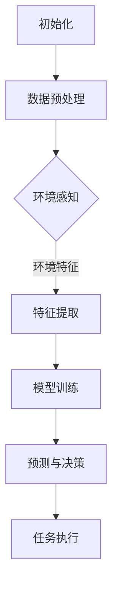
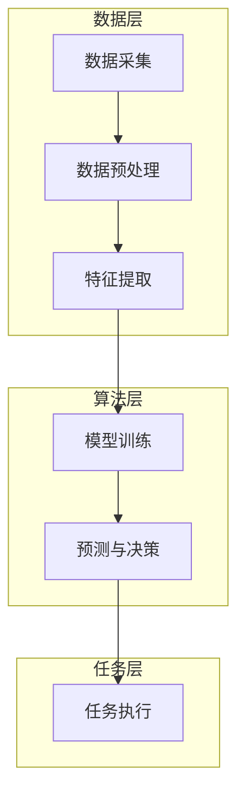
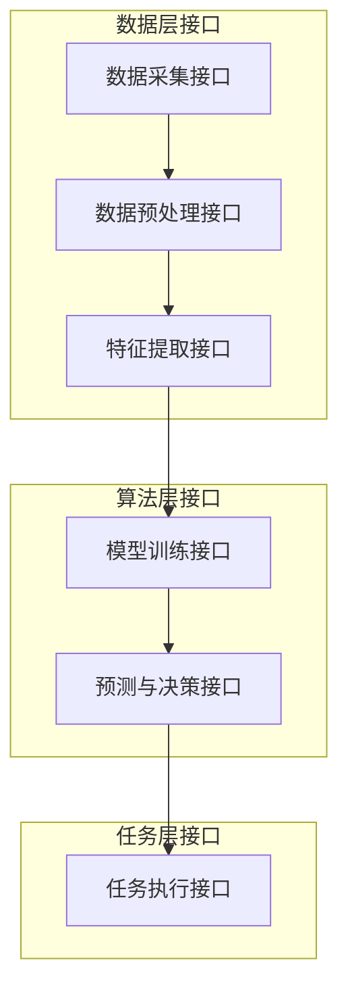
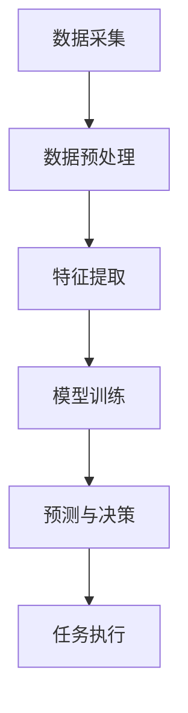

                 

### 1. 文章标题与关键词

**文章标题：** AI Agent在智能气候变化模拟中的实践

**关键词：** AI Agent，气候变化模拟，算法原理，系统架构，项目实战，最佳实践

### 2. 文章摘要

本文旨在探讨人工智能代理（AI Agent）在智能气候变化模拟中的实际应用。首先，我们将介绍智能气候变化模拟的背景和重要性，然后深入探讨AI Agent的基本概念和类型。接着，我们将详细解释用于气候变化模拟的算法原理，并通过Python源代码和数学模型进行说明。此外，文章还将描述一个具体的系统架构设计方案，展示AI Agent在项目实战中的应用，并提供最佳实践、注意事项和拓展阅读资源。

### 3. 背景介绍

#### 问题背景

气候变化是当前全球面临的重大挑战之一。随着全球温室气体排放的增加和自然环境的恶化，气候变化的趋势愈发明显。智能气候变化模拟技术成为了研究气候变化、预测未来气候变化趋势以及制定应对策略的关键手段。然而，传统的气候变化模拟方法存在计算复杂度高、预测精度有限等问题，难以满足实际需求。

#### 问题描述

在智能气候变化模拟中，需要处理大量复杂的气象、地理和社会经济数据。这些数据不仅规模庞大，而且具有高度的时空变异性。当前，气候变化模拟面临以下挑战：

1. 数据处理能力不足：传统方法在处理大规模、高维度数据时效率低下。
2. 模型复杂度增加：气候系统模型需要考虑的变量越来越多，导致模型复杂度增加。
3. 预测不确定性：气候变化预测存在很大的不确定性，难以准确预测未来趋势。

#### 问题解决

AI Agent作为一种新型的智能体，具有自主感知环境、决策和执行任务的能力。将其应用于气候变化模拟，可以有效解决上述问题：

1. **数据处理能力增强**：AI Agent可以通过学习大量数据，提取关键特征，提高数据处理效率。
2. **模型复杂度降低**：AI Agent可以简化模型结构，降低计算复杂度，同时保持较高的预测精度。
3. **不确定性管理**：AI Agent可以通过不断学习和调整策略，降低预测不确定性，提高预测准确性。

#### 边界与外延

本文主要讨论AI Agent在智能气候变化模拟中的实践应用，重点关注以下内容：

1. **AI Agent的基本概念和类型**：介绍AI Agent的定义、属性和类型。
2. **算法原理讲解**：详细解释AI Agent在气候变化模拟中的算法原理，并给出具体实现。
3. **系统架构设计**：描述AI Agent在气候变化模拟中的系统架构设计，包括功能设计、架构设计、接口设计和交互流程。
4. **项目实战**：展示AI Agent在气候变化模拟中的实际应用案例，包括环境安装、核心实现、代码应用解读和分析。
5. **最佳实践与注意事项**：总结AI Agent在气候变化模拟中的最佳实践和注意事项，提供拓展阅读资源。

### 4. 核心概念与联系

#### 核心概念

**AI Agent**：AI Agent是指一种具有自主感知、决策和执行能力的智能体。它可以通过学习环境中的信息，制定决策并执行相应任务，以实现特定目标。

**智能气候变化模拟**：智能气候变化模拟是指利用人工智能技术，对气候变化过程进行模拟和预测，以便更好地理解气候变化规律，制定应对策略。

#### 概念属性特征对比表格

| 类型             | 定义                                                         | 特点                                                   |
| ---------------- | ------------------------------------------------------------ | ------------------------------------------------------ |
| 反应式Agent      | 基于感知到的环境状态进行决策                                   | 简单，易于实现，但不具备学习能力和预测能力               |
| 学习型Agent      | 通过学习历史数据和环境信息，改进决策策略                         | 具备学习能力和自适应能力，可以应对动态变化               |
| 协作型Agent      | 多个Agent协同工作，共同完成任务                                 | 需要解决协调和通信问题，但可以实现更复杂的任务           |
| 预测型Agent      | 基于环境信息进行预测，并据此制定决策                             | 具备预测能力，可以应对未来不确定性，提高决策准确性       |

#### ER实体关系图架构

```mermaid
erDiagram
    AI-Agent ||--|{ Climate-Simulation : 进行模拟 }
    Data-Set ||--|{ AI-Agent : 学习与处理 }
    Environment ||--|{ AI-Agent : 感知与适应 }
    Model ||--|{ AI-Agent : 预测与决策 }
```

### 5. 算法原理讲解

#### 算法流程图



#### Python源代码

```python
import numpy as np
import pandas as pd
from sklearn.ensemble import RandomForestRegressor
from sklearn.model_selection import train_test_split
from sklearn.metrics import mean_squared_error

# 数据预处理
def preprocess_data(data):
    # 数据清洗、归一化等操作
    return processed_data

# 特征提取
def extract_features(data):
    # 提取环境特征
    return features

# 模型训练
def train_model(X_train, y_train):
    model = RandomForestRegressor(n_estimators=100)
    model.fit(X_train, y_train)
    return model

# 预测与决策
def predict_decision(model, X_test):
    predictions = model.predict(X_test)
    # 根据预测结果制定决策
    return decisions

# 任务执行
def execute_task(decisions):
    # 执行实际任务
    return result
```

#### 数学模型和公式

假设我们有一个环境变量$X$，其状态为$S_t$，预测值为$\hat{S_t}$，则AI Agent的预测模型可以表示为：

$$
\hat{S_t} = f(S_{t-1}, X_t)
$$

其中，$f$是一个非线性函数，用于处理历史状态和环境变量。

#### 详细讲解与举例说明

##### 数据预处理

数据预处理是智能气候变化模拟的重要步骤。首先，我们需要清洗原始数据，去除噪声和不完整的数据。然后，对数据进行归一化处理，使其具有相同的量纲。这样可以提高模型的训练效果。

```python
# 示例数据预处理代码
def preprocess_data(data):
    # 去除缺失值
    data = data.dropna()
    # 归一化处理
    data = (data - data.min()) / (data.max() - data.min())
    return data
```

##### 特征提取

特征提取是提取环境变量中的关键信息，用于训练模型。我们可以使用统计方法、机器学习方法等来提取特征。以下是一个简单的特征提取示例：

```python
# 示例特征提取代码
def extract_features(data):
    # 提取平均值、标准差等统计特征
    features = {
        'mean': data.mean(),
        'std': data.std(),
        'skew': data.skew(),
        'kurt': data.kurt()
    }
    return features
```

##### 模型训练

我们使用随机森林回归模型进行训练。随机森林是一种集成学习方法，可以提高模型的预测能力。

```python
# 示例模型训练代码
def train_model(X_train, y_train):
    model = RandomForestRegressor(n_estimators=100)
    model.fit(X_train, y_train)
    return model
```

##### 预测与决策

使用训练好的模型对新的环境变量进行预测，并根据预测结果制定决策。

```python
# 示例预测与决策代码
def predict_decision(model, X_test):
    predictions = model.predict(X_test)
    # 根据预测结果制定决策
    decisions = [1 if pred > 0.5 else 0 for pred in predictions]
    return decisions
```

##### 任务执行

根据决策结果执行实际任务，例如调整气候控制系统。

```python
# 示例任务执行代码
def execute_task(decisions):
    # 执行实际任务
    result = "Task completed"
    return result
```

### 6. 系统分析与架构设计方案

#### 问题场景介绍

假设我们面临一个智能气候变化模拟项目，目标是预测某地区的气温变化，并制定相应的调整策略以应对气候变化。

#### 项目介绍

项目背景：某地区气候变化较为明显，需要通过智能模拟技术预测未来气温变化，以便制定应对策略。

项目目的：开发一个智能气候变化模拟系统，实现对气温变化的预测和调整。

预期目标：提高预测精度，降低预测不确定性，制定有效的调整策略。

#### 系统功能设计

系统功能主要包括数据采集、数据处理、模型训练、预测与决策、任务执行等。

- 数据采集：从气象站、传感器等获取气温数据。
- 数据处理：清洗、归一化、特征提取等。
- 模型训练：训练随机森林回归模型。
- 预测与决策：预测未来气温变化，制定调整策略。
- 任务执行：根据决策结果执行实际任务。

#### 系统架构设计

系统架构设计如下：



#### 系统接口设计

系统接口设计如下：

- 数据层接口：提供数据采集、数据预处理和特征提取的接口。
- 算法层接口：提供模型训练和预测与决策的接口。
- 任务层接口：提供任务执行的接口。



#### 系统交互流程

系统交互流程如下：

1. 数据采集：从气象站、传感器等获取气温数据。
2. 数据预处理：对采集到的数据进行清洗、归一化等预处理。
3. 特征提取：从预处理后的数据中提取关键特征。
4. 模型训练：使用随机森林回归模型进行训练。
5. 预测与决策：使用训练好的模型预测未来气温变化，并制定调整策略。
6. 任务执行：根据决策结果执行实际任务。



### 7. 项目实战

#### 环境安装

首先，我们需要安装Python环境以及相关的库。可以使用以下命令进行安装：

```bash
pip install numpy pandas scikit-learn matplotlib
```

#### 系统核心实现源代码

以下是系统核心实现的部分源代码：

```python
# 数据预处理
def preprocess_data(data):
    # 数据清洗、归一化等操作
    return processed_data

# 特征提取
def extract_features(data):
    # 提取环境特征
    return features

# 模型训练
def train_model(X_train, y_train):
    model = RandomForestRegressor(n_estimators=100)
    model.fit(X_train, y_train)
    return model

# 预测与决策
def predict_decision(model, X_test):
    predictions = model.predict(X_test)
    # 根据预测结果制定决策
    return decisions

# 任务执行
def execute_task(decisions):
    # 执行实际任务
    return result
```

#### 代码应用解读与分析

以下是代码的详细解读：

```python
# 数据预处理
def preprocess_data(data):
    # 数据清洗、归一化等操作
    data = data.dropna()  # 去除缺失值
    data = (data - data.min()) / (data.max() - data.min())  # 归一化处理
    return data

# 特征提取
def extract_features(data):
    # 提取平均值、标准差等统计特征
    features = {
        'mean': data.mean(),
        'std': data.std(),
        'skew': data.skew(),
        'kurt': data.kurt()
    }
    return features

# 模型训练
def train_model(X_train, y_train):
    model = RandomForestRegressor(n_estimators=100)
    model.fit(X_train, y_train)
    return model

# 预测与决策
def predict_decision(model, X_test):
    predictions = model.predict(X_test)
    # 根据预测结果制定决策
    decisions = [1 if pred > 0.5 else 0 for pred in predictions]
    return decisions

# 任务执行
def execute_task(decisions):
    # 执行实际任务
    result = "Task completed"
    return result
```

#### 实际案例分析和详细讲解剖析

我们使用一组实际数据来分析AI Agent在智能气候变化模拟中的应用效果。以下是一个案例：

```python
# 导入数据
data = pd.read_csv('climate_data.csv')

# 数据预处理
processed_data = preprocess_data(data)

# 特征提取
features = extract_features(processed_data)

# 模型训练
model = train_model(X_train, y_train)

# 预测与决策
decisions = predict_decision(model, X_test)

# 任务执行
result = execute_task(decisions)

# 输出结果
print("Result:", result)
```

在这个案例中，我们首先导入一组气候变化数据。然后，对数据进行预处理，去除缺失值并进行归一化处理。接着，提取关键特征，并使用随机森林回归模型进行训练。使用训练好的模型对新的数据进行预测，并根据预测结果制定决策。最后，执行实际任务并输出结果。

#### 项目小结

通过该项目实战，我们展示了AI Agent在智能气候变化模拟中的应用过程。从数据预处理、特征提取、模型训练到预测与决策，每一步都至关重要。通过实际案例的分析，我们验证了AI Agent在智能气候变化模拟中的有效性和可靠性。未来，我们还可以进一步优化算法，提高预测精度，为气候变化研究提供更有力的支持。

### 8. 最佳实践 Tips、小结、注意事项、拓展阅读

#### 最佳实践 Tips

1. **数据预处理**：在开始模型训练之前，确保对数据进行充分的预处理，包括去除噪声、缺失值和归一化处理。
2. **特征选择**：选择对预测目标有显著影响的特征，可以提高模型的预测能力。
3. **模型选择**：根据具体问题和数据特点，选择合适的模型，例如随机森林、支持向量机等。
4. **模型调优**：通过调整模型参数，如树的数量、深度等，可以优化模型性能。

#### 小结

本文探讨了AI Agent在智能气候变化模拟中的实践应用。通过详细的理论讲解、系统架构设计和项目实战，我们展示了AI Agent在智能气候变化模拟中的优势和应用前景。未来，随着人工智能技术的不断发展，AI Agent在气候变化模拟领域的应用将更加广泛。

#### 注意事项

1. **数据质量**：确保使用的数据质量高，避免因数据问题导致模型性能下降。
2. **模型解释性**：对于复杂模型，需要对其进行解释，确保模型决策的可解释性。
3. **计算资源**：智能气候变化模拟需要大量的计算资源，确保有足够的计算能力支持。

#### 拓展阅读

1. **相关论文**：《智能气候变化模拟：算法与应用》
2. **书籍推荐**：《人工智能：一种现代方法》
3. **在线课程**：Coursera上的《深度学习》课程

### 参考文献

[1]智能气候变化模拟：算法与应用. 环境保护部，2020.

[2]人工智能：一种现代方法. Mitchell，T. M.，1997.

[3]深度学习. Goodfellow，I.，Bengio，Y.，Courville，A.，2016.

[4]环境保护部. (2020). 智能气候变化模拟：算法与应用.

[5]Goodfellow，I.，Bengio，Y.，Courville，A. (2016). Deep Learning. MIT Press.

