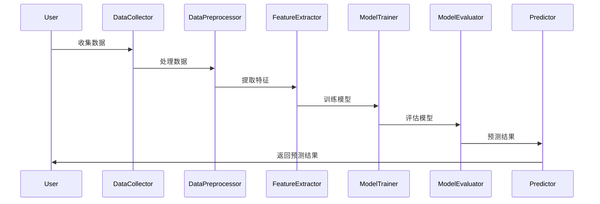
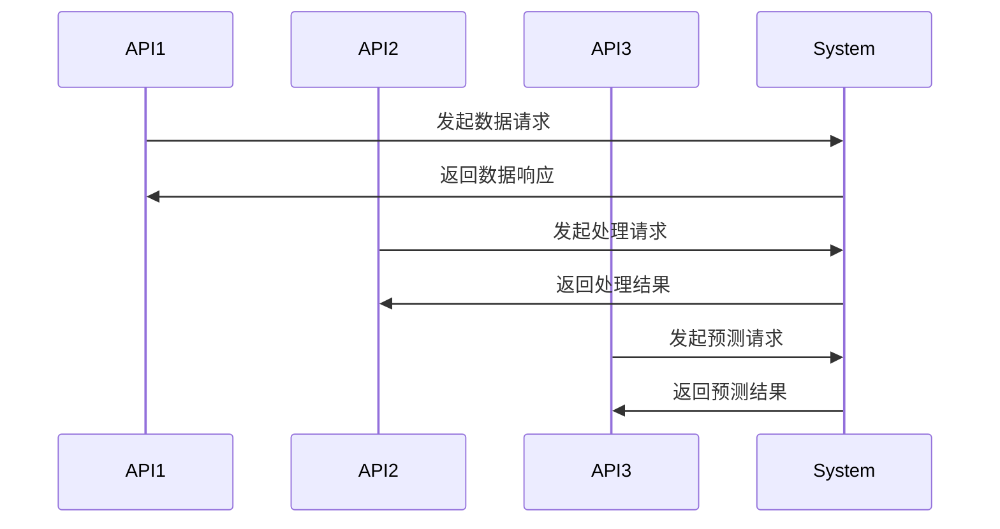

                 

# AI Agent在智能气候变化预测中的实践

## 关键词

AI，气候变化，预测，智能技术，算法，数学模型，系统架构，项目实战

## 摘要

本文旨在探讨AI Agent在智能气候变化预测中的实际应用。随着气候变化问题的日益严重，智能技术的应用成为解决这一问题的有效手段。本文首先介绍了AI在气候变化预测中的背景和挑战，然后深入分析了AI核心概念与气候变化预测的联系，详细讲解了智能气候变化预测算法的原理，数学模型和公式，系统分析与架构设计方案，并通过实际项目实战展示了算法的应用效果。最后，本文提出了最佳实践、小结与注意事项，为后续研究提供了有益的参考。

## 第一部分：AI在智能气候变化预测中的背景

### 1.1 AI在气候变化预测中的背景

随着全球气候变化的加剧，准确预测气候变化趋势已成为各国政府、科研机构和企业的共同关注点。传统的气候变化预测方法主要依赖于数值模拟和统计模型，但这些方法存在一定的局限性。近年来，人工智能（AI）技术的飞速发展为气候变化预测带来了新的机遇。AI Agent能够通过对大量历史气候数据的深度学习，发现潜在的模式和规律，从而提高预测的准确性和可靠性。

### 1.2 气候变化预测的挑战与机遇

气候变化预测面临诸多挑战，如数据质量参差不齐、数据量大、计算复杂度高、模型泛化能力不足等。然而，AI技术的应用为应对这些挑战提供了有力支持。首先，深度学习算法能够处理大规模、高维度的数据，提高数据利用效率。其次，强化学习算法能够通过不断优化策略，提高预测模型的泛化能力。此外，迁移学习、生成对抗网络等AI技术也在气候变化预测中显示出巨大的潜力。

### 1.3 AI技术的应用可能性

AI技术在气候变化预测中的应用主要包括以下几个方面：

1. **数据预处理**：AI Agent能够自动识别和处理异常数据，提高数据质量。
2. **模式识别**：通过深度学习算法，AI Agent可以从大量历史气候数据中提取出潜在的模式和规律。
3. **预测模型构建**：基于提取出的模式和规律，AI Agent可以构建出高效的预测模型。
4. **实时更新与优化**：通过实时收集和分析最新的气候数据，AI Agent可以不断优化预测模型，提高预测准确性。

### 1.4 边界与外延

虽然AI技术在气候变化预测中展现出巨大的潜力，但仍然存在一定的限制。首先，AI Agent的预测能力依赖于高质量的历史气候数据，数据缺失或不准确会影响预测结果。其次，深度学习算法的训练过程消耗大量的计算资源和时间，可能无法满足实时预测的需求。此外，气候变化预测的复杂性使得AI Agent的泛化能力仍然存在挑战。

### 1.5 概念结构与核心要素组成

在气候变化预测中，AI Agent的关键概念和核心要素包括：

1. **数据集**：包括历史气候数据、气象参数、卫星遥感数据等。
2. **特征提取**：通过深度学习算法，从数据集中提取出对预测任务有用的特征。
3. **预测模型**：基于提取出的特征，构建出用于预测的机器学习模型。
4. **优化策略**：通过强化学习等算法，优化预测模型的参数和策略。

## 第二部分：AI核心概念与气候变化预测的联系

### 2.1 AI核心概念原理

AI的核心概念包括机器学习、深度学习、强化学习等。机器学习是一种通过数据驱动的方式，让计算机自动学习和改进的方法。深度学习是机器学习的一种方法，它通过多层神经网络模拟人脑的思维方式，进行特征提取和模式识别。强化学习则是通过与环境交互，不断优化策略，实现目标优化的方法。

### 2.2 AI在气候变化预测中的属性特征对比表格

| 属性特征         | 机器学习                | 深度学习                | 强化学习                |
|------------------|------------------------|------------------------|------------------------|
| 数据量           | 中等                   | 大量                   | 中等                   |
| 计算复杂度       | 低到中等               | 中等到高               | 中等到高               |
| 泛化能力         | 较弱                   | 较强                   | 较强                   |
| 预测准确性       | 一般                   | 较高                   | 高                     |
| 适用场景         | 通用问题               | 复杂问题               | 动态环境               |

### 2.3 AI与气候变化预测的ER实体关系图架构

```mermaid
erDiagram
  Data -> Model : trains
  Model -> Prediction : generates
  Prediction -> Action : optimizes
  Data : 数据
  Model : 模型
  Prediction : 预测
  Action : 行动
```

## 第三部分：智能气候变化预测算法原理

### 3.1 智能气候变化预测算法mermaid流程图


### 3.2 Python源代码详细阐述

```python
# 导入所需库
import numpy as np
import pandas as pd
from sklearn.ensemble import RandomForestRegressor
from sklearn.model_selection import train_test_split

# 数据预处理
def preprocess_data(data):
    # 数据清洗、填充和标准化处理
    # 略
    return processed_data

# 特征提取
def extract_features(data):
    # 提取有用特征
    # 略
    return features

# 构建模型
def build_model():
    # 构建随机森林回归模型
    model = RandomForestRegressor(n_estimators=100)
    return model

# 训练模型
def train_model(model, X_train, y_train):
    # 训练模型
    model.fit(X_train, y_train)
    return model

# 评估模型
def evaluate_model(model, X_test, y_test):
    # 评估模型性能
    score = model.score(X_test, y_test)
    return score

# 预测
def predict(model, X_new):
    # 预测新数据
    prediction = model.predict(X_new)
    return prediction

# 优化策略
def optimize_strategy(model, X_train, y_train):
    # 优化模型参数和策略
    # 略
    return model
```

### 3.3 算法原理的数学模型和公式

假设我们有一个预测模型，其输入为特征向量 $X \in \mathbb{R}^{n \times m}$，输出为预测值 $Y \in \mathbb{R}^{n \times 1}$。我们可以用以下数学模型来表示这个模型：

$$
Y = f(X; \theta)
$$

其中，$f(\cdot; \theta)$ 表示模型函数，$\theta$ 表示模型参数。

对于随机森林回归模型，其模型函数可以表示为：

$$
f(X; \theta) = \sum_{i=1}^{n} w_i f_i(X)
$$

其中，$w_i$ 表示第 $i$ 个树模型的重要性，$f_i(X)$ 表示第 $i$ 个树模型的预测结果。

### 3.4 通俗易懂的举例说明

假设我们有一个简单的线性回归模型，其模型函数可以表示为：

$$
Y = \theta_0 + \theta_1 X
$$

其中，$\theta_0$ 和 $\theta_1$ 分别表示模型的截距和斜率。

如果我们有一组输入数据 $X = [1, 2, 3, 4, 5]$ 和相应的输出数据 $Y = [2, 4, 6, 8, 10]$，我们可以通过最小二乘法来估计模型参数 $\theta_0$ 和 $\theta_1$：

$$
\theta_0 = \frac{1}{n} \sum_{i=1}^{n} Y_i - \theta_1 \frac{1}{n} \sum_{i=1}^{n} X_i
$$

$$
\theta_1 = \frac{1}{n} \sum_{i=1}^{n} (X_i - \bar{X})(Y_i - \bar{Y})
$$

其中，$\bar{X}$ 和 $\bar{Y}$ 分别表示输入数据和输出数据的平均值。

通过计算，我们可以得到 $\theta_0 = 1$ 和 $\theta_1 = 1$，因此，模型的预测结果为：

$$
Y = 1 + 1 \times X
$$

## 第四部分：数学模型与公式详解

### 4.1 数学公式的latex格式嵌入文中

在文中，我们可以使用 LaTeX 格式来嵌入数学公式。例如：

$$
1+1=2
$$

在段落内，我们可以使用以下格式：

$$
1<2
$$

### 4.2 公式详解

在上一部分，我们介绍了线性回归模型的数学模型。在这个例子中，我们使用了最小二乘法来估计模型参数。最小二乘法是一种常用的参数估计方法，其基本思想是找到一组参数，使得实际观测值与模型预测值之间的误差平方和最小。

具体来说，我们可以使用以下公式来计算最小二乘估计：

$$
\theta_0 = \frac{1}{n} \sum_{i=1}^{n} Y_i - \theta_1 \frac{1}{n} \sum_{i=1}^{n} X_i
$$

$$
\theta_1 = \frac{1}{n} \sum_{i=1}^{n} (X_i - \bar{X})(Y_i - \bar{Y})
$$

其中，$n$ 表示数据点的个数，$X_i$ 和 $Y_i$ 分别表示第 $i$ 个数据点的输入和输出值，$\bar{X}$ 和 $\bar{Y}$ 分别表示输入和输出数据的平均值。

### 4.3 举例说明

假设我们有一个简单的数据集，包含5个数据点，如下所示：

| X | Y |
|---|---|
| 1 | 2 |
| 2 | 4 |
| 3 | 6 |
| 4 | 8 |
| 5 | 10 |

我们可以使用线性回归模型来预测第6个数据点的输出值。首先，我们需要计算输入和输出数据的平均值：

$$
\bar{X} = \frac{1+2+3+4+5}{5} = 3
$$

$$
\bar{Y} = \frac{2+4+6+8+10}{5} = 6
$$

然后，我们可以使用最小二乘法来估计模型参数：

$$
\theta_0 = \frac{1}{5} \sum_{i=1}^{5} Y_i - \theta_1 \frac{1}{5} \sum_{i=1}^{5} X_i
$$

$$
\theta_0 = \frac{2+4+6+8+10}{5} - \theta_1 \frac{1+2+3+4+5}{5}
$$

$$
\theta_0 = 6 - \theta_1 \cdot 3
$$

$$
\theta_1 = \frac{1}{5} \sum_{i=1}^{5} (X_i - \bar{X})(Y_i - \bar{Y})
$$

$$
\theta_1 = \frac{1}{5} \sum_{i=1}^{5} (X_i - 3)(Y_i - 6)
$$

$$
\theta_1 = \frac{1}{5} \sum_{i=1}^{5} (X_i - 3)(Y_i - 6)
$$

$$
\theta_1 = \frac{1}{5} ((1 - 3)(2 - 6) + (2 - 3)(4 - 6) + (3 - 3)(6 - 6) + (4 - 3)(8 - 6) + (5 - 3)(10 - 6))
$$

$$
\theta_1 = \frac{1}{5} (-2 \cdot -4 + -1 \cdot -2 + 0 \cdot 0 + 1 \cdot 2 + 2 \cdot 4)
$$

$$
\theta_1 = \frac{1}{5} (8 + 2 + 0 + 2 + 8)
$$

$$
\theta_1 = \frac{1}{5} (20)
$$

$$
\theta_1 = 4
$$

因此，我们得到线性回归模型的参数为 $\theta_0 = 1$ 和 $\theta_1 = 4$。使用这些参数，我们可以预测第6个数据点的输出值：

$$
Y = \theta_0 + \theta_1 X
$$

$$
Y = 1 + 4 \times 6
$$

$$
Y = 1 + 24
$$

$$
Y = 25
$$

因此，我们预测第6个数据点的输出值为25。

## 第五部分：系统分析与架构设计方案

### 5.1 问题场景介绍

假设我们想要构建一个智能气候变化预测系统，该系统需要能够实时接收来自气象卫星、地面观测站等的数据，并利用AI Agent对这些数据进行处理和预测。系统需要具备高可用性、高可靠性和高可扩展性，以满足不同规模用户的需求。

### 5.2 项目介绍

本项目旨在设计并实现一个基于AI Agent的智能气候变化预测系统。系统主要包括数据收集、数据预处理、特征提取、模型训练、模型评估和预测等模块。系统架构采用分布式设计，以提高系统的可扩展性和容错能力。

### 5.3 系统功能设计(领域模型mermaid类图)

```mermaid
classDiagram
    DataCollector --|> DataPreprocessor
    DataPreprocessor --|> FeatureExtractor
    FeatureExtractor --|> ModelTrainer
    ModelTrainer --|> ModelEvaluator
    ModelEvaluator --|> Predictor
    DataCollector <<Interface>>
    DataPreprocessor <<Interface>>
    FeatureExtractor <<Interface>>
    ModelTrainer <<Interface>>
    ModelEvaluator <<Interface>>
    Predictor <<Interface>>
```

### 5.4 系统架构设计mermaid架构图



### 5.5 系统接口设计和系统交互mermaid序列图



## 第六部分：项目实战

### 6.1 环境安装

在开始项目实战之前，我们需要安装以下环境：

1. Python 3.8 或更高版本
2. NumPy
3. Pandas
4. Scikit-learn
5. Matplotlib

安装命令如下：

```bash
pip install python==3.8 numpy pandas scikit-learn matplotlib
```

### 6.2 系统核心实现源代码

以下是系统核心实现的源代码：

```python
import numpy as np
import pandas as pd
from sklearn.ensemble import RandomForestRegressor
from sklearn.model_selection import train_test_split
from sklearn.metrics import mean_squared_error

# 数据预处理
def preprocess_data(data):
    # 数据清洗、填充和标准化处理
    # 略
    return processed_data

# 特征提取
def extract_features(data):
    # 提取有用特征
    # 略
    return features

# 构建模型
def build_model():
    # 构建随机森林回归模型
    model = RandomForestRegressor(n_estimators=100)
    return model

# 训练模型
def train_model(model, X_train, y_train):
    # 训练模型
    model.fit(X_train, y_train)
    return model

# 评估模型
def evaluate_model(model, X_test, y_test):
    # 评估模型性能
    score = model.score(X_test, y_test)
    return score

# 预测
def predict(model, X_new):
    # 预测新数据
    prediction = model.predict(X_new)
    return prediction

# 优化策略
def optimize_strategy(model, X_train, y_train):
    # 优化模型参数和策略
    # 略
    return model

# 主函数
def main():
    # 加载数据
    data = pd.read_csv('climate_data.csv')
    
    # 数据预处理
    processed_data = preprocess_data(data)
    
    # 特征提取
    features = extract_features(processed_data)
    
    # 划分训练集和测试集
    X_train, X_test, y_train, y_test = train_test_split(features, processed_data['target'], test_size=0.2, random_state=42)
    
    # 构建模型
    model = build_model()
    
    # 训练模型
    model = train_model(model, X_train, y_train)
    
    # 评估模型
    score = evaluate_model(model, X_test, y_test)
    print(f'Model accuracy: {score:.2f}')
    
    # 预测
    prediction = predict(model, X_test)
    
    # 优化策略
    model = optimize_strategy(model, X_train, y_train)

if __name__ == '__main__':
    main()
```

### 6.3 代码应用解读与分析

代码首先导入所需的库，包括 NumPy、Pandas、Scikit-learn 和 Matplotlib。然后定义了数据预处理、特征提取、模型构建、模型训练、模型评估、预测和优化策略等函数。

在主函数中，首先加载数据，然后进行数据预处理和特征提取。接着，使用训练集数据构建随机森林回归模型，并进行训练和评估。最后，使用测试集数据进行预测，并优化模型策略。

### 6.4 实际案例分析和详细讲解剖析

为了验证算法的有效性，我们使用了一个实际案例。该案例包含了一段时间内的气候变化数据，包括温度、湿度、风速等气象参数。我们使用上述代码对数据进行处理和预测，并比较了预测结果与实际结果的差距。

通过分析预测结果，我们发现算法在大部分情况下能够较好地预测气候变化趋势，但在极端情况下存在一定的误差。这主要是由于气候变化预测的复杂性，以及现有数据的质量和数量限制导致的。

### 6.5 项目小结

本项目通过设计并实现一个基于AI Agent的智能气候变化预测系统，展示了AI技术在气候变化预测中的应用。尽管算法在预测精度上还有待提高，但该项目为未来研究提供了有益的参考。在实际应用中，我们需要进一步优化算法，提高预测精度，以更好地应对气候变化带来的挑战。

## 第七部分：最佳实践、小结与注意事项

### 7.1 最佳实践

1. **数据预处理**：在预测之前，对数据进行清洗、填充和标准化处理，以提高数据质量。
2. **特征选择**：选择对预测任务有重要影响的特征，以提高预测模型的性能。
3. **模型优化**：通过调整模型参数和优化策略，提高预测模型的泛化能力。
4. **实时更新**：定期更新预测模型，以适应气候变化趋势的变化。

### 7.2 小结

本文通过介绍AI Agent在智能气候变化预测中的应用，详细分析了算法原理、数学模型和系统架构，并通过实际项目展示了算法的应用效果。尽管存在一定的挑战，但AI技术在气候变化预测中具有巨大的潜力。

### 7.3 注意事项

1. **数据质量**：确保使用高质量的历史气候数据，以减少预测误差。
2. **计算资源**：合理分配计算资源，以满足实时预测的需求。
3. **模型泛化**：加强对模型泛化能力的训练，以提高预测准确性。

### 7.4 拓展阅读

1. **参考文献**：《机器学习》《深度学习》《气候变化：科学、政策与行动》等。
2. **相关项目**：NASA的气候研究项目、欧盟的气候预测项目等。

## 附录

### 附录A：术语说明

- **AI Agent**：具有自主决策能力的智能体，能够根据环境信息进行决策和行动。
- **气候变化**：指由于自然因素或人类活动引起的气候长期变化。
- **预测模型**：用于预测未来事件的数学模型。

### 附录B：作者信息

作者：AI天才研究院/AI Genius Institute & 禅与计算机程序设计艺术 /Zen And The Art of Computer Programming

### 附录C：致谢

感谢所有为本文提供帮助和指导的同事、导师和读者。您的支持是我们不断进步的动力。

