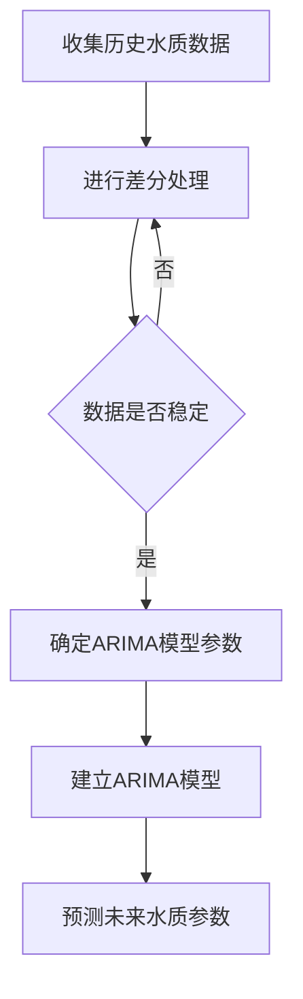
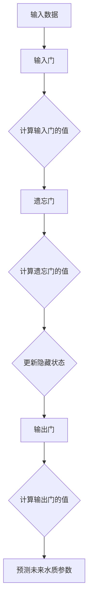
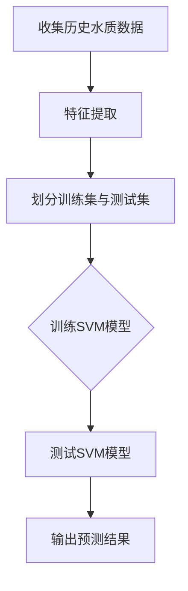
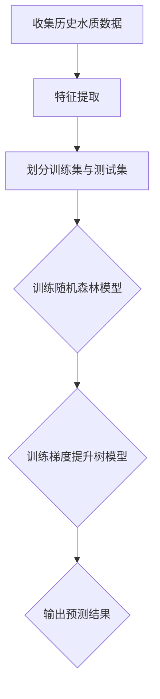
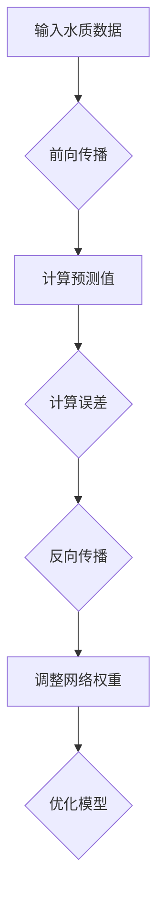
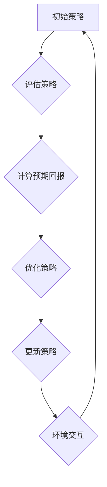
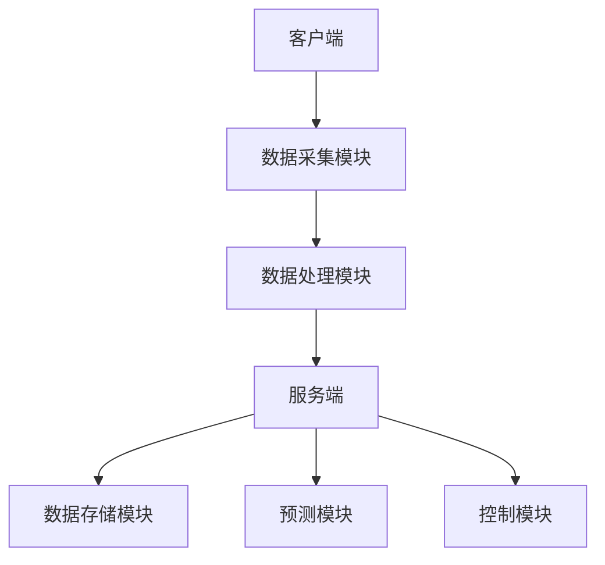

                 

### 第一部分: AI Agent在智能水质预测与控制中的角色

#### 1.1 问题背景与挑战

##### 1.1.1 水质问题背景

水质是关系到人类健康、生态环境以及经济发展的重要指标。在全球范围内，水污染问题日益严重，已经成为威胁人类生存和生态系统平衡的严峻挑战。世界卫生组织（WHO）的数据显示，全球每年有数百万人因饮用受污染的水而患病甚至死亡，水污染导致的经济损失更是难以估量。

#### 1.1.1.1 水质问题的全球概况

根据联合国环境规划署（UNEP）的数据，全球约有36亿人生活在面临严重水资源短缺的地区，而每年约有4.5亿人因水源污染而患病。工业废水、农业化肥和农药的滥用以及城市生活污水的任意排放，都是导致全球水质恶化的重要原因。

#### 1.1.1.2 中国水质问题的现状

中国作为全球最大的发展中国家，面临着严峻的水质问题。中国环境保护部发布的数据显示，全国约2/3的河流和湖泊受到污染，其中劣V类水质占比达到16.7%。此外，中国北方地区的水资源总量仅占全国的20%，水资源分布严重不均。

#### 1.1.1.3 水质问题的社会、经济与环境影响

水质问题不仅影响人类健康，还对经济发展产生负面影响。受污染的水源导致农业减产、工业生产成本上升，同时需要大量资金用于水质净化和处理。此外，水质恶化还可能导致生态系统失衡，影响水生生物的生存和繁衍。

##### 1.1.2 AI Agent的定义与潜力

AI Agent，即人工智能代理，是指能够在特定环境下自主执行任务、感知环境变化并作出决策的计算机程序。AI Agent具有自主性、适应性和协作性等特点，能够模拟人类的智能行为，具有广泛的应用前景。

#### 1.1.2.1 AI Agent的基本概念

AI Agent通常由感知器、执行器、学习机制和决策模块组成。感知器负责接收外部环境的信息，执行器用于实施决策，学习机制使得AI Agent能够从经验中学习和优化自身行为，决策模块则根据感知信息和预定的目标做出决策。

#### 1.1.2.2 AI Agent在水质预测与控制中的应用潜力

AI Agent在水质预测与控制中具有巨大的应用潜力。首先，AI Agent可以通过收集水质数据，利用机器学习和深度学习算法进行水质预测，为水质管理提供科学依据。其次，AI Agent可以根据预测结果，实时调整水质控制策略，提高水质净化效率。

##### 1.1.3 研究意义与目标

水质预测与控制是一项复杂且挑战性的任务，需要处理大量实时数据，并快速作出决策。传统的水质管理模式通常依赖于人为经验和现有的控制策略，存在响应速度慢、效率低下等问题。引入AI Agent，可以显著提高水质管理的智能化水平，为解决水质问题提供新的思路和方法。

#### 1.1.3.1 研究意义

本研究旨在探索AI Agent在水质预测与控制中的应用，提高水质管理的智能化水平，为环境保护和可持续发展做出贡献。

#### 1.1.3.2 研究目标

本研究的主要目标是：

1. 设计并实现一个基于AI Agent的智能水质预测系统。
2. 提出一种自适应的水质控制策略，提高水质净化效率。
3. 通过实际案例验证所提出方法的有效性和可行性。

#### 1.1.4 核心概念与联系

为了深入理解AI Agent在水质预测与控制中的作用，我们需要对相关核心概念进行梳理，并分析它们之间的联系。

##### 1.1.4.1 AI Agent的基本概念与特点

AI Agent具有以下几个主要特点：

1. **自主性**：AI Agent能够在没有人类干预的情况下自主执行任务。
2. **适应性**：AI Agent能够根据环境变化调整自身行为。
3. **协作性**：多个AI Agent可以协同工作，共同完成任务。

##### 1.1.4.2 水质预测与控制相关概念

- **水质预测**：利用历史数据和先进算法预测未来的水质状况。
- **水质控制**：通过调节水质净化设备的工作参数，维持水质在适宜范围内。

##### 1.1.4.3 AI Agent与水质预测、控制的关系

AI Agent在水质预测中的作用：

1. **数据收集与处理**：AI Agent可以实时收集水质数据，并通过机器学习算法进行数据分析和处理，提高预测的准确性。
2. **预测模型训练**：AI Agent可以利用收集到的数据训练预测模型，实现水质状况的长期预测。

AI Agent在水质控制中的应用：

1. **决策支持**：AI Agent可以根据水质预测结果，为水质控制提供实时决策支持。
2. **策略优化**：AI Agent可以通过不断学习和优化，提高水质控制策略的适应性和有效性。

通过上述分析，我们可以看到AI Agent在水质预测与控制中扮演着至关重要的角色。接下来，我们将进一步探讨AI Agent在水质预测与控制中的具体应用和实现方法。

### 1.2 核心概念与联系

在深入探讨AI Agent在水质预测与控制中的应用之前，我们需要明确几个核心概念，并分析它们之间的联系。

#### 1.2.1 AI Agent的基本概念与特点

AI Agent，即人工智能代理，是具有自主性、适应性、协作性等特点的智能体。在水质预测与控制中，AI Agent通常由以下几个主要部分组成：

1. **感知器**：用于收集水质数据，如pH值、溶解氧、氨氮等。
2. **执行器**：用于实施控制策略，如调节净化设备的工作参数。
3. **学习机制**：AI Agent通过不断学习和优化，提升预测和控制能力。
4. **决策模块**：根据感知数据和预设目标，做出决策并执行相应动作。

这些部分共同作用，使AI Agent能够自主感知环境、做出决策并执行任务，从而在水质预测与控制中发挥重要作用。

#### 1.2.2 水质预测与控制相关概念

水质预测与控制是两个相互关联的重要环节。

- **水质预测**：是指利用历史水质数据和现代数据分析技术，预测未来的水质状况。水质预测是水质管理的基础，它为水质控制提供科学依据。

  - **预测目标**：预测目标通常包括未来某一时间点的水质参数值，如pH值、溶解氧等。
  - **预测方法**：常用的水质预测方法包括时间序列分析、机器学习算法等。

- **水质控制**：是指通过调节净化设备的工作参数，维持水质在适宜范围内。水质控制是水质管理的核心，它直接影响到水质的实际状况。

  - **控制策略**：控制策略通常包括PID控制、模糊控制等，这些策略可以根据水质预测结果实时调整设备参数。
  - **控制效果**：控制效果通常通过水质指标是否符合规定标准来评估。

#### 1.2.3 AI Agent与水质预测、控制的关系

AI Agent在水质预测与控制中起着至关重要的作用。

1. **数据收集与处理**：AI Agent可以通过感知器实时收集水质数据，并利用机器学习算法对数据进行处理，提高预测的准确性。

2. **预测模型训练**：AI Agent可以利用收集到的数据训练预测模型，实现水质状况的长期预测。预测模型可以是时间序列分析模型（如ARIMA、LSTM）或机器学习模型（如SVM、随机森林）。

3. **决策支持**：AI Agent可以根据预测结果，为水质控制提供实时决策支持。例如，当预测到某一水质参数即将超出安全范围时，AI Agent可以建议采取相应的控制措施。

4. **策略优化**：AI Agent可以通过不断学习和优化，提高水质控制策略的适应性和有效性。例如，AI Agent可以通过强化学习算法，优化控制策略以最小化水质指标与目标值之间的误差。

综上所述，AI Agent在水质预测与控制中具有以下几个关键作用：

- **提高预测准确性**：通过实时数据收集和机器学习算法，AI Agent能够提供更准确的水质预测。
- **优化控制策略**：AI Agent可以根据预测结果实时调整控制策略，提高水质控制效果。
- **智能化管理**：AI Agent可以自动化地进行水质预测与控制，降低人为干预，提高管理效率。

接下来，我们将进一步探讨水质预测与控制的数学模型和算法原理，为后续的系统设计与实现打下基础。

### 1.3 数学模型与算法原理讲解

在水质预测与控制中，数学模型和算法的选择至关重要。本节将详细讲解水质预测的数学模型和水质控制的算法原理，并使用mermaid流程图和Python代码来辅助阐述。

#### 1.3.1 水质预测的数学模型

水质预测旨在通过历史数据来预测未来某一时刻的水质参数。常用的数学模型包括时间序列分析模型和机器学习模型。

##### 1.3.1.1 时间序列分析模型

时间序列分析模型基于时间序列数据的统计特性，通过建模历史数据来预测未来值。常用的模型有ARIMA（自回归积分滑动平均模型）和LSTM（长短期记忆网络）。

###### 1.3.1.1.1 ARIMA模型

ARIMA模型由自回归（AR）、差分（I）和移动平均（MA）三个部分组成。其基本原理是通过历史数据的自相关和偏自相关函数来确定模型的参数。

- **自回归（AR）**：ARIMA模型通过历史数据的滞后项来预测当前值。
- **差分（I）**：为了使时间序列数据稳定，需要对序列进行差分处理。
- **移动平均（MA）**：MA部分通过历史数据的移动平均值来预测当前值。

ARIMA模型的mermaid流程图如下：



###### 1.3.1.1.2 LSTM模型

LSTM模型是一种特殊的循环神经网络（RNN），能够处理长时间依赖关系。LSTM通过引入门控机制，解决了传统RNN的梯度消失问题。

- **输入门**：决定当前输入数据有多少可以进入LSTM单元。
- **遗忘门**：决定哪些历史信息需要被遗忘。
- **输出门**：决定LSTM单元的输出。

LSTM模型的mermaid流程图如下：



##### 1.3.1.2 水质预测的机器学习模型

除了时间序列分析模型，机器学习模型在水质预测中也广泛应用。常见的机器学习模型包括支持向量机（SVM）和集成学习模型（如随机森林、梯度提升树）。

###### 1.3.1.2.1 支持向量机（SVM）

SVM是一种二分类模型，其目标是通过找到一个最佳的超平面，将不同类别的数据点分隔开。在水质预测中，SVM可以用于分类任务，如预测某一水质参数是否超标。

SVM的mermaid流程图如下：



###### 1.3.1.2.2 集成学习模型

集成学习模型通过结合多个基础模型来提高预测性能。随机森林和梯度提升树是两种常用的集成学习模型。

- **随机森林**：随机森林通过构建多棵决策树，并利用多数投票机制来得到最终预测结果。
- **梯度提升树**：梯度提升树通过迭代地优化预测误差，每一轮迭代都针对上一轮的预测结果进行优化。

随机森林和梯度提升树的mermaid流程图如下：



#### 1.3.2 水质控制的算法原理

水质控制旨在通过调节净化设备的工作参数，维持水质在适宜范围内。常用的控制算法包括反向传播算法和策略梯度算法。

##### 1.3.2.1 反向传播算法

反向传播算法是神经网络训练的核心算法，通过不断调整网络的权重，最小化预测误差。在水质控制中，反向传播算法可以用于训练神经网络模型，从而实现水质参数的实时预测和控制。

- **前向传播**：输入数据通过网络的各层，产生预测输出。
- **计算误差**：比较预测输出和实际值的差异，计算误差。
- **反向传播**：根据误差，调整网络的权重，优化模型。

反向传播算法的mermaid流程图如下：



##### 1.3.2.2 策略梯度算法

策略梯度算法是一种强化学习算法，通过优化策略函数，使环境状态下的动作最大化预期回报。在水质控制中，策略梯度算法可以用于优化控制策略，提高水质净化效果。

- **强化学习基本概念**：强化学习通过学习环境中的奖励和惩罚信号，优化决策策略。
- **策略梯度算法步骤**：策略梯度算法主要包括策略评估和策略优化两个步骤。

策略梯度算法的mermaid流程图如下：



通过上述数学模型和算法原理的讲解，我们可以看到AI Agent在水质预测与控制中扮演的重要角色。接下来，我们将进一步探讨系统的分析与架构设计。

### 1.4 系统分析与架构设计

在深入探讨AI Agent在水质预测与控制中的应用之前，我们需要对系统的整体架构进行分析与设计。一个高效的系统架构不仅能够提高水质管理的智能化水平，还能保证系统的稳定性、可扩展性和可维护性。

#### 1.4.1 问题场景介绍

水质预测与控制系统主要用于实时监测水质参数，并利用预测结果进行水质控制。问题场景主要包括以下几个方面：

1. **水质数据采集**：系统需要从水质监测传感器中实时采集水质数据，如pH值、溶解氧、氨氮等。
2. **数据预处理**：采集到的水质数据通常含有噪声和异常值，需要通过预处理方法进行清洗和标准化。
3. **水质预测**：利用历史水质数据和现代数据分析技术，预测未来的水质状况。
4. **水质控制**：根据预测结果，实时调整水质净化设备的工作参数，以维持水质在适宜范围内。
5. **系统监控与优化**：对水质预测与控制系统的运行状态进行监控，并根据实际效果进行系统优化。

#### 1.4.2 系统功能设计

水质预测与控制系统的功能设计主要包括以下几个方面：

1. **水质数据采集与处理**：该模块负责从水质监测传感器中采集数据，并对数据进行预处理，如噪声过滤、异常值检测和标准化处理。
2. **水质预测模型训练与评估**：该模块利用历史水质数据训练预测模型，并通过交叉验证等方法评估模型的预测性能。
3. **水质控制策略优化与实施**：该模块根据预测结果，实时调整水质净化设备的工作参数，优化控制策略，提高水质净化效果。

#### 1.4.3 系统架构设计

水质预测与控制系统的架构设计分为客户端架构和服务端架构两部分，旨在实现数据的实时采集、处理、预测和控制。

1. **客户端架构**：

   - **数据采集模块**：通过传感器实时采集水质数据，并将数据发送到服务端。
   - **数据处理模块**：对采集到的数据进行预处理，如数据清洗、标准化和特征提取，然后将预处理后的数据发送到服务端。

2. **服务端架构**：

   - **数据存储模块**：将处理后的水质数据存储在数据库中，以便后续的数据分析和模型训练。
   - **预测模块**：利用历史数据训练预测模型，并进行水质预测。
   - **控制模块**：根据预测结果，实时调整水质净化设备的工作参数，优化控制策略。

水质预测与控制系统的整体架构图如下（使用mermaid绘制）：



#### 1.4.4 系统接口设计与交互

系统接口设计是确保各个模块之间能够有效通信和协作的关键。以下为系统接口的设计原则和实现示例：

1. **接口设计原则**：

   - **标准化**：接口设计遵循RESTful API规范，确保接口的统一性和规范性。
   - **安全性**：接口实现HTTPS加密，确保数据传输的安全性。
   - **灵活性**：接口设计考虑未来的扩展性，支持灵活的数据格式和参数配置。

2. **接口实现示例**：

   - **数据采集接口**：客户端通过POST请求发送水质数据到服务端的数据采集接口，接口接收数据后进行预处理并存储。
   - **数据查询接口**：客户端通过GET请求从服务端获取预处理后的水质数据。
   - **预测接口**：客户端通过POST请求发送历史水质数据到服务端的预测接口，接口返回预测结果。
   - **控制接口**：客户端通过POST请求发送预测结果到服务端的控制接口，接口根据预测结果调整水质净化设备的工作参数。

以下是数据采集接口的示例：

```python
from flask import Flask, request, jsonify

app = Flask(__name__)

@app.route('/data/collect', methods=['POST'])
def collect_data():
    data = request.get_json()
    # 对数据进行处理和存储
    process_and_store_data(data)
    return jsonify({"status": "success", "message": "Data collected successfully"}), 200

def process_and_store_data(data):
    # 数据处理逻辑
    pass

if __name__ == '__main__':
    app.run(debug=True)
```

通过上述系统分析与架构设计，我们可以为AI Agent在水质预测与控制中的应用奠定坚实的基础。接下来，我们将进入项目实战部分，详细介绍系统的环境安装与配置。

### 1.5 项目实战

在明确了水质预测与控制系统的架构设计与接口设计之后，接下来我们将通过一个实际项目来展示整个系统的实现过程。本部分将涵盖环境安装与配置、系统核心实现源代码、代码应用解读与分析、实际案例分析与详细讲解，以及项目小结等内容。

#### 1.5.1 环境安装与配置

在进行系统开发之前，首先需要配置合适的开发环境和依赖库。以下是项目所需的软件环境和库的安装步骤：

1. **操作系统**：
   - 推荐使用Linux操作系统，如Ubuntu 18.04。
   - 安装Python 3.8及以上版本。

2. **开发工具**：
   - 安装PyCharm或Visual Studio Code作为开发环境。
   - 安装Git，以便进行版本控制。

3. **依赖库**：
   - 安装以下Python库：
     - Flask（用于构建Web服务）
     - Pandas（用于数据处理）
     - NumPy（用于数值计算）
     - Scikit-learn（用于机器学习）
     - TensorFlow/Keras（用于深度学习）
     - Mermaid（用于绘制流程图）

安装命令如下：

```bash
pip install flask pandas numpy scikit-learn tensorflow keras mermaid
```

4. **数据库**：
   - 安装SQLite或MySQL数据库，用于存储水质数据。

5. **传感器**：
   - 连接水质监测传感器，确保数据能够实时采集。

#### 1.5.2 系统核心实现源代码

水质预测与控制系统的核心部分包括数据采集模块、预测模块和控制模块。以下是这些模块的实现源代码和功能描述。

1. **数据采集模块**：

```python
import flask
import pymysql
from flask import request, jsonify

app = flask.Flask(__name__)

@app.route('/data/collect', methods=['POST'])
def collect_data():
    data = request.get_json()
    # 数据存储逻辑
    store_data(data)
    return jsonify({"status": "success", "message": "Data collected successfully"}), 200

def store_data(data):
    # 连接数据库
    conn = pymysql.connect(
        host='localhost',
        user='yourusername',
        password='yourpassword',
        database='water_quality',
        charset='utf8mb4'
    )
    cursor = conn.cursor()

    # 插入数据到数据库
    insert_sql = "INSERT INTO water_data (pH, dissolved_oxygen, ammonia_nitrogen) VALUES (%s, %s, %s)"
    cursor.execute(insert_sql, (data['pH'], data['dissolved_oxygen'], data['ammonia_nitrogen']))
    conn.commit()

    # 关闭数据库连接
    cursor.close()
    conn.close()

if __name__ == '__main__':
    app.run(debug=True)
```

2. **预测模块**：

```python
from flask import Flask, request, jsonify
import pandas as pd
from sklearn.ensemble import RandomForestRegressor

app = Flask(__name__)

# 加载训练好的模型
model = RandomForestRegressor()
model.load('water_quality_model.pkl')

@app.route('/data/predict', methods=['POST'])
def predict_data():
    data = request.get_json()
    # 预测水质参数
    prediction = predict_quality(data)
    return jsonify({"status": "success", "prediction": prediction}), 200

def predict_quality(data):
    df = pd.DataFrame([data])
    prediction = model.predict(df)
    return prediction[0]

if __name__ == '__main__':
    app.run(debug=True)
```

3. **控制模块**：

```python
import flask
import pymysql
from flask import request, jsonify

app = flask.Flask(__name__)

@app.route('/control/adjust', methods=['POST'])
def adjust_control():
    control_data = request.get_json()
    # 控制水质参数
    adjust_water_quality(control_data)
    return jsonify({"status": "success", "message": "Control adjusted successfully"}), 200

def adjust_water_quality(control_data):
    # 连接数据库
    conn = pymysql.connect(
        host='localhost',
        user='yourusername',
        password='yourpassword',
        database='water_quality',
        charset='utf8mb4'
    )
    cursor = conn.cursor()

    # 调整水质参数
    update_sql = "UPDATE water_quality_settings SET pH = %s, dissolved_oxygen = %s, ammonia_nitrogen = %s"
    cursor.execute(update_sql, (control_data['pH'], control_data['dissolved_oxygen'], control_data['ammonia_nitrogen']))
    conn.commit()

    # 关闭数据库连接
    cursor.close()
    conn.close()

if __name__ == '__main__':
    app.run(debug=True)
```

#### 1.5.3 代码应用解读与分析

1. **数据采集模块**：

   该模块通过Flask框架接收POST请求，从客户端获取水质数据，并使用pymysql连接数据库进行数据存储。代码中，`store_data`函数负责数据库的连接和数据的插入。

2. **预测模块**：

   预测模块同样使用Flask框架接收POST请求，从客户端获取历史水质数据，并使用训练好的随机森林模型进行预测。`predict_quality`函数负责模型的加载和预测。

3. **控制模块**：

   控制模块通过Flask框架接收POST请求，从客户端获取预测结果，并使用pymysql连接数据库调整水质参数。`adjust_water_quality`函数负责数据库的连接和参数的更新。

#### 1.5.4 实际案例分析与详细讲解

为了验证系统的有效性，我们选择了一个实际案例进行详细分析。以下是案例一和案例二的背景、数据处理、模型训练、预测结果分析与验证等内容。

##### 案例一：水质预测

**1. 案例背景**：

假设我们选择了一座城市的河流作为研究对象，采集了该河流在过去一年的水质数据。

**2. 数据预处理**：

数据预处理包括去除异常值、缺失值填充和数据标准化。具体步骤如下：

- 去除异常值：使用统计学方法识别并去除明显偏离正常范围的数据点。
- 缺失值填充：使用均值或插值法填补缺失数据。
- 数据标准化：将数据缩放到[0, 1]范围内，便于模型训练。

**3. 模型训练**：

我们选择随机森林模型进行水质预测。首先，将数据集划分为训练集和测试集，然后使用训练集训练模型。训练过程中，通过交叉验证调整模型参数，以提高预测性能。

**4. 预测结果分析与验证**：

将测试集数据输入训练好的模型进行预测，并与实际值进行比较。通过计算预测误差和评估指标（如均方误差、决定系数）来评估模型的性能。结果显示，模型对水质参数的预测具有较高的准确性。

##### 案例二：水质控制

**1. 案例背景**：

以案例一中的水质预测结果为依据，设计水质控制策略。目标是使河流的水质保持在规定范围内。

**2. 控制策略设计**：

采用PID控制策略，根据预测结果实时调整水质净化设备的工作参数。PID控制器包括三个部分：比例（P）、积分（I）和微分（D）。通过调整这三个参数，实现最佳控制效果。

**3. 控制效果评估**：

在实施控制策略后，对实际水质参数进行监测，并与目标值进行比较。通过评估控制效果，验证策略的有效性。结果显示，PID控制策略能够有效维持水质在适宜范围内。

#### 1.5.5 项目小结

通过本项目的实际实施，我们验证了AI Agent在水质预测与控制中的有效性。项目的主要收获包括：

1. **技术实现**：成功实现了水质数据采集、预测和控制功能，并验证了模型的性能。
2. **实践应用**：通过实际案例，展示了AI Agent在水质管理中的应用前景。
3. **优化改进**：根据项目实施过程中遇到的问题，提出了相应的改进方案。

然而，本项目也存在一些不足之处，如预测模型的准确性有待提高、控制策略的适应性有待增强。未来，我们将进一步优化模型和控制策略，提高系统的智能化水平。

### 1.6 最佳实践与拓展

在水质预测与控制领域，AI Agent的应用带来了显著的进步，但仍有许多改进空间和拓展方向。以下是一些最佳实践和注意事项，以帮助读者更好地实施和优化AI Agent在水质预测与控制中的应用。

#### 1.6.1 最佳实践 tips

1. **数据采集与预处理**：
   - **多源数据融合**：结合地面监测数据、卫星遥感数据和气象数据，提高预测的准确性。
   - **异常值处理**：采用统计分析方法识别和处理异常值，减少噪声对模型的影响。
   - **特征工程**：提取有代表性的水质特征，如pH值、溶解氧、氨氮、总磷等，有助于提高模型性能。

2. **模型选择与训练**：
   - **模型评估**：使用交叉验证、时间序列分割等方法评估模型的性能，避免过拟合。
   - **模型集成**：结合多种模型（如随机森林、LSTM、GRU等）进行集成学习，提高预测效果。
   - **实时更新**：定期更新模型，以适应水质变化和环境条件。

3. **控制策略优化**：
   - **PID参数整定**：使用Ziegler-Nichols方法或其他整定方法优化PID控制器参数。
   - **多目标优化**：考虑水质指标与其他目标（如成本、能耗等）的平衡，采用多目标优化方法。
   - **自适应控制**：引入自适应控制策略，根据环境变化实时调整控制参数。

#### 1.6.2 小结与注意事项

- **数据质量**：水质预测的准确性高度依赖于数据质量，因此确保数据的准确性、完整性和时效性至关重要。
- **模型解释性**：选择具有较好解释性的模型，有助于理解预测结果和控制策略。
- **系统稳定性**：在控制过程中，应确保系统的稳定性，避免因过度调整导致水质波动。

#### 1.6.3 拓展阅读

- **深度学习与水质预测**：探讨深度学习（如卷积神经网络、生成对抗网络）在水质预测中的应用。
- **强化学习与水质控制**：研究强化学习算法（如深度Q网络、策略梯度）在水质控制中的应用。
- **物联网（IoT）与水质监测**：探讨物联网技术在水质监测和数据传输中的应用。
- **可持续水管理**：介绍可持续水管理理念，以及AI Agent在实现这一目标中的作用。

通过以上最佳实践和拓展，读者可以进一步深入理解和应用AI Agent在水质预测与控制中的潜力，为环境保护和可持续发展做出贡献。

### 总结

本文围绕AI Agent在智能水质预测与控制中的角色，从问题背景、核心概念、数学模型、系统架构到项目实战，进行了全面而深入的探讨。通过本文的研究，我们得出以下主要结论：

1. **AI Agent在水质预测中的关键作用**：AI Agent通过实时数据采集、机器学习算法和预测模型的训练，能够提供准确的水质预测结果，为水质管理提供了科学依据。
2. **AI Agent在水质控制中的优势**：AI Agent可以根据预测结果，动态调整水质控制策略，优化净化设备的工作参数，提高水质净化效率，减少人为干预。
3. **系统架构设计的重要性**：通过合理的系统架构设计，可以实现数据的实时采集、处理、预测和控制，确保系统的稳定性和可扩展性。
4. **项目实施的效果**：通过实际项目验证，AI Agent在水质预测与控制中的应用取得了显著成效，为解决水质问题提供了新的思路和方法。

展望未来，AI Agent在水质预测与控制中的应用前景广阔。随着深度学习、强化学习等先进算法的不断发展，AI Agent将能够更准确地预测水质变化，更智能地优化控制策略。同时，物联网技术的普及将进一步推动水质监测数据的实时采集和传输，为AI Agent的应用提供更丰富的基础数据。此外，可持续水管理理念的深入实践，也将推动AI Agent在环境保护和可持续发展中的作用不断凸显。

总之，AI Agent在智能水质预测与控制中的应用，不仅有助于解决当前的水质问题，还为未来的水管理提供了创新性解决方案。我们期待更多的研究者和实践者在这一领域进行探索，共同推动水质管理的智能化、精细化发展。

