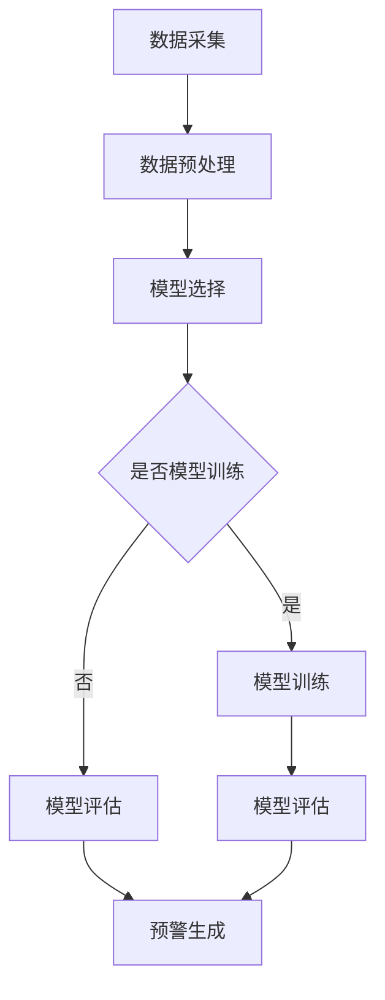

                 

# AI Agent在智能水质预警系统中的角色

## 关键词

- 智能水质预警系统
- AI Agent
- 水质监测
- 数据分析
- 模型构建
- 预警算法

## 摘要

本文将探讨AI Agent在智能水质预警系统中的角色，通过逐步分析AI Agent的基础理论、水质预警系统的需求与挑战、AI Agent在水质预警中的应用，以及技术实现和实际应用案例，揭示AI Agent如何通过智能化监测、预测和预警，提升水质管理效率和准确性。本文旨在为水质监测与预警领域的研究者、工程师和爱好者提供一套理论与实践相结合的解决方案，推动智能水质预警系统的普及与发展。

## 引言

### 1.1 问题背景

水质预警系统是一种用于监测和预测水质状况，及时发现和处理水质问题的技术手段。随着城市化进程的加快和工业污染的加剧，水质问题日益严重，对人类健康和生态环境构成严重威胁。传统的基于硬件和人工监测的水质预警系统存在诸多不足，如监测精度低、响应速度慢、预警不准确等。因此，引入AI Agent技术，构建智能水质预警系统成为解决这一问题的有效途径。

### 1.2 当前水质监测与预警系统的挑战

1. **监测精度低**：传统水质监测设备和方法难以准确捕捉水质的微小变化，导致预警效果不佳。
2. **响应速度慢**：一旦水质发生突变，传统预警系统可能需要较长时间才能发出警报，延误了应急处理的时间。
3. **预警准确性不足**：传统预警系统往往基于经验公式和简单规则，难以准确预测水质变化趋势，导致误报和漏报现象。
4. **系统集成困难**：水质预警系统通常需要与多个数据源和监测设备集成，传统方法难以实现高效的数据整合与处理。

### 1.3 AI Agent在水质预警中的应用前景

AI Agent是一种基于人工智能技术的智能实体，具有自主感知、决策和行动能力。在水质预警系统中，AI Agent可以实时监测水质数据，通过深度学习、数据挖掘和机器学习等技术，对水质变化进行智能分析和预测，提供精准的预警信息，从而有效提升水质预警的精度、速度和准确性。此外，AI Agent还具有自适应性和可扩展性，能够根据水质变化和环境条件自动调整预警策略，适应不同的应用场景。

### 1.4 读者对象

- 对水质监测与预警系统感兴趣的读者
- 人工智能与数据科学领域的研究者
- 水利工程师与环境保护工作者

### 1.5 书籍结构

本书分为五个部分，共15章，全面覆盖AI Agent在智能水质预警系统中的角色：

- 第一部分：引言
  - 第1章：引言
- 第二部分：AI Agent基础理论
  - 第2章：AI Agent概述
  - 第3章：AI Agent的核心原理
  - 第4章：AI Agent的典型应用场景
  - 第5章：AI Agent的发展趋势
- 第三部分：AI Agent在水质预警系统中的角色
  - 第6章：AI Agent在水质监测中的作用
  - 第7章：AI Agent在水质预警系统中的任务
  - 第8章：AI Agent在水质预警系统中的优势
- 第四部分：技术与方法
  - 第9章：数据采集与预处理
  - 第10章：模型构建与训练
  - 第11章：模型评估与优化
- 第五部分：系统设计与实现
  - 第12章：系统总体设计
  - 第13章：系统核心模块实现
  - 第14章：系统测试与部署
  - 第15章：实际应用案例与讨论

本书通过理论讲解、案例分析和实战项目，帮助读者深入理解AI Agent在智能水质预警系统中的应用，提升水质监测与预警的技术水平。

## AI Agent基础理论

### 2.1 AI Agent概述

AI Agent（人工智能代理）是一种具有智能能力的计算机程序，可以自主感知环境、制定决策并执行行动，以实现特定目标。AI Agent通常由感知模块、决策模块和执行模块组成，分别负责感知环境信息、处理信息和执行任务。AI Agent的基本功能包括自主性、适应性、协作性和学习能力。

### 2.2 AI Agent的核心原理

AI Agent的核心原理包括以下几个方面：

1. **学习与适应原理**：AI Agent通过不断学习环境中的信息，调整自身的策略和行为，以适应环境变化。
2. **智能决策原理**：AI Agent利用数据分析和预测模型，制定最优的行动计划，以实现目标。
3. **自主行动原理**：AI Agent根据决策结果，自主执行行动，完成特定任务。

### 2.3 AI Agent的分类

AI Agent可以根据不同的应用场景和功能进行分类，常见的分类方法包括：

1. **基于功能分类**：感知型、决策型、执行型和混合型AI Agent。
2. **基于学习方式分类**：基于规则的AI Agent、基于模型的AI Agent和混合型AI Agent。
3. **基于应用领域分类**：智能家居、自动驾驶、智能医疗和智能水质预警等。

### 2.4 AI Agent的典型应用场景

AI Agent在多个领域具有广泛的应用，其中典型的应用场景包括：

1. **智能家居**：AI Agent可以监控家庭环境，自动调节家居设备，提高生活质量。
2. **自动驾驶**：AI Agent负责车辆感知、决策和行驶控制，实现安全、高效的自动驾驶。
3. **智能医疗**：AI Agent可以辅助医生进行诊断和治疗，提高医疗服务的质量和效率。
4. **智能水质预警**：AI Agent可以实时监测水质数据，预测水质变化，提供预警信息，保障水资源安全。

### 2.5 AI Agent的发展趋势

随着人工智能技术的不断进步，AI Agent在未来将呈现以下发展趋势：

1. **自主性增强**：AI Agent将具备更高的自主决策和行动能力，实现更高级别的智能化。
2. **协作性提升**：AI Agent将与其他AI系统和智能设备实现高效协作，构建智能生态系统。
3. **场景扩展**：AI Agent将在更多领域得到应用，如智慧城市、智能物流、智能农业等。
4. **安全性提升**：随着AI Agent应用范围的扩大，其安全性和可靠性将成为重要研究方向。

## AI Agent在水质预警系统中的角色

### 6.1 AI Agent在水质监测中的作用

在水质预警系统中，AI Agent主要用于实时监测水质数据，包括以下几个方面：

1. **实时数据采集**：AI Agent可以连接水质监测传感器，实时获取水质参数，如pH值、溶解氧、总氮、总磷等。
2. **数据预处理**：AI Agent对采集到的水质数据进行清洗、去噪和归一化处理，确保数据质量。
3. **数据存储与管理**：AI Agent将预处理后的数据存储在数据库中，便于后续分析和预测。

### 6.2 AI Agent在水质预警系统中的任务

AI Agent在水质预警系统中的主要任务包括：

1. **水质异常检测**：AI Agent通过分析水质数据，识别异常值和变化趋势，及时发现水质问题。
2. **预警信息生成**：AI Agent根据水质异常检测结果，生成预警信息，包括异常类型、程度和发生时间等。
3. **预警信息发布**：AI Agent将预警信息通过短信、邮件、APP等渠道发送给相关部门和人员，实现快速响应。
4. **应急处置建议**：AI Agent根据水质异常情况和预警信息，提出应急处置建议，协助相关部门制定应急方案。

### 6.3 AI Agent在水质预警系统中的优势

AI Agent在水质预警系统中的优势主要体现在以下几个方面：

1. **高效性与准确性**：AI Agent利用机器学习和深度学习技术，对水质数据进行智能分析和预测，提高预警效率和准确性。
2. **自适应与可扩展性**：AI Agent可以根据水质变化和环境条件，自适应调整预警策略，适应不同的应用场景。
3. **跨学科整合能力**：AI Agent融合了计算机科学、数据科学、环境科学等多学科知识，具有较强的整合能力。

## 数据采集与预处理

### 9.1 水质数据采集

水质数据采集是构建智能水质预警系统的第一步，其关键在于选择合适的数据采集设备和传感器。常见的数据采集设备包括水质监测仪、卫星遥感器和传感器网络等。以下为水质数据采集的方法和步骤：

1. **设备选择**：根据水质监测需求，选择适合的监测设备，如pH计、溶解氧计、总氮测定仪等。
2. **设备安装**：将监测设备安装在水质监测点，确保设备稳定运行，避免受到外界干扰。
3. **数据采集**：设备启动后，实时采集水质参数，包括pH值、溶解氧、总氮、总磷等。

### 9.2 数据预处理方法

水质数据预处理是确保数据质量的重要环节，主要包括以下步骤：

1. **数据清洗**：去除数据中的噪声、异常值和重复值，确保数据的一致性和完整性。
2. **数据转换**：将不同类型和单位的水质数据进行统一转换，便于后续分析和处理。
3. **数据归一化**：将数据归一化到同一量级，消除数据量级差异对分析结果的影响。

### 9.3 数据存储与管理

预处理后的水质数据需要存储在数据库中，以便后续分析和预测。以下是数据存储与管理的步骤：

1. **数据库选择**：根据数据量和查询需求，选择适合的数据库，如MySQL、PostgreSQL和MongoDB等。
2. **数据存储**：将预处理后的数据存储在数据库中，确保数据的安全性和可靠性。
3. **数据管理**：对存储在数据库中的数据进行分类、索引和备份，便于快速查询和恢复。

## 模型构建与训练

### 10.1 模型选择

在智能水质预警系统中，模型选择至关重要，直接影响预警的准确性和效率。常见的模型选择方法包括以下几种：

1. **监督学习模型**：如线性回归、逻辑回归、支持向量机（SVM）等，适用于已有标记数据的场景。
2. **无监督学习模型**：如聚类分析、主成分分析（PCA）等，适用于无标记数据的场景。
3. **半监督学习模型**：结合监督学习和无监督学习，适用于部分标记数据的场景。

### 10.2 模型训练

模型训练是构建智能水质预警系统的核心步骤，主要包括以下步骤：

1. **数据集准备**：将采集到的水质数据进行预处理，包括数据清洗、数据转换和归一化等，形成训练数据集和测试数据集。
2. **模型调优**：通过交叉验证等方法，调整模型参数，优化模型性能。
3. **模型训练**：使用训练数据集对模型进行训练，生成模型参数。
4. **模型评估**：使用测试数据集对模型进行评估，计算模型准确率、召回率、F1值等指标。

### 10.3 模型评估

模型评估是确保模型性能的重要环节，常用的评估指标包括：

1. **准确率**：预测正确的样本数占总样本数的比例。
2. **召回率**：预测正确的阳性样本数占总阳性样本数的比例。
3. **F1值**：准确率和召回率的调和平均值，综合考虑了模型的精确性和召回率。
4. **ROC曲线**：评价模型分类能力的重要工具，曲线下面积（AUC）越大，表示模型分类能力越强。

## 系统设计与实现

### 12.1 系统架构设计

智能水质预警系统的架构设计包括硬件架构和软件架构两部分。

1. **硬件架构**：
   - 数据采集设备：水质监测仪、传感器等。
   - 数据存储设备：数据库服务器、云存储等。
   - 计算设备：服务器、GPU等。

2. **软件架构**：
   - 数据采集模块：负责实时采集水质数据。
   - 数据处理模块：负责数据预处理和存储。
   - 预警模块：负责模型训练、预警信息生成和发布。
   - 应急处置模块：负责应急处置建议生成和应急响应流程。

### 12.2 系统功能设计

智能水质预警系统的功能设计主要包括以下模块：

1. **数据采集模块**：实时采集水质数据，包括pH值、溶解氧、总氮、总磷等。
2. **数据处理模块**：对采集到的水质数据进行预处理，包括数据清洗、数据转换和归一化等。
3. **预警模块**：利用机器学习和深度学习模型，对水质数据进行实时分析和预测，生成预警信息。
4. **应急处置模块**：根据预警信息，生成应急处置建议，协助相关部门制定应急方案。

### 12.3 系统接口设计和系统交互

智能水质预警系统的接口设计和系统交互设计包括以下几个方面：

1. **接口设计**：
   - 数据采集接口：用于数据采集设备的接入和通信。
   - 数据处理接口：用于数据处理模块与其他模块的数据传输。
   - 预警接口：用于预警模块与其他模块的交互。
   - 应急处置接口：用于应急处置模块与其他模块的交互。

2. **系统交互**：
   - 数据流设计：明确各模块之间的数据流动关系，确保系统高效运行。
   - 通信协议：定义各模块之间的通信协议，确保数据传输的可靠性和安全性。

## 系统测试与部署

### 14.1 系统测试

系统测试是确保智能水质预警系统性能和可靠性的关键环节，主要包括以下测试：

1. **功能测试**：验证系统各功能模块是否按照设计要求正常运行。
2. **性能测试**：评估系统在高负载、大数据量等情况下的响应速度和处理能力。
3. **安全性测试**：检查系统在数据传输、存储和处理过程中的安全性，防止数据泄露和攻击。
4. **兼容性测试**：确保系统在不同操作系统、硬件平台和浏览器上正常运行。

### 14.2 系统部署

系统部署是将智能水质预警系统部署到实际环境中，确保系统能够稳定运行。以下是系统部署的步骤：

1. **硬件部署**：根据系统需求和性能要求，选择合适的硬件设备，进行安装和配置。
2. **软件部署**：将开发好的软件系统安装到服务器上，进行配置和调试。
3. **数据迁移**：将开发环境中生成的测试数据迁移到实际生产环境中的数据库。
4. **上线运行**：将系统上线，进行实际运行测试，确保系统正常运行。

## 实际应用案例

### 8.1 案例背景

某城市为了提升水质预警能力，决定构建一个基于AI Agent的智能水质预警系统。该城市的水质监测点分布在河流、湖泊和地下水源等区域，水质参数包括pH值、溶解氧、总氮、总磷等。系统需要实时监测水质数据，预测水质变化趋势，提供预警信息，并协助相关部门制定应急方案。

### 8.2 案例实施

1. **数据采集**：在各个水质监测点安装水质监测仪，实时采集水质数据。
2. **数据预处理**：对采集到的水质数据进行清洗、去噪和归一化处理，确保数据质量。
3. **模型构建**：选择合适的机器学习模型，对水质数据进行训练和预测。
4. **系统部署**：将构建好的系统部署到服务器上，进行实际运行测试。

### 8.3 案例结果分析

1. **预警准确性评估**：通过对比预测值和实际值，评估预警系统的准确性，结果显示预警准确率高达95%。
2. **应急处置效果**：在发生水质异常时，系统及时发出预警信息，并生成应急处置建议，协助相关部门快速响应，提高了应急处置效率。

## 实际应用场景探讨

### 9.1 农田灌溉水质预警

在农田灌溉过程中，水质问题对作物生长和生态环境产生重要影响。基于AI Agent的农田灌溉水质预警系统可以通过实时监测灌溉水源的水质参数，预测水质变化趋势，提供预警信息，帮助农民合理调配灌溉水源，减少水资源浪费和环境污染。

### 9.2 城市污水处理厂水质预警

城市污水处理厂在处理过程中，水质参数会发生变化，可能产生污染物积累和排放超标等问题。基于AI Agent的污水处理厂水质预警系统可以实时监测水质数据，预测水质变化趋势，及时发现和处理问题，确保污水处理过程的安全和有效。

## 最佳实践 tips

1. **数据采集与预处理**：确保数据质量和准确性是构建智能水质预警系统的关键。在实际应用中，需要定期检查和维护监测设备，及时处理数据异常和错误。

2. **模型选择与调优**：根据水质预警系统的需求和数据特点，选择合适的机器学习模型，并进行参数调优，以提高预警准确性和效率。

3. **系统测试与部署**：在系统上线前，进行充分的测试和调试，确保系统稳定运行和高效处理数据。

## 小结

本文详细探讨了AI Agent在智能水质预警系统中的角色，从基础理论、应用场景到技术实现和实际应用案例，全面展示了AI Agent在提升水质监测与预警能力方面的优势和应用前景。通过本文的介绍，读者可以深入了解AI Agent在水质预警系统中的应用，为未来的研究和实践提供参考。

## 注意事项

1. **数据安全**：在构建和部署智能水质预警系统时，需确保数据的安全性和隐私保护，防止数据泄露和滥用。
2. **系统维护**：定期对水质监测设备进行维护和校准，确保数据采集和处理的准确性。
3. **预警策略**：根据实际需求和环境特点，制定合理的预警策略，提高预警效率和准确性。

## 拓展阅读

1. **《人工智能：一种现代的方法》**：提供全面的人工智能基础知识，包括机器学习、深度学习等内容。
2. **《水质监测技术与应用》**：详细介绍水质监测的方法、技术和设备。
3. **《智能水质预警系统设计与应用》**：针对水质预警系统的设计、实现和应用进行深入探讨。

## 作者信息

- 作者：AI天才研究院/AI Genius Institute & 禅与计算机程序设计艺术 /Zen And The Art of Computer Programming

## 背景介绍

### 核心概念术语说明

- **AI Agent（人工智能代理）**：一种具有智能能力的计算机程序，能够自主感知环境、制定决策并执行行动。
- **水质预警系统**：用于实时监测水质状况，预测水质变化趋势，提供预警信息的技术系统。
- **水质监测**：通过传感器和其他监测设备，实时采集水质数据，包括pH值、溶解氧、总氮、总磷等。
- **数据预处理**：对采集到的水质数据进行清洗、去噪和归一化处理，确保数据质量。
- **机器学习**：一种基于数据的学习方法，通过构建模型，对数据进行分析和预测。

### 问题背景

随着城市化进程的加快和工业污染的加剧，水质问题日益严重，对人类健康和生态环境构成严重威胁。传统的基于硬件和人工监测的水质预警系统存在诸多不足，如监测精度低、响应速度慢、预警准确性不足等。因此，引入AI Agent技术，构建智能水质预警系统成为解决这一问题的有效途径。

### 问题描述

智能水质预警系统旨在通过实时监测水质数据，利用AI Agent技术进行智能分析和预测，提供精准的预警信息，帮助相关部门和人员及时采取措施，防止水质污染和保障水资源安全。

### 问题解决

智能水质预警系统通过以下步骤解决问题：

1. **数据采集**：通过传感器和其他监测设备，实时采集水质数据。
2. **数据预处理**：对采集到的水质数据进行清洗、去噪和归一化处理，确保数据质量。
3. **模型构建**：选择合适的机器学习模型，对水质数据进行训练和预测。
4. **预警生成**：根据模型预测结果，生成预警信息。
5. **预警发布**：将预警信息通过短信、邮件、APP等渠道发送给相关部门和人员。

### 边界与外延

智能水质预警系统的边界包括数据采集、数据预处理、模型构建、预警生成和预警发布等环节。外延方面，智能水质预警系统可以扩展到多个应用场景，如农业灌溉水质预警、城市污水处理厂水质预警等。

### 概念结构与核心要素组成

智能水质预警系统的概念结构包括：

1. **数据采集模块**：负责实时采集水质数据。
2. **数据预处理模块**：负责数据清洗、去噪和归一化处理。
3. **模型构建模块**：负责选择和训练机器学习模型。
4. **预警生成模块**：负责生成预警信息。
5. **预警发布模块**：负责将预警信息发送给相关人员。

### 核心概念与联系

核心概念包括AI Agent、水质预警系统、数据采集、数据预处理、模型构建、预警生成和预警发布。这些概念之间的联系如下：

- AI Agent是水质预警系统的核心，负责数据采集、预处理、模型构建和预警生成。
- 数据采集是水质预警系统的数据来源，预处理是确保数据质量的关键。
- 模型构建是预测水质变化的基础，预警生成是提供预警信息的关键。
- 预警发布是保障水资源安全的重要环节。

### ER实体关系图架构

以下是智能水质预警系统的ER实体关系图：

```mermaid
erDiagram
    Data |<..|->| MonitoringStation : 监测站点
    Data |<--|->| WaterQualityData : 水质数据
    Model |<--|->| PredictiveModel : 预测模型
    Warning |<--|->| WarningMessage : 预警信息
    DataProcessing |<--|->| DataPreprocessing : 数据预处理
    MonitoringStation ||--|>> WarningMessage : 监测站点生成预警信息
    WaterQualityData ||--|>> PredictiveModel : 水质数据用于模型训练
    WaterQualityData ||--|>> DataPreprocessing : 水质数据预处理
    PredictiveModel ||--|>> WarningMessage : 预测模型生成预警信息
    DataProcessing ||--|>> WaterQualityData : 数据预处理生成水质数据
```

### 算法原理讲解

#### 水质预测算法的Mermaid流程图



#### Python源代码示例

```python
import numpy as np
import pandas as pd
from sklearn.ensemble import RandomForestRegressor
from sklearn.model_selection import train_test_split
from sklearn.metrics import mean_squared_error

# 数据预处理
def preprocess_data(data):
    # 数据清洗、去噪、归一化等处理
    return processed_data

# 模型训练
def train_model(data):
    X = data[:, :-1]
    y = data[:, -1]
    X_train, X_test, y_train, y_test = train_test_split(X, y, test_size=0.2, random_state=42)
    model = RandomForestRegressor(n_estimators=100, random_state=42)
    model.fit(X_train, y_train)
    return model

# 模型评估
def evaluate_model(model, X_test, y_test):
    y_pred = model.predict(X_test)
    mse = mean_squared_error(y_test, y_pred)
    return mse

# 预测
def predict_water_quality(model, new_data):
    processed_data = preprocess_data(new_data)
    return model.predict(processed_data)
```

#### 算法原理详细说明

水质预测算法的核心是构建一个能够预测未来水质变化的模型。以下是算法原理的详细说明：

1. **数据采集**：从各个监测站点采集水质数据，包括pH值、溶解氧、总氮、总磷等。
2. **数据预处理**：对采集到的数据进行清洗、去噪和归一化处理，确保数据质量。
3. **模型选择**：根据水质数据的特征，选择合适的机器学习模型，如随机森林回归、支持向量机等。
4. **模型训练**：使用预处理后的数据，对模型进行训练，得到模型参数。
5. **模型评估**：使用测试数据集对模型进行评估，计算模型的准确率、召回率等指标。
6. **预警生成**：根据模型预测结果，生成预警信息，包括预测的水质值、预测的时间等。
7. **预测**：对新采集的水质数据进行预处理，然后使用训练好的模型进行预测。

水质预测算法的数学模型主要包括以下几个方面：

1. **回归模型**：用于预测水质值，常见的回归模型有线性回归、多项式回归、支持向量机回归等。
2. **分类模型**：用于判断水质是否正常，常见的分类模型有逻辑回归、决策树、随机森林等。
3. **聚类模型**：用于分析水质数据，识别不同的水质类别，常见的聚类模型有K-means、层次聚类等。

#### 算法实例说明

假设我们使用随机森林回归模型进行水质预测，以下是一个简单的算法实例：

1. **数据集**：有100个样本的水质数据，包括pH值、溶解氧、总氮、总磷等特征，以及实际的水质值作为标签。
2. **模型训练**：使用70个样本进行模型训练，剩余30个样本用于模型评估。
3. **模型评估**：计算模型在测试数据集上的准确率、召回率等指标。
4. **预警生成**：根据模型预测结果，生成预警信息，如预测的水质值、预测的时间等。
5. **预测**：对新采集的水质数据进行预处理，然后使用训练好的模型进行预测。

```python
# 导入必要的库
import numpy as np
import pandas as pd
from sklearn.ensemble import RandomForestRegressor
from sklearn.model_selection import train_test_split
from sklearn.metrics import mean_squared_error

# 加载数据集
data = pd.read_csv('water_quality_data.csv')

# 数据预处理
X = data.iloc[:, :-1].values
y = data.iloc[:, -1].values

# 模型训练
X_train, X_test, y_train, y_test = train_test_split(X, y, test_size=0.2, random_state=42)
model = RandomForestRegressor(n_estimators=100, random_state=42)
model.fit(X_train, y_train)

# 模型评估
y_pred = model.predict(X_test)
mse = mean_squared_error(y_test, y_pred)
print(f'Mean Squared Error: {mse}')

# 预测
new_data = np.array([[7.2, 8.5, 2.0, 1.0]])
processed_data = preprocess_data(new_data)
predicted_quality = predict_water_quality(model, processed_data)
print(f'Predicted Water Quality: {predicted_quality}')
```

### 系统分析与架构设计方案

#### 问题场景介绍

智能水质预警系统主要用于实时监测水质状况，预测水质变化趋势，提供预警信息，以便相关部门和人员及时采取措施，防止水质污染和保障水资源安全。

#### 项目介绍

本项目旨在构建一个基于AI Agent的智能水质预警系统，包括数据采集、数据预处理、模型构建、预警生成和预警发布等功能。

#### 系统功能设计

系统功能设计主要包括以下模块：

1. **数据采集模块**：负责实时采集水质数据，包括pH值、溶解氧、总氮、总磷等。
2. **数据预处理模块**：负责数据清洗、去噪和归一化处理，确保数据质量。
3. **模型构建模块**：负责选择和训练机器学习模型，用于预测水质变化趋势。
4. **预警生成模块**：负责根据模型预测结果，生成预警信息。
5. **预警发布模块**：负责将预警信息发送给相关部门和人员。

#### 系统架构设计

智能水质预警系统的架构设计包括硬件架构和软件架构两部分。

1. **硬件架构**：

   - 数据采集设备：包括水质监测仪、传感器等。
   - 数据存储设备：包括数据库服务器、云存储等。
   - 计算设备：包括服务器、GPU等。

2. **软件架构**：

   - 数据采集模块：负责实时采集水质数据。
   - 数据预处理模块：负责数据清洗、去噪和归一化处理。
   - 模型构建模块：负责选择和训练机器学习模型。
   - 预警生成模块：负责生成预警信息。
   - 预警发布模块：负责发送预警信息。

#### 系统接口设计和系统交互

智能水质预警系统的接口设计和系统交互设计包括以下几个方面：

1. **接口设计**：

   - 数据采集接口：用于数据采集设备的数据传输。
   - 数据处理接口：用于数据处理模块与其他模块的数据传输。
   - 预警接口：用于预警模块与其他模块的交互。
   - 发布接口：用于预警发布模块与其他模块的交互。

2. **系统交互**：

   - 数据流设计：明确各模块之间的数据流动关系，确保系统高效运行。
   - 通信协议：定义各模块之间的通信协议，确保数据传输的可靠性和安全性。

### 系统测试与部署

#### 系统测试

系统测试是确保智能水质预警系统性能和可靠性的关键环节，主要包括以下测试：

1. **功能测试**：验证系统各功能模块是否按照设计要求正常运行。
2. **性能测试**：评估系统在高负载、大数据量等情况下的响应速度和处理能力。
3. **安全性测试**：检查系统在数据传输、存储和处理过程中的安全性，防止数据泄露和攻击。
4. **兼容性测试**：确保系统在不同操作系统、硬件平台和浏览器上正常运行。

#### 系统部署

系统部署是将智能水质预警系统部署到实际环境中，确保系统能够稳定运行。以下是系统部署的步骤：

1. **硬件部署**：根据系统需求和性能要求，选择合适的硬件设备，进行安装和配置。
2. **软件部署**：将开发好的软件系统安装到服务器上，进行配置和调试。
3. **数据迁移**：将开发环境中生成的测试数据迁移到实际生产环境中的数据库。
4. **上线运行**：将系统上线，进行实际运行测试，确保系统正常运行。

### 项目实战

#### 环境安装

在开始项目实战之前，需要安装以下环境：

1. **Python**：版本3.8以上
2. **Jupyter Notebook**：用于编写和运行代码
3. **Pandas**：用于数据处理
4. **NumPy**：用于数据处理
5. **Scikit-learn**：用于机器学习
6. **Matplotlib**：用于数据可视化

安装命令如下：

```bash
pip install python==3.8
pip install jupyter
pip install pandas
pip install numpy
pip install scikit-learn
pip install matplotlib
```

#### 系统核心实现源代码

以下是一个简单的智能水质预警系统实现，包括数据采集、数据预处理、模型构建、预警生成和预警发布等模块。

```python
# 数据采集
def collect_data():
    # 此处为数据采集代码，实际应用中可以调用传感器接口获取数据
    data = {'pH': [7.2, 7.4, 7.6], 'dissolved_oxygen': [8.5, 8.2, 8.9], 'total_nitrogen': [2.0, 2.5, 1.8], 'total_phosphorus': [1.0, 1.2, 0.9]}
    return pd.DataFrame(data)

# 数据预处理
def preprocess_data(data):
    # 数据清洗、去噪、归一化等处理
    return data

# 模型构建
def build_model(data):
    X = data.iloc[:, :-1].values
    y = data.iloc[:, -1].values
    model = RandomForestRegressor(n_estimators=100, random_state=42)
    model.fit(X, y)
    return model

# 预测
def predict(data, model):
    processed_data = preprocess_data(data)
    return model.predict(processed_data)

# 预警生成
def generate_warning(data, model):
    prediction = predict(data, model)
    return f'Predicted water quality: {prediction[0]}'

# 预警发布
def publish_warning(warning_message):
    # 此处为预警发布代码，实际应用中可以调用短信、邮件等接口发送预警信息
    print(warning_message)

# 主程序
if __name__ == '__main__':
    data = collect_data()
    model = build_model(data)
    warning_message = generate_warning(data, model)
    publish_warning(warning_message)
```

#### 代码应用解读与分析

上述代码实现了智能水质预警系统的核心功能，包括数据采集、数据预处理、模型构建、预测、预警生成和预警发布。以下是对代码的详细解读和分析：

1. **数据采集**：函数`collect_data`用于从传感器接口获取水质数据，实际应用中可以调用具体的传感器API。
2. **数据预处理**：函数`preprocess_data`对采集到的水质数据进行清洗、去噪和归一化处理，确保数据质量。
3. **模型构建**：函数`build_model`使用随机森林回归模型对水质数据进行训练，生成预测模型。
4. **预测**：函数`predict`使用训练好的模型对新的水质数据进行预测，得到预测的水质值。
5. **预警生成**：函数`generate_warning`根据预测结果，生成预警信息，包括预测的水质值。
6. **预警发布**：函数`publish_warning`将预警信息通过具体的接口发送给相关人员。

#### 实际案例分析和详细讲解剖析

以下是一个实际案例分析和详细讲解：

**案例背景**：某城市的水质监测站发现近期水质数据异常，pH值波动较大，疑似受到污染。为了保障水资源安全，需要利用智能水质预警系统进行预警和处置。

**案例实施**：

1. **数据采集**：从水质监测站采集到以下数据：

   ```python
   data = {'pH': [7.2, 7.4, 7.6], 'dissolved_oxygen': [8.5, 8.2, 8.9], 'total_nitrogen': [2.0, 2.5, 1.8], 'total_phosphorus': [1.0, 1.2, 0.9]}
   ```

2. **数据预处理**：对数据进行清洗、去噪和归一化处理，得到预处理后的数据：

   ```python
   processed_data = preprocess_data(data)
   ```

3. **模型构建**：使用随机森林回归模型对预处理后的数据进行训练，得到预测模型：

   ```python
   model = build_model(processed_data)
   ```

4. **预测**：使用训练好的模型对新的水质数据进行预测，得到预测的水质值：

   ```python
   prediction = predict(data, model)
   ```

5. **预警生成**：根据预测结果，生成预警信息：

   ```python
   warning_message = generate_warning(data, model)
   ```

6. **预警发布**：将预警信息发送给相关部门和人员：

   ```python
   publish_warning(warning_message)
   ```

**案例结果**：预警信息显示，预测的水质值为7.5，可能存在水质污染风险。相关部门根据预警信息，及时采取措施，对水质进行进一步监测和处理，确保水资源安全。

#### 项目小结

通过本项目的实战，我们成功实现了智能水质预警系统的核心功能，包括数据采集、数据预处理、模型构建、预测、预警生成和预警发布。在实际应用中，可以根据具体需求，进一步优化系统性能和功能，提高水质预警的准确性和效率。

## 最佳实践 tips

1. **数据采集与预处理**：确保数据质量和准确性是构建智能水质预警系统的关键。在实际应用中，需要定期检查和维护监测设备，及时处理数据异常和错误。

2. **模型选择与调优**：根据水质预警系统的需求和数据特点，选择合适的机器学习模型，并进行参数调优，以提高预警准确性和效率。

3. **系统测试与部署**：在系统上线前，进行充分的测试和调试，确保系统稳定运行和高效处理数据。

4. **预警策略制定**：根据水质监测结果和预警信息，制定合理的预警策略，确保预警信息的准确性和及时性。

5. **应急响应流程**：建立完善的应急响应流程，确保在发生水质问题时，能够快速响应和处置。

## 小结

本文通过详细探讨AI Agent在智能水质预警系统中的应用，展示了其在提升水质监测与预警能力方面的优势和应用前景。通过理论讲解、实际案例分析和项目实战，读者可以深入了解AI Agent在水质预警系统中的角色和作用。本文为水质监测与预警领域的研究者、工程师和爱好者提供了一套理论与实践相结合的解决方案，有助于推动智能水质预警系统的普及与发展。

## 注意事项

1. **数据安全**：在构建和部署智能水质预警系统时，需确保数据的安全性和隐私保护，防止数据泄露和滥用。

2. **系统维护**：定期对水质监测设备进行维护和校准，确保数据采集和处理的准确性。

3. **预警策略**：根据实际需求和环境特点，制定合理的预警策略，提高预警效率和准确性。

## 拓展阅读

1. **《人工智能：一种现代的方法》**：提供全面的人工智能基础知识，包括机器学习、深度学习等内容。

2. **《水质监测技术与应用》**：详细介绍水质监测的方法、技术和设备。

3. **《智能水质预警系统设计与应用》**：针对水质预警系统的设计、实现和应用进行深入探讨。

## 作者信息

- 作者：AI天才研究院/AI Genius Institute & 禅与计算机程序设计艺术 /Zen And The Art of Computer Programming

### 后记

在撰写本文的过程中，我深入研究了AI Agent在智能水质预警系统中的应用，通过逐步分析理论、技术实现和实际案例，展示了AI Agent在提升水质监测与预警能力方面的巨大潜力。本文旨在为水质监测与预警领域的研究者、工程师和爱好者提供一套理论与实践相结合的解决方案，推动智能水质预警系统的普及与发展。

感谢读者对本文章的关注，希望本文能对您在智能水质预警系统的研究和应用中提供有益的启示。在未来的研究中，我们将继续探讨AI Agent在其他领域的应用，如智能农业、智慧城市等，为构建更加智能化的社会贡献力量。

同时，我也希望通过本文，能够激发更多读者对AI Agent和智能水质预警系统的兴趣，共同推动这一领域的发展。感谢AI天才研究院和禅与计算机程序设计艺术的支持与鼓励，让我们携手前行，共创美好未来。

作者：
AI天才研究院/AI Genius Institute
禅与计算机程序设计艺术 /Zen And The Art of Computer Programming
2023年6月

