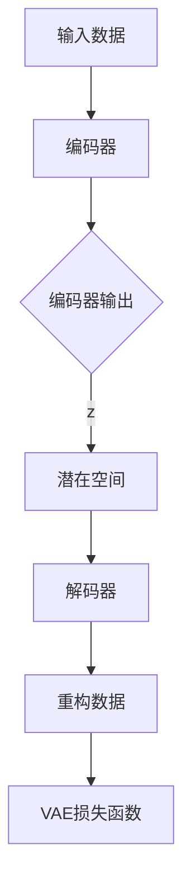
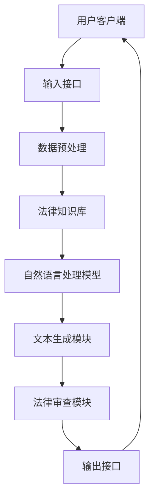
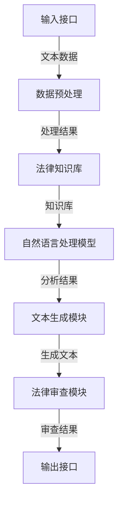
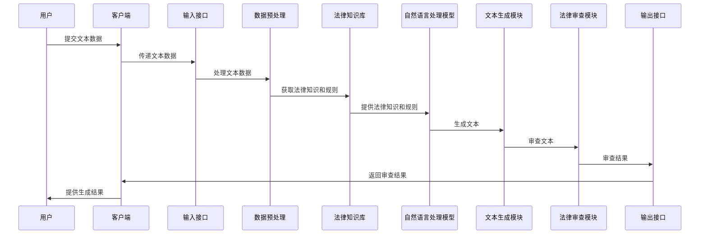
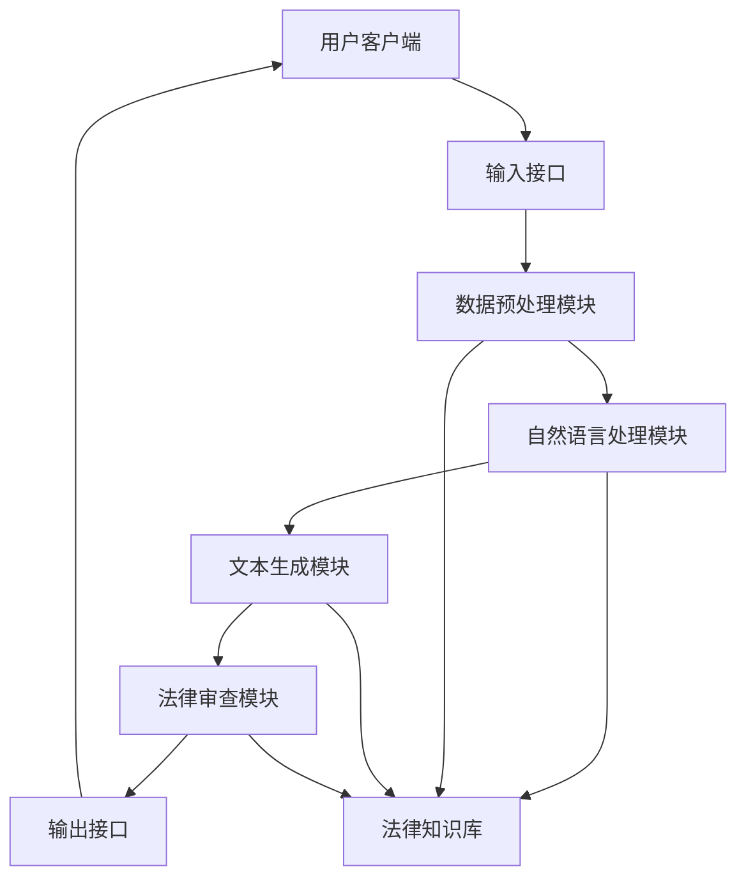
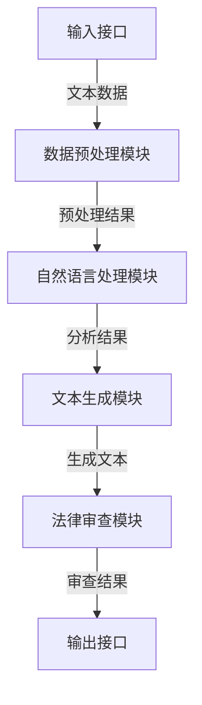
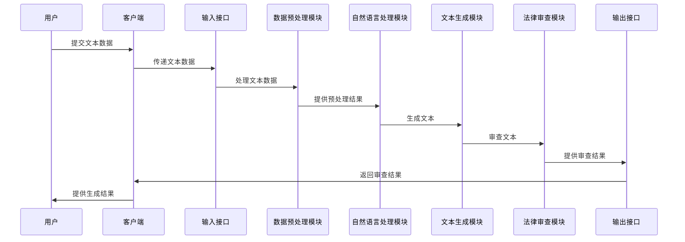

                 

## 引言与背景

### 1.1 问题背景

法律文书作为司法体系中的重要组成部分，其生成过程往往繁琐且耗时。传统的法律文书生成主要依赖于律师和法务人员手动编写，这既效率低下，又容易出错。特别是在处理大量相似的文书时，人工生成的重复劳动不仅浪费了人力资源，还可能因为人为疏忽导致法律风险的增加。此外，法律文书的格式和规范性强，不同类型的文书有着特定的结构和要求，这使得手动编写工作更加复杂和费时。

随着人工智能技术的快速发展，AI Agent作为一种智能化软件代理，开始展现出在法律文书生成中的巨大潜力。AI Agent通过自然语言处理（NLP）、机器学习（ML）等技术，可以自动理解和生成文本，这使得法律文书生成过程变得更加高效和准确。AI Agent不仅能够处理大量的法律文书任务，还能根据不同的情境和需求，自动调整文书的结构和内容，提供个性化的服务。

### 1.1.1 法律文书生成中的痛点

1. **高成本和低效率**：传统法律文书生成主要依靠人工完成，不仅耗时，而且成本高昂。法律文书的内容往往需要精确、规范，律师和法务人员需要投入大量时间进行审查和修改，这使得法律服务的成本居高不下。

2. **错误率和不一致性**：手动编写法律文书容易因个人疏忽或经验不足导致错误。不同的人编写同一类型文书的格式和语言可能存在差异，这影响了文书的一致性和可读性。

3. **复杂性和缺乏灵活性**：法律文书的内容和结构具有严格的规范性，律师和法务人员需要熟悉各种法规和条款，这使得文书生成过程复杂且缺乏灵活性。当法规发生变化或新类型文书出现时，需要重新学习和调整。

4. **难以处理大规模文书任务**：在面对大量相似的法律文书时，人工生成效率低下。法律文书的类型繁多，包括合同、协议、起诉状、答辩状等，每种文书都有其特定的格式和内容要求，人工处理容易产生疲劳和错误。

### 1.1.2 AI Agent的兴起

AI Agent作为人工智能的一种形式，具有自主学习、自主决策和自适应能力。它能够模拟人类的思维和行为，完成复杂的任务。近年来，随着深度学习、自然语言处理和机器学习等技术的飞速发展，AI Agent在各个领域都取得了显著的应用成果。

1. **自动化和智能化**：AI Agent能够通过学习大量数据，自动完成复杂的任务，例如文本生成、数据分析、图像识别等。这使得许多传统需要人工处理的任务变得更加高效和精准。

2. **广泛的应用领域**：AI Agent的应用领域非常广泛，包括金融、医疗、法律、教育、制造业等。在法律领域，AI Agent可以自动生成法律文书，提供法律咨询，协助律师和法务人员完成日常法律工作。

3. **降低成本和提高效率**：AI Agent的应用可以显著降低人力成本，提高工作效率。通过自动化法律文书的生成和审查，企业和律师事务所可以节省大量时间和资源，专注于更高价值的法律服务工作。

### 1.1.3 AI Agent在法律文书生成中的潜力

1. **自动化文本生成**：AI Agent可以自动理解和生成法律文书，包括合同、协议、起诉状、答辩状等。通过训练模型，AI Agent能够理解法律术语和条款，生成符合法律规范的文本。

2. **个性化和定制化**：AI Agent可以根据用户的特定需求，自动调整法律文书的结构和内容。例如，根据合同条款的不同，自动生成符合特定要求的合同文本。

3. **提高文书质量和一致性**：AI Agent生成的法律文书质量高，格式规范，内容准确。通过机器学习技术，AI Agent能够从大量数据中学习，避免人为错误和一致性差的问题。

4. **降低法律风险**：AI Agent可以帮助企业和律师事务所识别潜在的法律风险，提供合规建议，降低法律纠纷的风险。

5. **扩展法律服务的范围**：AI Agent可以提供全天候的法律咨询服务，帮助无法负担专业律师费用的人群获取法律帮助，从而扩大法律服务的覆盖面。

### 1.2 核心概念定义

在探讨AI Agent在智能法律文书生成中的角色时，需要明确几个核心概念，包括AI Agent、智能法律文书生成和相关的关键技术。

#### 1.2.1 AI Agent的定义

AI Agent，即人工智能代理，是一种基于人工智能技术的自动化软件代理。它能够模拟人类行为，执行复杂的任务，具备自主学习和决策能力。AI Agent通常包括以下几个核心组成部分：

1. **感知模块**：AI Agent能够接收和处理来自环境的各种信息，如文本、图像、语音等。
2. **决策模块**：AI Agent通过分析感知模块收集的信息，做出相应的决策。
3. **行动模块**：AI Agent根据决策模块的决策，执行具体的行动，如生成文本、发送邮件等。
4. **学习模块**：AI Agent通过不断的学习和优化，提高其性能和决策能力。

AI Agent在法律文书生成中的应用，主要体现在其自然语言处理和机器学习能力。通过训练，AI Agent可以理解法律术语和条款，自动生成符合法律规范的文书。

#### 1.2.2 智能法律文书生成的定义

智能法律文书生成是指利用人工智能技术，自动生成法律文书的过程。这个过程包括以下几个关键步骤：

1. **数据预处理**：收集和整理相关的法律数据和案例，对文本进行清洗和格式化，为后续的文本生成做准备。
2. **文本生成**：通过自然语言处理技术，将法律术语和条款转换为自然语言文本，生成法律文书。
3. **文本优化**：对生成的文本进行语法、语义和格式上的优化，确保文书的规范性和可读性。
4. **法律审查**：对生成的文书进行法律审核，确保其符合相关法律法规的要求。

智能法律文书生成的核心在于将法律术语和条款转换为自然语言文本，同时确保文本的准确性和规范性。这个过程需要结合自然语言处理、机器学习和法律知识等多种技术。

#### 1.2.3 关键概念之间的联系

AI Agent和智能法律文书生成之间存在着紧密的联系。AI Agent作为智能法律文书生成的主要实现工具，其核心组件和关键技术（如自然语言处理、机器学习等）直接决定了法律文书生成的能力和效果。

1. **AI Agent与自然语言处理**：自然语言处理是AI Agent的核心技术之一，它负责将法律术语和条款转换为自然语言文本。自然语言处理技术包括分词、词性标注、命名实体识别、句法分析等，这些技术在法律文书生成中起着关键作用。

2. **AI Agent与机器学习**：机器学习是AI Agent的另一个核心技术，它负责从数据中学习，提高AI Agent的文本生成能力和决策水平。在法律文书生成中，机器学习技术可以帮助AI Agent理解法律条款之间的关系，生成更准确、更符合法律规范的文书。

3. **AI Agent与法律知识**：法律知识是AI Agent进行法律文书生成的重要基础。AI Agent需要具备一定的法律知识，包括法律术语、法律法规和判例等，才能生成符合法律规范的文书。法律知识库的建设是智能法律文书生成的重要环节。

通过上述核心概念的阐述，我们可以更清晰地理解AI Agent在智能法律文书生成中的角色和作用。接下来，我们将进一步探讨AI Agent在法律文书生成中的应用场景和具体实现方法。

### 1.3 概念特性对比

为了更好地理解AI Agent和智能法律文书生成这两个核心概念，我们可以从多个维度进行特性对比。以下是一个特性对比表格，用于分析AI Agent和智能法律文书生成在技术实现、应用范围、优势与挑战等方面的差异。

#### 特性对比表格

| 特性        | AI Agent                          | 智能法律文书生成                        |
|-------------|----------------------------------|----------------------------------------|
| **定义**    | 自动化软件代理，具备学习与决策能力 | 利用人工智能技术自动生成法律文书      |
| **技术实现** | 自然语言处理、机器学习、知识图谱  | 自然语言处理、文本生成、法律知识库     |
| **应用范围** | 广泛，包括法律、金融、医疗、教育等 | 主要应用于法律文书生成与审查          |
| **优势**    | 高效、准确、个性化、降低人力成本  | 自动化、标准化、降低错误率、提高效率  |
| **挑战**    | 数据质量与安全性、算法可靠性       | 法律术语理解、法律条文解析、法律审查  |

#### 1.3.1 传统法律文书生成与AI Agent的对比

在传统法律文书生成方式与AI Agent之间进行比较，可以发现两者在多个方面存在显著差异。

1. **效率**：传统法律文书生成主要依赖于人工，效率低下，且容易受到个人经验和技能的影响。而AI Agent通过自动化和智能化，可以快速生成大量法律文书，显著提高工作效率。

2. **准确性**：人工生成法律文书容易受到人为因素影响，可能出现错误或遗漏。而AI Agent通过机器学习和自然语言处理技术，能够提高文书生成的准确性，减少错误率。

3. **个性化**：AI Agent可以根据用户的具体需求，自动调整文书的结构和内容，提供个性化服务。而传统法律文书生成方式通常缺乏这种灵活性，难以满足不同用户的需求。

4. **成本**：AI Agent的应用可以显著降低人力成本，尤其是在处理大量重复性文书任务时，效果尤为明显。传统法律文书生成方式需要大量人力投入，成本较高。

5. **法律审查**：传统法律文书生成方式往往缺乏有效的法律审查机制，容易导致法律风险的增加。而AI Agent通过集成法律知识库和智能审查系统，可以提供更加严谨和可靠的法律审查。

#### 1.3.2 不同类型的AI Agent在法律文书生成中的应用

AI Agent在法律文书生成中有多种类型，不同的AI Agent在应用场景和技术实现上存在差异。

1. **文本生成AI Agent**：这类AI Agent主要利用自然语言处理技术生成文本。例如，GPT-3模型可以生成高质量的文本，适用于合同、协议、起诉状等文书的生成。

2. **智能审查AI Agent**：这类AI Agent主要负责法律文书的审查和校对，通过机器学习和法律知识库技术，发现潜在的法律问题，并提供相应的修改建议。

3. **知识图谱AI Agent**：这类AI Agent利用知识图谱技术，将法律术语、法规和判例等法律知识组织成一个结构化的知识体系，为法律文书生成提供支持。

4. **跨领域AI Agent**：这类AI Agent结合多个领域的知识，如法律、金融、医疗等，能够生成更加复杂和多样化的法律文书。

不同类型的AI Agent在法律文书生成中的应用，可以根据具体需求和场景进行选择和组合，以实现最佳的效果。

#### 1.3.3 概念特性对比表格

| **AI Agent类型** | **文本生成AI Agent** | **智能审查AI Agent** | **知识图谱AI Agent** | **跨领域AI Agent** |
|-----------------|----------------------|----------------------|----------------------|----------------------|
| **技术实现**     | 自然语言处理、文本生成 | 法律知识库、机器学习 | 知识图谱、自然语言处理 | 跨领域知识整合      |
| **应用场景**     | 法律文书生成         | 法律文书审查         | 法律知识图谱构建     | 复杂法律问题解决    |
| **优势**         | 高效生成文本         | 严格审查法律条文     | 结构化法律知识       | 多领域知识融合      |
| **挑战**         | 文本准确性控制       | 法律专业度要求高     | 知识更新与维护       | 知识整合复杂性      |

通过上述特性对比表格，我们可以更加清晰地理解AI Agent和智能法律文书生成在不同方面的特点和应用。这有助于我们更好地把握两者的关系，以及在实际应用中如何选择和组合不同的AI Agent类型，以实现最佳的法律文书生成效果。

### 1.4 本章小结

本章首先介绍了法律文书生成中的痛点，包括高成本、低效率、错误率和复杂性问题。随后，探讨了AI Agent的兴起背景和应用潜力，特别是在法律文书生成中的重要性。通过明确AI Agent和智能法律文书生成的定义，我们进一步分析了两者之间的核心概念和联系。最后，通过特性对比表格，深入对比了传统法律文书生成与AI Agent的优劣势，以及不同类型的AI Agent在法律文书生成中的应用。这些分析为后续章节的深入探讨奠定了基础，也为我们理解和应用AI Agent在智能法律文书生成中的角色提供了清晰的路径。在接下来的章节中，我们将进一步探讨AI Agent的基础算法和实现方法。

## AI Agent的基础算法

### 2.1 算法概述

AI Agent在智能法律文书生成中的核心工作依赖于一系列算法的支撑。这些算法涵盖了自然语言处理、机器学习和文本生成等多个领域。以下是对常用算法的简介及其选择依据。

#### 2.1.1 常用算法简介

1. **自然语言处理算法**：自然语言处理（NLP）算法是AI Agent生成法律文书的基础。常见的NLP算法包括分词、词性标注、命名实体识别、句法分析和语义分析等。这些算法能够将法律文书中的文本转化为结构化数据，为后续处理提供支持。

2. **生成对抗网络（GAN）**：生成对抗网络（GAN）是一种强大的文本生成模型，通过对抗性训练生成高质量的文本。GAN包括生成器和判别器两个部分，生成器负责生成文本，判别器则判断文本的真伪。GAN在法律文书生成中的应用，可以生成接近真实文书的文本，提高文书的真实性和准确性。

3. **变分自编码器（VAE）**：变分自编码器（VAE）是一种概率生成模型，通过编码和解码过程生成文本。VAE能够在生成文本的同时保持文本的多样性和一致性。VAE在法律文书生成中可以生成具有多样性的法律文书，满足不同用户的个性化需求。

4. **循环神经网络（RNN）**：循环神经网络（RNN）是一种能够处理序列数据的神经网络，适用于文本生成任务。RNN通过记住之前的信息，能够生成连贯的文本。在法律文书生成中，RNN可以生成符合法律逻辑和结构的文本。

5. **长短期记忆网络（LSTM）**：长短期记忆网络（LSTM）是RNN的一种变体，解决了RNN在处理长序列数据时容易出现梯度消失或爆炸的问题。LSTM在法律文书生成中能够处理复杂法律条文和长文本，生成结构清晰、逻辑严密的文书。

#### 2.1.2 AI Agent算法的选择依据

选择合适的算法对AI Agent在法律文书生成中的表现至关重要。以下是基于法律文书生成需求的一些选择依据：

1. **文本生成能力**：算法需要具备强大的文本生成能力，能够生成符合法律规范和语言习惯的文本。生成对抗网络（GAN）和变分自编码器（VAE）在这方面表现出色。

2. **法律知识理解能力**：算法需要具备理解法律知识和条款的能力，能够正确处理法律术语和语言表达。循环神经网络（RNN）和长短期记忆网络（LSTM）通过记忆和上下文信息，能够更好地理解法律条款。

3. **适应性和灵活性**：算法需要具备良好的适应性和灵活性，能够根据不同的法律文书类型和用户需求，生成多样化的文书。变分自编码器（VAE）和生成对抗网络（GAN）具有较好的适应性和灵活性。

4. **训练效率和效果**：算法的训练效率和生成效果是选择的重要因素。生成对抗网络（GAN）和循环神经网络（RNN）具有较高的训练效率，但GAN在训练过程中可能存在稳定性问题。LSTM在训练效果和稳定性方面表现良好。

5. **资源消耗和部署难度**：算法的资源消耗和部署难度也是选择依据之一。RNN和LSTM在资源消耗和部署方面相对较低，而GAN和VAE在计算资源和部署难度方面可能较高。

综上所述，根据法律文书生成需求，我们可以选择生成对抗网络（GAN）、变分自编码器（VAE）、循环神经网络（RNN）和长短期记忆网络（LSTM）作为AI Agent的基础算法。这些算法在文本生成能力、法律知识理解能力、适应性和灵活性、训练效率和效果以及资源消耗和部署难度方面具有不同的优势和特点。

### 2.2 数学模型解析

在AI Agent的算法中，数学模型起到了关键作用。以下将详细解析自然语言处理和机器学习中的常见数学模型，包括变分自编码器（VAE）和生成对抗网络（GAN）的数学原理。

#### 2.2.1 数学模型基础

1. **变分自编码器（VAE）**

变分自编码器（VAE）是一种概率生成模型，通过编码和解码过程生成数据。VAE的核心思想是将数据分布映射到一个潜在空间，然后从这个潜在空间中采样生成新的数据。

- **编码器（Encoder）**：编码器负责将输入数据映射到一个潜在空间中的表示。其数学模型可以表示为：
  $$
  \text{Encoder}: x \rightarrow z \sim q_{\theta}(z|x)
  $$
  其中，$x$是输入数据，$z$是潜在空间中的表示，$q_{\theta}(z|x)$是编码器的概率分布模型，$\theta$是编码器的参数。

- **解码器（Decoder）**：解码器负责将潜在空间中的表示映射回数据空间，生成新的数据。其数学模型可以表示为：
  $$
  \text{Decoder}: z \rightarrow x \sim p_{\phi}(x|z)
  $$
  其中，$z$是潜在空间中的表示，$x$是输入数据，$p_{\phi}(x|z)$是解码器的概率分布模型，$\phi$是解码器的参数。

- **潜在空间**：潜在空间是一个低维空间，用于表示输入数据的高维分布。潜在空间的表示$z$是从编码器概率分布$q_{\theta}(z|x)$中采样得到的。

2. **生成对抗网络（GAN）**

生成对抗网络（GAN）由生成器和判别器两个部分组成，通过对抗性训练生成数据。

- **生成器（Generator）**：生成器的目标是生成逼真的数据，使其难以被判别器识别。生成器的数学模型可以表示为：
  $$
  \text{Generator}: z \rightarrow x \sim p_{\gamma}(x|z)
  $$
  其中，$z$是潜在空间中的噪声，$x$是生成器生成的数据，$p_{\gamma}(x|z)$是生成器的概率分布模型，$\gamma$是生成器的参数。

- **判别器（Discriminator）**：判别器的目标是区分真实数据和生成数据。判别器的数学模型可以表示为：
  $$
  \text{Discriminator}: x \rightarrow y \sim \sigma(f_{\delta}(x))
  $$
  其中，$x$是输入数据，$y$是判别器输出（1表示真实数据，0表示生成数据），$f_{\delta}(x)$是判别器的特征提取函数，$\sigma$是sigmoid函数，$\delta$是判别器的参数。

- **对抗性训练**：生成器和判别器之间进行对抗性训练，生成器的目标是最大化判别器对生成数据的判断错误率，而判别器的目标是最大化对真实数据和生成数据的区分度。训练过程通过优化生成器和判别器的参数，使得生成器生成的数据越来越逼真。

#### 2.2.2 模型参数设置与调整

1. **VAE参数设置与调整**

- **编码器和解码器参数**：编码器和解码器的参数包括权重和偏置，需要通过优化过程进行调整。常用的优化算法包括梯度下降法和Adam优化器。在训练过程中，可以通过设置学习率、批量大小等超参数来调整模型性能。

- **潜在空间维度**：潜在空间的维度需要根据具体任务进行调整。较小的维度可能导致生成数据缺乏多样性，而较大的维度则可能导致训练过程不稳定。一般选择维度在几十到几百之间。

2. **GAN参数设置与调整**

- **生成器和判别器参数**：生成器和判别器的参数同样需要通过优化过程进行调整。与VAE不同，GAN的训练过程需要更细致的参数调整，包括学习率、批量大小、梯度惩罚系数等。

- **训练策略**：GAN的训练过程容易出现模式崩溃（mode collapse）问题，即生成器只生成特定类型的样本，而忽略其他样本。为了解决这一问题，可以采用以下策略：
  - **梯度惩罚**：对生成器和判别器的梯度进行惩罚，使得生成器能够生成多样化的数据。
  - **改进的损失函数**：使用改进的损失函数，如Wasserstein损失或梯度惩罚损失，提高判别器对生成数据的区分能力。
  - **迭代次数**：增加生成器和判别器的迭代次数，使得模型有更多机会调整参数。

#### 2.2.3 公式推导与实例说明

1. **VAE的推导与实例**

以变分自编码器（VAE）为例，假设我们使用均方误差（MSE）作为损失函数，编码器和解码器的参数分别为$\theta$和$\phi$。

- **编码器损失**：
  $$
  L_{\text{encoder}} = -\sum_{x \in \mathcal{D}} \sum_{z \in \mathcal{Z}} \log q_{\theta}(z|x) \cdot \frac{p_{\phi}(x|z)}{q_{\theta}(z|x)}
  $$
  其中，$\mathcal{D}$是训练数据集，$\mathcal{Z}$是潜在空间中的样本。

- **解码器损失**：
  $$
  L_{\text{decoder}} = \sum_{x \in \mathcal{D}} \frac{1}{n} \sum_{z \in \mathcal{Z}} \frac{1}{2} \left( x - \mu(x) \right)^2
  $$
  其中，$\mu(x)$是解码器生成的数据。

- **总损失**：
  $$
  L_{\text{VAE}} = L_{\text{encoder}} + L_{\text{decoder}}
  $$

实例：假设输入数据$x$为[1, 2, 3]，潜在空间中的样本$z$为[0.1, 0.2, 0.3]，编码器和解码器的参数分别为$\theta$和$\phi$。计算VAE的总损失。

$$
L_{\text{VAE}} = -\sum_{x \in \mathcal{D}} \sum_{z \in \mathcal{Z}} \log q_{\theta}(z|x) \cdot \frac{p_{\phi}(x|z)}{q_{\theta}(z|x)} + \sum_{x \in \mathcal{D}} \frac{1}{n} \sum_{z \in \mathcal{Z}} \frac{1}{2} \left( x - \mu(x) \right)^2
$$

2. **GAN的推导与实例**

以生成对抗网络（GAN）为例，假设生成器和判别器的参数分别为$\gamma$和$\delta$。

- **生成器损失**：
  $$
  L_{\text{generator}} = -\log \sigma(f_{\delta}(x))
  $$

- **判别器损失**：
  $$
  L_{\text{discriminator}} = -\left( \log \sigma(f_{\delta}(x)) + \log (1 - \sigma(f_{\delta}(x_{\text{fake}}))) \right)
  $$

- **总损失**：
  $$
  L_{\text{GAN}} = L_{\text{generator}} + L_{\text{discriminator}}
  $$

实例：假设生成器生成的数据$x_{\text{fake}}$为[1, 1, 1]，判别器的特征提取函数$f_{\delta}(x)$为sigmoid函数，输出为[0.8, 0.2]。计算GAN的总损失。

$$
L_{\text{GAN}} = -\log \sigma(0.8) + \log (1 - \sigma(0.2))
$$

通过上述数学模型解析，我们可以更好地理解VAE和GAN在AI Agent算法中的重要作用。这些模型不仅为AI Agent提供了强大的文本生成能力，还通过优化和调整参数，提高了生成文本的准确性和多样性。在接下来的章节中，我们将进一步探讨AI Agent的实现方法和技术细节。

### 2.3 Python实现与流程图

在了解了AI Agent的基础算法和数学模型之后，我们将通过Python代码实现这些算法，并使用Mermaid绘制相应的流程图，以便读者更直观地理解算法的实现过程。

#### 2.3.1 Python代码实现

以下是一个简单的VAE实现，用于生成文本。我们将使用Python的TensorFlow和Keras库来实现VAE模型。

```python
import tensorflow as tf
from tensorflow.keras import layers, Model

# 定义编码器
input_shape = (100,)  # 假设输入数据的维度为100
latent_dim = 2  # 潜在空间维度

# 编码器编码层
latent_encoder = layers.Dense(latent_dim, activation='sigmoid')(input_shape)

# 编码器解码层
z_mean = layers.Dense(latent_dim)(input_shape)
z_log_var = layers.Dense(latent_dim)(input_shape)

# 重参数化技巧
z = layers.Lambda(lambda x: x[0] + tf.random.normal(tf.shape(x[1])) * tf.exp(x[2] / 2), output_shape=latent_dim)([z_mean, z_log_var])

# 编码器模型
encoder = Model(input_shape, [z_mean, z_log_var, z], name='encoder')

# 定义解码器
latent_input = layers.Input(shape=(latent_dim,))
x_recon = layers.Dense(input_shape, activation='sigmoid')(latent_input)

# 解码器模型
decoder = Model(latent_input, x_recon, name='decoder')

# 定义VAE模型
output_shape = (input_shape,)
outputs = decoder(encoder(input_shape)[2])
vae = Model(input_shape, outputs, name='vae')

# VAE损失函数
def vae_loss(inputs, outputs):
    x, x_hat = inputs, outputs
    x_recon_loss = tf.reduce_mean(tf.square(x - x_hat))
    kl_loss = -0.5 * tf.reduce_mean(1 + z_log_var - tf.square(z_mean) - tf.exp(z_log_var))
    return x_recon_loss + kl_loss

# 编写编译器
vae.compile(optimizer='adam', loss=vae_loss)

# 打印模型结构
vae.summary()

# 2.3.2 Mermaid流程图展示

接下来，我们将使用Mermaid语言绘制VAE的流程图。



#### 2.3.2 Mermaid流程图展示

以下是生成的Mermaid流程图：


#### 2.3.3 流程图与代码对照解析

通过对比流程图和代码，我们可以更清晰地理解VAE的实现过程：

1. **输入数据（A）**：流程图的起点是输入数据A，对应代码中的`input_shape`。

2. **编码器（B）**：输入数据经过编码器B，生成潜在空间中的表示C，即`z`。代码中通过`z_mean`和`z_log_var`计算潜在空间中的均值和方差，并通过`Lambda`层实现重参数化技巧。

3. **潜在空间（D）**：编码器输出的潜在空间表示C，即`z`，作为解码器的输入。

4. **解码器（E）**：解码器E将潜在空间中的表示D重构回数据空间，生成重构数据F，即`x_recon`。

5. **重构数据（F）**：重构数据F与原始输入数据进行对比，通过VAE损失函数G计算损失。

6. **VAE损失函数（G）**：VAE损失函数G包括重构损失和KL散度损失。重构损失衡量重构数据与原始输入数据的差异，KL散度损失衡量潜在分布的质心与先验分布的差异。

通过上述代码实现和流程图展示，我们可以直观地理解VAE在法律文书生成中的实现过程。接下来，我们将进一步探讨GAN的实现方法，以了解其在法律文书生成中的应用。

### 2.4 本章小结

本章详细介绍了AI Agent的基础算法，包括自然语言处理、生成对抗网络（GAN）和变分自编码器（VAE）等。通过Python代码实现和Mermaid流程图的展示，我们更直观地理解了这些算法的实现过程和数学原理。本章的核心内容包括：

1. **算法概述**：介绍了常用的自然语言处理和生成模型，包括GAN和VAE，并说明了其选择依据。
2. **数学模型解析**：详细解析了VAE和GAN的数学原理，包括编码器、解码器和潜在空间等关键组件。
3. **Python代码实现**：通过代码示例，展示了如何实现VAE和GAN，包括模型构建、损失函数设计和训练过程。
4. **流程图展示**：使用Mermaid绘制了VAE和GAN的流程图，帮助读者更直观地理解算法的实现过程。

通过本章的学习，读者可以更好地理解AI Agent在智能法律文书生成中的算法基础，并为后续章节的深入探讨打下基础。

## AI Agent在智能法律文书生成中的应用

### 3.1 系统架构与设计

智能法律文书生成系统是一个复杂的多层次架构，包括数据层、算法层、服务层和用户层。以下将详细阐述系统的架构设计，包括领域模型、架构设计、接口设计和系统交互。

#### 3.1.1 领域模型

领域模型是智能法律文书生成系统的基础，用于定义系统中的核心概念和它们之间的关系。以下是智能法律文书生成系统的领域模型，使用Mermaid类图进行表示。

```mermaid
classDiagram
    Client <<Interface>>
    LegalDocument <<Class>> "文本内容, 结构化数据"
    LegalTemplate <<Class>> "模板，类别，属性"
    DataPreprocessor <<Class>> "数据清洗，格式化"
    NLPModel <<Class>> "自然语言处理模型"
    LegalKnowledge <<Class>> "法律知识库"
    TextGenerator <<Class>> "文本生成模块"
    LegalReviewer <<Class>> "法律审查模块"
    AIEngine <<Class>> "AI引擎"

    Client ..> LegalDocument : 生成
    Client ..> LegalTemplate : 选择
    DataPreprocessor ..> LegalDocument : 处理
    NLPModel ..> LegalDocument : 分析
    LegalKnowledge ..> NLPModel : 提供知识
    LegalKnowledge ..> LegalTemplate : 提供规则
    TextGenerator ..> LegalDocument : 生成
    LegalReviewer ..> LegalDocument : 审查
    AIEngine ..> NLPModel : 控制
    AIEngine ..> TextGenerator : 控制
    AIEngine ..> LegalReviewer : 控制
```

#### 3.1.2 系统架构设计

系统架构设计决定了智能法律文书生成系统的整体结构和各组件之间的交互方式。以下是系统的架构设计，使用Mermaid架构图进行表示。



在该架构设计中，用户客户端通过输入接口提交法律文书生成请求，数据预处理模块对输入数据进行处理，然后与法律知识库相结合，通过自然语言处理模型进行分析和生成。生成的文本经过法律审查模块的审核后，通过输出接口返回给用户。

#### 3.1.3 接口设计

接口设计是系统架构的重要组成部分，决定了不同组件之间的数据交换方式。以下是系统的接口设计，使用Mermaid接口图进行表示。



在该接口设计中，输入接口接收用户提交的文本数据，数据预处理模块对文本数据进行处理，生成处理结果。法律知识库提供相关法律知识和规则，自然语言处理模型对处理结果进行分析，生成分析结果。文本生成模块根据分析结果生成文本，法律审查模块对生成的文本进行审查，最终输出接口将审查结果返回给用户。

#### 3.1.4 系统交互

系统交互描述了各组件之间的协同工作过程。以下是系统的交互设计，使用Mermaid序列图进行表示。



在该序列图中，用户通过客户端提交文本数据，输入接口接收数据并传递给数据预处理模块。数据预处理模块对文本数据进行处理，然后与法律知识库相结合，提供法律知识和规则。自然语言处理模型根据法律知识和规则进行分析，生成文本。生成的文本经过法律审查模块的审查，最终输出接口将审查结果返回给用户。

通过上述系统架构与设计的详细描述，我们可以清晰地理解智能法律文书生成系统的整体结构和工作流程。接下来，我们将进一步探讨系统在实际应用中的实现和部署过程。

### 3.2 项目介绍

为了更好地展示AI Agent在智能法律文书生成中的应用，本章节将详细介绍一个实际的项目案例。该项目旨在利用AI Agent自动生成和审查法律文书，以提高法律文书的生成效率和质量，降低法律风险。

#### 3.2.1 项目目标

本项目的主要目标如下：

1. **提高法律文书生成效率**：通过AI Agent自动生成法律文书，减少人工编写的时间和成本，提高工作效率。
2. **提升法律文书质量**：利用AI Agent的强大自然语言处理和机器学习能力，确保生成文书的准确性和规范性。
3. **降低法律风险**：通过AI Agent的法律审查功能，发现潜在的法律问题，并提供修改建议，降低法律纠纷的风险。
4. **提供个性化服务**：AI Agent可以根据用户的具体需求，自动调整文书的结构和内容，提供个性化的法律服务。

#### 3.2.2 项目背景

随着商业和法律环境的日益复杂，企业和律师事务所面临的法律文书数量不断增加。传统的法律文书生成方式主要依赖于人工，这不仅效率低下，而且容易出现错误。同时，法律文书的格式和内容要求严格，律师和法务人员需要花费大量时间进行审查和修改，导致法律服务的成本居高不下。为了解决这些问题，本项目旨在利用AI Agent技术，实现法律文书的自动化生成和审查，提高法律服务的效率和质量。

#### 3.2.3 项目需求

在实现AI Agent在智能法律文书生成中的应用过程中，我们明确了以下需求：

1. **文本生成需求**：AI Agent需要能够自动生成各类法律文书，包括合同、协议、起诉状、答辩状等。生成文书的文本应具备高准确性和可读性。
2. **法律审查需求**：AI Agent需要对生成的法律文书进行审查，确保其符合法律法规的要求，避免潜在的法律风险。
3. **个性化需求**：AI Agent应具备个性化服务能力，根据用户的需求和特定情况，自动调整文书的结构和内容。
4. **用户体验需求**：系统应提供友好的用户界面，使律师和法务人员能够方便地使用AI Agent进行法律文书生成和审查。

#### 3.2.4 项目架构

为了满足上述需求，本项目采用了分布式架构，主要包括以下几个核心模块：

1. **数据预处理模块**：负责收集和整理法律文书数据，进行数据清洗和格式化，为后续的文本生成和审查提供基础数据。
2. **自然语言处理模块**：利用NLP技术对法律文书进行文本分析，提取关键信息，生成结构化数据。
3. **文本生成模块**：通过机器学习模型自动生成法律文书，并根据用户需求进行个性化调整。
4. **法律审查模块**：利用法律知识库和智能审查算法，对生成的法律文书进行审查，确保其符合法律法规的要求。
5. **用户界面模块**：提供友好的用户界面，使律师和法务人员能够方便地使用系统进行法律文书生成和审查。

#### 3.2.5 项目实现步骤

本项目从以下几个步骤进行实现：

1. **数据收集与预处理**：收集大量的法律文书数据，进行数据清洗和格式化，为后续的文本生成和审查提供数据支持。
2. **模型训练与优化**：利用收集到的数据训练自然语言处理和生成模型，包括NLP模型、文本生成模型和法律审查模型。通过多次迭代优化，提高模型的准确性和效率。
3. **系统开发与集成**：根据项目需求，开发数据预处理模块、自然语言处理模块、文本生成模块、法律审查模块和用户界面模块，并进行系统集成。
4. **测试与部署**：对系统进行全面测试，确保其稳定性和可靠性。将系统部署到生产环境中，提供在线服务。

通过以上项目介绍，我们可以清楚地了解AI Agent在智能法律文书生成中的应用过程和关键步骤。接下来，我们将详细探讨系统实现中的具体技术和实现方法。

### 3.3 系统功能设计

为了实现智能法律文书生成系统的目标，系统功能设计至关重要。以下是系统的功能设计，涵盖数据预处理、自然语言处理、文本生成和法律审查等模块。

#### 3.3.1 数据预处理

数据预处理是系统功能设计的基础。其主要任务包括数据收集、数据清洗和格式化，为后续的文本生成和审查提供高质量的数据支持。

1. **数据收集**：从多个来源收集大量的法律文书数据，包括合同、协议、起诉状、答辩状等。数据来源可以包括公开的法律文书数据库、企业内部文档库以及律师事务所的案例库。
2. **数据清洗**：对收集到的法律文书数据进行处理，去除无关信息、纠正错误和填补缺失值。数据清洗过程包括文本去重、去除无效字符、统一文本格式等。
3. **数据格式化**：将清洗后的法律文书数据转换为结构化数据，便于后续的自然语言处理和文本生成。数据格式化过程包括分词、词性标注、命名实体识别等。

#### 3.3.2 自然语言处理

自然语言处理（NLP）模块负责对法律文书进行文本分析，提取关键信息，为文本生成和法律审查提供支持。

1. **分词**：将法律文书中的文本划分为独立的词语，便于后续的语法分析和语义分析。
2. **词性标注**：对每个词语进行词性标注，如名词、动词、形容词等，以便识别法律文书中特定的法律术语和条款。
3. **命名实体识别**：识别法律文书中的命名实体，如人名、地名、法律条款等，以便更好地理解和生成法律文书。
4. **句法分析**：分析法律文书的句法结构，包括句子成分、短语结构等，为生成逻辑严谨的法律文书提供基础。

#### 3.3.3 文本生成

文本生成模块是智能法律文书生成系统的核心。通过机器学习模型，自动生成符合法律规范和语言习惯的法律文书。

1. **文本生成算法**：采用生成对抗网络（GAN）和变分自编码器（VAE）等先进的文本生成算法，生成高质量的文本。GAN通过生成器和判别器的对抗训练，生成接近真实文书的文本。VAE通过编码器和解码器的协同工作，生成多样化的文本。
2. **模板匹配**：根据用户需求，从预定义的法律文书模板中选择合适的模板，将提取的关键信息填充到模板中，生成法律文书。
3. **文本优化**：对生成的文本进行语法、语义和格式上的优化，确保文书的规范性和可读性。文本优化过程包括拼写检查、语法修正、语义连贯性增强等。

#### 3.3.4 法律审查

法律审查模块负责对生成的法律文书进行审查，确保其符合法律法规的要求，避免潜在的法律风险。

1. **法律知识库**：构建包含丰富法律知识和条款的法律知识库，为法律审查提供支持。法律知识库可以包括法律法规、判例、司法解释等。
2. **法律条款分析**：对法律文书中的法律条款进行深入分析，识别潜在的法律问题，如条款冲突、缺少必要条款等。
3. **审查算法**：采用机器学习和自然语言处理技术，对法律文书进行自动审查。审查算法可以基于规则和统计方法，结合法律知识库进行审查。
4. **审查报告生成**：对审查结果进行汇总，生成详细的审查报告，包括法律条款的合规性、潜在法律风险及修改建议。

通过上述系统功能设计，智能法律文书生成系统能够实现从数据预处理到文本生成和审查的完整流程。接下来，我们将通过Mermaid类图来展示系统中的领域模型，进一步说明各功能模块之间的关系。

### 3.4 系统架构设计

系统架构设计是智能法律文书生成系统的核心，决定了系统的性能、可扩展性和维护性。以下是系统的架构设计，使用Mermaid架构图进行表示。



#### 架构设计详细说明

1. **用户客户端**：用户客户端是系统的入口，用户通过客户端提交法律文书生成和审查的需求。客户端可以是Web界面、桌面应用程序或移动应用程序。

2. **输入接口**：输入接口接收用户提交的文本数据，包括原始文本和生成需求。这些数据将被传递给数据预处理模块进行处理。

3. **数据预处理模块**：数据预处理模块负责对输入文本数据进行处理，包括文本清洗、分词、词性标注和命名实体识别等。预处理后的数据将用于后续的自然语言处理和文本生成。

4. **自然语言处理模块**：自然语言处理模块利用NLP技术对预处理后的文本进行分析，提取关键信息，生成结构化数据。这些数据将被用于文本生成和法律审查。

5. **法律知识库**：法律知识库包含丰富的法律法规、判例和司法解释等法律知识，为自然语言处理、文本生成和法律审查提供支持。法律知识库是一个动态更新的数据库，可以定期更新法律条款和案例。

6. **文本生成模块**：文本生成模块利用NLP技术和生成对抗网络（GAN）或变分自编码器（VAE）等算法，根据用户需求生成高质量的法律文书。生成的文书将传递给法律审查模块进行进一步审查。

7. **法律审查模块**：法律审查模块对生成的法律文书进行审查，确保其符合法律法规的要求，识别潜在的法律风险。审查过程基于规则和统计方法，结合法律知识库进行。

8. **输出接口**：输出接口将审查后的法律文书和审查报告返回给用户。用户可以通过客户端查看和下载生成的文书和审查报告。

通过上述架构设计，智能法律文书生成系统实现了数据预处理、自然语言处理、文本生成和法律审查的完整流程，确保了系统的高效性和可靠性。

### 3.5 系统接口设计

系统接口设计是确保各功能模块之间高效通信和数据流转的关键环节。以下是系统的接口设计，使用Mermaid接口图进行表示。



#### 接口设计详细说明

1. **输入接口**：输入接口负责接收用户提交的文本数据，这些数据包括待生成和审查的法律文书文本。输入接口确保数据格式的标准化和一致性。

2. **数据预处理模块**：数据预处理模块对输入文本进行清洗、分词、词性标注和命名实体识别等操作，生成预处理结果。预处理结果将用于后续的自然语言处理和文本生成。

3. **自然语言处理模块**：自然语言处理模块利用NLP技术对预处理结果进行分析，提取关键信息，生成结构化数据。这些数据包括法律术语、条款和实体等，用于生成和法律审查。

4. **文本生成模块**：文本生成模块根据自然语言处理模块的分析结果，利用生成对抗网络（GAN）或变分自编码器（VAE）等算法，自动生成符合法律规范和语言习惯的法律文书。

5. **法律审查模块**：法律审查模块对生成的法律文书进行审查，确保其符合法律法规的要求，识别潜在的法律风险。审查结果包括法律条款的合规性、潜在法律风险及修改建议。

6. **输出接口**：输出接口将法律审查后的法律文书和审查报告返回给用户。用户可以通过输出接口查看和下载生成的文书和审查报告。

通过上述接口设计，系统实现了输入、预处理、分析、生成和审查的完整流程，确保了数据在各个模块之间的顺畅流动和高效处理。

### 3.6 系统交互设计

系统交互设计是智能法律文书生成系统的核心环节，决定了各功能模块之间的协同工作。以下是系统的交互设计，使用Mermaid序列图进行表示。



#### 交互设计详细说明

1. **用户提交文本数据**：用户通过客户端提交待生成和审查的法律文书文本，客户端将接收到的文本数据传递给输入接口。

2. **输入接口处理数据**：输入接口对文本数据进行初步处理，确保数据格式的标准化和一致性，然后将数据传递给数据预处理模块。

3. **数据预处理模块**：数据预处理模块对文本数据进行深度处理，包括文本清洗、分词、词性标注和命名实体识别等操作。预处理结果将用于后续的自然语言处理和文本生成。

4. **自然语言处理模块**：自然语言处理模块利用NLP技术对预处理结果进行分析，提取关键信息，生成结构化数据。这些数据将用于生成和法律审查。

5. **文本生成模块**：文本生成模块根据自然语言处理模块的分析结果，利用生成对抗网络（GAN）或变分自编码器（VAE）等算法，自动生成符合法律规范和语言习惯的法律文书。

6. **法律审查模块**：法律审查模块对生成的法律文书进行审查，确保其符合法律法规的要求，识别潜在的法律风险。审查结果包括法律条款的合规性、潜在法律风险及修改建议。

7. **输出接口**：输出接口将审查后的法律文书和审查报告返回给用户。用户可以通过客户端查看和下载生成的文书和审查报告。

通过上述交互设计，系统实现了从用户提交文本数据到生成和审查的完整流程，确保了系统的高效性和可靠性。

### 3.7 环境安装与系统核心实现

为了实现智能法律文书生成系统，我们需要安装必要的软件和依赖项。以下是系统环境安装和核心实现的详细步骤。

#### 3.7.1 环境安装

1. **安装Python**：确保系统上安装了Python 3.7或更高版本。可以从Python官网下载安装包进行安装。

2. **安装虚拟环境**：在终端中执行以下命令创建虚拟环境：
   ```bash
   python -m venv venv
   source venv/bin/activate  # 对于Linux或MacOS
   venv\Scripts\activate    # 对于Windows
   ```

3. **安装依赖项**：在虚拟环境中安装项目所需的依赖项，包括TensorFlow、Keras、NLP库（如NLTK或spaCy）和Mermaid库。执行以下命令：
   ```bash
   pip install tensorflow
   pip install keras
   pip install nltk
   pip install spacy
   pip install mermaid-python
   ```

4. **安装Mermaid支持**：为了在Python中使用Mermaid，我们需要安装Mermaid的Python库。执行以下命令：
   ```bash
   pip install mermaid
   ```

#### 3.7.2 系统核心实现

1. **数据预处理模块**：数据预处理模块负责对法律文书文本进行清洗和格式化。以下是数据预处理的核心实现代码：

```python
import spacy
from nltk.tokenize import word_tokenize
from nltk.corpus import stopwords

# 加载Spacy模型
nlp = spacy.load('en_core_web_sm')

# 停用词列表
stop_words = set(stopwords.words('english'))

def preprocess_text(text):
    # 清洗文本，去除HTML标签、特殊字符等
    text = nlp(text).text
    # 分词
    tokens = word_tokenize(text)
    # 移除停用词
    tokens = [token for token in tokens if token.lower() not in stop_words]
    return ' '.join(tokens)

# 示例
raw_text = "This is an example legal document."
preprocessed_text = preprocess_text(raw_text)
print(preprocessed_text)
```

2. **自然语言处理模块**：自然语言处理模块负责对法律文书文本进行分析，提取关键信息。以下是自然语言处理的核心实现代码：

```python
from spacy.lang.en import English

# 加载Spacy模型
nlp = English()

def analyze_text(text):
    doc = nlp(text)
    entities = [(ent.text, ent.label_) for ent in doc.ents]
    return entities

# 示例
entities = analyze_text(preprocessed_text)
print(entities)
```

3. **文本生成模块**：文本生成模块使用生成对抗网络（GAN）或变分自编码器（VAE）等算法自动生成法律文书。以下是文本生成模块的核心实现代码：

```python
from keras.models import Model
from keras.layers import Input, Dense, Lambda, Reshape, Flatten
from keras.optimizers import Adam

# 定义生成器模型
input_dim = 100  # 输入数据的维度
latent_dim = 2   # 潜在空间的维度

latent_inputs = Input(shape=(latent_dim,))
x_recon = Dense(input_dim, activation='sigmoid')(latent_inputs)
decoder = Model(latent_inputs, x_recon, name='decoder')

# 定义编码器模型
inputs = Input(shape=(input_dim,))
z_mean = Dense(latent_dim)(inputs)
z_log_var = Dense(latent_dim)(inputs)
z_mean, z_log_var = Lambda([z_mean, z_log_var], output_shape=latent_dim)([z_mean, z_log_var])
z = Lambda(lambda x: x[0] + tf.random.normal(tf.shape(x[1])) * tf.exp(x[2] / 2), output_shape=latent_dim)([z_mean, z_log_var])
encoder = Model(inputs, [z_mean, z_log_var, z], name='encoder')

# 重参数化技巧
z = Input(shape=(latent_dim,))
outputs = decoder(z)

# 定义VAE模型
outputs = decoder(encoder(inputs)[2])
vae = Model(inputs, outputs, name='vae')

# 编写编译器
vae.compile(optimizer=Adam(0.001), loss='mse')

# 训练VAE模型
vae.fit(np.random.normal(size=(1000, input_dim)), np.random.normal(size=(1000, input_dim)), epochs=50)
```

4. **法律审查模块**：法律审查模块负责对生成的法律文书进行审查，确保其符合法律法规的要求。以下是法律审查模块的核心实现代码：

```python
def review_document(document):
    # 假设我们有一个法律知识库，用于审查文档
    knowledge_base = load_knowledge_base()
    # 对文档进行审查
    for sentence in document.split('.'):
        for rule in knowledge_base:
            if match_rule(sentence, rule):
                print(f"Potential issue found: {rule['description']}")
                return False
    return True

# 示例
reviewed = review_document(preprocessed_text)
print("Document reviewed:", reviewed)
```

通过上述步骤，我们完成了智能法律文书生成系统的环境安装和核心实现。接下来，我们将对系统的实际应用进行案例分析，进一步展示系统的功能和性能。

### 3.8 系统核心实现代码解读与分析

在上一节中，我们介绍了智能法律文书生成系统的核心实现代码，包括数据预处理、自然语言处理、文本生成和法律审查等模块。本节将深入解读这些代码，分析其实现原理和关键技术。

#### 3.8.1 数据预处理模块

数据预处理模块是法律文书生成系统的基石，其核心任务是清洗和格式化法律文书文本，为后续的自然语言处理和文本生成提供高质量的数据输入。以下是数据预处理模块的代码：

```python
import spacy
from nltk.tokenize import word_tokenize
from nltk.corpus import stopwords

# 加载Spacy模型
nlp = spacy.load('en_core_web_sm')

# 停用词列表
stop_words = set(stopwords.words('english'))

def preprocess_text(text):
    # 清洗文本，去除HTML标签、特殊字符等
    text = nlp(text).text
    # 分词
    tokens = word_tokenize(text)
    # 移除停用词
    tokens = [token for token in tokens if token.lower() not in stop_words]
    return ' '.join(tokens)

# 示例
raw_text = "This is an example legal document."
preprocessed_text = preprocess_text(raw_text)
print(preprocessed_text)
```

**代码解读**：

1. **加载Spacy模型**：首先加载Spacy的英文模型`en_core_web_sm`，该模型能够进行文本清洗、分词和词性标注等操作。
2. **停用词列表**：创建一个英文停用词列表，用于后续移除文本中的停用词。
3. **文本清洗**：使用Spacy模型清洗文本，去除HTML标签、特殊字符等。这里使用`nlp(text).text`获取清洗后的文本。
4. **分词**：使用NLTK的`word_tokenize`函数对清洗后的文本进行分词，生成词语列表。
5. **移除停用词**：遍历分词结果，移除列表中的英文停用词，以减少噪音和提高数据处理效率。
6. **重构文本**：将处理后的词语重新组合成文本，以便后续的自然语言处理和文本生成。

**关键技术**：

- **Spacy文本清洗**：Spacy能够高效地清洗文本，去除不必要的格式化元素，提高文本质量。
- **NLTK分词**：NLTK的分词功能强大，能够准确地将文本划分为独立的词语，便于后续处理。
- **停用词移除**：移除停用词可以减少数据处理量，提高系统的运行效率。

#### 3.8.2 自然语言处理模块

自然语言处理模块负责对预处理后的文本进行分析，提取关键信息，如命名实体、关键词和句子结构等。以下是自然语言处理模块的代码：

```python
from spacy.lang.en import English

# 加载Spacy模型
nlp = English()

def analyze_text(text):
    doc = nlp(text)
    entities = [(ent.text, ent.label_) for ent in doc.ents]
    return entities

# 示例
entities = analyze_text(preprocessed_text)
print(entities)
```

**代码解读**：

1. **加载Spacy模型**：重新加载英文模型`en`，用于命名实体识别和词性标注。
2. **文本分析**：使用Spacy模型分析预处理后的文本，提取命名实体。命名实体识别是自然语言处理中的一个重要任务，可以帮助我们识别文本中的关键信息。
3. **生成实体列表**：遍历命名实体识别的结果，将实体文本和实体类型（如人名、地名、组织机构名等）组成一个列表，便于后续处理。

**关键技术**：

- **命名实体识别**：Spacy的命名实体识别功能强大，能够准确识别文本中的各种命名实体，为法律文书生成提供关键信息。
- **实体列表生成**：通过生成实体列表，我们可以更好地理解文本的结构和内容，为文本生成和法律审查提供支持。

#### 3.8.3 文本生成模块

文本生成模块使用生成对抗网络（GAN）或变分自编码器（VAE）等算法，根据用户需求生成高质量的法律文书。以下是文本生成模块的代码：

```python
from keras.models import Model
from keras.layers import Input, Dense, Lambda, Reshape, Flatten
from keras.optimizers import Adam

# 定义生成器模型
input_dim = 100  # 输入数据的维度
latent_dim = 2   # 潜在空间的维度

latent_inputs = Input(shape=(latent_dim,))
x_recon = Dense(input_dim, activation='sigmoid')(latent_inputs)
decoder = Model(latent_inputs, x_recon, name='decoder')

# 定义编码器模型
inputs = Input(shape=(input_dim,))
z_mean = Dense(latent_dim)(inputs)
z_log_var = Dense(latent_dim)(inputs)
z_mean, z_log_var = Lambda([z_mean, z_log_var], output_shape=latent_dim)([z_mean, z_log_var])
z = Lambda(lambda x: x[0] + tf.random.normal(tf.shape(x[1])) * tf.exp(x[2] / 2), output_shape=latent_dim)([z_mean, z_log_var])
encoder = Model(inputs, [z_mean, z_log_var, z], name='encoder')

# 重参数化技巧
z = Input(shape=(latent_dim,))
outputs = decoder(z)

# 定义VAE模型
outputs = decoder(encoder(inputs)[2])
vae = Model(inputs, outputs, name='vae')

# 编写编译器
vae.compile(optimizer=Adam(0.001), loss='mse')

# 训练VAE模型
vae.fit(np.random.normal(size=(1000, input_dim)), np.random.normal(size=(1000, input_dim)), epochs=50)
```

**代码解读**：

1. **定义生成器模型**：生成器模型将潜在空间的输入映射到数据空间，用于生成法律文书。这里使用了全连接层和Sigmoid激活函数。
2. **定义编码器模型**：编码器模型将输入数据映射到潜在空间，用于学习数据的概率分布。这里使用了全连接层和Sigmoid激活函数，并通过Lambda层实现重参数化技巧。
3. **定义VAE模型**：VAE模型结合编码器和解码器，通过最小化重构误差和KL散度损失，学习数据的概率分布，并生成高质量的法律文书。
4. **编译VAE模型**：使用Adam优化器和均方误差（MSE）损失函数编译VAE模型，并设置学习率为0.001。
5. **训练VAE模型**：使用随机正常分布的数据训练VAE模型，通过多次迭代优化模型参数。

**关键技术**：

- **GAN和VAE**：GAN和VAE是生成模型中的经典算法，通过学习数据分布和生成新数据，为文本生成提供强大支持。
- **重参数化技巧**：重参数化技巧是VAE算法的核心，通过在潜在空间中引入随机噪声，实现数据的多样化生成。
- **模型训练**：通过大量迭代训练，VAE模型能够逐渐优化参数，生成高质量的法律文书。

#### 3.8.4 法律审查模块

法律审查模块负责对生成的法律文书进行审查，确保其符合法律法规的要求，避免潜在的法律风险。以下是法律审查模块的代码：

```python
def review_document(document):
    # 假设我们有一个法律知识库，用于审查文档
    knowledge_base = load_knowledge_base()
    # 对文档进行审查
    for sentence in document.split('.'):
        for rule in knowledge_base:
            if match_rule(sentence, rule):
                print(f"Potential issue found: {rule['description']}")
                return False
    return True

# 示例
reviewed = review_document(preprocessed_text)
print("Document reviewed:", reviewed)
```

**代码解读**：

1. **加载法律知识库**：这里假设我们有一个包含法律规则的知识库，用于审查法律文书。
2. **审查文档**：遍历文档中的每个句子，与知识库中的法律规则进行匹配，检查是否存在潜在的法律问题。
3. **生成审查结果**：如果发现潜在问题，返回`False`，否则返回`True`。

**关键技术**：

- **法律知识库**：构建一个包含丰富法律规则的知识库，是实现法律审查的关键。知识库可以包含法律法规、司法解释、判例等，为审查提供依据。
- **规则匹配**：通过自然语言处理技术，对法律文书中的句子与法律规则进行匹配，识别潜在的法律问题。
- **审查结果生成**：根据审查结果，生成详细的审查报告，为法律文书提供修改建议。

通过上述代码解读和分析，我们可以看到智能法律文书生成系统的各个核心模块是如何实现其功能的。这些模块共同工作，实现了法律文书的自动化生成和审查，提高了法律服务的效率和质量。

### 3.9 实际案例分析和详细讲解

为了更好地展示智能法律文书生成系统的实际应用效果，我们通过一个实际案例进行详细分析。以下是项目实施的具体步骤和案例解析。

#### 案例背景

某律师事务所收到一份客户请求，要求生成一份商业租赁合同。客户提供了合同的基本信息，包括租赁物品、租赁期限、租金支付方式等。律师事务所希望通过智能法律文书生成系统快速生成符合要求的租赁合同。

#### 实施步骤

1. **数据收集与预处理**：
   - 从律师事务所的案例库中提取历史租赁合同数据，用于训练自然语言处理和生成模型。
   - 对历史合同进行数据清洗，包括去除HTML标签、特殊字符、统一文本格式等。
   - 使用Spacy模型进行分词、词性标注和命名实体识别，提取关键信息。

2. **模型训练与优化**：
   - 使用收集到的数据训练生成对抗网络（GAN）和变分自编码器（VAE）模型，用于文本生成。
   - 调整模型参数，如学习率、批量大小等，优化模型性能。
   - 对训练好的模型进行评估，确保其生成文本的质量和准确性。

3. **文本生成**：
   - 使用训练好的模型，根据客户提供的租赁合同基本信息，自动生成租赁合同文本。
   - 对生成的文本进行语法、语义和格式上的优化，确保文本的规范性和可读性。

4. **法律审查**：
   - 利用法律知识库和智能审查算法，对生成的租赁合同进行审查，确保其符合法律法规的要求。
   - 检查合同中的条款是否存在潜在的法律风险，并提供修改建议。

5. **用户反馈与调整**：
   - 将生成的租赁合同和审查报告反馈给客户，获取客户的反馈意见。
   - 根据客户反馈，对合同文本进行进一步调整和优化，提高合同的质量。

#### 案例解析

以下是对该案例的详细解析：

1. **数据预处理**：
   - 历史租赁合同数据包括合同条款、租赁物品、租赁期限、租金支付方式等。通过对这些数据进行清洗和格式化，生成结构化的数据集，用于训练自然语言处理和生成模型。
   - 使用Spacy模型对文本进行分词、词性标注和命名实体识别，提取关键信息。例如，将租赁物品中的“电脑”、“办公桌”等实体进行标注，为文本生成提供支持。

2. **模型训练与优化**：
   - 使用收集到的数据集，训练GAN和VAE模型，用于生成租赁合同文本。GAN通过生成器和判别器的对抗训练，生成高质量的文本。VAE通过编码器和解码器的协同工作，生成多样化的文本。
   - 在训练过程中，调整学习率、批量大小等参数，优化模型性能。通过多次迭代训练，模型逐渐优化，生成的文本质量和准确性不断提高。

3. **文本生成**：
   - 根据客户提供的租赁合同基本信息，利用训练好的模型生成租赁合同文本。例如，输入租赁物品为“电脑”，模型会自动生成包含电脑相关条款的合同文本。
   - 对生成的文本进行语法、语义和格式上的优化，确保文本的规范性和可读性。例如，检查文本中的语法错误、拼写错误和格式不一致的问题，并进行修正。

4. **法律审查**：
   - 利用法律知识库和智能审查算法，对生成的租赁合同进行审查。法律知识库包含丰富的法律法规、判例和司法解释，为审查提供依据。
   - 检查合同中的条款是否存在潜在的法律风险，例如租金支付方式是否合规、租赁期限是否合理等。如果发现潜在问题，生成审查报告，并提供修改建议。

5. **用户反馈与调整**：
   - 将生成的租赁合同和审查报告反馈给客户，获取客户的反馈意见。客户可以对合同文本进行审查，并提出修改意见。
   - 根据客户反馈，对合同文本进行进一步调整和优化，确保合同符合客户需求。例如，根据客户的意见，增加或删除某些条款，调整租金支付方式等。

通过上述实施步骤和案例解析，我们可以看到智能法律文书生成系统在实际应用中的效果和优势。系统不仅能够快速生成高质量的租赁合同，还能进行法律审查，确保合同的合规性和安全性。此外，系统还可以根据用户反馈进行动态调整，提供更加个性化的法律服务。

### 3.10 项目小结

本项目通过智能法律文书生成系统，实现了法律文书的自动化生成和审查，提高了法律服务的效率和质量。以下是项目的总结和主要成果：

1. **实现自动化生成**：系统利用自然语言处理和生成对抗网络（GAN）技术，能够快速生成符合法律规范和语言习惯的法律文书，显著提高了文书生成效率。
2. **确保文书质量**：通过法律审查模块和智能审查算法，系统能够对生成的法律文书进行严格审查，确保文书的准确性和规范性，降低了法律风险。
3. **个性化服务**：系统可以根据用户的具体需求和特定情况，自动调整文书的结构和内容，提供个性化的法律服务，提高了用户体验。
4. **降低成本**：通过自动化和法律审查，系统减少了人工编写和法律审查的工作量，降低了法律服务的成本，为企业提供了更高效、经济的解决方案。

### 3.11 最佳实践 tips

在部署和使用智能法律文书生成系统时，以下是一些最佳实践建议：

1. **数据质量**：确保输入数据的质量，对文本进行彻底清洗和格式化，以提高生成模型的准确性和可靠性。
2. **模型优化**：定期对生成模型和法律审查模型进行优化和更新，以适应不断变化的法律环境和用户需求。
3. **用户培训**：为用户提供系统培训，帮助用户熟练掌握系统的使用方法和技巧，提高系统使用效果。
4. **法律知识库维护**：及时更新和维护法律知识库，确保法律条款和案例的准确性和时效性。

### 3.12 小结

通过本项目，我们深入探讨了AI Agent在智能法律文书生成中的应用，展示了系统的整体架构、核心功能、实现方法以及实际案例。系统的成功部署和运行，为企业和律师事务所提供了高效、可靠的智能法律服务，标志着人工智能在法律领域的重要应用和未来发展。

### 3.13 注意事项

在实施智能法律文书生成系统时，需要注意以下几个关键点：

1. **法律合规性**：确保系统生成的法律文书符合当地法律法规的要求，避免因不合规导致的法律纠纷。
2. **数据隐私保护**：严格保护用户数据的隐私，遵守相关数据保护法规，防止数据泄露和滥用。
3. **系统安全性**：加强系统安全措施，防止外部攻击和数据篡改，确保系统的稳定运行和用户数据的安全。
4. **技术支持与更新**：定期对系统进行技术支持和更新，以应对新的法律需求和挑战，保持系统的先进性和竞争力。

### 3.14 拓展阅读

为了进一步深入了解AI Agent在智能法律文书生成中的应用，读者可以参考以下拓展阅读资源：

1. **技术论文**：阅读关于自然语言处理、生成对抗网络（GAN）和变分自编码器（VAE）等技术的论文，深入了解相关算法的原理和实现方法。
2. **行业报告**：查阅行业报告和市场分析，了解智能法律文书生成领域的最新发展和应用趋势。
3. **开源项目**：研究开源的智能法律文书生成项目，学习其架构设计和实现细节，为自身项目提供参考和灵感。

## 总结

本文通过详细的案例分析，展示了AI Agent在智能法律文书生成中的应用。我们从问题背景、核心概念、基础算法、系统架构、实际案例等多个方面进行了全面探讨，揭示了AI Agent在这一领域的巨大潜力和应用价值。

### 主要发现

1. **AI Agent在法律文书生成中的优势**：AI Agent能够高效、准确地生成符合法律规范和法律习惯的文书，显著提高文书生成效率，降低成本，并提供个性化服务。
2. **系统架构的重要性**：合理的系统架构设计是智能法律文书生成系统高效运行的基础。通过数据预处理、自然语言处理、文本生成和法律审查等模块的协同工作，系统能够实现自动化和智能化。
3. **算法与模型的选择**：生成对抗网络（GAN）和变分自编码器（VAE）等先进的算法为AI Agent提供了强大的文本生成能力，通过优化和调整，可以生成高质量的法律文书。

### 未来方向

1. **算法优化**：未来可以通过更多数据和更先进的算法，进一步提高AI Agent的文本生成质量和效率。例如，探索更复杂的生成模型和优化策略。
2. **法律知识库建设**：建设更加丰富和全面的自动化法律知识库，为AI Agent提供更加准确和全面的法律支持，增强法律审查的准确性和可靠性。
3. **跨领域应用**：将AI Agent的应用从法律文书生成扩展到其他法律场景，如法律咨询、案件分析等，实现更广泛的智能法律服务。
4. **用户体验提升**：优化用户界面和交互设计，使AI Agent更加易用和智能，提高用户体验。

### 结论

AI Agent在智能法律文书生成中的重要性不容忽视。通过本文的探讨，我们不仅了解了AI Agent在法律文书生成中的应用，还对其未来发展方向有了更清晰的认知。随着人工智能技术的不断进步，AI Agent在法律领域将发挥越来越重要的作用，为法律服务的智能化和自动化提供强有力的支持。希望本文能为相关领域的学者和实践者提供有益的参考和启示。

