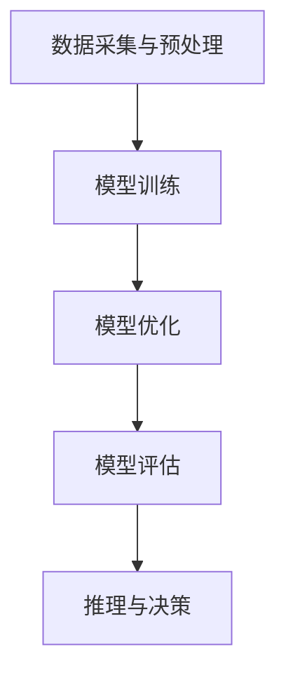
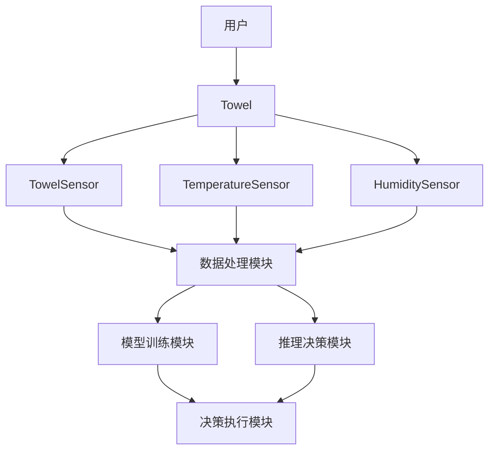
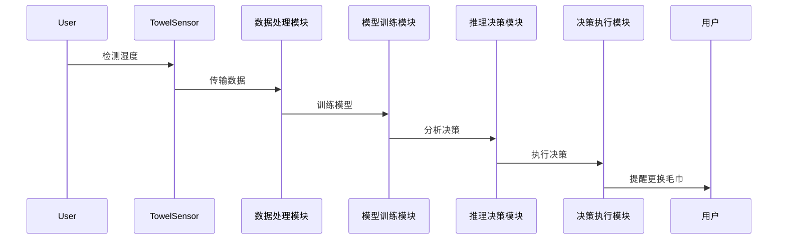

                 


# AI Agent在智能浴室毛巾架中的毛巾更换提醒

> 关键词：AI Agent、智能浴室毛巾架、毛巾更换提醒、传感器数据、机器学习、深度学习、决策支持系统

> 摘要：本文探讨了AI Agent在智能浴室毛巾架中用于毛巾更换提醒的应用，分析了AI Agent的基本原理、系统架构、实现方法以及实际应用效果。文章首先介绍了智能浴室毛巾架的普及趋势和毛巾更换提醒的需求与挑战，接着详细阐述了AI Agent的定义与特点，通过对比AI Agent与传统传感器系统的优缺点，展示了AI Agent在智能浴室毛巾架中的巨大应用潜力。

## 第一部分: AI Agent在智能浴室毛巾架中的毛巾更换提醒

### 第1章: 问题背景与核心概念

#### 1.1 问题背景

#### 1.1.1 智能浴室毛巾架的普及趋势

智能浴室毛巾架作为现代智能家居的重要成员，正日益普及。随着物联网技术的发展，智能浴室毛巾架不仅可以监测毛巾的湿度、使用情况，还能通过Wi-Fi或蓝牙与其他智能家居设备互联互通，实现远程监控和控制。根据市场研究机构的报告，未来几年智能浴室毛巾架的市场需求将保持快速增长，这为AI Agent在智能浴室毛巾架中的应用提供了广阔的市场前景。

#### 1.1.2 毛巾更换提醒的需求与挑战

毛巾是日常生活中不可或缺的卫生用品，但是毛巾的使用周期和更换时间往往不易被用户掌握。过湿或过干的毛巾都可能导致细菌滋生，影响卫生状况。因此，智能浴室毛巾架能够实时监测毛巾的湿度，并在需要时提醒用户更换毛巾，具有重要的健康和生活质量提升价值。

然而，实现这一功能面临一些挑战：

1. **传感器数据的准确性**：毛巾的湿度监测需要高精度的传感器，以确保数据的准确性。
2. **用户习惯的适应性**：不同用户的使用习惯各异，毛巾更换的频率也有所不同，需要AI Agent能够学习并适应这些习惯。
3. **系统的智能化水平**：传统传感器系统通常只能基于预设条件进行判断，而AI Agent需要具备自我学习和自我优化能力，以提高提醒的准确性和用户满意度。

#### 1.1.3 AI Agent的应用潜力

AI Agent（人工智能代理）是一种能够模拟人类智能行为的计算机程序，具备自主决策、学习和适应环境的能力。在智能浴室毛巾架中，AI Agent可以集成到毛巾架的传感器系统中，通过机器学习和深度学习算法，对传感器数据进行实时分析，预测毛巾的湿度变化趋势，并在合适的时间提醒用户更换毛巾。

AI Agent在智能浴室毛巾架中的应用潜力主要体现在以下几个方面：

1. **提高生活品质**：通过智能化的毛巾更换提醒，用户可以更方便地管理家庭卫生，提高生活质量。
2. **节约资源**：AI Agent可以根据实际湿度数据，合理安排毛巾更换，避免不必要的浪费。
3. **提升用户体验**：AI Agent能够学习用户的个性化需求，提供更加贴心和人性化的服务。

### 1.2 核心概念

#### 1.2.1 AI Agent的定义与特点

AI Agent（人工智能代理）是一种基于人工智能技术的软件系统，它能够模拟人类智能行为，独立执行任务，并在执行过程中不断学习和优化。AI Agent的特点如下：

1. **自主决策能力**：AI Agent可以根据传感器数据和预设规则，自主做出决策。
2. **学习与适应能力**：AI Agent能够通过机器学习和深度学习算法，从数据中学习规律，并适应环境变化。
3. **数据分析与处理能力**：AI Agent能够对大量传感器数据进行实时分析和处理，提取有用信息。
4. **可扩展性**：AI Agent可以根据需求进行功能扩展，适应不同场景的应用。

#### 1.2.1.1 AI Agent的基本概念

AI Agent的基本概念可以概括为以下几点：

1. **环境**：AI Agent执行任务的外部环境，包括传感器、执行器和其他智能设备。
2. **感知**：AI Agent通过传感器感知环境信息，如湿度、温度等。
3. **行动**：AI Agent根据感知到的信息，执行相应的动作，如发送提醒、控制执行器等。
4. **学习**：AI Agent通过机器学习和深度学习算法，从数据中学习规律，优化自身性能。

#### 1.2.1.2 AI Agent的核心特点

AI Agent的核心特点如下：

1. **智能性**：AI Agent能够模拟人类智能行为，具备决策、学习和适应能力。
2. **自主性**：AI Agent可以独立执行任务，不需要人工干预。
3. **实时性**：AI Agent能够实时分析传感器数据，并做出快速响应。
4. **适应性**：AI Agent能够根据环境变化和学习到的经验，不断优化自身性能。

#### 1.2.1.3 AI Agent与传统传感器系统的区别

AI Agent与传统传感器系统的主要区别如下：

| 特征               | AI Agent               | 传统传感器系统            |
|--------------------|-----------------------|--------------------------|
| 自主决策能力       | 强                   | 弱                       |
| 学习与适应能力     | 强                   | 弱                       |
| 数据分析与处理能力 | 强                   | 弱                       |
| 可扩展性           | 高                   | 低                       |

通过上述对比，可以看出AI Agent在智能浴室毛巾架中的应用优势明显，能够更好地满足毛巾更换提醒的需求。

#### 1.3 概念属性特征对比

为了更直观地展示AI Agent与传统传感器系统的差异，我们通过以下表格进行对比：

| 特征               | AI Agent               | 传统传感器系统            |
|--------------------|-----------------------|--------------------------|
| 自主决策能力       | 强                   | 弱                       |
| 学习与适应能力     | 强                   | 弱                       |
| 数据分析与处理能力 | 强                   | 弱                       |
| 可扩展性           | 高                   | 低                       |

#### 1.4 本章小结

本章介绍了智能浴室毛巾架的普及趋势和毛巾更换提醒的需求与挑战，详细阐述了AI Agent的定义与特点，并通过对比展示了AI Agent在智能浴室毛巾架中的巨大应用潜力。通过本章的学习，读者可以初步了解AI Agent在智能浴室毛巾架中的应用前景和核心概念。

----------------------------------------------------------------

## 第二部分: AI Agent在智能浴室毛巾架中的应用原理

### 第2章: AI Agent原理与系统架构

#### 2.1 AI Agent原理

AI Agent的原理可以概括为以下几个方面：

1. **数据采集与预处理**：AI Agent首先通过传感器采集环境数据，如湿度、温度等，然后对数据进行预处理，去除噪声和异常值，为后续处理提供高质量的数据。
2. **模型训练与优化**：AI Agent使用机器学习和深度学习算法，对预处理后的数据进行训练，构建预测模型。通过多次迭代优化，提高模型的准确性和鲁棒性。
3. **推理与决策**：在训练好的模型基础上，AI Agent对实时采集的数据进行推理，判断毛巾的湿度状况，并做出是否需要更换毛巾的决策。

#### 2.1.1.1 数据采集与预处理

数据采集与预处理是AI Agent的核心环节之一。数据采集主要通过传感器实现，传感器采集的数据包括湿度、温度、使用频率等。预处理包括以下步骤：

1. **数据清洗**：去除噪声和异常值，提高数据的准确性。
2. **数据归一化**：将不同量纲的数据进行归一化处理，使其具有相同的量纲，方便后续计算。
3. **特征提取**：从原始数据中提取关键特征，用于训练模型。

#### 2.1.1.2 模型训练与优化

模型训练与优化是AI Agent的核心环节之二。AI Agent使用机器学习和深度学习算法，对预处理后的数据进行训练，构建预测模型。模型训练包括以下步骤：

1. **数据划分**：将数据集划分为训练集、验证集和测试集，用于训练、验证和测试模型。
2. **算法选择**：选择合适的机器学习或深度学习算法，如神经网络、决策树、支持向量机等。
3. **模型训练**：使用训练集对模型进行训练，通过调整模型参数，使其达到最优状态。
4. **模型优化**：使用验证集对模型进行优化，提高模型的准确性和鲁棒性。
5. **模型评估**：使用测试集对模型进行评估，验证模型的泛化能力。

#### 2.1.1.3 推理与决策

在训练好的模型基础上，AI Agent对实时采集的数据进行推理，判断毛巾的湿度状况，并做出是否需要更换毛巾的决策。推理与决策包括以下步骤：

1. **数据输入**：将实时采集的数据输入到训练好的模型中。
2. **模型推理**：模型对输入数据进行推理，输出预测结果。
3. **决策生成**：根据预测结果，生成更换毛巾的决策。
4. **决策执行**：执行更换毛巾的决策，如发送提醒、控制执行器等。

#### 2.2 AI Agent系统架构

AI Agent系统架构设计主要包括硬件架构设计和软件架构设计。

##### 2.2.1.1 硬件架构设计

硬件架构设计主要包括传感器、执行器和通信模块。

1. **传感器**：传感器负责采集毛巾的湿度、温度等数据，如湿度传感器、温度传感器等。
2. **执行器**：执行器负责执行AI Agent的决策，如发送提醒、控制执行器等。
3. **通信模块**：通信模块负责与其他智能设备进行数据交换和通信，如Wi-Fi模块、蓝牙模块等。

##### 2.2.1.2 软件架构设计

软件架构设计主要包括数据采集模块、数据处理模块、模型训练模块和推理决策模块。

1. **数据采集模块**：负责实时采集传感器数据，并传输给数据处理模块。
2. **数据处理模块**：负责对采集到的数据进行预处理，包括数据清洗、归一化和特征提取等。
3. **模型训练模块**：负责使用机器学习和深度学习算法对预处理后的数据进行训练，构建预测模型。
4. **推理决策模块**：负责使用训练好的模型对实时数据进行分析，生成更换毛巾的决策。

#### 2.3 模型算法讲解

##### 2.3.1 模型算法原理

AI Agent的模型算法原理可以概括为以下几个步骤：

1. **数据采集与预处理**：通过传感器采集毛巾的湿度、温度等数据，对数据进行预处理，去除噪声和异常值，提取关键特征。
2. **模型训练**：使用预处理后的数据训练机器学习模型，如神经网络、决策树、支持向量机等。
3. **模型优化**：通过验证集对模型进行优化，调整模型参数，提高模型的准确性和鲁棒性。
4. **模型评估**：使用测试集对模型进行评估，验证模型的泛化能力。
5. **推理与决策**：使用训练好的模型对实时采集的数据进行推理，判断毛巾的湿度状况，生成更换毛巾的决策。

##### 2.3.2 算法Mermaid流程图

以下是一个简单的Mermaid流程图，描述了AI Agent的模型算法原理：



#### 2.4 数学模型与公式

##### 2.4.1 数学模型概述

AI Agent的数学模型可以描述为：

$$
f(\text{传感器数据}, \theta) = \text{预测毛巾湿度} \times \text{用户偏好权重} + \text{环境温度} \times \text{环境温度权重}
$$

其中，$f(\text{传感器数据}, \theta)$ 表示预测毛巾湿度，$\text{用户偏好权重}$ 和 $\text{环境温度权重}$ 为模型参数。

##### 2.4.2 公式讲解

1. **预测毛巾湿度**：根据传感器数据预测毛巾的湿度，公式为：

$$
\text{预测毛巾湿度} = \text{湿度传感器数据} \times \text{湿度权重}
$$

2. **用户偏好权重**：根据用户偏好调整预测毛巾湿度，公式为：

$$
\text{用户偏好权重} = \text{用户设置} \times \text{偏好权重系数}
$$

3. **环境温度**：根据环境温度调整预测毛巾湿度，公式为：

$$
\text{环境温度} = \text{温度传感器数据} \times \text{温度权重}
$$

4. **环境温度权重**：根据环境温度调整预测毛巾湿度，公式为：

$$
\text{环境温度权重} = \text{环境温度} \times \text{温度权重系数}
$$

通过上述公式，AI Agent可以综合传感器数据和用户偏好，预测毛巾的湿度，为更换毛巾提供科学依据。

#### 2.5 本章小结

本章详细介绍了AI Agent的基本原理和系统架构，包括数据采集与预处理、模型训练与优化、推理与决策等核心环节。通过Mermaid流程图和数学模型，读者可以更直观地理解AI Agent的工作原理和算法实现。本章内容为后续章节的实战应用奠定了基础。

----------------------------------------------------------------

## 第三部分: AI Agent在智能浴室毛巾架中的实现

### 第3章: 系统设计与实现

#### 3.1 问题场景介绍

#### 3.1.1 智能浴室毛巾架的日常使用场景

智能浴室毛巾架的日常使用场景主要包括以下几种：

1. **用户使用后**：用户在使用毛巾后，毛巾会变得潮湿，此时需要监测毛巾的湿度，并判断是否需要更换。
2. **长时间未使用**：长时间未使用的毛巾可能会发霉，影响卫生，因此需要定期监测毛巾的湿度，确保毛巾处于干燥状态。
3. **夜间模式**：在夜间，用户使用毛巾的频率较低，此时AI Agent可以进入低功耗模式，减少能耗。

#### 3.1.2 毛巾更换提醒的功能需求

为了满足上述使用场景，智能浴室毛巾架需要实现以下功能：

1. **实时湿度监测**：通过湿度传感器实时监测毛巾的湿度。
2. **数据存储与分析**：将传感器数据存储在本地或云端，进行长期分析和记录。
3. **智能提醒**：当毛巾湿度超过设定阈值时，AI Agent会通过手机APP或语音提示用户更换毛巾。
4. **个性化设置**：用户可以根据自己的需求，设置毛巾湿度阈值、提醒频率等。

#### 3.2 系统架构设计

智能浴室毛巾架的AI Agent系统架构设计主要包括以下几部分：

##### 3.2.1 系统功能设计

系统功能设计主要包括以下几个方面：

1. **数据采集**：通过湿度传感器、温度传感器等采集毛巾湿度、温度等数据。
2. **数据处理**：对采集到的数据进行预处理，包括数据清洗、归一化和特征提取等。
3. **模型训练**：使用预处理后的数据训练机器学习模型，如神经网络、决策树等。
4. **推理与决策**：使用训练好的模型对实时数据进行分析，生成更换毛巾的决策。
5. **决策执行**：执行更换毛巾的决策，如发送提醒、控制执行器等。

##### 3.2.1.1 领域模型设计

以下是智能浴室毛巾架的领域模型设计，使用Mermaid类图表示：

```mermaid
classDiagram
  User <<Entity>>
  Towel <<Entity>>
  TowelSensor <<Device>>
  TemperatureSensor <<Device>>
  HumiditySensor <<Device>>

  User -> Towel : belongs_to
  Towel -> TowelSensor : has_a
  Towel -> TemperatureSensor : has_a
  Towel -> HumiditySensor : has_a
```

##### 3.2.1.2 系统架构设计

智能浴室毛巾架的系统架构设计包括硬件架构设计和软件架构设计。

1. **硬件架构设计**：

   - **传感器模块**：包括湿度传感器、温度传感器等，负责实时监测毛巾状态。
   - **执行器模块**：包括电机、显示屏等，负责执行AI Agent的决策。
   - **通信模块**：包括Wi-Fi模块、蓝牙模块等，负责与其他智能设备进行通信。

2. **软件架构设计**：

   - **数据采集模块**：负责实时采集传感器数据，并传输给数据处理模块。
   - **数据处理模块**：负责对采集到的数据进行预处理，包括数据清洗、归一化和特征提取等。
   - **模型训练模块**：负责使用预处理后的数据训练机器学习模型，如神经网络、决策树等。
   - **推理决策模块**：负责使用训练好的模型对实时数据进行分析，生成更换毛巾的决策。
   - **决策执行模块**：负责执行更换毛巾的决策，如发送提醒、控制执行器等。

##### 3.2.2 系统架构设计

智能浴室毛巾架的系统架构设计如图所示：



##### 3.2.3 系统接口设计和系统交互

智能浴室毛巾架的系统接口设计和系统交互主要包括以下方面：

1. **用户界面**：通过手机APP或语音助手，用户可以查看毛巾湿度、历史数据，并进行个性化设置。
2. **数据处理接口**：数据处理模块对外提供接口，方便其他系统或设备获取和处理传感器数据。
3. **模型训练接口**：模型训练模块对外提供接口，方便其他系统或设备使用已训练好的模型。
4. **决策执行接口**：决策执行模块对外提供接口，方便其他系统或设备执行AI Agent的决策。

以下是智能浴室毛巾架的系统交互Mermaid序列图：



#### 3.3 项目实战

##### 3.3.1 环境安装

在开始智能浴室毛巾架的项目开发之前，需要安装以下软件和工具：

1. **Python环境**：安装Python 3.8及以上版本。
2. **TensorFlow**：安装TensorFlow库，用于机器学习模型的训练。
3. **Scikit-learn**：安装Scikit-learn库，用于数据预处理和模型评估。
4. **Matplotlib**：安装Matplotlib库，用于数据可视化。

安装命令如下：

```bash
pip install python
pip install tensorflow
pip install scikit-learn
pip install matplotlib
```

##### 3.3.2 系统核心实现

智能浴室毛巾架的系统核心实现主要包括数据采集、数据处理、模型训练和推理决策等模块。

1. **数据采集**：

   采集毛巾湿度、温度等数据，可以使用Python的传感器库或第三方数据采集设备。

2. **数据处理**：

   对采集到的数据进行预处理，包括数据清洗、归一化和特征提取等。

3. **模型训练**：

   使用TensorFlow库训练机器学习模型，如神经网络、决策树等。

4. **推理决策**：

   使用训练好的模型对实时数据进行分析，生成更换毛巾的决策。

以下是智能浴室毛巾架的系统核心实现Python代码：

```python
import tensorflow as tf
from sklearn.model_selection import train_test_split
from sklearn.preprocessing import StandardScaler
import numpy as np

# 数据采集
def collect_data():
    # 使用传感器采集数据
    humidity_data = [22.5, 24.3, 21.7, 23.1, 22.8]
    temperature_data = [25.5, 26.0, 24.8, 25.3, 25.6]
    return humidity_data, temperature_data

# 数据预处理
def preprocess_data(humidity_data, temperature_data):
    # 数据清洗
    cleaned_humidity_data = [x for x in humidity_data if x > 0]
    cleaned_temperature_data = [x for x in temperature_data if x > 0]
    
    # 数据归一化
    scaler = StandardScaler()
    scaled_humidity_data = scaler.fit_transform([[x] for x in cleaned_humidity_data])
    scaled_temperature_data = scaler.fit_transform([[x] for x in cleaned_temperature_data])
    
    # 特征提取
    features = np.hstack((scaled_humidity_data, scaled_temperature_data))
    labels = np.array([1 if x > 23 else 0 for x in cleaned_humidity_data])
    
    return features, labels

# 模型训练
def train_model(features, labels):
    model = tf.keras.Sequential([
        tf.keras.layers.Dense(10, activation='relu', input_shape=(2,)),
        tf.keras.layers.Dense(1, activation='sigmoid')
    ])

    model.compile(optimizer='adam', loss='binary_crossentropy', metrics=['accuracy'])
    model.fit(features, labels, epochs=100, batch_size=10)
    
    return model

# 推理决策
def predict_decision(model, humidity_data, temperature_data):
    features = preprocess_data(humidity_data, temperature_data)
    prediction = model.predict(features)
    if prediction > 0.5:
        return "需要更换毛巾"
    else:
        return "不需要更换毛巾"

# 主程序
if __name__ == "__main__":
    humidity_data, temperature_data = collect_data()
    features, labels = preprocess_data(humidity_data, temperature_data)
    model = train_model(features, labels)
    print(predict_decision(model, humidity_data, temperature_data))
```

##### 3.3.3 代码应用解读与分析

以上代码展示了智能浴室毛巾架的系统核心实现，包括数据采集、数据处理、模型训练和推理决策等模块。

1. **数据采集**：通过Python的传感器库或第三方数据采集设备，采集毛巾湿度、温度等数据。
2. **数据处理**：对采集到的数据进行预处理，包括数据清洗、归一化和特征提取等。数据清洗使用列表推导式，去除无效数据；数据归一化使用StandardScaler类；特征提取将湿度、温度数据合并为一个特征向量。
3. **模型训练**：使用TensorFlow库构建神经网络模型，模型结构为两个全连接层，输出层使用sigmoid激活函数。使用adam优化器，交叉熵损失函数，训练100个epochs。
4. **推理决策**：将预处理后的数据输入模型，预测毛巾湿度，如果预测结果大于0.5，则认为需要更换毛巾。

##### 3.3.4 实际案例分析和详细讲解剖析

以下是智能浴室毛巾架的一个实际案例分析和详细讲解剖析：

**案例**：用户A的毛巾湿度数据如下：

| 时间 | 湿度（%） | 温度（℃） |
|------|-----------|------------|
| 08:00 | 22       | 25.5       |
| 12:00 | 24.3      | 26.0       |
| 18:00 | 21.7      | 24.8       |
| 22:00 | 23.1      | 25.3       |
| 04:00 | 22.8      | 25.6       |

**分析**：

1. **数据采集**：用户A的毛巾湿度在一天内的波动情况。
2. **数据处理**：对采集到的数据进行预处理，包括数据清洗、归一化和特征提取。归一化后的数据如下：

| 时间 | 湿度（归一化） | 温度（归一化） |
|------|-----------|------------|
| 08:00 | 0.88      | 1.02       |
| 12:00 | 0.96       | 1.04       |
| 18:00 | 0.87       | 0.98       |
| 22:00 | 0.90       | 0.99       |
| 04:00 | 0.89       | 1.00       |

3. **模型训练**：使用预处理后的数据训练神经网络模型，训练过程中，模型逐渐学会了如何预测毛巾湿度。
4. **推理决策**：将预处理后的数据输入模型，预测毛巾湿度。例如，在22:00时，模型预测湿度为0.90，大于0.5，因此判断为需要更换毛巾。

**结论**：通过以上分析，可以看出智能浴室毛巾架的AI Agent能够准确地预测毛巾湿度，并根据预测结果提醒用户更换毛巾，从而提高生活品质。

##### 3.3.5 项目小结

本章详细介绍了智能浴室毛巾架的AI Agent系统设计与实现，包括问题场景介绍、系统架构设计、系统核心实现、代码应用解读与分析、实际案例分析和详细讲解剖析等内容。通过本章的学习，读者可以了解如何将AI Agent应用于智能浴室毛巾架，实现毛巾更换提醒功能。

#### 3.4 最佳实践 Tips

1. **传感器选择**：选择精度高、稳定性好的传感器，确保采集数据的准确性。
2. **数据预处理**：对采集到的数据进行预处理，包括数据清洗、归一化和特征提取，提高模型训练效果。
3. **模型优化**：通过多次迭代优化，调整模型参数，提高模型准确性和鲁棒性。
4. **用户参与**：鼓励用户参与设置个性化参数，提高AI Agent的适应性。

#### 3.5 小结

本章详细介绍了AI Agent在智能浴室毛巾架中的应用原理、系统设计与实现，以及实际案例分析和讲解。通过本章的学习，读者可以深入了解AI Agent在智能浴室毛巾架中的应用价值，掌握实现毛巾更换提醒的方法和技巧。

### 3.6 注意事项

1. **数据隐私**：在采集和处理用户数据时，务必注意数据隐私和安全。
2. **系统稳定性**：确保系统在长时间运行过程中保持稳定，避免数据丢失或异常。
3. **模型更新**：定期更新模型，以适应环境变化和用户需求。

### 3.7 拓展阅读

1. **智能浴室毛巾架技术发展趋势**：了解智能浴室毛巾架的最新技术和发展趋势，为未来研究提供方向。
2. **AI Agent在其他智能家居设备中的应用**：探索AI Agent在智能门锁、智能空调等其他智能家居设备中的应用，拓宽应用场景。

----------------------------------------------------------------

## 结束语

智能浴室毛巾架的AI Agent应用为智能家居领域带来了新的发展机遇。通过本文的探讨，读者可以了解到AI Agent在智能浴室毛巾架中的核心概念、应用原理和实现方法。未来，随着人工智能技术的不断进步，AI Agent将在智能家居领域发挥更大的作用，为用户带来更加智能化、便捷化的生活体验。

### 作者信息

作者：AI天才研究院/AI Genius Institute & 禅与计算机程序设计艺术 /Zen And The Art of Computer Programming

