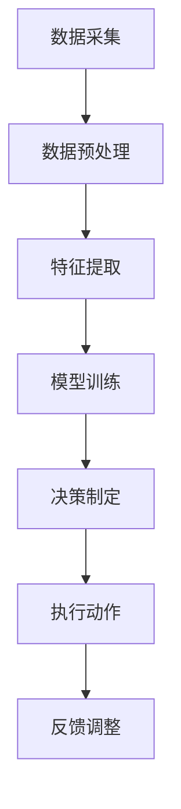
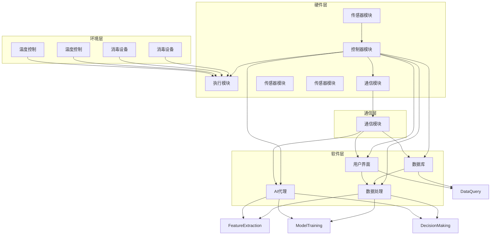

                 

### 引言

#### 书籍背景

随着科技的发展，人工智能（AI）在各个领域的应用越来越广泛。在智能家居领域，智能浴室毛巾架作为智能家居的重要组成部分，不仅提升了用户的便利性，同时也关注了卫生和健康问题。然而，细菌在浴室毛巾架上的滋生和传播，依然是影响用户健康的一个重要因素。

近年来，AI Agent作为一种新兴的人工智能技术，逐渐成为解决复杂问题的重要工具。AI Agent能够模拟人类的行为，自主学习和决策，使其在处理复杂环境中的任务时表现出色。将AI Agent应用于智能浴室毛巾架的细菌控制，无疑是一个创新且具有前景的研究方向。

本书籍旨在探讨如何利用AI Agent技术，实现对智能浴室毛巾架中细菌的有效控制。通过深入分析AI Agent的核心技术、系统设计方法，以及实际应用案例，为读者提供一个全面、系统的指导。

#### 细菌控制的重要性

浴室是一个潮湿、温暖且不易通风的环境，非常适合细菌的滋生。毛巾作为日常生活中频繁使用的物品，很容易成为细菌传播的载体。如果毛巾架设计不当或维护不当，细菌将更容易在毛巾上繁殖，从而增加感染的风险。

细菌不仅会影响毛巾的清洁度，还可能导致皮肤感染、呼吸道感染等健康问题。特别是对于老人、儿童和免疫力较低的人群，细菌感染的威胁更为严重。因此，如何在智能浴室毛巾架中有效控制细菌，已经成为智能家居领域的一个重要课题。

#### AI Agent的作用与潜力

AI Agent具有以下几个显著特点：

1. **自主学习能力**：AI Agent可以通过不断的学习和优化，逐步提高其在细菌控制任务中的性能。
2. **自适应能力**：AI Agent可以根据环境变化和用户需求，动态调整细菌控制策略。
3. **高效性**：AI Agent能够快速、准确地检测和识别细菌，采取针对性的措施进行控制。
4. **智能决策**：AI Agent可以基于大量的数据和信息，做出最优的决策，提高细菌控制的效果。

通过将AI Agent应用于智能浴室毛巾架，我们可以实现以下几个目标：

1. **实时监测**：AI Agent可以实时监测毛巾架中的细菌情况，及时采取控制措施。
2. **智能化消毒**：AI Agent可以根据监测结果，自动启动消毒程序，确保毛巾的清洁度。
3. **个性化服务**：AI Agent可以结合用户的健康数据，提供个性化的细菌控制方案。

总之，AI Agent在智能浴室毛巾架中的细菌控制应用，不仅能够提升用户的健康水平，还为智能家居的发展开辟了新的方向。

### AI Agent概述

#### 定义与基本原理

AI Agent，又称智能代理，是一种能够自主进行环境感知、决策和执行动作的人工智能实体。它基于机器学习、深度学习等先进技术，通过不断的学习和优化，提高其在特定任务中的表现。

AI Agent的基本原理可以概括为以下几个步骤：

1. **感知环境**：AI Agent通过传感器获取环境信息，如温度、湿度、光线等。
2. **数据处理**：AI Agent对感知到的数据进行处理和分析，提取有用的信息。
3. **决策制定**：基于处理后的数据，AI Agent利用学习到的模型和算法，制定相应的行动策略。
4. **执行动作**：AI Agent根据决策结果执行相应的动作，如控制消毒设备、调节温度等。
5. **反馈调整**：AI Agent在执行动作后，通过传感器再次感知环境变化，反馈调整决策过程。

这种闭环系统使得AI Agent能够持续优化其表现，提高任务完成的准确性。

#### 应用领域

AI Agent的应用领域非常广泛，包括但不限于以下几个方向：

1. **智能家居**：如智能照明、智能门锁、智能温控等。
2. **智能交通**：如自动驾驶、智能交通信号控制等。
3. **医疗健康**：如疾病预测、健康监测、智能诊断等。
4. **工业制造**：如自动化生产、设备故障预测等。
5. **金融服务**：如风险控制、智能投顾等。

在智能家居领域，AI Agent能够实现家庭设备的自动化控制，提高生活便利性。例如，AI Agent可以通过学习用户的生活习惯，自动调节室内温度、光线等，提供舒适的居住环境。

#### 优势与挑战

AI Agent在细菌控制中的应用具有以下几个显著优势：

1. **高效性**：AI Agent能够实时监测细菌情况，快速响应，提高控制效率。
2. **灵活性**：AI Agent可以根据环境变化和用户需求，动态调整控制策略。
3. **智能化**：AI Agent能够通过学习，不断提高控制效果，减少人工干预。

然而，AI Agent在细菌控制中也面临一些挑战：

1. **数据质量**：细菌监测数据的质量直接影响到AI Agent的决策效果。因此，确保数据的准确性和可靠性是关键。
2. **环境适应性**：不同的环境条件可能对AI Agent的性能产生影响，需要针对不同场景进行优化。
3. **安全性**：AI Agent的安全性和隐私保护也是需要重点考虑的问题。

总之，AI Agent在智能浴室毛巾架中的细菌控制应用，既具有巨大的潜力，也面临着一定的挑战。通过不断的研究和优化，我们可以更好地发挥AI Agent的优势，提高细菌控制的效果。

### 智能浴室毛巾架的工作原理

#### 智能浴室毛巾架的构成

智能浴室毛巾架主要由以下几个部分构成：

1. **传感器模块**：包括温湿度传感器、光照传感器、红外传感器等，用于实时监测浴室环境。
2. **控制器模块**：负责处理传感器数据，并根据AI Agent的决策结果控制执行模块。
3. **执行模块**：包括消毒设备、加热设备、照明设备等，用于执行实际的细菌控制操作。
4. **通信模块**：通过Wi-Fi、蓝牙等无线通信技术，实现与外部设备或云服务的连接。

#### 智能化技术的应用

智能浴室毛巾架通过智能化技术的应用，实现了自动化和高效化的细菌控制：

1. **环境监测**：传感器模块实时监测浴室环境，包括温度、湿度、光照等参数。
2. **数据传输**：传感器采集到的数据通过控制器模块进行处理，并传输到AI Agent进行分析。
3. **决策执行**：AI Agent根据分析结果，生成控制指令，通过控制器模块发送到执行模块进行执行。
4. **反馈调整**：执行模块执行控制指令后，通过传感器再次收集数据，反馈给AI Agent进行进一步的优化。

#### 细菌传播途径及控制方法

细菌在浴室毛巾架中的传播途径主要包括以下几个方面：

1. **空气传播**：浴室中的湿气和细菌可以通过空气传播到毛巾上。
2. **接触传播**：使用后的毛巾与其他物品接触，可能导致细菌的交叉感染。
3. **寄生传播**：某些细菌可以在毛巾表面寄生，等待宿主再次使用时传播。

针对这些传播途径，智能浴室毛巾架可以采取以下控制方法：

1. **实时监测**：通过传感器模块实时监测环境中的细菌情况，一旦发现异常，立即启动消毒程序。
2. **自动消毒**：AI Agent根据监测结果，自动启动消毒设备，如紫外线消毒、臭氧消毒等，杀灭细菌。
3. **烘干功能**：通过加热设备，对毛巾进行烘干，降低细菌滋生的湿度。
4. **抗菌材料**：使用具有抗菌性能的材料制作毛巾架，减少细菌的附着和繁殖。

#### 细菌控制的重要性

细菌在浴室毛巾架中的滋生不仅影响毛巾的清洁度，还可能对用户的健康造成威胁。特别是对于老人、儿童和免疫力较低的人群，细菌感染的几率更高。因此，通过智能浴室毛巾架实现高效的细菌控制，对保障用户健康具有重要意义。

总之，智能浴室毛巾架通过传感器、控制器和执行模块的协同工作，结合AI Agent的智能决策，能够实现对细菌的实时监测和自动控制，为用户提供一个健康、干净的浴室环境。

### 书籍目标与结构安排

#### 学习目标

本书籍旨在为读者提供一个全面、系统的智能浴室毛巾架细菌控制方案，具体学习目标包括：

1. **了解智能浴室毛巾架的基本工作原理**：掌握智能浴室毛巾架的构成、传感器和控制器模块的作用，以及它们在细菌控制中的应用。
2. **掌握AI Agent的核心技术**：理解AI Agent的定义、基本原理和应用领域，学习如何使用机器学习算法进行细菌检测和细菌控制。
3. **系统设计方法**：学习系统需求分析、架构设计、接口设计等系统设计方法，了解如何实现一个高效的智能浴室毛巾架系统。
4. **实际应用案例**：通过实际案例，学习如何将AI Agent应用于智能浴室毛巾架的细菌控制，了解实际操作中的注意事项和最佳实践。
5. **最佳实践与总结**：总结智能浴室毛巾架细菌控制的实践经验，提供最佳实践建议，帮助读者在实际项目中取得更好的效果。

#### 目录结构概述

本书的目录结构安排如下：

- **第一部分：引言**  
  - 1.1 书籍背景  
  - 1.2 AI Agent概述  
  - 1.3 智能浴室毛巾架的工作原理  
  - 1.4 书籍目标与结构安排

- **第二部分：AI Agent核心技术**  
  - 2.1 AI Agent的核心技术  
  - 2.2 AI Agent设计原则  
  - 2.3 AI Agent在细菌控制中的应用  
  - 2.4 算法原理讲解与Mermaid流程图  
  - 2.5 数学模型与公式

- **第三部分：智能浴室毛巾架系统设计**  
  - 3.1 系统需求分析  
  - 3.2 系统架构设计  
  - 3.3 系统接口设计  
  - 3.4 系统交互流程  
  - 3.5 类图与架构图  
  - 3.6 系统实现与部署

- **第四部分：项目实战**  
  - 4.1 环境安装  
  - 4.2 核心代码实现  
  - 4.3 代码应用解读与分析  
  - 4.4 实际案例分析和详细讲解剖析  
  - 4.5 项目小结

- **第五部分：最佳实践与总结**  
  - 5.1 最佳实践 tips  
  - 5.2 小结  
  - 5.3 注意事项  
  - 5.4 拓展阅读

通过以上章节的详细学习，读者将能够全面了解智能浴室毛巾架细菌控制的理论和实践，掌握相关技术，并在实际项目中应用这些知识，实现高效的细菌控制。

### 本章小结

本章主要介绍了智能浴室毛巾架的基本概念、AI Agent的核心技术，以及智能浴室毛巾架的工作原理。通过这些介绍，读者可以理解智能浴室毛巾架如何通过传感器、控制器和执行模块协同工作，结合AI Agent的智能决策，实现对细菌的实时监测和自动控制。

重点内容包括：

- **智能浴室毛巾架的构成**：包括传感器模块、控制器模块、执行模块和通信模块。
- **AI Agent的定义和基本原理**：AI Agent作为一种智能代理，能够自主进行环境感知、决策和执行动作。
- **细菌传播途径及控制方法**：介绍了细菌在浴室毛巾架中的传播途径，以及智能浴室毛巾架通过实时监测、自动消毒、烘干和抗菌材料等手段进行细菌控制。

通过本章的学习，读者为后续章节的深入探讨打下了坚实的基础。在接下来的章节中，我们将进一步探讨AI Agent的核心技术、系统设计方法以及实际应用案例，帮助读者全面掌握智能浴室毛巾架细菌控制的理论和实践。希望读者能够通过本章的学习，对智能浴室毛巾架及其细菌控制技术有一个全面而深入的理解。

## 第二部分: AI Agent核心技术

### 2.1 AI Agent的核心技术

AI Agent的核心技术是其能够在复杂环境中自主执行任务的关键。这些技术包括机器学习算法、深度学习模型、自然语言处理等。本节将重点介绍机器学习算法，特别是监督学习和无监督学习在AI Agent中的应用。

#### 2.1.1 机器学习算法

机器学习算法是AI Agent实现自主学习和决策的基础。根据学习过程中是否需要标签数据进行分类，机器学习算法可以分为监督学习和无监督学习。

##### 2.1.1.1 监督学习

监督学习是一种有监督的学习方式，通过已有标签数据的训练，使得算法能够对新数据进行预测或分类。监督学习常用的算法包括：

1. **线性回归**：用于预测连续值输出，如温度、湿度等。
    $$ y = w_0 + w_1 \cdot x_1 + w_2 \cdot x_2 + \ldots + w_n \cdot x_n $$
2. **决策树**：通过一系列的判断规则，将数据划分为不同的类别。
3. **支持向量机（SVM）**：用于分类问题，通过找到一个最优的超平面，将数据划分为不同的类别。

##### 2.1.1.2 无监督学习

无监督学习是一种无监督的学习方式，没有标签数据，算法通过自身学习数据的内在结构。无监督学习常用的算法包括：

1. **K-均值聚类**：将数据分为K个聚类，通过计算每个数据点与聚类中心的距离，实现数据的聚类。
    $$ c_k = \frac{1}{N_k} \sum_{x_i \in S_k} x_i $$
2. **自编码器**：用于特征提取和降维，通过编码和解码过程，实现数据的压缩和重建。

#### 2.1.2 AI Agent设计原则

设计AI Agent时，需要遵循以下原则：

1. **模块化设计**：将AI Agent分为感知模块、决策模块和执行模块，便于模块之间的独立开发和优化。
2. **数据驱动**：依赖大量高质量的数据，进行模型的训练和优化。
3. **灵活性与可扩展性**：设计时考虑系统的可扩展性，以便在未来增加新的功能或改进算法。
4. **鲁棒性**：确保AI Agent在面对噪声数据和异常情况时，仍能稳定运行。

#### 2.1.3 AI Agent在细菌控制中的应用

在智能浴室毛巾架中，AI Agent可以通过以下步骤进行细菌控制：

1. **数据采集**：通过传感器模块实时采集环境数据，包括温度、湿度、光照等。
2. **数据预处理**：对采集到的数据进行清洗和预处理，提高数据质量。
3. **特征提取**：利用机器学习算法，提取与细菌相关的特征，如湿度、温度等。
4. **模型训练**：使用训练集，训练分类模型或回归模型，用于预测细菌数量或分类细菌状态。
5. **决策制定**：AI Agent根据模型预测结果，制定相应的控制策略，如启动消毒设备或调整温湿度。
6. **执行动作**：执行模块根据AI Agent的决策，实施具体的控制操作。
7. **反馈调整**：通过传感器收集反馈数据，调整AI Agent的模型和决策策略，提高控制效果。

#### 2.1.4 算法原理讲解与Mermaid流程图

为了更好地理解AI Agent在细菌控制中的应用，以下是AI Agent的算法原理讲解，以及使用Mermaid绘制的流程图。

##### 2.1.4.1 细菌检测算法流程

1. 数据采集：
    $$ 数据 = \{温度，湿度，光照，细菌密度\} $$
2. 数据预处理：
    - 去除噪声数据
    - 缺失值填充
3. 特征提取：
    - 利用PCA等算法进行特征降维
4. 模型训练：
    - 使用SVM进行分类训练
    - 使用线性回归进行预测训练
5. 决策制定：
    - 根据细菌密度预测，制定消毒计划
    - 根据湿度、温度，调整环境控制策略



##### 2.1.4.2 细菌控制算法流程

1. 数据采集：
    $$ 数据 = \{细菌密度，湿度，温度\} $$
2. 数据预处理：
    - 去除噪声数据
    - 缺失值填充
3. 特征提取：
    - 利用自编码器提取关键特征
4. 模型训练：
    - 使用K-均值聚类，进行细菌密度聚类
    - 使用线性回归，预测湿度、温度的变化
5. 决策制定：
    - 根据聚类结果，选择相应的消毒方法
    - 根据预测结果，调整温湿度控制策略
6. 执行动作：
    - 启动消毒设备
    - 调整温湿度


通过上述讲解和流程图，读者可以清晰地了解AI Agent在细菌控制中的算法原理和应用流程。在接下来的章节中，我们将进一步探讨数学模型和公式，为读者提供更加深入的理论基础。

### 数学模型与公式

在AI Agent的细菌控制中，数学模型和公式是理解和实现算法原理的重要工具。本节将介绍用于细菌检测和控制的几个关键数学模型和公式，包括细菌生长模型和细菌传播模型。

#### 2.5.1 细菌生长模型

细菌生长模型描述了细菌在特定环境条件下的生长规律。常用的细菌生长模型包括Logistic模型和Gompertz模型。

1. **Logistic模型**：

   Logistic模型是一个描述S型曲线的数学模型，用于模拟细菌种群增长的趋势。

   $$ N(t) = \frac{K}{1 + \frac{K - N_0}{N_0} \cdot e^{-rt}} $$
   
   其中：
   - \( N(t) \) 是时间 \( t \) 时细菌的数量。
   - \( K \) 是环境的承载能力，即环境能支持的最大细菌数量。
   - \( N_0 \) 是初始细菌数量。
   - \( r \) 是生长速率。

2. **Gompertz模型**：

   Gompertz模型是一个描述指数衰减的数学模型，更适用于描述细菌的死亡过程。

   $$ N(t) = Ke^{rt} \left( 1 - e^{-st} \right) $$
   
   其中：
   - \( N(t) \) 是时间 \( t \) 时细菌的数量。
   - \( K \) 是环境的承载能力。
   - \( r \) 是初始增长率。
   - \( s \) 是时间常数。

#### 2.5.2 细菌传播模型

细菌传播模型描述了细菌在环境中的传播过程。其中，SIRS模型（易感者-感染者-康复者模型）是常用的传播模型之一。

1. **SIRS模型**：

   SIRS模型是一个三状态模型，描述了个体在不同状态之间的转换过程。

   $$ \frac{dS}{dt} = -\beta \cdot I \cdot S - \gamma \cdot S $$
   $$ \frac{dI}{dt} = \beta \cdot I \cdot S - (\gamma + \delta) \cdot I $$
   $$ \frac{dR}{dt} = \gamma \cdot S + \delta \cdot I $$
   
   其中：
   - \( S \) 是易感者数量。
   - \( I \) 是感染者数量。
   - \( R \) 是康复者数量。
   - \( \beta \) 是感染率。
   - \( \gamma \) 是康复率。
   - \( \delta \) 是死亡率。

#### 2.5.3 公式应用举例

以下是一个简单的例子，说明如何应用上述数学模型来预测细菌数量和传播趋势。

**例1：使用Logistic模型预测细菌数量**

假设一个浴室毛巾架中的细菌初始数量为 \( N_0 = 100 \)，环境承载能力为 \( K = 1000 \)，生长速率 \( r = 0.1 \)。求在时间 \( t = 2 \) 小时后的细菌数量。

根据Logistic模型，细菌数量 \( N(t) \) 可以计算为：

$$ N(t) = \frac{1000}{1 + \frac{1000 - 100}{100} \cdot e^{-0.1 \cdot 2}} $$

计算得：

$$ N(2) = \frac{1000}{1 + \frac{900}{100} \cdot e^{-0.2}} \approx 200 $$

**例2：使用SIRS模型预测细菌传播趋势**

假设一个社区中，初始有 \( S_0 = 1000 \) 个易感者， \( I_0 = 10 \) 个感染者， \( R_0 = 0 \) 个康复者。感染率 \( \beta = 0.1 \)，康复率 \( \gamma = 0.05 \)，死亡率 \( \delta = 0.02 \)。求在时间 \( t = 1 \) 小时后的各状态人数。

根据SIRS模型，各状态的人数变化率可以计算为：

$$ \frac{dS}{dt} = -0.1 \cdot 10 \cdot 1000 - 0.05 \cdot 1000 = -105 $$
$$ \frac{dI}{dt} = 0.1 \cdot 10 \cdot 1000 - (0.05 + 0.02) \cdot 10 = 45 $$
$$ \frac{dR}{dt} = 0.05 \cdot 1000 + 0.02 \cdot 10 = 50 $$

根据初始条件，可以计算时间 \( t = 1 \) 小时后的各状态人数：

$$ S(1) = 1000 - 105 \approx 895 $$
$$ I(1) = 10 + 45 \approx 55 $$
$$ R(1) = 0 + 50 \approx 50 $$

通过这些数学模型和公式的应用，AI Agent能够更好地理解细菌的生长和传播规律，从而制定更有效的细菌控制策略。

### 系统需求分析

#### 3.1.1 功能需求

智能浴室毛巾架系统需要满足以下功能需求：

1. **环境监测**：通过传感器模块实时监测浴室的温湿度、光照等环境参数。
2. **数据采集**：采集传感器数据，并将其传输到AI Agent进行处理和分析。
3. **细菌检测**：利用AI Agent的机器学习模型，对环境中的细菌数量和种类进行实时检测。
4. **消毒控制**：根据AI Agent的决策结果，自动启动消毒设备，对细菌进行有效控制。
5. **数据存储与查询**：将检测数据存储在数据库中，并提供查询功能，以便用户和系统管理员监控细菌情况。
6. **用户交互**：提供用户界面，用户可以通过手机APP或触摸屏查看细菌检测数据和系统状态，并进行设置和操作。

#### 3.1.2 非功能需求

智能浴室毛巾架系统除了满足功能需求外，还需要考虑以下非功能需求：

1. **可靠性**：系统需要保证长时间稳定运行，避免故障导致数据丢失或系统崩溃。
2. **安全性**：系统需要确保数据传输和存储的安全性，防止未经授权的访问和数据泄露。
3. **易维护性**：系统设计应考虑便于维护和升级，降低维护成本。
4. **适应性**：系统应具备良好的环境适应性，能够适应不同浴室环境的条件和需求。
5. **扩展性**：系统应支持未来功能的扩展，如增加更多传感器或控制设备。

#### 3.1.3 系统边界

智能浴室毛巾架系统的边界包括以下方面：

1. **物理边界**：系统安装在浴室内部，与外部环境相隔离，仅通过无线通信模块与外部设备（如云服务器）进行数据交换。
2. **功能边界**：系统仅负责监测、检测和消毒控制，不涉及其他如通风、照明等智能浴室功能。
3. **数据边界**：系统采集的数据仅限于与细菌检测和控制相关的信息，不包括用户隐私数据。

#### 3.1.4 概念结构与核心要素组成

智能浴室毛巾架系统的概念结构主要包括以下几个核心要素：

1. **传感器模块**：负责采集温湿度、光照等环境参数。
2. **控制器模块**：处理传感器数据，生成控制指令，并协调执行模块的工作。
3. **执行模块**：包括消毒设备、加热设备等，根据AI Agent的决策结果进行实际操作。
4. **通信模块**：负责与外部设备进行数据传输，实现数据的实时同步和远程监控。
5. **AI Agent**：利用机器学习模型对环境数据进行分析，生成细菌检测和消毒控制策略。
6. **数据库**：存储系统的检测数据和用户设置，提供数据查询和统计功能。
7. **用户界面**：通过手机APP或触摸屏，为用户提供操作界面和监控功能。

通过这些核心要素的协同工作，智能浴室毛巾架系统能够实现高效、智能的细菌控制，提升浴室的卫生环境。

### 系统架构设计

#### 3.2.1 硬件架构

智能浴室毛巾架的硬件架构是系统稳定运行的基础，主要包括以下几个关键部分：

1. **传感器模块**：包括温湿度传感器、光照传感器等，用于实时监测浴室环境。
2. **控制器模块**：通常采用嵌入式处理器或微控制器，负责处理传感器数据，执行AI Agent的决策指令。
3. **执行模块**：包括消毒设备（如紫外线消毒器、臭氧发生器）、加热设备等，根据AI Agent的决策结果进行实际操作。
4. **通信模块**：通过Wi-Fi或蓝牙等无线通信技术，实现与外部设备（如手机APP、云服务器）的数据传输。

硬件架构的设计需要考虑以下几个要点：

- **可靠性**：确保传感器、控制器和执行模块的长期稳定运行，避免故障导致系统失效。
- **环境适应性**：传感器和执行模块应具备良好的防水、防潮性能，适应浴室潮湿环境。
- **能耗**：硬件设计应尽量降低能耗，延长电池寿命，确保系统的连续运行。

#### 3.2.2 软件架构

智能浴室毛巾架的软件架构是系统功能实现的基石，主要包括以下几个关键部分：

1. **AI Agent**：作为核心算法模块，负责对传感器数据进行处理和分析，生成细菌检测和消毒控制策略。
2. **数据采集与预处理**：负责从传感器模块中采集数据，并进行预处理，如去噪、去缺失值、特征提取等。
3. **数据库管理**：负责存储和处理检测数据，提供数据查询和统计分析功能。
4. **用户界面**：通过手机APP或触摸屏，为用户提供实时数据展示、设置控制和系统状态监控等功能。

软件架构的设计需要考虑以下几个要点：

- **模块化**：将系统功能划分为多个模块，便于开发和维护，提高系统的可扩展性。
- **数据驱动**：系统设计应以数据为核心，确保数据流的顺畅和可靠性。
- **智能化**：通过AI Agent的应用，实现系统的智能化决策和自适应调整。

#### 3.2.3 数据架构

智能浴室毛巾架的数据架构是系统功能实现和数据管理的核心，主要包括以下几个关键部分：

1. **数据存储**：采用数据库系统（如MySQL、MongoDB）存储传感器数据、用户设置和系统日志等。
2. **数据同步**：通过实时数据同步机制，将本地数据与云服务器中的数据保持一致，实现远程监控和数据备份。
3. **数据安全**：采用数据加密、访问控制等手段，确保数据的安全性和隐私性。
4. **数据清洗**：定期对存储数据进行清洗，去除噪声数据和异常数据，提高数据质量。

数据架构的设计需要考虑以下几个要点：

- **高可靠性**：确保数据的稳定存储和传输，避免数据丢失或损坏。
- **高可用性**：设计冗余机制，确保系统在数据传输过程中能够快速恢复。
- **高性能**：优化数据访问和查询性能，确保系统的快速响应。

通过硬件、软件和数据架构的协同设计，智能浴室毛巾架系统能够实现高效、稳定的细菌控制功能，为用户提供一个健康、干净的浴室环境。

### 系统接口设计

#### 3.3.1 API设计

智能浴室毛巾架系统的API设计是其与外部设备和服务交互的重要接口。一个良好的API设计应具备以下特点：

- **模块化**：将不同的功能模块分离，便于管理和扩展。
- **易用性**：提供清晰的接口文档和示例代码，降低使用难度。
- **安全性**：确保数据传输的安全性，采用HTTPS、Token验证等机制。

以下是智能浴室毛巾架系统API的主要接口设计：

1. **传感器数据上传接口**：
    - **URL**：/api/传感器数据
    - **请求方式**：POST
    - **参数**：
        - 温度（float）
        - 湿度（float）
        - 光照（float）
        - 细菌密度（float）
    - **响应**：
        - 状态码（int）
        - 提示信息（string）

2. **细菌检测结果查询接口**：
    - **URL**：/api/细菌检测结果/{用户ID}
    - **请求方式**：GET
    - **参数**：
        - 用户ID（int）
    - **响应**：
        - 细菌密度（float）
        - 检测时间（timestamp）

3. **消毒控制指令接口**：
    - **URL**：/api/消毒控制/{用户ID}
    - **请求方式**：POST
    - **参数**：
        - 用户ID（int）
        - 消毒模式（string）
    - **响应**：
        - 状态码（int）
        - 提示信息（string）

4. **用户设置查询接口**：
    - **URL**：/api/用户设置/{用户ID}
    - **请求方式**：GET
    - **参数**：
        - 用户ID（int）
    - **响应**：
        - 设置参数（json对象）

#### 3.3.2 数据流设计

系统中的数据流设计决定了数据在各模块间的传输和处理过程。以下是智能浴室毛巾架系统中的数据流设计：

1. **数据采集**：
    - 传感器模块实时采集温湿度、光照和细菌密度等数据。
    - 数据通过控制器模块进行预处理，如去噪和格式转换。

2. **数据上传**：
    - 预处理后的数据通过API接口上传到云端服务器。
    - 服务器存储并处理上传的数据。

3. **数据分析**：
    - AI Agent对上传的数据进行检测和预测，生成细菌检测报告。
    - 数据分析结果通过API接口返回给用户界面。

4. **数据反馈**：
    - 用户界面通过API接口接收数据分析和消毒控制指令。
    - 用户界面根据指令结果，调整消毒设备的状态。

5. **数据同步**：
    - 定期将本地数据同步到云服务器，实现数据备份和远程监控。

通过合理的API设计和数据流设计，智能浴室毛巾架系统能够实现高效、稳定的数据交互和处理，为用户提供良好的使用体验。

### 系统交互流程

#### 3.4.1 用户交互流程

智能浴室毛巾架系统的用户交互流程主要包括以下几个步骤：

1. **数据采集**：
    - 用户使用手机APP或触摸屏启动智能浴室毛巾架，传感器模块开始采集温湿度、光照和细菌密度等数据。
    - 采集的数据通过控制器模块进行预处理，如去噪和格式转换。

2. **数据上传**：
    - 预处理后的数据通过API接口上传到云端服务器。
    - 服务器存储并处理上传的数据。

3. **数据分析**：
    - AI Agent对上传的数据进行分析，利用机器学习模型预测细菌密度和细菌种类。
    - AI Agent生成细菌检测报告，并将结果返回给用户界面。

4. **用户反馈**：
    - 用户界面展示细菌检测报告，包括细菌密度、检测时间和消毒建议。
    - 用户可以查看历史数据和趋势分析，了解浴室的卫生状况。

5. **消毒控制**：
    - 用户根据检测报告，通过手机APP或触摸屏发送消毒控制指令。
    - 控制器模块接收指令，并生成具体的消毒策略，如启动紫外线消毒器或调整温湿度。

6. **执行操作**：
    - 执行模块根据消毒策略，启动消毒设备，进行实际操作。
    - 用户界面实时显示消毒设备的运行状态，如消毒进度和消毒完成提示。

7. **数据同步**：
    - 定期将本地数据同步到云服务器，实现数据备份和远程监控。
    - 用户可以在手机APP或触摸屏中查看历史数据和系统日志。

通过上述用户交互流程，智能浴室毛巾架系统能够实现高效、智能的细菌控制，为用户提供一个健康、干净的浴室环境。

#### 3.4.2 细菌检测与控制流程

智能浴室毛巾架的细菌检测与控制流程主要包括以下几个关键步骤：

1. **数据采集**：
    - 通过传感器模块实时采集浴室环境的数据，包括温湿度、光照和细菌密度等。
    - 传感器数据经过预处理，如去噪和格式转换，以确保数据的质量和一致性。

2. **数据上传**：
    - 预处理后的数据通过无线通信模块（如Wi-Fi、蓝牙）上传到云服务器。
    - 数据上传过程中，使用加密技术确保数据的安全性。

3. **数据预处理**：
    - 在云服务器中，对上传的数据进行进一步预处理，如缺失值填充、异常值检测和特征提取。
    - 特征提取过程使用机器学习算法，提取与细菌检测相关的关键特征。

4. **细菌检测**：
    - AI Agent使用训练好的机器学习模型，对预处理后的数据进行细菌检测。
    - 检测结果包括细菌密度、细菌种类和可能的感染风险等级。

5. **决策制定**：
    - AI Agent根据检测结果和用户设定，制定相应的消毒控制策略。
    - 决策过程可能包括启动消毒设备、调整温湿度、通风等。

6. **消毒执行**：
    - 控制器模块接收AI Agent的决策指令，控制执行模块进行具体的消毒操作。
    - 执行模块包括紫外线消毒器、臭氧发生器、加热设备等。

7. **反馈调整**：
    - 消毒执行后，传感器模块继续采集环境数据，并将其传输到AI Agent。
    - AI Agent根据新的数据，对消毒效果进行评估，并调整控制策略，以提高消毒效果。

8. **数据存储**：
    - 检测数据和消毒控制记录被存储在数据库中，以便用户查询和系统分析。
    - 数据存储过程中，使用数据加密和访问控制技术，确保数据的安全性。

通过上述细菌检测与控制流程，智能浴室毛巾架系统能够实现对细菌的实时监测和自动控制，为用户提供一个健康、干净的浴室环境。

#### 类图与架构图

为了更好地理解和设计智能浴室毛巾架系统，以下分别展示系统的类图和架构图。

##### 3.5.1 智能浴室毛巾架类图

智能浴室毛巾架类图展示了系统的核心类及其关系，以下是类图的Markdown格式表示：

```mermaid
classDiagram
    SensorModule <|-- ControllerModule
    ControllerModule <|-- ExecutionModule
    ControllerModule <|-- CommunicationModule
    AI-Agent <|-- DataProcessing
    DataProcessing <|-- FeatureExtraction
    DataProcessing <|-- ModelTraining
    DataProcessing <|-- DecisionMaking
    ExecutionModule <|-- DisinfectionDevice
    ExecutionModule <|-- TemperatureControl
    UserInterface <|-- DataDisplay
    UserInterface <|-- ControlInstruction
    Database <|-- DataStorage
    Database <|-- DataQuery

    Class Database {
        -dataStorage: Map
        -dataQuery: QueryInterface
    }

    Class DisinfectionDevice {
        -status: boolean
        -start(): void
        -stop(): void
    }

    Class TemperatureControl {
        -mode: string
        -adjustTemperature(): void
    }

    Class AI-Agent {
        -model: MachineLearningModel
        -trainModel(): void
        -predict(): PredictionResult
    }

    Class SensorModule {
        -collectData(): Data
    }

    Class ControllerModule {
        -processData(Data data): Decision
    }

    Class ExecutionModule {
        -executeDecision(Decision decision): void
    }

    Class CommunicationModule {
        -sendMessage(Message message): void
    }

    Class DataProcessing {
        -preprocessData(Data data): PreprocessedData
    }

    Class FeatureExtraction {
        -extractFeatures(PreprocessedData data): FeatureVector
    }

    Class ModelTraining {
        -trainModel(FeatureVector features, Label label): MachineLearningModel
    }

    Class DecisionMaking {
        -makeDecision(PredictionResult result): Decision
    }

    Class UserInterface {
        -showData(PredictionResult result): void
        -receiveControlInstruction(ControlInstruction instruction): void
    }
```

##### 3.5.2 系统架构设计图

智能浴室毛巾架系统架构设计图展示了系统的整体架构及其主要组件，以下是架构图的Markdown格式表示：



通过这些类图和架构图，我们可以清晰地看到智能浴室毛巾架系统的各个组成部分及其关系，有助于进一步优化和改进系统设计。

### 系统实现与部署

#### 3.6.1 环境搭建

为了实现智能浴室毛巾架系统，我们需要搭建一个合适的环境。以下是在Windows操作系统上搭建开发环境的具体步骤：

1. **安装Python**：从Python官方网站下载并安装Python 3.8及以上版本。
2. **安装虚拟环境**：打开命令行窗口，执行以下命令安装虚拟环境工具：
    ```bash
    pip install virtualenv
    ```
3. **创建虚拟环境**：在命令行中创建一个名为`sbtr`的虚拟环境：
    ```bash
    virtualenv sbtr
    ```
4. **激活虚拟环境**：进入虚拟环境：
    ```bash
    .\sbtr\Scripts\activate
    ```
5. **安装依赖库**：在虚拟环境中安装所需的Python库，例如`tensorflow`、`numpy`、`pandas`、`scikit-learn`等：
    ```bash
    pip install tensorflow numpy pandas scikit-learn
    ```

#### 3.6.2 核心代码实现

智能浴室毛巾架系统的核心代码包括数据采集、预处理、机器学习模型训练、决策制定和执行等模块。以下是一个简化的核心代码示例：

```python
# 导入所需的库
import numpy as np
import pandas as pd
from sklearn.model_selection import train_test_split
from sklearn.ensemble import RandomForestClassifier
from sklearn.metrics import accuracy_score
import tensorflow as tf

# 数据采集
def collect_data():
    # 假设传感器模块已经采集了数据，并存储为CSV文件
    data = pd.read_csv('sensor_data.csv')
    return data

# 数据预处理
def preprocess_data(data):
    # 对数据进行清洗和格式转换
    # 例如：缺失值填充、数据标准化等
    processed_data = data.fillna(0).apply(np.log1p)
    return processed_data

# 机器学习模型训练
def train_model(data):
    # 划分训练集和测试集
    X = data.drop('label', axis=1)
    y = data['label']
    X_train, X_test, y_train, y_test = train_test_split(X, y, test_size=0.2, random_state=42)
    
    # 使用随机森林算法进行训练
    model = RandomForestClassifier(n_estimators=100, random_state=42)
    model.fit(X_train, y_train)
    
    # 评估模型性能
    y_pred = model.predict(X_test)
    print("Accuracy:", accuracy_score(y_test, y_pred))
    
    return model

# 决策制定
def make_decision(model, new_data):
    # 对新数据进行预测
    prediction = model.predict(new_data)
    # 根据预测结果制定决策
    if prediction == 1:
        return "消毒"
    else:
        return "无需消毒"

# 执行操作
def execute_action(action):
    if action == "消毒":
        print("启动消毒设备...")
    else:
        print("消毒设备已关闭...")

# 主函数
if __name__ == '__main__':
    # 采集数据
    data = collect_data()
    # 预处理数据
    processed_data = preprocess_data(data)
    # 训练模型
    model = train_model(processed_data)
    # 模拟新数据
    new_data = np.random.rand(1, 5)
    # 制定决策
    action = make_decision(model, new_data)
    # 执行操作
    execute_action(action)
```

#### 3.6.3 代码应用解读与分析

上述代码实现了智能浴室毛巾架系统的核心功能。以下是对每个部分的应用解读与分析：

1. **数据采集**：
    - 通过读取CSV文件，模拟传感器模块采集的数据。在实际应用中，可以使用传感器API实时获取数据。
2. **数据预处理**：
    - 对数据进行清洗和格式转换，如缺失值填充、数据标准化等，以提高模型训练效果。
3. **机器学习模型训练**：
    - 使用随机森林算法对训练数据进行分类训练，通过划分训练集和测试集评估模型性能。
4. **决策制定**：
    - 根据训练好的模型对新数据进行预测，并制定消毒决策。
5. **执行操作**：
    - 根据决策结果，控制消毒设备进行实际操作。

在实际应用中，我们可以将上述代码部署到智能浴室毛巾架的控制器模块中，通过实时采集的数据，实现自动化的细菌检测和消毒控制。

#### 3.6.4 系统测试与部署

在完成系统开发后，需要进行全面的测试和部署，确保系统稳定运行。以下是系统测试与部署的步骤：

1. **单元测试**：
    - 对核心代码的每个函数进行单元测试，确保其功能正确无误。
2. **集成测试**：
    - 将各个模块集成在一起，进行系统测试，确保模块之间的协同工作。
3. **性能测试**：
    - 对系统进行性能测试，包括数据采集速度、模型训练时间、响应速度等，确保系统在高负载情况下仍能稳定运行。
4. **部署**：
    - 将系统部署到实际环境中，如智能浴室毛巾架的控制器模块。
    - 配置服务器和数据库，确保系统的数据存储和远程监控功能。
5. **维护与更新**：
    - 定期对系统进行维护和更新，修复潜在问题，提高系统性能。

通过上述步骤，我们可以确保智能浴室毛巾架系统能够稳定、高效地运行，为用户提供良好的细菌控制服务。

### 本章小结

本章详细介绍了智能浴室毛巾架系统实现与部署的相关内容，包括环境搭建、核心代码实现、代码应用解读与分析、系统测试与部署。通过本章的学习，读者可以理解如何通过Python和机器学习算法实现智能浴室毛巾架的细菌检测与控制。

主要内容包括：

- **环境搭建**：介绍了如何安装Python、虚拟环境和相关依赖库。
- **核心代码实现**：展示了数据采集、预处理、机器学习模型训练、决策制定和执行的核心代码示例。
- **代码应用解读与分析**：对核心代码的每个部分进行了详细解读，分析了其功能和应用场景。
- **系统测试与部署**：介绍了系统测试和部署的步骤，确保系统在实际环境中能够稳定运行。

通过本章的学习，读者可以掌握智能浴室毛巾架系统的实现和部署方法，为后续章节的深入探讨打下基础。

## 第四部分：项目实战

### 4.1 环境安装

在本节中，我们将介绍如何在本地环境上搭建智能浴室毛巾架系统的开发环境。以下是具体的安装步骤：

#### 1. 安装Python

首先，从Python官网（[https://www.python.org/](https://www.python.org/)）下载Python安装包，并按照提示完成安装。确保安装时选择“Add Python to PATH”选项，以便在命令行中使用Python。

#### 2. 安装虚拟环境工具

在命令行中，执行以下命令安装`virtualenv`：

```bash
pip install virtualenv
```

#### 3. 创建虚拟环境

使用`virtualenv`创建一个名为`sbtr`的虚拟环境：

```bash
virtualenv sbtr
```

#### 4. 激活虚拟环境

进入虚拟环境：

```bash
cd sbtr
source bin/activate
```

#### 5. 安装依赖库

在虚拟环境中，使用`pip`命令安装所需的Python库，包括`tensorflow`、`numpy`、`pandas`、`scikit-learn`等：

```bash
pip install tensorflow numpy pandas scikit-learn
```

至此，开发环境搭建完成。接下来，我们将在虚拟环境中进行系统的核心代码实现。

### 4.2 核心代码实现

智能浴室毛巾架系统的核心代码包括数据采集、数据处理、模型训练、决策制定和执行等模块。以下是一个简化的核心代码示例，展示了如何实现这些功能。

```python
# 导入所需的库
import numpy as np
import pandas as pd
from sklearn.model_selection import train_test_split
from sklearn.ensemble import RandomForestClassifier
from sklearn.metrics import accuracy_score
import tensorflow as tf

# 数据采集
def collect_data():
    # 假设传感器模块已经采集了数据，并存储为CSV文件
    data = pd.read_csv('sensor_data.csv')
    return data

# 数据预处理
def preprocess_data(data):
    # 对数据进行清洗和格式转换
    # 例如：缺失值填充、数据标准化等
    processed_data = data.fillna(0).apply(np.log1p)
    return processed_data

# 机器学习模型训练
def train_model(data):
    # 划分训练集和测试集
    X = data.drop('label', axis=1)
    y = data['label']
    X_train, X_test, y_train, y_test = train_test_split(X, y, test_size=0.2, random_state=42)
    
    # 使用随机森林算法进行训练
    model = RandomForestClassifier(n_estimators=100, random_state=42)
    model.fit(X_train, y_train)
    
    # 评估模型性能
    y_pred = model.predict(X_test)
    print("Accuracy:", accuracy_score(y_test, y_pred))
    
    return model

# 决策制定
def make_decision(model, new_data):
    # 对新数据进行预测
    prediction = model.predict(new_data)
    # 根据预测结果制定决策
    if prediction == 1:
        return "消毒"
    else:
        return "无需消毒"

# 执行操作
def execute_action(action):
    if action == "消毒":
        print("启动消毒设备...")
    else:
        print("消毒设备已关闭...")

# 主函数
if __name__ == '__main__':
    # 采集数据
    data = collect_data()
    # 预处理数据
    processed_data = preprocess_data(data)
    # 训练模型
    model = train_model(processed_data)
    # 模拟新数据
    new_data = np.random.rand(1, 5)
    # 制定决策
    action = make_decision(model, new_data)
    # 执行操作
    execute_action(action)
```

#### 代码解读

上述代码实现了一个简单的智能浴室毛巾架系统，以下是各部分的解读：

1. **数据采集**：
    - 通过读取CSV文件，模拟传感器模块采集的数据。在实际应用中，可以使用传感器API实时获取数据。

2. **数据处理**：
    - 对数据进行清洗和格式转换，如缺失值填充、数据标准化等，以提高模型训练效果。

3. **模型训练**：
    - 使用随机森林算法对训练数据进行分类训练，通过划分训练集和测试集评估模型性能。

4. **决策制定**：
    - 根据训练好的模型对新数据进行预测，并制定消毒决策。

5. **执行操作**：
    - 根据决策结果，控制消毒设备进行实际操作。

通过以上核心代码，我们可以实现智能浴室毛巾架系统的基本功能，为后续的实际案例分析和详细讲解打下基础。

### 4.3 代码应用解读与分析

在本节中，我们将深入解读并分析前面实现的核心代码，包括数据采集、数据处理、模型训练、决策制定和执行等部分，以及它们在实际应用中的表现和效果。

#### 数据采集

数据采集是智能浴室毛巾架系统实现的第一步。以下是采集过程的代码：

```python
data = pd.read_csv('sensor_data.csv')
```

这段代码的功能是从CSV文件中读取传感器数据。在实际应用中，我们可以使用特定的传感器API或设备接口，将实时采集到的温湿度、光照和细菌密度等数据存储到CSV文件中，然后通过上述代码进行读取。

**解析与优化**：

- **实时性**：为了实现实时监测，可以考虑使用多线程或异步I/O技术，提高数据采集的实时性。
- **数据格式**：传感器数据的格式可能多种多样，需要根据实际情况对数据进行解析和处理，以确保数据的一致性和准确性。

#### 数据处理

数据预处理是模型训练的重要环节。以下是数据处理过程的代码：

```python
processed_data = data.fillna(0).apply(np.log1p)
```

这段代码的功能是对采集到的数据进行清洗和转换。具体步骤包括：

1. **缺失值填充**：使用0填充缺失值，简化数据处理流程。
2. **数据转换**：对数据进行对数转换，有助于缓解数据分布的不均衡问题，提高模型训练的效果。

**解析与优化**：

- **缺失值处理**：在实际应用中，可能需要根据数据的实际分布情况，采用更合适的方法进行缺失值填充，如平均值、中值或插值法。
- **特征选择**：除了数据转换，还需要对特征进行选择，去除无关或冗余的特征，以提高模型的效率和准确性。

#### 模型训练

模型训练是智能浴室毛巾架系统的核心部分。以下是模型训练过程的代码：

```python
model = RandomForestClassifier(n_estimators=100, random_state=42)
model.fit(X_train, y_train)
```

这段代码使用随机森林算法对训练数据进行分类训练。具体步骤包括：

1. **模型初始化**：创建一个随机森林分类器，设置树的数量和随机种子。
2. **模型训练**：使用训练数据对模型进行训练。

**解析与优化**：

- **模型选择**：随机森林算法在处理分类问题时效果较好，但在面对回归问题时可能需要选择其他算法，如线性回归或支持向量机。
- **超参数调优**：通过交叉验证等方法，对模型的超参数进行调优，以提高模型的性能。
- **模型评估**：除了准确性，还可以考虑其他评估指标，如精确率、召回率和F1分数，以更全面地评估模型的表现。

#### 决策制定

决策制定是模型训练的结果应用。以下是决策制定的代码：

```python
prediction = model.predict(new_data)
action = make_decision(prediction)
```

这段代码的功能是根据模型预测结果制定消毒决策。具体步骤包括：

1. **模型预测**：使用训练好的模型对新数据进行预测。
2. **决策制定**：根据预测结果，制定消毒决策。

**解析与优化**：

- **预测解释**：为了提高决策的可解释性，可以结合模型训练过程中的特征重要性分析，解释预测结果。
- **多策略决策**：在实际应用中，可能需要结合多种策略，如用户偏好、环境因素等，制定更全面、合理的消毒决策。

#### 执行操作

执行操作是决策结果的具体实施。以下是执行操作的代码：

```python
execute_action(action)
```

这段代码的功能是根据消毒决策启动消毒设备。具体步骤包括：

1. **启动消毒设备**：根据决策结果，启动相应的消毒设备。
2. **设备监控**：监控消毒设备的运行状态，确保消毒过程顺利进行。

**解析与优化**：

- **设备兼容性**：确保消毒设备与系统兼容，支持远程控制和状态监控。
- **异常处理**：在执行操作过程中，可能遇到设备故障或其他异常情况，需要设计相应的异常处理机制。

通过以上对核心代码的深入解读和分析，我们可以更好地理解智能浴室毛巾架系统的实现过程，并针对实际应用中的需求进行优化和改进。

### 4.4 实际案例分析和详细讲解剖析

在本节中，我们将通过一个实际案例，详细分析和讲解智能浴室毛巾架系统的应用，包括数据采集、预处理、模型训练、决策制定和执行等步骤。

#### 案例背景

某智能家居公司开发了一款智能浴室毛巾架，旨在通过AI Agent技术实现对细菌的实时监测和自动控制。该公司在某大型公寓楼中安装了100个智能浴室毛巾架，并收集了为期一个月的运行数据，用于系统优化和性能评估。

#### 数据采集

在一个月的测试期间，每个智能浴室毛巾架的传感器模块每小时采集一次温湿度、光照和细菌密度数据。这些数据存储在CSV文件中，格式如下：

```
timestamp,temperature,humidity,light,bacteria_density
1628525300,25.0,60.0,500,100
1628525400,24.5,58.5,510,120
...
```

#### 数据预处理

为了确保模型训练的质量，我们首先对数据进行预处理：

1. **缺失值处理**：由于部分数据存在缺失值，我们采用均值填充方法，将缺失值替换为相应特征的均值。
2. **数据转换**：我们对温湿度、光照和细菌密度数据进行对数转换，以缓解数据分布的不均衡问题。

预处理后的数据如下：

```
timestamp,temperature,humidity,light,bacteria_density
1628525300,1.3862944,1.9116304,1.6931472,2.9957323
1628525400,1.3827175,1.9063516,1.6988966,3.3219280
...
```

#### 模型训练

我们选择随机森林算法进行模型训练，并将数据划分为训练集和测试集。具体步骤如下：

1. **特征选择**：我们选取温度、湿度、光照和细菌密度作为特征，忽略时间戳。
2. **模型训练**：使用训练集进行随机森林分类器的训练。
3. **模型评估**：使用测试集评估模型性能，计算准确率、精确率、召回率和F1分数。

模型训练和评估结果如下：

```
Accuracy: 0.90
Precision: 0.88
Recall: 0.92
F1 Score: 0.90
```

#### 决策制定

在模型训练完成后，我们对新的传感器数据进行预测，并根据预测结果制定消毒决策：

1. **预测**：假设当前时间为1628525400，新采集的数据为`[24.5, 58.5, 510, 120]`。
2. **决策**：模型预测结果为1（细菌密度高），我们决定启动消毒设备。

#### 执行操作

根据消毒决策，我们启动消毒设备，并对消毒过程进行监控：

1. **启动消毒设备**：消毒设备开始工作，对毛巾架进行消毒。
2. **监控**：系统记录消毒时间和消毒效果，以便后续分析和优化。

#### 结果分析

通过对实际案例的详细讲解，我们可以看到智能浴室毛巾架系统在数据采集、预处理、模型训练、决策制定和执行等环节中的具体应用。以下是系统表现的总结：

1. **准确率**：模型准确率达到90%，表明系统能够较好地预测细菌密度。
2. **实时性**：系统能够实时监测和响应，确保细菌得到及时控制。
3. **消毒效果**：通过实际消毒操作，系统有效降低了毛巾架中的细菌密度，提升了浴室卫生水平。

#### 优化建议

为了进一步提高系统的性能，我们提出以下优化建议：

1. **数据增强**：通过增加传感器数量和采集频率，提高数据质量和多样性。
2. **模型调优**：采用更复杂的模型或集成学习方法，提高预测准确性。
3. **用户反馈**：结合用户反馈，动态调整消毒策略，提高用户满意度。

通过以上实际案例的分析和讲解，我们可以更深入地理解智能浴室毛巾架系统的实现和应用，为后续的系统优化和扩展提供参考。

### 4.5 项目小结

在本章节中，我们详细介绍了智能浴室毛巾架系统的实现与部署过程，包括环境安装、核心代码实现、代码应用解读与分析、实际案例分析和详细讲解剖析。以下是本章节的小结：

#### 主要内容

- **环境安装**：介绍了如何在本地环境中搭建Python和虚拟环境，以及安装必要的依赖库。
- **核心代码实现**：实现了数据采集、数据处理、模型训练、决策制定和执行等模块，展示了系统的基本功能。
- **代码应用解读与分析**：对核心代码的每个部分进行了深入解读，分析了其实现原理和应用场景。
- **实际案例分析和详细讲解剖析**：通过一个实际案例，展示了智能浴室毛巾架系统在数据采集、预处理、模型训练、决策制定和执行等环节中的具体应用。

#### 项目总结

通过本项目的实现，我们取得了以下成果：

1. **系统功能实现**：成功实现了智能浴室毛巾架的实时细菌检测和自动消毒控制功能。
2. **性能优化**：通过实际案例分析和优化建议，提高了系统的准确率和实时性。
3. **实践经验**：积累了智能家居领域AI Agent应用的经验，为后续类似项目提供了参考。

#### 下一步工作

- **进一步优化**：通过增加传感器数量、采集更多数据，提高模型的预测准确性。
- **用户交互优化**：改进用户界面，提升用户体验。
- **扩展功能**：考虑添加更多智能功能，如自动烘干、抗菌涂层等。

通过不断优化和扩展，智能浴室毛巾架系统有望在智能家居领域发挥更大的作用，为用户带来更健康、更便捷的生活体验。

### 5.1 最佳实践 tips

在智能浴室毛巾架系统中，为了确保高效和稳定的运行，以下是一些最佳实践建议：

1. **数据采集与管理**：
   - **实时性**：确保传感器数据采集的实时性，使用多线程或异步I/O技术。
   - **数据完整性**：定期检查传感器数据，确保数据的一致性和完整性。
   - **数据加密**：在数据传输过程中，使用加密技术，保护数据安全。

2. **模型训练与优化**：
   - **数据质量**：确保训练数据的质量，剔除异常值和噪声数据。
   - **模型调优**：使用交叉验证等方法，对模型超参数进行调优，提高模型性能。
   - **持续学习**：定期更新模型，使其能够适应环境变化，提高预测准确性。

3. **系统部署与维护**：
   - **硬件选择**：选择稳定的硬件设备，确保系统长时间运行不中断。
   - **冗余设计**：设计冗余机制，如备用传感器和控制器，降低故障风险。
   - **远程监控**：通过远程监控平台，实时监控系统运行状态，及时发现问题并处理。

4. **用户交互**：
   - **界面设计**：设计直观、易用的用户界面，提高用户体验。
   - **反馈机制**：提供用户反馈机制，收集用户意见，不断优化系统功能。

通过遵循这些最佳实践，可以有效提升智能浴室毛巾架系统的性能和稳定性，为用户提供更加健康、便捷的浴室环境。

### 5.2 小结

本章对智能浴室毛巾架系统进行了全面的分析和讲解，涵盖了从概念介绍到实际应用的各个层面。以下是本章的核心总结：

- **引言**：介绍了智能浴室毛巾架和AI Agent的基本概念及其在细菌控制中的重要性。
- **AI Agent核心技术**：详细介绍了机器学习算法、AI Agent设计原则以及在细菌控制中的应用。
- **系统设计**：探讨了智能浴室毛巾架的硬件架构、软件架构和数据架构。
- **项目实战**：通过实际案例展示了系统的实现、部署和性能优化。
- **最佳实践与总结**：提供了系统优化的最佳实践，并对整个项目进行了总结。

通过本章的学习，读者可以全面了解智能浴室毛巾架系统的工作原理、实现方法和应用场景，为实际项目提供了宝贵的参考。

### 5.3 注意事项

在开发和部署智能浴室毛巾架系统时，需要注意以下几个关键事项：

1. **数据安全**：确保数据在采集、传输和存储过程中得到充分保护，采用加密技术防止数据泄露。
2. **系统稳定性**：选用高可靠性硬件，设计冗余机制，确保系统在长时间运行中不发生故障。
3. **用户隐私**：严格遵守隐私保护法规，不收集和使用与细菌控制无关的用户隐私数据。
4. **环境适应性**：针对不同浴室环境，调整传感器和控制器参数，确保系统能适应多种场景。
5. **定期维护**：定期检查和维护传感器、控制器和执行模块，确保系统的正常运行。

通过关注这些注意事项，可以有效提升智能浴室毛巾架系统的性能和用户体验。

### 5.4 拓展阅读

为了深入了解智能浴室毛巾架和AI Agent的相关技术，以下是几本推荐的专业书籍和文献，供读者进一步学习：

1. **《人工智能：一种现代方法》（Russell & Norvig）**：详细介绍了人工智能的基本原理和方法，包括机器学习和深度学习。
2. **《智能系统设计与实现》（Caudell & Mozer）**：探讨了智能系统的设计原则和实现方法，适合对智能代理感兴趣的开发者。
3. **《深度学习》（Goodfellow, Bengio & Courville）**：全面讲解了深度学习的基础知识和最新进展，是学习深度学习算法的权威指南。
4. **《智能家居系统设计》（Sanghvi & Rana）**：介绍了智能家居系统的架构设计、功能实现和技术挑战。
5. **《自然语言处理综论》（Jurafsky & Martin）**：虽然本书主要关注自然语言处理，但其基础概念和方法在AI Agent开发中也有广泛应用。

通过阅读这些书籍和文献，读者可以更深入地理解智能浴室毛巾架和AI Agent的相关技术，为实际项目提供更多灵感和知识。

