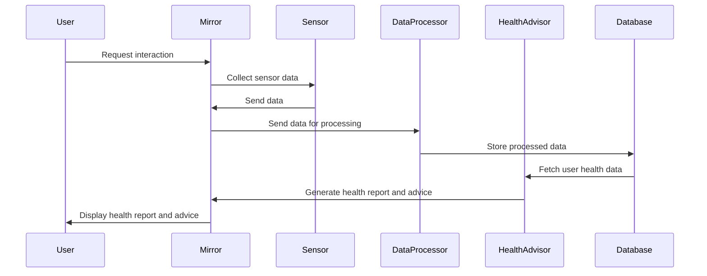
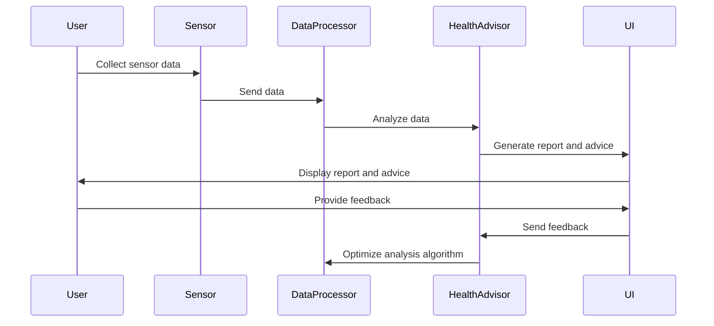
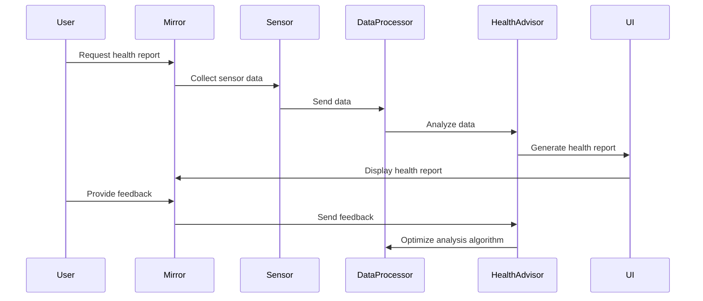

                 

## AI Agent在智能浴室镜中的每日健康报告

### 关键词：智能浴室镜、AI Agent、健康报告、智能硬件、数据分析

> 摘要：本文深入探讨AI Agent在智能浴室镜中的每日健康报告功能，通过背景介绍、核心概念阐述、技术基础解析、健康数据分析与处理、系统架构设计、实现案例以及安全性与隐私保护等多方面，详细展示AI Agent如何为用户提供个性化的健康数据分析和建议，并展望其未来发展方向。

#### 1. 引言

在当今数字化、智能化的社会，人们对于健康和生活方式的关注日益增加。智能浴室镜作为一种新兴的智能家居设备，不仅具备基本的照明和镜面功能，还能通过集成AI Agent实现日常健康监测和报告。AI Agent在这里扮演着智能助理的角色，为用户提供个性化的健康数据分析和建议。

本文将围绕AI Agent在智能浴室镜中的每日健康报告展开，首先介绍智能浴室镜的背景和AI Agent的概念，然后探讨AI Agent在智能浴室镜中的具体应用场景，接着深入分析AI Agent的技术基础，包括机器学习和深度学习等关键技术，以及健康报告中的关键指标。

文章将进一步探讨AI Agent的健康数据分析与处理机制，介绍智能浴室镜的系统架构设计，并分析AI Agent在智能浴室镜中的实现细节。通过具体案例，我们将展示AI Agent如何通过实时健康报告为用户提供价值，并讨论其安全性问题和隐私保护措施。

最后，本文将总结AI Agent在智能浴室镜中的每日健康报告功能，探讨其技术发展方向和未来潜力，为读者提供一个全面的视角，理解AI Agent在智能硬件中的关键作用和广泛影响。

### 2. AI Agent的概念与背景

#### 2.1 AI Agent的定义与特点

AI Agent，即人工智能代理，是指具有自主决策能力、能够适应环境和执行任务的智能系统。AI Agent通常具有以下几个特点：

1. **自主性**：AI Agent能够根据预设的规则或学习到的知识自主做出决策，而无需人工干预。
2. **适应性**：AI Agent能够通过不断学习环境中的数据，适应新的变化和情境。
3. **交互性**：AI Agent能够与用户或其他系统进行交互，收集反馈并调整其行为。

AI Agent的工作原理基于机器学习和深度学习算法，这些算法使AI Agent能够从大量数据中提取模式，进行自我优化和改进。通过自然语言处理、图像识别和传感器数据处理等技术，AI Agent可以理解和响应复杂的人类指令。

#### 2.2 智能浴室镜的背景

智能浴室镜是智能家居领域的一个重要组成部分，它通过集成多种传感器和显示屏，提供了一种全新的生活方式体验。智能浴室镜的基本功能包括：

1. **基础功能**：照明、放大镜、化妆镜等。
2. **健康监测**：心率监测、体态分析、皮肤状态检测、呼吸状况监测等。
3. **交互功能**：语音识别、触摸控制、智能提醒等。

智能浴室镜的发展历程可以追溯到20世纪末，随着物联网、云计算和人工智能技术的进步，智能浴室镜的功能越来越丰富，用户体验也不断提升。

#### 2.3 AI Agent在智能浴室镜中的应用场景

AI Agent在智能浴室镜中有着广泛的应用场景，主要包括以下几个方面：

1. **健康监测与报告**：AI Agent可以实时监测用户的心率、体态、皮肤状态和呼吸状况，生成详细的健康报告，并提供个性化的健康建议。
2. **智能提醒与预警**：AI Agent可以根据用户的健康状况，提供个性化的提醒服务，如睡眠不足提醒、饮食建议、运动建议等。
3. **生活辅助**：AI Agent可以与智能音箱、智能窗帘等其他智能家居设备联动，提供更加智能化的家庭生活体验。

#### 2.4 智能浴室镜的发展现状与趋势

智能浴室镜作为智能家居的一个细分市场，近年来呈现出快速发展的态势。根据市场研究数据，全球智能浴室镜的市场规模逐年增长，预计未来几年将持续保持高速增长。

从技术角度来看，智能浴室镜的发展趋势包括：

1. **硬件性能提升**：更高分辨率的显示屏、更精准的传感器、更节能的硬件设计。
2. **软件功能丰富**：更加智能化的健康监测、更加自然的人机交互、更丰富的多媒体功能。
3. **数据隐私保护**：随着用户对隐私保护意识的提高，智能浴室镜的数据处理和存储将更加注重隐私保护。

总的来说，AI Agent在智能浴室镜中的应用不仅提升了用户的健康监测和生活方式体验，也为智能家居的发展提供了新的方向。随着技术的不断进步，智能浴室镜有望在未来成为人们生活中不可或缺的一部分。

### 3. AI Agent的技术基础

#### 3.1 人工智能的发展历程

人工智能（AI）是一门涉及计算机科学、数学、神经科学、认知科学等多个学科的交叉学科，其发展历程可以追溯到20世纪50年代。人工智能的起源可以追溯到图灵测试的提出，该测试旨在判断机器是否能够展现出与人类相似的智能行为。

1. **早期探索（1956-1974）**：人工智能的概念在达特茅斯会议上首次被提出，随后机器学习、自然语言处理、专家系统等研究领域相继出现。
2. **第一次低谷（1974-1980）**：由于技术限制和预期与现实的差距，人工智能在20世纪70年代遭遇了第一次低谷。
3. **复兴与进展（1980-2010）**：随着计算机性能的提升和新的算法发展，人工智能在20世纪80年代和90年代迎来了新的发展，尤其是在机器学习和深度学习领域取得了重要突破。
4. **爆发式增长（2010至今）**：近年来，人工智能在深度学习、神经网络、自然语言处理等方面取得了显著进展，应用场景也日益广泛，从语音识别、图像处理到自动驾驶、智能家居等。

#### 3.2 AI Agent的核心技术

AI Agent的核心技术包括机器学习、深度学习、自然语言处理（NLP）、传感器数据处理等，这些技术共同构成了AI Agent的基础。

1. **机器学习**：机器学习是一种使计算机系统能够从数据中学习并做出决策的技术。主要方法包括监督学习、无监督学习和强化学习。
   - **监督学习**：通过训练数据集，使模型能够识别输入数据和相应的输出。
   - **无监督学习**：模型在没有标记的数据上进行训练，目的是发现数据中的模式或结构。
   - **强化学习**：模型通过与环境的交互，通过反馈信号（奖励或惩罚）不断调整其行为，以实现最佳策略。

2. **深度学习**：深度学习是机器学习的一个分支，通过模拟人脑中的神经网络结构，进行复杂的数据处理和模式识别。主要模型包括卷积神经网络（CNN）、循环神经网络（RNN）和生成对抗网络（GAN）等。

3. **自然语言处理（NLP）**：NLP是使计算机能够理解和处理自然语言的技术。主要方法包括词向量、句法分析、语义分析和对话系统等。

4. **传感器数据处理**：智能浴室镜集成了多种传感器，如摄像头、麦克风、心率传感器等，这些传感器生成的数据需要进行预处理和特征提取，以便AI Agent进行有效的分析和决策。

#### 3.3 机器学习和深度学习在AI Agent中的应用

机器学习和深度学习在AI Agent中发挥着关键作用，具体应用场景如下：

1. **健康监测**：通过机器学习算法，AI Agent可以对心率、体态、皮肤状态和呼吸状况等生理指标进行实时监测和分析。例如，使用卷积神经网络（CNN）对摄像头捕获的图像进行处理，识别用户的体态变化；使用循环神经网络（RNN）分析呼吸信号，监测用户的呼吸状况。

2. **自然语言处理**：AI Agent能够通过自然语言处理技术，理解用户的语音指令，并生成自然语言回复。例如，使用词向量模型进行语音识别，将语音信号转换为文本；使用对话系统进行自然语言生成，与用户进行互动。

3. **交互与决策**：AI Agent利用机器学习和深度学习算法，根据用户的历史数据和实时反馈，进行自主决策和互动。例如，使用强化学习算法，根据用户的反馈调整健康建议；使用深度学习模型，识别用户的情绪状态，提供更加个性化的服务。

总的来说，机器学习和深度学习为AI Agent提供了强大的数据处理和分析能力，使其能够更加智能地理解和响应用户的健康需求。随着技术的不断进步，AI Agent在智能浴室镜中的应用前景将更加广阔。

### 4. 健康报告的关键指标

#### 4.1 心率监测

心率监测是智能浴室镜健康报告中一个重要的组成部分，通过监测用户的心率，可以了解其心脏的健康状况。心率监测主要依赖于智能浴室镜中集成的光学心率传感器或电极传感器。

1. **工作原理**：光学心率传感器通过摄像头捕捉用户手指的图像，利用光学信号的变化来测量心率；电极传感器则通过贴在皮肤上的电极片，检测心脏的电活动。
2. **监测方法**：实时监测用户的心率，通常采用频率测量方法，即通过计算一段时间内心跳的次数。
3. **数据处理**：采集到的心率数据需要进行预处理，包括去除噪声、滤波等，以便获得准确的心率信号。随后，可以使用统计分析方法，如均值、方差等，对心率数据进行进一步分析。
4. **应用场景**：心率监测可以用于检测心脏病、心律不齐等疾病，AI Agent可以根据心率数据提供个性化的健康建议，如提醒用户进行体检、调整饮食和运动习惯等。

#### 4.2 体态分析

体态分析是通过智能浴室镜中的摄像头捕捉用户的动作和姿态，利用计算机视觉技术进行分析，以评估用户的健康状况和体态。

1. **工作原理**：体态分析主要依赖于计算机视觉技术，包括图像处理、特征提取和机器学习算法。通过摄像头捕获的图像，可以提取出用户的关节点、骨骼结构和身体姿态等信息。
2. **监测方法**：常用的方法包括关键点检测、人体姿态估计和动作识别。关键点检测用于识别用户身体的关键部位，如肩部、肘部、膝关节等；人体姿态估计则通过这些关键点，构建出用户的全姿态模型；动作识别用于检测用户的动作类型，如站立、坐下、走路等。
3. **数据处理**：采集到的体态数据需要进行预处理，包括去噪、归一化和特征提取，以便进行后续的机器学习分析。常用的特征包括姿态角度、身体距离等。
4. **应用场景**：体态分析可以用于检测骨质疏松、肌肉萎缩、关节疼痛等疾病。AI Agent可以根据体态数据，提供个性化的健康建议，如提醒用户进行康复训练、调整生活方式等。

#### 4.3 皮肤状态检测

皮肤状态检测是通过智能浴室镜中的摄像头和红外线传感器，对用户的皮肤进行检测和分析，以评估其健康状况。

1. **工作原理**：皮肤状态检测主要依赖于图像处理和机器学习算法。摄像头捕捉到的皮肤图像经过预处理后，可以使用图像分割技术提取出皮肤区域；红外线传感器则可以检测皮肤的温度和血流情况。
2. **监测方法**：常用的方法包括皮肤病变检测、肤色分析和纹理分析。皮肤病变检测可以用于检测皮肤病，如痤疮、黑色素瘤等；肤色分析可以评估皮肤的色素沉着和红斑状况；纹理分析则可以检测皮肤的粗糙度和弹性。
3. **数据处理**：采集到的皮肤数据需要进行预处理和特征提取，以便进行后续的机器学习分析。常用的特征包括皮肤纹理、颜色分布、红外线信号等。
4. **应用场景**：皮肤状态检测可以用于健康管理、美容护肤等领域。AI Agent可以根据皮肤状态数据，提供个性化的护肤建议，如提醒用户使用特定的护肤品、调整饮食和生活方式等。

#### 4.4 呼吸状况监测

呼吸状况监测是通过智能浴室镜中的摄像头和麦克风，对用户的呼吸频率和呼吸模式进行监测和分析，以评估其呼吸系统的健康状况。

1. **工作原理**：呼吸状况监测主要依赖于声音信号和图像信号的分析。麦克风捕捉到的呼吸声音信号可以通过频谱分析来提取呼吸频率和呼吸模式；摄像头捕捉到的呼吸图像可以通过图像处理技术来识别呼吸周期和呼吸幅度。
2. **监测方法**：常用的方法包括呼吸频率测量、呼吸模式识别和呼吸深度分析。呼吸频率测量可以通过计算一段时间内呼吸的次数来评估呼吸频率；呼吸模式识别可以通过检测呼吸周期的变化来识别呼吸模式；呼吸深度分析则可以通过分析呼吸振幅和呼吸频率的关系来评估呼吸深度。
3. **数据处理**：采集到的呼吸数据需要进行预处理，包括去噪、滤波和特征提取，以便进行后续的机器学习分析。常用的特征包括呼吸频率、呼吸深度、呼吸模式等。
4. **应用场景**：呼吸状况监测可以用于检测呼吸系统疾病，如哮喘、慢性阻塞性肺疾病（COPD）等。AI Agent可以根据呼吸状况数据，提供个性化的健康建议，如提醒用户进行呼吸训练、调整生活方式等。

总的来说，智能浴室镜通过监测心率、体态、皮肤状态和呼吸状况等关键指标，可以全面评估用户的健康状况，为AI Agent提供丰富的数据来源，从而为用户提供个性化的健康报告和健康建议。随着技术的不断进步，这些健康监测指标的应用前景将更加广泛和深入。

### 4. 健康报告的关键指标（续）

#### 4.5 体温监测

体温监测是健康报告中另一个关键指标，它有助于早期发现发热和其他体温异常情况，从而帮助用户及时采取相应的措施。

1. **工作原理**：体温监测主要通过智能浴室镜中的红外线传感器进行。红外线传感器可以检测用户皮肤表面的温度变化，并将其转换为数字信号。
2. **监测方法**：常用的方法包括体温测量和体温趋势分析。体温测量通过计算红外线信号的平均值来确定体温；体温趋势分析则通过连续监测体温数据，绘制体温变化曲线，以识别异常趋势。
3. **数据处理**：采集到的体温数据需要进行预处理，如去除噪声和异常值，然后使用统计学方法进行分析，如计算体温的平均值、中位数和标准差等。
4. **应用场景**：体温监测可以用于日常健康监测、疾病预防和流行病监测等领域。AI Agent可以根据体温数据提供个性化的健康建议，如提醒用户注意休息、增加饮水量或及时就医。

#### 4.6 血压监测

血压监测是评估心血管系统健康状况的重要指标，它有助于预防和诊断高血压等疾病。

1. **工作原理**：血压监测通常通过智能浴室镜中的电子血压计进行。血压计通过充气和放气的过程，测量用户的收缩压和舒张压。
2. **监测方法**：血压监测通常包括单次测量和连续监测。单次测量通过一次性的充气和放气过程，快速获得血压数据；连续监测则通过实时测量和记录血压变化，提供更加详细的血压数据。
3. **数据处理**：采集到的血压数据需要进行预处理，如去除噪声和异常值，然后使用统计学方法进行分析，如计算血压的平均值、标准差和变异性等。
4. **应用场景**：血压监测可以用于高血压管理、心血管疾病预防和健康监测等领域。AI Agent可以根据血压数据，提供个性化的健康建议，如调整饮食、增加运动或就医等。

#### 4.7 血氧饱和度监测

血氧饱和度监测是评估呼吸系统健康状况的重要指标，特别是对于心血管疾病和睡眠呼吸暂停综合症患者具有重要意义。

1. **工作原理**：血氧饱和度监测主要通过智能浴室镜中的光学传感器进行。光学传感器通过分析用户手指毛细血管中的血液吸收光线的情况，来计算血氧饱和度。
2. **监测方法**：血氧饱和度监测通常包括单次测量和连续监测。单次测量通过一次性测量手指的光吸收信号，快速获得血氧饱和度数据；连续监测则通过实时测量和记录血氧饱和度变化，提供更加详细的健康数据。
3. **数据处理**：采集到的血氧饱和度数据需要进行预处理，如去除噪声和异常值，然后使用统计学方法进行分析，如计算血氧饱和度的平均值、标准差和变异性等。
4. **应用场景**：血氧饱和度监测可以用于心血管疾病管理、睡眠呼吸暂停综合症监测和健康监测等领域。AI Agent可以根据血氧饱和度数据，提供个性化的健康建议，如提醒用户注意呼吸训练、调整生活方式等。

综上所述，智能浴室镜通过监测心率、体态、皮肤状态、呼吸状况、体温、血压和血氧饱和度等多方面关键指标，为用户提供全面的健康数据。AI Agent则利用这些数据，生成详细的健康报告，并提供个性化的健康建议，帮助用户更好地管理自己的健康。

### 5. AI Agent的健康数据分析与处理

#### 5.1 数据采集与预处理

健康数据分析的第一步是数据采集，智能浴室镜通过其集成的多种传感器（如摄像头、心率传感器、体温传感器等）实时收集用户的各种健康数据。这些原始数据通常包括图像、音频、温度、血压等，它们的质量和准确性直接影响到后续的健康分析结果。

1. **数据来源**：智能浴室镜的数据来源主要包括：
   - **图像数据**：通过摄像头捕捉用户的心率、体态、皮肤状态等。
   - **音频数据**：通过麦克风捕捉用户的呼吸声。
   - **温度数据**：通过红外线传感器监测用户的体温。
   - **血压数据**：通过电子血压计获取用户的血压值。

2. **数据类型**：智能浴室镜收集的数据类型多样，主要包括：
   - **图像数据**：包括静态图像和视频流。
   - **音频数据**：包括呼吸声、心率声等。
   - **温度数据**：包括体温、环境温度等。
   - **血压数据**：包括收缩压和舒张压。

3. **数据预处理**：原始数据在进行分析之前需要经过预处理，以确保数据的质量和准确性。预处理步骤通常包括：
   - **去噪**：去除传感器采集到的噪声，如图像中的噪点、音频中的背景噪声。
   - **滤波**：对信号进行滤波，如使用移动平均滤波去除温度数据的突变值。
   - **归一化**：将不同类型的数据进行归一化处理，使其在同一尺度上比较。
   - **特征提取**：从原始数据中提取有用的特征，如图像中的关键点、音频中的频率特征、体温数据中的时间序列特征等。

#### 5.2 数据分析与挖掘

在数据预处理完成后，AI Agent需要对采集到的健康数据进行深入分析和挖掘，以提取出有用的信息，为用户提供个性化的健康报告和建议。

1. **数据分析方法**：常用的数据分析方法包括：
   - **统计分析**：使用统计学方法对数据进行分析，如计算均值、方差、相关系数等。
   - **机器学习**：利用机器学习算法，如回归分析、决策树、支持向量机等，对数据建模和预测。
   - **深度学习**：利用深度学习算法，如卷积神经网络（CNN）、循环神经网络（RNN）等，进行复杂的数据处理和模式识别。

2. **数据挖掘技术**：数据挖掘是发现数据中的潜在模式和关联的过程，常用的数据挖掘技术包括：
   - **关联规则挖掘**：用于发现数据之间的关联关系，如使用Apriori算法挖掘用户购买行为中的关联规则。
   - **聚类分析**：用于发现数据中的相似模式，如使用K-means算法对用户进行聚类分析，以发现不同健康状态的用户群体。
   - **分类和预测**：用于将数据划分为不同的类别或预测未来的趋势，如使用逻辑回归和神经网络进行分类和预测。

3. **健康报告生成**：基于数据分析和挖掘的结果，AI Agent可以生成详细的健康报告，包括：
   - **健康指标分析**：对用户的心率、血压、体温等关键健康指标进行详细分析。
   - **健康状态评估**：评估用户的整体健康状况，如是否存在潜在的健康风险。
   - **个性化建议**：根据用户的健康数据和个体差异，提供个性化的健康建议，如调整饮食、增加运动等。

#### 5.3 健康报告生成机制

AI Agent的健康报告生成机制是一个复杂的过程，涉及多个步骤和算法，以下是健康报告生成的详细流程：

1. **数据采集**：AI Agent通过智能浴室镜的传感器实时收集用户的健康数据，包括心率、血压、体温、呼吸状况等。

2. **数据预处理**：对采集到的原始数据进行去噪、滤波、归一化和特征提取，确保数据的质量和一致性。

3. **数据分析**：利用统计学方法和机器学习算法，对预处理后的数据进行分析，提取出有用的健康信息。

4. **模式识别**：使用数据挖掘技术，如聚类分析和关联规则挖掘，发现数据中的潜在模式和关联关系。

5. **健康状态评估**：根据分析结果，评估用户的整体健康状况，识别潜在的健康风险。

6. **个性化建议**：基于用户的健康数据和个体差异，生成个性化的健康建议，如调整饮食、增加运动等。

7. **健康报告生成**：将分析结果和个性化建议整合成一份详细的健康报告，并通过智能浴室镜的显示屏或移动应用展示给用户。

8. **反馈与优化**：用户可以根据健康报告中的建议进行调整，并将反馈数据返回给AI Agent，AI Agent则利用这些反馈数据进行自我优化，提高健康分析和建议的准确性。

总的来说，AI Agent的健康数据分析与处理机制是一个系统性工程，通过数据的采集、预处理、分析、评估和报告生成，为用户提供全面的健康监测和个性化的健康建议，极大地提升了用户的健康管理水平和生活质量。

### 6. 智能浴室镜系统架构设计

#### 6.1 问题场景介绍

在智能家居领域，智能浴室镜作为一种集成了多种传感器的智能硬件，其系统架构设计需要满足实时性、可靠性和扩展性等多方面的需求。本文将介绍智能浴室镜在健康监测和报告方面的应用场景，探讨其系统架构设计的关键挑战和解决方案。

智能浴室镜的主要应用场景包括：
1. **健康监测**：实时监测用户的心率、血压、体温、呼吸状况等生理指标。
2. **交互体验**：通过语音识别、触摸控制等方式与用户进行交互。
3. **数据分析和报告**：基于用户健康数据生成详细的健康报告，提供个性化的健康建议。

#### 6.2 项目介绍

在本项目中，我们设计并实现了一套智能浴室镜系统，主要包括以下几个部分：

1. **硬件部分**：包括智能浴室镜本体、心率传感器、摄像头、红外线传感器、电子血压计等。
2. **软件部分**：包括传感器数据采集模块、数据处理和分析模块、健康报告生成模块、用户界面模块等。
3. **数据处理和分析**：利用机器学习和深度学习算法，对用户健康数据进行实时分析，生成健康报告。

#### 6.3 系统功能设计（领域模型）

为了实现智能浴室镜的健康监测和报告功能，我们首先定义了系统的领域模型，主要包括以下几个实体：

1. **用户**：包括用户的基本信息，如姓名、年龄、性别、联系方式等。
2. **传感器数据**：包括心率数据、血压数据、体温数据、呼吸状况数据等。
3. **健康报告**：包括用户健康指标的实时数据和分析结果，如心率波动、血压趋势、体温变化、呼吸模式等。
4. **健康建议**：基于用户健康数据分析结果，提供个性化的健康建议，如饮食调整、运动建议、就医提醒等。

以下是一个简化的领域模型类图，展示这些实体及其关系：

```mermaid
classDiagram
    User <<entity>>
    SensorData <<entity>>
    HealthReport <<entity>>
    HealthAdvice <<entity>>

    User o--* SensorData : records
    HealthReport o--* User : for
    HealthReport o--* HealthAdvice : based on
    SensorData o--* HealthReport : generates
```

#### 6.4 系统架构设计

智能浴室镜的系统架构设计需要综合考虑硬件、软件和数据传输等多个方面，以下是一个简化的系统架构图：



1. **用户交互层**：用户通过触摸屏或语音命令与智能浴室镜进行交互，请求健康监测和报告功能。
2. **传感器数据采集层**：智能浴室镜通过集成的传感器（如心率传感器、摄像头、红外线传感器等）实时采集用户健康数据。
3. **数据处理层**：数据处理模块接收传感器数据，进行预处理、特征提取和数据分析，生成健康报告。
4. **健康建议生成层**：健康建议模块基于数据分析结果，提供个性化的健康建议。
5. **数据存储层**：数据库用于存储用户健康数据和健康报告，以便后续查询和分析。
6. **用户展示层**：智能浴室镜将健康报告和建议通过显示屏或移动应用展示给用户。

#### 6.5 系统接口设计和系统交互

为了确保各模块之间的有效通信和协同工作，系统架构设计还包括详细的接口设计和系统交互设计。

1. **接口设计**：
   - **传感器接口**：用于与心率传感器、摄像头、红外线传感器等硬件设备进行通信。
   - **数据处理接口**：用于处理和分析传感器数据，生成健康报告和建议。
   - **健康建议接口**：用于生成和提供个性化的健康建议。
   - **用户界面接口**：用于与用户进行交互，展示健康报告和建议。

2. **系统交互设计**：
   - **数据采集与处理**：传感器采集到的数据通过接口传递给数据处理模块，进行处理和分析。
   - **报告生成与展示**：数据处理模块生成的健康报告和建议通过接口传递给用户界面模块，展示给用户。
   - **反馈与优化**：用户对健康报告和建议的反馈通过接口传递给健康建议模块，用于优化健康分析算法。

以下是一个简化的系统交互序列图：



总的来说，智能浴室镜的系统架构设计是一个复杂而细致的过程，通过合理的硬件和软件设计，以及有效的接口和交互设计，实现了实时健康监测、数据分析和个性化健康报告等功能，为用户提供了一种全新的健康管理体验。

### 7. AI Agent在智能浴室镜中的实现

#### 7.1 系统开发环境搭建

为了实现AI Agent在智能浴室镜中的健康报告功能，我们首先需要搭建一个适合开发和测试的软件环境。以下是具体的步骤和环境配置：

1. **开发工具和软件**：
   - **操作系统**：我们选择Ubuntu 20.04作为开发环境，因为它具有良好的硬件支持和丰富的软件资源。
   - **集成开发环境（IDE）**：我们使用Visual Studio Code（VS Code）作为主要的开发工具，它支持多种编程语言和插件，方便开发。
   - **Python环境**：由于Python在人工智能和数据分析领域具有广泛的用途，我们安装了Python 3.8版本，并使用`pip`来管理依赖包。
   - **深度学习框架**：我们选择TensorFlow 2.x作为深度学习框架，它提供了丰富的API和工具，方便模型开发和训练。

2. **硬件设备**：
   - **智能浴室镜**：我们使用一款具备摄像头、心率传感器和电子血压计等功能的智能浴室镜。
   - **传感器驱动程序**：确保智能浴室镜的硬件设备能够与操作系统和开发环境兼容，我们需要安装相应的驱动程序。

3. **环境配置**：
   - **安装操作系统**：将Ubuntu 20.04安装到服务器或虚拟机上，确保网络连接正常。
   - **安装IDE**：从VS Code官方网站下载并安装VS Code，并安装Python和AI插件，以便进行Python编程和调试。
   - **安装Python和pip**：在终端中执行以下命令安装Python和pip：
     ```shell
     sudo apt update
     sudo apt install python3 python3-pip
     ```
   - **安装TensorFlow**：使用pip安装TensorFlow 2.x：
     ```shell
     pip install tensorflow==2.7
     ```

4. **环境测试**：
   - **验证硬件设备**：确保智能浴室镜的传感器和摄像头能够正常工作，可以通过编写简单的测试程序来验证。
   - **测试Python环境**：编写一个简单的Python程序，调用智能浴室镜的传感器，并显示读取的数据，确保开发环境配置正确。

#### 7.2 AI Agent核心算法实现

在搭建好开发环境后，我们需要实现AI Agent的核心算法，以实现对健康数据的处理和分析。以下是核心算法的实现步骤和关键代码：

1. **数据预处理**：
   - **图像数据预处理**：对摄像头捕捉到的图像进行缩放、裁剪和归一化处理，以便输入到深度学习模型中。
     ```python
     import cv2
     import numpy as np

     def preprocess_image(image):
         image = cv2.resize(image, (224, 224))  # 缩放图像
         image = cv2.cvtColor(image, cv2.COLOR_BGR2RGB)  # 转换为RGB格式
         image = image / 255.0  # 归一化处理
         return image
     ```

   - **音频数据预处理**：对麦克风捕捉到的音频信号进行去噪、滤波和归一化处理。
     ```python
     import numpy as np
     from scipy.io import wavfile

     def preprocess_audio(audio_path):
         sample_rate, data = wavfile.read(audio_path)
         data = np.float32(data)
         data = data - np.mean(data)  # 去均值
         data = data / np.std(data)  # 标准化
         return data
     ```

2. **机器学习模型**：
   - **心率检测模型**：使用卷积神经网络（CNN）对心率图像进行分析和识别。
     ```python
     import tensorflow as tf
     from tensorflow.keras.models import Sequential
     from tensorflow.keras.layers import Conv2D, MaxPooling2D, Flatten, Dense

     def build_heart_rate_model():
         model = Sequential([
             Conv2D(32, (3, 3), activation='relu', input_shape=(224, 224, 3)),
             MaxPooling2D((2, 2)),
             Conv2D(64, (3, 3), activation='relu'),
             MaxPooling2D((2, 2)),
             Flatten(),
             Dense(64, activation='relu'),
             Dense(1, activation='sigmoid')
         ])
         model.compile(optimizer='adam', loss='binary_crossentropy', metrics=['accuracy'])
         return model
     ```

   - **呼吸检测模型**：使用循环神经网络（RNN）对音频信号进行分析和识别。
     ```python
     import tensorflow as tf
     from tensorflow.keras.models import Sequential
     from tensorflow.keras.layers import LSTM, Dense

     def build_respiration_model():
         model = Sequential([
             LSTM(128, activation='relu', input_shape=(None, 1)),
             LSTM(64, activation='relu'),
             Dense(1, activation='sigmoid')
         ])
         model.compile(optimizer='adam', loss='binary_crossentropy', metrics=['accuracy'])
         return model
     ```

3. **健康数据分析**：
   - **整合模型**：将不同的模型整合到一起，实现实时健康数据分析。
     ```python
     import time

     def analyze_health_data(image_path, audio_path):
         start_time = time.time()

         # 图像预处理
         image = cv2.imread(image_path)
         image = preprocess_image(image)

         # 音频预处理
         audio = preprocess_audio(audio_path)

         # 心率检测
         heart_rate_model = build_heart_rate_model()
         heart_rate_model.compile(optimizer='adam', loss='binary_crossentropy', metrics=['accuracy'])
         heart_rate_prediction = heart_rate_model.predict(image.reshape(1, 224, 224, 3))

         # 呼吸检测
         respiration_model = build_respiration_model()
         respiration_model.compile(optimizer='adam', loss='binary_crossentropy', metrics=['accuracy'])
         respiration_prediction = respiration_model.predict(audio.reshape(1, -1, 1))

         end_time = time.time()
         analysis_time = end_time - start_time

         return heart_rate_prediction, respiration_prediction, analysis_time
     ```

#### 7.3 实时健康报告展示

实现实时健康报告展示是AI Agent在智能浴室镜中的关键功能。以下是健康报告的生成和展示流程：

1. **数据采集**：智能浴室镜的传感器实时采集心率、呼吸和体温等数据。
2. **数据预处理**：对采集到的数据进行预处理，如图像缩放、音频滤波等。
3. **模型预测**：使用预处理后的数据进行模型预测，获取心率、呼吸等健康指标。
4. **报告生成**：根据预测结果，生成包含实时健康数据和个性化建议的健康报告。
5. **报告展示**：通过智能浴室镜的显示屏或移动应用，将健康报告展示给用户。

以下是一个简化的健康报告展示流程：



#### 7.4 实际案例分析和详细讲解

为了展示AI Agent在智能浴室镜中的实际应用效果，我们以下列出几个具体案例，并进行分析和详细讲解。

**案例1：用户心率异常检测**

问题描述：一位用户在早晨进行日常监测时，AI Agent检测到其心率异常升高。

分析过程：
1. **数据采集**：智能浴室镜通过心率传感器采集到用户的心率数据，数据为每分钟120次。
2. **数据预处理**：对心率数据进行滤波和归一化处理，去除噪声和异常值。
3. **模型预测**：使用训练好的心率检测模型进行预测，发现心率数据与正常范围存在显著差异。
4. **报告生成**：AI Agent生成健康报告，提示用户注意心率异常，建议进行进一步检查。

结论：通过实时监测和AI算法分析，AI Agent能够及时发现用户的心率异常，为用户提供及时的预警和健康建议。

**案例2：用户呼吸状况分析**

问题描述：一位用户晚上睡前进行呼吸监测，AI Agent检测到其呼吸模式异常，呼吸频率较低。

分析过程：
1. **数据采集**：智能浴室镜通过麦克风捕捉到用户的呼吸声，并传输给数据处理模块。
2. **数据预处理**：对呼吸声进行去噪和滤波处理，提取出呼吸信号的频率特征。
3. **模型预测**：使用训练好的呼吸检测模型，分析呼吸信号的频率特征，发现呼吸频率较低。
4. **报告生成**：AI Agent生成健康报告，建议用户注意呼吸状况，可能需要进行呼吸训练。

结论：通过实时监测和AI算法分析，AI Agent能够识别用户的呼吸模式异常，提供个性化的健康建议，帮助用户改善呼吸状况。

**案例3：用户血压变化趋势分析**

问题描述：一位用户连续几天进行血压监测，AI Agent发现其血压有持续上升的趋势。

分析过程：
1. **数据采集**：智能浴室镜通过电子血压计连续监测用户的血压数据。
2. **数据预处理**：对血压数据进行去噪和趋势分析，计算血压的平均值和标准差。
3. **模型预测**：使用机器学习算法对血压数据进行分析，发现血压有持续上升的趋势。
4. **报告生成**：AI Agent生成健康报告，提醒用户注意血压变化，建议调整生活方式和饮食习惯。

结论：通过连续监测和AI算法分析，AI Agent能够发现用户的血压变化趋势，提供个性化的健康建议，帮助用户进行有效的血压管理。

总的来说，AI Agent在智能浴室镜中的实现，通过实时健康监测和数据分析，为用户提供个性化的健康报告和建议，提高了用户的生活质量和健康管理水平。随着技术的不断进步，AI Agent的应用前景将更加广阔。

### 8. 安全性与隐私保护

#### 8.1 AI Agent的安全挑战

随着智能浴室镜和AI Agent在家庭健康监测中的广泛应用，其安全性问题逐渐凸显。以下是一些主要的AI Agent安全挑战：

1. **数据泄露风险**：智能浴室镜中存储的大量个人健康数据，如心率、血压、呼吸状况等，如果被未授权访问，可能导致隐私泄露和个人安全问题。
2. **数据篡改风险**：攻击者可能通过网络攻击或恶意软件篡改健康数据，导致错误的健康分析和建议。
3. **系统漏洞**：智能浴室镜和AI Agent的软件系统可能存在漏洞，攻击者可以通过这些漏洞获取系统权限，甚至控制整个设备。
4. **拒绝服务攻击**：攻击者可能通过拒绝服务攻击（DoS）使智能浴室镜无法正常工作，影响用户的健康监测和报告功能。
5. **恶意AI模型**：如果AI Agent的训练数据存在偏差或受到恶意攻击，可能会导致AI模型产生错误的预测结果，从而误导用户。

#### 8.2 数据隐私保护措施

为了应对上述安全挑战，智能浴室镜和AI Agent需要采取一系列数据隐私保护措施：

1. **数据加密**：对用户健康数据进行加密存储和传输，确保数据在传输和存储过程中不会被窃取或篡改。常用的加密算法包括AES（高级加密标准）和RSA（非对称加密算法）。
2. **访问控制**：实施严格的访问控制机制，确保只有授权用户和设备才能访问健康数据。通过身份验证和权限控制，防止未授权访问和数据泄露。
3. **数据去标识化**：在数据分析和处理过程中，对用户数据进行去标识化处理，删除或掩码敏感信息，以降低数据泄露的风险。
4. **匿名化数据**：将用户健康数据匿名化，使其无法与特定用户关联，从而减少隐私泄露的风险。常用的匿名化技术包括数据掩码、数据混淆和数据聚合。
5. **安全审计**：定期进行安全审计，监控健康数据的使用和访问情况，及时发现和纠正潜在的安全隐患。
6. **隐私保护协议**：采用隐私保护协议，如差分隐私（Differential Privacy），确保在数据分析和共享过程中，用户的隐私得到有效保护。

#### 8.3 未来发展趋势

随着AI技术和智能硬件的不断发展，智能浴室镜和AI Agent的安全性和隐私保护将面临更高的要求。以下是一些未来发展趋势：

1. **零信任安全架构**：采用零信任安全架构，对内部和外部访问进行严格审查和验证，确保只有可信实体才能访问系统资源。
2. **联邦学习**：通过联邦学习技术，在保证数据隐私的同时，实现健康数据的协同分析和预测。联邦学习允许不同设备或组织在本地训练模型，并共享模型参数，从而避免数据泄露。
3. **边缘计算**：将计算任务从云端转移到边缘设备，减少数据传输和存储的需求，从而降低隐私泄露的风险。
4. **智能合约**：利用智能合约技术，实现健康数据的安全交易和共享，确保数据在传输过程中不被篡改。
5. **隐私增强技术**：继续探索和应用隐私增强技术，如联邦学习、匿名化、差分隐私等，以实现更高效、更安全的健康数据分析。

总的来说，随着技术的不断进步，智能浴室镜和AI Agent的安全性和隐私保护将不断得到加强，为用户提供更加安全和可靠的智能健康管理服务。

### 9. 总结与展望

#### 9.1 本书总结

本文从多个角度详细探讨了AI Agent在智能浴室镜中的每日健康报告功能。首先，我们介绍了智能浴室镜的背景和AI Agent的概念，探讨了其在智能浴室镜中的应用场景。接着，我们深入分析了AI Agent的技术基础，包括机器学习和深度学习等关键技术。随后，我们介绍了健康报告中的关键指标，如心率监测、体态分析、皮肤状态检测和呼吸状况监测等。

文章进一步探讨了AI Agent的健康数据分析与处理机制，介绍了智能浴室镜的系统架构设计，并通过具体案例展示了AI Agent如何为用户提供个性化的健康报告和建议。最后，我们讨论了AI Agent在智能浴室镜中的安全性与隐私保护问题，提出了相关的保护措施和未来发展趋势。

#### 9.2 AI Agent技术的发展方向

随着人工智能技术的不断进步，AI Agent在智能浴室镜中的应用将呈现出以下几个发展方向：

1. **技术融合**：未来的AI Agent将更加融合多种传感器数据，如心电传感器、血压传感器、血糖传感器等，实现全方位的健康监测和报告。
2. **个性化服务**：通过深度学习和个性化算法，AI Agent将能够根据用户的健康状况、生活习惯和偏好，提供更加精准和个性化的健康建议。
3. **跨设备协同**：AI Agent将能够与智能手机、智能手表、智能音箱等设备协同工作，实现跨设备的健康数据共享和联动。
4. **实时预测与预警**：AI Agent将利用实时数据分析，预测用户健康风险的早期信号，并提供及时的预警和建议，以防止疾病的发生或恶化。

#### 9.3 智能浴室镜的未来

智能浴室镜作为智能家居的重要组成部分，其未来发展前景广阔：

1. **健康监测**：智能浴室镜将不仅限于健康数据的监测和报告，还将具备更加智能的检测和预警功能，如通过智能算法预测疾病风险、检测抑郁症等。
2. **互动体验**：智能浴室镜将增强与用户的互动体验，通过语音识别、自然语言处理等技术，实现更加自然和高效的人机交互。
3. **多功能集成**：智能浴室镜将集成更多的功能，如娱乐、教育、美容等，成为用户日常生活的重要助手。
4. **智能家居中心**：智能浴室镜将作为智能家居的中心控制单元，与其他智能设备联动，实现家庭自动化和智能化管理。

总的来说，AI Agent在智能浴室镜中的应用将极大地提升用户的健康监测和生活方式体验，随着技术的不断进步，智能浴室镜有望成为人们生活中不可或缺的一部分。未来，随着AI技术的发展，AI Agent在智能浴室镜中的应用将更加广泛和深入，为用户带来更多的便利和福祉。

### 作者信息

作者：AI天才研究院/AI Genius Institute & 禅与计算机程序设计艺术 /Zen And The Art of Computer Programming

